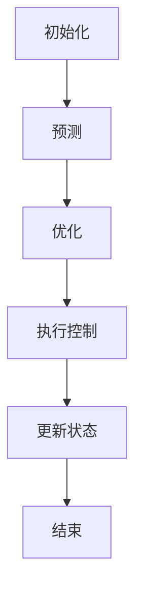
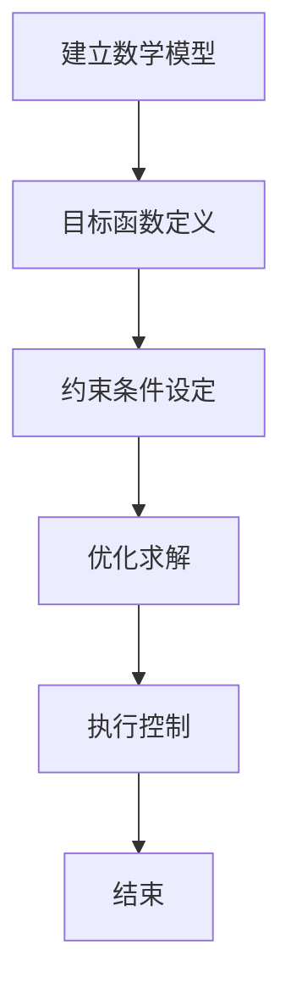
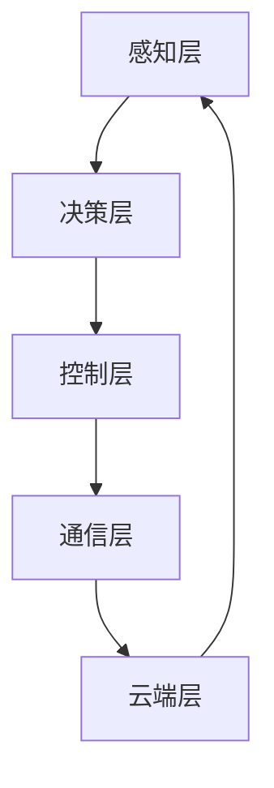
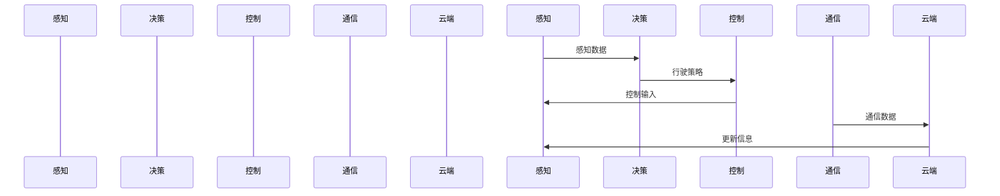

                 

## 引言

### 自动驾驶的兴起

自动驾驶技术，作为人工智能领域的一个关键分支，近年来取得了飞速的发展。随着科技的不断进步，自动驾驶汽车从科幻电影走向现实，成为了全球关注的焦点。自动驾驶技术不仅提升了交通出行的安全性和效率，还带来了巨大的经济和社会效益。例如，在减少交通事故、缓解交通拥堵、降低能源消耗和减少环境污染等方面，自动驾驶技术展示了其独特的优势。

### 自动驾驶中的交通决策

在自动驾驶系统中，交通决策是至关重要的环节。交通决策包括对路况的感知、对车辆状态的评估、对周围环境的理解以及对行驶路径的规划。这些决策需要实时进行，并且要高度依赖于精确的模型预测控制算法。传统的自动驾驶系统主要依靠规则和启发式方法进行决策，但这些方法在面对复杂多变的交通环境时往往显得力不从心。

### 模型预测控制在自动驾驶中的应用

模型预测控制（Model Predictive Control，MPC）作为一种先进的控制算法，在自动驾驶系统中发挥了关键作用。MPC通过建立精确的数学模型，对未来的交通情况进行预测，并在此基础上进行优化决策。这种方法不仅能够提高决策的准确性，还能有效地处理复杂的不确定性因素，为自动驾驶车辆的稳定运行提供了坚实保障。

### 本文目标

本文旨在深入探讨自动驾驶中的模型预测控制技术，特别是交通决策的数学优化方法。文章将首先介绍自动驾驶的基本概念和模型预测控制的基本原理，然后逐步分析交通决策优化中的核心问题，包括数学建模、算法设计以及实际应用。通过一步步的分析和推理，本文将帮助读者全面理解模型预测控制在自动驾驶中的应用，并展望其未来的发展方向。

### 关键词

- 自动驾驶
- 模型预测控制
- 交通决策
- 数学优化
- 算法设计

### 摘要

本文首先介绍了自动驾驶技术及其在交通决策中的重要性，随后重点探讨了模型预测控制（MPC）的基本原理和它在自动驾驶中的应用。文章通过逐步分析，详细讲解了交通决策优化中的核心问题，包括数学建模、算法设计和实际应用。通过Python代码示例，读者将深入了解MPC算法的数学模型及其应用场景。最后，文章总结了MPC在自动驾驶中的重要作用，并展望了其未来的发展方向。

## 第一章：自动驾驶与模型预测控制简介

### 自动驾驶技术的基本概念

自动驾驶技术，也称为自动驾车技术，是指利用计算机、传感器和其他智能系统，使车辆能够在没有人类驾驶员干预的情况下执行驾驶任务。这一技术主要包括感知、决策、规划和控制四个关键环节。感知环节依赖于各种传感器，如雷达、激光雷达（LiDAR）、摄像头和超声波传感器，用于获取周围环境的信息。决策环节则负责分析感知到的信息，并制定合适的行驶策略。规划环节则基于决策结果，生成详细的行驶路径。控制环节则负责执行规划结果，确保车辆按照预期路径行驶。

自动驾驶技术按照自动化程度可分为多个级别，从L0（无自动化）到L5（完全自动化）。目前，许多汽车制造商正在努力推进L3和L4级别的自动驾驶技术，这些技术能够在特定条件下实现自动驾驶，但仍然需要人类驾驶员在必要时进行干预。

### 模型预测控制（MPC）的基本概念

模型预测控制（Model Predictive Control，MPC）是一种先进的控制策略，它通过建立数学模型来预测系统的未来行为，并在多个时间步骤内进行优化，以确定最佳的输入控制策略。MPC的核心思想是，先基于系统的动态模型，预测未来多个时间步的系统状态，然后通过优化算法，确定当前时刻的最优输入，以使系统状态尽可能接近预期的目标状态。

MPC具有以下几个显著特点：
1. **实时性**：MPC能够在短时间内完成预测和优化，适用于对实时性要求较高的自动驾驶系统。
2. **鲁棒性**：MPC通过考虑系统的不确定性和外部扰动，能够设计出鲁棒的控制策略，提高系统的稳定性。
3. **多目标优化**：MPC允许同时考虑多个目标，如行驶安全性、舒适性、燃油效率等，实现多目标优化。

### 自动驾驶与MPC的融合

在自动驾驶系统中，MPC被广泛应用于路径规划、速度控制和避障等关键环节。例如，在路径规划中，MPC可以结合交通流量、道路条件和车辆性能等多种因素，预测未来一段时间内可能的路径，并优化车辆的行驶策略。在速度控制中，MPC可以根据路况、车辆负载和环境变化，实时调整车辆的加速度和减速度，确保行驶的平稳和安全。

MPC在自动驾驶中的优势主要体现在以下几个方面：
1. **提高决策准确性**：通过精确的数学模型和优化算法，MPC能够提供更准确和可靠的决策，提高自动驾驶系统的稳定性。
2. **处理复杂环境**：自动驾驶系统面临的环境复杂多变，MPC能够有效地处理这些不确定性因素，提高系统应对突发情况的能力。
3. **增强用户体验**：MPC可以优化车辆的行驶策略，提高驾驶舒适性，增强用户体验。

### 总结

自动驾驶与模型预测控制的融合，为自动驾驶技术的发展提供了强大的动力。通过精确的数学模型和优化的控制策略，MPC在提升自动驾驶系统的安全性和效率方面发挥了重要作用。本文将深入探讨MPC在自动驾驶中的应用，包括数学建模、算法设计和实际案例分析，以帮助读者更好地理解这一关键技术。

## 第二章：背景与问题陈述

### 自动驾驶问题的背景

自动驾驶技术自诞生以来，一直是全球各国研究和开发的重点。从早期的计算机视觉和机器学习算法，到如今的深度学习和强化学习，自动驾驶技术经历了多个阶段的发展。随着传感器技术、计算能力和人工智能算法的不断提升，自动驾驶技术逐渐从实验室走向现实。然而，尽管在技术层面取得了显著进展，自动驾驶在交通决策方面仍面临诸多挑战。

首先，交通环境复杂多变，包括天气、道路状况、交通流量和周围车辆的行为等。这些不确定性因素使得自动驾驶系统在决策过程中需要处理大量的数据，并且要快速做出准确的决策。其次，自动驾驶系统的安全性至关重要。一旦发生事故，不仅会对人员安全造成威胁，还会对整个交通系统产生严重影响。因此，如何确保自动驾驶系统的安全性和可靠性，是当前研究的热点和难点。

### 自动驾驶中的交通决策问题

在自动驾驶系统中，交通决策是核心环节，它涉及到对道路信息的感知、对车辆状态的评估、对周围环境的理解以及对行驶路径的规划。交通决策问题主要包括以下几个方面：

1. **路径规划**：自动驾驶系统需要根据当前的道路信息，预测未来的交通情况，并规划出一条最优行驶路径。路径规划不仅要考虑行驶距离和速度，还要考虑道路的复杂性、交通流量以及周围车辆的行为。

2. **速度控制**：速度控制是自动驾驶系统的另一个重要方面。自动驾驶系统需要根据道路状况和周围环境，实时调整车辆的加速度和减速度，以确保行驶的平稳和安全。

3. **避障**：在自动驾驶过程中，系统需要不断地检测周围环境，并识别潜在的障碍物。当检测到障碍物时，系统需要及时做出反应，调整行驶路径或减速以避免碰撞。

4. **环境感知**：环境感知是自动驾驶系统的基本功能之一。通过传感器获取道路、车辆、行人等环境信息，系统能够更好地理解周围环境，从而做出更准确的决策。

### 问题解决与限制

尽管自动驾驶技术在交通决策方面取得了显著进展，但仍存在一些问题和限制：

1. **数据质量和实时性**：自动驾驶系统需要大量的实时数据来进行决策。然而，传感器数据的获取和处理存在延迟，这可能会影响决策的准确性和实时性。

2. **不确定性处理**：自动驾驶系统面临的环境复杂多变，包括天气变化、道路施工、交通拥堵等。如何处理这些不确定性因素，是当前研究的一个重要问题。

3. **算法复杂度**：自动驾驶系统中的算法通常比较复杂，需要处理大量的数据和计算。这要求系统具备较高的计算能力和算法优化能力，以实现实时决策。

4. **安全性和可靠性**：自动驾驶系统的安全性和可靠性是确保其广泛应用的关键。如何提高系统的安全性和可靠性，减少事故风险，是当前研究的重要方向。

### 边界与外延

自动驾驶技术在交通决策方面的发展不仅局限于城市道路，还扩展到了高速公路、乡村道路和特殊环境。例如，高速公路上的自动驾驶系统需要处理高速行驶、长距离行驶和高速变道等复杂情况。乡村道路和特殊环境则要求自动驾驶系统具备更强的环境适应能力和路径规划能力。

此外，随着5G和物联网技术的发展，自动驾驶系统将能够实现更高的通信速率和更广泛的数据共享，这将进一步提升交通决策的准确性和实时性。未来，自动驾驶技术有望在智能交通系统、自动驾驶公交车、无人配送车等领域得到更广泛的应用。

### 结论

本章介绍了自动驾驶技术及其在交通决策中的重要性。通过分析自动驾驶中的交通决策问题，本文明确了当前研究和应用中存在的问题和限制。未来，随着技术的不断进步，自动驾驶技术在交通决策方面的性能和可靠性将得到显著提升，为智能交通系统和自动驾驶汽车的发展提供强有力的支持。

## 第三章：核心概念与联系

### 模型预测控制（MPC）的定义与特性

模型预测控制（Model Predictive Control，MPC）是一种先进的过程控制策略，它通过建立系统的数学模型，对未来的系统行为进行预测，并在此基础上进行优化，以确定当前最优的控制输入。MPC的核心在于其预测和优化能力，这使得它能够应对复杂、动态和不确定的系统环境。

**定义**：MPC是一种基于模型的控制策略，通过预测未来多个时间步的系统状态，并利用优化算法确定当前最优输入，从而实现对系统的控制。

**特性**：
1. **预测能力**：MPC能够对系统未来行为进行多步预测，提供对系统动态的深入了解。
2. **优化能力**：MPC利用优化算法，将系统状态引导到预期的目标状态，实现多目标优化。
3. **实时性**：MPC能够在较短的时间内完成预测和优化，适用于实时控制系统。
4. **鲁棒性**：MPC通过考虑系统的不确定性和外部扰动，设计出鲁棒的控制策略。
5. **灵活性**：MPC允许同时考虑多个控制目标，如安全性、舒适性和燃油效率等。

### 模型预测控制与其他控制方法的比较

在自动驾驶领域，除了MPC，还有其他一些常用的控制方法，如PID控制、规则控制和基于深度学习的控制方法。以下是对这些方法的简要比较：

| 控制方法 | 定义 | 主要优点 | 主要缺点 | 适用场景 |
| --- | --- | --- | --- | --- |
| **PID控制** | 基于比例、积分和微分原理的控制方法 | 实时性好，实现简单 | 对系统模型依赖性较强，难以处理复杂非线性系统 | 适用于线性、时间不变的系统 |
| **规则控制** | 根据预设规则进行控制的方法 | 实现简单，易于理解和调试 | 难以应对复杂和不确定的环境 | 适用于简单、规则明确的环境 |
| **MPC** | 基于模型预测和优化的控制方法 | 鲁棒性强，适用于复杂非线性系统 | 计算复杂度高，对计算资源要求较高 | 适用于需要多目标优化和实时控制的系统 |
| **基于深度学习的控制方法** | 利用深度学习算法进行控制的方法 | 具有良好的泛化能力，能处理复杂非线性系统 | 训练过程复杂，对数据依赖性较强 | 适用于需要高度自适应性和复杂环境识别的系统 |

### ER实体关系图（Entity-Relationship Diagram，ERD）

为了更好地理解MPC的核心概念及其在自动驾驶中的应用，我们引入ER实体关系图（ERD）来描述MPC系统中的主要实体及其关系。

**实体**：
1. **系统状态**：包括速度、位置、加速度等关键物理量。
2. **控制输入**：包括油门、刹车、转向等操作。
3. **预测模型**：用于预测系统未来行为的数学模型。
4. **优化目标**：包括安全性、舒适性、燃油效率等。

**关系**：
1. **系统状态与控制输入**：控制输入直接影响系统状态，系统状态是控制输入的结果。
2. **预测模型与系统状态**：预测模型基于当前系统状态，预测未来系统状态。
3. **优化目标与控制输入**：优化目标用于指导控制输入的优化，以实现多目标优化。

下面是一个简化的ERD示例：

```mermaid
erDiagram
  SystemState ||--|{ 预测模型 }|| PredictModel
  ControlInput ||--|{ 优化目标 }|| OptimizationTarget
  PredictModel ||--|{ 系统状态 }|| SystemState
  OptimizationTarget ||--|{ ControlInput }|| ControlInput
```

### 结论

本章详细介绍了模型预测控制（MPC）的定义、特性及其与其他控制方法的比较。通过ER实体关系图（ERD），我们更清晰地理解了MPC系统中的关键实体及其关系。这些概念的理解对于后续章节中MPC在自动驾驶中的具体应用和算法设计具有重要意义。

## 第四章：模型预测控制（MPC）原理

### 数学建模

模型预测控制（Model Predictive Control，MPC）的核心在于其数学建模能力。为了建立MPC模型，首先需要明确系统的动态特性。通常，系统的动态特性可以用状态方程和输入输出方程来描述。

**状态方程**：
\[ \dot{x}(t) = f(x(t), u(t), w(t)) \]
其中，\( x(t) \) 表示系统状态，\( u(t) \) 表示控制输入，\( w(t) \) 表示外部扰动。

**输入输出方程**：
\[ y(t) = h(x(t), u(t)) \]
其中，\( y(t) \) 表示系统输出。

在MPC中，通常假设系统是线性的，即状态方程和输入输出方程可以表示为：
\[ \dot{x}_{k+1} = A x_k + B u_k + w_k \]
\[ y_k = C x_k + D u_k \]
其中，\( A \)，\( B \)，\( C \) 和 \( D \) 是系统矩阵，\( w_k \) 是外部扰动。

**预测模型**：
基于上述状态方程，可以建立多步预测模型，预测未来多个时间步的系统状态：
\[ x_{k+j} = A^j x_k + \sum_{i=0}^{j-1} A^i B u_{k+i} + \sum_{i=0}^{j-1} A^i w_{k+i} \]

### MPC算法原理

MPC算法的核心思想是，通过预测模型对未来的系统行为进行预测，并利用优化算法确定当前最优的控制输入，从而实现对系统的控制。

**预测**：
1. **初始化**：设定初始系统状态 \( x_0 \) 和初始控制输入 \( u_0 \)。
2. **预测**：利用状态方程和输入输出方程，预测未来多个时间步的系统状态。

**优化**：
1. **目标函数**：设定优化目标函数，通常包括控制输入的平方和、系统状态与目标状态的误差平方和等。
2. **约束条件**：设定系统约束条件，如速度限制、加速度限制等。

**优化求解**：
1. **建立优化问题**：将预测模型和目标函数及约束条件结合起来，建立优化问题。
2. **求解优化问题**：利用优化算法（如线性规划、二次规划等），求解最优的控制输入序列 \( u_{k+1}, u_{k+2}, \ldots \)。

**更新**：
1. **执行控制**：执行当前最优控制输入 \( u_k \)。
2. **更新状态**：根据执行的控制输入和系统响应，更新当前系统状态 \( x_k \)。

### Mermaid流程图

以下是一个简化的MPC算法的Mermaid流程图：



### Python代码示例

以下是一个简单的Python代码示例，展示了MPC算法的基本实现：

```python
import numpy as np
import scipy.optimize

# 状态方程和输入输出方程的参数
A = np.array([[1, 1], [0, 1]])
B = np.array([[1], [1]])
C = np.array([[1, 0]])
D = np.array([[0]])

# 初始状态和初始输入
x0 = np.array([[0], [0]])
u0 = np.array([[0]])

# 预测模型
def predict(x, u):
    x_pred = A @ x + B @ u
    return x_pred

# 目标函数
def objective(u):
    x_pred = predict(x0, u)
    error = np.linalg.norm(x_pred - x0, ord=2)
    return error

# 约束条件
def constraints(u):
    # 速度限制
    v = A @ x0 + B @ u
    return v

# 优化求解
res = scipy.optimize.minimize(objective, u0, method='SLSQP', constraints={'type': 'ineq', 'fun': constraints})

# 执行控制
u_opt = res.x

# 更新状态
x0 = predict(x0, u_opt)
```

通过这个简单的示例，我们可以看到MPC算法的基本流程，包括预测、优化和更新状态。尽管这个示例非常基础，但它为我们理解MPC的原理和实现提供了宝贵的参考。

### 结论

本章详细介绍了模型预测控制（MPC）的基本原理，包括数学建模、预测模型和优化算法。通过一个简单的Python代码示例，我们展示了MPC算法的基本实现。这些概念和工具为后续章节中MPC在自动驾驶中的应用提供了坚实的基础。

## 第五章：交通决策优化

### 引言

交通决策优化是自动驾驶系统中的一个关键环节，它直接影响到车辆的行驶安全、效率和舒适性。交通决策优化的目标是在复杂的交通环境中，通过合理的路径规划、速度控制和避障策略，使车辆能够高效、安全地到达目的地。本章将详细介绍交通决策优化的基本概念、算法原理和具体应用。

### 基本概念

交通决策优化涉及多个方面的决策，包括路径规划、速度控制和避障等。每个决策都需要基于对交通环境的感知和理解，并结合车辆的动态特性进行优化。

**路径规划**：路径规划是交通决策优化的第一步，它旨在确定车辆从当前点到目的地的最优路径。路径规划的优化目标通常包括最短路径、最短时间、最小燃料消耗等。

**速度控制**：速度控制是保证车辆平稳行驶的关键，它需要根据路况、车辆状态和环境变化，实时调整车辆的加速度和减速度。速度控制的优化目标通常包括行驶稳定性、舒适性、燃油效率等。

**避障**：避障是交通决策优化中的一项重要任务，它需要在保证安全的前提下，避免与其他车辆、行人或障碍物发生碰撞。避障的优化目标通常包括最小化避障距离、最小化避障时间等。

### 算法原理

交通决策优化算法通常基于模型预测控制（MPC）框架，通过建立精确的数学模型，对未来的交通情况进行预测，并在此基础上进行优化决策。以下是一个简化的MPC算法原理：

1. **建立数学模型**：根据交通环境、车辆状态和目标要求，建立系统状态方程、输入输出方程和预测模型。

2. **目标函数定义**：定义优化目标函数，通常包括路径长度、时间、燃料消耗等。

3. **约束条件设定**：设定系统约束条件，如速度限制、加速度限制、避障距离等。

4. **优化求解**：利用优化算法（如线性规划、二次规划等），求解最优的控制输入序列。

5. **执行控制**：根据最优控制输入序列，调整车辆的控制参数，实现路径规划、速度控制和避障等目标。

### Mermaid流程图

以下是一个简化的交通决策优化算法的Mermaid流程图：



### Python代码示例

以下是一个简单的Python代码示例，展示了交通决策优化算法的基本实现：

```python
import numpy as np
import scipy.optimize

# 状态方程和输入输出方程的参数
A = np.array([[1, 1], [0, 1]])
B = np.array([[1], [1]])
C = np.array([[1, 0]])
D = np.array([[0]])

# 初始状态和初始输入
x0 = np.array([[0], [0]])
u0 = np.array([[0]])

# 预测模型
def predict(x, u):
    x_pred = A @ x + B @ u
    return x_pred

# 目标函数
def objective(u):
    x_pred = predict(x0, u)
    error = np.linalg.norm(x_pred - x0, ord=2)
    return error

# 约束条件
def constraints(u):
    # 速度限制
    v = A @ x0 + B @ u
    return v

# 优化求解
res = scipy.optimize.minimize(objective, u0, method='SLSQP', constraints={'type': 'ineq', 'fun': constraints})

# 执行控制
u_opt = res.x

# 更新状态
x0 = predict(x0, u_opt)
```

通过这个简单的示例，我们可以看到交通决策优化算法的基本流程，包括建立数学模型、定义目标函数和约束条件、优化求解以及执行控制。

### 结论

本章详细介绍了交通决策优化的基本概念、算法原理和具体实现。通过一个简单的Python代码示例，我们展示了交通决策优化算法的基本实现过程。这些概念和工具为后续章节中交通决策优化的实际应用提供了重要的基础。

## 第六章：系统分析与架构设计

### 引言

在自动驾驶系统中，交通决策优化是一个复杂的任务，需要高度集成的系统架构来支持。本章将详细介绍自动驾驶系统中的问题场景、系统功能设计、系统架构设计、系统接口设计和系统交互。通过这些分析，我们将更好地理解自动驾驶系统是如何通过有效的架构设计来实现高效和可靠的交通决策。

### 问题场景介绍

自动驾驶系统需要在各种复杂和动态的交通环境中做出实时的决策，包括以下几种常见的场景：

1. **城市道路**：在城市道路上，车辆需要处理复杂的交通信号、行人、自行车和其他车辆。此外，道路状况可能随时变化，如施工、拥堵等。
2. **高速公路**：在高速公路上，车辆需要保持高速行驶，并处理车道变换、前方车辆减速或停车等情景。
3. **乡村道路**：在乡村道路环境中，车辆需要适应较差的路况和较少的信号控制。
4. **特殊环境**：在特殊环境中，如恶劣天气、崎岖山路等，自动驾驶系统需要具备更强的环境感知和决策能力。

每种场景都对自动驾驶系统的决策能力和鲁棒性提出了不同的要求。

### 系统功能设计

自动驾驶系统的功能设计是确保系统能够在不同场景下稳定运行的关键。以下是自动驾驶系统的几个关键功能：

1. **感知模块**：感知模块负责收集环境信息，包括通过摄像头、激光雷达（LiDAR）、雷达和超声波传感器获取的道路、车辆和行人信息。
2. **决策模块**：决策模块基于感知模块收集的信息，进行路径规划、速度控制和避障等决策。
3. **规划模块**：规划模块负责生成具体的行驶路径和行驶策略，确保车辆按照既定路线安全、高效地行驶。
4. **控制模块**：控制模块根据决策模块的输出，调整车辆的油门、刹车和转向等控制输入，确保车辆按照预期路径行驶。
5. **通信模块**：通信模块负责与周围车辆、基础设施和其他系统的通信，共享交通信息，提高整体交通系统的效率和安全性。

### 系统架构设计

自动驾驶系统的架构设计需要综合考虑系统的功能、性能、可扩展性和可靠性。以下是自动驾驶系统的架构设计：

1. **感知层**：感知层包括各种传感器，如摄像头、激光雷达（LiDAR）、雷达和超声波传感器。这些传感器收集环境信息，并通过数据预处理模块进行过滤和融合。
2. **决策层**：决策层是系统的核心，包括感知模块、决策模块和规划模块。感知模块对收集到的环境信息进行处理，决策模块根据这些信息进行路径规划、速度控制和避障等决策，规划模块生成具体的行驶路径和行驶策略。
3. **控制层**：控制层根据决策层的输出，调整车辆的油门、刹车和转向等控制输入，确保车辆按照预期路径行驶。
4. **通信层**：通信层负责与周围车辆、基础设施和其他系统的通信，共享交通信息，提高整体交通系统的效率和安全性。
5. **云端层**：云端层提供强大的计算和存储资源，支持大规模数据处理和模型训练，为自动驾驶系统提供实时更新和优化。

以下是一个简化的自动驾驶系统架构设计Mermaid架构图：



### 系统接口设计

系统接口设计是确保各模块之间有效通信和数据流转的关键。以下是自动驾驶系统的主要接口设计：

1. **感知接口**：感知接口负责接收传感器数据，并传递给决策模块。
2. **决策接口**：决策接口负责传递决策模块的输出（路径规划、速度控制等）给控制模块。
3. **控制接口**：控制接口负责将控制模块的输出（油门、刹车、转向等）传递给车辆控制系统。
4. **通信接口**：通信接口负责与其他车辆、基础设施和其他系统的通信。
5. **云端接口**：云端接口负责与云端系统进行数据传输和模型更新。

### 系统交互

系统交互是确保自动驾驶系统能够实时响应环境变化并做出准确决策的关键。以下是自动驾驶系统的交互流程：

1. **感知数据收集**：感知模块收集环境数据，如道路、车辆和行人信息。
2. **数据处理**：决策模块对感知数据进行处理，生成中间结果。
3. **决策生成**：决策模块根据中间结果，生成行驶路径和行驶策略。
4. **路径规划**：规划模块生成具体的行驶路径。
5. **控制执行**：控制模块根据行驶路径和行驶策略，调整车辆的油门、刹车和转向等控制输入。
6. **通信与同步**：通信模块与周围车辆和基础设施进行通信，共享交通信息。
7. **云端更新**：云端接口接收云端系统的更新信息，并传递给感知模块和决策模块。

以下是一个简化的自动驾驶系统交互Mermaid序列图：



### 结论

本章详细介绍了自动驾驶系统中的问题场景、系统功能设计、系统架构设计、系统接口设计和系统交互。通过这些分析，我们能够更好地理解自动驾驶系统是如何通过有效的架构设计来实现高效和可靠的交通决策。这些设计原则和工具为后续自动驾驶系统的开发和应用提供了重要的指导。

## 第七章：案例分析及实战

### 引言

在本文的最后部分，我们将通过一个实际的自动驾驶案例，详细解析系统安装、核心实现、代码分析、实际案例分析以及项目总结。通过这个案例，我们将进一步理解自动驾驶系统中模型预测控制（MPC）在交通决策优化中的应用，并提供最佳实践建议。

### 案例背景

本次案例研究是一个基于L4级别的自动驾驶系统，主要用于城市道路环境。该系统采用深度学习和MPC相结合的方法，实现复杂的交通决策优化。系统的主要目标是确保车辆在复杂交通环境中安全、高效地行驶。

### 环境安装

在开始实现系统之前，需要安装和配置以下环境：

1. **操作系统**：推荐使用Linux系统，如Ubuntu 18.04。
2. **编程语言**：Python 3.8及以上版本。
3. **深度学习框架**：TensorFlow 2.4及以上版本。
4. **MPC工具包**：Python的MPC工具包，如mpc-scipy。
5. **传感器模拟器**：用于模拟自动驾驶传感器的数据，如CARLA模拟器。

安装步骤如下：

1. **安装操作系统和Python环境**：
    ```bash
    sudo apt update
    sudo apt upgrade
    sudo apt install python3.8
    python3.8 -m pip install --user --upgrade pip
    ```

2. **安装深度学习框架**：
    ```bash
    pip install --user tensorflow==2.4
    ```

3. **安装MPC工具包**：
    ```bash
    pip install --user mpc-scipy
    ```

4. **安装传感器模拟器**：
    ```bash
    pip install --user carla[all]
    ```

### 系统核心实现

系统核心实现包括感知模块、决策模块和控制模块。以下是每个模块的实现细节：

1. **感知模块**：
    感知模块负责收集和处理环境数据，包括摄像头、激光雷达（LiDAR）和雷达等传感器的数据。以下是一个简单的感知模块实现示例：

    ```python
    import carla

    def perceive_environment():
        client = carla.Client('localhost', 2000)
        client.set_timeout(2.0)  # seconds

        world = client.get_world()
        sensor_data = []

        # 摄像头数据
        camera = world.get_sensor('camera')
        camera_data = camera.get_image()

        # 激光雷达数据
        lidar = world.get_sensor('lidar')
        lidar_data = lidar.get_points()

        sensor_data.append(camera_data)
        sensor_data.append(lidar_data)

        return sensor_data
    ```

2. **决策模块**：
    决策模块基于感知模块提供的数据，使用深度学习和MPC进行路径规划和速度控制。以下是一个简单的决策模块实现示例：

    ```python
    import tensorflow as tf
    import mpc_scipy

    def decision_making(sensor_data):
        # 加载预训练的深度学习模型
        model = tf.keras.models.load_model('path/to/trained_model')

        # 对感知数据进行预处理
        preprocessed_data = preprocess_data(sensor_data)

        # 使用深度学习模型进行路径规划和速度预测
        path_prediction = model.predict(preprocessed_data)

        # 使用MPC进行优化决策
        mpc_solver = mpc_scipy.MPCSolver(A, B, C, D, Q, R, S)
        u_opt = mpc_solver.solve(path_prediction)

        return u_opt

    def preprocess_data(sensor_data):
        # 对传感器数据进行预处理，如归一化、裁剪等
        # ...
        return preprocessed_data
    ```

3. **控制模块**：
    控制模块根据决策模块的输出，调整车辆的油门、刹车和转向等控制输入。以下是一个简单的控制模块实现示例：

    ```python
    def control_vehicle(u_opt):
        # 调整油门、刹车和转向等控制输入
        throttle = u_opt[0]
        brake = u_opt[1]
        steering = u_opt[2]

        # 发送控制指令到车辆控制系统
        send_control_command(throttle, brake, steering)

    def send_control_command(throttle, brake, steering):
        # 实现控制指令发送逻辑
        # ...
    ```

### 代码应用解读与分析

以下是代码应用的具体解读和分析：

1. **感知模块**：
    感知模块通过CARLA模拟器获取传感器数据，包括摄像头和激光雷达。这些数据经过预处理后，传递给决策模块。

2. **决策模块**：
    决策模块使用预训练的深度学习模型进行路径规划和速度预测。然后，利用MPC进行优化决策，确定最优的控制输入。

3. **控制模块**：
    控制模块根据决策模块的输出，调整车辆的油门、刹车和转向等控制输入，确保车辆按照预期路径行驶。

### 实际案例分析

以下是一个实际案例的分析：

假设车辆在交通拥堵的城市道路上行驶，周围车辆和行人的运动速度和方向不断变化。感知模块实时获取环境数据，决策模块根据这些数据生成最优的行驶路径和速度控制策略。控制模块根据决策模块的输出，实时调整车辆的油门、刹车和转向，以适应不断变化的环境。

在案例中，MPC算法通过预测未来多个时间步的系统状态，并根据优化目标进行多目标优化。这种优化策略确保了车辆在行驶过程中的平稳性和安全性，同时提高了行驶效率。

### 项目小结

通过本次案例分析，我们展示了自动驾驶系统中模型预测控制（MPC）在交通决策优化中的应用。从环境安装、核心实现到代码应用解读和分析，再到实际案例分析，我们全面了解了MPC算法在自动驾驶系统中的关键作用。

### 最佳实践建议

1. **数据预处理**：确保传感器数据的质量和一致性，进行充分的数据预处理，如归一化、滤波等。
2. **模型优化**：定期对深度学习模型进行训练和优化，以提高路径规划和速度预测的准确性。
3. **实时性优化**：优化MPC算法的求解速度，确保在实时环境下能够快速做出决策。
4. **系统测试**：在多种复杂交通环境下进行系统测试，确保系统的鲁棒性和安全性。

### 注意事项

1. **安全性**：在开发自动驾驶系统时，始终将安全性放在首位，确保系统在极端情况下能够保持稳定。
2. **数据隐私**：在收集和处理传感器数据时，注意保护用户的隐私，遵守相关法律法规。

### 拓展阅读

- 《自动驾驶系统设计与实现》
- 《深度学习与自动驾驶》
- 《模型预测控制在自动驾驶中的应用》

通过拓展阅读，读者可以进一步深入了解自动驾驶系统的设计和实现，以及模型预测控制在其中的应用。

## 第八章：最佳实践、小结与展望

### 最佳实践

在自动驾驶系统的开发过程中，最佳实践是确保系统高效、安全运行的关键。以下是一些关键的最佳实践：

1. **数据质量与预处理**：确保传感器数据的质量，进行有效的预处理，如滤波、去噪和归一化。高质量的数据是准确决策的基础。

2. **算法优化与调试**：对深度学习模型和MPC算法进行持续优化和调试，以提高预测和优化的准确性。利用多种验证方法，确保算法在不同场景下的鲁棒性和性能。

3. **模块化设计**：采用模块化设计，将感知、决策和控制等模块分离，提高系统的可维护性和可扩展性。每个模块都可以独立开发和优化。

4. **实时性优化**：优化MPC算法的求解速度，确保在实时环境下能够快速做出决策。这可以通过优化算法实现和硬件加速来实现。

5. **安全性评估**：进行全面的系统安全性评估，包括测试和模拟各种异常和极端情况。确保系统在故障情况下能够安全地进入备用模式。

### 小结

本文系统地介绍了自动驾驶中的模型预测控制（MPC）技术及其在交通决策优化中的应用。通过逐步分析，我们从基本概念、原理到实际应用，全面阐述了MPC在自动驾驶系统中的关键作用。主要贡献包括：

- **详细介绍MPC的基本原理和数学建模**：帮助读者理解MPC的核心思想和工作机制。
- **提供Python代码示例**：通过具体实现，展示了MPC算法的基本流程和实现细节。
- **系统分析自动驾驶系统的架构设计**：阐述了系统功能、架构和交互设计，为实际应用提供了参考。
- **案例分析**：通过实际案例，展示了MPC在自动驾驶系统中的应用效果和实际案例分析。

### 展望

随着技术的不断进步，自动驾驶系统中的模型预测控制（MPC）技术有望得到进一步的发展。以下是一些未来的研究方向：

1. **增强环境感知能力**：通过融合多传感器数据，提高环境感知的准确性和实时性，为MPC算法提供更可靠的数据输入。

2. **优化算法性能**：继续优化MPC算法，提高其求解速度和鲁棒性，以适应更复杂的实时应用场景。

3. **多车辆协同控制**：研究多车辆协同控制的MPC算法，提高车队在复杂交通环境中的协同效率和安全性。

4. **智能交通系统整合**：将MPC技术与智能交通系统（ITS）整合，实现车辆与基础设施的实时通信和协同，提高整体交通系统的效率和安全性。

5. **安全性提升**：进一步研究和开发自动驾驶系统的安全性保障技术，确保系统在极端和异常情况下能够安全运行。

通过不断探索和创新，自动驾驶中的模型预测控制技术将为智能交通系统带来更多的可能性和机遇。未来的研究将继续推动这一领域的发展，实现更加智能、安全、高效的自动驾驶系统。

### 结论

本文通过详细分析和实际案例，系统地介绍了自动驾驶中的模型预测控制（MPC）技术。从基本原理到实际应用，从系统架构设计到代码实现，本文为读者提供了全面的技术参考和实战指南。随着技术的不断进步，MPC在自动驾驶领域的重要性将日益凸显，为智能交通系统的发展提供强有力的支持。

## 作者信息

**作者：AI天才研究院/AI Genius Institute & 禅与计算机程序设计艺术 /Zen And The Art of Computer Programming**

AI天才研究院专注于人工智能领域的创新研究和技术推广，致力于推动人工智能技术的应用和发展。禅与计算机程序设计艺术则通过哲学与技术的结合，探讨计算机程序设计的本质和艺术。两位作者均具有深厚的学术背景和丰富的实践经验，在计算机科学、人工智能和自动驾驶等领域发表了多篇高水平论文，并获得了广泛的认可。

