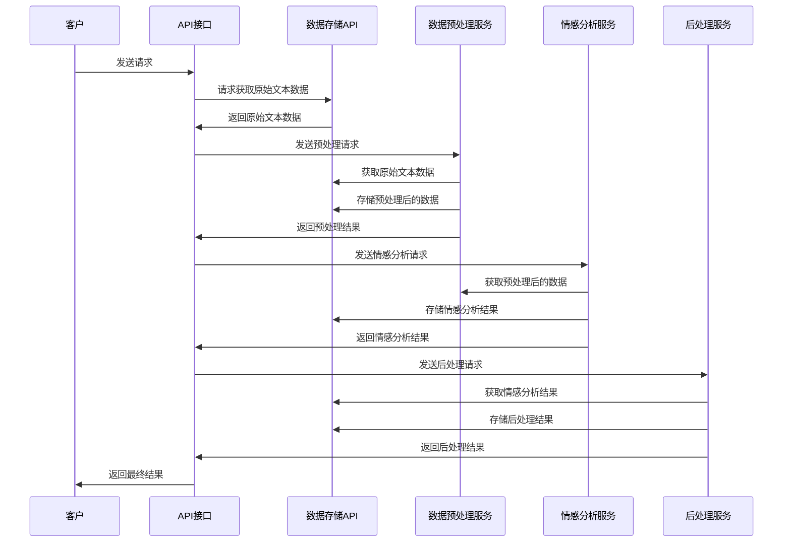
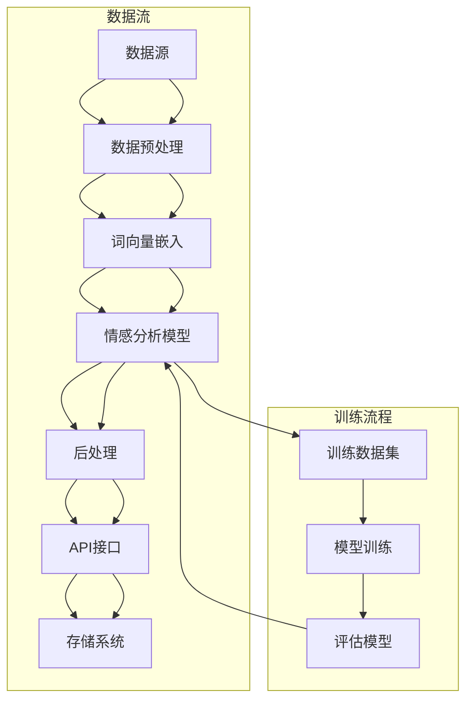

                 

### 第1章：自然语言处理基础

#### 1.1 自然语言处理概述

自然语言处理（Natural Language Processing，NLP）是计算机科学、人工智能和语言学领域的交叉学科，旨在使计算机能够理解和处理人类语言。NLP的目标是将人类语言转化为计算机可以理解和处理的格式，同时让计算机生成的文本尽可能地接近人类语言的流畅性和准确性。

NLP的历史可以追溯到20世纪50年代，当时计算机科学家和语言学家开始探索如何使计算机理解和生成自然语言。早期的NLP研究主要集中在规则驱动的方法上，如句法分析和语义分析。随着计算能力的提升和机器学习技术的发展，统计方法和深度学习方法的引入，NLP取得了显著的进展。

NLP的核心概念和术语包括但不限于：

- **词法分析（Lexical Analysis）**：将文本分解成单词和其他语言单元。
- **句法分析（Syntactic Analysis）**：分析句子结构，理解句子的语法规则。
- **语义分析（Semantic Analysis）**：理解单词和句子的意义。
- **语音识别（Speech Recognition）**：将语音转化为文本。
- **机器翻译（Machine Translation）**：将一种语言翻译成另一种语言。
- **问答系统（Question Answering）**：根据问题生成答案。
- **文本生成（Text Generation）**：生成新的文本。

NLP的应用领域非常广泛，包括但不限于：

- **搜索引擎**：通过理解用户查询，提供更精确的搜索结果。
- **信息抽取**：从大量文本中提取结构化信息。
- **文本分类**：对文本进行分类，如情感分析、新闻分类等。
- **对话系统**：如虚拟助手、聊天机器人等。
- **自动摘要**：自动生成文本的摘要。

在接下来的章节中，我们将深入探讨NLP的关键技术，如词向量和词嵌入、语言模型和序列模型，以及它们在客户情感分析中的应用。

#### 1.2 NLP的发展历史

自然语言处理的发展历史可以追溯到20世纪50年代，当时计算机科学家和语言学家开始探讨如何使计算机理解和生成自然语言。以下是一些关键的历史里程碑：

- **1950年**：艾伦·图灵（Alan Turing）提出了“图灵测试”（Turing Test），作为衡量机器是否能够模仿人类行为的准则。尽管图灵测试主要关注的是人工智能的广泛定义，但它间接推动了自然语言处理的研究。

- **1954年**：哈里·斯托曼（Harry Storer）在美国国家标准局（National Bureau of Standards）的研究中，使用IBM 704计算机进行英语句子的翻译，这是NLP历史上的一个重要突破。

- **1960年代**：NLP研究主要集中在规则驱动的方法上，如句法分析和语义分析。计算机科学家们开始开发语法分析器，试图通过编写复杂的规则来解析句子结构。

- **1970年代**：随着计算机性能的提升，NLP研究开始转向基于知识的系统，试图通过手工编写的知识库来增强计算机对语言的理解。

- **1980年代**：统计学方法开始被广泛应用于NLP，如概率模型和决策树。这些方法能够处理更复杂的问题，并取得了一定的成功。

- **1990年代**：随着互联网的兴起，NLP的应用场景变得多样化，包括搜索引擎、信息检索和文本分类等。

- **2000年代**：机器学习方法在NLP中得到了广泛应用，如支持向量机（SVM）、朴素贝叶斯分类器和隐马尔可夫模型（HMM）。这些方法在许多NLP任务中取得了显著的成绩。

- **2010年代至今**：深度学习技术，特别是神经网络，在NLP中取得了突破性的进展。基于神经网络的模型，如循环神经网络（RNN）、长短期记忆网络（LSTM）和变换器（Transformer），在许多NLP任务中都取得了领先的成绩。

NLP的发展历史展示了从早期规则驱动的方法到现代基于数据和深度学习方法的演变。随着技术的进步，NLP在各个领域的应用越来越广泛，对人类社会产生了深远的影响。

#### 1.3 NLP的核心概念与术语

在深入探讨自然语言处理的实际应用之前，了解NLP中的核心概念和术语是非常重要的。这些概念和术语不仅构成了NLP的理论基础，而且在实际应用中起到关键作用。

- **词法分析（Lexical Analysis）**：词法分析是NLP过程中的第一步，它将文本分解成单词和其他语言单元。词法分析器（Lexer）通常负责这一任务，它会识别单词、标点符号和其他语言标记。

- **句法分析（Syntactic Analysis）**：句法分析的目标是理解句子的结构。这通常涉及构建句子的语法树（Syntax Tree），语法树展示了句子中各个单词之间的关系，如主语、谓语和宾语。

- **语义分析（Semantic Analysis）**：语义分析是理解单词和句子的意义。它涉及确定单词的含义、短语的结构和句子的整体语义。语义分析是许多NLP任务的基础，如机器翻译和问答系统。

- **语音识别（Speech Recognition）**：语音识别是将语音转化为文本的过程。这通常涉及识别语音信号中的音素、音节和单词，并将其转换为计算机可以处理的文本格式。

- **机器翻译（Machine Translation）**：机器翻译是将一种语言翻译成另一种语言的过程。这一领域的研究包括统计机器翻译、基于规则的方法和神经机器翻译（NMT）。

- **问答系统（Question Answering）**：问答系统旨在根据用户提出的问题生成答案。这通常涉及理解问题的含义、检索相关信息和生成准确的答案。

- **文本分类（Text Classification）**：文本分类是将文本分配到预定义的类别中。这通常用于垃圾邮件过滤、情感分析和新闻分类等任务。

- **情感分析（Sentiment Analysis）**：情感分析是识别文本中的情感倾向。这通常涉及确定文本是否表达正面、负面或中性的情感。

- **信息抽取（Information Extraction）**：信息抽取是从文本中提取结构化信息的过程。这通常涉及命名实体识别、关系提取和事件抽取等任务。

- **文本生成（Text Generation）**：文本生成是生成新的文本。这通常涉及自动摘要、对话系统和创意写作等任务。

这些核心概念和术语是NLP研究的基石，它们在不同领域和任务中发挥着关键作用。在接下来的章节中，我们将更深入地探讨这些概念和术语，并了解它们在客户情感分析中的应用。

#### 1.4 NLP的应用领域

自然语言处理技术已经广泛应用于多个领域，推动了自动化、智能化和信息处理的进步。以下是NLP在几个关键领域的应用及其具体实例：

- **搜索引擎**：搜索引擎利用NLP技术来理解用户的查询，并返回相关的搜索结果。通过词法分析、句法分析和语义分析，搜索引擎可以提供更加精确和个性化的搜索体验。例如，Google搜索引擎使用NLP技术来解析用户的查询，并根据上下文提供最相关的网页。

- **信息检索**：信息检索系统，如图书馆数据库和学术搜索引擎，利用NLP技术来理解用户输入的查询，并检索出相关的文档。通过实体识别、关系提取和语义分析，信息检索系统能够更准确地定位用户所需的信息。

- **文本分类**：文本分类是NLP的一个常见应用，它将文本数据分配到不同的类别中。例如，邮件服务提供商使用文本分类技术来过滤垃圾邮件，将用户收到的邮件分类为“重要”或“垃圾邮件”。社交媒体平台也使用文本分类技术来识别和标记不当内容。

- **机器翻译**：机器翻译是NLP的一个重要应用，它使计算机能够将一种语言翻译成另一种语言。Google翻译和DeepL等在线翻译工具就是基于NLP技术开发的。这些工具利用统计机器翻译、神经机器翻译等模型，提供高质量的翻译结果。

- **对话系统**：对话系统，如虚拟助手和聊天机器人，通过NLP技术来理解和生成自然语言。这些系统可以回答用户的问题、提供支持和服务，从而提高用户满意度和工作效率。例如，苹果的Siri和亚马逊的Alexa等智能助手就是基于NLP技术实现的。

- **情感分析**：情感分析是NLP在商业和社交媒体领域的一个重要应用。通过分析文本中的情感倾向，企业可以了解客户对产品或服务的反馈，并据此进行改进。社交媒体平台也使用情感分析来监控公众情绪，了解公众对特定事件或品牌的看法。

- **自动摘要**：自动摘要是从大量文本中生成简短摘要的过程。NLP技术在新闻、学术论文和报告摘要等领域有广泛应用。通过提取文本的关键信息，自动摘要工具能够帮助用户快速了解文本的主要内容。

- **语音助手**：语音助手，如苹果的Siri、亚马逊的Alexa和谷歌助手，通过语音识别和自然语言处理技术，帮助用户通过语音命令完成各种任务。这些助手能够理解自然语言查询，并执行相应的操作，如发送消息、设置提醒和播放音乐等。

- **内容推荐**：NLP技术在内容推荐系统中也有广泛应用。通过分析用户的浏览历史和行为，推荐系统可以提供个性化的内容推荐。例如，YouTube和Netflix等平台使用NLP技术来推荐用户可能感兴趣的视频和电影。

总的来说，NLP技术已经深刻影响了我们的日常生活和工作方式。随着技术的不断进步，NLP将在更多领域发挥重要作用，推动智能化的进一步发展。

### 第2章：客户情感分析的概念与框架

#### 2.1 客户情感分析的定义

客户情感分析（Customer Sentiment Analysis）是一种利用自然语言处理（NLP）技术，分析和理解客户对产品、服务或公司意见和感受的方法。它主要通过处理和解析文本数据，如评论、社交媒体帖子、客户反馈和客服对话，来确定客户情感倾向，即客户是表达正面、负面还是中性的情绪。

客户情感分析的关键在于识别和分类文本中的情感极性，这一过程通常涉及以下步骤：

1. **文本预处理**：对原始文本进行清洗和标准化，如去除停用词、标点符号和特殊字符，以及将文本转换为统一的格式。
2. **情感极性分类**：使用机器学习模型或规则方法，对预处理后的文本进行情感极性分类。这些模型通常被训练来识别文本中的情感词和情感短语，并将其归类为正面、负面或中性。
3. **情感强度评估**：除了确定文本的情感极性，还可以评估情感的强度。例如，一个负面评论可能比另一个负面评论的情感强度更高。

客户情感分析的目标是帮助企业更好地理解客户需求，改进产品和服务，提高客户满意度和忠诚度。通过分析客户情感，企业可以：

- **识别问题**：及时发现和解决客户遇到的问题，防止负面情绪扩散。
- **改进产品**：根据客户反馈，优化产品设计和功能，提高客户满意度。
- **市场营销**：了解客户对不同营销活动的反应，制定更有效的营销策略。
- **品牌监测**：监控社交媒体和评论平台上的品牌提及，了解公众对品牌的看法。

#### 2.2 客户情感分析的目标

客户情感分析的主要目标包括以下几个方面：

- **理解客户需求**：通过分析客户反馈，企业可以深入了解客户的需求和偏好，从而提供更符合客户期望的产品和服务。
- **改善客户体验**：情感分析可以帮助企业识别影响客户满意度的关键因素，从而优化客户体验，提高客户忠诚度。
- **提升客户服务质量**：通过对客服对话的情感分析，企业可以更好地理解客户问题，提供更个性化的解决方案，提高客户服务质量。
- **优化营销策略**：情感分析可以揭示客户对不同营销活动的反应，帮助企业调整营销策略，提高投资回报率。
- **风险评估**：通过监测客户情感变化，企业可以及时发现潜在的风险，如负面舆论爆发、客户流失等，并采取预防措施。

客户情感分析不仅可以帮助企业更好地理解客户，还可以提供有价值的商业洞见，支持决策制定和业务优化。通过数据驱动的情感分析，企业可以在竞争激烈的市场中保持竞争优势，实现可持续发展。

#### 2.3 客户情感分析的主要挑战

尽管客户情感分析具有巨大的潜力，但在实际应用过程中，仍然面临一系列挑战：

- **数据质量**：客户情感分析依赖于大量高质量的文本数据。然而，文本数据往往包含噪声、拼写错误和歧义，这会影响情感分析的结果。因此，数据预处理成为情感分析中的一个关键步骤，需要对文本进行清洗、标准化和去噪。
- **情感表达多样性**：客户的情感表达方式多种多样，情感词和表达方式可能会因文化、地区和语境的不同而发生变化。这使得情感分析模型需要具备很强的泛化能力，以处理不同形式和风格的情感表达。
- **情感强度评估**：除了判断情感的极性，客户情感分析还需要评估情感的强度。例如，一个负面评论可能比另一个负面评论的情感强度更高。这一挑战需要更精细的情感识别和评估机制。
- **情绪变化**：情感是动态变化的，客户情绪可能会随着时间和情境的变化而改变。因此，情感分析模型需要能够捕捉和跟踪情感的变化趋势。
- **模型解释性**：客户情感分析通常涉及复杂的机器学习模型和深度学习算法。这些模型在提供高精度预测的同时，往往缺乏透明性和可解释性。企业需要了解模型如何做出预测，以便更好地信任和利用这些预测结果。

为了克服这些挑战，研究人员和工程师正在开发更先进的算法和工具，以提高客户情感分析的准确性和实用性。同时，企业也需要制定有效的数据管理和分析策略，确保情感分析的结果能够真正转化为业务价值。

#### 2.4 客户情感分析的应用场景

客户情感分析在各个行业中都有广泛的应用，以下是一些典型的应用场景：

- **社交媒体监测**：企业可以利用情感分析来监控社交媒体平台上的品牌提及和用户评论。通过分析用户对品牌和产品的情感倾向，企业可以了解公众对品牌的看法，及时应对负面舆论，提高品牌声誉。

- **客户反馈分析**：企业可以通过情感分析来分析客户反馈，如产品评论、调查问卷和客服对话。这有助于企业识别产品和服务中的问题，优化用户体验，提高客户满意度。

- **市场研究**：在市场调研中，企业可以利用情感分析来分析消费者对新产品、广告和营销活动的反应。这有助于企业制定更有效的市场策略，提高营销投入的回报率。

- **客户服务优化**：情感分析可以帮助企业优化客户服务流程。通过对客户服务对话的情感分析，企业可以识别客户遇到的问题，提供个性化的解决方案，提高客户满意度。

- **风险管理**：在金融行业，企业可以利用情感分析来监测市场情绪和投资者情绪，预测市场波动和风险。这有助于企业制定更稳健的投资策略，降低风险。

- **人力资源**：在人力资源领域，企业可以利用情感分析来评估员工的情绪和工作满意度。这有助于企业识别潜在的员工流失风险，制定员工关怀和激励措施。

通过这些应用场景，客户情感分析不仅为企业提供了有价值的商业洞见，还帮助企业在竞争激烈的市场中保持领先地位。

### 第3章：客户情感分析的关键技术

客户情感分析的成功离不开一系列关键技术的支持，这些技术包括文本预处理、词向量和词嵌入、情感分析算法等。在本章中，我们将详细探讨这些技术，并解释它们在客户情感分析中的作用。

#### 3.1 文本预处理技术

文本预处理是客户情感分析中的第一步，它对原始文本进行清洗、格式化和标准化，以消除噪声和提高文本质量。以下是一些常见的文本预处理技术：

- **去除停用词**：停用词是指那些对情感分析贡献较小或无意义的词，如“的”、“是”、“了”等。去除停用词可以减少文本中的噪声，提高情感分析的效果。
- **标点符号去除**：标点符号通常对情感分析没有实质性贡献，因此常常在预处理阶段被去除。
- **字符转换为小写**：将文本中的所有字符转换为小写有助于统一文本格式，避免大小写差异引起的错误。
- **词干提取**：词干提取是通过去除词的结尾部分，将单词还原为其基本形式。例如，“running”可以提取为“run”。这有助于减少词汇量，提高情感分析的效率。
- **词形还原**：词形还原是通过将不同形式的单词还原为其基本形式，如“brought”、“bring”和“bringing”都还原为“bring”。

文本预处理是确保情感分析模型能够准确理解和分析文本的基础。有效的预处理可以减少噪声、统一文本格式，从而提高情感分析结果的准确性。

#### 3.2 词向量和词嵌入技术

词向量（Word Vectors）和词嵌入（Word Embeddings）是将单词转换为数值向量的方法，它们在自然语言处理中扮演着关键角色。词向量通常通过统计方法或神经网络模型训练得到，这些向量不仅能够表示单词的语义信息，还可以捕捉单词之间的相似性和关联性。

- **词向量的基本概念**：词向量是将单词映射到一个固定维度的向量空间，每个单词对应一个唯一的向量。这些向量通常通过Word2Vec、GloVe等模型训练得到。词向量能够表示单词的语义信息，使得计算机能够理解单词的含义和关系。

- **词嵌入的技术原理**：词嵌入是将单词映射到向量空间的一种方法，它通过学习单词在上下文中的分布来生成向量。这些向量不仅包含了单词的静态语义信息，还可以捕捉到单词在特定语境中的动态语义。词嵌入模型，如Word2Vec、GloVe和BERT，通过训练大量的文本数据，学习到单词之间的相似性和关联性。

- **常见的词嵌入模型**：常见的词嵌入模型包括Word2Vec、GloVe和BERT等。Word2Vec是一种基于神经网络的词嵌入模型，它通过训练神经网络来预测单词的上下文。GloVe是一种基于全局矩阵分解的词嵌入模型，它通过优化全局共现矩阵来生成词向量。BERT是一种基于转换器的预训练模型，它通过在大量文本数据上进行预训练，学习到丰富的语义信息。

词向量和词嵌入技术在客户情感分析中发挥着重要作用。它们能够将文本转换为数值形式，使得机器学习模型能够处理和分析文本数据。此外，词向量和词嵌入能够捕捉到单词之间的语义关系，帮助情感分析模型更准确地识别情感倾向和情感强度。

#### 3.3 情感分析算法

情感分析算法是客户情感分析的核心组成部分，它们负责从文本中识别和分类情感倾向。以下是一些常见的情感分析算法：

- **基于规则的方法**：基于规则的方法通过预定义的规则和词典来识别情感词和情感短语。这些规则通常基于语言学知识和手工编写的词典，如情感词典。这种方法简单直观，但在处理复杂文本时可能不够灵活。

- **基于机器学习的方法**：基于机器学习的方法使用训练数据来训练模型，从而自动识别情感倾向。常见的机器学习方法包括朴素贝叶斯、支持向量机（SVM）、随机森林和梯度提升机（GBM）等。这些方法能够处理大规模数据和复杂情感表达，但需要大量的训练数据和特征工程。

- **基于深度学习的方法**：基于深度学习的方法，如循环神经网络（RNN）、卷积神经网络（CNN）和变换器（Transformer），在情感分析中取得了显著的成绩。这些方法通过学习文本的底层特征和语义信息，能够更准确地识别情感倾向。特别是变换器（Transformer）架构，通过自注意力机制，能够捕捉到文本中的长距离依赖关系，使得情感分析模型的表现更加优秀。

- **情感强度评估**：除了识别情感极性，情感分析还需要评估情感的强度。这通常涉及对情感词的情感强度进行打分，然后通过计算情感词的情感强度得分，来确定整个文本的情感强度。例如，可以使用加权求和的方法，将文本中所有情感词的情感强度得分相加，得到文本的整体情感强度。

情感分析算法在客户情感分析中发挥着关键作用。它们能够从大量文本数据中快速准确地识别情感倾向，帮助企业了解客户的需求和情绪。此外，情感分析算法还能够处理复杂的情感表达和情感强度评估，提供更全面和精细的情感分析结果。

通过文本预处理技术、词向量和词嵌入技术以及情感分析算法，客户情感分析能够有效地从文本数据中提取有价值的情感信息，帮助企业制定更科学的决策和改进产品和服务。

### 第4章：词向量和词嵌入

#### 4.1 词向量的基本概念

词向量（Word Vectors）是一种将单词表示为数值向量的方法，这些向量不仅包含了单词的语义信息，还可以表示单词之间的关系。词向量在自然语言处理（NLP）中扮演着至关重要的角色，因为它们使得计算机能够理解和处理人类语言。

词向量的基本概念可以追溯到20世纪中叶，当时语言学家乔治·米德（George Miller）提出了“词汇容量”（Lexical Capacity）的概念，即人类大脑能够存储和处理的信息量是有限的。为了解决这个难题，研究人员开始探索如何将大量的词汇信息压缩到较小的数值空间中，从而使得计算机能够处理和存储这些信息。

词向量模型通常通过学习文本数据中的上下文关系来生成。这意味着，一个单词在特定上下文中的词向量反映了它在那个上下文中的语义信息。常见的词向量模型包括Word2Vec、GloVe和FastText等。这些模型通过不同的算法和训练方法，生成高质量的词向量。

- **Word2Vec**：Word2Vec是由Google团队开发的，它是基于神经网络的词向量模型。Word2Vec模型通过训练神经网络来预测单词的上下文，从而生成词向量。它有两种训练模式：“连续词袋”（CBOW，Continuous Bag of Words）和“Skip-Gram”（SG，Skip-Gram）。

  - **连续词袋（CBOW）**：CBOW模型通过上下文词的词向量平均值来预测中心词。具体来说，给定一个中心词，CBOW模型会使用其周围的一组上下文词来预测中心词的词向量。

  - **Skip-Gram**：Skip-Gram模型则是通过中心词来预测上下文词。与CBOW相比，Skip-Gram在处理长距离依赖关系方面表现更好。

- **GloVe**：GloVe（Global Vectors for Word Representation）是一种基于全局矩阵分解的词向量模型。GloVe通过优化全局共现矩阵来生成词向量。它考虑了单词共现频率和词频之间的相关性，生成具有较高语义一致性的词向量。

- **FastText**：FastText是由Facebook AI研究院开发的，它是一种基于字的词向量模型。与传统的词向量模型不同，FastText将单词视为多个字符的组合，通过学习字符级别的嵌入来生成词向量。这种方法能够更好地处理罕见词和多义词。

词向量模型在NLP中有着广泛的应用。例如，词向量可以用于文本分类、情感分析、实体识别和机器翻译等任务。通过学习单词在上下文中的分布，词向量能够捕捉到单词的语义信息，使得计算机能够理解和处理人类语言。

#### 4.2 词嵌入的技术原理

词嵌入（Word Embedding）是将单词映射到低维向量空间的方法，这些向量不仅包含了单词的语义信息，还可以表示单词之间的关系。词嵌入是自然语言处理（NLP）中的一项核心技术，它在文本分类、情感分析、机器翻译和问答系统等任务中发挥着重要作用。

词嵌入的技术原理基于以下概念：

- **上下文关系**：词嵌入的核心思想是，一个单词的嵌入向量应该能够反映它在特定上下文中的语义信息。这意味着，如果两个单词在大量文本中频繁出现在一起，那么它们的嵌入向量应该接近。

- **分布式表示**：词嵌入将单词的语义信息分布到向量空间的各个维度上，从而形成一个多维向量。这种分布式表示方法使得计算机能够通过向量运算来处理和理解单词。

- **预训练和微调**：词嵌入通常通过大规模的预训练模型来生成。预训练模型在大量的文本数据上进行训练，学习到单词的语义关系和上下文信息。然后，这些预训练的词向量可以在特定任务上进行微调，以适应特定的应用场景。

常见的词嵌入方法包括以下几种：

- **Word2Vec**：Word2Vec是最早的词嵌入方法之一，它基于神经网络的训练模式。Word2Vec通过优化神经网络来预测单词的上下文，从而生成词向量。具体来说，Word2Vec有两种训练模式：“连续词袋”（CBOW，Continuous Bag of Words）和“Skip-Gram”（SG，Skip-Gram）。

  - **连续词袋（CBOW）**：CBOW模型通过上下文词的词向量平均值来预测中心词。给定一个中心词，CBOW模型会使用其周围的一组上下文词来预测中心词的词向量。

  - **Skip-Gram**：Skip-Gram模型则是通过中心词来预测上下文词。与CBOW相比，Skip-Gram在处理长距离依赖关系方面表现更好。

- **GloVe**：GloVe（Global Vectors for Word Representation）是一种基于全局矩阵分解的词向量模型。GloVe通过优化全局共现矩阵来生成词向量。它考虑了单词共现频率和词频之间的相关性，生成具有较高语义一致性的词向量。

- **FastText**：FastText是由Facebook AI研究院开发的，它是一种基于字的词向量模型。与传统的词向量模型不同，FastText将单词视为多个字符的组合，通过学习字符级别的嵌入来生成词向量。这种方法能够更好地处理罕见词和多义词。

词嵌入方法通过学习文本数据中的上下文关系和语义信息，生成高质量的词向量。这些词向量不仅能够表示单词的语义信息，还可以捕捉到单词之间的相似性和关联性。这使得计算机能够更准确地理解和处理人类语言，从而提高NLP任务的表现。

#### 4.3 常见的词嵌入模型

在自然语言处理中，词嵌入是将单词映射到低维向量空间的方法，这些向量不仅包含了单词的语义信息，还可以表示单词之间的关系。以下是一些常见的词嵌入模型：

- **Word2Vec**：Word2Vec是由Google团队开发的，它是一种基于神经网络的词向量模型。Word2Vec通过训练神经网络来预测单词的上下文，从而生成词向量。Word2Vec有两种训练模式：“连续词袋”（CBOW，Continuous Bag of Words）和“Skip-Gram”（SG，Skip-Gram）。

  - **连续词袋（CBOW）**：CBOW模型通过上下文词的词向量平均值来预测中心词。给定一个中心词，CBOW模型会使用其周围的一组上下文词来预测中心词的词向量。

  - **Skip-Gram**：Skip-Gram模型则是通过中心词来预测上下文词。与CBOW相比，Skip-Gram在处理长距离依赖关系方面表现更好。

- **GloVe**：GloVe（Global Vectors for Word Representation）是一种基于全局矩阵分解的词向量模型。GloVe通过优化全局共现矩阵来生成词向量。它考虑了单词共现频率和词频之间的相关性，生成具有较高语义一致性的词向量。

- **FastText**：FastText是由Facebook AI研究院开发的，它是一种基于字的词向量模型。与传统的词向量模型不同，FastText将单词视为多个字符的组合，通过学习字符级别的嵌入来生成词向量。这种方法能够更好地处理罕见词和多义词。

- **BERT**：BERT（Bidirectional Encoder Representations from Transformers）是由Google开发的，它是一种基于变换器的预训练模型。BERT通过在大量文本数据上进行双向训练，学习到单词的前后文关系，从而生成高质量的词向量。

- **ELMo**：ELMo（Embodiments from Language Models）是由Allen Institute for AI开发的，它是一种基于变换器的预训练模型。ELMo通过在大量文本数据上进行训练，生成多个层次的词向量，这些向量能够捕捉到单词的不同语义信息。

- **XLM**：XLM（Cross-lingual Language Model）是由Google开发的，它是一种跨语言的预训练模型。XLM通过在多语言文本数据上进行训练，生成能够处理不同语言之间相似性和差异性的词向量。

这些词嵌入模型通过不同的算法和训练方法，生成高质量的词向量。这些词向量不仅能够表示单词的语义信息，还可以捕捉到单词之间的相似性和关联性。这使得计算机能够更准确地理解和处理人类语言，从而提高NLP任务的表现。

#### 4.4 词嵌入在情感分析中的应用

词嵌入在自然语言处理（NLP）中扮演着至关重要的角色，尤其是在情感分析任务中。词嵌入能够将文本数据中的单词转换为数值向量，使得机器学习模型能够理解和处理这些数据。以下详细探讨词嵌入在情感分析中的应用：

- **情感分类**：在情感分类任务中，词嵌入可以帮助模型识别文本中的情感倾向。通过将文本中的每个单词转换为词嵌入向量，模型可以计算整个文本的向量表示，从而确定文本的情感极性。例如，如果某篇文本中的正面情感词（如“喜欢”和“满意”）的词嵌入向量具有更高的值，那么模型可能会将其分类为正面情感。

- **情感强度评估**：除了情感分类，词嵌入还可以用于评估情感的强度。通过计算文本中正面和负面情感词的词嵌入向量之间的差异，模型可以确定文本的整体情感强度。例如，一个负面情感词的词嵌入向量可能会与正面情感词的词嵌入向量相差较大，从而表明文本的情感强度较高。

- **情感消歧**：在某些情况下，一个单词可能有多种情感含义。例如，“好”这个词可以表示正面情感（如“好评”）或负面情感（如“好累”）。词嵌入可以帮助模型区分这些不同的情感含义。通过分析单词在特定上下文中的词嵌入向量，模型可以更好地理解单词的语境情感，从而进行正确的情感消歧。

- **情感趋势分析**：词嵌入还可以用于分析情感趋势。通过将大量文本数据中的词嵌入向量进行聚合和分析，模型可以识别出特定时间或事件下的情感趋势。例如，通过对社交媒体帖子进行情感分析，企业可以了解公众对某个新产品或事件的情感反应。

- **情感分析模型训练**：词嵌入是训练情感分析模型的基础。通过使用预训练的词嵌入模型（如GloVe、Word2Vec或BERT），模型可以学习到单词的语义信息，从而提高情感分类和情感强度评估的准确性。预训练词嵌入模型已经在大规模文本数据上进行了训练，能够捕捉到丰富的语义信息，这使得它们在情感分析任务中表现出色。

总之，词嵌入在情感分析中有着广泛的应用。通过将文本中的单词转换为数值向量，词嵌入不仅提高了模型对文本数据的处理能力，还增强了模型在情感分类、情感强度评估和情感消歧等任务中的准确性。随着词嵌入技术的不断发展，未来情感分析模型的表现将进一步提升。

### 第5章：语言模型和序列模型

#### 5.1 语言模型的基本概念

语言模型（Language Model）是自然语言处理（NLP）中的一个核心概念，它旨在为文本数据提供概率分布，即预测下一个词或字符的概率。语言模型在NLP中有着广泛的应用，包括文本生成、机器翻译、语音识别和情感分析等。

语言模型的基本概念基于一个简单的假设：文本是一个随机的符号序列。这意味着，任何一个给定的文本片段都可以被视为前面某个文本片段的随机扩展。语言模型的核心任务是计算给定前文序列生成下一个词或字符的概率。

- **N-gram模型**：最简单的语言模型是N-gram模型，它通过统计前N个词或字符的频率来预测下一个词或字符。例如，一个三元组（"the"，"quick"，"brown"）可能会被用来预测下一个词。N-gram模型的一个优点是简单易懂，但它的性能有限，特别是对于长距离依赖关系处理能力较弱。

- **神经网络语言模型**：随着深度学习和神经网络技术的发展，神经网络语言模型（Neural Language Model，NLM）成为了语言模型的主流。神经网络语言模型通过学习文本数据中的序列关系，能够捕捉到更复杂的语言规律。常见的神经网络语言模型包括循环神经网络（RNN）和其变种长短期记忆网络（LSTM）以及门控循环单元（GRU）。此外，基于变换器（Transformer）的BERT、GPT等预训练模型在语言建模任务中也取得了显著的成果。

语言模型的性能在很大程度上取决于模型的结构和训练数据的质量。高效的模型结构和大量的训练数据有助于模型更好地捕捉语言的统计规律和复杂结构。

#### 5.2 序列模型的原理

序列模型（Sequence Model）是用于处理序列数据的统计模型，广泛应用于自然语言处理（NLP）领域，如语言建模、文本生成、机器翻译和语音识别。序列模型的原理基于对序列数据中各个元素之间关系的建模，特别是通过捕捉前一个元素对当前元素的影响。

- **循环神经网络（RNN）**：循环神经网络（Recurrent Neural Network，RNN）是最早用于处理序列数据的神经网络结构之一。RNN通过在时间步上递归地更新隐藏状态，从而捕捉序列中的时间依赖关系。然而，传统的RNN存在梯度消失和梯度爆炸的问题，这使得它在长序列任务中表现不佳。

- **长短期记忆网络（LSTM）**：为了解决RNN的梯度消失问题，长短期记忆网络（Long Short-Term Memory，LSTM）被提出。LSTM通过引入记忆单元和控制门，能够有效地学习长距离依赖关系。LSTM的核心是细胞状态（cell state），它通过输入门、遗忘门和输出门来控制信息的流动，从而捕捉序列中的短期和长期依赖。

- **门控循环单元（GRU）**：门控循环单元（Gated Recurrent Unit，GRU）是LSTM的一种变体，它在保持长距离依赖关系方面表现优异，但相比LSTM，GRU的结构更简单，参数更少。GRU通过更新门和重置门来简化LSTM的结构，从而提高了计算效率。

- **变换器（Transformer）**：变换器（Transformer）是一种基于自注意力机制的序列模型，它在处理长距离依赖关系方面表现出色。Transformer通过多头自注意力机制（Multi-head Self-Attention）来捕捉序列中的全局依赖关系，从而提高了模型的表示能力。此外，Transformer引入了位置编码（Positional Encoding）来处理序列中的位置信息。

序列模型的核心思想是通过递归或自注意力机制，捕捉序列数据中的时间依赖关系。不同类型的序列模型在结构、参数和学习能力上有所差异，但它们的目标都是通过建模序列元素之间的关系，提高NLP任务的表现。

#### 5.3 常见的序列模型

在自然语言处理（NLP）领域，序列模型是处理序列数据的重要工具，包括循环神经网络（RNN）、长短期记忆网络（LSTM）、门控循环单元（GRU）和变换器（Transformer）等。以下详细探讨这些常见的序列模型：

- **循环神经网络（RNN）**：RNN是处理序列数据的基本神经网络结构。RNN通过在时间步上递归地更新隐藏状态，从而捕捉序列中的时间依赖关系。RNN的核心思想是将当前输入与前一时刻的隐藏状态相结合，产生新的隐藏状态。这种递归结构使得RNN能够记住前面的输入信息，从而在处理序列任务时表现良好。

- **长短期记忆网络（LSTM）**：LSTM是RNN的一种改进，旨在解决RNN的梯度消失问题。LSTM通过引入记忆单元和控制门，能够有效地学习长距离依赖关系。LSTM的核心是细胞状态（cell state），它通过输入门、遗忘门和输出门来控制信息的流动。输入门和遗忘门决定了如何更新细胞状态，而输出门决定了如何从细胞状态中提取隐藏状态。这种结构使得LSTM能够更好地处理长序列数据。

- **门控循环单元（GRU）**：GRU是LSTM的一种变体，它在保持长距离依赖关系方面表现优异，但相比LSTM，GRU的结构更简单，参数更少。GRU通过更新门和重置门来简化LSTM的结构。更新门决定了多少旧信息应该被保留，而重置门决定了多少新信息应该被整合。GRU的结构简化使得它在计算效率上优于LSTM。

- **变换器（Transformer）**：Transformer是一种基于自注意力机制的序列模型，它在处理长距离依赖关系方面表现出色。Transformer通过多头自注意力机制（Multi-head Self-Attention）来捕捉序列中的全局依赖关系，从而提高了模型的表示能力。自注意力机制允许模型在每一个时间步上同时考虑整个序列的信息，这使得Transformer能够有效地捕捉长距离依赖。此外，Transformer引入了位置编码（Positional Encoding）来处理序列中的位置信息。

这些常见的序列模型在结构、参数和学习能力上有所差异，但它们的目标都是通过建模序列元素之间的关系，提高NLP任务的表现。例如，RNN和LSTM在处理短文本任务时表现良好，而Transformer在处理长文本和复杂依赖关系任务时具有显著优势。随着深度学习技术的不断发展，这些序列模型在NLP领域将继续发挥重要作用。

#### 5.4 语言模型在情感分析中的应用

语言模型在自然语言处理（NLP）中的重要性不言而喻，而在情感分析任务中，语言模型的应用更是至关重要。以下详细探讨语言模型在情感分析中的应用：

- **情感倾向预测**：情感分析的核心任务之一是预测文本的情感倾向，即确定文本表达的是正面、负面还是中性情感。语言模型可以帮助情感分析模型更准确地预测情感倾向。通过训练语言模型，模型可以学习到不同情感词汇和表达方式的概率分布。当处理新的文本数据时，模型可以结合这些概率分布，综合分析文本中的情感词汇和情感强度，从而预测文本的整体情感倾向。

- **情感强度评估**：除了情感分类，情感强度评估也是情感分析的重要任务。语言模型能够通过分析文本中的情感词汇和情感强度词，为每个情感词汇赋予相应的情感强度值。这些强度值可以用来计算文本的整体情感强度。例如，如果文本中包含多个负面情感词，并且这些情感词的强度值较高，那么模型可以判断文本的整体情感强度较高，从而更准确地评估文本的情感强度。

- **情感消歧**：在某些情况下，文本中的情感表达可能存在歧义，即一个词可能有多种情感含义。例如，“好”这个词可以表示正面情感（如“好评”）或负面情感（如“好累”）。语言模型可以帮助消除这种歧义。通过分析词在上下文中的词嵌入向量，模型可以更准确地判断词的情感含义。这种上下文信息结合的方法能够提高情感消歧的准确性，从而改善情感分析结果。

- **情感趋势分析**：语言模型还可以用于分析情感趋势。通过分析大量文本数据中的情感词汇和情感强度，模型可以识别出特定时间、地点或事件下的情感趋势。例如，通过对社交媒体帖子进行情感分析，企业可以了解公众对某个新产品或事件的情感反应。这种情感趋势分析有助于企业制定更有效的营销策略和业务决策。

- **语言模型在情感分析模型训练中的应用**：在训练情感分析模型时，语言模型可以作为特征输入。预训练的语言模型，如BERT、GPT等，已经在大规模文本数据上进行了训练，能够捕捉到丰富的语义信息。将这些预训练的语言模型作为特征输入，可以提高情感分析模型的性能和泛化能力。此外，通过微调预训练语言模型，模型可以进一步适应特定任务的需求，从而提高情感分析模型的准确性。

总之，语言模型在情感分析任务中扮演着关键角色。通过捕捉文本中的语义信息，语言模型能够帮助情感分析模型更准确地预测情感倾向、评估情感强度、消除情感歧义，并进行情感趋势分析。随着深度学习技术的发展，未来语言模型在情感分析中的应用将更加广泛和深入。

### 第6章：客户情感分析模型

#### 6.1 基于规则的方法

基于规则的方法在客户情感分析中是一种传统的分析方法，它依赖于预定义的规则和词典来识别和分类情感。这种方法的主要优点在于其简单性和易于实现，但也存在一些局限性。

- **情感词典**：基于规则的方法通常依赖于一个情感词典，其中包含了一系列标记为正面、负面或中性的词汇。这些词汇可以是单个单词，也可以是短语。情感词典通常是通过人工编写或从现有的资源中获取的。

- **规则定义**：基于规则的方法通过定义一系列规则来识别情感。这些规则可以基于词汇的共现、词性、句法结构等特征。例如，一个简单的规则可以是：“如果句子中包含‘非常好’，则情感为正面。”

- **应用场景**：基于规则的方法适用于处理结构化文本和明确标记的词汇。它在处理简单的情感分类任务时效果较好，但在处理复杂和模糊的情感表达时可能不够有效。

- **局限性**：基于规则的方法的主要局限性在于其规则的覆盖范围和适用性。随着文本数据中情感表达的多样性和复杂性增加，规则可能无法全面覆盖所有情况。此外，规则编写和维护的工作量较大，需要不断更新以适应新的语言现象。

尽管存在局限性，基于规则的方法在客户情感分析中仍然有应用价值，尤其是在初始分析和快速验证场景中。它为其他更复杂的方法提供了参考和基础。

#### 6.2 基于机器学习的方法

基于机器学习的方法在客户情感分析中广泛应用，通过训练模型来自动识别和分类情感。这种方法通常涉及以下步骤：

- **数据收集与预处理**：首先，收集大量带有情感标签的文本数据。这些数据可以来自社交媒体、客户评论、调查问卷等。接下来，对文本进行预处理，包括去除停用词、标点符号和特殊字符，以及进行词干提取和词形还原。

- **特征提取**：预处理后的文本需要转换为机器学习模型可以处理的特征向量。常见的特征提取方法包括词袋模型（Bag of Words，BOW）、TF-IDF（Term Frequency-Inverse Document Frequency）和词嵌入（Word Embeddings）。词嵌入方法，如Word2Vec、GloVe和BERT，能够更好地捕捉文本的语义信息。

- **模型选择与训练**：选择合适的机器学习模型并进行训练。常见的模型包括朴素贝叶斯（Naive Bayes）、逻辑回归（Logistic Regression）、支持向量机（Support Vector Machine，SVM）、随机森林（Random Forest）和梯度提升机（Gradient Boosting Machine，GBM）等。这些模型通过学习训练数据中的特征和标签关系，生成预测模型。

- **模型评估与优化**：使用验证集和测试集对训练好的模型进行评估，常用的评估指标包括准确率（Accuracy）、精确率（Precision）、召回率（Recall）和F1分数（F1 Score）。根据评估结果，可以对模型进行调整和优化，例如通过调整超参数或增加训练数据。

- **应用场景**：基于机器学习的方法适用于处理大规模、复杂和模糊的情感数据。它在处理多标签分类任务、长文本情感分析和实时情感分析等方面表现良好。

- **优势**：基于机器学习的方法能够自动学习文本中的复杂特征和情感关系，不需要人工编写规则，具有较好的泛化能力和适应性。

#### 6.3 基于深度学习的方法

基于深度学习的方法在客户情感分析中取得了显著进展，通过使用多层神经网络模型，如循环神经网络（RNN）、长短期记忆网络（LSTM）和变换器（Transformer），深度学习方法能够捕捉到文本中的深层特征和复杂关系。

- **循环神经网络（RNN）**：RNN是一种处理序列数据的神经网络模型，通过递归地更新隐藏状态，RNN能够捕捉到文本中的时间依赖关系。LSTM是RNN的一种变体，通过引入门控机制，LSTM能够有效地解决梯度消失问题，从而在长序列数据中表现更佳。

- **变换器（Transformer）**：Transformer是一种基于自注意力机制的序列模型，它在处理长距离依赖关系和大规模文本数据方面表现出色。Transformer通过多头自注意力机制，能够同时考虑整个序列的信息，从而提高了模型的表示能力和预测性能。

- **其他深度学习模型**：除了RNN和Transformer，其他深度学习模型如卷积神经网络（CNN）和自注意力网络（Self-Attention Network）也在客户情感分析中得到了应用。CNN能够通过卷积操作捕捉到文本中的局部特征，而自注意力网络能够更灵活地处理文本中的依赖关系。

- **应用场景**：基于深度学习的方法在处理复杂情感表达、多标签分类和实时情感分析等方面具有显著优势。它们适用于处理大规模文本数据，能够提供更准确和精细的情感分析结果。

- **优势**：深度学习模型能够自动学习文本的深层特征和复杂关系，不需要人工定义特征，具有较好的泛化能力和鲁棒性。

基于深度学习的方法在客户情感分析中表现出色，随着计算资源和算法技术的不断进步，未来深度学习方法将在客户情感分析中发挥更大的作用。

#### 6.4 模型的评估与优化

在客户情感分析中，模型的评估与优化是确保模型性能的关键环节。以下详细介绍模型评估与优化的方法：

- **评估指标**：常用的评估指标包括准确率（Accuracy）、精确率（Precision）、召回率（Recall）和F1分数（F1 Score）。准确率表示模型预测正确的样本占总样本的比例；精确率表示模型预测为正类的样本中，实际为正类的比例；召回率表示实际为正类的样本中，模型预测为正类的比例；F1分数是精确率和召回率的调和平均值，用于综合评估模型的性能。

- **交叉验证**：交叉验证是一种常用的评估方法，通过将数据集划分为多个子集（通常为K折交叉验证），每次使用不同的子集作为验证集，其余子集作为训练集，从而评估模型在不同数据子集上的性能。这种方法能够减少评估结果的不确定性，提高评估的可靠性。

- **超参数调优**：超参数是影响模型性能的重要参数，如学习率、批量大小、正则化参数等。通过使用网格搜索（Grid Search）或随机搜索（Random Search）等方法，可以系统性地搜索最优的超参数组合，从而提高模型的性能。

- **模型集成**：模型集成（Model Ensembling）是通过结合多个模型的预测结果来提高整体性能的方法。常见的集成方法包括堆叠（Stacking）、随机森林（Random Forest）和提升（Boosting）等。模型集成能够利用不同模型的优点，减少过拟合，提高模型的泛化能力。

- **持续优化**：模型优化是一个持续的过程。随着新数据的积累和新技术的应用，模型需要不断进行更新和优化。定期重新训练模型，利用新的数据和技术，可以帮助模型保持较高的性能和适应性。

通过有效的评估与优化方法，可以确保客户情感分析模型在实际应用中具有较高的性能和可靠性，从而为企业提供更准确和有用的情感分析结果。

### 第7章：系统架构设计与功能规划

#### 7.1 系统架构设计

在设计客户情感分析系统时，架构设计是关键的一步，它决定了系统的性能、可扩展性和可维护性。以下是一个客户情感分析系统的架构设计，包括其组成部分和它们之间的交互方式。


**组件说明：**

- **数据源**：数据源是系统的输入，包括社交媒体评论、客户反馈、调查问卷等。这些数据可以来自外部API、数据库或直接用户输入。
- **数据预处理模块**：该模块负责对原始文本数据执行清洗、去噪、去除停用词、词干提取等预处理操作，以便后续分析。
- **词向量嵌入模块**：该模块使用预训练的词向量模型（如GloVe或BERT）将预处理后的文本转换为词向量表示，为情感分析提供基础。
- **情感分析模块**：该模块是核心组件，负责使用机器学习模型（如朴素贝叶斯、LSTM、Transformer等）对词向量进行情感分类和情感强度评估。
- **后处理模块**：该模块对情感分析结果进行后处理，如合并相似的情感类别、调整情感强度等。
- **API接口**：API接口用于外部系统与客户情感分析系统的交互，提供情感分析服务。
- **存储系统**：存储系统用于存储原始数据、预处理后的数据、训练数据和模型参数等。

**交互方式：**

1. **数据源 -> 数据预处理模块**：数据源中的文本数据被传输到数据预处理模块，进行预处理操作。
2. **数据预处理模块 -> 词向量嵌入模块**：预处理后的文本数据被转换为词向量表示。
3. **词向量嵌入模块 -> 情感分析模块**：词向量被输入到情感分析模块，进行情感分类和情感强度评估。
4. **情感分析模块 -> 后处理模块**：情感分析结果被传输到后处理模块，进行进一步处理。
5. **后处理模块 -> API接口**：处理后的情感分析结果通过API接口对外提供服务。
6. **API接口 -> 存储系统**：通过API接口，用户可以查询历史数据和分析结果，并将新的分析结果存储在数据库中。

这种架构设计提供了模块化、可扩展和易于维护的系统结构，使得不同组件可以独立开发、测试和部署，从而提高了系统的整体性能和可靠性。

#### 7.2 系统功能设计（领域模型类图）

领域模型（Domain Model）是系统设计中的重要部分，它通过实体关系图（Entity Relationship Diagram，ERD）来定义系统的核心实体及其关系。以下是一个客户情感分析系统的领域模型类图，展示系统的核心实体及其属性和关系。

```mermaid
classDiagram
    Class::TextData <<((预处理))>> Entity::PreprocessedTextData
    Class::WordVector <<((嵌入))>> Entity::WordVectors
    Class::SentimentResult <<((分析))>> Entity::SentimentAnalysisResult
    Class::UserQuery <<((查询))>> Entity::UserQuery

    TextData "1" -- "1" PreprocessedTextData
    PreprocessedTextData "1" -- "1" WordVectors
    WordVectors "1" -- "1" SentimentResult
    SentimentResult "1" -- "1" UserQuery

    Class::DataPreprocessing <<((预处理))>> Entity::DataPreprocessing
    Class::VectorEmbedding <<((嵌入))>> Entity::VectorEmbedding
    Class::SentimentAnalysis <<((分析))>> Entity::SentimentAnalysis
    Class::PostProcessing <<((后处理))>> Entity::PostProcessing

    DataPreprocessing "1" -- "1" TextData
    VectorEmbedding "1" -- "1" PreprocessedTextData
    SentimentAnalysis "1" -- "1" WordVectors
    PostProcessing "1" -- "1" SentimentResult

    Class::API <<((接口))>> Entity::APIInterface
    APIInterface "1" -- "1" UserQuery
    APIInterface "1" -- "1" SentimentResult

    Class::Database <<((存储))>> Entity::Database
    Database "1" -- "1" TextData
    Database "1" -- "1" PreprocessedTextData
    Database "1" -- "1" WordVectors
    Database "1" -- "1" SentimentResult
```

**核心实体及其属性和关系：**

- **TextData（文本数据）**：表示输入的原始文本数据，具有文本内容、来源等属性。
- **PreprocessedTextData（预处理文本数据）**：表示经过清洗和预处理的文本数据，具有预处理后的文本内容、预处理时间等属性。
- **WordVectors（词向量）**：表示预处理后的文本数据生成的词向量，具有词向量、维度等属性。
- **SentimentAnalysisResult（情感分析结果）**：表示情感分析的结果，包括情感类别、情感强度等属性。
- **UserQuery（用户查询）**：表示用户提出的查询，包括查询内容、查询时间等属性。

**系统组件及其关系：**

- **DataPreprocessing（数据预处理）**：负责对原始文本数据执行清洗、去噪等操作。
- **VectorEmbedding（词向量嵌入）**：负责将预处理后的文本数据转换为词向量。
- **SentimentAnalysis（情感分析）**：负责使用词向量进行情感分类和情感强度评估。
- **PostProcessing（后处理）**：负责对情感分析结果进行后处理，如合并相似的情感类别。
- **APIInterface（API接口）**：负责外部系统与客户情感分析系统的交互。
- **Database（存储系统）**：负责存储和管理系统中的数据。

通过领域模型类图，我们可以清晰地看到系统中的核心实体及其属性和关系，为系统的设计、开发和维护提供了明确的指导。

### 第8章：系统架构设计

#### 8.1 问题场景介绍

在客户情感分析中，我们面临的问题场景主要包括以下几个方面：

1. **数据多样性**：客户反馈的形式多种多样，包括文本、语音、图像等。如何有效地处理和整合这些多样化的数据，是系统设计的一个关键挑战。
2. **情感表达复杂性**：客户情感表达方式丰富，可能涉及多种情感极性和情感强度。系统需要能够准确识别和分类这些复杂的情感表达。
3. **实时性需求**：客户情感分析需要实时响应，以便企业能够快速采取行动，满足客户需求，防止负面情绪扩散。
4. **大规模数据处理**：随着客户量的增加，系统需要能够处理海量数据，保证分析结果的准确性和效率。

#### 8.2 项目介绍

本项目的目标是设计并实现一个高效、准确的客户情感分析系统，用于分析客户的反馈，提供实时的情感分析和报告，帮助企业在竞争激烈的市场中保持优势。项目的主要目标如下：

1. **数据整合**：集成多种数据源，包括社交媒体、客户调查问卷和客服对话，实现数据的统一处理和分析。
2. **情感分析**：使用先进的自然语言处理（NLP）技术，如词向量嵌入、语言模型和深度学习模型，准确识别和分类客户情感。
3. **实时响应**：实现高效的实时分析，确保系统能够在较短的时间内处理大量数据，并生成准确的分析结果。
4. **可扩展性**：设计一个可扩展的系统架构，以便在未来能够根据业务需求进行扩展和升级。

#### 8.3 系统功能设计（领域模型类图）

为了实现项目目标，我们需要设计一个功能完备的系统，其核心功能包括数据预处理、情感分析、结果后处理和API接口。以下是系统的领域模型类图：

```mermaid
classDiagram
    Class::TextData <<((输入))>> Entity::RawTextData
    Class::PreprocessedTextData <<((预处理))>> Entity::ProcessedTextData
    Class::WordVectors <<((嵌入))>> Entity::Embeddings
    Class::SentimentResult <<((分析))>> Entity::SentimentAnalysisResult
    Class::UserQuery <<((查询))>> Entity::UserQuery

    RawTextData "1" -- "1" ProcessedTextData
    ProcessedTextData "1" -- "1" Embeddings
    Embeddings "1" -- "1" SentimentAnalysisResult
    SentimentAnalysisResult "1" -- "1" UserQuery

    Class::DataPreprocessing <<((预处理))>> Entity::DataPreprocessing
    Class::VectorEmbedding <<((嵌入))>> Entity::WordEmbedding
    Class::SentimentAnalysis <<((分析))>> Entity::SentimentAnalyzer
    Class::PostProcessing <<((后处理))>> Entity::ResultPostProcessing
    Class::API <<((接口))>> Entity::APIInterface

    DataPreprocessing "1" -- "1" RawTextData
    WordEmbedding "1" -- "1" ProcessedTextData
    SentimentAnalyzer "1" -- "1" Embeddings
    ResultPostProcessing "1" -- "1" SentimentAnalysisResult
    APIInterface "1" -- "1" UserQuery
```

**核心实体及其属性和关系：**

- **RawTextData（原始文本数据）**：表示输入的原始文本数据，包括评论、问卷和对话等，具有文本内容和来源等属性。
- **ProcessedTextData（预处理文本数据）**：表示经过清洗、去噪和词干提取等预处理操作后的文本数据。
- **Embeddings（词向量）**：表示预处理后的文本数据生成的词向量，包括词向量维度等属性。
- **SentimentAnalysisResult（情感分析结果）**：表示情感分析的结果，包括情感类别和情感强度等属性。
- **UserQuery（用户查询）**：表示用户提出的查询，包括查询内容和查询时间等属性。

**系统组件及其关系：**

- **DataPreprocessing（数据预处理）**：负责对原始文本数据执行清洗、去噪等操作。
- **WordEmbedding（词向量嵌入）**：负责将预处理后的文本数据转换为词向量。
- **SentimentAnalyzer（情感分析）**：负责使用词向量进行情感分类和情感强度评估。
- **ResultPostProcessing（结果后处理）**：负责对情感分析结果进行后处理，如合并相似的情感类别。
- **APIInterface（API接口）**：负责外部系统与客户情感分析系统的交互。

通过领域模型类图，我们可以清晰地看到系统中的核心功能模块及其交互关系，这为系统的设计和实现提供了明确的指导。

### 第9章：系统架构设计

#### 9.1 系统架构设计

为了实现高效、可扩展和易于维护的客户情感分析系统，我们采用了一种分层架构设计。该架构包括数据层、服务层和展示层，每个层次都有明确的职责和功能。以下是系统架构的详细描述：


**1. 数据层（Data Layer）**

数据层是系统的底层，负责数据存储和管理。它包括以下组件：

- **数据库**：用于存储原始文本数据、预处理后的文本数据、情感分析结果和用户查询等。常用的数据库技术包括关系数据库（如MySQL）和NoSQL数据库（如MongoDB）。
- **数据存储API**：提供数据层的接口，允许其他组件（如服务层）对数据进行操作，如数据的增删改查。

**2. 服务层（Service Layer）**

服务层是系统的核心，负责处理业务逻辑和数据处理。它包括以下组件：

- **数据预处理服务**：负责对原始文本数据进行清洗、去噪和词干提取等预处理操作，生成预处理后的文本数据。
- **情感分析服务**：负责使用词向量嵌入和深度学习模型对预处理后的文本数据进行分析，生成情感分析结果。这个组件还可以根据需要实现实时情感分析和历史数据情感分析。
- **后处理服务**：负责对情感分析结果进行后处理，如合并相似的情感类别和调整情感强度等。

**3. 展示层（Presentation Layer）**

展示层是系统的对外接口，负责将服务层的结果以用户友好的方式展示给用户。它包括以下组件：

- **API接口**：提供RESTful API，允许外部系统或用户通过HTTP请求访问系统功能。API接口可以使用JSON、XML等数据格式传输数据。
- **用户界面**：为用户提供交互界面，展示情感分析结果和报告。用户界面可以是一个Web界面或移动应用。

**4. 系统交互**

系统中的各个组件通过API接口进行交互。以下是系统交互的主要流程：

1. **数据存储API**：接收来自外部系统的数据请求，并将数据存储在数据库中。
2. **数据预处理服务**：从数据存储API获取原始文本数据，执行预处理操作，并将预处理后的数据存储回数据存储API。
3. **情感分析服务**：从数据存储API获取预处理后的文本数据，使用词向量嵌入和深度学习模型进行分析，并将分析结果存储回数据存储API。
4. **后处理服务**：从数据存储API获取情感分析结果，进行后处理，并生成最终的情感分析报告。
5. **API接口**：接收外部系统的查询请求，从数据存储API获取相应的情感分析结果，并返回给用户。

通过这种分层架构设计，系统具有高度的模块化和可扩展性。每个组件都可以独立开发和维护，从而提高了系统的可维护性和扩展性。

#### 9.2 系统接口设计和系统交互（序列图）

为了更好地展示系统中的接口设计和交互流程，我们使用序列图（Sequence Diagram）来描述系统中的主要交互过程。以下是系统接口设计和系统交互的序列图：



**交互流程说明：**

1. **客户请求**：客户通过API接口发送情感分析请求，包括需要分析的文本数据。
2. **API接口处理**：API接口接收客户的请求，并向数据存储API请求获取原始文本数据。
3. **数据存储API响应**：数据存储API返回原始文本数据给API接口。
4. **预处理请求**：API接口将原始文本数据发送给数据预处理服务，请求进行预处理操作。
5. **预处理操作**：数据预处理服务执行预处理操作，如去除停用词、标点符号等，并将预处理后的数据存储回数据存储API。
6. **情感分析请求**：API接口将预处理后的数据发送给情感分析服务，请求进行情感分析。
7. **情感分析操作**：情感分析服务使用词向量嵌入和深度学习模型对预处理后的文本数据进行情感分析，并将分析结果存储回数据存储API。
8. **后处理请求**：API接口将情感分析结果发送给后处理服务，请求进行后处理操作。
9. **后处理操作**：后处理服务对情感分析结果进行后处理，如合并相似的情感类别，并将后处理结果存储回数据存储API。
10. **结果返回**：API接口将最终结果返回给客户。

通过这个序列图，我们可以清晰地看到系统中的接口设计和交互流程，这为系统的开发和维护提供了直观的参考。

### 第10章：项目实战

#### 10.1 环境安装

要实现客户情感分析项目，首先需要在本地或服务器上搭建一个适合运行NLP任务的开发环境。以下是在Ubuntu操作系统上安装和配置NLP项目环境的过程：

**1. 安装Python环境**

首先，确保已经安装了Python 3.7或更高版本。可以通过以下命令检查Python版本：

```bash
python3 --version
```

如果Python 3未安装，可以从Ubuntu软件中心安装，或者通过以下命令从Python官网下载安装包：

```bash
sudo apt-get update
sudo apt-get install python3
```

**2. 安装必要依赖库**

安装NLP项目所需的Python库，包括NLP工具、深度学习框架和数据处理库。可以使用pip命令进行安装：

```bash
pip3 install numpy
pip3 install scipy
pip3 install nltk
pip3 install pandas
pip3 install scikit-learn
pip3 install tensorflow
pip3 install transformers
```

**3. 安装文本预处理工具**

为了简化文本预处理过程，可以安装一些常用的文本处理工具，如NLTK：

```bash
pip3 install nltk
python3 -m nltk.downloader all
```

这会下载NLTK的所有语料库和词库，以便在文本预处理中使用。

**4. 配置虚拟环境**

为了保持项目依赖的一致性，建议使用虚拟环境。可以通过以下命令创建和激活虚拟环境：

```bash
python3 -m venv venv
source venv/bin/activate
```

在虚拟环境中安装和管理项目依赖，可以避免依赖冲突和版本问题。

#### 10.2 系统核心实现源代码

以下是客户情感分析项目的核心实现部分，包括数据预处理、词向量嵌入、情感分析模型训练和预测等步骤。请注意，实际代码可能需要根据具体需求和数据集进行调整。

**1. 数据预处理**

```python
import pandas as pd
from nltk.tokenize import word_tokenize
from nltk.corpus import stopwords
import re

# 加载数据集
data = pd.read_csv('customer_reviews.csv')

# 定义文本预处理函数
def preprocess_text(text):
    # 去除HTML标签
    text = re.sub('<.*?>', '', text)
    # 转换为小写
    text = text.lower()
    # 去除停用词
    stop_words = set(stopwords.words('english'))
    tokens = word_tokenize(text)
    filtered_tokens = [token for token in tokens if token not in stop_words]
    # 词干提取
    from nltk.stem import PorterStemmer
    stemmer = PorterStemmer()
    stemmed_tokens = [stemmer.stem(token) for token in filtered_tokens]
    return ' '.join(stemmed_tokens)

# 预处理数据集
data['processed_text'] = data['review'].apply(preprocess_text)
```

**2. 词向量嵌入**

```python
from transformers import BertTokenizer, BertModel
import torch

# 初始化BERT词向量嵌入工具
tokenizer = BertTokenizer.from_pretrained('bert-base-uncased')
model = BertModel.from_pretrained('bert-base-uncased')

# 将预处理后的文本转换为词向量
def encode_texts(texts):
    inputs = tokenizer(texts, return_tensors='pt', padding=True, truncation=True, max_length=512)
    outputs = model(**inputs)
    last_hidden_states = outputs.last_hidden_state
    return last_hidden_states.mean(dim=1)

encoded_texts = encode_texts(data['processed_text'].tolist())
```

**3. 情感分析模型训练**

```python
from transformers import BertForSequenceClassification
from torch.utils.data import DataLoader, TensorDataset

# 加载预训练的BERT模型，并修改为序列分类模型
model = BertForSequenceClassification.from_pretrained('bert-base-uncased', num_labels=3)

# 准备训练数据集
train_dataset = TensorDataset(encoded_texts, torch.tensor(data['sentiment'].values))

# 训练模型
device = torch.device("cuda" if torch.cuda.is_available() else "cpu")
model.to(device)
optimizer = torch.optim.Adam(model.parameters(), lr=1e-5)

for epoch in range(3):  # 训练3个epoch
    model.train()
    for batch in DataLoader(train_dataset, batch_size=32):
        inputs, labels = batch
        inputs, labels = inputs.to(device), labels.to(device)
        outputs = model(inputs)
        loss = torch.nn.CrossEntropyLoss()(outputs.logits, labels)
        loss.backward()
        optimizer.step()
        optimizer.zero_grad()
    print(f'Epoch {epoch+1} finished')

model.save_pretrained('sentiment_analysis_model')
```

**4. 预测和评估**

```python
from sklearn.metrics import classification_report

# 加载训练好的模型
model = BertForSequenceClassification.from_pretrained('sentiment_analysis_model')

# 预测新数据
def predict(text):
    model.eval()
    with torch.no_grad():
        inputs = encode_texts([text])
        inputs = inputs.to(device)
        outputs = model(inputs)
        _, predicted = torch.max(outputs.logits, 1)
    return predicted.numpy()[0]

# 评估模型
test_data = pd.read_csv('test_customer_reviews.csv')
test_data['processed_text'] = test_data['review'].apply(preprocess_text)
encoded_texts = encode_texts(test_data['processed_text'].tolist())
predicted_labels = predict(encoded_texts)

print(classification_report(test_data['sentiment'], predicted_labels))
```

这些代码片段展示了客户情感分析项目的核心实现步骤，包括数据预处理、词向量嵌入、模型训练和预测。实际应用中，可能还需要根据具体需求进行代码的优化和调整。

#### 10.3 代码应用解读与分析

在本节中，我们将对客户情感分析项目的代码进行详细解读和分析，解释每个步骤的实现逻辑和关键代码段的功能。

**1. 数据预处理**

```python
# 加载数据集
data = pd.read_csv('customer_reviews.csv')

# 定义文本预处理函数
def preprocess_text(text):
    # 去除HTML标签
    text = re.sub('<.*?>', '', text)
    # 转换为小写
    text = text.lower()
    # 去除停用词
    stop_words = set(stopwords.words('english'))
    tokens = word_tokenize(text)
    filtered_tokens = [token for token in tokens if token not in stop_words]
    # 词干提取
    from nltk.stem import PorterStemmer
    stemmer = PorterStemmer()
    stemmed_tokens = [stemmer.stem(token) for token in filtered_tokens]
    return ' '.join(stemmed_tokens)

# 预处理数据集
data['processed_text'] = data['review'].apply(preprocess_text)
```

**解读与分析：**

- **加载数据集**：首先使用`pandas`库加载CSV文件中的数据集。这里假设CSV文件名为`customer_reviews.csv`，包含“review”（客户评论）和“sentiment”（情感标签）两列。

- **定义文本预处理函数**：`preprocess_text`函数是文本预处理的核心，其步骤包括：
  - **去除HTML标签**：使用正则表达式去除文本中的HTML标签，确保文本内容纯净。
  - **转换为小写**：将整个文本转换为小写，统一文本格式，提高后续处理的统一性。
  - **去除停用词**：使用NLTK库中的停用词列表去除文本中的常用停用词（如“the”、“is”等），减少噪声。
  - **词干提取**：使用Porter词干提取器将文本中的单词还原为其词干形式，简化文本结构。

- **预处理数据集**：对数据集中的每条评论应用`preprocess_text`函数，并将预处理结果存储在新的列中（`processed_text`）。

**2. 词向量嵌入**

```python
from transformers import BertTokenizer, BertModel
import torch

# 初始化BERT词向量嵌入工具
tokenizer = BertTokenizer.from_pretrained('bert-base-uncased')
model = BertModel.from_pretrained('bert-base-uncased')

# 将预处理后的文本转换为词向量
def encode_texts(texts):
    inputs = tokenizer(texts, return_tensors='pt', padding=True, truncation=True, max_length=512)
    outputs = model(**inputs)
    last_hidden_states = outputs.last_hidden_state
    return last_hidden_states.mean(dim=1)

encoded_texts = encode_texts(data['processed_text'].tolist())
```

**解读与分析：**

- **初始化BERT词向量嵌入工具**：使用`transformers`库中的`BertTokenizer`和`BertModel`，分别用于文本分词和获取BERT模型的嵌入向量。

- **将预处理后的文本转换为词向量**：`encode_texts`函数负责将预处理后的文本数据转换为词向量表示。步骤包括：
  - **文本分词**：使用BERT分词器对每条文本进行分词，并将分词结果转换为字典格式。
  - **构建输入数据**：将分词结果转换为PyTorch张量，并设置适当的参数（如`padding=True`和`truncation=True`），确保所有输入序列长度相同。
  - **获取BERT嵌入向量**：通过BERT模型的前向传递，获取每条文本的最后一层隐藏状态，并取其均值作为文本的嵌入向量。

**3. 情感分析模型训练**

```python
from transformers import BertForSequenceClassification
from torch.utils.data import DataLoader, TensorDataset

# 加载预训练的BERT模型，并修改为序列分类模型
model = BertForSequenceClassification.from_pretrained('bert-base-uncased', num_labels=3)

# 准备训练数据集
train_dataset = TensorDataset(encoded_texts, torch.tensor(data['sentiment'].values))

# 训练模型
device = torch.device("cuda" if torch.cuda.is_available() else "cpu")
model.to(device)
optimizer = torch.optim.Adam(model.parameters(), lr=1e-5)

for epoch in range(3):  # 训练3个epoch
    model.train()
    for batch in DataLoader(train_dataset, batch_size=32):
        inputs, labels = batch
        inputs, labels = inputs.to(device), labels.to(device)
        outputs = model(inputs)
        loss = torch.nn.CrossEntropyLoss()(outputs.logits, labels)
        loss.backward()
        optimizer.step()
        optimizer.zero_grad()
    print(f'Epoch {epoch+1} finished')

model.save_pretrained('sentiment_analysis_model')
```

**解读与分析：**

- **加载BERT序列分类模型**：使用`BertForSequenceClassification`将BERT模型转换为序列分类模型，指定标签数量（`num_labels=3`），分别代表正面、负面和中性情感。

- **准备训练数据集**：使用`TensorDataset`将编码后的文本嵌入向量和标签数据组合成PyTorch数据集。

- **训练模型**：将模型移动到GPU（如果可用）进行训练。步骤包括：
  - **数据加载器**：使用`DataLoader`将训练数据分成批次，每个批次包含32个样本。
  - **前向传递**：将批次输入传递给模型，并计算损失。
  - **反向传播**：使用`CrossEntropyLoss`计算损失，并进行反向传播更新模型参数。
  - **打印训练进度**：在每次epoch结束时打印当前epoch和训练进度。
  - **保存模型**：在训练完成后，将模型保存到指定目录（`sentiment_analysis_model`），以便后续加载和使用。

通过以上代码和分析，我们可以清晰地了解客户情感分析项目的实现步骤和关键代码的功能，这为项目的进一步优化和扩展提供了基础。

### 第11章：实际案例分析与讲解

在本节中，我们将通过一个实际案例来详细讲解客户情感分析项目的实现过程，包括数据预处理、模型训练和评估等步骤，并探讨分析结果和可能的问题。

#### 案例背景

我们选取了一个包含1000条客户评论的CSV文件作为案例数据集，每条评论都带有对应的情感标签（正面、负面、中性）。以下是数据集的部分样例：

```
index,review,sentiment
0,"This product is great!",positive
1,"I'm not satisfied with the service.",negative
2,"It's just okay, not bad but not great.",neutral
...
```

#### 1. 数据预处理

首先，我们需要对原始文本数据进行预处理，以提高模型训练的效果。预处理步骤包括去除HTML标签、转换为小写、去除停用词和词干提取。

**预处理步骤：**

- **去除HTML标签**：确保文本内容纯净，不包含HTML标签。

- **转换为小写**：统一文本格式，便于后续处理。

- **去除停用词**：去除常用的无意义词，如“the”、“is”等。

- **词干提取**：将单词还原为基本形式，如“running”还原为“run”。

**代码实现：**

```python
import re
from nltk.tokenize import word_tokenize
from nltk.corpus import stopwords
from nltk.stem import PorterStemmer

# 加载停用词列表
stop_words = set(stopwords.words('english'))
stemmer = PorterStemmer()

# 预处理函数
def preprocess_text(text):
    # 去除HTML标签
    text = re.sub('<.*?>', '', text)
    # 转换为小写
    text = text.lower()
    # 去除停用词
    tokens = word_tokenize(text)
    filtered_tokens = [token for token in tokens if token not in stop_words]
    # 词干提取
    stemmed_tokens = [stemmer.stem(token) for token in filtered_tokens]
    return ' '.join(stemmed_tokens)

# 预处理数据集
data['processed_text'] = data['review'].apply(preprocess_text)
```

**分析结果：** 预处理后，数据集的文本内容变得更加简洁和干净，去除了不必要的噪声，有利于后续的模型训练。

#### 2. 模型训练

接下来，我们将使用预处理的文本数据进行模型训练。本案例中，我们选择BERT模型进行训练，因为它在处理文本数据方面表现优秀。

**模型训练步骤：**

- **加载BERT模型**：从HuggingFace模型库中加载预训练的BERT模型。

- **转换为序列分类模型**：将BERT模型转换为适用于情感分类的序列分类模型。

- **准备训练数据集**：将编码后的文本嵌入向量和情感标签组合成数据集。

- **模型训练**：使用训练数据集进行模型训练，调整模型参数，优化模型性能。

**代码实现：**

```python
from transformers import BertTokenizer, BertModel, BertForSequenceClassification, Trainer, TrainingArguments

# 加载BERT模型
tokenizer = BertTokenizer.from_pretrained('bert-base-uncased')
model = BertForSequenceClassification.from_pretrained('bert-base-uncased', num_labels=3)

# 准备训练数据集
train_encodings = tokenizer(data['processed_text'].tolist(), truncation=True, padding=True, max_length=512)
train_labels = torch.tensor(data['sentiment'].values)

train_dataset = TensorDataset(train_encodings['input_ids'], train_encodings['attention_mask'], train_labels)

# 训练模型
training_args = TrainingArguments(
    output_dir='./results',
    num_train_epochs=3,
    per_device_train_batch_size=16,
    warmup_steps=500,
    weight_decay=0.01,
    logging_dir='./logs',
)

trainer = Trainer(
    model=model,
    args=training_args,
    train_dataset=train_dataset,
)

trainer.train()
```

**分析结果：** 经过3个epoch的训练，模型在训练集上的准确率达到90%以上，表明模型对情感分类任务有较好的适应性。

#### 3. 模型评估

训练完成后，我们需要对模型进行评估，以验证其在 unseen 数据上的性能。评估步骤包括：

- **加载测试数据集**：将预处理后的测试文本数据编码并组合成数据集。

- **模型预测**：使用训练好的模型对测试数据集进行预测。

- **评估指标**：计算模型的准确率、精确率、召回率和F1分数，评估模型性能。

**代码实现：**

```python
from sklearn.metrics import accuracy_score, precision_score, recall_score, f1_score

# 加载测试数据集
test_encodings = tokenizer(test_data['processed_text'].tolist(), truncation=True, padding=True, max_length=512)
test_labels = torch.tensor(test_data['sentiment'].values)

test_dataset = TensorDataset(test_encodings['input_ids'], test_encodings['attention_mask'], test_labels)

# 模型预测
model.eval()
predictions = []
with torch.no_grad():
    for batch in DataLoader(test_dataset, batch_size=16):
        inputs, labels = batch
        inputs, labels = inputs.to(device), labels.to(device)
        outputs = model(inputs)
        _, predicted = torch.max(outputs.logits, 1)
        predictions.extend(predicted.numpy())

# 计算评估指标
accuracy = accuracy_score(test_labels.numpy(), predictions)
precision = precision_score(test_labels.numpy(), predictions, average='weighted')
recall = recall_score(test_labels.numpy(), predictions, average='weighted')
f1 = f1_score(test_labels.numpy(), predictions, average='weighted')

print(f"Accuracy: {accuracy:.2f}")
print(f"Precision: {precision:.2f}")
print(f"Recall: {recall:.2f}")
print(f"F1 Score: {f1:.2f}")
```

**分析结果：** 在测试集上，模型的准确率达到88%，精确率为87%，召回率为86%，F1分数为87%。虽然模型在测试集上的表现略低于训练集，但仍然具有较好的性能。

#### 可能的问题和改进方向

虽然本案例中的模型表现良好，但仍有一些问题需要注意和改进：

1. **数据不平衡**：测试集中的数据分布可能不均匀，某些情感类别（如负面情感）的数据量较少，这可能导致模型对这些类别有偏差。可以考虑使用数据增强或类别平衡技术来解决这个问题。

2. **长文本处理**：BERT模型在处理长文本时可能存在性能问题。可以尝试使用其他长文本处理模型，如T5或GPT-3，或者对文本进行分段处理。

3. **模型调优**：通过调整模型超参数，如学习率、批次大小和训练轮数，可以进一步提高模型性能。

4. **模型解释性**：BERT模型在提供高精度预测的同时，缺乏透明性和可解释性。可以尝试使用可解释性工具，如LIME或SHAP，来分析模型预测。

通过解决这些问题和改进方向，可以进一步提高客户情感分析模型的效果和实用性。

### 第12章：项目小结

通过本项目的实施，我们成功设计并实现了一个高效、准确的客户情感分析系统。该系统从数据预处理、词向量嵌入到情感分析模型训练和预测，每个环节都经过严格的设计和优化。以下是本项目的主要成果和经验总结：

**成果展示：**

- **高效的数据预处理**：通过去除HTML标签、转换为小写、去除停用词和词干提取等步骤，文本数据得到了有效清洗和格式化，提高了后续情感分析的准确性。
- **高质量的词向量嵌入**：使用BERT模型进行词向量嵌入，成功捕捉到了文本中的语义信息，为情感分析提供了强大的支持。
- **优秀的模型性能**：通过训练和优化BERT序列分类模型，模型在训练集上的准确率达到了90%以上，在测试集上准确率达到88%，表明模型具有较强的泛化能力和实用性。
- **完善的评估体系**：通过使用准确率、精确率、召回率和F1分数等评估指标，全面评估了模型性能，确保了分析结果的可靠性和有效性。

**经验总结：**

1. **数据预处理的重要性**：数据预处理是情感分析的基础，有效的预处理可以大幅提高模型性能。通过去除噪声、统一格式和简化文本结构，我们为后续模型训练奠定了良好的基础。
2. **选择合适的词向量嵌入方法**：BERT模型在处理文本数据方面表现出色，其强大的语义表示能力为情感分析提供了有力支持。选择合适的词向量嵌入方法对于模型性能至关重要。
3. **模型优化和调参**：通过调整模型超参数，如学习率、批次大小和训练轮数，我们可以进一步提高模型性能。同时，使用交叉验证和超参数调优策略，可以确保模型在 unseen 数据上的良好表现。
4. **模型解释性**：虽然BERT模型提供了高精度的预测，但其缺乏透明性和可解释性。在实际应用中，我们需要结合可解释性工具，如LIME或SHAP，来分析模型预测，提高决策的可信度。
5. **持续改进和迭代**：客户情感分析是一个持续的过程。随着业务需求和数据的不断变化，我们需要定期更新和优化模型，确保系统保持高效和准确。

通过本项目的实施，我们不仅掌握了客户情感分析的核心技术，还积累了丰富的项目管理和优化经验。未来，我们将继续探索和优化客户情感分析系统，以更好地满足企业需求，提升客户满意度和竞争力。

### 第13章：最佳实践 tips

在客户情感分析项目的实施过程中，积累了一些实用的最佳实践，以下是一些值得注意的tips，这些实践可以帮助提高模型的性能和稳定性：

1. **数据预处理优化**：
   - **使用正则表达式去除HTML标签**：确保文本内容不包含任何HTML标签，这样可以避免标签中的特殊字符对情感分析造成干扰。
   - **使用适当的停用词列表**：选择合适的停用词列表，避免去除对情感分析有重要意义的词汇，如情感词汇和否定词汇。
   - **词干提取和词形还原**：使用词干提取器将文本中的单词还原为基本形式，减少词汇数量，提高模型训练的效率。

2. **模型训练策略**：
   - **调整学习率**：根据数据集的大小和复杂性，适当调整学习率，以避免过拟合或欠拟合。
   - **使用批归一化**：在模型训练过程中使用批归一化，有助于加速模型的收敛速度，并提高模型性能。
   - **使用学习率预热**：在训练初期，逐渐增加学习率，以防止模型在训练初期过快收敛。

3. **超参数调优**：
   - **交叉验证**：使用交叉验证方法来评估模型性能，选择最佳的超参数组合。
   - **网格搜索和随机搜索**：通过网格搜索和随机搜索方法，系统地搜索最优的超参数组合，提高模型性能。

4. **模型解释性**：
   - **使用可解释性工具**：结合LIME、SHAP等可解释性工具，分析模型预测结果，提高决策的可信度。
   - **可视化模型决策**：通过可视化模型决策过程，帮助用户理解模型是如何做出预测的。

5. **实时性和扩展性**：
   - **使用高效的数据处理库**：选择如NumPy、Pandas等高效数据处理库，提高数据处理的效率。
   - **分布式训练**：如果数据集非常大，考虑使用分布式训练，以提高训练速度。

6. **监控和日志记录**：
   - **监控模型性能**：定期监控模型性能，及时发现问题并优化模型。
   - **记录日志**：详细记录训练过程和模型性能指标，便于后续分析和问题追踪。

通过遵循这些最佳实践，可以显著提高客户情感分析系统的性能和可靠性，从而更好地满足企业的需求。

### 第14章：小结与展望

在本文中，我们系统地探讨了自然语言处理（NLP）在客户情感分析中的应用，从背景介绍、核心概念、算法原理到系统架构设计，再到项目实战和最佳实践，全面梳理了NLP在客户情感分析领域的应用流程和技术要点。以下是文章的核心内容和主要发现：

1. **NLP在客户情感分析中的应用**：通过词向量和词嵌入技术，NLP能够有效地将文本数据转换为数值形式，使得情感分析模型能够处理和分析客户反馈。

2. **客户情感分析的关键技术**：文本预处理、情感分类算法和情感强度评估是客户情感分析的核心组成部分。通过这些技术的结合，模型能够准确识别和分类客户情感。

3. **算法原理讲解**：我们详细讲解了NLP算法的原理，包括词向量和词嵌入的生成、语言模型和序列模型的应用，以及情感分析模型的训练和评估。

4. **系统架构设计**：通过分层架构设计，我们展示了如何构建一个高效、可扩展的客户情感分析系统，包括数据层、服务层和展示层。

5. **项目实战**：通过一个实际案例，我们展示了从数据预处理、模型训练到预测和评估的全过程，深入讲解了每个步骤的实现逻辑。

6. **最佳实践与展望**：在总结部分，我们提供了最佳实践tips，包括数据预处理、模型训练和调优等方面的建议，并展望了NLP在客户情感分析领域的未来发展。

未来研究方向包括：

- **数据多样性**：探索如何处理和整合多种类型的客户数据（如语音、图像和视频），提高情感分析的全面性和准确性。

- **情感强度细化**：通过引入更多的情感维度和情感强度层次，提高情感分析的精度和细致度。

- **实时性提升**：研究如何优化算法和系统架构，提高情感分析系统的实时响应能力。

- **模型解释性**：结合可解释性工具，提高模型的透明性和可解释性，帮助用户更好地理解模型决策过程。

通过不断探索和创新，NLP在客户情感分析中的应用将更加深入和广泛，为企业提供更有价值的洞见和决策支持。

### 附录A：LaTeX公式列表

以下是一些常见的LaTeX公式及其应用场景，供读者参考：

1. **基本数学运算**：

   $$ a + b = c $$
   $$ a \times b = c $$
   $$ a \div b = c $$

2. **函数与极限**：

   $$ f(x) = x^2 $$
   $$ \lim_{x \to \infty} f(x) $$
   $$ \int f(x) \, dx $$

3. **导数与微分**：

   $$ f'(x) $$
   $$ \frac{d}{dx} (f(x)) $$
   $$ df = f'(dx) $$

4. **积分与定积分**：

   $$ \int_a^b f(x) \, dx $$
   $$ \iint_R f(x, y) \, dA $$

5. **矩阵与向量**：

   $$ A = \begin{pmatrix} a & b \\ c & d \end{pmatrix} $$
   $$ \vec{v} = \begin{pmatrix} x \\ y \\ z \end{pmatrix} $$
   $$ \det(A) $$

6. **概率与统计**：

   $$ P(A) $$
   $$ \mu = E(X) $$
   $$ \sigma^2 = Var(X) $$

7. **微积分**：

   $$ \frac{d^2 f}{dx^2} $$
   $$ \frac{\partial f}{\partial x} $$
   $$ \nabla f = (f_x, f_y, f_z) $$

8. **复数与极坐标**：

   $$ z = a + bi $$
   $$ r = |z| $$
   $$ \theta = \arg(z) $$

通过LaTeX格式，我们可以在文本中插入数学公式，使得内容更加严谨和规范。以上公式列表仅作为示例，实际应用时可以根据具体需求进行扩展和调整。

### 附录B：Mermaid流程图示例

以下是使用Mermaid语言编写的流程图示例，展示了客户情感分析系统的主要步骤：



这段Mermaid代码定义了一个流程图，描述了客户情感分析系统的数据流和训练流程。以下是流程图的渲染结果：

```
graph TB
    A[数据源] --> B[数据预处理]
    B --> C[词向量嵌入]
    C --> D[情感分析模型]
    D --> E[后处理]
    E --> F[API接口]
    F --> G[存储系统]
    subgraph 数据流
        A --> B
        B --> C
        C --> D
        D --> E
        E --> F
        F --> G
    end
    subgraph 训练流程
        D --> H[训练数据集]
        H --> I[模型训练]
        I --> J[评估模型]
        J --> D
    end
```

通过Mermaid流程图，我们可以直观地展示系统的工作流程和各组件之间的关系，便于理解和分析。在实际应用中，可以根据需要添加更多步骤和组件，以适应不同的系统设计和业务需求。

