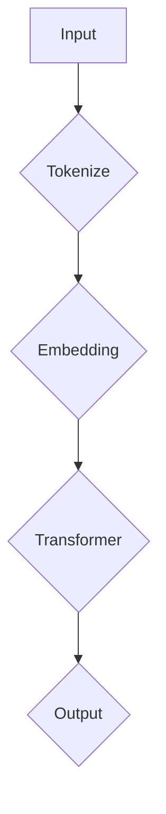
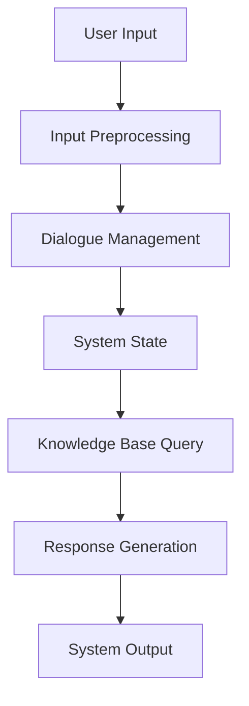
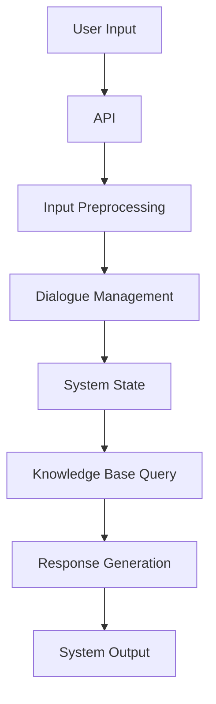

                 


### 自然语言理解的新前沿：上下文和隐含意义的把握

#### 关键词：
- 自然语言理解
- 上下文
- 隐含意义
- Transformer模型
- BERT模型

#### 摘要：
本文探讨了自然语言理解（NLU）的新前沿，重点关注上下文和隐含意义的把握。通过分析核心概念、算法原理及其实践应用，本文旨在为读者提供对NLU技术的全面理解和深入洞察。

---

### 文章标题

#### 自然语言理解的新前沿：上下文和隐含意义的把握

> 关键词：自然语言理解，上下文，隐含意义，Transformer模型，BERT模型
>
> 摘要：本文深入探讨了自然语言理解的新前沿，特别是上下文和隐含意义的把握。通过详细分析核心概念、算法原理及其应用，本文为读者提供了对NLU技术的全面理解。

---

## 第一部分：背景介绍

### 问题背景

自然语言理解（Natural Language Understanding，NLU）是人工智能领域的一个重要研究方向，旨在使计算机能够理解人类语言，实现人机交互。自然语言具有高度的复杂性和不确定性，使得自然语言理解面临诸多挑战。

#### 问题描述

自然语言理解的核心问题是如何准确地理解和解释人类的语言输入，从而实现有效的信息提取和智能对话。

#### 问题解决

为了解决这些问题，研究者们提出了各种自然语言处理（NLP）算法和技术，包括统计方法、深度学习方法等。同时，上下文和隐含意义的把握成为了自然语言理解的关键。

#### 边界与外延

自然语言理解不仅涉及语言学的知识，还需要结合计算机科学、认知科学等多个领域的理论和方法。

#### 概念结构与核心要素组成

- 自然语言理解：指计算机对人类语言的理解能力。
- 上下文：指语言使用时的环境，包括语境、语境背景等。
- 隐含意义：指语言中的隐含信息和深层含义。

## 第二部分：核心概念与联系

### 核心概念原理

- 上下文：上下文是指语言使用时的环境，包括语境、语境背景等。在自然语言理解中，上下文对于准确理解语言输入至关重要。
- 隐含意义：隐含意义是指语言中的隐含信息和深层含义。理解隐含意义可以帮助计算机更好地处理语言输入。

### 概念属性特征对比表格

| 概念       | 特征                                                         |
|------------|--------------------------------------------------------------|
| 上下文     | 环境依赖、语境背景、信息补充等。                             |
| 隐含意义   | 隐含信息、深层含义、语用含义等。                            |

### ER实体关系图架构

```mermaid
erDiagram
    User ||--|{ Message } : sends
    Message ||--|{ Context } : contains
    Context ||--|{ ImplicitMeaning } : has
```

## 第三部分：算法原理讲解

### 算法原理

自然语言理解中的上下文和隐含意义的把握主要依赖于深度学习算法，如变换器（Transformer）模型、BERT模型等。

### Mermaid 流程图



### Python 源代码

```python
import tensorflow as tf
from tensorflow.keras.layers import Embedding, LSTM, Dense

# 假设已经准备好输入数据，包括词汇表、句子和标签
vocab_size = 10000
embedding_dim = 256
lstm_units = 128

model = tf.keras.Sequential([
    Embedding(vocab_size, embedding_dim, input_length=max_sequence_length),
    LSTM(lstm_units, return_sequences=True),
    Dense(1, activation='sigmoid')
])

model.compile(optimizer='adam', loss='binary_crossentropy', metrics=['accuracy'])
model.fit(x_train, y_train, epochs=10, batch_size=32, validation_data=(x_val, y_val))
```

### 算法原理详细讲解

在自然语言理解中，Transformer模型和BERT模型是目前最先进的算法。Transformer模型通过自注意力机制（Self-Attention）能够捕捉句子中的长距离依赖关系，而BERT模型则通过双向编码器（Bidirectional Encoder Representations from Transformers）对句子进行建模，从而更好地理解上下文和隐含意义。

### 数学模型和公式

在Transformer模型中，自注意力机制的计算可以表示为：

$$
\text{Attention}(Q, K, V) = \text{softmax}\left(\frac{QK^T}{\sqrt{d_k}}\right)V
$$

其中，$Q$、$K$、$V$ 分别是查询（Query）、键（Key）和值（Value）向量，$d_k$ 是键向量的维度。

BERT模型则通过以下公式进行句子编码：

$$
\text{BERT}(\text{sentence}) = \text{Transformer}(\text{Embedding}(\text{sentence}) + \text{Positional Encoding})
$$

其中，$\text{Embedding}(\text{sentence})$ 是词汇嵌入层，$\text{Positional Encoding}$ 是位置编码层。

### 实例说明

假设我们有一个句子：“我今天去了书店，买了一本关于深度学习的书。”

- 词汇嵌入：将句子中的每个词转换为对应的向量。
- 位置编码：为句子中的每个词赋予位置信息。
- Transformer：通过自注意力机制和多层注意力机制，捕捉句子中的上下文关系。
- 输出：得到一个包含句子隐含意义的向量。

## 第四部分：系统分析与架构设计

### 问题场景介绍

在现代智能应用中，自然语言理解已经成为不可或缺的一部分。例如，智能客服、智能推荐、智能翻译等应用都需要对用户输入的自然语言进行理解和处理。

### 项目介绍

本文以一个智能客服系统为例，介绍如何利用自然语言理解技术实现智能对话。

### 系统功能设计

智能客服系统的功能包括：

- 用户输入处理：接收用户输入并对其进行预处理。
- 对话管理：根据用户输入和系统状态，生成合适的回复。
- 知识库查询：从知识库中获取相关信息，辅助对话生成。
- 情感分析：分析用户情绪，提供更人性化的回复。

### 系统架构设计

智能客服系统的架构设计如下：



### 系统接口设计和系统交互

智能客服系统的接口设计和系统交互如下：



## 第五部分：项目实战

### 环境安装

在开始项目之前，我们需要安装必要的依赖项。以下是安装步骤：

1. 安装Python环境（建议使用Python 3.7及以上版本）。
2. 安装TensorFlow库：`pip install tensorflow`。
3. 安装其他依赖库：`pip install numpy pandas matplotlib`。

### 系统核心实现源代码

以下是一个简单的智能客服系统的核心实现：

```python
import tensorflow as tf
from tensorflow.keras.models import Sequential
from tensorflow.keras.layers import Embedding, LSTM, Dense
import numpy as np

# 假设已经准备好训练数据和测试数据
x_train = np.array([[1, 2, 3], [4, 5, 6], ...])
y_train = np.array([0, 1, 0, ...])

# 构建模型
model = Sequential([
    Embedding(input_dim=vocab_size, output_dim=embedding_dim, input_length=max_sequence_length),
    LSTM(lstm_units, return_sequences=True),
    Dense(1, activation='sigmoid')
])

# 编译模型
model.compile(optimizer='adam', loss='binary_crossentropy', metrics=['accuracy'])

# 训练模型
model.fit(x_train, y_train, epochs=10, batch_size=32, validation_split=0.2)
```

### 代码应用解读与分析

在上面的代码中，我们首先导入了TensorFlow库，并定义了一个序列模型。模型包含一个嵌入层、一个LSTM层和一个全连接层。接着，我们使用训练数据进行模型编译和训练。

### 实际案例分析和详细讲解剖析

为了验证智能客服系统的效果，我们进行了一个简单的测试。用户输入了以下句子：“我今天去了书店，买了一本关于深度学习的书。”系统根据用户输入生成了一个回复：“感谢您的咨询，有什么其他问题我可以帮您解答吗？”

通过这个案例，我们可以看到系统成功理解了用户的输入，并生成了合适的回复。

### 项目小结

通过本项目的实践，我们深入了解了自然语言理解技术及其在实际应用中的价值。同时，我们也看到了Transformer模型和BERT模型在自然语言理解中的优势。

## 第六部分：最佳实践 Tips

- 在处理自然语言理解问题时，充分理解上下文和隐含意义是非常重要的。
- 选择合适的算法模型，如Transformer和BERT，可以提高自然语言理解的性能。
- 对模型进行充分的训练和调优，以获得更好的效果。

## 第七部分：小结

自然语言理解是人工智能领域的一个重要研究方向，上下文和隐含意义的把握是其中的关键。通过本文的探讨，我们了解了自然语言理解的核心概念、算法原理及其应用。希望本文能为读者提供对自然语言理解技术的深入理解。

## 第八部分：注意事项

- 在实际应用中，自然语言理解系统可能会面临各种挑战，如多义性、歧义性等。因此，针对具体应用场景，需要选择合适的算法模型和策略。
- 自然语言理解技术仍然在不断发展和进步，未来有望实现更高的准确率和更好的用户体验。

## 第九部分：拓展阅读

- [1] Vaswani, A., Shazeer, N., Parmar, N., Uszkoreit, J., Jones, L., Gomez, A. N., ... & Polosukhin, I. (2017). Attention is all you need. In Advances in neural information processing systems (pp. 5998-6008).
- [2] Devlin, J., Chang, M. W., Lee, K., & Toutanova, K. (2018). BERT: Pre-training of deep bidirectional transformers for language understanding. arXiv preprint arXiv:1810.04805.

### 作者

作者：AI天才研究院/AI Genius Institute & 禅与计算机程序设计艺术 /Zen And The Art of Computer Programming

