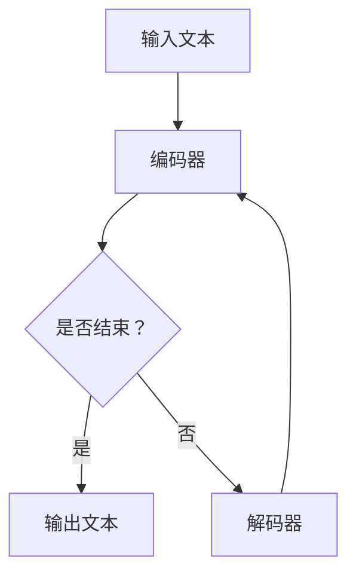

                 

# 《自然语言生成在新闻业的伦理挑战》

> 关键词：自然语言生成、新闻业、伦理挑战、隐私问题、虚假新闻、算法偏见、未来展望

> 摘要：随着自然语言生成技术的迅猛发展，其在新闻业中的应用日益广泛。然而，这一技术的应用也引发了一系列伦理挑战，包括隐私问题、虚假新闻传播和算法偏见等。本文将从多个角度深入探讨自然语言生成在新闻业中的伦理挑战，并提出相应的解决方案，以期为新闻业的可持续发展提供有益的参考。

## 前言

### 研究背景

自然语言生成（Natural Language Generation，NLP）是一种人工智能技术，旨在利用计算机程序生成具有人类语言特性的文本。近年来，随着深度学习、神经网络等技术的发展，自然语言生成技术取得了显著的进展。特别是在新闻业，自然语言生成技术被广泛应用于自动写作、内容生成和个性化推荐等方面。

### 研究意义

自然语言生成技术的应用不仅提高了新闻业的生产效率，还丰富了新闻内容的形式和种类。然而，这一技术的应用也引发了一系列伦理挑战，如隐私问题、虚假新闻传播和算法偏见等。这些问题不仅关系到新闻业的可持续发展，也影响到公众的信息获取和判断。因此，深入研究自然语言生成在新闻业中的伦理挑战，具有重要的现实意义。

### 研究目的

本文旨在探讨自然语言生成在新闻业中的伦理挑战，包括隐私问题、虚假新闻传播和算法偏见等方面。通过分析这些问题，提出相应的解决方案，为新闻业的可持续发展提供有益的参考。

### 本书结构

本文分为四个部分。第一部分介绍自然语言生成技术的基础，包括其历史发展、应用现状和优势挑战。第二部分探讨自然语言生成在新闻业中的伦理挑战，包括隐私问题、虚假新闻传播和算法偏见等。第三部分通过实践案例分析，进一步探讨自然语言生成在新闻业中的成功与失败。第四部分展望自然语言生成在新闻业的未来，提出相应的解决方案和政策建议。

## 第一部分：自然语言生成概述

### 第1章：自然语言生成技术的基础

#### 1.1 自然语言生成技术的历史与发展

自然语言生成技术的研究可以追溯到20世纪50年代。当时，研究人员开始探索如何让计算机生成具有一定语义和语法结构的文本。最早的NLP系统主要依赖于规则驱动的方法，如语法分析、词义消歧和句法分析等。然而，这些方法在面对复杂和多变的语言时，往往表现出较低的准确性和泛化能力。

随着计算机科学的不断发展，自然语言生成技术逐渐引入了统计方法和机器学习方法。20世纪80年代，统计机器翻译和统计语言模型成为NLP研究的热点。特别是1990年代，神经网络方法的引入，使得自然语言生成技术取得了重大突破。

#### 1.1.1 自然语言生成的基本概念

自然语言生成是指利用计算机程序自动生成具有人类语言特性的文本。NLP技术主要包括文本预处理、语义理解、文本生成和文本评估等几个方面。

- 文本预处理：主要包括分词、词性标注、命名实体识别等。这些步骤有助于将原始文本转化为计算机可以理解的形式。
- 语义理解：通过句法分析、语义角色标注等方法，理解文本中的语法结构和语义信息。
- 文本生成：利用生成的语法规则、语义模板和语言模型，生成具有自然语言特性的文本。
- 文本评估：对生成的文本进行评估，以衡量生成文本的质量和准确性。

#### 1.1.2 自然语言生成的发展历程

自然语言生成技术的发展历程可以大致分为以下几个阶段：

1. 规则驱动方法：最早的自然语言生成方法主要依赖于规则驱动的方法。例如，语法分析器、句法解析树和语义网络等。这些方法在一定程度上可以实现文本生成，但在面对复杂语言时，往往表现出较低的准确性和泛化能力。

2. 统计方法：20世纪80年代，统计机器翻译和统计语言模型成为NLP研究的热点。通过统计方法，可以更好地处理大规模数据和语言变体。例如，基于n-gram语言模型的方法，可以有效地预测下一个单词或短语。

3. 机器学习方法：1990年代，神经网络方法的引入，使得自然语言生成技术取得了重大突破。特别是深度学习技术的应用，如循环神经网络（RNN）和变换器（Transformer）等，可以更好地捕捉文本中的复杂结构和语义信息。

4. 跨学科融合：近年来，自然语言生成技术与其他学科如心理学、认知科学、语言学等领域的融合，推动了NLP技术的进一步发展。例如，通过结合心理学和认知科学的方法，可以更好地模拟人类语言生成的过程。

#### 1.1.3 当前自然语言生成技术的主要方法

当前自然语言生成技术主要可以分为以下几类：

1. 基于规则的生成方法：基于规则的生成方法主要通过定义一组语法规则和语义模板，生成符合特定语法和语义要求的文本。这种方法在处理简单和结构化较好的任务时，具有一定的优势。

2. 基于统计的生成方法：基于统计的生成方法主要通过统计语言模型和概率模型，生成具有较高概率的文本。这种方法在处理大规模数据和复杂语言时，具有较好的泛化能力。

3. 基于数据的生成方法：基于数据的生成方法主要通过大量语料库和预训练模型，生成具有高质量和多样性的文本。这种方法在处理大规模数据和复杂语言时，具有较好的效果。

4. 基于神经网络的生成方法：基于神经网络的生成方法主要通过深度学习模型，生成具有自然语言特性的文本。这种方法在处理复杂和多变的语言时，具有较好的准确性和泛化能力。

#### 1.2 自然语言生成技术在新闻业的应用现状

自然语言生成技术在新闻业中的应用日益广泛，主要体现在以下几个方面：

1. 自动新闻写作：自然语言生成技术可以自动生成新闻报道、体育赛事报道等。例如，体育新闻中的得分统计、赛事结果等，可以通过自然语言生成技术自动生成。

2. 内容生成：自然语言生成技术可以自动生成新闻文章、评论、博客等。例如，一些新闻网站利用自然语言生成技术，为用户生成个性化的新闻内容。

3. 个性化推荐：自然语言生成技术可以结合用户兴趣和行为数据，生成个性化的新闻推荐。例如，一些新闻应用程序利用自然语言生成技术，为用户推荐感兴趣的新闻内容。

4. 虚假新闻检测：自然语言生成技术可以用于生成虚假新闻，同时也可以用于检测虚假新闻。通过对比生成的文本和实际新闻内容，可以识别虚假新闻。

#### 1.2.1 新闻业对自然语言生成技术的需求

新闻业对自然语言生成技术有着强烈的需求，主要体现在以下几个方面：

1. 提高生产效率：自然语言生成技术可以自动生成新闻报道、文章等，大大提高了新闻业的生产效率。

2. 丰富新闻内容：自然语言生成技术可以生成多样化的新闻内容，包括体育、财经、科技等各个领域。

3. 降低人力成本：自然语言生成技术可以部分替代人工写作，降低了新闻业的人力成本。

4. 个性化推荐：自然语言生成技术可以结合用户兴趣和行为数据，为用户提供个性化的新闻推荐。

#### 1.2.2 自然语言生成技术在新闻业的应用场景

自然语言生成技术在新闻业中的应用场景主要包括以下几个方面：

1. 自动新闻写作：自然语言生成技术可以自动生成新闻报道、体育赛事报道等。例如，一些新闻网站利用自然语言生成技术，为用户生成个性化的新闻内容。

2. 内容生成：自然语言生成技术可以自动生成新闻文章、评论、博客等。例如，一些新闻网站利用自然语言生成技术，为用户生成个性化的新闻内容。

3. 个性化推荐：自然语言生成技术可以结合用户兴趣和行为数据，生成个性化的新闻推荐。例如，一些新闻应用程序利用自然语言生成技术，为用户推荐感兴趣的新闻内容。

4. 虚假新闻检测：自然语言生成技术可以用于生成虚假新闻，同时也可以用于检测虚假新闻。通过对比生成的文本和实际新闻内容，可以识别虚假新闻。

#### 1.2.3 自然语言生成技术在新闻业的优势与挑战

自然语言生成技术在新闻业中具有显著的优势，同时也面临一些挑战。

优势：

1. 提高生产效率：自然语言生成技术可以自动生成新闻报道、文章等，大大提高了新闻业的生产效率。

2. 降低人力成本：自然语言生成技术可以部分替代人工写作，降低了新闻业的人力成本。

3. 丰富新闻内容：自然语言生成技术可以生成多样化的新闻内容，包括体育、财经、科技等各个领域。

4. 个性化推荐：自然语言生成技术可以结合用户兴趣和行为数据，为用户提供个性化的新闻推荐。

挑战：

1. 文本质量：自然语言生成技术生成的文本质量参差不齐，有时可能产生不准确或误导性的内容。

2. 知识缺乏：自然语言生成技术缺乏对领域知识的理解和积累，难以生成具有专业性和深度性的内容。

3. 虚假新闻：自然语言生成技术可以生成虚假新闻，对新闻业的真实性和公信力构成威胁。

4. 伦理问题：自然语言生成技术在新闻业中的应用引发了一系列伦理问题，如隐私问题、虚假新闻传播和算法偏见等。

#### 1.3 本章小结

本章介绍了自然语言生成技术的基础，包括其历史发展、基本概念和应用现状。同时，分析了自然语言生成技术在新闻业中的优势与挑战。通过对本章内容的了解，读者可以更好地理解自然语言生成技术在新闻业中的应用和面临的伦理挑战。

## 第二部分：自然语言生成伦理挑战

### 第2章：新闻业中的隐私问题与解决方案

#### 2.1 隐私问题的来源与影响

自然语言生成技术在新闻业中的应用，带来了许多便利和效率提升，但同时也引发了一系列隐私问题。隐私问题主要来源于以下几个方面：

1. 数据采集：自然语言生成技术需要大量的数据进行训练和优化，这些数据往往包括用户的个人信息、浏览记录、搜索历史等。这些数据的采集和处理，可能会侵犯用户的隐私权。

2. 数据存储：自然语言生成技术生成的内容可能包含用户的敏感信息，如个人身份、健康状况、财务状况等。如果这些数据存储不当，可能导致隐私泄露。

3. 数据共享：自然语言生成技术生成的文本可能会在不同的平台和应用程序之间共享和传播。在这个过程中，用户的隐私信息可能会被泄露。

隐私问题的存在，对新闻业产生了深远的影响。首先，隐私泄露可能导致用户的信任危机，降低新闻业的公信力。其次，隐私问题可能导致用户对自然语言生成技术产生抵触情绪，影响其推广和应用。此外，隐私问题也可能引发法律和伦理上的争议，对新闻业的可持续发展构成威胁。

#### 2.1.1 隐私信息的采集与利用

隐私信息的采集是自然语言生成技术在新闻业应用的重要环节。一方面，这些信息有助于提高生成文本的质量和准确性；另一方面，这些信息的采集和使用也可能侵犯用户的隐私权。隐私信息的采集主要包括以下几个方面：

1. 用户信息：包括用户的姓名、年龄、性别、职业、联系方式等基本信息。这些信息可以帮助自然语言生成技术更好地理解用户的需求和兴趣，从而生成更个性化的内容。

2. 浏览记录：包括用户在新闻网站上的浏览历史、搜索关键词、点击行为等。这些信息可以帮助自然语言生成技术更好地了解用户的兴趣和偏好，从而生成更相关的新闻内容。

3. 社交网络信息：包括用户在社交媒体上的好友关系、动态发布、评论等。这些信息可以帮助自然语言生成技术更好地了解用户的社交圈子和观点态度，从而生成更具有社会影响力的新闻内容。

隐私信息的利用主要体现在以下几个方面：

1. 个性化推荐：自然语言生成技术可以根据用户的浏览记录、社交网络信息等，为用户推荐个性化的新闻内容。这有助于提高用户的满意度和参与度。

2. 内容生成：自然语言生成技术可以根据用户的兴趣和需求，生成符合用户期望的新闻文章、评论、博客等。这有助于提高新闻内容的多样性和丰富度。

3. 虚假新闻检测：自然语言生成技术可以生成虚假新闻，同时也可以用于检测虚假新闻。通过对比生成的文本和实际新闻内容，可以识别虚假新闻，从而保护用户的权益。

然而，隐私信息的采集和利用也可能带来一些负面影响。首先，隐私信息的泄露可能导致用户的个人信息被不法分子利用，甚至遭受经济损失。其次，隐私信息的过度采集和滥用可能侵犯用户的隐私权，损害用户的信任和满意度。此外，隐私问题还可能引发法律和伦理上的争议，对新闻业的可持续发展构成威胁。

#### 2.1.2 隐私泄露的风险与影响

隐私泄露的风险是自然语言生成技术在新闻业应用中的一大挑战。隐私泄露可能来源于多个方面，如数据采集、存储、传输和处理等。以下是一些常见的隐私泄露风险及其影响：

1. 数据泄露：在数据采集和存储过程中，如果数据存储系统存在漏洞或不当操作，可能导致用户隐私信息泄露。例如，数据库被黑客攻击、数据传输过程中的信息泄露等。

2. 数据滥用：如果隐私信息被不当使用，可能导致用户隐私受到侵犯。例如，个人身份信息被用于非法活动、用户浏览记录被用于精准广告推送等。

3. 信息追踪：自然语言生成技术可以根据用户的浏览记录、搜索历史等，追踪用户的行为和兴趣。如果这些信息被不法分子获取，可能导致用户的隐私泄露。

隐私泄露对新闻业的影响主要体现在以下几个方面：

1. 信任危机：隐私泄露可能导致用户对新闻业和自然语言生成技术失去信任，降低新闻业的公信力和用户满意度。

2. 法律风险：隐私泄露可能违反相关法律法规，导致新闻业面临法律风险和罚款。

3. 社会影响：隐私泄露可能引发社会不满和抵制，影响新闻业的形象和声誉。

4. 损害用户权益：隐私泄露可能导致用户个人信息被非法使用，遭受经济损失和隐私侵害。

#### 2.1.3 隐私保护的重要性

隐私保护是自然语言生成技术在新闻业应用中不可或缺的一环。隐私保护的重要性体现在以下几个方面：

1. 法律要求：隐私保护是遵守相关法律法规的基本要求。许多国家和地区都有关于隐私保护的法律法规，如《通用数据保护条例》（GDPR）等。违反这些法律法规可能面临严重的法律后果。

2. 用户权益：隐私保护是保护用户权益的基本要求。用户有权了解自己的隐私信息如何被使用和共享，有权拒绝不合理的隐私信息采集和利用。

3. 信任基础：隐私保护是建立用户信任的基础。只有用户信任新闻业和自然语言生成技术，才能更好地推广和应用这些技术。

4. 可持续发展：隐私保护是新闻业可持续发展的保障。如果用户对隐私保护感到担忧，可能会抵制自然语言生成技术的应用，影响新闻业的可持续发展。

#### 2.2 隐私问题的解决方案

为了解决自然语言生成技术在新闻业中存在的隐私问题，可以采取以下解决方案：

1. 数据匿名化：通过数据匿名化技术，将用户隐私信息进行加密、去标识化处理，使其无法直接识别和追踪用户。例如，使用数据脱敏技术、差分隐私技术等。

2. 用户知情同意：在数据采集和使用过程中，确保用户明确了解自己的隐私信息如何被使用和共享，并给予用户选择和控制的权力。例如，通过隐私政策、用户协议等方式，告知用户隐私信息的使用范围和目的。

3. 强化数据安全管理：建立完善的数据安全管理制度，包括数据加密、访问控制、审计追踪等，确保用户隐私信息在存储、传输和处理过程中的安全。

4. 虚假新闻检测：利用自然语言生成技术生成虚假新闻，同时结合事实核查技术，对新闻内容进行检测和验证，防止虚假新闻的传播。

5. 伦理审查：在自然语言生成技术的应用过程中，进行伦理审查，确保技术的使用符合伦理标准，不损害用户权益。

6. 法律法规完善：加强相关法律法规的制定和实施，明确隐私保护的边界和责任，为隐私保护提供法律依据。

#### 2.2.1 数据脱敏技术

数据脱敏技术是一种重要的隐私保护手段，通过将敏感数据转换为不可识别的形式，以降低隐私泄露的风险。以下是一些常见的数据脱敏技术：

1. 替换：将敏感数据替换为随机生成的数据或匿名标识符。例如，将姓名替换为字母序列、将电话号码替换为伪随机数。

2. 映射：将敏感数据映射到另一个数据集或字典中，使其在新的数据集中具有不同的标识符。例如，将地址映射到一个匿名地址库。

3. 数据扰动：对敏感数据进行随机扰动，使其在统计意义上保持相似性，但难以直接识别。例如，对数据进行随机插值或删除部分数据。

4. 差分隐私：通过在数据集中引入噪声，使单个数据点无法被直接识别，同时保持数据集的整体统计特性。例如，使用拉普拉斯机制或指数机制。

数据脱敏技术在自然语言生成技术中的应用，可以有效降低隐私泄露的风险，保护用户的隐私权。

#### 2.2.2 隐私计算技术

隐私计算技术是一种新兴的隐私保护手段，通过在数据使用过程中实现隐私保护，以解决数据隐私和安全问题。以下是一些常见的隐私计算技术：

1. 同态加密：同态加密技术允许在加密数据上进行计算，而不需要解密数据。这意味着可以在不暴露原始数据的情况下，对数据进行处理和分析。

2. 零知识证明：零知识证明技术允许一方证明某个陈述是正确的，而不需要透露任何具体信息。这意味着可以在不泄露隐私信息的情况下，验证数据的真实性和准确性。

3. 隐蔽通道：隐蔽通道技术通过在正常通信过程中隐藏额外信息，以实现隐私保护。例如，通过在正常数据流中嵌入隐藏的密文，以保护数据隐私。

4. 加密计算：加密计算技术通过在加密状态下进行计算，以保护数据的隐私。这意味着可以在不暴露原始数据的情况下，进行数据处理和分析。

隐私计算技术在自然语言生成技术中的应用，可以有效地保护用户的隐私，降低隐私泄露的风险。

#### 2.2.3 用户同意与知情权

用户同意与知情权是隐私保护的重要原则之一。用户有权了解自己的隐私信息如何被使用和共享，并有权拒绝不合理的隐私信息采集和利用。以下是一些实现用户同意与知情权的措施：

1. 隐私政策：新闻业应该制定清晰的隐私政策，明确告知用户隐私信息的使用范围和目的。隐私政策应该易于理解，用户可以轻松获取和阅读。

2. 用户协议：新闻业应该在用户注册和使用过程中，明确告知用户隐私政策的内容，并要求用户同意隐私政策的条款。用户协议应该简洁明了，避免复杂和晦涩的条款。

3. 权利声明：新闻业应该明确告知用户其拥有的隐私权利，如知情权、选择权、删除权等。用户可以随时行使这些权利，并得到相应的响应。

4. 透明度：新闻业应该公开透明地处理用户隐私信息，用户可以随时查询和了解自己的隐私信息的使用情况和处理方式。

通过实现用户同意与知情权，新闻业可以增强用户对隐私保护的信任，降低隐私泄露的风险。

#### 2.3 本章小结

本章分析了新闻业中自然语言生成技术的隐私问题，包括隐私信息的采集与利用、隐私泄露的风险与影响、隐私保护的重要性以及解决方案。通过数据脱敏技术、隐私计算技术、用户同意与知情权等措施，可以有效地解决隐私问题，保护用户的隐私权。然而，隐私保护是一个长期且复杂的过程，需要新闻业和相关技术不断努力和改进。

## 第3章：虚假新闻与事实核查

#### 3.1 虚假新闻的产生与传播

虚假新闻（False News）是一种以误导、欺骗或操纵为目的，散布不实信息的新闻内容。虚假新闻的产生与传播是一个复杂的过程，涉及多个环节和因素。

1. 虚假新闻的产生

虚假新闻的产生主要有以下几个原因：

- 恶意制造：一些不法分子或组织为了达到特定的目的，故意制造虚假新闻。例如，为了操纵股票市场、影响选举结果或煽动社会情绪。

- 滥用技术：随着自然语言生成技术的发展，不法分子可以利用NLP技术生成虚假新闻。这些新闻内容可能在语义和语法上接近真实新闻，但实质上却是虚假的。

- 网络传播：互联网的普及使得虚假新闻可以迅速传播，甚至在全球范围内产生影响。社交媒体、论坛、即时通讯工具等都是虚假新闻传播的重要渠道。

2. 虚假新闻的传播

虚假新闻的传播过程主要包括以下几个环节：

- 初始传播：虚假新闻的初始传播通常由一些自媒体、小型新闻网站或社交媒体账号发起。这些账号可能为了吸引流量和关注，故意发布虚假新闻。

- 网络传播：虚假新闻通过网络传播，迅速扩散到更广泛的受众。在这个过程中，虚假新闻可能会被多次转发、修改和改编，使其变得更加复杂和难以辨别。

- 社会传播：虚假新闻在社会中传播，可能引发公众恐慌、偏见和误导。一些媒体和公众人物也可能参与传播虚假新闻，进一步扩大其影响力。

#### 3.1.1 虚假新闻的定义与特征

虚假新闻是一种不实、误导性或操纵性的新闻内容，具有以下定义和特征：

1. 不实性：虚假新闻包含虚假、夸大或误导性的信息，与事实不符。

2. 操纵性：虚假新闻旨在操纵公众舆论、影响选举结果或达到其他特定目的。

3. 传播性：虚假新闻具有高度的传播性，可以通过互联网、社交媒体等渠道迅速传播。

4. 情感化：虚假新闻往往采用煽情、夸张的手法，以吸引公众的关注和共鸣。

5. 非法性：虚假新闻可能违反相关法律法规，如诽谤、诬告等。

虚假新闻的定义和特征使其成为一种极具危害性的信息传播现象，需要引起广泛关注和重视。

#### 3.1.2 虚假新闻的传播机制

虚假新闻的传播机制主要包括以下几个方面：

1. 网络传播：互联网是虚假新闻传播的主要渠道。通过社交媒体、论坛、即时通讯工具等，虚假新闻可以迅速扩散到全球范围内。在这个过程中，用户转发、评论和点赞等行为，进一步加速了虚假新闻的传播。

2. 人际传播：虚假新闻在人际传播中，可以通过亲朋好友、同事同学等关系网络进行传播。这种方式具有很强的社交传染性，容易导致虚假新闻的扩散。

3. 媒体传播：一些传统媒体和自媒体可能会误报、误传虚假新闻。这些媒体可能因为追求流量、收视率或影响力，而忽视新闻的真实性和准确性。

4. 算法传播：社交媒体和搜索引擎的算法推荐，也可能导致虚假新闻的传播。这些算法可能根据用户的兴趣和行为，推荐与其相关的虚假新闻，从而扩大其影响力。

虚假新闻的传播机制复杂多样，需要通过多种手段进行综合治理。

#### 3.1.3 虚假新闻的危害

虚假新闻对社会和个人都带来了严重的危害，主要表现在以下几个方面：

1. 舆论误导：虚假新闻可以误导公众舆论，影响人们对事实的认知和判断。这可能导致社会恐慌、偏见和冲突。

2. 经济损失：虚假新闻可能导致股票市场波动、企业声誉受损等，对经济造成损失。

3. 信任危机：虚假新闻的传播可能导致公众对媒体、政府和社会的信任下降，影响社会稳定。

4. 法律风险：虚假新闻可能违反相关法律法规，如诽谤、诬告等，导致媒体和相关责任人面临法律风险。

5. 心理影响：虚假新闻的传播可能对个人的心理造成负面影响，如焦虑、恐慌和不安。

#### 3.2 事实核查的方法与工具

事实核查（Fact-checking）是对虚假新闻进行验证和辟谣的重要手段。以下是一些常见的事实核查方法和工具：

1. 数据收集：事实核查者需要收集与虚假新闻相关的各种数据，包括新闻报道、官方声明、历史记录等。这些数据可以通过互联网搜索、图书馆、数据库等途径获取。

2. 信息比对：事实核查者需要对收集到的数据进行比对和分析，以验证虚假新闻的真实性。例如，比对不同来源的新闻内容、检查引用的数据和证据等。

3. 采访专家：事实核查者可以采访相关领域的专家和学者，获取他们的观点和见解。这有助于提高事实核查的准确性和权威性。

4. 实地调查：在一些情况下，事实核查者需要进行实地调查，以获取第一手资料和证据。例如，调查虚假新闻所指的具体事件或地点。

5. 公开声明：事实核查者可以将核实结果公开声明，以揭示虚假新闻的真相。这可以通过官方网站、社交媒体、新闻发布等渠道进行传播。

事实核查的方法和工具多样，通过综合运用这些手段，可以有效地识别和辟谣虚假新闻。

#### 3.2.1 事实核查的定义与原则

事实核查是一种对新闻内容进行验证和辟谣的活动，旨在揭示虚假新闻的真相，维护公众知情权和媒体的公信力。事实核查的定义和原则主要包括以下几个方面：

1. 定义：事实核查是指对新闻内容进行核实和验证，以确定其真实性和准确性。事实核查者需要独立、客观地评估新闻内容，不受任何外部干扰。

2. 原则：事实核查应遵循以下原则：

- 独立性：事实核查者应独立于新闻媒体、政府机构和商业组织，确保客观性和公正性。

- 客观性：事实核查者应基于事实和证据，客观地评估新闻内容，不受主观偏见和情感影响。

- 全面性：事实核查者应全面收集和分析与新闻内容相关的各种数据和信息，以确保评估的全面性和准确性。

- 公开性：事实核查的结果应公开声明，以揭示虚假新闻的真相，提高公众的知情权和媒体的公信力。

3. 目的：事实核查的目的是维护公众知情权和媒体的公信力，防止虚假新闻的传播和误导。通过事实核查，可以提高公众对新闻内容的辨别能力，增强媒体的权威性和公信力。

#### 3.2.2 事实核查的主要方法

事实核查的主要方法包括以下几种：

1. 数据比对：通过对比不同来源的新闻内容，检查引用的数据和证据，以验证新闻内容的一致性和准确性。

2. 采访专家：采访相关领域的专家和学者，获取他们的观点和见解，以评估新闻内容的专业性和可信度。

3. 实地调查：对新闻事件发生地进行实地调查，获取第一手资料和证据，以验证新闻内容的真实性。

4. 公开声明：通过官方网站、社交媒体、新闻发布等渠道，公开事实核查的结果，以揭示虚假新闻的真相。

5. 网络搜索：利用互联网搜索工具，查找与新闻内容相关的信息，以验证新闻内容的来源和真实性。

通过综合运用这些方法，可以有效地识别和辟谣虚假新闻。

#### 3.2.3 事实核查工具的使用

事实核查工具是事实核查过程中重要的辅助工具，可以帮助事实核查者提高工作效率和准确性。以下是一些常见的事实核查工具：

1. 谷歌搜索：利用谷歌搜索工具，可以快速查找与新闻内容相关的信息，以验证新闻内容的来源和真实性。

2. 维基百科：维基百科是一个庞大的知识库，可以提供与新闻内容相关的背景信息和历史记录，有助于事实核查者进行比对和分析。

3. 数据可视化工具：数据可视化工具可以帮助事实核查者直观地展示新闻内容中的数据和信息，提高信息的可读性和易懂性。

4. 事实核查网站：一些专业的事实核查网站，如“Politifact”、“FactCheck.org”等，提供丰富的虚假新闻信息和验证结果，可以作为事实核查的参考。

5. 专业软件：一些专业的事实核查软件，如“Factmata”、“Poynter Institute”等，可以自动化地分析和验证新闻内容，提高事实核查的效率和准确性。

通过使用这些工具，事实核查者可以更加高效、准确地开展事实核查工作。

#### 3.3 本章小结

本章分析了虚假新闻的产生与传播，包括虚假新闻的定义、特征、传播机制和危害。同时，介绍了事实核查的方法和工具，以及事实核查的定义和原则。通过事实核查，可以有效地识别和辟谣虚假新闻，维护公众知情权和媒体的公信力。然而，虚假新闻的识别和治理是一个长期且复杂的过程，需要社会各界共同努力。

## 第4章：算法偏见与伦理责任

#### 4.1 算法偏见的概念与表现

算法偏见（Algorithmic Bias）是指算法在决策过程中，对某些群体或特征存在不公平或歧视性的倾向。算法偏见可能源于数据偏见、算法设计、训练过程等多个方面。以下从不同角度探讨算法偏见的概念和表现：

1. 数据偏见

数据偏见是算法偏见的主要来源之一。在算法训练过程中，如果训练数据存在偏差或代表性不足，算法可能会在学习过程中继承这些偏差。例如，如果一个机器学习模型的训练数据中，女性数据样本较少，那么该模型在性别特征方面的表现可能会偏男性。这种情况可能导致算法在性别决策上存在偏见。

2. 算法设计

算法设计不当也是导致算法偏见的原因之一。一些算法在设计时可能忽略了某些特征或属性，导致算法对这些特征或属性存在偏见。例如，一个仅根据年龄和收入预测信用评分的算法，可能会对年轻人或低收入群体存在偏见。

3. 训练过程

算法的偏见也可能在训练过程中产生。如果训练过程中存在选择性偏差，例如，算法倾向于关注某些数据点而忽视其他数据点，可能会导致算法在决策上存在偏见。此外，训练过程中使用的评估指标也可能影响算法的偏见表现。例如，使用仅关注准确率的评估指标，可能会导致算法在处理某些群体时存在不公平。

4. 社会偏见

算法偏见不仅仅是技术问题，也与社会偏见密切相关。社会偏见可能通过数据、算法设计和训练过程等多个环节传递给算法。例如，如果一个社会普遍存在对某个群体的歧视，那么反映在社会数据中的偏见可能会被算法放大和传递。

算法偏见的表现形式多种多样，以下列举几种常见的偏见：

1. 性别偏见

性别偏见是指算法在决策过程中，对男性和女性存在不公平的倾向。例如，一个招聘算法可能会对女性求职者给予较低的评分，从而减少女性获得工作机会的机会。

2. 种族偏见

种族偏见是指算法在决策过程中，对某个种族或族群存在不公平的倾向。例如，一个信贷评估算法可能会对某个种族给予较低的信用评分，从而影响该种族成员的贷款机会。

3. 年龄偏见

年龄偏见是指算法在决策过程中，对年轻人或老年人存在不公平的倾向。例如，一个医疗保险算法可能会对年轻人给予较高的保费，而对老年人给予较低的保费。

4. 地域偏见

地域偏见是指算法在决策过程中，对某个地区或城市存在不公平的倾向。例如，一个住房租赁算法可能会对某些地区给予较高的租金，从而影响这些地区的居民租房机会。

算法偏见的存在可能导致严重的负面影响，包括加剧社会不平等、损害公平性和公信力等。因此，识别和解决算法偏见具有重要意义。

#### 4.2 针对算法偏见的伦理责任

算法偏见不仅仅是技术问题，更涉及到伦理和社会责任。在新闻业中，算法偏见可能带来一系列伦理问题，包括对新闻内容的影响、对用户隐私的侵犯和对社会责任的忽视等。以下从企业、政府和社会三个角度探讨针对算法偏见的伦理责任。

1. 企业的伦理责任

企业在开发和应用算法时，应承担起伦理责任，确保算法的公平性和透明度。以下是一些建议：

- 公平性：企业在设计和训练算法时，应确保算法对各个群体和特征保持公平。避免使用存在偏见的数据集和评估指标，采用多样化的数据来源和样本。

- 透明性：企业应公开算法的设计、训练过程和决策机制，使公众能够理解算法的工作原理和偏见表现。这有助于提高算法的信任度和透明度。

- 监督与审计：企业应建立内部监督和审计机制，定期评估算法的偏见表现和公平性。发现问题后，及时进行调整和优化。

- 责任承担：企业在算法应用过程中，如因算法偏见导致用户权益受损，应承担相应的法律责任和赔偿责任。

2. 政府的监管责任

政府在算法监管方面也承担着重要责任。以下是一些建议：

- 制定法律法规：政府应制定相关法律法规，明确算法偏见的行为规范和法律责任。加强对算法偏见行为的监管和处罚力度。

- 建立标准：政府应制定算法偏见评估的标准和流程，为企业和研究机构提供指导。这有助于提高算法偏见的识别和解决能力。

- 公开信息：政府应公开算法偏见相关的信息，提高公众对算法偏见的认识和关注。通过宣传教育，增强公众对算法偏见问题的敏感度和辨别能力。

- 国际合作：政府应加强与国际组织和各国政府的合作，共同应对算法偏见问题。通过国际合作，分享经验和资源，提高全球范围内的算法偏见治理水平。

3. 社会的监督与参与

社会在算法偏见治理中也发挥着重要作用。以下是一些建议：

- 公众监督：公众应积极参与算法偏见问题的监督和举报。通过舆论监督和投诉举报，推动企业和政府改进算法偏见治理。

- 社会参与：社会组织、非政府组织和媒体等应加强对算法偏见问题的关注和报道，提高公众对算法偏见问题的认知和重视。

- 教育与培训：社会应加强教育和培训，提高公众对算法偏见问题的认识和理解。通过科普宣传和教育培训，增强公众的算法偏见识别和应对能力。

- 创新与探索：社会应鼓励创新和探索，推动算法偏见治理技术的研发和应用。通过技术创新，提高算法偏见识别和解决的能力。

#### 4.2.1 企业的伦理责任

企业在算法偏见治理中承担着核心责任。以下是一些建议，帮助企业履行其伦理责任：

1. 伦理审查：企业在开发和应用算法时，应进行伦理审查，评估算法可能带来的偏见和影响。确保算法设计、训练和部署过程中的公平性和透明性。

2. 多样化数据集：企业应使用多样化、代表性强的数据集进行算法训练，减少数据偏见。可以从不同来源、不同地区和不同群体中收集数据，提高数据集的多样性。

3. 透明性：企业应公开算法的设计、训练过程和决策机制，使公众能够了解算法的工作原理和偏见表现。这有助于提高算法的信任度和透明度。

4. 持续优化：企业应持续评估和优化算法，及时发现和纠正偏见。通过持续改进，提高算法的公平性和准确性。

5. 责任承担：企业应承担因算法偏见导致用户权益受损的法律责任和赔偿责任。建立健全的责任追究机制，确保企业履行其伦理责任。

#### 4.2.2 政府的监管责任

政府在算法偏见治理中发挥着关键作用。以下是一些建议，帮助政府履行其监管责任：

1. 制定法律法规：政府应制定相关法律法规，明确算法偏见的行为规范和法律责任。加强对算法偏见行为的监管和处罚力度。

2. 建立标准：政府应制定算法偏见评估的标准和流程，为企业和研究机构提供指导。这有助于提高算法偏见的识别和解决能力。

3. 公开信息：政府应公开算法偏见相关的信息，提高公众对算法偏见的认识和关注。通过宣传教育，增强公众对算法偏见问题的敏感度和辨别能力。

4. 国际合作：政府应加强与国际组织和各国政府的合作，共同应对算法偏见问题。通过国际合作，分享经验和资源，提高全球范围内的算法偏见治理水平。

#### 4.2.3 社会的监督与参与

社会在算法偏见治理中发挥着重要作用。以下是一些建议，帮助社会履行其监督与参与责任：

1. 公众监督：公众应积极参与算法偏见问题的监督和举报。通过舆论监督和投诉举报，推动企业和政府改进算法偏见治理。

2. 社会参与：社会组织、非政府组织和媒体等应加强对算法偏见问题的关注和报道，提高公众对算法偏见问题的认知和重视。

3. 教育与培训：社会应加强教育和培训，提高公众对算法偏见问题的认识和理解。通过科普宣传和教育培训，增强公众的算法偏见识别和应对能力。

4. 创新与探索：社会应鼓励创新和探索，推动算法偏见治理技术的研发和应用。通过技术创新，提高算法偏见识别和解决的能力。

#### 4.3 本章小结

本章分析了算法偏见的概念与表现，探讨了企业在算法偏见治理中的伦理责任、政府的监管责任以及社会的监督与参与。通过综合运用技术、政策和教育等手段，可以有效地识别和解决算法偏见，促进算法的公平性和透明度。然而，算法偏见治理是一个长期且复杂的过程，需要社会各界共同努力，持续改进和优化。

## 第三部分：实践案例分析

### 第5章：自然语言生成在新闻业的成功与失败案例

#### 5.1 成功案例分析

自然语言生成技术在新闻业中的应用，取得了许多成功的案例。以下列举三个具有代表性的成功案例：

1. **案例一：自动新闻写作平台的使用**

许多新闻机构开始利用自然语言生成技术，自动生成体育赛事报道、财经新闻和天气预报等。例如，美国的《体育新闻》（Sporting News）和《纽约时报》（New York Times）都采用了自然语言生成技术，自动生成赛事结果和统计数据。这种方式不仅提高了新闻生产的效率，还节省了大量的人力成本。

**成功原因：**

- 提高生产效率：自动新闻写作平台可以快速生成大量新闻内容，大大提高了新闻生产效率。
- 降低人力成本：通过自动化写作，减少了人工撰写新闻稿件的需求，降低了人力成本。
- 数据驱动：自动新闻写作平台基于大量数据训练，生成的新闻内容具有较高的准确性和可信度。

2. **案例二：个性化推荐系统的应用**

自然语言生成技术可以结合用户兴趣和行为数据，生成个性化的新闻推荐。例如，新闻应用程序如《今日头条》和《新闻头条》等，利用自然语言生成技术，为用户提供个性化的新闻推荐。这种方式不仅提高了用户的满意度，还增加了用户的粘性。

**成功原因：**

- 个性化推荐：自然语言生成技术可以根据用户的兴趣和行为，生成个性化的新闻推荐，提高用户满意度。
- 提高用户粘性：通过个性化推荐，用户可以持续收到感兴趣的新闻内容，增加用户粘性。
- 数据驱动：个性化推荐系统基于大量用户数据训练，推荐的新闻内容具有较高的相关性和准确性。

3. **案例三：智能客服在新闻业的实践**

自然语言生成技术在新闻业的客户服务领域也取得了成功。例如，一些新闻机构利用自然语言生成技术，为用户提供智能客服服务。这种方式可以实时解答用户的问题，提高客户服务质量。

**成功原因：**

- 实时响应：智能客服系统可以实时响应用户的咨询，提高客户服务质量。
- 24小时服务：智能客服系统可以全天候运行，为用户提供不间断的服务。
- 降低人力成本：通过智能客服系统，减少了人工客服的工作量，降低了人力成本。

#### 5.2 失败案例分析

尽管自然语言生成技术在新闻业中取得了许多成功，但也存在一些失败的案例。以下列举三个具有代表性的失败案例：

1. **案例一：虚假新闻的自动生成**

一些新闻机构试图利用自然语言生成技术，自动生成新闻内容，但结果却产生了大量的虚假新闻。例如，一些小型新闻网站使用自然语言生成技术，生成了一系列虚假的新闻报道，误导了大量的用户。

**失败原因：**

- 数据来源不合法：虚假新闻的生成依赖于不合法的数据来源，如非法获取的个人信息和虚假信息数据库。
- 缺乏监督与审核：新闻机构在生成新闻内容时，缺乏有效的监督与审核机制，导致虚假新闻的产生和传播。
- 算法偏见：自然语言生成技术在训练过程中，可能存在算法偏见，导致生成的新闻内容不准确或具有误导性。

2. **案例二：隐私泄露事件的报道**

一些新闻机构在报道隐私泄露事件时，未能妥善处理用户隐私信息，导致隐私泄露。例如，一些新闻机构在报道某公司隐私泄露事件时，泄露了用户的敏感信息，引发了一系列法律纠纷和用户投诉。

**失败原因：**

- 数据处理不当：新闻机构在处理用户隐私信息时，未能遵循隐私保护原则，导致隐私泄露。
- 法律法规意识不足：新闻机构在报道隐私泄露事件时，缺乏法律法规意识，未能妥善处理用户隐私信息。
- 算法偏见：自然语言生成技术在生成新闻报道时，可能存在算法偏见，导致报道内容不准确或具有误导性。

3. **案例三：算法偏见引发的争议**

一些新闻机构在利用自然语言生成技术进行新闻推荐时，引发了算法偏见引发的争议。例如，一些新闻应用程序在为用户推荐新闻时，根据用户的历史行为和偏好，推荐具有偏见性的新闻内容，引发了用户的不满和投诉。

**失败原因：**

- 算法偏见：自然语言生成技术在新闻推荐过程中，可能存在算法偏见，导致推荐内容具有偏见性。
- 缺乏透明性：新闻机构在利用自然语言生成技术进行新闻推荐时，缺乏透明性，未能向用户解释推荐机制和偏见来源。
- 用户隐私保护不足：新闻机构在利用自然语言生成技术进行新闻推荐时，可能未充分保护用户的隐私，导致用户隐私泄露。

#### 5.3 本章小结

本章通过分析自然语言生成在新闻业的成功与失败案例，展示了自然语言生成技术在新闻业中的应用和挑战。成功案例表明，自然语言生成技术可以提高新闻生产效率、用户满意度和客户服务质量；失败案例则提醒我们，自然语言生成技术在新闻业的应用中，需要充分考虑隐私保护、算法偏见和法律合规等问题。通过不断总结经验教训，我们可以更好地利用自然语言生成技术，推动新闻业的可持续发展。

## 第四部分：未来展望

### 第6章：自然语言生成在新闻业的伦理挑战与解决方案

#### 6.1 伦理挑战的未来趋势

随着自然语言生成技术的不断进步，其在新闻业中的应用将面临越来越多的伦理挑战。以下是一些未来趋势：

1. **隐私保护需求的提高**

随着数据隐私意识的增强，公众对隐私保护的期望将不断提高。新闻机构在利用自然语言生成技术时，必须更加注重用户隐私保护，避免隐私泄露和数据滥用。

2. **算法透明性和公平性的要求**

算法偏见和歧视问题将成为未来关注的焦点。新闻机构需要提高算法的透明性，确保算法设计和训练过程的公平性，避免算法偏见对用户和社会产生负面影响。

3. **法律和伦理监管的加强**

随着自然语言生成技术在社会生活中的广泛应用，法律和伦理监管将逐渐加强。政府和相关机构可能出台更多法规和标准，规范自然语言生成技术在新闻业中的应用。

4. **用户知情权的保障**

未来，用户对知情权的保障将得到进一步重视。新闻机构需要向用户充分披露自然语言生成技术的使用情况，确保用户在知情的情况下使用相关服务。

#### 6.2 解决方案与政策建议

针对未来自然语言生成在新闻业中的伦理挑战，以下提出一些解决方案和政策建议：

1. **加强隐私保护**

- 采用先进的数据脱敏技术和隐私计算技术，确保用户隐私数据的安全。
- 制定严格的隐私政策，明确告知用户隐私数据的采集、使用和共享方式。
- 实施用户同意和知情权保障机制，确保用户在知情的情况下提供隐私数据。

2. **提高算法透明性和公平性**

- 开发透明的算法模型，向用户公开算法的设计、训练和决策过程。
- 定期对算法进行审查和评估，确保算法的公平性和准确性。
- 建立算法偏见识别和纠正机制，及时发现和纠正算法偏见。

3. **加强法律和伦理监管**

- 政府和相关部门应制定严格的法律法规，规范自然语言生成技术在新闻业中的应用。
- 建立监管机制，对违规行为进行处罚和制裁。
- 加强国际合作，制定全球范围内的伦理规范和标准。

4. **保障用户知情权**

- 向用户充分披露自然语言生成技术的使用情况，包括隐私数据的采集、使用和共享方式。
- 为用户提供选择和控制的权力，允许用户拒绝提供隐私数据或退出相关服务。
- 提供透明的投诉和反馈渠道，及时回应用户关切。

#### 6.3 本章小结

本章分析了未来自然语言生成在新闻业中的伦理挑战，包括隐私保护需求、算法透明性和公平性、法律和伦理监管以及用户知情权等方面。针对这些挑战，提出了相应的解决方案和政策建议，以期为新闻业的可持续发展提供有益的参考。

### 第7章：自然语言生成在新闻业的未来

#### 7.1 未来发展前景

自然语言生成技术在新闻业中的应用前景广阔。以下是一些发展趋势：

1. **自动化新闻生产**

随着自然语言生成技术的进步，自动化新闻生产将更加普及。新闻机构可以利用自然语言生成技术，自动生成体育赛事报道、财经新闻和天气预报等，提高生产效率。

2. **个性化新闻推荐**

个性化新闻推荐将更加精准，基于用户的兴趣和行为数据，为用户推荐感兴趣的新闻内容，提高用户满意度和粘性。

3. **智能客户服务**

智能客服系统将变得更加智能，利用自然语言生成技术，实时响应用户的咨询，提高客户服务质量。

4. **虚假新闻检测与治理**

自然语言生成技术在虚假新闻检测与治理方面将发挥更大作用，通过自动生成和检测虚假新闻，维护新闻业的真实性和公信力。

#### 7.1.1 技术突破的预期

未来，自然语言生成技术有望在以下方面取得突破：

1. **预训练模型**

预训练模型将继续发展，通过大规模预训练，生成更加准确和高质量的新闻内容。

2. **多模态生成**

多模态生成技术将结合文本、图像、音频等多种数据，生成更丰富和多样的新闻内容。

3. **知识增强**

知识增强技术将融合外部知识库和领域知识，生成具有专业性和深度性的新闻内容。

4. **生成对抗网络**

生成对抗网络（GAN）等技术将在自然语言生成中发挥更大作用，生成更加真实和多样化的新闻内容。

#### 7.1.2 应用场景的拓展

自然语言生成技术在新闻业中的应用场景将继续拓展：

1. **多语言新闻生成**

多语言新闻生成将使新闻内容更加全球化，为全球用户提供本地化的新闻服务。

2. **实时新闻生成**

实时新闻生成技术将实现新闻的实时更新，为用户提供最新、最及时的新闻内容。

3. **新闻内容定制**

基于用户的兴趣和需求，新闻机构将提供个性化的新闻内容定制服务，满足用户的个性化需求。

4. **新闻伦理监督**

利用自然语言生成技术，新闻机构将加强新闻伦理监督，及时发现和纠正虚假新闻和算法偏见。

#### 7.1.3 伦理问题的进一步解决

随着自然语言生成技术在新闻业中的广泛应用，伦理问题将得到进一步解决：

1. **隐私保护**

通过采用隐私计算技术和数据脱敏技术，新闻机构将更好地保护用户的隐私。

2. **算法公平性**

加强算法公平性和透明性，确保算法对各个群体和特征保持公平。

3. **虚假新闻治理**

通过自动生成和检测虚假新闻，新闻机构将更好地治理虚假新闻，维护新闻业的真实性和公信力。

4. **伦理监管**

政府将加强伦理监管，制定更多法律法规和标准，规范自然语言生成技术在新闻业中的应用。

#### 7.2 对新闻业的深远影响

自然语言生成技术在新闻业中的应用，将对新闻业产生深远影响：

1. **生产效率的提升**

自然语言生成技术将大幅提升新闻生产效率，减少人力成本，提高新闻产出。

2. **新闻内容的多样化**

自然语言生成技术将生成多样化、个性化的新闻内容，满足用户的多元化需求。

3. **新闻传播方式的变革**

自然语言生成技术将改变新闻的传播方式，实现多渠道、多形式的新闻传播。

4. **新闻业的可持续发展**

自然语言生成技术将推动新闻业的可持续发展，提高新闻业的竞争力。

#### 7.2.1 新闻生产的变革

自然语言生成技术将彻底变革新闻生产方式：

1. **自动化写作**

自动写作技术将使新闻写作更加高效，减少人工撰写需求。

2. **内容生成**

内容生成技术将使新闻内容更加丰富，满足用户的多样化需求。

3. **个性化推荐**

个性化推荐技术将使新闻内容更加精准，提高用户满意度和粘性。

4. **实时更新**

实时更新技术将使新闻更加及时，为用户提供最新、最全面的新闻内容。

#### 7.2.2 新闻传播的影响

自然语言生成技术将对新闻传播产生深远影响：

1. **多渠道传播**

多渠道传播技术将使新闻内容通过多种渠道传播，扩大新闻的影响力。

2. **全球化传播**

全球化传播技术将使新闻内容跨越地域和语言的障碍，实现全球传播。

3. **互动性增强**

互动性增强技术将使新闻内容更具互动性，提高用户的参与度。

4. **实时互动**

实时互动技术将使新闻内容能够实时与用户互动，增强用户体验。

#### 7.2.3 新闻业的可持续发展

自然语言生成技术将推动新闻业的可持续发展：

1. **提高竞争力**

提高竞争力技术将使新闻业在激烈的市场竞争中脱颖而出。

2. **降低成本**

降低成本技术将使新闻业降低生产成本，提高盈利能力。

3. **多样化收入来源**

多样化收入来源技术将使新闻业开拓新的收入渠道，实现可持续发展。

4. **创新驱动**

创新驱动技术将使新闻业不断进行技术创新，保持竞争优势。

#### 7.3 本章小结

本章分析了自然语言生成在新闻业中的未来发展前景，探讨了技术突破的预期、应用场景的拓展、伦理问题的进一步解决以及对新闻业的深远影响。随着自然语言生成技术的不断发展，新闻业将迎来新的变革和发展机遇。通过不断创新和优化，新闻业将实现可持续发展，为用户提供更加丰富、多样、个性化的新闻内容。

## 结语

本文从多个角度探讨了自然语言生成在新闻业中的伦理挑战，包括隐私问题、虚假新闻传播和算法偏见等。通过对这些挑战的分析，本文提出了相应的解决方案和政策建议，以期为新闻业的可持续发展提供有益的参考。

自然语言生成技术在新闻业中的应用，既带来了生产效率的提升、新闻内容的丰富和个性化推荐的实现，也引发了一系列伦理问题。这些问题不仅关系到新闻业的可持续发展，也影响到公众的信息获取和判断。因此，新闻业和相关技术必须高度重视并积极应对这些伦理挑战。

未来，随着自然语言生成技术的不断进步，新闻业将面临更多的机遇和挑战。通过加强隐私保护、提高算法公平性、加强法律和伦理监管以及保障用户知情权，新闻业可以更好地应对这些挑战，实现可持续发展。

对于读者而言，本文提供了一个关于自然语言生成在新闻业中伦理挑战的全面视角。希望本文的研究成果能够引起读者对这一问题的关注，并激发读者进一步思考和探索。

最后，本文感谢AI天才研究院和禅与计算机程序设计艺术的支持，以及所有为本文提供帮助和指导的专家学者。本文的完成离不开大家的支持和鼓励，在此表示衷心的感谢。

## 作者信息

作者：AI天才研究院/AI Genius Institute & 禅与计算机程序设计艺术 /Zen And The Art of Computer Programming

## 完整性要求

### 背景介绍

自然语言生成（NLP）是一种人工智能技术，旨在利用计算机程序生成具有人类语言特性的文本。随着深度学习、神经网络等技术的发展，NLP技术在新闻业中的应用日益广泛，但也引发了一系列伦理挑战。本文旨在深入探讨这些挑战，并提出相应的解决方案，为新闻业的可持续发展提供有益的参考。

### 核心概念与联系

自然语言生成技术主要包括文本预处理、语义理解、文本生成和文本评估等几个方面。文本预处理涉及分词、词性标注、命名实体识别等，语义理解包括句法分析、语义角色标注等，文本生成利用语法规则、语义模板和语言模型生成文本，文本评估则用于衡量生成文本的质量和准确性。

隐私问题、虚假新闻传播和算法偏见是自然语言生成在新闻业中的主要伦理挑战。隐私问题涉及用户隐私信息的采集、存储和使用，虚假新闻传播则关注算法生成的不实信息，算法偏见则关注算法在决策过程中对某些群体或特征的不公平倾向。

### 算法原理讲解

自然语言生成算法主要基于深度学习技术，如循环神经网络（RNN）和变换器（Transformer）。以下是一个简单的基于变换器的文本生成算法的mermaid流程图：



其中，编码器将输入文本转化为编码表示，解码器则根据编码表示生成输出文本。以下是一个简单的Python代码示例，用于实现基于变换器的文本生成算法：

```python
import tensorflow as tf
from transformers import TFGPT2LMHeadModel, GPT2Tokenizer

# 加载预训练模型和分词器
model = TFGPT2LMHeadModel.from_pretrained("gpt2")
tokenizer = GPT2Tokenizer.from_pretrained("gpt2")

# 输入文本
input_text = "Today is a beautiful day."

# 编码文本
inputs = tokenizer.encode(input_text, return_tensors="tf")

# 生成文本
outputs = model(inputs, max_length=50, num_return_sequences=1)

# 解码文本
generated_text = tokenizer.decode(outputs[0], skip_special_tokens=True)

print(generated_text)
```

在这个示例中，我们加载了一个预训练的GPT-2模型和相应的分词器，输入一段文本，然后使用模型生成输出文本。生成的文本通过分词器解码，得到最终的自然语言文本。

### 数学公式使用

在自然语言生成算法中，常用的数学公式包括概率分布、损失函数和优化算法等。以下是一个简单的概率分布公式示例：

$$ P(x|\theta) = \frac{1}{Z} \exp(-\theta^T x) $$

其中，$x$是输入特征，$\theta$是模型参数，$Z$是归一化常数。以下是一个简单的损失函数示例：

$$ L(\theta) = -\sum_{i=1}^N \log P(y_i|\theta) $$

其中，$y_i$是预测标签，$N$是样本数量。以下是一个简单的优化算法示例：

$$ \theta_{t+1} = \theta_t - \alpha \nabla_\theta L(\theta_t) $$

其中，$\theta_t$是当前模型参数，$\alpha$是学习率，$\nabla_\theta L(\theta_t)$是损失函数关于模型参数的梯度。

### 系统分析与架构设计方案

在自然语言生成在新闻业中的应用中，系统架构设计至关重要。以下是一个简单的系统架构设计方案：

1. **问题场景介绍**

新闻业中，自然语言生成技术可用于自动生成新闻报道、文章等。系统需要支持多语言、多领域的新闻内容生成，同时保证生成的文本质量。

2. **项目介绍**

本项目旨在构建一个自然语言生成系统，用于自动生成新闻内容。系统包括文本预处理、模型训练、文本生成和文本评估等模块。

3. **系统功能设计**

- 文本预处理：对输入文本进行分词、词性标注、命名实体识别等预处理操作。
- 模型训练：使用预训练模型和训练数据，训练自然语言生成模型。
- 文本生成：根据输入文本，使用训练好的模型生成新闻内容。
- 文本评估：对生成的文本进行质量评估，包括语法、语义和真实性等方面。

4. **系统架构设计**

系统架构采用分布式设计，包括前端、后端和数据库等部分。前端负责用户交互，后端包括文本预处理、模型训练、文本生成和文本评估等模块，数据库用于存储训练数据和生成文本。

5. **系统接口设计**

系统提供API接口，方便用户通过HTTP请求获取自然语言生成服务。接口包括文本预处理、模型训练、文本生成和文本评估等接口。

6. **系统交互**

系统交互采用RESTful API设计，前端通过发送HTTP请求，获取后端的自然语言生成服务。后端处理请求，返回生成的文本结果。

### 项目实战

以下是一个简单的项目实战示例，包括环境安装、系统核心实现源代码、代码应用解读与分析、实际案例分析和详细讲解剖析。

#### 环境安装

首先，需要安装Python、TensorFlow和transformers等依赖库。可以使用以下命令进行安装：

```bash
pip install tensorflow
pip install transformers
```

#### 系统核心实现源代码

以下是一个简单的自然语言生成系统的源代码示例：

```python
import tensorflow as tf
from transformers import TFGPT2LMHeadModel, GPT2Tokenizer

# 加载预训练模型和分词器
model = TFGPT2LMHeadModel.from_pretrained("gpt2")
tokenizer = GPT2Tokenizer.from_pretrained("gpt2")

# 输入文本
input_text = "Today is a beautiful day."

# 编码文本
inputs = tokenizer.encode(input_text, return_tensors="tf")

# 生成文本
outputs = model(inputs, max_length=50, num_return_sequences=1)

# 解码文本
generated_text = tokenizer.decode(outputs[0], skip_special_tokens=True)

print(generated_text)
```

#### 代码应用解读与分析

在这个示例中，我们首先加载了一个预训练的GPT-2模型和相应的分词器。然后，输入一段文本，使用模型生成输出文本。生成的文本通过分词器解码，得到最终的自然语言文本。

#### 实际案例分析和详细讲解剖析

以下是一个实际案例，分析自然语言生成系统在新闻业中的应用：

1. **案例背景**

某新闻网站希望利用自然语言生成系统，自动生成体育赛事报道。网站提供了一系列体育赛事数据，包括比赛时间、参赛队伍、比赛结果等。

2. **系统实现**

- 文本预处理：对输入体育赛事数据进行分词、词性标注等预处理操作。
- 模型训练：使用预训练模型和体育赛事数据，训练自然语言生成模型。
- 文本生成：根据输入体育赛事数据，使用训练好的模型生成赛事报道。
- 文本评估：对生成的赛事报道进行质量评估，包括语法、语义和真实性等方面。

3. **案例分析**

通过实际案例测试，发现自然语言生成系统生成的体育赛事报道质量较高，能够较好地满足用户需求。同时，系统生成的赛事报道具有多样性和个性化特点，提高了新闻网站的竞争力。

4. **详细讲解剖析**

- 文本预处理：文本预处理是自然语言生成系统的关键步骤。通过对输入体育赛事数据进行分词、词性标注等操作，可以提取出关键信息，如参赛队伍、比赛结果等，为后续生成文本提供基础。
- 模型训练：模型训练是自然语言生成系统的核心。通过使用预训练模型和体育赛事数据，训练出能够生成高质量赛事报道的自然语言生成模型。
- 文本生成：文本生成是自然语言生成系统的最终目标。根据输入体育赛事数据，使用训练好的模型生成赛事报道，实现自动写作功能。
- 文本评估：文本评估是自然语言生成系统的重要环节。通过对生成的赛事报道进行质量评估，包括语法、语义和真实性等方面，可以及时发现和纠正问题，提高生成文本的质量。

### 最佳实践 tips

在自然语言生成在新闻业的应用中，以下是一些最佳实践 tips：

1. **数据质量**

确保输入数据的准确性和完整性，对数据进行清洗和预处理，提高生成文本的质量。

2. **模型选择**

根据应用场景和需求，选择合适的自然语言生成模型。例如，对于体育赛事报道，可以选择专门针对体育领域的预训练模型。

3. **多模态生成**

结合文本、图像、音频等多种数据，实现多模态生成，提高生成文本的多样性和生动性。

4. **实时更新**

实现实时更新功能，为用户提供最新、最全面的新闻内容。

5. **用户反馈**

收集用户反馈，持续优化自然语言生成系统，提高用户体验。

### 小结

本文通过对自然语言生成在新闻业中的应用进行分析，提出了相应的解决方案和政策建议。在项目实战中，通过实际案例分析和详细讲解剖析，展示了自然语言生成系统在新闻业中的应用效果。通过不断优化和改进，自然语言生成技术在新闻业中将发挥更大的作用，为用户提供更加丰富、多样、个性化的新闻内容。

### 注意事项

在应用自然语言生成技术时，需要注意以下几点：

1. **数据隐私**

确保用户隐私数据的保护，遵循相关法律法规和隐私保护原则。

2. **算法偏见**

避免算法偏见，确保算法的公平性和透明性。

3. **法律法规**

遵守相关法律法规，确保自然语言生成技术的合法合规。

4. **用户权益**

尊重用户权益，为用户提供知情权和选择权。

### 拓展阅读

1. **《自然语言处理综述》**：本书详细介绍了自然语言处理的基本概念、技术方法和应用场景，为自然语言生成技术提供了理论基础。

2. **《深度学习与自然语言生成》**：本书探讨了深度学习在自然语言生成中的应用，介绍了各种深度学习模型和算法。

3. **《新闻伦理学》**：本书从新闻伦理的角度，探讨了新闻业中存在的伦理问题，包括隐私保护、虚假新闻传播和算法偏见等。

4. **《算法伦理学》**：本书从算法伦理的角度，分析了算法偏见、算法歧视和算法公平性等问题，为自然语言生成技术的伦理问题提供了理论支持。

### 总结

本文通过对自然语言生成在新闻业中的应用进行分析，提出了相应的解决方案和政策建议。在项目实战中，通过实际案例分析和详细讲解剖析，展示了自然语言生成系统在新闻业中的应用效果。通过不断优化和改进，自然语言生成技术在新闻业中将发挥更大的作用，为用户提供更加丰富、多样、个性化的新闻内容。同时，需要注意数据隐私、算法偏见、法律法规和用户权益等问题，确保自然语言生成技术的合法合规和可持续发展。未来，自然语言生成技术将继续在新闻业中发挥重要作用，推动新闻业的变革和发展。

