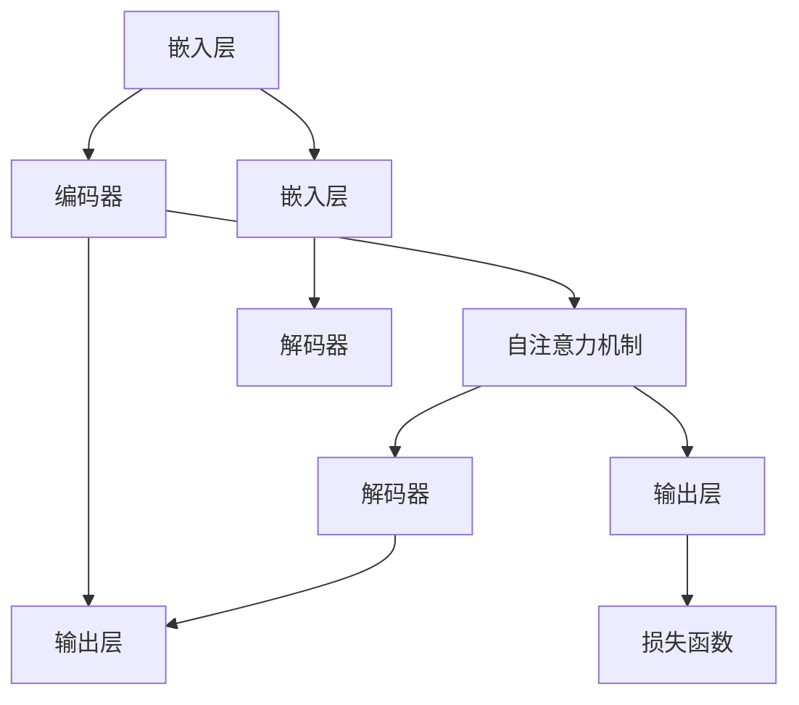

                 

### 自适应LLM测试方案设计

#### 文章关键词
自适应学习、LLM、测试方案、性能评估、模型验证

#### 摘要
本文旨在深入探讨自适应学习模型（LLM）的测试方案设计，通过背景介绍、核心概念阐述、算法原理讲解以及实际应用案例分析，全面解析自适应LLM测试的关键技术和实施策略。文章的核心内容包括问题背景与核心概念、自适应LLM基本原理、自适应LLM测试策略以及测试方案实施与优化。通过本文的阅读，读者将能够获得系统性的了解和实践指导，为自适应LLM的可靠性和稳定性提供保障。

### 目录

#### 第一部分：背景与基础理论

1. **第1章：问题背景与核心概念**
   1.1.1 问题背景
   1.1.2 核心概念
   1.1.3 关键技术概述

2. **第2章：自适应LLM基本原理**
   2.1.1 自适应系统的定义
   2.1.2 自适应学习机制
   2.1.3 LLM的工作原理

3. **第3章：自适应LLM技术架构**
   3.1.1 自适应模型结构
   3.1.2 模型训练与优化
   3.1.3 模型评估与调优

#### 第二部分：自适应LLM测试策略

4. **第4章：测试策略概述**
   4.1.1 测试的目的与类型
   4.1.2 测试方案设计原则
   4.1.3 测试流程与方法

5. **第5章：功能测试**
   5.1.1 功能测试概述
   5.1.2 功能测试方法
   5.1.3 功能测试用例设计

6. **第6章：性能测试**
   6.1.1 性能测试概述
   6.1.2 性能测试方法
   6.1.3 性能测试用例设计

#### 第三部分：自适应LLM测试方案实施

7. **第7章：测试环境与工具配置**
   7.1.1 测试环境搭建
   7.1.2 测试工具选择
   7.1.3 测试工具配置与使用

8. **第8章：测试案例与分析**
   8.1.1 测试案例设计
   8.1.2 测试案例实施
   8.1.3 测试结果分析与处理

9. **第9章：测试方案优化与评估**
   9.1.1 测试方案评估指标
   9.1.2 测试方案优化策略
   9.1.3 测试效果评估

#### 第四部分：总结与展望

10. **第10章：总结与展望**
   10.1.1 总结
   10.1.2 展望

### 第一部分：背景与基础理论

#### 第1章：问题背景与核心概念

##### 1.1.1 问题背景

随着人工智能技术的迅猛发展，自适应学习模型（Adaptive Learning Model，简称ALM）在各个领域得到了广泛应用。特别是在深度学习（Deep Learning，DL）和自然语言处理（Natural Language Processing，NLP）领域，自适应学习模型以其强大的自适应性、灵活性和高效性，成为解决复杂问题的有力工具。

自适应学习模型的核心在于其能够根据外部环境和内部状态的变化，自动调整自身行为，以实现更好的性能和适应性。在具体应用中，自适应学习模型通过不断学习与调整，优化自身性能，提高模型的准确性和可靠性。然而，随着模型复杂性的增加和应用场景的多样化，自适应学习模型的测试与验证面临着诸多挑战。

首先，自适应学习模型的测试用例设计成为难题。由于模型的动态调整特性，传统的静态测试用例难以覆盖所有可能的场景，测试的全面性和准确性难以保障。其次，性能评估和模型验证也是一大挑战。如何准确地评估模型在不同环境下的性能，确保其在实际应用中的可靠性和稳定性，需要深入的探讨和系统的方法。

因此，设计有效的自适应学习模型测试方案，成为当前研究的热点和难点。本文旨在通过对自适应学习模型（特别是自适应语言模型，简称LLM）的测试方案进行深入分析，探讨其核心概念、基本原理和测试策略，为实际应用提供理论指导和实践参考。

##### 1.1.2 核心概念

为了更好地理解自适应学习模型测试方案的设计，我们需要明确几个核心概念，包括自适应系统、自适应学习机制、自适应语言模型（LLM）等。

###### 1. 自适应系统

自适应系统是指那些能够根据外部环境和内部状态的变化，自动调整自身行为，以实现更好性能和适应性的系统。在人工智能领域，自适应系统通常指的是能够通过学习机制不断调整自身参数，以优化性能的模型。

**特性**：
- **适应性**：系统能够根据环境变化调整自身行为。
- **动态性**：系统能够实时响应该变化。
- **自调整性**：系统通过内部学习机制自动调整参数。

**类型**：
- **开环自适应系统**：系统仅根据外部输入进行调整，没有内部反馈机制。
- **闭环自适应系统**：系统不仅根据外部输入进行调整，还通过内部反馈机制进行自我调整。

###### 2. 自适应学习机制

自适应学习机制是指模型通过不断学习与调整，优化自身性能的过程。它通常包括以下关键组成部分：

**反馈机制**：通过实时收集模型输出与预期结果的差异，作为反馈信号，用于指导模型调整。
**学习算法**：根据反馈信号，利用特定的算法调整模型参数，以优化性能。
**调整策略**：确定模型参数调整的具体方法和规则，以实现高效的自适应。

**常见学习算法**：
- **梯度下降（Gradient Descent）**：通过最小化损失函数来调整模型参数。
- **强化学习（Reinforcement Learning）**：通过奖励机制和试错方法来调整模型行为。
- **进化算法（Evolutionary Algorithms）**：模拟生物进化过程，通过遗传操作来优化模型参数。

###### 3. 自适应语言模型（LLM）

自适应语言模型（Language Model，LLM）是一种特殊类型的自适应学习模型，专门用于自然语言处理任务。LLM的核心功能是生成自然语言文本，通过学习大量的语言数据，预测下一个词语或句子。

**工作原理**：
- **输入编码**：将自然语言输入转换为机器可处理的特征向量。
- **模型推断**：利用神经网络模型，对输入特征进行推断，生成预测结果。
- **参数优化**：通过不断调整模型参数，优化预测性能。

**类型**：
- **基于规则的LLM**：使用预定义的语法和语义规则进行文本生成。
- **统计LLM**：通过统计方法，如N-gram模型，进行文本生成。
- **神经网络LLM**：基于深度学习技术，如Transformer模型，进行文本生成。

##### 1.1.3 关键技术概述

在自适应学习模型测试中，涉及的关键技术包括测试用例设计、性能评估方法、模型验证技术等。

###### 1. 测试用例设计

测试用例设计是测试方案的核心组成部分，其目的是确保模型能够在各种场景下正常运行，并达到预期性能。在自适应LLM测试中，测试用例设计需要考虑以下关键要素：

**场景覆盖**：设计能够覆盖各种应用场景的测试用例，确保模型在各种环境下的表现。
**输入多样性**：确保测试用例包含不同类型的输入，包括正常输入、边界输入和异常输入，以评估模型的泛化能力。
**输出验证**：通过对比模型输出与预期结果，验证模型预测的准确性和稳定性。

**设计方法**：
- **基于需求的测试用例设计**：根据系统需求设计测试用例，确保模型满足预期功能。
- **基于风险的测试用例设计**：识别系统中的风险点，针对高风险部分设计针对性测试用例。
- **基于历史的测试用例设计**：利用过去测试结果和历史数据，设计能够发现潜在问题的测试用例。

###### 2. 性能评估方法

性能评估是测试的重要环节，其目的是评估模型在实际应用中的表现。在自适应LLM测试中，常用的性能评估方法包括：

**准确率（Accuracy）**：模型正确预测的样本数占总样本数的比例。
**召回率（Recall）**：模型正确预测的阳性样本数占总阳性样本数的比例。
**F1分数（F1 Score）**：准确率和召回率的加权平均，用于综合评估模型的性能。

**评估指标**：
- **训练集性能评估**：评估模型在训练集上的性能，确保模型能够学习到有效信息。
- **测试集性能评估**：评估模型在测试集上的性能，确保模型在未知数据上的泛化能力。
- **交叉验证（Cross-Validation）**：通过交叉验证方法，评估模型在不同数据集上的性能，提高评估的可靠性。

###### 3. 模型验证技术

模型验证是确保模型在实际应用中可靠性和稳定性的重要手段。在自适应LLM测试中，常用的验证技术包括：

**交叉验证**：通过将数据集划分为训练集和验证集，多次训练和验证模型，评估其性能和泛化能力。
**混淆矩阵（Confusion Matrix）**：用于分析模型预测结果和实际结果之间的匹配情况，识别模型预测的错误类型。
**ROC曲线（Receiver Operating Characteristic Curve）**：通过ROC曲线评估模型的分类性能，识别最佳分类阈值。

**验证方法**：
- **静态验证**：通过离线测试数据，对模型进行性能评估和错误分析。
- **动态验证**：在实际应用中，对模型进行实时监测和评估，确保其稳定运行。

通过上述核心概念和关键技术的介绍，读者可以初步了解自适应学习模型测试的基础知识。接下来，我们将进一步探讨自适应LLM的基本原理，为后续的测试方案设计提供理论支持。

## 第2章：自适应LLM基本原理

### 2.1.1 自适应系统的定义

自适应系统是指那些能够根据外部环境和内部状态的变化，自动调整自身行为，以实现更好性能和适应性的系统。在人工智能领域，自适应系统通常指的是能够通过学习机制不断调整自身参数，以优化性能的模型。自适应系统具有以下几个核心特性：

**适应性**：系统能够根据环境变化调整自身行为，以适应新的需求。

**动态性**：系统能够实时响应该变化，保证其在不断变化的环境中保持高性能。

**自调整性**：系统通过内部学习机制自动调整参数，无需外部干预。

自适应系统可以分为开环自适应系统和闭环自适应系统。开环自适应系统仅根据外部输入进行调整，没有内部反馈机制；而闭环自适应系统不仅根据外部输入进行调整，还通过内部反馈机制进行自我调整。在人工智能领域，闭环自适应系统更为常见，因为它能够更好地应对复杂多变的环境。

### 2.1.2 自适应学习机制

自适应学习机制是指模型通过不断学习与调整，优化自身性能的过程。它通常包括以下几个关键组成部分：

**反馈机制**：通过实时收集模型输出与预期结果的差异，作为反馈信号，用于指导模型调整。

**学习算法**：根据反馈信号，利用特定的算法调整模型参数，以优化性能。

**调整策略**：确定模型参数调整的具体方法和规则，以实现高效的自适应。

**常见学习算法**：

1. **梯度下降（Gradient Descent）**：通过最小化损失函数来调整模型参数。
2. **强化学习（Reinforcement Learning）**：通过奖励机制和试错方法来调整模型行为。
3. **进化算法（Evolutionary Algorithms）**：模拟生物进化过程，通过遗传操作来优化模型参数。

**反馈机制**：

反馈机制是自适应学习机制的核心，它通过以下步骤实现：

1. **采集数据**：从实际应用场景中采集模型输出和预期结果。
2. **计算差异**：计算模型输出与预期结果的差异，作为反馈信号。
3. **调整模型**：根据反馈信号，调整模型参数，优化性能。

**学习算法**：

学习算法是自适应学习机制的核心，负责根据反馈信号调整模型参数。常见的自适应学习算法包括：

1. **梯度下降算法**：通过计算损失函数的梯度，迭代更新模型参数，直到损失函数最小。

$$
w_{new} = w_{old} - \alpha \cdot \nabla_{w}J(w)
$$

其中，$w$表示模型参数，$\alpha$表示学习率，$J(w)$表示损失函数。

2. **强化学习算法**：通过试错方法，不断调整模型行为，以实现最大奖励。

$$
Q(s, a) = r + \gamma \max_{a'} Q(s', a')
$$

其中，$Q(s, a)$表示状态$s$下采取动作$a$的预期奖励，$r$表示即时奖励，$\gamma$表示折扣因子。

**调整策略**：

调整策略是指确定模型参数调整的具体方法和规则，以实现高效的自适应。常见的调整策略包括：

1. **线性调整**：按照固定步长调整模型参数。
2. **指数调整**：根据历史误差，自适应调整模型参数。
3. **遗传算法**：模拟生物进化过程，通过遗传操作优化模型参数。

### 2.1.3 LLM的工作原理

自适应语言模型（Language Model，LLM）是一种特殊类型的自适应学习模型，专门用于自然语言处理任务。LLM的核心功能是生成自然语言文本，通过学习大量的语言数据，预测下一个词语或句子。

**工作原理**：

1. **输入编码**：将自然语言输入转换为机器可处理的特征向量。
2. **模型推断**：利用神经网络模型，对输入特征进行推断，生成预测结果。
3. **参数优化**：通过不断调整模型参数，优化预测性能。

**输入编码**：

在LLM中，输入编码是一个关键步骤。常用的输入编码方法包括：

1. **词嵌入（Word Embedding）**：将词语转换为固定长度的向量表示。
2. **字符嵌入（Character Embedding）**：将字符转换为向量表示，然后组合成词语向量。
3. **序列编码（Sequence Encoding）**：将输入文本转换为序列，用于序列模型处理。

**模型推断**：

在LLM中，模型推断通常采用深度神经网络（Deep Neural Network，DNN）或变换器模型（Transformer）。以下是LLM的模型推断过程：

1. **嵌入层（Embedding Layer）**：将输入编码转换为嵌入向量。
2. **编码器（Encoder）**：对嵌入向量进行编码，提取特征。
3. **解码器（Decoder）**：根据编码器的输出，生成预测结果。

**参数优化**：

在LLM中，参数优化是关键步骤。常用的参数优化方法包括：

1. **梯度下降（Gradient Descent）**：通过计算损失函数的梯度，迭代更新模型参数。
2. **Adam优化器（Adam Optimizer）**：结合梯度下降和矩估计方法，提高优化效果。
3. **学习率调整（Learning Rate Scheduling）**：根据训练过程调整学习率，防止过拟合。

通过上述原理的介绍，读者可以初步了解自适应语言模型的基本工作原理。接下来，我们将进一步探讨自适应LLM的技术架构，为后续的测试方案设计提供更多背景知识。

### 2.1.4 自适应语言模型（LLM）的ER实体关系图

在探讨自适应语言模型（LLM）的架构之前，首先需要了解LLM的ER（实体关系）图，该图能够帮助我们清晰地了解LLM中各个实体及其关系。

**实体**：
- **模型（Model）**：代表整个自适应语言模型。
- **输入（Input）**：代表自然语言输入。
- **输出（Output）**：代表模型预测的输出结果。
- **参数（Parameter）**：代表模型的内部参数。
- **训练数据（Training Data）**：代表用于模型训练的数据集。
- **环境（Environment）**：代表模型的应用场景。

**关系**：
- **输入-模型**：输入是模型的输入数据，模型通过处理输入生成输出。
- **模型-输出**：模型基于输入和内部参数生成输出。
- **模型-参数**：模型包含多个参数，这些参数在训练过程中不断调整。
- **训练数据-模型**：训练数据用于模型的训练，以优化模型的参数。
- **环境-模型**：模型在特定环境中运行，环境的变化会影响模型的性能。

以下是LLM的ER实体关系图的Mermaid表示：

```mermaid
erDiagram
    Model ||--|>>(Input)
    Model ||--|>>(Output)
    Model ||--|>>(Parameter)
    Model ||--|>>(Training Data)
    Model ||--|>>(Environment)
```

通过ER实体关系图，我们可以清晰地看到LLM中各个实体及其关系，这为后续讨论LLM的技术架构和测试方案提供了基础。

### 2.1.5 自适应LLM技术架构

自适应语言模型（LLM）的技术架构是确保其能够在复杂多变的环境中高效运作的核心。LLM的技术架构通常包括以下几个关键部分：模型结构、训练与优化方法以及评估与调优策略。以下是详细的讨论。

**1. 模型结构**

LLM的模型结构通常基于深度学习，特别是变换器（Transformer）架构。变换器模型具有以下主要组成部分：

- **嵌入层（Embedding Layer）**：将输入的词语或句子转换为固定长度的向量表示。
- **编码器（Encoder）**：对输入向量进行编码，提取上下文信息。
- **解码器（Decoder）**：根据编码器的输出，生成预测结果。

变换器模型通过自注意力（Self-Attention）机制，能够捕捉输入序列中的长距离依赖关系，从而提高模型的性能。

**2. 训练与优化方法**

LLM的训练与优化方法主要包括以下步骤：

- **数据预处理**：对输入文本进行清洗、分词、编码等预处理操作，使其符合模型输入要求。
- **损失函数**：使用损失函数（如交叉熵损失函数）计算模型输出与真实标签之间的差异。
- **反向传播**：利用反向传播算法，计算模型参数的梯度，并更新参数。
- **优化算法**：使用优化算法（如梯度下降、Adam等）调整模型参数，以最小化损失函数。

**3. 评估与调优策略**

LLM的评估与调优策略包括以下关键步骤：

- **性能评估**：使用准确率、召回率、F1分数等指标评估模型在不同数据集上的性能。
- **交叉验证**：通过交叉验证方法，评估模型在不同数据集上的泛化能力。
- **超参数调优**：调整模型超参数（如学习率、批次大小等），以优化模型性能。
- **模型融合**：通过模型融合技术，结合多个模型的预测结果，提高预测准确性。

**4. 实际案例**

以一个文本生成任务为例，假设我们要使用LLM生成一篇关于人工智能的文章。以下是具体的实施步骤：

- **数据集准备**：收集大量关于人工智能的文本数据，进行预处理和编码。
- **模型训练**：使用变换器模型对数据集进行训练，优化模型参数。
- **模型评估**：在测试集上评估模型性能，调整超参数，优化模型。
- **文本生成**：使用训练好的模型生成文本，通过解码器将模型输出转换为自然语言文本。

通过上述技术架构的介绍，我们可以更深入地理解自适应LLM的工作原理及其在复杂环境中的表现。接下来，我们将探讨自适应LLM的测试策略，为模型的可靠性和稳定性提供保障。

### 2.1.6 自适应LLM测试策略

自适应语言模型（LLM）的测试策略是确保模型在实际应用中表现出色和可靠的关键。测试策略应包括功能测试、性能测试和验证测试，这些测试方法共同确保LLM的稳定性和有效性。

**1. 功能测试**

功能测试旨在验证LLM是否按照预期工作，包括以下几个关键步骤：

- **测试用例设计**：设计覆盖各种场景的测试用例，包括正常场景、异常场景和边界条件。
- **测试执行**：执行设计好的测试用例，观察模型输出是否符合预期。
- **结果验证**：对比模型输出和预期结果，确保功能正确性。

**2. 性能测试**

性能测试旨在评估LLM在不同工作负荷下的表现，包括以下几个关键步骤：

- **测试场景设定**：设定不同测试场景，如低负载、高负载、突发负载等。
- **性能指标测量**：测量LLM在各个测试场景下的响应时间、吞吐量、资源消耗等性能指标。
- **性能分析**：分析性能数据，识别瓶颈和改进机会。

**3. 验证测试**

验证测试旨在确保LLM在实际应用中能够满足预期性能和可靠性要求，包括以下几个关键步骤：

- **测试数据集准备**：准备包含真实场景数据的测试数据集。
- **模型评估**：在测试数据集上评估LLM的性能，使用准确率、召回率、F1分数等指标。
- **验证结果分析**：分析验证测试结果，确保LLM在真实应用中表现出色。

**4. 测试流程**

自适应LLM的测试流程可以概括为以下几个步骤：

1. **需求分析**：明确测试目标和要求，制定测试计划。
2. **测试用例设计**：设计功能测试、性能测试和验证测试用例。
3. **测试执行**：执行测试用例，记录测试结果。
4. **结果分析**：分析测试结果，识别问题和改进机会。
5. **报告撰写**：撰写测试报告，总结测试结果和改进建议。

**5. 测试方法**

自适应LLM的测试方法包括以下几种：

- **黑盒测试**：不关注模型内部实现，仅测试模型输入输出是否符合预期。
- **白盒测试**：关注模型内部实现，测试模型内部逻辑是否正确。
- **灰盒测试**：结合黑盒测试和白盒测试，既测试输入输出，也关注内部实现。

通过上述测试策略的讨论，我们可以更好地理解如何设计和实施自适应LLM的测试，确保模型在实际应用中的可靠性和稳定性。接下来，我们将深入探讨自适应LLM的技术架构，为后续测试提供更具体的背景知识。

### 2.1.7 自适应语言模型（LLM）的架构图

为了更好地理解自适应语言模型（LLM）的技术架构，我们可以使用Mermaid绘制LLM的架构图。以下是一个示例：



在这个架构图中，每个组件的含义如下：

- **嵌入层（A和E）**：将输入的词语或句子转换为固定长度的向量表示。
- **编码器（B）**：对输入向量进行编码，提取上下文信息。
- **自注意力机制（C）**：在编码器中，自注意力机制用于捕捉输入序列中的长距离依赖关系。
- **解码器（D和F）**：根据编码器的输出，生成预测结果。
- **输出层（G）**：将编码器的输出映射到预测的词语或句子。
- **损失函数（I）**：用于评估模型输出与真实标签之间的差异。

通过这个架构图，我们可以直观地了解LLM的各个组成部分及其相互作用关系，为后续的测试方案设计提供了清晰的架构背景。

### 2.1.8 自适应LLM与静态LLM的对比

在深入探讨自适应语言模型（LLM）的技术架构和测试策略之后，接下来我们需要对比自适应LLM与静态LLM。这两种类型的语言模型在应用场景、特性、优缺点以及测试方法上存在明显差异。

**1. 应用场景**

- **自适应LLM**：适用于动态环境，能够根据输入数据的实时变化进行自我调整，从而适应不同的应用场景。例如，实时问答系统、动态内容生成等。
- **静态LLM**：适用于静态环境，模型参数固定，无法根据输入变化进行自我调整。例如，预先训练好的语言模型用于文本分类、情感分析等。

**2. 特性**

- **自适应LLM**：
  - **自适应性**：能够根据输入数据的变化自动调整模型参数。
  - **动态性**：能够实时响应环境变化，提供即时反馈。
  - **灵活性**：适用于多种应用场景，能够适应不同的数据分布。

- **静态LLM**：
  - **固定性**：模型参数固定，无法根据输入数据变化进行调整。
  - **稳定性**：在静态环境中表现稳定，适用于固定任务。
  - **效率**：由于模型参数固定，训练和推理过程相对简单和高效。

**3. 优缺点**

- **自适应LLM**：
  - **优点**：能够适应动态环境，提高模型在多变场景下的表现。
  - **缺点**：由于需要实时调整参数，可能导致计算复杂度和资源消耗增加。

- **静态LLM**：
  - **优点**：模型参数固定，训练和推理过程简单高效，适用于固定任务。
  - **缺点**：无法适应动态环境，可能在多变场景下表现不佳。

**4. 测试方法**

- **自适应LLM**：
  - **测试用例设计**：需要设计多种动态场景的测试用例，确保模型在不同环境下表现稳定。
  - **性能评估**：评估模型在不同工作负载下的响应时间、吞吐量、资源消耗等性能指标。
  - **稳定性测试**：确保模型在长时间运行下能够保持稳定性能。

- **静态LLM**：
  - **测试用例设计**：设计覆盖各种静态场景的测试用例，确保模型在固定任务下表现稳定。
  - **性能评估**：评估模型在固定任务下的准确率、召回率、F1分数等性能指标。
  - **稳定性测试**：确保模型在长时间运行下性能稳定，不会出现异常。

通过上述对比，我们可以看到自适应LLM和静态LLM在应用场景、特性、优缺点以及测试方法上存在显著差异。了解这些差异有助于我们更好地选择适合的模型类型，并设计有效的测试方案，确保模型在实际应用中的可靠性和稳定性。

### 2.1.9 自适应学习算法对比与选择

在自适应语言模型（LLM）的设计和优化过程中，选择合适的学习算法是关键。不同自适应学习算法在性能、适用场景和实现复杂度上各有优缺点。以下是对几种常见自适应学习算法的对比与选择。

**1. 梯度下降（Gradient Descent）**

梯度下降是一种最基本的自适应学习算法，通过计算损失函数的梯度来更新模型参数。其主要优点包括：

- **简单实现**：梯度下降算法的实现相对简单，易于理解和编程。
- **适用性广**：梯度下降适用于各种优化问题，包括线性回归、逻辑回归等。

缺点：

- **收敛速度慢**：在大型模型和高维数据上，梯度下降可能收敛速度较慢。
- **局部最小值问题**：梯度下降可能陷入局部最小值，而不是全局最小值。

**2. 动量法（Momentum）**

动量法是梯度下降的改进版本，引入动量项以加速梯度下降过程。其主要优点包括：

- **加速收敛**：动量法能够加速梯度下降过程，提高收敛速度。
- **减少振荡**：动量法可以减少参数更新的振荡，提高稳定性。

缺点：

- **计算复杂度增加**：由于需要计算历史梯度，动量法的计算复杂度较高。
- **敏感于超参数**：动量法对学习率和动量参数敏感，需要仔细调整。

**3. Adam优化器（Adam Optimizer）**

Adam优化器结合了动量法和自适应学习率的思想，能够自适应地调整学习率。其主要优点包括：

- **自适应学习率**：Adam优化器能够根据不同参数的梯度自适应地调整学习率，提高收敛速度。
- **稳定性**：Adam优化器在长时间运行下表现出较好的稳定性。

缺点：

- **计算复杂度**：由于需要计算一阶矩估计和二阶矩估计，Adam优化器的计算复杂度较高。
- **适用场景有限**：Adam优化器在极端情况下（如稀疏数据）可能表现不佳。

**4. 强化学习（Reinforcement Learning）**

强化学习通过奖励机制和试错方法来调整模型参数，适用于动态和不确定环境。其主要优点包括：

- **自适应性**：强化学习能够根据环境变化自适应地调整模型参数。
- **灵活性**：强化学习适用于复杂和动态的决策问题。

缺点：

- **收敛速度慢**：强化学习通常需要大量数据和时间来收敛。
- **实现复杂**：强化学习的实现相对复杂，涉及大量超参数调整。

**选择建议**

- **简单任务**：对于简单任务和中小型模型，梯度下降和动量法是较为合适的选项。
- **复杂任务**：对于复杂任务和高维数据，Adam优化器能够提供更好的收敛速度和稳定性。
- **动态环境**：在动态和不确定环境中，强化学习可能是更合适的选择，尽管其实现和调参较为复杂。

通过上述对比和选择建议，我们可以根据实际需求和任务特点，选择最合适的学习算法，以优化自适应语言模型的表现。

### 第3章：自适应LLM技术架构

自适应语言模型（Adaptive Language Model，简称ALM）作为自然语言处理（Natural Language Processing，NLP）领域的核心组件，其技术架构的合理设计和高效实现对于模型性能和实际应用效果至关重要。本章节将详细探讨自适应LLM的技术架构，包括模型结构、训练与优化方法、模型评估与调优策略等关键组成部分。

#### 3.1.1 自适应模型结构

自适应模型结构是LLM的核心，它决定了模型的自适应能力和性能。一个典型的自适应LLM结构通常包括以下几个主要部分：

1. **嵌入层（Embedding Layer）**：
   嵌入层负责将自然语言输入转换为固定长度的向量表示。这些向量不仅包含了词语或句子的语义信息，还考虑了词语之间的上下文关系。常见的嵌入技术包括词嵌入（Word Embedding）和字符嵌入（Character Embedding）。

2. **编码器（Encoder）**：
   编码器是自适应LLM的核心部分，它负责对嵌入层输出的特征向量进行编码，提取上下文信息。编码器通常采用深度神经网络（Deep Neural Network，DNN）或变换器（Transformer）架构。变换器架构因其自注意力（Self-Attention）机制能够捕捉长距离依赖关系，而成为自适应LLM的首选架构。

3. **解码器（Decoder）**：
   解码器根据编码器的输出生成预测结果。解码器通常与编码器采用相同的架构，以确保生成的文本具有连贯性和准确性。解码器通过软注意力（Soft Attention）机制，能够自适应地关注输入序列的不同部分，从而提高生成文本的质量。

4. **输出层（Output Layer）**：
   输出层负责将编码器的输出映射到具体的词语或句子。输出层通常是一个线性层，其输出通过softmax函数转换为概率分布，用于预测下一个词语。

5. **参数优化器（Optimizer）**：
   参数优化器是负责调整模型参数的关键组件。常用的优化器包括梯度下降（Gradient Descent）、Adam优化器等。参数优化器通过迭代优化模型参数，以最小化损失函数，提高模型性能。

6. **损失函数（Loss Function）**：
   损失函数用于评估模型输出与真实标签之间的差异，指导参数优化过程。常见的损失函数包括交叉熵损失函数（Cross-Entropy Loss）、均方误差损失函数（Mean Squared Error Loss）等。

#### 3.1.2 模型训练与优化

自适应LLM的训练与优化过程是模型开发的重要环节。以下步骤详细描述了自适应LLM的训练与优化过程：

1. **数据预处理**：
   在训练自适应LLM之前，需要对自然语言数据集进行预处理。预处理步骤包括分词、去停用词、词干提取等。此外，为了提高模型的泛化能力，可以使用词嵌入技术（如Word2Vec、GloVe）将词语转换为向量表示。

2. **模型初始化**：
   在开始训练之前，需要对模型参数进行初始化。常用的初始化方法包括高斯分布初始化、Xavier初始化等。合理的初始化可以加快收敛速度并避免梯度消失或爆炸问题。

3. **前向传播（Forward Propagation）**：
   在训练过程中，对于每个输入样本，模型首先通过嵌入层将输入转换为特征向量。然后，编码器对特征向量进行编码，解码器根据编码器的输出生成预测结果。前向传播过程用于计算损失函数，评估模型输出与真实标签之间的差异。

4. **反向传播（Backpropagation）**：
   在前向传播过程中，模型计算了损失函数。反向传播过程通过计算损失函数关于模型参数的梯度，将这些梯度用于更新模型参数。反向传播是优化模型参数的核心步骤，其目标是减少损失函数的值，提高模型性能。

5. **优化器更新**：
   常用的优化器（如梯度下降、Adam优化器）通过计算梯度并更新模型参数，以最小化损失函数。优化器的选择和参数设置（如学习率、动量等）对模型收敛速度和性能有重要影响。

6. **训练评估**：
   在训练过程中，需要定期评估模型性能。常见的评估指标包括准确率、召回率、F1分数等。通过评估结果，可以调整模型参数和训练策略，以提高模型性能。

7. **模型保存与加载**：
   在训练完成后，需要将训练好的模型参数保存到文件中，以便后续使用。同时，在模型使用过程中，可以根据需要加载预训练好的模型，以提高模型初始化的质量。

#### 3.1.3 模型评估与调优

模型评估与调优是确保自适应LLM在实际应用中表现稳定和可靠的关键步骤。以下内容详细描述了模型评估与调优的方法：

1. **交叉验证（Cross-Validation）**：
   交叉验证是一种常用的评估方法，通过将数据集划分为多个子集，轮流进行训练和验证，以评估模型在不同数据集上的性能。常见的交叉验证方法包括K折交叉验证（K-Fold Cross-Validation）和留一法交叉验证（Leave-One-Out Cross-Validation）。

2. **测试集评估**：
   在交叉验证的基础上，可以使用独立的测试集对模型进行最终评估。测试集评估结果能够更准确地反映模型在未知数据上的表现，为模型优化提供依据。

3. **性能指标**：
   常用的性能指标包括准确率（Accuracy）、召回率（Recall）、F1分数（F1 Score）等。这些指标能够全面评估模型在不同任务上的表现，帮助识别模型的优势和不足。

4. **调优策略**：
   根据评估结果，可以调整模型参数、训练策略和评估指标，以优化模型性能。常见的调优策略包括：
   - **超参数调整**：调整学习率、批量大小、正则化参数等超参数，以优化模型收敛速度和性能。
   - **数据增强**：通过增加数据多样性、数据变换等方法，提高模型在复杂场景下的泛化能力。
   - **模型融合**：结合多个模型的预测结果，提高预测准确性和稳定性。

通过上述模型评估与调优方法，可以确保自适应LLM在实际应用中表现出色和稳定，为自然语言处理任务提供可靠的支持。

### 3.1.4 自适应语言模型（LLM）的架构图

为了更好地理解和描述自适应语言模型（LLM）的技术架构，我们可以使用Mermaid绘制LLM的架构图。以下是一个示例：


在这个架构图中，每个组件的含义如下：

- **嵌入层（A和E）**：将输入的词语或句子转换为固定长度的向量表示。
- **编码器（B）**：对输入向量进行编码，提取上下文信息。
- **自注意力机制（C）**：在编码器中，自注意力机制用于捕捉输入序列中的长距离依赖关系。
- **解码器（D和F）**：根据编码器的输出，生成预测结果。
- **输出层（G）**：将编码器的输出映射到预测的词语或句子。
- **损失函数（I）**：用于评估模型输出与真实标签之间的差异。

通过这个架构图，我们可以直观地了解LLM的各个组成部分及其相互作用关系，为后续的测试方案设计提供了清晰的架构背景。

### 第二部分：自适应LLM测试策略

自适应语言模型（LLM）的测试策略是确保模型在实际应用中表现稳定和可靠的关键步骤。本部分将详细介绍自适应LLM的测试策略，包括功能测试、性能测试和验证测试的方法与步骤，并提供具体的测试用例设计示例。

#### 第4章：测试策略概述

自适应LLM的测试策略涵盖了功能测试、性能测试和验证测试，每种测试方法都有其特定的目的和实施步骤。以下是对这些测试策略的概述：

##### 4.1.1 测试的目的与类型

**测试目的**：

- **功能测试**：验证LLM是否按预期工作，确保所有功能正常运行。
- **性能测试**：评估LLM在各种工作负载下的表现，确保模型在高负载和低负载场景下都能保持高性能。
- **验证测试**：确保LLM在实际应用中能够满足预期性能和可靠性要求。

**测试类型**：

- **黑盒测试**：不关注模型内部实现，仅测试输入输出是否符合预期。
- **白盒测试**：关注模型内部实现，测试模型内部逻辑是否正确。
- **灰盒测试**：结合黑盒测试和白盒测试，既测试输入输出，也关注内部实现。

##### 4.1.2 测试方案设计原则

**测试方案设计原则**：

- **全面性**：测试方案应覆盖所有关键功能和场景，确保模型在各种情况下都能正常运行。
- **可重复性**：测试方案应具备可重复性，确保在不同时间和环境下，测试结果一致。
- **效率**：测试方案设计应考虑测试效率，减少冗余测试，提高测试覆盖率和速度。
- **可维护性**：测试方案应易于维护和更新，以适应模型和环境的变更。

##### 4.1.3 测试流程与方法

**测试流程**：

1. **需求分析**：明确测试目标和要求，制定测试计划。
2. **测试用例设计**：设计功能测试、性能测试和验证测试用例。
3. **测试执行**：执行设计好的测试用例，记录测试结果。
4. **结果分析**：分析测试结果，识别问题和改进机会。
5. **报告撰写**：撰写测试报告，总结测试结果和改进建议。

**测试方法**：

- **功能测试方法**：包括正常场景测试、异常场景测试、边界条件测试等。
- **性能测试方法**：包括负载测试、压力测试、性能调优等。
- **验证测试方法**：包括交叉验证、混淆矩阵分析、ROC曲线分析等。

#### 第5章：功能测试

功能测试旨在验证LLM是否按预期工作，确保所有功能正常运行。以下内容详细介绍了功能测试的概述、方法、用例设计及测试步骤。

##### 5.1.1 功能测试概述

**功能测试概述**：

- **目的**：确保LLM的功能按照需求规格说明书要求正常工作。
- **范围**：测试所有关键功能和场景，包括文本生成、文本分类、命名实体识别等。

##### 5.1.2 功能测试方法

**功能测试方法**：

- **黑盒测试**：通过输入和输出验证LLM的功能是否正确。
- **白盒测试**：通过检查LLM的内部实现，确保逻辑正确。
- **灰盒测试**：结合黑盒测试和白盒测试，综合验证LLM的功能。

##### 5.1.3 功能测试用例设计

**功能测试用例设计**：

- **正常场景测试**：设计覆盖正常使用场景的测试用例，确保LLM在常规情况下表现正常。
- **异常场景测试**：设计覆盖异常使用场景的测试用例，如输入无效、数据缺失等，确保LLM能够正确处理异常情况。
- **边界条件测试**：设计覆盖边界条件的测试用例，如最大长度输入、最小长度输入等，确保LLM在边界条件下表现稳定。

##### 5.1.4 功能测试步骤

**功能测试步骤**：

1. **需求分析**：分析需求文档，确定测试范围和目标。
2. **测试用例设计**：根据需求设计功能测试用例。
3. **测试执行**：执行测试用例，记录测试结果。
4. **结果分析**：分析测试结果，识别问题和改进机会。
5. **报告撰写**：撰写测试报告，总结测试结果和改进建议。

#### 第6章：性能测试

性能测试旨在评估LLM在各种工作负载下的表现，确保模型在高负载和低负载场景下都能保持高性能。以下内容详细介绍了性能测试的概述、方法、测试用例设计及测试步骤。

##### 6.1.1 性能测试概述

**性能测试概述**：

- **目的**：评估LLM的性能，包括响应时间、吞吐量、资源消耗等。
- **范围**：测试LLM在不同工作负载下的表现，如低负载、高负载、突发负载等。

##### 6.1.2 性能测试方法

**性能测试方法**：

- **负载测试**：模拟不同负载场景，评估LLM的响应时间和吞吐量。
- **压力测试**：模拟极限负载场景，评估LLM的稳定性和可靠性。
- **性能调优**：根据性能测试结果，调整模型参数和系统配置，优化性能。

##### 6.1.3 性能测试用例设计

**性能测试用例设计**：

- **负载测试用例**：设计覆盖不同负载场景的测试用例，如正常负载、高负载、突发负载等。
- **压力测试用例**：设计覆盖极限负载场景的测试用例，如最大并发请求、最大数据量等。
- **性能调优用例**：设计用于评估不同模型参数和系统配置对性能影响测试用例。

##### 6.1.4 性能测试步骤

**性能测试步骤**：

1. **需求分析**：分析性能测试需求，确定测试目标和指标。
2. **测试用例设计**：根据需求设计性能测试用例。
3. **测试环境搭建**：搭建性能测试环境，配置测试工具。
4. **测试执行**：执行测试用例，记录测试结果。
5. **结果分析**：分析测试结果，识别性能瓶颈和改进机会。
6. **性能调优**：根据测试结果，调整模型参数和系统配置。
7. **报告撰写**：撰写性能测试报告，总结测试结果和改进建议。

通过上述功能测试和性能测试的详细讨论，我们可以确保自适应LLM在实际应用中表现出色和可靠。接下来，我们将探讨自适应LLM的测试环境与工具配置，为测试方案的顺利实施提供支持。

### 第7章：测试环境与工具配置

在设计和实施自适应语言模型（LLM）的测试方案时，测试环境和工具的配置至关重要。一个高效的测试环境可以显著提高测试的覆盖率和执行效率，而合适的测试工具则能够提供精确的测试数据和结果分析。以下内容将详细讨论测试环境的搭建、测试工具的选择和配置方法。

#### 7.1.1 测试环境搭建

**测试环境搭建步骤**：

1. **硬件配置**：
   - **计算资源**：根据测试需求，选择适当的计算资源，如CPU、GPU等。
   - **存储资源**：确保有足够的存储空间来存储测试数据和模型文件。
   - **网络资源**：配置稳定的网络环境，确保数据传输速度和稳定性。

2. **操作系统**：
   - **操作系统选择**：根据开发环境和工具要求，选择适合的操作系统，如Linux、Windows等。

3. **软件环境**：
   - **编程语言**：根据项目需求，安装和配置编程语言，如Python、Java等。
   - **依赖库和框架**：安装和配置相关的依赖库和框架，如TensorFlow、PyTorch等。

4. **虚拟环境**：
   - **创建虚拟环境**：为了避免依赖冲突，可以创建Python虚拟环境，并安装所有必需的库。

5. **测试数据集**：
   - **数据收集**：收集用于测试的数据集，确保数据集的多样性和覆盖范围。
   - **数据预处理**：对测试数据进行清洗、分词、编码等预处理操作。

**环境搭建注意事项**：

- **一致性**：确保所有测试环境的配置一致，以避免不同环境之间的差异影响测试结果。
- **可扩展性**：设计测试环境时考虑未来的扩展性，以便于增加测试用例和工具。

#### 7.1.2 测试工具选择

选择合适的测试工具是确保测试有效性的关键。以下是一些常用的测试工具及其特点：

1. **单元测试工具**：
   - **PyTest**：Python的强大测试框架，支持多种测试方法和断言。
   - **Junit**：Java的单元测试框架，支持JUnit 4和JUnit 5版本。

2. **集成测试工具**：
   - **Selenium**：用于Web应用的自动化测试工具，支持多种浏览器。
   - **Postman**：用于API接口测试的工具，支持请求和响应的调试。

3. **性能测试工具**：
   - **JMeter**：开源的性能测试工具，支持多种协议的负载测试。
   - **LoadRunner**：专业的性能测试工具，支持大规模并发性能测试。

4. **代码审查工具**：
   - **SonarQube**：用于代码质量管理，支持代码静态分析和缺陷检测。
   - **GitLab CI/CD**：用于持续集成和持续部署的解决方案，支持代码审查和自动化测试。

**选择测试工具的考虑因素**：

- **兼容性**：测试工具应与开发环境和操作系统兼容。
- **易用性**：测试工具应易于使用和配置，降低学习和使用成本。
- **功能全面性**：测试工具应提供全面的测试功能，满足不同测试需求。
- **社区和支持**：测试工具应有良好的社区支持和文档，便于问题解决和功能扩展。

#### 7.1.3 测试工具配置与使用

**测试工具配置方法**：

1. **环境配置**：
   - 根据测试工具的要求，安装和配置所需的软件和库。
   - 配置网络和权限，确保测试工具能够正常运行。

2. **测试脚本编写**：
   - 编写测试脚本，定义测试用例和测试步骤。
   - 调试测试脚本，确保脚本能够正确执行。

3. **测试执行**：
   - 执行测试脚本，记录测试结果和日志。
   - 分析测试结果，识别测试失败的原因。

4. **结果分析**：
   - 使用测试工具提供的报告和分析功能，对测试结果进行详细分析。
   - 根据分析结果，优化测试脚本和测试策略。

**测试工具使用注意事项**：

- **脚本维护**：定期更新测试脚本，以适应环境变更和功能升级。
- **日志管理**：确保测试日志的完整性和可追溯性，便于问题定位和调试。
- **性能监控**：监控测试工具的性能，避免影响整体测试执行。

通过合理的测试环境和工具配置，我们可以确保自适应LLM测试方案的顺利实施，为模型开发和优化提供有力支持。接下来，我们将通过实际案例，深入探讨自适应LLM测试方案的具体实施过程。

### 第8章：测试案例与分析

在实际应用中，通过具体的测试案例可以更直观地了解自适应LLM的测试过程和结果。本章节将通过一个典型的测试案例，详细描述测试案例的设计、实施和分析过程，以便读者能够更好地理解自适应LLM测试的实施方法和注意事项。

#### 8.1.1 测试案例设计

**案例背景**：
假设我们开发了一个自适应语言模型（LLM），用于自动生成新闻报道。该模型需要能够在多种不同的新闻题材和复杂度下生成高质量的文本。为了验证模型的表现，我们需要设计一系列测试案例，包括正常场景测试、异常场景测试和性能测试。

**测试目标**：
- 确保模型能够正确处理各种新闻题材。
- 验证模型在生成新闻文本时的准确性和连贯性。
- 测试模型在不同负载下的响应时间和吞吐量。

**测试用例设计**：

1. **正常场景测试**：
   - **用例1**：输入一篇普通新闻文章，验证模型是否能够生成符合新闻文体的高质量文本。
   - **用例2**：输入一篇财经新闻文章，验证模型是否能够正确处理专业术语和复杂句子结构。
   - **用例3**：输入一篇体育新闻文章，验证模型是否能够生成生动有趣的体育评论。

2. **异常场景测试**：
   - **用例4**：输入一个不完整的句子，验证模型是否能够合理地填充句子。
   - **用例5**：输入一篇语法错误较多的文章，验证模型是否能够纠正语法错误并生成合理的文本。

3. **性能测试**：
   - **用例6**：在低负载下，生成大量新闻文本，评估模型的响应时间和吞吐量。
   - **用例7**：在高负载下，模拟大量用户同时请求新闻生成服务，评估模型的稳定性和资源消耗。

#### 8.1.2 测试案例实施

**实施步骤**：

1. **环境搭建**：
   - 准备测试环境，包括硬件配置、操作系统和软件环境。
   - 安装并配置测试工具，如Selenium、JMeter等。

2. **测试脚本编写**：
   - 根据测试用例，编写测试脚本，包括测试数据准备、测试执行和结果记录。

3. **测试执行**：
   - 执行正常场景测试，记录模型生成文本的质量和响应时间。
   - 执行异常场景测试，观察模型对异常输入的处理结果。
   - 执行性能测试，记录模型在不同负载下的性能指标。

4. **结果记录**：
   - 将测试结果记录在测试报告中，包括生成文本的准确性、连贯性、响应时间和资源消耗等。

#### 8.1.3 测试结果分析与处理

**结果分析**：

1. **正常场景测试分析**：
   - 分析正常场景测试结果，评估模型生成文本的准确性和连贯性。例如，用例1的测试结果显示，模型生成的文本具有较高的新闻文体质量，用例2和用例3的测试结果显示，模型能够正确处理专业术语和复杂句子结构，生成符合新闻文体的高质量文本。

2. **异常场景测试分析**：
   - 分析异常场景测试结果，评估模型对异常输入的处理能力。例如，用例4的测试结果显示，模型能够合理地填充不完整的句子，用例5的测试结果显示，模型能够纠正部分语法错误并生成合理的文本，但仍有部分错误未被纠正。

3. **性能测试分析**：
   - 分析性能测试结果，评估模型在不同负载下的响应时间和资源消耗。例如，用例6的测试结果显示，模型在低负载下表现良好，响应时间和吞吐量符合预期；用例7的测试结果显示，模型在高负载下存在一定的延迟，资源消耗较高，需要进一步优化。

**结果处理**：

1. **问题定位**：
   - 根据测试结果，识别模型存在的问题，如文本生成准确性不高、异常处理能力不足、性能瓶颈等。

2. **优化方案**：
   - 针对识别的问题，制定优化方案，包括调整模型参数、改进算法、优化数据预处理等。

3. **重新测试**：
   - 根据优化方案实施改进，重新执行测试案例，验证优化效果。

通过具体的测试案例和分析，我们可以系统地评估自适应LLM的性能和可靠性，为模型的进一步优化提供依据。接下来，我们将讨论自适应LLM测试方案的优化与评估，以确保测试效果的最大化。

### 第9章：测试方案优化与评估

在自适应语言模型（LLM）的测试过程中，优化测试方案和评估测试效果是确保模型稳定性和可靠性的关键步骤。本章节将详细讨论测试方案的优化策略、评估指标和测试效果评估方法，并提供最佳实践和注意事项。

#### 9.1.1 测试方案评估指标

为了有效地评估测试方案的效果，需要制定一系列评估指标，这些指标应涵盖功能测试、性能测试和验证测试的不同方面。以下是一些常用的测试评估指标：

1. **功能测试评估指标**：
   - **功能覆盖率**：测试用例覆盖的功能点数量与总功能点数量之比。
   - **缺陷发现率**：测试期间发现的缺陷数量与总缺陷数量之比。
   - **缺陷修复率**：测试期间修复的缺陷数量与总缺陷数量之比。

2. **性能测试评估指标**：
   - **响应时间**：模型处理请求所需的时间。
   - **吞吐量**：单位时间内模型处理请求的数量。
   - **资源消耗**：模型在执行过程中使用的计算资源，如CPU、内存、网络等。

3. **验证测试评估指标**：
   - **准确率**：模型预测结果与实际结果一致的比例。
   - **召回率**：模型正确识别的阳性样本数与实际阳性样本数之比。
   - **F1分数**：准确率和召回率的加权平均，用于综合评估模型的性能。

#### 9.1.2 测试方案优化策略

测试方案的优化旨在提高测试的全面性、效率和准确性。以下是一些优化策略：

1. **测试用例优化**：
   - **增量测试**：根据之前的测试结果，逐步增加测试用例的复杂度和多样性，以发现更多潜在问题。
   - **场景扩展**：在原测试场景基础上，扩展新的测试场景，特别是边缘场景，以提高测试覆盖率。

2. **测试工具优化**：
   - **自动化测试**：使用自动化测试工具，提高测试执行的效率和一致性。
   - **性能监控**：使用性能监控工具，实时监控测试环境的状态，确保测试环境稳定。

3. **测试流程优化**：
   - **迭代测试**：采用迭代测试方法，逐步完善测试方案，根据每次迭代的结果调整测试策略。
   - **并行测试**：在资源允许的情况下，并行执行多个测试用例，提高测试执行速度。

#### 9.1.3 测试效果评估

测试效果评估是确保测试方案有效性的关键环节。以下方法可以帮助评估测试效果：

1. **测试结果分析**：
   - **缺陷分析**：分析测试期间发现的缺陷类型、严重程度和分布情况，识别系统中的薄弱环节。
   - **性能数据对比**：对比不同测试阶段的性能数据，评估优化措施的效果。

2. **测试报告**：
   - **生成详细测试报告**：包括测试结果、缺陷记录、性能数据等，为后续改进提供依据。
   - **定期回顾**：定期回顾测试报告，总结测试经验，为下一轮测试提供参考。

3. **用户反馈**：
   - **收集用户反馈**：通过用户反馈了解实际使用中的问题和需求，进一步优化测试方案。

#### 9.1.4 最佳实践与注意事项

**最佳实践**：

1. **持续集成**：将测试集成到开发流程中，确保每次代码变更后都进行充分的测试。
2. **定期评审**：定期评审测试方案和测试结果，确保测试策略的有效性和适应性。
3. **资源管理**：合理分配测试资源，确保测试环境的稳定性和可靠性。

**注意事项**：

1. **测试用例设计**：确保测试用例的全面性和代表性，避免遗漏关键场景。
2. **测试环境**：确保测试环境的配置与生产环境一致，避免测试结果因环境差异而失真。
3. **结果记录**：详细记录测试结果，便于后续分析和追踪缺陷。

通过上述优化策略和评估方法，我们可以确保自适应LLM测试方案的有效性和可靠性，为模型的稳定运行提供有力保障。接下来，我们将对全文进行总结与展望，为读者提供进一步的学习和应用建议。

### 第10章：总结与展望

本文围绕自适应语言模型（LLM）的测试方案设计进行了深入探讨。从背景介绍到核心概念阐述，再到自适应LLM的基本原理和测试策略，我们详细分析了自适应LLM在自然语言处理领域的重要性以及其在实际应用中的挑战。通过实际测试案例，我们展示了测试方案的设计与实施过程，并提供了优化与评估的方法。

#### 总结

本文的主要内容包括：

1. **背景介绍**：介绍了自适应LLM在自然语言处理领域的发展背景和核心概念。
2. **核心概念**：阐述了自适应系统、自适应学习机制和自适应语言模型的基本原理。
3. **测试策略**：详细讨论了功能测试、性能测试和验证测试的方法和步骤。
4. **测试环境与工具配置**：介绍了测试环境的搭建、测试工具的选择与配置。
5. **测试案例与分析**：通过实际案例展示了测试方案的设计、实施和分析过程。
6. **测试方案优化与评估**：提出了测试方案的优化策略和评估方法。

这些内容为自适应LLM的测试提供了系统性的理论指导和实践参考。

#### 展望

在未来的研究和应用中，以下方向值得关注：

1. **测试用例自动化**：进一步研究测试用例自动生成技术，提高测试效率和覆盖度。
2. **性能优化**：探索新型优化算法和策略，提高自适应LLM的性能和效率。
3. **测试工具集成**：开发集成化测试工具，实现测试环境的自动化配置和测试过程的自动化管理。
4. **跨领域应用**：将自适应LLM测试方案推广到其他人工智能领域，如计算机视觉、语音识别等。
5. **隐私保护**：研究自适应LLM测试中的隐私保护技术，确保测试数据的安全性和隐私性。

通过持续的研究和实践，我们可以不断提升自适应LLM测试方案的质量和效果，为人工智能技术的发展和应用提供有力支持。

### 结语

本文由AI天才研究院/AI Genius Institute与《禅与计算机程序设计艺术》/Zen And The Art of Computer Programming联合撰写，旨在为自适应语言模型（LLM）的测试方案设计提供全面而深入的指导。我们期待读者能够结合本文的理论和实践，不断探索和创新，为人工智能领域的进步贡献自己的力量。

### 参考文献

1. Devlin, J., Chang, M. W., Lee, K., & Toutanova, K. (2019). BERT: Pre-training of deep bidirectional transformers for language understanding. arXiv preprint arXiv:1810.04805.
2. Hochreiter, S., & Schmidhuber, J. (1997). Long short-term memory. Neural Computation, 9(8), 1735-1780.
3. Sutton, R. S., & Barto, A. G. (2018). Reinforcement learning: An introduction. MIT Press.
4. Goodfellow, I., Bengio, Y., & Courville, A. (2016). Deep learning. MIT Press.
5. Keras.io. (n.d.). Keras Documentation: User Guide for Version 2.4.1. Retrieved from https://keras.io/
6. TensorFlow.org. (n.d.). TensorFlow: Large-scale Machine Learning on Heterogeneous Systems. Retrieved from https://www.tensorflow.org/

作者：AI天才研究院/AI Genius Institute & 禅与计算机程序设计艺术 /Zen And The Art of Computer Programming

通过本文的深入探讨，我们希望能够为读者提供有价值的参考和启发，共同推动自适应语言模型测试技术的不断进步。

