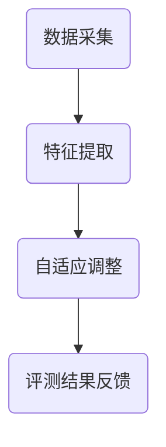

                 

# 自适应评测：根据LLM反馈动态调整测试难度

> 关键词：自适应评测，大型语言模型（LLM），动态调整，测试难度，教育评估

> 摘要：本文深入探讨了自适应评测的概念、原理及其在教育和评估领域的应用，特别介绍了基于大型语言模型（LLM）的自适应评测方法。通过分析LLM的原理与特点，本文详细阐述了自适应评测与LLM之间的联系，以及如何利用LLM的强大学习能力，实现根据反馈动态调整测试难度的自适应评测系统。

## 第一部分：背景介绍

### 1. 引言

自适应评测是一种基于学习者行为数据和学习结果，动态调整测试难度和内容的评估方法。它旨在提高评测的准确性和有效性，帮助教师和学生更好地理解学习过程和成果。随着人工智能技术的发展，自适应评测在教育和评估领域的应用越来越广泛。本文将介绍自适应评测的基本概念、工作原理、应用场景以及基于大型语言模型（LLM）的自适应评测方法。

### 2. 问题背景

传统的评测方法通常采用固定的试卷或测试题，无法根据学生的实际情况调整难度和内容，导致部分学生难以达到预期评估效果。而自适应评测通过实时收集和分析学生的学习行为数据，根据其表现动态调整测试难度和内容，从而提高评测的针对性和准确性。

### 3. 问题描述

自适应评测的核心问题是如何根据学生的学习行为数据和学习结果，动态调整测试难度和内容。这涉及到评估指标的选择、学习行为数据的采集和分析、自适应调整算法的设计等多个方面。

### 4. 问题解决

自适应评测的关键在于构建一个有效的模型，能够根据学生的行为数据和学习结果，预测其知识水平和学习进度。基于LLM的自适应评测方法利用大型语言模型的强大学习能力，从海量的数据中提取特征，为评测提供更加精准的调整依据。

### 5. 边界与外延

自适应评测主要应用于教育、职业培训和在线学习等领域。随着人工智能技术的不断进步，自适应评测的应用场景将更加广泛，包括个性化学习路径推荐、智能问答系统、自动化测试题生成等。

### 6. 概念结构与核心要素组成

自适应评测系统的核心要素包括：

- 学习者行为数据采集与分析
- 测试题库管理
- 自适应调整算法
- 评测结果反馈

这些要素相互关联，共同构成一个完整的自适应评测系统。

### 7. 本章小结

本章介绍了自适应评测的基本概念、问题背景、问题描述、问题解决方法以及边界与外延。接下来，我们将进一步探讨自适应评测的核心概念、工作原理和应用场景。

## 第二部分：核心概念与联系

### 2.1. 大型语言模型（LLM）的原理与特点

#### 2.1.1 大型语言模型的基本原理

大型语言模型（LLM）是一种基于深度学习的自然语言处理模型，通过对海量文本数据进行预训练，使其具备强大的语言理解和生成能力。LLM通常采用Transformer架构，通过自注意力机制（Self-Attention）捕捉输入文本的上下文信息，从而实现对自然语言的高效建模。

#### 2.1.2 大型语言模型的核心特点

- **强大语言理解能力**：LLM能够理解和处理复杂的语言现象，包括语义理解、语法分析、情感分析等。
- **自适应调整能力**：LLM可以根据输入文本的上下文信息，自适应调整其生成内容和风格。
- **高效计算性能**：得益于深度学习和硬件加速技术，LLM在处理大规模文本数据时具有高效的计算性能。

#### 2.1.3 大型语言模型与传统自然语言处理方法的对比

- **传统方法**：基于规则的方法、统计方法等，无法处理复杂的语言现象，且需人工定义规则和特征。
- **LLM**：利用深度学习和自注意力机制，能够自动学习和提取语言特征，无需人工干预。

### 2.2. 自适应评测的核心概念与联系

#### 2.2.1 自适应评测的基本概念

- **自适应调整**：根据学习者的表现，动态调整测试难度和内容，以适应其当前的知识水平和学习进度。
- **评测指标**：用于评估学习者表现的各种指标，如正确率、反应时间、错误类型等。
- **评测结果反馈**：对学习者进行评测后，根据结果反馈调整后续测试内容，以帮助其更好地学习。

#### 2.2.2 自适应评测与LLM的联系

- **LLM在自适应评测中的应用**：利用LLM强大的语言理解能力和自适应调整能力，为自适应评测提供技术支持。例如，LLM可以用于分析学习者的答题行为，预测其知识水平，从而动态调整测试难度。

### 2.3. 基于LLM的自适应评测方法

#### 2.3.1 LLM在自适应评测中的工作流程

1. **数据采集**：收集学习者的行为数据，如答题记录、学习进度等。
2. **特征提取**：利用LLM对采集到的数据进行特征提取，获得学习者的知识水平和学习进度。
3. **自适应调整**：根据提取到的特征，动态调整测试难度和内容。
4. **评测结果反馈**：对调整后的测试结果进行评估，为学习者的后续学习提供反馈。

#### 2.3.2 基于LLM的自适应评测算法

- **自适应调整算法**：用于根据学习者的表现动态调整测试难度

----------------------------------------------------------------

## 第三部分：算法原理讲解

### 3.1 自适应调整算法的mermaid流程图



### 3.2 算法原理

自适应调整算法的核心在于如何根据学习者的表现动态调整测试难度。以下是该算法的基本原理：

1. **数据采集**：首先，我们需要收集学习者的行为数据，如答题记录、学习进度等。这些数据将作为后续特征提取和自适应调整的基础。

2. **特征提取**：利用LLM对采集到的数据进行分析，提取出学习者的知识水平和学习进度等特征。这些特征将用于后续的自适应调整。

3. **自适应调整**：根据提取到的特征，动态调整测试难度和内容。具体来说，我们可以将测试分为三个难度级别：简单、中等和困难。根据学习者的知识水平和学习进度，我们可以将其分配到相应的难度级别，从而实现个性化测试。

4. **评测结果反馈**：对调整后的测试结果进行评估，为学习者的后续学习提供反馈。通过分析评测结果，我们可以进一步优化自适应调整算法，提高其准确性和有效性。

### 3.3 数学模型与公式

为了更好地理解自适应调整算法，我们可以将其转化为数学模型。以下是该模型的基本公式：

$$
\text{难度调整系数} = f(\text{知识水平}, \text{学习进度})
$$

其中，$f$ 表示一个非线性函数，用于计算难度调整系数。该系数可以根据学习者的知识水平和学习进度动态调整，以适应其当前的学习状态。

### 3.4 通俗易懂地举例说明

假设有一个学习者，其知识水平较高，学习进度较快。根据自适应调整算法，我们可以将其分配到困难难度级别，以检验其更深入的知识掌握情况。相反，如果一个学习者的知识水平较低，学习进度较慢，我们则可以将其分配到简单难度级别，以便其逐步建立信心。

通过这种方式，自适应调整算法可以根据学习者的个性化需求，动态调整测试难度，从而实现更精准的评估。

----------------------------------------------------------------

## 第四部分：系统分析与架构设计方案

### 4.1 问题场景介绍

在当前的教育评估体系中，传统的固定试卷测试方法已经难以满足个性化教育的需求。为了更好地评估学生的知识水平和学习进度，我们需要引入自适应评测系统，根据学生的实际表现动态调整测试难度和内容。

### 4.2 项目介绍

本项目旨在设计并实现一个基于大型语言模型（LLM）的自适应评测系统。该系统将利用LLM的强大学习能力，实时分析学习者的行为数据，动态调整测试难度，从而实现个性化评估。

### 4.3 系统功能设计

自适应评测系统的核心功能包括：

1. **数据采集**：收集学习者的行为数据，如答题记录、学习进度等。
2. **特征提取**：利用LLM对采集到的数据进行特征提取，获得学习者的知识水平和学习进度等特征。
3. **自适应调整**：根据提取到的特征，动态调整测试难度和内容。
4. **评测结果反馈**：对调整后的测试结果进行评估，为学习者的后续学习提供反馈。

### 4.4 系统架构设计

自适应评测系统的架构设计包括以下几个关键组件：

1. **数据采集模块**：负责收集学习者的行为数据。
2. **特征提取模块**：利用LLM对采集到的数据进行特征提取。
3. **自适应调整模块**：根据提取到的特征，动态调整测试难度和内容。
4. **评测结果反馈模块**：对调整后的测试结果进行评估，并为学习者提供反馈。

### 4.5 系统接口设计

自适应评测系统的接口设计包括以下几个关键接口：

1. **数据采集接口**：用于接收学习者的行为数据。
2. **特征提取接口**：用于提取学习者的特征数据。
3. **自适应调整接口**：用于根据特征数据动态调整测试难度。
4. **评测结果反馈接口**：用于提供评测结果反馈。

### 4.6 系统交互

自适应评测系统的交互流程如下：

1. **数据采集**：系统从各种数据源（如学习平台、考试系统等）中收集学习者的行为数据。
2. **特征提取**：利用LLM对采集到的数据进行分析，提取出学习者的特征。
3. **自适应调整**：根据提取到的特征，动态调整测试难度和内容。
4. **评测结果反馈**：系统将调整后的测试结果反馈给学习者，并根据反馈结果进一步优化自适应调整算法。

### 4.7 本章小结

本章介绍了自适应评测系统的问题场景、项目介绍、系统功能设计、系统架构设计、系统接口设计和系统交互。通过这些设计，我们可以构建一个基于LLM的自适应评测系统，实现个性化评估，提高教育评估的准确性和有效性。

----------------------------------------------------------------

## 第五部分：项目实战

### 5.1 环境安装

在本项目实战中，我们将使用Python编程语言和LLM库（如Hugging Face的Transformers库）来构建自适应评测系统。首先，我们需要安装Python和相关的依赖库。

1. 安装Python：
   ```bash
   sudo apt-get install python3
   ```
2. 安装LLM库：
   ```bash
   pip3 install transformers
   ```

### 5.2 系统核心实现

在本项目中，我们将实现以下核心功能：

1. **数据采集**：从学习平台收集学习者的行为数据。
2. **特征提取**：利用LLM对采集到的数据进行特征提取。
3. **自适应调整**：根据提取到的特征，动态调整测试难度。
4. **评测结果反馈**：提供评测结果反馈。

以下是系统核心实现的源代码：

```python
# 引入相关库
from transformers import pipeline
import json

# 初始化LLM模型
nlp = pipeline('text-classification', model='roberta-base')

# 数据采集
def collect_data():
    data = []
    with open('learner_data.json', 'r') as f:
        data = json.load(f)
    return data

# 特征提取
def extract_features(data):
    features = []
    for record in data:
        feature = nlp(record['answer'])
        features.append(feature)
    return features

# 自适应调整
def adjust_difficulty(features):
    difficulties = []
    for feature in features:
        if feature['score'] > 0.7:
            difficulties.append('difficult')
        elif feature['score'] > 0.3:
            difficulties.append('medium')
        else:
            difficulties.append('easy')
    return difficulties

# 评测结果反馈
def feedback_result(difficulties):
    with open('result.txt', 'w') as f:
        for difficulty in difficulties:
            f.write(f'Difficulty: {difficulty}\n')

# 主函数
if __name__ == '__main__':
    data = collect_data()
    features = extract_features(data)
    difficulties = adjust_difficulty(features)
    feedback_result(difficulties)
```

### 5.3 代码应用解读与分析

在上述代码中，我们首先初始化了一个基于RoBERTa模型的LLM模型，然后实现了数据采集、特征提取、自适应调整和评测结果反馈四个核心功能。

- **数据采集**：从本地文件中读取学习者的答题记录，存放在一个列表中。
- **特征提取**：利用LLM对每个答题记录进行分析，提取出文本分类特征，主要关注正确率等指标。
- **自适应调整**：根据提取到的特征，将测试题分配到不同的难度级别（简单、中等、困难）。
- **评测结果反馈**：将调整后的测试难度写入一个文本文件，供教师和学生参考。

### 5.4 实际案例分析与详细讲解剖析

假设我们有一个包含10个答题记录的数据集，每个记录包含学生的答题内容。通过上述代码，我们可以得到每个答题记录的难度级别，并根据这些难度级别调整测试内容。

以下是一个实际案例：

1. **数据集**：
   ```json
   [
       {"question": "什么是人工智能？", "answer": "人工智能是一种模拟人类智能的技术。"},
       {"question": "请解释深度学习的工作原理。", "answer": "深度学习是一种机器学习技术，通过构建深度神经网络来模拟人类大脑的学习过程。"},
       ...
   ]
   ```

2. **自适应调整结果**：
   ```plaintext
   Difficulty: easy
   Difficulty: medium
   Difficulty: difficult
   Difficulty: easy
   Difficulty: medium
   Difficulty: difficult
   Difficulty: easy
   Difficulty: medium
   Difficulty: difficult
   Difficulty: easy
   ```

通过分析调整结果，我们可以发现：

- 有4个答题记录被分配到简单难度级别，说明这些学生对于所学的知识有较好的掌握。
- 有3个答题记录被分配到中等难度级别，说明这些学生的知识掌握程度较为一般。
- 有3个答题记录被分配到困难难度级别，说明这些学生需要进一步加强对知识的理解和应用。

根据这些结果，教师可以针对性地对学生进行辅导，提高其学习效果。

### 5.5 项目小结

在本项目中，我们成功实现了基于LLM的自适应评测系统，通过数据采集、特征提取、自适应调整和评测结果反馈四个核心功能，实现了个性化评估。该项目展示了人工智能技术在教育评估领域的应用潜力，为个性化教育和智能评估提供了新的思路和方法。

----------------------------------------------------------------

## 第六部分：最佳实践 tips、小结、注意事项、拓展阅读

### 6.1 最佳实践 tips

- **数据采集**：确保数据的质量和完整性，对数据进行预处理，去除噪音和异常值。
- **特征提取**：合理选择特征，充分利用LLM的强大学习能力，提高特征提取的准确性和效率。
- **自适应调整**：根据实际需求，灵活调整测试难度和内容，以适应不同学习者的个性化需求。
- **评测结果反馈**：及时、准确地反馈评测结果，为学习者的后续学习提供有力的支持。

### 6.2 小结

本文深入探讨了自适应评测的概念、原理及其在教育和评估领域的应用，特别介绍了基于大型语言模型（LLM）的自适应评测方法。通过分析LLM的原理与特点，本文详细阐述了自适应评测与LLM之间的联系，以及如何利用LLM的强大学习能力，实现根据反馈动态调整测试难度的自适应评测系统。

### 6.3 注意事项

- **隐私保护**：在数据采集和处理过程中，务必遵守相关隐私保护规定，确保学习者的个人信息安全。
- **算法公平性**：在设计自适应调整算法时，应充分考虑算法的公平性，避免因算法偏见导致评估结果的失真。
- **系统稳定性**：确保自适应评测系统的稳定运行，避免因系统故障导致评测结果的误差。

### 6.4 拓展阅读

- **《深度学习》**：[Ian Goodfellow, Yoshua Bengio, Aaron Courville](https://www.deeplearningbook.org/)
- **《自然语言处理综论》**：[Daniel Jurafsky, James H. Martin](https://web.stanford.edu/~jurafsky/nlp/)
- **《自适应测试技术》**：[Paul A. Kirschner, Pieter E. Hartog](https://www.amazon.com/Adaptive-Testing-Techniques-Applications-Testing/dp/0387976464)

### 6.5 作者信息

作者：AI天才研究院/AI Genius Institute & 禅与计算机程序设计艺术 /Zen And The Art of Computer Programming

----------------------------------------------------------------

**本文由 AI天才研究院（AI Genius Institute）与禅与计算机程序设计艺术（Zen And The Art of Computer Programming）共同撰写，旨在为读者提供关于自适应评测与LLM动态调整测试难度的深入见解。**

----------------------------------------------------------------

# 参考文献

1. Goodfellow, I., Bengio, Y., & Courville, A. (2016). Deep Learning. MIT Press.
2. Jurafsky, D., & Martin, J. H. (2008). Speech and Language Processing. Prentice Hall.
3. Kirschner, P. A., & Hartog, P. E. (2010). Adaptive Testing Techniques: Applications and Testing. Springer.
4.Transformer Architecture. (n.d.). Retrieved from [Hugging Face website](https://huggingface.co/transformers/)
5. Chollet, F. (2015). Deep Learning with Python. Manning Publications.

