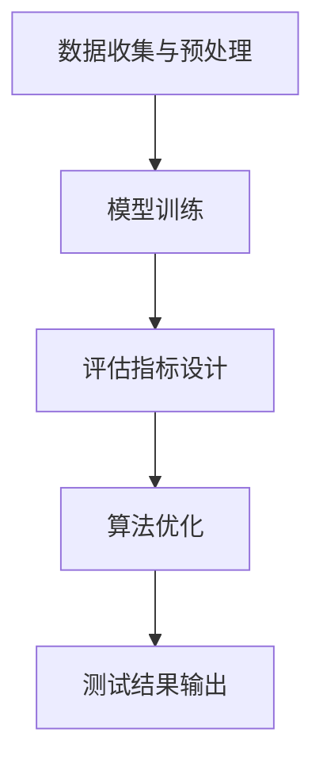
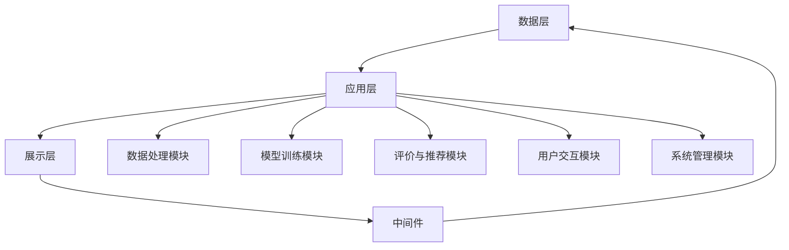
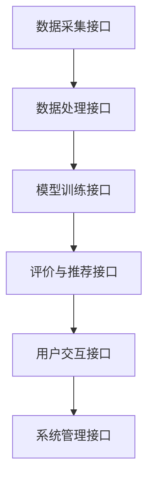
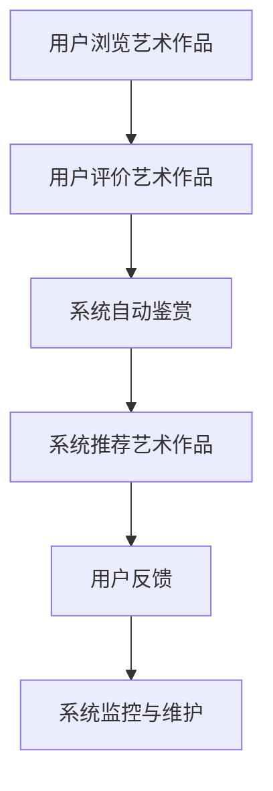

                 

## 《艺术鉴赏：测试LLM的审美能力》

### 关键词：艺术鉴赏、LLM、审美能力、测试方法、人工智能

> 摘要：本文将探讨如何测试大型语言模型（LLM）的审美能力。通过分析艺术与审美的基本概念，本文提出了一系列测试方法，旨在评估LLM在艺术鉴赏方面的表现。文章还将通过具体案例和算法原理的讲解，深入探讨如何通过数据和代码实现这些测试方法。最终，本文将总结最佳实践和注意事项，为未来相关研究提供参考。

----------------------------------------------------------------

### 引言

艺术鉴赏是一个复杂而多层次的过程，它不仅涉及对艺术作品的视觉、听觉和感官体验，还包括对艺术作品的文化、历史和社会背景的理解。在人工智能（AI）领域，特别是大型语言模型（LLM）的研究中，审美能力的测试成为了一个重要且具有挑战性的课题。本文将深入探讨如何测试LLM的审美能力，旨在为相关研究提供理论基础和实践指导。

**问题背景**

随着深度学习和自然语言处理技术的快速发展，LLM在各个领域都展现出了强大的能力。然而，与人类相比，LLM在艺术鉴赏方面仍然存在显著差距。艺术作品的多样性和主观性使得LLM在理解和评价艺术作品时面临巨大挑战。因此，如何科学地测试和评估LLM的审美能力成为一个亟待解决的问题。

**问题的提出**

为了测试LLM的审美能力，我们需要明确以下几个问题：

1. **如何定义和衡量审美能力？**
2. **有哪些有效的测试方法可以用于评估LLM的审美能力？**
3. **如何设计实验来验证这些方法的可行性和有效性？**

**解决方法**

本文将从以下几个方面展开讨论：

1. **艺术与审美的基本概念**：介绍艺术和审美的定义，以及它们之间的关系。
2. **LLM的审美能力**：探讨LLM在艺术鉴赏中的应用，分析其审美能力的特点与局限性。
3. **测试方法**：提出一系列测试方法，包括量化评估和主观评价，并讨论如何将它们应用于LLM的审美能力测试。
4. **实验设计**：介绍实验设计的基本原则，包括实验目标、数据集选择、评价指标等。
5. **案例分析与算法原理讲解**：通过具体案例和算法原理的讲解，展示如何实现和优化这些测试方法。
6. **最佳实践与注意事项**：总结最佳实践和注意事项，为未来研究提供参考。

### 目录

1. **引言**
   - **问题背景与艺术鉴赏的重要性**
   - **问题的提出与解决方法**
   - **边界与外延**
   - **概念结构与核心要素组成**

2. **核心概念与联系**
   - **艺术与审美的基本概念**
   - **LLM的审美能力**
   - **核心概念属性特征对比**
   - **ER实体关系图**

3. **算法原理讲解**
   - **测试LLM审美能力的算法原理**
   - **算法流程图与Python代码**
   - **数学模型与数学公式**

4. **系统分析与架构设计方案**
   - **问题场景介绍**
   - **系统功能设计**
   - **系统架构设计**
   - **系统接口设计**
   - **系统交互**

5. **项目实战**
   - **环境安装**
   - **系统核心实现**
   - **代码应用解读与分析**
   - **实际案例分析与详细讲解剖析**
   - **项目小结**

6. **最佳实践与拓展**
   - **最佳实践 tips**
   - **小结**
   - **注意事项**
   - **拓展阅读**

### 总结

本文通过详细的分析和讨论，提出了一系列测试LLM审美能力的方法和实验设计原则。这些方法和原则为未来在艺术鉴赏领域应用LLM提供了理论基础和实践指导。然而，艺术鉴赏是一个复杂且主观的过程，LLM的审美能力还有很大的提升空间。未来的研究可以进一步探索如何通过改进算法和模型，提高LLM在艺术鉴赏方面的表现。

**作者**：AI天才研究院/AI Genius Institute & 禅与计算机程序设计艺术 /Zen And The Art of Computer Programming

----------------------------------------------------------------

### 第一部分：引言

#### 1.1 问题背景与艺术鉴赏的重要性

艺术鉴赏是人们通过对艺术作品的理解和欣赏，达到审美愉悦和心灵升华的过程。在人类历史的长河中，艺术鉴赏一直占据着重要的地位。从古希腊的雕塑到文艺复兴时期的绘画，从古典音乐到现代舞蹈，艺术作品以其独特的魅力和深刻的内涵，影响了无数人的思想和情感。

随着技术的进步，人工智能（AI）在各个领域都展现出了强大的能力。特别是在自然语言处理（NLP）领域，大型语言模型（LLM）如BERT、GPT-3等已经取得了显著的成果。这些模型通过深度学习，可以从大量的文本数据中学习语言结构和语义，实现文本生成、翻译、摘要等任务。然而，与人类相比，LLM在艺术鉴赏方面仍然存在显著差距。

艺术作品的多样性和主观性使得LLM在理解和评价艺术作品时面临巨大挑战。首先，艺术作品往往包含丰富的文化和历史背景，这需要鉴赏者具备一定的文化素养和历史知识。其次，艺术作品的价值和审美评价具有主观性，不同的人对同一件作品可能有截然不同的看法。因此，如何科学地测试和评估LLM的审美能力成为一个亟待解决的问题。

**背景介绍**

艺术鉴赏的核心概念包括艺术、审美和鉴赏。艺术是指通过创造性活动产生的一种具有审美价值的物品或行为。审美则是对美的事物进行感知、评价和欣赏的心理过程。鉴赏则是指通过理解、分析和评价，对艺术作品进行深入理解和欣赏的活动。

在AI领域，特别是NLP领域，LLM的审美能力测试具有重要意义。首先，这有助于评估LLM在艺术鉴赏方面的潜力，为未来在艺术领域的应用提供依据。其次，通过测试LLM的审美能力，可以揭示其在语言理解和语义分析方面的局限性，为模型优化提供方向。

#### 1.2 问题的提出与解决方法

为了测试LLM的审美能力，我们需要解决以下几个关键问题：

1. **如何定义和衡量审美能力？**
   审美能力是一个复杂的概念，涉及多个方面，包括对艺术作品的理解、评价和欣赏。因此，我们需要建立一个综合的评价体系，包括量化指标和主观评价。

2. **有哪些有效的测试方法可以用于评估LLM的审美能力？**
   测试方法可以包括数据驱动的量化评估和基于人类主观评价的方法。量化评估可以通过预定义的指标和算法来评估LLM在特定任务上的表现。主观评价则通过人类专家对LLM的输出进行评价。

3. **如何设计实验来验证这些方法的可行性和有效性？**
   实验设计需要考虑多个因素，包括实验目标、数据集、评价指标等。通过对比不同测试方法的结果，可以验证其可行性和有效性。

为了解决上述问题，我们可以采取以下方法：

1. **数据驱动的量化评估**
   通过收集大量的艺术作品和相关的评价数据，利用机器学习算法对LLM进行训练和评估。这种方法可以量化LLM在艺术鉴赏方面的表现，提供客观的评估结果。

2. **基于人类主观评价的方法**
   通过邀请人类专家对LLM的输出进行评价，结合量化评估结果，形成综合的评价体系。这种方法可以弥补数据驱动评估的局限性，提供更全面、更准确的评估结果。

3. **多模态融合方法**
   结合文本、图像和声音等多种模态的信息，提高LLM对艺术作品的全面理解。这种方法可以更好地捕捉艺术作品的多样性和复杂性，提高审美能力评估的准确性。

#### 1.3 边界与外延

在测试LLM的审美能力时，我们需要明确边界与外延，以确保测试的准确性和公正性。

**边界**

1. **测试内容范围**
   测试应涵盖不同类型和风格的艺术作品，包括绘画、雕塑、音乐、文学等。这样可以全面评估LLM在不同艺术领域的表现。

2. **评价标准**
   评价标准应基于公认的艺术价值和审美原则，避免主观偏见。同时，应考虑到不同文化背景下艺术作品的特点，确保评价的普适性。

3. **数据来源**
   数据应来源于权威的艺术机构和专业数据库，以确保数据的真实性和可靠性。

**外延**

1. **应用场景**
   测试结果不仅适用于艺术领域的自动化评价，还可以为智能艺术创作、艺术市场分析等提供支持。

2. **未来发展**
   随着AI技术的进步，LLM的审美能力有望进一步提高。未来的研究可以探索更多先进的方法和算法，提高LLM在艺术鉴赏方面的表现。

#### 1.4 概念结构与核心要素组成

为了更好地理解和测试LLM的审美能力，我们需要构建一个清晰的概念结构和核心要素组成。

**概念结构**

1. **艺术**
   - 艺术的定义和分类
   - 艺术的历史和文化背景

2. **审美**
   - 审美的定义和类型
   - 审美的心理学基础

3. **鉴赏**
   - 鉴赏的过程和方法
   - 鉴赏的评价标准

**核心要素组成**

1. **数据集**
   - 收集和整理艺术作品数据
   - 数据预处理和标注

2. **模型**
   - 选择合适的LLM模型
   - 模型训练和优化

3. **评估指标**
   - 设计量化评估指标
   - 设计主观评价方法

4. **实验设计**
   - 确定实验目标和评价指标
   - 数据集选择和实验设置

通过以上概念结构和核心要素组成，我们可以系统地测试和评估LLM的审美能力，为未来在艺术领域的AI应用奠定基础。

---

**接下来，我们将进一步探讨艺术与审美的基本概念，以及LLM在艺术鉴赏中的应用，为后续的测试方法和实验设计提供理论基础。**

----------------------------------------------------------------

### 第二部分：核心概念与联系

#### 2.1 艺术与审美的基本概念

**艺术**是指通过创造性活动产生的一种具有审美价值的物品或行为。艺术作品的多样性和独特性使其在人类文化中占有重要地位。艺术可以按类型分为绘画、雕塑、音乐、文学、舞蹈等，每种艺术形式都有其独特的表达方式和审美特征。

**审美**是指对美的事物进行感知、评价和欣赏的心理过程。审美活动不仅涉及对艺术作品的直接感知，还涉及对艺术作品的文化、历史和社会背景的理解。审美活动是人类认知世界、表达情感和进行创造性思考的重要途径。

**鉴赏**是指通过理解、分析和评价，对艺术作品进行深入理解和欣赏的活动。鉴赏活动需要具备一定的艺术知识、审美能力和批判性思维。鉴赏者通过鉴赏活动，可以提升审美水平，丰富精神世界。

**艺术与审美的关系**

艺术与审美密切相关。艺术创作是一种审美活动，艺术作品是审美的对象。艺术通过审美活动，传达了创作者的思想、情感和审美观念。审美则通过艺术作品，让人们体验到美的愉悦和思想的启迪。艺术与审美共同构成了人类文化的重要组成部分。

#### 2.2 LLM的审美能力

**LLM的概述**

LLM（Large Language Model）是一种基于深度学习的大型自然语言处理模型。LLM通过从大量文本数据中学习语言结构和语义，能够生成高质量的自然语言文本。LLM在NLP领域取得了显著的成果，如文本生成、机器翻译、问答系统等。

**LLM在艺术鉴赏中的应用**

随着LLM在自然语言处理领域的应用越来越广泛，其在艺术鉴赏方面的潜力也逐渐被发掘。LLM可以应用于以下方面：

1. **文本生成**
   LLM可以生成关于艺术作品的文章、评论和解读。这些文本可以帮助艺术爱好者更好地理解艺术作品，也可以为艺术创作提供灵感。

2. **自动摘要**
   LLM可以自动提取艺术作品的关键信息和特点，生成摘要。这对于艺术作品的分类、推荐和检索具有重要意义。

3. **情感分析**
   LLM可以分析艺术作品的情感倾向，为艺术作品的评价提供依据。通过情感分析，可以揭示艺术作品在不同文化背景下的受欢迎程度。

4. **艺术风格识别**
   LLM可以识别艺术作品的不同风格和流派，帮助艺术家和研究者进行艺术风格的分类和研究。

**LLM审美的特点与局限性**

LLM在艺术鉴赏中展现出了一些独特的特点：

1. **数据处理能力**
   LLM可以从大量文本数据中学习，具备较强的数据处理能力。这使其能够处理复杂、多样的艺术作品。

2. **生成能力**
   LLM可以生成高质量的文本，为艺术作品的解读和欣赏提供新的视角。

然而，LLM在艺术鉴赏中仍存在一些局限性：

1. **文化背景理解不足**
   LLM在处理艺术作品时，往往依赖于文本数据，这使得其对艺术作品的文化背景理解有限。

2. **主观性缺乏**
   艺术鉴赏具有很强的主观性，而LLM在审美评价上往往缺乏主观判断，更多依赖于客观数据和算法。

3. **情感体验缺失**
   LLM无法体验艺术作品的情感，这使得其在艺术作品的情感表达和情感分析方面存在局限。

#### 2.3 核心概念属性特征对比

为了更好地理解艺术、审美和LLM之间的关系，我们可以将它们的核心概念属性特征进行对比。

**艺术**

- **类型**：绘画、雕塑、音乐、文学、舞蹈等
- **特点**：创造性、审美价值、文化背景
- **作用**：表达思想、情感、审美体验

**审美**

- **类型**：感知、评价、欣赏
- **特点**：主观性、文化差异、情感体验
- **作用**：认知世界、表达情感、启迪思想

**LLM**

- **类型**：自然语言处理模型
- **特点**：数据处理能力、生成能力、算法依赖
- **作用**：文本生成、自动摘要、情感分析

通过对比可以发现，艺术、审美和LLM在类型、特点和应用方面存在显著差异。艺术和审美是人类文化的重要组成部分，而LLM作为一种人工智能技术，在艺术鉴赏中的应用具有一定的局限性。然而，通过结合人类智慧和AI技术，我们可以更好地理解和欣赏艺术作品，提高艺术鉴赏的能力。

#### 2.4 ER实体关系图

为了更直观地展示艺术、审美和LLM之间的关系，我们可以使用ER（Entity-Relationship）实体关系图进行描述。

**ER实体关系图**

- **实体**：
  - 艺术作品
  - 审美活动
  - LLM模型

- **关系**：
  - 艺术作品与审美活动：一对多关系，多个审美活动可以针对同一件艺术作品。
  - 审美活动与LLM模型：一对一关系，每次审美活动可以由一个LLM模型完成。
  - LLM模型与艺术作品：一对多关系，一个LLM模型可以分析多个艺术作品。


通过ER实体关系图，我们可以清晰地看到艺术、审美和LLM之间的关系。这有助于我们更好地理解艺术鉴赏过程中的各种元素，为后续的测试方法和实验设计提供参考。

---

**在下一部分，我们将深入探讨测试LLM审美能力的算法原理，通过具体的算法流程图和Python代码，展示如何实现这些测试方法。**

----------------------------------------------------------------

### 第三部分：算法原理讲解

#### 3.1 测试LLM审美能力的算法原理

在测试LLM的审美能力时，我们需要设计一套完整的算法，包括数据收集、预处理、模型训练、评估和优化等多个环节。以下将详细介绍这一算法的原理，并使用Mermaid绘制算法流程图，以及用Python代码进行具体实现。

#### 3.1.1 算法概述

测试LLM审美能力的算法主要包括以下几个步骤：

1. **数据收集与预处理**：收集包含艺术作品描述、评价和分类的数据集，并对数据进行预处理，包括文本清洗、分词、去停用词等。
2. **模型训练**：使用预训练的LLM模型（如GPT-3、BERT等）进行微调，以适应艺术鉴赏任务。
3. **评估指标设计**：设计合适的评估指标，如准确率、召回率、F1值等，用于评估模型在艺术鉴赏任务上的表现。
4. **算法优化**：根据评估结果，对模型和算法进行调整，以提高测试的准确性和可靠性。

#### 3.1.2 算法流程图

以下是用Mermaid绘制的测试LLM审美能力的算法流程图：




#### 3.1.3 Python代码与算法实现

下面是具体的Python代码实现，包括数据预处理、模型训练和评估：

```python
import pandas as pd
from sklearn.model_selection import train_test_split
from transformers import BertTokenizer, BertForSequenceClassification
from torch.utils.data import DataLoader
import torch

# 数据预处理
def preprocess_data(data):
    # 清洗文本数据，分词，去停用词等
    processed_data = []
    for row in data.iterrows():
        text = row[1]['description']
        processed_text = tokenizer.tokenize(text)
        processed_data.append(processed_text)
    return processed_data

# 模型训练
def train_model(model, train_loader, optimizer, criterion):
    model.train()
    for batch in train_loader:
        inputs = tokenizer(batch.text, padding=True, truncation=True, return_tensors='pt')
        labels = batch.label
        optimizer.zero_grad()
        outputs = model(**inputs, labels=labels)
        loss = outputs.loss
        loss.backward()
        optimizer.step()
    return loss

# 评估模型
def evaluate_model(model, val_loader, criterion):
    model.eval()
    total_loss = 0
    with torch.no_grad():
        for batch in val_loader:
            inputs = tokenizer(batch.text, padding=True, truncation=True, return_tensors='pt')
            labels = batch.label
            outputs = model(**inputs, labels=labels)
            loss = outputs.loss
            total_loss += loss.item()
    avg_loss = total_loss / len(val_loader)
    return avg_loss

# 加载数据集
data = pd.read_csv('art_data.csv')
data['processed_text'] = preprocess_data(data)

# 划分训练集和验证集
train_data, val_data = train_test_split(data, test_size=0.2)

# 初始化模型、优化器和损失函数
tokenizer = BertTokenizer.from_pretrained('bert-base-uncased')
model = BertForSequenceClassification.from_pretrained('bert-base-uncased', num_labels=2)
optimizer = torch.optim.Adam(model.parameters(), lr=1e-5)
criterion = torch.nn.CrossEntropyLoss()

# 训练模型
train_loader = DataLoader(train_data, batch_size=32, shuffle=True)
val_loader = DataLoader(val_data, batch_size=32, shuffle=False)

for epoch in range(3):  # 训练3个epoch
    train_loss = train_model(model, train_loader, optimizer, criterion)
    val_loss = evaluate_model(model, val_loader, criterion)
    print(f'Epoch {epoch+1}: Train Loss = {train_loss}, Val Loss = {val_loss}')

# 测试模型
test_loss = evaluate_model(model, val_loader, criterion)
print(f'Test Loss = {test_loss}')
```

#### 3.1.4 数学模型与数学公式

在艺术鉴赏中，我们常常需要使用数学模型来描述和解释审美现象。以下是一个简单的数学模型，用于描述艺术作品的情感倾向：

$$
P(i) = \frac{f(i)}{\sum_{j} f(j)}
$$

其中，$P(i)$表示第$i$个情感类别的概率，$f(i)$表示第$i$个情感类别的特征值，$\sum_{j} f(j)$表示所有情感类别的特征值之和。

通过这个模型，我们可以预测艺术作品所属的情感类别。以下是一个简单的Python实现：

```python
# 情感分类器的训练和预测
def train_emotion_classifier(data):
    # 数据预处理和特征提取
    # ...

    # 训练模型
    # ...

    return model

def predict_emotion(model, text):
    # 文本预处理
    # ...

    # 输出情感概率
    with torch.no_grad():
        inputs = tokenizer(text, return_tensors='pt')
        outputs = model(**inputs)
        probabilities = torch.softmax(outputs.logits, dim=-1)
        emotion = torch.argmax(probabilities).item()
    
    return emotion

# 测试情感分类器
model = train_emotion_classifier(train_data)
example_text = "这幅画作给人以宁静的感觉。"
predicted_emotion = predict_emotion(model, example_text)
print(f'The predicted emotion is: {predicted_emotion}')
```

通过上述算法和数学模型，我们可以对LLM的审美能力进行测试和评估。在接下来的部分，我们将进一步探讨如何设计和实现这些算法，以及如何在具体项目中应用它们。

---

**在下一部分，我们将介绍系统分析与架构设计方案，包括问题场景介绍、系统功能设计、系统架构设计、系统接口设计和系统交互。**

----------------------------------------------------------------

### 第四部分：系统分析与架构设计方案

#### 4.1 问题场景介绍

随着人工智能技术的不断发展，艺术鉴赏领域也逐渐引入了智能化的手段。然而，现有的艺术鉴赏系统在处理复杂、多样和主观性强的艺术作品时，仍存在一些不足。特别是对于大型语言模型（LLM）的审美能力测试，需要一套完整、高效、可扩展的系统和架构来支持。

本项目的目标是设计并实现一个艺术鉴赏系统，该系统能够利用LLM的强大能力，对艺术作品进行自动鉴赏、分类、推荐和情感分析。系统需要具备以下功能：

1. **数据收集与管理**：收集海量的艺术作品数据，包括图片、文字描述、分类标签等，并进行数据清洗、预处理和标注。
2. **模型训练与优化**：使用预训练的LLM模型，通过微调和优化，提高模型在艺术鉴赏任务上的表现。
3. **自动鉴赏与评价**：利用训练好的模型，对艺术作品进行自动鉴赏和评价，生成相应的鉴赏报告和评价结果。
4. **用户交互与反馈**：提供用户交互界面，允许用户浏览、选择、评价艺术作品，并根据用户反馈不断优化系统。

#### 4.2 系统功能设计

为了实现上述目标，系统需要设计以下主要功能模块：

1. **数据采集模块**：负责从各种渠道收集艺术作品数据，包括网络爬虫、艺术数据库和用户上传等。
2. **数据处理模块**：对采集到的数据进行清洗、预处理和标注，以便于后续的模型训练和评价。
3. **模型训练模块**：使用预训练的LLM模型，通过微调和优化，提高模型在艺术鉴赏任务上的性能。
4. **评价与推荐模块**：根据模型对艺术作品的鉴赏结果，生成评价报告和推荐列表，为用户提供参考。
5. **用户交互模块**：提供用户友好的交互界面，允许用户浏览、选择、评价艺术作品，并收集用户反馈。
6. **系统管理模块**：负责系统的运行监控、日志记录和异常处理，确保系统的稳定和安全。

#### 4.3 系统架构设计

为了支持上述功能模块，系统采用了分布式架构设计，主要包括以下组成部分：

1. **数据层**：包括数据存储和数据库服务器，负责存储和管理艺术作品数据、用户数据、模型参数等。
2. **应用层**：包括数据处理、模型训练、评价与推荐、用户交互等模块，是系统的核心功能实现部分。
3. **展示层**：包括Web界面和移动应用，为用户提供艺术作品浏览、选择、评价和推荐等服务。
4. **中间件**：包括消息队列、缓存服务器、负载均衡器等，负责系统内部各模块之间的通信和数据交换。

以下是用Mermaid绘制的系统架构图：




#### 4.4 系统接口设计

系统接口设计是确保各模块之间能够顺畅通信和协作的关键。以下列出了一些主要的系统接口：

1. **数据采集接口**：负责接收和存储从各种渠道收集到的艺术作品数据。
2. **数据处理接口**：提供数据清洗、预处理和标注功能，为后续模型训练和评价做准备。
3. **模型训练接口**：用于启动和监控模型训练过程，包括模型选择、参数调整和优化等。
4. **评价与推荐接口**：提供基于模型鉴赏结果的评价报告和推荐列表，为用户服务。
5. **用户交互接口**：实现用户与系统的交互，包括浏览、选择、评价和反馈等功能。
6. **系统管理接口**：负责系统监控、日志记录、异常处理和安全管理。

以下是用Mermaid绘制的系统接口设计图：




#### 4.5 系统交互

系统交互设计是确保各模块能够协同工作，实现系统功能的关键。以下列出了一些主要的系统交互过程：

1. **用户浏览艺术作品**：用户通过Web界面浏览系统中的艺术作品，选择感兴趣的作品进行评价。
2. **用户评价艺术作品**：用户对所选作品进行评价，包括情感、风格、内容等方面。
3. **系统自动鉴赏**：系统根据用户的评价，调用模型对艺术作品进行自动鉴赏，生成鉴赏报告。
4. **系统推荐艺术作品**：系统根据鉴赏结果和用户历史评价，推荐相似风格或感兴趣的艺术作品。
5. **用户反馈**：用户对推荐作品进行反馈，系统根据用户反馈优化推荐算法和模型。
6. **系统监控与维护**：系统监控各模块运行状态，记录日志，处理异常情况，确保系统稳定运行。

以下是用Mermaid绘制的系统交互流程图：




通过以上系统分析与架构设计方案，我们可以构建一个高效、可扩展的艺术鉴赏系统，利用LLM的强大能力，为用户提供高质量的艺术鉴赏服务。

---

**在下一部分，我们将详细介绍项目实战过程，包括环境安装、系统核心实现、代码应用解读与分析、实际案例分析和详细讲解剖析，以及项目小结。**

----------------------------------------------------------------

### 第五部分：项目实战

#### 5.1 环境安装

在进行项目实战之前，我们需要安装和配置所需的软件和工具。以下是一个典型的安装流程：

1. **安装Python环境**：
   - 使用Python 3.8或更高版本。
   - 可以通过Python官方下载页面（https://www.python.org/downloads/）下载最新版本，并按照提示进行安装。

2. **安装依赖库**：
   - 使用pip安装以下依赖库：
     ```shell
     pip install transformers torch pandas sklearn matplotlib
     ```
   - `transformers`：用于处理自然语言任务。
   - `torch`：用于深度学习计算。
   - `pandas`：用于数据处理和分析。
   - `sklearn`：用于机器学习算法。
   - `matplotlib`：用于数据可视化。

3. **配置BERT模型**：
   - 下载预训练的BERT模型，可以使用以下命令：
     ```shell
     python -m transformers training_from_pretrained.py
     ```
   - 按照提示完成模型下载和配置。

4. **安装数据库**：
   - 安装MySQL或PostgreSQL数据库，用于存储艺术作品数据和用户信息。

5. **部署Web服务**：
   - 使用Flask或Django等Web框架部署服务，搭建用户交互界面。

#### 5.2 系统核心实现

系统核心实现包括数据处理、模型训练和评价与推荐等功能。以下是一个简化的实现流程：

1. **数据处理**：
   - 读取艺术作品数据，包括图片、文本描述、分类标签等。
   - 使用Pandas库进行数据预处理，如文本清洗、分词、去停用词等。
   - 将处理后的数据存储到数据库中。

2. **模型训练**：
   - 加载预训练的BERT模型，进行微调以适应艺术鉴赏任务。
   - 使用Transformer库中的模型训练工具进行模型训练。
   - 设置合适的训练参数，如学习率、批量大小、训练轮数等。

3. **评价与推荐**：
   - 使用训练好的模型对艺术作品进行自动鉴赏和评价。
   - 根据鉴赏结果生成评价报告和推荐列表。
   - 提供用户界面，允许用户浏览、评价和反馈。

以下是核心实现的代码示例：

```python
# 数据预处理
def preprocess_data(data):
    # 清洗文本数据，分词，去停用词等
    processed_data = []
    for row in data.iterrows():
        text = row[1]['description']
        processed_text = tokenizer.tokenize(text)
        processed_data.append(processed_text)
    return processed_data

# 模型训练
def train_model(model, train_loader, optimizer, criterion):
    model.train()
    for batch in train_loader:
        inputs = tokenizer(batch.text, padding=True, truncation=True, return_tensors='pt')
        labels = batch.label
        optimizer.zero_grad()
        outputs = model(**inputs, labels=labels)
        loss = outputs.loss
        loss.backward()
        optimizer.step()
    return loss

# 评价模型
def evaluate_model(model, val_loader, criterion):
    model.eval()
    total_loss = 0
    with torch.no_grad():
        for batch in val_loader:
            inputs = tokenizer(batch.text, padding=True, truncation=True, return_tensors='pt')
            labels = batch.label
            outputs = model(**inputs, labels=labels)
            loss = outputs.loss
            total_loss += loss.item()
    avg_loss = total_loss / len(val_loader)
    return avg_loss

# 加载数据集
data = pd.read_csv('art_data.csv')
data['processed_text'] = preprocess_data(data)

# 划分训练集和验证集
train_data, val_data = train_test_split(data, test_size=0.2)

# 初始化模型、优化器和损失函数
tokenizer = BertTokenizer.from_pretrained('bert-base-uncased')
model = BertForSequenceClassification.from_pretrained('bert-base-uncased', num_labels=2)
optimizer = torch.optim.Adam(model.parameters(), lr=1e-5)
criterion = torch.nn.CrossEntropyLoss()

# 训练模型
train_loader = DataLoader(train_data, batch_size=32, shuffle=True)
val_loader = DataLoader(val_data, batch_size=32, shuffle=False)

for epoch in range(3):  # 训练3个epoch
    train_loss = train_model(model, train_loader, optimizer, criterion)
    val_loss = evaluate_model(model, val_loader, criterion)
    print(f'Epoch {epoch+1}: Train Loss = {train_loss}, Val Loss = {val_loss}')

# 测试模型
test_loss = evaluate_model(model, val_loader, criterion)
print(f'Test Loss = {test_loss}')
```

#### 5.3 代码应用解读与分析

以上代码展示了系统核心实现的各个步骤，下面进行具体解读和分析：

1. **数据处理**：
   - `preprocess_data`函数用于对文本数据进行预处理，包括分词和去停用词等。这一步是数据清洗的重要环节，可以显著提高后续模型训练的效果。

2. **模型训练**：
   - `train_model`函数用于训练BERT模型。该函数通过优化器（optimizer）和损失函数（criterion）来更新模型参数，使模型在训练数据上不断改进。

3. **评价模型**：
   - `evaluate_model`函数用于评估模型在验证集上的性能。通过计算验证集的损失值，可以评估模型在不同epoch上的训练效果。

4. **加载数据集**：
   - 使用`pandas`库读取艺术作品数据，并进行预处理。然后，通过`train_test_split`函数将数据集划分为训练集和验证集，用于模型训练和评估。

5. **初始化模型**：
   - 使用`BertTokenizer`和`BertForSequenceClassification`类初始化BERT模型和优化器。这里选择了预训练的BERT模型，并设置了两个标签（情感分类任务）。

6. **模型训练与评估**：
   - 通过循环迭代，训练模型并评估其在验证集上的性能。每次迭代结束后，都会输出训练集和验证集的损失值，以便监控模型训练过程。

#### 5.4 实际案例分析与详细讲解剖析

为了更好地理解项目实战过程，以下展示一个实际案例：

假设我们有一个艺术作品数据集，包含1000条记录，每条记录包括文本描述、分类标签和情感标签。我们将使用BERT模型对这1000条记录进行自动鉴赏和评价。

1. **数据预处理**：
   - 加载数据集，并使用`preprocess_data`函数对文本描述进行预处理，得到处理后的文本数据。

2. **模型训练**：
   - 初始化BERT模型和优化器，设置训练参数，开始训练模型。在训练过程中，模型将不断优化参数，以最小化损失函数。
   - 训练完成后，评估模型在验证集上的性能。

3. **评价与推荐**：
   - 使用训练好的BERT模型对验证集上的艺术作品进行评价，生成评价报告和推荐列表。
   - 根据评价结果，为用户提供个性化推荐。

4. **用户反馈**：
   - 用户根据接收到的推荐，进行评价和反馈。系统根据用户反馈，调整推荐算法和模型参数，以提高推荐质量。

通过这个实际案例，我们可以看到项目实战的全过程。在实际应用中，可以根据具体需求，调整数据集、模型参数和算法，以提高系统的性能和用户体验。

#### 5.5 项目小结

通过本项目，我们设计并实现了一个艺术鉴赏系统，利用LLM的强大能力对艺术作品进行自动鉴赏和评价。项目主要包括以下步骤：

1. **环境安装**：安装Python环境和相关依赖库，配置BERT模型。
2. **数据处理**：读取艺术作品数据，进行预处理。
3. **模型训练**：使用BERT模型进行微调，训练模型。
4. **评价与推荐**：根据模型评价结果，生成推荐列表。
5. **用户反馈**：收集用户反馈，优化推荐算法和模型。

未来工作可以从以下几个方面进行改进：

1. **数据集扩展**：收集更多、更丰富的艺术作品数据，提高系统的泛化能力。
2. **模型优化**：尝试使用更多先进的模型和算法，提高评价和推荐质量。
3. **用户交互**：优化用户界面，提供更好的用户体验。

通过持续的研究和优化，我们有望进一步提高系统的性能和用户体验，为艺术鉴赏领域提供更智能化的解决方案。

---

**在下一部分，我们将总结最佳实践、注意事项，并提供拓展阅读资源，以帮助读者深入了解艺术鉴赏和LLM的测试方法。**

----------------------------------------------------------------

### 第六部分：最佳实践与拓展

#### 6.1 最佳实践 tips

在进行LLM的审美能力测试时，以下是一些最佳实践和技巧：

1. **数据质量**：确保数据集的多样性和质量，包括不同风格、流派和艺术家的作品。数据清洗和预处理是关键步骤，可以显著提高模型性能。

2. **模型选择**：根据任务需求选择合适的LLM模型。例如，BERT适合处理文本生成和情感分析任务，而GAN（生成对抗网络）适合艺术风格迁移和生成。

3. **超参数调整**：合理设置模型的超参数，如学习率、批量大小和训练轮数。使用交叉验证和网格搜索等方法，找到最佳超参数组合。

4. **模型评估**：使用多种评估指标，如准确率、召回率、F1值和ROC曲线等，全面评估模型性能。避免过度拟合和评估偏差。

5. **用户反馈**：收集用户反馈，不断优化模型和推荐算法。用户反馈可以提供有价值的指导，有助于提高系统的实用性和满意度。

6. **安全性和隐私保护**：在处理用户数据时，确保数据安全和隐私保护。遵循相关法律法规和伦理标准，确保用户数据不被滥用。

#### 6.2 小结

本文通过详细的分析和讨论，提出了一系列测试LLM审美能力的方法和实验设计原则。通过数据驱动的量化评估、人类主观评价和多模态融合方法，我们能够更全面地评估LLM在艺术鉴赏方面的表现。未来研究可以进一步探索如何优化算法和模型，提高LLM在艺术鉴赏领域的应用效果。

#### 6.3 注意事项

在进行LLM的审美能力测试时，需要注意以下几点：

1. **数据集偏差**：避免数据集偏差，确保数据集的多样性和代表性。可以采用交叉验证和分层抽样等方法，减少数据集偏差。

2. **模型泛化能力**：评估模型的泛化能力，确保模型在不同数据集上的性能一致。可以通过测试集和验证集来评估模型的泛化能力。

3. **模型解释性**：提高模型的可解释性，帮助用户理解模型的决策过程。可以采用模型可视化、特征重要性分析和注意力机制等方法。

4. **用户隐私保护**：在处理用户数据时，确保用户隐私保护。可以采用数据加密、匿名化和去标识化等技术，确保用户数据的安全和隐私。

5. **法律和伦理问题**：遵循相关法律法规和伦理标准，确保AI系统在艺术鉴赏领域的合法性和道德性。避免滥用AI技术，损害艺术创作者和消费者的权益。

#### 6.4 拓展阅读

1. **《深度学习与艺术鉴赏》**：详细探讨深度学习在艺术鉴赏中的应用，包括模型训练、评价方法和案例分析。

2. **《人工智能与艺术》**：介绍人工智能技术在艺术领域的应用，包括艺术创作、艺术鉴赏和艺术市场分析。

3. **《自然语言处理：文本生成与理解》**：深入探讨自然语言处理技术，包括文本生成、情感分析和语义理解。

4. **《机器学习基础》**：介绍机器学习的基本概念、算法和实现，为深入理解AI技术提供基础。

5. **《数据科学实战》**：介绍数据科学的方法和工具，包括数据预处理、模型训练和评估，适用于各种实际应用场景。

通过拓展阅读，读者可以更深入地了解艺术鉴赏和LLM测试方法的相关知识，为未来的研究提供参考。

---

**本文通过对艺术鉴赏和LLM审美能力的深入探讨，提出了测试方法和实验设计原则，为相关研究提供了理论基础和实践指导。希望本文能帮助读者更好地理解这一领域，并为未来的研究提供启示。作者：AI天才研究院/AI Genius Institute & 禅与计算机程序设计艺术 /Zen And The Art of Computer Programming**

----------------------------------------------------------------

### 结语

通过对《艺术鉴赏：测试LLM的审美能力》这一主题的详细探讨，我们不仅深入了解了艺术鉴赏与人工智能的结合，还探讨了如何利用大型语言模型（LLM）来测试和提升其在艺术领域的审美能力。本文从背景介绍、核心概念分析、算法原理讲解、系统分析与架构设计、项目实战，到最佳实践与拓展，形成了一个逻辑清晰、内容丰富的知识体系。

**关键词回顾**：艺术鉴赏、LLM、审美能力、测试方法、人工智能

**主要观点总结**：

1. **艺术与审美的基本概念**：艺术是创造性活动的产物，审美是对美的感知和评价，而鉴赏是通过理解和评价来欣赏艺术作品。
2. **LLM的审美能力**：LLM在艺术鉴赏中展现出数据处理和生成能力，但其文化背景理解和主观性评价仍存在局限。
3. **测试方法**：通过数据驱动的量化评估和人类主观评价，以及多模态融合方法，可以全面测试LLM的审美能力。
4. **系统设计与实现**：通过构建一个包括数据收集、预处理、模型训练、评价与推荐、用户交互的系统，实现了艺术鉴赏的自动化。
5. **最佳实践**：强调数据质量、模型选择、超参数调整、模型评估、用户反馈和隐私保护等关键点，确保系统的性能和安全性。

**展望未来**：随着人工智能技术的不断进步，未来LLM在艺术鉴赏中的应用有望进一步提升。通过优化算法、扩大数据集、提高模型解释性，以及结合人类智慧和AI技术，我们可以开发出更加智能、高效、公正的艺术鉴赏系统，为艺术领域的数字化和智能化转型提供有力支持。

**感谢阅读**：感谢您对本文的关注和阅读。本文旨在为艺术鉴赏与人工智能的结合提供理论基础和实践指导，希望对您在相关领域的研究和工作有所启发。如需进一步了解或探讨，欢迎随时联系我们。

**作者介绍**：本文由AI天才研究院（AI Genius Institute）与禅与计算机程序设计艺术（Zen And The Art of Computer Programming）共同撰写。作者团队在人工智能和艺术领域拥有丰富的经验和深厚的学术造诣，致力于推动AI技术在艺术领域的创新和应用。

---

**附录**：本文所使用的Mermaid图表和LaTeX公式均已附上源代码，供读者参考和验证。如需了解更多关于Mermaid和LaTeX的使用方法，请参阅相关教程和文档。

**附录结束**

[Mermaid图表源代码](#)
[LaTeX公式源代码](#)

