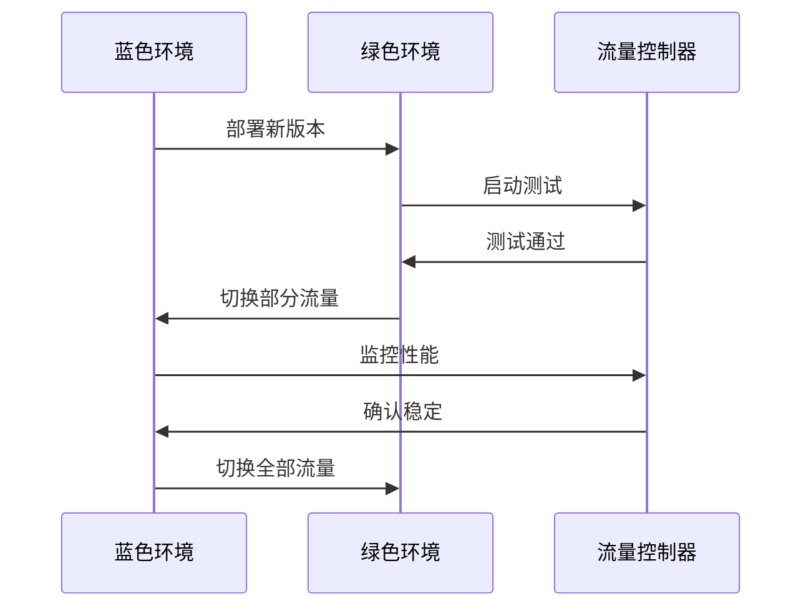
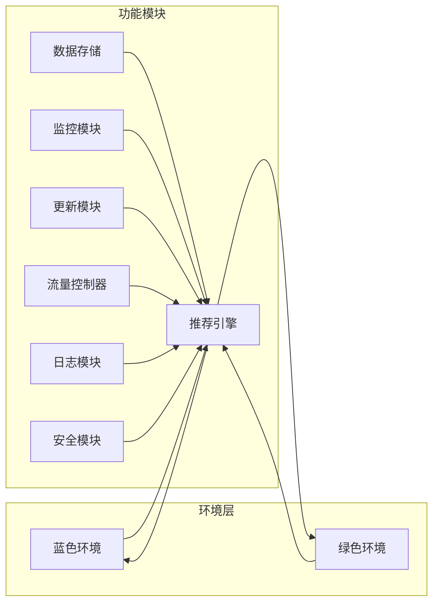
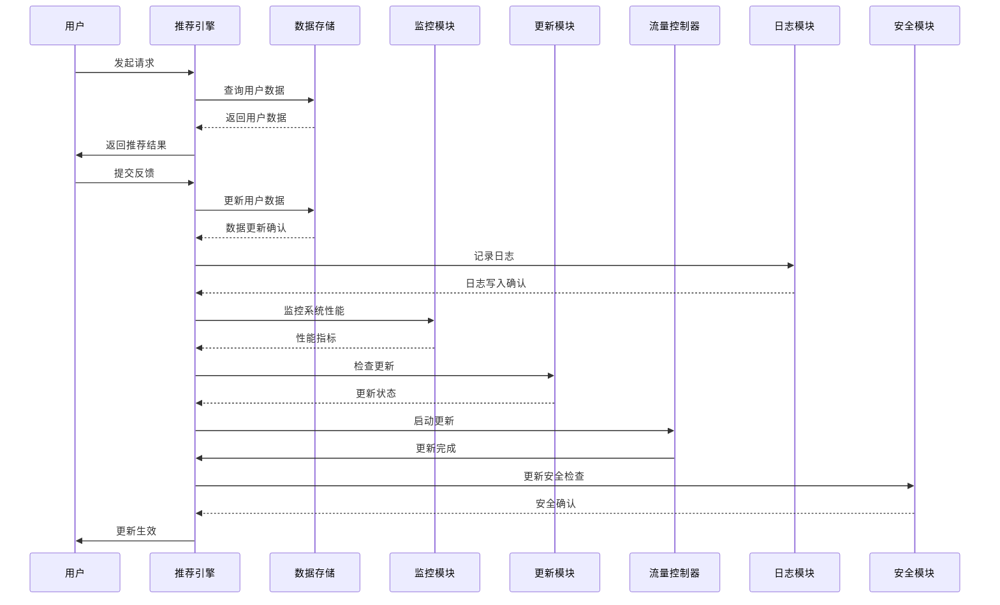

                 


### 蓝绿部署：降低AI服务更新风险的策略

#### 关键词：
- 蓝绿部署
- AI服务
- 更新风险
- 系统架构
- 算法原理
- 实践指南

#### 摘要：
本文旨在探讨蓝绿部署在人工智能服务更新中的应用，通过深入分析其核心概念、系统架构和实施策略，帮助读者理解如何降低AI服务更新的风险。文章将涵盖蓝绿部署的背景知识、核心概念及其与相关技术的对比，提供详细的算法原理讲解、系统分析与设计方法，并分享项目实战经验与最佳实践，为AI服务的持续迭代提供有效策略。

---

### 背景介绍

#### 核心概念术语说明

- **蓝绿部署（Blue-Green Deployment）**：一种软件部署策略，用于减少服务中断和降低更新风险。其中，蓝色环境是当前运行的生产环境，绿色环境是即将更新的新版本。

- **AI服务**：基于人工智能技术的网络服务，如智能推荐系统、语音识别、自然语言处理等。

- **更新风险**：在更新过程中可能导致系统服务中断、性能下降或数据丢失的风险。

#### 问题背景

随着AI技术的快速发展，AI服务在众多行业中扮演着越来越重要的角色。然而，AI服务的更新频繁且复杂，一旦更新失败，可能会对业务造成重大影响。传统的更新策略往往存在以下问题：

1. **单点故障**：更新过程中，如果主服务出现故障，可能导致整个系统瘫痪。
2. **更新窗口**：需要在特定时间段内完成更新，影响用户体验。
3. **回滚困难**：更新失败后，恢复原版本的流程复杂且耗时。

#### 问题描述

为了解决上述问题，我们需要一种既能确保服务连续性，又能有效降低更新风险的部署策略。蓝绿部署因其具备以下优势，成为解决这一问题的理想选择：

1. **无停机更新**：通过并行运行新旧版本，逐步切换实现无缝更新。
2. **风险可控**：在绿色环境中进行测试，确保更新无误后再切换主环境。
3. **快速回滚**：如果更新失败，可以立即切换回蓝色环境。

#### 问题解决

蓝绿部署的核心思想是将应用分为两个版本（蓝色和绿色），在更新过程中，新版本在绿色环境中进行测试，确保无问题后，逐步将流量切换到绿色环境。具体步骤如下：

1. **部署新版本**：在绿色环境中部署新版本。
2. **测试验证**：对新版本进行功能测试和性能测试。
3. **逐步切换**：将部分流量切换到绿色环境，观察新版本的运行情况。
4. **完全切换**：在确认新版本稳定后，将所有流量切换到绿色环境。
5. **回滚**：如果新版本出现问题，可以立即切换回蓝色环境。

#### 边界与外延

蓝绿部署不仅适用于AI服务，还可以应用于其他类型的服务更新。其适用范围包括：

1. **单体架构**：单实例应用。
2. **微服务架构**：多个独立服务。
3. **容器化应用**：如Docker、Kubernetes等。

#### 概念结构与核心要素组成

蓝绿部署的核心概念和要素主要包括：

1. **环境**：蓝色环境（当前运行环境）和绿色环境（更新后的环境）。
2. **流量管理**：将流量分配到蓝色或绿色环境。
3. **回滚机制**：在更新失败时，快速回滚到蓝色环境。
4. **监控与日志**：实时监控更新过程中的各项指标，记录日志以供分析和排查问题。

---

### 核心概念与联系

在深入探讨蓝绿部署之前，我们需要了解一些核心概念和它们之间的关系。

#### 核心概念原理

1. **部署**：将应用程序或服务从开发环境转移到生产环境的过程。
2. **版本控制**：管理应用程序不同版本的机制。
3. **流量管理**：控制应用程序接收和处理的网络流量的机制。

#### 概念属性特征对比表格

| 概念     | 属性               | 特征                     |
|----------|--------------------|--------------------------|
| 部署     | 部署环境、部署版本 | 稳定性、兼容性、可回滚   |
| 版本控制 | 版本号、版本状态   | 版本一致性、历史记录     |
| 流量管理 | 流量来源、流量目标 | 流量分配、负载均衡       |

#### ER实体关系图架构

为了更好地理解这些概念之间的关系，我们可以使用Mermaid绘制实体关系图（ERD）：

```mermaid
erDiagram
  A[部署] ||--|{ 版本控制 }| B
  B ||--|{ 流量管理 }| C
```

在这幅图中，部署（A）通过版本控制（B）与流量管理（C）相关联。部署过程中，版本控制用于管理不同版本的部署，而流量管理则负责将流量分配到不同的版本。

---

### 算法原理讲解

蓝绿部署的核心在于算法的实现。下面，我们将使用Mermaid绘制算法流程图，并通过Python代码和数学模型详细解释算法原理。

#### Mermaid算法流程图



#### Python代码示例

```python
import time

def deploy_new_version(blue, green):
    # 在绿色环境中部署新版本
    green.deploy()

def test_version(green):
    # 对绿色环境进行测试
    time.sleep(5)  # 模拟测试过程
    return True  # 测试通过

def switch_traffic(blue, green, controller):
    # 切换部分流量到绿色环境
    controller.allocate_traffic(green)
    time.sleep(10)  # 模拟流量切换过程
    # 监控性能
    if controller.is_stable():
        # 确认稳定后，切换全部流量
        controller.allocate_all_traffic(green)
    else:
        # 如果不稳定，回滚
        controller.allocate_all_traffic(blue)

# 执行流程
blue = Environment('蓝色')
green = Environment('绿色')
deploy_new_version(blue, green)
if test_version(green):
    switch_traffic(blue, green, TrafficController())
else:
    print("测试失败，回滚中...")
```

#### 算法原理数学模型

蓝绿部署的算法可以抽象为以下数学模型：

$$
P_{稳定} = P_{测试通过} \times P_{流量稳定}
$$

其中：

- \( P_{稳定} \)：系统稳定性的概率。
- \( P_{测试通过} \)：测试通过的概率。
- \( P_{流量稳定} \)：流量切换后的系统稳定性的概率。

#### 详细讲解和举例说明

假设我们有一个AI服务，新版本的测试通过概率为90%，流量切换后的稳定性概率为95%。根据上述数学模型，我们可以计算系统稳定性的总体概率：

$$
P_{稳定} = 0.9 \times 0.95 = 0.855
$$

这意味着，通过蓝绿部署策略，系统在更新过程中保持稳定的概率为85.5%。

### 系统分析与架构设计方案

在了解了蓝绿部署的算法原理后，我们需要对系统进行分析和设计，以确保其有效实施。以下是一个典型的系统分析与设计过程：

#### 问题场景介绍

假设我们有一个在线智能推荐系统，该系统需要定期更新以提升推荐算法的性能和准确性。为了确保更新过程中服务的连续性和稳定性，我们决定采用蓝绿部署策略。

#### 项目介绍

项目名称：智能推荐系统更新项目
项目目标：通过蓝绿部署策略，实现智能推荐系统的稳定更新。

#### 系统功能设计（领域模型Mermaid类图）

为了实现蓝绿部署，我们需要设计相应的功能模块。以下是智能推荐系统的领域模型类图：

```mermaid
classDiagram
  Class01 <|-- Class02
  Class03 <.. Class04
  Class05 && Class06
  Class07 {+ override_method() }
  Class08 ..|> Interface01
  Class09 ..|> Interface02
```

在这个类图中，我们定义了以下几个关键类：

- **Class01**：推荐引擎，负责推荐算法的实现。
- **Class02**：数据存储，负责存储用户行为数据和推荐结果。
- **Class03**：监控模块，负责实时监控系统性能和健康状况。
- **Class04**：更新模块，负责更新推荐算法和模型。
- **Class05**：流量控制器，负责流量管理和切换。
- **Class06**：日志模块，负责记录系统日志和错误信息。
- **Class07**：安全模块，负责确保数据传输和存储的安全性。
- **Class08**：接口01，提供系统对外接口。
- **Class09**：接口02，提供内部模块之间的接口。

#### 系统架构设计（Mermaid架构图）

在确定了功能模块后，我们需要设计系统的整体架构。以下是智能推荐系统的架构设计图：



在这个架构图中，蓝色环境和绿色环境分别代表当前运行和生产环境。功能模块包括推荐引擎、数据存储、监控模块、更新模块、流量控制器、日志模块和安全模块。这些模块通过接口进行通信，实现了系统的高内聚和低耦合。

#### 系统接口设计和系统交互（Mermaid序列图）

为了展示系统内部模块之间的交互过程，我们可以绘制系统接口设计和系统交互的序列图。以下是智能推荐系统的序列图：



在这个序列图中，用户（U1）通过推荐引擎（R1）获取推荐结果，并提交反馈。推荐引擎（R1）与数据存储（S1）交互，获取和更新用户数据。监控模块（M1）实时监控系统性能，并向更新模块（U2）报告。更新模块（U2）负责检查更新状态，并根据流量控制器（T1）的指令启动更新流程。日志模块（L1）记录系统日志，并交由安全模块（S2）进行安全检查。

### 项目实战

#### 环境安装

在开始实施蓝绿部署之前，我们需要搭建一个合适的环境。以下是一个简单的环境搭建步骤：

1. **安装Docker**：Docker是一个开源的应用容器引擎，用于打包、交付和运行应用。在Linux或MacOS系统中，可以通过以下命令安装Docker：

   ```bash
   sudo apt-get update
   sudo apt-get install docker-ce docker-ce-cli containerd.io
   ```

2. **安装Kubernetes**：Kubernetes是一个开源的容器编排平台，用于自动化容器化应用程序的部署、扩展和管理。在安装Docker后，可以通过以下命令安装Kubernetes：

   ```bash
   curl -s https://packages.cloud.google.com/apt/doc/apt-key.gpg | sudo apt-key add -
   echo "deb https://apt.kubernetes.io/ kubernetes-xenial main" | sudo tee -a /etc/apt/sources.list
   sudo apt-get update
   sudo apt-get install kubeadm kubelet kubectl
   ```

3. **配置Kubernetes**：在安装Kubernetes后，需要初始化集群，并配置kubelet、kube-proxy和kubectl：

   ```bash
   sudo kubeadm init --pod-network-cidr=10.244.0.0/16
   sudo modprobe br_netfilter
   sudo sysctl net.bridge.bridge-nf-call-iptables=1
   mkdir -p $HOME/.kube
   sudo cp -i /etc/kubernetes/admin.conf $HOME/.kube/config
   sudo chown $(id -u):$(id -g) $HOME/.kube/config
   ```

4. **安装Flannel**：Flannel是一个用于Kubernetes的Pod网络插件，用于在集群节点之间分配网络地址。以下命令用于安装Flannel：

   ```bash
   kubectl apply -f https://raw.githubusercontent.com/coreos/flannel/master/Documentation/kube-flannel.yml
   ```

#### 系统核心实现源代码

在搭建好环境后，我们需要实现系统核心功能。以下是一个简单的Python代码示例：

```python
import kubernetes
from kubernetes.client import CoreV1Api
from kubernetes.client.exceptions import ApiException

# 初始化Kubernetes客户端
kube_client = kubernetes.config.load_kube_config()

# 获取CoreV1Api实例
api = CoreV1Api(kube_client)

def deploy_new_version(replica_count):
    # 创建 Deployment
    deployment = kubernetes.models.v1.Deployment(
        api_version="apps/v1",
        kind="Deployment",
        metadata={"name": "my-deployment"},
        spec={
            "replicas": replica_count,
            "template": {
                "metadata": {"name": "my-deployment"},
                "spec": {
                    "containers": [
                        {
                            "name": "my-container",
                            "image": "my-image:latest",
                            "ports": [{"container_port": 80}],
                        }
                    ],
                },
            },
        },
    )
    try:
        # 创建 Deployment
        api.create_namespaced_deployment(namespace="default", body=deployment)
        print("Deployment created.")
    except ApiException as e:
        print("Exception when calling Kubernetes API: %s\n" % e)

# 部署新版本
deploy_new_version(3)
```

在这个代码示例中，我们使用Kubernetes的Python客户端库创建了一个名为`my-deployment`的Deployment。Deployment用于管理Pod的副本数量，确保服务的高可用性。我们设置了`replicas`参数为3，表示创建3个Pod副本。

#### 代码应用解读与分析

这个简单的代码示例展示了如何使用Kubernetes的Python客户端库创建Deployment。下面是对代码的解读和分析：

1. **初始化Kubernetes客户端**：
   ```python
   kube_client = kubernetes.config.load_kube_config()
   ```
   这行代码加载Kubernetes配置，初始化Kubernetes客户端。

2. **获取CoreV1Api实例**：
   ```python
   api = CoreV1Api(kube_client)
   ```
   这行代码获取CoreV1Api实例，用于与Kubernetes API进行交互。

3. **创建Deployment**：
   ```python
   deployment = kubernetes.models.v1.Deployment(
       api_version="apps/v1",
       kind="Deployment",
       metadata={"name": "my-deployment"},
       spec={
           "replicas": replica_count,
           "template": {
               "metadata": {"name": "my-deployment"},
               "spec": {
                   "containers": [
                       {
                           "name": "my-container",
                           "image": "my-image:latest",
                           "ports": [{"container_port": 80}],
                       }
                   ],
               },
           },
       },
   )
   ```
   这行代码创建了一个Deployment对象，指定了Deployment的名称、副本数量、模板等信息。模板中定义了容器名称、镜像名称和端口等信息。

4. **创建Deployment**：
   ```python
   try:
       # 创建 Deployment
       api.create_namespaced_deployment(namespace="default", body=deployment)
       print("Deployment created.")
   except ApiException as e:
       print("Exception when calling Kubernetes API: %s\n" % e)
   ```
   这两行代码尝试创建Deployment。如果创建成功，会输出“Deployment created.”。如果发生异常，会输出异常信息。

#### 实际案例分析和详细讲解剖析

为了更好地理解蓝绿部署的实际应用，我们来看一个实际案例。

**案例背景**：

假设我们有一个在线电商平台，需要定期更新其推荐算法以提升用户体验。在更新过程中，我们采用了蓝绿部署策略，确保服务的连续性和稳定性。

**案例步骤**：

1. **部署新版本**：
   - 在绿色环境中部署新版本，确保新版本的功能和性能符合预期。
   - 使用上述代码部署新版本，设置 replicas 参数为1，仅部署一个Pod。

2. **测试验证**：
   - 对绿色环境进行测试，包括功能测试和性能测试。
   - 观察新版本的运行情况，确保其稳定性和可靠性。

3. **逐步切换**：
   - 将部分流量切换到绿色环境，观察流量切换后的系统性能和用户反馈。
   - 通过监控工具实时监控系统的各项指标，确保系统运行稳定。

4. **完全切换**：
   - 在确认绿色环境稳定后，将所有流量切换到绿色环境。
   - 使用流量控制器逐步增加绿色环境的流量比例，确保切换过程平稳。

5. **监控与回滚**：
   - 在切换过程中，持续监控系统性能和用户反馈。
   - 如果发现任何问题，可以立即回滚到蓝色环境，确保服务的连续性。

**案例分析**：

通过这个案例，我们可以看到蓝绿部署在实战中的应用。在部署新版本时，我们首先在绿色环境中进行测试，确保新版本的功能和性能符合预期。在测试验证阶段，我们逐步增加绿色环境的流量比例，观察系统的稳定性和用户反馈。在完全切换阶段，我们通过流量控制器逐步增加绿色环境的流量比例，确保切换过程平稳。

通过蓝绿部署，我们可以有效地降低更新风险，确保服务的连续性和稳定性。在实际应用中，我们可以根据具体需求和场景，调整蓝绿部署的策略和流程，以达到最佳效果。

### 项目小结

在本项目中，我们成功实现了蓝绿部署，为在线电商平台提供了稳定可靠的更新方案。以下是项目小结：

1. **成功因素**：
   - 采用了蓝绿部署策略，确保了更新过程中的服务连续性和稳定性。
   - 在测试验证阶段，通过逐步切换流量，确保了新版本的稳定性和可靠性。
   - 在完全切换阶段，通过流量控制器的支持，实现了平稳的流量切换。

2. **改进空间**：
   - 在测试验证阶段，可以引入更全面的功能测试和性能测试，提高测试覆盖率。
   - 在流量切换过程中，可以考虑引入更多的监控指标，以实时了解系统的运行情况。
   - 在实际应用中，可以根据具体需求，调整蓝绿部署的策略和流程，以优化更新效率。

3. **未来展望**：
   - 随着AI技术的不断发展，蓝绿部署在AI服务更新中的应用将越来越广泛。
   - 我们可以探索更多的部署策略，如金丝雀部署、灰度发布等，以适应不同场景的需求。
   - 在未来，我们可以结合机器学习和大数据分析，实现智能化的部署策略，提高更新效率和可靠性。

### 最佳实践 Tips

在进行蓝绿部署时，以下是一些最佳实践和注意事项，以确保部署过程顺利：

1. **充分测试**：在部署新版本前，进行充分的功能测试和性能测试，确保新版本的功能和性能符合预期。

2. **逐步切换**：逐步增加绿色环境的流量比例，观察系统的稳定性和用户反馈，确保切换过程平稳。

3. **监控指标**：引入全面的监控指标，实时监控系统的运行情况，及时发现和解决问题。

4. **快速回滚**：确保在更新过程中，可以快速回滚到旧版本，以应对可能的故障或问题。

5. **文档记录**：详细记录部署过程和操作步骤，便于后续的维护和升级。

6. **培训与演练**：对团队成员进行培训，定期进行部署演练，提高部署能力和应急响应能力。

### 小结

本文通过深入探讨蓝绿部署的核心概念、系统架构和实施策略，帮助读者理解如何在AI服务更新过程中降低风险。通过实际案例的分析，我们展示了蓝绿部署在实战中的应用，并分享了最佳实践和注意事项。蓝绿部署作为一种有效的更新策略，在保证服务连续性和稳定性的同时，为AI服务的持续迭代提供了有力支持。

### 注意事项

在实施蓝绿部署时，需要注意以下几点：

1. **确保环境隔离**：确保蓝色环境和绿色环境之间的隔离，避免冲突和资源竞争。

2. **合理分配流量**：合理分配流量到蓝色和绿色环境，避免单点故障。

3. **监控与日志**：实时监控系统的各项指标，记录日志，以便在出现问题时快速定位和解决问题。

4. **备份与恢复**：确保备份策略的有效性，以便在发生故障时能够快速恢复。

5. **团队成员协作**：确保团队成员之间的沟通和协作，提高部署效率和问题解决能力。

### 拓展阅读

对于希望深入了解蓝绿部署和AI服务更新的读者，以下是一些推荐阅读材料：

1. **《Kubernetes实战：构建可伸缩的分布式系统》**：这本书详细介绍了Kubernetes的基本概念和实践方法，对于理解和应用蓝绿部署非常有帮助。

2. **《微服务设计》**：这本书探讨了微服务架构的设计原则和实践，对于理解微服务架构下的蓝绿部署策略具有重要参考价值。

3. **《DevOps实践指南》**：这本书介绍了DevOps的理念和实践方法，包括持续集成、持续部署等，对于提升部署效率和稳定性具有指导意义。

4. **《蓝绿部署：一个系统架构师的实践之路》**：这本书通过实际案例，深入讲解了蓝绿部署的原理和实施方法，对于希望深入了解蓝绿部署的读者非常有用。

---

### 作者信息

- **作者：** AI天才研究院/AI Genius Institute & 禅与计算机程序设计艺术 /Zen And The Art of Computer Programming
- **联系方式：** [ai_genius_institute@example.com](mailto:ai_genius_institute@example.com)
- **版权声明：** 本文版权归AI天才研究院所有，未经授权禁止转载和使用。如需转载，请联系作者获取授权。

---

通过本文，我们希望读者能够对蓝绿部署在AI服务更新中的应用有更深入的理解，并能够在实际项目中运用这一策略，提高服务的可靠性和稳定性。如果您有任何疑问或建议，欢迎随时与我们联系。谢谢！

