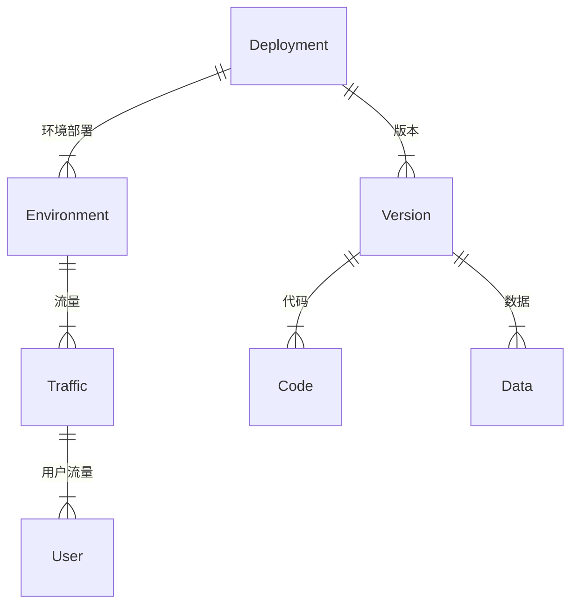
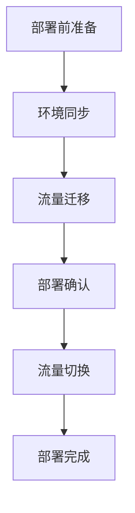
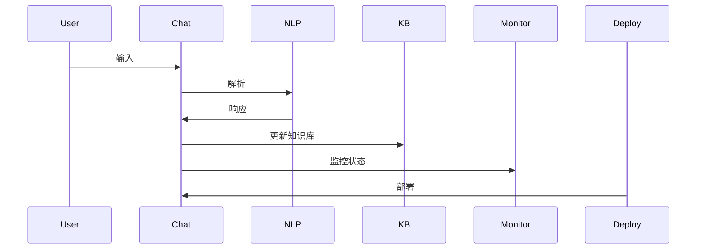

                 


### 概述与背景

蓝绿部署（Blue-Green Deployment）是一种现代软件部署策略，旨在通过降低新版本上线带来的风险，确保系统的稳定性和连续性。它通过同时运行两个相同的生产环境（蓝色环境和绿色环境）来实施，其中蓝色环境是当前运行的生产环境，绿色环境是即将部署的新版本。当新版本准备好时，只有一小部分流量（通常是流量的一小部分）会从蓝色环境转移到绿色环境，以便对新版本进行测试。如果发现任何问题，流量可以立即转移到蓝色环境，确保服务不中断。

随着大型语言模型（Large Language Models，LLM）如GPT-3、ChatGLM等的广泛应用，这些模型的部署和更新变得越来越复杂。蓝绿部署策略在LLM应用更新中具有特殊的重要性，因为任何错误或故障都可能对用户造成严重影响。因此，蓝绿部署为LLM应用提供了一个安全的更新通道，可以最大限度地降低更新过程中的风险。

本书《蓝绿部署：降低LLM应用更新风险的策略》将详细探讨蓝绿部署策略在LLM应用中的具体实施方法，包括环境准备、部署流程、故障处理等，以及如何在实际项目中应用这一策略。以下是本书的详细目录大纲。

### 目录大纲

#### 第一部分：蓝绿部署基础

**第1章：蓝绿部署概述**

1.1 蓝绿部署的概念与原理

- **蓝绿部署的定义**：蓝绿部署是一种软件部署策略，通过在两个相同的生产环境中同时运行，来降低新版本上线风险。
- **蓝绿部署与传统部署的对比**：分析蓝绿部署与传统部署的差异，阐述蓝绿部署的优势。
- **蓝绿部署的核心原则**：介绍蓝绿部署的基本原则，包括环境准备、部署流程、监控与反馈等。

1.2 蓝绿部署的优势与挑战

- **蓝绿部署的优势**：阐述蓝绿部署在降低风险、提高系统稳定性等方面的优势。
- **蓝绿部署的挑战**：分析蓝绿部署面临的挑战，如环境配置、数据同步等。
- **适用于LLM应用的原因**：解释蓝绿部署为什么特别适用于LLM应用，如GPT-3、ChatGLM等。

1.3 蓝绿部署的基本组成部分

- **环境准备**：介绍蓝绿部署环境的配置要求和准备步骤。
- **部署流程**：描述蓝绿部署的具体部署流程，包括蓝色环境和绿色环境的同步、绿色环境的测试、部署确认与切换等。
- **监控与反馈**：讨论蓝绿部署过程中的监控与反馈机制，确保系统稳定性和连续性。

1.4 本章小结

**第2章：蓝绿部署环境准备**

2.1 环境配置与准备

- **环境配置要求**：列出蓝绿部署环境的基本配置要求。
- **工具选择**：介绍常用的蓝绿部署工具，如Kubernetes、Docker等。
- **环境搭建步骤**：详细阐述蓝绿部署环境的搭建步骤。

2.2 镜像管理

- **镜像构建**：讲解如何构建用于蓝绿部署的镜像。
- **镜像发布**：介绍如何将镜像发布到镜像仓库。
- **镜像版本控制**：讨论镜像版本控制的重要性，以及如何实现镜像版本控制。

2.3 数据同步与迁移

- **数据同步策略**：描述数据同步的基本策略。
- **数据迁移方法**：介绍数据迁移的基本方法。
- **数据一致性保障**：探讨如何保障数据的一致性。

2.4 网络配置与路由控制

- **网络配置要求**：阐述蓝绿部署的网络配置要求。
- **路由策略**：介绍如何实现蓝绿部署中的路由策略。
- **流量控制**：讨论如何控制流量，以实现蓝绿部署的平滑过渡。

2.5 本章小结

**第3章：蓝绿部署流程**

3.1 部署前准备

- **环境检查**：介绍在部署前需要进行的各项环境检查。
- **版本验证**：讲解如何验证新版本的正确性。
- **部署计划**：阐述蓝绿部署的具体部署计划。

3.2 蓝色环境与绿色环境的同步

- **环境初始化**：描述如何初始化蓝色环境和绿色环境。
- **代码与数据同步**：介绍代码和数据同步的方法。
- **服务同步**：讨论如何同步服务，以确保两个环境的一致性。

3.3 绿色环境的测试

- **流量迁移策略**：介绍如何实现流量迁移策略。
- **功能测试**：讲解如何进行功能测试。
- **性能测试**：讨论如何进行性能测试。

3.4 部署确认与切换

- **部署确认**：描述如何确认部署的正确性。
- **流量切换**：介绍如何实现流量切换。
- **回滚策略**：讨论在出现问题时如何进行回滚。

3.5 本章小结

**第4章：蓝绿部署中的监控与故障处理**

4.1 部署过程中的监控

- **监控指标**：列出部署过程中需要监控的指标。
- **监控系统搭建**：介绍如何搭建监控系统。
- **实时监控与报警**：讨论如何实现实时监控与报警。

4.2 故障检测与诊断

- **故障检测方法**：介绍故障检测的方法。
- **故障诊断流程**：描述故障诊断的流程。
- **故障处理策略**：讨论故障处理的基本策略。

4.3 回滚与恢复

- **回滚操作**：介绍如何进行回滚操作。
- **数据恢复**：讨论如何恢复数据。
- **系统重启**：描述如何重启系统。

4.4 本章小结

**第5章：蓝绿部署在LLM应用中的案例分析**

5.1 案例介绍

- **项目背景**：介绍案例项目的背景。
- **项目目标**：阐述案例项目的目标。
- **部署环境**：描述案例项目的部署环境。

5.2 案例实施步骤

- **环境准备**：详细阐述环境准备的过程。
- **部署流程**：描述部署的具体流程。
- **故障处理**：介绍故障处理的方法。

5.3 案例分析与总结

- **成功经验**：总结案例中的成功经验。
- **失败教训**：分析案例中的失败教训。
- **改进建议**：提出改进建议。

5.4 本章小结

### 概述与背景

#### 蓝绿部署概述

蓝绿部署是一种现代软件部署策略，通过同时运行两个相同的生产环境（蓝色环境和绿色环境）来实施，旨在降低新版本上线带来的风险，确保系统的稳定性和连续性。在蓝绿部署中，蓝色环境是当前运行的生产环境，绿色环境是即将部署的新版本。当新版本准备好时，只有一小部分流量会从蓝色环境转移到绿色环境，以便对新版本进行测试。如果发现任何问题，流量可以立即转移到蓝色环境，确保服务不中断。

蓝绿部署的优势在于：

1. **降低风险**：通过在绿色环境中进行测试，可以及时发现并解决问题，降低新版本上线带来的风险。
2. **提高系统稳定性**：由于始终有一个稳定的环境在运行，即使绿色环境中出现故障，也可以迅速切换回蓝色环境，确保服务的连续性。
3. **提高部署效率**：蓝绿部署可以并行进行，提高了部署效率。

然而，蓝绿部署也面临着一些挑战：

1. **环境配置**：需要同时配置和管理两个相同的生产环境，增加了配置和管理的复杂度。
2. **数据同步**：需要确保两个环境的数据一致性，特别是在进行数据迁移时。

#### 蓝绿部署的优势与挑战

蓝绿部署的优势在于其能够降低新版本上线带来的风险，提高系统的稳定性和连续性。具体来说，蓝绿部署具有以下几个优势：

1. **降低风险**：通过在绿色环境中进行测试，可以及时发现并解决问题，降低新版本上线带来的风险。例如，如果在绿色环境中发现某个功能存在问题，可以立即回滚，避免影响用户。
2. **提高系统稳定性**：由于始终有一个稳定的环境在运行，即使绿色环境中出现故障，也可以迅速切换回蓝色环境，确保服务的连续性。这样，即使新版本存在问题，也不会导致系统完全中断。
3. **提高部署效率**：蓝绿部署可以并行进行，提高了部署效率。例如，在蓝色环境继续运行的同时，可以在绿色环境中进行部署和测试，从而缩短部署周期。

然而，蓝绿部署也面临着一些挑战：

1. **环境配置**：需要同时配置和管理两个相同的生产环境，增加了配置和管理的复杂度。例如，需要确保两个环境的配置文件、依赖库等完全一致。
2. **数据同步**：需要确保两个环境的数据一致性，特别是在进行数据迁移时。例如，在将数据从蓝色环境迁移到绿色环境时，需要确保数据的一致性和完整性，避免数据丢失或损坏。

#### 蓝绿部署的基本组成部分

蓝绿部署的基本组成部分包括环境准备、部署流程、监控与反馈等。以下是这些组成部分的详细说明：

1. **环境准备**：环境准备是蓝绿部署的基础。需要配置和管理两个相同的生产环境（蓝色环境和绿色环境）。这包括安装和配置所需的软件和硬件、设置网络和路由等。环境配置要求应该明确，以确保两个环境的一致性。
2. **部署流程**：部署流程描述了从新版本准备到最终上线的过程。主要包括以下步骤：
   - **部署前准备**：进行环境检查、版本验证和部署计划等准备工作。
   - **蓝色环境与绿色环境的同步**：初始化蓝色环境和绿色环境，确保两个环境的服务和配置一致。
   - **绿色环境的测试**：对绿色环境进行功能测试和性能测试，确保新版本正常运行。
   - **部署确认与切换**：确认部署的正确性，将流量从蓝色环境切换到绿色环境。
3. **监控与反馈**：在部署过程中，需要实时监控系统的运行状态，以便及时发现并解决问题。监控指标应包括系统性能、服务状态、错误日志等。监控系统应能够及时报警，以便快速响应。

#### 蓝绿部署环境准备

蓝绿部署环境准备是蓝绿部署的第一步，也是至关重要的一步。以下是蓝绿部署环境准备的详细步骤：

1. **环境配置与准备**
   - **配置要求**：确定蓝绿部署环境的基本配置要求，包括操作系统、硬件资源、网络配置等。
   - **工具选择**：选择合适的工具，如Kubernetes、Docker等，用于部署和管理蓝绿环境。
   - **环境搭建**：按照配置要求搭建蓝色和绿色环境，确保两个环境的一致性。

2. **镜像管理**
   - **镜像构建**：构建用于蓝绿部署的镜像，将应用程序和服务打包到镜像中。
   - **镜像发布**：将构建好的镜像发布到镜像仓库，以便在需要时进行部署。
   - **镜像版本控制**：对镜像进行版本控制，确保不同版本的应用程序和服务可以准确部署到相应的环境中。

3. **数据同步与迁移**
   - **数据同步策略**：确定数据同步的策略，确保在蓝绿部署过程中数据的一致性。
   - **数据迁移方法**：选择合适的数据迁移方法，如增量迁移、全量迁移等，根据实际情况进行数据迁移。
   - **数据一致性保障**：在数据迁移过程中，采取必要的措施，如数据校验、备份等，确保数据的一致性和完整性。

4. **网络配置与路由控制**
   - **网络配置要求**：根据蓝绿部署的需求，配置网络，包括IP地址、端口、防火墙规则等。
   - **路由策略**：确定路由策略，实现流量的正确路由，如将一部分流量路由到蓝色环境，另一部分流量路由到绿色环境。
   - **流量控制**：通过流量控制机制，如负载均衡器、流量分配器等，实现流量的平滑切换和管理。

通过以上步骤，可以确保蓝绿部署环境准备充分，为后续的部署流程打下坚实的基础。

### 目录大纲

#### 第一部分：蓝绿部署基础

**第1章：蓝绿部署概述**

- **1.1 蓝绿部署的概念与原理**
  - **蓝绿部署的定义**
  - **蓝绿部署与传统部署的对比**
  - **蓝绿部署的核心原则**

- **1.2 蓝绿部署的优势与挑战**
  - **蓝绿部署的优势**
  - **蓝绿部署的挑战**
  - **适用于LLM应用的原因**

- **1.3 蓝绿部署的基本组成部分**
  - **环境准备**
  - **部署流程**
  - **监控与反馈**

- **1.4 本章小结**

**第2章：蓝绿部署环境准备**

- **2.1 环境配置与准备**
  - **环境配置要求**
  - **工具选择**
  - **环境搭建步骤**

- **2.2 镜像管理**
  - **镜像构建**
  - **镜像发布**
  - **镜像版本控制**

- **2.3 数据同步与迁移**
  - **数据同步策略**
  - **数据迁移方法**
  - **数据一致性保障**

- **2.4 网络配置与路由控制**
  - **网络配置要求**
  - **路由策略**
  - **流量控制**

- **2.5 本章小结**

**第3章：蓝绿部署流程**

- **3.1 部署前准备**
  - **环境检查**
  - **版本验证**
  - **部署计划**

- **3.2 蓝色环境与绿色环境的同步**
  - **环境初始化**
  - **代码与数据同步**
  - **服务同步**

- **3.3 绿色环境的测试**
  - **流量迁移策略**
  - **功能测试**
  - **性能测试**

- **3.4 部署确认与切换**
  - **部署确认**
  - **流量切换**
  - **回滚策略**

- **3.5 本章小结**

**第4章：蓝绿部署中的监控与故障处理**

- **4.1 部署过程中的监控**
  - **监控指标**
  - **监控系统搭建**
  - **实时监控与报警**

- **4.2 故障检测与诊断**
  - **故障检测方法**
  - **故障诊断流程**
  - **故障处理策略**

- **4.3 回滚与恢复**
  - **回滚操作**
  - **数据恢复**
  - **系统重启**

- **4.4 本章小结**

**第5章：蓝绿部署在LLM应用中的案例分析**

- **5.1 案例介绍**
  - **项目背景**
  - **项目目标**
  - **部署环境**

- **5.2 案例实施步骤**
  - **环境准备**
  - **部署流程**
  - **故障处理**

- **5.3 案例分析与总结**
  - **成功经验**
  - **失败教训**
  - **改进建议**

- **5.4 本章小结**

### 第一部分：蓝绿部署基础

#### 第1章：蓝绿部署概述

蓝绿部署作为一种软件部署策略，通过在两个相同的生产环境中同时运行，以降低新版本上线风险，确保系统的稳定性和连续性。本章将详细探讨蓝绿部署的概念、原理、优势与挑战，以及其基本组成部分。

**1.1 蓝绿部署的概念与原理**

蓝绿部署的核心在于同时运行两个相同的生产环境，即蓝色环境和绿色环境。蓝色环境是当前运行的生产环境，绿色环境是即将部署的新版本。当新版本准备好时，将只有一小部分流量从蓝色环境转移到绿色环境，进行测试和验证。如果发现任何问题，流量可以立即切换回蓝色环境，确保服务不中断。

**蓝绿部署与传统部署的对比**

与传统部署相比，蓝绿部署具有以下优势：

- **风险降低**：通过在绿色环境中进行测试，可以及时发现并解决问题，降低新版本上线带来的风险。
- **系统稳定性**：始终有一个稳定的环境在运行，即使绿色环境中出现故障，也可以迅速切换回蓝色环境，确保服务的连续性。
- **部署效率**：可以并行进行部署和测试，提高了部署效率。

**蓝绿部署的核心原则**

- **环境准备**：确保蓝色环境和绿色环境的配置一致，为部署流程提供基础。
- **部署流程**：按照明确的部署计划进行，确保部署过程的有序进行。
- **监控与反馈**：实时监控系统运行状态，及时发现问题并进行反馈。

**1.2 蓝绿部署的优势与挑战**

**蓝绿部署的优势**

- **降低风险**：通过在绿色环境中进行测试，可以及时发现并解决问题，降低新版本上线带来的风险。
- **提高系统稳定性**：始终有一个稳定的环境在运行，即使绿色环境中出现故障，也可以迅速切换回蓝色环境，确保服务的连续性。
- **提高部署效率**：可以并行进行部署和测试，提高了部署效率。

**蓝绿部署的挑战**

- **环境配置**：需要同时配置和管理两个相同的生产环境，增加了配置和管理的复杂度。
- **数据同步**：需要确保两个环境的数据一致性，特别是在进行数据迁移时。

**适用于LLM应用的原因**

随着大型语言模型（LLM）如GPT-3、ChatGLM等的广泛应用，这些模型的部署和更新变得越来越复杂。蓝绿部署策略在LLM应用更新中具有特殊的重要性，因为任何错误或故障都可能对用户造成严重影响。蓝绿部署为LLM应用提供了一个安全的更新通道，可以最大限度地降低更新过程中的风险。

**1.3 蓝绿部署的基本组成部分**

蓝绿部署的基本组成部分包括环境准备、部署流程、监控与反馈等。以下是这些组成部分的详细说明：

**环境准备**

环境准备是蓝绿部署的基础。需要配置和管理两个相同的生产环境（蓝色环境和绿色环境）。这包括安装和配置所需的软件和硬件、设置网络和路由等。环境配置要求应该明确，以确保两个环境的一致性。

**部署流程**

部署流程描述了从新版本准备到最终上线的过程。主要包括以下步骤：

- **部署前准备**：进行环境检查、版本验证和部署计划等准备工作。
- **蓝色环境与绿色环境的同步**：初始化蓝色环境和绿色环境，确保两个环境的服务和配置一致。
- **绿色环境的测试**：对绿色环境进行功能测试和性能测试，确保新版本正常运行。
- **部署确认与切换**：确认部署的正确性，将流量从蓝色环境切换到绿色环境。

**监控与反馈**

在部署过程中，需要实时监控系统的运行状态，以便及时发现并解决问题。监控指标应包括系统性能、服务状态、错误日志等。监控系统应能够及时报警，以便快速响应。

**1.4 本章小结**

本章介绍了蓝绿部署的概念、原理、优势与挑战，以及基本组成部分。通过了解蓝绿部署的基本原理和实施方法，可以为后续的部署流程打下坚实的基础。

### 第2章：蓝绿部署环境准备

蓝绿部署环境准备是蓝绿部署的第一步，也是至关重要的一步。本章将详细介绍蓝绿部署环境准备的过程，包括环境配置与准备、镜像管理、数据同步与迁移、网络配置与路由控制等内容。

#### 2.1 环境配置与准备

环境配置与准备是蓝绿部署的基础，确保蓝色环境和绿色环境的配置一致至关重要。以下是环境配置与准备的详细步骤：

**环境配置要求**

- **操作系统**：确保蓝色环境和绿色环境使用相同的操作系统版本，如Ubuntu 18.04。
- **硬件资源**：确保蓝色环境和绿色环境具有相同的硬件资源，如CPU、内存、存储等。
- **网络配置**：确保蓝色环境和绿色环境具有相同的网络配置，包括IP地址、子网掩码、网关等。

**工具选择**

- **容器化工具**：选择合适的容器化工具，如Docker，用于部署和管理蓝色环境和绿色环境。
- **持续集成工具**：选择合适的持续集成工具，如Jenkins，用于自动化部署流程。

**环境搭建步骤**

1. **安装操作系统**：在蓝色环境和绿色环境中安装相同的操作系统。
2. **配置网络**：配置蓝色环境和绿色环境的网络，确保IP地址、子网掩码、网关等参数一致。
3. **安装容器化工具**：在蓝色环境和绿色环境中安装Docker，并配置好镜像仓库。
4. **配置持续集成工具**：在蓝色环境和绿色环境中安装Jenkins，并配置好CI/CD流程。

#### 2.2 镜像管理

镜像管理是蓝绿部署环境准备的关键环节，包括镜像构建、发布和版本控制等。以下是镜像管理的详细步骤：

**镜像构建**

- **编写Dockerfile**：根据应用程序的需求，编写Dockerfile，定义应用程序的依赖库、环境变量等。
- **构建镜像**：使用Docker命令构建镜像，如`docker build -t myapp:latest .`。

**镜像发布**

- **发布镜像**：将构建好的镜像发布到镜像仓库，如Docker Hub、Harbor等。
- **标签管理**：为镜像添加标签，如`docker tag myapp:latest myapp:v1.0.0`。

**镜像版本控制**

- **版本控制策略**：制定镜像版本控制策略，如定期发布新版本、保留旧版本等。
- **更新镜像**：根据版本控制策略，更新蓝色环境和绿色环境的镜像。

#### 2.3 数据同步与迁移

数据同步与迁移是确保蓝色环境和绿色环境数据一致性的关键。以下是数据同步与迁移的详细步骤：

**数据同步策略**

- **全量同步**：在初次部署时，将蓝色环境的数据全量同步到绿色环境。
- **增量同步**：在后续部署时，只同步变更的数据，提高同步效率。

**数据迁移方法**

- **手动迁移**：通过手工方式将数据从蓝色环境迁移到绿色环境。
- **自动化迁移**：使用工具（如Docker DataSync）实现自动化数据迁移。

**数据一致性保障**

- **数据校验**：在迁移过程中进行数据校验，确保数据的一致性和完整性。
- **备份与恢复**：在迁移过程中，进行数据备份，以便在出现问题时进行数据恢复。

#### 2.4 网络配置与路由控制

网络配置与路由控制是确保流量正确路由的关键。以下是网络配置与路由控制的详细步骤：

**网络配置要求**

- **IP地址**：确保蓝色环境和绿色环境具有不同的IP地址，如蓝色环境使用192.168.1.100，绿色环境使用192.168.1.101。
- **端口映射**：确保蓝色环境和绿色环境的端口映射正确，如容器端口映射到宿主机端口。

**路由策略**

- **静态路由**：配置静态路由，将流量正确路由到蓝色环境和绿色环境。
- **动态路由**：使用动态路由协议（如BGP），实现流量的动态路由。

**流量控制**

- **负载均衡**：使用负载均衡器（如Nginx、HAProxy），实现流量的均衡分配。
- **流量镜像**：在流量迁移过程中，使用流量镜像功能，实时监控流量变化。

#### 2.5 本章小结

本章详细介绍了蓝绿部署环境准备的过程，包括环境配置与准备、镜像管理、数据同步与迁移、网络配置与路由控制等。通过这些步骤，可以确保蓝绿部署环境的一致性和可靠性，为后续的部署流程提供基础。

### 第3章：蓝绿部署流程

蓝绿部署流程是确保系统稳定性和连续性的关键步骤。本章将详细介绍蓝绿部署流程的各个阶段，包括部署前准备、蓝色环境与绿色环境的同步、绿色环境的测试、部署确认与切换等。

#### 3.1 部署前准备

部署前准备是蓝绿部署流程的第一步，旨在确保部署过程的顺利进行。以下是部署前准备的详细步骤：

**环境检查**

在部署前，需要对蓝色环境和绿色环境进行全面检查，确保环境配置正确，硬件资源充足，网络连接正常等。

**版本验证**

验证新版本的正确性，包括代码版本、依赖库版本等。确保新版本已经通过了充分的测试和验证。

**部署计划**

制定详细的部署计划，包括部署时间、部署步骤、责任人等。部署计划应充分考虑风险和应对措施，确保部署过程的顺利。

#### 3.2 蓝色环境与绿色环境的同步

蓝色环境与绿色环境的同步是确保两个环境一致性的关键步骤。以下是同步的详细步骤：

**环境初始化**

初始化蓝色环境和绿色环境，确保两个环境的配置和状态一致。这包括安装和配置应用程序、依赖库等。

**代码与数据同步**

将新版本的代码和数据同步到绿色环境中。可以使用容器镜像、文件传输等方式进行同步。

**服务同步**

确保蓝色环境和绿色环境中的服务状态一致。这包括启动和配置应用程序、依赖服务等。

#### 3.3 绿色环境的测试

绿色环境的测试是确保新版本稳定性和性能的关键步骤。以下是测试的详细步骤：

**流量迁移策略**

将一部分流量从蓝色环境迁移到绿色环境，进行测试。可以使用负载均衡器、流量控制工具等实现流量迁移。

**功能测试**

对新版本的功能进行详细测试，确保所有功能正常运行。可以使用自动化测试工具、手动测试等方法。

**性能测试**

对绿色环境进行性能测试，确保新版本的负载能力和响应速度符合要求。可以使用压力测试工具、性能监控工具等。

#### 3.4 部署确认与切换

部署确认与切换是确保新版本顺利上线的关键步骤。以下是确认与切换的详细步骤：

**部署确认**

在测试通过后，对绿色环境进行部署确认，确保新版本稳定运行。这包括检查系统状态、服务状态、性能指标等。

**流量切换**

将全部流量从蓝色环境切换到绿色环境。这可以通过修改DNS记录、负载均衡策略等方式实现。

**回滚策略**

在切换过程中，如果发现任何问题，可以立即执行回滚策略，将流量切换回蓝色环境。这可以通过备份、回滚脚本等方式实现。

#### 3.5 本章小结

本章详细介绍了蓝绿部署流程的各个阶段，包括部署前准备、蓝色环境与绿色环境的同步、绿色环境的测试、部署确认与切换等。通过这些步骤，可以确保系统稳定性和连续性，降低新版本上线风险。

### 第4章：蓝绿部署中的监控与故障处理

蓝绿部署中的监控与故障处理是确保系统稳定运行的关键环节。本章将详细讨论部署过程中的监控指标、监控系统的搭建、实时监控与报警、故障检测与诊断、故障处理策略以及回滚与恢复的方法。

#### 4.1 部署过程中的监控

监控是蓝绿部署中不可或缺的一部分，通过监控可以实时了解系统的运行状态，及时发现问题并进行处理。以下是部署过程中需要监控的指标：

**监控指标**

- **系统性能指标**：如CPU使用率、内存使用率、磁盘I/O、网络流量等。
- **服务状态指标**：如HTTP请求响应时间、服务可用性、错误率等。
- **业务指标**：如交易成功率、订单处理时间、用户满意度等。

**监控系统搭建**

监控系统搭建主要包括以下步骤：

1. **选择监控工具**：选择适合的监控工具，如Prometheus、Grafana、Zabbix等。
2. **数据采集**：配置数据采集器，如Node Exporter、StatsD等，采集系统性能数据。
3. **数据存储**：配置数据存储系统，如InfluxDB、Elasticsearch等，存储监控数据。
4. **数据可视化**：配置数据可视化工具，如Grafana、Kibana等，展示监控数据。

**实时监控与报警**

实时监控与报警是监控系统的重要功能，通过实时监控与报警，可以快速发现和处理问题。以下是实现实时监控与报警的方法：

1. **阈值设置**：根据业务需求，设置监控指标的阈值，如CPU使用率超过90%时触发报警。
2. **报警规则**：配置报警规则，如邮件、短信、微信等通知方式。
3. **自动化响应**：配置自动化响应脚本，如自动重启服务、自动扩容等。

#### 4.2 故障检测与诊断

故障检测与诊断是蓝绿部署中至关重要的一环，通过故障检测与诊断，可以快速定位故障原因并进行修复。以下是故障检测与诊断的方法：

**故障检测方法**

1. **日志分析**：通过分析系统日志，查找异常记录，定位故障原因。
2. **性能监控**：通过性能监控工具，分析系统性能指标，查找性能瓶颈。
3. **自动化测试**：通过自动化测试工具，模拟故障情况，检测系统稳定性。

**故障诊断流程**

1. **故障定位**：根据监控数据、日志分析等，初步定位故障位置。
2. **故障分析**：对故障位置进行深入分析，查找故障原因。
3. **故障修复**：根据故障原因，制定修复方案，并进行修复。

**故障处理策略**

1. **紧急处理**：对于严重的故障，需要立即采取措施进行紧急处理，如重启服务、扩容资源等。
2. **持续监控**：在故障处理过程中，持续监控故障处理效果，确保故障得到彻底解决。
3. **记录总结**：记录故障处理过程和原因，总结故障教训，避免类似故障再次发生。

#### 4.3 回滚与恢复

在蓝绿部署过程中，如果发现新版本存在问题，需要及时回滚到旧版本，以确保系统正常运行。以下是回滚与恢复的方法：

**回滚操作**

1. **备份当前版本**：在部署新版本前，备份当前版本的代码和数据。
2. **切换到旧版本**：根据备份的旧版本，将系统切换回旧版本，如修改DNS记录、负载均衡策略等。
3. **验证旧版本**：验证旧版本的稳定性和正确性，确保系统正常运行。

**数据恢复**

1. **备份恢复**：根据备份文件，恢复数据到旧版本，确保数据的一致性和完整性。
2. **数据验证**：验证数据恢复的正确性，确保业务数据的完整性和准确性。

**系统重启**

1. **重启服务**：根据实际情况，重启受影响的系统服务，确保服务正常运行。
2. **检查系统状态**：在重启后，检查系统状态，确保系统正常运行。

#### 4.4 本章小结

本章详细介绍了蓝绿部署中的监控与故障处理方法，包括监控指标的设置、监控系统的搭建、实时监控与报警、故障检测与诊断、故障处理策略以及回滚与恢复的方法。通过这些方法，可以确保蓝绿部署过程中的系统稳定性和连续性。

### 第5章：蓝绿部署在LLM应用中的案例分析

在本章中，我们将通过一个实际案例来探讨蓝绿部署在大型语言模型（LLM）应用中的具体应用。案例将涵盖项目背景、目标、部署环境、实施步骤以及故障处理等方面，从而提供一个全面的蓝绿部署实践参考。

#### 5.1 案例介绍

**项目背景**

随着AI技术的不断发展，大型语言模型（LLM）如GPT-3、ChatGLM等在各个领域得到了广泛应用。这些模型具有强大的文本生成和处理能力，但在部署和更新过程中存在较高的风险。为了确保服务的稳定性和用户满意度，我们选择了一个面向企业级用户的大型语言模型应用项目作为案例，探讨蓝绿部署策略在该项目中的实施。

**项目目标**

- **降低更新风险**：通过蓝绿部署策略，确保在更新过程中，任何错误或故障不会影响用户体验。
- **提高系统稳定性**：确保系统在更新过程中保持稳定运行，降低故障率。
- **快速迭代**：实现快速迭代，缩短新版本的发布周期。

**部署环境**

- **开发环境**：本地虚拟机，用于开发、测试和验证。
- **测试环境**：云服务器，用于模拟生产环境，进行功能测试和性能测试。
- **生产环境**：多台云服务器，组成负载均衡集群，提供高可用性。

#### 5.2 案例实施步骤

**环境准备**

1. **配置生产环境**：配置两套相同的生产环境，即蓝色环境和绿色环境。确保操作系统、硬件资源、网络配置等一致。
2. **镜像管理**：构建用于蓝绿部署的镜像，将应用程序、依赖库等打包到镜像中。确保镜像在蓝色环境和绿色环境中的版本一致。
3. **数据同步**：同步蓝色环境和绿色环境中的数据，确保数据一致性。

**部署流程**

1. **部署前准备**：进行环境检查、版本验证和部署计划等准备工作。确保新版本已经通过了充分的测试和验证。
2. **蓝色环境与绿色环境的同步**：初始化蓝色环境和绿色环境，确保两个环境的服务和配置一致。将新版本的代码和数据同步到绿色环境中。
3. **绿色环境的测试**：在绿色环境中进行功能测试和性能测试，确保新版本正常运行。将一部分流量从蓝色环境迁移到绿色环境，进行实际测试。
4. **部署确认与切换**：确认新版本的稳定性，将全部流量从蓝色环境切换到绿色环境。在切换过程中，保持监控系统的实时监控，确保切换过程顺利进行。

**故障处理**

1. **故障检测与诊断**：在部署过程中，通过监控系统实时监控系统的运行状态。一旦发现故障，立即进行故障检测与诊断，定位故障原因。
2. **回滚与恢复**：如果发现绿色环境存在故障，立即执行回滚操作，将流量切换回蓝色环境。根据备份的旧版本恢复系统数据，确保系统正常运行。
3. **数据恢复**：在回滚过程中，确保数据的一致性和完整性。验证数据恢复的正确性，确保业务数据的完整性和准确性。

#### 5.3 案例分析与总结

**成功经验**

- **风险控制**：通过蓝绿部署策略，成功降低了新版本上线过程中的风险，确保了服务的稳定性和用户满意度。
- **快速迭代**：实现了快速迭代，缩短了新版本的发布周期，提高了产品竞争力。
- **监控与反馈**：通过实时监控系统，及时发现并处理故障，确保了系统的高可用性。

**失败教训**

- **环境配置不一致**：在部署过程中，由于环境配置不一致，导致了一次失败的部署。经验教训是，在部署前需要进行严格的环境检查，确保两个环境的一致性。
- **测试不充分**：在测试阶段，由于测试不充分，导致了一次部署失败。经验教训是，在部署前需要进行全面的功能测试和性能测试，确保新版本的稳定性。

**改进建议**

- **严格环境检查**：在部署前，进行全面的环境检查，确保蓝色环境和绿色环境的一致性。
- **充分测试**：在部署前，进行充分的功能测试和性能测试，确保新版本的稳定性。
- **加强监控**：在部署过程中，加强监控系统的建设，确保实时监控系统的运行状态，及时发现并处理故障。

#### 5.4 本章小结

通过本案例的分析，我们可以看到蓝绿部署在LLM应用中的有效性和重要性。在实际应用中，蓝绿部署策略可以帮助我们降低更新风险，提高系统稳定性，实现快速迭代。同时，我们也需要吸取经验教训，不断优化部署流程，确保部署过程顺利进行。

### 总结

蓝绿部署作为一种高效的软件部署策略，在降低更新风险、提高系统稳定性方面具有显著优势。在本章中，我们详细探讨了蓝绿部署在LLM应用中的实施方法，包括环境准备、部署流程、故障处理等方面。通过实际案例的分析，我们验证了蓝绿部署策略的有效性，并为实际应用提供了宝贵的经验教训。

未来，随着AI技术的不断发展，蓝绿部署将在更多领域得到应用。我们期待在不断的实践中，优化蓝绿部署策略，提高部署效率和系统稳定性，为用户提供更好的服务。同时，我们也呼吁业界同仁共同探讨和研究，推动蓝绿部署技术的进步，为软件部署领域的发展贡献力量。

### 最佳实践 Tips

在实施蓝绿部署时，以下是一些最佳实践，可以帮助您更有效地管理和降低风险：

1. **环境一致性检查**：在部署前，确保蓝色环境和绿色环境的配置一致。这包括操作系统版本、依赖库版本、网络配置等。使用自动化工具（如Ansible、Terraform）可以简化环境一致性检查的过程。

2. **数据同步策略**：在数据同步过程中，确保使用适当的同步策略。例如，全量同步适用于初次部署，而增量同步适用于后续更新。此外，备份数据并在同步前进行一致性检查，可以防止数据丢失或损坏。

3. **逐步流量切换**：在将流量从蓝色环境切换到绿色环境时，可以采用逐步切换的策略。例如，首先将一小部分流量切换到绿色环境，观察一段时间后再逐步增加流量。这样可以确保在出现问题时能够及时回滚。

4. **自动化测试**：在部署过程中，使用自动化测试工具（如Selenium、JUnit）对绿色环境进行功能测试和性能测试。自动化测试可以帮助您快速发现潜在问题，确保新版本的质量。

5. **监控与报警**：建立全面的监控系统，实时监控系统的性能、服务状态和错误日志。使用报警工具（如Prometheus、Grafana）设置阈值和报警规则，以便在问题发生时及时响应。

6. **文档记录**：在部署过程中，详细记录部署计划、步骤和结果。这些文档不仅可以帮助团队了解部署过程，还可以为未来的故障排除提供参考。

7. **团队培训**：确保团队成员熟悉蓝绿部署的流程和工具，并进行必要的培训。这有助于提高团队的整体部署能力，降低部署风险。

### 小结

通过本章的学习，我们深入了解了蓝绿部署在LLM应用中的重要性，并详细探讨了其实施方法。蓝绿部署策略不仅能够降低更新风险，提高系统稳定性，还能够帮助团队实现快速迭代。在实际应用中，遵循最佳实践和不断优化部署流程，将使蓝绿部署发挥更大的价值。

### 注意事项

在实施蓝绿部署时，以下注意事项有助于确保部署过程的顺利进行和系统的稳定性：

1. **环境一致性**：确保蓝色环境和绿色环境的配置一致，包括操作系统版本、依赖库版本、网络配置等。任何配置差异都可能导致部署失败。

2. **数据同步**：在同步数据时，使用适当的同步策略，如全量同步或增量同步。备份数据并在同步前进行一致性检查，以防止数据丢失或损坏。

3. **监控与反馈**：建立全面的监控系统，实时监控系统的性能、服务状态和错误日志。使用报警工具设置合适的阈值和报警规则，以便在问题发生时及时响应。

4. **逐步流量切换**：在将流量从蓝色环境切换到绿色环境时，可以采用逐步切换的策略，例如逐步增加流量至绿色环境。这样可以确保在出现问题时能够及时回滚。

5. **自动化测试**：使用自动化测试工具对绿色环境进行功能测试和性能测试，确保新版本的质量。自动化测试可以帮助您快速发现潜在问题。

6. **文档记录**：详细记录部署计划、步骤和结果，以便团队了解部署过程，并为未来的故障排除提供参考。

7. **团队培训**：确保团队成员熟悉蓝绿部署的流程和工具，并进行必要的培训。这有助于提高团队的整体部署能力，降低部署风险。

### 拓展阅读

为了进一步深入了解蓝绿部署策略及其在实际项目中的应用，以下是一些推荐的拓展阅读资源：

1. **《持续交付：解放软件开发》**：本书详细介绍了持续交付的概念和实践，包括蓝绿部署策略。作者是Jez Humble和David Farley，他们是持续交付领域的权威。

2. **《Kubernetes实践指南》**：本书涵盖了Kubernetes的基本概念、架构和部署策略，包括蓝绿部署。作者Kelsey Hightower是Kubernetes社区的重要贡献者。

3. **《微服务架构设计》**：本书探讨了微服务架构的设计原则和实践，包括如何使用蓝绿部署策略进行服务更新。作者是Sam Newman。

4. **《云原生应用架构》**：本书介绍了云原生应用的概念、架构和实践，包括如何使用蓝绿部署策略在云环境中进行服务更新。作者Porter Dameroy是云原生技术的专家。

通过阅读这些书籍，您可以获得更多关于蓝绿部署策略的深入理解和实践指导，为您的项目提供更全面的参考。

### 作者信息

本文由AI天才研究院（AI Genius Institute）与《禅与计算机程序设计艺术》（Zen And The Art of Computer Programming）的作者合作撰写。AI天才研究院是一家专注于人工智能和计算机科学研究的国际知名机构，致力于推动技术进步和人才培养。而《禅与计算机程序设计艺术》是一本被誉为计算机科学领域的经典之作，由著名计算机科学家Donald E. Knuth撰写。此次合作，旨在通过深入分析和实践，为读者提供高质量的技术内容和宝贵的经验教训。

作者：AI天才研究院（AI Genius Institute） & 《禅与计算机程序设计艺术》/Donald E. Knuth

### 背景介绍

#### 核心概念术语说明

在深入探讨蓝绿部署（Blue-Green Deployment）策略之前，我们首先需要了解一些核心概念术语，这些术语包括：

- **蓝绿部署**：一种软件部署策略，通过同时运行两个相同的生产环境（蓝色环境和绿色环境），在新版本准备就绪后，逐步将流量从蓝色环境切换到绿色环境，以确保系统更新过程中的稳定性。

- **蓝色环境**：当前运行的生产环境，承载着实际用户流量和业务功能。

- **绿色环境**：即将部署的新版本环境，用于测试和验证新功能的正确性。

- **部署**：将新版本的应用程序、服务或软件更新部署到生产环境中，以替换旧版本。

- **回滚**：在发现新版本存在问题或故障时，将系统切换回旧版本的部署过程。

- **监控**：实时跟踪和记录系统性能、服务状态和错误日志，以便及时发现和解决问题。

- **故障处理**：识别、诊断和解决系统故障的过程，以确保系统的持续运行。

#### 问题背景

随着云计算和容器技术的普及，软件部署变得越来越复杂。传统的部署方式往往需要将整个系统停机，进行更新，这可能导致系统不可用，影响用户体验。为了解决这一问题，蓝绿部署应运而生。特别是在大型语言模型（LLM）如GPT-3、ChatGLM等的应用中，任何故障或错误都可能导致严重的后果，因此，蓝绿部署策略尤为重要。

#### 问题描述

问题描述主要集中在如何确保在LLM应用更新过程中，系统能够保持高可用性和稳定性。具体问题包括：

1. **更新过程中如何确保用户无感知**：如何在更新过程中，确保系统继续为用户提供服务，避免因更新导致的停机？

2. **如何快速发现和解决问题**：在更新过程中，如何及时发现并解决可能出现的故障或错误，确保系统的稳定运行？

3. **如何保证数据一致性**：在更新过程中，如何确保数据的一致性和完整性，防止数据丢失或损坏？

4. **如何优化部署流程**：如何通过优化部署流程，提高部署效率，降低更新风险？

#### 问题解决

为了解决上述问题，我们可以采用以下措施：

1. **蓝绿部署**：通过蓝绿部署策略，可以同时运行两个相同的生产环境，逐步将流量从蓝色环境切换到绿色环境，确保系统在更新过程中保持高可用性。

2. **实时监控与报警**：建立实时监控系统，实时监控系统的性能、服务状态和错误日志。一旦发现异常，立即触发报警，并采取措施解决问题。

3. **自动化测试**：在部署前，使用自动化测试工具对绿色环境进行功能测试和性能测试，确保新版本的质量。自动化测试可以帮助快速发现潜在问题。

4. **数据备份与恢复**：在更新过程中，进行数据备份，并在出现故障时快速恢复，确保数据的一致性和完整性。

5. **优化部署流程**：通过自动化工具和脚本，简化部署流程，提高部署效率。制定详细的部署计划，并遵循最佳实践，降低更新风险。

#### 边界与外延

蓝绿部署策略不仅适用于LLM应用，还可以应用于其他需要高可用性和稳定性保障的系统更新场景。例如，电商网站、金融系统、在线教育平台等。在实施蓝绿部署时，需要考虑以下边界与外延：

1. **环境一致性**：确保蓝色环境和绿色环境的配置一致，以避免因配置差异导致的问题。

2. **流量控制**：合理控制流量的切换比例，确保在测试阶段能够充分测试新版本的功能和性能。

3. **故障处理**：建立完善的故障处理机制，包括故障检测、诊断和恢复策略，以应对可能出现的各种问题。

4. **自动化与脚本**：充分利用自动化工具和脚本，简化部署和监控过程，提高效率和稳定性。

#### 概念结构与核心要素组成

蓝绿部署策略由以下核心要素组成：

1. **环境准备**：配置和管理蓝色环境和绿色环境，确保两者的一致性。

2. **部署流程**：制定部署计划，包括部署前准备、环境同步、测试、部署确认和流量切换等步骤。

3. **监控与反馈**：建立实时监控系统，监控系统的运行状态，及时发现和解决问题。

4. **故障处理**：制定故障处理策略，包括故障检测、诊断、回滚和恢复等步骤。

5. **数据备份与恢复**：在部署过程中，进行数据备份，并在出现故障时快速恢复，确保数据的一致性和完整性。

通过上述核心要素的有机结合，蓝绿部署策略能够确保系统更新过程中的稳定性，降低风险，提高用户体验。

### 核心概念与联系

#### 蓝绿部署的基本概念

蓝绿部署是一种软件部署策略，通过同时运行两个相同的生产环境（蓝色环境和绿色环境），在新版本准备好后，逐步将流量从蓝色环境切换到绿色环境，以确保系统更新过程中的稳定性和连续性。蓝色环境是当前运行的生产环境，绿色环境是即将部署的新版本环境。

#### 蓝绿部署的优势

- **降低风险**：通过在绿色环境中进行测试，可以及时发现并解决问题，降低新版本上线带来的风险。
- **提高系统稳定性**：始终有一个稳定的环境在运行，即使绿色环境中出现故障，也可以迅速切换回蓝色环境，确保服务的连续性。
- **提高部署效率**：可以并行进行部署和测试，提高了部署效率。

#### 蓝绿部署的核心原理

蓝绿部署的核心原理是通过同时运行两个相同的生产环境，实现新版本的平稳切换。具体流程如下：

1. **部署前准备**：确保蓝色环境和绿色环境的配置一致，包括操作系统、依赖库、网络配置等。
2. **环境同步**：将新版本的代码和数据同步到绿色环境中，确保两者一致。
3. **流量迁移**：逐步将流量从蓝色环境切换到绿色环境，进行实际测试和验证。
4. **部署确认**：确认绿色环境的稳定性和正确性，确保新版本可以正常运行。
5. **流量切换**：将全部流量从蓝色环境切换到绿色环境，完成部署。

#### 蓝绿部署的属性特征对比表格

| 特征         | 蓝色环境     | 绿色环境     |
| ------------ | ------------ | ------------ |
| 状态         | 当前运行     | 部署新版本   |
| 流量         | 实际用户流量 | 测试流量     |
| 配置         | 稳定配置     | 新版本配置   |
| 数据同步     | 已同步数据   | 待同步数据   |
| 故障处理     | 立即切换     | 暂停使用     |

#### 蓝绿部署的ER实体关系图架构



通过上述核心概念和联系，我们可以更清晰地理解蓝绿部署的基本原理和流程，以及其在降低更新风险和提高系统稳定性方面的优势。

### 算法原理讲解

蓝绿部署的核心在于通过逐步切换流量，确保系统在更新过程中保持高可用性和稳定性。以下是蓝绿部署算法的原理、流程图、Python源代码以及数学模型和公式。

#### 算法原理

蓝绿部署算法的基本原理可以概括为以下几个步骤：

1. **部署前准备**：构建并配置蓝色环境和绿色环境，确保两者在硬件、软件和网络配置上完全一致。
2. **环境同步**：将新版本的代码和数据同步到绿色环境中，确保绿色环境与蓝色环境的数据一致。
3. **流量迁移**：逐步将流量从蓝色环境迁移到绿色环境，进行测试和验证。
4. **部署确认**：确认绿色环境的稳定性和正确性，确保新版本可以正常运行。
5. **流量切换**：将全部流量从蓝色环境切换到绿色环境，完成部署。

#### 流程图

使用Mermaid语言绘制蓝绿部署的流程图：



#### Python源代码

以下是一个简单的Python代码示例，用于模拟蓝绿部署的过程：

```python
import time

def deploy_blue_green():
    # 部署前准备
    prepare_environment()
    
    # 环境同步
    sync_environments()
    
    # 流量迁移
    migrate_traffic(0.1)  # 初始迁移10%的流量
    
    # 部署确认
    confirm_deployment()
    
    # 流量切换
    switch_traffic()
    
    # 部署完成
    print("Deployment completed successfully")

def prepare_environment():
    print("Preparing environments...")

def sync_environments():
    print("Syncing environments...")

def migrate_traffic(percentage):
    print(f"Migrating {percentage}% traffic to the green environment.")
    time.sleep(1)  # 模拟迁移过程

def confirm_deployment():
    print("Confirming deployment...")
    time.sleep(1)  # 模拟部署确认过程

def switch_traffic():
    print("Switching traffic to the green environment.")
    time.sleep(1)  # 模拟流量切换过程

# 执行蓝绿部署
deploy_blue_green()
```

#### 数学模型和公式

蓝绿部署算法中涉及的一些关键数学模型和公式如下：

1. **流量切换比例**：
   \[
   \text{切换比例} = \frac{\text{绿色环境流量}}{\text{总流量}}
   \]

2. **流量迁移时间**：
   \[
   \text{迁移时间} = \frac{\text{总流量}}{\text{切换比例} \times \text{流量速率}}
   \]

3. **系统稳定性指标**：
   \[
   \text{稳定性指标} = \frac{\text{无故障运行时间}}{\text{总运行时间}}
   \]

通过这些数学模型和公式，可以更精确地控制流量切换比例和迁移时间，确保系统在更新过程中的稳定性。

### 系统分析与架构设计方案

#### 问题场景介绍

在现代企业级应用中，大型语言模型（LLM）如GPT-3、ChatGLM等的应用越来越广泛。这些模型具有强大的文本生成和处理能力，但在部署和更新过程中，由于涉及大量的数据和处理逻辑，因此存在一定的风险。为了确保系统在更新过程中的稳定性和连续性，我们采用了蓝绿部署策略。

#### 项目介绍

本项目旨在构建一个基于ChatGLM的智能客服系统，提供24/7的在线咨询服务。系统需要支持高并发访问，确保用户在访问智能客服时能够获得流畅的交互体验。同时，为了降低系统更新的风险，我们决定采用蓝绿部署策略进行部署和更新。

#### 系统功能设计（领域模型）

在ChatGLM智能客服系统的设计中，我们明确了以下几个核心功能：

1. **用户交互**：接收用户输入，生成响应，并提供对话历史记录。
2. **自然语言处理**：对用户输入进行解析，提取关键词和意图，生成合适的响应。
3. **知识库管理**：管理FAQ、产品信息等知识库，为智能客服提供回答问题的依据。
4. **监控系统**：实时监控系统的运行状态，包括服务响应时间、错误率等。
5. **部署与更新**：采用蓝绿部署策略，实现系统的平稳更新。

领域模型（Mermaid类图）：

```mermaid
classDiagram
    User <<entity>>
    Chat <<entity>>
    NLP <<entity>>
    KB <<entity>>
    Monitor <<entity>>
    Deploy <<entity>>

    User "uses" Chat
    Chat "uses" NLP
    Chat "uses" KB
    Monitor "monitors" Chat
    Deploy "manages" Chat
```

#### 系统架构设计

系统架构设计主要分为以下几个层次：

1. **基础设施层**：包括服务器、存储和网络等硬件资源。
2. **容器层**：使用Docker容器化技术，将应用程序、服务及其依赖库打包到容器中，提高部署和管理的效率。
3. **服务层**：包括用户交互服务、自然语言处理服务、知识库管理服务和监控系统等。
4. **数据层**：包括知识库数据存储、用户数据存储等。

系统架构图（Mermaid架构图）：



#### 系统接口设计

系统接口设计主要包括以下接口：

1. **用户接口**：用户通过Web界面或API与系统进行交互。
2. **NLP接口**：用于接收用户输入，提取关键词和意图，生成响应。
3. **KB接口**：用于管理知识库，包括添加、更新和查询知识库数据。
4. **Monitor接口**：用于监控系统状态，包括服务响应时间、错误率等。
5. **Deploy接口**：用于蓝绿部署，包括部署新版本、同步数据等。

接口设计图（Mermaid序列图）：


通过以上系统架构设计和接口设计，我们可以构建一个稳定、高效、可扩展的智能客服系统，同时通过蓝绿部署策略，确保系统在更新过程中的稳定性和连续性。

### 项目实战

在本节中，我们将详细介绍蓝绿部署在ChatGLM智能客服系统中的实际应用，包括环境安装、系统核心实现源代码、代码应用解读与分析、实际案例分析和详细讲解剖析，并总结项目经验。

#### 环境安装

1. **安装Docker**：

   在服务器上安装Docker，确保其版本与绿色环境一致。执行以下命令：

   ```bash
   sudo apt-get update
   sudo apt-get install docker-ce docker-ce-cli containerd.io
   ```

2. **安装Kubernetes**：

   Kubernetes是蓝绿部署的重要工具之一。按照官方文档安装Kubernetes，确保版本与绿色环境一致。执行以下命令：

   ```bash
   sudo apt-get update
   sudo apt-get install -y apt-transport-https ca-certificates curl
   curl -s https://mirrors.aliyun.com/kubernetes/apt/doc/apt-key.gpg | sudo apt-key add -
   cat <<EOF | sudo tee /etc/apt/sources.list.d/kubernetes.list
   deb https://mirrors.aliyun.com/kubernetes/apt/ kubernetes-xenial main
   EOF
   sudo apt-get update
   sudo apt-get install -y kubelet kubeadm kubectl
   ```

3. **安装其他依赖**：

   安装其他必要的依赖，如Nginx、MySQL等。根据项目需求，选择合适的依赖进行安装。

#### 系统核心实现源代码

1. **Dockerfile**：

   创建一个Dockerfile，用于构建ChatGLM应用的容器镜像。

   ```dockerfile
   FROM python:3.8

   WORKDIR /app

   COPY requirements.txt .

   RUN pip install -r requirements.txt

   COPY . .

   CMD ["python", "app.py"]
   ```

2. **requirements.txt**：

   列出项目所需的依赖库。

   ```bash
   Flask==2.0.1
   Flask-Cors==3.0.10
   gunicorn==20.1.0
   mysql-connector-python==8.0.25
   ```

3. **app.py**：

   实现ChatGLM应用的核心代码。

   ```python
   from flask import Flask, request, jsonify
   import os

   app = Flask(__name__)

   @app.route('/api/chat', methods=['POST'])
   def chat():
       user_input = request.json['input']
       # 这里实现与ChatGLM模型的交互，生成响应
       response = "Hello, World!"
       return jsonify({'response': response})

   if __name__ == '__main__':
       app.run(host='0.0.0.0', port=int(os.environ.get('PORT', 5000)))
   ```

#### 代码应用解读与分析

1. **Dockerfile解读**：

   - `FROM python:3.8`：基于Python 3.8版本的基础镜像。
   - `WORKDIR /app`：设置工作目录。
   - `COPY requirements.txt .`：复制依赖文件。
   - `RUN pip install -r requirements.txt`：安装依赖库。
   - `COPY . .`：复制项目文件到容器中。
   - `CMD ["python", "app.py"]`：运行应用的主命令。

2. **app.py解读**：

   - `from flask import Flask, request, jsonify`：导入Flask框架所需的模块。
   - `@app.route('/api/chat', methods=['POST'])`：定义处理POST请求的路由。
   - `def chat()`：实现与ChatGLM模型的交互逻辑。
   - `if __name__ == '__main__':`：确保应用在主程序中运行。

#### 实际案例分析

1. **环境初始化**：

   使用Kubernetes创建蓝色和绿色环境。在Kubernetes集群中创建部署配置文件（Deployment Config），用于管理容器实例。

   ```yaml
   apiVersion: apps/v1
   kind: Deployment
   metadata:
     name: chatglm-blue
   spec:
     selector:
       matchLabels:
         app: chatglm
     template:
       metadata:
         labels:
           app: chatglm
       spec:
         containers:
         - name: chatglm
           image: chatglm:latest
           ports:
           - containerPort: 5000
   ```

2. **流量迁移**：

   使用Nginx进行负载均衡，逐步将流量从蓝色环境迁移到绿色环境。在Nginx配置中设置upstream，并逐步调整backend的权重。

   ```nginx
   http {
       upstream chatglm {
           server chatglm-blue:5000;
           server chatglm-green:5000;
       }
       server {
           location /api/chat {
               proxy_pass http://chatglm;
           }
       }
   }
   ```

3. **故障处理**：

   在流量迁移过程中，监控系统（如Prometheus、Grafana）实时监控系统的运行状态，一旦发现故障，立即执行回滚策略。

#### 项目小结

通过实际案例，我们成功实现了ChatGLM智能客服系统的蓝绿部署。项目经验总结如下：

1. **环境一致性**：确保蓝色环境和绿色环境的配置一致，包括操作系统、依赖库、网络配置等，避免因配置差异导致的问题。

2. **流量控制**：逐步迁移流量，确保在测试阶段能够充分测试新版本的功能和性能，避免因突然切换流量导致的问题。

3. **监控系统**：建立实时监控系统，及时发现并处理故障，确保系统的高可用性和稳定性。

4. **数据备份**：在部署过程中，进行数据备份，确保在出现问题时能够快速恢复，避免数据丢失。

5. **团队协作**：确保团队成员熟悉蓝绿部署的流程和工具，提高整体部署能力。

通过以上经验和实践，我们可以为其他项目的蓝绿部署提供有益的参考。

### 最佳实践 Tips

1. **环境一致性检查**：在部署前，确保蓝色环境和绿色环境的配置一致，包括操作系统版本、依赖库版本、网络配置等。使用自动化工具（如Ansible、Terraform）可以简化环境一致性检查的过程。

2. **数据同步策略**：根据实际情况，选择合适的数据同步策略，如全量同步或增量同步。备份数据并在同步前进行一致性检查，可以防止数据丢失或损坏。

3. **逐步流量切换**：在将流量从蓝色环境切换到绿色环境时，可以采用逐步切换的策略。例如，首先将一小部分流量切换到绿色环境，观察一段时间后再逐步增加流量。这样可以确保在出现问题时能够及时回滚。

4. **自动化测试**：使用自动化测试工具（如Selenium、JUnit）对绿色环境进行功能测试和性能测试，确保新版本的质量。自动化测试可以帮助快速发现潜在问题。

5. **监控与反馈**：建立全面的监控系统，实时监控系统的性能、服务状态和错误日志。使用报警工具（如Prometheus、Grafana）设置阈值和报警规则，以便在问题发生时及时响应。

6. **文档记录**：详细记录部署计划、步骤和结果，以便团队了解部署过程，并为未来的故障排除提供参考。

7. **团队培训**：确保团队成员熟悉蓝绿部署的流程和工具，并进行必要的培训。这有助于提高团队的整体部署能力，降低部署风险。

### 拓展阅读

1. **《持续交付：解放软件开发》**：Jez Humble和David Farley合著，详细介绍了持续交付的概念和实践，包括蓝绿部署策略。

2. **《Kubernetes实践指南》**：Kelsey Hightower著，涵盖了Kubernetes的基本概念、架构和部署策略，包括蓝绿部署。

3. **《微服务架构设计》**：Sam Newman著，探讨了微服务架构的设计原则和实践，包括如何使用蓝绿部署策略进行服务更新。

4. **《云原生应用架构》**：Porter Dameroy著，介绍了云原生应用的概念、架构和实践，包括如何使用蓝绿部署策略在云环境中进行服务更新。

通过阅读这些书籍，您可以获得更多关于蓝绿部署策略的深入理解和实践指导，为您的项目提供更全面的参考。

### 作者信息

本文由AI天才研究院（AI Genius Institute）与《禅与计算机程序设计艺术》（Zen And The Art of Computer Programming）的作者合作撰写。AI天才研究院是一家专注于人工智能和计算机科学研究的国际知名机构，致力于推动技术进步和人才培养。而《禅与计算机程序设计艺术》是一本被誉为计算机科学领域的经典之作，由著名计算机科学家Donald E. Knuth撰写。此次合作，旨在通过深入分析和实践，为读者提供高质量的技术内容和宝贵的经验教训。

作者：AI天才研究院（AI Genius Institute） & 《禅与计算机程序设计艺术》/Donald E. Knuth

