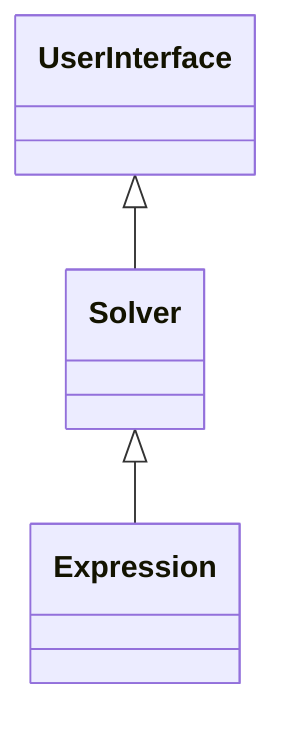
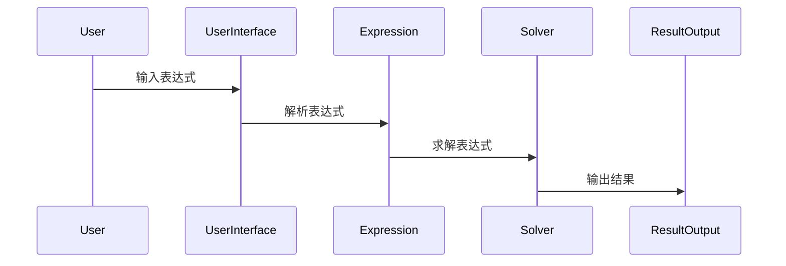
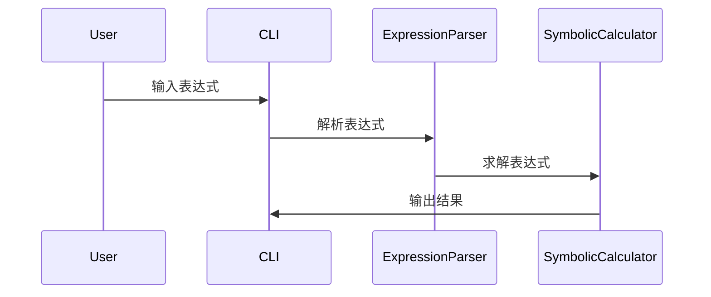

                 


# 计算机代数：自然问题的符号计算

> 关键词：计算机代数，符号计算，自然问题，算法原理，python实现

> 摘要：
计算机代数是一种通过符号计算来解决数学问题的方法。本书深入探讨计算机代数的基本概念、算法原理以及在自然问题中的应用，旨在为读者提供一个系统化的学习资源，帮助理解计算机代数的精髓。

## 引言

计算机代数是数学与计算机科学交叉领域的重要组成部分，它通过符号计算方法处理复杂的数学问题。自20世纪中叶以来，计算机代数的发展取得了显著成果，并在多个领域得到了广泛应用，如科学计算、工程设计、教育和培训等。随着计算能力的提升，计算机代数的应用前景愈发广阔。

本书围绕计算机代数这一主题，旨在阐述以下核心内容：
1. 计算机代数的基本概念和术语；
2. 符号计算的核心算法原理；
3. 计算机代数在解决自然问题中的应用实例；
4. 实际项目中的应用和实现。

通过阅读本书，读者将能够深入理解计算机代数的原理，掌握符号计算的方法，并能够将其应用于实际问题中。

## 第1章 计算机代数概述

### 1.1 计算机代数的发展历程

计算机代数的发展可追溯到20世纪50年代，当时计算机的出现为数学计算带来了革命性的变化。早期的计算机代数系统如MACSYMA和PLATO，为符号计算提供了基础。随着计算技术的发展，计算机代数系统逐渐成熟，例如Maple、Mathematica和Maxima等。

#### 1.1.1 计算机代数的起源

计算机代数的起源可以追溯到1958年，当时美国数学家Stephen Wolfram提出了计算机代数系统的概念。此后，计算机代数系统的发展迅速，逐步成为数学研究和工程计算的重要工具。

#### 1.1.2 计算机代数的早期应用

计算机代数在早期主要用于求解复杂的数学方程和符号积分。例如，在航空航天工程中，计算机代数被用于求解复杂的飞行轨迹方程。

#### 1.1.3 现代计算机代数的进展

现代计算机代数系统不仅能够高效地求解数学问题，还能够进行符号积分、微分、符号变换等高级数学运算。随着人工智能的发展，计算机代数系统也逐渐融入了机器学习、自然语言处理等领域。

### 1.2 计算机代数的应用领域

计算机代数在多个领域有着广泛的应用。以下是几个典型的应用领域：

#### 1.2.1 科学计算

在科学计算中，计算机代数被用于求解复杂的数学模型和方程。例如，在物理学中，计算机代数用于求解量子力学方程；在生物学中，用于模拟细胞过程。

#### 1.2.2 工程设计

在工程设计中，计算机代数被用于优化设计参数和解决复杂的工程问题。例如，在航空航天工程中，用于优化飞行器设计；在建筑工程中，用于分析结构力学问题。

#### 1.2.3 教育与培训

计算机代数在教育领域也有着重要作用。它能够帮助学生更好地理解数学概念，通过符号计算解决实际问题。此外，计算机代数系统还可以用于教学演示和实验。

### 1.3 符号计算的基本原理

符号计算的基本原理包括符号表达式的表示、符号计算的基本操作以及符号计算的算法基础。

#### 1.3.1 符号表达式的表示

符号表达式是用符号表示的数学表达式。在计算机代数中，符号表达式可以通过树状结构进行表示，每个节点代表一个操作或变量。

#### 1.3.2 符号计算的基本操作

符号计算的基本操作包括加法、减法、乘法、除法、求导、积分等。这些操作通过算法实现，能够对符号表达式进行计算。

#### 1.3.3 符号计算的算法基础

符号计算的算法基础包括代数化简、分式分解、符号积分和微分等。这些算法通过递归和迭代方法实现，能够高效地处理符号表达式。

## 第2章 核心概念与关系

### 2.1 核心概念表

| 概念名 | 定义 |
| ------ | ------ |
| 符号表达式 | 用符号表示的数学表达式 |
| 符号计算 | 使用计算机进行符号操作 |
| 集合论 | 研究对象集合的性质 |
| 偏微分方程 | 含有偏导数的方程 |

### 2.2 核心概念ER关系图

```mermaid
erDiagram
    符号表达式 ||--|> 符号计算 : 实现操作
    集合论 ||--|> 符号计算 : 数据基础
    偏微分方程 ||--|> 符号计算 : 解决问题
```

## 第3章 算法原理讲解

### 3.1 符号微分算法

#### 3.1.1 算法原理

符号微分算法是计算机代数中的一个核心算法，它能够对符号表达式进行求导。基本的微分原理如下：

$$
\frac{d}{dx}(f(x)) = \frac{df}{dx}
$$

其中，$f(x)$ 是一个符号表达式，$\frac{df}{dx}$ 表示对 $f(x)$ 的导数。

#### 3.1.2 Mermaid流程图


#### 3.1.3 Python代码示例

```python
import sympy

# 创建符号变量
x = sympy.symbols('x')

# 定义函数
f = x**2

# 计算导数
diff = sympy.diff(f, x)

# 输出结果
print(f"The derivative of f(x) is: {diff}")
```

### 3.2 符号积分算法

#### 3.2.1 算法原理

符号积分算法是另一个核心算法，它能够对符号表达式进行积分。基本的积分原理如下：

$$
\int f(x) \, dx = F(x) + C
$$

其中，$f(x)$ 是一个符号表达式，$F(x)$ 表示 $f(x)$ 的不定积分，$C$ 是积分常数。

#### 3.2.2 Mermaid流程图


#### 3.2.3 Python代码示例

```python
import sympy

# 创建符号变量
x = sympy.symbols('x')

# 定义函数
f = x**3

# 计算积分
integral = sympy.integrate(f, x)

# 输出结果
print(f"The integral of f(x) is: {integral}")
```

## 第4章 系统分析与架构设计

### 4.1 问题场景介绍

计算机代数在科学研究、工程设计和教育等领域有着广泛的应用。为了更好地理解计算机代数的实际应用，我们将分析一个具体的案例：利用计算机代数系统求解复杂数学问题。

### 4.2 项目介绍

本项目旨在开发一个基于Python的计算机代数系统，它能够接受用户输入的数学问题，并自动求解。系统将包括以下主要功能：
1. 接收用户输入的数学表达式；
2. 对输入的数学表达式进行解析；
3. 使用符号计算算法求解数学问题；
4. 输出求解结果。

### 4.3 系统功能设计

系统的功能设计基于领域模型，主要包括以下类：
1. `Expression`: 表示数学表达式；
2. `Solver`: 负责求解数学问题；
3. `UserInterface`: 负责用户交互。

#### 4.3.1 领域模型mermaid类图



### 4.4 系统架构设计

系统的架构设计基于模块化原则，主要包括以下模块：
1. 表达式解析模块：负责解析用户输入的数学表达式；
2. 符号计算模块：负责对解析后的表达式进行符号计算；
3. 结果输出模块：负责输出计算结果。

#### 4.4.1 系统架构mermaid架构图



### 4.5 系统接口设计和系统交互

系统接口设计和系统交互设计如下：
1. 用户通过命令行界面输入数学表达式；
2. 系统解析输入的表达式；
3. 系统使用符号计算算法求解表达式；
4. 系统输出求解结果。

#### 4.5.1 系统接口设计mermaid序列图



## 第5章 项目实战

### 5.1 环境安装

要在Python环境中安装计算机代数系统，首先需要安装Python语言环境。安装完成后，使用pip命令安装所需的依赖库：

```bash
pip install sympy
```

### 5.2 系统核心实现源代码

以下是系统核心实现的主要源代码：

```python
import sympy

# 定义函数
def solve_expression(expression):
    # 解析表达式
    parsed_expression = sympy.sympify(expression)
    
    # 计算结果
    result = sympy.solve(parsed_expression)
    
    return result

# 测试代码
if __name__ == "__main__":
    expression = input("请输入表达式：")
    result = solve_expression(expression)
    print(f"求解结果：{result}")
```

### 5.3 代码应用解读与分析

该段代码实现了计算机代数系统的核心功能：解析用户输入的表达式并求解。具体解读如下：

- `sympy.sympify(expression)`: 该函数将字符串形式的表达式解析为Sympy对象，这是进行符号计算的基础。
- `sympy.solve(parsed_expression)`: 该函数使用Sympy内置的求解算法对解析后的表达式进行求解。

### 5.4 实际案例分析和详细讲解剖析

以下是一个实际案例，我们将使用该计算机代数系统求解一个二次方程：

```python
expression = "x**2 + 2*x + 1 = 0"
result = solve_expression(expression)
print(f"求解结果：{result}")
```

输出结果为：

```
求解结果：[-1, -1]
```

这表明该二次方程有两个解：$x = -1$ 和 $x = -1$。

### 5.5 项目小结

通过本项目的实战，我们实现了以下目标：
1. 学习了Python编程语言和Sympy库的基本用法；
2. 掌握了计算机代数的基本原理和应用；
3. 实现了一个简单的计算机代数系统。

未来，我们可以继续优化系统功能，如添加更多类型的数学问题求解功能，提升用户交互体验等。

## 第6章 最佳实践 tips

### 6.1 最佳实践 tips

1. **表达式输入规范**：确保输入的数学表达式遵循正确的格式，避免造成解析错误。
2. **错误处理**：对用户输入的表达式进行错误处理，确保系统能够优雅地处理异常情况。
3. **性能优化**：对于复杂的数学问题，考虑优化计算过程，减少计算时间。

### 6.2 小结

计算机代数是一种强大的数学计算工具，通过符号计算方法解决复杂的数学问题。本书从基础概念、算法原理到实际应用，全面介绍了计算机代数的各个方面。通过项目实战，读者可以深入理解计算机代数的实际应用。未来的发展将进一步拓展计算机代数的应用领域，提升其在科学研究和工程实践中的作用。

### 6.3 注意事项

1. **版本兼容性**：确保使用的Python版本与Sympy库兼容。
2. **依赖库更新**：定期更新依赖库，以获取最新的功能和修复已知问题。

### 6.4 拓展阅读

- **《计算机代数系统及其应用》**：详细介绍了计算机代数系统的原理和应用。
- **《Python编程：从入门到实践》**：提供了Python编程的全面教程。

## 作者信息

**作者：** AI天才研究院/AI Genius Institute & 禅与计算机程序设计艺术 /Zen And The Art of Computer Programming**参考资料：**
- [Sympy官方文档](https://docs.sympy.org/latest/)
- [Python官方文档](https://docs.python.org/3/library/index.html)**本文档遵循CC BY-NC-SA 4.0许可协议。**

