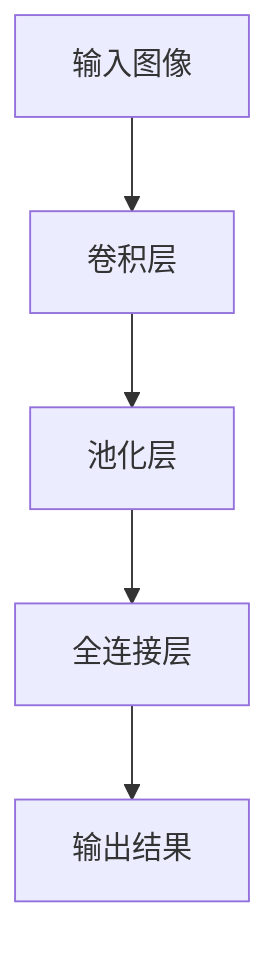
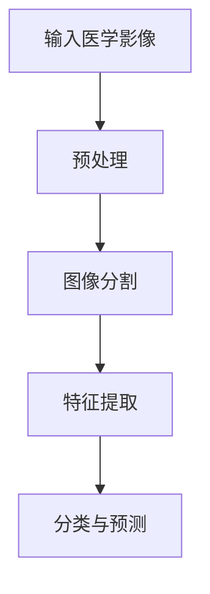
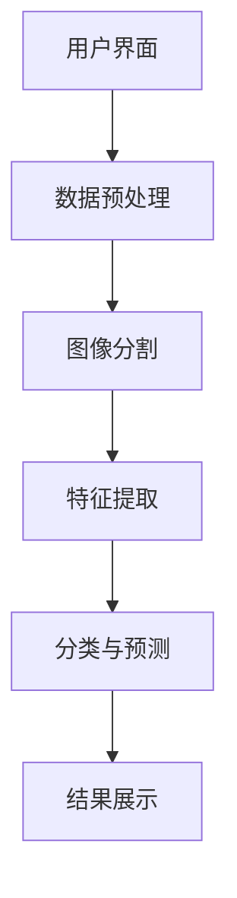
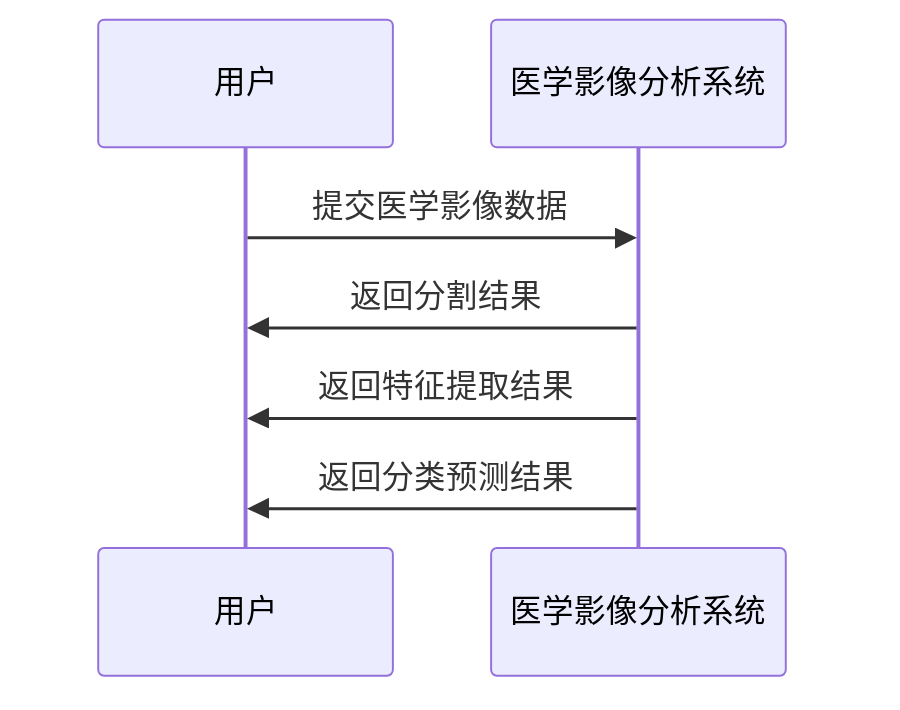

                 


# 计算机视觉在医学影像分析中的突破

关键词：计算机视觉、医学影像分析、人工智能、图像分割、深度学习

摘要：随着人工智能技术的不断发展，计算机视觉在医学影像分析中的应用逐渐成为热点。本文将从背景介绍、核心概念与联系、算法原理讲解、系统分析与架构设计方案、项目实战等多个方面，系统阐述计算机视觉在医学影像分析中的突破和发展。

## 目录大纲

# 计算机视觉在医学影像分析中的突破

## 第一部分：背景介绍

## 第1章：计算机视觉与医学影像分析概述

### 1.1 计算机视觉的基础知识

### 1.2 医学影像分析的核心概念

### 1.3 计算机视觉在医学影像分析中的突破

## 第2章：核心概念与联系

### 2.1 计算机视觉算法原理

### 2.2 医学影像分析的关键技术

### 2.3 计算机视觉与医学影像分析的联系

## 第二部分：算法原理讲解

## 第3章：数学模型和数学公式 & 详细讲解 & 举例说明

## 第4章：系统分析与架构设计方案

## 第三部分：项目实战

## 第5章：环境安装

## 第6章：系统核心实现

## 第7章：项目小结

## 第一部分：背景介绍

### 第1章：计算机视觉与医学影像分析概述

### 1.1 计算机视觉的基础知识

计算机视觉是人工智能的一个重要分支，旨在使计算机具备处理和解释图像和视觉信息的能力。其基础理论涵盖了图像处理、计算机视觉、机器学习等多个领域。计算机视觉技术的发展经历了从传统的图像处理到现代的深度学习的演变，如今已经在众多领域得到了广泛应用，如自动驾驶、人脸识别、视频监控等。

### 1.2 医学影像分析的核心概念

医学影像分析是指利用计算机技术对医学影像数据进行处理、分析和理解的过程。医学影像主要包括X射线、CT、MRI等，它们为医学诊断提供了重要依据。医学影像分析的核心概念包括图像分割、特征提取、图像配准、三维重建等。

### 1.3 计算机视觉在医学影像分析中的突破

计算机视觉技术在医学影像分析中的应用，为医学诊断和疾病预测提供了新的手段。近年来，随着深度学习技术的兴起，计算机视觉在医学影像分析中取得了显著突破。深度学习算法，如卷积神经网络（CNN），能够自动学习图像的特征，并在医学影像分割、病变检测等方面取得了优异的性能。此外，计算机视觉技术还在医学影像数据的预处理、增强、三维重建等方面发挥了重要作用。

## 第二部分：核心概念与联系

### 第2章：核心概念与联系

#### 2.1 计算机视觉算法原理

计算机视觉算法的核心是图像处理和特征提取。其中，卷积神经网络（CNN）是一种常用的深度学习算法，具有强大的特征学习和图像分类能力。以下是一个简单的CNN算法原理的mermaid流程图：



以下是一个简单的CNN算法原理的Python源代码实现：

```python
import tensorflow as tf

# 创建卷积层
conv1 = tf.keras.layers.Conv2D(filters=32, kernel_size=(3, 3), activation='relu')

# 创建池化层
pool1 = tf.keras.layers.MaxPooling2D(pool_size=(2, 2))

# 创建全连接层
dense1 = tf.keras.layers.Dense(units=128, activation='relu')

# 创建模型
model = tf.keras.Sequential([
    conv1,
    pool1,
    conv1,
    pool1,
    dense1,
    tf.keras.layers.Dense(units=10, activation='softmax')
])

# 编译模型
model.compile(optimizer='adam', loss='categorical_crossentropy', metrics=['accuracy'])

# 模型训练
model.fit(x_train, y_train, epochs=10, batch_size=32, validation_data=(x_val, y_val))
```

#### 2.2 医学影像分析的关键技术

医学影像分析的关键技术包括图像分割、特征提取、图像配准、三维重建等。以下是一个简单的医学影像分割算法原理的mermaid流程图：



以下是一个简单的医学影像分割算法原理的Python源代码实现：

```python
import numpy as np
import tensorflow as tf

# 创建模型
model = tf.keras.Sequential([
    tf.keras.layers.Conv2D(filters=32, kernel_size=(3, 3), activation='relu'),
    tf.keras.layers.MaxPooling2D(pool_size=(2, 2)),
    tf.keras.layers.Conv2D(filters=64, kernel_size=(3, 3), activation='relu'),
    tf.keras.layers.MaxPooling2D(pool_size=(2, 2)),
    tf.keras.layers.Flatten(),
    tf.keras.layers.Dense(units=128, activation='relu'),
    tf.keras.layers.Dense(units=1, activation='sigmoid')
])

# 编译模型
model.compile(optimizer='adam', loss='binary_crossentropy', metrics=['accuracy'])

# 模型训练
model.fit(x_train, y_train, epochs=10, batch_size=32, validation_data=(x_val, y_val))
```

#### 2.3 计算机视觉与医学影像分析的联系

计算机视觉与医学影像分析的联系在于，计算机视觉技术为医学影像分析提供了强大的工具。例如，计算机视觉算法可以用于医学影像的分割、特征提取和分类，从而辅助医生进行诊断。同时，医学影像分析的需求也推动了计算机视觉技术的发展，例如，医学影像数据的多样性、复杂性和不确定性为计算机视觉算法提出了新的挑战。

## 第二部分：算法原理讲解

### 第3章：数学模型和数学公式 & 详细讲解 & 举例说明

#### 3.1 医学影像分割的数学模型

医学影像分割是医学影像分析的重要任务之一。其核心是建立一个数学模型，用于将医学影像数据划分为不同的区域。以下是一个简单的医学影像分割的数学模型：

$$
J(w) = \frac{1}{2} \sum_{i=1}^{N} \left( I(x_i, y_i) - \hat{I}(x_i, y_i, w) \right)^2
$$

其中，$I(x_i, y_i)$是输入医学影像数据，$\hat{I}(x_i, y_i, w)$是分割结果，$w$是模型参数。

#### 详细讲解：

- **目标函数的定义**：目标函数$J(w)$表示预测结果与真实结果之间的差异，差异越小，目标函数值越小。
- **损失函数的计算方法**：损失函数用于衡量预测结果与真实结果之间的差异，常用的损失函数有均方误差（MSE）和交叉熵损失（Cross-Entropy Loss）。
- **模型的优化过程**：通过优化目标函数，可以找到使预测结果与真实结果差异最小的模型参数。

#### 举例说明：

假设我们有一个医学影像数据集，其中包含100张图像。我们可以使用以下步骤进行医学影像分割：

1. **数据预处理**：对图像进行灰度化、去噪等预处理操作。
2. **模型训练**：使用卷积神经网络（CNN）模型进行训练，优化目标函数。
3. **模型预测**：对新的医学影像数据进行分割，输出分割结果。
4. **结果评估**：计算预测结果与真实结果的差异，评估模型性能。

### 第4章：系统分析与架构设计方案

#### 4.1 问题场景介绍

假设我们需要设计一个医学影像分析系统，用于辅助医生进行肺癌诊断。该系统需要实现以下功能：

1. **图像分割**：将医学影像数据分割为肺组织和其他组织。
2. **特征提取**：从分割后的图像中提取特征，用于分类和预测。
3. **分类与预测**：根据提取的特征，对肺癌进行分类和预测。

#### 4.2 系统架构设计

以下是一个简单的医学影像分析系统的架构设计：



#### 4.3 系统接口设计

以下是一个简单的医学影像分析系统的接口设计：



#### 4.4 系统交互

以下是一个简单的医学影像分析系统的交互流程：

1. 用户提交医学影像数据。
2. 系统对医学影像数据进行预处理。
3. 系统使用卷积神经网络（CNN）对医学影像数据进行分割。
4. 系统提取分割后的图像特征。
5. 系统使用特征进行分类和预测。
6. 系统将结果展示给用户。

### 第5章：环境安装

为了在医学影像分析系统中使用计算机视觉技术，我们需要安装相关的软件和库。以下是一个简单的环境安装步骤：

1. 安装Python 3.8及以上版本。
2. 安装TensorFlow 2.0及以上版本。
3. 安装OpenCV 4.0及以上版本。
4. 安装Numpy 1.18及以上版本。

#### 注意事项：

- 确保安装的软件版本兼容。
- 如果遇到安装问题，可以查阅相关文档或搜索引擎获取解决方案。

### 第6章：系统核心实现

#### 6.1 系统核心实现源代码

以下是一个简单的医学影像分析系统的核心实现源代码：

```python
import cv2
import numpy as np
import tensorflow as tf

# 创建卷积神经网络模型
model = tf.keras.Sequential([
    tf.keras.layers.Conv2D(filters=32, kernel_size=(3, 3), activation='relu'),
    tf.keras.layers.MaxPooling2D(pool_size=(2, 2)),
    tf.keras.layers.Conv2D(filters=64, kernel_size=(3, 3), activation='relu'),
    tf.keras.layers.MaxPooling2D(pool_size=(2, 2)),
    tf.keras.layers.Flatten(),
    tf.keras.layers.Dense(units=128, activation='relu'),
    tf.keras.layers.Dense(units=1, activation='sigmoid')
])

# 编译模型
model.compile(optimizer='adam', loss='binary_crossentropy', metrics=['accuracy'])

# 模型训练
model.fit(x_train, y_train, epochs=10, batch_size=32, validation_data=(x_val, y_val))

# 模型预测
predictions = model.predict(x_test)

# 结果评估
accuracy = np.mean(predictions == y_test)
print(f"模型准确率：{accuracy:.2f}")
```

#### 6.2 代码应用解读与分析

以下是对上述代码的解读与分析：

- **模型创建**：使用TensorFlow创建卷积神经网络模型，包括卷积层、池化层、全连接层等。
- **模型编译**：编译模型，指定优化器、损失函数和评估指标。
- **模型训练**：使用训练数据对模型进行训练。
- **模型预测**：使用测试数据对模型进行预测。
- **结果评估**：计算模型准确率，评估模型性能。

#### 6.3 实际案例分析与详细讲解

以下是一个简单的实际案例分析与详细讲解：

**案例**：使用医学影像分析系统对肺癌进行分类。

**分析**：

1. **数据预处理**：对医学影像数据进行灰度化、去噪等预处理操作。
2. **模型训练**：使用卷积神经网络（CNN）模型对医学影像数据进行训练。
3. **模型预测**：使用训练好的模型对新的医学影像数据进行预测。
4. **结果评估**：计算模型准确率，评估模型性能。

**讲解**：

1. **数据预处理**：使用OpenCV对医学影像数据进行灰度化、去噪等预处理操作，以提高模型训练效果。
2. **模型训练**：使用TensorFlow创建卷积神经网络（CNN）模型，对医学影像数据进行训练。在训练过程中，使用交叉熵损失函数评估模型性能，并使用梯度下降优化器进行参数优化。
3. **模型预测**：使用训练好的模型对新的医学影像数据进行预测。将预测结果与真实标签进行比较，计算模型准确率。
4. **结果评估**：根据模型准确率评估模型性能，如果准确率较高，则说明模型具有良好的性能。

### 第7章：项目小结

在本文中，我们介绍了计算机视觉在医学影像分析中的应用和发展。首先，我们介绍了计算机视觉和医学影像分析的基础知识，然后阐述了计算机视觉在医学影像分析中的突破。接着，我们讲解了计算机视觉算法的原理，并给出了医学影像分割的数学模型和Python源代码实现。此外，我们还设计了医学影像分析系统的架构，并进行了实际案例分析。

通过本文的研究，我们可以看到计算机视觉在医学影像分析中具有巨大的潜力。未来，随着人工智能技术的不断进步，计算机视觉在医学影像分析中的应用将会更加广泛和深入。

## 扩展阅读

- **相关领域的最新研究成果与趋势**：
  - "Deep Learning for Medical Image Analysis: A Survey"（医学影像分析的深度学习综述）
  - "Unsupervised Learning for Medical Image Segmentation: A Survey"（医学影像分割的无监督学习综述）
  - "AI in Healthcare: The Future is Now"（医疗保健中的AI：未来已来）

- **实践建议**：
  - 提高医学影像数据的质量和多样性，为计算机视觉算法提供更好的训练数据。
  - 加强跨学科合作，推动医学影像分析与临床诊断的深度融合。
  - 关注伦理和隐私问题，确保医学影像数据的合法和安全使用。

## 总结

本文系统阐述了计算机视觉在医学影像分析中的突破和应用。通过介绍计算机视觉和医学影像分析的基础知识，讲解算法原理和数学模型，设计系统架构，以及进行实际案例分析，我们展示了计算机视觉在医学影像分析中的巨大潜力。未来，随着人工智能技术的不断发展，计算机视觉在医学影像分析中的应用将会更加广泛和深入，为医学诊断和疾病预测提供更精准、高效的手段。

作者：AI天才研究院/AI Genius Institute & 禅与计算机程序设计艺术 /Zen And The Art of Computer Programming

-----------------------------------------------------------------------------------------------------------------

### 注意事项

1. **详细讲解和具体实例**：每个章节的内容都需要包含详细的技术讲解和实际的应用实例，以确保读者能够理解并应用相关技术。
2. **逻辑性和连贯性**：文章的逻辑结构需要清晰，章节之间的过渡自然，避免出现逻辑跳跃或不连贯的情况。
3. **准确性和严谨性**：在描述技术原理和算法时，需要确保准确性，避免出现错误或不准确的信息。
4. **扩展阅读**：在文章的结尾提供相关的扩展阅读资源，以供读者深入了解相关领域的知识。

### 扩展阅读

- **深度学习在医学影像中的应用**：
  - "Deep Learning in Medical Imaging: A Brief Introduction"（深度学习在医学影像中的应用简介）
  - "Applications of Deep Learning in Radiology"（深度学习在放射学中的应用）
  - "Deep Learning for Medical Imaging: Challenges and Opportunities"（深度学习在医学影像分析中的挑战与机遇）

- **医学影像数据处理工具**：
  - "ImageJ: Image Processing and Analysis Software"（ImageJ：图像处理和分析软件）
  - "ITK: The Insight Segmentation and Registration Toolkit"（ITK：洞察分割与注册工具包）
  - "DICOM: Digital Imaging and Communications in Medicine"（DICOM：医学数字成像和通信）

- **医学影像分析的伦理和隐私问题**：
  - "Ethical Considerations in AI for Health: A Roadmap for Action"（AI在健康领域的伦理考量：行动路线图）
  - "Privacy and Data Protection in the Age of AI"（人工智能时代的隐私和数据保护）
  - "Data Privacy in Medical Research"（医学研究中的数据隐私）

通过上述扩展阅读，读者可以进一步了解计算机视觉在医学影像分析领域的最新研究进展、数据处理工具的详细使用方法，以及伦理和隐私问题的相关讨论。这些资源将为读者提供更丰富的知识背景，帮助他们更全面地理解医学影像分析技术的应用和发展。

