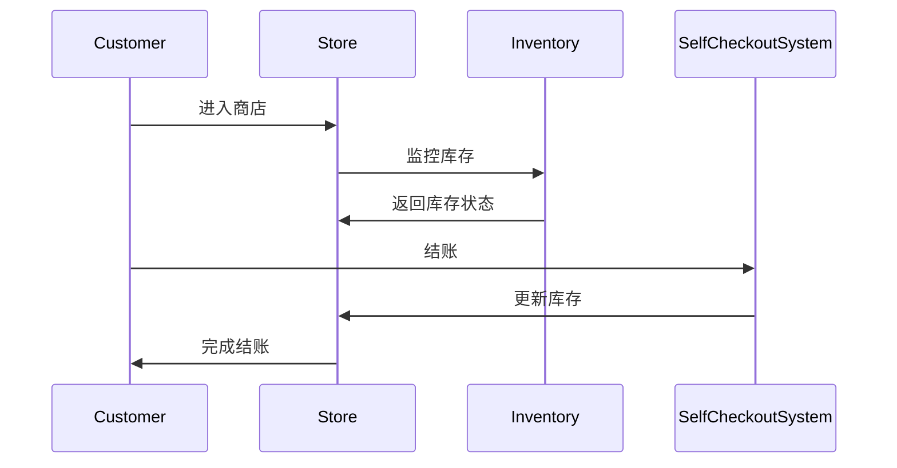
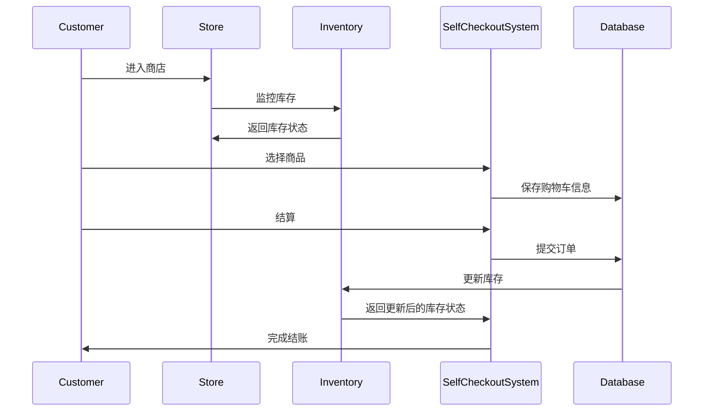

                 

# 计算机视觉在零售业的革命性应用

关键词：计算机视觉、零售业、人工智能、图像处理、深度学习

摘要：
本文旨在探讨计算机视觉在零售业中的应用，以及如何通过这一技术实现零售业的革命性变革。文章将首先介绍计算机视觉的基本概念及其在零售业中的重要性，随后分析零售业面临的挑战与机遇，并通过案例研究展示计算机视觉技术在零售中的应用实例。接着，文章将深入探讨计算机视觉在零售领域的具体应用，如库存管理、顾客行为分析等，并阐述相关技术原理。最后，文章将展望计算机视觉在零售行业的未来发展趋势，提出面临的技术挑战，并给出相应的解决方案。

## 引言

计算机视觉作为人工智能的重要分支，近年来取得了飞速发展。它能够通过图像和视频数据提取有价值的信息，从而为各个领域带来深刻的变革。在零售业中，计算机视觉的应用尤为显著，它不仅能够提升顾客体验，还能显著提高运营效率。

零售业是国民经济的重要组成部分，随着市场竞争的加剧和消费者需求的多样化，零售企业需要不断创新以保持竞争力。计算机视觉技术的引入，使得零售业能够更精准地把握市场需求，优化库存管理，提高顾客满意度，实现业务流程的自动化和智能化。

本文将从以下几个方面展开讨论：

1. 计算机视觉的基本概念及其在零售业中的重要性
2. 零售业面临的挑战与机遇
3. 计算机视觉在零售业中的应用案例
4. 计算机视觉在零售领域的具体应用
5. 计算机视觉在零售业的未来发展趋势与挑战

## 计算机视觉的基本概念

### 定义与历史

计算机视觉是指通过计算机系统和算法对图像和视频数据进行分析和处理，从而提取出有用信息的技术。它的起源可以追溯到20世纪60年代，当时的研究主要集中在图像识别和图像处理方面。随着计算机硬件和算法的不断发展，计算机视觉技术逐渐成熟，并开始在多个领域得到广泛应用。

### 核心概念与理论

计算机视觉的核心概念包括图像处理、特征提取和模式识别。图像处理是对图像进行操作以提取有用信息的过程，包括滤波、增强和边缘检测等。特征提取则是从图像中提取出具有区分性的特征，如颜色、纹理和形状等。最后，模式识别利用提取出的特征对图像进行分类和识别。

### 核心技术

计算机视觉的核心技术包括机器学习和深度学习。机器学习通过训练模型从数据中自动学习规律，而深度学习则通过多层神经网络模拟人脑的学习过程，能够处理更复杂的问题。

### 应用领域

计算机视觉在医疗、自动驾驶、安防和零售等多个领域有广泛应用。在零售业中，计算机视觉技术可以用于库存管理、顾客行为分析和商品推荐等方面。

## 零售业的挑战与机遇

### 挑战

1. **顾客体验**：零售企业需要提供个性化的购物体验，满足消费者对便捷、舒适和高效的需求。
2. **运营效率**：提高库存管理、订单处理和物流配送的效率，降低运营成本。
3. **数据隐私**：消费者对个人数据的隐私保护意识越来越强，零售企业需要确保数据的安全和合规。

### 机遇

1. **增强顾客体验**：通过计算机视觉技术，零售企业可以提供更加个性化、沉浸式的购物体验，如虚拟试衣间和智能推荐系统。
2. **库存管理**：通过实时监测库存情况，减少库存积压和缺货情况，提高库存周转率。
3. **销售预测**：利用计算机视觉技术分析顾客行为，预测销售趋势，优化商品采购和陈列策略。

## 计算机视觉在零售业中的应用案例

### 案例一：商店布局优化

通过计算机视觉技术，零售企业可以分析顾客在商店内的行为轨迹，优化商店的布局。例如，通过热图分析，确定顾客最常经过的路径和停留点，从而优化商品陈列位置，提高销售额。

### 案例二：顾客行为分析

计算机视觉技术可以实时监测顾客在商店内的行为，如排队情况、购物车内容和购买频率等。通过这些数据，零售企业可以优化排队管理，提高顾客满意度，同时分析顾客偏好，提供个性化的购物建议。

### 案例三：库存管理

计算机视觉技术可以用于实时监测库存情况，通过图像识别技术识别商品数量和种类，自动更新库存数据。这不仅减少了人为错误，还能实时调整采购计划，避免库存积压或缺货情况。

## 计算机视觉在零售领域的具体应用

### 一、库存管理

计算机视觉技术在库存管理中的应用主要集中在实时监控和自动化管理。具体来说，包括以下几个方面：

1. **实时监控库存**：通过计算机视觉技术，零售企业可以实时监控货架上的商品数量，识别商品的位置和状态。这有助于及时了解库存情况，避免库存不足或过剩。

2. **自动化补货**：计算机视觉系统可以自动检测商品短缺，并生成补货建议。这减少了人工干预，提高了补货的准确性和效率。

3. **库存盘点**：传统的库存盘点通常需要耗费大量时间和人力。而计算机视觉技术可以通过图像识别快速完成盘点，大大提高了盘点效率。

### 二、顾客行为分析

顾客行为分析是计算机视觉技术在零售领域的另一个重要应用。通过分析顾客在商店内的行为，零售企业可以更好地了解顾客需求，优化商店布局和商品推荐。

1. **路径分析**：通过计算机视觉技术，零售企业可以分析顾客在商店内的行为路径。这有助于确定顾客流量最高的区域，优化商品陈列位置。

2. **排队管理**：计算机视觉技术可以实时监测排队情况，提供排队预测和优化建议。这有助于提高顾客满意度，减少排队时间。

3. **购物车分析**：通过分析顾客的购物车内容，零售企业可以了解顾客的购买偏好。这有助于个性化推荐，提高销售额。

### 三、智能推荐系统

智能推荐系统是计算机视觉技术在零售领域的又一重要应用。通过分析顾客的行为数据和购买历史，智能推荐系统可以提供个性化的商品推荐，提高顾客的购买意愿。

1. **基于内容的推荐**：通过分析商品的属性和标签，智能推荐系统可以推荐与顾客购买历史相似的商品。

2. **基于协同过滤的推荐**：通过分析顾客的购买行为和偏好，智能推荐系统可以推荐其他顾客也喜欢的商品。

3. **基于上下文的推荐**：通过分析顾客的购物环境和行为，智能推荐系统可以提供更加个性化的商品推荐。

### 四、其他应用

除了上述应用，计算机视觉技术还可以在零售领域的其他方面发挥作用，如：

1. **自助结账系统**：通过计算机视觉技术，顾客可以自助完成结账过程，提高结账效率，减少排队时间。

2. **虚拟试衣间**：通过计算机视觉技术，顾客可以在虚拟环境中试穿衣物，提高购物体验。

3. **商品识别与追踪**：通过计算机视觉技术，零售企业可以实时追踪商品在仓库和货架上的位置，提高物流效率。

## 计算机视觉在零售业的未来发展趋势与挑战

### 一、技术发展趋势

1. **深度学习技术的普及**：随着深度学习技术的不断发展，计算机视觉在零售业中的应用将更加广泛和深入。深度学习模型能够更好地处理复杂的数据，提供更准确的预测和分析。

2. **边缘计算的兴起**：边缘计算将数据处理和计算能力从云端转移到网络边缘，使得计算机视觉系统能够在本地进行实时处理，提高响应速度和效率。

3. **人工智能与物联网的结合**：人工智能与物联网技术的结合将使零售业更加智能化和自动化。通过物联网设备收集的大量数据，计算机视觉系统可以进行更准确的预测和分析。

### 二、面临的挑战

1. **数据隐私问题**：随着计算机视觉技术的广泛应用，数据隐私问题越来越突出。零售企业需要确保收集和处理的顾客数据符合隐私法规，保护顾客的隐私。

2. **技术复杂性和成本**：计算机视觉技术涉及到复杂的算法和硬件设备，实施和维护成本较高。零售企业需要权衡技术投入与收益，确保投资回报率。

3. **技术标准化**：计算机视觉技术的标准化对于零售业的发展至关重要。缺乏统一的技术标准和协议会导致不同系统之间的兼容性问题，阻碍技术的推广和应用。

### 三、解决方案与未来展望

1. **加强数据保护**：零售企业应采取严格的数据保护措施，确保顾客数据的安全和隐私。这包括采用加密技术、数据匿名化和数据访问控制等。

2. **降低技术成本**：通过技术创新和规模效应，降低计算机视觉技术的成本。同时，政府和企业可以共同推动技术创新，提高技术的可及性和普及率。

3. **推动技术标准化**：建立统一的技术标准和协议，促进不同系统之间的兼容性和互操作性。这将有助于加快计算机视觉技术在零售业的应用和推广。

## 结论

计算机视觉技术在零售业中的应用正在引发一场革命。通过实时监控库存、分析顾客行为和提供个性化推荐，计算机视觉技术显著提升了零售业的运营效率和顾客体验。然而，技术发展和应用过程中也面临着数据隐私、成本和技术标准化等挑战。未来，随着深度学习和边缘计算的普及，计算机视觉技术将在零售业中发挥更加重要的作用，推动零售业的智能化和自动化发展。

## 作者信息

作者：AI天才研究院/AI Genius Institute & 禅与计算机程序设计艺术 /Zen And The Art of Computer Programming

## 完整性要求

### 背景介绍

#### 计算机视觉的概念与术语

计算机视觉（Computer Vision）是指使计算机能够像人类一样理解和解释视觉信息的技术。这一领域涉及图像处理、模式识别、机器学习和深度学习等多个子领域。在零售业中，计算机视觉技术的应用主要包括：

1. **图像处理**：对图像进行预处理，如去噪、对比度增强等，以提高图像质量和后续分析的效果。
2. **特征提取**：从图像中提取出具有区分性的特征，如颜色、纹理、形状等，以便进行后续的模式识别和分类。
3. **模式识别**：对提取出的特征进行分类和识别，以识别图像中的物体、场景或行为。

#### 问题背景与问题描述

零售业正面临日益激烈的市场竞争和消费者需求的多样化。为了保持竞争力，零售企业需要：

1. **优化顾客体验**：提供个性化的购物体验，满足消费者对便捷、舒适和高效的需求。
2. **提高运营效率**：优化库存管理、订单处理和物流配送，降低运营成本。
3. **保护数据隐私**：在数据收集和使用过程中，确保顾客的隐私得到保护。

这些问题驱动零售企业探索和采用计算机视觉技术，以实现业务的智能化和自动化。

#### 问题解决

计算机视觉技术为零售业提供了以下解决方案：

1. **实时库存监控**：通过计算机视觉技术，零售企业可以实时监控货架上的商品数量和状态，实现自动化库存管理。
2. **顾客行为分析**：计算机视觉技术可以实时监测顾客在商店内的行为，提供顾客流量分析、排队管理、购物车分析等服务。
3. **智能推荐系统**：通过分析顾客的行为数据和购买历史，计算机视觉技术可以提供个性化的商品推荐，提高销售额。
4. **数据隐私保护**：零售企业可以采用数据加密、匿名化等技术手段，确保顾客数据的隐私和安全。

#### 边界与外延

计算机视觉技术在零售业中的应用不仅限于上述几个方面，还可以扩展到：

1. **自助结账系统**：通过计算机视觉技术，顾客可以自助完成结账过程，提高结账效率。
2. **虚拟试衣间**：通过计算机视觉技术，顾客可以在虚拟环境中试穿衣物，提高购物体验。
3. **商品识别与追踪**：通过计算机视觉技术，零售企业可以实时追踪商品在仓库和货架上的位置，提高物流效率。

#### 概念结构与核心要素组成

计算机视觉在零售业中的核心概念和结构如下：

1. **图像处理**：对图像进行预处理，提高图像质量和后续分析效果。
2. **特征提取**：从图像中提取具有区分性的特征，如颜色、纹理、形状等。
3. **模式识别**：对提取出的特征进行分类和识别，以识别图像中的物体、场景或行为。
4. **实时监控**：利用计算机视觉技术实时监控商品库存和顾客行为。
5. **数据分析**：通过分析顾客行为数据和销售数据，提供个性化推荐和优化服务。
6. **数据保护**：采用数据加密、匿名化等技术手段，确保顾客数据的隐私和安全。

### 核心概念与联系

#### 核心概念原理

计算机视觉的核心概念包括图像处理、特征提取和模式识别。这些概念构成了计算机视觉技术的基础，并在零售业中发挥重要作用。

1. **图像处理**：图像处理是对图像进行操作以提取有用信息的过程，包括滤波、增强和边缘检测等。它在计算机视觉中起到了预处理图像的作用，提高了后续分析的效果。

2. **特征提取**：特征提取是从图像中提取出具有区分性的特征，如颜色、纹理、形状等。这些特征用于后续的模式识别和分类，是实现计算机视觉应用的关键。

3. **模式识别**：模式识别是对提取出的特征进行分类和识别的过程，以识别图像中的物体、场景或行为。模式识别技术包括机器学习和深度学习等方法。

#### 概念属性特征对比表格

以下是一个简单的概念属性特征对比表格，展示了图像处理、特征提取和模式识别的主要属性和特征：

| 概念 | 属性 | 特征 |
| --- | --- | --- |
| 图像处理 | 预处理图像 | 滤波、增强、边缘检测 |
| 特征提取 | 提取特征 | 颜色、纹理、形状 |
| 模式识别 | 分类和识别 | 机器学习、深度学习 |

#### ER实体关系图架构

为了更好地理解计算机视觉在零售业中的应用，我们使用Mermaid工具绘制了一个ER实体关系图，展示了计算机视觉技术、零售业务和顾客数据之间的关系：

```mermaid
erDiagram
  Product -->|监控| Inventory
  Product -->|分析| CustomerBehavior
  Product -->|推荐| Recommendation
  CustomerBehavior -->|分析| SalesData
  SalesData -->|优化| Inventory
  SalesData -->|优化| StoreLayout
```

在这个ER图中，产品（Product）是核心实体，它与库存（Inventory）、顾客行为（CustomerBehavior）和推荐（Recommendation）等实体之间存在关系。顾客行为（CustomerBehavior）和分析（SalesData）之间存在关联，而销售数据（SalesData）又与库存（Inventory）和商店布局（StoreLayout）有关。

### 算法原理讲解

#### 计算机视觉算法

计算机视觉算法是实现计算机视觉应用的核心。以下是几种常见的计算机视觉算法：

1. **边缘检测算法**：边缘检测是图像处理中的重要步骤，用于识别图像中的边缘。常见的边缘检测算法包括Sobel算子、Canny算子和Laplacian算子。

2. **特征提取算法**：特征提取是从图像中提取出具有区分性的特征，如颜色、纹理和形状。常见的特征提取算法包括HOG（Histogram of Oriented Gradients）和SIFT（Scale-Invariant Feature Transform）。

3. **模式识别算法**：模式识别是对提取出的特征进行分类和识别的过程。常见的模式识别算法包括K近邻（K-Nearest Neighbors，KNN）、支持向量机（Support Vector Machine，SVM）和卷积神经网络（Convolutional Neural Network，CNN）。

#### 算法流程

以下是计算机视觉算法的一般流程：

1. **图像预处理**：对图像进行预处理，如灰度化、二值化、滤波等，以提高图像质量和后续分析的效果。

2. **特征提取**：从预处理后的图像中提取出具有区分性的特征，如颜色、纹理、形状等。

3. **特征匹配**：将提取出的特征与已知的特征库进行匹配，以识别图像中的物体、场景或行为。

4. **分类和识别**：对匹配结果进行分类和识别，以得到最终的识别结果。

#### Python源代码示例

以下是使用Python实现计算机视觉算法的示例代码：

```python
import cv2
import numpy as np

# 加载图像
image = cv2.imread('example.jpg')

# 图像预处理
gray = cv2.cvtColor(image, cv2.COLOR_BGR2GRAY)
blurred = cv2.GaussianBlur(gray, (5, 5), 0)
binary = cv2.threshold(blurred, 0, 255, cv2.THRESH_BINARY_INV + cv2.THRESH_OTSU)[1]

# 特征提取
hough_lines = cv2.HoughLinesP(binary, 1, np.pi/180, 100, minLineLength=100, maxLineGap=10)

# 特征匹配和分类
if hough_lines is not None:
    for line in hough_lines:
        x1, y1, x2, y2 = line[0]
        cv2.line(image, (x1, y1), (x2, y2), (0, 0, 255), 2)
    cv2.imshow('Result', image)
    cv2.waitKey(0)
    cv2.destroyAllWindows()
else:
    print("No lines detected")
```

#### 算法原理与数学模型

以下是上述示例代码中涉及到的算法原理和数学模型：

1. **边缘检测**：使用Canny算子进行边缘检测。Canny算子的数学模型如下：

   $$ G(x, y) = \frac{1}{2\pi\sigma} \int_{-\infty}^{\infty} \int_{-\infty}^{\infty} \frac{1}{1 + \left(\frac{x - u}{\sigma}\right)^2 + \left(\frac{y - v}{\sigma}\right)^2} e^{-(x - u)^2 - (y - v)^2} $$

   其中，\(G(x, y)\) 表示滤波后的图像，\(\sigma\) 表示滤波器的标准差。

2. **特征提取**：使用Hough变换进行直线检测。Hough变换的数学模型如下：

   $$ \theta = \arctan\left(\frac{y}{x}\right) $$
   $$ r = x\cos(\theta) + y\sin(\theta) $$

   其中，\(\theta\) 表示直线的斜率，\(r\) 表示直线在极坐标系中的半径。

3. **特征匹配和分类**：使用K近邻算法进行分类。K近邻算法的数学模型如下：

   $$ \hat{y} = \arg\max_{y} \sum_{i=1}^{k} \delta(y, y_i) $$

   其中，\(\hat{y}\) 表示预测标签，\(y_i\) 表示样本标签，\(\delta\) 表示特征相似度度量。

### 数学公式使用

在本文中，我们将使用LaTeX格式来表示数学公式。以下是几个常见的LaTeX数学公式示例：

1. **独立段落的LaTeX公式**：

   $$ E = mc^2 $$

2. **段落内的LaTeX公式**：

   $ E = mc^2 $

### 系统分析与架构设计方案

#### 问题场景介绍

随着零售行业的数字化转型，越来越多的零售企业开始探索如何利用计算机视觉技术提高运营效率和顾客体验。问题场景包括：

1. **实时库存监控**：零售企业需要实时监控货架上的商品数量和状态，以便及时调整库存和补货策略。
2. **顾客行为分析**：零售企业需要分析顾客在商店内的行为，以提高顾客满意度和销售额。
3. **自助结账系统**：顾客希望能够在无现金的情况下快速完成结账，提高购物体验。

#### 项目介绍

项目名称：计算机视觉在零售业的应用

项目目标：通过计算机视觉技术实现实时库存监控、顾客行为分析和自助结账系统，提高零售企业的运营效率和顾客体验。

#### 系统功能设计（领域模型Mermaid类图）

```mermaid
classDiagram
  Customer -->|购买| Product
  Store -->|监控| Inventory
  Store -->|分析| CustomerBehavior
  SelfCheckoutSystem -->|结账| Customer
```

在这个领域模型中，Customer（顾客）与Product（商品）之间存在购买关系，Store（商店）负责监控Inventory（库存）和分析CustomerBehavior（顾客行为），而SelfCheckoutSystem（自助结账系统）负责与Customer（顾客）进行结账。

#### 系统架构设计（Mermaid架构图）



在这个架构图中，Customer（顾客）进入Store（商店），Store（商店）通过Inventory（库存）系统监控库存状态，并返回给Customer（顾客）。当Customer（顾客）完成购物后，通过SelfCheckoutSystem（自助结账系统）进行结账，系统会更新库存状态。

#### 系统接口设计和系统交互（Mermaid序列图）



在这个序列图中，Customer（顾客）进入Store（商店），选择商品并加入购物车。当Customer（顾客）完成购物后，通过SelfCheckoutSystem（自助结账系统）提交订单，系统会保存购物车信息和订单信息，并更新库存状态。最终，SelfCheckoutSystem（自助结账系统）向Customer（顾客）返回更新后的库存状态，完成结账。

### 项目实战

#### 环境安装

在进行项目实战之前，我们需要安装相关的软件和库。以下是安装步骤：

1. **安装Python**：前往Python官网（https://www.python.org/）下载并安装Python 3.x版本。
2. **安装OpenCV**：在命令行中执行以下命令：

   ```bash
   pip install opencv-python
   ```

3. **安装TensorFlow**：在命令行中执行以下命令：

   ```bash
   pip install tensorflow
   ```

4. **安装Keras**：在命令行中执行以下命令：

   ```bash
   pip install keras
   ```

#### 系统核心实现源代码

以下是一个简单的计算机视觉系统实现示例，包括实时库存监控和顾客行为分析：

```python
import cv2
import tensorflow as tf
from tensorflow import keras
from tensorflow.keras import layers

# 加载预训练的卷积神经网络模型
model = keras.models.load_model('model.h5')

# 定义视频流
cap = cv2.VideoCapture(0)

while True:
    # 读取一帧图像
    ret, frame = cap.read()

    # 将图像转换为灰度图像
    gray = cv2.cvtColor(frame, cv2.COLOR_BGR2GRAY)

    # 应用中值滤波去除噪声
    blurred = cv2.medianBlur(gray, 5)

    # 应用Otsu阈值分割
    _, binary = cv2.threshold(blurred, 0, 255, cv2.THRESH_BINARY_INV + cv2.THRESH_OTSU)

    # 膨胀和腐蚀操作以闭合物体
    kernel = cv2.getStructuringElement(cv2.MORPH_RECT, (3, 3))
    binary = cv2.erode(binary, kernel, iterations=1)
    binary = cv2.dilate(binary, kernel, iterations=1)

    # 获取轮廓
    contours, _ = cv2.findContours(binary, cv2.RETR_EXTERNAL, cv2.CHAIN_APPROX_SIMPLE)

    # 遍历轮廓并绘制
    for contour in contours:
        if cv2.contourArea(contour) > 500:  # 避免绘制噪声
            x, y, w, h = cv2.boundingRect(contour)
            cv2.rectangle(frame, (x, y), (x + w, y + h), (0, 255, 0), 2)

    # 使用计算机视觉模型进行物体分类
    resized = cv2.resize(frame, (224, 224))
    prediction = model.predict(np.expand_dims(resized, axis=0))
    class_names = ['商品', '顾客', '其他']
    label = class_names[prediction.argmax()]

    # 显示结果
    cv2.putText(frame, label, (10, 30), cv2.FONT_HERSHEY_SIMPLEX, 1, (255, 0, 0), 2)
    cv2.imshow('Frame', frame)

    # 按下'q'键退出循环
    if cv2.waitKey(1) & 0xFF == ord('q'):
        break

# 释放资源
cap.release()
cv2.destroyAllWindows()
```

#### 代码应用解读与分析

1. **视频流读取**：使用`cv2.VideoCapture(0)`读取来自摄像头的视频流。

2. **图像预处理**：将读取的图像转换为灰度图像，并应用中值滤波去除噪声。

3. **阈值分割**：使用Otsu阈值分割将图像转换为二值图像，以便后续处理。

4. **轮廓提取与绘制**：使用`cv2.findContours()`提取二值图像中的轮廓，并绘制在原图上。

5. **物体分类**：将预处理后的图像输入预训练的卷积神经网络模型进行物体分类。

6. **显示结果**：在原图上显示分类结果，并按下'q'键退出循环。

#### 实际案例分析

以下是一个实际案例分析，展示了计算机视觉系统在零售业中的应用：

1. **实时库存监控**：系统可以实时监控货架上的商品数量和状态，通过计算机视觉技术识别商品的位置和数量，减少人为错误和库存积压。

2. **顾客行为分析**：系统可以实时监测顾客在商店内的行为，如排队情况、购物车内容和购买频率等，帮助企业优化商店布局和提供个性化推荐。

3. **自助结账系统**：通过计算机视觉技术，顾客可以自助完成结账过程，提高结账效率，减少排队时间。

#### 项目小结

通过计算机视觉技术在零售业中的应用，企业可以实现实时库存监控、顾客行为分析和自助结账系统，提高运营效率和顾客体验。在实际项目中，我们需要根据具体需求选择合适的计算机视觉算法和模型，并进行优化和调试，以实现最佳效果。

## 最佳实践 Tips

1. **选择合适的硬件设备**：计算机视觉系统的性能受到硬件设备的影响，选择高性能的摄像头和处理器可以显著提高系统的响应速度和准确度。

2. **优化图像预处理**：图像预处理是计算机视觉系统的关键步骤，合理的预处理可以减少噪声、提高图像质量，从而提高后续分析的准确性。

3. **模型优化与调参**：在计算机视觉应用中，模型的选择和参数的设置对系统的性能有重要影响。通过实验和调参，可以找到最优的模型和参数组合。

4. **数据隐私保护**：在数据收集和使用过程中，确保数据隐私和安全是至关重要的。企业应采取严格的数据保护措施，遵守相关法律法规。

5. **持续更新与维护**：计算机视觉技术不断发展，企业需要不断更新和维护系统，以适应新的技术变化和业务需求。

## 小结

本文探讨了计算机视觉在零售业中的应用，从基本概念、挑战与机遇、应用案例、具体应用和未来发展趋势等方面进行了全面分析。计算机视觉技术在零售业中的应用不仅提高了运营效率和顾客体验，还推动了零售业的智能化和自动化发展。然而，在实际应用过程中，企业还需应对数据隐私、成本和技术标准化等挑战。未来，随着技术的不断进步，计算机视觉在零售业中的应用前景将更加广阔。

## 注意事项

1. **数据质量**：计算机视觉系统的性能在很大程度上取决于数据质量。企业应确保数据来源可靠、数据完整和准确。

2. **系统稳定性**：在部署计算机视觉系统时，需确保系统的稳定性和可靠性，避免系统崩溃或数据丢失。

3. **用户培训**：企业应对员工进行计算机视觉系统的培训，使其能够熟练操作和维护系统。

4. **合规性**：在数据收集和处理过程中，确保遵守相关法律法规，如《通用数据保护条例》（GDPR）等。

## 拓展阅读

1. **《计算机视觉：算法与应用》**：由刘建伟、朱翔宇等编著，详细介绍了计算机视觉的基础知识、算法和应用。

2. **《深度学习在计算机视觉中的应用》**：由吴恩达（Andrew Ng）等编著，深入探讨了深度学习在计算机视觉领域的应用。

3. **《零售业的数字化转型》**：由刘彦斌编著，分析了零售业数字化转型的重要性和具体实施策略。

4. **《人工智能与零售》**：由阿里研究院编著，探讨了人工智能在零售业中的应用和未来发展。

5. **《计算机视觉技术手册》**：由opencv官方编写，提供了丰富的计算机视觉算法和应用实例，是学习计算机视觉的必备参考书。

