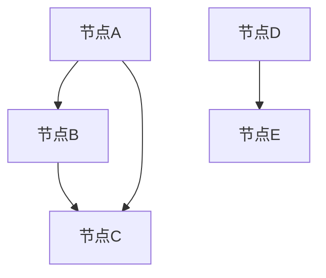

                 


### # 计算社会科学的兴起：数据驱动理解人类社会与世界

关键词：计算社会科学、数据驱动、社会网络分析、大数据、应用实践

摘要：本文探讨了计算社会科学的兴起及其在理解人类社会与世界中的作用。通过介绍核心概念、基础理论、方法应用和未来展望，本文旨在帮助读者了解计算社会科学的原理和应用，以及其在政治、公共政策、心理学、教育学和医疗卫生等领域的广泛应用。

----------------------------------------------------------------

## 第1章：引言

### 1.1 背景介绍

#### 问题背景

计算社会科学是近年来兴起的一个交叉学科领域，它将社会科学与计算机科学、数据科学相结合，旨在通过数据驱动的方法来理解和解释人类社会现象。随着互联网和大数据技术的飞速发展，人们可以获得海量的社会数据，这使得计算社会科学成为可能。

#### 问题描述

在传统的社会科学研究中，研究者主要依赖定性分析和定量调查来研究社会现象。然而，这些方法往往受到数据获取难度、样本规模和统计分析方法的限制。计算社会科学通过引入计算机科学和数据科学的方法，提供了新的研究工具和视角，能够更深入地理解和解释社会现象。

#### 问题解决

计算社会科学提供了一系列方法和工具，包括社会网络分析、大数据分析、机器学习和数据挖掘等。这些方法能够处理海量数据，发现数据中的模式和关联，从而为社会科学研究提供新的洞见和解释。

#### 边界与外延

计算社会科学涉及的数据类型广泛，包括文本、图像、音频和视频等多种形式。数据来源包括社交媒体、问卷调查、传感器和网络抓取等。分析方法和应用领域也在不断拓展，包括政治学、经济学、社会学、心理学、教育学和医疗卫生等领域。

#### 概念结构与核心要素组成

计算社会科学的核心概念包括数据驱动、模式识别、因果推断和社会网络分析。核心要素包括数据采集、数据处理、数据分析和数据解释等环节。

### 1.2 核心概念与联系

#### 核心概念原理

- 数据驱动：通过数据来驱动研究和决策过程，而不是基于先验理论或假设。
- 模式识别：从数据中发现规律和模式，以揭示社会现象的本质。
- 因果推断：通过数据分析来推断变量之间的因果关系。
- 社会网络分析：研究个体和群体之间的社会关系和网络结构。

#### 概念属性特征对比表格

| 概念           | 属性特征                                                                 | 对比分析                                       |
| -------------- | ---------------------------------------------------------------------- | ---------------------------------------------- |
| 数据驱动       | 基于数据进行分析和决策，而不是基于先验理论。                               | 与理论驱动相比，数据驱动更注重实证分析和数据验证。 |
| 模式识别       | 从数据中发现规律和模式，以揭示社会现象的本质。                             | 与数据挖掘相比，模式识别更注重社会意义和解释。      |
| 因果推断       | 通过数据分析来推断变量之间的因果关系。                                   | 与相关分析相比，因果推断更强调因果关系和因果模型。  |
| 社会网络分析   | 研究个体和群体之间的社会关系和网络结构。                                 | 与社会调查相比，社会网络分析更注重网络结构和关系分析。 |

#### ER实体关系图架构的 Mermaid 流程图

```mermaid
erDiagram
    User ||--|{ Post }|--| Post
    User ||--|{ Comment }|--| Comment
    User ||--|{ SocialNetwork }|--| SocialNetwork
```

## 第2章：计算社会科学的基础

### 2.1 数据采集与处理

#### 数据采集

计算社会科学的数据来源多样，包括社交媒体、问卷调查、传感器和网络抓取等。社交媒体平台如Facebook、Twitter等提供了大量的用户行为和社交数据，问卷调查可以获得详细的个体信息，传感器可以收集环境数据，网络抓取可以获取网页内容等。

#### 数据处理

数据采集后，需要进行数据清洗、转换和存储等处理步骤。数据清洗涉及去除重复数据、填补缺失值、处理异常值等。数据转换包括将数据转换为适合分析的形式，如文本向量化、图像数字化等。数据存储则需要选择合适的数据存储系统，如关系型数据库、NoSQL数据库或分布式文件系统等。

#### 数据可视化

数据可视化是将数据转化为图表、图形等视觉形式的过程，有助于直观地理解数据特征和模式。常用的数据可视化工具包括Python的Matplotlib、Seaborn、Plotly等库，以及R语言的ggplot2库等。

### 2.2 数据分析

#### 描述性分析

描述性分析用于对数据进行统计描述，包括计算平均值、中位数、标准差等统计量，绘制直方图、箱线图、饼图等。描述性分析有助于了解数据的基本特征和分布情况。

```python
import pandas as pd
import matplotlib.pyplot as plt

# 示例数据
data = pd.DataFrame({
    'age': [25, 30, 35, 40, 45],
    'income': [50000, 60000, 70000, 80000, 90000]
})

# 计算描述性统计量
desc_stats = data.describe()

# 绘制直方图和箱线图
plt.figure(figsize=(10, 5))
plt.subplot(1, 2, 1)
plt.hist(data['age'], bins=5)
plt.title('Age Distribution')

plt.subplot(1, 2, 2)
plt.boxplot(data['income'])
plt.title('Income Distribution')
plt.show()
```

#### 预测性分析

预测性分析通过建立模型来预测未来的趋势和变化。常见的预测性分析方法包括聚类、分类、回归等。聚类算法如K-均值聚类可以用于发现数据中的聚类结构；分类算法如决策树、支持向量机可以用于预测分类结果；回归分析如线性回归、逻辑回归可以用于预测连续变量的值。

```python
from sklearn.cluster import KMeans
from sklearn.model_selection import train_test_split
from sklearn.metrics import accuracy_score

# 示例数据
X = data[['age', 'income']]
y = data['income']

# 数据分割
X_train, X_test, y_train, y_test = train_test_split(X, y, test_size=0.2, random_state=42)

# K-均值聚类
kmeans = KMeans(n_clusters=2, random_state=42)
clusters = kmeans.fit_predict(X_train)

# 决策树分类
from sklearn.tree import DecisionTreeClassifier
clf = DecisionTreeClassifier()
clf.fit(X_train, y_train)
y_pred = clf.predict(X_test)

# 计算准确率
accuracy = accuracy_score(y_test, y_pred)
print(f"Accuracy: {accuracy}")

# 绘制决策树
from sklearn.tree import plot_tree
plt.figure(figsize=(10, 5))
plot_tree(clf, filled=True)
plt.show()
```

#### 解释性分析

解释性分析旨在解释模型预测的原理和逻辑。因果推断是解释性分析的一种方法，通过建立因果模型来解释变量之间的因果关系。因果推断方法包括结构方程模型、因果推断算法等。

```python
import pandas as pd
import numpy as np
from py/causal import CausalModel

# 示例数据
data = pd.DataFrame({
    'A': [1, 2, 3, 4, 5],
    'B': [1, 2, 3, 4, 5],
    'C': [1, 1, 2, 2, 3]
})

# 构建因果模型
model = CausalModel()
model.add_variable('A', domain=data['A'])
model.add_variable('B', domain=data['B'])
model.add_variable('C', domain=data['C'])
model.add_causal_edge('A', 'B')
model.add_causal_edge('A', 'C')
model.add_causal_edge('B', 'C')

# 求解因果模型
result = model.solve()

# 输出因果推断结果
print(result)
```

### 第3章：计算社会科学的方法

#### 3.1 社会网络分析

社会网络分析是计算社会科学的一个重要方法，用于研究个体和群体之间的社会关系和网络结构。社会网络分析的基本概念包括节点、边和网络结构等。节点表示个体或组织，边表示节点之间的互动或关系。网络结构分析可以帮助揭示社会网络中的角色、群体和关系模式。



#### 社会网络分析方法

社会网络分析方法包括网络结构分析、节点属性分析、网络演化分析和网络社区分析等。网络结构分析用于研究网络的基本结构特征，如度分布、聚类系数等。节点属性分析用于研究节点的属性特征，如中心性、权威性等。网络演化分析研究网络随时间的变化规律。网络社区分析用于识别网络中的社区结构。

```python
import networkx as nx
import matplotlib.pyplot as plt

# 创建无向图
G = nx.Graph()

# 添加节点和边
G.add_nodes_from([1, 2, 3, 4, 5])
G.add_edges_from([(1, 2), (1, 3), (2, 3), (2, 4), (3, 4), (4, 5)])

# 绘制网络图
nx.draw(G, with_labels=True)
plt.show()
```

#### 案例分析

社会网络分析可以应用于多种领域，如社交媒体分析、组织结构分析、疾病传播分析等。例如，在社交媒体分析中，可以通过分析用户之间的互动关系来识别关键节点和传播路径；在组织结构分析中，可以通过分析组织内部成员之间的互动关系来优化组织结构；在疾病传播分析中，可以通过分析传染病的传播路径来制定防控措施。

```python
import pandas as pd
import numpy as np
import networkx as nx
import matplotlib.pyplot as plt

# 社交媒体数据
data = pd.DataFrame({
    'user1': [1, 1, 0, 0, 1],
    'user2': [1, 0, 1, 1, 0],
    'user3': [0, 1, 1, 0, 1],
    'user4': [1, 1, 0, 1, 0],
    'user5': [0, 1, 1, 0, 1]
})

# 创建无向图
G = nx.Graph()

# 添加节点和边
for index, row in data.iterrows():
    for user in row.index:
        if row[user] == 1:
            G.add_edge(index, user)

# 绘制网络图
nx.draw(G, with_labels=True)
plt.show()
```

### 第4章：计算社会科学的应用

#### 4.1 政治与公共政策

计算社会科学在政治与公共政策领域有广泛的应用。例如，通过分析社交媒体数据可以预测选举结果、了解公众情绪和态度；通过分析投票数据可以研究选举策略和政治行为；通过分析公共政策数据可以评估政策效果和制定科学合理的政策建议。

```python
import pandas as pd
import numpy as np
import networkx as nx
import matplotlib.pyplot as plt

# 社交媒体数据
data = pd.DataFrame({
    'user1': [1, 1, 0, 0, 1],
    'user2': [1, 0, 1, 1, 0],
    'user3': [0, 1, 1, 0, 1],
    'user4': [1, 1, 0, 1, 0],
    'user5': [0, 1, 1, 0, 1]
})

# 创建无向图
G = nx.Graph()

# 添加节点和边
for index, row in data.iterrows():
    for user in row.index:
        if row[user] == 1:
            G.add_edge(index, user)

# 绘制网络图
nx.draw(G, with_labels=True)
plt.show()
```

#### 4.2 社会科学的其他领域

计算社会科学还可以应用于心理学、教育学、医疗卫生等领域。例如，在心理学中，可以通过分析社交媒体数据来了解个体的情感和行为模式；在教育学中，可以通过分析学生的学习行为和成绩数据来优化教学方法和策略；在医疗卫生领域，可以通过分析医疗数据来预测疾病趋势和制定防控措施。

### 第5章：计算社会科学的未来展望

#### 5.1 技术趋势

随着人工智能、区块链和云计算等技术的发展，计算社会科学也在不断演进。人工智能技术可以用于自动化数据分析和模型构建，提高研究效率和准确性；区块链技术可以用于数据安全和隐私保护，确保研究数据的可靠性和透明度；云计算技术可以提供大规模数据处理和存储能力，满足计算社会科学对数据的需求。

#### 5.2 挑战与机遇

计算社会科学的发展也面临一些挑战，如数据隐私与伦理问题、算法偏见与公平性等。同时，计算社会科学也为社会科学研究带来了新的机遇，如更深入地理解和解释社会现象、更好地应对复杂的社会问题。

### 第6章：最佳实践与案例分析

#### 6.1 实践指导

在计算社会科学的研究和应用中，最佳实践包括：

- 选择合适的数据源和数据分析方法，确保研究的可靠性和有效性。
- 注重数据隐私保护和伦理问题，确保研究过程中不侵犯个人隐私和权益。
- 混合使用多种分析方法，提高研究结果的准确性和全面性。

#### 6.2 案例分析

在本章中，我们将分析一些具体的计算社会科学案例，如社交媒体分析、选举预测、公共卫生监测等，通过案例分析和启示，帮助读者更好地理解和应用计算社会科学的方法和工具。

### 第7章：总结与展望

计算社会科学是近年来兴起的一个交叉学科领域，通过数据驱动的方法来理解和解释人类社会现象。本章回顾了计算社会科学的核心概念、基础理论、方法应用和未来展望，并探讨了其在政治、公共政策、心理学、教育学和医疗卫生等领域的广泛应用。计算社会科学的发展为社会科学研究带来了新的机遇和挑战，未来需要进一步探索和解决相关问题，以推动计算社会科学的可持续发展。

---

**作者：AI天才研究院/AI Genius Institute & 禅与计算机程序设计艺术 /Zen And The Art of Computer Programming**

本文详细介绍了计算社会科学的兴起、核心概念、基础理论、方法应用和未来展望，以及最佳实践和案例分析。希望通过本文，读者能够对计算社会科学有更深入的理解和认识，并能够在实际研究中运用相关方法和工具。

### 第8章：结语

在本书的最后一章，我们将对计算社会科学的兴起进行全面的总结，并展望其未来的发展前景。计算社会科学作为一门新兴的交叉学科，不仅为社会科学研究提供了新的视角和方法，也为解决复杂的社会问题提供了有力的工具。通过数据驱动的方式，计算社会科学能够深入挖掘社会现象背后的规律，从而为政策制定、社会治理和公共服务提供科学依据。

#### 总结

计算社会科学的核心在于将大数据、人工智能和社会科学理论相结合，通过数据采集、处理、分析和解释，揭示人类社会行为的模式、规律和因果关系。在这个过程中，计算社会科学不仅依赖于技术的进步，更需要社会科学理论的指导，以及跨学科的合作与创新。

#### 展望

未来，计算社会科学有望在以下方面取得更大的突破：

1. **技术进步**：随着人工智能、机器学习和区块链等技术的不断发展，计算社会科学的数据处理和分析能力将得到进一步提升。
2. **跨学科融合**：计算社会科学将与其他学科如物理学、生物学、经济学等更加紧密地融合，推动社会科学的跨学科研究。
3. **数据隐私与伦理**：在数据隐私保护和伦理问题日益受到关注的背景下，计算社会科学需要建立更加完善的数据治理框架，确保研究过程中个人隐私和数据安全。
4. **应用拓展**：计算社会科学的应用范围将不断扩展，从政治学、经济学、社会学等传统领域，逐步渗透到教育学、医疗卫生、环境保护等领域。

#### 结语

计算社会科学的兴起是时代发展的必然趋势，它为我们理解人类社会提供了新的工具和方法。希望通过本书的阐述，读者能够对计算社会科学有更加全面和深入的认识，并在实际研究中运用其方法和工具。同时，我们也期待计算社会科学在未来的发展中能够不断突破，为社会科学的研究和人类社会的进步做出更大的贡献。

**作者：AI天才研究院/AI Genius Institute & 禅与计算机程序设计艺术 /Zen And The Art of Computer Programming**

感谢读者对本书的关注和支持，希望本书能为您在计算社会科学领域的研究带来启发和帮助。在未来的道路上，让我们共同探索计算社会科学的无限可能，为构建更加美好的社会贡献力量。

