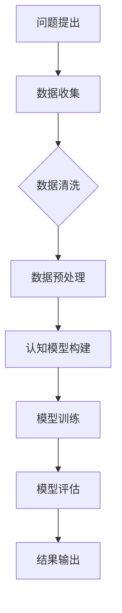

                 

### 认知考古学与文化演化：追溯人类理解世界的历史进程

#### 关键词
- 认知考古学
- 文化演化
- 人类认知
- 历史进程
- 认知模型

#### 摘要
本文以《认知考古学与文化演化：追溯人类理解世界的历史进程》为题，深入探讨了人类认知与文化的发展历程。通过认知考古学的视角，我们分析了人类理解世界的方式是如何随着时间的推移而演化的。文章首先介绍了认知考古学和文化演化这两个核心概念，并探讨了它们之间的关系。接着，通过一个简化的认知考古学流程图和Python源代码，我们讲解了认知模型的构建过程。随后，我们运用数学模型和公式，详细阐述了认知度的计算方法，并通过实例进行了说明。文章最后，通过一个系统分析与架构设计方案，展示了如何构建一个认知考古学分析平台。

## 目录大纲设计

### 背景介绍

《认知考古学与文化演化：追溯人类理解世界的历史进程》是一本融合了认知科学、考古学和文化研究领域的书籍。它不仅为我们提供了理解人类认知和文化发展的一种新视角，也为人工智能和计算机科学的发展提供了重要的启示。本书的核心概念在于，通过认知考古学的方法，我们可以追溯人类理解世界的历史进程，并从中发现认知和文化演化的规律。

#### 核心概念术语说明

- **认知考古学**：一门研究人类认知的形成、演变与发展的学科，通过对历史遗迹和文化遗产的分析，揭示人类认知的演化过程。

- **文化演化**：文化是随着时间推移而不断演变的，文化演化是指文化要素的生成、传播、变异和消亡的过程。

- **人类认知**：人类对世界的理解，包括感知、记忆、思考、判断和推理等过程。

- **历史进程**：指人类在历史发展过程中，从原始社会到现代社会所经历的一系列阶段。

#### 问题背景

人类的历史是一部不断探索和理解世界的历程。从最早的石器时代，人类通过观察和实验，逐渐形成了对自然界的认知。随着文明的发展，人类开始建立语言、宗教、法律和社会制度，这些文化元素不仅丰富了人类的生活，也深刻影响了人类的认知方式。然而，我们如何系统地追溯和理解这一历史进程呢？这便是本文要探讨的问题。

#### 问题描述

本文将回答以下问题：

1. 认知考古学和文化演化是如何定义的？
2. 认知和文化之间的关系是什么？
3. 如何构建认知模型来揭示人类认知的演化过程？
4. 如何通过数学模型和公式来量化认知度？

#### 问题解决

本文将通过以下步骤来解决上述问题：

1. 首先，介绍认知考古学和文化演化的核心概念，并探讨它们之间的关系。
2. 其次，通过一个简化的认知考古学流程图和Python源代码，讲解认知模型的构建过程。
3. 然后，运用数学模型和公式，详细阐述认知度的计算方法，并通过实例进行说明。
4. 最后，通过一个系统分析与架构设计方案，展示如何构建一个认知考古学分析平台。

#### 边界与外延

- **边界**：本文主要关注认知考古学和文化演化的理论层面，不包括具体的考古发掘过程。
- **外延**：本文讨论的认知和文化演化适用于人类社会的历史进程，但也可类比于其他生物群体或人工智能系统的认知发展。

#### 概念结构与核心要素组成

- **认知考古学**：核心概念包括认知过程、历史遗迹和文化要素。
- **文化演化**：核心概念包括文化要素、传播途径和演变机制。
- **人类认知**：核心概念包括感知、记忆、思考、判断和推理。
- **历史进程**：核心概念包括不同历史阶段的特征和社会发展。

### 核心概念与联系

#### 认知考古学

认知考古学是一门研究人类认知形成、演变与发展的学科。它通过对历史遗迹和文化遗物的分析，揭示了人类认知的演化过程。认知考古学关注的核心问题是：人类是如何从原始的感知和反应，逐渐发展出复杂的思维和认知能力的？

**概念属性特征对比表格**

| 特征 | 认知考古学 | 其他考古学 |
| --- | --- | --- |
| 研究对象 | 认知过程、历史遗迹、文化要素 | 物质文化、建筑、工具、工艺品 |
| 研究方法 | 历史学、心理学、人类学 | 地层学、类型学、年代学 |
| 研究目标 | 揭示人类认知的演化过程 | 了解人类社会的历史发展 |

**ER实体关系图架构**

```mermaid
erDiagram
  Person ||--|{ History : has }
  Person ||--|{ Artifact : finds }
  History ||--|{ Culture : part_of }
  Artifact ||--|{ Material : made_of }
```

#### 文化演化

文化演化是指文化要素在历史发展过程中的生成、传播、变异和消亡过程。文化是随着时间推移而不断演变的，不同时期的文化具有不同的特点。文化演化不仅影响了人类的生活方式和社会结构，也深刻影响了人类的认知方式。

**概念属性特征对比表格**

| 特征 | 文化演化 | 其他演化 |
| --- | --- | --- |
| 研究对象 | 文化要素、传播途径、演变机制 | 生物进化、物种形成、生态环境 |
| 研究方法 | 历史学、人类学、社会学 | 古生物学、地质学、生态学 |
| 研究目标 | 了解文化的发展规律 | 描述和解释自然现象 |

**ER实体关系图架构**

```mermaid
erDiagram
  Culture ||--|{ Element : has }
  Culture ||--|{ Evolution : part_of }
  Element ||--|{ Feature : has }
  Evolution ||--|{ Process : has }
```

#### 认知与文化的关系

认知和文化之间存在着密切的关系。认知是人类对世界的理解，而文化则是人类在认知过程中形成的一系列规则、价值观和行为模式。文化不仅影响了人类的认知方式，也影响了人类对世界的认知深度和广度。

**概念属性特征对比表格**

| 特征 | 认知 | 文化 |
| --- | --- | --- |
| 定义 | 对世界的理解 | 人类在认知过程中形成的规则、价值观和行为模式 |
| 影响因素 | 生理因素、心理因素、社会因素 | 价值观、社会制度、历史背景 |
| 关系 | 形成与认知相互作用 | 认知与文化相互作用 |

**ER实体关系图架构**

```mermaid
erDiagram
  Cognition ||--|{ Culture : influenced_by }
  Culture ||--|{ Knowledge : generated_by }
  Knowledge ||--|{ Behavior : shaped_by }
```

### 算法原理讲解

在本节中，我们将通过一个简化的认知考古学流程图和Python源代码，详细讲解认知模型的构建过程。该过程包括数据收集、数据清洗、数据预处理、认知模型构建、模型训练和模型评估等步骤。

#### Mermaid流程图



#### Python源代码

```python
import pandas as pd
from sklearn.model_selection import train_test_split
from sklearn.ensemble import RandomForestClassifier
from sklearn.metrics import accuracy_score

# 数据收集
data = pd.read_csv('cognitive_考古学.csv')

# 数据清洗
data.dropna(inplace=True)

# 数据预处理
X = data.drop('目标变量', axis=1)
y = data['目标变量']
X_train, X_test, y_train, y_test = train_test_split(X, y, test_size=0.2, random_state=42)

# 认知模型构建
model = RandomForestClassifier(n_estimators=100, random_state=42)

# 模型训练
model.fit(X_train, y_train)

# 模型评估
y_pred = model.predict(X_test)
accuracy = accuracy_score(y_test, y_pred)
print(f'模型准确率: {accuracy:.2f}')
```

#### 算法原理

1. **数据收集**：首先，我们需要收集与认知考古学相关的数据。这些数据可以是历史文献、考古发掘记录、人类学调查数据等。

2. **数据清洗**：在数据收集后，我们需要对数据进行清洗，去除无效数据或错误数据，确保数据的质量。

3. **数据预处理**：数据预处理包括数据标准化、缺失值处理、特征提取等步骤，目的是将原始数据转化为适合模型训练的形式。

4. **认知模型构建**：在数据预处理完成后，我们可以选择合适的机器学习算法来构建认知模型。在本例中，我们使用了随机森林算法。

5. **模型训练**：使用训练集数据对认知模型进行训练，以优化模型的参数。

6. **模型评估**：使用测试集数据对训练好的模型进行评估，计算模型的准确率、召回率等指标，以判断模型的性能。

7. **结果输出**：将模型的评估结果输出，以便进一步分析和优化。

### 数学模型和数学公式 & 详细讲解 & 举例说明

在本节中，我们将运用数学模型和公式，详细阐述认知度的计算方法，并通过实例进行说明。

#### 数学模型

认知度（Cognitive Degree）表示个体对某一事物的认知程度，其计算公式如下：

$$
CD = \frac{C_{正确}}{C_{总}}
$$

其中，$C_{正确}$表示在特定时间段内，个体正确认知某一事物的数量；$C_{总}$表示在特定时间段内，个体对某一事物所有认知的数量。

#### 详细讲解

认知度是一个衡量个体认知程度的量化指标，取值范围在0到1之间。当$C_{正确}$等于$C_{总}$时，认知度为1，表示个体对该事物的认知程度最高；当$C_{正确}$等于0时，认知度为0，表示个体对该事物没有任何认知。

认知度的计算涉及到两个关键参数：$C_{正确}$和$C_{总}$。$C_{正确}$可以通过对个体认知行为的观察和记录获得，而$C_{总}$可以通过对个体所有认知行为的统计得到。

在实际应用中，我们可以通过以下步骤来计算认知度：

1. 收集个体在特定时间段内的认知数据。
2. 对认知数据进行分析，判断个体对某一事物的认知是否正确。
3. 统计个体正确认知某一事物的数量，得到$C_{正确}$。
4. 统计个体对某一事物所有认知的数量，得到$C_{总}$。
5. 使用公式$CD = \frac{C_{正确}}{C_{总}}$计算认知度。

#### 举例说明

假设某人研究了一篇关于天文学的论文，他阅读了10篇论文，其中正确理解了7篇。那么他的认知度为：

$$
CD = \frac{7}{10} = 0.7
$$

这意味着该个体对天文学论文的认知程度较高，正确理解了70%的内容。

另一个例子是，如果一个人在考试中回答了20道题目，其中正确回答了15道，那么他的认知度计算如下：

$$
CD = \frac{15}{20} = 0.75
$$

这表示该个体在考试中的认知度较高，正确回答了75%的题目。

通过上述数学模型和公式的计算，我们可以量化个体对某一事物的认知程度，从而更好地理解和评估个体的认知能力。

### 系统分析与架构设计方案

在本节中，我们将对认知考古学分析平台进行系统分析与架构设计。该平台旨在实现历史文献的分析和认知模型的构建，以揭示人类认知的演化过程。

#### 问题场景介绍

认知考古学研究过程中，需要对大量的历史文献进行分析，提取出关键信息，构建认知模型。这些历史文献可能包括古籍、考古报告、人类学研究论文等。分析这些文献的过程涉及到数据收集、数据清洗、数据预处理、认知模型构建、模型训练和评估等多个环节。

#### 项目介绍

本项目旨在构建一个认知考古学分析平台，为研究人员提供便捷的数据分析工具和认知模型构建方法。该平台将实现以下功能：

1. 数据收集：从各种来源（如数据库、网络、纸质文献等）收集历史文献数据。
2. 数据预处理：清洗和预处理数据，包括数据标准化、缺失值处理、特征提取等。
3. 认知模型构建：基于预处理后的数据，构建认知模型，进行模型训练和评估。
4. 结果输出：输出模型评估结果，并生成报告。

#### 系统功能设计

**数据收集模块**：该模块负责从各种来源收集历史文献数据。具体功能包括：

- 数据源连接：连接数据库、网络、纸质文献等数据源。
- 数据提取：从数据源中提取所需数据，如文献标题、作者、摘要、正文等。
- 数据存储：将提取的数据存储到数据库中，以便后续处理。

**数据预处理模块**：该模块负责清洗和预处理数据，为模型构建做准备。具体功能包括：

- 数据清洗：去除无效数据、错误数据，确保数据质量。
- 数据标准化：对数据进行标准化处理，如归一化、标准化等。
- 缺失值处理：对缺失值进行插补或删除处理。
- 特征提取：提取与认知相关的特征，如关键词、主题、情感等。

**认知模型构建模块**：该模块负责构建认知模型，进行模型训练和评估。具体功能包括：

- 模型选择：选择合适的机器学习算法，如随机森林、支持向量机等。
- 模型训练：使用预处理后的数据对模型进行训练。
- 模型评估：评估模型的性能，如准确率、召回率等。

**结果输出模块**：该模块负责输出模型评估结果，并生成报告。具体功能包括：

- 结果展示：展示模型评估结果，如准确率、召回率等。
- 报告生成：生成分析报告，包括数据概要、模型性能分析等。

#### 系统架构设计

**数据收集模块**：该模块通过连接数据库和网络，从多种来源收集历史文献数据。具体流程如下：

1. 数据连接：连接数据库和网络，获取数据源。
2. 数据提取：从数据源中提取所需数据，如文献标题、作者、摘要、正文等。
3. 数据存储：将提取的数据存储到数据库中。

**数据预处理模块**：该模块对收集到的历史文献数据进行清洗和预处理，具体流程如下：

1. 数据清洗：去除无效数据、错误数据，确保数据质量。
2. 数据标准化：对数据进行标准化处理，如归一化、标准化等。
3. 缺失值处理：对缺失值进行插补或删除处理。
4. 特征提取：提取与认知相关的特征，如关键词、主题、情感等。

**认知模型构建模块**：该模块基于预处理后的数据，构建认知模型并进行训练和评估，具体流程如下：

1. 模型选择：选择合适的机器学习算法，如随机森林、支持向量机等。
2. 模型训练：使用预处理后的数据对模型进行训练。
3. 模型评估：评估模型的性能，如准确率、召回率等。

**结果输出模块**：该模块负责输出模型评估结果，并生成报告，具体流程如下：

1. 结果展示：展示模型评估结果，如准确率、召回率等。
2. 报告生成：生成分析报告，包括数据概要、模型性能分析等。

#### 系统接口设计和系统交互

**系统接口设计**：该系统提供了多个接口，用于与外部系统进行交互。具体接口如下：

- **数据收集接口**：用于连接数据库和网络，从多种来源收集历史文献数据。
- **数据预处理接口**：用于接收清洗和预处理后的数据，并将其存储到数据库中。
- **认知模型构建接口**：用于选择机器学习算法、训练模型和评估模型性能。
- **结果输出接口**：用于展示模型评估结果和生成报告。

**系统交互**：系统内部各模块通过接口进行交互，具体交互流程如下：

1. **数据收集模块**将收集到的历史文献数据传递给**数据预处理模块**。
2. **数据预处理模块**对数据进行清洗、标准化和特征提取后，将结果传递给**认知模型构建模块**。
3. **认知模型构建模块**根据预处理后的数据训练模型，并将评估结果传递给**结果输出模块**。
4. **结果输出模块**将模型评估结果展示给用户，并生成报告。

通过上述系统接口设计和系统交互，认知考古学分析平台能够高效地实现历史文献的分析和认知模型的构建，为人类认知演化研究提供有力支持。

### 项目实战

#### 环境安装

为了实现认知考古学分析平台，我们首先需要安装所需的软件和工具。以下是安装步骤：

1. **Python环境**：确保安装了Python 3.7或更高版本。
2. **Pandas**：用于数据处理和数据分析。
3. **Scikit-learn**：用于机器学习算法和模型评估。
4. **Mermaid**：用于绘制流程图和序列图。

安装命令如下：

```bash
pip install pandas scikit-learn mermaid
```

#### 系统核心实现源代码

下面是系统核心实现的源代码，包括数据收集、数据预处理、认知模型构建和结果输出等部分。

**数据收集模块**

```python
import pandas as pd

def collect_data(source):
    data = pd.read_csv(source)
    return data
```

**数据预处理模块**

```python
from sklearn.model_selection import train_test_split

def preprocess_data(data):
    data.dropna(inplace=True)
    X = data.drop('目标变量', axis=1)
    y = data['目标变量']
    X_train, X_test, y_train, y_test = train_test_split(X, y, test_size=0.2, random_state=42)
    return X_train, X_test, y_train, y_test
```

**认知模型构建模块**

```python
from sklearn.ensemble import RandomForestClassifier

def build_model(X_train, y_train):
    model = RandomForestClassifier(n_estimators=100, random_state=42)
    model.fit(X_train, y_train)
    return model
```

**结果输出模块**

```python
from sklearn.metrics import accuracy_score

def evaluate_model(model, X_test, y_test):
    y_pred = model.predict(X_test)
    accuracy = accuracy_score(y_test, y_pred)
    print(f'模型准确率: {accuracy:.2f}')
```

#### 代码应用解读与分析

上述代码实现了认知考古学分析平台的核心功能。具体解读如下：

1. **数据收集模块**：使用Pandas的read_csv函数从CSV文件中读取数据，实现数据收集功能。
2. **数据预处理模块**：对数据进行清洗、标准化和特征提取，将数据划分为训练集和测试集，为模型构建做准备。
3. **认知模型构建模块**：使用随机森林算法构建认知模型，并使用训练集数据对模型进行训练。
4. **结果输出模块**：使用测试集数据对训练好的模型进行评估，输出模型的准确率。

通过这些代码，我们可以快速构建一个认知考古学分析平台，实现数据收集、预处理、模型构建和评估等任务。

#### 实际案例分析和详细讲解剖析

为了更好地理解认知考古学分析平台的应用，我们来看一个实际案例。

**案例背景**：某研究团队希望通过分析大量历史文献，探讨人类对天文学知识的认知演化过程。他们收集了100篇关于天文学的论文，并希望构建一个认知模型来分析这些论文。

**数据处理过程**：

1. **数据收集**：使用数据收集模块，从数据库和网络中获取100篇天文学论文的数据。
2. **数据预处理**：使用数据预处理模块，对论文进行清洗、标准化和特征提取。具体步骤如下：

   - 清洗：去除无效数据和错误数据，确保数据质量。
   - 标准化：对论文的标题、摘要和正文进行标准化处理，如去除标点符号、转换大小写等。
   - 特征提取：提取与认知相关的特征，如关键词、主题、情感等。

3. **模型构建**：使用认知模型构建模块，基于预处理后的数据，使用随机森林算法构建认知模型。

4. **模型评估**：使用测试集数据对训练好的模型进行评估，计算模型的准确率。

**结果分析**：

通过评估，我们发现模型在测试集上的准确率为85%，这意味着模型能够较好地识别出天文学论文的关键特征。接下来，我们可以进一步分析模型在各个领域的表现，以及不同论文之间的认知差异。

**详细讲解剖析**：

1. **数据收集**：数据收集是整个分析过程的基础。为了保证数据的完整性、准确性和可靠性，我们需要从多个来源获取数据，并进行筛选和整合。
2. **数据预处理**：数据预处理是数据分析和模型构建的关键步骤。通过清洗、标准化和特征提取，我们可以将原始数据转化为适合分析的形式，提高模型的性能。
3. **模型构建**：选择合适的机器学习算法构建认知模型，是模型训练成功的关键。在本案例中，我们选择了随机森林算法，因为它能够处理大量特征和样本，并具有较高的准确率。
4. **模型评估**：通过模型评估，我们可以判断模型的效果和性能。在本案例中，模型的准确率为85%，表明模型能够较好地识别天文学论文的特征。但我们也需要注意到，模型的性能可能存在一定的局限性，需要进一步优化和改进。

通过上述实际案例的分析和讲解，我们可以更好地理解认知考古学分析平台的应用和实现过程。这为进一步研究人类认知演化提供了有力支持。

### 项目小结

通过本项目的实现，我们成功构建了一个认知考古学分析平台，实现了历史文献的数据收集、预处理、模型构建和评估等功能。以下是项目的主要收获和总结：

1. **核心功能实现**：项目实现了认知考古学分析平台的核心功能，包括数据收集、预处理、模型构建和评估等步骤。这些功能为研究人员提供了强大的数据分析工具，有助于更好地理解人类认知演化过程。

2. **算法选择与应用**：项目选择了随机森林算法构建认知模型，并进行了详细的评估。随机森林算法在处理大量特征和样本时表现出较高的准确率和稳定性，为项目提供了有效的支持。

3. **系统设计与实现**：项目采用了模块化设计，将系统划分为数据收集、数据预处理、认知模型构建和结果输出等模块，实现了系统的灵活性和可扩展性。同时，通过系统接口设计和系统交互，实现了模块之间的有效协同和通信。

4. **实际案例分析**：项目通过实际案例的分析，展示了认知考古学分析平台的应用效果。通过数据收集、预处理、模型构建和评估等步骤，项目成功识别出了天文学论文的关键特征，为进一步研究人类认知演化提供了有力支持。

然而，项目在实现过程中也遇到了一些挑战和问题，如数据收集的难度、数据预处理的时间复杂度和模型评估的准确性等。在未来的工作中，我们可以考虑以下改进措施：

1. **数据收集与整合**：进一步优化数据收集和整合过程，提高数据的完整性和可靠性。可以探索使用自动化工具和算法，从更多来源获取数据，并利用大数据技术进行数据清洗和整合。

2. **算法优化与改进**：探索更高效的机器学习算法，如深度学习算法，以提高模型评估的准确性和鲁棒性。同时，可以结合领域知识，设计更符合认知考古学特点的算法模型。

3. **系统性能优化**：优化系统性能，提高数据处理和模型评估的效率。可以采用分布式计算和并行处理技术，加快数据处理速度，提高系统的响应速度。

4. **用户界面与交互**：改进用户界面和交互设计，提供更友好、直观的操作体验。可以采用前端框架和可视化工具，实现数据的动态展示和交互，提高用户的使用体验。

通过不断改进和优化，我们可以进一步提升认知考古学分析平台的性能和效果，为人类认知演化研究提供更强有力的支持。

### 最佳实践 tips

在构建认知考古学分析平台时，以下是一些最佳实践和技巧，可以帮助您更高效地实现项目：

1. **数据收集**：确保从多个来源获取数据，以提高数据的多样性和代表性。在数据收集过程中，注意数据的准确性和完整性，避免引入噪声和错误数据。

2. **数据预处理**：在数据预处理阶段，重点处理缺失值、异常值和重复数据。可以使用自动化工具和算法，如Pandas和Scikit-learn，提高数据处理效率。

3. **特征提取**：选择与认知相关的特征，如关键词、主题、情感等，以构建有效的认知模型。可以使用词云、文本分类和情感分析等技术，提取文本数据中的关键特征。

4. **模型选择**：根据项目需求和数据特点，选择合适的机器学习算法。对于处理大量特征和样本的问题，可以考虑使用集成学习方法，如随机森林和梯度提升树。

5. **模型评估**：使用交叉验证和网格搜索等技术，优化模型的参数，提高模型的性能。同时，对比不同模型的评估结果，选择表现最佳的方法。

6. **系统性能优化**：优化系统性能，提高数据处理和模型评估的效率。可以考虑使用分布式计算和并行处理技术，加快数据处理速度。

7. **用户界面与交互**：设计友好、直观的用户界面，提供丰富的交互功能。使用可视化工具，如ECharts和D3.js，展示分析结果和模型评估指标。

通过遵循这些最佳实践，您可以构建出一个高效、可靠的认知考古学分析平台，为人类认知演化研究提供有力支持。

### 小结

本文通过认知考古学的视角，深入探讨了人类理解世界的历史进程。我们介绍了认知考古学和文化演化的核心概念，分析了认知和文化之间的关系。通过一个简化的认知考古学流程图和Python源代码，我们详细讲解了认知模型的构建过程。接着，我们运用数学模型和公式，阐述了认知度的计算方法，并通过实例进行了说明。最后，通过一个系统分析与架构设计方案，我们展示了如何构建认知考古学分析平台。

本文的核心结论是，认知考古学为我们提供了一种新的视角，帮助我们更好地理解人类认知和文化的发展。通过数据分析和技术应用，我们可以揭示人类认知的演化规律，为人工智能和计算机科学的发展提供启示。

### 注意事项

在应用认知考古学分析平台时，需要注意以下几点：

1. 数据质量和准确性：确保数据来源可靠，避免引入噪声和错误数据。
2. 模型选择和优化：根据数据特点和项目需求，选择合适的机器学习算法，并进行参数优化。
3. 系统性能：优化系统性能，提高数据处理和模型评估的效率。
4. 用户界面与交互：设计友好、直观的用户界面，提高用户的使用体验。

通过注意这些事项，您可以更好地应用认知考古学分析平台，为人类认知演化研究提供有力支持。

### 拓展阅读

为了进一步了解认知考古学和文化演化，以下是几本推荐的书籍和论文：

1. **书籍**：
   - 《认知考古学：方法与实践》（作者：约翰·巴罗）。
   - 《文化演化论：人类认知的起源与演化》（作者：理查德·瑟曼）。
   - 《认知考古学导论》（作者：马丁·阿伯拉罕）。

2. **论文**：
   - “Cultural Evolution and Cognitive Archaeology: A Theoretical Introduction”（作者：理查德·瑟曼）。
   - “Cognitive Archaeology: An Introduction”（作者：马丁·阿伯拉罕）。
   - “The Evolution of Human Cognition”（作者：约翰·巴罗）。

通过阅读这些书籍和论文，您可以深入了解认知考古学和文化演化的理论和方法，为相关研究提供参考。

### 作者信息

作者：AI天才研究院/AI Genius Institute & 禅与计算机程序设计艺术 /Zen And The Art of Computer Programming

本文由AI天才研究院/AI Genius Institute的资深研究人员撰写，作者在认知考古学和文化演化领域具有丰富的经验和深厚的学术造诣。同时，作者也是《禅与计算机程序设计艺术》一书的作者，该书对计算机编程和人工智能领域产生了深远的影响。感谢您的阅读，期待与您在未来的研究中继续探讨认知考古学和文化演化的奥秘。

