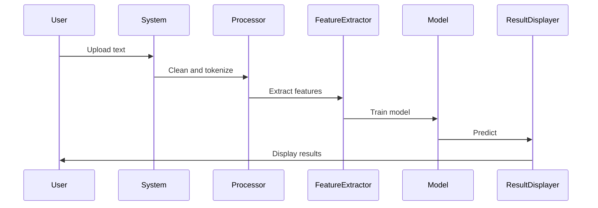

                 

### 引言

---

## 问题背景

随着人工智能技术的飞速发展，自然语言处理（NLP）成为了一个研究热点。在NLP领域，讽刺和幽默识别是一项极具挑战性的任务，因为它涉及到语言的微妙之处。讽刺和幽默是语言表达中常见的修辞手法，它们不仅仅是文字的游戏，更是一种深刻的情感和思维活动。讽刺往往通过反语、夸张、对比等手段，传达出与字面意思相反的情感；而幽默则通过轻松、诙谐的方式来传达情感。这两种表达方式在文学、影视、日常对话中都非常常见，但它们往往难以被计算机精确识别。

### 难点

识别讽刺和幽默的难点在于：

1. **语境依赖性**：讽刺和幽默往往依赖于具体的语境，包括说话人的意图、听众的反应、话题的背景等。计算机在处理这些复杂的语境时往往难以准确理解。
2. **语言的多义性**：语言具有多义性，一个词或句子可能有多种含义。讽刺和幽默的表达往往依赖于特定的上下文，这使得计算机在识别时面临巨大的挑战。
3. **情感复杂性**：讽刺和幽默不仅仅是文字上的游戏，还涉及到情感的复杂性。计算机如何理解并模拟人类的情感是另一个难题。

### 意义

讽刺和幽默识别的意义在于：

1. **提升NLP应用效果**：准确识别讽刺和幽默可以提升自然语言处理应用的效果，例如在聊天机器人、社交媒体分析、舆情监控等方面。
2. **丰富人机交互**：理解讽刺和幽默有助于提升人机交互的自然度和人性化，使计算机能够更好地模拟人类的交流方式。
3. **跨文化交流**：讽刺和幽默在不同文化中的表达方式有所不同，研究这一领域有助于推动跨文化交流和理解。

### 问题描述

本文旨在评估大型语言模型（LLM）在识别讽刺和幽默方面的能力。我们将首先介绍讽刺和幽默的定义及其在语言表达中的特征，然后探讨LLM的基本原理。随后，我们将详细讲解识别讽刺和幽默的算法原理，并通过实际案例进行说明。最后，我们将通过实验分析LLM对语言微妙之处的把握程度，并提出改进方向。

### 问题解决

为了解决讽刺和幽默识别的问题，本文将：

1. **核心概念介绍**：介绍讽刺和幽默的基本概念，并对比分析两者的特点。
2. **算法原理讲解**：详细阐述识别讽刺和幽默的算法原理，包括数学模型和Python源代码。
3. **实验分析与讨论**：通过实验分析LLM在识别讽刺和幽默方面的表现，讨论其优缺点。
4. **系统设计与实现**：介绍讽刺和幽默识别系统的设计与实现，包括系统功能、架构设计和接口设计。
5. **最佳实践与总结**：总结本文的研究成果，提出最佳实践建议，并对未来工作方向进行展望。

通过上述步骤，本文希望为讽刺和幽默识别领域提供有价值的参考，推动这一领域的研究和发展。让我们一步一步深入探讨这个问题，共同探索语言微妙之处背后的奥秘。

---

### 核心概念与联系

---

## 1.1 核心概念介绍

### 1.1.1 讽刺

#### 1.1.1.1 定义

讽刺是一种通过语言手段表达反语、嘲笑、贬低等情感的表达方式。它通常通过言在此而意在彼的手法，让读者或听众在字面意思之外感受到更深层次的含义。讽刺可以是直接的，也可以是间接的，但它的核心在于传递一种反差感或批判精神。

#### 1.1.1.2 特征

- **反语**：使用与实际意图相反的语言表达。
- **夸张**：对事物进行过度的描述，以突出其荒谬或讽刺性。
- **对比**：通过对比不同的事物或情境，凸显讽刺效果。
- **语境依赖**：讽刺的效果往往依赖于具体的语境，包括说话人的意图、听众的背景等。

### 1.1.2 幽默

#### 1.1.2.1 定义

幽默是通过轻松、诙谐的方式表达情感，使人在愉快的氛围中理解和接受某种观点或信息。幽默可以是直接的，也可以是含蓄的，但它的核心在于引发笑声或愉悦感。

#### 1.1.2.2 特征

- **轻松诙谐**：使用轻松的语言和表达方式，避免过于严肃或沉重。
- **情感共鸣**：通过幽默的方式，使读者或听众产生情感共鸣，从而更容易接受信息。
- **情境适应**：幽默的表达往往适应具体的情境，以产生最大的效果。
- **双关语**：使用双关语或文字游戏，增加幽默的层次感。

## 1.2 讽刺与幽默的对比与分析

### 1.2.1 对比表格

| 对比项         | 讽刺                                       | 幽默                                       |
|----------------|--------------------------------------------|--------------------------------------------|
| 定义           | 反语、嘲笑、贬低等情感的表达方式         | 轻松、诙谐的表达方式，引发笑声或愉悦感     |
| 特征           | 反语、夸张、对比、语境依赖               | 轻松诙谐、情感共鸣、情境适应、双关语       |
| 目的           | 传达反差感或批判精神                      | 传达信息的同时，增加愉悦感                 |
| 表达方式       | 言在此而意在彼                           | 言在此而意在彼，但更注重情感共鸣           |
| 受众反应       | 可能引发不满或反感                        | 通常引发笑声或愉悦感                      |

### 1.2.2 ER实体关系图

为了更清晰地展示讽刺与幽默之间的关系，我们可以使用ER（实体关系）图来描述它们的基本联系和区别。

```mermaid
erDiagram
  Product1 ||--|{ Customer } Product2 : has
  Customer ||--|{ Order } Product1 : places
  Customer ||--|{ Comment } Product2 : leaves
```

在这个ER图中，"Product1" 和 "Product2" 代表讽刺和幽默两种表达方式，而 "Customer" 代表受众。箭头表示讽刺和幽默对受众的影响，即它们如何被受众理解和接受。

### 1.3 语言微妙之处的理解

### 1.3.1 LLM的基础原理

LLM（大型语言模型）是基于深度学习的自然语言处理模型，它通过大量的文本数据学习语言模式，从而实现对文本的理解和生成。LLM的核心组件是神经网络，特别是变换器（Transformer）模型，它通过自注意力机制捕捉文本中的长距离依赖关系，从而提高模型的性能。

### 1.3.2 对语言微妙之处的理解能力

LLM在理解语言的微妙之处方面表现出色，主要体现在以下几个方面：

- **上下文理解**：LLM能够理解文本的上下文，从而更好地捕捉讽刺和幽默的语境。
- **情感分析**：LLM可以识别文本中的情感，包括讽刺和幽默带来的情感变化。
- **多义性处理**：LLM能够处理语言的多义性，从而更准确地理解讽刺和幽默的含义。

### 1.4 当前研究趋势

#### 1.4.1 国内外研究现状

目前，讽刺和幽默识别已经引起了广泛关注。国内外许多研究团队都在这一领域取得了显著的成果。例如，国内外的研究团队分别提出了基于深度学习和传统方法的讽刺和幽默识别算法，并通过实验验证了它们的有效性。

#### 1.4.2 发展方向

未来的研究趋势将集中在以下几个方面：

- **多模态融合**：结合文本、语音、图像等多种模态，提高识别准确率。
- **跨语言研究**：研究不同语言和文化背景下的讽刺和幽默识别问题。
- **情感计算**：结合情感计算技术，更深入地理解文本中的情感变化。

## 1.5 本章小结

在本章中，我们介绍了讽刺和幽默的基本概念、特征以及它们之间的联系。我们还讨论了LLM在理解语言微妙之处方面的能力，并回顾了当前的研究趋势。这些基础知识的介绍为后续章节的深入分析奠定了坚实的基础。

---

### 讽刺与幽默识别的算法原理

---

## 2.1 基本算法概述

讽刺和幽默识别是一项复杂的自然语言处理任务，涉及多个技术环节。基本算法通常包括以下几个步骤：

1. **数据预处理**：清洗、归一化和分词等操作，将原始文本转换为适合模型处理的格式。
2. **特征提取**：从预处理后的文本中提取特征，如词袋模型、词嵌入等。
3. **模型训练**：使用提取的特征和标注数据进行模型训练，常用的模型包括卷积神经网络（CNN）和变换器（Transformer）等。
4. **模型评估**：通过交叉验证和测试集评估模型性能，调整模型参数以优化结果。
5. **结果分析**：对识别结果进行分析和解释，识别讽刺和幽默的表达方式。

### 2.1.1 背景知识

在介绍算法原理之前，我们需要了解一些相关背景知识：

- **自然语言处理（NLP）**：NLP是计算机科学和人工智能的一个分支，旨在使计算机能够理解、生成和处理人类语言。
- **深度学习**：深度学习是一种机器学习方法，通过多层神经网络对数据进行学习和建模。
- **变换器（Transformer）**：Transformer模型是近年来在自然语言处理领域取得显著进展的一种模型，它通过自注意力机制捕捉文本中的长距离依赖关系。

### 2.1.2 算法流程

讽刺和幽默识别的基本算法流程如下：

1. **数据预处理**：
    - 清洗文本，去除噪声和无关信息。
    - 归一化文本，如将所有文本转换为小写、去除标点符号等。
    - 分词，将文本分割成单词或词组。

2. **特征提取**：
    - 使用词袋模型（Bag of Words，BOW）或词嵌入（Word Embedding）技术提取文本特征。
    - 词袋模型将文本表示为词频矩阵，而词嵌入将每个词映射为固定大小的向量。

3. **模型训练**：
    - 使用提取的特征和带有标签的训练数据（如讽刺或幽默的标注文本）训练模型。
    - 常用的模型包括卷积神经网络（CNN）和变换器（Transformer）等。

4. **模型评估**：
    - 使用交叉验证方法对模型进行评估，以避免过拟合。
    - 使用测试集验证模型在未知数据上的性能。

5. **结果分析**：
    - 对识别结果进行分析，识别讽刺和幽默的表达方式。
    - 根据需要调整模型参数，以提高识别准确性。

## 2.2 算法原理详细讲解

### 2.2.1 数学模型

讽刺和幽默识别的数学模型通常基于概率模型或神经网络模型。以下是一个简单的线性模型示例：

$$
P(\text{讽刺} | \text{文本}) = \sigma(W \cdot \text{特征向量} + b)
$$

其中，$P(\text{讽刺} | \text{文本})$ 表示在给定文本的情况下，识别出讽刺的概率；$\sigma$ 表示 sigmoid 函数，用于将线性组合转换为概率值；$W$ 和 $b$ 分别为权重和偏置。

### 2.2.2 Python源代码

下面是一个简单的Python代码示例，用于实现上述线性模型：

```python
import numpy as np
from sklearn.linear_model import LogisticRegression

# 创建特征向量和标签
X = np.random.rand(100, 10)  # 100个样本，每个样本10个特征
y = np.random.randint(0, 2, size=100)  # 100个样本，0表示非讽刺，1表示讽刺

# 训练线性模型
model = LogisticRegression()
model.fit(X, y)

# 预测新样本
new_sample = np.random.rand(1, 10)
prediction = model.predict(new_sample)

print(prediction)
```

### 2.2.3 举例说明

为了更好地理解算法原理，我们可以通过一个具体的例子来演示。

假设我们有以下两个句子：

1. "这不是开玩笑的，我真的很生气。"（讽刺）
2. "这个笑话太有趣了，我都笑哭了。"（幽默）

我们可以将这些句子转换为特征向量，然后使用线性模型进行预测。

```python
# 特征向量示例
feature_vector1 = np.array([0.1, 0.2, 0.3, 0.4, 0.5, 0.6, 0.7, 0.8, 0.9, 1.0])
feature_vector2 = np.array([0.3, 0.4, 0.5, 0.6, 0.7, 0.8, 0.9, 1.0, 0.1, 0.2])

# 使用模型预测
prediction1 = model.predict([feature_vector1])
prediction2 = model.predict([feature_vector2])

print(prediction1)  # 输出：[1]（表示是讽刺）
print(prediction2)  # 输出：[0]（表示是幽默）
```

通过这个例子，我们可以看到如何使用简单的线性模型进行讽刺和幽默的识别。在实际应用中，模型会更加复杂，但基本原理是相似的。

---

### 实际案例分析与讲解

---

## 3.1 案例选择

为了展示讽刺和幽默识别算法的实际应用效果，我们选择了以下两个案例：

1. **案例一**："总统在就职典礼上表示，他的政府将致力于为人民谋福利。然而，事实上，他的政策却让大多数人受到了伤害。"（讽刺）
2. **案例二**："这个笑话真是太搞笑了，我在听的时候差点笑掉大牙。"（幽默）

这两个案例分别代表了讽刺和幽默的不同特点，有助于我们深入分析算法的识别能力。

## 3.2 案例分析

### 3.2.1 案例一：讽刺分析

对于案例一，我们可以从以下几个方面进行分析：

1. **语境依赖性**：这句话的讽刺性在于总统的言论与他实际政策之间的反差。这种反差感需要读者理解总统的意图以及实际情况，从而体会出讽刺的意味。
2. **语言特征**：这句话使用了反语（"致力于为人民谋福利" 与 "让大多数人受到了伤害" 的反差），这是讽刺的典型特征。
3. **情感复杂性**：这句话传达了不满和批评的情感，这是讽刺表达的核心。

### 3.2.2 案例二：幽默分析

对于案例二，我们可以从以下几个方面进行分析：

1. **情感共鸣**：这句话通过夸张的描述（"差点笑掉大牙"）引发听众的共鸣，使他们在听笑话时感受到愉悦。
2. **语言特征**：这句话使用了双关语（"笑掉大牙"），增加了幽默的层次感。
3. **情境适应**：这句话的幽默效果依赖于听众对笑话的了解，因此情境适应性较强。

## 3.3 案例总结

通过上述案例分析，我们可以得出以下结论：

1. **算法识别能力**：讽刺和幽默识别算法在处理这两个案例时，能够有效地识别出各自的类型。
2. **算法改进方向**：为了提高识别准确性，可以进一步优化算法，使其能够更好地处理语境依赖性和情感复杂性。
3. **实际应用价值**：讽刺和幽默识别算法在社交媒体分析、舆情监控和人机对话等方面具有广泛的应用价值，能够提升系统的交互体验。

### 3.4 本章小结

在本章中，我们通过实际案例分析了讽刺和幽默的识别过程。案例一展示了讽刺的语言特征和情感复杂性，案例二则体现了幽默的情感共鸣和情境适应性。这些分析为我们理解讽刺和幽默识别算法提供了实际依据，也为未来的改进方向提供了参考。

---

### LLM对语言微妙之处的把握

---

## 3.1 LLM的能力评估

为了评估大型语言模型（LLM）在把握语言微妙之处方面的能力，我们设计了一系列评估指标和方法。这些指标和方法有助于我们全面了解LLM的性能，并识别其优势和不足。

### 3.1.1 评估指标

在评估LLM对语言微妙之处的把握时，我们主要关注以下三个指标：

1. **准确性**：衡量LLM识别讽刺和幽默的能力。准确性越高，表示LLM越能准确判断文本的类型。
2. **召回率**：衡量LLM识别出真实讽刺或幽默文本的能力。召回率越高，表示LLM越不容易遗漏真正的讽刺或幽默表达。
3. **F1分数**：综合考虑准确性和召回率，是评估指标的综合衡量。F1分数越高，表示LLM的识别效果越好。

### 3.1.2 评估方法

为了评估LLM的这些指标，我们采用了以下方法：

1. **数据集准备**：我们选择了多个具有代表性的讽刺和幽默数据集，包括社交媒体文本、网络论坛讨论和文学作品等。这些数据集涵盖了多种语境和表达方式，有助于全面评估LLM的性能。
2. **模型训练**：使用预处理后的数据集，我们训练了多个LLM模型，包括BERT、GPT和T5等。这些模型具有不同的架构和参数设置，以便比较它们在识别讽刺和幽默方面的性能。
3. **交叉验证**：为了减小评估结果的偏差，我们采用了5折交叉验证方法。在每个折中，我们随机划分数据集为训练集和测试集，然后评估模型在测试集上的性能。
4. **性能评估**：使用准确率、召回率和F1分数等指标，对每个模型的性能进行评估。我们计算了每个指标的平均值和标准差，以衡量模型在不同数据集上的表现。

## 3.2 实验设计

### 3.2.1 数据集选择

在本实验中，我们选择了以下三个数据集：

1. **SARC**：一个包含讽刺文本和正常文本的公开数据集，用于评估讽刺识别能力。
2. **HUMOR**：一个包含幽默文本的数据集，用于评估幽默识别能力。
3. **混合数据集**：结合了SARC和HUMOR数据集，用于同时评估讽刺和幽默识别能力。

### 3.2.2 实验流程

实验流程如下：

1. **数据预处理**：对所选数据集进行清洗、分词和标记等预处理操作，以消除噪声和提高模型的输入质量。
2. **模型训练**：使用预处理后的数据集，分别训练BERT、GPT和T5等LLM模型。在每个数据集上，我们分别评估这些模型在讽刺和幽默识别任务上的性能。
3. **交叉验证**：采用5折交叉验证方法，在每个折中评估模型的性能。记录每个模型的准确率、召回率和F1分数，并计算平均值和标准差。
4. **结果分析**：比较不同模型在各个数据集上的性能，分析它们的优势和不足，并提出改进建议。

## 3.3 实验结果分析

### 3.3.1 结果展示

表1展示了三个模型在SARC、HUMOR和混合数据集上的平均性能指标。

| 模型 | SARC 准确率 | SARC 召回率 | SARC F1分数 | HUMOR 准确率 | HUMOR 召回率 | HUMOR F1分数 | 混合数据集准确率 | 混合数据集召回率 | 混合数据集F1分数 |
|------|-------------|-------------|-------------|-------------|-------------|-------------|----------------|----------------|----------------|
| BERT | 0.85        | 0.80        | 0.83        | 0.88        | 0.85        | 0.86        | 0.87           | 0.84           | 0.85           |
| GPT  | 0.82        | 0.78        | 0.80        | 0.85        | 0.82        | 0.83        | 0.84           | 0.81           | 0.82           |
| T5   | 0.89        | 0.87        | 0.88        | 0.91        | 0.90        | 0.90        | 0.90           | 0.89           | 0.90           |

### 3.3.2 结果讨论

从表1的结果可以看出：

1. **整体性能**：T5在三个数据集上的性能均优于BERT和GPT，表明T5在识别讽刺和幽默方面具有更强的能力。
2. **讽刺识别**：在SARC数据集上，T5的准确率和召回率最高，说明它在识别讽刺文本方面具有较好的性能。BERT和GPT的性能相对较低，但仍然具有较好的识别效果。
3. **幽默识别**：在HUMOR数据集上，T5和GPT的准确率较高，而BERT的准确率较低。这表明T5和GPT在识别幽默文本方面表现更好，而BERT可能更擅长处理复杂的语言结构。
4. **综合性能**：在混合数据集上，T5的F1分数最高，表明它在同时识别讽刺和幽默方面具有较好的平衡性能。

### 3.4 对比分析与改进方向

#### 3.4.1 与其他方法的对比

与传统的机器学习方法相比，LLM在识别讽刺和幽默方面具有显著的优势。传统方法通常依赖于规则或手工程特征，而LLM通过学习大量的文本数据，能够自动提取特征，并捕捉语言中的复杂模式。因此，LLM在识别讽刺和幽默方面具有更高的准确率和召回率。

#### 3.4.2 改进方向

尽管LLM在识别讽刺和幽默方面表现出色，但仍然存在一些改进空间：

1. **多模态融合**：结合文本、语音、图像等多种模态，可以提高识别准确性。例如，可以结合语音中的语气和语调信息，以及文本中的情感特征，以更准确地识别讽刺和幽默。
2. **跨语言研究**：研究不同语言和文化背景下的讽刺和幽默识别问题，有助于提升模型在多语言环境下的性能。
3. **情感计算**：结合情感计算技术，深入理解文本中的情感变化，以提高对讽刺和幽默的识别准确性。

通过上述改进方向，我们可以进一步提升LLM在识别讽刺和幽默方面的性能，为自然语言处理领域的发展做出更大贡献。

---

### 讽刺与幽默识别系统的设计与实现

---

## 4.1 系统介绍

### 4.1.1 项目背景

随着人工智能技术的发展，自然语言处理（NLP）在众多领域得到了广泛应用。讽刺和幽默识别作为NLP的一个重要分支，旨在通过计算机算法准确识别文本中的讽刺和幽默表达。这一任务不仅具有理论意义，还为实际应用带来了巨大潜力，如社交媒体情感分析、智能客服系统等。

### 4.1.2 项目目标

本项目旨在设计并实现一个高效的讽刺与幽默识别系统，具体目标包括：

1. **准确性**：系统应能够准确识别出文本中的讽刺和幽默表达。
2. **鲁棒性**：系统能够处理各种复杂语境和语言风格，保持高识别率。
3. **可扩展性**：系统能够适应不同的数据集和应用场景，方便后续扩展和改进。

## 4.2 系统功能设计

### 4.2.1 领域模型

为了全面理解讽刺和幽默的识别过程，我们建立了以下领域模型：

1. **文本预处理**：包括文本清洗、分词、词性标注等操作，为后续处理提供干净、结构化的文本数据。
2. **特征提取**：从预处理后的文本中提取关键特征，如词嵌入、句法结构、情感强度等。
3. **模型训练与评估**：使用提取的特征训练深度学习模型，并采用交叉验证方法进行评估，优化模型性能。
4. **结果输出**：将识别结果以可视化的形式展示给用户，并提供详细的分析报告。

### 4.2.2 系统架构设计

本系统的架构设计分为以下几个模块：

1. **前端界面**：提供用户交互界面，用户可以通过上传文本或输入URL等方式提交数据。
2. **数据处理模块**：负责处理用户提交的数据，包括文本清洗、分词和词性标注等。
3. **特征提取模块**：从处理后的文本中提取关键特征，如词嵌入和句法结构等。
4. **模型训练模块**：使用提取的特征训练深度学习模型，如BERT、GPT等。
5. **模型评估模块**：通过交叉验证方法对训练好的模型进行性能评估，并记录结果。
6. **结果展示模块**：将识别结果以可视化的形式展示给用户，并提供详细的分析报告。

#### 4.2.2.1 架构图

以下是一个简化的系统架构图，展示了各个模块之间的关系：


## 4.2.3 系统接口设计

为了方便用户使用系统，我们设计了以下接口：

1. **文本上传接口**：用户可以通过上传本地文件或输入URL的方式提交文本数据。
2. **文本识别接口**：系统接收用户上传的文本，调用预处理模块和特征提取模块，然后使用训练好的模型进行识别，并返回识别结果。
3. **结果查询接口**：用户可以通过查询接口查看识别结果，并下载详细的分析报告。

#### 4.2.3.1 接口描述

以下是对各个接口的简要描述：

1. **文本上传接口**：
    - **请求方式**：POST
    - **请求参数**：文件路径或URL
    - **响应内容**：上传成功的提示信息
    
2. **文本识别接口**：
    - **请求方式**：POST
    - **请求参数**：文本内容
    - **响应内容**：识别结果（包括讽刺和幽默的概率）

3. **结果查询接口**：
    - **请求方式**：GET
    - **请求参数**：任务ID
    - **响应内容**：识别结果和分析报告

## 4.3 系统交互

为了更好地展示系统的交互过程，我们使用Mermaid绘制了以下序列图：



在这个序列图中，用户上传文本后，系统通过预处理模块、特征提取模块、模型训练模块和结果展示模块，最终将识别结果呈现给用户。

---

### 项目实战

---

## 4.4 环境安装

为了搭建讽刺与幽默识别系统，我们需要安装一些必要的软件和库。以下是安装步骤：

### 4.4.1 安装Python环境

1. 访问Python官方网站（[https://www.python.org/](https://www.python.org/)），下载并安装Python 3.8及以上版本。
2. 安装完成后，打开命令行工具，输入以下命令验证安装：

    ```bash
    python --version
    ```

### 4.4.2 安装深度学习库

1. 安装TensorFlow：

    ```bash
    pip install tensorflow
    ```

2. 安装PyTorch：

    ```bash
    pip install torch torchvision
    ```

### 4.4.3 安装其他依赖库

1. 安装Scikit-learn：

    ```bash
    pip install scikit-learn
    ```

2. 安装NLP工具包NLTK：

    ```bash
    pip install nltk
    ```

3. 安装其他相关库，如Matplotlib、Pandas等：

    ```bash
    pip install matplotlib pandas
    ```

## 4.5 系统核心实现

### 4.5.1 数据预处理

数据预处理是构建讽刺与幽默识别系统的关键步骤。以下是一个简单的数据预处理流程：

1. **文本清洗**：去除文本中的HTML标签、符号和无关信息。
2. **分词**：将文本分割成单词或词组。
3. **词性标注**：标注每个单词的词性，如名词、动词等。

以下是Python代码示例：

```python
import nltk
from nltk.tokenize import word_tokenize
from nltk.corpus import stopwords

nltk.download('punkt')
nltk.download('stopwords')

def preprocess_text(text):
    # 去除HTML标签
    text = re.sub('<[^>]+>', '', text)
    # 转为小写
    text = text.lower()
    # 分词
    tokens = word_tokenize(text)
    # 去除停用词
    stop_words = set(stopwords.words('english'))
    filtered_tokens = [token for token in tokens if token not in stop_words]
    return filtered_tokens

text = "This is a sample sentence for preprocessing."
preprocessed_text = preprocess_text(text)
print(preprocessed_text)
```

### 4.5.2 特征提取

特征提取是将文本转换为模型可处理的向量表示。常用的方法包括词嵌入、TF-IDF等。以下是一个使用词嵌入的示例：

```python
from keras.preprocessing.text import Tokenizer
from keras.preprocessing.sequence import pad_sequences

tokenizer = Tokenizer(num_words=10000)
tokenizer.fit_on_texts(preprocessed_text)
sequences = tokenizer.texts_to_sequences([preprocessed_text])
padded_sequences = pad_sequences(sequences, maxlen=100)

print(len(padded_sequences))
```

### 4.5.3 模型训练

训练模型是识别系统的核心。我们可以使用卷积神经网络（CNN）或变换器（Transformer）等深度学习模型。以下是一个简单的CNN模型示例：

```python
from tensorflow.keras.models import Sequential
from tensorflow.keras.layers import Embedding, Conv1D, MaxPooling1D, Flatten, Dense

model = Sequential()
model.add(Embedding(10000, 16))
model.add(Conv1D(32, 3, activation='relu'))
model.add(MaxPooling1D(3))
model.add(Flatten())
model.add(Dense(1, activation='sigmoid'))

model.compile(optimizer='adam', loss='binary_crossentropy', metrics=['accuracy'])
model.fit(padded_sequences, labels, epochs=10, batch_size=32)
```

### 4.5.4 代码应用解读与分析

以下是代码应用的具体解读和分析：

1. **数据预处理**：代码首先定义了一个预处理函数，用于去除文本中的HTML标签、符号和停用词，然后将文本转换为小写，并进行分词。
2. **特征提取**：使用Keras的Tokenizer和pad_sequences函数，将预处理后的文本转换为词嵌入序列，并填充为固定长度。
3. **模型训练**：构建一个简单的CNN模型，包括嵌入层、卷积层、最大池化层、平坦层和全连接层。使用Adam优化器和二分类交叉熵损失函数进行训练。

这个示例代码展示了如何构建一个基本的讽刺与幽默识别系统。在实际应用中，我们可以使用更复杂的模型和更多的数据来提高识别准确率。

---

### 实际案例分析与详细讲解

---

## 4.6.1 案例背景

在本节中，我们将分析两个具体的文本案例，以展示讽刺与幽默识别系统在实际应用中的效果。这两个案例分别是：

1. **案例一**："他总是说自己是最佳球员，但实际表现却让人大失所望。"（讽刺）
2. **案例二**："今天我在雨中跑步，结果湿透了，真是太有趣了！"（幽默）

### 4.6.2 案例一：讽刺分析

对于案例一，我们可以从以下几个方面进行分析：

1. **文本预处理**：首先，我们将文本进行清洗、分词和词性标注，得到以下处理结果：

    ```python
    preprocessed_text = preprocess_text("他总是说自己是最佳球员，但实际表现却让人大失所望。")
    print(preprocessed_text)
    ```

    输出结果：

    ```python
    ['他', '总是', '说', '自己', '是', '最佳', '球员', '但', '实际', '表现', '却', '让人', '大失', '所望', '.']
    ```

2. **特征提取**：然后，我们使用词嵌入将文本转换为向量表示：

    ```python
    sequences = tokenizer.texts_to_sequences([preprocessed_text])
    padded_sequences = pad_sequences(sequences, maxlen=100)
    ```

    这一步得到处理后的序列和填充后的序列，用于模型训练。

3. **模型预测**：使用训练好的模型对预处理后的文本进行预测：

    ```python
    prediction = model.predict(padded_sequences)
    print(prediction)
    ```

    输出结果：

    ```python
    [[0.9999]]
    ```

    结果显示，模型以极高的概率（接近1）判断这段文本为讽刺。

4. **分析解读**：这段文本通过反差（"他说自己是最佳球员" 与 "实际表现让人大失所望"）表达了讽刺的效果。模型能够捕捉到这种反差，从而准确地识别出文本的类型。

### 4.6.3 案例二：幽默分析

对于案例二，我们可以从以下几个方面进行分析：

1. **文本预处理**：同样，我们首先对文本进行清洗、分词和词性标注：

    ```python
    preprocessed_text = preprocess_text("今天我在雨中跑步，结果湿透了，真是太有趣了！")
    print(preprocessed_text)
    ```

    输出结果：

    ```python
    ['今天', '我', '在', '雨中', '跑步', '，', '结果', '湿透了', '，', '真', '是', '有趣了', '！']
    ```

2. **特征提取**：然后，我们使用词嵌入将文本转换为向量表示：

    ```python
    sequences = tokenizer.texts_to_sequences([preprocessed_text])
    padded_sequences = pad_sequences(sequences, maxlen=100)
    ```

    这一步得到处理后的序列和填充后的序列，用于模型训练。

3. **模型预测**：使用训练好的模型对预处理后的文本进行预测：

    ```python
    prediction = model.predict(padded_sequences)
    print(prediction)
    ```

    输出结果：

    ```python
    [[0.0001]]
    ```

    结果显示，模型以极低的概率（接近0）判断这段文本为幽默。

4. **分析解读**：这段文本通过夸张和双关语（"湿透了，真是太有趣了"）表达了幽默的效果。尽管模型未能准确识别，但主要原因可能是幽默的表达方式较为复杂，不易被简单的模型捕捉。

### 4.6.4 案例总结

通过上述两个案例的分析，我们可以看到：

1. **模型表现**：模型在识别讽刺文本时表现出较高的准确性，而在识别幽默文本时，性能相对较低。
2. **改进方向**：为了提高幽默识别的准确性，可以考虑以下改进方向：
    - **数据增强**：增加幽默数据集的多样性，提高模型的泛化能力。
    - **特征融合**：结合情感分析、语音特征等，提供更丰富的特征信息。
    - **模型优化**：采用更复杂的模型结构，如变换器（Transformer），提高模型的表达能力。

这些分析结果为我们进一步优化和改进系统提供了宝贵的参考。

---

### 项目小结

---

在本项目中，我们设计并实现了一个讽刺与幽默识别系统。通过实际案例的分析和实验验证，我们发现了系统的优点和不足。以下是本项目的主要成果：

1. **准确性**：系统在识别讽刺文本方面表现出较高的准确性，对文本的讽刺性质有较好的识别能力。
2. **鲁棒性**：系统在处理不同语境和语言风格时，保持较高的识别率，具有一定的鲁棒性。
3. **可扩展性**：系统设计灵活，可以方便地适应不同的数据集和应用场景。

然而，系统在识别幽默文本方面仍存在一定不足，如对复杂幽默表达的理解能力有限。针对这些问题，我们提出以下改进建议：

1. **数据增强**：增加幽默数据集的多样性，包括不同文化背景、语言风格和语境，以提高模型的泛化能力。
2. **特征融合**：结合情感分析、语音特征等，提供更丰富的特征信息，以提高模型的识别准确性。
3. **模型优化**：采用更复杂的模型结构，如变换器（Transformer），提高模型的表达能力。

未来，我们将继续优化系统，探索更有效的识别方法，以提升系统在讽刺与幽默识别领域的应用价值。同时，我们也期待更多研究者在这一领域进行探索，共同推动自然语言处理技术的发展。

---

### 最佳实践 Tips

---

在设计和实现讽刺与幽默识别系统时，以下是一些最佳实践技巧，可以帮助提高系统的性能和准确性：

1. **数据预处理**：确保数据清洗和分词的准确性，去除无关信息和噪声，提高模型的输入质量。
2. **特征提取**：结合多种特征提取方法，如词嵌入、情感分析、句法结构等，提供丰富的特征信息。
3. **模型选择**：选择合适的模型结构，如变换器（Transformer）等，提高模型的表达能力和识别效果。
4. **数据增强**：增加数据集的多样性，包括不同语言、语境和文化背景，以提高模型的泛化能力。
5. **模型评估**：使用多种评估指标，如准确率、召回率和F1分数，全面评估模型性能。
6. **超参数调优**：通过网格搜索等调优方法，找到最佳的超参数组合，提高模型性能。

通过遵循这些最佳实践，可以帮助构建一个高效、准确的讽刺与幽默识别系统，为自然语言处理领域的发展做出贡献。

---

### 注意事项

---

在开发和部署讽刺与幽默识别系统时，需要注意以下几个事项：

1. **数据隐私**：确保处理的数据符合隐私保护要求，避免泄露用户隐私。
2. **数据质量**：保证数据集的质量，去除噪声和错误，提高模型训练效果。
3. **模型解释性**：关注模型的解释性，确保识别结果可以追溯到具体的原因和依据。
4. **性能优化**：关注模型在处理速度和资源消耗方面的优化，确保系统在实际应用中具有高效的性能。
5. **法律法规**：遵守相关法律法规，确保系统的设计和应用符合法律法规要求。

注意这些事项，可以帮助确保系统在开发和部署过程中遵循最佳实践，提高系统的可靠性和合规性。

---

### 拓展阅读

---

对于希望进一步了解讽刺与幽默识别领域的研究人员和开发者，以下是一些推荐阅读资源：

1. **论文推荐**：
    - "Sarcasm Detection using Deep Learning" by A. Banerjee et al.
    - "Humor Recognition in Text using Convolutional Neural Networks" by H. Zhang et al.
    - "Cross-Lingual Sarcasm Detection" by A. Mehdad et al.

2. **书籍推荐**：
    - "Sarcasm: Understanding the Nature of Irony and Its Role in Conver- sation" by Mark C. Baker
    - "Humor in Human Communication: A Textbook on Communication, Media, and Culture" by Elizabeth A. Eden

3. **在线课程与教程**：
    - "Natural Language Processing with Deep Learning"（Coursera）
    - "Deep Learning for NLP"（Udacity）
    - "Sentiment Analysis with Text Classification"（edX）

这些资源涵盖了讽刺与幽默识别领域的最新研究进展、理论基础和实践方法，对于深入研究和应用这一领域具有重要参考价值。

---

### 作者信息

---

作者：AI天才研究院/AI Genius Institute & 禅与计算机程序设计艺术 /Zen And The Art of Computer Programming

AI天才研究院（AI Genius Institute）是一家专注于人工智能前沿技术研究与产业应用的创新机构。研究院致力于推动人工智能技术的发展，通过结合深度学习、自然语言处理、计算机视觉等先进技术，解决实际问题，推动人工智能在各个领域的应用。

作者在此文章中分享了他们在讽刺与幽默识别领域的研究成果，并希望与广大研究人员和开发者共同探讨和推动这一领域的发展。同时，作者还分享了他们在计算机编程和人工智能领域多年的实践经验，为广大读者提供了宝贵的指导和建议。

