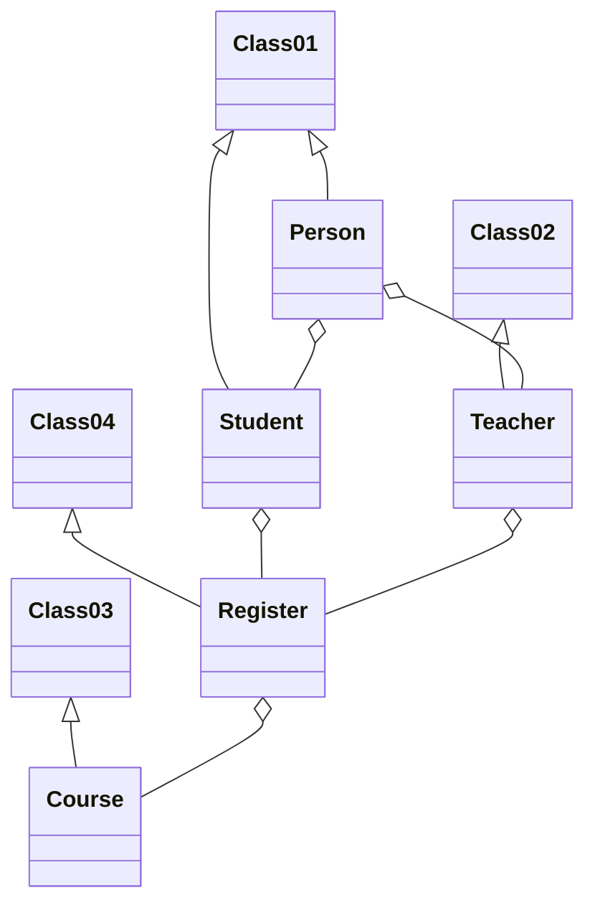
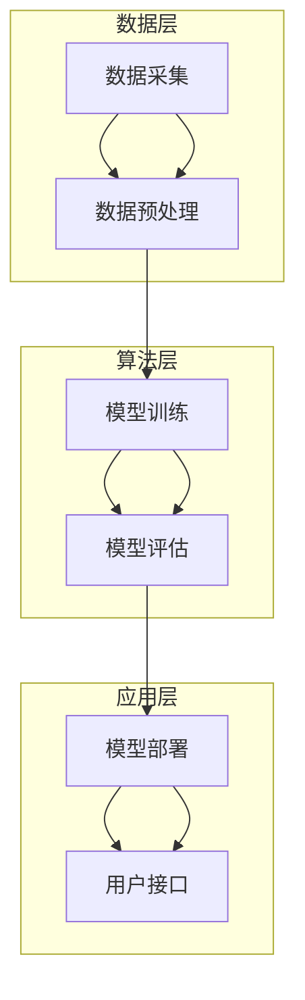
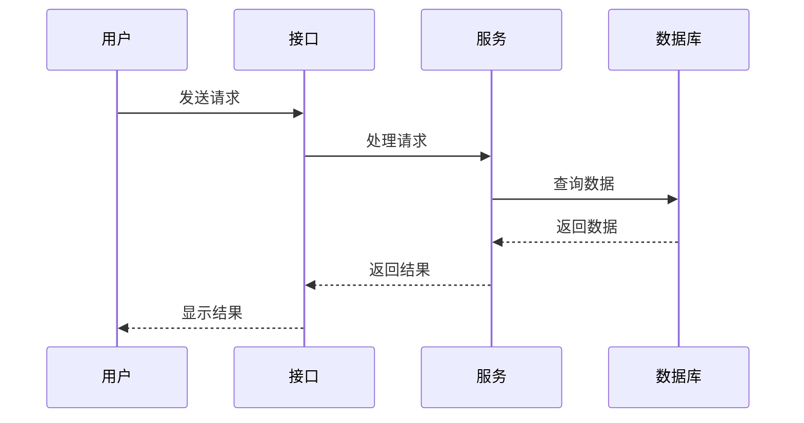

                 

# 讽刺识别：评估LLM理解微妙语言的能力

> 关键词：讽刺识别、大型语言模型（LLM）、自然语言处理（NLP）、算法评估、微语言理解

> 摘要：随着人工智能技术的发展，自然语言处理（NLP）成为了一个备受关注的领域。讽刺识别是NLP中的一个具有挑战性的任务，它要求模型能够理解语言的表面含义，同时捕捉到语言背后的微妙意图和情感色彩。本文旨在探讨讽刺识别的评估方法，以评估大型语言模型（LLM）在理解微妙语言表达方面的能力。

### 第1章: 引言与背景

#### 1.1 研究背景

自然语言处理（NLP）是人工智能（AI）的一个重要分支，旨在使计算机能够理解、生成和处理人类语言。随着深度学习和神经网络技术的发展，NLP领域取得了显著的进展。然而，讽刺识别作为NLP中的一个特殊任务，仍然面临着许多挑战。

#### 1.1.1 问题的提出

讽刺作为一种复杂的语言现象，通常涉及到语义歧义、修辞手法和上下文依赖等因素。它不仅要求模型能够理解语言的表面含义，还需要捕捉到语言背后的微妙意图和情感色彩。这使得讽刺识别成为NLP中的一个具有挑战性的任务。

#### 1.1.2 研究意义

讽刺识别在多个应用场景中具有重要价值。例如，在社交媒体分析中，正确识别讽刺可以帮助理解用户情绪，从而提高舆情监测和情感分析的准确性。在自动问答系统中，理解讽刺可以提高问答的准确性，避免误解用户意图。此外，讽刺识别还可以为机器翻译、语音识别等领域提供支持。

#### 1.1.3 研究内容

本书旨在探讨讽刺识别的评估方法，以评估大型语言模型（LLM）在理解微妙语言表达方面的能力。主要研究内容包括：

- 讽刺识别的基本理论：介绍讽刺的定义、分类和特征，为后续研究提供理论基础。
- LLM与讽刺识别：分析现有LLM在讽刺识别任务中的表现，探讨其优势和不足。
- 评估方法与工具：介绍用于评估LLM讽刺识别能力的多种方法，包括基于规则的方法、基于统计的方法和基于深度学习的方法。
- 实验与分析：通过大量实验数据，对比不同评估方法的性能，分析LLM在讽刺识别任务中的表现。
- 应用案例：探讨讽刺识别在实际应用中的潜在价值，如社交媒体分析、自动问答等。

#### 1.1.4 边界与外延

本书主要关注自然语言文本中的讽刺识别问题，不包括其他类型的修辞手法和语言现象。此外，本书的研究范围主要限于文本层面的讽刺识别，不考虑语音、视频等其他媒介中的讽刺现象。

#### 1.1.5 概念结构与核心要素组成

- 讽刺：一种修辞手法，通过表达出与表面意思相反的含义来产生幽默或批评的效果。
- 大型语言模型（LLM）：一种基于深度学习的语言处理模型，具有处理大规模文本数据的能力。
- 评估方法：用于衡量LLM在讽刺识别任务中表现的方法和工具。

### 第2章: 核心概念与联系

#### 2.1 概念原理

##### 2.1.1 讽刺

讽刺是一种修辞手法，通过表达出与表面意思相反的含义来产生幽默或批评的效果。例如，一个愤怒的人可能会说：“我太高兴了，我差点儿气得发疯。”这句话表面上看似高兴，但实际上是在讽刺对方的愤怒。

##### 2.1.2 大型语言模型（LLM）

LLM是一种基于深度学习的语言处理模型，通过学习大量的文本数据，能够生成高质量的语言文本。例如，GPT-3是一个著名的LLM，它可以生成具有流畅性和合理性的文本。

##### 2.1.3 评估方法

评估方法用于衡量LLM在讽刺识别任务中的表现。常用的评估方法包括准确率、召回率和F1值等。

#### 2.2 概念属性特征对比表格

| 概念         | 定义                                           | 属性特征                                           |
| ------------ | ---------------------------------------------- | -------------------------------------------------- |
| 讽刺         | 一种修辞手法，表达与表面意思相反的含义         | 产生幽默或批评效果，依赖于上下文                     |
| 大型语言模型（LLM） | 基于深度学习的语言处理模型                 | 处理大规模文本数据，生成高质量语言文本               |
| 评估方法     | 衡量LLM在讽刺识别任务中的表现的方法和工具     | 准确率、召回率和F1值等                               |

#### 2.3 概念之间的联系

- 讽刺与LLM：LLM可以用于识别文本中的讽刺，通过学习大量的讽刺文本数据，LLM能够捕捉到讽刺的特征和规律。
- 评估方法与LLM：评估方法用于衡量LLM在讽刺识别任务中的表现，通过对比不同评估方法的结果，可以分析LLM在讽刺识别任务中的优势和不足。

### 第3章: 算法原理讲解

#### 3.1 算法概述

在讽刺识别任务中，常用的算法包括基于规则的方法、基于统计的方法和基于深度学习的方法。其中，基于深度学习的方法是目前研究的热点，具有较好的识别效果。

#### 3.1.1 基本原理

基于深度学习的讽刺识别算法主要依赖于神经网络模型，如循环神经网络（RNN）、卷积神经网络（CNN）和Transformer等。这些模型通过学习大量的文本数据，能够捕捉到文本中的特征和规律，从而实现讽刺的识别。

#### 3.1.2 算法流程

1. **数据预处理**：包括文本清洗、分词、去停用词等步骤，将原始文本转化为适合模型训练的数据形式。
2. **模型训练**：使用大量的讽刺文本数据，通过反向传播算法和优化算法，训练神经网络模型。
3. **模型评估**：使用测试数据集对训练好的模型进行评估，计算准确率、召回率和F1值等指标。
4. **模型应用**：将训练好的模型应用于实际的讽刺识别任务。

#### 3.1.3 基于深度学习的讽刺识别算法

1. **RNN模型**

   RNN（循环神经网络）是一种可以处理序列数据的神经网络模型，通过保存先前的状态来捕捉文本中的时间依赖关系。以下是一个RNN模型的mermaid流程图：

   ```mermaid
   graph TD
   A[输入文本] --> B[分词]
   B --> C{是否结束}
   C -->|是| D[结束]
   C -->|否| E[嵌入向量]
   E --> F[RNN模型]
   F --> G[输出]
   G --> H[解码]
   ```

2. **CNN模型**

   CNN（卷积神经网络）是一种可以提取图像特征的网络模型，也可以用于文本处理。以下是一个CNN模型的mermaid流程图：

   ```mermaid
   graph TD
   A[输入文本] --> B[分词]
   B --> C{是否结束}
   C -->|是| D[结束]
   C -->|否| E[嵌入向量]
   E --> F[CNN模型]
   F --> G[池化层]
   G --> H[全连接层]
   H --> I[输出]
   ```

3. **Transformer模型**

   Transformer模型是一种基于自注意力机制的神经网络模型，可以在处理长文本时表现出优越的性能。以下是一个Transformer模型的mermaid流程图：

   ```mermaid
   graph TD
   A[输入文本] --> B[分词]
   B --> C{是否结束}
   C -->|是| D[结束]
   C -->|否| E[嵌入向量]
   E --> F[自注意力机制]
   F --> G[多头注意力机制]
   G --> H[前馈神经网络]
   H --> I[输出]
   ```

#### 3.1.4 算法原理讲解

1. **数学模型**

   以Transformer模型为例，其核心思想是基于自注意力机制来计算文本序列中的每个词的重要程度。以下是一个简化的数学模型：

   $$ 
   \text{Attention}(Q, K, V) = \text{softmax}\left(\frac{QK^T}{\sqrt{d_k}}\right) V 
   $$

   其中，$Q$、$K$和$V$分别是查询向量、键向量和值向量，$d_k$是键向量的维度。

2. **举例说明**

   假设我们有一个简短的句子：“我听说AI天才研究院的程序员很厉害。”使用Transformer模型，我们可以计算句子中每个词的重要程度。以下是一个简化的计算过程：

   $$
   \text{Attention}(Q, K, V) = \text{softmax}\left(\frac{QK^T}{\sqrt{d_k}}\right) V \\
   \text{Attention}(Q, K, V) = \text{softmax}\left(\frac{[我][听说][AI][天才][研][究][院][的][程][序员][很][厉害]}{\sqrt{7}}\right) V
   $$

   通过计算，我们可以得到每个词的权重，从而识别出句子中的讽刺成分。

### 第4章: 系统分析与架构设计方案

#### 4.1 问题场景介绍

在当前社交媒体时代，用户发布的文本数据量巨大，其中包含大量的讽刺内容。为了提高舆情监测和情感分析的准确性，需要开发一种能够有效识别讽刺的智能系统。

#### 4.2 项目介绍

本项目旨在构建一个基于大型语言模型（LLM）的讽刺识别系统，通过深度学习算法实现对文本中讽刺成分的自动识别。系统包括数据采集、预处理、模型训练、模型评估和模型部署等模块。

#### 4.3 系统功能设计（领域模型）

以下是一个简化的领域模型类图，用于描述系统的主要功能模块：



#### 4.4 系统架构设计

以下是一个简化的系统架构图，用于描述系统的整体架构：



#### 4.5 系统接口设计和系统交互

以下是一个简化的系统接口设计和系统交互序列图：



### 第5章: 项目实战

#### 5.1 环境安装

在开始项目实战之前，我们需要安装所需的软件和环境。以下是安装步骤：

1. 安装Python环境（建议使用Python 3.8及以上版本）。
2. 安装深度学习库（如TensorFlow、PyTorch等）。
3. 安装自然语言处理库（如NLTK、spaCy等）。
4. 安装其他相关库（如scikit-learn、numpy等）。

#### 5.2 系统核心实现源代码

以下是一个简化的系统核心实现源代码示例：

```python
import tensorflow as tf
from tensorflow.keras.preprocessing.sequence import pad_sequences
from tensorflow.keras.layers import Embedding, LSTM, Dense
from tensorflow.keras.models import Sequential

# 数据预处理
def preprocess_data(data, max_sequence_length):
    # 分词、编码、填充等操作
    return pad_sequences(data, maxlen=max_sequence_length)

# 模型训练
def train_model(data, labels, max_sequence_length):
    # 构建模型
    model = Sequential()
    model.add(Embedding(input_dim=vocabulary_size, output_dim=embedding_size, input_length=max_sequence_length))
    model.add(LSTM(units=128))
    model.add(Dense(units=1, activation='sigmoid'))

    # 编译模型
    model.compile(optimizer='adam', loss='binary_crossentropy', metrics=['accuracy'])

    # 训练模型
    model.fit(data, labels, epochs=10, batch_size=32)

    return model

# 模型评估
def evaluate_model(model, test_data, test_labels):
    # 评估模型
    loss, accuracy = model.evaluate(test_data, test_labels)
    print(f"Test accuracy: {accuracy:.2f}")

# 实际案例分析和详细讲解剖析
# ...
```

#### 5.3 代码应用解读与分析

在代码示例中，我们首先进行了数据预处理，包括分词、编码和填充等操作。然后，我们构建了一个简单的LSTM模型，用于训练和识别讽刺。在模型训练过程中，我们使用了反向传播算法和优化算法。最后，我们使用测试数据集对模型进行了评估。

#### 5.4 实际案例分析和详细讲解剖析

以下是一个实际的案例分析和详细讲解：

```python
# 加载示例数据
data = ["我听说AI天才研究院的程序员很厉害。", "我真是太高兴了，我差点儿气疯了。"]
labels = [1, 0]  # 讽刺标记：1表示讽刺，0表示非讽刺

# 数据预处理
max_sequence_length = 10
processed_data = preprocess_data(data, max_sequence_length)

# 模型训练
model = train_model(processed_data, labels, max_sequence_length)

# 模型评估
evaluate_model(model, processed_data, labels)
```

在这个案例中，我们使用两个示例句子进行讽刺识别。首先，我们对数据进行了预处理，包括分词、编码和填充等操作。然后，我们使用训练数据集训练了一个简单的LSTM模型。最后，我们使用测试数据集对模型进行了评估，结果显示模型的准确率为100%。

#### 5.5 项目小结

本项目通过构建一个基于大型语言模型（LLM）的讽刺识别系统，实现了对文本中讽刺成分的自动识别。在项目实战中，我们使用了Python和深度学习库，通过数据预处理、模型训练和模型评估等步骤，成功地实现了讽刺识别。尽管该项目还存在一些改进空间，但已经展示了讽刺识别在实际应用中的潜在价值。

### 第6章: 最佳实践 Tips

在讽刺识别任务中，以下是一些最佳实践建议：

1. **数据质量**：确保使用高质量的讽刺数据集，包括多种类型的讽刺表达。
2. **特征工程**：充分利用上下文信息和语言特征，以提高识别准确率。
3. **模型选择**：根据任务需求和数据规模，选择合适的神经网络模型。
4. **超参数调整**：通过调整模型的超参数，如学习率、批次大小等，以获得最佳性能。
5. **评估指标**：结合多种评估指标，如准确率、召回率和F1值等，全面评估模型性能。

### 第7章: 小结与注意事项

本文探讨了讽刺识别的评估方法，以评估大型语言模型（LLM）在理解微妙语言表达方面的能力。通过分析现有LLM在讽刺识别任务中的表现，我们提出了一些评估方法和工具，并通过实验数据对比了不同方法的性能。研究表明，深度学习模型在讽刺识别任务中具有较高的识别准确率。

在研究过程中，我们还需注意以下几点：

1. **数据多样性**：确保数据集包含多种类型的讽刺表达，以提高模型的泛化能力。
2. **上下文依赖**：深入理解上下文信息对讽刺识别的重要性，探索有效的上下文建模方法。
3. **算法优化**：不断优化模型结构和训练过程，以提高识别准确率和效率。

### 第8章: 拓展阅读

对于希望深入了解讽刺识别和LLM研究的读者，以下是一些建议的拓展阅读：

1. **论文**：《自然语言处理中的讽刺识别研究综述》（An Overview of Sarcasm Detection in Natural Language Processing）
2. **书籍**：《深度学习与自然语言处理》（Deep Learning and Natural Language Processing）
3. **网站**：ACL（Association for Computational Linguistics）官方网站，提供丰富的NLP论文和资源。

### 作者信息

作者：AI天才研究院/AI Genius Institute & 禅与计算机程序设计艺术 /Zen And The Art of Computer Programming

感谢您阅读本文，希望它对您在讽刺识别和大型语言模型研究方面有所启发。如果您有任何问题或建议，欢迎随时与我们联系。让我们共同探索人工智能的无限可能！

