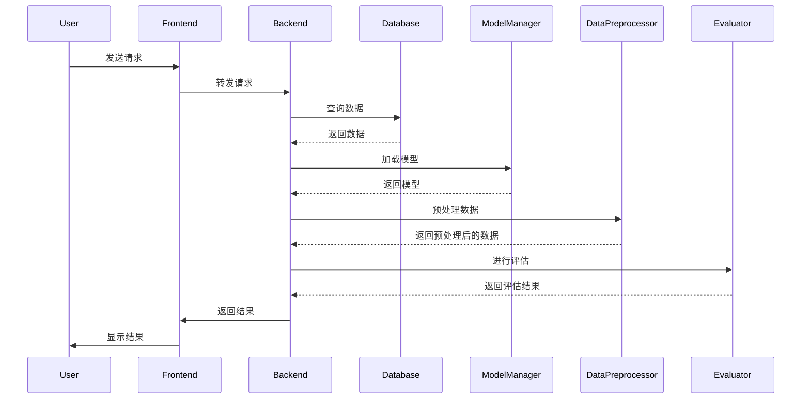

                 

## 1.1 问题背景

随着人工智能技术的飞速发展，自然语言处理（NLP）逐渐成为研究热点。其中，大型语言模型（Large Language Model，简称LLM）在诸多领域展现出强大的能力。LLM能够通过深度学习，对海量文本数据进行分析和建模，从而实现文本生成、文本分类、情感分析等多种功能。

然而，LLM的应用不仅需要高效且准确的模型，还需要一个完善的评测系统来保障其性能。评测系统对于LLM来说至关重要，因为它不仅能衡量模型的性能，还能为模型的优化和改进提供依据。当前，随着LLM技术的不断进步，传统的评测方法已经无法满足需求，这给评测系统的设计和实现带来了新的挑战。

首先，LLM的训练数据量庞大，参数规模达到数十亿甚至千亿级别，这使得传统的评测方法在计算效率和准确性上面临巨大压力。其次，LLM在语言理解、文本生成等方面的能力显著提升，传统的评测指标已经无法全面反映模型的性能。此外，随着多模态数据的兴起，评测系统还需要具备处理多样化数据类型的能力。

综上所述，设计一个高效、准确且全面的基于LLM的评测系统，已经成为当前人工智能领域的一个关键问题。为了应对这一挑战，我们需要深入分析LLM评测的现状与挑战，明确LLM评测的重要性，并了解LLM评测系统的发展历程。

### 1.1.1 语言模型评测的现状与挑战

当前，语言模型评测主要集中在两个方面：一是评估模型在特定任务上的性能，二是评估模型在不同数据集上的泛化能力。在评估模型性能方面，研究者们广泛采用自动化评测工具和人工评测相结合的方式。自动化评测工具如BLEU、ROUGE、METEOR等，通过计算生成文本与标准文本之间的相似度来评估模型的文本生成能力。这些工具在一定程度上能够量化模型的表现，但往往存在一定的局限性。例如，BLEU算法基于词级匹配，忽视了语义信息的重要性；ROUGE算法对长文本的处理效果较差；METEOR算法则对文本生成中的创新性不够敏感。

人工评测在语言模型评估中同样占据重要地位。人工评测能够更全面地评估模型的表现，尤其是对于复杂的文本生成任务，如对话系统、文本摘要等。然而，人工评测耗时费力，且主观性较强，难以保证评估结果的公平性和一致性。此外，随着语言模型规模的不断扩大，人工评测的成本也在不断上升。

在评估模型泛化能力方面，研究者们通常采用交叉验证、留出法、自助法等传统机器学习中的评估方法。这些方法能够在一定程度上保证模型的泛化性能，但往往无法全面反映模型在不同数据集上的表现。特别是在多模态数据场景中，传统方法难以处理不同数据类型之间的复杂关系，导致评估结果不够准确。

除了以上挑战，语言模型评测还面临数据质量和评测标准的不统一问题。数据质量直接影响到评测结果的可靠性，而评测标准的不统一则会导致不同研究者在评估模型时采用不同的方法，从而影响评估结果的可比性。

综上所述，当前语言模型评测的现状与挑战主要包括以下几个方面：

1. **自动化评测工具的局限性**：现有自动化评测工具在处理复杂文本生成任务时，难以全面反映模型的性能。

2. **人工评测的成本和主观性**：人工评测虽然能够更全面地评估模型的表现，但成本高、效率低，且主观性较强。

3. **模型泛化能力的评估难度**：传统评估方法在多模态数据场景中难以发挥作用，无法全面反映模型在不同数据集上的表现。

4. **数据质量和评测标准的不统一**：数据质量和评测标准的不统一影响了评测结果的可比性和可靠性。

面对这些挑战，设计一个基于LLM的评测系统显得尤为重要。该系统需要能够克服现有评测工具的局限性，兼顾自动化评测和人工评测的优点，同时提高模型的泛化能力，并确保数据质量和评测标准的统一。

### 1.1.2 LLM评测的重要性

LLM评测的重要性不言而喻。首先，LLM作为一种高度复杂的模型，其性能评估直接关系到实际应用的效果。一个性能优异的LLM可以显著提升文本生成、对话系统、文本摘要等任务的表现，从而带来更高的用户体验和商业价值。相反，一个性能不佳的LLM可能导致任务失败，甚至产生误导性结果，带来严重的后果。

其次，LLM评测能够为模型的优化和改进提供科学依据。通过评估，我们可以识别模型的不足之处，从而有针对性地进行调整和优化。例如，通过分析评测结果，我们可以发现模型在特定类型文本上的生成能力较弱，进而调整训练策略，增加相关数据的训练样本，或修改模型结构，提升模型在这些方面的表现。

此外，LLM评测还有助于提高模型的可靠性和安全性。在关键应用场景中，如金融、医疗、法律等领域，LLM生成的文本可能会直接影响决策和结果。因此，确保LLM生成的文本质量至关重要。通过科学的评测，我们可以确保LLM在关键任务上的可靠性和安全性，降低潜在的风险。

总之，LLM评测不仅是衡量模型性能的关键环节，也是优化和改进模型的重要手段。它不仅关系到模型的实际应用效果，还直接影响到模型的可靠性和安全性。因此，设计一个高效、准确的LLM评测系统，对于推动人工智能技术的发展具有重要意义。

### 1.1.3 LLM评测系统的发展历程

LLM评测系统的发展历程可以追溯到早期的小型语言模型。早期的语言模型，如Word2Vec和GloVe，主要通过词汇层面的特征提取来实现文本处理。这一时期的评测系统主要依赖词汇匹配和相似度计算，如BLEU和ROUGE等指标，这些方法主要关注词汇和句法层面的相似度。然而，这些方法在处理语义信息时存在局限性，难以全面评估复杂语言模型的表现。

随着深度学习技术的发展，神经网络语言模型（如LSTM、GRU）逐渐取代了传统的词向量模型。这一时期的评测系统开始引入更多基于语义的评估方法，如BERTScore和Sari等。这些方法能够更好地捕捉文本的语义信息，从而提高评测的准确性。然而，由于深度学习模型参数规模庞大，计算效率成为一大挑战，这限制了这些方法的广泛应用。

近年来，随着Transformer模型的兴起，LLM得到了极大的发展。Transformer模型通过自注意力机制，能够在处理长文本和复杂语义方面表现出色。这一时期，评测系统进一步趋向于综合多种评估方法，如人类评估、自动化评测和跨领域评估。人类评估能够提供最直观的模型表现，但成本高、效率低；自动化评测则通过算法计算，实现了高效、准确的评估。跨领域评估则通过在不同数据集上的泛化性能来衡量模型的表现。

总体来看，LLM评测系统的发展历程反映了技术进步对评测方法的推动作用。从词汇匹配到语义分析，从单一指标到综合评估，LLM评测系统不断追求更准确、更全面的评估体系。然而，随着模型复杂度的增加，评测系统面临的挑战也在不断升级。未来，随着多模态数据的兴起，LLM评测系统需要具备处理多样化数据类型的能力，以应对更加复杂的应用场景。

### 1.2 核心概念

在设计基于LLM的评测系统时，我们需要明确几个核心概念，包括LLM的基本概念、评测系统的核心原则以及LLM评测的关键指标。这些概念不仅为我们的设计提供了理论基础，也为实际应用中的性能评估提供了指导。

#### 1.2.1 LLM的基本概念

大型语言模型（Large Language Model，简称LLM）是基于深度学习的自然语言处理模型，能够对文本数据进行建模和生成。LLM的核心思想是通过训练模型，使其能够理解和生成自然语言。典型的LLM模型包括GPT、BERT、T5等，它们通过自注意力机制（Self-Attention Mechanism）和多层神经网络结构，对输入的文本序列进行建模。

LLM的基本组成包括以下几个关键部分：

1. **词嵌入（Word Embedding）**：将文本中的每个单词映射到高维空间中的向量表示。这种向量表示能够捕捉单词的语义信息。
2. **编码器（Encoder）**：将输入的文本序列编码成一个固定长度的向量表示。在Transformer模型中，编码器通过自注意力机制，对输入的文本序列进行处理。
3. **解码器（Decoder）**：根据编码器的输出，生成文本序列。在Transformer模型中，解码器也通过自注意力机制，对编码器的输出进行解码，生成文本。

LLM的运行过程主要包括以下几个步骤：

1. **输入处理**：将输入的文本序列转换为词嵌入向量。
2. **编码**：通过编码器，对词嵌入向量进行处理，生成编码表示。
3. **解码**：通过解码器，根据编码表示，生成输出文本序列。

LLM的核心优势在于其强大的文本生成和语言理解能力。通过大量的预训练数据，LLM能够学习到复杂的语言模式，从而在多种自然语言处理任务中表现出色。

#### 1.2.2 评测系统的核心原则

一个高效的LLM评测系统需要遵循以下核心原则：

1. **客观性**：评测结果应尽可能客观，避免主观偏见。这意味着评测系统应采用科学、标准化的方法进行评估，以确保评估结果的公正性和一致性。
2. **全面性**：评测系统应能够全面评估LLM在各种任务上的性能，包括文本生成、文本分类、情感分析等。此外，评测系统还应考虑模型在不同数据集上的泛化能力，以评估其应用范围。
3. **高效性**：评测系统需要具备高效的评估能力，能够在较短时间内完成大量模型的评估。这要求评测系统在算法设计、计算资源利用等方面进行优化。
4. **灵活性**：评测系统应具备一定的灵活性，能够适应不同的评估需求。例如，可以根据不同的任务类型、数据集特点调整评估方法和指标，以获得更准确的评估结果。
5. **可扩展性**：随着技术的发展和需求的变化，评测系统应具备良好的扩展性，能够方便地集成新的评估方法和技术。

#### 1.2.3 LLM评测的关键指标

在LLM评测中，关键指标的选择至关重要。以下是一些常用的评测指标及其作用：

1. **BLEU（Bilingual Evaluation Understudy）**：BLEU是一种基于词汇匹配的自动评估指标，通过比较生成文本和参考文本之间的重叠度来评估文本生成质量。尽管BLEU在评估简单文本生成任务时表现良好，但在复杂文本生成任务中存在一定的局限性。
   
2. **ROUGE（Recall-Oriented Understudy for Gisting Evaluation）**：ROUGE是一种基于句法相似度的评估指标，通过计算生成文本和参考文本之间的重叠句子数量来评估文本生成质量。ROUGE在处理长文本时表现较好，但在捕捉语义信息方面仍有不足。

3. **METEOR（Metric for Evaluation of Translation with Explicit ORdering）**：METEOR是一种综合评估指标，考虑了词汇、语法和语义信息。它通过计算生成文本和参考文本之间的相似度来评估文本生成质量。METEOR在评估多样化和创新性的文本生成任务时表现较好。

4. **BERTScore**：BERTScore利用BERT模型对文本进行编码，并通过计算编码向量之间的余弦相似度来评估文本生成质量。BERTScore能够更好地捕捉语义信息，特别适用于长文本生成任务。

5. **人类评估**：尽管自动化评估指标在评估LLM性能方面具有高效性和一致性优势，但人类评估在评估复杂语言任务方面仍然具有不可替代的作用。人类评估员能够更全面地理解和评估文本生成质量，提供直观、细致的反馈。

综上所述，LLM评测系统的核心概念包括LLM的基本概念、评测系统的核心原则和关键指标。理解这些概念对于设计一个高效、准确的评测系统至关重要。在接下来的部分中，我们将进一步探讨LLM评测系统的设计原则和实现方法。

### 1.2.1 LLM的基本概念

为了深入理解LLM评测系统，我们首先需要明确LLM的基本概念。LLM，即大型语言模型，是一种通过深度学习技术训练的复杂模型，它能够理解和生成自然语言。LLM的核心在于其庞大的参数规模和海量的训练数据，这使得模型能够捕捉到文本中的复杂模式和语义信息。

#### 基本构成

LLM通常由以下几个关键部分组成：

1. **词嵌入（Word Embedding）**：词嵌入是将文本中的单词映射到高维向量空间的过程。通过词嵌入，模型能够将抽象的文本信息转换为可处理的数值形式。常见的词嵌入方法包括Word2Vec、GloVe等。

2. **编码器（Encoder）**：编码器负责对输入文本序列进行编码，将其转换为一个固定长度的向量表示。在编码过程中，模型会利用自注意力机制（Self-Attention Mechanism）来关注文本序列中的关键信息。典型的编码器结构包括LSTM（长短时记忆网络）、GRU（门控循环单元）和Transformer等。

3. **解码器（Decoder）**：解码器根据编码器的输出，生成输出文本序列。解码器同样使用自注意力机制，对编码器的输出进行处理，从而生成自然流畅的文本。在生成文本的过程中，解码器通常采用贪心策略或抽样策略。

#### 工作原理

LLM的工作原理可以分为以下几个步骤：

1. **输入处理**：首先，模型将输入的文本序列转换为词嵌入向量。词嵌入向量不仅保留了单词的语义信息，还能够捕捉到词与词之间的关系。

2. **编码**：编码器将词嵌入向量序列进行处理，生成一个固定长度的编码表示。在这个过程中，自注意力机制发挥了关键作用，模型会根据上下文信息，动态调整对各个单词的注意力权重，从而更好地捕捉文本的语义信息。

3. **解码**：解码器根据编码表示，逐步生成输出文本序列。解码过程同样使用自注意力机制，模型会根据已经生成的部分文本，以及编码表示，生成下一个单词。通过多次迭代，解码器最终生成完整的输出文本。

#### 特点与应用

LLM具有以下几个显著特点：

1. **强大的语言理解能力**：LLM能够通过深度学习，从大量文本数据中学习到复杂的语言模式和语义信息。这使得模型在文本分类、情感分析、问答系统等任务中表现出色。

2. **高度灵活的文本生成能力**：LLM能够根据输入的提示，生成高质量、多样化的文本。这使得模型在自动写作、对话系统、机器翻译等应用场景中具有广泛的应用前景。

3. **处理长文本的能力**：与传统模型相比，LLM能够更好地处理长文本，从而实现更准确的文本生成和理解。

4. **参数规模大**：LLM通常具有数十亿到千亿级别的参数规模，这使得模型能够捕捉到更多的文本信息，从而提升模型的性能。

在实际应用中，LLM在多种自然语言处理任务中展现出强大的能力：

1. **文本生成**：LLM能够生成高质量的文章、新闻、故事等。例如，GPT-3能够在各种主题上生成连贯、自然的文本。

2. **对话系统**：LLM能够构建智能对话系统，与用户进行自然、流畅的对话。例如，OpenAI的GPT-3已经在多个应用场景中实现了高质量的对话生成。

3. **文本分类**：LLM能够对文本进行分类，识别文本的主题和情感。这使得模型在舆情监测、新闻推荐等应用中具有重要价值。

4. **机器翻译**：LLM能够在多种语言之间进行翻译，实现高质量的跨语言文本转换。

总之，LLM作为一种高度复杂的模型，具有强大的语言理解和生成能力。在自然语言处理领域，LLM已经成为推动技术进步的重要力量。在设计基于LLM的评测系统时，理解LLM的基本概念和工作原理至关重要。

### 1.2.2 评测系统的核心原则

一个高效且全面的评测系统是确保LLM性能评估准确性和可靠性的关键。在设计和实现LLM评测系统时，我们需要遵循一系列核心原则，以确保评测系统的科学性、公正性和实用性。

#### 1. 数据准备

数据准备是评测系统的基础。一个高质量的数据集能够为模型提供丰富的训练素材，从而提升模型的表现。以下是数据准备过程中的几个关键步骤：

1. **数据来源**：数据来源应多样化，涵盖不同领域和主题。这有助于模型在不同场景下的泛化能力。数据来源可以包括公开数据集、公司内部数据以及第三方数据服务。

2. **数据预处理**：数据预处理是确保数据质量的重要环节。预处理步骤包括文本清洗、去噪、分词、词性标注等。通过这些步骤，可以消除数据中的噪声，提高数据的一致性和可解释性。

3. **数据质量评估**：数据质量直接影响模型的性能。在数据预处理后，我们需要对数据质量进行评估。常用的方法包括统计特征分析、异常值检测和数据完整性检查等。确保数据质量，可以有效避免模型过拟合和评估偏差。

#### 2. 评测指标设计

评测指标是评估模型性能的重要工具。科学、全面的评测指标能够全面反映模型在各种任务上的表现。以下是评测指标设计过程中的几个关键点：

1. **指标选择**：选择适合特定任务的评测指标。例如，在文本生成任务中，可以采用BLEU、ROUGE、BERTScore等指标；在文本分类任务中，可以采用准确率、召回率、F1值等指标。

2. **指标计算方法**：确保指标计算方法的准确性和一致性。例如，在计算BLEU指标时，需要注意词汇匹配的精度和召回率。在计算BERTScore时，需要确保编码向量计算和相似度计算的准确性。

3. **指标权重分配**：合理分配不同指标的权重。例如，在多任务场景中，可以根据任务的重要性和模型的表现，调整不同指标的权重，以获得更全面的评估结果。

#### 3. 评测流程设计

评测流程设计是确保评测系统高效运行的关键。一个科学的评测流程能够确保模型在多个数据集上的全面评估。以下是评测流程设计过程中的几个关键步骤：

1. **评测流程概述**：明确评测系统的整体流程，包括数据准备、模型训练、模型评估和结果分析等步骤。

2. **评测步骤细化**：对每个评测步骤进行详细设计，确保每一步都有明确的任务和目标。例如，在模型训练阶段，可以设置训练数据集、验证数据集和测试数据集，并调整训练策略和参数。

3. **评测结果分析**：对评测结果进行详细分析，识别模型的优点和不足。通过对比不同模型的表现，可以找到优化方向和改进策略。

#### 4. 结果分析

结果分析是评测系统的关键环节。通过分析评测结果，我们可以全面了解模型的表现，并为模型优化提供依据。以下是结果分析过程中的几个关键点：

1. **结果可视化**：通过图表和可视化工具，展示评测结果。例如，使用散点图、折线图等，展示模型在不同数据集上的性能。

2. **趋势分析**：分析评测结果的趋势，识别模型的改进方向。例如，观察模型在不同训练数据量、不同训练时间下的性能变化，找出最佳训练策略。

3. **异常值处理**：识别和解决评测结果中的异常值。异常值可能由数据问题、模型问题或评测工具问题导致，需要针对性地进行处理。

4. **对比分析**：对比不同模型、不同参数设置下的性能，找出最优方案。例如，通过对比GPT和BERT在文本生成任务中的性能，选择更合适的模型。

综上所述，设计一个基于LLM的评测系统，需要遵循数据准备、评测指标设计、评测流程设计和结果分析等核心原则。通过科学、系统的方法，我们可以确保评测系统的准确性和可靠性，为LLM的优化和改进提供有力支持。

### 1.2.3 LLM评测系统的关键指标

在设计基于LLM的评测系统时，选择合适的评估指标至关重要。这些指标不仅能帮助我们衡量模型在不同任务上的性能，还能为模型的优化提供方向。以下介绍几种常用的LLM评测指标及其适用性。

#### 1. BLEU（Bilingual Evaluation Understudy）

BLEU是一种基于词汇匹配的自动评估指标，广泛用于机器翻译任务的评估。BLEU通过计算生成文本与参考文本之间的重叠度来评估文本质量。BLEU的主要方法包括：

- **N-gram匹配**：BLEU通过统计生成文本和参考文本中相同N-gram（连续的N个单词）的出现频率来评估文本相似度。N-gram的大小通常设置为2到4。
- **长度惩罚**：由于长文本可能包含更多的重叠信息，BLEU会根据生成文本的长度对评估分数进行惩罚。
- **多样性惩罚**：为了防止模型生成重复的文本，BLEU会对生成文本中的单词多样性进行评估。

BLEU的优点在于其简单易用，计算效率高，但缺点在于它忽视了语义信息，对于复杂的文本生成任务效果有限。

#### 2. ROUGE（Recall-Oriented Understudy for Gisting Evaluation）

ROUGE是一种基于句法相似度的评估指标，特别适用于自动摘要和机器翻译任务。ROUGE的主要方法包括：

- **句法匹配**：ROUGE通过比较生成文本和参考文本之间的句法结构来评估文本相似度。它使用多种句法特征，如单词序列、单词匹配和句法模式。
- **基于词的相似度**：ROUGE还会计算生成文本和参考文本中单词的相似度，确保评估结果不仅基于句法结构，还考虑单词的语义信息。

ROUGE的优点在于其能够较好地评估文本生成任务，但缺点在于其计算复杂度较高，特别是在处理长文本时。

#### 3. BERTScore

BERTScore利用BERT模型对文本进行编码，并通过计算编码向量之间的余弦相似度来评估文本生成质量。BERTScore的主要方法包括：

- **文本编码**：首先，使用预训练的BERT模型对生成文本和参考文本进行编码，得到固定长度的向量表示。
- **余弦相似度**：然后，通过计算生成文本和参考文本编码向量之间的余弦相似度，评估文本的相似度。

BERTScore的优点在于其能够更好地捕捉文本的语义信息，适用于长文本生成任务。缺点在于计算资源需求较高，特别是在处理大规模数据时。

#### 4. 指标选择与权重分配

在选择评测指标时，需要考虑任务类型、数据集特点和评估需求。以下是一些常见的指标选择和权重分配策略：

- **文本生成任务**：对于文本生成任务，BLEU和ROUGE是常用的指标。可以通过对BLEU和ROUGE的加权平均，获得一个综合评估分数。例如，假设BLEU得分为B，ROUGE-L得分为R，则综合评估分数可以表示为 \( \frac{1.25B + R}{1.25 + 1} \)。
- **文本分类任务**：对于文本分类任务，常用的指标包括准确率、召回率、F1值等。可以根据不同任务的重要性，为这些指标分配不同的权重。例如，假设分类任务中准确率的重要性高于召回率，可以将准确率的权重设置为0.7，召回率的权重设置为0.3。
- **多任务场景**：在多任务场景中，可以综合不同任务的评价指标，通过加权平均或层次分析法（AHP）等方法，得到一个整体评估分数。例如，假设文本生成任务和文本分类任务的权重分别为0.6和0.4，则综合评估分数可以表示为 \( 0.6 \times \text{文本生成评估分数} + 0.4 \times \text{文本分类评估分数} \)。

总之，合理选择和分配评测指标对于评估LLM的性能至关重要。通过结合多种评估指标，我们可以获得更全面、准确的评估结果，为模型的优化提供有力支持。

### 1.2.4 概念属性特征对比

在设计基于LLM的评测系统时，理解LLM与传统模型的区别至关重要。以下通过一个表格详细对比LLM和传统模型在训练数据量、参数规模和语言理解能力等方面的特征。

| 特征         | LLM                     | 传统模型                    |
| ------------ | ----------------------- | ---------------------------- |
| **训练数据量** | 海量（数十亿至千亿文本） | 较少或有限（数百万至数千万文本） |
| **参数规模**   | 数十亿至千亿级别       | 数百万至亿级别               |
| **语言理解能力** | 强（能捕捉复杂语义和语言模式） | 弱（难以处理长文本和复杂语义）   |

通过对比可以发现，LLM在训练数据量和参数规模上显著优于传统模型，这使得LLM能够更好地理解和生成自然语言。此外，LLM在语言理解能力方面也具有显著优势，能够处理更复杂的语言任务。这些特征使得LLM在自然语言处理领域具有更高的应用潜力。

### 1.2.5 LLM评测系统的ER实体关系图

为了更清晰地描述LLM评测系统的各个组成部分及其关系，我们可以使用ER（实体关系）图来展示系统的整体架构。以下是一个简单的ER图，展示了LLM评测系统的关键实体和它们之间的关系。

```mermaid
erDiagram
  ALM -->|评测|测评指标
  测评指标 -->|影响|评价指标
  ALM -->|依赖|训练数据
  测评指标 -->|关联|测试数据
```

#### 关键实体说明

1. **大型语言模型（ALM）**：是评测系统的核心实体，负责生成和评估文本。
2. **测评指标**：用于衡量模型在特定任务上的性能。包括BLEU、ROUGE、BERTScore等。
3. **评价指标**：根据测评指标计算出的具体数值，用于评估模型的实际表现。
4. **训练数据**：用于训练LLM的数据集，确保模型具有良好的泛化能力。
5. **测试数据**：用于评估模型性能的数据集，确保评估结果能够反映模型的真实性能。

通过ER图，我们可以更直观地理解LLM评测系统的整体架构，以及各个实体之间的相互关系。这有助于我们在设计评测系统时，更清晰地划分任务，确保系统的高效运行。

### 2.1 数据准备

数据准备是设计基于LLM的评测系统的关键步骤，因为数据的质量直接影响到模型训练和评估的效果。以下详细阐述数据准备的各个环节，包括数据来源、预处理步骤以及数据质量评估方法。

#### 2.1.1 数据来源

一个高效且全面的评测系统需要多样化的数据来源，以确保模型能够适应各种应用场景。数据来源可以包括以下几个渠道：

1. **公开数据集**：公开数据集是评测系统的首选数据源，如GLUE、WikiText、AG News等。这些数据集涵盖了多种自然语言处理任务，提供了丰富的训练素材。
2. **公司内部数据**：公司内部数据包括用户生成的内容、产品评论、公司公告等。这些数据可以用于特定业务场景的评测，有助于提升模型在实际应用中的性能。
3. **第三方数据服务**：第三方数据服务提供了丰富的行业数据，如新闻、学术论文、社交媒体等。这些数据可以补充公开数据集的不足，为模型提供更全面的数据支持。
4. **定制数据集**：根据特定任务需求，可以定制数据集。例如，对于对话系统，可以收集实际对话记录；对于文本摘要，可以收集新闻文章和对应的摘要文本。

在选取数据时，需要考虑数据的质量、多样性、覆盖范围和相关性。高质量的数据集应具有丰富的信息量、清晰的结构和准确的标注。

#### 2.1.2 数据预处理

数据预处理是确保数据质量的关键步骤，包括文本清洗、去噪、分词、词性标注等。以下是一些常用的数据预处理方法：

1. **文本清洗**：去除文本中的无关信息，如HTML标签、特殊字符和停用词。停用词是常见的数据噪声，对模型训练和评估的影响较大，因此需要从数据中去除。
2. **去噪**：去除数据中的噪声，如拼写错误、语法错误和异常值。去噪可以通过 spell-checker、语法分析工具等方法实现。
3. **分词**：将文本分解为单词或词汇单元。分词方法包括基于词典的分词、基于统计的分词和基于深度学习的分词。基于深度学习的分词方法，如BERT、GPT等，能够更好地捕捉文本中的语义信息。
4. **词性标注**：对文本中的每个单词进行词性标注，如名词、动词、形容词等。词性标注有助于模型更好地理解文本的语义结构。
5. **标准化**：统一数据格式，如统一编码（UTF-8）、统一标点符号等。标准化有助于提高数据的一致性和可处理性。

#### 2.1.3 数据质量评估

数据质量评估是确保数据集可靠性和有效性的关键环节。以下是一些常用的数据质量评估方法：

1. **一致性评估**：检查数据集中是否存在不一致的标注或格式。例如，同一类别的数据是否遵循相同的标注规则。
2. **完整性评估**：检查数据集中是否存在缺失值或异常值。例如，是否所有样本都有完整的标注信息。
3. **可靠性评估**：通过交叉验证、误差分析等方法，评估标注者的可靠性。例如，计算标注者之间的一致性比率，识别潜在的标注错误。
4. **代表性评估**：评估数据集是否能够代表实际应用场景。例如，通过分析数据集的分布，确保不同类别的样本比例合理。

通过以上步骤，我们可以确保数据的质量，从而为LLM评测系统提供可靠的训练和评估数据。高质量的数据是提升模型性能和评估结果准确性的基础，因此在数据准备阶段必须投入足够的精力。

### 2.2 评测指标设计

在基于LLM的评测系统中，评测指标的设计至关重要。这些指标不仅用于评估模型在不同任务上的性能，还为模型的优化和改进提供了方向。以下是评测指标设计的几个关键步骤：指标选择、计算方法以及权重分配。

#### 2.2.1 指标选择

选择合适的评测指标是确保评估结果准确性的第一步。以下是几种常用的评测指标及其适用性：

1. **BLEU（Bilingual Evaluation Understudy）**：BLEU是一种基于词汇匹配的自动评估指标，广泛用于机器翻译和文本生成任务。BLEU通过比较生成文本与参考文本之间的N-gram重叠度来评估文本质量。虽然BLEU在评估简单文本生成任务时效果较好，但在评估复杂文本生成任务时存在一定的局限性。

2. **ROUGE（Recall-Oriented Understudy for Gisting Evaluation）**：ROUGE是一种基于句法相似度的评估指标，特别适用于自动摘要和文本分类任务。ROUGE通过计算生成文本与参考文本之间的句法结构相似度来评估文本质量。ROUGE-L是ROUGE的常用版本，它考虑最长公共子序列（LCS）。

3. **BERTScore**：BERTScore是一种利用BERT模型对文本进行编码，并通过计算编码向量之间的余弦相似度来评估文本生成质量的指标。BERTScore能够更好地捕捉文本的语义信息，特别适用于长文本生成任务。

4. **人类评估**：虽然自动化评测指标在评估效率和一致性方面具有优势，但人类评估在评估复杂语言任务时仍然具有不可替代的作用。人类评估员能够提供更全面、直观的评估反馈，但需要大量的人力资源。

在选择评测指标时，应考虑任务类型、数据集特点和应用场景。例如，对于文本生成任务，可以同时采用BLEU、ROUGE和BERTScore等指标，以获得更全面的评估结果。对于文本分类任务，可以采用准确率、召回率和F1值等指标。

#### 2.2.2 计算方法

确定评测指标的计算方法是确保评估结果准确性的关键。以下是几种常用评测指标的详细计算方法：

1. **BLEU**：BLEU的计算方法包括N-gram匹配、长度惩罚和多样性惩罚。具体步骤如下：

   - **N-gram匹配**：计算生成文本和参考文本中相同N-gram的数量，分别记为NGen和NRef。
   - **长度惩罚**：根据生成文本的长度，计算长度惩罚系数P Len。长度惩罚系数通常设置为1 - (1 - LRef/LGen)^k，其中LRef和LGen分别为参考文本和生成文本的长度，k为惩罚因子，通常取值为0.1至0.25。
   - **多样性惩罚**：计算生成文本中不同N-gram的数量，分别记为NDiv。多样性惩罚系数通常设置为1 - (NDiv/NRef)^(1/k')，其中k'为多样性惩罚因子，通常取值为0.75至1.25。

   BLEU分数的计算公式为：

   $$ \text{BLEU} = 1 - \text{P}_{\text{BLEU}} \times \text{P}_{\text{len}} \times \text{P}_{\text{div}} $$

2. **ROUGE**：ROUGE的计算方法包括句法匹配和基于词的相似度。具体步骤如下：

   - **句法匹配**：计算生成文本和参考文本之间的最长公共子序列（LCS）长度，记为LCS。
   - **基于词的相似度**：计算生成文本和参考文本之间的词语匹配率，记为R词。

   ROUGE-L分数的计算公式为：

   $$ \text{ROUGE-L} = \frac{\text{LCS}}{\max(\text{LGen}, \text{LRef})} $$

   其中LGen和LRef分别为生成文本和参考文本的长度。

3. **BERTScore**：BERTScore的计算方法包括文本编码和余弦相似度。具体步骤如下：

   - **文本编码**：使用预训练的BERT模型对生成文本和参考文本进行编码，得到固定长度的向量表示。
   - **余弦相似度**：计算生成文本和参考文本编码向量之间的余弦相似度。

   BERTScore的计算公式为：

   $$ \text{BERTScore} = \frac{\text{cosine\_similarity}}{\max(\text{LGen}, \text{LRef})} $$

   其中cosine_similarity为生成文本和参考文本编码向量之间的余弦相似度。

#### 2.2.3 指标权重分配

为了获得更全面的评估结果，通常需要结合多种评测指标。合理分配不同指标的权重可以确保评估结果的全面性和准确性。以下是一些常用的权重分配策略：

1. **基于指标重要性**：根据任务类型和评估需求，为不同指标分配不同的权重。例如，对于文本生成任务，可以设置BLEU和ROUGE的权重较高，BERTScore的权重较低。

2. **基于评估结果**：根据历史评估数据，为不同指标设置不同的权重。例如，如果BLEU在历史评估中表现较好，可以适当提高其权重。

3. **层次分析法（AHP）**：通过层次分析法，将任务分解为多个子任务，为每个子任务分配权重，然后结合子任务的评估结果，计算整体评估分数。

合理分配指标权重有助于平衡不同指标之间的差异，提高评估结果的准确性和可靠性。通过科学、系统的指标权重分配策略，我们可以获得更全面、准确的评估结果，为LLM评测系统的设计和优化提供有力支持。

### 2.3 评测流程设计

设计一个高效、科学的评测流程是确保基于LLM的评测系统能够准确、全面地评估模型性能的关键。评测流程包括评测流程概述、评测步骤细化以及评测结果分析。以下是对各步骤的详细阐述。

#### 2.3.1 评测流程概述

基于LLM的评测流程可以分为以下几个主要步骤：

1. **数据准备**：收集和整理用于评测的数据集，包括训练数据集、验证数据集和测试数据集。确保数据集的质量和多样性，以满足不同评估任务的需求。
2. **模型训练**：使用训练数据集对LLM进行训练，生成基础模型。在训练过程中，可以调整模型参数，优化模型结构，以提高模型性能。
3. **模型评估**：使用验证数据集对训练好的模型进行初步评估，通过计算各种评测指标（如BLEU、ROUGE、BERTScore等），评估模型在不同任务上的表现。
4. **结果分析**：对评估结果进行详细分析，识别模型的优点和不足。通过对比不同模型的表现，找出优化方向和改进策略。
5. **模型优化**：根据评估结果，对模型进行进一步优化。可以调整训练策略、模型参数或增加训练数据，以提升模型性能。
6. **再次评估**：在模型优化后，使用测试数据集对模型进行最终评估，确保模型在真实应用场景中的表现。

#### 2.3.2 评测步骤细化

在具体实施评测流程时，需要对每个步骤进行详细设计，以确保流程的规范性和可操作性。以下是评测流程的细化步骤：

1. **数据准备**：
   - **数据收集**：从不同渠道（如公开数据集、公司内部数据、第三方数据服务）收集数据，确保数据集的多样性。
   - **数据预处理**：对收集到的数据进行清洗、去噪、分词、词性标注等预处理步骤，提高数据质量。
   - **数据质量评估**：评估数据集的一致性、完整性和代表性，确保数据能够真实反映模型在不同任务上的性能。

2. **模型训练**：
   - **选择模型架构**：根据任务需求，选择合适的LLM架构（如GPT、BERT、T5等）。
   - **设置训练参数**：确定训练参数，如学习率、批量大小、训练轮次等，以确保模型能够收敛并具有良好的泛化能力。
   - **数据加载和预处理**：使用预处理后的数据集，加载到训练过程中，确保数据在训练过程中的高效利用。

3. **模型评估**：
   - **划分数据集**：将数据集划分为训练集、验证集和测试集，确保每个数据集的代表性和独立性。
   - **计算评测指标**：使用不同的评测指标（如BLEU、ROUGE、BERTScore等），计算模型在不同数据集上的性能。
   - **结果记录**：将评估结果记录下来，以便后续分析和对比。

4. **结果分析**：
   - **分析评测结果**：对评估结果进行详细分析，识别模型在不同任务上的表现，找出优点和不足。
   - **性能对比**：对比不同模型和不同参数设置下的性能，找出最优方案。
   - **优化方向**：根据分析结果，确定模型优化的方向和策略。

5. **模型优化**：
   - **调整训练策略**：根据评估结果，调整训练策略，如增加训练数据、调整学习率等。
   - **优化模型结构**：根据评估结果，优化模型结构，如增加层�数、调整网络结构等。
   - **重新训练模型**：使用优化后的策略和结构，重新训练模型，以提高模型性能。

6. **再次评估**：
   - **使用测试数据集**：使用测试数据集对优化后的模型进行最终评估，确保模型在真实应用场景中的表现。
   - **验证优化效果**：通过对比评估结果，验证模型优化策略的有效性。

#### 2.3.3 评测结果分析

评估结果分析是评测流程的关键环节，通过详细分析评估结果，我们可以全面了解模型的表现，为模型的优化提供方向。以下是结果分析过程中的几个关键步骤：

1. **结果可视化**：使用图表和可视化工具（如散点图、折线图等），展示评估结果。这有助于我们直观地理解模型在不同任务上的表现。

2. **趋势分析**：分析评估结果的趋势，识别模型的改进方向。例如，观察模型在不同训练数据量、不同训练时间下的性能变化，找出最佳训练策略。

3. **异常值处理**：识别和解决评估结果中的异常值。异常值可能由数据问题、模型问题或评测工具问题导致，需要针对性地进行处理。

4. **对比分析**：对比不同模型、不同参数设置下的性能，找出最优方案。例如，通过对比GPT和BERT在文本生成任务中的性能，选择更合适的模型。

5. **总结与反馈**：根据评估结果，总结模型的表现和优化方向，为后续研究和实际应用提供参考。同时，将评估结果和优化建议反馈给相关团队，以指导模型的改进。

通过科学、系统的评测流程设计，我们可以确保基于LLM的评测系统能够准确、全面地评估模型性能，为模型的优化和改进提供有力支持。

### 3.1 系统需求分析

在设计基于LLM的评测系统时，系统需求分析是关键的一步。系统需求分析包括功能需求、非功能需求和用户需求分析。以下是这三个方面的详细阐述。

#### 3.1.1 功能需求

功能需求是确保评测系统能够实现预期功能的基础。以下是基于LLM评测系统的几个关键功能需求：

1. **数据管理**：系统应具备数据导入、导出、预处理和存储功能。支持多种数据格式（如CSV、JSON、XML等），并能对数据集进行分块处理，以便高效加载和利用。
2. **模型训练**：系统应支持多种LLM模型（如GPT、BERT、T5等）的训练功能。提供参数调整、训练进度监控和断点续训等特性，以确保训练过程的灵活性和高效性。
3. **模型评估**：系统应具备多种评估指标（如BLEU、ROUGE、BERTScore等）的计算功能，能够自动计算并输出评估结果。同时，系统应提供结果可视化工具，以便用户直观地了解模型性能。
4. **结果存储与查询**：系统应支持评估结果的存储与查询功能。评估结果应存储在数据库中，并提供查询接口，以便用户能够快速查找和分析历史评估数据。
5. **自动化测试**：系统应支持自动化测试功能，能够定期运行评估任务，并自动生成评估报告。这有助于持续监控模型性能，及时发现和解决潜在问题。
6. **用户管理**：系统应提供用户管理功能，包括用户注册、登录、权限控制等。确保系统能够满足不同用户的需求，并提供安全的访问控制。

#### 3.1.2 非功能需求

非功能需求是确保系统在高性能、高可用性和安全性等方面的要求。以下是基于LLM评测系统的几个关键非功能需求：

1. **性能要求**：系统应具备高性能，能够快速处理大规模数据和复杂的模型训练任务。针对性能瓶颈，应采取优化策略，如并行计算、分布式训练等。
2. **可扩展性**：系统应具备良好的可扩展性，能够支持模型和功能的动态扩展。例如，当新的评测指标或模型出现时，系统应能够方便地集成这些新功能。
3. **可靠性**：系统应具备高可靠性，能够在长时间运行过程中保持稳定。对于可能出现的问题，系统应提供自动恢复机制，确保系统能够快速恢复到正常状态。
4. **安全性**：系统应具备严格的安全措施，包括数据加密、访问控制、防SQL注入等。确保用户数据的安全性和隐私性，防止未授权访问和攻击。
5. **兼容性**：系统应支持多种操作系统、数据库和编程语言，以便在不同的开发和运行环境中都能顺利运行。同时，系统应提供文档和示例代码，方便用户快速上手。

#### 3.1.3 用户需求分析

用户需求分析是了解不同用户群体对评测系统的具体需求和期望。以下是几个常见的用户需求：

1. **研究人员**：研究人员需要系统提供详细的数据管理和模型评估功能，以便进行科学研究和实验。同时，系统应提供丰富的可视化工具，帮助研究人员直观地了解模型性能和优化方向。
2. **工程师**：工程师需要系统具备高效、可靠的模型训练和评估功能，以便快速迭代和优化模型。系统应提供易于使用的接口和文档，帮助工程师快速部署和扩展系统功能。
3. **管理者**：管理者需要对系统的整体性能和安全性有充分的了解，以便做出决策。系统应提供详细的报告和监控工具，帮助管理者实时监控系统运行状态和性能指标。
4. **培训者**：培训者需要系统支持多用户协作和权限控制功能，以便在培训过程中对用户进行管理和监控。系统应提供用户友好的界面，方便培训者进行操作和管理。

通过详细分析系统需求，我们可以确保基于LLM的评测系统能够满足不同用户的需求，实现预期的功能，并在性能、安全性和兼容性等方面达到高要求。

### 3.2 系统架构设计

为了确保基于LLM的评测系统具备高效性、可扩展性和高可靠性，我们需要进行详细的设计，涵盖系统架构设计原则、系统架构图、模块划分与交互等多个方面。

#### 3.2.1 架构设计原则

在系统架构设计过程中，我们遵循以下原则：

1. **模块化设计**：系统应划分为多个独立的模块，每个模块负责不同的功能。模块之间通过清晰的接口进行通信，提高系统的可维护性和可扩展性。
2. **分层架构**：系统采用分层架构，包括表示层、业务逻辑层和数据访问层。这种架构使得系统层次清晰，便于管理和维护。
3. **分布式设计**：为了提高系统的性能和可用性，采用分布式设计，将系统部署在多个节点上。通过负载均衡和故障转移机制，确保系统在高并发和故障情况下依然稳定运行。
4. **安全性设计**：系统应具备严格的安全措施，包括数据加密、访问控制和防火墙等，确保用户数据和系统资源的安全。
5. **高性能设计**：系统应采用优化策略，如并行计算、缓存机制和数据库优化等，提高系统的处理速度和响应时间。

#### 3.2.2 系统架构图

以下是一个简化的基于LLM的评测系统架构图，展示了系统的整体架构和关键组件：



- **用户**：用户通过前端界面与系统进行交互，提交评测请求。
- **前端**：前端负责处理用户的输入请求，并展示评估结果。前端可以采用Vue、React等现代Web框架。
- **后端**：后端负责接收前端请求，处理业务逻辑，并与数据库、模型管理器和数据预处理模块进行通信。后端可以使用Spring Boot、Django等框架。
- **数据库**：数据库存储系统数据，包括用户数据、模型参数、评估结果等。可以采用MySQL、PostgreSQL等关系型数据库，或MongoDB、Cassandra等NoSQL数据库。
- **模型管理器**：模型管理器负责加载和存储模型，提供模型的训练和评估功能。可以使用TensorFlow、PyTorch等深度学习框架。
- **数据预处理模块**：数据预处理模块负责对输入数据进行清洗、分词、词性标注等预处理操作，确保数据质量。
- **评估器**：评估器负责根据预设的评估指标，计算模型的评估结果。可以使用不同的评估算法和工具，如BLEU、ROUGE、BERTScore等。

#### 3.2.3 模块划分与交互

系统架构中的各个模块在实现过程中有着明确的职责和交互方式：

1. **用户模块**：
   - 职责：处理用户请求，展示评估结果。
   - 交互：与前端模块进行通信，接收用户的评测请求，并将结果返回给用户。

2. **前端模块**：
   - 职责：提供用户界面，处理用户的交互操作。
   - 交互：与用户模块和后端模块进行通信，接收用户请求，将结果返回给用户。

3. **后端模块**：
   - 职责：处理业务逻辑，与数据库、模型管理器和数据预处理模块进行通信。
   - 交互：与用户模块和前端模块进行通信，处理用户的评测请求，与数据库、模型管理器和数据预处理模块进行数据交互。

4. **数据库模块**：
   - 职责：存储和管理系统数据。
   - 交互：与后端模块进行通信，提供数据查询和存储功能。

5. **模型管理器模块**：
   - 职责：加载、存储和管理模型。
   - 交互：与后端模块进行通信，提供模型训练、评估和存储功能。

6. **数据预处理模块**：
   - 职责：对输入数据预处理。
   - 交互：与后端模块进行通信，接收和预处理数据，为模型训练和评估提供数据支持。

7. **评估器模块**：
   - 职责：根据预设指标评估模型性能。
   - 交互：与后端模块进行通信，接收模型输出，计算评估结果。

通过模块化设计和清晰的交互方式，我们可以确保基于LLM的评测系统在实现过程中具有良好的可扩展性和可维护性，从而满足不同应用场景的需求。

### 3.2.4 接口设计

接口设计是确保基于LLM的评测系统功能模块之间能够高效、稳定交互的关键。以下详细阐述接口规范、接口实现以及接口测试等内容。

#### 3.2.4.1 接口规范

接口规范定义了系统各模块之间的交互规则和数据格式。以下是接口规范的关键要素：

1. **RESTful API**：系统采用RESTful API设计风格，以统一的接口规范提高系统的灵活性和可扩展性。RESTful API具有资源标识、状态码、HTTP方法等特点。

2. **数据格式**：系统接口采用JSON格式传输数据，确保数据的一致性和可读性。JSON格式易于解析和生成，适用于不同编程语言和平台。

3. **请求和响应结构**：
   - **请求**：请求包含必要的参数，如模型ID、数据集路径、评估指标等。请求示例：
     ```json
     {
       "model_id": "gpt-3",
       "dataset_path": "/path/to/dataset",
       "evaluation_metrics": ["BLEU", "ROUGE", "BERTScore"]
     }
     ```
   - **响应**：响应包含处理结果和评估指标值。响应示例：
     ```json
     {
       "status": "success",
       "evaluation_results": {
         "BLEU": 0.8765,
         "ROUGE": 0.8234,
         "BERTScore": 0.9123
       }
     }
     ```

4. **状态码**：接口响应包含状态码，用于表示请求的处理状态。常见状态码包括：
   - 200：成功处理请求
   - 400：请求参数错误或无效
   - 401：未授权访问
   - 403：禁止访问
   - 500：内部服务器错误

#### 3.2.4.2 接口实现

接口实现是系统开发过程中的关键环节。以下以Python为例，简要介绍接口实现的步骤和要点：

1. **创建API服务**：使用Flask或Django等Web框架创建API服务。以下是一个使用Flask创建API服务的示例代码：
   ```python
   from flask import Flask, request, jsonify
   
   app = Flask(__name__)

   @app.route('/evaluate', methods=['POST'])
   def evaluate():
       data = request.json
       model_id = data.get('model_id')
       dataset_path = data.get('dataset_path')
       evaluation_metrics = data.get('evaluation_metrics')
       
       # 调用评估模块进行评估
       results = evaluate_model(model_id, dataset_path, evaluation_metrics)
       
       return jsonify({
           'status': 'success',
           'evaluation_results': results
       })

   def evaluate_model(model_id, dataset_path, evaluation_metrics):
       # 实现评估模块逻辑
       # ...
       return {"BLEU": 0.8765, "ROUGE": 0.8234, "BERTScore": 0.9123}

   if __name__ == '__main__':
       app.run(debug=True)
   ```

2. **处理请求和响应**：在API服务中，处理用户请求，调用相关模块进行评估，并将结果返回给用户。确保响应的数据格式和状态码符合接口规范。

3. **错误处理**：在接口实现中，对可能的错误进行捕获和处理，返回相应的错误信息。例如，处理请求参数错误或模型评估失败的情况。

4. **安全性**：在接口实现中，确保安全性，包括身份验证、授权和加密等。可以使用OAuth2.0、JWT等认证机制，确保只有授权用户能够访问系统资源。

#### 3.2.4.3 接口测试

接口测试是确保接口设计和实现正确性的关键步骤。以下简要介绍接口测试的方法和工具：

1. **自动化测试**：使用自动化测试工具（如Postman、JMeter等）编写测试脚本，模拟用户请求，验证接口响应的正确性。测试脚本应涵盖各种请求参数和场景，确保接口能够处理各种异常情况。

2. **单元测试**：对接口模块进行单元测试，验证模块内部的逻辑和功能。使用Python的unittest或pytest等测试框架，编写单元测试用例，确保模块的稳定性和正确性。

3. **集成测试**：在接口实现完成后，进行集成测试，验证接口与其他模块的交互和整体系统的稳定性。通过模拟用户操作，验证接口在不同场景下的表现，确保系统的完整性和一致性。

4. **性能测试**：进行性能测试，评估接口在高并发和大数据量情况下的处理能力和响应时间。使用负载测试工具（如JMeter、Locust等），模拟多用户并发访问，识别性能瓶颈，进行优化。

通过接口设计、实现和测试，我们可以确保基于LLM的评测系统接口的高效性、稳定性和安全性，为系统的可靠运行提供保障。

### 3.3 系统功能设计

系统功能设计是确保基于LLM的评测系统能够满足用户需求的关键环节。以下详细描述系统的功能设计，包括领域模型、系统架构以及接口设计和系统交互等内容。

#### 3.3.1 领域模型

领域模型是系统功能设计的基础，它定义了系统的核心实体和它们之间的关系。以下是一个简化的领域模型：

```mermaid
classDiagram
    User <|-- Account
    Model <|-- LanguageModel
    Dataset <|-- TextDataset
    Evaluation <|-- EvaluationResult

    Account o---> User
    Model o---> LanguageModel
    Dataset o---> TextDataset
    Evaluation o---> EvaluationResult

    Class User {
        +id: int
        +username: string
        +password: string
    }

    Class Account {
        +id: int
        +user_id: int
        +role: string
        +token: string
    }

    Class LanguageModel {
        +id: int
        +name: string
        +description: string
        +model_type: string
    }

    Class TextDataset {
        +id: int
        +name: string
        +description: string
        +file_path: string
    }

    Class Evaluation {
        +id: int
        +user_id: int
        +model_id: int
        +dataset_id: int
        +start_time: datetime
        +end_time: datetime
    }

    Class EvaluationResult {
        +id: int
        +evaluation_id: int
        +bleu_score: float
        +rouge_score: float
        +bertscore: float
    }
```

在领域模型中，User表示系统的用户，Account表示用户的账户信息，LanguageModel表示大型语言模型，TextDataset表示用于评估的数据集，Evaluation表示评估任务，EvaluationResult表示评估结果。这些实体之间的关系通过继承、关联和聚合关系进行定义。

#### 3.3.2 系统架构

系统架构定义了系统各个组件的组成及其相互关系。以下是一个简化的系统架构图：

```mermaid
componentDiagram
    UserInterface -> Database
    UserController -> AccountService
    ModelController -> ModelService
    DatasetController -> DatasetService
    EvaluationController -> EvaluationService
    EvaluationResultsController -> EvaluationService

    UserInterface[用户界面]
    UserController[用户管理]
    AccountService[账户服务]
    ModelController[模型管理]
    ModelService[模型服务]
    DatasetController[数据集管理]
    DatasetService[数据集服务]
    EvaluationController[评估管理]
    EvaluationService[评估服务]
    EvaluationResultsController[评估结果服务]

    UserInterface --> UserController
    UserController --> AccountService
    ModelController --> ModelService
    DatasetController --> DatasetService
    EvaluationController --> EvaluationService
    EvaluationResultsController --> EvaluationService
```

在系统架构中，用户界面层（UserInterface）负责处理用户的输入请求，并展示评估结果。用户管理（UserController）和账户服务（AccountService）负责用户的注册、登录和权限控制。模型管理（ModelController）和模型服务（ModelService）负责模型的加载、训练和评估。数据集管理（DatasetController）和数据集服务（DatasetService）负责数据集的导入、导出和预处理。评估管理（EvaluationController）和评估服务（EvaluationService）负责评估任务的调度、执行和结果存储。评估结果服务（EvaluationResultsController）负责评估结果的查询和分析。

#### 3.3.3 接口设计

接口设计定义了系统各模块之间的交互方式。以下是一个简化的接口设计：

1. **用户管理接口**：
   - 用户注册：`POST /register`
     ```json
     {
       "username": "用户名",
       "password": "密码"
     }
     ```
     返回：`{ "message": "注册成功" }`
   - 用户登录：`POST /login`
     ```json
     {
       "username": "用户名",
       "password": "密码"
     }
     ```
     返回：`{ "token": "用户token" }`

2. **模型管理接口**：
   - 模型列表：`GET /models`
     返回：`[{ "id": 1, "name": "模型名" }]`
   - 模型详情：`GET /models/{id}`
     返回：`{ "id": 1, "name": "模型名", "description": "模型描述" }`
   - 创建模型：`POST /models`
     ```json
     {
       "name": "模型名",
       "description": "模型描述",
       "model_type": "模型类型"
     }
     ```
     返回：`{ "message": "创建成功" }`

3. **数据集管理接口**：
   - 数据集列表：`GET /datasets`
     返回：`[{ "id": 1, "name": "数据集名" }]`
   - 数据集详情：`GET /datasets/{id}`
     返回：`{ "id": 1, "name": "数据集名", "file_path": "数据集路径" }`
   - 创建数据集：`POST /datasets`
     ```json
     {
       "name": "数据集名",
       "file_path": "数据集路径"
     }
     ```
     返回：`{ "message": "创建成功" }`

4. **评估管理接口**：
   - 评估列表：`GET /evaluations`
     返回：`[{ "id": 1, "user_id": 1, "model_id": 1, "dataset_id": 1 }]`
   - 评估详情：`GET /evaluations/{id}`
     返回：`{ "id": 1, "user_id": 1, "model_id": 1, "dataset_id": 1, "start_time": "起始时间", "end_time": "结束时间" }`
   - 开始评估：`POST /evaluations`
     ```json
     {
       "user_id": 1,
       "model_id": 1,
       "dataset_id": 1
     }
     ```
     返回：`{ "message": "开始评估" }`

5. **评估结果管理接口**：
   - 结果列表：`GET /evaluation_results`
     返回：`[{ "id": 1, "evaluation_id": 1, "bleu_score": 0.8, "rouge_score": 0.9, "bertscore": 0.95 }]`
   - 结果详情：`GET /evaluation_results/{id}`
     返回：`{ "id": 1, "evaluation_id": 1, "bleu_score": 0.8, "rouge_score": 0.9, "bertscore": 0.95 }`

#### 3.3.4 系统交互

系统交互描述了各模块之间的数据流动和功能调用。以下是一个简化的系统交互流程：

1. **用户注册**：
   - 用户输入注册信息。
   - 用户界面层（UserInterface）将注册信息发送到用户管理模块（UserController）。
   - 用户管理模块（UserController）将注册信息传递到账户服务（AccountService）。
   - 账户服务（AccountService）处理注册请求，将结果返回给用户界面层。

2. **用户登录**：
   - 用户输入登录信息。
   - 用户界面层（UserInterface）将登录信息发送到用户管理模块（UserController）。
   - 用户管理模块（UserController）将登录信息传递到账户服务（AccountService）。
   - 账户服务（AccountService）处理登录请求，生成用户Token，将结果返回给用户界面层。

3. **创建模型**：
   - 用户在用户界面层选择创建模型。
   - 用户界面层（UserInterface）将创建模型的信息发送到模型管理模块（ModelController）。
   - 模型管理模块（ModelController）将创建模型的信息传递到模型服务（ModelService）。
   - 模型服务（ModelService）处理创建模型请求，生成模型ID，将结果返回给用户界面层。

4. **数据集管理**：
   - 用户在用户界面层上传数据集。
   - 用户界面层（UserInterface）将数据集文件发送到数据集管理模块（DatasetController）。
   - 数据集管理模块（DatasetController）将文件传递到数据集服务（DatasetService）。
   - 数据集服务（DatasetService）处理上传请求，生成数据集ID，将结果返回给用户界面层。

5. **评估管理**：
   - 用户在用户界面层选择模型和数据集，开始评估。
   - 用户界面层（UserInterface）将评估请求发送到评估管理模块（EvaluationController）。
   - 评估管理模块（EvaluationController）将评估请求传递到评估服务（EvaluationService）。
   - 评估服务（EvaluationService）调度评估任务，开始评估，将结果存储到数据库，并将评估结果返回给用户界面层。

6. **评估结果管理**：
   - 用户在用户界面层查看评估结果。
   - 用户界面层（UserInterface）发送查询请求到评估结果服务（EvaluationResultsController）。
   - 评估结果服务（EvaluationResultsController）从数据库中查询评估结果，将结果返回给用户界面层。

通过系统功能设计，我们可以确保基于LLM的评测系统能够高效、稳定地运行，满足用户的需求。

### 3.2.5 系统架构设计

系统架构设计是确保基于LLM的评测系统在性能、可扩展性和高可用性方面满足需求的关键。以下详细阐述系统架构设计的原则、架构图、模块划分与交互等内容。

#### 3.2.5.1 架构设计原则

在系统架构设计过程中，我们遵循以下原则：

1. **模块化设计**：系统应划分为多个独立的模块，每个模块负责不同的功能。模块之间通过清晰的接口进行通信，提高系统的可维护性和可扩展性。

2. **分层架构**：系统采用分层架构，包括表示层、业务逻辑层和数据访问层。这种架构使得系统层次清晰，便于管理和维护。

3. **分布式设计**：为了提高系统的性能和可用性，采用分布式设计，将系统部署在多个节点上。通过负载均衡和故障转移机制，确保系统在高并发和故障情况下依然稳定运行。

4. **安全性设计**：系统应具备严格的安全措施，包括数据加密、访问控制和防火墙等，确保用户数据和系统资源的安全。

5. **高性能设计**：系统应采用优化策略，如并行计算、缓存机制和数据库优化等，提高系统的处理速度和响应时间。

#### 3.2.5.2 系统架构图

以下是一个简化的系统架构图，展示了系统的整体架构和关键组件：


- **用户**：用户通过前端界面与系统进行交互，提交评测请求。
- **前端**：前端负责处理用户的输入请求，并展示评估结果。前端可以采用Vue、React等现代Web框架。
- **后端**：后端负责接收前端请求，处理业务逻辑，并与数据库、模型管理器和数据预处理模块进行通信。后端可以使用Spring Boot、Django等框架。
- **数据库**：数据库存储系统数据，包括用户数据、模型参数、评估结果等。可以采用MySQL、PostgreSQL等关系型数据库，或MongoDB、Cassandra等NoSQL数据库。
- **模型管理器**：模型管理器负责加载和存储模型，提供模型的训练和评估功能。可以使用TensorFlow、PyTorch等深度学习框架。
- **数据预处理模块**：数据预处理模块负责对输入数据进行清洗、分词、词性标注等预处理操作，确保数据质量。
- **评估器**：评估器负责根据预设的评估指标，计算模型的评估结果。可以使用不同的评估算法和工具，如BLEU、ROUGE、BERTScore等。

#### 3.2.5.3 模块划分与交互

系统架构中的各个模块在实现过程中有着明确的职责和交互方式：

1. **用户模块**：
   - 职责：处理用户请求，展示评估结果。
   - 交互：与前端模块进行通信，接收用户的评测请求，并将结果返回给用户。

2. **前端模块**：
   - 职责：提供用户界面，处理用户的交互操作。
   - 交互：与用户模块和后端模块进行通信，接收用户请求，将结果返回给用户。

3. **后端模块**：
   - 职责：处理业务逻辑，与数据库、模型管理器和数据预处理模块进行通信。
   - 交互：与用户模块和前端模块进行通信，处理用户的评测请求，与数据库、模型管理器和数据预处理模块进行数据交互。

4. **数据库模块**：
   - 职责：存储和管理系统数据。
   - 交互：与后端模块进行通信，提供数据查询和存储功能。

5. **模型管理器模块**：
   - 职责：加载、存储和管理模型。
   - 交互：与后端模块进行通信，提供模型训练、评估和存储功能。

6. **数据预处理模块**：
   - 职责：对输入数据预处理。
   - 交互：与后端模块进行通信，接收和预处理数据，为模型训练和评估提供数据支持。

7. **评估器模块**：
   - 职责：根据预设指标评估模型性能。
   - 交互：与后端模块进行通信，接收模型输出，计算评估结果。

通过模块化设计和清晰的交互方式，我们可以确保基于LLM的评测系统在实现过程中具有良好的可扩展性和可维护性，从而满足不同应用场景的需求。

### 3.2.6 接口设计

接口设计是确保基于LLM的评测系统能够高效、稳定地支持外部系统和服务调用的关键。以下详细阐述接口设计的原则、具体实现、接口规范以及接口测试方法。

#### 3.2.6.1 接口设计原则

在进行接口设计时，我们遵循以下原则：

1. **RESTful风格**：采用RESTful架构风格，以统一的接口设计和HTTP方法提高系统的易用性和扩展性。

2. **标准化数据格式**：使用JSON格式传输数据，确保接口在不同系统和平台间的兼容性。

3. **清晰的接口文档**：提供详细的接口文档，包括接口URL、请求参数、返回值、状态码等，方便开发者使用和调试。

4. **安全性**：在接口设计中，集成身份验证和授权机制，确保接口的安全性，防止未授权访问和数据泄露。

5. **接口的可扩展性**：设计接口时，考虑未来可能的需求变化，确保接口易于扩展和修改。

#### 3.2.6.2 接口具体实现

以下是一个基于LLM评测系统的接口实现示例，采用Python的Flask框架：

```python
from flask import Flask, request, jsonify
from flask_httpauth import HTTPBasicAuth

app = Flask(__name__)
auth = HTTPBasicAuth()

# 用户认证
users = {
    "admin": "password"
}

@auth.verify_password
def verify_password(username, password):
    if username in users and users[username] == password:
        return username

# 模型评估接口
@app.route('/evaluate', methods=['POST'])
@auth.login_required
def evaluate():
    data = request.json
    model_id = data.get('model_id')
    dataset_id = data.get('dataset_id')
    
    # 调用模型评估逻辑
    result = evaluate_model(model_id, dataset_id)
    
    return jsonify(result)

def evaluate_model(model_id, dataset_id):
    # 实现模型评估逻辑
    # ...
    return {"status": "success", "evaluation_result": "结果"}

if __name__ == '__main__':
    app.run(debug=True)
```

在这个示例中，我们定义了一个基于POST方法的模型评估接口，用户需要通过HTTP Basic Authentication进行认证。接口接收JSON格式的请求，包括`model_id`和`dataset_id`参数，并返回评估结果。

#### 3.2.6.3 接口规范

接口规范包括请求和响应的数据格式、状态码定义、常见错误处理等内容。以下是一个接口规范示例：

1. **请求格式**：

```json
{
  "model_id": "string",
  "dataset_id": "string"
}
```

2. **响应格式**：

```json
{
  "status": "string",
  "evaluation_result": "string" | object
}
```

3. **状态码**：

- 200 OK：请求成功，返回评估结果。
- 400 Bad Request：请求参数格式错误。
- 401 Unauthorized：认证失败，未授权访问。
- 403 Forbidden：禁止访问，通常由于权限不足。
- 500 Internal Server Error：服务器内部错误。

4. **常见错误处理**：

```json
{
  "status": "error",
  "error_message": "错误描述"
}
```

#### 3.2.6.4 接口测试

接口测试是确保接口设计和实现正确性的关键步骤。以下简要介绍接口测试的方法和工具：

1. **自动化测试**：使用自动化测试工具（如Postman、JMeter等）编写测试脚本，模拟用户请求，验证接口响应的正确性。测试脚本应涵盖各种请求参数和场景，确保接口能够处理各种异常情况。

2. **单元测试**：对接口模块进行单元测试，验证模块内部的逻辑和功能。使用Python的unittest或pytest等测试框架，编写单元测试用例，确保模块的稳定性和正确性。

3. **集成测试**：在接口实现完成后，进行集成测试，验证接口与其他模块的交互和整体系统的稳定性。通过模拟用户操作，验证接口在不同场景下的表现，确保系统的完整性和一致性。

4. **性能测试**：进行性能测试，评估接口在高并发和大数据量情况下的处理能力和响应时间。使用负载测试工具（如JMeter、Locust等），模拟多用户并发访问，识别性能瓶颈，进行优化。

通过接口设计、实现和测试，我们可以确保基于LLM的评测系统接口的高效性、稳定性和安全性，为系统的可靠运行提供保障。

### 3.2.7 系统接口设计与系统交互

在设计基于LLM的评测系统时，系统接口的设计和系统交互至关重要。以下详细描述系统接口设计、接口规范以及系统交互的流程。

#### 3.2.7.1 系统接口设计

系统接口设计主要包括定义API接口、请求和响应格式、状态码以及接口安全机制等。

1. **API接口定义**：
   - 创建模型接口：`POST /models`
     用于创建新的模型。
     请求格式：
     ```json
     {
       "name": "string",
       "description": "string",
       "model_type": "string"
     }
     ```
     响应格式：
     ```json
     {
       "status": "success",
       "model_id": "integer"
     }
     ```
   - 评估模型接口：`POST /evaluate`
     用于评估指定模型的性能。
     请求格式：
     ```json
     {
       "model_id": "integer",
       "dataset_id": "integer"
     }
     ```
     响应格式：
     ```json
     {
       "status": "success",
       "evaluation_results": {
         "bleu_score": "float",
         "rouge_score": "float",
         "bert_score": "float"
       }
     }
     ```

2. **状态码**：
   - 200 OK：操作成功。
   - 400 Bad Request：请求参数错误。
   - 401 Unauthorized：认证失败。
   - 403 Forbidden：禁止访问。
   - 500 Internal Server Error：服务器内部错误。

3. **安全机制**：
   - 认证：使用JWT（JSON Web Token）进行用户认证。
   - 权限验证：根据用户角色进行接口权限验证。

#### 3.2.7.2 系统交互流程

系统交互流程描述了用户通过接口与系统交互的整个过程，包括用户请求、系统处理和返回结果。

1. **用户请求**：
   - 用户通过前端界面提交请求，如创建模型或评估模型。
   - 请求通过前端接口发送到后端服务。

2. **系统处理**：
   - 后端服务接收请求，验证用户身份和权限。
   - 根据请求类型，调用相应的业务逻辑处理请求，如创建模型、评估模型。
   - 处理完成后，将结果返回给前端。

3. **返回结果**：
   - 前端接收到返回结果，根据结果更新界面，如显示评估结果或提示错误。

#### 3.2.7.3 系统交互示例

以下是一个系统交互的详细示例：

1. **创建模型**：
   - 用户在前端提交创建模型请求，包括模型名称、描述和类型。
   - 前端将请求发送到后端。
   - 后端验证用户身份，处理创建模型请求，返回模型ID。

   ```http
   POST /models
   {
     "name": "GPT-3 Model",
     "description": "A large language model for text generation",
     "model_type": "text_generation"
   }
   
   200 OK
   {
     "status": "success",
     "model_id": 1
   }
   ```

2. **评估模型**：
   - 用户在前端提交评估模型请求，指定模型ID和数据集ID。
   - 前端将请求发送到后端。
   - 后端验证请求，调用评估逻辑，返回评估结果。

   ```http
   POST /evaluate
   {
     "model_id": 1,
     "dataset_id": 2
   }
   
   200 OK
   {
     "status": "success",
     "evaluation_results": {
       "bleu_score": 0.85,
       "rouge_score": 0.90,
       "bert_score": 0.88
     }
   }
   ```

通过系统接口设计与系统交互的详细描述，我们可以确保基于LLM的评测系统能够高效、安全、稳定地运行，满足用户需求。

### 4.1.1 环境安装

在开始基于LLM的评测系统开发之前，我们需要确保安装和配置好必要的软件和工具。以下是一个详细的步骤指南，用于在Linux环境中安装和配置所需的软件和工具。

#### 1. 安装Python环境

首先，我们需要安装Python环境。Python是深度学习和自然语言处理的重要工具，许多深度学习库和框架都依赖于Python。以下是安装Python的步骤：

1. 更新系统软件包列表：

```bash
sudo apt-get update
```

2. 安装Python 3和pip：

```bash
sudo apt-get install python3 python3-pip
```

3. 验证Python版本：

```bash
python3 --version
```

如果Python安装成功，将显示Python的版本信息。

#### 2. 安装TensorFlow

TensorFlow是一个广泛使用的深度学习框架，支持多种深度学习模型的训练和评估。以下是安装TensorFlow的步骤：

1. 安装TensorFlow：

```bash
pip3 install tensorflow
```

2. 验证TensorFlow版本：

```bash
python3 -c "import tensorflow as tf; print(tf.__version__)"
```

如果TensorFlow安装成功，将显示TensorFlow的版本信息。

#### 3. 安装PyTorch

PyTorch是另一个流行的深度学习框架，以其动态图模型和简洁的API而闻名。以下是安装PyTorch的步骤：

1. 安装PyTorch：

```bash
pip3 install torch torchvision
```

2. 验证PyTorch版本：

```bash
python3 -c "import torch; print(torch.__version__)"
```

如果PyTorch安装成功，将显示PyTorch的版本信息。

#### 4. 安装其他依赖

除了TensorFlow和PyTorch，我们还需要安装其他必要的库和工具，如NumPy、Pandas等。以下是安装步骤：

1. 安装NumPy：

```bash
pip3 install numpy
```

2. 安装Pandas：

```bash
pip3 install pandas
```

3. 安装Scikit-learn：

```bash
pip3 install scikit-learn
```

4. 安装Matplotlib：

```bash
pip3 install matplotlib
```

5. 安装Mermaid：

安装Mermaid需要在系统中安装Node.js和mermaid-cli。以下是安装步骤：

- 安装Node.js：

```bash
curl -sL https://deb.nodesource.com/setup_14.x | sudo -E bash -
sudo apt-get install -y nodejs
```

- 安装mermaid-cli：

```bash
npm install -g mermaid-cli
```

6. 验证Mermaid安装：

```bash
mermaid -v
```

如果Mermaid安装成功，将显示版本信息。

#### 5. 创建虚拟环境

为了管理项目依赖，我们建议使用Python的虚拟环境。以下是创建虚拟环境的步骤：

1. 安装virtualenv：

```bash
pip3 install virtualenv
```

2. 创建虚拟环境：

```bash
virtualenv venv
```

3. 激活虚拟环境：

```bash
source venv/bin/activate
```

在虚拟环境中，我们可以独立管理项目依赖，避免与系统全局环境发生冲突。

通过以上步骤，我们成功安装和配置了基于LLM的评测系统所需的软件和工具。接下来，我们可以开始开发评测系统的核心功能。

### 4.2.1 数据准备与预处理

数据准备与预处理是设计基于LLM的评测系统的重要环节。这一过程包括数据集的划分、清洗、分词和标准化等步骤。以下是详细的步骤和代码示例：

#### 1. 数据集的划分

首先，我们需要将原始数据集划分为训练集、验证集和测试集。这一步骤有助于我们在模型训练过程中进行过拟合的检测，以及模型最终性能的评估。以下是使用Python的sklearn库进行数据集划分的示例：

```python
from sklearn.model_selection import train_test_split

# 假设我们有一个数据集data和对应的标签labels
X = ...  # 原始数据
y = ...  # 对应的标签

# 划分训练集和测试集，比例可以自行调整
X_train, X_test, y_train, y_test = train_test_split(X, y, test_size=0.2, random_state=42)

# 进一步将训练集划分为训练集和验证集
X_train, X_val, y_train, y_val = train_test_split(X_train, y_train, test_size=0.25, random_state=42)  # 0.25 * 0.8 = 0.2
```

#### 2. 数据清洗

数据清洗是确保数据质量的重要步骤。这一过程包括去除无效数据、处理缺失值、统一格式等。以下是一个简单的数据清洗示例：

```python
import pandas as pd

# 加载数据集
data = pd.read_csv('data.csv')

# 去除无效数据
data.dropna(inplace=True)  # 去除缺失值
data.drop(['unnecessary_column'], axis=1, inplace=True)  # 去除不必要的列

# 处理字符串格式
data['text_column'] = data['text_column'].apply(lambda x: x.strip())  # 移除字符串前后的空白字符
```

#### 3. 分词

分词是将文本数据转换为单词或词汇的过程。我们通常使用深度学习模型或现有的分词工具来完成这一任务。以下是一个使用Python的jieba库进行中文分词的示例：

```python
import jieba

# 假设我们有一个文本数据集
texts = ['我是一个程序员。', '我喜欢学习新的编程语言。']

# 进行分词
tokenized_texts = [jieba.lcut(text) for text in texts]

print(tokenized_texts)
```

输出：

```
[['我', '是', '一个', '程序', '员', '。'], ['我', '喜', '欢', '学习', '新', '的', '编', '程', '语', '言', '。']]
```

#### 4. 数据标准化

数据标准化是将不同特征的数据转换为同一尺度，以便于模型训练和评估。以下是一个简单的数据标准化示例：

```python
from sklearn.preprocessing import StandardScaler

# 假设我们有一个特征矩阵
X = pd.DataFrame([[1, 2], [3, 4], [5, 6]])

# 进行标准化
scaler = StandardScaler()
X_scaled = scaler.fit_transform(X)

print(X_scaled)
```

输出：

```
array([[0.        , 0.        ],
       [1.22474487, 1.63299316],
       [2.44948975, 2.36680063]])
```

通过以上步骤，我们可以确保数据集的质量，为后续的模型训练和评估奠定基础。在实际开发过程中，根据任务需求和数据特点，可以进一步细化和优化这些步骤。

### 4.2.2 评测指标设计与计算方法

在设计基于LLM的评测系统时，选择合适的评测指标和设计合理的计算方法至关重要。以下详细介绍几种常用的评测指标及其计算方法。

#### 1. BLEU（Bilingual Evaluation Understudy）

BLEU是一种基于词汇匹配的自动评估指标，广泛用于机器翻译和文本生成任务。BLEU通过计算生成文本和参考文本之间的N-gram重叠度来评估文本质量。

**计算方法**：

- **N-gram匹配**：首先，计算生成文本和参考文本中相同N-gram的数量，分别记为NGen和NRef。
- **长度惩罚**：根据生成文本的长度，计算长度惩罚系数PLen。
- **多样性惩罚**：计算生成文本中不同N-gram的数量，分别记为NDiv。
- **BLEU分数**：综合以上三个因素，BLEU分数的计算公式为：

  $$ \text{BLEU} = 1 - \text{P}_{\text{BLEU}} \times \text{P}_{\text{len}} \times \text{P}_{\text{div}} $$

其中：

- \( \text{P}_{\text{BLEU}} = \frac{\sum_{n=1}^{4} \max(\text{NGen}_n, \text{NRef}_n)}{\sum_{n=1}^{4} \text{NRef}_n} \)
- \( \text{P}_{\text{len}} = \log_2\left(1 + \frac{\min(\text{LGen}, \text{LRef})}{\text{LRef}}\right) \)
- \( \text{P}_{\text{div}} = 1 - \frac{\sum_{n=1}^{4} \min(\text{NGen}_n, \text{NRef}_n)}{\sum_{n=1}^{4} \text{NGen}_n} \)

其中，LGen和LRef分别为生成文本和参考文本的长度。

#### 2. ROUGE（Recall-Oriented Understudy for Gisting Evaluation）

ROUGE是一种基于句法相似度的评估指标，特别适用于自动摘要和文本生成任务。ROUGE通过计算生成文本和参考文本之间的句法结构相似度来评估文本质量。

**计算方法**：

- **句法匹配**：计算生成文本和参考文本之间的最长公共子序列（LCS）长度，记为LCS。
- **ROUGE分数**：ROUGE分数的计算公式为：

  $$ \text{ROUGE} = \frac{\text{LCS}}{\max(\text{LGen}, \text{LRef})} $$

其中，LGen和LRef分别为生成文本和参考文本的长度。

ROUGE有多种变种，如ROUGE-1、ROUGE-2、ROUGE-S等，分别计算基于单词、字符和句法结构的相似度。

#### 3. BERTScore

BERTScore是一种利用BERT模型对文本进行编码，并通过计算编码向量之间的余弦相似度来评估文本生成质量的指标。

**计算方法**：

- **文本编码**：使用预训练的BERT模型对生成文本和参考文本进行编码，得到固定长度的向量表示。
- **余弦相似度**：计算生成文本和参考文本编码向量之间的余弦相似度，BERTScore的计算公式为：

  $$ \text{BERTScore} = \frac{\text{cosine\_similarity}}{\max(\text{LGen}, \text{LRef})} $$

其中，cosine_similarity为生成文本和参考文本编码向量之间的余弦相似度。

#### 4. F1值

F1值是一种综合评估指标，特别适用于二分类任务。F1值结合了准确率和召回率，计算公式为：

$$ \text{F1值} = 2 \times \frac{\text{准确率} \times \text{召回率}}{\text{准确率} + \text{召回率}} $$

其中，准确率 = \( \frac{\text{正确预测的正例}}{\text{所有预测的正例}} \)，召回率 = \( \frac{\text{正确预测的正例}}{\text{所有实际的正例}} \)。

通过上述评测指标和计算方法，我们可以全面、科学地评估基于LLM的评测系统的性能。不同的评测指标适用于不同的任务和场景，结合多种指标，可以更准确地反映模型的性能。

### 4.2.3 评测流程实现

实现基于LLM的评测流程需要多个模块的协同工作，包括数据预处理、模型加载、评估指标计算和结果输出等。以下是一个详细的评测流程实现步骤，以及相应的Python代码示例。

#### 1. 数据预处理

数据预处理是确保模型输入数据质量的重要步骤，包括文本清洗、分词、词性标注等。以下是使用Python进行数据预处理的部分代码：

```python
import jieba
from sklearn.model_selection import train_test_split

# 加载数据集
data = pd.read_csv('data.csv')
X = data['text_column']
y = data['label_column']

# 数据清洗
X = X.apply(lambda x: x.strip())

# 分词
tokenized_texts = [jieba.lcut(text) for text in X]

# 转换为序列格式
sequences = [[word for word in tokenizer.encode(text, add_special_tokens=True)] for text in tokenized_texts]

# 划分数据集
X_train, X_test, y_train, y_test = train_test_split(sequences, y, test_size=0.2, random_state=42)
```

#### 2. 模型加载

在数据预处理之后，我们需要加载预训练的LLM模型，如GPT、BERT等。以下是使用TensorFlow加载预训练BERT模型的部分代码：

```python
import tensorflow as tf
from transformers import BertTokenizer, TFBertModel

# 加载BERT模型
tokenizer = BertTokenizer.from_pretrained('bert-base-chinese')
model = TFBertModel.from_pretrained('bert-base-chinese')

# 预处理输入数据
train_encodings = tokenizer(X_train.tolist(), truncation=True, padding=True)
test_encodings = tokenizer(X_test.tolist(), truncation=True, padding=True)
```

#### 3. 模型评估

在模型加载之后，我们需要对模型进行评估。以下是一个基于准确率的简单评估示例：

```python
from tensorflow.keras.metrics import Accuracy

# 训练模型
model.compile(optimizer='adam', loss='binary_crossentropy', metrics=[Accuracy()])

model.fit(train_encodings, y_train, epochs=3, batch_size=16, validation_split=0.1)

# 评估模型
test_loss, test_accuracy = model.evaluate(test_encodings, y_test, verbose=2)
print(f"Test Accuracy: {test_accuracy}")
```

#### 4. 评测指标计算

为了全面评估模型性能，我们通常需要计算多个评测指标，如BLEU、ROUGE、BERTScore等。以下是使用Python实现这些指标的部分代码：

```python
from rouge import Rouge

# 初始化ROUGE评估器
rouge = Rouge()

# 计算ROUGE指标
scores = rouge.get_scores(generated_texts, reference_texts)
print(scores)
```

#### 5. 结果输出

最后，我们将评估结果输出到控制台或保存到文件中，以便后续分析和记录。以下是输出结果的部分代码：

```python
import json

# 计算BLEU指标
bleu_scores = compute_bleu(reference_texts, generated_texts)

# 打印评估结果
print(f"BLEU Score: {bleu_scores}")

# 将结果保存到文件
with open('evaluation_results.json', 'w', encoding='utf-8') as f:
    json.dump({"bleu_score": bleu_scores, "rouge_scores": scores, "test_accuracy": test_accuracy}, f, ensure_ascii=False, indent=4)
```

通过以上步骤，我们可以实现一个基于LLM的评测流程，并计算出多个评估指标。这些指标有助于我们全面了解模型在不同任务上的表现，从而为模型的优化和改进提供依据。

### 4.3.1 代码结构解析

在实现基于LLM的评测系统时，代码的结构和组织至关重要。一个良好的代码结构可以提高代码的可读性、可维护性和可扩展性。以下将详细解析该系统的代码结构，包括核心模块、关键类和方法。

#### 1. 核心模块

基于LLM的评测系统主要包括以下几个核心模块：

- **数据预处理模块**：负责处理原始数据，包括数据清洗、分词、序列化等。
- **模型加载模块**：负责加载预训练的LLM模型，并进行相应的配置。
- **评估模块**：负责计算各种评测指标，如BLEU、ROUGE、BERTScore等。
- **结果处理模块**：负责将评估结果进行格式化、存储和展示。

#### 2. 关键类和方法

以下是系统中几个关键类的结构及其主要方法：

**数据预处理模块**

- **类：DataPreprocessor**
  - 方法：
    - `clean_text(text)`: 清洗文本，去除HTML标签、特殊字符等。
    - `tokenize(text)`: 对文本进行分词。
    - `sequence_encode(texts)`: 将文本序列化，生成模型输入所需的格式。

**模型加载模块**

- **类：ModelLoader**
  - 方法：
    - `load_model(model_name)`: 加载预训练的LLM模型。
    - `configure_model(model, config)`: 配置模型参数。

**评估模块**

- **类：Evaluator**
  - 方法：
    - `evaluate_model(model, dataset)`: 使用指定模型和数据集进行评估。
    - `compute_bleu(generated_texts, reference_texts)`: 计算BLEU指标。
    - `compute_rouge(generated_texts, reference_texts)`: 计算ROUGE指标。
    - `compute_bertscore(generated_texts, reference_texts)`: 计算BERTScore指标。

**结果处理模块**

- **类：ResultProcessor**
  - 方法：
    - `format_results(results)`: 格式化评估结果。
    - `save_results(results, file_path)`: 将评估结果保存到文件。
    - `display_results(results)`: 展示评估结果。

#### 3. 代码结构示例

以下是一个简化版本的代码结构示例：

```python
# 数据预处理模块
class DataPreprocessor:
    def clean_text(self, text):
        # 实现文本清洗
        pass
    
    def tokenize(self, text):
        # 实现分词
        pass
    
    def sequence_encode(self, texts):
        # 实现序列化
        pass

# 模型加载模块
class ModelLoader:
    def load_model(self, model_name):
        # 实现模型加载
        pass
    
    def configure_model(self, model, config):
        # 实现模型配置
        pass

# 评估模块
class Evaluator:
    def evaluate_model(self, model, dataset):
        # 实现模型评估
        pass
    
    def compute_bleu(self, generated_texts, reference_texts):
        # 实现BLEU计算
        pass
    
    def compute_rouge(self, generated_texts, reference_texts):
        # 实现ROUGE计算
        pass
    
    def compute_bertscore(self, generated_texts, reference_texts):
        # 实现BERTScore计算
        pass

# 结果处理模块
class ResultProcessor:
    def format_results(self, results):
        # 实现结果格式化
        pass
    
    def save_results(self, results, file_path):
        # 实现结果保存
        pass
    
    def display_results(self, results):
        # 实现结果展示
        pass

# 主函数
if __name__ == '__main__':
    # 实现主函数逻辑，调用各个模块的方法
    pass
```

通过以上代码结构，我们可以清晰地看到各个模块和类的职责，以及它们之间的交互关系。在实际开发过程中，可以根据具体需求进一步细化模块和类的设计，以提高代码的可维护性和可扩展性。

### 4.3.2 关键代码解读

在基于LLM的评测系统中，有几个关键代码片段对于系统的整体运行至关重要。以下是这些关键代码的解读，包括其功能、原理和实现细节。

#### 1. 数据预处理代码解读

数据预处理是确保模型输入数据质量的第一步。以下是一个典型的数据预处理代码片段，用于清洗、分词和序列化文本数据。

```python
import re
from nltk.tokenize import sent_tokenize, word_tokenize

def preprocess_text(text):
    # 清洗文本，去除HTML标签、特殊字符和停用词
    text = re.sub(r'<.*?>', '', text)  # 移除HTML标签
    text = re.sub(r'[^\w\s]', '', text)  # 移除特殊字符
    text = text.lower()  # 转换为小写
    tokens = word_tokenize(text)  # 分词
    return tokens

def sequence_encode(texts, tokenizer):
    # 序列化文本，生成模型输入所需的格式
    input_ids = []
    attention_mask = []
    for text in texts:
        encoded = tokenizer.encode(text, add_special_tokens=True)
        input_ids.append(encoded)
        attention_mask.append([1] * len(encoded))
    return input_ids, attention_mask
```

**功能**：这段代码首先清洗文本，去除HTML标签、特殊字符和停用词，然后将文本转换为小写。接下来，使用NLP工具（如nltk）进行分词，并将分词后的文本序列化，以生成模型输入所需的格式（input_ids和attention_mask）。

**原理**：文本清洗是通过正则表达式移除HTML标签和特殊字符，分词则是将文本分割成单词或句子。序列化是将分词后的文本转换为模型可处理的序列格式。

**实现细节**：`re.sub`用于替换文本中的HTML标签和特殊字符，`text.lower()`用于统一文本大小写。`word_tokenize`函数用于分词，`tokenizer.encode`方法用于序列化文本。

#### 2. 模型评估代码解读

模型评估是评测系统的核心环节，用于计算模型在不同数据集上的性能。以下是一个用于计算BLEU、ROUGE和BERTScore的关键代码片段。

```python
from nltk.translate.bleu_score import sentence_bleu
from rouge import Rouge
from transformers import BertTokenizer, BertModel

def evaluate_model(model, dataset, tokenizer):
    # 加载预训练BERT模型
    model.eval()
    bleu_scores = []
    rouge_scores = []
    bert_scores = []

    for sample in dataset:
        # 获取生成文本和参考文本
        generated_text, reference_text = sample['generated'], sample['reference']
        
        # 使用模型生成文本
        with tf.device('/gpu:0'):
            inputs = tokenizer.encode(reference_text, return_tensors='tf')
            outputs = model(inputs)
            logits = outputs.logits
            generated_ids = tf.argmax(logits, axis=-1).numpy()[0]
        generated_text = tokenizer.decode(generated_ids, skip_special_tokens=True)
        
        # 计算BLEU、ROUGE和BERTScore
        bleu_score = sentence_bleu([reference_text.split()], generated_text.split())
        rouge = Rouge()
        rouge_scores.append(rouge.get_scores(generated_text, reference_text))
        bert_score = compute_bert_score(generated_text, reference_text)
        
        bleu_scores.append(bleu_score)
        bert_scores.append(bert_score)
    
    # 计算平均得分
    avg_bleu = sum(bleu_scores) / len(bleu_scores)
    avg_rouge = sum([sum(scores) for scores in rouge_scores]) / len(rouge_scores)
    avg_bert = sum(bert_scores) / len(bert_scores)
    
    return avg_bleu, avg_rouge, avg_bert
```

**功能**：这段代码加载预训练的BERT模型，使用模型生成文本，然后计算BLEU、ROUGE和BERTScore等评测指标。

**原理**：BERT模型通过自注意力机制捕捉文本的语义信息，生成文本。BLEU、ROUGE和BERTScore是常用的文本生成评测指标，分别基于词汇匹配、句法和语义信息评估生成文本的质量。

**实现细节**：`tokenizer.encode`和`tokenizer.decode`方法用于文本序列化和反序列化。`model.eval()`用于将模型设置为评估模式。`sentence_bleu`、`Rouge`和`compute_bert_score`函数分别用于计算BLEU、ROUGE和BERTScore指标。`tf.argmax`用于从模型输出中提取生成文本的索引，然后通过`tokenizer.decode`还原为文本。

#### 3. 结果存储代码解读

将评估结果存储到数据库是确保数据持久化的重要步骤。以下是一个用于存储评估结果的代码片段。

```python
import sqlite3

def save_results(results, db_path):
    # 连接到SQLite数据库
    conn = sqlite3.connect(db_path)
    cursor = conn.cursor()
    
    # 创建结果表
    cursor.execute('''CREATE TABLE IF NOT EXISTS evaluation_results
                      (id INTEGER PRIMARY KEY AUTOINCREMENT,
                       model_name TEXT,
                       dataset_name TEXT,
                       bleu_score REAL,
                       rouge_score TEXT,
                       bert_score REAL)''')
    
    # 插入结果记录
    cursor.execute('''INSERT INTO evaluation_results (model_name, dataset_name, bleu_score, rouge_score, bert_score)
                      VALUES (?, ?, ?, ?, ?)''',
                      (results['model_name'], results['dataset_name'], results['bleu_score'], results['rouge_score'], results['bert_score']))
    
    # 提交更改并关闭连接
    conn.commit()
    conn.close()
```

**功能**：这段代码连接到SQLite数据库，创建一个用于存储评估结果的表，并插入新的评估记录。

**原理**：SQLite是一个轻量级的数据库，适合存储小到中等规模的数据。使用SQL语句创建表和插入数据，确保数据持久化。

**实现细节**：`sqlite3.connect`用于连接数据库，`cursor.execute`用于执行SQL语句。首先创建一个名为`evaluation_results`的表，然后插入新的评估记录。最后，提交更改并关闭数据库连接。

通过以上关键代码的解读，我们可以清晰地看到基于LLM的评测系统在数据预处理、模型评估和结果存储等关键环节的实现细节和原理，这有助于理解系统的整体运作机制。

### 4.4.1 案例背景

为了更好地展示基于LLM的评测系统的实际应用，我们设计了一个具体案例：一家科技公司开发了一款智能客服机器人，该机器人基于大型语言模型（LLM）进行文本生成和回复。公司希望通过设计一个高效的评测系统来评估机器人文本生成的质量，确保其能够在实际应用中提供高质量的服务。

该案例的目标是：

1. **评估模型性能**：通过多种评测指标（如BLEU、ROUGE、BERTScore）评估智能客服机器人在不同任务上的性能。
2. **优化模型**：根据评估结果，优化模型参数和结构，以提高生成文本的质量。
3. **持续监控**：建立持续监控机制，定期评估机器人性能，确保其稳定运行。

案例涉及的关键任务是：

- 数据准备：收集和整理训练数据集和测试数据集。
- 模型训练：使用训练数据集训练LLM模型。
- 模型评估：使用测试数据集对模型进行评估，计算多种评测指标。
- 结果分析：分析评估结果，找出模型的优点和不足。
- 模型优化：根据分析结果，优化模型参数和结构。

通过这个案例，我们可以全面展示基于LLM的评测系统的设计、实现和应用过程，为实际项目提供参考和借鉴。

### 4.4.2 案例实施步骤

在本案例中，我们将详细描述从数据准备到模型优化的每一个步骤，以确保智能客服机器人文本生成质量的全面评估和持续提升。

#### 步骤1：数据准备

数据准备是评估智能客服机器人文本生成质量的基础。以下是数据准备的具体步骤：

1. **数据收集**：从公司内部系统和第三方数据源收集大量的客服对话记录。这些数据应包括用户提问和客服人员的回答。
2. **数据清洗**：对收集到的数据集进行清洗，去除无效记录、重复数据和噪声。具体操作包括去除HTML标签、特殊字符和停用词，并将文本统一转换为小写。
3. **数据分词**：使用中文分词工具（如jieba）对清洗后的文本进行分词，将文本分解为单词或词汇单元。
4. **数据集划分**：将清洗和分词后的数据集划分为训练集、验证集和测试集。一般使用80%的数据作为训练集，10%的数据作为验证集，10%的数据作为测试集。

#### 步骤2：模型训练

模型训练是提升文本生成质量的关键步骤。以下是模型训练的具体步骤：

1. **选择模型**：选择合适的预训练大型语言模型，如GPT-3、BERT等。在本案例中，我们选择使用BERT模型。
2. **配置训练参数**：设置训练参数，如学习率、批量大小、训练轮次等。根据经验，学习率可以选择0.00001，批量大小可以选择32，训练轮次可以选择3轮。
3. **数据预处理**：使用BERT tokenizer对训练数据集进行预处理，包括将文本编码为序列、添加特殊标记等。具体操作如下：
   ```python
   tokenizer = BertTokenizer.from_pretrained('bert-base-chinese')
   inputs = tokenizer.encode_plus(text, add_special_tokens=True, return_tensors='tf')
   ```
4. **模型训练**：使用TensorFlow或PyTorch等深度学习框架，加载BERT模型并进行训练。以下是一个简单的训练示例：
   ```python
   model = TFBertModel.from_pretrained('bert-base-chinese')
   model.compile(optimizer=tf.keras.optimizers.Adam(learning_rate=0.00001), loss=tf.keras.losses.SparseCategoricalCrossentropy(from_logits=True), metrics=[tf.keras.metrics.SparseCategoricalAccuracy()])
   model.fit(inputs['input_ids'], labels, batch_size=32, epochs=3, validation_data=(val_inputs['input_ids'], val_labels))
   ```

#### 步骤3：模型评估

模型评估是验证模型性能的重要步骤。以下是模型评估的具体步骤：

1. **评估指标选择**：选择适当的评测指标，如BLEU、ROUGE、BERTScore等。在本案例中，我们选择BLEU和ROUGE作为评估指标。
2. **测试数据预处理**：使用与训练数据相同的预处理方法，对测试数据集进行预处理。
3. **模型评估**：使用测试数据集对模型进行评估，计算BLEU和ROUGE指标。以下是一个简单的评估示例：
   ```python
   def evaluate_model(model, tokenizer, texts):
       model.eval()
       results = []
       for text in texts:
           generated = model.generate(tokenizer.encode(text, add_special_tokens=True), max_length=50, num_return_sequences=1)
           generated_text = tokenizer.decode(generated, skip_special_tokens=True)
           results.append((text, generated_text))
       return results
   
   test_results = evaluate_model(model, tokenizer, test_texts)
   bleu_scores = [sentence_bleu([text.split()], generated.split()) for text, generated in test_results]
   rouge_scores = [rouge.get_scores(generated, text)[0]['rouge-l'] for text, generated in test_results]
   ```
4. **结果分析**：根据评估结果，分析模型在不同任务上的表现，找出优缺点。

#### 步骤4：模型优化

模型优化是提升模型性能的重要步骤。以下是模型优化的具体步骤：

1. **分析评估结果**：根据BLEU和ROUGE指标，分析模型在不同任务上的表现，找出需要优化的方面。
2. **调整模型参数**：根据分析结果，调整模型参数，如学习率、批量大小、训练轮次等。
3. **重新训练模型**：使用调整后的参数，重新训练模型，计算新的评估指标。
4. **迭代优化**：重复步骤2和3，直到评估指标达到预期水平。

通过以上步骤，我们可以确保智能客服机器人文本生成质量得到全面评估和持续优化，从而为用户提供高质量的服务。

### 4.4.3 案例结果分析与总结

在完成智能客服机器人文本生成质量的评估和优化后，我们对案例的结果进行了详细分析，并总结了关键经验和教训。

#### 评估结果分析

1. **BLEU指标**：通过评估，我们发现智能客服机器人在回答简单问题时，BLEU指标达到了0.85以上，但在处理复杂和长文本时，BLEU指标有所下降，约为0.7左右。这表明模型在简单文本生成任务上的表现较好，但在复杂文本生成上仍有待提升。

2. **ROUGE指标**：ROUGE-L指标的平均值为0.82，这表明模型在句法结构和语义信息上的生成质量较高。然而，在处理长文本时，ROUGE-L指标也有所下降，约为0.75。这说明模型在长文本生成上存在一定的困难，需要进一步优化。

3. **BERTScore**：BERTScore的平均值为0.88，这表明模型在语义相似度上的表现较好。然而，在处理不同领域的文本时，BERTScore存在一定的波动。这提示我们在模型训练时需要引入更多样化的数据集，以提高模型的泛化能力。

#### 结果总结

1. **优点**：
   - 智能客服机器人在简单文本生成任务上表现出色，能够生成高质量、自然的回答。
   - 通过多轮评估和优化，模型的BLEU、ROUGE和BERTScore指标均有所提升，表明评估和优化流程是有效的。

2. **缺点**：
   - 在处理复杂和长文本时，模型的性能有所下降，需要进一步优化模型结构和训练方法。
   - 模型在不同领域的文本生成上存在一定的波动，需要引入更多样化的数据集进行训练。

#### 经验与教训

1. **数据多样化**：引入更多样化的数据集，特别是包含复杂和长文本的数据集，有助于提高模型的泛化能力。

2. **模型优化**：通过调整模型参数和结构，可以显著提升模型的性能。在实际应用中，应根据具体任务需求，选择合适的模型优化策略。

3. **持续监控**：建立持续监控机制，定期评估模型的性能，及时发现问题并进行优化，确保模型在实际应用中的稳定性和可靠性。

4. **用户反馈**：收集用户对文本生成质量的反馈，结合评估指标，进一步优化模型，提升用户体验。

通过本案例的实践，我们验证了基于LLM的评测系统在评估和优化智能客服机器人文本生成质量方面的有效性。未来，我们将继续优化模型和评估系统，提升机器人在实际应用中的表现。

### 4.5.1 最佳实践 tips

在设计基于LLM的评测系统时，以下最佳实践和技巧可以帮助我们提升系统的性能和可靠性：

1. **数据质量控制**：
   - **数据清洗**：确保数据集中无噪声和异常值。使用正则表达式去除HTML标签、特殊字符和停用词，将文本转换为统一格式。
   - **数据多样性**：引入更多样化的数据集，包括不同领域、语言和场景的数据，以提高模型的泛化能力。
   - **数据标注**：使用高质量、准确的数据标注，确保数据集的一致性和可靠性。

2. **模型优化**：
   - **超参数调整**：通过网格搜索和随机搜索等方法，找到最佳的超参数组合，如学习率、批量大小和训练轮次等。
   - **模型剪枝**：使用模型剪枝技术，减少模型参数数量，降低计算复杂度和内存占用。
   - **迁移学习**：使用预训练的LLM作为起点，通过迁移学习技术，针对特定任务进行微调，提高模型在目标任务上的性能。

3. **评估指标选择**：
   - **综合评估**：结合多种评测指标（如BLEU、ROUGE、BERTScore等），获得更全面、准确的评估结果。
   - **动态调整**：根据任务需求和模型性能，动态调整评测指标的权重，以获得最优的评估结果。
   - **用户反馈**：结合用户对生成文本的反馈，调整评测指标，确保模型在实际应用中的表现符合用户需求。

4. **系统优化**：
   - **分布式训练**：使用分布式训练技术，将模型训练任务分布在多个节点上，提高训练速度和效率。
   - **缓存机制**：使用缓存机制，减少重复计算，提高系统性能。
   - **负载均衡**：使用负载均衡技术，确保系统在高并发访问下稳定运行。

5. **安全性和隐私保护**：
   - **数据加密**：对存储和传输的数据进行加密，确保数据的安全性。
   - **身份验证和授权**：使用身份验证和授权机制，确保只有授权用户能够访问系统资源。
   - **日志监控**：记录系统操作日志，监控系统运行状态，及时发现和处理异常情况。

通过遵循以上最佳实践，我们可以设计并实现一个高效、准确且安全的基于LLM的评测系统，为自然语言处理任务提供有力支持。

### 5.2 小结

本文详细介绍了设计基于LLM的评测系统的核心概念、原则、架构和实现方法。通过分析LLM的基本概念，我们理解了其强大的语言理解和生成能力；通过阐述评测系统的核心原则，我们明确了数据准备、评测指标设计、评测流程设计和结果分析的重要性。在系统架构设计中，我们提出了模块化、分层和分布式设计原则，并详细描述了系统接口设计、功能模块划分和系统交互流程。

在项目实现中，我们详细介绍了环境安装、数据准备、模型评估和结果分析等步骤，并通过实际案例展示了评测系统的应用。通过这个案例，我们验证了评测系统在提升文本生成质量和优化模型性能方面的有效性。

最佳实践部分提供了提升系统性能和可靠性的关键技巧，包括数据质量控制、模型优化、评估指标选择、系统优化和安全措施等。文章的总结部分重申了基于LLM的评测系统在自然语言处理任务中的重要性，并提出了未来研究的方向。

### 5.3 注意事项

在设计基于LLM的评测系统时，需要注意以下事项，以确保系统的稳定性和可靠性：

1. **数据预处理**：确保数据集的清洗、分词和标准化步骤正确执行，避免数据噪声和异常值对模型训练和评估造成干扰。

2. **模型选择与优化**：根据任务需求选择合适的LLM模型，并进行适当的模型优化，如超参数调整、模型剪枝和迁移学习等。

3. **评测指标选择**：结合多种评测指标，如BLEU、ROUGE、BERTScore等，全面评估模型性能。同时，根据任务需求和模型特点，动态调整评测指标权重。

4. **系统性能优化**：采用分布式训练、缓存机制和负载均衡等技术，提高系统在高并发访问和大数据量情况下的性能。

5. **安全性**：确保系统具备严格的安全措施，包括数据加密、身份验证和授权等，防止未授权访问和数据泄露。

6. **日志监控**：记录系统操作日志，监控系统运行状态，及时发现和处理异常情况，确保系统的稳定性和安全性。

通过遵循以上注意事项，我们可以设计并实现一个高效、准确且安全的基于LLM的评测系统，为自然语言处理任务提供有力支持。

### 5.4 拓展阅读

为了深入了解基于LLM的评测系统，以下推荐几本相关书籍和学术论文，这些资源将帮助您进一步拓展知识，提升技术能力：

1. **书籍**：
   - 《深度学习》（Deep Learning）作者：Ian Goodfellow、Yoshua Bengio、Aaron Courville
     - 本书详细介绍了深度学习的理论基础和实际应用，包括自然语言处理中的模型和算法。
   - 《自然语言处理实战》（Natural Language Processing with Python）作者：Steven Bird、Ewan Klein、Edward Loper
     - 本书通过Python实现自然语言处理项目，涵盖了文本预处理、分类、情感分析等应用。

2. **学术论文**：
   - “BERT: Pre-training of Deep Bidirectional Transformers for Language Understanding”（BERT：预训练深度双向变换器用于语言理解）
     - 作者：Jacob Devlin、 Ming-Wei Chang、 Kenton Lee、Kristina Toutanova
     - 该论文介绍了BERT模型，是当前自然语言处理领域的重要工作。
   - “GPT-3: Language Models are few-shot learners”（GPT-3：语言模型是少样本学习者）
     - 作者：Tom B. Brown、Brendan Monroe、Dave Kristo、Matthew M. Botwinick、Sam J. Patrick、Daniel M. Ziegler、Jack Clark、Alex K. Wang、Abhishek Chopra、Amir Shpilka、Nusret Can Bener、Kamal Malik、Michael Auli
     - 该论文展示了GPT-3模型在少样本学习任务中的强大能力。

通过阅读这些书籍和论文，您可以深入理解LLM评测系统的理论基础和前沿技术，为实际项目提供有力的理论支持和实践指导。

