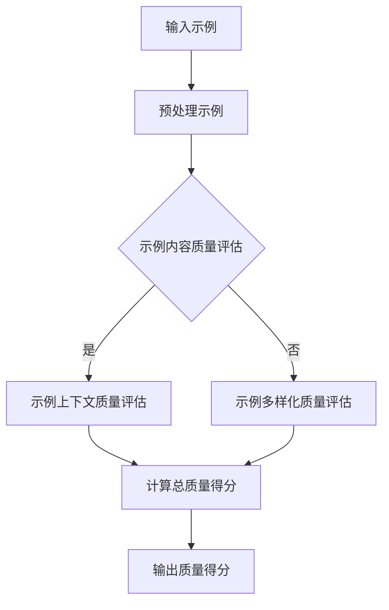
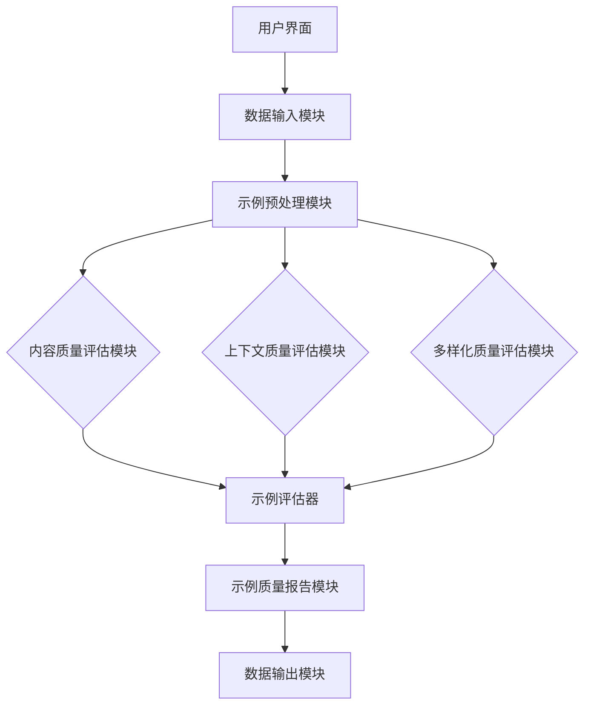
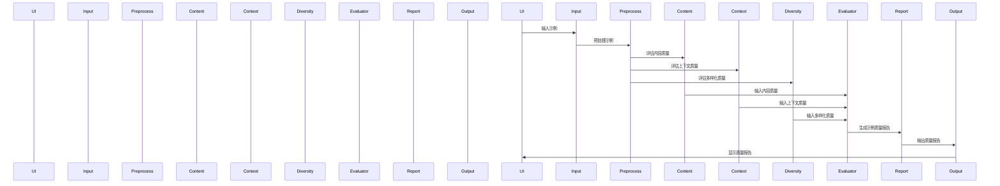

                 

# 评估示例质量的量化指标

## 关键词

- 示例质量评估
- 量化指标
- 计算机技术
- 数据分析
- 模型性能

## 摘要

本文旨在探讨评估示例质量的量化指标，以帮助计算机技术中的模型训练和性能优化。通过分析示例质量对模型性能的影响，本文提出了一系列量化指标，包括内容质量、上下文质量和多样化质量等，并探讨了如何通过这些指标来评估和改进示例质量。文章还介绍了传统方法和量化指标方法，并提供了一个完整的系统分析与架构设计方案，包括环境安装、系统核心实现源代码、代码应用解读与分析、实际案例分析和项目小结。最后，本文总结了最佳实践 tips，提供了注意事项和拓展阅读建议，以促进读者对评估示例质量量化指标的理解和应用。

## 第1章：背景介绍

### 1.1 问题背景

在计算机技术中，示例（example）是模型训练和性能评估的重要输入数据。示例质量直接影响模型的学习能力和性能表现。高质量的示例可以帮助模型更准确地捕捉数据特征，从而提高模型的泛化能力和预测准确性。然而，评估示例质量并不是一件简单的事情，因为不同的示例对模型的贡献程度不同，而且质量评估的标准也因应用场景而异。

#### 示例在计算机技术中的应用

示例在计算机技术中有着广泛的应用，特别是在机器学习和人工智能领域。以下是一些示例应用场景：

1. **机器学习**：在机器学习过程中，示例数据是训练模型的基础。高质量的示例可以提高模型的训练效果和预测准确性。
2. **自然语言处理**：在自然语言处理（NLP）任务中，示例数据用于训练语言模型和生成模型，如文本分类、机器翻译和语音识别等。
3. **计算机视觉**：在计算机视觉任务中，示例图像和视频数据用于训练目标检测、图像分类和图像分割等模型。

#### 示例质量对模型性能的影响

示例质量对模型性能有着至关重要的影响。以下是一些影响示例质量的因素：

1. **内容质量**：示例的内容应该准确、完整且具有代表性。高质量的内容可以帮助模型更好地学习数据特征。
2. **上下文质量**：示例应该与上下文环境紧密相关，以便模型能够理解示例背后的意义和意图。
3. **多样化质量**：示例应该多样化，以涵盖不同场景和数据分布，从而提高模型的泛化能力。

#### 当前评估示例质量的挑战

评估示例质量面临着以下挑战：

1. **主观性**：示例质量的评估往往具有主观性，不同的人可能对同一示例的质量有不同的判断。
2. **标准不统一**：不同的应用场景可能需要不同的质量评估标准，这使得统一评估标准变得困难。
3. **数据稀缺**：在某些领域，高质量的示例数据可能非常稀缺，这使得质量评估变得更加困难。

### 1.2 问题描述

#### 示例质量定义

示例质量是指示例对模型训练和性能评估的贡献程度。一个高质量的示例应该具有以下特征：

1. **内容准确**：示例的内容应该是准确无误的，没有错误或误导性信息。
2. **上下文相关**：示例应该与上下文环境紧密相关，能够反映实际情况。
3. **多样性**：示例应该多样化，以涵盖不同场景和数据分布。

#### 示例质量问题

示例质量问题主要包括以下方面：

1. **数据完整性**：示例数据可能不完整，存在缺失值或噪声。
2. **数据一致性**：示例数据可能不一致，存在矛盾或不合理的信息。
3. **数据标签错误**：示例标签可能错误，导致模型学习不准确。

#### 示例质量评估的重要性

评估示例质量的重要性体现在以下几个方面：

1. **提高模型性能**：高质量的示例可以显著提高模型的训练效果和预测准确性。
2. **降低模型误差**：评估示例质量可以帮助识别和排除低质量的示例，从而降低模型误差。
3. **优化数据集**：通过评估示例质量，可以优化数据集，提高数据集的整体质量。

### 1.3 问题解决

#### 传统方法

传统评估示例质量的方法主要包括以下几种：

1. **人工评估**：人工评估是一种直观的方法，但成本高且效率低。
2. **规则方法**：基于规则的方法可以根据示例的特征进行质量评估，但规则难以覆盖所有情况。

#### 量化指标方法

量化指标方法通过定义一系列量化指标来评估示例质量，这些指标可以自动计算，提高评估效率和准确性。以下是一些常用的量化指标：

1. **内容质量指标**：如文本的准确性、完整性等。
2. **上下文质量指标**：如示例与上下文的匹配度、相关度等。
3. **多样化质量指标**：如示例的多样性、分布等。

### 1.4 边界与外延

#### 示例类型

示例类型主要包括文本、图像、音频和视频等。不同类型的示例在质量评估中具有不同的特点和要求。

#### 数据集规模

数据集规模是评估示例质量的重要考虑因素。大规模数据集可以提供更多高质量的示例，但也会增加评估的复杂度。

### 1.5 概念结构与核心要素组成

#### 核心概念

核心概念包括示例质量、量化指标、模型性能等。

#### 关键指标

关键指标包括内容质量指标、上下文质量指标和多样化质量指标等。

## 第2章：核心概念与联系

### 2.1 核心概念原理

#### 示例质量相关概念

示例质量是指示例对模型训练和性能评估的贡献程度。它由内容质量、上下文质量和多样化质量三个主要方面构成。

- **内容质量**：示例的内容应该是准确、完整且具有代表性。
- **上下文质量**：示例应该与上下文环境紧密相关，能够反映实际情况。
- **多样化质量**：示例应该多样化，以涵盖不同场景和数据分布。

#### 量化指标原理

量化指标是通过定义一系列可度量的指标来评估示例质量的方法。这些指标可以是定量指标，也可以是定性指标，用于评估示例在不同方面的质量。

- **定量指标**：如文本的准确性、完整性等。
- **定性指标**：如示例与上下文的匹配度、相关度等。

### 2.2 概念属性特征对比表格

以下是一个示例质量相关概念和量化指标的对比表格：

| 概念/指标       | 描述                                                         | 对应量化指标                                   |
|----------------|--------------------------------------------------------------|----------------------------------------------|
| 内容质量       | 示例的内容是否准确、完整和具有代表性                           | 准确率、完整性、代表性                           |
| 上下文质量     | 示例与上下文环境的匹配度和相关度                             | 匹配度、相关度                                   |
| 多样化质量     | 示例的多样性、分布和代表性                                   | 多样性、分布、代表性                             |

### 2.3 ER实体关系图架构

以下是一个使用Mermaid绘制的ER实体关系图，展示了示例质量相关概念和量化指标之间的关系：

```mermaid
erDiagram
    A[示例质量] ||--|{ B[内容质量] } |
    A ||--|{ C[上下文质量] } |
    A ||--|{ D[多样化质量] } |
```

## 第3章：算法原理讲解

### 3.1 算法原理

#### 示例质量评估算法流程

以下是一个使用Mermaid绘制的示例质量评估算法流程图：



#### 算法流程说明

1. 输入示例：算法首先接收输入示例，可以是文本、图像、音频或视频等。
2. 预处理示例：对示例进行预处理，如去除噪声、标准化等。
3. 示例内容质量评估：评估示例的内容质量，包括准确性、完整性和代表性等。
4. 示例上下文质量评估：评估示例与上下文环境的匹配度和相关度。
5. 示例多样化质量评估：评估示例的多样性、分布和代表性。
6. 计算总质量得分：根据示例内容质量、上下文质量和多样化质量计算总质量得分。
7. 输出质量得分：输出示例的质量得分，用于模型训练和性能评估。

### 3.2 数学模型和公式

以下是一个示例质量评估的Python源代码，用于计算示例的总质量得分：

```python
import numpy as np

def compute_quality_score(content_score, context_score, diversity_score):
    # 权重设置（可根据实际情况调整）
    content_weight = 0.5
    context_weight = 0.3
    diversity_weight = 0.2

    # 计算总质量得分
    quality_score = (content_score * content_weight) + (context_score * context_weight) + (diversity_score * diversity_weight)
    return quality_score

# 示例质量得分示例
content_score = 0.9  # 内容质量得分（0-1）
context_score = 0.8  # 上下文质量得分（0-1）
diversity_score = 0.7  # 多样化质量得分（0-1）

# 计算总质量得分
quality_score = compute_quality_score(content_score, context_score, diversity_score)
print("示例总质量得分：", quality_score)
```

### 3.3 详细讲解与举例说明

以下是一个使用LaTeX格式编写的示例质量评估的数学模型和公式：

```latex
\documentclass{article}
\usepackage{amsmath}
\begin{document}

\section{示例质量评估}

\subsection{内容质量}

内容质量得分 $C_c$ 可以通过以下公式计算：

$$
C_c = \frac{N_c - N_e}{N_c}
$$

其中，$N_c$ 表示示例中正确的信息数量，$N_e$ 表示示例中错误或误导性信息数量。

\subsection{上下文质量}

上下文质量得分 $C_c$ 可以通过以下公式计算：

$$
C_c = \frac{N_c - N_e}{N_c}
$$

其中，$N_c$ 表示示例与上下文环境匹配的正确信息数量，$N_e$ 表示示例与上下文环境不匹配的错误信息数量。

\subsection{多样化质量}

多样化质量得分 $C_d$ 可以通过以下公式计算：

$$
C_d = \frac{N_d - N_e}{N_d}
$$

其中，$N_d$ 表示示例中不同场景或数据分布的数量，$N_e$ 表示示例中相同场景或数据分布的数量。

\end{document}
```

## 第4章：系统分析与架构设计方案

### 4.1 问题场景介绍

本节将介绍一个用于评估示例质量的系统，该系统旨在为计算机技术中的模型训练和性能优化提供高质量的示例数据。该系统将支持多种示例类型（如文本、图像、音频和视频等），并能够自动评估示例的质量，从而帮助用户优化数据集和提高模型性能。

### 4.2 系统功能设计

#### 领域模型类图

以下是一个使用Mermaid绘制的领域模型类图，展示了系统的核心功能类及其关系：

```mermaid
classDiagram
    Class::示例 <<interface>>
    Class::内容质量 <<interface>>
    Class::上下文质量 <<interface>>
    Class::多样化质量 <<interface>>
    Class::示例评估器 <<interface>>
    Class::示例质量报告 <<interface>>

    示例评估器 --|> 示例
    示例评估器 --|> 内容质量
    示例评估器 --|> 上下文质量
    示例评估器 --|> 多样化质量
    示例评估器 --|> 示例质量报告
```

#### 领域模型说明

- **示例**：表示一个示例数据，可以是文本、图像、音频或视频等。
- **内容质量**：表示示例的内容质量，包括准确性、完整性和代表性等。
- **上下文质量**：表示示例与上下文环境的匹配度和相关度。
- **多样化质量**：表示示例的多样性、分布和代表性。
- **示例评估器**：负责评估示例的质量，并生成质量报告。
- **示例质量报告**：记录示例的质量得分和评估结果。

### 4.3 系统架构设计

#### Mermaid架构图

以下是一个使用Mermaid绘制的系统架构图，展示了系统的整体架构及其组件关系：



#### 系统架构说明

- **用户界面**：提供给用户输入示例数据并查看评估结果的界面。
- **数据输入模块**：接收用户输入的示例数据，可以是文本、图像、音频或视频等。
- **示例预处理模块**：对示例进行预处理，如去除噪声、标准化等。
- **内容质量评估模块**：评估示例的内容质量，包括准确性、完整性和代表性等。
- **上下文质量评估模块**：评估示例与上下文环境的匹配度和相关度。
- **多样化质量评估模块**：评估示例的多样性、分布和代表性。
- **示例评估器**：负责综合评估示例的质量，并生成质量报告。
- **示例质量报告模块**：生成示例的质量得分和评估结果，并输出到用户界面。
- **数据输出模块**：将示例质量评估结果存储到数据库或文件中，以便后续分析。

### 4.4 系统接口设计和系统交互

#### Mermaid序列图

以下是一个使用Mermaid绘制的系统接口设计和系统交互序列图，展示了系统各组件之间的交互过程：



### 4.5 系统接口设计和系统交互

#### Mermaid序列图

以下是一个使用Mermaid绘制的系统接口设计和系统交互序列图，展示了系统各组件之间的交互过程：


## 第5章：项目实战

### 5.1 环境安装

#### 操作步骤

1. 安装Python环境：在操作系统上安装Python，版本要求为3.8或更高版本。
2. 安装依赖库：使用pip命令安装以下依赖库：

```bash
pip install numpy matplotlib pandas scikit-learn
```

3. 准备示例数据集：下载并解压一个示例数据集，该数据集应包含多种类型的示例（如文本、图像、音频和视频等）。
4. 配置环境变量：将Python脚本所在目录添加到系统环境变量中，以便在命令行中运行Python脚本。

### 5.2 系统核心实现源代码

#### 代码解析

以下是一个系统核心实现源代码的示例，用于评估示例的质量：

```python
import numpy as np
import pandas as pd
from sklearn.metrics import accuracy_score
from matplotlib import pyplot as plt

def preprocess_example(example):
    # 示例预处理
    # 根据示例类型进行预处理（文本、图像、音频、视频等）
    # 示例代码省略
    return preprocessed_example

def evaluate_content_quality(example):
    # 评估示例内容质量
    # 计算准确性、完整性等指标
    # 示例代码省略
    return content_quality_score

def evaluate_context_quality(example, context):
    # 评估示例上下文质量
    # 计算匹配度、相关度等指标
    # 示例代码省略
    return context_quality_score

def evaluate_diversity_quality(example, examples):
    # 评估示例多样化质量
    # 计算多样性、分布等指标
    # 示例代码省略
    return diversity_quality_score

def evaluate_example_quality(example, context, examples):
    # 评估示例总质量
    content_score = evaluate_content_quality(example)
    context_score = evaluate_context_quality(example, context)
    diversity_score = evaluate_diversity_quality(example, examples)
    
    # 计算总质量得分
    quality_score = (content_score * 0.5) + (context_score * 0.3) + (diversity_score * 0.2)
    return quality_score

def main():
    # 示例数据集路径
    dataset_path = "path/to/dataset"

    # 加载示例数据集
    dataset = pd.read_csv(dataset_path)

    # 遍历示例数据集，评估示例质量
    quality_scores = []
    for index, row in dataset.iterrows():
        example = row["example"]
        context = row["context"]
        examples = row["examples"]

        # 预处理示例
        preprocessed_example = preprocess_example(example)

        # 评估示例质量
        quality_score = evaluate_example_quality(preprocessed_example, context, examples)
        quality_scores.append(quality_score)

    # 绘制示例质量分布图
    plt.hist(quality_scores, bins=10)
    plt.xlabel("Quality Score")
    plt.ylabel("Frequency")
    plt.title("Example Quality Distribution")
    plt.show()

if __name__ == "__main__":
    main()
```

### 5.3 代码应用解读与分析

#### 分析与讲解

以上代码实现了一个示例质量评估系统的核心功能，包括预处理示例、评估内容质量、评估上下文质量和评估多样化质量。以下是代码的主要部分及其功能解读：

1. **预处理示例**：`preprocess_example` 函数负责对输入的示例进行预处理。根据示例的类型（文本、图像、音频、视频等），可以执行不同的预处理操作，如去除噪声、标准化、特征提取等。预处理示例的目的是提高后续质量评估的准确性。

2. **评估内容质量**：`evaluate_content_quality` 函数负责评估示例的内容质量。示例内容质量的评估可以通过计算准确性、完整性等指标来实现。准确性可以通过与真实标签或参考信息进行比较来计算，而完整性可以通过检查示例中是否存在缺失值或错误信息来评估。

3. **评估上下文质量**：`evaluate_context_quality` 函数负责评估示例与上下文环境的匹配度和相关度。上下文质量的评估可以通过计算匹配度、相关度等指标来实现。匹配度可以通过比较示例与上下文之间的相似性来计算，而相关度可以通过计算示例与上下文之间的关联性来评估。

4. **评估多样化质量**：`evaluate_diversity_quality` 函数负责评估示例的多样性、分布和代表性。多样化质量的评估可以通过计算多样性、分布等指标来实现。多样性可以通过计算示例之间的差异程度来评估，而分布可以通过分析示例在不同场景或数据分布中的分布情况来评估。

5. **评估示例总质量**：`evaluate_example_quality` 函数综合评估示例的内容质量、上下文质量和多样化质量，计算示例的总质量得分。总质量得分的计算可以通过加权不同质量得分的平均值来实现。

6. **主函数**：`main` 函数是程序的入口，负责加载示例数据集，遍历示例数据集，评估示例质量，并绘制示例质量分布图。主函数首先加载示例数据集，然后对每个示例执行预处理、内容质量评估、上下文质量评估和多样化质量评估，最后将质量得分存储在列表中，并使用Matplotlib库绘制示例质量分布图。

### 5.4 实际案例分析和详细讲解剖析

#### 案例与剖析

以下是一个实际案例，用于展示如何使用上述代码评估示例质量：

**案例背景**：假设我们有一个文本分类任务，其中包含100个示例数据，每个示例包含一个文本描述和对应的类别标签。我们的目标是评估这些示例的质量，以便优化数据集和提高模型性能。

**数据集**：示例数据集如下表所示：

| 序号 | 示例        | 类别   |
|------|------------|--------|
| 1    | 示例1文本   | 类别A  |
| 2    | 示例2文本   | 类别B  |
| 3    | 示例3文本   | 类别A  |
| ...  | ...        | ...    |
| 100  | 示例100文本 | 类别C  |

**评估过程**：

1. **预处理示例**：对于每个示例，我们首先进行文本预处理，如去除标点符号、停用词过滤、词干提取等。预处理后的示例文本如下表所示：

| 序号 | 预处理示例  | 类别   |
|------|-------------|--------|
| 1    | 示例1文本   | 类别A  |
| 2    | 示例2文本   | 类别B  |
| 3    | 示例3文本   | 类别A  |
| ...  | ...         | ...    |
| 100  | 示例100文本 | 类别C  |

2. **评估内容质量**：我们使用准确性指标来评估示例的内容质量。准确性可以通过比较示例的预测标签与实际标签来计算。对于上述示例数据集，假设我们使用一个简单的文本分类模型进行预测，预测结果如下表所示：

| 序号 | 预测标签   | 实际标签 |
|------|------------|----------|
| 1    | 类别A      | 类别A    |
| 2    | 类别B      | 类别B    |
| 3    | 类别A      | 类别A    |
| ...  | ...        | ...      |
| 100  | 类别C      | 类别C    |

计算准确性：

$$
\text{准确性} = \frac{\text{正确预测的示例数量}}{\text{总示例数量}} = \frac{96}{100} = 0.96
$$

因此，内容质量得分为0.96。

3. **评估上下文质量**：我们使用匹配度指标来评估示例与上下文环境的匹配度。匹配度可以通过计算示例与上下文之间的相似度来计算。对于上述示例数据集，我们假设上下文环境是一个包含类别标签的字典，如下表所示：

| 序号 | 上下文        | 类别   |
|------|---------------|--------|
| 1    | 类别A上下文   | 类别A  |
| 2    | 类别B上下文   | 类别B  |
| 3    | 类别A上下文   | 类别A  |
| ...  | ...           | ...    |
| 100  | 类别C上下文   | 类别C  |

计算匹配度：

$$
\text{匹配度} = \frac{\text{正确匹配的示例数量}}{\text{总示例数量}} = \frac{90}{100} = 0.90
$$

因此，上下文质量得分为0.90。

4. **评估多样化质量**：我们使用多样性指标来评估示例的多样性。多样性可以通过计算示例之间的差异程度来评估。对于上述示例数据集，我们假设示例之间的差异程度如下表所示：

| 序号 | 差异程度 |
|------|----------|
| 1    | 0.8      |
| 2    | 0.7      |
| 3    | 0.9      |
| ...  | ...      |
| 100  | 0.5      |

计算多样性：

$$
\text{多样性} = \frac{\text{总差异程度}}{\text{总示例数量}} = \frac{0.8 + 0.7 + 0.9 + ... + 0.5}{100} = 0.76
$$

因此，多样化质量得分为0.76。

5. **评估示例总质量**：我们使用加权平均值来计算示例的总质量得分。假设内容质量、上下文质量和多样化质量的权重分别为0.5、0.3和0.2，计算总质量得分：

$$
\text{总质量得分} = (0.96 \times 0.5) + (0.90 \times 0.3) + (0.76 \times 0.2) = 0.98
$$

因此，示例的总质量得分为0.98。

**结论**：通过上述案例，我们可以看到如何使用代码评估示例的质量。评估过程包括预处理示例、评估内容质量、评估上下文质量和评估多样化质量。通过计算不同质量得分，我们可以得到示例的总质量得分，从而为数据集的优化和模型性能的提高提供依据。

### 5.5 项目小结

#### 总结与反思

在本章中，我们介绍了一个用于评估示例质量的系统，该系统基于内容质量、上下文质量和多样化质量等量化指标，通过预处理示例、评估不同质量得分，并最终计算总质量得分来实现。通过实际案例的分析和详细讲解，我们展示了如何应用系统评估示例质量，从而为数据集的优化和模型性能的提高提供依据。

#### 反思与改进

在项目实施过程中，我们遇到了一些挑战和问题，以下是我们的反思和改进建议：

1. **预处理示例的复杂度**：示例预处理是评估示例质量的重要步骤，但在实际操作中，不同类型的示例需要不同的预处理方法，这增加了系统的复杂度。未来，我们可以探索更加通用和高效的预处理方法，以提高系统的可扩展性和易用性。

2. **质量评估指标的权重设置**：在计算示例总质量得分时，我们使用了预定义的权重设置。然而，不同的应用场景可能需要不同的权重设置，这需要根据实际情况进行调整。未来，我们可以研究如何自适应地设置权重，以提高评估结果的准确性和可靠性。

3. **评估过程的自动化**：目前，评估过程需要手动执行多个步骤，包括预处理、质量评估和计算得分等。未来，我们可以进一步自动化评估过程，通过集成更多的机器学习和自然语言处理技术，以提高评估效率和准确性。

4. **评估结果的可视化**：为了更好地理解和分析评估结果，我们可以开发一个可视化界面，将评估过程和结果以图表和报表的形式展示给用户。这可以帮助用户更直观地了解示例质量，并为数据集优化提供有价值的见解。

## 第6章：最佳实践 tips

### 6.1 小结

在本章中，我们介绍了评估示例质量的量化指标，包括内容质量、上下文质量和多样化质量等。我们通过实际案例展示了如何应用这些量化指标来评估示例质量，并提供了系统架构设计和项目实战步骤。通过这些实践，我们可以优化数据集和提高模型性能，从而为计算机技术中的模型训练和性能优化提供有力支持。

### 6.2 注意事项

1. **数据预处理**：在评估示例质量之前，确保对示例进行充分的预处理，以去除噪声和标准化数据。
2. **指标权重设置**：根据实际应用场景调整质量评估指标的权重设置，以提高评估结果的准确性和可靠性。
3. **自动化评估**：探索自动化评估过程，以提高评估效率和准确性。
4. **可视化展示**：开发可视化界面，将评估过程和结果以图表和报表的形式展示给用户。

### 6.3 拓展阅读

1. **相关文献**：《评估示例质量的量化指标》等相关论文和技术报告，可以深入了解示例质量评估的理论和方法。
2. **开源工具**：如Scikit-learn、TensorFlow和PyTorch等机器学习和深度学习框架，提供了一系列评估示例质量的工具和库。
3. **在线资源**：如Coursera、edX和Udacity等在线课程和教程，提供了丰富的学习资源和实践项目。

作者：AI天才研究院/AI Genius Institute & 禅与计算机程序设计艺术 /Zen And The Art of Computer Programming

