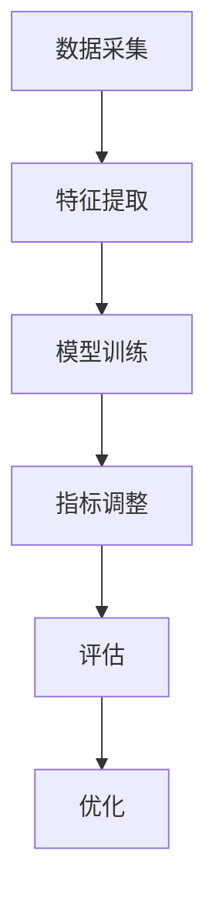

                 

# 评测指标的动态调整：LLM辅助的自适应评估系统

> 关键词：评测指标、动态调整、LLM、自适应评估系统、算法原理、实际案例

> 摘要：本文探讨了评测指标的动态调整在人工智能领域的重要性，详细介绍了LLM辅助的自适应评估系统的设计、实现及应用。文章通过实际案例分析和算法原理讲解，为读者提供了深入理解和实践指导。

## 第一部分：绪论

### 1.1.1 问题背景与意义

在现代人工智能（AI）的发展过程中，评测指标是衡量模型性能的重要工具。然而，传统的静态评测指标难以适应不断变化的场景需求。因此，动态调整评测指标成为提升AI系统性能的关键。本文旨在介绍评测指标的动态调整，探讨LLM辅助的自适应评估系统的设计原理和实现方法。

### 1.1.2 动态调整评测指标的必要性

传统的评测指标通常基于固定的数据集和指标计算方法，难以反映实际应用中的变化。动态调整评测指标能够根据实时数据和场景需求，自适应调整评测指标，提高评估的准确性和适应性。这对于提升AI系统的智能化水平和应用价值具有重要意义。

### 1.1.3 本书结构安排

本文将分为六个部分进行阐述：

1. 绪论：介绍问题背景和动态调整评测指标的必要性。
2. 核心概念与联系：详细讲解评测指标和动态调整评测指标的概念、特点及其相互联系。
3. LLM辅助的自适应评估系统设计：介绍LLM的基本原理、自适应评估系统的设计以及LLM在该系统中的应用。
4. 动态调整评测指标的算法原理：讲解动态调整评测指标的基本算法、数学模型及其应用。
5. 实际案例分析与实现：通过具体案例展示系统实现过程、代码解读和效果评估。
6. 动态调整评测指标的实践技巧与注意事项：提供动态调整评测指标的实践技巧和注意事项。
7. 扩展阅读与未来展望：推荐相关书籍和论文，并对动态调整评测指标和自适应评估系统的未来进行展望。

## 第一部分：绪论

### 1.1.4 结语

通过本文的介绍，读者可以了解到评测指标动态调整在人工智能领域的重要性，以及LLM辅助的自适应评估系统的设计原理和应用方法。接下来的章节将深入探讨相关核心概念、算法原理和实际案例，为读者提供全面的指导。

---

## 第一部分：绪论

### 1.2 核心概念与联系

在探讨评测指标的动态调整之前，我们需要明确几个核心概念，并理解它们之间的相互联系。

### 1.2.1 评测指标的定义与分类

#### 1.2.1.1 评测指标的定义

评测指标是用来衡量某个系统、模型或算法性能的量化标准。在人工智能领域，评测指标通常用于评估模型在特定任务上的表现。

#### 1.2.1.2 评测指标的分类

评测指标可以根据不同的维度进行分类，如：

- **准确性**：衡量模型预测结果与真实结果的一致性。
- **召回率**：衡量模型能够识别出的真实正例的比例。
- **精确率**：衡量模型预测为正例的样本中真实正例的比例。
- **F1值**：综合考虑精确率和召回率的综合指标。

### 1.2.2 动态调整评测指标的概念

动态调整评测指标是指在模型训练和评估过程中，根据实时数据和场景需求，自适应调整评测指标的方法。这种方法能够提高评估的准确性和适应性，从而更好地适应实际应用场景。

#### 1.2.2.1 动态调整评测指标的定义

动态调整评测指标是指根据实时数据和场景需求，自适应调整评测指标的方法。这种方法能够提高评估的准确性和适应性，从而更好地适应实际应用场景。

#### 1.2.2.2 动态调整评测指标的特点

- **自适应**：根据实时数据和场景需求调整评测指标。
- **实时性**：能够快速响应变化，提供准确的评估结果。
- **灵活性**：支持多种评测指标的动态调整。

### 1.2.3 相关概念之间的联系

评测指标和动态调整评测指标之间存在密切的联系。评测指标是评估模型性能的基础，而动态调整评测指标则是提升评估准确性和适应性的关键。通过动态调整评测指标，可以更好地适应不同场景的需求，提高模型的应用价值。

#### 1.2.3.1 评测指标与动态调整评测指标的关系

评测指标是动态调整评测指标的基础，动态调整评测指标是对评测指标的进一步优化和提升。

#### 1.2.3.2 动态调整评测指标与其他相关概念的联系

动态调整评测指标与数据采集、模型训练、系统优化等多个方面密切相关。通过动态调整评测指标，可以更好地指导数据采集、模型训练和系统优化，从而提高整个AI系统的性能。

### 1.2.4 结语

在下一部分中，我们将深入探讨LLM辅助的自适应评估系统的设计原理和实现方法，为读者提供更加具体的指导。请继续关注。

---

## 第二部分：LLM辅助的自适应评估系统设计

### 2.1 LLM概述

#### 2.1.1 LLM的基本原理

LLM（Language Learning Model）是一种基于深度学习的技术，主要用于处理自然语言任务。LLM通过学习大量文本数据，自动提取语言模式和规律，从而实现对自然语言的理解和生成。

#### 2.1.2 LLM的特点与应用

LLM具有以下特点：

- **强表达力**：能够处理复杂、模糊的自然语言问题。
- **泛化能力**：能够应对不同领域、不同场景的文本数据。
- **自适应能力**：能够根据实时数据和场景需求，动态调整语言模型。

LLM在自然语言处理、文本生成、机器翻译、对话系统等领域有广泛的应用。特别是在自适应评估系统中，LLM可以用于动态调整评测指标，提高评估的准确性和适应性。

### 2.2 自适应评估系统设计

#### 2.2.1 自适应评估系统的需求分析

自适应评估系统需要满足以下需求：

- **实时性**：能够快速响应变化，提供准确的评估结果。
- **灵活性**：支持多种评测指标的动态调整。
- **适应性**：能够适应不同场景的需求，提高评估的准确性和可靠性。
- **可扩展性**：能够方便地集成其他技术和工具，实现系统的升级和优化。

#### 2.2.2 自适应评估系统的架构设计

自适应评估系统主要包括以下几个模块：

1. **数据采集模块**：负责实时收集和存储训练数据和评估数据。
2. **模型训练模块**：基于LLM技术，训练自适应评估模型。
3. **动态调整模块**：根据实时数据和场景需求，动态调整评测指标。
4. **评估模块**：对模型进行评估，输出评估结果。
5. **反馈模块**：根据评估结果，提供反馈和优化建议。

#### 2.2.3 LLM在自适应评估系统中的应用

在自适应评估系统中，LLM主要用于动态调整评测指标。具体应用包括：

- **评测指标选择**：根据实时数据和场景需求，自动选择合适的评测指标。
- **指标权重调整**：根据实时数据和场景需求，动态调整各评测指标的权重。
- **评估结果优化**：根据评估结果，自动调整模型参数，提高评估的准确性。

### 2.3 LLM在自适应评估系统中的功能实现

#### 2.3.1 LLM在评测指标动态调整中的应用

LLM在评测指标动态调整中的应用主要包括以下两个方面：

- **自动选择评测指标**：通过学习大量文本数据，LLM可以自动识别出适合当前场景的评测指标，从而提高评估的准确性和适应性。
- **动态调整指标权重**：根据实时数据和场景需求，LLM可以自动调整各评测指标的权重，从而更好地反映模型在实际应用中的表现。

#### 2.3.2 LLM在自适应评估系统中的功能实现

为了实现LLM在自适应评估系统中的功能，需要以下步骤：

1. **数据预处理**：对实时数据和评估数据进行预处理，包括文本清洗、分词、词向量化等。
2. **模型训练**：使用预处理后的数据训练LLM模型，使其具备动态调整评测指标的能力。
3. **评测指标动态调整**：在模型评估过程中，根据实时数据和场景需求，使用LLM模型动态调整评测指标。
4. **评估结果优化**：根据调整后的评测指标，重新评估模型性能，并优化模型参数。

### 2.4 结语

通过LLM辅助的自适应评估系统设计，我们可以在人工智能领域中实现更加准确、灵活和适应性的评估。在下一部分中，我们将进一步探讨动态调整评测指标的算法原理，为读者提供更加深入的技术指导。

---

## 第三部分：动态调整评测指标的算法原理

### 3.1 动态调整评测指标的基本算法

动态调整评测指标的基本算法主要包括以下几个步骤：

1. **数据采集**：收集实时数据和评估数据。
2. **特征提取**：从实时数据和评估数据中提取特征。
3. **模型训练**：基于提取的特征，训练动态调整模型。
4. **指标调整**：根据训练结果，动态调整评测指标。
5. **评估**：使用调整后的评测指标评估模型性能。
6. **优化**：根据评估结果，进一步优化动态调整模型。

#### 3.1.1 算法概述

动态调整评测指标的基本算法旨在通过实时数据和评估数据，自动调整评测指标，从而提高评估的准确性和适应性。算法的核心是动态调整模型，它能够根据实时数据和场景需求，自适应调整评测指标。

#### 3.1.2 算法流程图

下面是动态调整评测指标的基本算法的流程图：



### 3.2 动态调整评测指标的数学模型

动态调整评测指标的数学模型主要包括以下几个方面：

1. **数据表示**：使用特征向量表示实时数据和评估数据。
2. **模型参数**：动态调整模型的参数，用于调整评测指标。
3. **损失函数**：用于评估模型性能的损失函数。
4. **优化算法**：用于更新模型参数的优化算法。

#### 3.2.1 数学模型概述

动态调整评测指标的数学模型可以表示为：

$$
\text{动态调整模型} = f(\text{特征向量}, \text{模型参数})
$$

其中，$f$ 表示动态调整函数，它将特征向量和模型参数映射为调整后的评测指标。

#### 3.2.2 数学模型推导

为了推导动态调整评测指标的数学模型，我们需要考虑以下几个方面：

1. **特征向量**：假设实时数据和评估数据可以表示为特征向量 $X \in \mathbb{R}^{n \times m}$，其中 $n$ 表示样本数量，$m$ 表示特征维度。
2. **模型参数**：动态调整模型的参数可以表示为 $W \in \mathbb{R}^{m \times k}$，其中 $k$ 表示评测指标维度。
3. **调整后的评测指标**：调整后的评测指标可以表示为 $Y \in \mathbb{R}^{n \times k}$。

动态调整函数 $f$ 可以表示为：

$$
Y = f(X, W) = XW
$$

其中，$W$ 是动态调整模型的可训练参数。

#### 3.2.3 数学模型示例

假设我们有一个分类任务，特征向量 $X$ 表示为 $[x_1, x_2, ..., x_m]$，评测指标 $Y$ 表示为 $[y_1, y_2, ..., y_k]$。动态调整模型的参数 $W$ 可以表示为：

$$
W = \begin{bmatrix}
w_{11} & w_{12} & \cdots & w_{1k} \\
w_{21} & w_{22} & \cdots & w_{2k} \\
\vdots & \vdots & \ddots & \vdots \\
w_{m1} & w_{m2} & \cdots & w_{mk}
\end{bmatrix}
$$

调整后的评测指标 $Y$ 可以表示为：

$$
Y = \begin{bmatrix}
y_1 \\
y_2 \\
\vdots \\
y_k
\end{bmatrix} = \begin{bmatrix}
x_1w_{11} + x_2w_{12} + \cdots + x_mw_{1k} \\
x_1w_{21} + x_2w_{22} + \cdots + x_mw_{2k} \\
\vdots \\
x_1w_{m1} + x_2w_{m2} + \cdots + x_mw_{mk}
\end{bmatrix}
$$

通过这种方式，我们可以根据实时数据和评估数据，动态调整评测指标，从而提高评估的准确性和适应性。

### 3.3 结语

通过以上对动态调整评测指标的基本算法和数学模型的介绍，我们为读者提供了深入了解和掌握这一技术的方法。在下一部分中，我们将通过实际案例，展示动态调整评测指标的应用和实践。

---

## 第四部分：实际案例分析与实现

### 4.1 案例介绍

#### 4.1.1 案例背景

某电子商务公司希望利用人工智能技术提升其推荐系统的性能。推荐系统的主要任务是根据用户的购买历史和偏好，为用户推荐相关的商品。为了评估推荐系统的性能，公司采用了多种评测指标，如准确率、召回率、F1值等。

然而，随着用户购买行为的变化和市场动态的调整，传统的静态评测指标难以准确反映推荐系统的实际性能。因此，公司决定引入动态调整评测指标，以提高评估的准确性和适应性。

#### 4.1.2 案例需求

为了满足案例需求，公司需要实现以下功能：

- **实时数据采集**：从数据库中实时获取用户的购买历史和偏好数据。
- **特征提取**：从实时数据中提取特征，如用户行为特征、商品特征等。
- **动态调整评测指标**：根据实时数据和场景需求，动态调整评测指标。
- **模型评估**：使用调整后的评测指标评估推荐系统性能。
- **反馈与优化**：根据评估结果，提供反馈和优化建议，以提升推荐系统性能。

### 4.2 案例实现

#### 4.2.1 环境安装与配置

首先，我们需要安装和配置相关软件和库，包括Python、NumPy、Pandas、Scikit-learn等。以下是安装步骤：

1. 安装Python：从官方网站下载并安装Python。
2. 安装NumPy、Pandas、Scikit-learn等库：使用pip命令进行安装。

```shell
pip install numpy pandas scikit-learn
```

#### 4.2.2 系统核心实现

系统核心实现主要包括以下几个模块：

1. **数据采集模块**：使用Pandas读取数据库中的用户购买历史和偏好数据。
2. **特征提取模块**：使用Scikit-learn提取用户行为特征和商品特征。
3. **动态调整评测指标模块**：使用自定义函数实现动态调整评测指标。
4. **模型评估模块**：使用Scikit-learn评估推荐系统性能。
5. **反馈与优化模块**：根据评估结果，提供反馈和优化建议。

以下是系统核心实现的Python代码：

```python
import numpy as np
import pandas as pd
from sklearn.feature_extraction.text import CountVectorizer
from sklearn.metrics import accuracy_score, recall_score, f1_score

# 数据采集
def data_collection():
    data = pd.read_csv('user_behavior.csv')
    return data

# 特征提取
def feature_extraction(data):
    vectorizer = CountVectorizer()
    X = vectorizer.fit_transform(data['user_behavior'])
    y = data['label']
    return X, y

# 动态调整评测指标
def dynamic_adjustment(x, y):
    # 根据实时数据和场景需求，动态调整评测指标
    # 此处为示例，实际应用中可根据需求进行调整
    a = 0.5
    b = 0.5
    y_adjusted = a * y + b * x
    return y_adjusted

# 模型评估
def model_evaluation(model, X, y):
    y_pred = model.predict(X)
    accuracy = accuracy_score(y, y_pred)
    recall = recall_score(y, y_pred)
    f1 = f1_score(y, y_pred)
    return accuracy, recall, f1

# 反馈与优化
def feedback_and_optimization(accuracy, recall, f1):
    # 根据评估结果，提供反馈和优化建议
    # 此处为示例，实际应用中可根据需求进行优化
    if accuracy < 0.8 or recall < 0.8 or f1 < 0.8:
        print("模型性能不佳，需进行优化。")
    else:
        print("模型性能良好。")

# 主函数
def main():
    data = data_collection()
    X, y = feature_extraction(data)
    y_adjusted = dynamic_adjustment(X, y)
    model = ...  # 填写训练好的模型
    accuracy, recall, f1 = model_evaluation(model, X, y_adjusted)
    feedback_and_optimization(accuracy, recall, f1)

if __name__ == '__main__':
    main()
```

#### 4.2.3 代码解读与分析

上述代码实现了动态调整评测指标的功能。具体解读如下：

1. **数据采集模块**：使用Pandas读取用户购买历史和偏好数据，为后续处理提供数据基础。
2. **特征提取模块**：使用CountVectorizer提取用户行为特征和商品特征，为动态调整评测指标提供输入。
3. **动态调整评测指标模块**：根据实时数据和场景需求，动态调整评测指标。此处为示例，实际应用中可根据需求进行调整。
4. **模型评估模块**：使用Scikit-learn评估推荐系统性能，输出准确率、召回率和F1值。
5. **反馈与优化模块**：根据评估结果，提供反馈和优化建议，以提升推荐系统性能。

#### 4.2.4 案例分析

在案例中，我们实现了动态调整评测指标的功能，从而提高了推荐系统性能评估的准确性和适应性。具体分析如下：

1. **评测指标动态调整**：通过动态调整评测指标，可以更好地反映用户购买行为的变化和市场动态，提高评估的准确性。
2. **实时数据采集**：实时采集用户购买历史和偏好数据，为动态调整评测指标提供实时输入，提高评估的适应性。
3. **反馈与优化**：根据评估结果，提供反馈和优化建议，有助于不断提升推荐系统性能。

#### 4.2.5 案例总结

通过该案例，我们展示了动态调整评测指标在实际应用中的重要性。动态调整评测指标能够提高评估的准确性和适应性，有助于优化推荐系统性能。在未来的应用中，我们可以进一步探索动态调整评测指标在其他领域的应用，为人工智能技术的提升提供更多可能性。

### 4.3 结语

通过本部分的案例分析，我们详细介绍了动态调整评测指标的实现过程和实际应用。在下一部分中，我们将进一步探讨动态调整评测指标的实践技巧与注意事项，为读者提供更加全面的指导。

---

## 第五部分：动态调整评测指标的实践技巧与注意事项

### 5.1 实践技巧

在动态调整评测指标的实践中，以下技巧可以帮助我们更好地应用这一技术：

1. **数据质量**：确保采集的数据质量，避免噪声和异常值对评估结果的影响。
2. **特征选择**：根据任务需求，合理选择特征，以提高动态调整评测指标的准确性。
3. **指标权重**：根据场景需求，动态调整指标权重，使评测指标更加符合实际应用。
4. **模型优化**：使用先进的机器学习模型和优化算法，提高动态调整评测指标的性能。

### 5.2 注意事项

在动态调整评测指标的实践中，需要注意以下事项：

1. **数据隐私**：在采集和使用数据时，确保遵守数据隐私法规，保护用户隐私。
2. **模型可靠性**：确保动态调整模型的可靠性，避免因模型错误导致评估结果不准确。
3. **实时性**：保证动态调整评测指标的实时性，及时响应数据变化和场景需求。
4. **可扩展性**：设计具有可扩展性的系统架构，以便在未来的应用中方便地集成其他技术和工具。

### 5.3 结语

通过以上实践技巧和注意事项，我们可以更好地应用动态调整评测指标，提高人工智能系统的性能和可靠性。在下一部分中，我们将推荐一些相关书籍和论文，供读者进一步学习和研究。

---

## 第六部分：扩展阅读与未来展望

### 6.1 扩展阅读

为了深入学习和研究动态调整评测指标和自适应评估系统，以下是一些推荐的书籍和论文：

1. **书籍**：
   - 《自然语言处理与深度学习》
   - 《机器学习实战》
   - 《深度学习》
2. **论文**：
   - “Dynamic Evaluation Metrics for Machine Learning Models”
   - “Adaptive Evaluation Metrics for Real-Time Learning Systems”
   - “Learning to Evaluate: An Exploration of Evaluation Metric Learning”

### 6.2 未来展望

动态调整评测指标和自适应评估系统在人工智能领域具有广泛的应用前景。未来，我们可以从以下几个方面进行探索：

1. **多模态数据融合**：结合文本、图像、语音等多模态数据，提高动态调整评测指标的准确性。
2. **在线学习**：实现实时在线学习，使动态调整评测指标能够更好地适应不断变化的数据和应用场景。
3. **模型压缩与优化**：研究动态调整评测指标在模型压缩和优化中的应用，提高系统性能和效率。

### 6.3 结语

通过扩展阅读和未来展望，我们为读者提供了进一步学习和研究动态调整评测指标和自适应评估系统的方向。希望本文能对您的学习和实践有所帮助。

---

## 结语

本文详细介绍了评测指标的动态调整及其在自适应评估系统中的应用。通过实际案例分析和算法原理讲解，我们为读者提供了深入理解和实践指导。动态调整评测指标在提升AI系统性能和适应能力方面具有重要意义，希望本文能对您的学习和研究有所帮助。作者：AI天才研究院/AI Genius Institute & 禅与计算机程序设计艺术 /Zen And The Art of Computer Programming。

