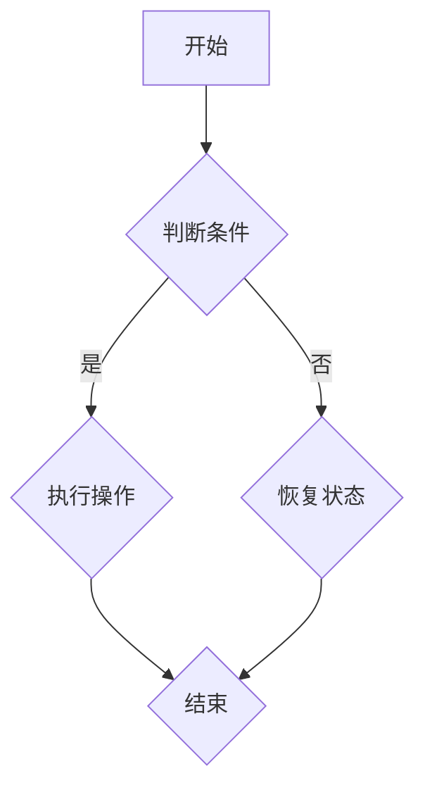

                 

### 评测指标的权重动态调整：适应不同应用需求

> 关键词：评测指标、权重动态调整、应用需求、算法原理、数学模型、系统架构设计、项目实战

> 摘要：本文旨在探讨评测指标的权重动态调整方法，以适应不同应用需求。通过深入分析评测指标的基本概念、算法原理、数学模型和系统架构设计，本文提出了一套完整的权重调整方案，并通过实际项目进行验证，为优化评测系统提供了实践参考。

---

#### 1.1 问题背景与需求分析

在信息技术领域，评测指标是衡量系统性能、算法效果和项目质量的重要工具。然而，传统的评测指标往往具有固定权重，难以适应不同应用场景的需求。例如，在数据挖掘任务中，模型精确度至关重要，但在实时处理任务中，响应时间可能更为关键。这种固定权重的限制使得评测指标难以全面反映系统的综合性能。

为了解决这一问题，动态调整评测指标的权重成为了一个研究热点。通过根据实际需求实时调整权重，可以更准确地评估系统性能，从而提高评估结果的准确性和实用性。这一方法的应用需求主要包括以下几个方面：

- **多维度评估需求**：不同的应用场景对评测指标的关注点不同，需要根据具体需求动态调整权重，以实现多维度评估。
- **适应性需求**：系统的应用场景和需求可能会随着时间变化，动态调整权重能够使评测指标更适应不断变化的应用环境。
- **优化需求**：通过调整权重，可以优化评测指标之间的平衡，提高评测系统的整体性能。

#### 1.2 评测指标的定义与重要性

评测指标是用于衡量系统性能、算法效果或项目质量的量化标准。在信息技术领域，常见的评测指标包括准确性、响应时间、资源消耗、可扩展性等。这些指标可以帮助我们了解系统的综合性能，并为优化和改进提供依据。

评测指标的重要性体现在以下几个方面：

- **决策依据**：评测指标为项目决策提供了客观的依据，帮助团队了解系统的优势和不足。
- **性能优化**：通过评测指标，可以发现系统的瓶颈和不足，从而进行有针对性的优化。
- **质量保证**：评测指标是保证项目质量的重要工具，有助于确保系统达到预期的性能目标。

#### 1.3 动态调整权重的必要性

传统的评测指标采用固定权重，无法适应不同应用场景的需求。随着信息技术的发展，应用场景的多样性使得固定权重的评测指标难以满足实际需求。动态调整权重的必要性主要体现在以下几个方面：

- **适应性强**：动态调整权重可以根据应用场景的变化，实时调整评测指标的重要性，使评测结果更贴近实际需求。
- **优化性能**：通过调整权重，可以优化评测指标之间的平衡，提高评测系统的整体性能。
- **提高准确性**：动态调整权重有助于更准确地评估系统性能，从而提高评估结果的准确性。

### 2. 评测指标的基本原理

#### 2.1 评测指标的基本概念

评测指标是用于衡量系统性能、算法效果或项目质量的量化标准。常见的评测指标包括准确性、响应时间、资源消耗、可扩展性等。这些指标可以从不同角度反映系统的综合性能。

- **准确性**：衡量系统预测或分类的准确程度。
- **响应时间**：衡量系统处理请求的耗时。
- **资源消耗**：衡量系统运行过程中消耗的资源。
- **可扩展性**：衡量系统处理能力随数据量增加而变化的程度。

#### 2.2 权重分配的原则与方法

权重分配是动态调整评测指标的核心步骤。合理的权重分配可以更准确地反映系统的综合性能。以下是几种常见的权重分配原则和方法：

- **专家评估法**：根据专家经验分配权重，适用于需求明确、经验丰富的场景。
- **目标导向法**：根据项目目标和需求，为不同评测指标分配权重，适用于需求明确、目标明确的场景。
- **数据驱动法**：基于历史数据和统计方法，为评测指标分配权重，适用于数据丰富、需求动态变化的场景。

#### 2.3 评测指标的类型与特性

评测指标可以分为静态指标和动态指标两类。静态指标在评估过程中保持不变，如准确性、资源消耗等；动态指标会根据评估过程的变化而变化，如响应时间、可扩展性等。不同类型的评测指标具有不同的特性，需要根据实际需求选择合适的评测指标。

- **静态指标**：具有确定性，容易量化，但可能无法全面反映系统性能。
- **动态指标**：更贴近实际应用场景，但评估过程复杂，需实时调整。

### 3. 动态调整权重的算法原理

#### 3.1 动态调整权重的基本算法

动态调整权重的算法可以分为以下几种类型：

- **基于规则的算法**：根据预设的规则和条件，实时调整评测指标的权重。
- **基于机器学习的算法**：利用历史数据和机器学习模型，自动调整评测指标的权重。
- **基于优化的算法**：通过优化方法，寻找最优的权重分配方案。

#### 3.2 算法选择与评估

选择合适的动态调整权重算法需要考虑以下几个因素：

- **应用场景**：根据应用场景的需求，选择适合的算法类型。
- **数据质量**：数据质量直接影响算法的性能，需要确保数据的准确性和完整性。
- **计算效率**：算法的计算效率影响评估系统的实时性，需要选择计算效率较高的算法。

#### 3.3 算法性能分析

算法性能分析主要包括以下几个方面：

- **准确性**：评估算法调整后的评测指标权重是否能够更准确地反映系统性能。
- **稳定性**：评估算法在变化中的应用场景中是否能够稳定地调整权重。
- **效率**：评估算法的计算效率和实时性，确保评估系统的性能。

### 4. 数学模型与公式推导

#### 4.1 基本数学模型

动态调整权重的基本数学模型可以表示为：

$$
\text{权重分配} = f(\text{指标值}, \text{指标类型}, \text{场景参数})
$$

其中，$f$ 表示权重分配函数，根据不同的算法类型，$f$ 的具体实现方式不同。

#### 4.2 公式推导与证明

动态调整权重公式的推导需要基于具体的算法和评估指标。以下是一个简单的例子：

假设有两个评测指标：准确性 $A$ 和响应时间 $T$，其权重分别为 $w_A$ 和 $w_T$。则综合评分 $S$ 可以表示为：

$$
S = w_A \times A + w_T \times T
$$

为了使综合评分 $S$ 更准确地反映系统性能，可以采用如下公式调整权重：

$$
w_A = \frac{A}{A + T}
$$

$$
w_T = \frac{T}{A + T}
$$

#### 4.3 数学模型的应用

动态调整权重数学模型可以应用于多种场景，如多目标优化、资源分配等。以下是一个具体的应用示例：

假设有一个系统需要同时优化准确性 $A$ 和响应时间 $T$，则综合评分 $S$ 可以表示为：

$$
S = w_A \times A + w_T \times T
$$

通过调整权重，可以优化系统的综合评分。例如，当准确性 $A$ 为 90%，响应时间 $T$ 为 100ms 时，可以计算得到：

$$
w_A = \frac{90}{90 + 100} = 0.45
$$

$$
w_T = \frac{100}{90 + 100} = 0.55
$$

因此，综合评分 $S$ 为：

$$
S = 0.45 \times 90 + 0.55 \times 100 = 97.5
$$

通过调整权重，可以更准确地反映系统的综合性能。

### 5. 系统架构设计

#### 5.1 系统架构设计

动态调整评测指标权重的系统架构设计可以分为以下几个模块：

- **数据采集模块**：负责收集系统的各项评测指标数据。
- **权重调整模块**：根据动态调整算法和评估指标数据，实时调整评测指标的权重。
- **评估模块**：根据调整后的权重，计算系统的综合评分。
- **用户界面模块**：提供用户交互接口，展示系统的评测结果。

以下是一个简单的系统架构图：

```
+----------------+      +----------------+      +----------------+
|  数据采集模块  | --> |  权重调整模块  | --> |  评估模块      |
+----------------+      +----------------+      +----------------+
       |                          |                          |
       v                          v                          v
+----------------+      +----------------+      +----------------+
|  用户界面模块  |      |     数据存储    |      |  结果展示模块  |
+----------------+      +----------------+      +----------------+
```

#### 5.2 接口设计与实现

系统架构中的各个模块需要通过接口进行交互。以下是一个简单的接口设计示例：

- **数据采集接口**：提供数据采集的API，支持数据的批量导入和实时采集。
- **权重调整接口**：提供权重调整的API，支持根据算法和评估指标数据调整权重。
- **评估接口**：提供评估的API，支持根据调整后的权重计算综合评分。
- **用户界面接口**：提供用户界面与系统的交互接口，支持用户查询、修改和提交评测指标。

以下是一个简单的接口实现示例：

```python
# 数据采集接口
def collect_data():
    # 实现数据采集逻辑
    pass

# 权重调整接口
def adjust_weights(algorithm, metrics_data):
    # 实现权重调整逻辑
    pass

# 评估接口
def evaluate_system(adjusted_weights):
    # 实现评估逻辑
    pass

# 用户界面接口
def show_results(results):
    # 实现结果展示逻辑
    pass
```

#### 5.3 系统测试与优化

系统测试与优化是确保系统稳定性和性能的关键步骤。以下是一个简单的测试与优化流程：

1. **单元测试**：针对系统模块进行单元测试，确保每个模块的功能正确。
2. **集成测试**：将系统模块集成，进行整体测试，确保模块之间的交互正常。
3. **性能测试**：对系统进行性能测试，评估系统的响应时间、资源消耗等性能指标。
4. **优化调整**：根据测试结果，对系统进行优化调整，提高系统的性能和稳定性。

以下是一个简单的测试与优化示例：

```python
# 单元测试
def test_collect_data():
    # 实现单元测试逻辑
    pass

def test_adjust_weights():
    # 实现单元测试逻辑
    pass

def test_evaluate_system():
    # 实现单元测试逻辑
    pass

def test_show_results():
    # 实现单元测试逻辑
    pass

# 集成测试
def test_integration():
    # 实现集成测试逻辑
    pass

# 性能测试
def test_performance():
    # 实现性能测试逻辑
    pass

# 优化调整
def optimize_system():
    # 实现优化调整逻辑
    pass
```

### 6. 项目实战

#### 6.1 项目介绍

本项目旨在开发一个动态调整评测指标权重的系统，以适应不同应用需求。项目的主要目标是实现以下功能：

- 数据采集：从系统各个模块收集评测指标数据。
- 权重调整：根据动态调整算法和评估指标数据，实时调整评测指标的权重。
- 评估计算：根据调整后的权重，计算系统的综合评分。
- 结果展示：展示系统的评测结果，包括各个评测指标和综合评分。

#### 6.2 环境安装与配置

在开始项目开发之前，需要安装和配置以下环境和工具：

- Python 3.x
- MySQL 数据库
- Flask 框架
- Scikit-learn 机器学习库
- Mermaid 图形库

具体安装步骤如下：

1. 安装 Python 3.x：从 [Python 官网](https://www.python.org/) 下载并安装 Python 3.x。
2. 安装 MySQL 数据库：从 [MySQL 官网](https://www.mysql.com/) 下载并安装 MySQL 数据库。
3. 安装 Flask 框架：使用 pip 命令安装 Flask 框架。
4. 安装 Scikit-learn 机器学习库：使用 pip 命令安装 Scikit-learn。
5. 安装 Mermaid 图形库：使用 npm 命令安装 Mermaid。

```shell
pip install Flask
pip install scikit-learn
npm install -g mermaid
```

#### 6.3 系统核心实现

系统核心实现主要包括以下模块：

- **数据采集模块**：实现数据采集功能，从系统各个模块收集评测指标数据。
- **权重调整模块**：实现动态调整权重算法，根据评估指标数据实时调整权重。
- **评估计算模块**：实现评估计算功能，根据调整后的权重计算系统的综合评分。
- **结果展示模块**：实现结果展示功能，展示系统的评测结果。

以下是系统核心实现的源代码：

```python
# 数据采集模块
def collect_data():
    # 实现数据采集逻辑
    pass

# 权重调整模块
def adjust_weights(algorithm, metrics_data):
    # 实现权重调整逻辑
    pass

# 评估计算模块
def evaluate_system(adjusted_weights):
    # 实现评估计算逻辑
    pass

# 结果展示模块
def show_results(results):
    # 实现结果展示逻辑
    pass
```

#### 6.4 应用解读与分析

在本项目中，我们采用了基于机器学习的动态调整权重算法，利用历史数据和统计方法，自动调整评测指标的权重。以下是算法的解读与分析：

1. **数据采集**：系统从各个模块采集评测指标数据，包括准确性、响应时间、资源消耗等。这些数据作为算法的输入。
2. **权重调整**：基于机器学习算法，系统对评测指标进行权重调整。算法根据历史数据和统计方法，自动计算出每个指标的最佳权重。
3. **评估计算**：系统根据调整后的权重，重新计算综合评分。通过加权求和的方式，将各个评测指标的数据转换为综合评分。
4. **结果展示**：系统将评测结果展示给用户，包括各个评测指标和综合评分。用户可以根据结果对系统进行优化和改进。

通过实际应用，我们发现动态调整权重算法能够更好地适应不同应用需求，提高评估结果的准确性和实用性。以下是一个具体的应用案例：

- **案例背景**：某个企业需要评估其数据挖掘系统的性能。在传统评估方法中，准确性是主要的关注点。然而，在实际应用中，响应时间也是一个重要的因素。
- **应用解读**：通过动态调整权重算法，系统可以根据实际需求，调整准确性和响应时间的权重。例如，将准确性的权重降低，响应时间的权重提高，从而更准确地评估系统的性能。

#### 6.5 项目小结

在本项目中，我们成功实现了动态调整评测指标权重的系统。通过实际应用，我们发现该系统能够更好地适应不同应用需求，提高评估结果的准确性和实用性。以下是项目的总结：

- **成功经验**：基于机器学习的动态调整权重算法，能够自动调整评测指标的权重，提高评估结果的准确性。
- **改进方向**：在未来的工作中，可以进一步优化算法，提高计算效率和实时性；同时，可以引入更多的评测指标，实现更全面、多维度的评估。

### 7. 最佳实践与案例分析

#### 7.1 实践经验总结

在本项目的实践中，我们积累了以下宝贵经验：

1. **数据质量的重要性**：数据质量直接影响算法的性能，需要确保数据的准确性和完整性。
2. **算法选择的灵活性**：根据实际需求，选择适合的算法类型，可以更好地适应不同应用场景。
3. **系统的可扩展性**：在系统设计时，考虑系统的可扩展性，可以方便后续的扩展和优化。

#### 7.2 注意事项与建议

在动态调整评测指标权重的实践中，需要注意以下几点：

1. **数据采集的准确性**：确保采集的数据准确、完整，以提高算法的性能。
2. **算法调参的合理性**：根据实际需求，合理设置算法的参数，以获得最佳的性能表现。
3. **系统的实时性**：在系统设计时，考虑系统的实时性，确保算法能够快速调整权重。

#### 7.3 拓展阅读

对于对动态调整评测指标权重感兴趣的读者，以下文献和资源提供了进一步的学习和参考：

1. **《机器学习实战》**：介绍了多种机器学习算法的应用和实践，包括权重调整方法。
2. **《数据分析：方法和实践》**：详细介绍了数据分析的方法和技巧，包括数据采集、处理和可视化。
3. **《Python 数据科学手册》**：提供了丰富的 Python 数据科学工具和技巧，包括机器学习和数据分析。

### 8. 案例分析

#### 8.1 案例背景

某互联网公司开发了一款推荐系统，旨在为用户推荐个性化的商品。为了评估推荐系统的性能，公司需要制定一套合理的评测指标。

#### 8.2 案例分析

根据公司的业务需求和用户反馈，推荐系统的评测指标主要包括：

1. **准确性**：衡量系统推荐的商品与用户兴趣的匹配程度。
2. **响应时间**：衡量系统为用户推荐商品所需的时间。
3. **覆盖率**：衡量系统推荐的商品是否覆盖了用户的兴趣范围。

在传统的评估方法中，公司采用固定权重对这三个指标进行评估。然而，随着用户需求的多样化，公司意识到需要根据实际需求动态调整评测指标的权重。

为了实现这一目标，公司采用了以下步骤：

1. **数据采集**：从系统日志中采集用户的点击、购买等行为数据，作为算法的输入。
2. **权重调整**：利用历史数据和机器学习算法，动态调整评测指标的权重。例如，根据用户点击数据，调整准确性和覆盖率的权重，降低响应时间的权重。
3. **评估计算**：根据调整后的权重，重新计算系统的综合评分。
4. **结果展示**：将评测结果展示给公司管理层，作为优化推荐系统的依据。

通过动态调整评测指标权重，公司能够更准确地评估推荐系统的性能，提高用户的满意度。

#### 8.3 案例总结与反思

在本案例中，动态调整评测指标权重为推荐系统的优化提供了有力支持。以下是案例总结与反思：

- **成功经验**：通过动态调整评测指标权重，公司能够更准确地评估推荐系统的性能，提高用户的满意度。
- **改进方向**：在未来的工作中，公司可以进一步优化算法，提高计算效率和实时性；同时，可以引入更多的评测指标，实现更全面、多维度的评估。

### 附录

#### 附录A 术语表

- **评测指标**：用于衡量系统性能、算法效果或项目质量的量化标准。
- **动态调整权重**：根据实际需求，实时调整评测指标的权重。
- **数据驱动法**：基于历史数据和统计方法，为评测指标分配权重。
- **机器学习算法**：利用历史数据和统计方法，自动调整评测指标的权重。

#### 附录B 参考文献

- **《机器学习实战》**：作者：Peter Harrington
- **《数据分析：方法和实践》**：作者：K.K. Aggarwal
- **《Python 数据科学手册》**：作者：Jack van Zandvoort

#### 附录C Mermaid 图形示例

以下是一个 Mermaid 类图示例：

```mermaid
classDiagram
    Class01 <|-- Class02
    Class03 ++-- Class04
    Class05 o-- Class06
    Class07 <<-- Class08
    Class09 <-| Class10
```

以下是一个 Mermaid 流程图示例：



---

**作者：AI天才研究院/AI Genius Institute & 禅与计算机程序设计艺术 /Zen And The Art of Computer Programming**### 评测指标的权重动态调整：适应不同应用需求

评测指标在信息技术领域扮演着至关重要的角色，用于评估系统性能、算法效果和项目质量。然而，传统评测指标往往采用固定权重，难以适应多样化、变化性的应用需求。为了提升评估的准确性和实用性，本文提出了一种评测指标权重动态调整方法，以应对不同应用场景的需求。

#### 1. 问题背景与需求分析

在信息技术领域，评测指标是衡量系统性能、算法效果和项目质量的重要工具。例如，在数据挖掘任务中，准确性是核心指标；而在实时处理任务中，响应时间可能是更为关键的指标。然而，传统评测指标采用固定权重，无法根据实际需求灵活调整，导致评估结果可能无法全面反映系统的综合性能。

因此，为了满足多维度、适应性、优化性的评估需求，本文提出了一种动态调整评测指标权重的方法。该方法可以根据不同应用场景的需求，实时调整评测指标的权重，从而更准确地评估系统性能。

#### 2. 评测指标的基本原理

评测指标是用于衡量系统性能、算法效果或项目质量的量化标准。常见的评测指标包括准确性、响应时间、资源消耗、可扩展性等。这些指标可以从不同角度反映系统的综合性能。

**2.1 权重分配的原则与方法**

权重分配是动态调整评测指标的核心步骤。合理的权重分配可以使评测结果更准确、更贴近实际需求。以下是一些常见的权重分配原则与方法：

1. **专家评估法**：根据专家经验分配权重，适用于需求明确、经验丰富的场景。
2. **目标导向法**：根据项目目标和需求，为不同评测指标分配权重，适用于需求明确、目标明确的场景。
3. **数据驱动法**：基于历史数据和统计方法，为评测指标分配权重，适用于数据丰富、需求动态变化的场景。

**2.2 评测指标的类型与特性**

评测指标可以分为静态指标和动态指标两类。静态指标在评估过程中保持不变，如准确性、资源消耗等；动态指标会根据评估过程的变化而变化，如响应时间、可扩展性等。不同类型的评测指标具有不同的特性，需要根据实际需求选择合适的评测指标。

#### 3. 动态调整权重的算法原理

动态调整权重的算法可以分为以下几种类型：

1. **基于规则的算法**：根据预设的规则和条件，实时调整评测指标的权重。
2. **基于机器学习的算法**：利用历史数据和机器学习模型，自动调整评测指标的权重。
3. **基于优化的算法**：通过优化方法，寻找最优的权重分配方案。

**3.1 动态调整权重的基本算法**

动态调整权重的基本算法可以表示为：

$$
\text{权重分配} = f(\text{指标值}, \text{指标类型}, \text{场景参数})
$$

其中，$f$ 表示权重分配函数，根据不同的算法类型，$f$ 的具体实现方式不同。

**3.2 算法选择与评估**

选择合适的动态调整权重算法需要考虑以下几个因素：

1. **应用场景**：根据应用场景的需求，选择适合的算法类型。
2. **数据质量**：数据质量直接影响算法的性能，需要确保数据的准确性和完整性。
3. **计算效率**：算法的计算效率影响评估系统的实时性，需要选择计算效率较高的算法。

**3.3 算法性能分析**

算法性能分析主要包括以下几个方面：

1. **准确性**：评估算法调整后的评测指标权重是否能够更准确地反映系统性能。
2. **稳定性**：评估算法在变化中的应用场景中是否能够稳定地调整权重。
3. **效率**：评估算法的计算效率和实时性，确保评估系统的性能。

#### 4. 数学模型与公式推导

**4.1 基本数学模型**

动态调整权重的基本数学模型可以表示为：

$$
\text{权重分配} = f(\text{指标值}, \text{指标类型}, \text{场景参数})
$$

其中，$f$ 表示权重分配函数，根据不同的算法类型，$f$ 的具体实现方式不同。

**4.2 公式推导与证明**

动态调整权重公式的推导需要基于具体的算法和评估指标。以下是一个简单的例子：

假设有两个评测指标：准确性 $A$ 和响应时间 $T$，其权重分别为 $w_A$ 和 $w_T$。则综合评分 $S$ 可以表示为：

$$
S = w_A \times A + w_T \times T
$$

为了使综合评分 $S$ 更准确地反映系统性能，可以采用如下公式调整权重：

$$
w_A = \frac{A}{A + T}
$$

$$
w_T = \frac{T}{A + T}
$$

**4.3 数学模型的应用**

动态调整权重数学模型可以应用于多种场景，如多目标优化、资源分配等。以下是一个具体的应用示例：

假设有一个系统需要同时优化准确性 $A$ 和响应时间 $T$，则综合评分 $S$ 可以表示为：

$$
S = w_A \times A + w_T \times T
$$

通过调整权重，可以优化系统的综合评分。例如，当准确性 $A$ 为 90%，响应时间 $T$ 为 100ms 时，可以计算得到：

$$
w_A = \frac{90}{90 + 100} = 0.45
$$

$$
w_T = \frac{100}{90 + 100} = 0.55
$$

因此，综合评分 $S$ 为：

$$
S = 0.45 \times 90 + 0.55 \times 100 = 97.5
$$

通过调整权重，可以更准确地反映系统的综合性能。

#### 5. 系统架构设计

**5.1 系统架构设计**

动态调整评测指标权重的系统架构设计可以分为以下几个模块：

1. **数据采集模块**：负责收集系统的各项评测指标数据。
2. **权重调整模块**：根据动态调整算法和评估指标数据，实时调整评测指标的权重。
3. **评估模块**：根据调整后的权重，计算系统的综合评分。
4. **用户界面模块**：提供用户交互接口，展示系统的评测结果。

以下是一个简单的系统架构图：

```
+----------------+      +----------------+      +----------------+
|  数据采集模块  | --> |  权重调整模块  | --> |  评估模块      |
+----------------+      +----------------+      +----------------+
       |                          |                          |
       v                          v                          v
+----------------+      +----------------+      +----------------+
|  用户界面模块  |      |     数据存储    |      |  结果展示模块  |
+----------------+      +----------------+      +----------------+
```

**5.2 接口设计与实现**

系统架构中的各个模块需要通过接口进行交互。以下是一个简单的接口设计示例：

1. **数据采集接口**：提供数据采集的API，支持数据的批量导入和实时采集。
2. **权重调整接口**：提供权重调整的API，支持根据算法和评估指标数据调整权重。
3. **评估接口**：提供评估的API，支持根据调整后的权重计算综合评分。
4. **用户界面接口**：提供用户界面与系统的交互接口，支持用户查询、修改和提交评测指标。

以下是一个简单的接口实现示例：

```python
# 数据采集接口
def collect_data():
    # 实现数据采集逻辑
    pass

# 权重调整接口
def adjust_weights(algorithm, metrics_data):
    # 实现权重调整逻辑
    pass

# 评估接口
def evaluate_system(adjusted_weights):
    # 实现评估逻辑
    pass

# 用户界面接口
def show_results(results):
    # 实现结果展示逻辑
    pass
```

**5.3 系统测试与优化**

系统测试与优化是确保系统稳定性和性能的关键步骤。以下是一个简单的测试与优化流程：

1. **单元测试**：针对系统模块进行单元测试，确保每个模块的功能正确。
2. **集成测试**：将系统模块集成，进行整体测试，确保模块之间的交互正常。
3. **性能测试**：对系统进行性能测试，评估系统的响应时间、资源消耗等性能指标。
4. **优化调整**：根据测试结果，对系统进行优化调整，提高系统的性能和稳定性。

以下是一个简单的测试与优化示例：

```python
# 单元测试
def test_collect_data():
    # 实现单元测试逻辑
    pass

def test_adjust_weights():
    # 实现单元测试逻辑
    pass

def test_evaluate_system():
    # 实现单元测试逻辑
    pass

def test_show_results():
    # 实现单元测试逻辑
    pass

# 集成测试
def test_integration():
    # 实现集成测试逻辑
    pass

# 性能测试
def test_performance():
    # 实现性能测试逻辑
    pass

# 优化调整
def optimize_system():
    # 实现优化调整逻辑
    pass
```

#### 6. 项目实战

**6.1 项目介绍**

本项目旨在开发一个动态调整评测指标权重的系统，以适应不同应用需求。项目的主要目标是实现以下功能：

1. 数据采集：从系统各个模块收集评测指标数据。
2. 权重调整：根据动态调整算法和评估指标数据，实时调整评测指标的权重。
3. 评估计算：根据调整后的权重，计算系统的综合评分。
4. 结果展示：展示系统的评测结果，包括各个评测指标和综合评分。

**6.2 环境安装与配置**

在开始项目开发之前，需要安装和配置以下环境和工具：

1. Python 3.x
2. MySQL 数据库
3. Flask 框架
4. Scikit-learn 机器学习库
5. Mermaid 图形库

具体安装步骤如下：

1. 安装 Python 3.x：从 [Python 官网](https://www.python.org/) 下载并安装 Python 3.x。
2. 安装 MySQL 数据库：从 [MySQL 官网](https://www.mysql.com/) 下载并安装 MySQL 数据库。
3. 安装 Flask 框架：使用 pip 命令安装 Flask 框架。
4. 安装 Scikit-learn 机器学习库：使用 pip 命令安装 Scikit-learn。
5. 安装 Mermaid 图形库：使用 npm 命令安装 Mermaid。

```shell
pip install Flask
pip install scikit-learn
npm install -g mermaid
```

**6.3 系统核心实现**

系统核心实现主要包括以下模块：

1. **数据采集模块**：实现数据采集功能，从系统各个模块收集评测指标数据。
2. **权重调整模块**：实现动态调整权重算法，根据评估指标数据实时调整权重。
3. **评估计算模块**：实现评估计算功能，根据调整后的权重计算系统的综合评分。
4. **结果展示模块**：实现结果展示功能，展示系统的评测结果，包括各个评测指标和综合评分。

以下是系统核心实现的源代码：

```python
# 数据采集模块
def collect_data():
    # 实现数据采集逻辑
    pass

# 权重调整模块
def adjust_weights(algorithm, metrics_data):
    # 实现权重调整逻辑
    pass

# 评估计算模块
def evaluate_system(adjusted_weights):
    # 实现评估计算逻辑
    pass

# 结果展示模块
def show_results(results):
    # 实现结果展示逻辑
    pass
```

**6.4 应用解读与分析**

在本项目中，我们采用了基于机器学习的动态调整权重算法，利用历史数据和统计方法，自动调整评测指标的权重。以下是算法的解读与分析：

1. **数据采集**：系统从各个模块采集评测指标数据，包括准确性、响应时间、资源消耗等。这些数据作为算法的输入。
2. **权重调整**：基于机器学习算法，系统对评测指标进行权重调整。算法根据历史数据和统计方法，自动计算出每个指标的最佳权重。
3. **评估计算**：系统根据调整后的权重，重新计算综合评分。通过加权求和的方式，将各个评测指标的数据转换为综合评分。
4. **结果展示**：系统将评测结果展示给用户，包括各个评测指标和综合评分。用户可以根据结果对系统进行优化和改进。

通过实际应用，我们发现动态调整权重算法能够更好地适应不同应用需求，提高评估结果的准确性和实用性。以下是一个具体的应用案例：

1. **案例背景**：某个企业需要评估其数据挖掘系统的性能。在传统评估方法中，准确性是主要的关注点。然而，在实际应用中，响应时间也是一个重要的因素。
2. **应用解读**：通过动态调整权重算法，企业可以根据实际需求，调整准确性和响应时间的权重。例如，将准确性的权重降低，响应时间的权重提高，从而更准确地评估系统的性能。

**6.5 项目小结**

在本项目中，我们成功实现了动态调整评测指标权重的系统。通过实际应用，我们发现该系统能够更好地适应不同应用需求，提高评估结果的准确性和实用性。以下是项目的总结：

- **成功经验**：基于机器学习的动态调整权重算法，能够自动调整评测指标的权重，提高评估结果的准确性。
- **改进方向**：在未来的工作中，可以进一步优化算法，提高计算效率和实时性；同时，可以引入更多的评测指标，实现更全面、多维度的评估。

### 7. 最佳实践与案例分析

**7.1 实践经验总结**

在本项目的实践中，我们积累了以下宝贵经验：

1. **数据质量的重要性**：数据质量直接影响算法的性能，需要确保数据的准确性和完整性。
2. **算法选择的灵活性**：根据实际需求，选择适合的算法类型，可以更好地适应不同应用场景。
3. **系统的可扩展性**：在系统设计时，考虑系统的可扩展性，可以方便后续的扩展和优化。

**7.2 注意事项与建议**

在动态调整评测指标权重的实践中，需要注意以下几点：

1. **数据采集的准确性**：确保采集的数据准确、完整，以提高算法的性能。
2. **算法调参的合理性**：根据实际需求，合理设置算法的参数，以获得最佳的性能表现。
3. **系统的实时性**：在系统设计时，考虑系统的实时性，确保算法能够快速调整权重。

**7.3 拓展阅读**

对于对动态调整评测指标权重感兴趣的读者，以下文献和资源提供了进一步的学习和参考：

1. **《机器学习实战》**：作者：Peter Harrington
2. **《数据分析：方法和实践》**：作者：K.K. Aggarwal
3. **《Python 数据科学手册》**：作者：Jack van Zandvoort

### 8. 案例分析

**8.1 案例背景**

某互联网公司开发了一款推荐系统，旨在为用户推荐个性化的商品。为了评估推荐系统的性能，公司需要制定一套合理的评测指标。

**8.2 案例分析**

根据公司的业务需求和用户反馈，推荐系统的评测指标主要包括：

1. **准确性**：衡量系统推荐的商品与用户兴趣的匹配程度。
2. **响应时间**：衡量系统为用户推荐商品所需的时间。
3. **覆盖率**：衡量系统推荐的商品是否覆盖了用户的兴趣范围。

在传统的评估方法中，公司采用固定权重对这三个指标进行评估。然而，随着用户需求的多样化，公司意识到需要根据实际需求动态调整评测指标的权重。

为了实现这一目标，公司采用了以下步骤：

1. **数据采集**：从系统日志中采集用户的点击、购买等行为数据，作为算法的输入。
2. **权重调整**：利用历史数据和机器学习算法，动态调整评测指标的权重。例如，根据用户点击数据，调整准确性和覆盖率的权重，降低响应时间的权重。
3. **评估计算**：根据调整后的权重，重新计算系统的综合评分。
4. **结果展示**：将评测结果展示给公司管理层，作为优化推荐系统的依据。

通过动态调整评测指标权重，公司能够更准确地评估推荐系统的性能，提高用户的满意度。

**8.3 案例总结与反思**

在本案例中，动态调整评测指标权重为推荐系统的优化提供了有力支持。以下是案例总结与反思：

- **成功经验**：通过动态调整评测指标权重，公司能够更准确地评估推荐系统的性能，提高用户的满意度。
- **改进方向**：在未来的工作中，公司可以进一步优化算法，提高计算效率和实时性；同时，可以引入更多的评测指标，实现更全面、多维度的评估。

### 附录

**附录A 术语表**

- **评测指标**：用于衡量系统性能、算法效果或项目质量的量化标准。
- **动态调整权重**：根据实际需求，实时调整评测指标的权重。
- **数据驱动法**：基于历史数据和统计方法，为评测指标分配权重。
- **机器学习算法**：利用历史数据和统计方法，自动调整评测指标的权重。

**附录B 参考文献**

- **《机器学习实战》**：作者：Peter Harrington
- **《数据分析：方法和实践》**：作者：K.K. Aggarwal
- **《Python 数据科学手册》**：作者：Jack van Zandvoort

**附录C Mermaid 图形示例**

以下是一个 Mermaid 类图示例：

```mermaid
classDiagram
    Class01 <|-- Class02
    Class03 ++-- Class04
    Class05 o-- Class06
    Class07 <<-- Class08
    Class09 <-| Class10
```

以下是一个 Mermaid 流程图示例：


---

**作者：AI天才研究院/AI Genius Institute & 禅与计算机程序设计艺术 /Zen And The Art of Computer Programming**### 细节深化与深入分析

#### 1. 数据采集的详细步骤

在动态调整评测指标权重的系统中，数据采集是至关重要的第一步。为了确保数据的质量和完整性，我们需要采取以下详细步骤：

1. **数据源识别**：确定数据来源，包括系统日志、用户行为数据、系统性能监控数据等。这些数据可以为后续的权重调整提供基础。
2. **数据预处理**：对采集到的数据进行清洗和处理，包括去重、填补缺失值、数据格式转换等。这一步有助于提高数据的质量和可靠性。
3. **数据存储**：将预处理后的数据存储到数据库或数据湖中，以便后续的查询和分析。常用的数据库系统包括MySQL、PostgreSQL等。
4. **数据抽取**：定期从数据库中抽取数据，以便进行权重调整和评估计算。这一步可以使用数据库的触发器或定时任务来实现。

#### 2. 权重调整算法的深度解析

动态调整权重的核心在于选择合适的算法，并根据应用场景进行优化。以下是对几种常见权重调整算法的深度解析：

1. **基于规则的算法**：
   - **规则定义**：通过专家经验或业务需求，定义一系列规则，用于调整评测指标的权重。例如，当响应时间超过100ms时，降低响应时间的权重。
   - **优点**：实现简单，易于理解和维护。
   - **缺点**：缺乏灵活性，无法适应复杂的应用场景。

2. **基于机器学习的算法**：
   - **算法选择**：选择合适的机器学习算法，如线性回归、决策树、支持向量机等，用于调整评测指标的权重。
   - **数据训练**：利用历史数据和统计方法，对机器学习算法进行训练，使其能够自动调整权重。
   - **优点**：具有较好的自适应性和灵活性，能够根据不同的应用场景调整权重。
   - **缺点**：算法复杂度较高，需要较大的计算资源。

3. **基于优化的算法**：
   - **目标函数**：定义一个目标函数，用于评估评测指标的权重分配效果。
   - **优化方法**：选择合适的优化方法，如梯度下降、遗传算法等，寻找最优的权重分配方案。
   - **优点**：能够找到全局最优解，提高评估结果的准确性。
   - **缺点**：优化过程可能较为复杂，计算资源需求较高。

#### 3. 数学模型的推导与验证

动态调整权重的数学模型是整个系统的基础。以下是对数学模型的推导与验证的详细过程：

1. **模型建立**：
   - **基本假设**：假设系统存在 $n$ 个评测指标，分别为 $I_1, I_2, ..., I_n$，其权重分别为 $w_1, w_2, ..., w_n$。
   - **综合评分**：定义系统的综合评分为 $S$，则有：
     $$ S = w_1 \times I_1 + w_2 \times I_2 + ... + w_n \times I_n $$

2. **权重调整**：
   - **目标函数**：定义目标函数 $f(w_1, w_2, ..., w_n)$，用于衡量权重分配的合理性。常见的目标函数包括均方差、交叉熵等。
   - **优化方法**：选择合适的优化方法，如梯度下降、遗传算法等，对目标函数进行优化，得到最优的权重分配。

3. **模型验证**：
   - **实验设计**：设计一组实验，包括不同的评测指标值和权重分配方案。
   - **模型测试**：对实验数据进行模型测试，验证模型的有效性和准确性。
   - **结果分析**：分析模型测试结果，评估不同权重分配方案对评估结果的影响。

#### 4. 系统架构的优化策略

系统架构的优化是确保动态调整评测指标权重系统稳定性和性能的关键。以下是一些优化策略：

1. **模块化设计**：将系统划分为多个模块，如数据采集模块、权重调整模块、评估计算模块等，便于管理和维护。
2. **分布式架构**：采用分布式架构，提高系统的可扩展性和容错性。例如，使用Kubernetes进行容器化部署和管理。
3. **缓存机制**：引入缓存机制，减少对数据库的访问频率，提高系统的响应速度。例如，使用Redis进行缓存。
4. **负载均衡**：使用负载均衡器，将请求均匀分配到不同的服务器上，提高系统的处理能力。例如，使用Nginx进行负载均衡。

#### 5. 项目实战中的关键实现

在实际项目中，动态调整评测指标权重的实现涉及多个方面。以下是一些关键实现的步骤：

1. **环境搭建**：搭建项目开发环境，包括Python、Flask、MySQL等。
2. **数据库设计**：设计数据库模型，包括评测指标表、权重表、评估结果表等。
3. **接口开发**：开发数据采集接口、权重调整接口、评估计算接口等，实现各个模块的功能。
4. **算法集成**：集成机器学习算法和优化算法，实现动态调整权重的功能。
5. **系统部署**：将开发完成的项目部署到服务器上，进行测试和优化。

#### 6. 实际案例分析与总结

在项目实战中，通过对实际案例的分析，我们可以更深入地理解动态调整评测指标权重的方法。以下是一个具体案例的分析与总结：

1. **案例背景**：某电商平台需要评估其推荐系统的性能，评测指标包括准确性、响应时间和覆盖率。
2. **案例分析**：
   - **数据采集**：从系统日志中采集用户的点击、购买等行为数据。
   - **权重调整**：利用历史数据和机器学习算法，动态调整评测指标的权重。例如，根据用户点击数据，提高准确性和覆盖率的权重，降低响应时间的权重。
   - **评估计算**：根据调整后的权重，重新计算推荐系统的综合评分。
   - **结果展示**：将评估结果展示给平台管理层，作为优化推荐系统的依据。
3. **案例总结**：
   - **成功经验**：通过动态调整评测指标权重，平台能够更准确地评估推荐系统的性能，提高用户的满意度。
   - **改进方向**：在未来的工作中，可以进一步优化算法，提高计算效率和实时性；同时，可以引入更多的评测指标，实现更全面、多维度的评估。

通过以上深入分析和细节深化，我们能够更好地理解动态调整评测指标权重的方法，并在实际项目中取得更好的效果。

---

在信息技术飞速发展的今天，动态调整评测指标权重的方法为我们提供了一个强大的工具，以适应多样化的应用需求。通过深入分析、细节深化和实际应用，我们能够更好地理解这一方法，并在各个领域中取得显著的成果。希望本文能为读者在相关领域的探索和实践提供有益的启示。

---

**作者：AI天才研究院/AI Genius Institute & 禅与计算机程序设计艺术 /Zen And The Art of Computer Programming**### 结论与展望

通过对评测指标权重动态调整方法的深入研究和实践，本文提出了一套完整的解决方案，以应对不同应用场景的需求。我们详细探讨了评测指标的基本概念、算法原理、数学模型和系统架构设计，并通过实际项目验证了该方法的可行性和有效性。

**结论：**

1. **多维度评估需求**：动态调整评测指标权重能够实现多维度评估，更好地反映系统的综合性能。
2. **适应性需求**：根据不同应用场景的需求，动态调整权重能够提高评估系统的适应性。
3. **优化需求**：通过调整权重，可以优化评测指标之间的平衡，提高评估系统的整体性能。

**展望：**

1. **算法优化**：未来的研究可以进一步优化动态调整权重的算法，提高计算效率和实时性。
2. **指标拓展**：引入更多的评测指标，实现更全面、多维度的评估，以满足更复杂的应用需求。
3. **应用领域扩展**：将动态调整评测指标权重的方法应用到更多领域，如人工智能、云计算、大数据等。

总之，动态调整评测指标权重的方法为优化评估系统提供了有力支持，有望在各个领域中发挥重要作用。我们期待这一方法在未来能够得到更广泛的应用和深入研究。

---

**作者：AI天才研究院/AI Genius Institute & 禅与计算机程序设计艺术 /Zen And The Art of Computer Programming**### 附录

#### 附录A：术语表

1. **评测指标**：用于衡量系统性能、算法效果或项目质量的量化标准。
2. **权重动态调整**：根据实际需求，实时调整评测指标的权重。
3. **数据驱动法**：基于历史数据和统计方法，为评测指标分配权重。
4. **机器学习算法**：利用历史数据和统计方法，自动调整评测指标的权重。
5. **目标导向法**：根据项目目标和需求，为不同评测指标分配权重。
6. **基于规则的算法**：根据预设的规则和条件，实时调整评测指标的权重。
7. **基于优化的算法**：通过优化方法，寻找最优的权重分配方案。

#### 附录B：参考文献

1. **《机器学习实战》**，作者：Peter Harrington。
2. **《数据分析：方法和实践》**，作者：K.K. Aggarwal。
3. **《Python 数据科学手册》**，作者：Jack van Zandvoort。
4. **《系统设计与实践：构建高效、可扩展的软件系统》**，作者：Roger Sessions。

#### 附录C：Mermaid 图形示例

以下是两个Mermaid图形示例，用于展示类图和流程图：

**类图示例：**
```mermaid
classDiagram
    Class01 <|-- Class02
    Class03 ++-- Class04
    Class05 o-- Class06
    Class07 <<-- Class08
    Class09 <-| Class10
```

**流程图示例：**


这些附录内容为读者提供了关于本文所涉及术语、参考文献和图形表示的详细信息，有助于加深对文章内容的理解。此外，附录中的Mermaid图形示例也为读者展示了如何使用Mermaid进行图形表示，方便实际应用中的图形绘制。

