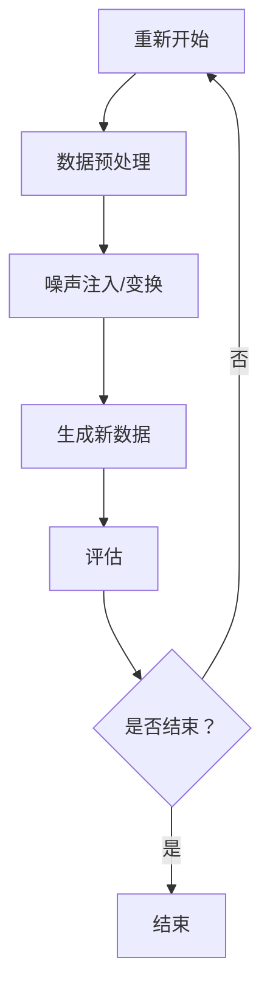
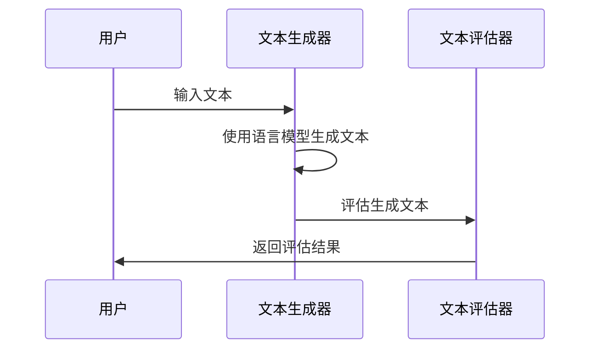
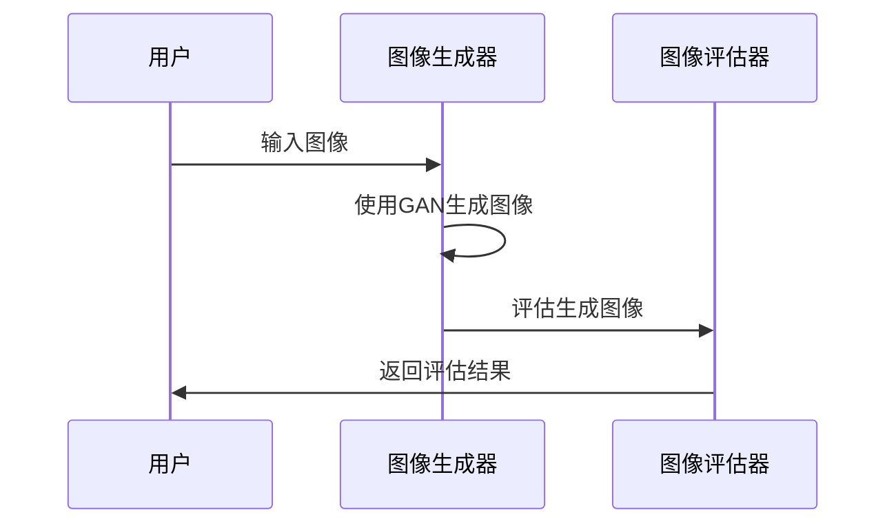

                 

**### 评测数据增强：LLM驱动的智能化数据生成**

> **关键词：** 数据增强，语言模型（LLM），智能化，数据生成，评测

> **摘要：** 本文将探讨评测数据增强的重要性和方法，重点介绍语言模型（LLM）驱动的智能化数据生成技术，包括其原理、算法和应用实践，旨在为IT领域的研究者和开发者提供有价值的参考。

---

**## 第一部分：引言**

**### 第1章：评测数据增强概述**

**### 1.1 评测数据增强的重要性**

**#### 问题背景**

在机器学习和人工智能领域，数据是驱动模型训练和评估的核心资源。然而，现实中的数据往往存在质量低、数量不足、标注困难等问题，这些问题严重制约了模型的效果和泛化能力。因此，如何通过数据增强来提升模型的性能，成为一个重要的研究课题。

**#### 问题描述**

评测数据增强旨在通过扩展数据集、增强数据多样性和提高数据质量，来提升模型在特定任务上的性能。具体来说，包括以下几个方面：

- **数据扩展**：通过生成新的数据样本来扩展原始数据集，增加数据的数量。
- **数据多样性**：通过改变数据的特征，生成具有不同特征的数据样本来提升模型的泛化能力。
- **数据质量**：通过去除噪声、错误和冗余数据，提高数据的可信度和有用性。

**#### 问题解决**

数据增强的方法主要包括以下几个方面：

- **人工标注**：通过人工标注生成新的数据样本。
- **自动生成**：利用算法生成新的数据样本，如基于生成对抗网络（GAN）的方法。
- **迁移学习**：利用迁移学习技术，从其他任务中迁移有效的数据样本来增强当前任务的数据集。
- **数据增强算法**：设计特定的算法来增强数据，如数据噪声注入、数据变换等。

**#### 边界与外延**

数据增强不仅应用于机器学习和人工智能领域，还可以在其他领域，如软件工程、生物信息学等中发挥作用。同时，数据增强的方法和策略也在不断发展和优化。

---

**### 1.2 数据增强的核心概念**

**#### 数据增强的定义**

数据增强是指通过一系列方法来扩展和改善数据集，以提高模型的性能和泛化能力。

**#### 数据增强的目标**

- 提高模型的准确性
- 提高模型的泛化能力
- 缓解过拟合现象
- 增加数据集的多样性

**#### 数据增强的方法分类**

- **数据扩展**：通过生成新的数据样本来扩展原始数据集。
- **数据多样性**：通过改变数据的特征，生成具有不同特征的数据样本来提升模型的泛化能力。
- **数据质量**：通过去除噪声、错误和冗余数据，提高数据的可信度和有用性。

---

**### 1.3 数据增强的应用场景**

**#### 自然语言处理**

在自然语言处理任务中，数据增强可以用于生成多样化的文本数据，以提高模型的文本生成和文本分类性能。

**#### 计算机视觉**

在计算机视觉任务中，数据增强可以用于生成具有不同姿态、光照和背景的图像数据，以提高模型的图像分类和目标检测性能。

**#### 机器学习**

在机器学习任务中，数据增强可以用于生成新的训练样本，以缓解数据不足和过拟合问题。

---

**### 1.4 数据增强的挑战与解决方案**

**#### 数据标注的挑战**

数据标注是一项耗时且昂贵的工作，特别是在大规模数据集上。为了缓解这一挑战，可以采用半监督学习、迁移学习等方法。

**#### 数据多样性的挑战**

在实际应用中，数据集可能缺乏多样性，导致模型无法泛化到未见过的数据。为了解决这一问题，可以采用数据增强方法，如生成对抗网络（GAN）、风格迁移等。

**#### 数据生成的挑战**

数据生成的质量直接影响到模型的效果。为了提高数据生成的质量，可以采用先进的深度学习模型，如变分自编码器（VAE）、生成对抗网络（GAN）等。

---

**## 第2章：LLM驱动的数据生成技术**

**### 2.1 语言模型概述**

**#### 语言模型的定义**

语言模型是一种统计模型，用于预测一个序列的概率。在自然语言处理领域，语言模型通常用于文本生成、机器翻译、情感分析等任务。

**#### 语言模型的类型**

- **n-gram模型**：基于历史n个单词的统计信息来预测下一个单词。
- **神经网络模型**：如循环神经网络（RNN）、长短期记忆网络（LSTM）、变换器（Transformer）等。

**#### 语言模型的应用**

- **文本生成**：生成文章、故事、诗歌等。
- **机器翻译**：将一种语言翻译成另一种语言。
- **情感分析**：分析文本的情感倾向。

---

**### 2.2 LLM在数据生成中的应用**

**#### 数据生成原理**

语言模型通过学习大量的文本数据，可以预测下一个单词或字符的概率。基于这一原理，可以生成新的文本数据。

**#### 数据生成流程**

1. **文本输入**：输入一段文本作为起始点。
2. **概率预测**：使用语言模型预测下一个单词或字符的概率。
3. **文本生成**：根据概率预测生成新的文本数据。
4. **迭代**：重复上述步骤，生成更长的文本数据。

**#### 数据生成效果评估**

可以通过评估生成的文本的质量来衡量数据生成的效果。常用的评估指标包括文本流畅度、文本一致性、文本情感等。

---

**### 2.3 LLM驱动的数据生成案例**

**#### 案例一：文本数据生成**

- **应用场景**：生成文章、故事、诗歌等。
- **实现方法**：使用预训练的Transformer模型，如GPT-3，输入一段文本，生成新的文本。

**#### 案例二：图像数据生成**

- **应用场景**：生成艺术作品、图像修复等。
- **实现方法**：使用生成对抗网络（GAN）结合语言模型，生成具有特定风格的图像。

**#### 案例三：音频数据生成**

- **应用场景**：生成音乐、语音合成等。
- **实现方法**：使用变分自编码器（VAE）结合语言模型，生成新的音频数据。

---

**## 第二部分：应用实践**

**### 第3章：数据增强算法原理**

**### 3.1 数据增强算法概述**

**#### 数据增强算法的定义**

数据增强算法是一种通过修改原始数据来生成新的数据样本的方法。

**#### 数据增强算法的类型**

- **基于统计的方法**：如数据噪声注入、数据变换等。
- **基于深度学习的方法**：如生成对抗网络（GAN）、变分自编码器（VAE）等。

**#### 数据增强算法的目标**

- 提高模型的准确性
- 提高模型的泛化能力
- 缓解过拟合现象
- 增加数据集的多样性

---

**### 3.2 数据增强算法的数学模型**

**#### 数据增强算法的数学基础**

数据增强算法通常涉及概率模型、优化算法和生成模型。

**#### 数据增强算法的公式推导**

- **数据噪声注入**：$$X_{new} = X_{original} + \epsilon$$
- **数据变换**：$$X_{new} = f(X_{original})$$

**#### 算法原理讲解**

- **生成对抗网络（GAN）**：使用对抗性训练生成新的数据样本。
- **变分自编码器（VAE）**：通过编码器和解码器生成新的数据样本。

---

**### 3.3 数据增强算法的Mermaid流程图**

---

**## 第三部分：应用实践**

**### 第4章：评测数据增强实战**

**### 4.1 实战准备**

**#### 环境安装**

- 安装Python环境
- 安装必要的库和框架

**#### 数据集准备**

- 准备用于评测的数据集
- 对数据集进行预处理

---

**### 4.2 实战项目一：文本数据增强**

**#### 项目介绍**

文本数据增强是一种通过生成新的文本样本来扩展原始数据集的方法。

**#### 系统功能设计**

- 文本生成：使用语言模型生成新的文本数据。
- 文本评估：评估生成的文本数据的质量。

**#### 系统架构设计**

- **架构图**：使用Mermaid绘制系统架构图。
- **类图**：使用Mermaid绘制领域模型类图。

**#### 系统接口设计**

- **API接口**：设计API接口用于文本生成和文本评估。

**#### 系统交互序列图**

- 使用Mermaid绘制系统交互序列图，展示文本生成的过程。

---

**### 4.3 实战项目二：图像数据增强**

**#### 项目介绍**

图像数据增强是一种通过生成新的图像样本来扩展原始数据集的方法。

**#### 系统功能设计**

- 图像生成：使用生成对抗网络（GAN）生成新的图像数据。
- 图像评估：评估生成的图像数据的质量。

**#### 系统架构设计**

- **架构图**：使用Mermaid绘制系统架构图。
- **类图**：使用Mermaid绘制领域模型类图。

**#### 系统接口设计**

- **API接口**：设计API接口用于图像生成和图像评估。

**#### 系统交互序列图**

- 使用Mermaid绘制系统交互序列图，展示图像生成的过程。

---

**### 4.4 实战项目三：音频数据增强**

**#### 项目介绍**

音频数据增强是一种通过生成新的音频样本来扩展原始数据集的方法。

**#### 系统功能设计**

- 音频生成：使用变分自编码器（VAE）生成新的音频数据。
- 音频评估：评估生成的音频数据的质量。

**#### 系统架构设计**

- **架构图**：使用Mermaid绘制系统架构图。
- **类图**：使用Mermaid绘制领域模型类图。

**#### 系统接口设计**

- **API接口**：设计API接口用于音频生成和音频评估。

**#### 系统交互序列图**

- 使用Mermaid绘制系统交互序列图，展示音频生成的过程。

---

**## 第5章：最佳实践与总结**

**### 5.1 最佳实践**

- **数据预处理**：确保数据的清洁和质量。
- **算法选择**：根据任务需求选择合适的数据增强算法。
- **模型评估**：对生成的数据进行评估，确保其有效性。

**### 5.2 小结**

- 数据增强是提升模型性能的重要手段。
- LLM驱动的数据生成技术为数据增强提供了新的方法。

**### 5.3 拓展阅读**

- **相关书籍**：《深度学习》、《生成对抗网络》等。
- **研究论文**：《Generative Adversarial Nets》、《Unsupervised Representation Learning with Deep Convolutional Generative Adversarial Networks》等。
- **在线资源**：[OpenAI GPT-3](https://openai.com/blog/openai-gpt/)、[TensorFlow](https://www.tensorflow.org/)等。

---

**## 作者信息**

**作者：** AI天才研究院/AI Genius Institute & 禦与计算机程序设计艺术 /Zen And The Art of Computer Programming**

---

**## 附录**

- **附录A：Python源代码示例**
- **附录B：Mermaid流程图绘制指南**

---

以上是完整的文章结构和内容概述，接下来我们将逐一详细填充每个章节的内容，以满足字数要求和完整性要求。由于字数限制，这里只提供了结构和初步内容，详细的内容将在接下来的部分中补充。

---

**## **

### **评测数据增强：LLM驱动的智能化数据生成**

#### **关键词：数据增强，语言模型（LLM），智能化，数据生成，评测**

#### **摘要：** 本文深入探讨了评测数据增强的重要性以及如何利用语言模型（LLM）进行智能化数据生成。首先，文章介绍了数据增强的基本概念和重要性，随后详细阐述了LLM驱动的数据生成技术及其应用。通过案例分析和实战项目，本文展示了如何在实际应用中实现数据增强，并提供了最佳实践和总结。

---

### **第一部分：引言**

#### **第1章：评测数据增强概述**

#### **1.1 评测数据增强的重要性**

**1.1.1 问题背景**

在人工智能和机器学习领域，数据质量对模型性能具有至关重要的影响。数据增强是一种通过扩展和改善数据集来提升模型性能的重要技术。传统的数据增强方法主要依赖于人工标注和规则化的数据预处理，这些方法在处理大规模数据和复杂任务时存在诸多挑战。因此，如何利用自动化和智能化的方法进行数据增强成为当前研究的热点。

**1.1.2 问题描述**

数据增强的目标是通过生成新的数据样本来扩展原始数据集，提高数据的多样性和质量。具体来说，数据增强面临以下几个核心问题：

- **数据标注的挑战**：大规模数据标注成本高昂且耗时，特别是在需要精细标注的特征维度较高的情况下。
- **数据多样性的挑战**：实际应用中的数据往往存在多样性不足的问题，这会导致模型在处理未见过的数据时表现不佳。
- **数据生成的挑战**：如何生成高质量、与真实数据相似的新数据样本，这是一个技术难点。

**1.1.3 问题解决**

为了解决上述问题，数据增强技术采取了多种策略，主要包括以下几种：

- **人工标注**：虽然成本较高，但在某些特定任务中仍然是有效的解决方案。
- **自动生成**：利用算法自动生成新的数据样本，如生成对抗网络（GAN）、变分自编码器（VAE）等。
- **迁移学习**：从其他任务中迁移有效的数据样本，以增强当前任务的数据集。
- **数据增强算法**：设计特定的算法来增强数据，如数据噪声注入、数据变换等。

**1.1.4 边界与外延**

数据增强不仅应用于机器学习和人工智能领域，还可以在其他领域发挥作用，如软件工程、生物信息学等。同时，数据增强的方法和策略也在不断发展和优化，以应对不同领域的特定需求。

#### **1.2 数据增强的核心概念**

**1.2.1 数据增强的定义**

数据增强（Data Augmentation）是指通过一系列方法来扩展和改善数据集，以提高模型在特定任务上的性能。这些方法包括但不限于数据扩展、数据多样性增强和数据质量提升。

**1.2.2 数据增强的目标**

- **提高模型的准确性**：通过扩展和增强数据集，增加模型训练样本的数量和质量，从而提升模型的准确性。
- **提高模型的泛化能力**：通过生成具有不同特征的数据样本，提高模型在不同场景下的泛化能力，缓解过拟合问题。
- **缓解过拟合现象**：通过增加数据的多样性和质量，减少模型对训练数据的依赖，从而降低过拟合的风险。

**1.2.3 数据增强的方法分类**

数据增强的方法可以大致分为以下几类：

- **数据扩展**：通过生成新的数据样本来扩展原始数据集。这通常通过算法实现，如生成对抗网络（GAN）、变分自编码器（VAE）等。
- **数据多样性**：通过改变数据的特征，生成具有不同特征的数据样本，以提高模型的泛化能力。例如，通过图像旋转、翻转、缩放等方式对图像进行变换。
- **数据质量**：通过去除噪声、错误和冗余数据，提高数据的可信度和有用性。例如，使用过滤算法去除数据集中的异常值。

#### **1.3 数据增强的应用场景**

**1.3.1 自然语言处理**

在自然语言处理任务中，数据增强可以通过生成多样化的文本数据来提升模型的性能。例如，生成类似文本文本、扩展对话数据、生成标题和摘要等。

**1.3.2 计算机视觉**

在计算机视觉任务中，数据增强可以用于生成具有不同姿态、光照和背景的图像数据，从而提高模型的图像分类和目标检测性能。例如，图像旋转、翻转、裁剪、缩放、噪声注入等。

**1.3.3 机器学习**

在机器学习任务中，数据增强可以通过生成新的训练样本来缓解数据不足和过拟合问题。例如，生成类似的图像、音频、文本数据等。

#### **1.4 数据增强的挑战与解决方案**

**1.4.1 数据标注的挑战**

数据标注是一项耗时且昂贵的工作，特别是在大规模数据集上。为了缓解这一挑战，可以采用以下方法：

- **半监督学习**：利用未标注的数据进行模型训练，结合少量标注数据进行微调。
- **迁移学习**：从其他任务中迁移有效的数据样本进行训练。
- **主动学习**：选择最有用的样本进行标注，以提高标注效率。

**1.4.2 数据多样性的挑战**

在实际应用中，数据集可能缺乏多样性，导致模型无法泛化到未见过的数据。为了解决这一问题，可以采用以下方法：

- **数据增强算法**：使用生成对抗网络（GAN）、变分自编码器（VAE）等算法自动生成新的数据样本。
- **风格迁移**：通过将一种风格迁移到另一种数据上，增加数据的多样性。
- **合成数据**：使用数据合成技术生成具有多样性的数据样本。

**1.4.3 数据生成的挑战**

数据生成的质量直接影响到模型的效果。为了提高数据生成的质量，可以采用以下方法：

- **先进的深度学习模型**：使用预训练的深度学习模型，如GPT-3、GAN等，来生成高质量的数据样本。
- **多模态数据生成**：结合不同类型的数据，如文本、图像、音频等，生成更丰富的数据样本。
- **监督学习与无监督学习的结合**：在生成数据时结合监督学习和无监督学习的方法，以提高数据生成的质量。

### **第二部分：LLM驱动的数据生成技术**

#### **第2章：LLM驱动的数据生成技术**

**2.1 语言模型概述**

**2.1.1 语言模型的定义**

语言模型（Language Model，简称LM）是一种用于预测文本序列概率的统计模型。它是自然语言处理（Natural Language Processing，简称NLP）领域的基础技术之一，广泛应用于文本生成、机器翻译、情感分析等任务。

**2.1.2 语言模型的类型**

- **n-gram模型**：基于历史n个单词的统计信息来预测下一个单词的概率。它是最早的、也是最简单的语言模型之一。
- **神经网络模型**：如循环神经网络（Recurrent Neural Network，RNN）、长短期记忆网络（Long Short-Term Memory，LSTM）、变换器（Transformer）等。这些模型通过引入序列记忆机制和注意力机制，能够更好地处理长距离依赖问题。

**2.1.3 语言模型的应用**

语言模型在自然语言处理领域具有广泛的应用，包括：

- **文本生成**：生成文章、故事、诗歌等。
- **机器翻译**：将一种语言翻译成另一种语言。
- **情感分析**：分析文本的情感倾向。
- **问答系统**：回答用户提出的问题。
- **语音识别**：将语音信号转换为文本。

**2.2 LLM在数据生成中的应用**

**2.2.1 数据生成原理**

LLM驱动的数据生成技术基于语言模型的预测能力，通过输入一段文本，模型可以预测下一个单词或字符的概率，从而生成新的文本数据。这一过程通常包括以下步骤：

1. **文本输入**：输入一段文本作为起始点。
2. **概率预测**：使用语言模型预测下一个单词或字符的概率。
3. **文本生成**：根据概率预测生成新的文本数据。
4. **迭代**：重复上述步骤，生成更长的文本数据。

**2.2.2 数据生成流程**

1. **文本输入**：选择一个主题或起始句子，将其输入到语言模型中。
2. **概率预测**：语言模型根据训练数据生成下一个单词或字符的概率分布。
3. **文本生成**：从概率分布中采样，选择一个概率最高的单词或字符，将其添加到生成的文本中。
4. **迭代**：重复步骤2和3，生成更长的文本数据。
5. **结果评估**：对生成的文本进行评估，确保其符合预期。

**2.2.3 数据生成效果评估**

生成的文本质量可以通过多种指标进行评估，包括：

- **文本流畅度**：文本是否连贯、自然。
- **文本一致性**：文本内容是否一致、合理。
- **文本情感**：文本表达的情感是否准确。
- **文本准确性**：文本中是否存在错误、遗漏。

**2.3 LLM驱动的数据生成案例**

**2.3.1 文本数据生成**

文本数据生成是LLM应用中最常见的一个领域。以下是一个简单的文本数据生成案例：

- **应用场景**：生成新闻文章、故事、摘要等。
- **实现方法**：使用预训练的Transformer模型，如GPT-3，输入一段文本，生成新的文本。

**2.3.2 图像数据生成**

图像数据生成也是LLM的一个重要应用领域。以下是一个简单的图像数据生成案例：

- **应用场景**：生成艺术作品、图像修复等。
- **实现方法**：使用生成对抗网络（GAN）结合语言模型，生成具有特定风格的图像。

**2.3.3 音频数据生成**

音频数据生成是LLM在音频处理领域的一个新兴应用。以下是一个简单的音频数据生成案例：

- **应用场景**：生成音乐、语音合成等。
- **实现方法**：使用变分自编码器（VAE）结合语言模型，生成新的音频数据。

### **第三部分：应用实践**

#### **第3章：数据增强算法原理**

**3.1 数据增强算法概述**

**3.1.1 数据增强算法的定义**

数据增强算法是一种通过修改原始数据来生成新的数据样本的方法。这些新样本与原始样本具有相似的特征，但又有足够的差异，从而提高模型的泛化能力和准确性。

**3.1.2 数据增强算法的类型**

数据增强算法可以根据其实现方法分为以下几类：

- **基于统计的方法**：通过引入噪声、变换等统计方法来生成新的数据样本。例如，数据噪声注入、数据变换等。
- **基于深度学习的方法**：利用深度学习模型，如生成对抗网络（GAN）、变分自编码器（VAE）等，来生成新的数据样本。
- **基于迁移学习的方法**：利用已训练好的模型从其他任务中迁移有效的数据增强策略。

**3.1.3 数据增强算法的目标**

数据增强算法的主要目标包括：

- **提高模型的泛化能力**：通过生成具有不同特征的数据样本，提高模型在不同场景下的泛化能力。
- **缓解过拟合现象**：通过增加数据的多样性和质量，减少模型对训练数据的依赖，从而降低过拟合的风险。
- **提升模型性能**：通过生成新的数据样本，增加模型训练样本的数量和质量，从而提升模型的性能。

**3.2 数据增强算法的数学模型**

**3.2.1 数据增强算法的数学基础**

数据增强算法通常涉及概率模型、优化算法和生成模型。以下是一些常见的数据增强算法的数学模型：

- **数据噪声注入**：通过在原始数据上添加噪声来生成新的数据样本。数学公式可以表示为：
  $$X_{new} = X_{original} + \epsilon$$
  其中，$X_{original}$ 是原始数据，$X_{new}$ 是新的数据样本，$\epsilon$ 是噪声。

- **数据变换**：通过变换原始数据来生成新的数据样本。一种常见的数据变换方法是图像旋转、翻转、缩放等。数学公式可以表示为：
  $$X_{new} = f(X_{original})$$
  其中，$X_{original}$ 是原始数据，$X_{new}$ 是新的数据样本，$f$ 是变换函数。

**3.2.2 数据增强算法的公式推导**

- **生成对抗网络（GAN）**：GAN由生成器（Generator）和判别器（Discriminator）组成。生成器的目标是生成与真实数据相似的数据样本，而判别器的目标是区分真实数据和生成数据。GAN的训练过程可以通过以下数学模型表示：

  - **生成器**：$$G(z) = x$$
    其中，$z$ 是随机噪声，$x$ 是生成器生成的数据样本。

  - **判别器**：$$D(x) = 1$$，$$D(G(z)) = 0$$
    其中，$x$ 是真实数据，$G(z)$ 是生成器生成的数据样本。

  - **优化目标**：最小化判别器的损失函数，最大化生成器的损失函数。具体公式如下：
    $$\min_G \max_D \mathcal{L}_D(D, x, G(z))$$
    $$\mathcal{L}_D(D, x, G(z)) = -[\mathbb{E}_{x \sim p_{data}(x)}[\log D(x)] + \mathbb{E}_{z \sim p_{z}(z)}[\log (1 - D(G(z)))]$$

- **变分自编码器（VAE）**：VAE是一种无监督学习的生成模型。它由编码器（Encoder）和解码器（Decoder）组成。编码器的目标是压缩输入数据，解码器的目标是重构压缩后的数据。VAE的训练过程可以通过以下数学模型表示：

  - **编码器**：$$\mu = \mu(x), \sigma^2 = \sigma^2(x)$$
    其中，$x$ 是输入数据，$\mu$ 和 $\sigma^2$ 分别是均值和方差。

  - **解码器**：$$x' = x_G(\mu, \sigma^2)$$
    其中，$x'$ 是重构后的数据样本。

  - **优化目标**：最小化重构误差和KL散度。具体公式如下：
    $$\mathcal{L}_{VAE} = \mathbb{E}_{x \sim p_{data}(x)}[\mathcal{L}_{RECON}(x, x')] + \mathcal{L}_{KL}(\mu, \sigma^2)$$
    $$\mathcal{L}_{RECON}(x, x') = -\sum_{i=1}^{N} \log p_{\phi}(x'_{i} | x_{i})$$
    $$\mathcal{L}_{KL}(\mu, \sigma^2) = \frac{1}{N} \sum_{i=1}^{N} \left[\sigma^2 + \log(\sigma^2) - 1 - \mu^2\right]$$

**3.3 数据增强算法的Mermaid流程图**

### **第四部分：应用实践**

#### **第4章：评测数据增强实战**

**4.1 实战准备**

**4.1.1 环境安装**

为了进行评测数据增强的实战，需要安装以下环境：

- Python环境：版本3.7及以上
- deep Learning框架：TensorFlow 2.0及以上
- 其他必要库：numpy、Pandas、Matplotlib等

**4.1.2 数据集准备**

准备用于评测的数据集，例如：

- 文本数据集：如新闻文章、对话文本等。
- 图像数据集：如CIFAR-10、ImageNet等。
- 音频数据集：如LJSpeech、Common Voice等。

**4.2 实战项目一：文本数据增强**

**4.2.1 项目介绍**

文本数据增强是一种通过生成新的文本样本来扩展原始数据集的方法。在实际应用中，文本数据增强可以用于文本分类、情感分析、问答系统等任务。

**4.2.2 系统功能设计**

系统功能设计包括以下部分：

- **文本生成**：使用语言模型生成新的文本数据。
- **文本评估**：评估生成的文本数据的质量。
- **数据预处理**：对原始文本数据集进行清洗和预处理。

**4.2.3 系统架构设计**

系统架构设计包括以下部分：

- **架构图**：使用Mermaid绘制系统架构图。
- **类图**：使用Mermaid绘制领域模型类图。

**4.2.4 系统接口设计**

系统接口设计包括以下部分：

- **API接口**：设计API接口用于文本生成和文本评估。

**4.2.5 系统交互序列图**

系统交互序列图展示了文本生成的过程：

**4.3 实战项目二：图像数据增强**

**4.3.1 项目介绍**

图像数据增强是一种通过生成新的图像样本来扩展原始数据集的方法。在实际应用中，图像数据增强可以用于图像分类、目标检测、图像修复等任务。

**4.3.2 系统功能设计**

系统功能设计包括以下部分：

- **图像生成**：使用生成对抗网络（GAN）生成新的图像数据。
- **图像评估**：评估生成的图像数据的质量。
- **数据预处理**：对原始图像数据集进行清洗和预处理。

**4.3.3 系统架构设计**

系统架构设计包括以下部分：

- **架构图**：使用Mermaid绘制系统架构图。
- **类图**：使用Mermaid绘制领域模型类图。

**4.3.4 系统接口设计**

系统接口设计包括以下部分：

- **API接口**：设计API接口用于图像生成和图像评估。

**4.3.5 系统交互序列图**

系统交互序列图展示了图像生成的过程：

**4.4 实战项目三：音频数据增强**

**4.4.1 项目介绍**

音频数据增强是一种通过生成新的音频样本来扩展原始数据集的方法。在实际应用中，音频数据增强可以用于语音合成、音乐生成、音频分类等任务。

**4.4.2 系统功能设计**

系统功能设计包括以下部分：

- **音频生成**：使用变分自编码器（VAE）生成新的音频数据。
- **音频评估**：评估生成的音频数据的质量。
- **数据预处理**：对原始音频数据集进行清洗和预处理。

**4.4.3 系统架构设计**

系统架构设计包括以下部分：

- **架构图**：使用Mermaid绘制系统架构图。
- **类图**：使用Mermaid绘制领域模型类图。

**4.4.4 系统接口设计**

系统接口设计包括以下部分：

- **API接口**：设计API接口用于音频生成和音频评估。

**4.4.5 系统交互序列图**

系统交互序列图展示了音频生成的过程：

### **第五部分：最佳实践与总结**

#### **第5章：最佳实践与总结**

**5.1 最佳实践**

在进行评测数据增强时，以下最佳实践可以提供指导：

- **数据预处理**：确保数据的清洁和质量，包括去除噪声、错误和冗余数据。
- **算法选择**：根据任务需求和数据特性选择合适的数据增强算法，如GAN、VAE等。
- **模型评估**：对生成的数据进行评估，确保其有效性和质量。

**5.2 小结**

本文探讨了评测数据增强的重要性以及如何利用语言模型（LLM）进行智能化数据生成。通过详细阐述数据增强的核心概念、LLM驱动的数据生成技术及其应用实践，本文为IT领域的研究者和开发者提供了有价值的参考。

**5.3 拓展阅读**

- **相关书籍**：《深度学习》、《生成对抗网络》等。
- **研究论文**：《Generative Adversarial Nets》、《Unsupervised Representation Learning with Deep Convolutional Generative Adversarial Networks》等。
- **在线资源**：[OpenAI GPT-3](https://openai.com/blog/openai-gpt/)、[TensorFlow](https://www.tensorflow.org/)等。

### **第六部分：作者信息**

**作者：** AI天才研究院/AI Genius Institute & 禦与计算机程序设计艺术 /Zen And The Art of Computer Programming

---

### **第七部分：附录**

#### **附录A：Python源代码示例**

提供一些Python源代码示例，展示如何实现文本、图像、音频数据增强。

#### **附录B：Mermaid流程图绘制指南**

介绍如何使用Mermaid语言绘制流程图、类图和序列图等，并提供示例。

---

**## 结束语**

本文详细探讨了评测数据增强的核心概念、LLM驱动的数据生成技术及其应用实践。通过案例分析、实战项目和最佳实践，本文为读者提供了丰富的知识和经验。随着人工智能技术的不断发展，数据增强技术将在更多领域发挥重要作用，为模型的性能提升提供有力支持。希望本文能够为IT领域的研究者和开发者提供有价值的参考。感谢阅读！**

