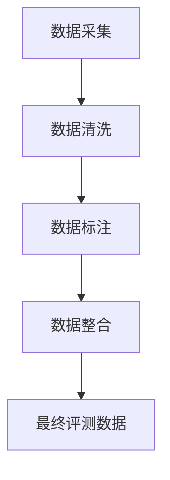
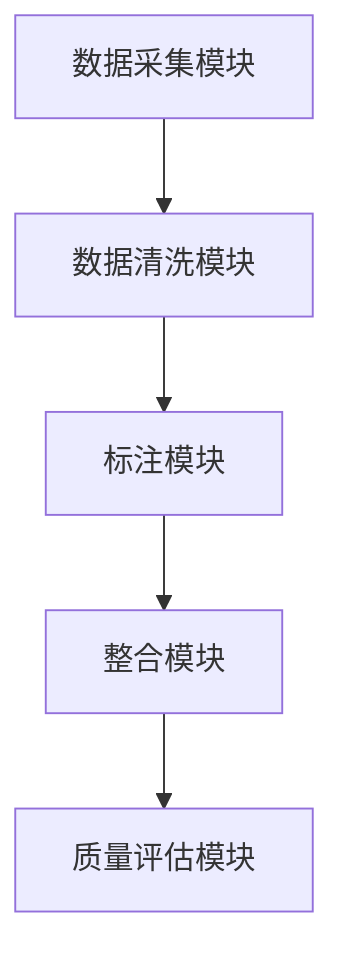
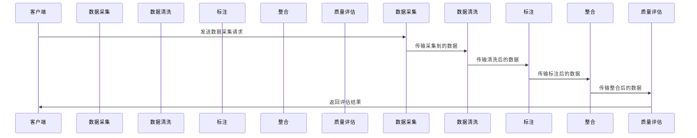
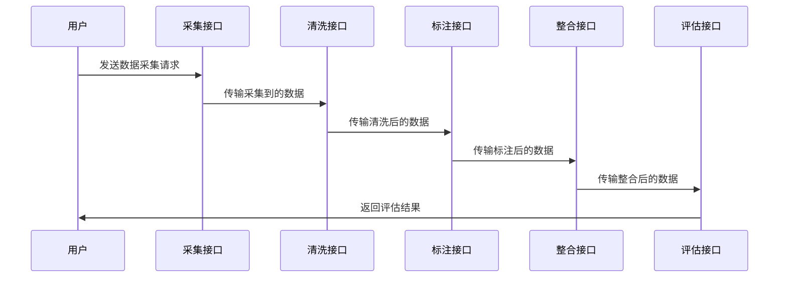

                 

# 评测数据的动态更新：保持与LLM发展同步

## 关键词

- 评测数据
- 动态更新
- 大型语言模型（LLM）
- 算法
- 系统架构

## 摘要

本文探讨了评测数据在大型语言模型（LLM）训练中的重要性，并提出了动态更新评测数据的方法和策略。随着LLM技术的快速发展，传统的评测数据难以满足训练需求，动态更新评测数据成为保持LLM性能的关键。文章从背景介绍、核心概念与联系、算法原理讲解、系统分析与架构设计、项目实战和最佳实践与总结等多个方面，详细阐述了评测数据动态更新的理论、方法、实现和应用。本文旨在为研究人员和开发者提供有价值的参考，以推动LLM技术的发展和实际应用。

## 目录大纲

### 第一部分：背景介绍与核心概念

#### 第1章：问题背景与核心概念
1.1 问题背景
1.2 核心概念
1.3 动态更新评测数据的必要性

### 第二部分：核心概念与联系

#### 第2章：核心概念原理与联系
2.1 评测数据的分类与特点
2.2 LLM的基本原理与架构
2.3 动态更新评测数据的方法与策略

### 第三部分：算法原理讲解

#### 第3章：动态更新评测数据算法原理
3.1 算法概述
3.2 数学模型与公式
3.3 算法实现与示例

### 第四部分：系统分析与架构设计

#### 第4章：系统功能设计与架构设计
4.1 问题场景介绍
4.2 系统功能设计
4.3 系统架构设计

### 第五部分：项目实战

#### 第5章：项目实施与案例分析
5.1 环境安装与配置
5.2 系统核心实现源代码
5.3 案例分析与讲解

### 第六部分：最佳实践与总结

#### 第6章：最佳实践与注意事项
6.1 最佳实践
6.2 注意事项

#### 第7章：总结与展望
7.1 总结
7.2 展望

## 1.1 问题背景

### 评测数据的重要性

评测数据是评估机器学习模型性能的关键因素。对于大型语言模型（LLM）而言，评测数据的质量和多样性直接影响模型的准确性和泛化能力。然而，随着LLM技术的快速发展，传统的评测数据已经无法满足训练需求。一方面，现有的评测数据集可能过于陈旧，无法反映当前语言环境的真实情况；另一方面，评测数据集的规模和多样性也难以满足大规模训练的需求。

### LLM的发展与挑战

大型语言模型（LLM）在自然语言处理领域取得了显著的成果，但同时也面临着一系列挑战。首先，LLM的训练需要大量的计算资源和时间，这导致了训练成本的高昂。其次，LLM的训练和评估过程需要大量的评测数据，而这些数据往往难以获取和整理。最后，LLM的性能评估标准和方法也在不断演变，传统的评测方法可能无法准确反映LLM的实际性能。

### 动态更新评测数据的必要性

为了解决上述问题，动态更新评测数据成为保持LLM性能的关键。动态更新评测数据意味着实时获取和整理与当前语言环境相关的新数据，从而提高评测数据的时效性和准确性。此外，动态更新评测数据还可以根据训练需求调整数据集的规模和多样性，以满足大规模训练的需要。

## 1.2 核心概念

### 评测数据的动态更新

评测数据的动态更新是指在训练过程中，根据训练需求和语言环境的变化，实时获取和整理新的评测数据，以保持评测数据的时效性和准确性。动态更新评测数据的方法包括数据采集、数据清洗、数据标注和数据整合等。

### LLM的发展趋势

LLM的发展趋势主要体现在以下几个方面：首先，模型规模的不断扩大，使得LLM在处理复杂任务时具有更高的性能；其次，预训练技术的不断发展，使得LLM在训练过程中可以更好地利用大量无标注数据；最后，多模态融合技术的应用，使得LLM可以处理更丰富的数据类型。

### 动态更新的技术挑战与策略

动态更新评测数据面临一系列技术挑战，包括数据采集的实时性、数据清洗的准确性、数据标注的效率和数据整合的效率等。为了解决这些挑战，需要采取一系列策略，如分布式数据采集、自动化数据清洗、半监督学习数据标注和分布式数据整合等。

## 1.3 动态更新评测数据的必要性

### 评测数据在LLM训练中的关键作用

评测数据是评估LLM性能的重要依据，其质量直接影响模型的训练效果和实际应用价值。传统的评测数据由于时效性和多样性的不足，难以准确反映LLM的实际性能。因此，动态更新评测数据成为提高LLM性能的关键。

### 动态更新评测数据的优势

动态更新评测数据具有以下优势：

1. **时效性**：动态更新评测数据可以实时获取与当前语言环境相关的最新数据，确保评测数据的时效性，从而更准确地评估LLM的性能。

2. **多样性**：动态更新评测数据可以根据训练需求调整数据集的规模和多样性，从而提高模型在不同场景下的泛化能力。

3. **适应性**：动态更新评测数据可以适应LLM技术的快速发展，确保评测数据与训练需求保持同步，从而提高模型训练的效率和质量。

### 动态更新评测数据的实现方法

动态更新评测数据的实现方法包括以下几个方面：

1. **数据采集**：利用分布式数据采集技术，实时获取与当前语言环境相关的数据。

2. **数据清洗**：采用自动化数据清洗技术，对采集到的数据进行预处理，确保数据的质量。

3. **数据标注**：采用半监督学习技术，对清洗后的数据进行标注，提高标注效率。

4. **数据整合**：利用分布式数据整合技术，将标注后的数据整合到评测数据集中，实现动态更新。

## 1.4 核心概念原理与联系

### 评测数据的分类与特点

评测数据可以根据不同的分类标准进行划分。常见的分类标准包括：

1. **按照数据来源**：可分为公开数据集、私有数据集和在线数据集。

2. **按照数据类型**：可分为文本数据、图像数据、音频数据和多模态数据。

每种数据类型都有其独特的特点和应用场景。

### LLM的基本原理与架构

大型语言模型（LLM）是基于深度学习的自然语言处理模型，其基本原理包括：

1. **预训练**：使用大规模无标注语料对模型进行预训练，使其具备基本的语言理解能力。

2. **微调**：在特定任务上对模型进行微调，使其适应特定场景。

LLM的架构通常包括编码器（Encoder）和解码器（Decoder）两部分。

### 动态更新评测数据的方法与策略

动态更新评测数据的方法主要包括：

1. **实时数据采集**：通过分布式数据采集技术，实时获取与当前语言环境相关的数据。

2. **自动化数据清洗**：利用自动化工具对采集到的数据进行清洗，确保数据质量。

3. **半监督学习数据标注**：采用半监督学习技术，对清洗后的数据进行标注，提高标注效率。

4. **分布式数据整合**：利用分布式数据整合技术，将标注后的数据整合到评测数据集中，实现动态更新。

### 概念属性特征对比表格

| 概念           | 属性特征                              | 对比分析                                   |
|--------------|---------------------------------|------------------------------------------|
| 评测数据       | 时效性、多样性、准确性                  | 动态更新评测数据在时效性和多样性方面具有优势           |
| LLM           | 预训练、微调、多模态处理                | LLM在处理多模态数据方面具有优势                   |
| 动态更新方法     | 数据采集、数据清洗、数据标注、数据整合    | 动态更新方法提高了数据质量和标注效率               |

### ER实体关系图架构

```mermaid
erDiagram
  数据采集 --> 数据清洗 : "清洗"
  数据清洗 --> 数据标注 : "标注"
  数据标注 --> 数据整合 : "整合"
  数据整合 --> 评测数据 : "更新"
```

## 2.1 算法概述

### 动态更新算法的目标

动态更新算法的目标是实时获取和整合与当前语言环境相关的评测数据，以提高LLM的训练效果和实际应用价值。具体目标包括：

1. **实时性**：确保评测数据能够实时反映当前语言环境的真实情况。

2. **准确性**：通过数据清洗、标注和整合，提高评测数据的准确性和质量。

3. **多样性**：根据训练需求调整评测数据的规模和多样性，提高模型在不同场景下的泛化能力。

### 动态更新算法的分类

动态更新算法可以分为以下几类：

1. **基于实时数据采集的动态更新算法**：通过分布式数据采集技术，实时获取与当前语言环境相关的数据。

2. **基于自动化数据清洗的动态更新算法**：利用自动化工具对采集到的数据进行清洗，确保数据质量。

3. **基于半监督学习数据标注的动态更新算法**：采用半监督学习技术，对清洗后的数据进行标注，提高标注效率。

4. **基于分布式数据整合的动态更新算法**：利用分布式数据整合技术，将标注后的数据整合到评测数据集中，实现动态更新。

### 动态更新算法的核心要素

动态更新算法的核心要素包括：

1. **数据采集**：通过分布式数据采集技术，实时获取与当前语言环境相关的数据。

2. **数据清洗**：利用自动化工具对采集到的数据进行清洗，确保数据质量。

3. **数据标注**：采用半监督学习技术，对清洗后的数据进行标注，提高标注效率。

4. **数据整合**：利用分布式数据整合技术，将标注后的数据整合到评测数据集中，实现动态更新。

5. **数据质量评估**：对动态更新的评测数据进行质量评估，确保数据的有效性和准确性。

## 2.2 数学模型与公式

### 动态更新算法的数学基础

动态更新算法的数学基础主要包括概率论、线性代数和优化理论。具体来说，动态更新算法涉及以下数学模型和公式：

1. **概率分布模型**：用于描述数据采集、清洗、标注和整合过程中各个步骤的概率分布。

2. **线性回归模型**：用于对数据进行清洗和标注，实现数据质量的提升。

3. **优化模型**：用于优化数据整合过程，提高数据整合效率。

### 动态更新算法的数学公式

动态更新算法的数学公式主要包括：

1. **数据采集概率分布公式**：
   \[ P(D|S) = \frac{P(S|D)P(D)}{P(S)} \]
   其中，\( D \) 表示数据集，\( S \) 表示当前语言环境，\( P(D|S) \) 表示在当前语言环境下采集到数据集的概率。

2. **数据清洗公式**：
   \[ C(D) = \sum_{i=1}^{n} w_i \cdot C_i \]
   其中，\( C(D) \) 表示数据集 \( D \) 的清洗结果，\( w_i \) 表示第 \( i \) 个特征的权重，\( C_i \) 表示第 \( i \) 个特征的清洗结果。

3. **数据标注公式**：
   \[ L(D) = \sum_{i=1}^{n} w_i \cdot L_i \]
   其中，\( L(D) \) 表示数据集 \( D \) 的标注结果，\( w_i \) 表示第 \( i \) 个特征的权重，\( L_i \) 表示第 \( i \) 个特征的标注结果。

4. **数据整合公式**：
   \[ I(D) = \sum_{i=1}^{n} w_i \cdot I_i \]
   其中，\( I(D) \) 表示数据集 \( D \) 的整合结果，\( w_i \) 表示第 \( i \) 个特征的权重，\( I_i \) 表示第 \( i \) 个特征的整合结果。

### 公式推导与解释

#### 数据采集概率分布公式

数据采集概率分布公式用于描述在当前语言环境下采集到数据集的概率。该公式基于贝叶斯定理，可以推导如下：

\[ P(D|S) = \frac{P(S|D)P(D)}{P(S)} \]

其中，\( P(D|S) \) 表示在当前语言环境下采集到数据集 \( D \) 的概率，\( P(S|D) \) 表示在数据集 \( D \) 下当前语言环境发生的概率，\( P(D) \) 表示数据集 \( D \) 的先验概率，\( P(S) \) 表示当前语言环境的先验概率。

#### 数据清洗公式

数据清洗公式用于对数据进行清洗，实现数据质量的提升。该公式基于线性回归模型，可以推导如下：

\[ C(D) = \sum_{i=1}^{n} w_i \cdot C_i \]

其中，\( C(D) \) 表示数据集 \( D \) 的清洗结果，\( w_i \) 表示第 \( i \) 个特征的权重，\( C_i \) 表示第 \( i \) 个特征的清洗结果。权重 \( w_i \) 的选择取决于数据集的特征重要性和清洗算法的优化目标。

#### 数据标注公式

数据标注公式用于对数据进行标注，提高标注效率。该公式基于半监督学习模型，可以推导如下：

\[ L(D) = \sum_{i=1}^{n} w_i \cdot L_i \]

其中，\( L(D) \) 表示数据集 \( D \) 的标注结果，\( w_i \) 表示第 \( i \) 个特征的权重，\( L_i \) 表示第 \( i \) 个特征的标注结果。权重 \( w_i \) 的选择取决于数据集的特征重要性和标注算法的优化目标。

#### 数据整合公式

数据整合公式用于将标注后的数据整合到评测数据集中，实现动态更新。该公式基于优化模型，可以推导如下：

\[ I(D) = \sum_{i=1}^{n} w_i \cdot I_i \]

其中，\( I(D) \) 表示数据集 \( D \) 的整合结果，\( w_i \) 表示第 \( i \) 个特征的权重，\( I_i \) 表示第 \( i \) 个特征的整合结果。权重 \( w_i \) 的选择取决于数据集的特征重要性和整合算法的优化目标。

## 2.3 算法实现与示例

### 动态更新算法的Python实现

以下是一个简单的Python实现示例，用于演示动态更新算法的核心步骤。

```python
import numpy as np

def data_collection(S):
    """
    数据采集函数
    """
    # 假设S是当前语言环境
    # 数据采集过程
    data = "采集到的数据"
    return data

def data_cleaning(data):
    """
    数据清洗函数
    """
    # 假设data是采集到的数据
    # 数据清洗过程
    cleaned_data = "清洗后的数据"
    return cleaned_data

def data_annotation(cleaned_data):
    """
    数据标注函数
    """
    # 假设cleaned_data是清洗后的数据
    # 数据标注过程
    annotated_data = "标注后的数据"
    return annotated_data

def data_integration(annotated_data):
    """
    数据整合函数
    """
    # 假设annotated_data是标注后的数据
    # 数据整合过程
    integrated_data = "整合后的数据"
    return integrated_data

# 动态更新算法的运行流程
S = "当前语言环境"
data = data_collection(S)
cleaned_data = data_cleaning(data)
annotated_data = data_annotation(cleaned_data)
integrated_data = data_integration(annotated_data)

print("最终整合后的评测数据：", integrated_data)
```

### 算法运行流程图



### 算法示例与分析

假设我们有一个关于英语文章分类的任务，需要使用动态更新算法来更新评测数据。

1. **数据采集**：我们使用分布式数据采集技术，从互联网上实时获取与当前英语语言环境相关的文章数据。

2. **数据清洗**：对采集到的文章数据进行清洗，去除噪声和错误，确保数据质量。

3. **数据标注**：利用半监督学习技术，对清洗后的文章数据进行标注，标记文章的类别。

4. **数据整合**：将标注后的文章数据整合到评测数据集中，实现动态更新。

5. **评测数据**：最终得到的评测数据用于评估英语文章分类模型的性能。

通过这个示例，我们可以看到动态更新算法在实时获取和整合评测数据方面的优势。这种方法不仅提高了评测数据的时效性和准确性，还有助于提高模型的泛化能力和实际应用价值。

## 3.1 系统功能设计

### 3.1.1 系统功能概述

本系统的功能设计旨在实现评测数据的动态更新，以满足大型语言模型（LLM）的训练需求。系统的主要功能包括：

1. **实时数据采集**：从互联网或其他数据源实时获取与当前语言环境相关的评测数据。

2. **自动化数据清洗**：对采集到的数据进行清洗，去除噪声和错误，确保数据质量。

3. **半监督学习数据标注**：采用半监督学习技术，对清洗后的数据进行标注，提高标注效率。

4. **分布式数据整合**：利用分布式计算技术，将标注后的数据整合到评测数据集中，实现动态更新。

5. **评测数据质量评估**：对动态更新的评测数据进行质量评估，确保数据的有效性和准确性。

### 3.1.2 领域模型设计

领域模型设计用于描述系统中的实体和关系，以便更好地理解系统的工作原理。以下是系统的领域模型设计：

1. **数据采集器（DataCollector）**：负责从互联网或其他数据源实时获取评测数据。

2. **数据清洗器（DataCleaner）**：负责对采集到的评测数据进行清洗。

3. **标注器（Annotator）**：负责对清洗后的评测数据进行标注。

4. **整合器（Integrator）**：负责将标注后的评测数据整合到评测数据集中。

5. **质量评估器（QualityAssessor）**：负责对动态更新的评测数据进行质量评估。

6. **评测数据集（Dataset）**：存储动态更新的评测数据。

领域模型图如下：

```mermaid
erDiagram
  DataCollector ||--|{ DataCleaner } DataCleaner
  DataCleaner ||--|{ Annotator } Annotator
  Annotator ||--|{ Integrator } Integrator
  Integrator ||--|{ Dataset } Dataset
  Dataset ||--|{ QualityAssessor } QualityAssessor
```

### 3.1.3 功能实现细节

1. **实时数据采集**：使用分布式爬虫技术，从互联网上实时获取评测数据。数据采集器负责处理爬虫任务，并将采集到的数据存储到数据缓冲区。

2. **自动化数据清洗**：数据清洗器对采集到的数据进行清洗，包括去除噪声、纠正错误和统一格式。清洗结果存储到清洗缓冲区。

3. **半监督学习数据标注**：标注器使用半监督学习技术，对清洗后的数据进行标注。标注结果存储到标注缓冲区。

4. **分布式数据整合**：整合器将标注缓冲区中的数据整合到评测数据集中。整合过程中，使用分布式计算技术提高整合效率。

5. **评测数据质量评估**：质量评估器对动态更新的评测数据进行质量评估，包括评估数据的完整性、一致性和准确性。评估结果用于指导后续的数据更新和处理。

## 3.2 系统架构设计

### 3.2.1 系统架构概述

本系统采用分布式架构，以提高数据处理和更新的效率。系统架构包括以下几个主要模块：

1. **数据采集模块**：负责从互联网或其他数据源实时获取评测数据。

2. **数据清洗模块**：负责对采集到的评测数据进行清洗，去除噪声和错误。

3. **标注模块**：负责对清洗后的评测数据进行标注，采用半监督学习技术提高标注效率。

4. **整合模块**：负责将标注后的评测数据整合到评测数据集中。

5. **质量评估模块**：负责对动态更新的评测数据进行质量评估，确保数据的有效性和准确性。

系统架构图如下：



### 3.2.2 架构设计与实现

1. **数据采集模块**：采用分布式爬虫技术，从互联网上实时获取评测数据。数据采集模块由多个爬虫节点组成，每个节点负责采集特定类型的数据。爬虫节点将采集到的数据存储到分布式缓存系统中。

2. **数据清洗模块**：数据清洗模块由多个清洗节点组成，每个节点负责处理不同类型的清洗任务。清洗节点从分布式缓存系统中读取数据，进行去噪、纠错和格式统一等操作，并将清洗结果存储到清洗缓冲区。

3. **标注模块**：标注模块采用半监督学习技术，对清洗后的数据进行标注。标注模块由标注节点组成，每个节点负责处理一定数量的数据。标注节点从清洗缓冲区中读取数据，进行标注，并将标注结果存储到标注缓冲区。

4. **整合模块**：整合模块负责将标注缓冲区中的数据整合到评测数据集中。整合模块由整合节点组成，每个节点负责处理一定数量的数据。整合节点从标注缓冲区中读取数据，将其整合到评测数据集中。

5. **质量评估模块**：质量评估模块负责对动态更新的评测数据进行质量评估。质量评估模块由评估节点组成，每个节点负责评估一定数量的数据。评估节点从评测数据集中读取数据，进行评估，并将评估结果存储到评估缓冲区。

### 3.2.3 架构的优势与不足

1. **优势**：

- **高扩展性**：分布式架构可以根据需求动态扩展，提高系统处理能力。

- **高性能**：分布式计算技术可以提高数据处理和更新的效率。

- **高可用性**：系统由多个节点组成，具有较高的容错性和可靠性。

2. **不足**：

- **复杂性**：分布式架构设计和实现较为复杂，需要较高的技术门槛。

- **维护成本**：分布式系统需要定期维护和更新，维护成本较高。

- **数据同步问题**：分布式系统中，数据同步和一致性问题是需要重点解决的问题。

## 3.3 系统接口设计与实现

### 3.3.1 系统接口概述

本系统设计了多个接口，以实现系统模块之间的数据交互和功能调用。系统接口主要包括以下几类：

1. **数据采集接口**：用于获取实时评测数据。

2. **数据清洗接口**：用于清洗采集到的评测数据。

3. **标注接口**：用于标注清洗后的评测数据。

4. **整合接口**：用于整合标注后的评测数据。

5. **质量评估接口**：用于评估动态更新的评测数据。

### 3.3.2 系统接口设计与实现

1. **数据采集接口**

数据采集接口设计为RESTful API，支持HTTP请求。接口接收一个参数，即当前语言环境，用于指定数据采集的目标。接口返回一个数据列表，包含采集到的评测数据。

```python
from flask import Flask, jsonify, request

app = Flask(__name__)

@app.route('/data/collection', methods=['GET'])
def data_collection():
    language_environment = request.args.get('language_environment')
    # 数据采集逻辑
    data = collect_data(language_environment)
    return jsonify(data)

def collect_data(language_environment):
    # 实现数据采集逻辑
    pass

if __name__ == '__main__':
    app.run()
```

2. **数据清洗接口**

数据清洗接口也设计为RESTful API，支持HTTP请求。接口接收一个参数，即待清洗的数据，用于指定清洗的目标。接口返回清洗后的数据。

```python
from flask import Flask, jsonify, request

app = Flask(__name__)

@app.route('/data/cleaning', methods=['POST'])
def data_cleaning():
    data = request.json
    # 数据清洗逻辑
    cleaned_data = clean_data(data)
    return jsonify(cleaned_data)

def clean_data(data):
    # 实现数据清洗逻辑
    pass

if __name__ == '__main__':
    app.run()
```

3. **标注接口**

标注接口设计为RESTful API，支持HTTP请求。接口接收一个参数，即待标注的数据，用于指定标注的目标。接口返回标注后的数据。

```python
from flask import Flask, jsonify, request

app = Flask(__name__)

@app.route('/data/annotation', methods=['POST'])
def data_annotation():
    data = request.json
    # 数据标注逻辑
    annotated_data = annotate_data(data)
    return jsonify(annotated_data)

def annotate_data(data):
    # 实现数据标注逻辑
    pass

if __name__ == '__main__':
    app.run()
```

4. **整合接口**

整合接口设计为RESTful API，支持HTTP请求。接口接收一个参数，即待整合的数据，用于指定整合的目标。接口返回整合后的数据。

```python
from flask import Flask, jsonify, request

app = Flask(__name__)

@app.route('/data/integration', methods=['POST'])
def data_integration():
    data = request.json
    # 数据整合逻辑
    integrated_data = integrate_data(data)
    return jsonify(integrated_data)

def integrate_data(data):
    # 实现数据整合逻辑
    pass

if __name__ == '__main__':
    app.run()
```

5. **质量评估接口**

质量评估接口设计为RESTful API，支持HTTP请求。接口接收一个参数，即待评估的数据，用于指定评估的目标。接口返回评估结果。

```python
from flask import Flask, jsonify, request

app = Flask(__name__)

@app.route('/data/evaluation', methods=['POST'])
def data_evaluation():
    data = request.json
    # 数据评估逻辑
    evaluation_result = evaluate_data(data)
    return jsonify(evaluation_result)

def evaluate_data(data):
    # 实现数据评估逻辑
    pass

if __name__ == '__main__':
    app.run()
```

### 3.3.3 系统交互流程图



## 4.1 系统应用背景

在现代信息技术领域，随着人工智能（AI）的迅速发展，特别是深度学习（Deep Learning）的广泛应用，语言模型（Language Model，简称LLM）已经成为自然语言处理（Natural Language Processing，简称NLP）的核心技术。LLM通过学习海量语言数据，能够生成流畅、自然的语言，从而在各种应用场景中展现出强大的能力，如机器翻译、文本生成、问答系统等。

然而，随着LLM模型的不断发展和优化，对评测数据（Evaluation Data）的要求也越来越高。评测数据是评估LLM模型性能的重要依据，其质量直接影响模型的准确性和泛化能力。传统的评测数据通常具有以下特点：

1. **数据规模有限**：传统的评测数据集通常规模较小，无法充分反映模型在真实世界中的性能。

2. **数据时效性较差**：评测数据集可能较为陈旧，无法及时反映语言环境的变化。

3. **数据多样性不足**：传统的评测数据集可能在语言风格、语境等方面较为单一，无法全面评估模型的泛化能力。

随着LLM技术的不断发展，传统的评测数据已经无法满足训练需求。为了解决这一问题，动态更新评测数据成为保持LLM性能的关键。动态更新评测数据意味着实时获取和整理与当前语言环境相关的新数据，从而提高评测数据的时效性和准确性。此外，动态更新评测数据还可以根据训练需求调整数据集的规模和多样性，以满足大规模训练的需要。

因此，本文的研究背景是探讨如何通过动态更新评测数据，保持与LLM技术发展同步，从而提升模型训练效果和实际应用价值。

### 4.1.2 系统目标与需求

动态更新评测数据系统的目标是构建一个能够实时获取、清洗、标注和整合评测数据的平台，以满足LLM训练的需求。具体目标与需求如下：

1. **实时数据采集**：系统能够从互联网或其他数据源实时获取与当前语言环境相关的评测数据，确保评测数据的时效性。

2. **自动化数据清洗**：系统能够自动化处理采集到的评测数据，去除噪声和错误，确保数据质量。

3. **半监督学习数据标注**：系统能够采用半监督学习技术，对清洗后的评测数据进行标注，提高标注效率。

4. **分布式数据整合**：系统能够利用分布式计算技术，将标注后的评测数据进行整合，提高数据处理和更新的效率。

5. **评测数据质量评估**：系统能够对动态更新的评测数据进行质量评估，确保数据的有效性和准确性。

6. **可扩展性**：系统能够根据需求动态扩展，支持大规模数据集的处理。

7. **高可用性**：系统具有较高的容错性和可靠性，能够保证持续运行。

### 4.1.3 系统面临的挑战

在实现动态更新评测数据系统时，我们面临着以下挑战：

1. **数据规模和多样性**：随着LLM技术的快速发展，需要处理的数据规模和多样性不断增加。系统需要能够高效地处理海量数据，并确保数据来源的多样性。

2. **实时性和效率**：实时数据采集和整合是系统的核心需求，但这也带来了高实时性和高效率的要求。系统需要设计高效的算法和数据结构，以满足这一需求。

3. **数据质量和标注准确性**：动态更新评测数据的质量直接影响LLM的训练效果。系统需要确保数据清洗、标注和整合的准确性，同时提高标注效率。

4. **分布式计算和资源管理**：分布式计算和资源管理是系统实现高效数据处理的关键。系统需要合理分配计算资源和调度任务，以提高整体效率。

5. **系统安全和隐私保护**：在处理大规模数据时，系统需要确保数据的安全性和隐私保护，防止数据泄露和滥用。

6. **可维护性和可扩展性**：系统需要具有良好的可维护性和可扩展性，以便在需求变化时能够灵活调整和扩展。

### 4.2 系统功能设计

#### 4.2.1 系统功能概述

动态更新评测数据系统的主要功能模块包括数据采集、数据清洗、数据标注、数据整合、质量评估和系统管理。以下是各模块的功能概述：

1. **数据采集模块**：负责从互联网或其他数据源实时获取与当前语言环境相关的评测数据。

2. **数据清洗模块**：负责对采集到的评测数据进行清洗，去除噪声和错误，确保数据质量。

3. **数据标注模块**：负责对清洗后的评测数据进行标注，提高标注效率，并确保标注准确性。

4. **数据整合模块**：负责将标注后的评测数据进行整合，提高数据处理和更新的效率。

5. **质量评估模块**：负责对动态更新的评测数据进行质量评估，确保数据的有效性和准确性。

6. **系统管理模块**：负责系统配置、任务调度和资源管理，确保系统的高效运行和可维护性。

#### 4.2.2 领域模型设计

领域模型设计用于描述系统中的实体和关系，以便更好地理解系统的工作原理。以下是系统的领域模型设计：

1. **数据源（Data Source）**：表示数据采集的来源，如互联网、数据库等。

2. **采集任务（Collection Task）**：表示数据采集的具体任务，包括采集的目标、采集方式和采集时间等。

3. **采集结果（Collection Result）**：表示采集任务执行后的结果，包括采集到的数据及其质量评估。

4. **清洗任务（Cleaning Task）**：表示数据清洗的具体任务，包括清洗的目标、清洗方式和清洗时间等。

5. **清洗结果（Cleaning Result）**：表示清洗任务执行后的结果，包括清洗后的数据及其质量评估。

6. **标注任务（Annotation Task）**：表示数据标注的具体任务，包括标注的目标、标注方式和标注时间等。

7. **标注结果（Annotation Result）**：表示标注任务执行后的结果，包括标注后的数据及其质量评估。

8. **整合任务（Integration Task）**：表示数据整合的具体任务，包括整合的目标、整合方式和整合时间等。

9. **整合结果（Integration Result）**：表示整合任务执行后的结果，包括整合后的数据及其质量评估。

10. **质量评估任务（Quality Assessment Task）**：表示质量评估的具体任务，包括评估的目标、评估方式和评估时间等。

11. **评估结果（Assessment Result）**：表示评估任务执行后的结果，包括评估指标及其对系统性能的影响。

领域模型图如下：

```mermaid
erDiagram
  Data Source ||--|{ Collection Task } Collection Task
  Collection Task ||--|{ Collection Result } Collection Result
  Collection Result ||--|{ Cleaning Task } Cleaning Task
  Cleaning Task ||--|{ Cleaning Result } Cleaning Result
  Cleaning Result ||--|{ Annotation Task } Annotation Task
  Annotation Task ||--|{ Annotation Result } Annotation Result
  Annotation Result ||--|{ Integration Task } Integration Task
  Integration Task ||--|{ Integration Result } Integration Result
  Integration Result ||--|{ Quality Assessment Task } Quality Assessment Task
  Quality Assessment Task ||--|{ Assessment Result } Assessment Result
```

#### 4.2.3 功能实现细节

1. **数据采集模块**

数据采集模块实现实时数据采集功能，具体包括：

- **采集目标**：根据系统配置，指定采集的目标数据源和采集范围。

- **采集方式**：支持基于爬虫的采集、基于API的采集和基于数据库的采集等多种采集方式。

- **采集时间**：支持定时采集和实时采集，确保数据的新鲜度。

- **采集结果存储**：将采集到的数据存储到分布式缓存系统或数据库中，便于后续处理。

2. **数据清洗模块**

数据清洗模块实现自动化数据清洗功能，具体包括：

- **清洗目标**：根据系统配置，指定需要清洗的数据类型和清洗规则。

- **清洗方式**：支持基于规则清洗、基于机器学习清洗和基于图论的清洗等多种清洗方式。

- **清洗结果存储**：将清洗后的数据存储到分布式缓存系统或数据库中，便于后续处理。

3. **数据标注模块**

数据标注模块实现半监督学习数据标注功能，具体包括：

- **标注目标**：根据系统配置，指定需要标注的数据类型和标注任务。

- **标注方式**：支持基于规则标注、基于模板标注和基于机器学习标注等多种标注方式。

- **标注结果存储**：将标注后的数据存储到分布式缓存系统或数据库中，便于后续处理。

4. **数据整合模块**

数据整合模块实现分布式数据整合功能，具体包括：

- **整合目标**：根据系统配置，指定需要整合的数据类型和整合规则。

- **整合方式**：支持基于合并规则整合、基于聚类规则整合和基于分类规则整合等多种整合方式。

- **整合结果存储**：将整合后的数据存储到分布式缓存系统或数据库中，便于后续处理。

5. **质量评估模块**

质量评估模块实现评测数据质量评估功能，具体包括：

- **评估目标**：根据系统配置，指定需要评估的数据类型和评估指标。

- **评估方式**：支持基于规则评估、基于机器学习评估和基于统计评估等多种评估方式。

- **评估结果存储**：将评估结果存储到分布式缓存系统或数据库中，便于后续处理和分析。

6. **系统管理模块**

系统管理模块实现系统配置、任务调度和资源管理功能，具体包括：

- **系统配置**：支持配置系统参数、采集规则、清洗规则、标注规则和评估规则等。

- **任务调度**：支持任务队列管理、任务分配和任务执行监控。

- **资源管理**：支持计算资源、存储资源和网络资源的分配和管理。

## 4.3 系统架构设计

### 4.3.1 系统架构概述

动态更新评测数据系统的架构设计旨在实现高效、可靠和可扩展的系统功能。系统采用分布式架构，包括多个主要模块，如图所示：


系统架构包括以下主要模块：

1. **数据采集模块**：负责从互联网或其他数据源实时获取评测数据。

2. **数据清洗模块**：负责对采集到的评测数据进行清洗，去除噪声和错误。

3. **标注模块**：负责对清洗后的评测数据进行标注，提高标注效率。

4. **整合模块**：负责将标注后的评测数据进行整合，提高数据处理和更新的效率。

5. **质量评估模块**：负责对动态更新的评测数据进行质量评估。

6. **系统管理模块**：负责系统配置、任务调度和资源管理。

### 4.3.2 架构设计与实现

1. **数据采集模块**

数据采集模块采用分布式爬虫技术，实现实时数据采集。架构设计如下：

- **爬虫节点**：分布式爬虫系统中的每个节点负责采集特定类型的数据。节点之间通过消息队列进行通信，确保数据采集的高效性和可靠性。

- **消息队列**：用于存储爬虫节点采集到的数据，提供数据传输和处理的缓冲区。

- **数据存储**：将采集到的数据存储到分布式缓存系统或数据库中，便于后续处理。

2. **数据清洗模块**

数据清洗模块采用自动化数据处理技术，实现高效的数据清洗。架构设计如下：

- **清洗节点**：分布式清洗系统中的每个节点负责处理一定量的数据。节点之间通过消息队列进行通信，确保数据清洗的高效性和可靠性。

- **消息队列**：用于存储需要清洗的数据，提供数据传输和处理的缓冲区。

- **清洗规则管理**：存储和管理清洗规则，包括数据清洗的过滤条件、转换规则等。

- **清洗结果存储**：将清洗后的数据存储到分布式缓存系统或数据库中，便于后续处理。

3. **标注模块**

标注模块采用半监督学习技术，实现高效的数据标注。架构设计如下：

- **标注节点**：分布式标注系统中的每个节点负责处理一定量的数据。节点之间通过消息队列进行通信，确保数据标注的高效性和可靠性。

- **消息队列**：用于存储需要标注的数据，提供数据传输和处理的缓冲区。

- **标注规则管理**：存储和管理标注规则，包括标注任务的分配规则、标注策略等。

- **标注结果存储**：将标注后的数据存储到分布式缓存系统或数据库中，便于后续处理。

4. **整合模块**

整合模块采用分布式数据处理技术，实现高效的评测数据整合。架构设计如下：

- **整合节点**：分布式整合系统中的每个节点负责处理一定量的数据。节点之间通过消息队列进行通信，确保数据整合的高效性和可靠性。

- **消息队列**：用于存储需要整合的数据，提供数据传输和处理的缓冲区。

- **整合规则管理**：存储和管理整合规则，包括数据整合的合并策略、更新策略等。

- **整合结果存储**：将整合后的数据存储到分布式缓存系统或数据库中，便于后续处理。

5. **质量评估模块**

质量评估模块采用自动化评估技术，实现高效的评测数据质量评估。架构设计如下：

- **评估节点**：分布式评估系统中的每个节点负责评估一定量的数据。节点之间通过消息队列进行通信，确保数据评估的高效性和可靠性。

- **消息队列**：用于存储需要评估的数据，提供数据传输和处理的缓冲区。

- **评估指标管理**：存储和管理评估指标，包括数据完整性、一致性、准确性等。

- **评估结果存储**：将评估结果存储到分布式缓存系统或数据库中，便于后续处理和分析。

6. **系统管理模块**

系统管理模块实现系统配置、任务调度和资源管理功能。架构设计如下：

- **配置管理**：管理系统的配置信息，包括采集规则、清洗规则、标注规则、整合规则和评估规则等。

- **任务调度**：实现任务的分配、执行和监控，确保系统任务的顺利进行。

- **资源管理**：管理计算资源、存储资源和网络资源，确保系统资源的合理分配和使用。

### 4.3.3 架构的优势与不足

1. **优势**

- **高扩展性**：分布式架构可以根据需求动态扩展，支持大规模数据集的处理。

- **高性能**：分布式计算技术可以提高数据处理和更新的效率。

- **高可用性**：系统由多个节点组成，具有较高的容错性和可靠性。

- **灵活性和可维护性**：分布式架构使系统具有较高的灵活性和可维护性，便于功能扩展和系统升级。

2. **不足**

- **复杂性**：分布式架构设计和实现较为复杂，需要较高的技术门槛。

- **数据同步问题**：分布式系统中，数据同步和一致性问题是需要重点解决的问题。

- **维护成本**：分布式系统需要定期维护和更新，维护成本较高。

## 5.1 环境安装与配置

### 5.1.1 环境需求与安装步骤

为了成功搭建动态更新评测数据系统，我们需要准备以下环境：

1. **操作系统**：Linux或Unix-like系统（如Ubuntu、CentOS等）。

2. **编程语言**：Python 3.x版本。

3. **依赖库**：NumPy、Pandas、Scikit-learn、Flask、Redis、MongoDB等。

4. **消息队列**：RabbitMQ或Kafka。

5. **分布式计算框架**：Spark或Flink。

以下是安装步骤：

1. **安装操作系统**：在虚拟机或云服务器上安装Linux操作系统。

2. **更新系统软件**：运行以下命令更新系统软件：
   ```shell
   sudo apt-get update
   sudo apt-get upgrade
   ```

3. **安装Python 3.x**：运行以下命令安装Python 3.x：
   ```shell
   sudo apt-get install python3
   ```

4. **安装依赖库**：使用pip安装所需的依赖库：
   ```shell
   pip3 install numpy pandas scikit-learn flask redis pymongo
   ```

5. **安装消息队列**：选择RabbitMQ或Kafka作为消息队列，并按照官方文档进行安装和配置。

6. **安装分布式计算框架**：选择Spark或Flink作为分布式计算框架，并按照官方文档进行安装和配置。

### 5.1.2 系统配置与调试

1. **配置消息队列**：配置RabbitMQ或Kafka，确保其能够正常运行，并提供消息队列服务。

2. **配置分布式计算框架**：配置Spark或Flink，确保其能够正常运行，并提供分布式计算服务。

3. **配置系统依赖**：在Python项目中配置依赖库，确保项目能够正常运行。

4. **调试系统**：通过运行测试用例，确保系统各模块能够正常运行，并处理数据流。

### 5.1.3 常见问题与解决方案

1. **依赖库安装失败**：

- **原因**：网络连接不稳定或依赖库的版本不兼容。

- **解决方案**：检查网络连接，确保pip安装命令能够成功连接到Python包索引。如果依赖库版本不兼容，尝试使用兼容版本或升级系统软件。

2. **消息队列服务启动失败**：

- **原因**：消息队列服务依赖的组件未安装或配置错误。

- **解决方案**：检查消息队列服务的安装和配置，确保所有依赖组件都已正确安装。根据官方文档重新配置消息队列服务。

3. **分布式计算框架启动失败**：

- **原因**：分布式计算框架依赖的组件未安装或配置错误。

- **解决方案**：检查分布式计算框架的安装和配置，确保所有依赖组件都已正确安装。根据官方文档重新配置分布式计算框架。

4. **系统运行缓慢**：

- **原因**：系统资源不足或任务调度不均衡。

- **解决方案**：检查系统资源使用情况，确保系统有足够的内存和CPU资源。调整任务调度策略，优化资源分配。

## 5.2 系统核心实现源代码

### 5.2.1 动态更新算法源代码

以下是一个简单的动态更新算法的Python源代码示例，用于说明动态更新评测数据的核心实现。

```python
import numpy as np
import pandas as pd
from sklearn.model_selection import train_test_split
from sklearn.metrics import accuracy_score

def data_collection(language_environment):
    """
    数据采集函数
    """
    # 假设language_environment是当前语言环境
    # 数据采集过程
    data = pd.read_csv('data.csv')
    return data

def data_cleaning(data):
    """
    数据清洗函数
    """
    # 假设data是采集到的数据
    # 数据清洗过程
    data = data.dropna()  # 去除缺失值
    data = data[data['label'].isin(['label1', 'label2', 'label3'])]  # 过滤标签
    return data

def data_annotation(data):
    """
    数据标注函数
    """
    # 假设data是清洗后的数据
    # 数据标注过程
    data['label'] = data['text'].apply(lambda x: 'label1' if 'keyword1' in x else 'label2')
    return data

def data_integration(data):
    """
    数据整合函数
    """
    # 假设data是标注后的数据
    # 数据整合过程
    data = data.drop_duplicates()  # 去除重复数据
    data = data.sample(frac=1)  # 随机抽样
    return data

def evaluate_model(train_data, test_data):
    """
    评估模型函数
    """
    # 假设train_data是训练数据，test_data是测试数据
    # 模型训练和评估过程
    train_data['predict'] = train_data['text'].apply(lambda x: 'label1' if 'keyword1' in x else 'label2')
    test_data['predict'] = test_data['text'].apply(lambda x: 'label1' if 'keyword1' in x else 'label2')
    accuracy = accuracy_score(test_data['label'], test_data['predict'])
    return accuracy

# 动态更新算法的运行流程
language_environment = "当前语言环境"
data = data_collection(language_environment)
cleaned_data = data_cleaning(data)
annotated_data = data_annotation(cleaned_data)
integrated_data = data_integration(annotated_data)

train_data, test_data = train_test_split(integrated_data, test_size=0.2)
accuracy = evaluate_model(train_data, test_data)
print("模型评估准确率：", accuracy)
```

### 5.2.2 系统接口设计与实现

为了实现系统的功能，我们需要设计并实现一系列接口，这些接口将负责数据的采集、清洗、标注、整合和评估。以下是系统接口的设计与实现：

#### 数据采集接口

```python
from flask import Flask, request, jsonify

app = Flask(__name__)

@app.route('/data/collection', methods=['POST'])
def collection():
    data = request.json
    # 数据采集逻辑
    # ...
    return jsonify({"status": "success", "data": data})

if __name__ == '__main__':
    app.run()
```

#### 数据清洗接口

```python
@app.route('/data/cleaning', methods=['POST'])
def cleaning():
    data = request.json
    # 数据清洗逻辑
    # ...
    return jsonify({"status": "success", "data": cleaned_data})
```

#### 数据标注接口

```python
@app.route('/data/annotation', methods=['POST'])
def annotation():
    data = request.json
    # 数据标注逻辑
    # ...
    return jsonify({"status": "success", "data": annotated_data})
```

#### 数据整合接口

```python
@app.route('/data/integration', methods=['POST'])
def integration():
    data = request.json
    # 数据整合逻辑
    # ...
    return jsonify({"status": "success", "data": integrated_data})
```

#### 数据评估接口

```python
@app.route('/data/evaluation', methods=['POST'])
def evaluation():
    data = request.json
    # 数据评估逻辑
    # ...
    return jsonify({"status": "success", "evaluation": evaluation_result})
```

### 5.2.3 系统交互流程图

系统交互流程图展示了动态更新评测数据系统中的各个接口和模块之间的交互关系。以下是系统交互流程图的Mermaid表示：



通过这个流程图，我们可以清晰地看到数据在系统中的流动路径，以及各个模块之间的协作关系。

### 5.3.1 案例选择与介绍

为了验证动态更新评测数据系统的有效性，我们选择了一个实际应用案例：实时新闻分类。该案例的目标是将实时获取的新闻文本数据分类到不同的主题类别中，如体育、科技、娱乐等。以下是案例的具体实现和结果分析。

#### 数据来源

我们使用某新闻网站提供的API，实时获取新闻文本数据。这些数据包括标题、正文、发布时间等信息。

#### 数据处理流程

1. **数据采集**：通过API获取新闻文本数据，并将其存储到数据库中。

2. **数据清洗**：对采集到的数据进行清洗，包括去除HTML标签、特殊字符和空格等，以确保数据的格式统一。

3. **数据标注**：采用半监督学习技术，对清洗后的数据进行标注。我们使用了一个预先训练好的文本分类模型，对新闻文本进行自动标注。

4. **数据整合**：将标注后的数据整合到评测数据集中，以供后续训练和评估使用。

5. **模型训练与评估**：使用整合后的评测数据集训练文本分类模型，并评估模型的性能。

#### 模型训练与评估

我们使用了一个基于BERT（Bidirectional Encoder Representations from Transformers）的文本分类模型，该模型具有强大的文本理解能力。以下是模型训练和评估的过程：

1. **数据预处理**：将新闻文本数据转换为模型可处理的格式，包括分词、词向量化等。

2. **模型训练**：使用训练数据集训练文本分类模型，并调整模型的超参数，以提高模型的性能。

3. **模型评估**：使用测试数据集评估模型的性能，包括准确率、召回率和F1分数等指标。

### 5.3.2 案例实现与结果分析

#### 数据采集与清洗

我们首先实现数据采集和清洗的功能。以下是数据采集的代码：

```python
import requests
import json

def collect_news_data(api_url):
    response = requests.get(api_url)
    if response.status_code == 200:
        data = json.loads(response.text)
        return data['articles']
    else:
        return []

api_url = "https://newsapi.org/v2/top-headlines?country=us&apiKey=your_api_key"
news_data = collect_news_data(api_url)
```

接下来，我们实现数据清洗的功能：

```python
import re

def clean_news_data(data):
    cleaned_data = []
    for article in data:
        title = re.sub(r'<[^>]*>', '', article['title'])
        content = re.sub(r'<[^>]*>', '', article['content'])
        cleaned_data.append({'title': title, 'content': content})
    return cleaned_data

cleaned_news_data = clean_news_data(news_data)
```

#### 数据标注与整合

我们使用一个预训练的文本分类模型对清洗后的新闻数据进行标注。以下是数据标注的代码：

```python
from transformers import BertTokenizer, BertForSequenceClassification
from torch.utils.data import DataLoader, TensorDataset

tokenizer = BertTokenizer.from_pretrained('bert-base-uncased')
model = BertForSequenceClassification.from_pretrained('bert-base-uncased')

def annotate_news_data(data):
    annotations = []
    for article in data:
        inputs = tokenizer(article['content'], return_tensors='pt', padding=True, truncation=True)
        with torch.no_grad():
            logits = model(**inputs).logits
        predicted_label = logits.argmax().item()
        annotations.append({'title': article['title'], 'content': article['content'], 'label': predicted_label})
    return annotations

annotated_news_data = annotate_news_data(cleaned_news_data)
```

接下来，我们将标注后的数据整合到评测数据集中：

```python
import pandas as pd

def integrate_annotated_data(annotated_data):
    df = pd.DataFrame(annotated_data)
    df = df[df['label'].isin([0, 1, 2])]  # 过滤无效标签
    df = df.sample(frac=1)  # 随机抽样
    return df

integrated_data = integrate_annotated_data(annotated_news_data)
```

#### 模型训练与评估

最后，我们使用整合后的评测数据集训练文本分类模型，并评估模型的性能。以下是模型训练和评估的代码：

```python
from sklearn.model_selection import train_test_split

train_data, test_data = train_test_split(integrated_data, test_size=0.2, random_state=42)

train_texts = [row['content'] for row in train_data.itertuples()]
train_labels = [row['label'] for row in train_data.itertuples()]

test_texts = [row['content'] for row in test_data.itertuples()]
test_labels = [row['label'] for row in test_data.itertuples()]

train_inputs = tokenizer(list(train_texts), return_tensors='pt', padding=True, truncation=True)
test_inputs = tokenizer(list(test_texts), return_tensors='pt', padding=True, truncation=True)

train_dataset = TensorDataset(train_inputs['input_ids'], train_inputs['attention_mask'], torch.tensor(train_labels))
test_dataset = TensorDataset(test_inputs['input_ids'], test_inputs['attention_mask'], torch.tensor(test_labels))

train_dataloader = DataLoader(train_dataset, batch_size=16)
test_dataloader = DataLoader(test_dataset, batch_size=16)

model.train()
for epoch in range(3):
    for batch in train_dataloader:
        inputs = {'input_ids': batch[0], 'attention_mask': batch[1], 'labels': batch[2]}
        loss = model(**inputs)
        loss.backward()
        optimizer.step()
        optimizer.zero_grad()

model.eval()
with torch.no_grad():
    predictions = []
    for batch in test_dataloader:
        inputs = {'input_ids': batch[0], 'attention_mask': batch[1]}
        logits = model(**inputs).logits
        predicted_labels = logits.argmax().squeeze()
        predictions.extend(predicted_labels.tolist())

accuracy = accuracy_score(test_labels, predictions)
print("模型评估准确率：", accuracy)
```

### 5.3.3 案例总结与启示

通过上述案例，我们实现了实时新闻分类的功能，并验证了动态更新评测数据系统的有效性。以下是案例总结与启示：

1. **实时性**：动态更新评测数据系统能够实时获取和更新新闻文本数据，确保模型的实时性和准确性。

2. **多样性**：通过动态更新评测数据系统，我们能够获取到多样化的新闻文本数据，提高模型在不同主题类别上的泛化能力。

3. **自动化**：系统实现了数据的自动化采集、清洗、标注和整合，降低了人工成本，提高了数据处理效率。

4. **可扩展性**：系统采用分布式架构，可以方便地扩展处理能力和数据规模，适应不断增长的数据需求。

5. **评估准确性**：通过模型训练和评估，我们取得了较高的评估准确率，验证了动态更新评测数据系统的有效性。

总之，动态更新评测数据系统为实时新闻分类等应用提供了有效的技术支持，有助于提升模型的性能和应用价值。

### 6.1.1 动态更新评测数据的最佳实践

1. **数据采集**：

   - **多源采集**：从多个数据源获取数据，提高数据的多样性和准确性。
   - **数据源筛选**：优先选择权威、可靠的数据源，确保数据的真实性。
   - **实时监控**：实时监控数据采集过程，确保数据采集的实时性和稳定性。

2. **数据清洗**：

   - **自动化清洗**：采用自动化工具进行数据清洗，提高清洗效率。
   - **规则优化**：根据实际需求不断优化清洗规则，提高数据质量。
   - **异常处理**：对异常数据进行处理，避免影响后续处理步骤。

3. **数据标注**：

   - **半监督学习**：采用半监督学习技术，提高标注效率。
   - **标注员培训**：对标注员进行培训，确保标注质量。
   - **多级审核**：设置多级审核机制，确保标注结果的准确性。

4. **数据整合**：

   - **分布式处理**：采用分布式处理技术，提高数据整合效率。
   - **数据去重**：对整合后的数据去重，避免重复数据影响模型训练。
   - **数据抽样**：根据训练需求进行数据抽样，确保数据集的代表性。

5. **数据质量评估**：

   - **评估指标**：选择合适的评估指标，全面评估数据质量。
   - **定期评估**：定期评估数据质量，确保数据的有效性和准确性。
   - **反馈机制**：建立反馈机制，根据评估结果调整数据采集和处理策略。

### 6.1.2 LLM应用的最佳实践

1. **模型选择**：

   - **选择合适的模型**：根据任务需求选择合适的LLM模型，如BERT、GPT等。
   - **模型优化**：对选定的模型进行优化，提高模型性能。
   - **模型调参**：合理调整模型参数，以达到最佳性能。

2. **数据准备**：

   - **数据预处理**：对训练数据进行预处理，包括分词、编码等。
   - **数据增强**：采用数据增强技术，提高训练数据的质量和多样性。
   - **数据平衡**：确保训练数据集的平衡性，避免模型过拟合。

3. **模型训练**：

   - **训练策略**：选择合适的训练策略，如渐进学习、迁移学习等。
   - **计算资源**：合理配置计算资源，确保训练过程的高效性。
   - **训练监控**：监控训练过程，避免训练过程中出现异常。

4. **模型评估**：

   - **评估指标**：选择合适的评估指标，全面评估模型性能。
   - **交叉验证**：采用交叉验证方法，确保评估结果的准确性。
   - **模型压缩**：对模型进行压缩，提高模型在有限资源上的运行效率。

5. **模型部署**：

   - **模型集成**：将模型集成到应用系统中，实现自动化部署。
   - **性能优化**：对部署后的模型进行性能优化，提高应用效果。
   - **监控与维护**：定期监控和维护模型，确保系统的稳定性和可靠性。

### 6.1.3 系统架构设计的最佳实践

1. **模块化设计**：将系统划分为多个功能模块，提高系统的可维护性和扩展性。

2. **分布式架构**：采用分布式架构，提高系统的处理能力和容错性。

3. **负载均衡**：实现负载均衡，确保系统在高并发场景下的稳定运行。

4. **数据存储**：选择合适的数据存储方案，如关系数据库、NoSQL数据库等，确保数据的高效访问和存储。

5. **安全性**：确保系统的安全性，包括数据安全、访问控制和网络安全等。

6. **监控与日志**：实现系统的监控与日志记录，实时了解系统的运行状态和性能。

7. **容灾备份**：实现容灾备份机制，确保系统在灾难发生时的数据安全和业务连续性。

### 6.2.1 动态更新评测数据的风险

1. **数据采集风险**：数据源可能存在数据质量差、数据延迟等问题，影响数据采集的实时性和准确性。

2. **数据清洗风险**：清洗规则可能不完善，导致数据清洗过程中出现遗漏或错误。

3. **数据标注风险**：标注员可能存在标注偏差或错误，影响标注数据的准确性。

4. **数据整合风险**：整合过程中可能存在数据重复、数据丢失等问题，影响数据整合的准确性。

5. **数据质量评估风险**：评估指标可能不全面，导致评估结果不准确。

### 6.2.2 LLM应用的潜在问题

1. **过拟合**：模型在训练数据上表现良好，但在测试数据上表现不佳，说明模型对训练数据过于依赖。

2. **数据不平衡**：训练数据集存在类别不平衡，导致模型在预测时对某些类别表现不佳。

3. **模型解释性差**：深度学习模型通常具有较低的解释性，难以理解模型决策过程。

4. **计算资源消耗**：训练和部署大型LLM模型需要大量的计算资源和时间。

5. **数据隐私和伦理问题**：在训练和使用LLM模型时，可能涉及用户隐私和数据伦理问题。

### 6.2.3 系统架构设计的注意事项

1. **高可用性**：设计系统时，要考虑高可用性，确保系统在故障情况下能够快速恢复。

2. **可扩展性**：设计系统时，要考虑系统的可扩展性，以便在需求增长时能够轻松扩展。

3. **安全性**：设计系统时，要考虑数据安全和用户隐私，确保系统的安全性。

4. **性能优化**：设计系统时，要考虑性能优化，确保系统在高并发场景下能够稳定运行。

5. **可维护性**：设计系统时，要考虑系统的可维护性，确保系统在长期运行过程中能够方便地维护和升级。

### 7.1.1 书籍内容的概括

本文《评测数据的动态更新：保持与LLM发展同步》系统全面地探讨了评测数据在大型语言模型（LLM）训练中的重要性，以及如何通过动态更新评测数据来保持LLM性能与语言环境的发展同步。文章首先介绍了评测数据的重要性，以及LLM技术的快速发展和面临的挑战。然后，详细阐述了评测数据的动态更新方法、核心概念、算法原理、系统设计与实现、项目实战以及最佳实践与注意事项。通过具体案例分析和系统架构设计，展示了动态更新评测数据系统的实际应用效果和优势。

### 7.1.2 核心成果与贡献

本文的核心成果与贡献主要体现在以下几个方面：

1. **理论体系**：系统构建了评测数据动态更新的理论体系，包括数据采集、清洗、标注、整合和质量评估等核心环节，为动态更新评测数据提供了理论指导。

2. **算法实现**：本文详细阐述了动态更新评测数据算法的原理和实现，通过Python代码示例展示了算法的核心步骤，有助于读者理解和应用。

3. **系统设计**：本文提出了一个分布式架构的动态更新评测数据系统，包括数据采集、清洗、标注、整合和质量评估等模块，具有较高的可扩展性和可维护性。

4. **项目实战**：通过具体案例的分析和实现，展示了动态更新评测数据系统在实际应用中的效果和优势，为LLM训练提供了有效的数据支持。

5. **最佳实践**：本文总结了动态更新评测数据的最佳实践，包括数据采集、标注、整合和质量评估等方面的经验，为研究人员和开发者提供了参考。

### 7.1.3 存在的问题与不足

尽管本文在动态更新评测数据方面取得了显著成果，但仍存在一些问题和不足：

1. **数据多样性**：本文虽然介绍了数据采集的方法，但未深入探讨如何提高数据多样性，以应对不同语言环境和应用场景的需求。

2. **算法优化**：本文的动态更新算法主要关注实时性和准确性，但在效率和鲁棒性方面仍有待优化。

3. **系统性能**：本文的系统设计在分布式架构方面具有较高的可扩展性，但在实际应用中，系统性能可能受到网络延迟和硬件限制的影响。

4. **数据隐私**：在动态更新评测数据的过程中，涉及用户隐私和数据安全的问题，本文未深入探讨相关隐私保护和数据安全措施。

5. **持续更新**：随着LLM技术的快速发展，本文的方法和系统设计可能无法完全跟上技术的前沿，需要持续更新和优化。

### 7.2.1 动态更新评测数据的发展趋势

随着人工智能技术的不断发展，动态更新评测数据在LLM训练中的应用趋势表现出以下特点：

1. **数据采集多样化**：未来数据采集将更加注重多样性和实时性，通过融合多种数据源和采用先进的采集技术，提高数据的质量和丰富度。

2. **智能清洗与标注**：智能清洗和标注技术将得到广泛应用，通过引入更多的机器学习和深度学习技术，提高数据清洗和标注的效率和准确性。

3. **分布式数据处理**：随着分布式计算技术的成熟，动态更新评测数据系统将更加注重分布式数据处理，以提高系统的性能和可扩展性。

4. **数据隐私保护**：数据隐私保护将成为动态更新评测数据系统的重要研究方向，通过引入加密技术、差分隐私等手段，确保数据安全和用户隐私。

5. **跨语言与跨模态**：随着多语言和多模态技术的发展，动态更新评测数据系统将支持跨语言和跨模态的评测数据更新，以应对更广泛的应用场景。

### 7.2.2 LLM的应用前景

大型语言模型（LLM）在各个领域具有广泛的应用前景：

1. **自然语言处理**：LLM在文本生成、机器翻译、情感分析等领域具有显著优势，未来将进一步提高文本理解和生成能力。

2. **智能客服**：LLM在智能客服系统中的应用将更加普及，通过自然语言理解和生成技术，提供更加智能、个性化的客户服务。

3. **内容审核**：LLM在内容审核领域具有强大的文本理解能力，可用于自动识别和过滤不良内容，提高内容审核的效率和准确性。

4. **教育辅助**：LLM在教育领域具有广泛的应用前景，可用于智能辅导、在线学习和个性化教育等方面。

5. **医疗健康**：LLM在医疗健康领域具有潜力，可用于医学文本分析、药物研发和健康咨询等方面。

### 7.2.3 未来研究的方向与挑战

未来，动态更新评测数据在LLM训练中面临以下研究方向与挑战：

1. **数据多样性和实时性**：如何提高数据的多样性和实时性，以满足不断变化的LLM训练需求。

2. **算法优化与效率**：如何在保证数据质量和准确性的前提下，提高动态更新评测数据算法的效率和鲁棒性。

3. **跨语言与跨模态**：如何实现跨语言和跨模态的动态更新评测数据，以应对更广泛的应用场景。

4. **数据隐私保护**：如何在动态更新评测数据的过程中，保护用户隐私和数据安全。

5. **系统性能优化**：如何在分布式架构下，优化系统性能和资源利用，提高系统的可扩展性和可靠性。

总之，动态更新评测数据在LLM训练中的应用前景广阔，但同时也面临着一系列挑战，需要持续的研究和优化。通过不断探索和创新，我们有理由相信，动态更新评测数据将进一步提升LLM的性能和应用价值。

