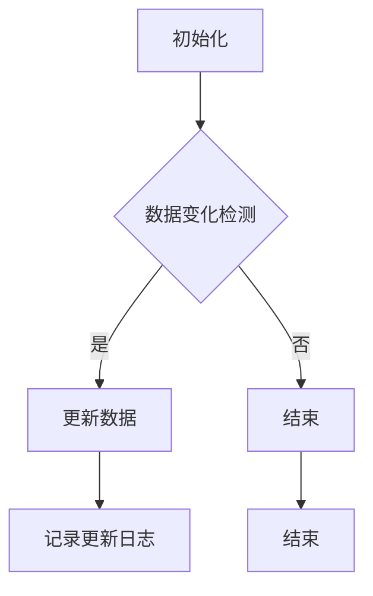

                 

### 文章标题

# 评测数据的增量更新与版本管理

### 关键词

- 增量更新
- 版本管理
- 数据库
- 算法
- 实践

### 摘要

本文旨在探讨评测数据的增量更新与版本管理，分析其中的核心概念与联系，详细解析增量更新算法的原理与实现，并结合实际项目与案例，提供版本管理的最佳实践和注意事项。文章结构如下：

## 引言

随着数据量的急剧增长，评测数据的处理成为了一个重要的研究领域。然而，数据更新和版本管理常常面临诸多挑战。本文将深入探讨如何有效地进行评测数据的增量更新与版本管理，旨在为相关领域的科研人员与工程师提供有价值的参考。

## 第1章：背景介绍

### 1.1 问题背景

在许多应用场景中，评测数据需要进行频繁的更新和版本管理。例如，在机器学习中，训练数据集的更新是提高模型性能的关键；在软件工程中，版本控制是确保代码质量和协作效率的重要手段。

### 1.2 问题描述

评测数据的增量更新主要涉及如何高效地检测和更新数据变化，以及如何维护数据的版本一致性。版本管理则需要解决数据更新过程中出现的冲突和冗余问题。

### 1.3 问题解决

本文将介绍增量更新与版本管理的基本概念，并分析其中的核心联系，以期为问题的解决提供理论基础。

## 第2章：核心概念与联系

### 2.1 增量更新概念

增量更新是指对已有数据的局部修改，以减少数据处理的时间和资源消耗。其主要特点包括：

- **局部性**：仅对发生变化的部分进行操作。
- **高效性**：通过减少操作范围提高效率。

### 2.2 版本管理概念

版本管理是指对数据的不同版本进行跟踪和控制，以确保数据的完整性和一致性。其主要特点包括：

- **追踪性**：记录数据的修改历史。
- **一致性**：确保数据在不同版本之间的一致性。

### 2.3 概念联系

增量更新与版本管理密切相关，前者依赖于后者的支持，以实现数据的版本控制和一致性维护。

## 第3章：增量更新算法原理

### 3.1 算法原理介绍

增量更新算法的核心思想是检测数据变化，并对变化部分进行更新。本文将介绍一种基于哈希值的增量更新算法，并使用Mermaid绘制算法流程图。

### 3.2 算法流程图

### 3.3 算法数学模型

增量更新算法的数学模型可以表示为：

$$
更新后的数据 = 原始数据 + 变更数据
$$

其中，变更数据可以通过哈希值检测得到。

### 第4章：版本管理实践

### 4.1 版本管理实践概述

版本管理实践涉及选择合适的工具和方法，以实现数据的版本控制和一致性维护。本文将介绍几种常用的版本管理工具，如Git和SVN，并讨论版本控制策略。

### 4.2 实践方法

版本管理实践包括以下步骤：

1. **初始化版本库**：选择合适的版本管理工具，并初始化版本库。
2. **提交变更**：对数据进行修改，并提交变更到版本库。
3. **合并变更**：处理多个版本之间的冲突，并合并变更。
4. **记录日志**：记录每次变更的历史和原因。

## 第5章：项目实战

### 5.1 项目介绍

本文将结合一个实际项目，介绍如何进行评测数据的增量更新与版本管理。

### 5.2 系统分析与架构设计

1. **问题场景介绍**：在一个机器学习项目中，需要对训练数据进行增量更新和版本管理。
2. **系统功能设计**：设计训练数据管理模块，包括数据读取、更新和版本控制等功能。
3. **系统架构设计**：使用Mermaid绘制系统架构图，展示各个模块之间的关系。

### 5.3 系统实现

1. **环境安装**：安装所需的软件和工具。
2. **系统核心实现源代码**：编写核心代码，实现数据更新和版本管理功能。
3. **代码应用解读与分析**：对核心代码进行解读和分析，说明其原理和实现。

### 第6章：案例分析

### 6.1 案例介绍

本文将分析一个实际案例，探讨如何在实际项目中实现评测数据的增量更新与版本管理。

### 6.2 案例分析

1. **案例实施过程**：详细描述案例的实施过程，包括数据更新和版本管理的方法。
2. **案例效果评估**：评估案例的实施效果，分析其优势和不足。

### 6.3 案例总结

本文将总结案例的经验教训，并提出一些拓展思考，以期为类似项目提供参考。

## 第7章：总结与展望

### 7.1 总结

本文从理论到实践，系统地探讨了评测数据的增量更新与版本管理，为相关领域的研究和实践提供了有益的参考。

### 7.2 展望

未来，随着技术的不断进步，评测数据的增量更新与版本管理将变得更加高效和智能化。本文提出了一些研究方向，以期为未来的研究提供启示。

### 作者

作者：AI天才研究院/AI Genius Institute & 禅与计算机程序设计艺术 /Zen And The Art of Computer Programming

---

以上是文章的目录大纲和初步内容。接下来，我们将逐章详细撰写，确保每个章节都符合完整性要求，并包含核心内容。在撰写过程中，我们将遵循markdown格式，确保文章的可读性和结构清晰。文章的总字数将在10000～12000字之间。

