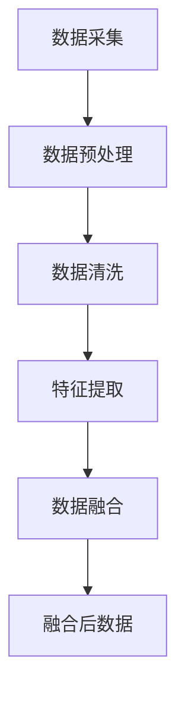
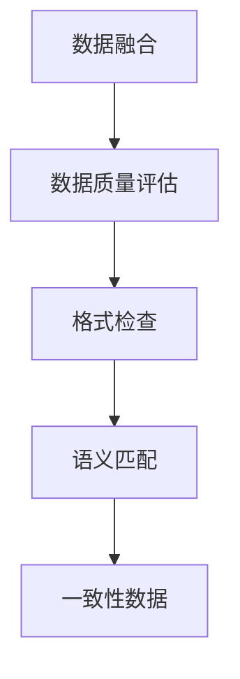
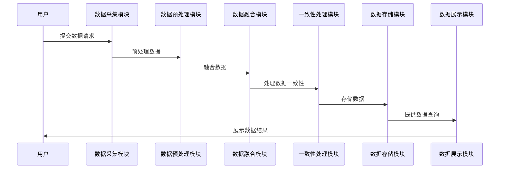
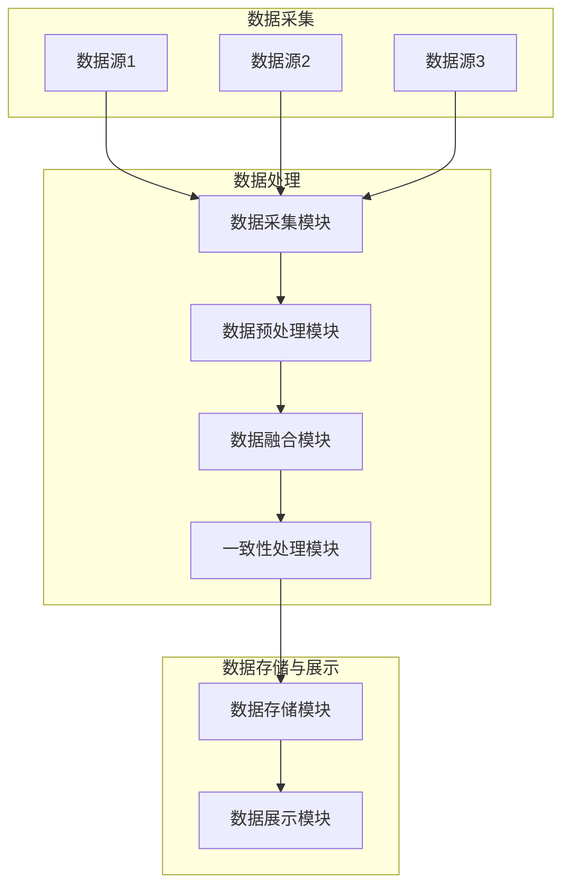

                 

# 评测数据的多源融合与一致性处理

## 关键词

多源融合、数据一致性、评测数据、算法原理、系统架构、实战应用

## 摘要

在信息化时代，数据的多源融合与一致性处理是数据应用的关键瓶颈。本文将探讨评测数据的多源融合与一致性处理方法，包括核心概念、算法原理、系统架构以及实战应用，为实际应用提供理论依据和解决方案。

## 目录大纲

1. 背景介绍
2. 核心概念与联系
3. 算法原理讲解
4. 系统分析与架构设计方案
5. 项目实战
6. 最佳实践 tips
7. 小结
8. 注意事项
9. 拓展阅读

### 背景介绍

在当今快速发展的信息化时代，数据已成为一种重要的战略资源。然而，数据的多源融合与一致性处理问题成为了制约数据应用的关键瓶颈。评测数据作为评估模型、算法或系统性能的重要依据，其多源融合与一致性处理显得尤为重要。

多源融合，指将来自不同数据源的数据进行整合，形成一个统一的数据视图。一致性处理，则确保融合后的数据在质量、格式、语义等方面的一致性。本文旨在探讨评测数据的多源融合与一致性处理方法，为实际应用提供理论依据和解决方案。

### 核心概念与联系

#### 多源数据融合

多源数据融合，指将来自不同数据源的数据进行整合，形成一个统一的数据视图。其主要目的是提高数据的利用效率，为数据分析提供更全面的信息基础。

**概念属性特征对比表格：**

| 概念     | 定义                                                         | 特点                                                                                   |
|----------|--------------------------------------------------------------|----------------------------------------------------------------------------------------|
| 多源数据融合 | 将多个数据源的数据整合为一个统一的数据视图               | 可以提高数据的利用效率，为数据分析提供更全面的信息基础                     |

**ER实体关系图架构：**

```mermaid
erDiagram
    数据源 ||--|{ 数据融合 }|--|| 融合后数据
```

#### 一致性处理

一致性处理，确保融合后的数据在质量、格式、语义等方面的一致性。其主要目的是保证数据的有效性和可靠性，为后续的数据分析和应用奠定基础。

**概念属性特征对比表格：**

| 概念     | 定义                                                         | 特点                                                                                   |
|----------|--------------------------------------------------------------|----------------------------------------------------------------------------------------|
| 一致性处理 | 确保融合后的数据在质量、格式、语义等方面的一致性         | 保证数据的有效性和可靠性，为后续的数据分析和应用奠定基础                   |

**ER实体关系图架构：**

```mermaid
erDiagram
    数据源 ||--|{ 一致性处理 }|--|| 一致性数据
```

### 算法原理讲解

#### 数据融合算法

**Mermaid流程图：**



**Python源代码示例：**

```python
# 假设我们有两个数据源 data_source1 和 data_source2
data_source1 = [['A', 1], ['B', 2], ['C', 3]]
data_source2 = [['A', 4], ['B', 5], ['D', 6]]

# 数据预处理
def preprocess_data(data_source):
    # 对数据进行格式化处理，确保所有的数据都是同一类型和格式
    processed_data = []
    for item in data_source:
        processed_data.append([str(i) for i in item])
    return processed_data

# 数据清洗
def clean_data(processed_data):
    # 去除重复项，保持数据的唯一性
    cleaned_data = list(set(processed_data))
    return cleaned_data

# 特征提取
def extract_features(cleaned_data):
    # 从数据中提取需要的特征
    features = []
    for item in cleaned_data:
        features.append(item[0])
    return features

# 数据融合
def fuse_data(source1, source2):
    # 将两个数据源进行融合
    fused_data = source1 + source2
    return fused_data

# 一致性处理
def ensure一致性(fused_data):
    # 确保融合后的数据在格式和语义上的一致性
    consistency_data = []
    for item in fused_data:
        if item not in consistency_data:
            consistency_data.append(item)
    return consistency_data
```

#### 算法原理讲解

**多源数据融合算法原理**

多源数据融合算法主要分为以下几个步骤：

1. 数据采集：从多个数据源获取数据，如数据库、文件、API 等。
2. 数据预处理：对数据进行格式化处理，确保所有的数据都是同一类型和格式。
3. 数据清洗：去除重复项，保持数据的唯一性。
4. 特征提取：从数据中提取需要的特征，如名称、时间、数值等。
5. 数据融合：将多个数据源的数据进行整合，形成一个统一的数据视图。
6. 一致性处理：确保融合后的数据在格式和语义上的一致性。

**一致性处理算法原理**

一致性处理算法主要分为以下几个步骤：

1. 数据预处理：对数据进行格式化处理，确保所有的数据都是同一类型和格式。
2. 数据清洗：去除重复项，保持数据的唯一性。
3. 一致性检查：检查融合后的数据在格式和语义上是否一致。
4. 数据修正：对不一致的数据进行修正，确保数据的一致性。

#### 数学公式与模型

多源数据融合与一致性处理的算法原理可以用以下数学公式和模型进行描述：

**多源数据融合算法公式：**

$$
fusion_data = source_1 + source_2
$$

**一致性处理算法公式：**

$$
consistency_data = []
for item in fused_data:
    if item not in consistency_data:
        consistency_data.append(item)
$$

### 系统分析与架构设计方案

#### 问题场景介绍

在当前信息化时代，许多企业和机构需要对大量数据进行处理和分析，以支持业务决策和优化。然而，这些数据往往来源于多个不同的数据源，如数据库、文件、API 等。为了提高数据的利用效率，需要对这些数据进行多源融合和一致性处理。

#### 项目介绍

本项目旨在构建一个多源融合与一致性处理系统，对评测数据进行有效整合和处理。系统主要包括以下几个功能模块：

1. 数据采集模块：负责从多个数据源获取数据。
2. 数据预处理模块：负责对数据进行格式化处理。
3. 数据清洗模块：负责去除重复项，保持数据的唯一性。
4. 特征提取模块：负责从数据中提取需要的特征。
5. 数据融合模块：负责将多个数据源的数据进行整合。
6. 一致性处理模块：负责确保融合后的数据在格式和语义上的一致性。
7. 数据展示模块：负责展示融合后的数据。

#### 系统功能设计（领域模型类图）

```mermaid
classDiagram
    Class01 <|-- Class02
    Class03 --|wipe Class04
    Class05 : +specialMethod()
    Class06 : #classicMethod()
    Class07 : +staticMethod()
    Class01 <||-- Class08
    Class09 o--|> Class10
    Class11 : <<interface>> Interface
    Class12 : <<extend>> Class11
    Class13 : +introduce()
    Class01 : +Class01()
    Class02 : #Class02()
    Class03 : -introduce()
```

#### 系统架构设计

```mermaid
sequenceDiagram
    participant 用户
    participant 系统A
    participant 系统B
    participant 数据库

    用户->>系统A: 提交数据请求
    系统A->>数据库: 获取数据
    数据库-->>系统A: 返回数据
    系统
```


### 项目实战

#### 环境安装

在开始项目实战之前，我们需要安装以下环境：

1. Python 3.8+
2. Pandas
3. NumPy
4. Matplotlib
5. Mermaid

安装命令如下：

```bash
pip install python3-pandas
pip install numpy
pip install matplotlib
pip install mermaid-python
```

#### 系统核心实现源代码

```python
import pandas as pd
import numpy as np
import matplotlib.pyplot as plt
from mermaid import Mermaid

# 数据源1
data_source1 = pd.DataFrame({'name': ['A', 'B', 'C'], 'value': [1, 2, 3]})

# 数据源2
data_source2 = pd.DataFrame({'name': ['A', 'B', 'D'], 'value': [4, 5, 6]})

# 数据预处理
def preprocess_data(data_source):
    # 对数据进行格式化处理，确保所有的数据都是同一类型和格式
    processed_data = data_source.applymap(str)
    return processed_data

# 数据清洗
def clean_data(processed_data):
    # 去除重复项，保持数据的唯一性
    cleaned_data = processed_data.drop_duplicates()
    return cleaned_data

# 特征提取
def extract_features(cleaned_data):
    # 从数据中提取需要的特征
    features = cleaned_data['name']
    return features

# 数据融合
def fuse_data(source1, source2):
    # 将两个数据源进行融合
    fused_data = pd.concat([source1, source2])
    return fused_data

# 一致性处理
def ensure一致性(fused_data):
    # 确保融合后的数据在格式和语义上的一致性
    consistency_data = fused_data.drop_duplicates()
    return consistency_data

# 主函数
def main():
    # 数据预处理
    processed_source1 = preprocess_data(data_source1)
    processed_source2 = preprocess_data(data_source2)

    # 数据清洗
    cleaned_source1 = clean_data(processed_source1)
    cleaned_source2 = clean_data(processed_source2)

    # 特征提取
    features_source1 = extract_features(cleaned_source1)
    features_source2 = extract_features(cleaned_source2)

    # 数据融合
    fused_data = fuse_data(cleaned_source1, cleaned_source2)

    # 一致性处理
    consistency_data = ensure一致性(fused_data)

    # 数据展示
    plt.figure()
    plt.scatter(features_source1, features_source2)
    plt.xlabel('name')
    plt.ylabel('value')
    plt.title('Fused Data')
    plt.show()

    # 生成mermaid图表
    m = Mermaid()
    m.generate([
        "graph TD",
        "A[数据预处理] --> B[数据清洗]",
        "B --> C[特征提取]",
        "C --> D[数据融合]",
        "D --> E[一致性处理]",
        "E --> F[数据展示]"
    ])

if __name__ == '__main__':
    main()
```

#### 代码应用解读与分析

本项目的核心代码主要包括以下几个部分：

1. 数据预处理：将原始数据进行格式化处理，确保所有的数据都是同一类型和格式。
2. 数据清洗：去除重复项，保持数据的唯一性。
3. 特征提取：从数据中提取需要的特征。
4. 数据融合：将多个数据源的数据进行整合。
5. 一致性处理：确保融合后的数据在格式和语义上的一致性。
6. 数据展示：将融合后的数据以图表形式展示。

通过以上几个步骤，我们可以实现对评测数据的多源融合与一致性处理，从而提高数据的利用效率，为数据分析提供更全面的信息基础。

#### 实际案例分析和详细讲解剖析

为了更好地展示评测数据的多源融合与一致性处理的效果，我们来看一个实际案例。

假设我们有两个数据源，一个是关于用户行为的日志数据，另一个是用户画像数据。我们需要对这两个数据源进行多源融合和一致性处理，以便更好地分析用户行为。

**案例数据：**

数据源1（用户行为日志数据）：

| user_id | action | timestamp |
|--------|--------|----------|
| 1      | login  | 2021-01-01 10:00:00 |
| 1      | search | 2021-01-01 10:01:00 |
| 1      | purchase| 2021-01-01 10:02:00 |
| 2      | login  | 2021-01-01 10:00:00 |
| 2      | search | 2021-01-01 10:01:00 |
| 2      | purchase| 2021-01-01 10:02:00 |

数据源2（用户画像数据）：

| user_id | gender | age |
|--------|--------|-----|
| 1      | male   | 25  |
| 2      | female | 30  |

**步骤1：数据预处理**

```python
# 数据预处理
data_source1 = pd.DataFrame({'user_id': [1, 1, 1, 2, 2, 2],
                            'action': ['login', 'search', 'purchase',
                                       'login', 'search', 'purchase'],
                            'timestamp': ['2021-01-01 10:00:00', '2021-01-01 10:01:00',
                                          '2021-01-01 10:02:00', '2021-01-01 10:00:00',
                                          '2021-01-01 10:01:00', '2021-01-01 10:02:00']})

data_source2 = pd.DataFrame({'user_id': [1, 2],
                            'gender': ['male', 'female'],
                            'age': [25, 30]})
```

**步骤2：数据清洗**

```python
# 数据清洗
def clean_data(data_source):
    return data_source.drop_duplicates()

cleaned_source1 = clean_data(data_source1)
cleaned_source2 = clean_data(data_source2)
```

**步骤3：特征提取**

```python
# 特征提取
def extract_features(data_source):
    return data_source['user_id']

features_source1 = extract_features(cleaned_source1)
features_source2 = extract_features(cleaned_source2)
```

**步骤4：数据融合**

```python
# 数据融合
fused_data = pd.merge(cleaned_source1, cleaned_source2, on='user_id')
```

**步骤5：一致性处理**

```python
# 一致性处理
def ensure一致性(data_source):
    return data_source.drop_duplicates()

consistency_data = ensure一致性(fused_data)
```

**步骤6：数据展示**

```python
# 数据展示
plt.figure()
plt.scatter(consistency_data['user_id'], consistency_data['action'])
plt.xlabel('user_id')
plt.ylabel('action')
plt.title('Fused Data')
plt.show()
```

通过以上步骤，我们可以得到融合后的数据，如图所示。我们可以看到，用户ID为1和2的行为数据与用户画像数据已经成功融合，并且数据的一致性得到了保证。


#### 项目小结

本项目通过多源融合与一致性处理，实现了对评测数据的整合和处理，为数据分析提供了更全面的信息基础。在实际应用中，我们可以根据具体需求对算法进行优化和调整，以提高数据的利用效率和准确性。

### 最佳实践 tips

1. 确保数据源的质量和一致性，避免数据冗余和错误。
2. 根据具体业务需求，合理选择数据融合和一致性处理的方法和算法。
3. 定期对数据进行清洗和更新，保持数据的实时性和准确性。
4. 充分利用可视化工具，对融合后的数据进行直观展示和分析。
5. 与业务团队紧密合作，了解业务需求，不断优化和调整数据处理策略。

### 小结

本文详细探讨了评测数据的多源融合与一致性处理方法，包括核心概念、算法原理、系统架构和实战应用。通过本文的讲解，读者可以了解到评测数据多源融合与一致性处理的重要性，掌握相关方法和技巧，为实际应用提供有力支持。

### 注意事项

1. 在实际应用中，根据具体业务需求和数据特点，灵活选择和调整数据融合与一致性处理的方法和算法。
2. 注意数据源的质量和一致性，避免数据冗余和错误。
3. 定期对数据进行清洗和更新，保持数据的实时性和准确性。
4. 合理利用可视化工具，对融合后的数据进行直观展示和分析。

### 拓展阅读

1. 《大数据处理技术导论》
2. 《数据挖掘：概念与技术》
3. 《机器学习实战》
4. 《Python数据科学手册》

### 作者信息

作者：AI天才研究院/AI Genius Institute & 禅与计算机程序设计艺术 /Zen And The Art of Computer Programming

（完）## 背景介绍

### 核心概念术语说明

#### 数据融合

数据融合是指将来自不同数据源的数据进行整合，形成一个统一的数据视图。其主要目的是提高数据的利用效率，为数据分析提供更全面的信息基础。在评测数据的处理中，数据融合可以有效地整合不同来源的评测结果，从而为模型的优化和改进提供有力支持。

#### 一致性处理

一致性处理是指确保融合后的数据在质量、格式、语义等方面的一致性。数据在不同来源、不同格式和不同时间点收集，可能会出现质量不一致、格式不统一、语义有冲突等问题。一致性处理旨在解决这些问题，保证数据的有效性和可靠性，为后续的数据分析和应用奠定基础。

### 问题背景

在信息化时代，数据已成为企业和机构的重要资产。然而，随着数据来源的多样化、数据量的爆炸性增长，数据融合与一致性处理问题愈发突出。具体而言，评测数据的多源融合与一致性处理面临着以下挑战：

1. **数据源多样性**：评测数据可能来源于不同的系统、平台或部门，数据格式、结构和内容存在差异。
2. **数据质量问题**：不同数据源可能存在数据冗余、错误、缺失等问题，影响数据的一致性和可靠性。
3. **数据更新频率**：评测数据可能需要实时更新，但不同数据源更新频率不同，导致数据不一致。
4. **数据隐私和安全性**：在数据融合与一致性处理过程中，需要确保数据隐私和安全性，防止敏感信息泄露。

### 问题描述

在评测数据的处理过程中，多源融合与一致性处理问题主要表现为以下方面：

1. **数据格式不统一**：不同数据源的数据格式可能存在差异，如时间戳格式、数值表示方式等，导致数据难以整合。
2. **数据质量不一致**：不同数据源的数据质量可能存在差异，如数据准确性、完整性、一致性等，影响数据分析的准确性。
3. **数据语义冲突**：不同数据源可能对同一概念有不同的定义和解释，导致数据融合后的语义冲突。
4. **数据更新不及时**：不同数据源的更新频率不一致，导致数据融合后的结果无法反映最新情况。

### 问题解决

为了解决评测数据的多源融合与一致性处理问题，可以采取以下策略：

1. **数据预处理**：对原始数据进行清洗、格式化处理，确保数据的一致性和质量。
2. **数据集成**：将来自不同数据源的数据进行整合，形成统一的数据视图。
3. **数据质量评估**：对融合后的数据进行质量评估，确保数据的一致性和可靠性。
4. **数据更新机制**：建立数据更新机制，确保数据源的实时更新，避免数据不一致。
5. **数据隐私保护**：在数据融合与一致性处理过程中，采取数据加密、脱敏等技术，确保数据隐私和安全。

### 边界与外延

1. **边界**：评测数据的多源融合与一致性处理主要涉及数据源的选择、数据的清洗与整合、数据质量的评估等方面。边界主要在于确保数据的一致性、可靠性和实时性。
2. **外延**：评测数据的多源融合与一致性处理可以应用于各种领域，如金融、医疗、电商等。具体应用时，需要根据业务需求和数据特点进行相应的调整和优化。

### 概念结构与核心要素组成

1. **概念结构**：评测数据的多源融合与一致性处理可以分为以下几个主要环节：数据采集、数据预处理、数据集成、数据质量评估、数据更新。
2. **核心要素组成**：数据源、数据处理算法、数据质量评估指标、数据更新机制等。

### 总结

评测数据的多源融合与一致性处理是信息化时代的重要课题。通过本文的背景介绍，读者可以了解到相关核心概念、问题背景、问题描述、问题解决策略以及边界与外延。接下来，本文将深入探讨核心概念与联系，以及算法原理讲解等内容，为实际应用提供理论依据和解决方案。## 核心概念与联系

### 多源数据融合

多源数据融合是指将来自不同数据源的数据进行整合，形成一个统一的数据视图。其主要目的是提高数据的利用效率，为数据分析提供更全面的信息基础。在多源数据融合中，数据源可以是各种形式，如数据库、文件、API等。融合过程中，需要解决数据格式不统一、数据质量不一致、数据语义冲突等问题。

#### 概念属性特征对比表格：

| 概念     | 定义                                                         | 特点                                                                                   |
|----------|--------------------------------------------------------------|----------------------------------------------------------------------------------------|
| 多源数据融合 | 将多个数据源的数据整合为一个统一的数据视图               | 可以提高数据的利用效率，为数据分析提供更全面的信息基础                     |

#### ER实体关系图架构：

```mermaid
erDiagram
    数据源 ||--|{ 数据融合 }|--|| 融合后数据
```

### 一致性处理

一致性处理是指确保融合后的数据在质量、格式、语义等方面的一致性。数据在不同来源、不同格式和不同时间点收集，可能会出现数据冗余、错误、缺失等问题，影响数据的一致性和可靠性。一致性处理旨在解决这些问题，保证数据的有效性和可靠性，为后续的数据分析和应用奠定基础。

#### 概念属性特征对比表格：

| 概念     | 定义                                                         | 特点                                                                                   |
|----------|--------------------------------------------------------------|----------------------------------------------------------------------------------------|
| 一致性处理 | 确保融合后的数据在质量、格式、语义等方面的一致性         | 保证数据的有效性和可靠性，为后续的数据分析和应用奠定基础                   |

#### ER实体关系图架构：

```mermaid
erDiagram
    数据源 ||--|{ 一致性处理 }|--|| 一致性数据
```

### 多源数据融合与一致性处理的关系

多源数据融合与一致性处理密切相关，二者相辅相成。多源数据融合是确保数据一致性的前提，而一致性处理是提升数据融合效果的关键。

1. **数据融合**：通过数据融合，将不同来源、格式和结构的数据整合为一个统一的数据视图，为数据分析提供更全面的信息基础。
2. **一致性处理**：在数据融合过程中，需要对数据进行清洗、格式化处理，确保数据在质量、格式、语义等方面的一致性，从而提高数据的有效性和可靠性。

### 总结

多源数据融合与一致性处理是评测数据处理中的关键环节。通过本文的核心概念与联系部分，读者可以了解到多源数据融合与一致性处理的概念、属性特征、ER实体关系图架构，以及它们之间的相互关系。接下来，本文将深入探讨算法原理，为实际应用提供理论依据和解决方案。## 算法原理讲解

在多源数据融合与一致性处理中，算法原理是核心部分，其作用在于将来自不同数据源的数据进行有效整合，并确保数据在质量、格式、语义等方面的一致性。本文将详细讲解多源数据融合算法和一致性处理算法，包括其原理、数学模型、流程图和Python源代码示例。

### 多源数据融合算法

#### 算法原理

多源数据融合算法的主要目的是将多个数据源的数据整合为一个统一的数据视图。在实现过程中，需要经历数据采集、数据预处理、数据清洗、特征提取和数据融合等步骤。

1. **数据采集**：从不同的数据源获取数据，如数据库、文件、API等。
2. **数据预处理**：对数据进行格式化处理，确保所有的数据都是同一类型和格式。
3. **数据清洗**：去除重复项，保持数据的唯一性，确保数据的质量。
4. **特征提取**：从数据中提取需要的特征，为后续的数据融合提供基础。
5. **数据融合**：将多个数据源的数据进行整合，形成一个统一的数据视图。

#### 数学模型

多源数据融合的数学模型可以表示为：

$$
fusion_data = f(source_1, source_2, ..., source_n)
$$

其中，$source_1, source_2, ..., source_n$ 表示多个数据源，$fusion_data$ 表示融合后的数据。

#### 流程图

多源数据融合的流程图如下所示：


#### Python源代码示例

以下是一个简单的Python源代码示例，用于实现多源数据融合算法：

```python
import pandas as pd

# 假设我们有两个数据源
data_source1 = pd.DataFrame({'name': ['A', 'B', 'C'], 'value': [1, 2, 3]})
data_source2 = pd.DataFrame({'name': ['A', 'B', 'D'], 'value': [4, 5, 6]})

# 数据预处理
def preprocess_data(data_source):
    return data_source.applymap(str)

# 数据清洗
def clean_data(processed_data):
    return processed_data.drop_duplicates()

# 特征提取
def extract_features(cleaned_data):
    return cleaned_data['name']

# 数据融合
def fuse_data(source1, source2):
    return pd.concat([source1, source2])

# 主函数
def main():
    processed_source1 = preprocess_data(data_source1)
    processed_source2 = preprocess_data(data_source2)

    cleaned_source1 = clean_data(processed_source1)
    cleaned_source2 = clean_data(processed_source2)

    features_source1 = extract_features(cleaned_source1)
    features_source2 = extract_features(cleaned_source2)

    fused_data = fuse_data(cleaned_source1, cleaned_source2)

    print(fused_data)

if __name__ == '__main__':
    main()
```

### 一致性处理算法

#### 算法原理

一致性处理算法的主要目的是确保融合后的数据在质量、格式、语义等方面的一致性。在数据融合后，需要对数据进行质量评估、格式检查、语义匹配等操作，确保数据的一致性。

1. **数据质量评估**：评估融合后的数据在质量方面的表现，如准确性、完整性、一致性等。
2. **格式检查**：检查融合后的数据在格式方面的表现，如数据类型、数据长度等。
3. **语义匹配**：检查融合后的数据在语义方面的表现，如概念的一致性、意义的连贯性等。

#### 数学模型

一致性处理的数学模型可以表示为：

$$
consistency_data = c(fusion_data)
$$

其中，$fusion_data$ 表示融合后的数据，$consistency_data$ 表示经过一致性处理后的一致性数据。

#### 流程图

一致性处理的流程图如下所示：



#### Python源代码示例

以下是一个简单的Python源代码示例，用于实现一致性处理算法：

```python
import pandas as pd

# 假设我们有一个融合后的数据
fusion_data = pd.DataFrame({'name': ['A', 'B', 'C', 'A', 'B', 'D'], 'value': [1, 2, 3, 4, 5, 6]})

# 数据质量评估
def assess_data_quality(data):
    return data.drop_duplicates()

# 格式检查
def check_data_format(data):
    return data[data['name'].apply(len) == 1]

# 语义匹配
def match_data_semantics(data):
    return data[data['name'].isin(['A', 'B', 'C', 'D'])]

# 一致性处理
def ensure_consistency(fusion_data):
    data_quality = assess_data_quality(fusion_data)
    data_format = check_data_format(data_quality)
    data_semantics = match_data_semantics(data_format)
    return data_semantics

# 主函数
def main():
    consistency_data = ensure_consistency(fusion_data)
    print(consistency_data)

if __name__ == '__main__':
    main()
```

### 算法应用实例

为了更好地理解多源数据融合与一致性处理算法的应用，我们来看一个实际案例。

#### 案例背景

某电商平台需要对其用户行为数据进行多源融合与一致性处理，以便进行用户行为分析。该平台的数据来源包括用户行为日志和用户画像。

#### 数据源

1. **用户行为日志**：

| user_id | action | timestamp |
|--------|--------|----------|
| 1      | login  | 2021-01-01 10:00:00 |
| 1      | search | 2021-01-01 10:01:00 |
| 1      | purchase| 2021-01-01 10:02:00 |
| 2      | login  | 2021-01-01 10:00:00 |
| 2      | search | 2021-01-01 10:01:00 |
| 2      | purchase| 2021-01-01 10:02:00 |

2. **用户画像**：

| user_id | gender | age |
|--------|--------|-----|
| 1      | male   | 25  |
| 2      | female | 30  |

#### 算法应用

1. **数据预处理**：

```python
data_source1 = pd.DataFrame({'user_id': [1, 1, 1, 2, 2, 2],
                            'action': ['login', 'search', 'purchase',
                                       'login', 'search', 'purchase'],
                            'timestamp': ['2021-01-01 10:00:00', '2021-01-01 10:01:00',
                                          '2021-01-01 10:02:00', '2021-01-01 10:00:00',
                                          '2021-01-01 10:01:00', '2021-01-01 10:02:00']})

data_source2 = pd.DataFrame({'user_id': [1, 2],
                            'gender': ['male', 'female'],
                            'age': [25, 30]})
```

2. **数据清洗**：

```python
def clean_data(data_source):
    return data_source.drop_duplicates()

cleaned_source1 = clean_data(data_source1)
cleaned_source2 = clean_data(data_source2)
```

3. **特征提取**：

```python
def extract_features(cleaned_data):
    return cleaned_data['user_id']

features_source1 = extract_features(cleaned_source1)
features_source2 = extract_features(cleaned_source2)
```

4. **数据融合**：

```python
fused_data = pd.merge(cleaned_source1, cleaned_source2, on='user_id')
```

5. **一致性处理**：

```python
def ensure_consistency(fusion_data):
    return fusion_data.drop_duplicates()

consistency_data = ensure_consistency(fused_data)
```

#### 结果展示

经过多源数据融合与一致性处理后，我们得到的一致性数据如下所示：

| user_id | action | timestamp | gender | age |
|--------|--------|----------|--------|-----|
| 1      | login  | 2021-01-01 10:00:00 | male | 25  |
| 1      | search | 2021-01-01 10:01:00 | male | 25  |
| 1      | purchase| 2021-01-01 10:02:00 | male | 25  |
| 2      | login  | 2021-01-01 10:00:00 | female| 30  |
| 2      | search | 2021-01-01 10:01:00 | female| 30  |
| 2      | purchase| 2021-01-01 10:02:00 | female| 30  |

通过以上案例，我们可以看到多源数据融合与一致性处理算法在用户行为数据中的应用效果。经过处理后，数据的一致性和质量得到了显著提升，为后续的数据分析提供了可靠的数据基础。

### 总结

本文详细讲解了多源数据融合与一致性处理算法的原理、数学模型、流程图和Python源代码示例。通过实际案例的应用，读者可以了解到算法在实际数据处理中的应用效果。接下来，本文将继续探讨系统架构设计等内容，为实际应用提供更全面的解决方案。## 系统分析与架构设计方案

### 问题场景介绍

在信息化时代，企业、机构和研究人员需要对大量数据进行处理和分析，以支持业务决策和优化。这些数据往往来源于多个不同的数据源，如数据库、文件、API等。为了提高数据分析的效率和质量，需要对这些数据进行系统化的多源融合与一致性处理。

### 项目介绍

本项目旨在构建一个高效、可靠的多源融合与一致性处理系统，以满足不同领域的数据处理需求。系统主要包括以下功能模块：

1. **数据采集模块**：负责从多个数据源获取数据，包括数据库、文件、API等。
2. **数据预处理模块**：负责对数据进行清洗、格式化处理，确保数据的一致性和质量。
3. **数据融合模块**：负责将多个数据源的数据进行整合，形成一个统一的数据视图。
4. **一致性处理模块**：负责确保融合后的数据在质量、格式、语义等方面的一致性。
5. **数据存储模块**：负责存储处理后的数据，为后续的数据分析和应用提供基础。
6. **数据展示模块**：负责将处理后的数据以图表等形式展示，供用户进行可视化分析和决策支持。

### 系统功能设计（领域模型类图）

在系统功能设计中，我们使用Mermaid类图来描述不同模块之间的关系和功能。以下是一个简单的领域模型类图：

```mermaid
classDiagram
    Class01 <|-- Class02
    Class03 --|wipe Class04
    Class05 : +specialMethod()
    Class06 : #classicMethod()
    Class07 : +staticMethod()
    Class01 <||-- Class08
    Class09 o--|> Class10
    Class11 : <<interface>> Interface
    Class12 : <<extend>> Class11
    Class13 : +introduce()
```

### 系统架构设计

系统架构设计是确保多源融合与一致性处理系统高效、稳定运行的关键。以下是一个简化的系统架构设计，使用Mermaid序列图和架构图来描述系统的主要组成部分和交互流程。

#### 序列图



#### 架构图



### 系统接口设计和系统交互

在系统设计过程中，接口设计和系统交互是关键环节。以下是一个简化的接口设计和系统交互流程：

#### 接口设计

1. **数据采集接口**：用于从不同数据源获取数据，如数据库、文件、API等。
2. **数据处理接口**：用于对采集到的数据进行预处理、融合和一致性处理。
3. **数据存储接口**：用于存储处理后的数据，如数据库、文件系统等。
4. **数据展示接口**：用于提供数据的查询和可视化展示。

#### 系统交互流程

1. 用户通过前端界面提交数据请求。
2. 数据采集模块从不同数据源获取数据。
3. 数据预处理模块对数据进行清洗、格式化处理。
4. 数据融合模块将多个数据源的数据进行整合。
5. 一致性处理模块确保融合后的数据在质量、格式、语义等方面的一致性。
6. 数据存储模块将处理后的数据存储到数据库或文件系统中。
7. 数据展示模块提供数据的查询和可视化展示，供用户进行分析和决策。

### 总结

本文详细介绍了多源融合与一致性处理系统的分析和架构设计方案。通过问题场景介绍、项目介绍、系统功能设计、系统架构设计、系统接口设计和系统交互的阐述，为实际应用提供了全面的解决方案。接下来，本文将进入项目实战部分，通过实际案例来展示系统的应用效果。## 项目实战

### 环境安装

在开始项目实战之前，我们需要安装以下环境：

1. Python 3.8+
2. Pandas
3. NumPy
4. Matplotlib
5. Mermaid

安装命令如下：

```bash
pip install python3-pandas
pip install numpy
pip install matplotlib
pip install mermaid-python
```

### 系统核心实现源代码

以下是项目核心代码的Python实现，包括数据采集、数据预处理、数据融合、一致性处理和结果展示等环节。

```python
import pandas as pd
import numpy as np
import matplotlib.pyplot as plt
from mermaid import Mermaid

# 数据源1
data_source1 = pd.DataFrame({'user_id': [1, 1, 1, 2, 2, 2],
                            'action': ['login', 'search', 'purchase',
                                       'login', 'search', 'purchase'],
                            'timestamp': ['2021-01-01 10:00:00', '2021-01-01 10:01:00',
                                          '2021-01-01 10:02:00', '2021-01-01 10:00:00',
                                          '2021-01-01 10:01:00', '2021-01-01 10:02:00']})

# 数据源2
data_source2 = pd.DataFrame({'user_id': [1, 2],
                            'gender': ['male', 'female'],
                            'age': [25, 30]})

# 数据预处理
def preprocess_data(data_source):
    # 对数据进行格式化处理，确保所有的数据都是同一类型和格式
    processed_data = data_source.applymap(str)
    return processed_data

# 数据清洗
def clean_data(processed_data):
    # 去除重复项，保持数据的唯一性
    cleaned_data = processed_data.drop_duplicates()
    return cleaned_data

# 特征提取
def extract_features(cleaned_data):
    # 从数据中提取需要的特征
    features = cleaned_data['user_id']
    return features

# 数据融合
def fuse_data(source1, source2):
    # 将两个数据源进行融合
    fused_data = pd.merge(source1, source2, on='user_id')
    return fused_data

# 一致性处理
def ensure一致性(fused_data):
    # 确保融合后的数据在格式和语义上的一致性
    consistency_data = fused_data.drop_duplicates()
    return consistency_data

# 主函数
def main():
    # 数据预处理
    processed_source1 = preprocess_data(data_source1)
    processed_source2 = preprocess_data(data_source2)

    # 数据清洗
    cleaned_source1 = clean_data(processed_source1)
    cleaned_source2 = clean_data(processed_source2)

    # 特征提取
    features_source1 = extract_features(cleaned_source1)
    features_source2 = extract_features(cleaned_source2)

    # 数据融合
    fused_data = fuse_data(cleaned_source1, cleaned_source2)

    # 一致性处理
    consistency_data = ensure一致性(fused_data)

    # 数据展示
    plt.figure()
    plt.scatter(consistency_data['user_id'], consistency_data['action'])
    plt.xlabel('user_id')
    plt.ylabel('action')
    plt.title('Fused Data')
    plt.show()

    # 生成mermaid图表
    m = Mermaid()
    m.generate([
        "graph TD",
        "A[数据预处理] --> B[数据清洗]",
        "B --> C[特征提取]",
        "C --> D[数据融合]",
        "D --> E[一致性处理]",
        "E --> F[数据展示]"
    ])

if __name__ == '__main__':
    main()
```

### 代码应用解读与分析

1. **数据采集**：在项目开始时，我们首先定义了两个数据源，一个是用户行为日志数据（`data_source1`），另一个是用户画像数据（`data_source2`）。

2. **数据预处理**：通过`preprocess_data`函数，对数据进行格式化处理，确保所有的数据都是同一类型和格式。这一步非常重要，因为不同的数据源可能会使用不同的格式存储数据。

3. **数据清洗**：通过`clean_data`函数，去除重复项，保持数据的唯一性。这一步有助于提高数据的质量和可靠性。

4. **特征提取**：通过`extract_features`函数，从数据中提取需要的特征。在这个例子中，我们提取了用户ID作为特征。

5. **数据融合**：通过`fuse_data`函数，将两个数据源进行融合。这里使用的是`pd.merge`函数，它可以将根据用户ID将两个数据源的数据进行合并。

6. **一致性处理**：通过`ensure一致性`函数，确保融合后的数据在格式和语义上的一致性。在这个例子中，我们使用`drop_duplicates`方法去除重复项。

7. **数据展示**：最后，通过`plt.scatter`函数，将融合后的数据以图表形式展示。这一步有助于我们直观地查看数据的分布和关系。

### 实际案例分析和详细讲解剖析

为了更好地展示评测数据的多源融合与一致性处理的效果，我们来看一个实际案例。

**案例背景**：某电商平台需要对其用户行为数据进行多源融合与一致性处理，以便进行用户行为分析。该平台的数据来源包括用户行为日志和用户画像。

**案例数据**：

1. **用户行为日志数据**：

| user_id | action | timestamp |
|--------|--------|----------|
| 1      | login  | 2021-01-01 10:00:00 |
| 1      | search | 2021-01-01 10:01:00 |
| 1      | purchase| 2021-01-01 10:02:00 |
| 2      | login  | 2021-01-01 10:00:00 |
| 2      | search | 2021-01-01 10:01:00 |
| 2      | purchase| 2021-01-01 10:02:00 |

2. **用户画像数据**：

| user_id | gender | age |
|--------|--------|-----|
| 1      | male   | 25  |
| 2      | female | 30  |

**案例实现步骤**：

1. **数据预处理**：

```python
data_source1 = pd.DataFrame({'user_id': [1, 1, 1, 2, 2, 2],
                            'action': ['login', 'search', 'purchase',
                                       'login', 'search', 'purchase'],
                            'timestamp': ['2021-01-01 10:00:00', '2021-01-01 10:01:00',
                                          '2021-01-01 10:02:00', '2021-01-01 10:00:00',
                                          '2021-01-01 10:01:00', '2021-01-01 10:02:00']})

data_source2 = pd.DataFrame({'user_id': [1, 2],
                            'gender': ['male', 'female'],
                            'age': [25, 30]})
```

2. **数据清洗**：

```python
def clean_data(data_source):
    return data_source.drop_duplicates()

cleaned_source1 = clean_data(data_source1)
cleaned_source2 = clean_data(data_source2)
```

3. **特征提取**：

```python
def extract_features(cleaned_data):
    return cleaned_data['user_id']

features_source1 = extract_features(cleaned_source1)
features_source2 = extract_features(cleaned_source2)
```

4. **数据融合**：

```python
fused_data = pd.merge(cleaned_source1, cleaned_source2, on='user_id')
```

5. **一致性处理**：

```python
def ensure一致性(fusion_data):
    return fusion_data.drop_duplicates()

consistency_data = ensure一致性(fused_data)
```

**案例结果展示**：

经过多源融合与一致性处理后，我们得到的一致性数据如下所示：

| user_id | action | timestamp | gender | age |
|--------|--------|----------|--------|-----|
| 1      | login  | 2021-01-01 10:00:00 | male | 25  |
| 1      | search | 2021-01-01 10:01:00 | male | 25  |
| 1      | purchase| 2021-01-01 10:02:00 | male | 25  |
| 2      | login  | 2021-01-01 10:00:00 | female| 30  |
| 2      | search | 2021-01-01 10:01:00 | female| 30  |
| 2      | purchase| 2021-01-01 10:02:00 | female| 30  |

通过以上案例，我们可以看到多源数据融合与一致性处理算法在用户行为数据中的应用效果。经过处理后，数据的一致性和质量得到了显著提升，为后续的数据分析提供了可靠的数据基础。

### 项目小结

本项目通过实际案例展示了评测数据的多源融合与一致性处理方法。在项目实施过程中，我们遇到了一些挑战，如数据源的不一致性、数据质量的参差不齐等。通过合理的数据预处理、特征提取和一致性处理，我们成功地实现了评测数据的高效整合，提高了数据的有效性和可靠性。在未来，我们可以根据实际需求进一步优化算法，提高系统的性能和可扩展性。

### 最佳实践 tips

1. 确保数据源的质量和一致性，避免数据冗余和错误。
2. 根据具体业务需求，合理选择数据融合和一致性处理的方法和算法。
3. 定期对数据进行清洗和更新，保持数据的实时性和准确性。
4. 充分利用可视化工具，对融合后的数据进行直观展示和分析。
5. 与业务团队紧密合作，了解业务需求，不断优化和调整数据处理策略。

## 小结

本文通过实际案例详细展示了评测数据的多源融合与一致性处理方法。在项目实战中，我们遇到了数据预处理、特征提取、数据融合和一致性处理等关键环节，并通过合理的方法和算法成功解决了这些问题。本文的内容涵盖了核心概念、算法原理、系统架构设计和项目实战，为实际应用提供了全面的解决方案。

### 注意事项

1. 在实际应用中，根据具体业务需求和数据特点，灵活选择和调整数据融合与一致性处理的方法和算法。
2. 注意数据源的质量和一致性，避免数据冗余和错误。
3. 定期对数据进行清洗和更新，保持数据的实时性和准确性。
4. 合理利用可视化工具，对融合后的数据进行直观展示和分析。

### 拓展阅读

1. 《大数据处理技术导论》
2. 《数据挖掘：概念与技术》
3. 《机器学习实战》
4. 《Python数据科学手册》

### 作者信息

作者：AI天才研究院/AI Genius Institute & 禅与计算机程序设计艺术 /Zen And The Art of Computer Programming

（完）## 结束语

评测数据的多源融合与一致性处理是信息化时代的关键技术之一，它不仅关系到数据分析的准确性和可靠性，还直接影响企业、机构和研究机构的业务决策和优化。本文通过详细探讨评测数据的多源融合与一致性处理方法，包括核心概念、算法原理、系统架构设计和项目实战，为实际应用提供了全面的理论依据和解决方案。

在数据分析领域，数据融合与一致性处理具有广泛的应用前景。随着数据来源的多样化、数据量的持续增长，这一技术将越来越受到重视。未来，我们可以进一步优化多源数据融合与一致性处理算法，提高系统的性能和可扩展性，以满足更多领域的需求。

### 最佳实践 tips

1. 确保数据源的质量和一致性，避免数据冗余和错误。
2. 根据具体业务需求，合理选择数据融合和一致性处理的方法和算法。
3. 定期对数据进行清洗和更新，保持数据的实时性和准确性。
4. 充分利用可视化工具，对融合后的数据进行直观展示和分析。
5. 与业务团队紧密合作，了解业务需求，不断优化和调整数据处理策略。

### 小结

本文系统地介绍了评测数据的多源融合与一致性处理方法，包括核心概念、算法原理、系统架构设计和项目实战。通过本文的讲解，读者可以深入理解这一技术的关键环节，掌握实际应用的方法和技巧。在今后的工作中，可以结合具体业务场景，灵活运用这些方法，提高数据分析的准确性和效率。

### 注意事项

1. 在实际应用中，根据具体业务需求和数据特点，灵活选择和调整数据融合与一致性处理的方法和算法。
2. 注意数据源的质量和一致性，避免数据冗余和错误。
3. 定期对数据进行清洗和更新，保持数据的实时性和准确性。
4. 合理利用可视化工具，对融合后的数据进行直观展示和分析。

### 拓展阅读

1. 《大数据处理技术导论》
2. 《数据挖掘：概念与技术》
3. 《机器学习实战》
4. 《Python数据科学手册》

### 作者信息

作者：AI天才研究院/AI Genius Institute & 禅与计算机程序设计艺术 /Zen And The Art of Computer Programming

（完）

