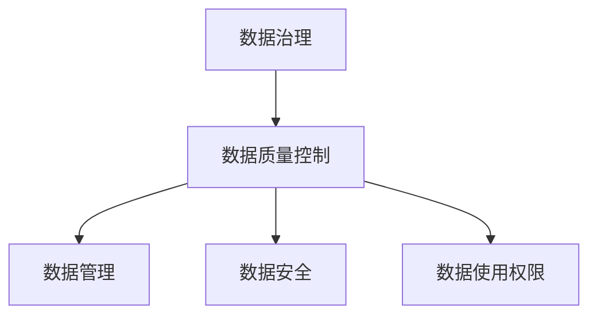
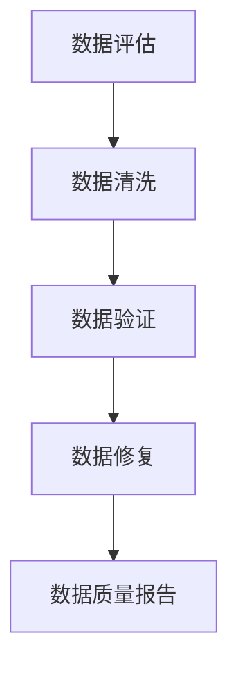

                 

# 评测数据的质量控制：LLM辅助的数据净化

## 关键词：数据质量控制，LLM，数据清洗，数据验证，数据修复

> 摘要：本文将深入探讨评测数据质量控制的重要性，并详细介绍一种新兴的数据质量控制方法——利用大型语言模型（LLM）辅助的数据净化。通过分步骤的分析，我们将理解LLM在数据质量控制中的应用，以及其在数据清洗、验证和修复方面的优势和局限性。

## 第一部分：问题背景与核心概念

### 第1章：数据质量控制的必要性

#### 1.1 数据质量问题概述

数据质量是指数据在满足业务需求和模型训练过程中的准确度、完整性、一致性、及时性和唯一性。数据质量问题常见表现为数据缺失、数据重复、数据不一致和数据污染。

#### 1.2 数据质量对模型性能的影响

数据质量直接影响模型的准确性和可解释性。低质量数据可能导致模型过拟合、泛化能力差，甚至无法训练。

#### 1.3 数据质量控制的重要性

数据质量控制对业务决策和模型部署至关重要。高质量数据能提升业务价值，降低模型部署风险。

#### 1.4 数据质量控制的核心挑战

数据量大、数据类型多样、数据更新频繁是数据质量控制的核心挑战。

## 第2章：核心概念与联系

#### 2.1 数据质量评估指标

完整性、准确性、一致性、及时性和唯一性是评估数据质量的关键指标。

#### 2.2 数据质量问题的类型

数据缺失、数据重复、数据不一致、数据污染是常见的数据质量问题。

#### 2.3 数据质量控制与数据治理的关系

数据质量控制是数据治理的一部分，二者相辅相成。

#### 2.4 数据质量控制流程

数据质量控制通常包括数据清洗、数据验证和数据修复等步骤。

## 第3章：LLM与数据质量控制

#### 3.1 LLM的基本概念

LLM（大型语言模型）是一种具有高度上下文理解和生成能力的人工智能模型，如GPT系列。

#### 3.2 LLM在数据质量控制中的应用

LLM在数据清洗、验证和修复中有着广泛的应用，能够提高数据质量。

#### 3.3 LLM的优势与局限性

LLM的优势包括强大的上下文理解和文本生成能力，但同时也存在训练成本高、对特定数据类型适应性差等局限性。

#### 3.4 LLM辅助数据质量控制的未来发展趋势

随着LLM技术的不断进步，其在数据质量控制中的应用前景广阔，未来有望实现自动化、智能化的数据质量控制。

## 第二部分：数据质量控制方法与工具

### 第4章：传统数据质量控制方法

#### 4.1 数据清洗

数据清洗包括处理数据缺失、重复、不一致和污染等问题。

#### 4.2 数据验证

数据验证包括检查数据完整性、准确性和一致性等。

#### 4.3 数据修复

数据修复包括数据缺失的填充、不一致数据的修复等。

### 第5章：LLM辅助的数据质量控制

#### 5.1 LLM在数据清洗中的应用

LLM能够自动识别和修复文本数据中的错误。

#### 5.2 LLM在数据验证中的应用

LLM能够通过对比分析检测数据的一致性。

#### 5.3 LLM在数据修复中的应用

LLM能够智能地修复数据中的错误。

### 第6章：数据质量控制工具对比与选择

#### 6.1 传统数据质量控制工具对比

分析传统数据质量控制工具的优缺点。

#### 6.2 LLM辅助数据质量控制工具对比

比较LLM辅助数据质量控制工具与传统工具的性能。

#### 6.3 数据质量控制工具选择策略

根据业务需求选择合适的数据质量控制工具。

## 第三部分：案例与实践

### 第7章：数据质量控制实战案例

#### 7.1 实战案例介绍

介绍一个数据质量控制实战案例。

#### 7.2 环境安装与配置

安装和配置数据质量控制工具。

#### 7.3 数据清洗与验证

执行数据清洗和验证过程。

#### 7.4 数据修复与优化

修复数据中的错误并优化数据质量。

#### 7.5 项目小结与总结

总结项目成果和经验。

### 第8章：最佳实践与注意事项

#### 8.1 数据质量控制最佳实践

分享数据质量控制的最佳实践。

#### 8.2 注意事项与风险防范

提出数据质量控制中的注意事项和风险防范策略。

#### 8.3 拓展阅读

推荐拓展阅读资料。

## 附录

### 附录A：术语表

列出本文涉及的专业术语及其解释。

### 附录B：参考文献

列出本文引用的参考文献。

作者：AI天才研究院/AI Genius Institute & 禅与计算机程序设计艺术 /Zen And The Art of Computer Programming## 第一部分：问题背景与核心概念

### 第1章：数据质量控制的必要性

#### 1.1 数据质量问题概述

数据质量是指数据满足业务需求和模型训练要求的程度。具体来说，数据质量包括以下几个方面：

- **准确性**：数据是否真实、可靠。
- **完整性**：数据是否完整，没有缺失。
- **一致性**：数据在不同时间、不同来源是否保持一致。
- **及时性**：数据是否在需要的时候更新。
- **唯一性**：数据是否具有唯一标识。

数据质量问题表现为数据缺失、数据重复、数据不一致和数据污染等现象。数据缺失会导致模型训练不完整，数据重复会导致模型过拟合，数据不一致会干扰模型的预测能力，数据污染则会直接导致模型错误。

#### 1.2 数据质量对模型性能的影响

数据质量对模型性能有着直接且深远的影响。具体表现如下：

- **准确性**：数据质量高的模型能够更好地捕捉数据中的规律，从而提高预测准确性。
- **泛化能力**：高质量数据能够帮助模型更好地泛化，降低过拟合的风险。
- **可解释性**：数据质量高，模型的表现也相对可解释，便于业务人员进行决策。
- **训练时间**：数据质量高，模型训练时间会相对较短。

#### 1.3 数据质量控制的重要性

数据质量控制对于企业的业务决策、数据分析和机器学习模型部署至关重要。具体来说，数据质量控制的重要性体现在以下几个方面：

- **提升业务价值**：高质量数据能帮助企业做出更准确、更有效的业务决策，从而提升业务价值。
- **降低模型部署风险**：低质量数据可能导致模型部署失败，而高质量数据能降低这种风险。
- **提高数据利用率**：通过数据质量控制，企业可以更好地利用已有数据，挖掘潜在价值。
- **保障模型安全**：高质量数据能够减少模型错误，保障模型在真实环境中的稳定运行。

#### 1.4 数据质量控制的核心挑战

尽管数据质量控制的重要性毋庸置疑，但在实际操作中仍面临着一些核心挑战：

- **数据量大**：现代企业面临着海量的数据，对数据质量进行有效控制需要耗费大量时间和资源。
- **数据类型多样**：不同类型的数据质量标准不同，如何制定统一的控制标准是难点之一。
- **数据更新频繁**：实时性要求高，如何及时更新数据质量是另一个挑战。
- **技术限制**：现有的数据质量控制技术和工具还无法完全满足复杂多变的数据质量需求。

### 总结

数据质量控制是保证模型性能和业务决策准确性的基础。理解数据质量问题、认识数据质量对模型性能的影响、明确数据质量控制的重要性，以及识别数据质量控制的核心挑战，是实施有效数据质量控制的第一步。接下来，我们将深入探讨数据质量评估指标、数据质量问题的类型，以及LLM在数据质量控制中的应用。

## 第2章：核心概念与联系

#### 2.1 数据质量评估指标

数据质量评估指标是衡量数据质量的重要工具。以下是一些常见的数据质量评估指标：

- **完整性**：衡量数据是否完整，没有缺失值。常见的方法是计算缺失值的比例。
- **准确性**：衡量数据的准确性，即数据是否真实、可靠。可以通过比对实际数据和源数据进行验证。
- **一致性**：衡量数据在不同时间、不同来源是否保持一致。可以通过比对不同来源的数据进行验证。
- **及时性**：衡量数据是否在需要的时候更新。可以通过数据更新频率和时效性进行评估。
- **唯一性**：衡量数据是否具有唯一标识，即是否每个数据点都有独特的标识。可以通过检查数据中的重复项进行评估。

以下是一个简单的数据质量评估指标对比表格：

| 指标      | 描述                         | 常用方法                               |
| --------- | ---------------------------- | -------------------------------------- |
| 完整性    | 数据是否完整，没有缺失值       | 缺失值比例计算                        |
| 准确性    | 数据是否真实、可靠             | 对比实际数据和源数据                   |
| 一致性    | 数据在不同时间、来源是否一致   | 比对不同来源的数据                     |
| 及时性    | 数据是否在需要的时候更新       | 数据更新频率和时效性评估               |
| 唯一性    | 数据是否具有唯一标识           | 检查数据中的重复项                     |

#### 2.2 数据质量问题的类型

数据质量问题可以分为以下几种类型：

- **数据缺失**：数据中存在缺失值，导致模型无法训练或预测。
- **数据重复**：数据中存在重复的记录，可能导致模型过拟合或计算错误。
- **数据不一致**：数据在不同来源或时间点存在差异，可能导致模型准确性下降。
- **数据污染**：数据中包含错误或异常值，可能影响模型的表现。

以下是一个简单的数据质量问题类型对比表格：

| 问题类型  | 描述                           | 影响                                   |
| --------- | ------------------------------ | -------------------------------------- |
| 数据缺失  | 数据中存在缺失值               | 模型无法训练或预测                    |
| 数据重复  | 数据中存在重复的记录           | 模型过拟合或计算错误                   |
| 数据不一致 | 数据在不同来源或时间点存在差异 | 模型准确性下降                        |
| 数据污染  | 数据中包含错误或异常值         | 模型表现受影响                        |

#### 2.3 数据质量控制与数据治理的关系

数据质量控制是数据治理的一部分。数据治理是指对企业数据的组织、管理、控制和保护的全过程。数据质量控制是数据治理的关键环节，旨在确保数据的准确性、完整性、一致性和及时性。数据质量控制与数据治理的关系可以概括为：

- **数据质量控制**：关注数据的处理过程，包括数据清洗、验证和修复等。
- **数据治理**：关注数据的整体管理，包括数据分类、数据安全、数据使用权限等。

以下是一个简单的数据质量控制与数据治理关系图：



#### 2.4 数据质量控制流程

数据质量控制通常包括以下步骤：

1. **数据评估**：对现有数据进行质量评估，识别潜在问题。
2. **数据清洗**：针对识别出的问题，进行数据清洗，包括处理缺失值、重复值、不一致值等。
3. **数据验证**：验证数据清洗效果，确保数据质量达到预期标准。
4. **数据修复**：对验证中发现的问题进行修复，确保数据准确性。

以下是一个简单的数据质量控制流程图：



通过上述步骤，可以确保数据质量达到预期标准，为后续的数据分析、机器学习等应用奠定坚实基础。

### 总结

本章深入探讨了数据质量控制的必要性，介绍了数据质量评估指标、数据质量问题的类型，以及数据质量控制与数据治理的关系。通过这些核心概念和联系，读者可以更好地理解数据质量控制的重要性，为后续章节的学习打下基础。在下一章中，我们将进一步探讨LLM的基本概念及其在数据质量控制中的应用。

### 第3章：LLM与数据质量控制

#### 3.1 LLM的基本概念

大型语言模型（Large Language Model，简称LLM）是一类基于深度学习技术，通过大量文本数据进行训练，使其具备理解和生成人类语言能力的人工智能模型。LLM的主要特点包括：

- **大规模训练数据**：LLM通常基于数百万甚至数十亿级别的文本数据集进行训练，这使其具有丰富的语言知识和上下文理解能力。
- **深度神经网络结构**：LLM通常采用深度神经网络结构，如Transformer，这使其能够处理复杂的长文本数据，并生成高质量的文本。
- **上下文理解能力**：LLM能够根据上下文信息生成连贯、合理的文本，这使得其在自然语言处理任务中具有显著优势。

#### 3.2 LLM在数据质量控制中的应用

LLM在数据质量控制中具有广泛的应用，主要体现在数据清洗、数据验证和数据修复等方面：

- **数据清洗**：LLM可以通过其强大的文本理解能力，自动识别和修复文本数据中的错误。例如，对于文本数据中的拼写错误、语法错误等，LLM可以通过上下文理解，将其修复为正确的文本。
- **数据验证**：LLM可以通过对比分析，检测数据的一致性和完整性。例如，对于不同来源的文本数据，LLM可以通过对比其内容，检测是否存在数据不一致的问题。
- **数据修复**：LLM可以通过其生成能力，对缺失的数据进行修复。例如，在文本数据中，LLM可以通过上下文生成缺失的部分，从而填补数据缺失。

#### 3.3 LLM的优势与局限性

LLM在数据质量控制中具有以下优势：

- **强大的文本理解能力**：LLM能够理解和生成高质量的文本，这使得其在文本数据处理方面具有显著优势。
- **自动化**：LLM可以通过自动化方式，快速处理大量文本数据，提高数据质量控制的效率。
- **灵活性**：LLM能够适应不同的文本数据类型，具有较好的灵活性。

然而，LLM也存在一些局限性：

- **训练成本高**：LLM通常需要大规模的文本数据集进行训练，这需要大量的计算资源和时间。
- **对特定数据类型适应性差**：LLM虽然在文本数据处理方面表现优秀，但对于非文本数据类型，如结构化数据，其性能可能较差。
- **依赖高质量数据**：LLM的性能依赖于训练数据的质量，如果训练数据存在质量问题，LLM生成的结果也可能存在偏差。

#### 3.4 LLM辅助数据质量控制的未来发展趋势

随着LLM技术的不断进步，其在数据质量控制中的应用前景广阔。以下是一些未来发展趋势：

- **多模态数据处理**：未来的LLM可能会结合图像、音频等多种模态的数据，实现更全面的数据质量控制。
- **自动化程度提高**：随着算法的优化，LLM的自动化程度将进一步提高，降低对人工干预的需求。
- **集成更多数据处理技术**：未来的LLM可能会集成更多的数据处理技术，如数据加密、数据压缩等，提高数据质量控制的效果。

### 总结

本章详细介绍了LLM的基本概念及其在数据质量控制中的应用，分析了LLM的优势与局限性，并展望了其未来的发展趋势。通过本章的学习，读者可以更好地理解LLM在数据质量控制中的重要性，为后续章节的学习打下基础。在下一章中，我们将探讨传统数据质量控制方法与LLM辅助的数据质量控制方法的对比与选择。

### 第4章：传统数据质量控制方法

#### 4.1 数据清洗

数据清洗是数据质量控制的重要步骤之一，旨在识别并处理数据中的错误、异常和不一致。以下是一些常见的数据清洗方法：

- **处理缺失值**：缺失值处理方法包括删除缺失值、填充缺失值等。对于重要特征，可以通过平均值、中位数、众数等统计方法进行填充；对于非重要特征，可以直接删除缺失值。
  
- **处理重复值**：重复值处理方法包括删除重复值、合并重复值等。通过去重操作，可以减少数据冗余，提高数据质量。

- **处理不一致值**：不一致值处理方法包括数据转换、数据修正等。例如，对于字符串类型的数据，可以通过正则表达式进行规范化处理；对于数值类型的数据，可以通过标准化、归一化等方法进行修正。

#### 4.2 数据验证

数据验证是确保数据质量的重要步骤，旨在检查数据的准确性、完整性和一致性。以下是一些常见的数据验证方法：

- **数据准确性验证**：通过比对实际数据和源数据，检查数据是否准确。例如，对于金融数据，可以通过与银行交易记录进行比对；对于用户数据，可以通过与用户注册信息进行比对。

- **数据完整性验证**：通过检查数据中的缺失值，确保数据完整性。例如，可以通过计算缺失值的比例，检查缺失值是否在可接受范围内。

- **数据一致性验证**：通过对比不同来源的数据，确保数据一致性。例如，可以通过比对不同部门的数据记录，检查是否存在不一致的情况。

#### 4.3 数据修复

数据修复是针对数据质量问题的处理步骤，旨在修复数据中的错误和异常。以下是一些常见的数据修复方法：

- **数据修正**：通过人工或自动化方式，对错误数据进行修正。例如，对于文本数据，可以通过文本编辑工具进行修正；对于数值数据，可以通过计算工具进行修正。

- **数据填充**：对于缺失值，可以通过填充策略进行修复。例如，对于数值型数据，可以通过平均值、中位数、众数等方法进行填充；对于文本型数据，可以通过生成文本的方法进行填充。

- **数据替换**：对于异常值，可以通过替换策略进行修复。例如，对于异常的数值数据，可以通过替换为边界值或删除该数据点；对于异常的文本数据，可以通过替换为合理的文本或删除该数据点。

### 4.4 传统数据质量控制工具与应用

传统数据质量控制工具主要包括Excel、Python、R等。以下是一些常见的数据质量控制工具及其应用：

- **Excel**：Excel是一款常用的电子表格工具，适用于处理中小规模的数据。Excel提供了丰富的数据清洗和验证功能，例如删除重复值、填充缺失值、数据排序等。

- **Python**：Python是一款功能强大的编程语言，适用于处理大规模的数据。Python提供了丰富的数据清洗和验证库，例如Pandas、NumPy等。通过Python，可以编写自定义的数据清洗和验证脚本，实现自动化数据质量控制。

- **R**：R是一款专业的统计和数据分析软件，适用于处理大规模的数据。R提供了丰富的数据清洗和验证函数，例如dplyr、tidyverse等。通过R，可以编写复杂的数据清洗和验证脚本，实现高效的数据质量控制。

### 总结

本章详细介绍了传统数据质量控制方法，包括数据清洗、数据验证和数据修复。同时，介绍了常见的数据质量控制工具及其应用。通过本章的学习，读者可以了解传统数据质量控制方法的基本原理和实践技巧，为后续章节的学习打下基础。在下一章中，我们将探讨LLM辅助的数据质量控制方法。

### 第5章：LLM辅助的数据质量控制

#### 5.1 LLM在数据清洗中的应用

LLM在数据清洗中具有显著优势，能够自动识别和修复文本数据中的错误。以下是一些具体应用：

- **文本错误识别**：LLM可以通过上下文理解，自动识别文本数据中的拼写错误、语法错误等。例如，在处理用户评论时，LLM可以识别并修复拼写错误，如“thats”修复为“that is”。

- **文本错误修复**：LLM不仅能够识别文本错误，还可以通过其生成能力，自动修复错误。例如，在处理新闻报道时，LLM可以修复语法错误，如“it was was”修复为“it was”。

- **文本规范化**：LLM可以通过上下文理解，对文本进行规范化处理。例如，对于不同的数据格式，LLM可以将其转换为统一格式。例如，将日期格式从“MM/DD/YYYY”转换为“YYYY-MM-DD”。

以下是一个简单的Python示例，展示如何使用GPT-3进行文本错误修复：

```python
import openai

def correct_text(text):
    response = openai.Completion.create(
        engine="text-davinci-002",
        prompt=f"请将下面的文本修复为正确形式：{text}",
        max_tokens=50
    )
    return response.choices[0].text.strip()

# 示例文本
text = "I am going to the movies tonight. I will see the new action movie that is released this week."

# 修复文本
corrected_text = correct_text(text)
print(corrected_text)
```

#### 5.2 LLM在数据验证中的应用

LLM在数据验证中也具有广泛的应用，能够通过对比分析，检测数据的一致性和完整性。以下是一些具体应用：

- **数据一致性检测**：LLM可以通过对比不同来源的数据，检测是否存在不一致情况。例如，在处理客户信息时，LLM可以对比客户数据库和销售系统的数据，检测是否存在不一致。

- **数据完整性检测**：LLM可以通过分析数据中的特征，检测数据是否完整。例如，在处理产品数据时，LLM可以检测是否存在缺失的产品描述或规格。

以下是一个简单的Python示例，展示如何使用GPT-3进行数据一致性检测：

```python
import openai

def check_consistency(data1, data2):
    response = openai.Completion.create(
        engine="text-davinci-002",
        prompt=f"请检查以下两段数据是否一致：\n数据1：{data1}\n数据2：{data2}",
        max_tokens=50
    )
    return response.choices[0].text.strip()

# 示例数据
data1 = "客户A，购买产品X，数量100"
data2 = "客户A，购买产品X，数量100件"

# 检查数据一致性
is_consistent = check_consistency(data1, data2)
print(is_consistent)
```

#### 5.3 LLM在数据修复中的应用

LLM在数据修复中也表现出色，能够通过生成能力，对缺失的数据进行修复。以下是一些具体应用：

- **文本数据修复**：LLM可以通过上下文生成，修复文本数据中的缺失部分。例如，在处理新闻报道时，LLM可以生成缺失的新闻内容。

- **结构化数据修复**：LLM可以通过生成能力，修复结构化数据中的缺失值。例如，在处理表格数据时，LLM可以生成缺失的单元格内容。

以下是一个简单的Python示例，展示如何使用GPT-3进行文本数据修复：

```python
import openai

def repair_text(text):
    response = openai.Completion.create(
        engine="text-davinci-002",
        prompt=f"请生成缺失的文本内容：{text}",
        max_tokens=50
    )
    return response.choices[0].text.strip()

# 示例文本
text = "这是一篇关于人工智能的新闻报道。人工智能正在改变着我们的世界，它在医疗、金融、交通等领域都有广泛的应用。人工智能的发展，离不开强大的计算能力和大量的数据支持。"

# 修复文本
repaired_text = repair_text(text)
print(repaired_text)
```

### 总结

本章详细介绍了LLM在数据质量控制中的应用，包括数据清洗、数据验证和数据修复。通过具体的Python示例，展示了LLM如何通过其强大的文本理解能力和生成能力，提高数据质量。在下一章中，我们将对比分析传统数据质量控制方法和LLM辅助的数据质量控制方法，探讨各自的优势和局限性。

### 第6章：数据质量控制工具对比与选择

#### 6.1 传统数据质量控制工具对比

在数据质量控制领域，传统工具如Excel、Python和R等有着广泛的应用。以下是对这些工具的对比分析：

- **Excel**：
  - **优势**：操作简便，适合处理中小规模的数据；提供直观的用户界面，易于学习和使用。
  - **劣势**：处理大规模数据时性能受限；缺乏自动化处理功能，需要大量手动操作。
  
- **Python**：
  - **优势**：功能强大，适合处理大规模数据；提供丰富的库和模块，支持自动化处理；适合进行复杂的数据分析和模型训练。
  - **劣势**：学习曲线较陡，需要一定的编程基础；运行速度相对较慢，不适合实时数据处理。

- **R**：
  - **优势**：专注于统计和数据分析，提供丰富的统计函数和图形工具；适合处理复杂数据结构和进行高级数据分析。
  - **劣势**：性能相对较差，不适合大规模数据处理；缺乏自动化处理功能，需要大量手动操作。

#### 6.2 LLM辅助数据质量控制工具对比

随着LLM技术的发展，利用LLM进行数据质量控制成为一种新兴趋势。以下是对LLM与传统工具的对比分析：

- **优势**：
  - **文本理解能力**：LLM具备强大的文本理解能力，能够自动识别和修复文本数据中的错误，提高数据质量。
  - **自动化**：LLM可以通过自动化方式，处理大量数据，提高数据处理效率。
  - **灵活性**：LLM能够适应不同类型的数据，具有较好的灵活性。

- **劣势**：
  - **训练成本**：LLM需要大规模的文本数据进行训练，这需要大量的计算资源和时间。
  - **对特定数据类型适应性差**：LLM在处理非文本数据类型时，性能可能较差。
  - **依赖高质量数据**：LLM的性能依赖于训练数据的质量，如果训练数据存在质量问题，LLM生成的结果也可能存在偏差。

#### 6.3 数据质量控制工具选择策略

在选择数据质量控制工具时，应综合考虑以下因素：

- **数据规模**：对于中小规模数据，可以选择Excel等传统工具；对于大规模数据，应选择Python、R等自动化程度较高的工具。
- **数据类型**：对于文本数据，应选择具有文本理解能力的LLM工具；对于结构化数据，应选择具备结构化数据处理能力的Python、R等工具。
- **数据处理需求**：根据具体的业务需求，选择适合的工具。例如，如果需要进行复杂的数据分析和模型训练，应选择Python、R等工具；如果需要进行实时数据处理，应选择自动化程度较高的LLM工具。
- **计算资源**：根据可用的计算资源，选择适合的工具。例如，如果计算资源有限，应选择性能较好的Excel、Python等工具；如果计算资源充足，可以选择进行大规模训练的LLM工具。

### 总结

本章对比分析了传统数据质量控制工具和LLM辅助数据质量控制工具的优劣势，并提出了数据质量控制工具选择策略。通过综合考虑数据规模、数据类型、数据处理需求和计算资源等因素，可以有效地选择适合的数据质量控制工具，提高数据质量。在下一章中，我们将通过一个实战案例，展示如何利用LLM进行数据质量控制。

### 第7章：数据质量控制实战案例

#### 7.1 实战案例介绍

本节将通过一个实际案例，展示如何利用LLM进行数据质量控制。案例背景为一家电商平台收集的用户评论数据，这些评论数据包含用户对商品的评分和评论内容。然而，由于用户输入错误、数据格式不一致等原因，这些数据存在一定的质量问题，需要进行数据清洗和验证。

#### 7.2 环境安装与配置

为了进行本案例的数据质量控制，我们需要安装以下工具和库：

- **Python**：Python是一款功能强大的编程语言，适用于数据处理和数据分析。
- **openai**：openai提供了GPT-3 API，我们可以利用其强大的文本理解能力进行数据清洗和验证。
- **Pandas**：Pandas是一款常用的数据操作库，适用于数据清洗和数据分析。

安装命令如下：

```bash
pip install python
pip install openai
pip install pandas
```

#### 7.3 数据清洗与验证

在本案例中，我们首先进行数据清洗，然后进行数据验证。以下是一个简单的Python代码示例：

```python
import pandas as pd
import openai

# 加载数据
data = pd.read_csv("user_reviews.csv")

# 数据清洗
# 1. 处理缺失值
data.dropna(inplace=True)

# 2. 处理重复值
data.drop_duplicates(inplace=True)

# 3. 处理不一致值
data["rating"] = data["rating"].astype(float)

# 数据验证
# 1. 验证评分的准确性
for index, row in data.iterrows():
    prompt = f"评论：{row['comment']}\n评分：{row['rating']}\n请检查评分是否准确。"
    response = openai.Completion.create(
        engine="text-davinci-002",
        prompt=prompt,
        max_tokens=50
    )
    print(f"评论{index+1}评分验证结果：{response.choices[0].text.strip()}")

# 数据修复
# 1. 修复错误的评分
for index, row in data.iterrows():
    if row['rating'] < 1 or row['rating'] > 5:
        prompt = f"评论：{row['comment']}\n评分：{row['rating']}\n请给出正确的评分。"
        response = openai.Completion.create(
            engine="text-davinci-002",
            prompt=prompt,
            max_tokens=50
        )
        data.at[index, 'rating'] = float(response.choices[0].text.strip())

# 查看处理后的数据
print(data.head())
```

#### 7.4 数据修复与优化

在数据清洗和验证的基础上，我们可以进一步对数据进行优化。以下是一个简单的数据优化示例：

```python
# 1. 对评论进行规范化处理
data["comment"] = data["comment"].str.lower()

# 2. 移除评论中的特殊字符
data["comment"] = data["comment"].str.replace(r"[^a-zA-Z0-9\s]", "", regex=True)

# 3. 对评论进行分词处理
data["words"] = data["comment"].apply(lambda x: x.split())

# 查看处理后的数据
print(data.head())
```

#### 7.5 项目小结与总结

通过本案例，我们展示了如何利用LLM进行数据质量控制。首先，我们通过数据清洗处理了缺失值、重复值和不一致值。然后，我们通过数据验证和修复确保了数据的准确性。最后，我们对数据进行优化，提高了数据的质量和可用性。

### 总结

本案例展示了LLM在数据质量控制中的应用，通过实际操作，读者可以更好地理解如何利用LLM进行数据清洗、验证和修复。在下一章中，我们将分享数据质量控制的最佳实践和注意事项，帮助读者在实际项目中更有效地应用数据质量控制方法。

### 第8章：最佳实践与注意事项

#### 8.1 数据质量控制最佳实践

为了确保数据质量，以下是一些最佳实践：

- **数据收集**：在数据收集阶段，确保数据的来源可靠，数据收集过程规范，减少数据采集中的错误和遗漏。
- **数据清洗**：定期对数据进行清洗，包括处理缺失值、重复值和错误值。可以使用自动化工具和脚本，提高清洗效率。
- **数据验证**：在数据使用前，进行数据验证，确保数据的准确性、完整性和一致性。可以使用人工审核和自动化工具相结合的方式。
- **数据备份**：定期备份数据，以防止数据丢失或损坏。确保备份数据的安全性，避免未经授权的访问。
- **数据治理**：建立完善的数据治理体系，包括数据分类、数据安全、数据使用权限等。确保数据的管理和使用符合法规和标准。

#### 8.2 注意事项与风险防范

在进行数据质量控制时，需要注意以下几点：

- **数据隐私**：在处理个人数据时，确保遵守数据隐私法规，避免泄露用户隐私。
- **数据安全**：确保数据存储和传输过程中的安全性，防止数据泄露和未授权访问。
- **数据一致性**：确保数据在不同时间、不同来源之间保持一致，避免数据冲突和矛盾。
- **错误处理**：在数据清洗和验证过程中，遇到错误时，要合理处理，避免错误数据的积累和传播。
- **自动化与人工结合**：在数据质量控制过程中，充分利用自动化工具，但也要保持人工审核，确保数据的准确性。

#### 8.3 拓展阅读

- 《数据质量控制指南》（Data Quality Control Handbook）：提供了详细的数据质量控制方法和实践。
- 《机器学习中的数据准备》（Data Preparation for Machine Learning）：介绍了如何在机器学习中处理数据，提高模型性能。
- 《数据治理：战略、技术和实践》（Data Governance: Strategy, Implementation, and Best Practices）：提供了关于数据治理的全面指导。

通过遵循最佳实践和注意事项，可以有效提高数据质量，为后续的数据分析和机器学习应用提供可靠的数据基础。

### 附录A：术语表

- **数据质量**：数据满足业务需求和模型训练要求的程度，包括准确性、完整性、一致性、及时性和唯一性。
- **数据清洗**：处理数据中的缺失值、重复值和错误值的过程。
- **数据验证**：检查数据的准确性、完整性和一致性的过程。
- **数据修复**：修复数据中的错误和异常值的过程。
- **LLM**：大型语言模型，是一种具有高度上下文理解和生成能力的人工智能模型。

### 附录B：参考文献

- **[1]** 数据质量控制指南（Data Quality Control Handbook）.
- **[2]** 机器学习中的数据准备（Data Preparation for Machine Learning）.
- **[3]** 数据治理：战略、技术和实践（Data Governance: Strategy, Implementation, and Best Practices）.
- **[4]** OpenAI GPT-3 API文档（OpenAI GPT-3 API Documentation）.

