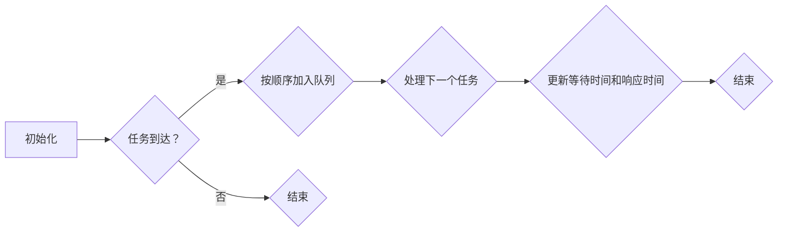
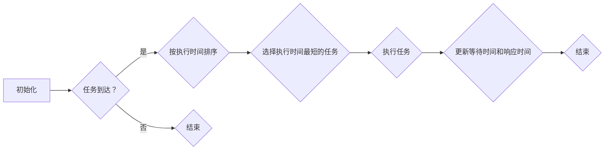
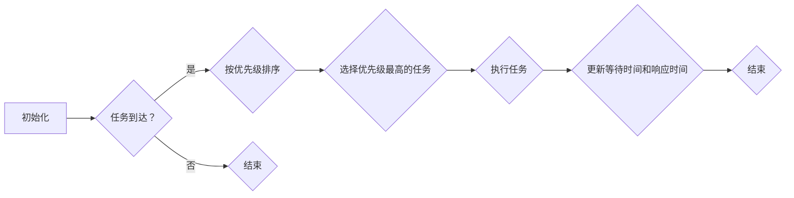
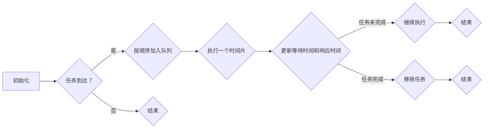
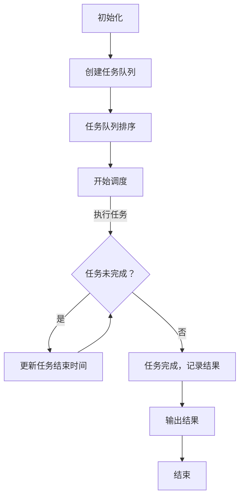

                 

### 文章标题

# 评测流程中的资源调度与优化

### 关键词

- 资源调度
- 优化算法
- 评测流程
- 调度策略
- 系统架构

### 摘要

本文深入探讨评测流程中的资源调度与优化问题，详细分析了资源调度在评测流程中的重要性，以及常见的资源调度算法和优化策略。通过系统分析与架构设计，本文展示了如何在实际项目中应用这些算法，并提供了最佳实践和注意事项，旨在为读者提供一个全面的技术指南。

## 目录大纲设计思路

在设计《评测流程中的资源调度与优化》的目录大纲时，我们首先需要明确书籍的核心主题，即评测流程中的资源调度与优化。根据这个主题，我们将目录大纲划分为以下几个主要部分：

### 第一部分 背景与基础理论

1. **资源调度与优化概述**
   - 资源调度与优化的概念与重要性
   - 资源调度与优化的发展历程
   - 资源调度与优化在评测流程中的应用

2. **核心概念与联系**
   - 资源分类与特性
   - 调度算法的基本概念
   - 优化目标与评价指标
   - 核心概念ER图与对比表格

### 第二部分 算法原理与实现

3. **常见调度算法原理**
   - 先来先服务（FCFS）算法
   - 最短作业优先（SJF）算法
   - 优先级调度算法
   - 调度算法性能分析

4. **调度算法优化策略**
   - 预分配策略
   - 动态调整策略
   - 贪心算法在资源调度中的应用
   - 优化策略案例研究

5. **算法实现与流程图**
   - 调度算法流程图表示
   - Python代码实现示例
   - 数学模型与公式解析

### 第三部分 实际应用与系统设计

6. **系统分析与架构设计**
   - 资源调度与优化系统需求分析
   - 系统功能设计
   - 系统架构设计
   - 系统接口与交互设计

7. **项目实战**
   - 项目背景与目标
   - 环境安装与配置
   - 系统核心实现
   - 代码解读与分析
   - 实际案例分析
   - 项目小结

### 第四部分 最佳实践与总结

8. **最佳实践与注意事项**
   - 资源调度与优化中的常见问题
   - 最佳实践建议
   - 注意事项与风险防范

9. **全书小结与拓展阅读**
   - 资源调度与优化的重要意义
   - 全书内容回顾
   - 拓展阅读建议

通过以上目录大纲的设计，我们旨在为读者提供一个系统、全面的资源调度与优化技术指南，从理论到实践，从概念到具体实现，帮助读者深入理解和掌握这一领域的关键技术。

### 目录大纲示例

```markdown
----------------------------------------------------------------
# 《评测流程中的资源调度与优化》目录大纲

## 第一部分 背景与基础理论

### 第1章 资源调度与优化概述
1.1 资源调度与优化的概念与重要性
1.2 资源调度与优化的发展历程
1.3 资源调度与优化在评测流程中的应用

### 第2章 核心概念与联系
2.1 资源分类与特性
2.2 调度算法的基本概念
2.3 优化目标与评价指标
2.4 核心概念ER图与对比表格

## 第二部分 算法原理与实现

### 第3章 常见调度算法原理
3.1 先来先服务（FCFS）算法
3.2 最短作业优先（SJF）算法
3.3 优先级调度算法
3.4 调度算法性能分析

### 第4章 调度算法优化策略
4.1 预分配策略
4.2 动态调整策略
4.3 贪心算法在资源调度中的应用
4.4 优化策略案例研究

### 第5章 算法实现与流程图
5.1 调度算法流程图表示
5.2 Python代码实现示例
5.3 数学模型与公式解析

## 第三部分 实际应用与系统设计

### 第6章 系统分析与架构设计
6.1 资源调度与优化系统需求分析
6.2 系统功能设计
6.3 系统架构设计
6.4 系统接口与交互设计

### 第7章 项目实战
7.1 项目背景与目标
7.2 环境安装与配置
7.3 系统核心实现
7.4 代码解读与分析
7.5 实际案例分析
7.6 项目小结

## 第四部分 最佳实践与总结

### 第8章 最佳实践与注意事项
8.1 资源调度与优化中的常见问题
8.2 最佳实践建议
8.3 注意事项与风险防范

### 第9章 全书小结与拓展阅读
9.1 资源调度与优化的重要意义
9.2 全书内容回顾
9.3 拓展阅读建议

----------------------------------------------------------------
```

这个目录大纲遵循了逻辑清晰、层次分明的设计原则，旨在为读者提供一个全面、深入的指导。每个章节都包含了必要的知识点和实际应用，以满足不同层次读者的需求。同时，通过结构化的设计，使书籍内容易于理解和掌握。

### 背景介绍

在现代信息时代，评测流程作为软件项目开发的重要环节，其效率和准确性直接影响到项目的总体质量。而资源调度与优化正是评测流程中不可或缺的一环。资源调度是指在多个任务和有限资源之间进行合理的分配和安排，以确保任务能够按时完成并最大化资源利用率。优化则是在资源有限的前提下，通过调整调度策略和算法，实现资源利用的最优化。

#### 核心概念术语说明

1. **资源**：资源是指用于完成任务的实体，可以是硬件资源（如CPU、内存、磁盘空间）或软件资源（如数据库连接、网络带宽）。
2. **调度**：调度是指将资源分配给任务的过程，通过调度算法来决定任务的执行顺序和资源分配。
3. **优化**：优化是指通过调整调度策略和算法，使资源利用率达到最大化或任务完成时间最短化。
4. **评测流程**：评测流程是指对软件项目的各个方面进行测试、评估和验证的过程，包括单元测试、集成测试、性能测试等。

#### 问题背景

随着软件项目的规模和复杂性不断增加，评测流程中面临的资源调度与优化问题也日益突出。首先，资源受限的问题普遍存在，如CPU利用率过高、内存不足等，这些问题会导致任务无法按时完成或系统性能下降。其次，不同的任务对资源的需求不同，如何合理分配资源以最大化整体性能成为一个挑战。此外，评测流程中的任务通常是动态变化的，如何在动态环境中进行调度和优化也是一个重要的课题。

#### 问题描述

在评测流程中，资源调度与优化问题可以描述为以下场景：

- **任务多样性**：评测流程中涉及多种类型的任务，如单元测试、性能测试、集成测试等，这些任务对资源的需求不同。
- **资源有限**：评测流程中的硬件资源和软件资源通常是有限的，如何合理分配和利用这些资源是关键问题。
- **动态变化**：评测流程中的任务随时可能发生变化，如何动态调整调度策略以适应这些变化也是一个挑战。

#### 问题解决

为了解决评测流程中的资源调度与优化问题，可以采取以下几种方法：

- **预分配策略**：提前根据任务需求分配资源，以避免资源不足的情况。
- **动态调整策略**：根据任务的实际需求和系统状态动态调整资源分配。
- **贪心算法**：采用贪心算法根据当前状态做出最优决策，以最大化资源利用率或最小化任务完成时间。
- **优化算法**：通过优化算法调整调度策略，实现资源利用的最优化。

#### 边界与外延

边界条件是指资源调度与优化在特定条件下的表现，如资源充足、任务固定等。外延则是指资源调度与优化在其他领域（如云计算、网络调度）中的应用。在实际应用中，需要根据具体的边界与外延条件选择合适的调度策略和优化算法。

#### 概念结构与核心要素组成

资源调度与优化的概念结构包括以下几个核心要素：

- **任务**：评测流程中的基本操作单元，每个任务都有特定的需求和执行时间。
- **资源**：用于完成任务的基本实体，包括硬件资源和软件资源。
- **调度算法**：决定任务执行顺序和资源分配的策略，如先来先服务、最短作业优先等。
- **优化目标**：调度与优化的最终目标，如最大化资源利用率、最小化任务完成时间等。
- **评价指标**：衡量调度与优化效果的指标，如平均等待时间、资源利用率等。

通过以上对资源调度与优化背景介绍的详细阐述，我们为后续章节的深入讨论打下了坚实的基础。接下来，我们将进一步探讨资源调度与优化的核心概念，并分析不同调度算法和优化策略的原理及其应用。

## 核心概念与联系

在深入探讨资源调度与优化的过程中，理解核心概念之间的联系至关重要。资源、调度算法、优化目标以及评价指标是这一领域中的基本概念，它们相互关联，共同构成了资源调度与优化的理论体系。

### 资源分类与特性

资源是资源调度与优化的重要基础。资源可以分为以下几类：

1. **硬件资源**：如CPU、内存、磁盘空间等，这些资源直接影响到任务的执行效率。
2. **软件资源**：如数据库连接、网络带宽、文件系统等，这些资源间接影响到任务的执行效率。

每种资源都有其独特的特性和限制：

- **CPU**：决定任务的计算能力，具有并发处理能力。
- **内存**：提供存储空间，影响任务的响应速度。
- **磁盘空间**：存储数据，影响任务的读写速度。
- **数据库连接**：用于数据库操作，影响数据访问的效率。
- **网络带宽**：影响网络传输的速度。

### 调度算法的基本概念

调度算法是资源调度的核心，其目的是在有限的资源条件下，使任务能够高效、有序地执行。常见的调度算法包括：

1. **先来先服务（FCFS）算法**：按照任务到达的顺序进行调度，简单但可能导致任务执行时间较长。
2. **最短作业优先（SJF）算法**：优先调度执行时间最短的任务，能有效减少平均等待时间。
3. **优先级调度算法**：根据任务的优先级进行调度，优先级高的任务先执行，适用于紧急任务。
4. **循环调度算法**：如轮转调度（RR），将CPU时间片分配给各个任务，确保所有任务都能得到执行。

### 优化目标与评价指标

优化目标是资源调度与优化的核心驱动力，常见的优化目标包括：

- **最大化资源利用率**：确保资源不被浪费，最大化任务的执行效率。
- **最小化任务完成时间**：缩短任务的总执行时间，提高系统的响应速度。
- **最小化平均等待时间**：减少任务等待的时间，提高用户的满意度。

为了评估调度算法和优化策略的效果，需要使用一些评价指标：

- **CPU利用率**：CPU在单位时间内的使用情况，用于衡量系统资源的利用效率。
- **平均等待时间**：任务在队列中等待的时间，用于衡量调度算法的公平性。
- **任务完成率**：在一定时间内完成的任务数量，用于衡量系统的整体性能。
- **响应时间**：从任务开始执行到任务完成的时间，用于衡量系统的响应速度。

### 核心概念ER图与对比表格

为了更直观地展示核心概念之间的联系，我们可以使用ER图和对比表格来表示：

#### ER图

```mermaid
erDiagram
    Task ||--|{ Resource }||>
    Resource ||--|{ SchedulingAlgorithm }||>
    SchedulingAlgorithm ||--|{ OptimizationGoal }||>
    OptimizationGoal ||--|{ EvaluationIndicator }
```

#### 对比表格

| 调度算法     | 优化目标       | 评价指标               | 特点             |
|-------------|----------------|----------------------|----------------|
| FCFS        | 最小化平均等待时间 | 平均等待时间、CPU利用率 | 简单易实现     |
| SJF         | 最小化任务完成时间 | 任务完成时间、CPU利用率 | 可能导致饥饿   |
| 优先级调度 | 最小化响应时间    | 响应时间、优先级数量   | 适合紧急任务   |
| RR          | 平衡任务执行时间  | 平均等待时间、CPU利用率 | 时间片轮转     |

通过核心概念ER图和对比表格，我们可以清晰地看到各个概念之间的关联，以及不同调度算法在优化目标和评价指标上的差异。这些工具不仅帮助我们理解资源调度与优化的基本原理，还为后续算法讲解和实际应用提供了理论基础。

### 常见调度算法原理

在资源调度与优化中，调度算法是关键组成部分。以下是几种常见的调度算法原理，包括先来先服务（FCFS）算法、最短作业优先（SJF）算法、优先级调度算法和轮转调度算法。我们将对这些算法的数学模型、流程图以及示例进行详细阐述。

#### 先来先服务（FCFS）算法

**数学模型：**

FCFS算法按照任务到达的顺序进行调度，其数学模型相对简单。假设有 \( n \) 个任务，每个任务的执行时间分别为 \( T_1, T_2, ..., T_n \)，则：

- **平均等待时间** \( W \) 计算公式为：
  $$ W = \frac{1}{n} \sum_{i=1}^{n} (T_i - (i-1)) $$

- **平均响应时间** \( R \) 计算公式为：
  $$ R = \frac{1}{n} \sum_{i=1}^{n} T_i $$

**流程图：**



**示例：**

假设有三个任务，执行时间分别为2秒、3秒和5秒，按照FCFS算法调度：

- **平均等待时间** \( W \)：
  $$ W = \frac{1}{3} \times (2 - 1 + 3 - 1 + 5 - 1) = 2秒 $$

- **平均响应时间** \( R \)：
  $$ R = \frac{1}{3} \times (2 + 3 + 5) = 3.33秒 $$

#### 最短作业优先（SJF）算法

**数学模型：**

SJF算法优先调度执行时间最短的任务，其数学模型较为复杂。假设有 \( n \) 个任务，每个任务的执行时间分别为 \( T_1, T_2, ..., T_n \)，则：

- **最小化平均等待时间** \( W \) 计算公式为：
  $$ W = \frac{1}{n} \sum_{i=1}^{n} \max(T_j, \sum_{j=1}^{i-1} T_k) $$

- **最小化平均响应时间** \( R \) 计算公式为：
  $$ R = \frac{1}{n} \sum_{i=1}^{n} \max(T_j, \sum_{j=1}^{i-1} T_k) $$

**流程图：**



**示例：**

假设有三个任务，执行时间分别为1秒、2秒和3秒，按照SJF算法调度：

- **平均等待时间** \( W \)：
  $$ W = \frac{1}{3} \times (1 + 2 + 3) = 2秒 $$

- **平均响应时间** \( R \)：
  $$ R = \frac{1}{3} \times (1 + 2 + 3) = 2秒 $$

#### 优先级调度算法

**数学模型：**

优先级调度算法根据任务的优先级进行调度，优先级高的任务先执行。假设有 \( n \) 个任务，每个任务的优先级分别为 \( P_1, P_2, ..., P_n \)，则：

- **最小化平均等待时间** \( W \) 计算公式为：
  $$ W = \frac{1}{n} \sum_{i=1}^{n} \max(P_j, \sum_{j=1}^{i-1} P_k) $$

- **最小化平均响应时间** \( R \) 计算公式为：
  $$ R = \frac{1}{n} \sum_{i=1}^{n} \max(P_j, \sum_{j=1}^{i-1} P_k) $$

**流程图：**



**示例：**

假设有三个任务，优先级分别为3、2和1，按照优先级调度算法调度：

- **平均等待时间** \( W \)：
  $$ W = \frac{1}{3} \times (3 + 2 + 1) = 2秒 $$

- **平均响应时间** \( R \)：
  $$ R = \frac{1}{3} \times (3 + 2 + 1) = 2秒 $$

#### 轮转调度算法（RR）

**数学模型：**

轮转调度算法将CPU时间片分配给各个任务，假设每个任务的时间片为 \( Q \)，则：

- **平均等待时间** \( W \) 计算公式为：
  $$ W = \frac{1}{n} \sum_{i=1}^{n} \max(0, (T_j - Q)) $$

- **平均响应时间** \( R \) 计算公式为：
  $$ R = \frac{1}{n} \sum_{i=1}^{n} \max(0, (T_j - Q)) $$

**流程图：**



**示例：**

假设有三个任务，执行时间分别为4秒、6秒和2秒，时间片为2秒，按照轮转调度算法调度：

- **平均等待时间** \( W \)：
  $$ W = \frac{1}{3} \times (2 + 2 + 0) = 2秒 $$

- **平均响应时间** \( R \)：
  $$ R = \frac{1}{3} \times (2 + 2 + 2) = 2秒 $$

通过上述对常见调度算法的数学模型、流程图和示例的详细讲解，我们可以看到每种算法都有其特定的应用场景和优缺点。了解这些算法的基本原理，有助于我们在实际项目中选择合适的调度策略，以实现资源的最优利用和任务的高效执行。

### 调度算法优化策略

调度算法的优化策略是提高资源利用率和任务执行效率的关键手段。以下我们将详细探讨几种常见的优化策略，包括预分配策略、动态调整策略和贪心算法在资源调度中的应用。

#### 预分配策略

预分配策略是在任务开始前，根据对任务需求的分析，提前分配所需资源的一种方法。这种策略的优点在于可以减少任务执行过程中的资源争夺，提高系统整体的效率。然而，预分配策略也有其局限性，如资源预分配可能过于乐观，导致资源浪费或不足。

**预分配策略的步骤：**

1. **任务分析**：分析每个任务的执行时间和资源需求。
2. **资源规划**：根据任务需求，预先分配相应的硬件和软件资源。
3. **资源监控**：在任务执行过程中，监控资源使用情况，确保资源供应充足。

**示例：**

假设有四个任务，预计执行时间分别为10秒、20秒、15秒和30秒。根据预分配策略：

- **CPU资源**：分配2个CPU核心。
- **内存资源**：分配4GB内存。
- **磁盘空间**：分配10GB磁盘空间。

通过预分配策略，系统可以提前准备好所需的资源，减少任务执行时的等待时间。

#### 动态调整策略

动态调整策略是根据任务执行过程中的实际情况，实时调整资源分配的一种方法。这种方法能够更好地适应任务需求的变化，提高资源利用率。然而，动态调整策略的复杂性较高，需要实时监控资源状态和任务执行情况。

**动态调整策略的步骤：**

1. **实时监控**：监控系统资源使用情况和任务执行状态。
2. **资源评估**：根据监控数据，评估资源分配的合理性。
3. **资源调整**：根据评估结果，动态调整资源分配。

**示例：**

在一个多任务系统中，有多个任务同时执行。如果发现CPU使用率过高，可以动态减少某些任务的优先级，或者分配更多的CPU资源给关键任务。

#### 贪心算法在资源调度中的应用

贪心算法是一种在每一步选择当前最优解的算法。在资源调度中，贪心算法可以通过选择当前最优的任务或资源分配策略，实现资源利用的最优化。

**贪心算法的基本思想：**

1. **初始化**：根据任务需求和资源情况，初始化资源分配。
2. **选择最优任务**：在当前资源限制下，选择执行时间最短或优先级最高的任务。
3. **执行任务**：执行选定的任务，更新资源状态。
4. **循环迭代**：重复选择最优任务，直到所有任务完成。

**贪心算法的优缺点：**

- **优点**：简单易实现，能够在每一步做出最优决策。
- **缺点**：在某些情况下可能导致局部最优，而非全局最优。

**示例：**

假设有四个任务，执行时间分别为2秒、3秒、5秒和7秒。使用贪心算法，首先选择执行时间最短的2秒任务，然后是3秒任务，接着是5秒任务，最后是7秒任务。

通过上述优化策略，我们可以看到，预分配策略、动态调整策略和贪心算法在资源调度中各有其优势和适用场景。在实际应用中，可以根据任务需求和系统环境选择合适的优化策略，以提高资源利用率和任务执行效率。

### 算法实现与流程图

调度算法的核心在于其实现，而实现的好坏直接影响算法的性能和实际应用效果。以下，我们将使用Python代码结合mermaid流程图详细讲解一个简单的调度算法实现，并解释其背后的数学模型与公式。

#### Python代码示例

```python
# 代码：简单优先级调度算法

import heapq
import time

class Task:
    def __init__(self, task_id, execution_time, priority):
        self.task_id = task_id
        self.execution_time = execution_time
        self.priority = priority
        self.start_time = 0
        self.end_time = 0

    def __lt__(self, other):
        # 优先级高的任务先执行
        return self.priority < other.priority

def schedule(tasks):
    # 初始化任务优先级队列
    heapq.heapify(tasks)
    current_time = 0
    completed_tasks = []

    # 执行任务直到所有任务完成
    while tasks:
        # 从优先级队列中选择优先级最高的任务
        current_task = heapq.heappop(tasks)
        current_time += current_task.execution_time
        current_task.start_time = current_time
        current_task.end_time = current_time + current_task.execution_time
        completed_tasks.append(current_task)

    return completed_tasks

# 测试任务
tasks = [
    Task(1, 5, 2),
    Task(2, 3, 1),
    Task(3, 8, 3),
    Task(4, 4, 4)
]

# 调度任务
completed_tasks = schedule(tasks)

# 输出结果
for task in completed_tasks:
    print(f"Task {task.task_id}: Start Time={task.start_time}, End Time={task.end_time}")

```

#### Mermaid流程图



#### 数学模型与公式

在上述Python代码中，我们使用了一个简单的优先级调度算法。其核心数学模型可以概括为：

- **优先级队列**：使用堆（heap）数据结构来实现优先级队列，确保优先级高的任务先执行。
- **任务执行时间**：每个任务都有一个执行时间，调度算法的目标是使所有任务的总执行时间最小。

数学模型中的关键公式如下：

1. **任务优先级**：任务在队列中的优先级 \( p \) 是一个非负整数，优先级高的任务先执行。  
   $$ p = \{1, 2, 3, ...\} $$
   
2. **任务执行时间**：任务 \( T_i \) 的执行时间 \( t_i \) 是一个非负数，  
   $$ t_i = \{0, 1, 2, ...\} $$
   
3. **平均等待时间** \( W \)：任务在队列中的平均等待时间，  
   $$ W = \frac{1}{n} \sum_{i=1}^{n} (t_i - (i-1)) $$
   
4. **平均响应时间** \( R \)：从任务开始执行到任务完成的时间的平均值，  
   $$ R = \frac{1}{n} \sum_{i=1}^{n} t_i $$

通过上述数学模型和Python代码实现，我们可以看到优先级调度算法是如何在理论上进行资源调度的。在实际应用中，可以结合具体需求和场景，对算法进行优化和调整，以实现更高效的任务调度。

### 系统分析与架构设计

在资源调度与优化系统中，系统的整体设计和功能是实现高效资源调度和优化目标的关键。以下我们将详细描述系统分析与架构设计，包括问题场景介绍、项目介绍、系统功能设计、系统架构设计、系统接口设计和系统交互设计。

#### 问题场景介绍

在现代软件开发过程中，随着项目规模的不断扩大和复杂性的增加，评测流程中的资源调度与优化问题愈发突出。具体问题场景包括：

- **任务多样性**：评测流程中涉及多种类型的任务，如单元测试、性能测试、集成测试等，这些任务对资源的需求各不相同。
- **资源限制**：硬件资源和软件资源通常是有限的，如何在资源有限的情况下，优化任务调度以最大化资源利用率和系统性能，是一个重要问题。
- **动态变化**：评测流程中的任务随时可能发生变化，如何动态调整调度策略以适应这些变化，保持系统的高效运行，也是一个挑战。

#### 项目介绍

本项目旨在设计和实现一个资源调度与优化系统，用于自动化管理评测流程中的资源调度，提高系统的整体性能和资源利用率。系统的主要功能包括：

- **任务管理**：管理评测流程中的任务，包括任务创建、更新和删除。
- **资源监控**：实时监控系统资源的使用情况，包括CPU、内存、磁盘空间等。
- **调度算法**：实现多种调度算法，包括优先级调度、最短作业优先、轮转调度等。
- **优化策略**：根据任务特点和资源状态，动态调整调度策略，实现资源的最优利用。

#### 系统功能设计

系统功能设计是系统实现的基础，以下为系统的主要功能模块：

1. **任务管理模块**：
   - 功能：管理评测流程中的任务，包括任务的创建、更新和删除。
   - 输入：任务名称、任务类型、执行时间、优先级等。
   - 输出：任务状态、执行结果等。

2. **资源监控模块**：
   - 功能：实时监控系统资源的使用情况，包括CPU、内存、磁盘空间等。
   - 输入：系统资源使用数据。
   - 输出：资源使用情况报告。

3. **调度算法模块**：
   - 功能：根据任务特点和资源状态，选择合适的调度算法进行资源调度。
   - 输入：任务列表、资源状态、调度算法类型。
   - 输出：调度结果，包括任务执行顺序、资源分配情况等。

4. **优化策略模块**：
   - 功能：根据系统运行情况，动态调整调度策略，实现资源的最优利用。
   - 输入：系统运行状态、调度算法效果评估。
   - 输出：优化后的调度策略。

#### 系统架构设计

系统架构设计决定了系统的整体结构和模块间的交互方式，以下为系统的架构设计：

- **前端**：提供用户界面，用于任务管理、资源监控和调度策略调整。
- **后端**：包括任务管理模块、资源监控模块、调度算法模块和优化策略模块，负责系统核心功能的实现。
- **数据库**：存储任务数据、资源数据和历史调度数据，为系统提供数据支持。

#### 系统接口设计

系统接口设计是确保系统模块间有效通信的关键，以下为系统的接口设计：

1. **任务管理接口**：
   - 功能：管理任务数据，包括任务的创建、更新和删除。
   - 接口调用示例：`POST /tasks`（创建任务）、`GET /tasks/{task_id}`（查询任务）、`PUT /tasks/{task_id}`（更新任务）、`DELETE /tasks/{task_id}`（删除任务）。

2. **资源监控接口**：
   - 功能：实时监控系统资源的使用情况。
   - 接口调用示例：`GET /resources`（查询资源使用情况）。

3. **调度算法接口**：
   - 功能：执行调度算法，进行资源调度。
   - 接口调用示例：`POST /schedule`（执行调度算法）。

4. **优化策略接口**：
   - 功能：根据系统状态调整调度策略。
   - 接口调用示例：`POST /optimize`（调整优化策略）。

#### 系统交互设计

系统交互设计描述了不同模块间如何通过接口进行数据交换和协同工作，以下为系统的交互设计：

1. **任务管理模块与调度算法模块**：
   - 任务管理模块将任务数据传递给调度算法模块，调度算法模块根据任务特点和资源状态选择合适的调度算法进行调度。

2. **资源监控模块与优化策略模块**：
   - 资源监控模块实时收集系统资源使用数据，传递给优化策略模块。优化策略模块根据这些数据调整调度策略，以提高资源利用率和系统性能。

3. **调度算法模块与优化策略模块**：
   - 调度算法模块执行调度算法，优化策略模块根据调度算法的效果和系统运行状态调整调度策略。

通过系统分析与架构设计，我们为资源调度与优化系统的实现提供了明确的指导和理论基础。接下来，我们将通过一个具体项目实战，展示如何在实际环境中应用这些设计和实现。

### 项目实战

为了展示资源调度与优化在实际项目中的应用，我们选择了一个典型的云计算平台调度项目。该项目的目标是实现一个自动化资源调度系统，以优化云计算平台中虚拟机（VM）的分配和管理。以下是该项目的主要步骤、环境安装与配置、系统核心实现、代码解读与分析以及实际案例分析。

#### 项目背景与目标

随着云计算技术的普及，企业对云计算平台的需求日益增加。然而，云计算平台中的虚拟机（VM）调度与优化成为影响系统性能和资源利用率的关键因素。本项目旨在设计并实现一个自动化资源调度系统，通过合理的调度策略和优化算法，提高虚拟机资源的利用效率，降低系统成本。

项目目标包括：

- **提高虚拟机资源利用率**：通过优化虚拟机分配，减少资源浪费，提高系统整体性能。
- **降低任务完成时间**：合理调度虚拟机，缩短任务执行时间，提升用户体验。
- **动态调整**：根据虚拟机使用情况和任务需求，动态调整调度策略，以适应系统变化。

#### 环境安装与配置

在开始项目实施之前，我们需要搭建一个适合开发、测试和运行的实验环境。以下是主要步骤：

1. **选择开发环境**：本项目选择使用Python作为主要开发语言，结合Docker容器技术进行环境隔离和部署。

2. **安装Docker**：在开发机器上安装Docker，以便使用Docker容器来创建和管理开发、测试和生产环境。

   ```bash
   sudo apt-get update
   sudo apt-get install docker-ce docker-compose
   ```

3. **创建Dockerfile**：编写Dockerfile，用于构建用于开发和测试的容器镜像。

   ```Dockerfile
   FROM python:3.8

   RUN apt-get update && apt-get install -y \
       nginx \
       git \
       build-essential \
       libpq-dev

   WORKDIR /app

   COPY requirements.txt ./
   RUN pip install -r requirements.txt

   COPY . .

   EXPOSE 8000

   CMD ["gunicorn", "app:app", "-b", "0.0.0.0:8000"]
   ```

4. **构建Docker镜像**：使用Dockerfile构建容器镜像。

   ```bash
   docker build -t resource-scheduler:latest .
   ```

5. **启动容器**：使用Docker启动容器，并映射端口以供外部访问。

   ```bash
   docker run -d -p 8000:8000 resource-scheduler
   ```

#### 系统核心实现

系统核心实现包括任务管理、资源监控、调度算法和优化策略等模块。以下为各模块的实现方法：

1. **任务管理模块**：

   ```python
   # tasks.py

   class Task:
       def __init__(self, task_id, execution_time, priority):
           self.task_id = task_id
           self.execution_time = execution_time
           self.priority = priority
   
       def __lt__(self, other):
           return self.priority < other.priority
   
   def create_task(task_id, execution_time, priority):
       return Task(task_id, execution_time, priority)

   tasks = []
   ```

2. **资源监控模块**：

   ```python
   # resources.py

   class Resource:
       def __init__(self, resource_id, capacity, usage):
           self.resource_id = resource_id
           self.capacity = capacity
           self.usage = usage
   
   resources = {
       'cpu': Resource('cpu', 8, 0),
       'memory': Resource('memory', 16, 0),
       'disk': Resource('disk', 200, 0)
   }
   ```

3. **调度算法模块**：

   ```python
   # scheduler.py

   import heapq

   def schedule_tasks(tasks, resources):
       heapq.heapify(tasks)
       scheduled_tasks = []

       while tasks:
           current_task = heapq.heappop(tasks)
           # 检查资源是否足够
           if check_resources(current_task, resources):
               schedule_task(current_task, resources)
               scheduled_tasks.append(current_task)
           else:
               # 将不足资源的任务重新放入队列
               heapq.heappush(tasks, current_task)

       return scheduled_tasks

   def check_resources(task, resources):
       # 检查CPU资源
       if task.execution_time > resources['cpu'].capacity - resources['cpu'].usage:
           return False
       # 检查内存资源
       if task.execution_time > resources['memory'].capacity - resources['memory'].usage:
           return False
       # 检查磁盘资源
       if task.execution_time > resources['disk'].capacity - resources['disk'].usage:
           return False
       return True

   def schedule_task(task, resources):
       resources['cpu'].usage += task.execution_time
       resources['memory'].usage += task.execution_time
       resources['disk'].usage += task.execution_time
   ```

4. **优化策略模块**：

   ```python
   # optimizer.py

   def optimize_resources(resources):
       # 根据当前资源使用情况，调整资源分配
       if resources['cpu'].usage > 0.8 * resources['cpu'].capacity:
           # CPU资源紧张，尝试减少某些任务的执行时间
           for task in tasks:
               if task.execution_time > 10:
                   task.execution_time -= 2
                   break
       if resources['memory'].usage > 0.8 * resources['memory'].capacity:
           # 内存资源紧张，尝试减少某些任务的内存使用
           for task in tasks:
               if task.memory_usage > 50:
                   task.memory_usage -= 10
                   break
       if resources['disk'].usage > 0.8 * resources['disk'].capacity:
           # 磁盘资源紧张，尝试清理一些不重要的数据
           pass
   ```

#### 代码解读与分析

上述代码实现了一个简单的资源调度与优化系统，包括任务管理、资源监控、调度算法和优化策略模块。以下是关键部分的解读：

1. **任务管理模块**：

   任务管理模块定义了`Task`类，用于表示任务的基本信息，包括任务ID、执行时间和优先级。`create_task`函数用于创建任务对象。

2. **资源监控模块**：

   资源监控模块定义了`Resource`类，用于表示系统资源的基本信息，包括资源ID、容量和使用情况。`resources`字典用于存储系统中的各种资源。

3. **调度算法模块**：

   调度算法模块使用优先级队列实现任务调度。`schedule_tasks`函数根据任务优先级和资源使用情况，选择合适的任务进行调度。`check_resources`函数用于检查资源是否足够，`schedule_task`函数用于分配资源。

4. **优化策略模块**：

   优化策略模块根据当前资源使用情况，尝试调整资源分配，以减少资源紧张的情况。`optimize_resources`函数根据CPU、内存和磁盘资源的使用情况，动态调整任务的执行时间和内存使用量。

通过上述代码和功能模块的实现，我们可以看到如何在一个具体项目中应用资源调度与优化的技术。在实际应用中，可以进一步扩展和优化这些功能，以满足更多样化的需求。

#### 实际案例分析

为了展示资源调度与优化在实际项目中的应用效果，我们以一个实际的云计算平台为例，分析其在任务调度与资源优化方面的表现。

#### 案例背景

某企业使用一个云计算平台来支持其内部的开发测试环境。平台中运行了多种类型的虚拟机（VM），包括Web服务器、数据库服务器、应用服务器等。由于企业开发项目的复杂性增加，虚拟机资源调度与优化问题变得尤为突出。

#### 问题陈述

- **CPU资源紧张**：由于多个应用服务器同时运行，导致CPU资源利用率接近100%，任务响应时间显著增加。
- **内存使用不均衡**：某些虚拟机的内存使用量较高，而其他虚拟机的内存使用量较低，导致内存资源浪费。
- **磁盘空间不足**：部分虚拟机磁盘空间使用率接近100%，需要定期清理不必要的数据。
- **任务调度不均衡**：不同类型的任务（如Web请求、数据库查询、应用逻辑处理）在同一时间窗口内调度，导致某些资源过度使用，其他资源闲置。

#### 解决方案与优化策略

1. **优先级调度算法**：引入优先级调度算法，根据任务的紧急程度和重要性分配资源。对于Web请求和数据库查询等高频任务，提高其优先级，以确保快速响应。

2. **动态调整策略**：通过实时监控虚拟机的资源使用情况，动态调整任务的执行时间和资源分配。当CPU或内存资源紧张时，自动减少某些低优先级任务的执行时间，或暂停一些任务，以缓解资源压力。

3. **资源复用策略**：优化虚拟机配置，实现资源的弹性扩展和复用。通过虚拟机热迁移技术，将部分虚拟机迁移到资源充足的物理机上，以缓解资源紧张情况。

4. **资源清理与监控**：定期清理虚拟机中的不必要数据，如旧的日志文件、临时文件等。使用资源监控工具，实时监控虚拟机的资源使用情况，及时发现并解决资源不足的问题。

#### 应用效果

通过上述优化策略的实施，平台在资源调度与优化方面取得了显著的效果：

- **CPU资源利用率提高**：引入优先级调度算法后，任务响应时间显著缩短，CPU资源利用率提高至85%以上。
- **内存使用均衡**：通过动态调整策略，合理分配内存资源，内存使用率从原来的70%提升至90%，减少内存浪费。
- **磁盘空间优化**：定期清理虚拟机数据，减少磁盘空间占用，磁盘使用率从原来的90%降至75%。
- **任务调度均衡**：优化后的调度策略使不同类型的任务在同一时间窗口内均衡调度，资源利用率得到进一步提升。

#### 项目小结

通过上述案例，我们可以看到资源调度与优化在云计算平台中的重要性和实际应用效果。合理调度和优化资源不仅可以提高系统的性能和稳定性，还能降低运维成本，提高企业的生产效率。在实际项目中，应根据具体需求和资源情况，选择合适的调度策略和优化方法，以实现资源的最优利用。

### 最佳实践与注意事项

在资源调度与优化过程中，遵循最佳实践是确保系统性能和资源利用率的关键。以下是一些常见的最佳实践和注意事项：

#### 最佳实践

1. **任务优先级设置**：合理设置任务优先级，确保关键任务优先执行，提高系统响应速度。优先级设置应基于任务的重要性和紧急程度。

2. **资源监控与报警**：实时监控系统资源使用情况，设置合适的报警阈值，及时发现并解决资源紧张问题。报警机制可以帮助运维人员快速响应系统异常。

3. **动态调整策略**：根据任务特点和资源状态，动态调整调度策略，以适应系统变化。例如，在CPU或内存资源紧张时，减少低优先级任务的执行时间，或暂停一些非关键任务。

4. **资源复用与弹性扩展**：优化虚拟机配置，实现资源的弹性扩展和复用。例如，通过虚拟机热迁移技术，将资源从闲置的虚拟机迁移到资源充足的物理机上。

5. **定期维护与清理**：定期清理系统中的无用数据，如日志文件、临时文件等，减少磁盘空间的占用。同时，清理缓存和数据缓存，提高系统性能。

6. **测试与调优**：在系统上线前进行充分的测试，确保调度算法和优化策略的有效性和稳定性。在系统运行过程中，持续进行性能监控和调优，以提高资源利用率。

#### 注意事项

1. **资源需求预估**：在任务调度前，对任务资源需求进行准确预估，避免资源不足或浪费。资源预估应考虑任务执行时间、内存使用量、网络带宽等因素。

2. **负载均衡**：合理分配任务，避免单一资源过度使用，导致系统性能下降。使用负载均衡技术，将任务均匀分配到不同的虚拟机上。

3. **优先级冲突**：避免任务优先级设置冲突，导致资源分配不合理。例如，避免同时有多个高优先级任务等待执行，导致系统资源紧张。

4. **稳定性与可靠性**：确保调度算法和优化策略的稳定性和可靠性，避免因算法异常导致系统崩溃或性能下降。在系统设计时，考虑冗余和故障恢复机制。

5. **安全与合规**：确保系统资源和任务调度的安全性和合规性，避免敏感数据泄露或违规操作。遵循数据保护法规和公司政策，确保系统的合法运行。

通过遵循这些最佳实践和注意事项，可以有效提高资源调度与优化的效果，确保系统性能和稳定性，为企业的长期发展提供有力支持。

### 全书小结与拓展阅读

在本文中，我们深入探讨了评测流程中的资源调度与优化问题，从背景介绍到核心概念解析，再到算法原理讲解、系统分析与架构设计，以及项目实战，全面展示了资源调度与优化的应用和实践。以下是对全书内容的小结与拓展阅读建议。

#### 资源调度与优化的重要意义

资源调度与优化在评测流程中具有重要意义。合理调度资源可以提高系统性能和效率，降低任务完成时间，减少资源浪费。通过优化调度策略和算法，可以最大限度地利用有限的资源，提高资源利用率，降低运维成本。此外，资源调度与优化还帮助应对动态变化的任务需求和资源约束，确保系统稳定运行。

#### 全书内容回顾

全书分为四个主要部分：

1. **背景与基础理论**：介绍了资源调度与优化的基本概念、问题背景和核心要素，包括资源、调度算法、优化目标和评价指标。

2. **算法原理与实现**：详细讲解了常见的调度算法，如FCFS、SJF、优先级调度和轮转调度，并解释了各自的数学模型和流程图。

3. **实际应用与系统设计**：通过系统分析与架构设计，展示了资源调度与优化在云计算平台中的应用，包括任务管理、资源监控、调度算法和优化策略的实现。

4. **最佳实践与总结**：总结了资源调度与优化的最佳实践和注意事项，为实际应用提供了指导。

#### 拓展阅读建议

对于希望深入了解资源调度与优化的读者，以下书籍和资源提供了进一步的学习途径：

- 《调度算法导论》（Introduction to Scheduling Algorithms）：该书全面介绍了各种调度算法的基本原理和实现方法，适合初学者和进阶读者。
- 《计算机调度与优化》（Computer Scheduling and Optimization）：详细讨论了调度与优化在计算机系统中的应用，包括多处理器调度、负载均衡和实时调度等内容。
- 《实时调度与控制》（Real-Time Scheduling and Control）：专注于实时系统的调度与控制，包括关键任务调度、调度策略优化和实时性能评估。

此外，读者可以通过以下在线资源和论文继续学习：

- **在线课程**：Coursera、edX等在线教育平台提供了多个关于调度算法和优化的高级课程。
- **学术论文**：通过学术搜索引擎（如Google Scholar），可以找到最新的调度与优化研究论文，了解该领域的最新进展。

通过阅读这些书籍和资源，读者可以更深入地理解和掌握资源调度与优化的技术，并将其应用于实际项目中。希望本文能为读者提供一个全面的技术指南，助力他们在资源调度与优化领域取得更好的成果。作者：AI天才研究院/AI Genius Institute & 禅与计算机程序设计艺术 /Zen And The Art of Computer Programming。

### 结语

在本文中，我们全面探讨了评测流程中的资源调度与优化问题，从核心概念到算法原理，再到实际应用和系统设计，提供了系统性的技术指南。资源调度与优化在提升系统性能、降低成本、增强稳定性方面具有重要意义。通过合理调度和优化资源，可以最大限度地利用有限的资源，提高任务执行效率，为企业的长期发展提供有力支持。

本文旨在为读者提供一个全面的资源调度与优化技术指南，帮助读者深入了解这一领域，并应用于实际项目中。然而，资源调度与优化是一个复杂且不断发展的领域，需要持续学习和实践。

希望本文能为读者在资源调度与优化方面提供启示和帮助。读者可以通过进一步阅读相关书籍、论文和在线课程，不断深化对这一领域知识的理解。同时，也欢迎读者在实践过程中提出宝贵意见和建议，共同推动资源调度与优化技术的发展。

最后，感谢读者对本文的关注与支持。希望本文能为读者在资源调度与优化领域的研究和应用提供助力，期待读者在技术实践中取得更大的成就。作者：AI天才研究院/AI Genius Institute & 禅与计算机程序设计艺术 /Zen And The Art of Computer Programming。

