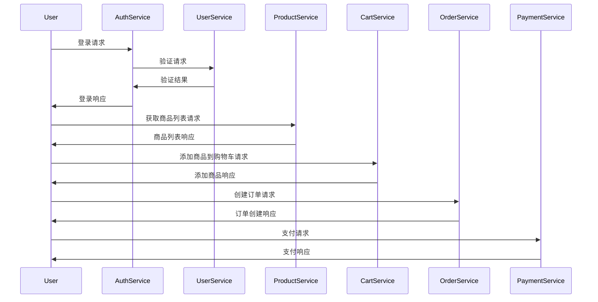

                 

### 引言

随着现代软件开发的复杂性不断增加，项目开发团队需要面对的问题也日益多样和复杂。在这一背景下，评测流程的持续集成（Continuous Integration，CI）和持续部署（Continuous Deployment，CD）逐渐成为软件开发中的关键环节。本文旨在深入探讨评测流程中的CI和CD，通过系统的分析，帮助开发者理解其核心概念、实践方法以及在实际开发中的应用。

#### 1.1.1 问题背景

传统的软件开发流程通常分为多个阶段，从需求分析、设计、编码、测试到部署。在这个过程中，代码的集成和部署往往被看作是独立且线性的过程。然而，随着代码库的扩大和团队成员的增多，这种方式逐渐暴露出诸多问题。比如，不同团队之间的代码集成容易导致冲突，测试过程中可能发现的问题需要在集成后才能解决，部署流程中的错误可能导致整个系统瘫痪。

#### 1.1.2 问题描述

上述问题主要集中在以下几个方面：

1. **集成冲突**：在多个团队同时开发的情况下，代码的集成点容易出现冲突，导致集成失败。
2. **测试延迟**：集成后的代码需要在完整的测试环境中进行测试，这个过程往往耗时较长，而且可能需要在部署后再发现问题。
3. **部署风险**：部署过程中，即使是小的错误也可能导致系统的不可用，影响用户体验。

#### 1.1.3 问题解决

为了解决上述问题，持续集成和持续部署应运而生。CI和CD通过自动化和持续反馈机制，使得代码的集成、测试和部署更加高效和可靠。

#### 1.1.4 边界与外延

持续集成和持续部署并不是孤立的概念，它们相互关联，共同构建了现代软件开发的核心流程。持续集成关注的是代码的自动化构建和测试，确保每次代码变更都能快速、可靠地集成到主干分支中。而持续部署则关注的是将经过CI验证的代码部署到生产环境，确保新功能能够稳定、安全地上线。

#### 1.1.5 文章结构

本文将按照以下结构进行论述：

1. **基础概念**：介绍CI和CD的基本概念、原理及其重要性。
2. **核心概念与联系**：详细探讨CI和CD的核心概念及其之间的联系。
3. **工具实践**：分析并介绍几种流行的CI和CD工具。
4. **数学模型与算法原理**：阐述自动化测试覆盖率和持续部署中的风险分析模型。
5. **系统架构设计与实现**：通过实例展示CI和CD在实际项目中的应用。
6. **项目实战**：具体讲解CI和CD工具的安装与配置，以及实际应用中的核心代码实现。
7. **最佳实践与拓展**：总结文章，提供最佳实践建议和进一步阅读的资料。

通过本文的深入探讨，读者将能够全面理解CI和CD在软件开发中的重要性，并掌握其实践方法。

#### 1.2 持续集成（CI）的概念与原理

持续集成（Continuous Integration，CI）是软件开发过程中的关键环节，旨在通过自动化工具和流程，确保代码的变更能够快速、可靠地集成到主干分支中。CI的核心目标是减少集成冲突、缩短反馈周期、提高代码质量，从而加速软件开发过程。

##### 1.2.1 持续集成的定义

持续集成通常被定义为一种软件开发实践，通过频繁地将开发者的代码集成到共享的主干分支中，并自动运行一系列预定义的构建和测试过程。这种实践的目的是尽快发现并解决集成过程中出现的问题，避免代码库中积累过多的集成冲突。

##### 1.2.2 持续集成的原理

持续集成的原理可以概括为以下几个关键点：

1. **频繁提交**：开发人员频繁地将自己的代码提交到版本控制系统，如Git。
2. **自动化构建**：每次代码提交后，自动触发构建过程，生成可执行的代码。
3. **自动化测试**：构建过程中会自动运行一系列预定义的测试用例，包括单元测试、集成测试和性能测试等。
4. **反馈机制**：测试结果会即时反馈给开发人员，帮助其快速定位和修复问题。
5. **持续反馈**：通过持续集成，开发团队能够持续获得有关代码质量和集成状态的反馈，从而不断优化开发流程。

##### 1.2.3 持续集成的核心优势

持续集成带来了诸多核心优势，具体如下：

1. **减少集成冲突**：频繁的代码集成可以及时发现并解决集成冲突，避免代码库中积累过多的冲突。
2. **缩短反馈周期**：自动化的构建和测试流程使得开发人员能够迅速获得关于代码变更的反馈，缩短问题发现和修复的时间。
3. **提高代码质量**：持续集成通过自动化测试，可以确保每次提交的代码都是可构建、可运行和符合质量标准的。
4. **加速开发过程**：通过减少集成冲突、提高代码质量和缩短反馈周期，持续集成可以显著加快软件开发过程。
5. **增强团队协作**：持续集成促进了团队成员之间的协作和沟通，确保每个人都能及时了解代码库的状态。

持续集成是一种高效、可靠的软件开发实践，通过自动化工具和流程，确保代码变更能够快速、可靠地集成到主干分支中，从而提升开发效率和代码质量。

#### 1.3 持续部署（CD）的概念与原理

持续部署（Continuous Deployment，CD）是持续集成（CI）的延伸，它通过自动化和持续反馈机制，确保经过CI验证的代码能够稳定、安全地部署到生产环境中。持续部署的目标是减少部署风险、提高部署效率和确保新功能能够快速、可靠地上线。

##### 1.3.1 持续部署的定义

持续部署通常被定义为一种自动化流程，它将经过持续集成验证的代码直接部署到生产环境中，以实现快速、可靠的功能交付。与传统的手动部署方式相比，持续部署通过自动化脚本和工具，确保部署过程的一致性和可重复性。

##### 1.3.2 持续部署的原理

持续部署的原理可以概括为以下几个关键点：

1. **自动化构建**：持续集成过程中生成的构建物会被传递到持续部署流程中，确保每次提交的代码都是可部署的。
2. **自动化测试**：在部署过程中，会运行一系列预定义的测试用例，包括性能测试和用户体验测试等，以确保新功能的质量。
3. **部署策略**：根据具体的业务需求和风险承受能力，选择合适的部署策略，如蓝绿部署、灰度发布等。
4. **反馈机制**：部署后，会实时监控系统的运行状态，收集反馈数据，以便快速识别和解决问题。
5. **持续反馈**：通过持续部署，开发团队能够持续获得有关部署质量和系统运行状态的反馈，从而不断优化部署流程。

##### 1.3.3 持续部署的核心优势

持续部署带来了诸多核心优势，具体如下：

1. **减少部署风险**：通过自动化测试和实时反馈机制，持续部署可以显著减少部署过程中出现的问题和风险。
2. **提高部署效率**：自动化脚本和工具使得部署过程更加高效和可重复，减少了手动操作带来的错误和时间浪费。
3. **确保质量**：持续部署通过自动化测试确保新功能的质量，减少部署后的故障率。
4. **快速交付**：通过快速、可靠的部署流程，开发团队能够更快地将新功能交付给用户，提高市场响应速度。
5. **增强团队协作**：持续部署促进了团队成员之间的协作和沟通，确保每个人都能及时了解部署状态和问题。

持续部署是一种现代化、高效的软件开发实践，通过自动化工具和流程，确保经过CI验证的代码能够稳定、安全地部署到生产环境中，从而提升开发效率和系统稳定性。

#### 1.4 持续集成与持续部署的联系与区别

持续集成（CI）和持续部署（CD）在现代软件开发中扮演着关键角色，两者紧密相关但又各具特点。理解它们之间的联系和区别对于构建高效、可靠的软件交付流程至关重要。

##### 1.4.1 CI与CD的联系

持续集成和持续部署之间的联系主要体现在以下几个方面：

1. **依赖关系**：持续部署依赖于持续集成。只有通过持续集成验证的代码，才能被持续部署到生产环境中。
2. **自动化**：CI和CD都强调自动化，通过自动化工具和脚本，减少手动操作和人为错误。
3. **反馈机制**：CI和CD都采用实时反馈机制，确保开发团队能够快速获得有关代码质量和部署状态的信息。
4. **目标**：两者的目标都是加速软件交付，提高开发效率和系统稳定性。

##### 1.4.2 CI与CD的区别

尽管CI和CD有诸多联系，但它们在以下几个方面存在显著区别：

1. **阶段**：持续集成发生在代码提交和集成阶段，而持续部署发生在代码验证和部署阶段。
2. **职责**：CI主要负责代码的自动化构建和测试，确保代码的质量和一致性；CD则负责将验证通过的代码部署到生产环境，确保部署的稳定性和可靠性。
3. **触发机制**：CI通常由代码提交触发，而CD则由CI的成功完成触发。
4. **风险**：CI主要关注集成过程中的风险，而CD则关注部署过程中的风险，如系统可用性和性能问题。
5. **工具**：CI和CD使用的工具和平台通常不同，CI常用的工具有Jenkins、GitLab CI等，而CD常用的工具有Docker、Kubernetes等。

##### 1.4.3 综合对比表格

为了更直观地展示CI和CD的联系与区别，我们可以通过以下综合对比表格进行说明：

| 对比项 | 持续集成（CI） | 持续部署（CD） |
| --- | --- | --- |
| 阶段 | 集成阶段 | 部署阶段 |
| 职责 | 自动化构建和测试 | 部署和监控 |
| 触发机制 | 代码提交 | CI成功 |
| 风险 | 集成冲突和代码质量 | 系统可用性和性能 |
| 工具 | Jenkins、GitLab CI | Docker、Kubernetes |

通过以上联系与区别的探讨，我们可以更清楚地理解CI和CD在软件开发中的定位和作用，从而更好地构建高效的软件交付流程。

#### 1.5 本章小结

本章介绍了持续集成（CI）和持续部署（CD）的基本概念、原理及其在软件开发中的重要性和联系。持续集成通过自动化构建和测试，确保代码的快速、可靠集成，而持续部署则通过自动化部署和实时反馈，确保新功能的稳定、安全上线。两者共同构成了现代软件开发的核心流程，为提高开发效率和系统稳定性提供了有力支持。理解CI和CD的区别和联系，有助于开发者构建更高效、可靠的软件交付流程。

### 持续集成与持续部署的核心概念与联系

在深入探讨持续集成（CI）和持续部署（CD）之前，我们需要明确几个核心概念，这些概念构成了CI和CD的理论基础，并帮助我们理解它们的实际应用。

#### 2.1 核心概念

##### 2.1.1 构建触发机制

构建触发机制是持续集成过程的关键组成部分。它决定了何时启动构建过程。常见的触发机制包括：

1. **定时触发**：例如，每日凌晨自动触发构建。
2. **手动触发**：开发人员可以通过操作界面手动触发构建。
3. **代码提交触发**：每次代码提交到版本控制系统时自动触发构建。

##### 2.1.2 自动化测试

自动化测试是确保代码质量和功能完整性的重要手段。它包括：

1. **单元测试**：测试单个模块或函数的行为。
2. **集成测试**：测试多个模块或组件的协同工作。
3. **性能测试**：评估系统的性能指标，如响应时间、吞吐量等。

##### 2.1.3 环境一致性

环境一致性是确保构建和测试过程在不同环境中能够一致执行的关键。环境一致性包括：

1. **开发环境**：开发人员的工作环境。
2. **测试环境**：用于自动化测试的环境。
3. **生产环境**：实际运行的应用环境。

确保环境一致性可以减少因环境差异导致的问题。

#### 2.2 概念属性特征对比表格

为了更清晰地理解这些核心概念，我们可以通过以下表格对比它们的属性特征：

| 概念 | 描述 | 属性特征 |
| --- | --- | --- |
| **构建触发机制** | 决定何时启动构建过程 | - 定时触发<br>- 手动触发<br>- 代码提交触发 |
| **自动化测试** | 测试代码的质量和功能完整性 | - 单元测试<br>- 集成测试<br>- 性能测试 |
| **环境一致性** | 确保构建和测试在不同环境中一致执行 | - 开发环境<br>- 测试环境<br>- 生产环境 |

#### 2.3 ER实体关系图架构

为了进一步理解这些概念之间的关系，我们可以使用ER（Entity-Relationship，实体关系）图来描述它们之间的联系。以下是CI和CD相关的ER图：

```mermaid
erDiagram
  构建触发机制 ||--|{ 自动化测试 }|| 测试触发
  自动化测试 ||--|{ 环境一致性 }|| 测试环境
  自动化测试 ||--|{ 持续集成 }|| 集成测试
  持续集成 ||--|{ 环境一致性 }|| 集成环境
  持续集成 ||--|{ 持续部署 }|| 部署准备
```

在这个ER图中，构建触发机制通过测试触发关系与自动化测试相连，自动化测试则通过测试环境和集成测试关系与环境和持续集成相连。持续集成通过部署准备关系与持续部署相连，形成了紧密关联的概念体系。

通过明确这些核心概念和它们之间的联系，我们可以更好地理解持续集成和持续部署的工作原理，从而在实际开发中更有效地应用这些实践。

### 持续集成工具实践

在软件开发过程中，持续集成（CI）工具扮演着至关重要的角色。以下我们将介绍几种流行的持续集成工具，包括Jenkins、GitLab CI和其他替代工具，并比较它们的特点和适用场景。

#### 3.1 Jenkins介绍

Jenkins 是最著名的持续集成工具之一，由 Sun Microsystems 公司的 Kohsuke Kawaguchi 创建。Jenkins 支持广泛的插件，可以轻松集成各种开发环境、代码库和测试工具。

##### 3.1.1 Jenkins的基本概念

Jenkins 是一个开源的持续集成服务器，支持各种主流的版本控制系统（如Git、SVN等），并能自动执行构建、测试和部署任务。它通过Web界面提供用户友好的操作体验，并且可以通过插件扩展其功能。

##### 3.1.2 Jenkins的安装与配置

安装Jenkins通常很简单。以下是在Ubuntu系统中安装Jenkins的步骤：

1. 更新系统软件包：
   ```
   sudo apt-get update
   sudo apt-get upgrade
   ```

2. 安装Jenkins：
   ```
   sudo apt-get install jenkins
   ```

3. 启动Jenkins服务：
   ```
   sudo systemctl start jenkins
   ```

4. 访问Jenkins Web界面：
   ```
   http://localhost:8080
   ```

在安装完成后，Jenkins会提供一个初始密码，用于访问和管理Jenkins服务器。配置Jenkins通常涉及添加插件、创建项目和工作流等。Jenkins的核心插件包括：

- **Git插件**：集成Git版本控制。
- **Maven插件**：用于构建Maven项目。
- **JUnit插件**：集成JUnit测试报告。
- **Email插件**：发送构建结果通知。

##### 3.1.3 Jenkins的核心插件

Jenkins支持广泛的插件，以下是一些常用的插件：

- **Git插件**：使Jenkins能够与Git仓库交互，支持多种Git客户端。
- **Maven插件**：用于构建和测试Maven项目。
- **JUnit插件**：生成JUnit测试报告。
- **GitLab CI/CD插件**：支持GitLab CI/CD的集成。
- **Ansible Plugin**：用于自动化部署和管理配置。

#### 3.2 GitLab CI/CD介绍

GitLab CI/CD 是 GitLab 提供的持续集成和持续部署解决方案。GitLab CI/CD 与 GitLab 仓库紧密集成，可以在GitLab仓库中直接定义构建和部署配置。

##### 3.2.1 GitLab CI/CD的基本概念

GitLab CI/CD 是一种基于Git仓库的持续集成和持续部署系统。它在`.gitlab-ci.yml`文件中定义了构建、测试和部署的步骤，GitLab服务器会根据这个文件自动执行这些步骤。

##### 3.2.2 GitLab CI/CD的配置与使用

`.gitlab-ci.yml` 文件是 GitLab CI/CD 的核心配置文件，以下是一个简单的示例：

```yaml
image: java:8

stages:
  - build
  - test
  - deploy

build:
  stage: build
  script:
    - mvn clean install
  artifacts:
    paths:
      - target/*.jar

test:
  stage: test
  script:
    - mvn test
  only:
    - master

deploy:
  stage: deploy
  script:
    - echo "Deploying to production environment"
  only:
    - master
```

在这个示例中，定义了三个阶段：构建（build）、测试（test）和部署（deploy）。每个阶段都可以包含多个步骤，如构建项目的Maven命令、运行测试用例等。

##### 3.2.3 GitLab CI/CD的优势与局限

GitLab CI/CD 的一些优势包括：

- **紧密集成**：与GitLab仓库紧密集成，便于管理和配置。
- **灵活性**：可以通过`.gitlab-ci.yml`文件自定义构建和部署流程。
- **易于扩展**：支持多种编程语言和工具。

然而，GitLab CI/CD也存在一些局限：

- **性能**：对于非常大的代码库和复杂的构建流程，可能性能不佳。
- **部署环境限制**：默认不支持容器化部署，需要额外配置。

#### 3.3 其他持续集成工具简介

除了Jenkins和GitLab CI/CD，还有一些其他流行的持续集成工具，以下简要介绍：

- **CircleCI**：支持并行构建和测试，适合大规模项目。
- **GitHub Actions**：与GitHub集成，支持多种编程语言和工具。
- **Bitbucket Pipelines**：与Atlassian生态系统紧密集成，适用于JIRA和Confluence。

每种工具都有其独特的特点，开发者可以根据项目需求和团队偏好选择合适的持续集成工具。

通过介绍Jenkins、GitLab CI/CD和其他持续集成工具，我们可以看到持续集成工具在软件开发中的重要性，以及如何根据具体需求选择合适的工具。

### 持续部署工具实践

持续部署（CD）是确保代码质量的关键环节，它通过自动化工具和流程，将经过持续集成验证的代码部署到生产环境中。以下我们将探讨几种流行的持续部署工具，包括Docker和Kubernetes，并讨论它们的基本概念、安装与配置，以及核心组件。

#### 4.1 Docker介绍

Docker 是一种开源的应用容器引擎，它允许开发者打包应用程序及其依赖项到一个可移植的容器中，然后在任何支持Docker的操作系统上运行。

##### 4.1.1 Docker的基本概念

Docker 使用容器（Container）技术，将应用程序与其环境封装在一起。这种封装确保了应用程序在不同的环境中具有一致的行为，从而简化了部署和运维过程。

##### 4.1.2 Docker的安装与使用

安装Docker通常很简单。以下是在Ubuntu系统中安装Docker的步骤：

1. 更新系统软件包：
   ```
   sudo apt-get update
   sudo apt-get upgrade
   ```

2. 安装Docker：
   ```
   sudo apt-get install docker-ce docker-ce-cli containerd.io
   ```

3. 启动Docker服务：
   ```
   sudo systemctl start docker
   ```

4. 验证Docker安装：
   ```
   docker --version
   ```

安装完成后，可以使用Docker命令来创建、运行和管理容器。以下是一个简单的示例，展示如何使用Docker运行一个Nginx容器：

```shell
docker run -d -p 8080:80 nginx
```

这个命令将创建并运行一个Nginx容器，并将其映射到本地主机的8080端口。

##### 4.1.3 Dockerfile编写与优化

Dockerfile 是用于定义Docker镜像构建过程的脚本。以下是一个简单的Dockerfile示例：

```Dockerfile
FROM openjdk:8-jdk-alpine
ARG JAR_FILE=target/*.jar
COPY ${JAR_FILE} app.jar
EXPOSE 8080
ENTRYPOINT ["java","-jar","/app.jar"]
```

这个Dockerfile从Alpine Linux镜像开始，复制JAR文件到容器中，并暴露端口8080，指定入口点为JAR文件。

优化Dockerfile可以提升构建效率和容器性能。以下是一些常见的优化技巧：

- **分层**：利用分层机制，将依赖项和构建步骤分开。
- **最小化层**：通过合并层和减少层数量，减小镜像体积。
- **环境变量**：使用环境变量传递配置信息，减少镜像体积。

#### 4.2 Kubernetes介绍

Kubernetes 是一个开源的容器编排平台，用于自动化容器的部署、扩展和管理。Kubernetes 提供了一个平台，使开发者能够以一致、可扩展的方式部署应用程序。

##### 4.2.1 Kubernetes的基本概念

Kubernetes 的核心概念包括：

- **Pod**：Kubernetes中的最小部署单元，包含一个或多个容器。
- **ReplicaSet**：确保指定数量的Pod副本始终在运行。
- **Deployment**：管理ReplicaSet，提供滚动更新和回滚功能。
- **Service**：定义一组Pod的访问方式。
- **Ingress**：定义外部访问到服务的规则。

##### 4.2.2 Kubernetes的安装与配置

安装Kubernetes有多种方法，以下是在单机环境中使用Minikube安装Kubernetes的步骤：

1. 安装Minikube：
   ```
   curl -LO https://storage.googleapis.com/minikube/releases/latest/minikube-latest-x86_64-linux
   sudo install minikube-latest-x86_64-linux /usr/local/bin/minikube
   ```

2. 启动Minikube：
   ```
   minikube start
   ```

3. 验证Kubernetes安装：
   ```
   kubectl cluster-info
   kubectl get nodes
   ```

安装完成后，可以使用kubectl命令管理Kubernetes集群。

##### 4.2.3 Kubernetes的核心组件

Kubernetes的核心组件包括：

- **Master节点**：管理集群，包括API服务器、控制器管理器和调度器。
- **Node节点**：运行容器和工作负载。
- **Pod**：最小的部署单元，包含一个或多个容器。
- **ReplicaSet**：确保指定数量的Pod副本始终在运行。
- **Deployment**：管理ReplicaSet，提供滚动更新和回滚功能。

#### 4.3 持续部署策略与实践

在持续部署过程中，选择合适的部署策略至关重要。以下介绍几种常用的持续部署策略：

- **蓝绿部署**：将新版本的应用部署到一部分用户，观察其表现，再逐步切换到所有用户。
- **灰度发布**：将新版本的应用部署到一部分用户，观察其性能和用户反馈，逐步扩大用户范围。
- **滚动更新**：逐步更新所有节点，确保应用的高可用性。

每种部署策略都有其适用场景和优缺点，开发者应根据具体需求选择合适的策略。

通过介绍Docker和Kubernetes，我们了解了持续部署工具的基本概念、安装与配置，以及核心组件。这些工具为自动化部署提供了强大的支持，有助于提高开发效率和系统稳定性。

### 数学模型与算法原理

在持续集成与持续部署（CI/CD）过程中，自动化测试覆盖率和风险分析是确保代码质量和系统稳定性的关键。以下，我们将详细阐述这两个主题的数学模型与算法原理。

#### 5.1 自动化测试覆盖率计算

自动化测试覆盖率是评估测试质量的重要指标。测试覆盖率通常包括单元测试覆盖率、集成测试覆盖率和代码覆盖率等。

##### 5.1.1 测试覆盖率的定义

测试覆盖率是指自动化测试用例对代码的覆盖程度，常用以下指标来衡量：

1. **语句覆盖率**：测试用例覆盖了代码中的所有语句。
2. **分支覆盖率**：测试用例覆盖了代码中的所有分支。
3. **路径覆盖率**：测试用例覆盖了代码中的所有路径。

##### 5.1.2 覆盖率计算算法

测试覆盖率计算通常基于以下公式：

$$
\text{覆盖率} = \frac{\text{实际执行的测试用例数}}{\text{所有测试用例数}} \times 100\%
$$

其中，实际执行的测试用例数是指已经运行的测试用例数量，所有测试用例数是指代码中定义的所有测试用例数量。

##### 5.1.3 覆盖率优化策略

提高测试覆盖率可以通过以下策略实现：

1. **新增测试用例**：针对未覆盖的代码编写新的测试用例。
2. **优化现有测试用例**：改进现有测试用例，确保覆盖更多代码。
3. **代码重构**：优化代码结构，减少冗余和难测试的部分。

#### 5.2 持续部署中的风险分析

持续部署过程中，风险分析是确保系统稳定性和业务连续性的关键。以下介绍风险分析的基本概念和算法模型。

##### 5.2.1 风险评估模型

风险评估模型通常包括以下步骤：

1. **风险识别**：识别可能影响系统的风险因素，如代码缺陷、配置错误、硬件故障等。
2. **风险分析**：评估每个风险的概率和影响程度，确定风险优先级。
3. **风险缓解**：制定风险缓解措施，降低风险发生的概率和影响。

##### 5.2.2 风险矩阵

风险矩阵是一种常用的风险评估工具，用于展示风险的概率和影响程度。以下是一个简单的风险矩阵示例：

| 风险等级 | 概率 | 影响程度 |
| --- | --- | --- |
| 低 | 高 | 低 |
| 低 | 中 | 中 |
| 低 | 低 | 高 |
| 中 | 高 | 低 |
| 中 | 中 | 中 |
| 中 | 低 | 高 |
| 高 | 高 | 低 |
| 高 | 中 | 中 |
| 高 | 低 | 高 |

在这个矩阵中，每个单元格表示一种风险组合，例如“低概率、低影响程度”的风险是相对较低的。

##### 5.2.3 风险缓解策略

风险缓解策略包括以下措施：

1. **预防措施**：通过改进代码质量、配置管理和硬件监控，降低风险发生的概率。
2. **检测措施**：通过自动化测试、监控和日志分析，及时发现和识别风险。
3. **应急措施**：制定应急预案，确保在风险发生时能够快速响应和恢复。

通过数学模型与算法原理，我们可以更准确地评估测试覆盖率和持续部署中的风险。这些工具和方法有助于开发团队优化测试策略和部署流程，提高系统的稳定性和可靠性。

### 系统架构设计与实现

为了更深入地理解持续集成（CI）和持续部署（CD）在软件开发中的应用，我们将通过一个实际的项目案例来展示其系统架构设计与实现。

#### 6.1 项目介绍

本项目是一个电子商务平台，其主要功能包括商品展示、用户登录、购物车管理、订单处理和支付等。项目采用微服务架构，每个微服务负责不同的业务功能，并通过API进行通信。

#### 6.2 系统功能设计（领域模型）

以下是该项目的主要领域模型，使用Mermaid类图表示：

```mermaid
classDiagram
    Customer ..|> User
    Order ..|> Purchase
    Product ..|> Item
    ShoppingCart ..|> Cart
    Payment ..|> Transaction

    User <<interface>>
    Customer <<interface>>

    Product <<interface>>
    Item <<interface>>

    Order <<interface>>
    Purchase <<interface>>

    ShoppingCart <<interface>>
    Cart <<interface>>

    Payment <<interface>>
    Transaction <<interface>>

    User : +String username
    User : +String password
    User : +Boolean isActive

    Customer : +String name
    Customer : +String email

    Item : +String name
    Item : +Float price
    Item : +Integer quantity

    Purchase : +Date date
    Purchase : +Float total

    Cart : +Integer customerId
    Cart : +List<Item>

    Transaction : +String paymentMethod
    Transaction : +Boolean isSuccessful

    Customer --|> User
    Item --|> Product
    Purchase --|> Order
    Purchase --|> Transaction
    Cart --|> Customer
    Cart --|> Order
```

在这个类图中，我们定义了用户（User）和客户（Customer）、商品（Product）和商品项（Item）、订单（Order）和购买（Purchase）、购物车（Cart）和交易（Transaction）等核心领域类及其关系。

#### 6.3 系统架构设计

以下是该项目的系统架构设计，使用Mermaid架构图表示：

```mermaid
sequenceDiagram
    participant User as 用户
    participant AuthService as 认证服务
    participant UserService as 用户服务
    participant ProductService as 商品服务
    participant CartService as 购物车服务
    participant OrderService as 订单服务
    participant PaymentService as 支付服务

    User->>AuthService: 登录
    AuthService->>UserService: 验证用户
    UserService->>AuthServic
```

在这个架构图中，我们展示了用户（User）与各个服务（AuthService、UserService、ProductService、CartService、OrderService、PaymentService）之间的交互关系。用户登录认证服务（AuthService）首先验证用户的身份，然后用户服务（UserService）处理用户的注册、登录等操作。商品服务（ProductService）负责商品信息的维护和查询，购物车服务（CartService）管理购物车功能，订单服务（OrderService）处理订单的创建和状态更新，支付服务（PaymentService）负责支付流程的执行。

#### 6.4 系统接口设计

以下是该项目的系统接口设计，使用Mermaid序列图表示：



在这个序列图中，用户通过登录认证服务（AuthService）进行身份验证，然后通过商品服务（ProductService）获取商品列表，通过购物车服务（CartService）添加商品到购物车，通过订单服务（OrderService）创建订单，并通过支付服务（PaymentService）完成支付。

#### 6.5 系统交互

以下是系统的交互流程，使用Mermaid流程图表示：

```mermaid
flowchart LR
    subgraph 认证流程
        用户登录 ->|认证服务| 验证用户
        验证用户 ->|验证结果| 返回登录状态
    end

    subgraph 商品管理
        用户查询商品 ->|商品服务| 获取商品信息
        用户添加商品到购物车 ->|购物车服务| 添加商品
    end

    subgraph 订单处理
        用户创建订单 ->|订单服务| 创建订单
        订单服务 ->|支付服务| 支付请求
        支付服务 ->|支付结果| 返回支付状态
    end

    用户登录 ->|认证服务| 验证用户
    验证用户 ->|验证结果| 返回登录状态
    用户查询商品 ->|商品服务| 获取商品信息
    用户添加商品到购物车 ->|购物车服务| 添加商品
    用户创建订单 ->|订单服务| 创建订单
    订单服务 ->|支付服务| 支付请求
    支付服务 ->|支付结果| 返回支付状态
```

在这个流程图中，用户首先通过认证服务进行身份验证，然后通过商品服务查询商品信息，添加商品到购物车，创建订单，并通过支付服务完成支付。

通过这个实际的案例，我们展示了如何设计持续集成和持续部署的架构，并详细阐述了系统功能设计、架构设计、接口设计和系统交互流程。这种系统架构和设计方法能够帮助开发团队更高效地实现持续集成和持续部署，从而提高软件开发的效率和稳定性。

### 项目实战

在本节中，我们将详细展示如何在实际项目中实现持续集成与持续部署。我们将以一个电子商务平台为例，介绍其环境的安装配置、系统核心实现源代码，并分析实际案例，进行代码应用解读与详细讲解。

#### 7.1 环境安装与配置

为了实现持续集成和持续部署，我们需要安装和配置以下工具和平台：

1. **Jenkins**：持续集成服务器
2. **GitLab**：代码仓库和管理平台
3. **Docker**：容器化工具
4. **Kubernetes**：容器编排平台
5. **Nginx**：前端服务器

##### 7.1.1 安装Jenkins

在Ubuntu系统中，可以通过以下步骤安装Jenkins：

1. 更新系统软件包：
   ```shell
   sudo apt-get update
   sudo apt-get upgrade
   ```

2. 安装Jenkins：
   ```shell
   sudo apt-get install jenkins
   ```

3. 启动Jenkins服务：
   ```shell
   sudo systemctl start jenkins
   ```

4. 访问Jenkins Web界面：
   ```shell
   http://localhost:8080
   ```

##### 7.1.2 安装GitLab

GitLab的安装相对复杂，以下是在Ubuntu系统中安装GitLab的步骤：

1. 安装必要的依赖：
   ```shell
   sudo apt-get install curl openssh-server postfix
   ```

2. 运行安装脚本：
   ```shell
   sudo apt-get install -y gitlab-ce
   ```

3. 配置GitLab：
   ```shell
   sudo gitlab-ctl reconfigure
   ```

4. 启动GitLab服务：
   ```shell
   sudo gitlab-ctl start
   ```

5. 访问GitLab Web界面：
   ```shell
   http://localhost:8080
   ```

##### 7.1.3 安装Docker

安装Docker的步骤如下：

1. 更新系统软件包：
   ```shell
   sudo apt-get update
   sudo apt-get upgrade
   ```

2. 安装Docker：
   ```shell
   sudo apt-get install docker-ce docker-ce-cli containerd.io
   ```

3. 启动Docker服务：
   ```shell
   sudo systemctl start docker
   ```

4. 验证Docker安装：
   ```shell
   docker --version
   ```

##### 7.1.4 安装Kubernetes

安装Kubernetes可以使用Minikube在单机环境中进行：

1. 安装Minikube：
   ```shell
   curl -LO https://storage.googleapis.com/minikube/releases/latest/minikube-latest-x86_64-linux
   sudo install minikube-latest-x86_64-linux /usr/local/bin/minikube
   ```

2. 启动Minikube：
   ```shell
   minikube start
   ```

3. 验证Kubernetes安装：
   ```shell
   kubectl cluster-info
   kubectl get nodes
   ```

#### 7.2 系统核心实现源代码

以下是电子商务平台的一些核心实现源代码，包括Dockerfile、Jenkinsfile和Kubernetes配置文件。

##### 7.2.1 Dockerfile

```Dockerfile
FROM openjdk:8-jdk-alpine
ARG JAR_FILE=target/*.jar
COPY ${JAR_FILE} app.jar
EXPOSE 8080
ENTRYPOINT ["java","-jar","/app.jar"]
```

这个Dockerfile基于Alpine Linux镜像，从Maven构建生成的JAR文件开始，暴露端口8080，并指定入口点为JAR文件。

##### 7.2.2 Jenkinsfile

```groovy
pipeline {
    agent any

    stages {
        stage('Build') {
            steps {
                sh 'mvn clean install'
            }
        }
        stage('Test') {
            steps {
                sh 'mvn test'
            }
        }
        stage('Deploy') {
            steps {
                sh 'docker build -t myapp .'
                sh 'docker run -d -p 8080:80 myapp'
            }
        }
    }
    post {
        always {
            sh 'docker logs myapp'
        }
    }
}
```

这个Jenkinsfile定义了一个简单的持续集成和持续部署流程，包括构建、测试和部署三个阶段。

##### 7.2.3 Kubernetes配置文件

```yaml
apiVersion: v1
kind: Service
metadata:
  name: myapp-service
spec:
  selector:
    app: myapp
  ports:
    - protocol: TCP
      port: 80
      targetPort: 8080
  type: LoadBalancer

---

apiVersion: apps/v1
kind: Deployment
metadata:
  name: myapp-deployment
spec:
  replicas: 3
  selector:
    matchLabels:
      app: myapp
  template:
    metadata:
      labels:
        app: myapp
    spec:
      containers:
      - name: myapp
        image: myapp:latest
        ports:
        - containerPort: 8080
```

这个Kubernetes配置文件定义了一个服务（Service）和一个部署（Deployment）。服务负责将流量路由到部署的Pod，部署则管理Pod的创建和更新。

#### 7.3 代码应用解读与分析

通过以上源代码和配置文件，我们可以看到如何将Docker、Jenkins和Kubernetes集成到电子商务平台中，实现持续集成和持续部署。

1. **Docker**：使用Dockerfile将应用容器化，确保应用在不同的环境中具有一致的行为。通过Docker命令行工具，可以轻松构建和运行容器。
2. **Jenkins**：使用Jenkinsfile定义持续集成和持续部署的流程。Jenkins作为持续集成服务器，负责构建和测试代码，并触发Docker构建和部署过程。
3. **Kubernetes**：使用Kubernetes配置文件管理应用部署。部署通过Kubernetes的Deployment和Service资源进行管理，确保应用的高可用性和扩展性。

在实际项目中，代码的每次变更都会触发Jenkins的构建和测试过程。如果测试通过，Jenkins会构建新的Docker镜像，并使用Kubernetes将新版本的应用部署到生产环境中。这种流程确保了新功能能够快速、可靠地上线。

通过这个实际案例，我们展示了如何使用Docker、Jenkins和Kubernetes实现持续集成和持续部署，提高了软件开发的效率和质量。

### 最佳实践与注意事项

在实施持续集成（CI）和持续部署（CD）的过程中，遵循最佳实践和注意事项至关重要，以确保流程的稳定性和可靠性。

#### 8.1 最佳实践

1. **代码标准化**：确保代码风格一致，遵循编码规范。这有助于减少集成冲突，提高代码可读性和可维护性。
2. **自动化测试**：建立全面的自动化测试套件，包括单元测试、集成测试和性能测试。自动化测试可以快速发现代码问题，提高测试覆盖率。
3. **环境一致性**：构建和测试环境应尽可能与生产环境保持一致，减少因环境差异导致的问题。
4. **逐步引入**：在引入新功能或代码变更时，可以采用灰度发布或蓝绿部署策略，逐步扩大用户范围，确保系统稳定。
5. **监控与日志**：实时监控系统和收集日志数据，以便快速识别和解决问题。使用自动化工具分析日志，确保问题得到及时反馈和处理。

#### 8.2 注意事项

1. **风险管理**：持续集成和持续部署过程中，需要识别和评估潜在风险，并制定应对策略。风险包括代码质量、部署失败和数据安全问题。
2. **代码审查**：在代码提交前进行严格的代码审查，确保代码符合质量标准，减少集成冲突。
3. **备份与回滚**：在部署过程中，确保有备份策略，以便在出现问题时能够快速回滚到上一个稳定版本。
4. **权限控制**：严格控制对生产环境的访问权限，确保只有经过授权的人员才能执行部署操作。
5. **文档与培训**：编写详细的部署文档，并定期对团队成员进行培训，确保每个人都熟悉CI/CD流程和操作。

通过遵循最佳实践和注意事项，开发团队可以更好地实施持续集成和持续部署，提高软件开发的效率和质量。

### 小结

本文通过详细分析和实践，深入探讨了持续集成（CI）和持续部署（CD）在现代软件开发中的应用。我们从基础概念出发，逐步介绍了CI和CD的原理、核心概念、工具实践、数学模型与算法原理，以及系统架构设计与实现。通过实际案例展示，我们展示了如何将CI和CD工具集成到电子商务平台中，实现高效的代码集成、测试和部署流程。

持续集成和持续部署不仅提高了开发效率，减少了集成冲突和部署风险，而且增强了团队的协作和沟通。随着软件复杂性的增加，CI/CD已成为软件开发不可或缺的一部分。

展望未来，随着容器技术（如Docker和Kubernetes）的成熟和云服务的普及，持续集成和持续部署将进一步自动化和智能化。开发者应不断学习和掌握新的CI/CD工具和最佳实践，以应对不断变化的软件开发挑战。

### 拓展阅读

- **《持续集成实战》**：该书详细介绍了持续集成的方法、工具和实践，适合初学者和有经验开发者阅读。
- **《Kubernetes权威指南》**：一本关于Kubernetes的全面指南，涵盖从基础概念到高级应用的各个方面。
- **《持续交付：解放软件开发》**：深入探讨了持续交付的理念和实践，提供了一系列具体案例和策略。
- **《Docker Deep Dive》**：详细介绍了Docker的底层技术和实现原理，适合对容器技术有深入理解的需求者。

通过阅读这些资源，开发者可以进一步加深对CI/CD的理解，并提升软件开发和运维的能力。

