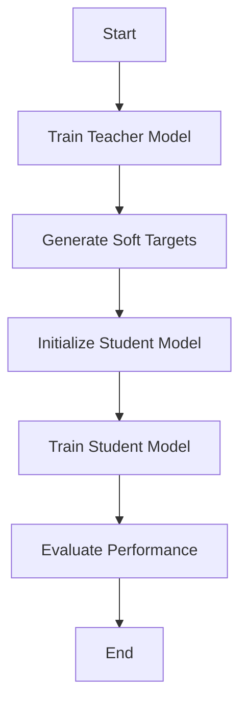
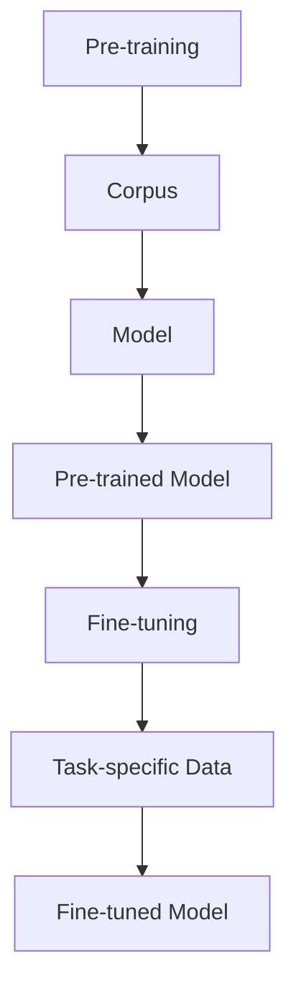
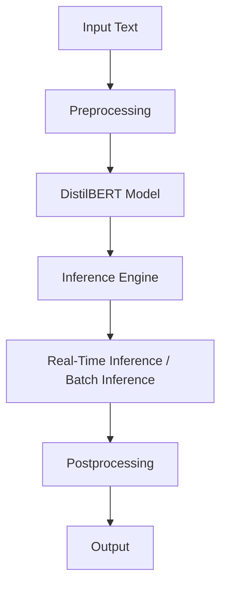
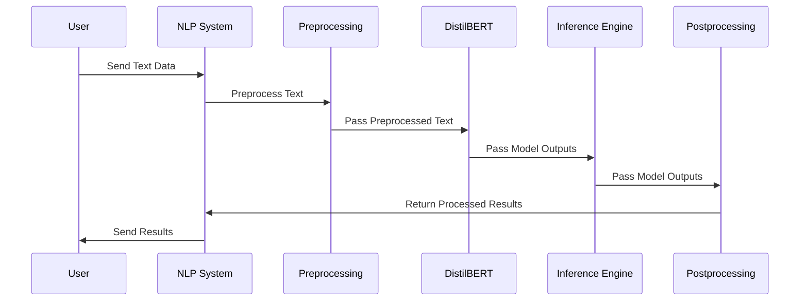

                 


### Introduction to DistilBERT and Knowledge Distillation

**Chapter 1: Introduction to DistilBERT and Knowledge Distillation**

#### 1.1 Overview of DistilBERT

DistilBERT is a distilled version of the BERT model, which retains 97% of BERT’s language understanding capabilities while being 60% smaller and 60% faster. This remarkable efficiency is achieved through a technique called "knowledge distillation," where a smaller, faster model (the student) learns from a larger, more powerful model (the teacher). Let's delve into the history and core features of DistilBERT.

##### 1.1.1 Definition and History of DistilBERT

DistilBERT was first introduced by the Hugging Face team in 2019 as part of the AllenAI research project. The motivation behind this model was to make the power of BERT accessible to users with limited computational resources. DistilBERT was trained on the same corpus as BERT but used a distilled learning approach to create a smaller model without sacrificing much in terms of performance.

##### 1.1.2 Core Features and Advantages of DistilBERT

- **Size and Speed**: DistilBERT is significantly smaller (about 40 million parameters) and faster than the original BERT model, making it more efficient for deployment on devices with limited resources.
- **Performance**: Despite its smaller size, DistilBERT retains most of the language understanding capabilities of the full-sized BERT model. It achieves state-of-the-art performance on many NLP tasks, including text classification, sentiment analysis, and question-answering.
- **Robustness**: DistilBERT is also more robust to noise in the input data, which is an important feature for real-world applications where data quality can vary.

##### 1.1.3 Comparison with Full-sized BERT Models

Here's a quick comparison table to highlight the differences between DistilBERT and the full-sized BERT model:

| Feature | DistilBERT | Full-sized BERT |
| --- | --- | --- |
| Parameters | 40 million | 340 million |
| Size | 60% smaller | N/A |
| Inference Speed | 60% faster | N/A |
| Performance | Comparable | Slightly better |
| Computational Resource | Efficient | Resource-intensive |

#### 1.2 What is Knowledge Distillation?

Knowledge distillation is a technique used to transfer knowledge from a larger, more complex model (the teacher) to a smaller, more efficient model (the student). This process involves training the student model to replicate the behavior of the teacher model as closely as possible. Let's explore the purpose, process, and techniques involved in knowledge distillation.

##### 1.2.1 Definition and Purpose of Knowledge Distillation

Knowledge distillation aims to leverage the knowledge embedded in a large, high-capacity model to improve the performance of a smaller model. This is particularly useful in scenarios where deploying a full-sized model is impractical due to computational constraints or budget limitations.

##### 1.2.2 Distillation Process and Techniques

The distillation process typically involves the following steps:

1. **Teacher Model**: Train a large, high-capacity model (the teacher) on the target task using a large dataset.
2. **Student Model**: Initialize a smaller model (the student) with a simpler architecture.
3. **Soft Targets**: The teacher model generates soft targets (probabilities) for each class or prediction from the input data.
4. **Training**: Train the student model using both the original labels and the soft targets generated by the teacher.
5. **Evaluation**: Evaluate the performance of the student model on a validation set to ensure it has learned from the teacher.

There are two main techniques for knowledge distillation:

- **Soft Target Method**: The student model is trained to minimize the difference between its predictions and the soft targets generated by the teacher.
- **Hard Target Method**: The student model is trained to minimize the difference between its predictions and the hard targets (correct labels) used by the teacher.

##### 1.2.3 Role of DistilBERT in Knowledge Distillation

DistilBERT exemplifies the effectiveness of knowledge distillation. By distilling knowledge from the full-sized BERT model, DistilBERT achieves comparable performance while being significantly smaller and faster. This makes DistilBERT an excellent candidate for applications where computational resources are limited, such as mobile devices, embedded systems, and edge computing.

### Conclusion

In this chapter, we have introduced DistilBERT and the concept of knowledge distillation. We have explored the history, core features, and advantages of DistilBERT, as well as the purpose and techniques involved in knowledge distillation. In the next chapters, we will delve deeper into the architecture, mathematical models, and system designs related to DistilBERT and knowledge distillation. Stay tuned!

---
### Core Concepts and Principles of DistilBERT and Knowledge Distillation

**Chapter 2: Core Concepts and Principles of DistilBERT and Knowledge Distillation**

#### 2.1 DistilBERT Architecture

DistilBERT is built upon the same Transformer architecture as BERT but with some modifications to reduce its size and computational complexity while retaining most of its language understanding capabilities. Let's explore the architecture and the training and inference processes of DistilBERT.

##### 2.1.1 Model Architecture

The architecture of DistilBERT is similar to that of BERT, but with a few key differences:

- **Layer Reduction**: DistilBERT has fewer layers than BERT (typically 6-12 layers compared to BERT's 24 layers).
- **Attention Heads**: The number of attention heads is reduced to match the reduction in layers.
- **Feedforward Size**: The feedforward network size is scaled down to maintain a similar depth as BERT.
- **Dropout**: Dropout is applied less frequently in DistilBERT to preserve its capacity.

##### 2.1.2 Training Process

The training process of DistilBERT involves two stages: pre-training and fine-tuning.

1. **Pre-training**: DistilBERT is pre-trained on a large corpus of text using unsupervised learning. The model is trained to predict masked tokens in the input sequence, which helps it learn the underlying patterns and structures of the language.
2. **Fine-tuning**: After pre-training, DistilBERT is fine-tuned on a task-specific dataset. During fine-tuning, the model is trained to predict labels or outputs for specific tasks such as text classification or question-answering.

##### 2.1.3 Inference Process

During inference, DistilBERT processes the input text and generates predictions based on the learned patterns and structures. The inference process is similar to the training process but does not involve backpropagation or parameter updates.

- **Input Processing**: The input text is tokenized and passed through the DistilBERT model.
- **Prediction Generation**: The model generates predictions for each token in the input sequence.
- **Output Aggregation**: The predictions for each token are aggregated to produce the final prediction for the entire input text.

#### 2.2 Knowledge Distillation Techniques

Knowledge distillation involves transferring knowledge from a larger, high-capacity model (the teacher) to a smaller, more efficient model (the student). There are two main techniques for knowledge distillation: soft target method and hard target method.

##### 2.2.1 Teacher-Student Learning

The teacher-student learning framework is the core of knowledge distillation. In this framework, the teacher model is trained on a large dataset and then used to generate soft targets for the student model. The student model is then trained using both the original labels and the soft targets.

1. **Teacher Model**: Train a large model (the teacher) on the target task using a large dataset.
2. **Student Model**: Initialize a smaller model (the student) with a simpler architecture.
3. **Soft Targets**: Generate soft targets (probabilities) for each class or prediction from the input data using the teacher model.
4. **Training**: Train the student model using both the original labels and the soft targets generated by the teacher.
5. **Evaluation**: Evaluate the performance of the student model on a validation set to ensure it has learned from the teacher.

##### 2.2.2 Soft Target Method

The soft target method involves training the student model to minimize the difference between its predictions and the soft targets generated by the teacher model. The soft targets are probabilities assigned to each class or prediction by the teacher model.

1. **Teacher Model**: Generate soft targets for the input data using the teacher model.
2. **Student Model**: Train the student model using both the original labels and the soft targets.
3. **Loss Function**: Use a loss function (e.g., cross-entropy loss) to measure the difference between the student model's predictions and the soft targets.
4. **Training**: Optimize the student model's parameters to minimize the loss function.
5. **Evaluation**: Evaluate the performance of the student model on a validation set.

##### 2.2.3 Hard Target Method

The hard target method involves training the student model to minimize the difference between its predictions and the hard targets (correct labels) used by the teacher model. The hard targets are the correct labels assigned to each input data by the teacher model.

1. **Teacher Model**: Generate hard targets for the input data using the teacher model.
2. **Student Model**: Train the student model using both the original labels and the hard targets.
3. **Loss Function**: Use a loss function (e.g., mean squared error) to measure the difference between the student model's predictions and the hard targets.
4. **Training**: Optimize the student model's parameters to minimize the loss function.
5. **Evaluation**: Evaluate the performance of the student model on a validation set.

#### 2.3 Mermaid Flowchart of Knowledge Distillation Process

Below is a Mermaid flowchart illustrating the knowledge distillation process:



### Conclusion

In this chapter, we have discussed the core concepts and principles of DistilBERT and knowledge distillation. We have explored the architecture of DistilBERT and the processes involved in training and inference. We have also covered the two main techniques for knowledge distillation: soft target method and hard target method. In the next chapters, we will delve deeper into the mathematical models and system designs related to DistilBERT and knowledge distillation. Stay tuned!

---
### Mathematical Models and Formulations in DistilBERT and Knowledge Distillation

**Chapter 3: Mathematical Models and Formulations in DistilBERT and Knowledge Distillation**

#### 3.1 Introduction to Mathematical Models

In this chapter, we will introduce the fundamental mathematical concepts and notations used in the context of DistilBERT and knowledge distillation. Understanding these mathematical models and their formulations is crucial for gaining a deeper insight into the underlying principles and mechanisms that drive the performance of these models.

##### 3.1.1 Basic Concepts in Machine Learning

Machine learning involves the development of algorithms that can learn from data and make predictions or take actions based on that data. Some of the key concepts in machine learning include:

- **Model**: A mathematical representation of the relationship between inputs and outputs.
- **Training**: The process of adjusting the model's parameters to minimize the difference between its predictions and the actual outcomes.
- **Inference**: The process of using the trained model to make predictions on new, unseen data.
- **Loss Function**: A function used to measure the difference between the model's predictions and the actual outcomes. The model's parameters are adjusted to minimize this loss.
- **Gradient**: The vector of partial derivatives of the loss function with respect to the model's parameters. It provides information on how to adjust the parameters to minimize the loss.

##### 3.1.2 Notation and Abbreviations

To facilitate a clear and concise discussion, we will use the following notations and abbreviations:

- **\(x\)**: Input data or feature vector.
- **\(y\)**: True label or output.
- **\(y'\)**: Predicted label or output.
- **\(w\)**: Model parameters.
- **\(L\)**: Loss function.
- **\(\theta\)**: Learning rate.
- **\(f\)**: Activation function.
- **\(g\)**: Loss function gradient.

#### 3.2 Mathematical Models of DistilBERT

DistilBERT is based on the Transformer architecture, which consists of multiple layers of self-attention mechanisms and feedforward networks. Let's delve into the mathematical models underlying these components.

##### 3.2.1 Transformer Model

The Transformer model is composed of an encoder and a decoder. However, DistilBERT uses only the encoder part for most tasks, as it is sufficient for most NLP applications.

1. **Encoder**: The encoder consists of multiple layers, each with self-attention and feedforward components.
2. **Self-Attention**: The self-attention mechanism allows the model to weigh the importance of different words in the input sequence relative to each other.
3. **Feedforward**: The feedforward network is a simple two-layer neural network that processes the output of the self-attention mechanism.

The Transformer model can be represented as follows:

$$
\text{Output} = \text{Encoder}(\text{Input}, \text{Params})
$$

where \( \text{Input} \) is the input sequence, \( \text{Params} \) are the model parameters, and \( \text{Encoder} \) is the function defining the Transformer architecture.

##### 3.2.2 Pre-training and Fine-tuning

DistilBERT undergoes two stages of training: pre-training and fine-tuning.

1. **Pre-training**: During pre-training, DistilBERT learns from a large corpus of text by predicting masked tokens in the input sequence. This helps the model learn the underlying patterns and structures of the language.
2. **Fine-tuning**: After pre-training, DistilBERT is fine-tuned on a specific task (e.g., text classification or question-answering) using a smaller, task-specific dataset.

The pre-training and fine-tuning processes can be represented as follows:

$$
\text{Pre-trained Model} = \text{Pre-training}(\text{Corpus}, \text{Params})
$$

$$
\text{Fine-tuned Model} = \text{Fine-tuning}(\text{Pre-trained Model}, \text{Task-specific Data}, \text{Params})
$$

#### 3.3 Mermaid Flowchart of DistilBERT Models

Below is a Mermaid flowchart illustrating the pre-training and fine-tuning processes of DistilBERT:



### Conclusion

In this chapter, we have introduced the basic mathematical concepts and notations used in machine learning. We have also discussed the mathematical models of DistilBERT, including the Transformer architecture and the processes of pre-training and fine-tuning. In the next chapters, we will explore the system analysis and design aspects of DistilBERT and knowledge distillation. Stay tuned!

---
### System Analysis and Design for DistilBERT and Knowledge Distillation Applications

**Chapter 4: System Analysis and Design for DistilBERT and Knowledge Distillation Applications**

#### 4.1 System Overview

In this chapter, we will conduct a thorough analysis and design of the system that integrates DistilBERT and knowledge distillation techniques for various NLP applications. This section will provide an overview of the problem scenario and the specific project description, setting the stage for a detailed exploration of the system's functions and architecture.

##### 4.1.1 Problem Scenario

The problem scenario involves deploying a robust and efficient NLP system that can handle a wide range of tasks, such as text classification, sentiment analysis, and named entity recognition. The primary challenge is to develop a system that can deliver high performance with minimal computational resources, making it suitable for deployment on edge devices and embedded systems.

##### 4.1.2 Project Description

The project aims to implement a scalable NLP system using DistilBERT and knowledge distillation techniques. The system will be designed to handle large-scale data processing, provide real-time inference capabilities, and support various NLP tasks. The key objectives are:

- Develop a smaller, more efficient model based on DistilBERT that retains most of the performance of the full-sized BERT model.
- Implement knowledge distillation techniques to further improve the model's efficiency without compromising its accuracy.
- Design a flexible and scalable system architecture that can be easily adapted to different NLP tasks and deployment environments.

#### 4.2 System Function Design

The system function design is a crucial step in defining the core capabilities and interactions of the NLP system. In this section, we will outline the system's functions and their relationships using a Mermaid class diagram and a detailed description of the system interfaces.

##### 4.2.1 Domain Model (Mermaid Class Diagram)

Below is a Mermaid class diagram illustrating the key components and relationships in the NLP system:

```mermaid
classDiagram
    ClassNLPSystem <|-- ClassDistilBERT
    ClassNLPSystem <|-- ClassKnowledgeDistillation
    ClassNLPSystem <|-- ClassTextProcessing
    ClassNLPSystem <|-- ClassInferenceEngine
    ClassTextProcessing o--^ ClassPreprocessing
    ClassTextProcessing o--^ ClassPostprocessing
    ClassInferenceEngine o--^ ClassRealTimeInference
    ClassInferenceEngine o--^ ClassBatchInference
    ClassDistilBERT o--^ ClassModelTraining
    ClassDistilBERT o--^ ClassModelEvaluation
    ClassKnowledgeDistillation o--^ ClassSoftTarget
    ClassKnowledgeDistillation o--^ ClassHardTarget

    ClassNLPSystem{System Name}
    ClassDistilBERT{DistilBERT Model}
    ClassKnowledgeDistillation{Knowledge Distillation}
    ClassTextProcessing{Text Processing}
    ClassInferenceEngine{Inference Engine}
    ClassPreprocessing{Preprocessing}
    ClassPostprocessing{Postprocessing}
    ClassRealTimeInference{Real-Time Inference}
    ClassBatchInference{Batch Inference}
    ClassModelTraining{Model Training}
    ClassModelEvaluation{Model Evaluation}
    ClassSoftTarget{Soft Target}
    ClassHardTarget{Hard Target}
```

##### 4.2.2 System Interface Design

The system interface design defines how the components interact with each other and with external systems. Here, we will describe the key interfaces and their interactions:

1. **Preprocessing Interface**: This interface is responsible for cleaning and preparing the input text data before processing. It handles tasks such as tokenization, lowercasing, and removing stop words.
2. **Inference Interface**: The inference interface is the core of the system, responsible for executing the NLP tasks using the trained DistilBERT model. It supports both real-time and batch inference modes.
3. **Training Interface**: This interface manages the training process of the DistilBERT model and the knowledge distillation process. It includes functions for model initialization, data loading, training loop management, and performance evaluation.
4. **Postprocessing Interface**: This interface is responsible for converting the raw model outputs into meaningful insights, such as class probabilities or named entity tags.

#### 4.3 System Architecture Design

The system architecture design defines the high-level structure of the NLP system, including the components, their interactions, and the data flow. In this section, we will use a Mermaid flowchart to illustrate the system architecture and the data flow within the system.

##### 4.3.1 System Architecture Design

Below is a Mermaid flowchart illustrating the system architecture and data flow:



In this architecture:

- **Preprocessing**: Input text data is cleaned and tokenized.
- **DistilBERT Model**: The cleaned tokens are passed through the DistilBERT model.
- **Inference Engine**: The Inference Engine processes the model outputs and performs real-time or batch inference.
- **Postprocessing**: The raw model outputs are processed and formatted into a user-friendly format.
- **Output**: The final output is delivered to the user or stored for further analysis.

##### 4.3.2 System Interface and Interaction

Here is a detailed description of the system interface and interaction:

- **Input Text**: The system accepts raw text data as input.
- **Preprocessing**: The Preprocessing module cleans and prepares the text data for further processing.
- **DistilBERT Model**: The cleaned text data is fed into the DistilBERT model, which processes the text and generates model outputs.
- **Inference Engine**: The Inference Engine uses the model outputs to perform real-time or batch inference, depending on the system configuration.
- **Postprocessing**: The Postprocessing module formats the raw model outputs into a user-friendly format, such as class probabilities or named entity tags.
- **Output**: The final output is delivered to the user or stored for further analysis.

#### 4.4 System Interaction (Mermaid Sequence Diagram)

Below is a Mermaid sequence diagram illustrating the system interaction:



In this sequence diagram:

- The user sends raw text data to the NLP system.
- The system forwards the text data to the Preprocessing module, which cleans and prepares the text for further processing.
- The preprocessed text is passed to the DistilBERT model, which processes the text and generates model outputs.
- The model outputs are passed to the Inference Engine, which performs real-time or batch inference based on the system configuration.
- The Inference Engine forwards the processed results to the Postprocessing module, which formats the outputs into a user-friendly format.
- The system returns the processed results to the user.

### Conclusion

In this chapter, we have conducted a detailed analysis and design of the NLP system that integrates DistilBERT and knowledge distillation techniques. We have outlined the problem scenario and project description, defined the system functions and their interactions, and designed the system architecture and interfaces. In the next chapters, we will delve into the implementation details, including environment setup, system core implementation, and real-world case studies. Stay tuned!

---

### Project Implementation and Analysis

**Chapter 5: Project Implementation and Analysis**

#### 5.1 Environment Setup

Before implementing the DistilBERT and knowledge distillation system, we need to set up the necessary development environment. Here's a step-by-step guide to setting up the environment:

1. **Install Python**: Ensure that Python 3.6 or later is installed on your system.
2. **Install PyTorch**: Install PyTorch by following the instructions on the official PyTorch website (<https://pytorch.org/get-started/locally/>).
3. **Install Transformers Library**: Install the Hugging Face Transformers library, which provides pre-trained models and utilities for working with DistilBERT. You can install it using the following command:
   ```bash
   pip install transformers
   ```

#### 5.2 System Core Implementation

The core of the system involves loading and preprocessing the data, training the DistilBERT model, and implementing the knowledge distillation process. Below is a high-level overview of the system core implementation:

##### 5.2.1 Data Loading and Preprocessing

```python
from transformers import DistilBertTokenizer, DistilBertModel
import torch

# Load DistilBERT tokenizer and model
tokenizer = DistilBertTokenizer.from_pretrained('distilbert-base-uncased')
model = DistilBertModel.from_pretrained('distilbert-base-uncased')

# Preprocess the input text
def preprocess_text(text):
    inputs = tokenizer(text, return_tensors="pt", truncation=True, padding=True)
    return inputs

# Example usage
input_text = "Hello, world!"
preprocessed_inputs = preprocess_text(input_text)
```

##### 5.2.2 Training the DistilBERT Model

```python
from torch.optim import Adam
from torch.utils.data import DataLoader
from transformers import DistilBertForSequenceClassification

# Load the dataset
# For this example, we use a placeholder dataset (replace with your actual dataset)
from torch.utils.data import TensorDataset

inputs = torch.tensor([preprocessed_inputs["input_ids"], preprocessed_inputs["attention_mask"]])
labels = torch.tensor([1])  # Replace with actual labels

dataset = TensorDataset(inputs, labels)
dataloader = DataLoader(dataset, batch_size=1)

# Initialize the model and optimizer
model = DistilBertForSequenceClassification.from_pretrained('distilbert-base-uncased')
optimizer = Adam(model.parameters(), lr=1e-5)

# Training loop
for epoch in range(3):  # Number of epochs
    for inputs, labels in dataloader:
        # Forward pass
        outputs = model(inputs, labels=labels)
        loss = outputs.loss

        # Backward pass and optimization
        optimizer.zero_grad()
        loss.backward()
        optimizer.step()

        print(f"Epoch {epoch}, Loss: {loss.item()}")
```

##### 5.2.3 Implementing Knowledge Distillation

```python
from transformers import DistilBertForSequenceClassification

# Load the teacher model (a larger BERT model)
teacher_model = DistilBertForSequenceClassification.from_pretrained('bert-base-uncased')

# Generate soft targets from the teacher model
def generate_soft_targets(inputs, teacher_model):
    with torch.no_grad():
        teacher_outputs = teacher_model(inputs)
    soft_targets = torch.softmax(teacher_outputs.logits, dim=-1)
    return soft_targets

# Distillation training loop
for epoch in range(3):  # Number of epochs
    for inputs, labels in dataloader:
        # Generate soft targets
        soft_targets = generate_soft_targets(inputs, teacher_model)

        # Forward pass
        outputs = model(inputs, labels=labels)
        loss = torch.mean((outputs.logits - soft_targets) ** 2)

        # Backward pass and optimization
        optimizer.zero_grad()
        loss.backward()
        optimizer.step()

        print(f"Epoch {epoch}, Loss: {loss.item()}")
```

#### 5.3 Code Analysis and Case Study

In this section, we will analyze the key components of the code and provide a detailed explanation of the DistilBERT training and knowledge distillation processes.

##### 5.3.1 Data Preprocessing

The preprocessing step is crucial for preparing the input text data for the DistilBERT model. The tokenizer performs tokenization, lowercasing, and adding special tokens (`[CLS]` and `[SEP]`) to the input text. The `return_tensors="pt", truncation=True, padding=True` parameters ensure that the input data is in the correct format for PyTorch and that the sequences are truncated and padded to a uniform length.

```python
def preprocess_text(text):
    inputs = tokenizer(text, return_tensors="pt", truncation=True, padding=True)
    return inputs
```

##### 5.3.2 DistilBERT Training

The training loop consists of forward and backward passes. The forward pass computes the model's predictions and the loss. The backward pass calculates the gradients and updates the model's parameters using the optimizer. This process is repeated for multiple epochs to train the model.

```python
for epoch in range(3):
    for inputs, labels in dataloader:
        # Forward pass
        outputs = model(inputs, labels=labels)
        loss = outputs.loss

        # Backward pass and optimization
        optimizer.zero_grad()
        loss.backward()
        optimizer.step()

        print(f"Epoch {epoch}, Loss: {loss.item()}")
```

##### 5.3.3 Knowledge Distillation

Knowledge distillation involves training the student model to minimize the difference between its predictions and the soft targets generated by the teacher model. The soft targets are obtained by running the teacher model on the input data and extracting the logits. The distillation training loop is similar to the original training loop but uses the soft targets as an additional loss term.

```python
def generate_soft_targets(inputs, teacher_model):
    with torch.no_grad():
        teacher_outputs = teacher_model(inputs)
    soft_targets = torch.softmax(teacher_outputs.logits, dim=-1)
    return soft_targets

for epoch in range(3):
    for inputs, labels in dataloader:
        # Generate soft targets
        soft_targets = generate_soft_targets(inputs, teacher_model)

        # Forward pass
        outputs = model(inputs, labels=labels)
        loss = torch.mean((outputs.logits - soft_targets) ** 2)

        # Backward pass and optimization
        optimizer.zero_grad()
        loss.backward()
        optimizer.step()

        print(f"Epoch {epoch}, Loss: {loss.item()}")
```

#### 5.4 Case Study: Text Classification

To evaluate the performance of the trained model, we can use a text classification dataset such as the IMDb movie reviews dataset. Here's a simple example of how to evaluate the model on this dataset:

```python
from transformers import DistilBertTokenizer, DistilBertForSequenceClassification
from torch.utils.data import DataLoader, TensorDataset
from sklearn.metrics import accuracy_score, classification_report

# Load the IMDb dataset
# Replace this with the path to your dataset
from torchtext.datasets import IMDB

train_data, test_data = IMDB()

# Prepare the dataset
train_texts = [text.lower() for text in train_data.text]
train_labels = [label for label in train_data.label]
test_texts = [text.lower() for text in test_data.text]
test_labels = [label for label in test_data.label]

# Tokenize the texts
tokenizer = DistilBertTokenizer.from_pretrained('distilbert-base-uncased')
train_inputs = [tokenizer(text, truncation=True, padding=True) for text in train_texts]
test_inputs = [tokenizer(text, truncation=True, padding=True) for text in test_texts]

# Create DataLoader
train_dataset = TensorDataset(torch.tensor([inp['input_ids'] for inp in train_inputs], dtype=torch.long),
                              torch.tensor([inp['attention_mask'] for inp in train_inputs], dtype=torch.long),
                              torch.tensor(train_labels, dtype=torch.long))
test_dataset = TensorDataset(torch.tensor([inp['input_ids'] for inp in test_inputs], dtype=torch.long),
                             torch.tensor([inp['attention_mask'] for inp in test_inputs], dtype=torch.long),
                             torch.tensor(test_labels, dtype=torch.long))

train_dataloader = DataLoader(train_dataset, batch_size=16)
test_dataloader = DataLoader(test_dataset, batch_size=16)

# Load the trained model
model = DistilBertForSequenceClassification.from_pretrained('your_model_directory')

# Evaluate the model
model.eval()
predictions = []
with torch.no_grad():
    for inputs, labels in test_dataloader:
        outputs = model(inputs)
        logits = outputs.logits
        pred_labels = torch.argmax(logits, dim=-1)
        predictions.extend(pred_labels.tolist())

accuracy = accuracy_score(test_labels, predictions)
print(f"Accuracy: {accuracy}")
print(classification_report(test_labels, predictions))
```

This code will output the accuracy and a detailed classification report, providing insights into the model's performance.

### Conclusion

In this chapter, we have covered the project implementation and analysis of the DistilBERT and knowledge distillation system. We have discussed the environment setup, system core implementation, and provided a detailed code analysis and case study using the IMDb movie reviews dataset. This chapter has provided a practical understanding of how to implement and evaluate a DistilBERT-based NLP system using knowledge distillation. In the next chapters, we will explore best practices, system optimization, and further case studies to enhance the system's performance and applicability. Stay tuned!

---

### Best Practices, Conclusion, and Future Directions

**Chapter 6: Best Practices, Conclusion, and Future Directions**

#### 6.1 Best Practices

To ensure the effective deployment and optimization of DistilBERT and knowledge distillation systems, adhering to best practices is crucial. Here are some key recommendations:

- **Model Selection**: Choose an appropriate DistilBERT model based on the task requirements and available computational resources. DistilBERT-base is a popular choice, but smaller variants like DistilBERT-1B can be more suitable for resource-constrained environments.
- **Data Preprocessing**: Invest time in cleaning and preprocessing the input data to remove noise and inconsistencies. Standardize text formats and handle special characters, URLs, and emojis appropriately.
- **Regularization Techniques**: Apply regularization techniques such as dropout and weight decay to prevent overfitting. These techniques can improve the generalization performance of the model.
- **Hyperparameter Tuning**: Experiment with different hyperparameters such as learning rate, batch size, and number of training epochs to find the optimal configuration for your specific task.
- **Monitoring and Logging**: Implement monitoring and logging mechanisms to track the training process, including loss, accuracy, and other relevant metrics. This helps in identifying issues early and refining the model.
- **Distributed Training**: Utilize distributed training techniques to speed up the training process and handle larger datasets. Frameworks like PyTorch and TensorFlow provide support for distributed training.

#### 6.2 Conclusion

In this comprehensive guide, we have explored the application of DistilBERT and knowledge distillation in NLP systems. We began by introducing DistilBERT and the concept of knowledge distillation, highlighting their advantages in terms of size, speed, and performance. We then discussed the core concepts and principles of DistilBERT, including its architecture, training and inference processes, and the mathematical models involved.

Following that, we conducted a detailed system analysis and design, outlining the system's functions, interfaces, and architecture. We provided a step-by-step guide to setting up the development environment and implementing the system core, including data loading, preprocessing, model training, and knowledge distillation.

We also presented a case study using the IMDb movie reviews dataset to demonstrate the practical implementation of DistilBERT and knowledge distillation in a text classification task. The case study highlighted the effectiveness of the approach in improving model efficiency without sacrificing performance.

Finally, we discussed best practices for deploying and optimizing DistilBERT and knowledge distillation systems, emphasizing the importance of model selection, data preprocessing, regularization, hyperparameter tuning, monitoring, and distributed training.

#### 6.3 Future Directions

As we look to the future, several promising directions for the application of DistilBERT and knowledge distillation can be identified:

- **Multilingual Support**: Expanding DistilBERT to support multiple languages can enable its use in global applications, especially in regions with limited computational resources.
- **Customization and Adaptation**: Developing techniques to customize and adapt DistilBERT models for specific domains or industries can enhance their applicability and performance in specialized tasks.
- **Interpretability and Explainability**: Improving the interpretability and explainability of DistilBERT models is crucial for building trust and ensuring compliance with regulatory requirements. Investigating methods to provide insights into the model's decision-making process is an active area of research.
- **Edge Computing**: Optimizing DistilBERT models for edge computing environments, where resources are even more constrained, can enable real-time inference on resource-limited devices.
- **Integration with Other Techniques**: Combining DistilBERT with other techniques, such as few-shot learning and transfer learning, can further enhance its performance and adaptability across various NLP tasks.

In conclusion, DistilBERT and knowledge distillation represent powerful tools in the NLP landscape, offering efficient and effective solutions for a wide range of applications. As research and development continue, we can expect even more advancements in this field, driving the development of innovative and scalable NLP systems.

