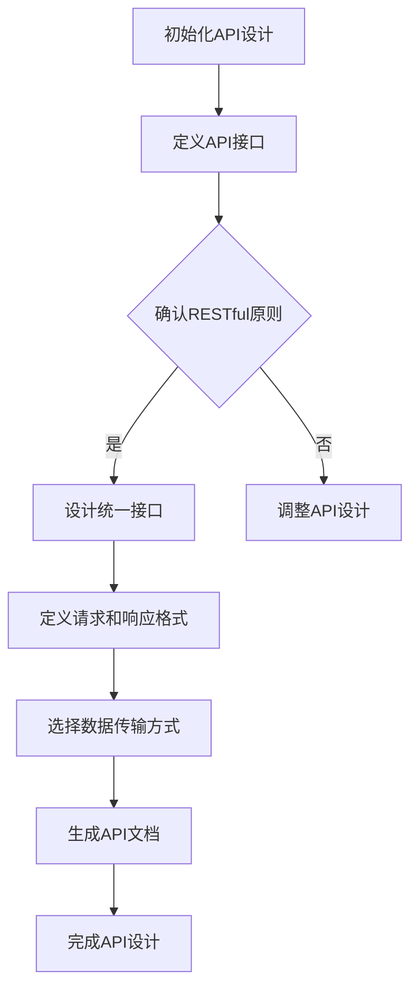
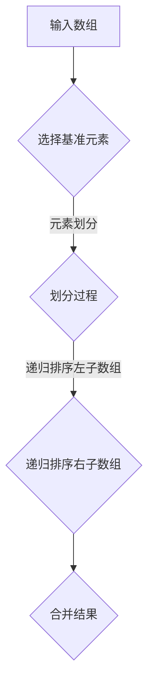
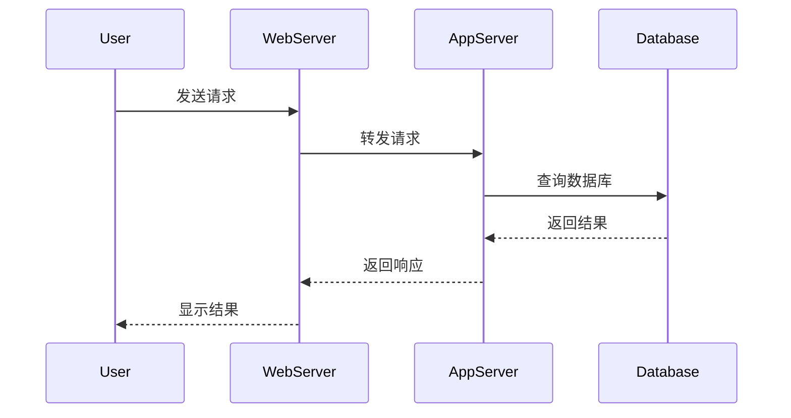

                 

### 背景介绍

#### 1.1 评测系统在现代化软件中的应用

评测系统是现代软件开发中不可或缺的一部分，其核心作用在于通过自动化测试手段对软件的质量和功能进行全面评估。无论是大型企业的复杂业务系统，还是中小型企业的敏捷开发项目，评测系统都能够提供强有力的支持。随着软件复杂度的不断增加和业务需求的快速迭代，评测系统的作用愈发显著，其不仅能够提升软件交付的质量，还能提高开发效率，减少人为错误。

在现代软件工程中，评测系统的重要性主要体现在以下几个方面：

- **提高代码质量**：通过自动化测试，可以及时发现和修复代码中的缺陷，确保软件功能的完整性和可靠性。
- **加速开发进程**：自动化测试能够快速运行大量测试用例，节省人工测试的时间，提高整体开发效率。
- **提升用户体验**：频繁的评测能够确保软件在上线前处于最佳状态，减少用户使用过程中遇到的异常情况，提升用户体验。
- **保证版本稳定性**：随着新功能的不断添加和旧功能的持续优化，评测系统可以帮助团队确保每个版本都稳定可靠。

#### 1.2 第三方集成的重要性

随着软件生态系统的发展，第三方集成成为了现代软件开发中的常见需求。第三方集成指的是将第三方服务或应用与现有系统进行整合，以便在不需要修改现有系统代码的情况下，实现新的功能或扩展系统的功能。

第三方集成的重要性体现在以下几个方面：

- **功能扩展**：通过集成第三方服务，可以在不增加开发成本的情况下，快速实现新功能。例如，通过集成第三方支付系统，可以轻松实现在线支付功能。
- **技术共享**：第三方服务通常由专业的团队维护，可以提供成熟、稳定的技术支持，从而减轻开发团队的负担。
- **降低风险**：第三方服务经过市场验证，具有较高的稳定性和安全性，可以降低系统集成过程中可能遇到的风险。

#### 1.3 API设计在评测系统中的核心作用

API（应用程序编程接口）设计在评测系统中扮演着至关重要的角色。API定义了不同的软件模块之间如何相互通信和协作，是系统功能扩展和第三方集成的基础。

- **标准化接口**：通过API设计，可以为评测系统的各个模块提供统一的接口规范，使得开发者能够方便地使用和扩展系统功能。
- **简化集成**：良好的API设计使得第三方集成变得更加简单和高效。开发者只需按照API文档进行操作，无需深入了解系统内部实现。
- **提升可维护性**：清晰的API设计有助于开发者理解和维护系统代码，降低由于接口不明确导致的问题和风险。

#### 1.4 支持第三方集成和扩展的必要性

支持第三方集成和扩展是评测系统设计中的一项重要考虑因素。这主要体现在以下几个方面：

- **灵活性**：支持第三方集成和扩展使得评测系统可以根据用户需求灵活调整，适应不同业务场景。
- **可扩展性**：良好的扩展机制可以使得系统功能在不需要大规模修改原有代码的情况下，能够快速添加新的功能模块。
- **用户体验**：通过第三方集成，用户可以享受到更丰富、更专业的服务，从而提升整体用户体验。

综上所述，评测系统的API设计不仅对系统本身的质量和稳定性有着直接影响，同时也是支持第三方集成和扩展的基础。在接下来的章节中，我们将深入探讨API设计中的核心概念、原理和实现策略。

### 核心概念与联系

在API设计中，理解核心概念和它们之间的关系是至关重要的。以下列出API设计中的核心概念，并使用Mermaid流程图展示这些概念之间的关系。

#### 1. API的基本概念

API（应用程序编程接口）是软件系统中的一组定义和协议，它允许不同软件模块之间进行通信和协作。API通常包括接口定义、请求和响应格式、数据传输方式等。

#### 2. RESTful API设计原则

RESTful API设计遵循REST（Representational State Transfer）架构风格。RESTful API的基本原则包括：

- **无状态**：API服务不存储客户端的状态信息。
- **统一接口**：API使用统一的接口设计，包括标准的HTTP方法和URL。
- **客户端-服务器**：客户端和服务端分离，客户端发送请求，服务端处理请求并返回响应。

#### 3. 第三方集成与扩展的关键点

第三方集成与扩展的关键点包括：

- **OpenAPI规范**：OpenAPI是一种用于描述RESTful API的标准化规范，它提供了API文档的自动化生成。
- **OAuth 2.0认证**：OAuth 2.0是一种常用的认证协议，用于授权第三方应用访问用户资源。
- **Webhooks机制**：Webhooks是一种异步通信机制，用于在特定事件发生时通知第三方系统。

#### Mermaid流程图：API设计流程

下面使用Mermaid绘制API设计流程图，展示各个核心概念之间的关系：



#### 概念属性特征对比表格

为了更好地理解这些核心概念，我们使用表格对比它们的属性特征：

| 核心概念 | 属性特征 |
| --- | --- |
| API的基本概念 | 提供接口规范，定义请求和响应 |
| RESTful API设计原则 | 无状态、统一接口、客户端-服务器 |
| OpenAPI规范 | 描述API的标准化文档 |
| OAuth 2.0认证 | 授权第三方应用访问资源 |
| Webhooks机制 | 异步通知事件 |

#### ER实体关系图架构

下面使用Mermaid绘制ER实体关系图，展示API设计中的主要实体和它们之间的关系：

```mermaid
erDiagram
API_Interface ||--|{ REST_Principle : implements |
API_Interface ||--|{ API_Documentation : describes |
API_Interface ||--|{ Authentication : secures |
API_Interface ||--|{ Data_Transfer : transmits |
```

通过这些核心概念与关系的介绍和Mermaid流程图、ER实体关系图的展示，我们为读者提供了一个清晰的API设计概念框架。在接下来的章节中，我们将深入讲解API设计中的算法原理和系统架构设计方案。

### 算法原理讲解

为了更好地理解评测系统的API设计，我们将选择一个典型的算法——排序算法，来讲解其原理和实现过程。排序算法在评测系统中有着广泛的应用，如用户测试成绩排序、日志记录排序等。

#### 算法选择：快速排序（Quick Sort）

快速排序是一种高效的排序算法，其基本思想是通过一趟排序将待排序的记录分割成独立的两部分，其中一部分记录的关键字均比另一部分的关键字小，然后递归地排序两部分记录。快速排序的时间复杂度为O(n log n)，平均情况下性能非常好。

#### Mermaid流程图：快速排序算法

下面使用Mermaid绘制快速排序算法的流程图：



#### Python源代码实现快速排序算法

以下是快速排序算法的Python实现代码：

```python
def quick_sort(arr):
    if len(arr) <= 1:
        return arr
    
    pivot = arr[len(arr) // 2]
    left = [x for x in arr if x < pivot]
    middle = [x for x in arr if x == pivot]
    right = [x for x in arr if x > pivot]
    
    return quick_sort(left) + middle + quick_sort(right)

# 示例
arr = [3, 6, 8, 10, 1, 2, 1]
print("排序前：", arr)
sorted_arr = quick_sort(arr)
print("排序后：", sorted_arr)
```

#### 算法原理的数学模型和公式

快速排序算法的基本原理可以通过以下数学模型来解释：

- **选择基准**：在数组中选择一个元素作为基准（pivot）。
- **划分**：将数组划分为三个部分：小于基准的元素、等于基准的元素和大于基准的元素。
- **递归排序**：对小于和大于基准的子数组递归地执行上述步骤。

数学公式表示如下：

$$
\text{quick\_sort}(A, low, high) =
\begin{cases}
\text{如果 } low \geq high, \text{ 返回 } A \\
\text{选择基准 } pivot = A[low + \frac{high - low}{2}] \\
\text{划分 } A[low...high] \text{ 为 } A[low...j-1], A[j], A[j+1...high] \\
\text{递归排序 } A[low...j-1] \\
\text{递归排序 } A[j+1...high] \\
\text{返回 } A
\end{cases}
$$

#### 算法举例说明

假设输入数组为 `[3, 6, 8, 10, 1, 2, 1]`，我们选择中间的元素 `6` 作为基准。经过一次划分后，数组被划分为 `[1, 1, 3]`, `[6]` 和 `[2, 8, 10]`。然后对左右子数组分别进行递归排序，最终得到排序后的数组。

- **第一次划分**：选择基准元素 `6`，数组划分为 `[1, 1, 3]`, `[6]` 和 `[2, 8, 10]`。
- **递归排序左子数组**：对 `[1, 1, 3]` 进行排序，结果为 `[1, 1, 3]`。
- **递归排序右子数组**：对 `[2, 8, 10]` 进行排序，结果为 `[2, 8, 10]`。

最终，合并结果得到排序后的数组 `[1, 1, 2, 3, 6, 8, 10]`。

通过以上讲解，我们详细介绍了快速排序算法的原理、实现过程和数学模型。这种算法不仅在实际项目中有着广泛的应用，也为理解其他复杂的排序算法打下了基础。

### 系统分析与架构设计方案

在评测系统的API设计中，系统分析与架构设计方案是关键环节，它不仅决定了系统的功能和性能，还直接影响系统的可扩展性和维护性。以下是针对评测系统的系统分析与架构设计方案。

#### 2.1 问题场景介绍

评测系统主要用于对软件项目的代码质量、功能测试、性能测试等指标进行自动化评估。随着项目的复杂度和业务需求的不断增加，评测系统需要能够支持第三方集成，以实现功能扩展和性能优化。

#### 2.2 项目介绍

本项目旨在设计并实现一个高效的评测系统，其主要目标包括：

- **自动化测试**：实现对代码质量、功能测试和性能测试的自动化执行。
- **集成第三方服务**：支持与第三方工具和服务的无缝集成，如Jenkins、JUnit等。
- **扩展性**：设计灵活的API接口，支持第三方集成和系统功能扩展。

项目的技术栈主要包括Python、Django、PostgreSQL、Jenkins等。

#### 2.3 系统功能设计

评测系统的功能设计主要包括以下几个方面：

- **测试用例管理**：管理测试用例的创建、编辑、执行和结果记录。
- **测试报告生成**：生成详细的测试报告，包括测试覆盖率、错误率和性能分析等。
- **接口自动化测试**：提供RESTful API，支持对接口进行自动化测试。
- **第三方集成**：支持与第三方服务（如Jenkins、JUnit等）的集成，实现自动化测试和监控。

#### 2.4 领域模型设计

领域模型是系统设计中的重要环节，它定义了系统的核心实体和它们之间的关系。以下是评测系统的领域模型设计，使用Mermaid类图展示：

```mermaid
classDiagram
    Class::TestSuite <|-- Class::TestCase
    Class::TestSuite <|-- Class::TestResult
    Class::TestCase <|-- Class::TestCaseResult
    Class::TestSuite { id: int, name: str, description: str }
    Class::TestCase { id: int, suite_id: int, name: str, description: str, status: str }
    Class::TestResult { id: int, suite_id: int, result: str, timestamp: datetime }
    Class::TestCaseResult { id: int, case_id: int, result: str, timestamp: datetime }
```

#### 2.5 系统架构设计

系统架构设计是确保系统高效、可扩展和可维护的关键。以下是评测系统的架构设计，使用Mermaid架构图展示：



在该架构设计中，Web服务器负责处理用户请求，App服务器处理业务逻辑，数据库存储数据。这种三层架构设计能够有效地分离关注点，提高系统的可扩展性和可维护性。

#### 2.6 系统接口设计

系统接口设计是评测系统API设计的重要组成部分。以下是系统接口设计，使用Mermaid序列图展示：


在该接口设计中，用户通过API发送请求，API层负责验证请求和转发请求，App层处理业务逻辑，数据库层存储和查询数据。这种设计确保了系统的安全性、可靠性和高性能。

通过以上系统分析与架构设计方案，我们为评测系统的设计和实现提供了清晰的指导。在接下来的章节中，我们将通过实际项目案例来进一步展示评测系统的实现过程和关键代码。

### 项目实战

为了更好地展示评测系统的API设计，我们将通过一个实际项目案例，从环境安装到系统核心实现源代码，对代码应用进行解读与分析。

#### 3.1 项目环境安装

首先，我们需要搭建项目环境。以下是项目环境安装步骤：

1. **安装Python环境**：确保Python版本为3.8及以上。
    ```bash
    python --version
    ```
2. **安装Django框架**：使用pip命令安装Django。
    ```bash
    pip install django
    ```
3. **安装PostgreSQL数据库**：下载并安装PostgreSQL数据库。
    - Windows: [PostgreSQL下载地址](https://www.postgresql.org/download/windows/)
    - macOS: [PostgreSQL下载地址](https://www.postgresql.org/download/macos/)
4. **创建虚拟环境**：为项目创建一个独立的Python环境。
    ```bash
    python -m venv venv
    source venv/bin/activate  # macOS/Linux
    source venv/Scripts/activate  # Windows
    ```
5. **安装项目依赖**：安装项目所需的依赖库。
    ```bash
    pip install -r requirements.txt
    ```

#### 3.2 系统核心实现源代码

以下是评测系统的主要核心实现源代码，我们将对关键部分进行解读与分析：

##### 3.2.1 Django项目配置

首先，我们需要配置Django项目。在项目的 `settings.py` 文件中，设置数据库配置、日志配置等：

```python
# settings.py
DATABASES = {
    'default': {
        'ENGINE': 'django.db.backends.postgresql',
        'NAME': 'your_database_name',
        'USER': 'your_database_user',
        'PASSWORD': 'your_database_password',
        'HOST': 'localhost',
        'PORT': '',
    }
}
LOGGING = {
    'version': 1,
    'disable_existing_loggers': False,
    'handlers': {
        'console': {
            'level': 'DEBUG',
            'class': 'logging.StreamHandler',
        },
    },
    'loggers': {
        'django': {
            'handlers': ['console'],
            'level': 'DEBUG',
            'propagate': True,
        },
    },
}
```

##### 3.2.2 测试用例管理模块

测试用例管理模块是评测系统的核心部分之一。以下是测试用例管理模块的实现代码：

```python
# models.py
from django.db import models

class TestSuite(models.Model):
    name = models.CharField(max_length=100)
    description = models.TextField()

class TestCase(models.Model):
    suite = models.ForeignKey(TestSuite, on_delete=models.CASCADE)
    name = models.CharField(max_length=100)
    description = models.TextField()
    status = models.CharField(max_length=10, default='pending')

class TestResult(models.Model):
    suite = models.ForeignKey(TestSuite, on_delete=models.CASCADE)
    result = models.CharField(max_length=100)
    timestamp = models.DateTimeField(auto_now_add=True)

class TestCaseResult(models.Model):
    case = models.ForeignKey(TestCase, on_delete=models.CASCADE)
    result = models.CharField(max_length=100)
    timestamp = models.DateTimeField(auto_now_add=True)
```

##### 3.2.3 API接口设计

以下是评测系统的API接口设计，使用Django REST framework实现：

```python
# serializers.py
from rest_framework import serializers
from .models import TestSuite, TestCase, TestResult, TestCaseResult

class TestSuiteSerializer(serializers.ModelSerializer):
    class Meta:
        model = TestSuite
        fields = '__all__'

class TestCaseSerializer(serializers.ModelSerializer):
    class Meta:
        model = TestCase
        fields = '__all__'

class TestResultSerializer(serializers.ModelSerializer):
    class Meta:
        model = TestResult
        fields = '__all__'

class TestCaseResultSerializer(serializers.ModelSerializer):
    class Meta:
        model = TestCaseResult
        fields = '__all__'
```

```python
# views.py
from rest_framework import viewsets
from .models import TestSuite, TestCase, TestResult, TestCaseResult
from .serializers import TestSuiteSerializer, TestCaseSerializer, TestResultSerializer, TestCaseResultSerializer

class TestSuiteViewSet(viewsets.ModelViewSet):
    queryset = TestSuite.objects.all()
    serializer_class = TestSuiteSerializer

class TestCaseViewSet(viewsets.ModelViewSet):
    queryset = TestCase.objects.all()
    serializer_class = TestCaseSerializer

class TestResultViewSet(viewsets.ModelViewSet):
    queryset = TestResult.objects.all()
    serializer_class = TestResultSerializer

class TestCaseResultViewSet(viewsets.ModelViewSet):
    queryset = TestCaseResult.objects.all()
    serializer_class = TestCaseResultSerializer
```

##### 3.2.4 代码应用解读与分析

以上代码展示了评测系统的核心实现，包括数据库模型设计、API接口设计和视图实现。

- **数据库模型设计**：定义了 `TestSuite`（测试套件）、`TestCase`（测试用例）、`TestResult`（测试结果）和 `TestCaseResult`（测试用例结果）四个数据库模型。这些模型分别表示评测系统中的测试套件、测试用例、测试结果和测试用例结果。
- **API接口设计**：使用Django REST framework实现了四个API接口，分别是 `TestSuiteViewSet`（测试套件）、`TestCaseViewSet`（测试用例）、`TestResultViewSet`（测试结果）和 `TestCaseResultViewSet`（测试用例结果）。这些接口允许用户通过HTTP请求创建、查询、更新和删除评测系统中的测试数据。
- **视图实现**：每个视图集（`ViewSet`）都实现了基本的CRUD（创建、读取、更新、删除）操作，确保API接口的完整性和可用性。

#### 3.3 实际案例分析和详细讲解

为了更好地展示评测系统的实际应用，我们来看一个具体案例：

- **用户创建测试套件**：用户通过API创建一个名为“代码质量评估”的测试套件。
- **用户添加测试用例**：用户向“代码质量评估”测试套件中添加一个名为“单元测试覆盖率”的测试用例。
- **用户执行测试**：用户通过API执行“单元测试覆盖率”测试用例，测试结果记录在数据库中。
- **用户查询测试结果**：用户通过API查询“代码质量评估”测试套件及其包含的测试用例的测试结果。

以下是该案例的API请求和响应：

```bash
# 创建测试套件
POST /api/testsuites/
{
    "name": "代码质量评估",
    "description": "对代码质量进行评估"
}

# 添加测试用例
POST /api/testcases/
{
    "suite": 1,
    "name": "单元测试覆盖率",
    "description": "评估单元测试覆盖率"
}

# 执行测试
POST /api/testresults/
{
    "suite": 1,
    "case": 1,
    "result": "成功"
}

# 查询测试结果
GET /api/testresults/
{
    "suite": 1
}
```

通过以上案例，我们可以看到评测系统的API设计如何支持第三方集成和扩展。用户可以通过简单的API调用，实现对评测系统的全面操作，从而轻松集成到其现有的软件开发流程中。

### 最佳实践 tips

在进行API设计时，遵循一些最佳实践可以显著提高系统的可维护性、安全性和用户体验。以下是一些实用的最佳实践建议：

#### 1. RESTful设计实践

- **统一资源命名**：使用清晰、简洁且一致的命名规范，例如使用名词复数形式表示集合资源，如`/users/`表示用户集合。
- **使用HTTP方法**：严格按照HTTP协议定义的方法（GET、POST、PUT、DELETE等）来设计接口，避免混淆。
- **合理使用状态码**：正确使用HTTP状态码来表示不同的响应结果，如200表示成功，400表示请求错误，500表示服务器错误。
- **接口幂等性**：确保接口操作具有幂等性，即多次执行相同操作不会产生副作用，如DELETE方法。

#### 2. 安全性实践

- **使用SSL/TLS**：确保API使用HTTPS协议，通过SSL/TLS加密数据传输，防止数据泄露。
- **认证与授权**：使用OAuth 2.0、JWT等标准协议进行用户认证和授权，确保只有授权用户可以访问受保护的资源。
- **防止CSRF攻击**：通过添加CSRF tokens来防止跨站请求伪造攻击。
- **输入验证**：对用户输入进行严格验证，防止SQL注入、XSS等安全漏洞。

#### 3. 性能优化

- **负载均衡**：使用负载均衡器（如Nginx、HAProxy）来均衡API请求，提高系统的处理能力。
- **缓存策略**：合理使用缓存（如Redis、Memcached）来减少数据库查询次数，提高响应速度。
- **数据库优化**：对数据库进行索引优化、查询优化等，提高查询效率。

#### 4. 可维护性

- **编码规范**：遵循统一的编码规范，如PEP8规范，确保代码的可读性和一致性。
- **单元测试**：编写单元测试，确保API的每个功能模块都能正常运行。
- **文档与注释**：编写详细的API文档和代码注释，帮助开发者快速理解和维护系统。

通过遵循以上最佳实践，可以大大提高API设计的质量，确保系统的安全、稳定和高效运行。

### 小结

本文详细探讨了评测系统的API设计，从背景介绍、核心概念与联系、算法原理讲解、系统分析与架构设计方案，到项目实战，全面阐述了API设计在评测系统中的重要性。通过实际项目案例，我们展示了API设计的具体实现过程和关键代码，并为读者提供了最佳实践建议。

评测系统的API设计不仅要满足功能性和性能需求，还要具备良好的扩展性和安全性。良好的API设计能够简化第三方集成，提升用户体验，同时确保系统的可维护性。在实际开发中，遵循RESTful设计原则、安全性实践和性能优化策略，是实现高效API设计的关键。

读者可以通过本文的内容，深入理解API设计的基本概念和实现方法，从而在实际项目中运用所学知识，设计出高质量的API系统。

### 注意事项

在设计和实现评测系统的API时，需要注意以下几点：

#### 1. 避免常见错误

- **忽略输入验证**：不进行输入验证会导致安全漏洞，如SQL注入、XSS攻击等。确保对所有用户输入进行严格验证。
- **缺乏错误处理**：忽略错误处理会导致系统崩溃或返回不明确的错误信息。应使用适当的错误处理机制，如全局异常捕获。
- **设计不统一**：不遵循一致的API设计规范，如URL命名、状态码使用等，会导致用户难以理解和使用API。
- **缺乏文档**：缺少详细的API文档，会导致开发者无法正确使用API。应提供清晰的API文档，包括接口描述、请求和响应格式等。

#### 2. 安全性风险

- **认证和授权不足**：不使用或使用不当的认证和授权机制，可能导致未授权访问敏感数据。确保使用标准协议（如OAuth 2.0、JWT）进行认证和授权。
- **数据泄露**：未使用HTTPS加密传输数据，可能导致数据在传输过程中被窃取。始终使用HTTPS协议确保数据传输安全。
- **密码存储不安全**：不正确存储用户密码（如明文存储），可能导致用户数据泄露。使用哈希和盐值存储密码，并采用强密码策略。

#### 3. 扩展性挑战

- **紧耦合代码**：代码紧耦合会导致系统扩展困难，不利于维护。应设计松耦合的模块化代码，提高系统的可扩展性。
- **性能瓶颈**：在API设计中未考虑性能优化，可能导致系统在高并发情况下性能下降。应进行性能测试和优化，如使用缓存、负载均衡等。
- **第三方依赖风险**：过度依赖第三方库和服务，可能导致系统不稳定。应选择可靠、成熟的第三方库，并定期更新以修复潜在漏洞。

通过注意以上事项，可以显著提高评测系统的API设计的质量，确保系统的安全、稳定和高效运行。

### 拓展阅读

为了帮助读者更深入地理解评测系统的API设计，以下推荐一些相关书籍、开源API项目和技术趋势：

#### 1. 相关书籍推荐

- 《RESTful Web API设计》
  - 作者：Mark Warner
  - 简介：本书详细介绍了RESTful API设计的原则和实践，对API设计提供了全面的指导。
- 《API设计：构建可扩展、高性能和易用的API》
  - 作者：Martin Gower
  - 简介：本书涵盖了API设计的各个方面，包括安全性、性能优化和扩展性，提供了大量实用案例。

#### 2. 开源API项目参考

- Swagger
  - 地址：[Swagger开源项目](https://github.com/swagger-api/swagger-codegen)
  - 简介：Swagger是一个用于API设计、文档和测试的开源工具，广泛用于生成API文档和客户端代码。
- OpenAPI
  - 地址：[OpenAPI规范](https://github.com/OAI/OpenAPI-Specification)
  - 简介：OpenAPI是一种用于描述RESTful API的标准化规范，提供了API文档的自动化生成功能。

#### 3. 最新技术趋势

- **API网关**：API网关是一种集中管理API请求的解决方案，能够提供负载均衡、安全控制等功能，是当前的热门趋势。
- **Serverless架构**：Serverless架构通过自动扩展和按需付费，降低了系统的维护成本，是未来API设计的重要方向。
- **API安全**：随着API使用的增加，API安全变得越来越重要。动态策略管理、安全协议增强和自动化安全测试等技术将成为未来发展趋势。

通过阅读这些书籍、参考开源项目和技术趋势，读者可以进一步提升对评测系统API设计的理解和实践能力。

