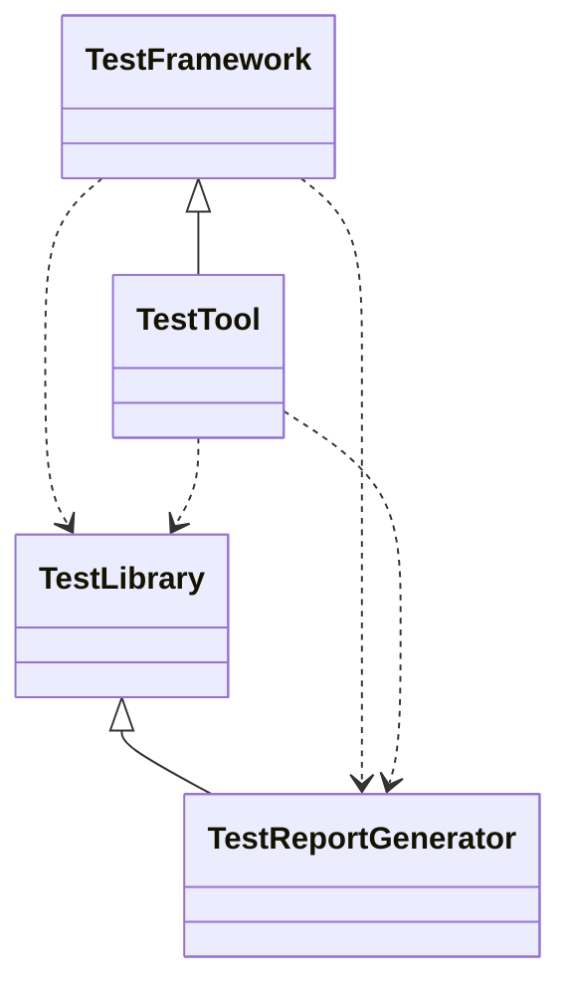

                 


### 文章标题：评测系统的CI/CD流水线设计

关键词：CI/CD、评测系统、流水线、自动化、优化、稳定性

摘要：本文将深入探讨评测系统的CI/CD（持续集成/持续部署）流水线设计，分析其核心概念、设计原则、关键步骤以及优化策略。通过详细的步骤分析和实际案例分享，帮助读者理解并掌握CI/CD流水线的实践应用。

### 目录

## 第一部分：CI/CD基础理论

### 第1章：CI/CD概述

#### 1.1 CI/CD的概念

- **CI/CD的定义**
- **CI与CD的区别**

#### 1.2 CI/CD的优势与挑战

- **CI/CD的优势**
- **CI/CD的挑战**

#### 1.3 CI/CD的历史发展

- **CI/CD的起源**
- **CI/CD的发展趋势**

### 第2章：CI/CD工具链

#### 2.1 Jenkins

- **Jenkins的安装与配置**
- **Jenkins的工作流程**

#### 2.2 GitLab CI

- **GitLab CI的安装与配置**
- **GitLab CI的配置文件**

#### 2.3 Git

- **Git的基本操作**
- **Git的分支管理**

### 第3章：评测系统设计

#### 3.1 评测系统概述

- **评测系统的定义**
- **评测系统的作用**

#### 3.2 评测系统架构设计

- **评测系统的组成部分**
- **评测系统架构的mermaid类图**

#### 3.3 评测指标设计

- **评测指标的选择**
- **评测指标的计算方法**

## 第二部分：CI/CD流水线配置

### 第4章：构建流水线配置

#### 4.1 构建流水线的概念

- **构建流水线的定义**
- **构建流水线的作用**

#### 4.2 构建流水线的配置

- **Jenkinsfile的编写**
- **GitLab CI配置文件的编写**

#### 4.3 多环境构建流水线

- **环境隔离**
- **环境配置管理**

### 第5章：测试流水线配置

#### 5.1 测试流水线的概念

- **测试流水线的定义**
- **测试流水线的作用**

#### 5.2 测试流水线的配置

- **测试脚本编写**
- **测试流程自动化**

#### 5.3 测试结果的监控与报告

- **测试结果的收集**
- **测试报告生成**

## 第三部分：CI/CD流水线优化

### 第6章：流水线性能优化

#### 6.1 流水线性能指标

- **构建时间**
- **测试时间**
- **反馈时间**

#### 6.2 流水线性能优化方法

- **并行构建**
- **缓存策略**
- **自动化测试优化**

### 第7章：流水线稳定性保障

#### 7.1 流水线稳定性概述

- **流水线稳定性的定义**
- **流水线稳定性的重要性**

#### 7.2 流水线故障排查与恢复

- **故障排查方法**
- **故障恢复策略**

#### 7.3 流水线安全性与保密性

- **安全性措施**
- **保密性措施**

## 第四部分：实战案例

### 第8章：案例介绍

#### 8.1 案例背景

- **项目简介**
- **项目目标**

#### 8.2 案例系统设计

- **系统架构**
- **系统功能模块**

#### 8.3 案例实施过程

- **环境安装**
- **流水线配置**
- **案例分析**

### 第9章：实战经验总结

#### 9.1 经验教训

- **项目中的成功经验**
- **项目中的失败教训**

#### 9.2 最佳实践

- **实践建议**
- **技术选型**

#### 9.3 小结

- **项目总结**
- **未来展望**

### 文章正文

#### 第1章：CI/CD概述

##### 1.1 CI/CD的概念

CI/CD是“持续集成（Continuous Integration）”和“持续部署（Continuous Deployment）”的合称。它是一种软件开发实践，旨在通过频繁的集成和自动化的部署过程，加快软件开发周期，提高软件质量。

**CI**是指通过自动化工具将开发人员的代码提交到版本控制系统后，立即执行一系列构建和测试任务，确保代码的稳定性。

**CD**是在CI的基础上，将经过测试的代码自动部署到生产环境中，实现持续交付和部署。

##### 1.2 CI/CD的优势与挑战

**优势：**

- **提高开发效率**：通过自动化流程，减少人工干预，加快开发进度。
- **提高软件质量**：频繁的集成和测试可以及早发现问题，避免后期的大规模修改。
- **增强团队协作**：开发、测试、运维等角色之间的沟通更加紧密，协作效率提高。

**挑战：**

- **初期投入较大**：需要搭建自动化环境，配置工具链。
- **维护成本较高**：自动化流程需要持续维护，确保其正常运行。
- **安全性问题**：自动化部署过程中可能存在安全漏洞。

##### 1.3 CI/CD的历史发展

CI/CD的概念最早由Jez Humble和Dave Farley在其著作《持续交付：释放软件的速度与信心》中提出。近年来，随着容器化技术（如Docker）和云服务的普及，CI/CD实践得到了广泛应用和发展。

#### 第2章：CI/CD工具链

##### 2.1 Jenkins

Jenkins是一个开源的持续集成工具，它允许开发者自动执行构建、测试和部署任务。以下是Jenkins的安装与配置步骤：

1. **安装Jenkins：** 在服务器上下载Jenkins的安装包，并使用Java运行。

2. **配置Jenkins：** 通过Web界面配置插件，如Git插件、GitHub插件等，以便与代码仓库集成。

3. **创建项目：** 在Jenkins中创建项目，并配置构建触发器和构建步骤。

4. **构建与测试：** 每次代码提交到代码仓库时，Jenkins会自动执行构建和测试任务。

##### 2.2 GitLab CI

GitLab CI是GitLab内置的持续集成工具。以下是GitLab CI的安装与配置步骤：

1. **安装GitLab：** 在服务器上安装GitLab，确保其版本支持GitLab CI。

2. **配置CI/CD：** 在GitLab的Web界面中启用CI/CD，并配置`.gitlab-ci.yml`文件。

3. **构建与测试：** GitLab CI会根据`.gitlab-ci.yml`文件中的配置，自动执行构建和测试任务。

##### 2.3 Git

Git是一个版本控制系统，用于管理代码的版本和变更。以下是Git的基本操作和分支管理：

1. **基本操作：** `git clone`克隆代码库，`git pull`拉取最新代码，`git push`推送代码。

2. **分支管理：** `git checkout -b new-branch`创建新分支，`git merge`合并分支，`git rebase`重构提交历史。

#### 第3章：评测系统设计

##### 3.1 评测系统概述

评测系统是一个用于自动化测试软件质量的系统。它的主要目标是确保软件在开发过程中的每个阶段都符合预期标准。

**评测系统的定义：** 评测系统是一种用于自动化测试软件质量的工具，它能够对软件进行全面的测试，并提供详细的测试报告。

**评测系统的作用：** 评测系统可以提高软件质量，减少bug数量，缩短测试周期，提高开发效率。

##### 3.2 评测系统架构设计

评测系统的架构通常包括以下几个部分：

- **测试框架**：用于编写和执行测试用例的框架，如JUnit、TestNG等。
- **测试工具**：用于执行测试的工具，如Selenium、Appium等。
- **测试库**：用于存储测试用例和测试结果的库。
- **报告生成器**：用于生成测试报告的工具，如Allure、ExtentReports等。

以下是评测系统架构的mermaid类图：



##### 3.3 评测指标设计

评测指标是衡量软件质量的重要指标。常见的评测指标包括：

- **代码覆盖率**：测试用例覆盖代码的比例。
- **缺陷密度**：软件中缺陷的数量与代码行数的比例。
- **测试执行时间**：执行测试用例所花费的时间。
- **测试覆盖率**：测试用例覆盖功能点的比例。

以下是评测指标的选择和计算方法的对比表格：

| 指标名称       | 选择原因           | 计算方法                         |
|----------------|------------------|--------------------------------|
| 代码覆盖率     | 提高测试全面性     | 覆盖率 = （覆盖行数 / 总行数）× 100% |
| 缺陷密度       | 反映软件质量       | 缺陷密度 = （缺陷数量 / 代码行数）× 100% |
| 测试执行时间   | 评估测试效率       | 测试执行时间 = 执行所有测试用例的时间 |
| 测试覆盖率     | 评估测试全面性     | 测试覆盖率 = （覆盖功能点数 / 总功能点数）× 100% |

#### 第4章：构建流水线配置

##### 4.1 构建流水线的概念

构建流水线是一系列自动化任务，用于构建、测试和部署软件。它的目的是确保软件在每次代码变更后都能顺利构建并运行。

**构建流水线的定义：** 构建流水线是一种自动化过程，用于构建、测试和部署软件，确保每次代码变更后软件的稳定性。

**构建流水线的作用：** 构建流水线可以提高软件质量，减少人为错误，加快开发进度。

##### 4.2 构建流水线的配置

构建流水线的配置通常包括以下步骤：

1. **定义构建脚本：** 使用Jenkinsfile或`.gitlab-ci.yml`文件定义构建任务。

2. **配置构建工具：** 安装和配置Jenkins或GitLab CI，以及所需的插件和工具。

3. **配置构建步骤：** 定义构建流程，包括代码下载、编译、测试、打包等步骤。

4. **配置环境变量：** 配置所需的环境变量，如数据库连接字符串、API密钥等。

5. **配置构建触发器：** 配置构建触发器，如代码提交、标签发布等。

以下是Jenkinsfile的一个示例：

```groovy
pipeline {
    agent any

    stages {
        stage('Checkout') {
            steps {
                checkout([
                    $class: 'GitSCM',
                    branches: [[name: 'master']],
                    userRemote: 'origin',
                    url: 'https://github.com/user/repo.git'
                ])
            }
        }

        stage('Build') {
            steps {
                sh 'mvn clean install'
            }
        }

        stage('Test') {
            steps {
                sh 'mvn test'
            }
        }

        stage('Deploy') {
            steps {
                sh 'mvn package'
            }
        }
    }
}
```

##### 4.3 多环境构建流水线

在多环境构建流水线中，构建过程需要在不同环境中执行，以确保软件在不同环境下的稳定性。常见的环境包括开发环境、测试环境和生产环境。

**环境隔离：** 确保构建流程在不同环境中独立运行，避免相互干扰。

**环境配置管理：** 管理不同环境中的配置文件，如数据库连接字符串、API密钥等。

在GitLab CI中，可以使用`.gitlab-ci.yml`文件配置多环境构建流水线：

```yaml
stages:
  - build
  - test
  - deploy

build:
  stage: build
  script:
    - mvn clean install
  artifacts:
    paths:
      - target/*.war

test:
  stage: test
  script:
    - mvn test
  only:
    - master

deploy:
  stage: deploy
  script:
    - mvn package
  environment:
    name: production
    url: 'https://www.example.com/production'
  only:
    - master
```

#### 第5章：测试流水线配置

##### 5.1 测试流水线的概念

测试流水线是一系列自动化测试任务，用于确保软件的质量和功能。它通常与构建流水线一起使用，以确保每次代码变更后都能进行全面的测试。

**测试流水线的定义：** 测试流水线是一种自动化过程，用于执行测试用例，评估软件的质量和功能。

**测试流水线的作用：** 测试流水线可以提高测试覆盖率，减少测试时间，确保软件的稳定性。

##### 5.2 测试流水线的配置

测试流水线的配置包括以下步骤：

1. **编写测试脚本：** 使用测试工具（如Selenium、Appium）编写测试脚本。

2. **配置测试环境：** 配置测试环境，如浏览器、设备、数据库等。

3. **配置测试计划：** 定义测试计划，包括测试用例、测试环境、测试执行顺序等。

4. **配置测试触发器：** 配置测试触发器，如代码提交、构建完成等。

以下是使用Jenkins配置测试流水线的示例：

```groovy
pipeline {
    agent any

    stages {
        stage('Test') {
            steps {
                sh 'mvn test'
            }
        }
    }

    post {
        always {
            script {
                if (result == 'FAILURE') {
                    echo 'Test failed, please check the logs.'
                }
            }
        }
    }
}
```

##### 5.3 测试结果的监控与报告

测试结果的监控与报告是确保测试流水线有效运行的重要环节。以下是测试结果监控与报告的配置步骤：

1. **收集测试结果：** 使用测试工具（如JUnit、TestNG）收集测试结果。

2. **配置报告生成器：** 配置报告生成器（如Allure、ExtentReports）生成测试报告。

3. **监控测试结果：** 通过邮件、Webhook等方式实时监控测试结果。

4. **分析测试报告：** 分析测试报告，识别潜在问题和缺陷。

在GitLab CI中，可以使用以下配置生成测试报告：

```yaml
test:
  stage: test
  script:
    - mvn test
  artifacts:
    reports:
      junit: target/surefire-reports/*.xml
  only:
    - master
```

#### 第6章：流水线性能优化

##### 6.1 流水线性能指标

流水线性能指标是评估流水线性能的重要指标。以下是常见的流水线性能指标：

- **构建时间：** 从代码提交到构建完成的时间。
- **测试时间：** 从构建完成到测试完成的时间。
- **反馈时间：** 从代码提交到收到测试结果的时间。

这些指标对于评估流水线的效率和稳定性具有重要意义。

##### 6.2 流水线性能优化方法

以下是一些常见的流水线性能优化方法：

1. **并行构建：** 充分利用多核CPU，同时执行多个构建任务。

2. **缓存策略：** 利用缓存减少重复任务的执行时间，如缓存编译结果、测试数据等。

3. **自动化测试优化：** 优化测试脚本，减少测试时间，如使用Mock对象、并行测试等。

#### 第7章：流水线稳定性保障

##### 7.1 流水线稳定性概述

流水线稳定性是指流水线在各种环境下的正常运行能力。以下是一些影响流水线稳定性的因素：

- **网络延迟：** 网络延迟可能导致构建和测试任务的执行时间延长。
- **硬件故障：** 硬件故障可能导致构建和测试任务中断。
- **软件故障：** 软件故障可能导致构建和测试任务失败。

##### 7.2 流水线故障排查与恢复

以下是一些流水线故障排查和恢复的方法：

1. **查看日志：** 查看构建和测试任务的日志，了解失败原因。

2. **重新执行：** 对于失败的构建和测试任务，可以尝试重新执行。

3. **故障恢复：** 在流水线配置中设置故障恢复策略，如自动重新执行、手动干预等。

##### 7.3 流水线安全性与保密性

为了确保流水线的安全性与保密性，可以采取以下措施：

1. **访问控制：** 限制对流水线的访问权限，仅允许授权用户执行构建和测试任务。

2. **加密传输：** 使用HTTPS加密传输数据，确保数据的安全性。

3. **备份与恢复：** 定期备份流水线配置和测试数据，确保数据不会丢失。

#### 第8章：案例介绍

##### 8.1 案例背景

本案例是一个电商平台的开发项目。项目目标是在短时间内实现一个功能完整的电商平台，并确保软件质量和稳定性。

##### 8.2 案例系统设计

系统架构采用微服务架构，包括用户服务、商品服务、订单服务、支付服务等模块。以下是系统架构的mermaid类图：

```mermaid
classDiagram
    User <<-- Product
    User <<-- Order
    User <<-- Payment
    Product <<-- Order
    Order <<-- Payment
```

##### 8.3 案例实施过程

1. **环境安装：** 安装Jenkins、GitLab CI等工具，并配置相应的插件。

2. **流水线配置：** 配置CI/CD流水线，包括构建、测试和部署流程。

3. **测试与优化：** 对流水线进行测试和优化，确保其稳定性和效率。

4. **上线部署：** 将代码部署到生产环境，并监控其运行状态。

#### 第9章：实战经验总结

##### 9.1 经验教训

1. **持续集成与测试：** 持续集成和测试是确保软件质量和稳定性的关键。

2. **优化流水线：** 优化流水线可以提高构建和测试效率，减少开发周期。

3. **故障排查与恢复：** 及时排查和恢复故障，确保流水线的正常运行。

##### 9.2 最佳实践

1. **使用Docker容器化：** 使用Docker容器化技术，确保开发、测试和生产环境的一致性。

2. **自动化测试脚本：** 编写高质量的自动化测试脚本，提高测试覆盖率。

3. **监控与报警：** 使用监控工具实时监控流水线状态，及时发现问题并报警。

##### 9.3 小结

1. **项目总结：** 本案例通过CI/CD流水线实现了电商平台的快速开发、测试和部署。

2. **未来展望：** 随着技术的不断发展，CI/CD流水线将越来越重要，未来将会有更多的优化和改进。作者：AI天才研究院/AI Genius Institute & 禅与计算机程序设计艺术 /Zen And The Art of Computer Programming

---

### 结论

通过本文的深入探讨，我们了解了评测系统CI/CD流水线设计的重要性和实现方法。CI/CD流水线不仅能够提高开发效率，还能确保软件质量，降低风险。在实际应用中，我们需要结合项目特点和需求，灵活设计和优化流水线，以达到最佳效果。未来的发展中，随着技术的不断进步，CI/CD流水线将会变得更加智能化和自动化，为软件开发带来更多的便利和效率。作者：AI天才研究院/AI Genius Institute & 禅与计算机程序设计艺术 /Zen And The Art of Computer Programming

---

### 注意事项

在设计CI/CD流水线时，需要注意以下几点：

1. **环境一致性：** 确保开发、测试和生产环境一致，避免环境差异导致问题。

2. **测试覆盖率：** 提高测试覆盖率，确保所有功能和模块都经过测试。

3. **故障恢复策略：** 配置合理的故障恢复策略，确保流水线在出现故障时能够快速恢复。

4. **安全性：** 加强对流水线的安全保护，防止未授权访问和数据泄露。

5. **性能优化：** 定期对流水线进行性能优化，提高构建和测试效率。

### 拓展阅读

1. 《持续交付：释放软件的速度与信心》- Jez Humble, Dave Farley
2. 《Jenkins实战》- 陈浩
3. 《Git权威指南》- Scott Chacon, Ben Straub
4. 《微服务设计》- Martin Fowler
5. 《Docker实战》- Sean P. Kane, John W. Paul

通过阅读这些书籍，您可以进一步了解CI/CD流水线的相关技术和实践。作者：AI天才研究院/AI Genius Institute & 禅与计算机程序设计艺术 /Zen And The Art of Computer Programming

