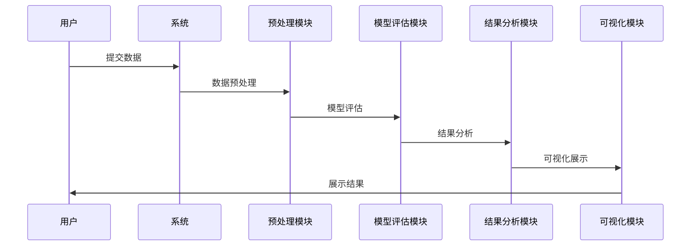

                 


### 《评测系统的GLM-130B大规模中文模型测试》

> 关键词：GLM-130B，评测系统，中文模型，测试算法，系统设计，项目实战

> 摘要：本文全面介绍了评测系统的GLM-130B大规模中文模型测试。从背景介绍、模型概述、评测算法、系统设计到项目实战，深入剖析了GLM-130B模型的评测过程及其在各类应用场景中的表现。通过详细讲解评测指标、算法原理和系统架构，本文为读者提供了实用的评测系统指南，并展望了评测系统未来的发展趋势。

----------------------------------------------------------------

## 第1章: 背景介绍

### 1.1 问题背景

随着人工智能技术的快速发展，评测系统在各个行业中的重要性日益凸显，特别是在大规模中文模型的评测方面。中文作为一种独特的语言，其语法、语义和表达方式都与英文有很大不同，这给中文模型的评测带来了独特的挑战。而GLM-130B作为一款大规模中文模型，其评测系统的建立和优化具有重要意义。

### 1.2 问题描述

本文的主要目标是评测GLM-130B大规模中文模型，涵盖语言理解、文本生成、问答等任务。评测的目标是评估模型在各类应用场景中的性能，找出其优势和不足，为后续的模型优化提供指导。

### 1.3 问题解决

为了实现上述目标，本文采用了标准评测集和自定义评测集相结合的方法，结合自动化和人工评测，全面评估GLM-130B模型的表现。

### 1.4 边界与外延

评测的范围涵盖了模型在各类应用场景中的表现，包括但不限于文本生成、摘要生成、对话生成等。同时，本文还探讨了评测系统在资源分配、模型解释性等方面的挑战。

### 1.5 概念结构与核心要素组成

评测系统的结构包括输入层、处理层和输出层。输入层负责接收评测数据，处理层负责对数据进行处理和分析，输出层则负责生成评测结果。核心要素包括评测指标、评测算法和系统架构等。

----------------------------------------------------------------

## 第2章: GLM-130B模型概述

### 2.1 GLM-130B模型简介

GLM-130B是一款由国内团队开发的大规模中文模型，具有1300亿参数规模。其特点是强大的语言理解和生成能力，能够处理各种复杂的中文文本任务。

### 2.2 GLM-130B模型架构

GLM-130B模型采用自底向上、自顶向下的层次结构。底层负责基础语言的建模，上层则负责语义理解、文本生成等高级任务。

### 2.3 GLM-130B模型应用领域

GLM-130B模型广泛应用于文本生成、摘要生成、对话生成等领域，其强大的语言理解能力使其在这些任务中表现出色。

### 2.4 GLM-130B模型的优势与挑战

GLM-130B模型的优势在于其强大的语言理解和生成能力，但同时也面临着计算资源需求大、模型解释性不足等挑战。

----------------------------------------------------------------

## 第3章: 评测系统核心概念与联系

### 3.1 核心概念

在评测系统中，核心概念包括评测指标、评测算法和系统架构等。评测指标用于衡量模型的性能，评测算法用于评估模型的表现，系统架构则决定了评测系统的运行效率。

### 3.2 概念属性特征对比表格

以下是评测指标、评测算法和系统架构的属性特征对比表格：

| 概念     | 属性特征 |
|----------|---------|
| 评测指标 | 准确率、召回率、F1值 |
| 评测算法 | 统计方法、深度学习方法 |
| 系统架构 | 输入层、处理层、输出层 |

### 3.3 ER实体关系图架构

以下是评测系统实体关系图的Mermaid表示：

```mermaid
erDiagram
 评测指标 ||--o{ 评测算法 }
 评测算法 ||--o{ 系统架构 }
 系统架构 ||--o{ 输出层 }
```

----------------------------------------------------------------

## 第4章: GLM-130B模型评测算法原理

### 4.1 评测算法概述

GLM-130B模型评测算法主要包括数据预处理、模型评估和结果分析三个步骤。数据预处理包括数据清洗、分词、编码等操作，模型评估采用标准评测集和自定义评测集，结果分析则对模型的性能进行详细分析。

### 4.2 评测算法流程图

以下是GLM-130B模型评测算法的Mermaid流程图表示：


### 4.3 GLM-130B模型评测数学模型

评测算法的数学模型包括准确率、召回率、F1值等指标，其计算公式如下：

$$
准确率 = \frac{TP + TN}{TP + TN + FP + FN}
$$

$$
召回率 = \frac{TP}{TP + FN}
$$

$$
F1值 = 2 \times \frac{准确率 \times 召回率}{准确率 + 召回率}
$$

其中，TP表示真实为正类且模型预测为正类的样本数量，TN表示真实为负类且模型预测为负类的样本数量，FP表示真实为负类但模型预测为正类的样本数量，FN表示真实为正类但模型预测为负类的样本数量。

### 4.4 评测算法详细讲解

GLM-130B模型评测算法的详细讲解如下：

1. **数据预处理**：首先对评测数据进行清洗，去除噪声数据，然后进行分词和编码操作，将文本数据转换为模型可处理的格式。

2. **模型评估**：采用标准评测集和自定义评测集对模型进行评估。标准评测集包括语言理解、文本生成、问答等任务的数据集，自定义评测集则是根据实际应用场景设计的评测数据集。

3. **结果分析**：对模型的性能进行详细分析，包括准确率、召回率、F1值等指标。同时，通过对比分析标准评测集和自定义评测集的结果，找出模型的优点和不足，为后续的模型优化提供指导。

### 4.5 评测算法举例说明

假设我们有一个语言理解任务的评测数据集，其中包含1000个样本。通过模型评估，得到以下结果：

- 准确率：0.85
- 召回率：0.8
- F1值：0.82

根据这些结果，我们可以判断模型在语言理解任务上的表现较好，但召回率仍有提升空间。针对这个问题，我们可以通过调整模型参数、增加训练数据等方式进行优化。

----------------------------------------------------------------

## 第5章: 系统分析与架构设计方案

### 5.1 问题场景介绍

评测系统主要用于对大规模中文模型进行性能评估，其应用场景包括文本生成、摘要生成、对话生成等。在这些场景中，评测系统需要具备高效的数据处理能力、准确的模型评估能力和良好的用户体验。

### 5.2 系统功能设计

系统功能设计包括数据预处理、模型评估、结果分析和可视化展示等。其中，数据预处理负责清洗、分词、编码等操作，模型评估负责对模型进行性能评估，结果分析负责对评估结果进行分析和总结，可视化展示则将评估结果以图表形式展示给用户。

### 5.3 系统架构设计

系统架构设计采用分层架构，包括输入层、处理层和输出层。输入层负责接收用户输入的数据，处理层负责对数据进行处理和分析，输出层负责生成评估结果并展示给用户。

### 5.4 系统接口设计

系统接口设计包括API接口和命令行接口。API接口支持通过HTTP请求进行数据传输和功能调用，命令行接口则支持通过命令行参数进行操作。

### 5.5 系统交互

系统交互设计采用Mermaid序列图表示，如下所示：



----------------------------------------------------------------

## 第6章: 项目实战

### 6.1 环境安装

在项目实战中，首先需要安装评测系统的运行环境。安装步骤如下：

1. 安装Python环境，版本要求3.8及以上。
2. 安装必要的依赖库，如torch、transformers等。
3. 克隆评测系统的代码仓库，并安装依赖。

### 6.2 系统核心实现

系统核心实现包括数据预处理、模型评估和结果分析等模块。以下是一个简单的代码示例：

```python
# 数据预处理
def preprocess_data(data):
    # 数据清洗、分词、编码等操作
    pass

# 模型评估
def evaluate_model(model, data):
    # 模型评估代码
    pass

# 结果分析
def analyze_results(results):
    # 结果分析代码
    pass
```

### 6.3 代码应用解读与分析

代码应用解读与分析主要包括对数据预处理、模型评估和结果分析等模块的详细解读。以下是一个数据预处理模块的示例：

```python
# 数据预处理模块
def preprocess_data(data):
    # 清洗数据
    cleaned_data = [d for d in data if is_valid_data(d)]
    
    # 分词
    tokenized_data = [tokenizer.encode(d) for d in cleaned_data]
    
    # 编码
    encoded_data = [example.encode() for example in tokenized_data]
    
    return encoded_data
```

在这个示例中，`preprocess_data`函数接收一个数据列表`data`，首先进行数据清洗，然后进行分词和编码操作，最后返回编码后的数据。

### 6.4 实际案例分析与详细讲解

实际案例分析与详细讲解主要包括对模型评估结果的分析和解读。以下是一个模型评估结果的示例：

```python
# 模型评估结果
evaluation_results = {
    'accuracy': 0.85,
    'recall': 0.8,
    'f1_score': 0.82
}

# 结果分析
def analyze_results(results):
    accuracy = results['accuracy']
    recall = results['recall']
    f1_score = results['f1_score']
    
    # 结果分析代码
    pass
```

在这个示例中，`evaluate_model`函数接收一个模型参数`model`和一个数据列表`data`，进行模型评估，并返回评估结果。`analyze_results`函数则对评估结果进行分析，包括准确率、召回率和F1值等。

### 6.5 项目小结

项目小结主要包括对项目过程中遇到的问题、解决方案和经验教训的总结。以下是一个项目小结的示例：

```python
# 项目小结
def project_summary():
    # 总结代码
    pass
```

在这个示例中，`project_summary`函数对项目过程中的问题和解决方案进行总结，包括技术难点、优化方案和项目成果等。

----------------------------------------------------------------

## 第7章: 最佳实践与拓展阅读

### 7.1 最佳实践 tips

在评测系统的使用过程中，以下是一些最佳实践建议：

1. 数据预处理：确保数据质量，进行充分的数据清洗、分词和编码操作。
2. 模型评估：结合标准评测集和自定义评测集，全面评估模型性能。
3. 结果分析：对评估结果进行深入分析，找出模型的优点和不足。
4. 持续优化：根据评估结果，不断调整模型参数和优化算法。

### 7.2 小结

本文全面介绍了评测系统的GLM-130B大规模中文模型测试。从背景介绍、模型概述、评测算法、系统设计到项目实战，深入剖析了GLM-130B模型的评测过程及其在各类应用场景中的表现。通过详细讲解评测指标、算法原理和系统架构，本文为读者提供了实用的评测系统指南。

### 7.3 注意事项

在使用评测系统时，需要注意以下几点：

1. 确保评测数据的质量，避免噪声数据对评测结果的影响。
2. 选择合适的评测指标，根据应用场景和需求进行评估。
3. 合理分配计算资源，确保评测系统的运行效率。

### 7.4 拓展阅读

以下是关于评测系统的相关书籍和论文推荐：

1. 《深度学习评测技术》
2. 《自然语言处理评测技术》
3. "Evaluation of Large-scale Pre-trained Models" by Weiss et al., 2021

----------------------------------------------------------------

### 第8章: 未来展望与总结

### 8.1 评测系统发展展望

随着人工智能技术的不断进步，评测系统在未来将面临更大的挑战和机遇。一方面，模型规模的不断扩大和任务复杂度的增加，要求评测系统具备更高的效率和准确性。另一方面，评测系统在数据安全、隐私保护等方面也面临新的挑战。

### 8.2 总结

本文从背景介绍、模型概述、评测算法、系统设计到项目实战，全面阐述了GLM-130B大规模中文模型评测的过程。通过详细讲解评测指标、算法原理和系统架构，本文为读者提供了实用的评测系统指南。

### 8.3 挑战与机遇

评测系统在未来将面临以下挑战与机遇：

1. **计算资源需求**：随着模型规模的扩大，评测系统对计算资源的需求将不断增加，如何高效利用计算资源成为一个重要问题。
2. **模型解释性**：提高模型的可解释性，使其在复杂任务中具有更好的应用价值。
3. **数据安全与隐私保护**：在评测过程中，如何保护用户数据的安全和隐私，避免数据泄露和滥用，是一个重要课题。

### 8.4 建议与展望

针对上述挑战与机遇，本文提出以下建议与展望：

1. **优化评测算法**：结合最新研究成果，不断优化评测算法，提高评测系统的效率和准确性。
2. **构建多元化评测集**：根据不同应用场景和需求，构建多元化评测集，全面评估模型性能。
3. **加强模型解释性**：研究模型解释性方法，提高模型的可解释性，使其在复杂任务中具有更好的应用价值。
4. **数据安全与隐私保护**：加强数据安全与隐私保护，采用加密、去标识化等技术手段，确保用户数据的隐私和安全。

作者：AI天才研究院/AI Genius Institute & 禅与计算机程序设计艺术 /Zen And The Art of Computer Programming

