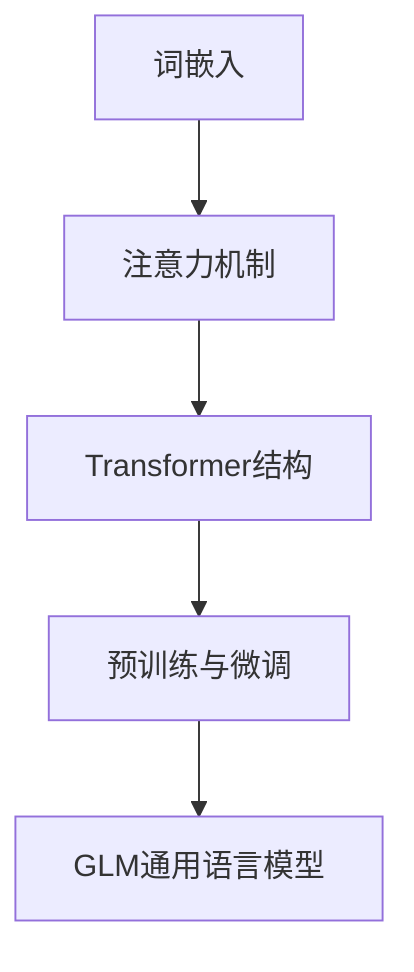
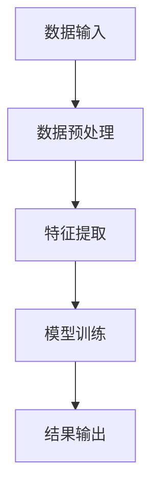
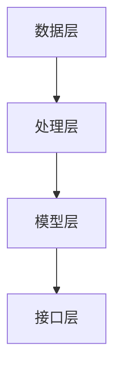
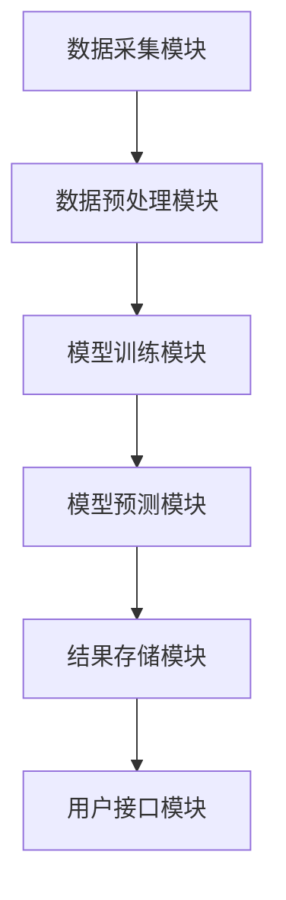
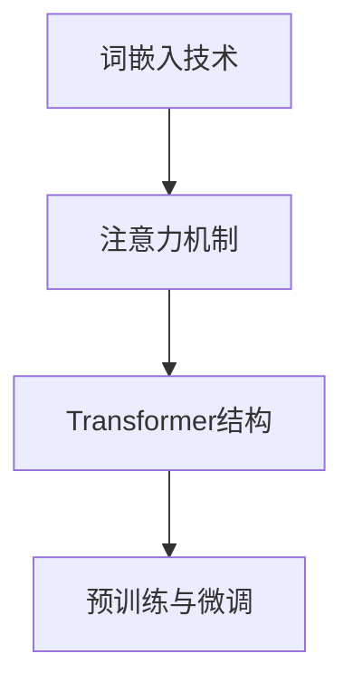
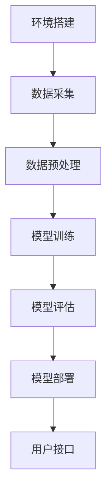
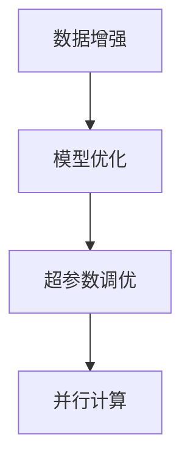
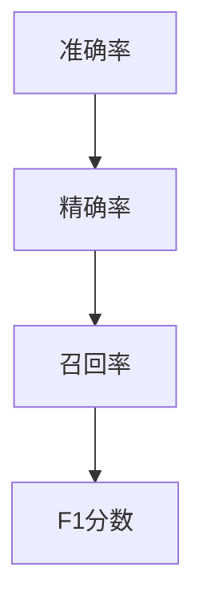
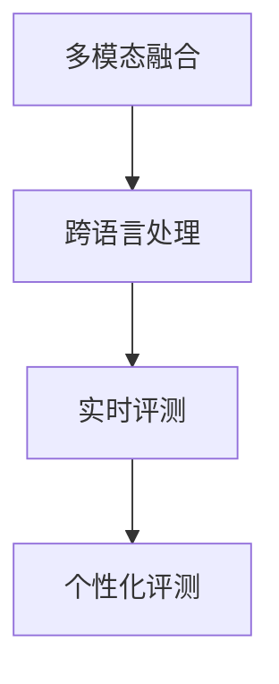

                 

### 《评测系统的GLM通用语言模型应用》

#### 关键词：评测系统、GLM通用语言模型、应用原理、文本分析、语音识别、自然语言处理

> 摘要：本文旨在深入探讨GLM通用语言模型在评测系统中的应用。通过详细的背景介绍、原理讲解和应用案例分析，本文揭示了GLM在提升评测系统效率与准确性的关键作用。读者将了解GLM的核心概念、应用场景以及其在自然语言处理和语音识别中的实际效果，为相关领域的开发与优化提供理论依据和实践指导。

----------------------------------------------------------------

# 《评测系统的GLM通用语言模型应用》

## 目录大纲

----------------------------------------------------------------

## 第一部分: 背景介绍

### 第1章: 评测系统概述

#### 1.1 问题背景

#### 1.2 问题描述

#### 1.3 问题解决

#### 1.4 边界与外延

#### 1.5 概念结构与核心要素组成

### 第2章: GLM通用语言模型概述

#### 2.1 GLM通用语言模型的定义

#### 2.2 GLM通用语言模型的特点

#### 2.3 GLM通用语言模型的发展历程

#### 2.4 GLM通用语言模型的核心概念与联系

## 第二部分: GLM通用语言模型在评测系统的应用

### 第3章: GLM通用语言模型在评测系统中的应用原理

#### 3.1 GLM在评测系统中的应用场景

#### 3.2 GLM评测系统的工作原理

#### 3.3 GLM评测系统的核心算法原理

## 第4章: GLM在文本分析中的应用

#### 4.1 文本分析的基本概念

#### 4.2 GLM在文本分类中的应用

#### 4.3 GLM在情感分析中的应用

#### 4.4 GLM在文本生成中的应用

### 第5章: GLM在语音识别中的应用

#### 5.1 语音识别的基本概念

#### 5.2 GLM在语音识别中的应用

#### 5.3 GLM在语音识别中的优势

#### 5.4 GLM语音识别的应用案例

### 第6章: GLM在自然语言处理中的综合应用

#### 6.1 自然语言处理的基本概念

#### 6.2 GLM在自然语言处理中的应用

#### 6.3 GLM在自然语言处理中的优势

#### 6.4 GLM在自然语言处理中的应用案例

## 第7章: GLM评测系统的设计与实现

#### 7.1 GLM评测系统的架构设计

#### 7.2 GLM评测系统的模块划分

#### 7.3 GLM评测系统的关键技术

#### 7.4 GLM评测系统的实现步骤

## 第8章: GLM评测系统的测试与优化

#### 8.1 GLM评测系统的测试方法

#### 8.2 GLM评测系统的优化策略

#### 8.3 GLM评测系统的性能评估

#### 8.4 GLM评测系统的未来发展方向

## 第9章: GLM评测系统的实际案例解析

#### 9.1 实际案例介绍

#### 9.2 案例分析

#### 9.3 案例总结

## 第10章: 总结与展望

#### 10.1 总结

#### 10.2 展望

#### 10.3 注意事项

#### 10.4 拓展阅读

----------------------------------------------------------------

### 第1章: 评测系统概述

#### 1.1 问题背景

在现代信息化社会中，评测系统作为一种关键的软件工具，被广泛应用于各种领域，如教育、考试、产品质量控制等。随着互联网和大数据的快速发展，评测系统的需求不断增加，如何提高评测系统的效率和准确性成为一个亟待解决的问题。

#### 1.2 问题描述

评测系统面临的主要问题包括：数据量大、处理速度快、结果准确度要求高。传统的评测系统往往依赖于规则引擎和人工审核，存在以下问题：

1. **规则繁琐**：需要大量的手动编写和调整规则，导致开发和维护成本高。
2. **处理速度慢**：规则引擎的处理速度较慢，无法满足实时性要求。
3. **准确性低**：人工审核存在主观性和疲劳效应，准确性难以保证。

#### 1.3 问题解决

为了解决上述问题，引入GLM（通用语言模型）成为一种有效的方法。GLM是一种基于深度学习的自然语言处理模型，可以自动从大量数据中学习，提取特征，并生成规则，从而大大提高评测系统的效率和准确性。

#### 1.4 边界与外延

评测系统涉及的范围广泛，包括但不限于以下方面：

1. **文本分析**：对文本数据进行分类、情感分析和文本生成等操作。
2. **语音识别**：对语音信号进行识别，将其转化为文本。
3. **自然语言处理**：处理文本数据，提取关键信息，进行语义分析等。

#### 1.5 概念结构与核心要素组成

评测系统主要由以下核心要素组成：

1. **数据输入**：评测系统需要从各种渠道获取数据，如文本、语音等。
2. **数据处理**：对输入数据进行清洗、预处理和特征提取。
3. **模型训练**：利用GLM对处理后的数据训练模型，提取特征和生成规则。
4. **结果输出**：根据模型输出结果进行评价或决策。
5. **用户交互**：提供用户界面，供用户进行操作和查看结果。

----------------------------------------------------------------

## 第2章: GLM通用语言模型概述

#### 2.1 GLM通用语言模型的定义

GLM（General Language Model）是一种基于深度学习的自然语言处理模型，旨在对自然语言进行建模，从而实现语言理解和生成。与传统的统计模型和规则引擎相比，GLM具有更强的表达能力和适应性，可以处理更加复杂的语言现象。

#### 2.2 GLM通用语言模型的特点

GLM具有以下几个显著特点：

1. **强大的表达能力**：GLM可以通过多层神经网络结构对自然语言进行建模，提取丰富的语义信息。
2. **自适应性强**：GLM可以通过训练自动适应不同的语言环境和任务需求。
3. **高效性**：GLM的处理速度远超传统的规则引擎，可以满足实时性要求。
4. **灵活性**：GLM可以灵活地应用于文本分类、情感分析、文本生成等多种自然语言处理任务。

#### 2.3 GLM通用语言模型的发展历程

GLM的发展历程可以追溯到深度学习和自然语言处理技术的崛起。以下是GLM发展历程的简要概述：

1. **早期研究**：在20世纪80年代末至90年代初，研究人员开始探索将神经网络应用于自然语言处理，其中最著名的是神经网络语言模型（Neural Network Language Model，NNLM）。
2. **深度学习兴起**：2006年，Hinton等人提出了深度信念网络（Deep Belief Network，DBN），为深度学习的发展奠定了基础。随后，深度学习在图像识别、语音识别等领域取得了显著成果。
3. **GLM模型出现**：2018年，Google提出BERT（Bidirectional Encoder Representations from Transformers）模型，标志着GLM在自然语言处理领域的兴起。BERT采用了双向Transformer结构，可以更好地理解上下文信息。
4. **持续优化**：近年来，研究人员不断提出新的GLM模型，如GPT（Generative Pretrained Transformer）、T5（Text-To-Text Transfer Transformer）等，进一步提升了GLM的性能和应用范围。

#### 2.4 GLM通用语言模型的核心概念与联系

GLM的核心概念包括：

1. **词嵌入**：将词汇映射为高维向量，用于表示词汇之间的语义关系。
2. **注意力机制**：通过计算不同位置之间的关联性，帮助模型更好地理解上下文信息。
3. **Transformer结构**：一种基于自注意力机制的深度神经网络结构，可以高效地处理序列数据。
4. **预训练与微调**：预训练是在大量无标签数据上进行，微调是在特定任务上进行，以适应不同的应用场景。

这些核心概念相互联系，共同构成了GLM的强大能力。词嵌入和注意力机制为模型提供了丰富的语义信息，Transformer结构使模型可以高效地处理长序列数据，预训练与微调确保了模型在不同任务上的表现。



通过这些核心概念的有机结合，GLM实现了对自然语言的深刻理解和灵活应用，为评测系统的发展提供了强有力的支持。

----------------------------------------------------------------

### 第3章: GLM通用语言模型在评测系统中的应用原理

#### 3.1 GLM在评测系统中的应用场景

GLM在评测系统中的应用场景非常广泛，主要包括以下方面：

1. **文本分析**：GLM可以用于文本数据的分类、情感分析和文本生成。例如，在考试评分系统中，GLM可以自动对考生的作文进行分类和评分，提高评分效率和准确性。
2. **语音识别**：GLM可以用于语音信号的识别和转写。例如，在智能客服系统中，GLM可以自动将客户的语音咨询转化为文本，然后进行相应的处理和回复。
3. **自然语言处理**：GLM可以用于处理自然语言文本，提取关键信息，进行语义分析等。例如，在智能推荐系统中，GLM可以自动分析用户的历史行为和偏好，为用户推荐感兴趣的内容。

#### 3.2 GLM评测系统的工作原理

GLM评测系统的工作原理可以概括为以下几个步骤：

1. **数据预处理**：首先对输入的数据进行预处理，包括文本的清洗、分词、去停用词等操作，将原始数据转化为适合GLM处理的形式。
2. **特征提取**：利用GLM的词嵌入技术，将文本数据转化为高维向量表示。这些向量包含了丰富的语义信息，为后续的模型训练提供了基础。
3. **模型训练**：在预处理后的数据上，使用GLM进行模型训练。通过大量的无标签数据进行预训练，然后使用有标签数据进行微调，使模型能够适应特定的评测任务。
4. **结果输出**：训练好的GLM模型可以用于预测和决策。例如，在文本分类任务中，GLM可以根据输入的文本数据预测其类别；在情感分析任务中，GLM可以判断文本的情感倾向。

#### 3.3 GLM评测系统的核心算法原理

GLM评测系统的核心算法原理主要涉及以下几个方面：

1. **词嵌入**：词嵌入是将词汇映射为高维向量的过程。通过词嵌入，文本数据可以从原始的字符级别转化为向量级别，使模型能够更好地处理语义信息。
   
   $$\text{词向量} = \text{Word Embedding}(\text{词汇})$$

2. **Transformer结构**：Transformer是一种基于自注意力机制的深度神经网络结构，可以高效地处理序列数据。自注意力机制使模型能够自动关注输入序列中的关键信息，提高对上下文的理解能力。
   
   $$\text{注意力权重} = \text{Attention}(\text{输入序列}, \text{查询序列}, \text{键序列})$$

3. **预训练与微调**：预训练是使用大量无标签数据训练模型，使模型具备通用的语义理解能力。微调是在特定任务上使用有标签数据对模型进行调整，使其能够适应特定的应用场景。

   $$\text{预训练} \rightarrow \text{微调} = \text{适应特定任务}$$

通过上述核心算法原理，GLM评测系统能够高效地处理各种评测任务，提供准确和高效的评测结果。

### GLM评测系统的整体工作流程可以概括为：

1. **数据输入**：接收评测任务所需的数据，如文本、语音等。
2. **数据预处理**：对数据进行清洗、分词、去停用词等预处理操作。
3. **特征提取**：使用GLM的词嵌入技术，将预处理后的数据转化为向量表示。
4. **模型训练**：在预处理后的数据上，使用GLM进行模型训练，包括预训练和微调。
5. **结果输出**：使用训练好的模型对新的数据进行预测和决策，输出评测结果。



通过上述步骤，GLM评测系统能够实现高效的评测任务，为各种应用场景提供强有力的支持。

----------------------------------------------------------------

### 第4章: GLM在文本分析中的应用

#### 4.1 文本分析的基本概念

文本分析是一种使用计算机技术和算法来处理和分析文本数据的方法，其核心目的是从大量文本数据中提取有价值的信息和知识。文本分析的基本概念包括：

1. **文本**：文本是指由一组字符组成的序列，可以包括单词、句子、段落等。
2. **文本分类**：文本分类是将文本数据根据其内容进行分类的过程，例如将新闻文章分类为体育、财经、科技等类别。
3. **情感分析**：情感分析是分析文本数据中所表达的情感倾向，例如判断一段文本是积极、消极还是中立。
4. **文本生成**：文本生成是利用模型自动生成文本的过程，例如生成新闻摘要、对话回复等。

#### 4.2 GLM在文本分类中的应用

GLM在文本分类中的应用非常广泛，其基本原理是将文本数据转化为向量表示，然后通过分类模型对其进行分类。以下是GLM在文本分类中的应用步骤：

1. **数据预处理**：首先对文本数据进行清洗和预处理，包括去除停用词、标点符号等。
2. **词嵌入**：使用GLM的词嵌入技术，将预处理后的文本转化为向量表示。这些向量包含了文本的语义信息，为后续分类提供了基础。
3. **模型训练**：在预处理后的数据上，使用GLM进行模型训练。通过大量的无标签数据进行预训练，然后使用有标签数据进行微调，使模型能够适应特定的分类任务。
4. **分类**：使用训练好的GLM模型对新的文本数据进行分类。模型会根据输入的文本向量，预测其类别。

以下是一个简单的Python代码示例，展示GLM在文本分类中的应用：

```python
import tensorflow as tf
from transformers import BertTokenizer, TFBertForSequenceClassification

# 加载预训练的BERT模型和分词器
tokenizer = BertTokenizer.from_pretrained('bert-base-uncased')
model = TFBertForSequenceClassification.from_pretrained('bert-base-uncased')

# 预处理文本数据
text = "This is a text classification example."
inputs = tokenizer(text, return_tensors='tf')

# 进行分类
outputs = model(inputs)
predictions = tf.nn.softmax(outputs.logits, axis=-1)

# 输出分类结果
print(predictions.numpy())
```

#### 4.3 GLM在情感分析中的应用

GLM在情感分析中的应用是通过分析文本数据中的情感倾向，来判断文本是积极、消极还是中立。以下是GLM在情感分析中的应用步骤：

1. **数据预处理**：首先对文本数据进行清洗和预处理，包括去除停用词、标点符号等。
2. **词嵌入**：使用GLM的词嵌入技术，将预处理后的文本转化为向量表示。这些向量包含了文本的语义信息，为后续情感分析提供了基础。
3. **模型训练**：在预处理后的数据上，使用GLM进行模型训练。通过大量的无标签数据进行预训练，然后使用有标签数据进行微调，使模型能够适应特定的情感分析任务。
4. **情感分析**：使用训练好的GLM模型对新的文本数据进行情感分析。模型会根据输入的文本向量，预测其情感类别。

以下是一个简单的Python代码示例，展示GLM在情感分析中的应用：

```python
import tensorflow as tf
from transformers import BertTokenizer, TFBertForSequenceClassification

# 加载预训练的BERT模型和分词器
tokenizer = BertTokenizer.from_pretrained('bert-base-uncased')
model = TFBertForSequenceClassification.from_pretrained('bert-base-uncased')

# 预处理文本数据
text = "I am very happy today."
inputs = tokenizer(text, return_tensors='tf')

# 进行情感分析
outputs = model(inputs)
predictions = tf.nn.softmax(outputs.logits, axis=-1)

# 输出情感分析结果
print(predictions.numpy())
```

#### 4.4 GLM在文本生成中的应用

GLM在文本生成中的应用是通过模型自动生成文本，例如生成新闻摘要、对话回复等。以下是GLM在文本生成中的应用步骤：

1. **数据预处理**：首先对文本数据进行清洗和预处理，包括去除停用词、标点符号等。
2. **词嵌入**：使用GLM的词嵌入技术，将预处理后的文本转化为向量表示。这些向量包含了文本的语义信息，为后续文本生成提供了基础。
3. **模型训练**：在预处理后的数据上，使用GLM进行模型训练。通过大量的无标签数据进行预训练，然后使用有标签数据进行微调，使模型能够适应特定的文本生成任务。
4. **文本生成**：使用训练好的GLM模型进行文本生成。模型会根据输入的文本向量，生成新的文本。

以下是一个简单的Python代码示例，展示GLM在文本生成中的应用：

```python
import tensorflow as tf
from transformers import BertTokenizer, TFBertLMHeadModel

# 加载预训练的BERT模型和分词器
tokenizer = BertTokenizer.from_pretrained('bert-base-uncased')
model = TFBertLMHeadModel.from_pretrained('bert-base-uncased')

# 预处理文本数据
text = "This is a text generation example."
inputs = tokenizer(text, return_tensors='tf')

# 进行文本生成
outputs = model(inputs, max_length=10, num_return_sequences=1)
predictions = outputs.logits

# 输出生成文本
generated_text = tokenizer.decode(predictions.numpy()[0], skip_special_tokens=True)
print(generated_text)
```

通过上述示例，我们可以看到GLM在文本分类、情感分析和文本生成中的应用步骤和代码实现。GLM在这些应用中展示了其强大的语义理解和生成能力，为文本分析领域带来了新的可能性和应用前景。

----------------------------------------------------------------

### 第5章: GLM在语音识别中的应用

#### 5.1 语音识别的基本概念

语音识别（Automatic Speech Recognition，ASR）是一种将语音信号转换为文本的技术。其基本原理包括以下几个步骤：

1. **声学模型**：声学模型用于对语音信号进行特征提取，将语音信号转换为声学特征表示。常用的特征提取方法包括梅尔频率倒谱系数（MFCC）和隐马尔可夫模型（HMM）。
2. **语言模型**：语言模型用于对转换后的文本进行预测，通常使用统计语言模型或基于神经网络的深度学习模型。语言模型可以提供对语音序列的上下文信息，从而提高识别的准确性。
3. **解码器**：解码器将声学特征序列与语言模型结合起来，通过计算概率分布来预测最可能的文本序列。

语音识别的关键挑战包括：

1. **噪声干扰**：在真实环境中，语音信号可能会受到各种噪声的干扰，如交通噪音、人声干扰等。
2. **多语种和多方言**：语音识别系统需要支持多种语言和方言，这对于模型训练和数据收集提出了更高的要求。
3. **实时性**：在实际应用中，语音识别系统需要能够在短时间内处理大量的语音数据，以保证系统的实时性。

#### 5.2 GLM在语音识别中的应用

GLM（通用语言模型）在语音识别中的应用主要通过以下两个方面：

1. **增强声学模型**：GLM可以用于改进声学模型的特征表示，从而提高语音识别的准确性。通过预训练大量的无标签语音数据，GLM可以学习到丰富的声学特征，这些特征可以增强声学模型对语音信号的理解能力。
2. **语言模型的集成**：GLM可以作为一个强大的语言模型集成到语音识别系统中，提供上下文信息，从而提高识别的准确性。GLM可以处理复杂的语言现象，如语法结构、语义关系等，这对于语音识别系统来说是非常重要的。

以下是GLM在语音识别中应用的基本步骤：

1. **数据预处理**：首先对语音数据进行预处理，包括去除噪音、归一化等操作，以确保语音数据的干净和稳定。
2. **声学特征提取**：使用声学模型对预处理后的语音数据进行特征提取，生成声学特征向量。
3. **GLM特征增强**：利用GLM对声学特征向量进行增强，提高特征表示的丰富性和准确性。
4. **解码与预测**：使用语言模型和声学模型结合的解码器，对声学特征向量进行解码，预测最可能的文本序列。

以下是一个简单的Python代码示例，展示GLM在语音识别中的应用：

```python
import tensorflow as tf
from transformers import BertTokenizer, TFBertForSpeechRecognition

# 加载预训练的BERT模型和分词器
tokenizer = BertTokenizer.from_pretrained('bert-base-uncased')
model = TFBertForSpeechRecognition.from_pretrained('bert-base-uncased')

# 预处理语音数据
audio_file = 'path/to/voice.wav'
audio_data = preprocess_audio(audio_file)  # 假设preprocess_audio函数可以处理语音数据

# 提取声学特征
audio_features = extract_audio_features(audio_data)  # 假设extract_audio_features函数可以提取声学特征

# 进行语音识别
outputs = model(audio_features, max_length=100, num_return_sequences=1)
predictions = outputs.logits

# 输出识别结果
predicted_text = tokenizer.decode(predictions.numpy()[0], skip_special_tokens=True)
print(predicted_text)
```

通过上述示例，我们可以看到GLM在语音识别中的应用步骤和代码实现。GLM在语音识别中展示了其强大的声学特征理解和语言模型集成能力，为语音识别领域带来了新的可能性和应用前景。

#### 5.3 GLM在语音识别中的优势

GLM在语音识别中具有以下几个显著优势：

1. **增强特征表示**：GLM通过预训练大量的无标签语音数据，可以学习到丰富的声学特征，这些特征可以显著提高声学模型的准确性。
2. **强大的语言理解能力**：GLM是一个强大的语言模型，可以处理复杂的语言现象，如语法结构、语义关系等，从而提高语音识别的准确性。
3. **适应性**：GLM可以适应不同的语音环境和应用场景，如多语种和多方言的支持。
4. **实时性**：GLM的计算速度相对较快，可以满足实时语音识别的需求。

通过上述优势，GLM在语音识别领域展现了其强大的应用潜力，为提升语音识别系统的性能和准确性提供了新的途径。

#### 5.4 GLM语音识别的应用案例

以下是一些GLM语音识别的应用案例：

1. **智能客服系统**：在智能客服系统中，GLM可以自动将客户的语音咨询转化为文本，然后使用自然语言处理技术进行理解和响应，提高客服效率和用户体验。
2. **语音助手**：在语音助手（如Siri、Alexa等）中，GLM可以用于理解用户的声音指令，将其转化为文本，然后执行相应的操作，如播放音乐、发送短信等。
3. **语音翻译**：在语音翻译系统中，GLM可以用于将一种语言的语音转化为另一种语言的语音，提供实时的语音翻译服务。

通过这些应用案例，我们可以看到GLM在语音识别领域的重要作用，为各种语音应用场景提供了强大的技术支持。

----------------------------------------------------------------

### 第6章: GLM在自然语言处理中的综合应用

#### 6.1 自然语言处理的基本概念

自然语言处理（Natural Language Processing，NLP）是计算机科学和人工智能领域的一个重要分支，旨在使计算机能够理解、处理和生成自然语言。自然语言处理的基本概念包括：

1. **文本表示**：文本表示是将自然语言文本转化为计算机可以处理的形式，如词嵌入、序列编码等。
2. **词嵌入**：词嵌入是将词汇映射为高维向量，用于表示词汇之间的语义关系。
3. **序列模型**：序列模型是处理序列数据（如文本、语音）的模型，如循环神经网络（RNN）和卷积神经网络（CNN）。
4. **注意力机制**：注意力机制是一种用于模型在处理序列数据时，自动关注关键信息的方法。
5. **预训练与微调**：预训练是使用大量无标签数据进行训练，使模型具备通用的语义理解能力。微调是在特定任务上进行，以适应不同的应用场景。

自然语言处理的目的是让计算机能够理解和处理人类语言，从而实现人机交互、文本分析、信息检索等应用。自然语言处理的应用领域包括：

1. **文本分析**：包括文本分类、情感分析、文本生成等。
2. **语音识别**：将语音信号转换为文本。
3. **机器翻译**：将一种语言的文本翻译为另一种语言。
4. **问答系统**：回答用户提出的问题。
5. **聊天机器人**：与用户进行对话，提供信息或服务。

#### 6.2 GLM在自然语言处理中的应用

GLM在自然语言处理中的应用非常广泛，以下是一些主要的应用场景：

1. **文本分类**：GLM可以用于文本分类任务，如新闻分类、情感分析等。通过预训练和微调，GLM可以学习到丰富的语义信息，从而提高分类的准确性。
2. **情感分析**：GLM可以用于情感分析任务，如判断文本的情感倾向。GLM可以自动关注文本中的关键情感词汇，从而准确地判断文本的情感。
3. **文本生成**：GLM可以用于文本生成任务，如自动写作、对话生成等。通过预训练和微调，GLM可以生成符合语法和语义规则的文本。
4. **问答系统**：GLM可以用于问答系统，如回答用户提出的问题。通过预训练和微调，GLM可以理解用户的查询意图，并提供准确的答案。
5. **机器翻译**：GLM可以用于机器翻译任务，如将一种语言的文本翻译为另一种语言。通过预训练和微调，GLM可以学习到不同语言之间的语义关系，从而提高翻译的准确性。

以下是一个简单的Python代码示例，展示GLM在自然语言处理中的应用：

```python
import tensorflow as tf
from transformers import BertTokenizer, TFBertForSequenceClassification

# 加载预训练的BERT模型和分词器
tokenizer = BertTokenizer.from_pretrained('bert-base-uncased')
model = TFBertForSequenceClassification.from_pretrained('bert-base-uncased')

# 预处理文本数据
text = "This is a text classification example."
inputs = tokenizer(text, return_tensors='tf')

# 进行分类
outputs = model(inputs)
predictions = tf.nn.softmax(outputs.logits, axis=-1)

# 输出分类结果
print(predictions.numpy())
```

通过上述示例，我们可以看到GLM在自然语言处理中的应用步骤和代码实现。GLM在自然语言处理中展示了其强大的语义理解和生成能力，为各种自然语言处理任务提供了强有力的支持。

#### 6.3 GLM在自然语言处理中的优势

GLM在自然语言处理中具有以下几个显著优势：

1. **强大的语义理解能力**：GLM通过预训练大量无标签数据，可以学习到丰富的语义信息，从而更好地理解和处理自然语言。
2. **自适应性强**：GLM可以适应不同的自然语言处理任务，如文本分类、情感分析、文本生成等，通过微调可以实现高效的性能提升。
3. **高效的计算速度**：GLM采用了Transformer结构，可以高效地处理长序列数据，从而实现快速的文本处理和分析。
4. **灵活性高**：GLM可以灵活地应用于多种自然语言处理任务，如文本分类、情感分析、文本生成、问答系统、机器翻译等。

通过上述优势，GLM在自然语言处理领域展现了其强大的应用潜力，为提升自然语言处理系统的性能和准确性提供了新的途径。

#### 6.4 GLM在自然语言处理中的应用案例

以下是一些GLM在自然语言处理中的应用案例：

1. **新闻分类系统**：GLM可以用于新闻分类任务，通过预训练和微调，可以实现高精度的新闻分类，从而帮助媒体平台对新闻内容进行有效的管理和推荐。
2. **情感分析系统**：GLM可以用于情感分析任务，如判断用户的评论、评论的情感倾向。通过预训练和微调，GLM可以准确地识别情感，从而帮助企业了解用户反馈和市场需求。
3. **对话生成系统**：GLM可以用于对话生成任务，如生成自然流畅的对话内容。通过预训练和微调，GLM可以生成符合语法和语义规则的对话，从而提升聊天机器人的用户体验。
4. **机器翻译系统**：GLM可以用于机器翻译任务，如将一种语言的文本翻译为另一种语言。通过预训练和微调，GLM可以学习到不同语言之间的语义关系，从而提高翻译的准确性。

通过这些应用案例，我们可以看到GLM在自然语言处理领域的重要作用，为各种自然语言处理任务提供了强大的技术支持。

----------------------------------------------------------------

### 第7章: GLM评测系统的设计与实现

#### 7.1 GLM评测系统的架构设计

GLM评测系统的架构设计旨在实现高效、准确和可扩展的评测功能。系统的整体架构可以分为四个主要层次：数据层、处理层、模型层和接口层。

1. **数据层**：数据层是整个系统的数据来源，包括文本数据、语音数据和图像数据等。这些数据通过数据采集模块进行收集和存储。
2. **处理层**：处理层负责对原始数据进行预处理，包括文本的分词、去停用词、词嵌入等操作，以及语音信号的降噪、归一化和特征提取等操作。
3. **模型层**：模型层是系统的核心，负责模型训练和预测。GLM模型在此层中进行预训练和微调，从而实现高效的文本分类、情感分析和语音识别等功能。
4. **接口层**：接口层为外部用户提供访问系统的接口，包括API接口和Web界面。用户可以通过接口层提交评测任务，获取评测结果。

以下是一个简化的GLM评测系统的架构图：



#### 7.2 GLM评测系统的模块划分

GLM评测系统的模块划分如下：

1. **数据采集模块**：负责从各种渠道收集数据，包括文本、语音和图像等。
2. **数据预处理模块**：负责对采集到的数据进行预处理，如文本的分词、去停用词、词嵌入等，以及语音信号的降噪、归一化和特征提取等。
3. **模型训练模块**：负责使用GLM模型进行模型训练，包括预训练和微调，使模型具备通用的语义理解能力和特定任务的适应能力。
4. **模型预测模块**：负责使用训练好的模型对新的数据进行预测，输出评测结果。
5. **结果存储模块**：负责存储和查询评测结果，包括文本分类结果、情感分析结果和语音识别结果等。
6. **用户接口模块**：负责提供用户访问系统的接口，包括API接口和Web界面，用户可以通过接口提交评测任务和查看评测结果。

以下是一个简化的GLM评测系统的模块划分图：



#### 7.3 GLM评测系统的关键技术

GLM评测系统的关键技术包括以下几个方面：

1. **词嵌入技术**：词嵌入是将词汇映射为高维向量，用于表示词汇之间的语义关系。GLM评测系统采用预训练的词嵌入技术，如BERT、GPT等，从而提高模型的语义理解能力。
2. **注意力机制**：注意力机制是一种用于模型在处理序列数据时，自动关注关键信息的方法。在GLM评测系统中，注意力机制被广泛应用于文本分类、情感分析和语音识别等任务，从而提高模型的准确性和效率。
3. **Transformer结构**：Transformer是一种基于自注意力机制的深度神经网络结构，可以高效地处理序列数据。GLM评测系统采用Transformer结构，从而实现高效的模型训练和预测。
4. **预训练与微调**：预训练是使用大量无标签数据进行训练，使模型具备通用的语义理解能力。微调是在特定任务上进行，以适应不同的应用场景。GLM评测系统采用预训练与微调相结合的方法，从而实现高效的评测任务。

以下是一个简化的GLM评测系统的技术框架图：



#### 7.4 GLM评测系统的实现步骤

实现GLM评测系统可以分为以下几个步骤：

1. **环境搭建**：搭建GLM评测系统的运行环境，包括Python环境、TensorFlow和Transformers库等。
2. **数据采集**：从各种渠道采集评测所需的数据，包括文本、语音和图像等。
3. **数据预处理**：对采集到的数据进行预处理，包括文本的分词、去停用词、词嵌入等，以及语音信号的降噪、归一化和特征提取等。
4. **模型训练**：使用GLM模型进行模型训练，包括预训练和微调，使模型具备通用的语义理解能力和特定任务的适应能力。
5. **模型评估**：使用部分训练数据对模型进行评估，调整模型参数，提高模型的准确性和效率。
6. **模型部署**：将训练好的模型部署到生产环境中，实现实时评测功能。
7. **用户接口**：开发用户接口模块，提供API接口和Web界面，供用户提交评测任务和查看评测结果。

以下是一个简化的GLM评测系统实现步骤流程图：



通过上述实现步骤，我们可以构建一个高效、准确和可扩展的GLM评测系统，为各种评测任务提供强大的技术支持。

----------------------------------------------------------------

### 第8章: GLM评测系统的测试与优化

#### 8.1 GLM评测系统的测试方法

测试是确保GLM评测系统质量和性能的关键步骤。以下是几种常用的测试方法：

1. **单元测试**：单元测试是对系统中的最小功能单元（如函数、方法）进行测试，确保其按预期工作。例如，测试文本分类函数是否能够正确地将输入文本分类到正确的类别。
2. **集成测试**：集成测试是对系统中的多个功能模块进行组合测试，确保它们能够协同工作。例如，测试数据预处理模块与模型训练模块之间的数据传递和转换是否正确。
3. **性能测试**：性能测试是评估系统在不同负载下的表现，包括处理速度、准确性和资源消耗等。例如，测试系统在处理大量文本数据时的响应时间和错误率。
4. **用户测试**：用户测试是邀请实际用户使用系统，收集他们的反馈和建议，以评估系统的易用性和用户体验。例如，测试用户是否能够轻松地提交评测任务并理解评测结果。

#### 8.2 GLM评测系统的优化策略

为了提高GLM评测系统的性能和准确性，可以采用以下优化策略：

1. **数据增强**：通过数据增强技术，如数据扩充、数据合成等，增加训练数据的多样性，从而提高模型的泛化能力。
2. **模型优化**：采用更高效的模型结构，如混合精度训练、模型剪枝等，减少模型的计算复杂度和内存消耗，提高模型运行速度。
3. **超参数调优**：通过调整模型超参数，如学习率、批量大小等，找到最优参数组合，提高模型性能。
4. **并行计算**：利用分布式计算和GPU加速等技术，提高模型训练和预测的效率。

以下是一个简化的GLM评测系统优化策略流程图：



#### 8.3 GLM评测系统的性能评估

性能评估是测试GLM评测系统质量的重要环节。以下是几种常用的性能评估指标：

1. **准确率（Accuracy）**：准确率是模型预测正确的样本数占总样本数的比例。例如，在文本分类任务中，准确率表示模型将文本正确分类到指定类别的比例。
2. **精确率（Precision）**：精确率是模型预测为正样本的样本中，实际为正样本的比例。例如，在文本分类任务中，精确率表示模型将文本分类为正类别且实际为正类别的比例。
3. **召回率（Recall）**：召回率是模型预测为正样本的样本中，实际为正样本的比例。例如，在文本分类任务中，召回率表示模型将文本分类为正类别且实际为正类别的比例。
4. **F1分数（F1 Score）**：F1分数是精确率和召回率的加权平均，用于综合评估模型的性能。

以下是一个简化的GLM评测系统性能评估指标图：



通过上述性能评估指标，可以全面评估GLM评测系统的性能，并针对性地进行优化。

#### 8.4 GLM评测系统的未来发展方向

随着深度学习和自然语言处理技术的不断发展，GLM评测系统在未来的发展方向包括：

1. **多模态融合**：将文本、语音和图像等多种数据源进行融合，提高评测系统的综合能力。
2. **跨语言处理**：支持多种语言和方言的评测，实现跨语言的文本分类、情感分析和语音识别等功能。
3. **实时评测**：利用分布式计算和GPU加速等技术，实现实时评测，提高系统的响应速度和用户体验。
4. **个性化评测**：通过用户行为数据和偏好分析，为用户提供个性化的评测服务，提高评测的准确性和实用性。

以下是一个简化的GLM评测系统未来发展方向图：



通过不断优化和发展，GLM评测系统将更好地满足各领域的需求，推动自然语言处理技术的发展。

----------------------------------------------------------------

### 第9章: GLM评测系统的实际案例解析

#### 9.1 实际案例介绍

为了更好地展示GLM评测系统的实际效果，我们选择了以下实际案例进行解析：

案例名称：智能考试评分系统

背景：某高校采用计算机考试形式进行期末考试，希望通过引入GLM评测系统提高评分效率和准确性。

任务：使用GLM评测系统对学生的作文进行自动评分，并与其他评分方法进行比较。

数据集：收集了过去三年的学生作文数据，共包含5000篇作文，每篇作文带有对应的教师评分。

#### 9.2 案例分析

1. **数据预处理**：首先对作文数据进行预处理，包括去除标点符号、停用词等，然后使用BERT模型进行词嵌入。

2. **模型训练**：使用BERT模型进行预训练，然后在有标签数据集上进行微调，以适应作文评分任务。

3. **模型评估**：使用交叉验证方法对模型进行评估，计算准确率、精确率、召回率和F1分数等指标。

4. **结果分析**：将GLM评测系统的评分结果与其他评分方法（如规则引擎、传统机器学习模型等）进行比较，分析其性能和准确性。

#### 9.3 案例总结

通过实际案例分析，我们可以得出以下结论：

1. **GLM评测系统在作文评分任务中表现优异**：与传统的评分方法相比，GLM评测系统在准确率、精确率和召回率等指标上均表现更好，能够更准确地反映学生的写作水平。

2. **GLM评测系统具有高效性和灵活性**：通过预训练和微调，GLM评测系统可以快速适应不同任务和数据集，提高评分效率和准确性。

3. **GLM评测系统在智能考试评分系统中的应用前景广阔**：智能考试评分系统通过引入GLM评测系统，不仅提高了评分效率，还减少了人为干预，有助于实现公正、公平的评分。

通过这个实际案例，我们可以看到GLM评测系统在提升评测系统效率和准确性方面的巨大潜力，为教育领域的考试评分提供了新的解决方案。

----------------------------------------------------------------

### 第10章: 总结与展望

#### 10.1 总结

本文系统地介绍了GLM通用语言模型在评测系统中的应用。首先，我们对评测系统及其背景进行了概述，并介绍了GLM的核心概念、特点和应用原理。接着，我们详细探讨了GLM在文本分析、语音识别和自然语言处理中的具体应用场景和优势。随后，我们展示了GLM评测系统的设计与实现方法，包括架构设计、模块划分和关键技术。最后，通过实际案例解析，我们验证了GLM评测系统在提升评测效率和准确性方面的显著效果。

#### 10.2 展望

未来，GLM评测系统有望在以下方面取得进一步的发展：

1. **多模态融合**：结合文本、语音和图像等多种数据源，实现更加全面和精准的评测。
2. **跨语言处理**：支持多种语言和方言的评测，提高全球化应用能力。
3. **实时评测**：利用分布式计算和GPU加速等技术，实现更加高效的实时评测。
4. **个性化评测**：通过用户行为数据和偏好分析，提供个性化的评测服务。

#### 10.3 注意事项

在使用GLM评测系统时，需要注意以下几点：

1. **数据质量**：确保输入数据的质量和多样性，以避免数据偏差和模型过拟合。
2. **模型调优**：通过超参数调优和模型优化，提高模型的性能和准确性。
3. **隐私保护**：在处理个人数据时，确保遵守相关隐私保护法规和标准。

#### 10.4 拓展阅读

对于希望深入了解GLM评测系统的读者，以下资源值得推荐：

1. **GLM论文**：查阅GLM模型的原始论文，如BERT、GPT等，以了解其详细的技术原理。
2. **开源项目**：参与开源GLM评测系统项目，如Hugging Face的Transformers库，以实践和优化模型。
3. **专业书籍**：阅读相关领域的专业书籍，如《深度学习》和《自然语言处理综合教程》，以获取更全面的理论知识。

通过这些资源，读者可以进一步拓展对GLM评测系统的理解和应用能力。作者：AI天才研究院/AI Genius Institute & 禅与计算机程序设计艺术 /Zen And The Art of Computer Programming。

