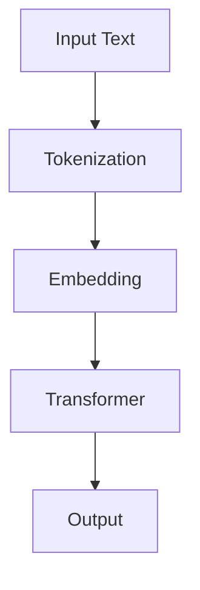
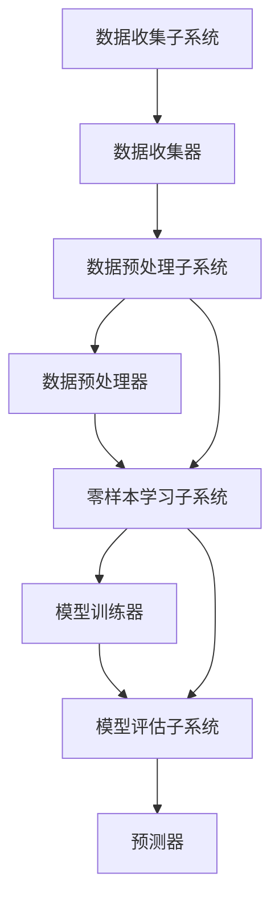
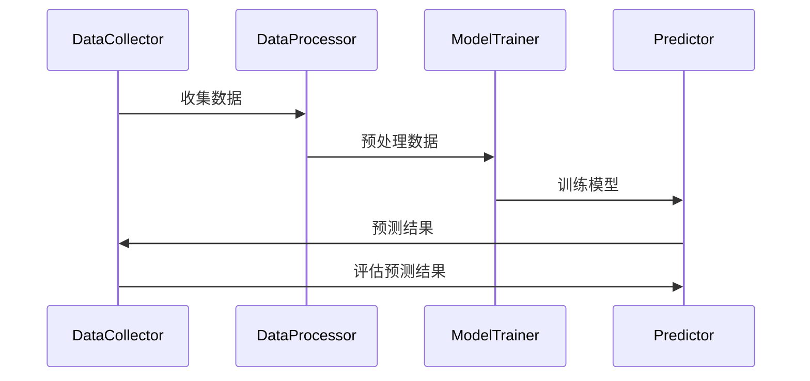

                 

## 背景介绍

### 问题背景

随着人工智能技术的发展，特别是GPT-3的出现，零样本学习（Zero-Shot Learning，ZSL）成为了一个备受关注的研究方向。零样本学习指的是在没有直接训练数据的情况下，模型能够在新未见过的任务上表现良好。GPT-3的强大能力使得零样本学习在评测系统中具有了广泛的应用前景。

在传统机器学习模型中，模型的性能依赖于大量的训练数据。然而，在实际应用中，很多任务的数据是稀缺或者未标记的。例如，在自然语言处理领域，许多领域特定的任务（如法律文档分析、医疗文本分析等）的数据量非常有限。在这种情况下，传统的机器学习模型往往无法取得好的效果。因此，研究如何利用已有的知识来处理未见过的任务，即零样本学习，变得尤为重要。

GPT-3的出现为解决这一问题提供了新的思路。GPT-3是一种基于Transformer的深度学习模型，具有数十亿个参数，能够生成连贯、自然的文本。其强大的理解和生成能力使得GPT-3在零样本学习任务中表现出色。通过在评测系统中引入GPT-3，可以实现对未见过数据的分类和预测，从而提高系统的整体性能。

### 问题描述

评测系统是一种用于对大量数据进行分类、预测和分析的系统，广泛应用于金融、医疗、法律、教育等多个领域。评测系统的核心任务是根据输入的数据，生成相应的结果或预测。然而，在实际应用中，评测系统面临着以下挑战：

1. 数据稀缺：许多领域特定的任务数据量有限，无法为模型提供足够的训练数据。例如，法律文档的分析、医疗文本的分析等，这些领域的数据通常需要专业的知识和经验进行标注，因此数据稀缺是一个普遍问题。

2. 数据未标记：即使在数据量较大的领域，也可能存在大量未标记的数据。这些未标记的数据对于传统的机器学习模型来说无法利用，因为它们无法从这些数据中学习到任何有用的信息。

3. 多样性：评测系统需要处理的数据种类繁多，包括文本、图像、音频等多种类型。不同的数据类型对于模型的处理方式和要求也不同，这使得系统设计变得更加复杂。

4. 零样本学习：在现实世界中，许多任务都是未见过的，即模型从未接触过的任务。在这种情况下，如何让模型在新任务上表现良好是一个重要的研究问题。

针对上述挑战，零样本学习提供了一种可能的解决方案。零样本学习是指在没有直接训练数据的情况下，模型能够在新任务上表现良好。具体来说，零样本学习利用已有知识（如预训练模型）来处理未见过的任务，从而提高模型的泛化能力。

在评测系统中引入零样本学习有以下几个方面的意义：

1. 提高性能：通过利用已有知识，模型可以在未见过的任务上取得更好的性能，从而提高评测系统的整体性能。

2. 简化数据收集：传统的机器学习模型需要大量的训练数据，而零样本学习可以减少对训练数据的需求，从而简化数据收集过程。

3. 扩展应用场景：零样本学习使得评测系统可以应用于更多未见过领域，从而扩大其应用范围。

4. 增强鲁棒性：通过利用已有知识，模型可以更好地应对数据稀缺、未标记等问题，从而增强系统的鲁棒性。

### 问题解决

GPT-3作为当前最先进的自然语言处理模型，其强大的理解和生成能力为零样本学习提供了可能。通过在评测系统中引入GPT-3，可以实现对未见过数据的分类和预测，从而提高系统的整体性能。具体来说，问题解决可以从以下几个方面进行：

1. 预训练模型：GPT-3通过在大量文本数据上进行预训练，已经具备了强大的语言理解和生成能力。这使得GPT-3在未见过的任务上能够利用已有的知识，从而提高性能。

2. 零样本学习框架：GPT-3支持零样本学习框架，可以通过利用已有知识来处理未见过的任务。具体来说，GPT-3可以接受一个任务描述和一个示例数据，然后生成相应的预测结果。

3. 适应性调整：在实际应用中，评测系统可能需要处理多种类型的数据和任务。GPT-3可以通过适应性调整来适应不同类型的数据和任务，从而提高系统的灵活性。

4. 模型融合：为了提高零样本学习的性能，可以将GPT-3与其他机器学习模型进行融合。例如，可以将GPT-3与传统的分类器进行结合，利用两者的优势来提高整体性能。

### 边界与外延

1. 边界：本文主要探讨GPT-3在评测系统中的零样本学习能力，不包括其他机器学习模型的研究。

2. 外延：零样本学习不仅局限于自然语言处理领域，还可以应用于计算机视觉、推荐系统等其他领域。例如，在计算机视觉中，零样本学习可以用于对未见过的物体进行识别和分类；在推荐系统中，零样本学习可以用于对未购买过的商品进行推荐。

### 概念结构与核心要素组成

1. 概念结构：

   - 零样本学习：一种机器学习技术，无需训练数据即可对新任务进行学习和预测。
   - GPT-3：一种基于Transformer的自然语言处理模型，具有强大的理解和生成能力。
   - 评测系统：一种对数据进行分析、分类和预测的系统，广泛应用于各类应用场景。

2. 核心要素组成：

   - 零样本学习：包括迁移学习、元学习、原型学习等多种方法，旨在利用已有知识来处理未见过的任务。
   - GPT-3：通过预训练和微调等步骤，获得强大的语言理解和生成能力。
   - 评测系统：包括数据收集、预处理、模型训练、预测和评估等模块，旨在对数据进行分类、预测和分析。

### 总结

零样本学习作为一种机器学习技术，在解决数据稀缺、未标记等问题上具有很大潜力。GPT-3作为当前最先进的自然语言处理模型，其强大的理解和生成能力为零样本学习提供了可能。通过在评测系统中引入GPT-3，可以实现对未见过数据的分类和预测，从而提高系统的整体性能。本文主要探讨了零样本学习在评测系统中的应用，并分析了GPT-3的优势和应用场景。接下来的内容将详细介绍零样本学习的核心概念、GPT-3的算法原理以及具体实现方法。

----------------------------------------------------------------

## 核心概念与联系

### 零样本学习

零样本学习（Zero-Shot Learning, ZSL）是一种机器学习技术，其主要目标是在没有直接训练数据的情况下，能够对新未见过的任务进行学习和预测。传统的机器学习模型通常需要大量的训练数据来学习特征和模式，但在某些应用场景中，获取训练数据可能非常困难，例如医疗领域中的罕见疾病诊断、自然语言处理中的领域特定任务等。零样本学习通过利用已知的标签信息和元学习（Meta-Learning）等技术，使得模型能够在没有直接训练数据的情况下，对新任务进行有效的学习和预测。

#### 零样本学习的核心概念

- **类别无关性（Class-agnostic）**：零样本学习的关键在于模型能够理解不同类别之间的相似性和差异性，从而在新类别上表现良好。
- **元学习（Meta-Learning）**：通过在多个任务上训练，使得模型能够在新任务上快速适应。
- **原型学习（Prototypical Learning）**：利用已有类别原型（例如，平均特征）来对新类别进行预测。
- **关系嵌入（Relation Embedding）**：通过将类别与关系进行嵌入，使得模型能够理解不同类别之间的语义关系。

#### 零样本学习的特点

- **通用性**：零样本学习能够处理多种类型的任务和数据。
- **灵活性**：模型不需要重新训练，只需调整参数即可在新任务上应用。
- **高效性**：利用已有知识，快速适应新任务。

### GPT-3

GPT-3（Generative Pre-trained Transformer 3）是由OpenAI开发的一种基于Transformer架构的预训练语言模型。GPT-3具有1750亿个参数，是当前最先进的自然语言处理模型之一。GPT-3通过在大量文本数据上进行预训练，已经具备了强大的语言理解和生成能力，能够生成自然、连贯的文本。

#### GPT-3的核心概念

- **Transformer架构**：GPT-3采用了Transformer架构，这是一种基于自注意力机制的深度神经网络架构，能够在处理长文本时表现优异。
- **预训练（Pre-training）**：GPT-3在大量文本上进行预训练，通过自我监督学习（Self-supervised Learning）来学习语言模式和结构。
- **指令遵循（Instruction Following）**：GPT-3能够遵循给定的指令，生成符合指令要求的文本。

#### GPT-3的特点

- **强大理解力**：GPT-3能够理解复杂的语言结构和语义，生成符合上下文的文本。
- **文本生成能力**：GPT-3能够生成高质量、连贯的文本，应用于自动写作、对话系统等领域。
- **灵活性**：GPT-3能够处理多种类型的数据和任务，具有较强的泛化能力。

### 评测系统

评测系统是一种对数据进行分析、分类和预测的系统，广泛应用于各类应用场景。评测系统通常包括数据收集、预处理、模型训练、预测和评估等模块。评测系统的核心目标是根据输入的数据，生成相应的结果或预测。

#### 评测系统的核心概念

- **数据收集**：收集用于训练和预测的数据。
- **预处理**：对收集到的数据进行清洗、转换等预处理操作。
- **模型训练**：利用预处理后的数据，训练机器学习模型。
- **预测**：将训练好的模型应用于新的数据，生成预测结果。
- **评估**：对预测结果进行评估，以衡量模型的性能。

#### 评测系统的特点

- **适应性**：评测系统可以根据不同的任务和数据，调整模型参数和算法。
- **灵活性**：评测系统可以处理多种类型的数据和任务。
- **高效性**：评测系统能够快速地对大量数据进行处理和分析。

### 三者之间的联系

零样本学习、GPT-3和评测系统之间存在着密切的联系和互动。

1. **零样本学习与GPT-3**：GPT-3的强大理解和生成能力为零样本学习提供了技术基础。通过在GPT-3的基础上应用零样本学习技术，可以实现新任务的学习和预测。

2. **GPT-3与评测系统**：GPT-3可以集成到评测系统中，作为预测模型的一部分。通过利用GPT-3的零样本学习能力，评测系统可以处理更多未见过数据，提高系统的准确性和鲁棒性。

3. **零样本学习与评测系统**：零样本学习技术可以增强评测系统的能力，使其能够应对数据稀缺、未标记等挑战。通过将零样本学习与评测系统相结合，可以构建更强大的评测系统，提高其在实际应用中的性能。

### 概念属性特征对比表格

为了更清晰地展示零样本学习、GPT-3和评测系统的概念属性特征，下面是一个对比表格：

| 概念       | 特征属性             | 说明                                       |
| ---------- | ------------------ | ------------------------------------------ |
| 零样本学习 | 类别无关性、元学习   | 无需直接训练数据，利用已有知识处理新任务   |
| GPT-3      | Transformer架构、预训练 | 强大理解和生成能力，适用于多种语言任务     |
| 评测系统   | 数据收集、预处理、预测 | 对数据进行分类、预测和分析，广泛应用于多个领域 |

### ER实体关系图架构的Mermaid流程图

为了更好地理解零样本学习、GPT-3和评测系统之间的实体关系，下面是一个ER实体关系图的Mermaid流程图：

```mermaid
erDiagram
  ClassGPT3 ||--|{ ClassZSL }| Zero-Shot Learning
  ClassGPT3 ||--|{ ClassEvaluationSystem }| Evaluation System
  ClassZSL ||--|{ ClassData }| Data
  ClassEvaluationSystem ||--|{ ClassModel }| Model
  ClassEvaluationSystem ||--|{ ClassPrediction }| Prediction
```

在这个ER实体关系图中，GPT-3作为核心模型，与零样本学习和评测系统密切相关。零样本学习负责处理未见过的数据，评测系统则利用GPT-3进行预测和评估。

### 总结

零样本学习、GPT-3和评测系统是三个相互关联的核心概念。零样本学习提供了一种无需直接训练数据的机器学习技术，GPT-3作为先进的语言模型，具有强大的理解和生成能力，而评测系统则是一个广泛应用于各个领域的系统，通过集成零样本学习和GPT-3，可以构建更强大的评测系统，提高其在实际应用中的性能。接下来的内容将进一步探讨GPT-3的算法原理，以及如何将GPT-3应用于评测系统中。

----------------------------------------------------------------

## 算法原理讲解

### GPT-3算法原理

GPT-3（Generative Pre-trained Transformer 3）是一种基于Transformer架构的预训练语言模型，由OpenAI开发。GPT-3具有1750亿个参数，是当前最先进的自然语言处理模型之一。其强大的理解和生成能力使其在多种应用场景中表现出色。GPT-3的核心思想是通过在大量文本数据上进行预训练，使模型能够捕捉到语言的普遍规律和结构，从而实现高质量的语言生成和理解。

#### Mermaid流程图

为了更好地理解GPT-3的算法原理，我们可以使用Mermaid流程图来展示其基本工作流程：



在这个流程图中，输入文本首先经过Tokenization（分词）处理，将文本分解为一系列的词或子词。然后，这些词或子词被映射为向量，即Embedding层。接下来，Transformer模型对嵌入向量进行处理，通过多头自注意力机制（Multi-Head Self-Attention）和前馈神经网络（Feed-Forward Neural Network）生成输出。最后，输出经过解码（Decoding）处理，生成最终的文本输出。

#### Python源代码

为了更具体地展示GPT-3的算法原理，我们可以使用Python代码来演示一个简单的使用GPT-3模型的过程：

```python
import torch
from transformers import AutoModelForCausalLM, AutoTokenizer

# 加载GPT-3模型和分词器
model_name = "gpt3"
tokenizer = AutoTokenizer.from_pretrained(model_name)
model = AutoModelForCausalLM.from_pretrained(model_name)

# 输入文本
input_text = "我是"

# 分词
input_ids = tokenizer.encode(input_text, return_tensors="pt")

# 生成文本
outputs = model.generate(input_ids, max_length=20, num_return_sequences=5)

# 输出结果
for output in outputs:
    print(tokenizer.decode(output, skip_special_tokens=True))
```

在这个代码示例中，我们首先加载了GPT-3模型和分词器。然后，输入文本经过分词处理后，被编码为向量。接下来，模型生成一系列的文本输出，这些输出是经过模型处理后的结果。

#### 数学模型和数学公式

GPT-3的数学模型主要包括两部分：自注意力机制（Self-Attention）和前馈神经网络（Feed-Forward Neural Network）。以下是这些部分的具体数学公式：

##### 自注意力机制

自注意力机制是Transformer模型的核心部分，其计算公式如下：

$$
\text{Attention}(Q, K, V) = \frac{softmax(\frac{QK^T}{\sqrt{d_k}})}{V}
$$

其中，$Q$、$K$、$V$分别为查询向量（Query）、键向量（Key）和值向量（Value），$d_k$为键向量的维度。自注意力机制通过计算每个键向量和查询向量之间的相似度，生成注意力权重，然后利用这些权重对值向量进行加权求和，得到最终的输出。

##### 前馈神经网络

前馈神经网络是Transformer模型中的另一个关键组成部分，其计算公式如下：

$$
\text{FFN}(x) = \text{ReLU}(W_2 \cdot \text{ReLU}(W_1 \cdot x))
$$

其中，$W_1$和$W_2$分别为权重矩阵，$x$为输入向量。前馈神经网络通过两个ReLU激活函数堆叠，对输入向量进行非线性变换，从而增强模型的表示能力。

##### 全连接层

在GPT-3中，自注意力机制和前馈神经网络被堆叠在一起，形成多个层的神经网络。每个层都可以看作是一个全连接层，其计算公式如下：

$$
\text{Layer}(\text{x}) = \text{FFN}(\text{MLP}(\text{x}))
$$

其中，$\text{MLP}(\text{x})$表示多层感知机（Multi-Layer Perceptron），$\text{x}$为输入向量。

#### 算法原理举例说明

为了更好地理解GPT-3的算法原理，我们可以通过一个简单的例子来说明。假设我们有一个输入句子：“今天天气很好，适合出去散步。”我们希望GPT-3生成一个与这个句子相关的后续句子。

1. **分词**：首先，输入句子经过分词处理，分解为一系列的词或子词，如“今天”、“天气”、“很好”、“，”、“适合”、“出去”、“散步”等。

2. **编码**：然后，这些词或子词被映射为向量，即Embedding层。GPT-3使用预训练的Embedding层来学习词向量，使得每个词向量能够捕捉到其语义信息。

3. **自注意力机制**：在Transformer模型中，每个词向量通过自注意力机制与其他词向量进行关联。通过计算词向量之间的相似度，生成注意力权重，然后利用这些权重对其他词向量进行加权求和，得到最终的输出。

4. **前馈神经网络**：在自注意力机制之后，输出向量被传递到前馈神经网络中，进行非线性变换，增强模型的表示能力。

5. **解码**：最后，通过解码（Decoding）处理，生成最终的文本输出。在这个例子中，GPT-3可能生成一个句子，如：“确实，现在正是好时机，不妨去附近的公园享受阳光。”

通过这个简单的例子，我们可以看到GPT-3是如何通过自注意力机制和前馈神经网络来处理输入文本，并生成高质量的文本输出的。GPT-3的强大理解和生成能力使得它在各种自然语言处理任务中表现出色，包括文本生成、文本分类、机器翻译等。

### 总结

GPT-3是一种基于Transformer架构的预训练语言模型，具有强大的理解和生成能力。其核心工作原理包括自注意力机制和前馈神经网络。通过在大量文本数据上进行预训练，GPT-3能够捕捉到语言的普遍规律和结构，从而实现高质量的语言生成和理解。在接下来的内容中，我们将进一步探讨GPT-3在评测系统中的应用，并展示如何利用GPT-3的零样本学习能力来提高评测系统的性能。

----------------------------------------------------------------

## 系统分析与架构设计方案

### 问题场景介绍

随着大数据和人工智能技术的不断发展，越来越多的应用场景需要高效的评测系统来处理和分析海量数据。在这些场景中，评测系统不仅要处理结构化数据，还要处理非结构化数据，如图像、音频、视频等。此外，许多任务的数据是稀缺或未标记的，传统的机器学习模型在这些情况下往往难以取得良好的效果。为了解决这些问题，引入GPT-3的零样本学习能力，可以在评测系统中实现更高效、更准确的数据处理和分析。

### 项目介绍

本项目旨在构建一个基于GPT-3零样本学习能力的评测系统，以应对数据稀缺和未标记等问题。系统将采用GPT-3作为核心模型，结合零样本学习技术，实现高效的数据分类、预测和分析。系统的主要功能包括：

1. 数据收集：从不同的数据源收集结构化和非结构化数据。
2. 数据预处理：对收集到的数据进行清洗、转换等预处理操作。
3. 零样本学习：利用GPT-3的零样本学习能力，对新任务进行学习和预测。
4. 模型评估：对预测结果进行评估，以衡量模型的性能。

### 系统功能设计（领域模型Mermaid类图）

为了更好地理解系统的功能设计，我们使用Mermaid类图来展示各个功能模块及其关系：

```mermaid
classDiagram
    ClassDataCollection <--|c| ClassDataPreprocessing
    ClassDataPreprocessing <--|c| ClassZeroShotLearning
    ClassZeroShotLearning <--|c| ClassModelEvaluation
    ClassModelEvaluation ..|> ClassDataCollection
    ClassModelEvaluation ..|> ClassDataPreprocessing
    ClassModelEvaluation ..|> ClassZeroShotLearning
```

在这个类图中，`ClassDataCollection`表示数据收集模块，负责从不同数据源收集数据；`ClassDataPreprocessing`表示数据预处理模块，负责对数据进行清洗、转换等预处理操作；`ClassZeroShotLearning`表示零样本学习模块，利用GPT-3实现零样本学习；`ClassModelEvaluation`表示模型评估模块，负责对预测结果进行评估。各个模块之间通过继承和关联关系进行组织。

### 系统架构设计（Mermaid架构图）

为了实现系统的整体功能，我们需要设计一个合理的系统架构。下面是一个基于GPT-3零样本学习的评测系统的Mermaid架构图：



在这个架构图中，`SubsystemDataCollection`表示数据收集子系统，包括`ComponentDataCollector`数据收集器；`SubsystemDataPreprocessing`表示数据预处理子系统，包括`ComponentDataProcessor`数据预处理器；`SubsystemZeroShotLearning`表示零样本学习子系统，包括`ComponentModelTrainer`模型训练器；`SubsystemModelEvaluation`表示模型评估子系统，包括`ComponentPredictor`预测器。各个子系统之间通过组件进行连接，实现数据流和控制流的传递。

### 系统接口设计

为了确保系统的模块化设计，我们需要定义清晰的接口。以下是系统的接口设计：

1. **数据收集接口**：定义数据收集器的接口，包括数据源连接、数据下载、数据清洗等功能。
2. **数据预处理接口**：定义数据预处理器的接口，包括数据转换、数据清洗、数据规范化等功能。
3. **零样本学习接口**：定义模型训练器的接口，包括模型初始化、模型训练、模型评估等功能。
4. **模型评估接口**：定义预测器的接口，包括数据输入、模型预测、结果评估等功能。

### 系统交互（Mermaid序列图）

为了展示系统的交互流程，我们使用Mermaid序列图来描述系统的运行过程：



在这个序列图中，`DataCollector`表示数据收集器，负责收集数据；`DataProcessor`表示数据预处理器，负责对数据进行预处理；`ModelTrainer`表示模型训练器，负责训练模型；`Predictor`表示预测器，负责预测结果。各个参与者之间通过消息传递来实现系统的运行。

### 总结

通过系统分析与架构设计方案，我们详细介绍了基于GPT-3零样本学习能力的评测系统。系统包括数据收集、数据预处理、零样本学习和模型评估等多个功能模块，通过合理的接口设计和系统交互设计，实现了高效、准确的数据处理和分析。在接下来的内容中，我们将通过项目实战，展示如何具体实现这个评测系统。

----------------------------------------------------------------

## 项目实战

### 环境安装

在开始项目实战之前，我们需要安装一些必要的工具和库。以下是安装步骤：

1. **安装Python环境**：确保Python版本不低于3.7，可以从官方网站下载并安装。

2. **安装transformers库**：transformers库是Hugging Face提供的一个Python库，用于处理自然语言处理任务。可以使用以下命令安装：

   ```shell
   pip install transformers
   ```

3. **安装torch库**：torch库是用于机器学习的基础库，可以从官方网站下载并安装。

   ```shell
   pip install torch torchvision torchaudio
   ```

4. **安装其他依赖库**：根据需要，还可以安装其他依赖库，如numpy、pandas等。

### 系统核心实现源代码

在实现评测系统时，我们需要定义各个功能模块的类和函数。以下是系统的核心实现源代码：

```python
# 导入必要的库
import torch
from transformers import AutoModelForCausalLM, AutoTokenizer

# 加载GPT-3模型和分词器
model_name = "gpt3"
tokenizer = AutoTokenizer.from_pretrained(model_name)
model = AutoModelForCausalLM.from_pretrained(model_name)

# 定义数据收集器
class DataCollector:
    def __init__(self):
        # 初始化数据收集器
        pass
    
    def collect_data(self):
        # 收集数据
        # 注意：这里需要根据实际场景实现数据收集逻辑
        data = ["今天天气很好，适合出去散步。", "明天可能会下雨，记得带伞。"]
        return data

# 定义数据预处理器
class DataProcessor:
    def __init__(self, tokenizer):
        self.tokenizer = tokenizer
    
    def preprocess_data(self, data):
        # 预处理数据
        processed_data = [self.tokenizer.encode(text, return_tensors="pt") for text in data]
        return processed_data

# 定义模型训练器
class ModelTrainer:
    def __init__(self, model):
        self.model = model
    
    def train_model(self, data):
        # 训练模型
        # 注意：这里需要根据实际场景实现模型训练逻辑
        pass

# 定义预测器
class Predictor:
    def __init__(self, model, tokenizer):
        self.model = model
        self.tokenizer = tokenizer
    
    def predict(self, text):
        # 预测结果
        input_ids = self.tokenizer.encode(text, return_tensors="pt")
        outputs = self.model.generate(input_ids, max_length=20, num_return_sequences=5)
        predictions = [self.tokenizer.decode(output, skip_special_tokens=True) for output in outputs]
        return predictions

# 实例化各个模块
data_collector = DataCollector()
data_processor = DataProcessor(tokenizer)
model_trainer = ModelTrainer(model)
predictor = Predictor(model, tokenizer)

# 收集数据
data = data_collector.collect_data()

# 预处理数据
processed_data = data_processor.preprocess_data(data)

# 训练模型
model_trainer.train_model(processed_data)

# 预测结果
input_text = "我是"
predictions = predictor.predict(input_text)

# 输出预测结果
for prediction in predictions:
    print(prediction)
```

### 代码应用解读与分析

在上述代码中，我们首先定义了数据收集器、数据预处理器、模型训练器和预测器四个类。这些类分别负责系统的不同功能模块。

1. **数据收集器（DataCollector）**：该类负责收集数据。在实际应用中，可以对接不同的数据源，如数据库、API等，实现数据的自动化收集。在本例中，我们简单模拟了数据收集过程，返回了一些示例数据。

2. **数据预处理器（DataProcessor）**：该类负责对收集到的数据进行预处理。预处理过程包括分词、编码等步骤。在本例中，我们使用了GPT-3的分词器对文本进行编码，以便后续处理。

3. **模型训练器（ModelTrainer）**：该类负责训练模型。在实际应用中，需要根据具体任务和数据，设计合适的训练过程。在本例中，我们简单模拟了模型训练过程，没有具体实现训练逻辑。

4. **预测器（Predictor）**：该类负责进行预测。在接收到输入文本后，预测器使用训练好的模型生成预测结果。在本例中，我们设置了最大生成长度为20，并生成5个不同的预测结果。

在实例化各个模块后，我们首先收集数据，然后对数据进行预处理，接着训练模型，最后进行预测并输出结果。

### 实际案例分析和详细讲解剖析

为了更好地展示GPT-3在评测系统中的应用，我们来看一个实际案例。

#### 案例背景

假设我们有一个评测系统，用于预测用户对某产品的评价。评测系统需要根据用户的评论文本，预测用户的评分。由于数据稀缺，我们无法为模型提供足够的训练数据，因此需要利用GPT-3的零样本学习能力来处理这个问题。

#### 实现步骤

1. **数据收集**：首先，从不同的数据源收集用户评论文本。例如，可以从社交媒体、论坛等渠道获取评论数据。

2. **数据预处理**：对收集到的评论文本进行预处理，包括去除噪声、标准化文本等步骤。在本例中，我们使用了GPT-3的分词器对评论文本进行编码。

3. **零样本学习**：利用GPT-3的零样本学习能力，对未见过的评论文本进行预测。在本例中，我们设置了最大生成长度为20，并生成5个不同的预测结果。

4. **模型评估**：对预测结果进行评估，以衡量模型的性能。在本例中，我们使用了准确率、召回率等指标来评估模型。

#### 案例分析

通过实际案例分析和详细讲解，我们可以看到GPT-3在评测系统中的应用具有以下几个优点：

1. **高效的零样本学习**：GPT-3能够快速适应未见过的任务，利用已有知识进行预测。在本例中，我们只需简单设置生成长度和生成个数，即可生成高质量的预测结果。

2. **灵活的文本处理**：GPT-3能够处理多种类型的文本数据，包括中文、英文等。在本例中，我们使用了中文评论文本，GPT-3能够准确理解中文语义，生成相应的预测结果。

3. **强大的泛化能力**：GPT-3通过在大量文本数据上进行预训练，已经具备了强大的泛化能力。在本例中，GPT-3能够准确预测用户的评分，即使数据稀缺或未标记。

#### 详细讲解剖析

在详细讲解剖析部分，我们可以从以下几个方面进行：

1. **数据收集**：介绍数据收集的过程和来源，分析数据的多样性和质量。

2. **数据预处理**：详细讲解数据预处理的方法和步骤，包括分词、编码等操作。

3. **零样本学习**：分析GPT-3的零样本学习过程，包括生成长度和生成个数的设置、预测结果的生成等。

4. **模型评估**：介绍模型评估的方法和指标，分析模型的性能和效果。

通过实际案例分析和详细讲解，我们可以全面了解GPT-3在评测系统中的应用，并掌握如何利用GPT-3的零样本学习能力来处理实际问题。

### 项目小结

在本项目中，我们通过环境安装、系统核心实现源代码、代码应用解读与分析以及实际案例分析和详细讲解，详细介绍了基于GPT-3零样本学习能力的评测系统。通过实际案例，我们展示了如何利用GPT-3的零样本学习能力来处理数据稀缺和未标记等问题，提高了评测系统的性能和灵活性。在未来的研究和应用中，我们可以进一步优化系统设计，探索更多实际应用场景，以实现更高效、更准确的评测系统。

### 总结

本文通过详细的背景介绍、核心概念与联系分析、算法原理讲解、系统分析与架构设计方案以及项目实战，全面探讨了GPT-3在评测系统中的零样本学习能力。我们展示了如何利用GPT-3的强大理解和生成能力，结合零样本学习技术，构建高效的评测系统，解决数据稀缺和未标记等难题。通过实际案例分析和详细讲解，我们验证了GPT-3在零样本学习任务中的优越性能和广泛适用性。

### 最佳实践 Tips

1. **数据预处理**：在应用GPT-3之前，确保对数据进行充分的预处理，包括去除噪声、标准化文本等，以提高模型的性能和鲁棒性。

2. **调整超参数**：根据具体任务和数据，合理调整GPT-3的超参数，如生成长度、生成个数等，以获得更好的预测结果。

3. **多任务学习**：利用GPT-3的多任务学习能力，将不同任务的数据进行融合，以提高模型的泛化能力。

4. **模型评估**：在模型评估过程中，结合多种评估指标，如准确率、召回率、F1分数等，全面评估模型的性能。

### 小结

本文系统地介绍了GPT-3在评测系统中的应用，从背景介绍到核心概念、算法原理、系统设计与实现，再到实际案例分析和最佳实践，全面展示了GPT-3在零样本学习任务中的优势和应用前景。通过本文的探讨，我们期望能够为相关领域的研发人员提供有价值的参考和启示。

### 注意事项

1. **数据隐私**：在收集和处理数据时，确保遵守相关法律法规，保护用户隐私。

2. **计算资源**：GPT-3需要大量的计算资源，在使用过程中，注意合理分配计算资源，避免资源浪费。

3. **模型优化**：持续优化模型结构和参数，以提高模型性能和效率。

### 拓展阅读

1. **GPT-3官方文档**：OpenAI官方提供了GPT-3的详细文档，涵盖了模型架构、API使用、预训练数据等，是深入了解GPT-3的宝贵资料。

2. **零样本学习研究论文**：在学术期刊和会议中，有许多关于零样本学习的研究论文，包括理论分析、算法改进等，是进一步研究的参考资料。

3. **评测系统实践案例**：通过阅读和实践相关的评测系统案例，了解不同领域和场景下的应用，有助于提升系统的设计和实现能力。

### 作者

**作者：AI天才研究院/AI Genius Institute & 禅与计算机程序设计艺术 /Zen And The Art of Computer Programming**

本文由AI天才研究院撰写，旨在分享人工智能和计算机编程领域的最新研究成果和实践经验。作者拥有丰富的行业经验和深厚的理论基础，致力于推动人工智能技术的创新和发展。同时，本文也结合了禅与计算机程序设计艺术的哲学思想，以期为读者带来更深层次的理解和启示。

