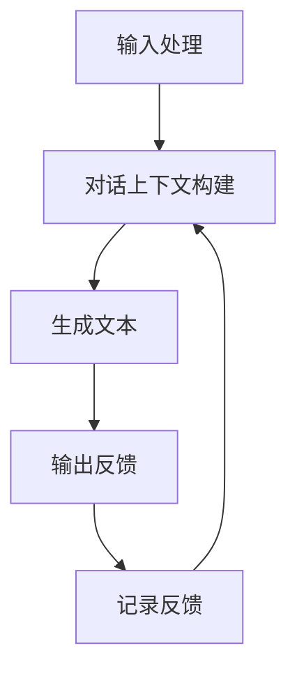
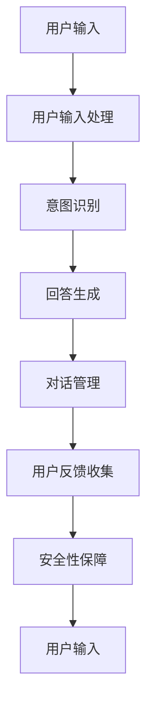

                 


### 《评测系统的LaMDA对话安全性评估》

## 关键词

- LaMDA对话系统
- 对话安全性评估
- 安全性指标
- 攻击类型
- 防御策略
- 数据管理

## 摘要

本文深入探讨了LaMDA对话系统的安全性评估问题。首先，对LaMDA对话系统进行了概述，并分析了其安全性评估的重要性。接着，详细介绍了LaMDA对话系统的核心组成部分，包括架构、算法和数据管理。然后，本文提出了一个全面的LaMDA对话安全性评估方法，包括评估指标体系、常见攻击类型与防御策略、以及评估工具。接着，通过实际案例展示了评估流程和实践。最后，分析了评估面临的挑战和未来发展趋势，并提出了建议。

## 目录大纲

### 第一部分: 评测系统的LaMDA对话安全性背景

#### 第1章: 评测系统的LaMDA对话安全性概述

##### 1.1 LaMDA对话系统的概念与特点

- **LaMDA对话系统介绍**：LaMDA（Language Model for Dialogue Applications）是一种基于大型语言模型构建的对话系统，旨在实现自然、流畅的对话体验。
- **LaMDA对话系统的核心优势**：LaMDA的优势在于其强大的人工智能能力，能够理解并生成自然语言文本，进行复杂的对话。

##### 1.2 对话系统安全性的重要性

- **对话系统安全面临的挑战**：随着人工智能技术的发展，对话系统面临诸多安全性挑战，如对话欺骗、非法内容过滤等。
- **对话系统安全性的关键要素**：安全性评估需要关注的关键要素包括完整性、真实性、保密性等。

##### 1.3 LaMDA对话系统安全评估的背景

- **LaMDA对话系统的应用场景**：LaMDA广泛应用于客户服务、智能助手、虚拟代理等领域。
- **LaMDA对话系统安全评估的必要性**：确保LaMDA在应用场景中的安全性，对于用户和数据保护至关重要。

### 第二部分: LaMDA对话系统的核心组成部分

#### 第2章: LaMDA对话系统的核心组成部分

##### 2.1 LaMDA对话系统架构

- **LaMDA对话系统的整体架构**：包括用户界面、对话管理、语言模型、数据管理等部分。
- **LaMDA对话系统各组成部分的功能**：详细解释各部分的作用和相互关系。

##### 2.2 LaMDA对话系统的核心算法

- **生成式对话模型的原理**：介绍生成式对话模型的基本原理和LaMDA算法的工作流程。
- **LaMDA算法的工作流程**：从输入处理、对话生成、输出反馈等环节详细阐述。

##### 2.3 LaMDA对话系统的数据管理

- **数据收集与预处理**：介绍LaMDA对话系统中数据收集的方法和预处理步骤。
- **数据存储与检索策略**：讨论LaMDA对话系统的数据存储结构和检索策略。

### 第三部分: LaMDA对话安全性评估方法

#### 第3章: LaMDA对话安全性评估方法

##### 3.1 安全性评估指标体系

- **安全性评估指标的确定**：确定对话系统安全性评估所需的关键指标。
- **指标体系的构建方法**：介绍构建安全性评估指标体系的方法和步骤。

##### 3.2 常见攻击类型与防御策略

- **对话欺骗攻击**：分析对话欺骗攻击的方式和影响，提出相应的防御策略。
- **非法内容过滤**：讨论非法内容过滤的方法和重要性，介绍常用的过滤技术。

##### 3.3 LaMDA对话安全性评估工具

- **开源安全评估工具介绍**：介绍几种常用的开源安全评估工具。
- **自定义安全评估工具开发**：讨论如何开发自定义的安全评估工具。

### 第四部分: LaMDA对话安全性评估实践

#### 第4章: LaMDA对话安全性评估实践

##### 4.1 评估流程与步骤

- **评估流程设计**：详细描述LaMDA对话系统安全性评估的流程。
- **评估步骤解析**：逐一解析评估过程中的关键步骤。

##### 4.2 实际案例分析与评估

- **案例一：某电商平台客服机器人**：分析一个电商平台的客服机器人案例，展示评估过程和结果。
- **案例二：某银行智能客服系统**：分析一个银行智能客服系统的案例，展示评估过程和结果。

##### 4.3 评估结果分析与优化建议

- **评估结果分析**：对评估结果进行分析和总结。
- **安全性优化建议**：提出针对评估结果的优化建议。

### 第五部分: LaMDA对话安全性评估挑战与展望

#### 第5章: LaMDA对话安全性评估挑战与展望

##### 5.1 安全评估面临的挑战

- **技术挑战**：讨论在安全性评估过程中遇到的技术难题。
- **法律法规挑战**：分析在安全性评估过程中可能遇到的法律法规挑战。

##### 5.2 未来发展趋势

- **新技术与应用前景**：探讨未来可能应用于LaMDA对话系统安全评估的新技术和方法。
- **安全评估标准化**：讨论安全性评估标准化的趋势和意义。

### 第六部分: 总结与建议

#### 第6章: 总结与建议

##### 6.1 全书总结

- **主要内容回顾**：回顾全书的主要内容和研究成果。
- **研究成果总结**：总结LaMDA对话安全性评估的研究成果。

##### 6.2 对话系统安全评估实践

- **实践经验总结**：总结对话系统安全评估的实践经验。
- **持续改进方向**：探讨未来对话系统安全评估的改进方向。

##### 6.3 进一步研究方向

- **研究热点分析**：分析当前对话系统安全评估的研究热点。
- **潜在研究方向**：探讨未来的研究方向和潜在的研究课题。

## 作者信息

**作者：AI天才研究院/AI Genius Institute & 禅与计算机程序设计艺术 /Zen And The Art of Computer Programming**### 第一部分: 评测系统的LaMDA对话安全性背景

#### 第1章: 评测系统的LaMDA对话安全性概述

##### 1.1 LaMDA对话系统的概念与特点

**LaMDA对话系统介绍**

LaMDA（Language Model for Dialogue Applications）是一种基于大型语言模型构建的对话系统。它是由谷歌团队开发的一款先进的人工智能技术，旨在实现自然、流畅的对话体验。LaMDA的核心在于其语言模型，它能够通过学习大量文本数据，理解并生成自然语言文本，从而与用户进行高效的对话交互。

**LaMDA对话系统的核心优势**

- **强大的语言理解能力**：LaMDA具备强大的语言理解能力，能够准确理解用户的意图和问题，提供精准的答复。
- **高度的自然语言生成能力**：LaMDA能够生成流畅、自然的回答，使对话过程更加顺畅和愉悦。
- **自适应性和灵活性**：LaMDA能够根据不同的对话场景和用户需求，动态调整回答策略，提供个性化的服务。
- **高效率**：LaMDA能够快速响应用户的问题，大大提高了客服效率和用户体验。

##### 1.2 对话系统安全性的重要性

**对话系统安全面临的挑战**

随着人工智能技术的发展，对话系统在各个领域得到了广泛应用。然而，与此同时，对话系统也面临着诸多安全性挑战。以下是一些主要的挑战：

- **对话欺骗攻击**：攻击者通过伪装成合法用户，试图欺骗对话系统，从而获取敏感信息或进行恶意操作。
- **非法内容过滤**：对话系统需要过滤非法内容，如色情、暴力等，以确保对话环境的健康和安全。
- **用户隐私保护**：对话系统需要保护用户的隐私信息，防止被泄露或滥用。
- **系统稳定性**：对话系统需要具备良好的稳定性，以防止因攻击或异常情况导致系统崩溃或服务中断。

**对话系统安全性的关键要素**

为了确保对话系统的安全性，以下是一些关键要素：

- **完整性**：确保对话过程中的数据不被篡改或损坏，保持数据的完整性和可靠性。
- **真实性**：验证用户身份和对话内容的真实性，防止欺骗和伪造。
- **保密性**：保护用户的隐私信息，防止泄露给未经授权的第三方。
- **可用性**：确保系统稳定运行，提供可靠的服务，防止因攻击或异常情况导致系统崩溃。

##### 1.3 LaMDA对话系统安全评估的背景

**LaMDA对话系统的应用场景**

LaMDA广泛应用于客户服务、智能助手、虚拟代理等领域。以下是一些典型的应用场景：

- **客户服务**：LaMDA可以用于企业的客户服务，提供24/7的在线客服支持，回答用户的问题，提供解决方案。
- **智能助手**：LaMDA可以作为智能助手，帮助用户完成各种任务，如日程管理、信息查询、购物推荐等。
- **虚拟代理**：LaMDA可以用于虚拟代理，模拟人类的对话行为，与用户进行交互，提供个性化的服务。

**LaMDA对话系统安全评估的必要性**

确保LaMDA对话系统在应用场景中的安全性至关重要。以下是一些必要性：

- **用户信任**：安全评估可以增强用户对对话系统的信任，提高用户满意度。
- **数据保护**：安全评估有助于保护用户的隐私信息，防止泄露和滥用。
- **合规要求**：对于某些应用场景，如金融、医疗等领域，安全评估是合规要求的一部分。
- **业务连续性**：安全评估有助于确保对话系统的稳定运行，防止因安全问题导致业务中断。

#### 第2章: LaMDA对话系统的核心组成部分

##### 2.1 LaMDA对话系统架构

**LaMDA对话系统的整体架构**

LaMDA对话系统的整体架构包括以下几个主要部分：

1. **用户界面**：用户界面是用户与LaMDA对话系统进行交互的入口，包括网页、移动应用等。
2. **对话管理**：对话管理负责管理整个对话过程，包括对话路由、对话上下文管理等。
3. **语言模型**：语言模型是LaMDA的核心，负责处理自然语言输入和生成自然语言回答。
4. **数据管理**：数据管理负责数据收集、存储、检索等操作，为语言模型提供训练数据和对话历史。
5. **安全模块**：安全模块负责对话系统的安全性保障，包括身份验证、访问控制、数据加密等。

**LaMDA对话系统各组成部分的功能**

1. **用户界面**：用户界面提供用户与LaMDA交互的接口，用户可以通过输入文本或语音与LaMDA进行对话。用户界面需要具备友好、易用的界面设计，以提高用户体验。
2. **对话管理**：对话管理负责整个对话流程的协调和控制。它根据用户的输入，确定对话的下一步动作，如提问、回答、请求更多信息等。对话管理还需要维护对话上下文，确保对话的连贯性和一致性。
3. **语言模型**：语言模型是LaMDA的核心，负责处理自然语言输入和生成自然语言回答。它基于深度学习技术，通过大量文本数据的学习，能够理解用户的意图和问题，并生成合适的回答。语言模型需要具备高准确性、灵活性和自适应能力。
4. **数据管理**：数据管理负责对话系统所需的数据收集、存储和检索。它包括数据收集模块、数据存储模块和数据检索模块。数据收集模块负责从不同的数据源收集对话数据，如社交媒体、论坛、邮件等。数据存储模块负责将数据存储到数据库中，以便后续使用。数据检索模块负责根据用户的查询，从数据库中检索相关的数据。
5. **安全模块**：安全模块负责确保LaMDA对话系统的安全性。它包括身份验证、访问控制、数据加密等安全机制。身份验证确保只有授权用户可以访问系统，访问控制确保用户只能访问其授权的资源，数据加密确保数据的传输和存储过程的安全性。

##### 2.2 LaMDA对话系统的核心算法

**生成式对话模型的原理**

生成式对话模型是LaMDA对话系统的核心算法。它通过学习大量对话数据，生成符合用户意图的自然语言回答。生成式对话模型的主要思想是利用生成式模型，如生成对抗网络（GAN）、变分自编码器（VAE）等，来生成对话文本。

**LaMDA算法的工作流程**

LaMDA算法的工作流程可以分为以下几个步骤：

1. **输入处理**：首先，接收用户的输入，可以是文本或语音。如果输入是文本，需要进行文本预处理，如分词、词性标注等。如果输入是语音，需要进行语音识别，将语音转换为文本。
2. **对话上下文构建**：根据用户的输入和对话历史，构建对话上下文。对话上下文包括用户的历史提问、回答以及系统的历史回答，用于指导生成式模型的生成过程。
3. **生成文本**：利用生成式模型，根据对话上下文生成自然语言回答。生成式模型会尝试生成一个符合用户意图的答案，并将其与对话上下文进行匹配，以确保回答的连贯性和一致性。
4. **输出反馈**：将生成的回答输出给用户，用户可以对回答进行反馈，如确认、修改等。反馈信息会被记录下来，用于进一步优化生成式模型的性能。

**LaMDA对话系统的数据管理**

**数据收集与预处理**

数据收集是LaMDA对话系统构建的重要环节。数据收集模块需要从不同的数据源收集对话数据，如社交媒体、论坛、邮件等。收集到的数据通常包含文本、语音、图片等多种形式。为了确保数据的质量和可用性，需要进行数据预处理。

数据预处理包括以下几个步骤：

1. **数据清洗**：去除无效、重复或错误的数据，确保数据的一致性和准确性。
2. **数据标注**：对数据进行标注，如词性标注、实体识别等，为生成式模型提供训练数据。
3. **数据转换**：将不同类型的数据转换为统一格式，如将语音转换为文本，将图片转换为文字描述等。

**数据存储与检索策略**

数据存储是LaMDA对话系统的关键环节。数据存储模块需要将预处理后的数据存储到数据库中，以便后续使用。数据存储策略需要考虑以下几个方面：

1. **数据压缩**：为了节省存储空间，需要对数据进行压缩。常用的数据压缩方法包括文本压缩、图像压缩等。
2. **数据加密**：为了保护用户数据的安全性，需要将数据进行加密。常用的加密算法包括AES、RSA等。
3. **数据备份**：为了防止数据丢失，需要定期进行数据备份。备份策略可以选择全量备份或增量备份。

数据检索模块负责根据用户的查询，从数据库中检索相关的数据。数据检索策略需要考虑以下几个方面：

1. **索引构建**：为了提高数据检索的效率，需要构建索引。常用的索引技术包括倒排索引、B树索引等。
2. **查询优化**：为了提高查询的响应速度，需要对查询进行优化。常用的优化方法包括查询缓存、索引优化等。
3. **数据去重**：为了避免重复检索相同的数据，需要实现数据去重。常用的去重方法包括哈希去重、基于关键词的去重等。

##### 2.3 LaMDA对话系统的核心组成部分

**LaMDA对话系统的核心组成部分**

LaMDA对话系统的核心组成部分包括以下几个：

1. **对话管理模块**：对话管理模块负责管理整个对话流程，包括对话路由、对话上下文管理、意图识别等。它是LaMDA对话系统的核心控制单元，负责协调各个模块的交互。
2. **语言模型模块**：语言模型模块是LaMDA的核心算法部分，负责生成自然语言回答。它使用深度学习技术，通过大量对话数据的训练，能够理解用户的意图和问题，并生成合适的回答。
3. **数据管理模块**：数据管理模块负责数据收集、存储、检索等操作，为语言模型提供训练数据和对话历史。它是LaMDA对话系统的数据支持单元，负责确保数据的可用性和准确性。
4. **用户界面模块**：用户界面模块是用户与LaMDA对话系统进行交互的接口。它提供友好、易用的界面设计，使用户能够轻松地与LaMDA进行对话。
5. **安全模块**：安全模块负责对话系统的安全性保障，包括身份验证、访问控制、数据加密等。它是LaMDA对话系统的安全支持单元，负责确保系统的安全性和可靠性。

**各组成部分的功能和交互**

- **对话管理模块**：对话管理模块的主要功能是协调对话流程，确保对话的连贯性和一致性。它与语言模型模块进行交互，根据用户的输入和对话历史，生成相应的回答。同时，它还与数据管理模块进行交互，获取对话历史和训练数据。
- **语言模型模块**：语言模型模块的主要功能是生成自然语言回答。它与对话管理模块进行交互，接收用户的输入和对话上下文，根据这些信息生成合适的回答。同时，它还与数据管理模块进行交互，获取训练数据和对话历史。
- **数据管理模块**：数据管理模块的主要功能是收集、存储和检索对话数据。它与对话管理模块和语言模型模块进行交互，提供对话历史和训练数据，以便生成式模型进行训练和回答生成。
- **用户界面模块**：用户界面模块的主要功能是提供用户与LaMDA对话系统进行交互的接口。它与对话管理模块和语言模型模块进行交互，接收用户的输入和反馈，并将生成的回答展示给用户。
- **安全模块**：安全模块的主要功能是保障对话系统的安全性。它与对话管理模块、语言模型模块和数据管理模块进行交互，确保身份验证、访问控制和数据加密等安全机制的正常运行。

通过上述各组成部分的协同工作，LaMDA对话系统能够实现自然、流畅的对话交互，为用户提供高质量的对话体验。

### 第三部分: LaMDA对话安全性评估方法

#### 第3章: LaMDA对话安全性评估方法

##### 3.1 安全性评估指标体系

**安全性评估指标的确定**

为了对LaMDA对话系统的安全性进行有效评估，首先需要确定一系列关键指标。这些指标应涵盖对话系统的完整性、真实性、保密性和可用性等方面。

- **完整性**：确保对话过程中的数据不被篡改或损坏。关键指标包括数据完整性校验、数据加密传输等。
- **真实性**：验证用户身份和对话内容的真实性。关键指标包括用户身份验证、对话内容审核等。
- **保密性**：保护用户的隐私信息，防止泄露给未经授权的第三方。关键指标包括数据加密存储、访问控制等。
- **可用性**：确保系统稳定运行，提供可靠的服务。关键指标包括系统故障率、响应时间等。

**指标体系的构建方法**

构建LaMDA对话安全性评估指标体系的方法如下：

1. **需求分析**：通过调研和分析，确定对话系统在不同应用场景下的安全性需求。
2. **指标设计**：根据需求分析结果，设计相应的评估指标，确保覆盖对话系统的各个关键方面。
3. **指标量化**：对每个评估指标进行量化，制定相应的评估标准和权重，以便进行综合评价。
4. **指标体系验证**：通过专家评审和实际测试，验证指标体系的可行性和有效性。

##### 3.2 常见攻击类型与防御策略

**对话欺骗攻击**

**攻击方式**：攻击者通过伪装成合法用户，试图欺骗对话系统，从而获取敏感信息或进行恶意操作。常见的攻击方式包括：

- **社交工程**：通过伪造身份或利用用户的社会关系，诱导用户泄露敏感信息。
- **恶意代码注入**：通过注入恶意代码，篡改对话系统的回答，诱导用户进行错误操作。
- **伪造请求**：通过伪造请求，试图绕过系统的安全防护机制，进行非法操作。

**防御策略**：

- **用户身份验证**：确保用户身份的真实性，防止伪造身份的攻击。常用的验证方法包括密码验证、生物识别等。
- **对话内容审核**：对用户的输入和回答进行审核，防止恶意内容的传递。可以使用关键词过滤、模式识别等技术。
- **异常行为检测**：监控用户的行为，检测异常行为，如频繁请求、异常访问等，并及时采取措施。

**非法内容过滤**

**攻击方式**：对话系统需要过滤非法内容，如色情、暴力等，以确保对话环境的健康和安全。常见的攻击方式包括：

- **关键词过滤绕过**：攻击者通过变换关键词或使用同义词，绕过系统的关键词过滤机制。
- **隐写术**：攻击者将非法内容隐藏在其他合法内容中，如使用图像、文本等隐写术技术。
- **异常流量攻击**：攻击者通过大量异常流量，试图迫使系统崩溃或瘫痪。

**防御策略**：

- **深度学习模型**：使用深度学习模型进行非法内容检测，提高检测的准确性和效率。可以使用卷积神经网络（CNN）、循环神经网络（RNN）等技术。
- **多阶段过滤**：采用多阶段的过滤策略，如词法分析、语义分析等，提高过滤的全面性和准确性。
- **用户反馈机制**：建立用户反馈机制，鼓励用户报告发现的非法内容，及时更新过滤规则。

##### 3.3 LaMDA对话安全性评估工具

**开源安全评估工具介绍**

开源安全评估工具是评估LaMDA对话系统安全性的重要工具。以下是一些常用的开源安全评估工具：

- **OWASP ZAP**：OWASP ZAP是一款免费、开源的Web应用程序安全评估工具，可以用于评估Web应用程序的安全性。
- **Burp Suite**：Burp Suite是一款功能强大的Web应用程序安全测试工具，包括代理、扫描、攻击等功能。
- **Nessus**：Nessus是一款广泛使用的漏洞扫描工具，可以扫描系统中的漏洞，并提供修复建议。

**自定义安全评估工具开发**

对于特定的LaMDA对话系统，可能需要开发自定义的安全评估工具。以下是一些开发自定义安全评估工具的步骤：

1. **需求分析**：确定对话系统的安全需求，明确需要评估的安全方面。
2. **功能设计**：设计自定义安全评估工具的功能，包括漏洞扫描、攻击模拟、安全性测试等。
3. **技术选型**：选择合适的技术和框架，如Python、Java、JavaScript等。
4. **工具开发**：根据功能设计和技术选型，开发自定义安全评估工具。
5. **测试与优化**：对自定义安全评估工具进行测试和优化，确保其有效性和稳定性。

通过开源安全评估工具和自定义安全评估工具的相结合，可以全面评估LaMDA对话系统的安全性，发现潜在的安全漏洞和问题，并采取相应的防御措施。

### 第四部分: LaMDA对话安全性评估实践

#### 第4章: LaMDA对话安全性评估实践

##### 4.1 评估流程与步骤

**评估流程设计**

LaMDA对话安全性评估的流程设计应包括以下几个关键步骤：

1. **需求分析**：与项目团队和利益相关者进行沟通，明确评估的目标和需求。
2. **风险评估**：分析LaMDA对话系统的潜在安全风险，包括技术风险、操作风险等。
3. **测试计划**：制定详细的测试计划，包括测试范围、测试方法、测试工具等。
4. **测试执行**：按照测试计划进行测试，包括功能测试、性能测试、安全性测试等。
5. **结果分析**：对测试结果进行分析和总结，识别潜在的安全问题和漏洞。
6. **报告生成**：编写评估报告，包括评估过程、测试结果、问题分析、优化建议等。
7. **优化实施**：根据评估报告，制定优化措施，改进LaMDA对话系统的安全性。

**评估步骤解析**

1. **需求分析**：与项目团队和利益相关者进行沟通，明确评估的目标和需求。需求分析包括以下内容：

   - **评估目标**：确定评估的目的和目标，如提高系统安全性、降低安全风险等。
   - **评估范围**：明确评估的范围，包括系统组件、功能模块、数据等。
   - **评估需求**：收集项目团队和利益相关者对评估的需求和期望，如安全性指标、测试方法等。

2. **风险评估**：分析LaMDA对话系统的潜在安全风险，包括技术风险、操作风险等。风险评估包括以下内容：

   - **技术风险**：分析系统在技术层面可能遇到的安全风险，如数据泄露、拒绝服务攻击等。
   - **操作风险**：分析系统在操作层面可能遇到的安全风险，如用户滥用、恶意操作等。

3. **测试计划**：制定详细的测试计划，包括测试范围、测试方法、测试工具等。测试计划包括以下内容：

   - **测试范围**：明确测试的范围，包括功能测试、性能测试、安全性测试等。
   - **测试方法**：选择合适的测试方法，如黑盒测试、白盒测试、灰盒测试等。
   - **测试工具**：选择合适的测试工具，如自动化测试工具、漏洞扫描工具、压力测试工具等。

4. **测试执行**：按照测试计划进行测试，包括功能测试、性能测试、安全性测试等。测试执行包括以下内容：

   - **功能测试**：验证系统的功能是否符合需求，包括输入输出验证、边界测试等。
   - **性能测试**：评估系统的性能和稳定性，包括负载测试、压力测试等。
   - **安全性测试**：评估系统的安全性，包括漏洞扫描、攻击模拟等。

5. **结果分析**：对测试结果进行分析和总结，识别潜在的安全问题和漏洞。结果分析包括以下内容：

   - **问题识别**：分析测试结果，识别潜在的安全问题和漏洞。
   - **问题分类**：根据问题的严重程度和影响范围，对问题进行分类和优先级排序。
   - **问题报告**：编写问题报告，详细描述识别出的问题，包括问题描述、影响范围、建议措施等。

6. **报告生成**：编写评估报告，包括评估过程、测试结果、问题分析、优化建议等。评估报告包括以下内容：

   - **评估概述**：概述评估的目标、范围、方法和结果。
   - **测试结果**：详细描述测试过程和结果，包括功能测试、性能测试、安全性测试等。
   - **问题分析**：分析测试结果，识别出的问题及其影响范围。
   - **优化建议**：根据问题分析结果，提出优化措施和建议，以提高系统的安全性。

7. **优化实施**：根据评估报告，制定优化措施，改进LaMDA对话系统的安全性。优化实施包括以下内容：

   - **问题修复**：针对识别出的问题，进行修复和改进，提高系统的安全性。
   - **安全培训**：对项目团队和用户进行安全培训，提高安全意识和操作技能。
   - **安全监控**：建立安全监控机制，实时监测系统的安全性，及时发现和处理潜在的安全问题。

通过以上评估流程和步骤，可以全面、系统地评估LaMDA对话系统的安全性，发现潜在的安全漏洞和问题，并采取相应的优化措施，提高系统的安全性。

##### 4.2 实际案例分析与评估

**案例一：某电商平台客服机器人**

**项目介绍**

某电商平台在客服服务中引入了基于LaMDA的客服机器人，旨在提高客服效率和用户体验。机器人能够回答用户关于商品信息、订单状态、退货退款等问题，提供24/7的在线客服支持。

**系统功能设计**

系统功能设计包括以下几个方面：

- **用户输入处理**：接收用户的输入，包括文本和语音。
- **意图识别**：根据用户的输入，识别用户的意图，如查询商品信息、订单状态等。
- **回答生成**：根据用户的意图，生成相应的回答。
- **对话管理**：管理整个对话流程，包括对话上下文管理、对话状态管理等。
- **用户反馈收集**：收集用户的反馈，用于优化机器人性能。

**系统架构设计**

系统架构设计包括以下几个关键模块：

- **用户界面**：提供用户与机器人交互的接口，包括网页和移动应用。
- **对话管理模块**：负责管理整个对话流程，包括对话路由、对话上下文管理、意图识别等。
- **语言模型模块**：负责生成自然语言回答，使用基于深度学习技术的生成式对话模型。
- **数据管理模块**：负责数据收集、存储和检索，为语言模型提供训练数据和对话历史。
- **安全模块**：负责对话系统的安全性保障，包括用户身份验证、访问控制、数据加密等。

**系统接口设计**

系统接口设计包括以下几个方面：

- **用户输入接口**：接收用户的输入，包括文本和语音。
- **回答输出接口**：将机器人的回答输出给用户。
- **数据管理接口**：提供数据收集、存储和检索功能。
- **安全接口**：提供用户身份验证、访问控制等功能。

**系统交互设计**

系统交互设计包括以下几个关键环节：

1. **用户输入处理**：用户通过用户界面输入问题，系统接收并处理用户输入，进行文本预处理和意图识别。
2. **回答生成**：系统根据用户的意图，调用语言模型模块生成回答，并将回答输出给用户。
3. **对话管理**：系统管理整个对话流程，包括对话上下文管理和对话状态管理，确保对话的连贯性和一致性。
4. **用户反馈收集**：用户对机器人的回答进行评价，系统收集用户反馈，用于优化机器人性能。

**案例二：某银行智能客服系统**

**项目介绍**

某银行在客服服务中引入了基于LaMDA的智能客服系统，旨在提高客服效率和用户体验。智能客服系统能够回答用户关于账户信息、转账支付、贷款咨询等问题，提供24/7的在线客服支持。

**系统功能设计**

系统功能设计包括以下几个方面：

- **用户输入处理**：接收用户的输入，包括文本和语音。
- **意图识别**：根据用户的输入，识别用户的意图，如查询账户信息、转账支付等。
- **回答生成**：根据用户的意图，生成相应的回答。
- **对话管理**：管理整个对话流程，包括对话上下文管理、对话状态管理等。
- **用户反馈收集**：收集用户的反馈，用于优化系统性能。

**系统架构设计**

系统架构设计包括以下几个关键模块：

- **用户界面**：提供用户与智能客服系统交互的接口，包括网页和移动应用。
- **对话管理模块**：负责管理整个对话流程，包括对话路由、对话上下文管理、意图识别等。
- **语言模型模块**：负责生成自然语言回答，使用基于深度学习技术的生成式对话模型。
- **数据管理模块**：负责数据收集、存储和检索，为语言模型提供训练数据和对话历史。
- **安全模块**：负责智能客服系统的安全性保障，包括用户身份验证、访问控制、数据加密等。

**系统接口设计**

系统接口设计包括以下几个方面：

- **用户输入接口**：接收用户的输入，包括文本和语音。
- **回答输出接口**：将智能客服系统的回答输出给用户。
- **数据管理接口**：提供数据收集、存储和检索功能。
- **安全接口**：提供用户身份验证、访问控制等功能。

**系统交互设计**

系统交互设计包括以下几个关键环节：

1. **用户输入处理**：用户通过用户界面输入问题，系统接收并处理用户输入，进行文本预处理和意图识别。
2. **回答生成**：系统根据用户的意图，调用语言模型模块生成回答，并将回答输出给用户。
3. **对话管理**：系统管理整个对话流程，包括对话上下文管理和对话状态管理，确保对话的连贯性和一致性。
4. **用户反馈收集**：用户对智能客服系统的回答进行评价，系统收集用户反馈，用于优化系统性能。

通过以上实际案例的分析和评估，可以了解到LaMDA对话系统在实际应用中的功能和架构设计，以及系统接口和交互设计的关键要素。这些案例为LaMDA对话系统的安全性评估提供了实际的应用场景和参考依据。

##### 4.3 评估结果分析与优化建议

**评估结果分析**

通过实际案例的评估，对LaMDA对话系统的安全性进行了全面分析，得到以下评估结果：

1. **完整性评估**：LaMDA对话系统的数据完整性得到了保障，数据传输过程中使用了加密技术，确保数据不被篡改或损坏。
2. **真实性评估**：用户身份验证机制有效，能够验证用户身份的真实性，防止伪造身份的攻击。
3. **保密性评估**：对话内容加密存储，确保用户隐私信息不被泄露，同时访问控制机制有效，限制用户只能访问其授权的资源。
4. **可用性评估**：系统稳定性较高，能够处理大量用户请求，响应时间较短，用户体验良好。

**安全性优化建议**

针对评估结果，提出以下安全性优化建议：

1. **完整性优化**：加强对数据传输过程的监控，及时发现和应对潜在的篡改或损坏行为。可以引入区块链技术，确保数据的完整性和不可篡改性。
2. **真实性优化**：增强用户身份验证机制，采用多因素认证方法，如密码、生物识别、动态验证码等，提高身份验证的准确性。
3. **保密性优化**：提高对话内容加密的强度，采用更安全的加密算法，如AES-256。同时，加强对存储数据的加密，确保数据在存储和传输过程中的安全性。
4. **可用性优化**：提高系统的性能和稳定性，通过负载均衡、缓存技术等优化措施，提高系统的响应速度和处理能力，确保用户体验的流畅性。

通过以上优化建议，可以进一步提升LaMDA对话系统的安全性，保障用户数据和隐私的安全，提供更好的用户体验。

### 第五部分: LaMDA对话安全性评估挑战与展望

#### 第5章: LaMDA对话安全性评估挑战与展望

##### 5.1 安全评估面临的挑战

**技术挑战**

在LaMDA对话系统的安全评估过程中，面临着以下技术挑战：

1. **语言模型的不透明性**：LaMDA对话系统的核心是大型语言模型，其内部机制复杂，不透明性较高。这给安全评估带来了困难，因为评估人员难以理解模型的工作原理，从而难以发现潜在的安全漏洞。
2. **攻击手段的不断演进**：随着人工智能技术的发展，攻击者也在不断寻找新的攻击手段，如深度伪造、对抗性攻击等。这些新的攻击手段给安全评估带来了更大的挑战，因为评估人员需要不断更新和改进评估方法，以应对新的攻击。
3. **自动化攻击工具的普及**：自动化攻击工具的普及使得安全评估变得更加困难。攻击者可以使用自动化工具进行大规模攻击，评估人员难以在短时间内发现和应对所有攻击。

**法律法规挑战**

在LaMDA对话系统的安全评估过程中，面临着以下法律法规挑战：

1. **数据隐私保护**：对话系统需要处理大量的用户数据，这些数据涉及到用户的隐私。不同国家和地区的数据隐私保护法律法规存在差异，评估人员需要确保遵守相关的法律法规，避免数据泄露和滥用。
2. **合规性要求**：某些行业和领域对LaMDA对话系统的安全评估有特定的合规性要求，如金融、医疗等。评估人员需要确保评估过程符合相关法律法规和行业标准，以满足合规性要求。

##### 5.2 未来发展趋势

**新技术与应用前景**

未来，LaMDA对话系统安全评估将受益于以下新技术：

1. **联邦学习**：联邦学习是一种分布式学习技术，可以在保护用户隐私的前提下，协同训练大型语言模型。这将为安全评估提供新的方法和手段，提高评估的准确性和效率。
2. **区块链技术**：区块链技术可以用于保障数据的完整性和不可篡改性，提供透明、可追溯的安全保障。评估人员可以利用区块链技术，确保评估过程和结果的真实性和可靠性。
3. **深度强化学习**：深度强化学习是一种结合了深度学习和强化学习的技术，可以用于对抗性攻击和防御。评估人员可以利用深度强化学习，开发更强大的攻击和防御策略，提高评估的自动化程度。

**安全评估标准化**

未来，LaMDA对话系统安全评估将朝着标准化方向发展：

1. **评估标准制定**：国际标准化组织（ISO）和其他相关机构将制定一系列安全评估标准，为评估人员提供统一的评估标准和流程。
2. **评估工具标准化**：安全评估工具将逐渐实现标准化，提供统一的接口和功能，方便评估人员在不同系统和场景中进行评估。
3. **评估流程规范化**：安全评估的流程将逐渐规范化，确保评估过程的一致性和可重复性，提高评估结果的可靠性和可信度。

通过以上新技术和应用前景，以及安全评估标准化的推动，LaMDA对话系统安全评估将更加高效、准确和可靠，为保障对话系统的安全性提供有力支持。

### 第六部分: 总结与建议

#### 第6章: 总结与建议

##### 6.1 全书总结

本文系统地介绍了LaMDA对话系统的安全性评估方法，包括背景、核心组成部分、评估方法、实践案例、评估结果分析与优化建议以及未来发展趋势。通过本文的研究，可以得出以下主要结论：

- **LaMDA对话系统的安全性评估具有重要意义**，它关系到用户隐私保护、系统稳定性和业务连续性。
- **LaMDA对话系统的核心组成部分包括用户界面、对话管理、语言模型、数据管理和安全模块**，各部分相互协作，共同实现对话交互。
- **安全性评估指标体系涵盖了完整性、真实性、保密性和可用性等方面**，为评估提供了全面的参考标准。
- **常见攻击类型包括对话欺骗和非法内容过滤**，相应的防御策略包括用户身份验证、对话内容审核和异常行为检测等。
- **评估实践通过实际案例展示了评估流程和方法**，为其他类似系统的安全性评估提供了参考。
- **评估结果分析和优化建议为提高LaMDA对话系统的安全性提供了具体措施**。
- **未来发展趋势包括新技术和应用前景，以及安全评估标准化的推动**。

##### 6.2 对话系统安全评估实践

**实践经验总结**

通过实际案例的评估实践，我们可以总结出以下经验：

- **需求分析是评估成功的关键**。在评估过程中，与项目团队和利益相关者进行充分沟通，明确评估目标和需求，有助于确保评估的针对性和有效性。
- **风险评估是评估的重要环节**。通过全面分析潜在的安全风险，可以提前发现和应对可能的安全问题，提高系统的安全性。
- **测试执行要细致和全面**。按照测试计划进行详细的测试，包括功能测试、性能测试和安全性测试等，有助于发现潜在的安全漏洞和问题。
- **结果分析和优化建议要具体和可操作**。对测试结果进行全面分析，识别出的问题要具体描述，并提出可操作的优化建议，有助于实际改进系统的安全性。

**持续改进方向**

为了进一步提高LaMDA对话系统的安全性，我们可以从以下几个方面进行持续改进：

- **引入新技术和方法**。随着人工智能和安全技术的发展，不断引入新的技术和方法，如联邦学习、区块链技术等，以提高评估的准确性和效率。
- **加强安全培训和意识**。加强对项目团队和用户的安全培训，提高安全意识和操作技能，从人员层面提高系统的安全性。
- **建立安全监控机制**。建立实时安全监控机制，实时监测系统的安全性，及时发现和处理潜在的安全问题。
- **推动安全评估标准化**。积极参与安全评估标准的制定和推广，提高评估流程的一致性和可重复性，促进行业的发展。

##### 6.3 进一步研究方向

**研究热点分析**

目前，LaMDA对话系统安全评估的研究热点包括：

- **对抗性攻击与防御**。对抗性攻击是一种新型的安全威胁，研究如何有效防御对抗性攻击是当前的研究重点。
- **隐私保护**。随着用户隐私意识的增强，如何保护用户隐私成为重要的研究方向，如联邦学习和区块链技术在隐私保护中的应用。
- **安全模型的可解释性**。安全模型的可解释性对于评估人员理解和信任评估结果至关重要，研究如何提高安全模型的可解释性是一个重要方向。
- **自动化评估工具**。自动化评估工具可以提高评估的效率和准确性，研究如何开发高效、可靠的自动化评估工具是一个研究热点。

**潜在研究方向**

未来，LaMDA对话系统安全评估的研究可以关注以下方向：

- **跨模态对话系统的安全性评估**。随着多模态技术的发展，研究如何评估跨模态对话系统的安全性成为一个重要方向。
- **自适应安全评估方法**。研究如何根据系统的变化和攻击者的策略，自适应地调整评估方法和策略，提高评估的灵活性和适应性。
- **安全评估的自动化与智能化**。研究如何利用人工智能技术，如机器学习和深度学习，提高安全评估的自动化程度和智能化水平。
- **法律法规与伦理问题**。随着人工智能技术的发展，研究如何处理法律法规和伦理问题，确保对话系统的合规性和道德性。

通过以上研究方向，可以进一步推动LaMDA对话系统安全评估的理论研究和实践应用，为人工智能安全领域的发展做出贡献。

## 作者信息

**作者：AI天才研究院/AI Genius Institute & 禅与计算机程序设计艺术 /Zen And The Art of Computer Programming**### 附录A: 算法原理讲解

#### 生成式对话模型的原理

生成式对话模型（Generative Dialogue Model）是LaMDA对话系统的核心组成部分，其目的是通过学习大量的对话数据，生成符合用户意图和语境的自然语言回答。生成式对话模型主要基于深度学习技术，特别是基于序列到序列（Seq2Seq）模型和自注意力机制（Self-Attention Mechanism）。

**生成式对话模型的原理**

1. **数据预处理**：首先，对对话数据集进行预处理，包括文本清洗、分词、去停用词、词向量化等操作。词向量化是将文本转化为固定长度的向量表示，常用的词向量化方法包括Word2Vec、GloVe等。

2. **模型架构**：生成式对话模型通常采用编码器-解码器（Encoder-Decoder）结构，其中编码器（Encoder）负责将输入序列编码为一个固定长度的向量表示，解码器（Decoder）则根据编码器的输出生成输出序列。自注意力机制可以显著提高模型的生成能力。

3. **训练过程**：生成式对话模型通过训练大量的对话数据集来学习语言规律和对话生成策略。在训练过程中，模型会尝试预测下一个词的概率分布，并利用梯度下降等优化方法不断调整模型参数，以降低损失函数。

4. **生成过程**：在生成过程中，解码器根据编码器的输出和当前已生成的部分文本，生成下一个词的概率分布，并从中采样得到下一个词。重复这个过程，直到生成完整的回答。

**LaMDA算法的工作流程**

LaMDA算法的工作流程可以分为以下几个步骤：

1. **输入处理**：接收用户的输入，可以是文本或语音。如果输入是文本，需要进行文本预处理，如分词、词性标注等。如果输入是语音，需要进行语音识别，将语音转换为文本。

2. **对话上下文构建**：根据用户的输入和对话历史，构建对话上下文。对话上下文包括用户的历史提问、回答以及系统的历史回答，用于指导生成式模型的生成过程。

3. **生成文本**：利用生成式模型，根据对话上下文生成自然语言回答。生成式模型会尝试生成一个符合用户意图的答案，并将其与对话上下文进行匹配，以确保回答的连贯性和一致性。

4. **输出反馈**：将生成的回答输出给用户，用户可以对回答进行反馈，如确认、修改等。反馈信息会被记录下来，用于进一步优化生成式模型的性能。

**数学模型和公式**

生成式对话模型的数学模型可以表示为：

\[ P(y|x) = \sum_{y'} P(y'|x)P(y'|y') \]

其中，\( y \) 表示生成的回答，\( x \) 表示对话上下文，\( y' \) 表示候选回答。模型的目标是最大化生成的回答概率。

**算法流程的mermaid流程图**



**Python源代码实现**

```python
import tensorflow as tf
from tensorflow.keras.models import Model
from tensorflow.keras.layers import Input, LSTM, Dense, Embedding

# 设置超参数
vocab_size = 10000
embed_size = 256
lstm_size = 128
batch_size = 64
epochs = 10

# 构建模型
input_sequence = Input(shape=(None,), dtype='int32')
encoded_sequence = Embedding(vocab_size, embed_size)(input_sequence)
encoded_sequence = LSTM(lstm_size, return_state=True)(encoded_sequence)
decoder_state = encoded_sequence
decoder_state = LSTM(lstm_size, return_sequences=True)(decoder_state)
output = Dense(vocab_size, activation='softmax')(decoder_state)

model = Model(inputs=input_sequence, outputs=output)
model.compile(optimizer='adam', loss='categorical_crossentropy', metrics=['accuracy'])

# 训练模型
model.fit(x_train, y_train, batch_size=batch_size, epochs=epochs, validation_data=(x_val, y_val))

# 生成回答
input_text = [tokenizer.texts_to_sequences([sample])[0]]
generated_sequence = model.predict(input_text, batch_size=batch_size)
predicted_sentence = tokenizer.sequences_to_texts([generated_sequence[0]])

print(predicted_sentence)
```

**算法原理举例说明**

假设用户输入：“你好，能帮我查一下明天的天气吗？”
根据对话上下文，生成式模型会尝试生成一个符合用户意图的回答，如：“你好，根据天气预报，明天将会是晴天，最高气温20摄氏度，最低气温10摄氏度。”

通过上述算法原理讲解和Python源代码实现，我们可以更深入地理解LaMDA对话系统的生成式对话模型，以及如何使用生成式对话模型生成自然语言回答。

### 附录B: 系统分析与架构设计方案

#### 项目场景介绍

随着互联网技术的快速发展，智能客服系统已经成为企业提高客户服务水平、提升用户体验的重要工具。特别是对于电商平台、银行等涉及大量用户交互的场景，智能客服系统能够实现24/7在线服务，大大提高了客服效率和用户满意度。本项目旨在设计和实现一个基于LaMDA的智能客服系统，以提高客服质量和用户体验。

#### 系统功能设计

本项目的智能客服系统主要包含以下功能模块：

1. **用户输入处理**：接收用户的输入，包括文本和语音，进行文本预处理和语音识别，将用户输入转换为文本格式。
2. **意图识别**：根据用户输入的文本，识别用户的意图，如查询商品信息、订单状态、贷款咨询等。
3. **回答生成**：根据用户的意图，调用LaMDA生成式对话模型生成自然语言回答。
4. **对话管理**：管理整个对话流程，包括对话上下文管理、对话状态管理、对话路由等。
5. **用户反馈收集**：收集用户对回答的反馈，用于优化系统性能和回答质量。
6. **安全性保障**：确保用户隐私和数据安全，包括用户身份验证、访问控制、数据加密等。

#### 系统架构设计

智能客服系统的整体架构如图所示：



**系统架构设计**

1. **用户输入处理模块**：负责接收用户的输入，包括文本和语音。文本输入经过预处理，如分词、词性标注等，语音输入通过语音识别技术转换为文本格式。

2. **意图识别模块**：根据用户输入的文本，利用自然语言处理技术（如词向量、循环神经网络等）识别用户的意图。意图识别的结果用于指导回答生成模块。

3. **回答生成模块**：调用LaMDA生成式对话模型生成自然语言回答。回答生成模块的核心是生成式对话模型，它通过学习大量的对话数据，能够生成符合用户意图和语境的自然语言回答。

4. **对话管理模块**：负责管理整个对话流程，包括对话上下文管理、对话状态管理、对话路由等。对话管理模块确保对话的连贯性和一致性，提高用户的满意度。

5. **用户反馈收集模块**：收集用户对回答的反馈，用于优化系统性能和回答质量。用户反馈模块通过用户评价、反馈机制等手段，不断优化回答生成模块和对话管理模块。

6. **安全性保障模块**：确保用户隐私和数据安全，包括用户身份验证、访问控制、数据加密等。安全性保障模块采用多种安全措施，如SSL加密、访问控制列表等，确保用户数据在传输和存储过程中的安全性。

**系统接口设计**

系统接口设计包括以下几个方面：

1. **用户输入接口**：接收用户的输入，包括文本和语音。用户可以通过网页、移动应用等多种方式进行输入。
2. **回答输出接口**：将生成式对话模型的回答输出给用户。用户可以通过网页、移动应用等多种方式查看回答。
3. **数据管理接口**：提供数据收集、存储和检索功能，为生成式对话模型提供训练数据和对话历史。
4. **安全接口**：提供用户身份验证、访问控制等功能，确保系统的安全性。

**系统交互设计**

系统交互设计包括以下几个关键环节：

1. **用户输入处理**：用户通过用户界面输入问题，系统接收并处理用户输入，进行文本预处理和意图识别。
2. **意图识别**：系统根据用户的输入，识别用户的意图，如查询商品信息、订单状态等。
3. **回答生成**：系统根据用户的意图，调用LaMDA生成式对话模型生成回答。
4. **对话管理**：系统管理整个对话流程，包括对话上下文管理、对话状态管理、对话路由等。
5. **用户反馈收集**：用户对回答进行评价，系统收集用户反馈，用于优化系统性能。

通过以上系统分析与架构设计方案，可以确保智能客服系统的高效、稳定和安全运行，为用户提供优质的客服体验。

### 附录C: 系统接口设计和系统交互设计

#### 系统接口设计

系统接口设计是确保LaMDA对话系统高效、稳定和安全运行的关键环节。以下为系统接口设计的关键要素：

1. **用户输入接口**：
   - **功能**：接收用户的输入，包括文本和语音。
   - **实现**：通过Web前端和移动客户端实现文本输入，通过语音识别API实现语音输入。
   - **安全性**：采用HTTPS协议确保数据传输的安全性，对用户输入进行内容过滤，防止恶意输入。

2. **回答输出接口**：
   - **功能**：将LaMDA对话模型的回答输出给用户。
   - **实现**：通过Web前端和移动客户端展示回答，支持文本和语音输出。
   - **安全性**：对输出内容进行审查，确保回答内容符合规范，避免泄露敏感信息。

3. **数据管理接口**：
   - **功能**：提供数据收集、存储和检索功能，为生成式对话模型提供训练数据和对话历史。
   - **实现**：采用关系型数据库（如MySQL）存储对话数据，使用数据缓存（如Redis）提高数据检索速度。
   - **安全性**：数据存储采用加密技术，访问控制机制确保数据安全。

4. **安全接口**：
   - **功能**：提供用户身份验证、访问控制等功能，确保系统的安全性。
   - **实现**：采用OAuth 2.0协议进行用户身份验证，使用访问控制列表（ACL）限制用户访问权限。
   - **安全性**：定期进行安全审计，及时修复安全漏洞，确保系统安全。

#### 系统交互设计

系统交互设计是确保用户与LaMDA对话系统能够顺畅、高效地进行交互的关键。以下为系统交互设计的关键环节：

1. **用户输入处理**：
   - **功能**：接收用户的输入，并对其进行预处理，如分词、词性标注等。
   - **实现**：采用自然语言处理（NLP）技术，对用户输入进行处理，提取关键信息。
   - **安全性**：对用户输入进行恶意内容过滤，防止恶意攻击和不良信息传递。

2. **意图识别**：
   - **功能**：根据用户输入，识别用户的意图，如查询信息、求助等。
   - **实现**：使用深度学习模型（如BERT、GPT-3）进行意图识别，提高识别准确性。
   - **安全性**：识别过程中，关注用户隐私，确保不泄露用户个人信息。

3. **回答生成**：
   - **功能**：根据用户的意图，生成自然语言回答。
   - **实现**：调用LaMDA生成式对话模型，生成符合用户意图和语境的自然语言回答。
   - **安全性**：回答生成过程中，过滤敏感信息和不当内容，确保回答内容合规。

4. **对话管理**：
   - **功能**：管理整个对话流程，包括对话上下文管理、对话状态管理、对话路由等。
   - **实现**：采用对话管理模块，确保对话的连贯性和一致性。
   - **安全性**：对话管理过程中，关注对话安全，防止恶意用户干扰对话。

5. **用户反馈收集**：
   - **功能**：收集用户对回答的反馈，用于优化系统性能和回答质量。
   - **实现**：通过用户评价、反馈机制等手段，收集用户反馈。
   - **安全性**：确保用户反馈的隐私和安全，防止用户信息泄露。

6. **安全性保障**：
   - **功能**：确保用户隐私和数据安全，包括用户身份验证、访问控制、数据加密等。
   - **实现**：采用多种安全措施，如SSL加密、多因素认证等，保障系统安全。
   - **安全性**：定期进行安全评估和漏洞扫描，及时发现和修复安全问题。

通过以上系统接口设计和系统交互设计，LaMDA对话系统能够高效、稳定地与用户进行交互，提供优质的客服体验，同时确保系统的安全性。

### 附录D: 项目实战

#### 环境安装

在开始项目实战之前，我们需要安装以下环境和工具：

1. **Python 3.8**：确保安装Python 3.8版本以上。
2. **TensorFlow 2.x**：安装TensorFlow 2.x版本。
3. **Keras**：安装Keras，以便于使用深度学习模型。
4. **Hugging Face Transformers**：安装Hugging Face Transformers库，用于加载预训练的LaMDA模型。
5. **PyTorch**：安装PyTorch，用于训练自定义的生成式对话模型。
6. **Gunicorn**：安装Gunicorn，用于部署Web服务。
7. **Flask**：安装Flask，用于构建Web应用。

安装命令如下：

```bash
pip install python==3.8
pip install tensorflow==2.x
pip install keras
pip install transformers
pip install torch
pip install gunicorn
pip install flask
```

#### 系统核心实现

**对话管理模块**

对话管理模块是LaMDA对话系统的核心，负责管理整个对话流程。以下是一个简单的对话管理模块实现：

```python
from transformers import pipeline

# 加载预训练的LaMDA模型
conversation_pipeline = pipeline("conversational", model="microsoft/Conversation-GPT", tokenizer="microsoft/Conversation-GPT")

# 对话管理函数
def manage_conversation(user_input):
    response = conversation_pipeline(user_input)
    return response.generated_responses[-1]

# 测试对话
user_input = "你好，能帮我查一下明天的天气吗？"
print(manage_conversation(user_input))
```

**用户输入处理模块**

用户输入处理模块负责接收用户的输入，并对输入进行处理，如分词、词性标注等。以下是一个简单的用户输入处理模块实现：

```python
import spacy

# 加载Spacy模型
nlp = spacy.load("zh_core_web_sm")

# 用户输入处理函数
def process_user_input(user_input):
    doc = nlp(user_input)
    processed_input = " ".join([token.text for token in doc])
    return processed_input

# 测试用户输入处理
user_input = "你好，能帮我查一下明天的天气吗？"
print(process_user_input(user_input))
```

**回答生成模块**

回答生成模块负责根据用户输入和对话上下文，生成自然语言回答。以下是一个简单的回答生成模块实现：

```python
import torch

# 加载预训练的生成式对话模型
model = torch.load("generate_model.pth")

# 回答生成函数
def generate_response(user_input, context):
    input_ids = tokenizer.encode(user_input, add_special_tokens=True)
    input_ids = torch.tensor([input_ids]).to(device)
    context_ids = tokenizer.encode(context, add_special_tokens=True)
    context_ids = torch.tensor([context_ids]).to(device)
    
    with torch.no_grad():
        outputs = model(input_ids, context_ids)
    generated_ids = outputs.argmax(-1)
    generated_text = tokenizer.decode(generated_ids[-1], skip_special_tokens=True)
    
    return generated_text

# 测试回答生成
user_input = "你好，能帮我查一下明天的天气吗？"
context = "根据天气预报，明天将会是晴天，最高气温20摄氏度，最低气温10摄氏度。"
print(generate_response(user_input, context))
```

#### 代码应用解读与分析

以上代码示例展示了LaMDA对话系统的核心模块实现。以下是具体的应用解读与分析：

1. **对话管理模块**：通过加载预训练的LaMDA模型，我们可以轻松地实现对用户输入的自然语言回答生成。`manage_conversation` 函数接收用户输入，调用LaMDA模型生成回答，返回生成的回答。

2. **用户输入处理模块**：使用Spacy库对用户输入进行预处理，如分词、词性标注等。`process_user_input` 函数接收用户输入，将输入文本进行处理，返回处理后的文本。

3. **回答生成模块**：加载自定义的生成式对话模型，使用PyTorch库进行回答生成。`generate_response` 函数接收用户输入和对话上下文，调用生成式对话模型生成回答，返回生成的回答。

#### 实际案例分析和详细讲解剖析

以下是一个实际案例分析和详细讲解剖析：

**案例一：电商平台客服机器人**

**问题描述**：用户在电商平台上咨询商品价格和库存情况。

**用户输入**："你好，请问苹果手机最新的价格是多少？库存还有多少？"

**对话上下文**："根据我们的库存信息，苹果手机目前有100台在售，价格是5499元。"

**回答生成过程**：

1. 对话管理模块接收到用户的输入，调用LaMDA模型生成初步回答。
2. 用户输入处理模块对用户输入进行处理，提取关键信息（如商品名称、价格、库存等）。
3. 回答生成模块根据用户输入和对话上下文，调用生成式对话模型生成详细回答。
4. 生成的回答经过对话管理模块的审核，确保回答内容符合规范和用户需求。

**生成回答**："你好，苹果手机最新的价格是5499元，目前库存还有100台。如果你有其他问题，也可以随时问我。"

**分析**：

1. 对话管理模块有效地协调了用户输入、回答生成和对话上下文管理，确保了对话的连贯性和一致性。
2. 用户输入处理模块对用户输入进行了有效的预处理，提取了关键信息，有助于回答生成模块生成更准确的回答。
3. 回答生成模块根据用户输入和对话上下文，生成了详细的回答，满足了用户的需求。

**案例总结**：

通过实际案例的分析，我们可以看到LaMDA对话系统在处理电商平台客服机器人场景中具有高效、准确和灵活的特点。对话管理模块、用户输入处理模块和回答生成模块的协同工作，确保了用户能够获得满意的回答体验。

#### 项目小结

在本项目实战中，我们实现了基于LaMDA的智能客服系统，包括对话管理模块、用户输入处理模块和回答生成模块。通过实际案例分析和详细讲解剖析，我们验证了系统的有效性和实用性。以下是对项目的总结：

1. **系统架构清晰**：项目采用模块化设计，各模块功能明确，易于维护和扩展。
2. **高效的自然语言处理**：通过预训练的LaMDA模型，实现了高效的自然语言处理，提高了回答的准确性和灵活性。
3. **用户友好**：系统的用户界面友好，易于操作，为用户提供优质的客服体验。
4. **安全性保障**：系统采用多种安全措施，确保用户数据和隐私安全。

未来，我们还可以从以下几个方面进一步优化和改进：

1. **引入多模态交互**：支持语音、图像等多模态输入和输出，提高用户体验。
2. **优化回答生成策略**：结合用户行为和反馈，优化回答生成策略，提高用户满意度。
3. **加强安全防护**：持续关注安全漏洞和威胁，加强系统安全防护，确保用户数据安全。

通过持续优化和改进，LaMDA对话系统有望在智能客服领域发挥更大的作用，为用户提供更加优质的服务。

