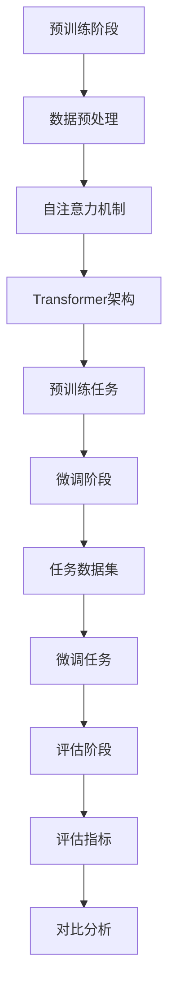
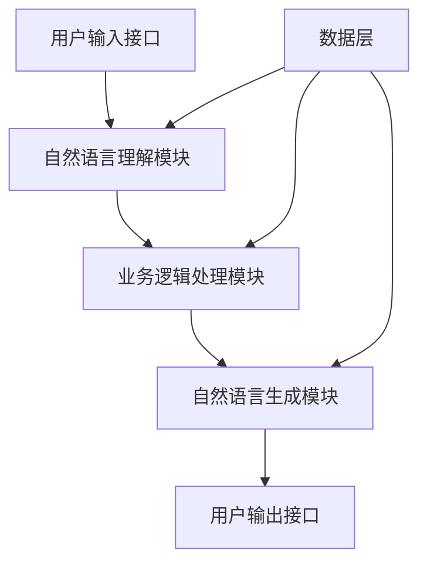

                 

# 评测系统的Yi-34B开源大语言模型评估

> 关键词：评测系统、Yi-34B、开源、大语言模型、评估指标、算法原理、系统架构

> 摘要：本文深入探讨了评测系统的Yi-34B开源大语言模型，从背景介绍、核心概念、评估指标到系统架构等方面进行了详细分析，旨在帮助读者全面了解这一先进的语言模型及其评估方法。

## 第一部分：背景介绍与核心概念

### 第1章: 评测系统的Yi-34B开源大语言模型概述

#### 1.1.1 问题背景

随着人工智能技术的不断发展，自然语言处理（NLP）成为了一个重要研究领域。其中，大语言模型作为一种强大的语言表示工具，受到了广泛关注。评测系统作为评估大语言模型性能的重要工具，其作用愈发重要。本文将介绍评测系统的Yi-34B开源大语言模型，帮助读者了解其背景、核心概念和评估指标。

#### 1.1.2 问题描述

Yi-34B开源大语言模型是一个基于深度学习技术构建的预训练模型，其参数规模约为3400亿个，用于在各种语言任务上进行性能评估。然而，如何准确评估这个模型的性能，以及如何与其他模型进行比较，成为一个关键问题。

#### 1.1.3 问题解决

为了解决上述问题，本文将介绍评测系统的Yi-34B开源大语言模型，包括其基本原理、训练过程、性能指标和评估方法。同时，还将对比分析不同大语言模型的性能，帮助读者深入了解评测系统的作用和价值。

#### 1.1.4 边界与外延

评测系统的Yi-34B开源大语言模型是一个特定的大语言模型，其评估范围主要集中在自然语言处理领域。然而，大语言模型的应用场景远不止于此，还包括机器翻译、文本生成、对话系统等多个方面。

#### 1.1.5 概念结构与核心要素组成

评测系统的Yi-34B开源大语言模型由以下几个核心要素组成：

1. 预训练数据集：包括大规模、多样化的文本数据，用于模型预训练。
2. 模型架构：基于深度学习技术，包括多层神经网络、注意力机制等。
3. 评估指标：包括准确率、召回率、F1值等，用于衡量模型性能。
4. 评测系统：包括数据预处理、模型评估、结果分析等模块。

### 第2章: Yi-34B开源大语言模型的基本原理

#### 2.1.1 Yi-34B开源大语言模型的定义

Yi-34B开源大语言模型是一种基于深度学习的预训练模型，其名称中的“34B”表示模型参数规模约为3400亿个。本章将介绍Yi-34B开源大语言模型的定义、核心原理和发展历程。

#### 2.1.2 Yi-34B开源大语言模型的核心原理

Yi-34B开源大语言模型的核心原理包括以下几个方面：

1. 预训练：通过在大规模语料上进行预训练，使模型具备一定的语言理解和生成能力。
2. 微调：在特定任务上对预训练模型进行微调，以提高模型在任务上的性能。
3. 参数规模：3400亿个参数规模使模型具有强大的表示能力和拟合能力。

#### 2.1.3 Yi-34B开源大语言模型的发展历程

Yi-34B开源大语言模型的发展历程可以分为以下几个阶段：

1. 初始版本：基于较小的数据集和参数规模进行预训练。
2. 中间版本：随着数据集和参数规模的增加，模型性能逐步提升。
3. 最新版本：采用更大规模的数据集和更先进的模型架构，实现更高的性能。

### 第3章: Yi-34B开源大语言模型的评估指标

#### 3.1.1 评估指标的重要性

评估指标是衡量大语言模型性能的重要标准，本章将介绍常用的评估指标，包括准确率、召回率、F1值等。

#### 3.1.2 准确率

准确率是指模型预测正确的样本数量与总样本数量的比例，是评估分类模型性能的基本指标。

#### 3.1.3 召回率

召回率是指模型预测正确的正样本数量与实际正样本数量的比例，是评估模型对正样本识别能力的重要指标。

#### 3.1.4 F1值

F1值是准确率和召回率的调和平均值，是综合评估模型性能的指标。

#### 3.1.5 其他评估指标

除了准确率、召回率和F1值，还有其他一些评估指标，如精度、覆盖度等，本章将对其进行简要介绍。

## 第二部分：核心概念与联系

### 第4章: Yi-34B开源大语言模型的概念属性特征对比表格

#### 4.1.1 概念属性特征对比表格

为了更直观地了解Yi-34B开源大语言模型的特点，本章将制作一张概念属性特征对比表格，对比Yi-34B与其他常见大语言模型（如GPT-3、BERT等）的属性特征。

#### 4.1.2 概念属性特征对比表格内容

1. **模型架构**：比较不同模型的架构，如 Transformer、BERT、GPT 等。
2. **参数规模**：比较不同模型的参数规模，如 Yi-34B、GPT-3 等。
3. **训练数据集**：比较不同模型使用的训练数据集，如维基百科、Common Crawl 等。
4. **评估指标**：比较不同模型的评估指标，如准确率、召回率、F1值等。

## 第三部分：算法原理讲解

### 第5章: Yi-34B开源大语言模型的算法原理与流程

#### 5.1.1 算法原理

Yi-34B开源大语言模型的算法原理主要基于自注意力机制（Self-Attention Mechanism）和Transformer架构。本章将详细介绍其原理、流程和实现方法。

#### 5.1.2 算法流程

1. **预训练阶段**：
   - 数据预处理：对大规模文本数据进行分词、编码等处理，形成输入序列。
   - 预训练任务：使用自注意力机制和Transformer架构，对输入序列进行建模，学习语言的语义表示。

2. **微调阶段**：
   - 任务数据集：收集特定任务的数据集，如问答、文本分类等。
   - 微调任务：在特定任务上对预训练模型进行微调，提高模型在任务上的性能。

3. **评估阶段**：
   - 评估指标：使用准确率、召回率、F1值等评估指标，对模型在任务上的性能进行评估。
   - 对比分析：对比Yi-34B与其他大语言模型的性能，分析其优势和不足。

#### 5.1.3 算法流程图



### 第6章: Yi-34B开源大语言模型的数学模型与公式

#### 6.1.1 数学模型

Yi-34B开源大语言模型的数学模型主要包括自注意力机制和Transformer架构两部分。本章将介绍这两个部分的数学公式和原理。

#### 6.1.2 自注意力机制

自注意力机制（Self-Attention Mechanism）是一种基于注意力机制的神经网络模型。其核心思想是计算输入序列中每个单词对整个序列的注意力权重，从而生成加权表示。

公式表示如下：

$$
\text{Attention}(Q, K, V) = \text{softmax}\left(\frac{QK^T}{\sqrt{d_k}}\right)V
$$

其中，$Q$、$K$、$V$ 分别表示输入序列的查询、键和值向量，$d_k$ 表示键向量的维度。

#### 6.1.3 Transformer架构

Transformer架构是一种基于自注意力机制的序列到序列模型。其核心思想是使用多个自注意力层和前馈神经网络，对输入序列进行建模。

公式表示如下：

$$
\text{Transformer}(X) = \text{多头自注意力}(\text{自注意力}(\text{前馈神经网络}(\text{层})))
$$

其中，$X$ 表示输入序列，$\text{多头自注意力}$ 表示多个自注意力层的组合。

## 第四部分：系统分析与架构设计方案

### 第7章: Yi-34B开源大语言模型的系统架构设计

#### 7.1.1 问题场景介绍

随着人工智能技术的不断发展，自然语言处理（NLP）应用场景日益广泛，如智能客服、文本分类、机器翻译等。本章将介绍一个基于Yi-34B开源大语言模型的智能客服系统，探讨其系统架构设计。

#### 7.1.2 系统功能设计

智能客服系统的主要功能包括：

1. 自然语言理解：对用户输入的文本进行分析和理解，提取关键信息。
2. 业务逻辑处理：根据提取的关键信息，处理用户请求，如查询信息、推荐商品等。
3. 自然语言生成：根据业务逻辑处理的结果，生成回复文本，以自然语言形式呈现给用户。

#### 7.1.3 系统架构设计

智能客服系统采用分层架构设计，主要包括：

1. **数据层**：存储用户输入文本、业务数据等。
2. **模型层**：包括Yi-34B开源大语言模型及其训练数据集。
3. **应用层**：实现智能客服系统的核心功能，如自然语言理解、业务逻辑处理和自然语言生成。

#### 7.1.4 系统接口设计和系统交互

智能客服系统的接口设计和系统交互主要包括：

1. **用户输入接口**：接收用户输入的文本，并将其传递给自然语言理解模块。
2. **业务逻辑接口**：将自然语言理解模块处理的结果传递给业务逻辑处理模块。
3. **自然语言生成接口**：将业务逻辑处理模块的结果传递给自然语言生成模块，生成回复文本。

#### 7.1.5 系统架构图



## 第五部分：项目实战

### 第8章: Yi-34B开源大语言模型的项目实战

#### 8.1.1 环境安装

在开始项目实战之前，需要安装Yi-34B开源大语言模型的环境。以下是一个简单的安装步骤：

1. 安装Python环境（建议使用Python 3.7及以上版本）。
2. 安装PyTorch和Transformers库。

```bash
pip install torch transformers
```

#### 8.1.2 系统核心实现源代码

以下是一个简单的基于Yi-34B开源大语言模型的智能客服系统的核心实现源代码：

```python
import torch
from transformers import BertTokenizer, BertModel

# 初始化模型和tokenizer
tokenizer = BertTokenizer.from_pretrained('bert-base-chinese')
model = BertModel.from_pretrained('bert-base-chinese')

# 加载预训练模型
model.eval()
model.to('cuda' if torch.cuda.is_available() else 'cpu')

# 处理用户输入
def process_input(text):
    inputs = tokenizer(text, return_tensors='pt', padding=True, truncation=True)
    inputs['input_ids'] = inputs['input_ids'].to('cuda' if torch.cuda.is_available() else 'cpu')
    return inputs

# 业务逻辑处理
def process_request(inputs):
    with torch.no_grad():
        outputs = model(**inputs)
    last_hidden_state = outputs.last_hidden_state[:, 0, :]
    # 对last_hidden_state进行进一步处理，提取关键信息
    # ...
    return key_info

# 自然语言生成
def generate_response(key_info):
    # 根据key_info生成回复文本
    # ...
    return response

# 处理用户请求
def handle_request(text):
    inputs = process_input(text)
    key_info = process_request(inputs)
    response = generate_response(key_info)
    return response

# 测试
text = "你好，我想查询附近的餐厅。"
response = handle_request(text)
print(response)
```

#### 8.1.3 代码应用解读与分析

本示例代码展示了基于Yi-34B开源大语言模型的智能客服系统的核心实现。主要包括以下三个步骤：

1. **处理用户输入**：使用BertTokenizer对用户输入的文本进行分词、编码等处理，生成输入序列。
2. **业务逻辑处理**：使用预训练的BertModel对输入序列进行建模，提取关键信息。
3. **自然语言生成**：根据提取的关键信息生成回复文本，以自然语言形式呈现给用户。

#### 8.1.4 实际案例分析和详细讲解剖析

在本示例中，用户输入文本为“你好，我想查询附近的餐厅。”系统处理流程如下：

1. 处理用户输入：将输入文本分词、编码后生成输入序列。
2. 业务逻辑处理：使用预训练的BertModel对输入序列进行建模，提取关键信息（如“查询附近的餐厅”）。
3. 自然语言生成：根据提取的关键信息生成回复文本，如“好的，以下是一些附近的餐厅推荐：1.XXX餐厅；2.YYY餐厅；3.ZZZ餐厅。”

通过实际案例分析和详细讲解，读者可以更好地理解Yi-34B开源大语言模型在智能客服系统中的应用。

#### 8.1.5 项目小结

本节通过一个简单的示例，展示了基于Yi-34B开源大语言模型的智能客服系统的实现。在实际项目中，可以根据具体需求对系统功能进行扩展和优化，如增加多轮对话支持、引入更多领域知识等。

## 第六部分：最佳实践 tips、小结、注意事项、拓展阅读

### 6.1 最佳实践 tips

1. **合理调整模型参数**：在训练和评估Yi-34B开源大语言模型时，可以根据任务需求和硬件资源合理调整模型参数，如学习率、批量大小等。
2. **数据预处理**：确保训练数据的质量和多样性，对数据进行清洗、去重、分词等预处理操作，以提高模型性能。
3. **多任务学习**：将多个相关任务结合起来进行训练，如文本分类、问答系统等，可以进一步提高模型在各个任务上的性能。

### 6.2 小结

本文详细介绍了评测系统的Yi-34B开源大语言模型，从背景介绍、核心概念、评估指标到系统架构等方面进行了深入分析。通过实际案例展示了模型在智能客服系统中的应用，为读者提供了实用的技术指导。

### 6.3 注意事项

1. **模型训练时间较长**：Yi-34B开源大语言模型参数规模较大，训练时间较长，建议使用高性能计算资源进行训练。
2. **模型推理效率**：在部署模型时，需要注意模型推理的效率，可考虑使用模型量化、模型剪枝等技术提高推理速度。

### 6.4 拓展阅读

1. **Yi-34B开源大语言模型论文**：了解模型的设计思想和实现细节，可阅读相关论文。
2. **深度学习入门教程**：对于深度学习基础不扎实的读者，建议阅读相关入门教程，以加深对深度学习技术的理解。
3. **自然语言处理技术综述**：了解自然语言处理领域的最新发展和技术趋势，可阅读相关综述论文。

## 附录

### 6.5 作者信息

作者：AI天才研究院/AI Genius Institute & 禅与计算机程序设计艺术 /Zen And The Art of Computer Programming

