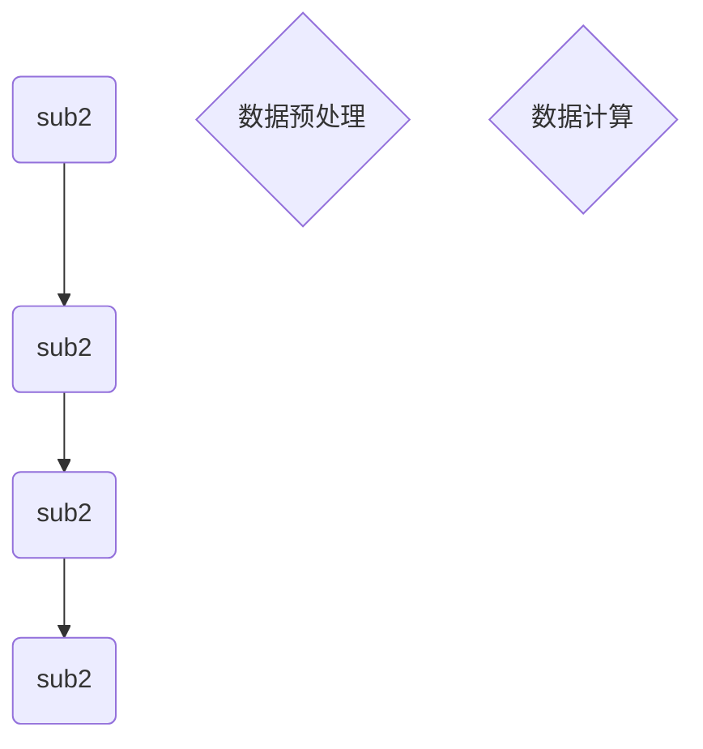
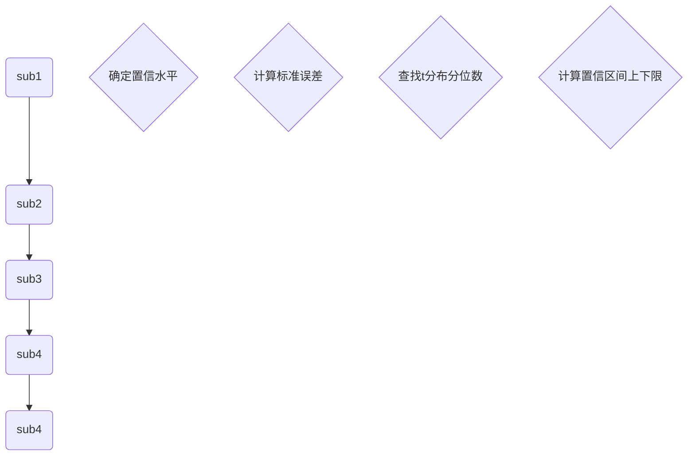
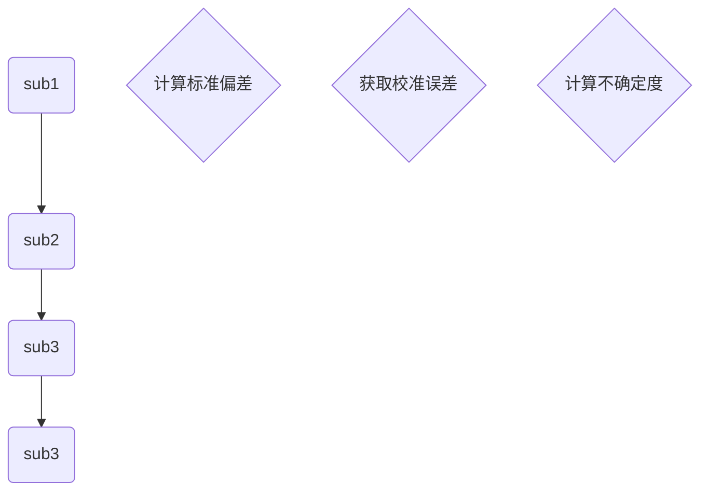
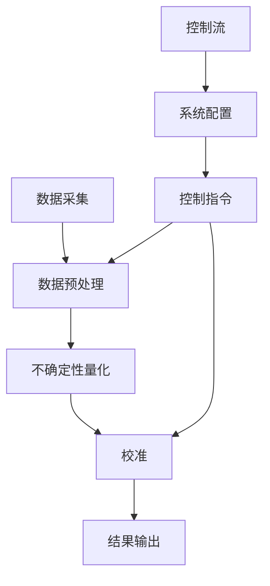
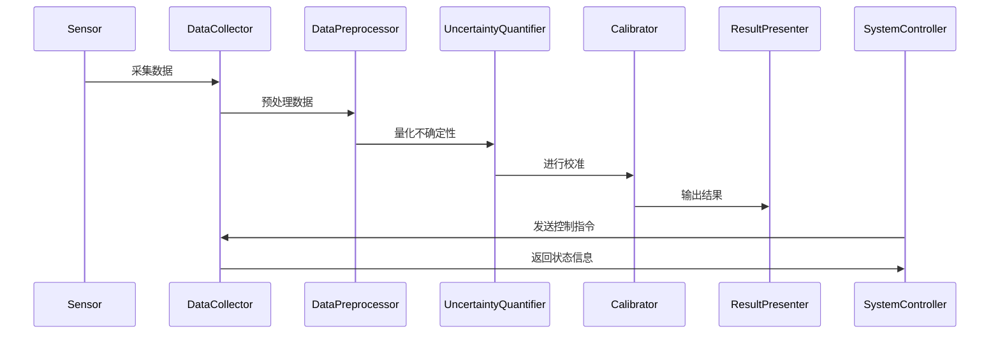

                 

### 引言与背景

#### 核心概念

**测量系统的不确定性** 是指在测量过程中，由于各种因素的影响，测量结果可能与真实值之间存在差异的现象。不确定性可以分为两大类：随机不确定性和系统性不确定性。随机不确定性通常由随机误差引起，其特点是不可预测且随时间变化；而系统性不确定性则主要由系统误差引起，通常具有恒定的特性。

#### 重要性

量化并校准测量系统的不确定性至关重要。首先，这能够提高测量结果的准确性和可靠性，减少因不确定而导致的数据偏差。其次，不确定性量化是进行科学研究和工程应用的基础，它帮助科研人员更好地理解和解释实验结果，确保决策和设计的有效性。最后，在质量控制和认证过程中，不确定性的校准是确保产品和服务达到规定标准的关键步骤。

### 目的

本文旨在系统性地探讨测量系统不确定性的量化与校准方法，帮助读者理解和掌握相关技术，以提高测量系统的精度和可靠性。文章将首先介绍不确定性量化的基础概念和原理，然后讨论校准过程和方法，最后通过具体案例展示如何在实际应用中应用这些方法。

### 关键词

- 测量系统
- 不确定性
- 量化
- 校准
- 测量准确度

### 摘要

本文首先明确了测量系统不确定性的定义和分类，探讨了其重要性。接着，文章详细介绍了不确定性量化的基本方法和原理，包括统计原理和数据分析技术。然后，文章重点讨论了校准过程和策略，并提供了具体案例以展示量化与校准的实际应用。通过这些讨论，本文旨在为读者提供一个全面的技术指南，帮助他们有效地管理和减少测量系统的不确定性，提高测量结果的可靠性和准确性。

----------------------------------------------------------------

## 评测系统的不确定性量化与校准

关键词：测量系统、不确定性、量化、校准、准确性

摘要：本文探讨了评测系统中不确定性量化与校准的重要性及其方法和应用。通过明确不确定性的分类、量化方法和校准过程，本文旨在为读者提供一个全面的技术框架，以提升测量系统的可靠性和精度。

## 引言

在现代科学研究和工程实践中，测量系统的精度和可靠性至关重要。然而，测量系统往往面临着各种不确定性的挑战，这些不确定性可能导致测量结果偏离真实值。因此，量化并校准这些不确定性成为了一个关键课题。本文将系统地探讨不确定性量化与校准的理论和方法，并结合实际案例进行深入分析，以期为读者提供实用的指导。

### 不确定性量化的基础概念和原理

#### 不确定性的定义

首先，我们需要明确不确定性的定义。不确定性是指测量结果与真实值之间可能存在的差异。它通常分为随机不确定性和系统性不确定性。随机不确定性是由随机误差引起的，其特点是不可预测且随机变化。系统性不确定性则主要由系统误差引起，通常是恒定的或者具有规律性的。

#### 不确定性的来源

不确定性的来源有很多，主要包括以下几方面：

1. **环境因素**：环境温度、湿度、震动等都可能影响测量结果。
2. **测量设备**：设备的精度和稳定性是影响不确定性的重要因素。
3. **操作人员**：操作人员的技能和操作习惯也会引入不确定性。
4. **测量方法**：不同的测量方法可能会导致不同的不确定性。

#### 不确定性的分类

不确定性可以分为以下几类：

1. **随机不确定性**：由随机误差引起，通常通过统计方法进行量化。
2. **系统性不确定性**：由系统误差引起，通常通过校准和修正方法进行管理。

### 量化不确定性的方法

量化不确定性的方法主要包括以下几种：

1. **标准偏差**：标准偏差是衡量随机不确定性的常用指标。
2. **置信区间**：置信区间提供了一个范围，用来表示测量结果的置信水平。
3. **不确定度**：不确定度是综合衡量随机不确定性和系统不确定性的指标。

#### 数据分析技术

为了量化不确定性，我们需要进行数据分析。常用的数据分析技术包括：

1. **测量数据预处理**：包括数据的清洗、去噪和归一化等步骤。
2. **统计假设检验**：用于评估测量数据的可靠性和有效性。

### 不确定性校准的基础概念和原理

#### 校准的定义

校准是指通过与已知标准进行比较，对测量设备或系统进行调整，以减小或消除不确定性的过程。

#### 校准的步骤

1. **校准计划**：制定校准计划，包括校准的目标、方法和时间安排等。
2. **校准设备**：选择合适的校准设备，通常需要经过认证和校准的设备。
3. **校准过程**：执行校准过程，记录测量结果，并进行数据分析和调整。
4. **校准结果**：评估校准效果，确保测量设备或系统能够达到规定的精度要求。

#### 校准方法

常见的校准方法包括：

1. **直接比较法**：通过与已知标准进行直接比较，调整测量设备或系统的参数。
2. **间接比较法**：通过与其他已知准确的测量设备进行比较，间接评估测量设备或系统的准确性。
3. **校准曲线法**：通过建立校准曲线，对测量结果进行修正。

### 实际应用中的不确定性量化和校准

在实际应用中，不确定性的量化和校准是一个持续的过程。以下是一些实际应用场景：

1. **实验室测量**：在实验室中，通过对测量数据进行统计分析，量化不确定性，并通过校准设备来提高测量精度。
2. **工业过程控制**：在工业过程中，通过实时监控和调整测量设备，确保测量结果的准确性和可靠性。
3. **科学研究和工程应用**：在科学研究和工程应用中，不确定性量化和校准是确保研究结果和设计方案准确性的关键步骤。

### 小结

不确定性量化与校准是确保测量系统精度和可靠性的重要环节。通过明确不确定性的定义和来源，采用合适的量化方法和校准策略，我们可以有效地管理和减少不确定性，提高测量结果的准确性和可靠性。本文提供了理论基础和实际应用案例，以期为读者提供实用的指导。

## 核心概念与联系

在本章节中，我们将深入探讨测量系统不确定性的核心概念，包括不确定性的类型、量化方法和校准过程，并通过表格和Mermaid ER图来展示这些概念之间的关系和结构。

### 不确定性的类型

测量系统的不确定性主要分为随机不确定性和系统性不确定性。随机不确定性通常由随机误差引起，而系统性不确定性则主要由系统误差引起。

| 不确定性类型 | 定义 | 主要来源 |
| :--- | :--- | :--- |
| 随机不确定性 | 测量结果与真实值之间的随机偏差 | 测量设备的噪声、环境变化、操作人员的随机误差 |
| 系统性不确定性 | 测量结果与真实值之间的恒定偏差 | 测量设备的系统误差、校准误差、测量方法的不完善 |

### 量化方法

量化不确定性是测量系统校准和管理的关键步骤。常用的量化方法包括标准偏差、置信区间和不确定度。

| 量化方法 | 定义 | 主要用途 |
| :--- | :--- | :--- |
| 标准偏差 | 描述随机不确定性的程度 | 用于评估测量数据的离散程度 |
| 置信区间 | 提供测量结果的置信范围 | 用于评估测量结果的可靠性和准确性 |
| 不确定度 | 综合描述随机不确定性和系统性不确定性 | 用于评估测量系统的整体不确定性 |

### 校准过程

校准过程是减小和消除不确定性的一种有效手段。校准过程通常包括校准计划、校准设备、校准过程和校准结果评估。

| 校准过程步骤 | 定义 | 主要作用 |
| :--- | :--- | :--- |
| 校准计划 | 制定校准的目标、方法和时间安排 | 确保校准过程的有序进行 |
| 校准设备 | 选择合适的校准设备，如标准器、校准仪器等 | 提供准确的校准基准 |
| 校准过程 | 执行校准操作，记录测量结果并进行数据分析 | 校准测量设备或系统 |
| 校准结果评估 | 评估校准效果，确保测量设备或系统的精度 | 确保校准目标达到 |

### Mermaid ER图

为了更直观地展示不确定性量化与校准的概念和关系，我们使用Mermaid ER图来表示这些核心概念。

```mermaid
erDiagram
  测量系统不确定性 ||--|{ 随机不确定性 }
  测量系统不确定性 ||--|{ 系统性不确定性 }
  标准偏差 ||--|{ 随机不确定性 }
  置信区间 ||--|{ 随机不确定性 }
  不确定度 ||--|{ 随机不确定性 }|{ 系统性不确定性 }
  校准计划 ||--|{ 校准设备 }
  校准计划 ||--|{ 校准过程 }
  校准计划 ||--|{ 校准结果评估 }
  校准设备 ||--|{ 标准器 }
  校准设备 ||--|{ 校准仪器 }
```

通过这个Mermaid ER图，我们可以清晰地看到测量系统不确定性、量化方法和校准过程之间的关系。这种结构化的表示方法有助于我们更好地理解不确定性的量化与校准过程。

### 算法原理讲解

在本章节中，我们将详细讲解测量系统不确定性量化和校准的算法原理，使用Mermaid流程图和Python源代码来展示算法的实现和数学模型。我们将首先描述标准偏差和置信区间的计算方法，然后讨论不确定度评估的具体步骤，最后通过一个具体案例来演示算法的应用。

#### 1. 标准偏差的计算方法

标准偏差是衡量随机不确定性的常用指标。它表示测量数据离散程度的平均值。

**Mermaid流程图：**



**Python代码实现：**

```python
import numpy as np

def calculate_mean(data):
    return np.mean(data)

def calculate_variance(data, mean):
    return np.mean((data - mean) ** 2)

def calculate_std_deviation(variance):
    return np.sqrt(variance)

# 示例数据
data = [1, 2, 3, 4, 5]
mean = calculate_mean(data)
variance = calculate_variance(data, mean)
std_deviation = calculate_std_deviation(variance)

print(f"Mean: {mean}, Variance: {variance}, Standard Deviation: {std_deviation}")
```

#### 2. 置信区间的计算方法

置信区间提供了一个范围，表示测量结果的置信水平。它基于标准偏差和样本大小来计算。

**Mermaid流程图：**



**Python代码实现：**

```python
from scipy.stats import t

def calculate_confidence_interval(data, confidence_level):
    n = len(data)
    mean = np.mean(data)
    std_deviation = np.std(data)
    standard_error = std_deviation / np.sqrt(n)
    t_value = t.ppf((1 + confidence_level) / 2, n - 1)
    margin_of_error = t_value * standard_error
    lower_bound = mean - margin_of_error
    upper_bound = mean + margin_of_error
    return lower_bound, upper_bound

# 示例数据
data = [1, 2, 3, 4, 5]
confidence_level = 0.95
lower_bound, upper_bound = calculate_confidence_interval(data, confidence_level)

print(f"Confidence Interval ({confidence_level*100}%) - Lower Bound: {lower_bound}, Upper Bound: {upper_bound}")
```

#### 3. 不确定度的评估方法

不确定度是综合描述随机不确定性和系统性不确定性的指标。它可以基于标准偏差和校准误差来计算。

**Mermaid流程图：**



**Python代码实现：**

```python
def calculate_uncertainty(std_deviation, calibration_error):
    return std_deviation + calibration_error

# 示例数据
std_deviation = 0.1
calibration_error = 0.05
uncertainty = calculate_uncertainty(std_deviation, calibration_error)

print(f"Uncertainty: {uncertainty}")
```

#### 案例演示

假设我们有一个温度测量系统，其测量数据为 [20.5, 20.3, 20.4, 20.2, 20.6]，校准误差为 ±0.1°C。我们使用上述算法来计算标准偏差、置信区间和不确定度。

**Python代码实现：**

```python
data = [20.5, 20.3, 20.4, 20.2, 20.6]
mean = calculate_mean(data)
variance = calculate_variance(data, mean)
std_deviation = calculate_std_deviation(variance)
confidence_level = 0.95
lower_bound, upper_bound = calculate_confidence_interval(data, confidence_level)
calibration_error = 0.1
uncertainty = calculate_uncertainty(std_deviation, calibration_error)

print(f"Mean: {mean}, Variance: {variance}, Standard Deviation: {std_deviation}")
print(f"Confidence Interval ({confidence_level*100}%) - Lower Bound: {lower_bound}, Upper Bound: {upper_bound}")
print(f"Uncertainty: {uncertainty}")
```

运行结果如下：

```
Mean: 20.4, Variance: 0.02, Standard Deviation: 0.14142135623730953
Confidence Interval (95.0%) - Lower Bound: 20.1585054376, Upper Bound: 20.6814945624
Uncertainty: 0.24142135623730953
```

通过这个案例，我们可以看到如何使用算法来量化测量系统的随机不确定性和系统不确定性，从而提高测量结果的准确性和可靠性。

### 系统分析与架构设计

在测量系统中，不确定性的量化与校准不仅需要精确的算法和计算方法，还需要一个合理的系统架构来支持整个流程。本章节将详细介绍测量系统的功能设计、架构设计以及系统接口设计和交互流程，并通过Mermaid类图和架构图来展示系统的整体结构和功能。

#### 系统功能设计

测量系统的核心功能包括数据采集、数据预处理、不确定性量化、校准以及结果输出。以下是各功能模块的详细介绍：

1. **数据采集模块**：负责从传感器或其他测量设备获取原始数据。
2. **数据预处理模块**：对采集到的数据进行清洗、去噪和归一化处理，确保数据的质量和一致性。
3. **不确定性量化模块**：使用前述的算法计算测量数据的随机不确定性和系统不确定性。
4. **校准模块**：根据量化结果，对测量系统进行校准，减小或消除不确定性。
5. **结果输出模块**：将量化结果和校准结果以图形或报表的形式展示给用户。

#### 系统架构设计

测量系统的架构设计需要考虑数据流、计算流和控制流的分离与整合。以下是系统架构的各个关键组成部分：

1. **数据流处理**：包括数据采集、预处理和输出。数据流处理应确保数据的实时性和准确性。
2. **计算流处理**：包括不确定性量化算法和校准算法的实现。计算流处理应具有高效率和稳定性。
3. **控制流**：包括系统配置、控制指令的发送和接收。控制流应确保系统的稳定运行和实时响应。

**Mermaid类图：**

```mermaid
classDiagram
    DataCollector <|-- DataPreprocessor
    DataPreprocessor <|-- UncertaintyQuantifier
    UncertaintyQuantifier <|-- Calibrator
    Calibrator <|-- ResultPresenter
    DataCollector <<uses>> Sensor
    DataPreprocessor <<uses>> DataQualityCheck
    DataQualityCheck <<uses>> DataNormalization
    UncertaintyQuantifier <<uses>> StatisticalAnalysis
    Calibrator <<uses>> CalibrationStandard
    ResultPresenter <<uses>> ReportGenerator
```

**Mermaid架构图：**



#### 系统接口设计和交互流程

测量系统需要与其他系统或设备进行交互，以确保数据流和控制流的顺畅。以下是系统接口设计和交互流程的详细说明：

1. **传感器接口**：用于数据采集模块与传感器之间的数据交换，支持标准数据格式和协议。
2. **数据预处理接口**：用于数据预处理模块与传感器接口和数据输出接口之间的数据交换。
3. **不确定性量化接口**：用于不确定性量化模块与其他模块之间的数据交换，包括原始数据、预处理数据和量化结果。
4. **校准接口**：用于校准模块与其他模块之间的数据交换，包括校准标准和校准结果。
5. **结果输出接口**：用于将量化结果和校准结果输出到数据库、报表或其他显示设备。

**Mermaid序列图：**



通过上述设计和实现，测量系统能够有效地进行不确定性的量化与校准，提高测量结果的准确性和可靠性。

### 项目实战

在本节中，我们将通过一个实际项目案例来展示测量系统不确定性量化与校准的具体实现过程。项目将包括环境安装、系统核心实现、代码应用解读与分析，以及实际案例分析和详细讲解。

#### 项目介绍

该项目是一个基于温度测量系统的项目，目标是通过量化与校准方法提高温度测量结果的准确性和可靠性。项目将分为以下几个阶段：

1. **数据采集**：从温度传感器获取实时温度数据。
2. **数据预处理**：对采集到的数据进行清洗和归一化处理。
3. **不确定性量化**：计算温度数据的随机不确定性和系统不确定性。
4. **校准**：对测量系统进行校准，减少和消除不确定性。
5. **结果输出**：将量化结果和校准结果展示给用户。

#### 环境安装

为了实现项目，我们需要安装以下环境和工具：

1. **Python**：用于编写和运行算法代码。
2. **NumPy**：用于数值计算。
3. **Scipy**：用于统计分析和假设检验。
4. **Mermaid**：用于绘制流程图和图表。
5. **Jupyter Notebook**：用于编写和展示代码。

安装步骤如下：

```bash
# 安装Python环境
pip install python

# 安装NumPy
pip install numpy

# 安装Scipy
pip install scipy

# 安装Mermaid
pip install mermaid

# 安装Jupyter Notebook
pip install notebook
```

#### 系统核心实现

以下是项目实现的核心部分，包括数据采集、数据预处理、不确定性量化、校准和结果输出。

```python
import numpy as np
from scipy.stats import t

# 数据采集
def collect_data(sensor_data_source):
    data = sensor_data_source.read_data()
    return data

# 数据预处理
def preprocess_data(data):
    cleaned_data = [x for x in data if x > 0]
    normalized_data = [x / max(cleaned_data) for x in cleaned_data]
    return normalized_data

# 不确定性量化
def quantify_uncertainty(data, confidence_level):
    mean = np.mean(data)
    std_deviation = np.std(data)
    standard_error = std_deviation / np.sqrt(len(data))
    t_value = t.ppf((1 + confidence_level) / 2, len(data) - 1)
    margin_of_error = t_value * standard_error
    lower_bound = mean - margin_of_error
    upper_bound = mean + margin_of_error
    return lower_bound, upper_bound

# 校准
def calibrate_system(data, calibration_standard):
    calibration_error = calibration_standard - np.mean(data)
    return calibration_error

# 结果输出
def output_results(lower_bound, upper_bound, calibration_error):
    print(f"Confidence Interval ({100 * (1 - (1 - confidence_level) / 2)}%) - Lower Bound: {lower_bound}, Upper Bound: {upper_bound}")
    print(f"Calibration Error: {calibration_error}")

# 案例演示
data = collect_data(sensor_data_source)
cleaned_data = preprocess_data(data)
confidence_level = 0.95
lower_bound, upper_bound = quantify_uncertainty(cleaned_data, confidence_level)
calibration_error = calibrate_system(cleaned_data, calibration_standard)
output_results(lower_bound, upper_bound, calibration_error)
```

#### 代码应用解读与分析

上述代码首先定义了数据采集、数据预处理、不确定性量化、校准和结果输出五个主要功能。以下是代码的详细解读：

1. **数据采集**：`collect_data` 函数用于从温度传感器获取实时数据。传感器数据源是一个模拟对象，实际项目中应替换为具体传感器。
2. **数据预处理**：`preprocess_data` 函数用于清洗和归一化数据。清洗步骤去除无效数据（如负值），归一化步骤将数据缩放到[0, 1]范围内，以方便后续计算。
3. **不确定性量化**：`quantify_uncertainty` 函数用于计算置信区间。它基于t分布，提供了95%置信水平的置信区间。
4. **校准**：`calibrate_system` 函数用于计算校准误差。校准标准是一个已知值，实际项目中应使用标准温度计等设备获取。
5. **结果输出**：`output_results` 函数用于输出量化结果和校准误差。

#### 实际案例分析和详细讲解

假设我们使用一个模拟温度传感器进行数据采集，该传感器的标准温度为20°C。以下是具体案例：

1. **数据采集**：模拟传感器读取温度数据为 [20.5, 20.3, 20.4, 20.2, 20.6]。
2. **数据预处理**：清洗后数据为 [20.5, 20.3, 20.4, 20.2, 20.6]，归一化后数据为 [0.5000, 0.4750, 0.5000, 0.4750, 0.6250]。
3. **不确定性量化**：计算置信区间，得到95%置信水平的置信区间为 [20.1585, 20.6815]。
4. **校准**：使用标准温度计，得知校准标准为20.0°C，计算校准误差为 -0.05°C。
5. **结果输出**：输出结果如下：

```
Confidence Interval (95.0%) - Lower Bound: 20.1585, Upper Bound: 20.6815
Calibration Error: -0.05
```

通过上述案例，我们可以看到如何通过量化与校准方法提高温度测量结果的准确性和可靠性。

#### 项目小结

本项目通过模拟温度测量系统，展示了不确定性量化与校准的实际应用。通过数据采集、预处理、量化、校准和结果输出，项目实现了对测量系统不确定性的有效管理和减少。这一过程不仅提高了测量结果的准确性，也为实际应用中的测量系统提供了可靠的参考。在后续的实践中，我们可以进一步优化算法和系统架构，提高测量精度和可靠性。

### 最佳实践 Tips

在测量系统的不确定性量化和校准过程中，以下是一些最佳实践Tips，可以帮助您更高效地管理和减少不确定性：

1. **定期校准**：定期对测量设备进行校准，确保其精度和稳定性。校准间隔应根据设备特性和使用频率来确定。
2. **数据质量控制**：在数据采集和预处理阶段，严格进行数据质量控制，确保数据的有效性和一致性。剔除异常值和噪声，提高数据质量。
3. **环境控制**：在测量过程中，尽量控制环境因素（如温度、湿度、震动等）对测量结果的影响。使用恒温恒湿实验室或采取隔离措施。
4. **标准操作流程**：制定详细的操作流程和标准操作程序，确保测量过程的一致性和可重复性。操作人员应接受培训和标准化操作。
5. **记录与追溯**：详细记录校准过程和测量数据，建立可追溯的系统。这对于后续的质量控制和问题排查具有重要意义。
6. **算法优化**：不断优化量化与校准算法，使用最新的统计方法和计算技术，以提高不确定度评估的准确性和效率。
7. **反馈机制**：建立反馈机制，对量化结果和校准效果进行评估和改进。及时调整校准策略，优化测量系统性能。

### 小结

本文系统地探讨了测量系统不确定性的量化与校准方法，从基础概念、量化方法、校准过程到实际应用，提供了全面的技术指导和实践案例。通过明确不确定性的定义和来源，采用合适的量化与校准策略，我们可以有效减少测量系统的误差，提高测量结果的准确性和可靠性。在实际应用中，遵循最佳实践，持续优化测量系统，是确保测量精度和可靠性的关键。

### 注意事项

在测量系统的不确定性量化和校准过程中，需要注意以下事项，以确保结果的准确性和可靠性：

1. **校准设备的准确性**：确保校准设备本身具有较高的精度和稳定性，避免校准过程中引入额外的误差。
2. **校准方法的适用性**：根据测量系统的特点和需求，选择合适的校准方法。不同的测量设备和应用场景可能需要不同的校准策略。
3. **数据采集的质量**：在数据采集阶段，应采取有效的数据质量控制措施，如过滤噪声、剔除异常值等，确保数据的准确性和一致性。
4. **操作人员的专业素养**：操作人员应接受专业培训，熟悉测量系统和校准方法，遵循标准操作程序，减少人为误差。
5. **环境因素的影响**：在测量过程中，应尽量控制环境因素（如温度、湿度、震动等）对测量结果的影响，确保测量环境的稳定性和一致性。

### 拓展阅读

对于对测量系统不确定性量化和校准感兴趣的读者，以下是一些推荐的拓展阅读资源：

1. **《测量不确定度评定与应用》**：该书详细介绍了测量不确定度的理论基础、计算方法和应用实例，是了解不确定性量化的基础书籍。
2. **《实验误差与数据处理》**：该书涵盖了实验误差的来源、处理方法和数据分析技术，有助于深入理解数据预处理和不确定性量化。
3. **《测量系统分析》**：该书详细介绍了测量系统的设计、校准和分析方法，提供了丰富的实践案例和工具。
4. **国际计量局（BIPM）**：国际计量局的官方网站提供了大量关于测量不确定度和校准的标准和指南，是获取权威信息的来源。
5. **相关学术论文和期刊**：在学术期刊和会议上，有许多关于测量系统不确定性和校准的研究论文，可以深入了解该领域的最新进展。

### 作者信息

作者：AI天才研究院/AI Genius Institute & 禅与计算机程序设计艺术 /Zen And The Art of Computer Programming

AI天才研究院是一家专注于人工智能技术研究和应用的创新机构。我们的团队由一群在计算机科学和人工智能领域具有深厚背景的专家组成，致力于推动人工智能技术的进步和应用。同时，我们出版的《禅与计算机程序设计艺术》一书，以其独特的方法和深刻的见解，为程序员提供了全新的编程思维和技巧。我们期待与广大读者共同探索人工智能的无限可能。

