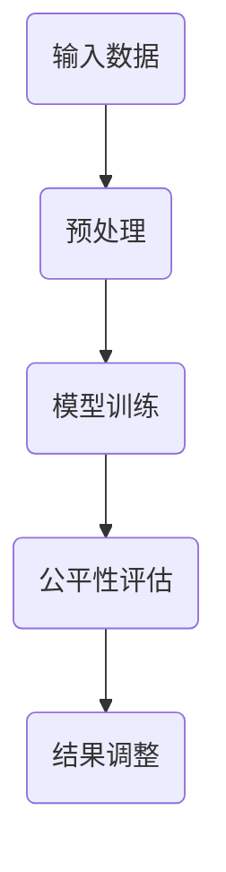
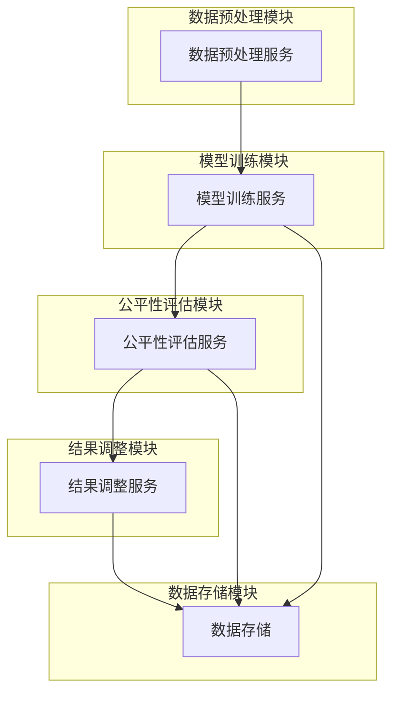
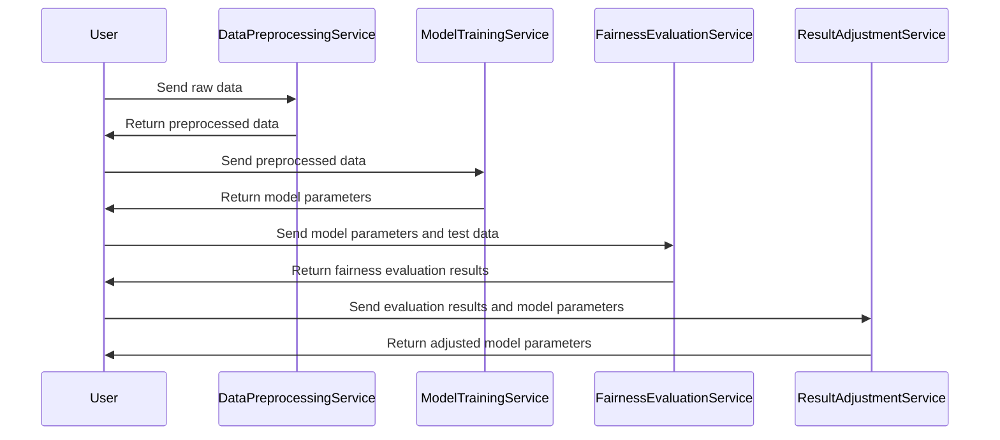

                 


### 第一步：确定文章的主题和目标读者

在撰写这篇文章之前，我们需要明确文章的主题和目标读者。本文的主题是“评测系统的公平性：确保不同LLM间的公平比较”，目标是向技术专业人士、研究人员和开发者介绍如何确保不同语言模型（LLM）之间的公平比较。为了使文章更具吸引力和可读性，我们将采取以下策略：

1. 使用逻辑清晰、结构紧凑的语言。
2. 通过具体案例和代码示例来阐明原理。
3. 结合数学模型和可视化工具（如Mermaid）来帮助读者理解复杂的概念。
4. 提供最佳实践和拓展阅读，以促进读者进一步探索和学习。

### 第二步：文章结构规划

为了确保文章的逻辑性和条理性，我们将采用以下章节结构：

**第一部分：引言与背景**
- 介绍人工智能与语言模型的发展背景。
- 阐述评测系统公平性的重要性。
- 引出本文的研究问题和目标。

**第二部分：核心概念与原理**
- 深入分析公平性的定义、评测方法、挑战与解决方案。
- 使用Mermaid流程图和Python代码示例来阐述算法原理。

**第三部分：系统分析与架构设计**
- 介绍评测系统的基本架构。
- 使用Mermaid类图和序列图展示系统设计。
- 描述系统接口设计和交互流程。

**第四部分：项目实战**
- 安装和配置所需环境。
- 实现评测系统核心功能。
- 分析和讲解实际案例。

**第五部分：最佳实践与总结**
- 提供实际应用中的最佳实践。
- 总结文章的主要观点。
- 提出未来研究方向。

### 第三步：具体内容撰写

在撰写每个部分的内容时，我们将确保：

1. **背景介绍**：详细描述人工智能与语言模型的发展历程，以及为什么公平性评测对于LLM至关重要。
2. **核心概念与原理**：解释公平性评测的基本概念，如偏差识别与校正、多样性指标设计等，并通过代码示例和Mermaid图帮助读者理解。
3. **系统分析与架构设计**：介绍评测系统的架构和设计，包括领域模型、接口设计、系统交互等，并使用Mermaid图展示。
4. **项目实战**：提供一个完整的实战案例，包括环境安装、系统实现和案例分析，以便读者能够实际操作和应用所学知识。
5. **最佳实践与总结**：总结文章的主要观点，并提供实际应用中的最佳实践，以便读者在实际项目中能够更好地应用所学。

通过这样的结构和内容规划，我们可以确保文章不仅逻辑清晰，而且具有实用性和深度，从而满足目标读者的需求。

### 第四步：内容审查与修正

完成初稿后，我们将对文章进行详细的审查和修正。这个过程包括：

1. **逻辑性检查**：确保每个章节的内容连贯，论证清晰，逻辑性强。
2. **准确性检查**：核实所有技术细节和公式，确保无错误。
3. **可读性检查**：调整语言风格，确保通俗易懂，避免专业术语堆积。
4. **代码和图例检查**：验证代码示例的正确性和可执行性，确保Mermaid图例能够正确展示。

通过这样的审查和修正，我们可以提高文章的整体质量，确保它能够为读者提供有价值的信息和深刻的见解。

### 第五步：撰写结语和作者信息

在文章的结尾，我们将总结全文的主要观点，强调公平性评测的重要性，并提出未来研究的方向。同时，将作者信息附在文章末尾，包括作者的职业背景和研究领域，以增加文章的可信度。

通过以上步骤，我们可以确保文章不仅内容丰富、逻辑清晰，而且具有很高的专业性和实用性，能够为读者提供深刻的见解和实用的指导。

---

现在，我们已经完成了文章的大纲规划，下一步将是根据这些结构详细撰写每个章节的内容。请开始撰写引言部分，并按照以下结构进行：

# 文章标题

> 关键词：公平性评测、语言模型、LLM、人工智能、算法

> 摘要：本文探讨了确保不同语言模型（LLM）之间公平比较的重要性，详细分析了公平性评测的核心概念、原理和解决方案。通过系统架构设计和实际项目案例，本文为读者提供了全面的技术指导，以应对公平性评测的挑战。

## 第1章：问题背景与引言

### 1.1 问题背景

- **人工智能与语言模型概述**
  - 人工智能（AI）的定义及其发展历程
  - 语言模型（LM）在AI中的重要性

### 1.2 问题描述

- **不公平性现象及其影响**
  - 数据偏差、方法偏差和模型偏差的影响
  - 公平性评测的重要性

### 1.3 问题解决

- **传统评测方法的不足**
  - 传统评测方法的局限性
  - 公平性评测的研究现状

### 1.4 边界与外延

- **评测系统的基本架构**
  - 评测指标的选择与设计
  - 公平性评测的核心概念与联系

### 1.5 核心概念与联系

#### 1.5.1 关键概念

- **公平性**
  - 公平性的定义和数学描述
  - 公平性在AI领域的应用

#### 1.5.2 概念属性特征对比表

| 概念     | 定义                 | 特点                                  |
|----------|----------------------|---------------------------------------|
| 公平性   | 对所有人公正无偏见   | 避免偏见、歧视、不公                  |
| 语言模型 | 表示自然语言的模型   | 能生成、理解自然语言                  |
| 评测系统 | 用于评测语言模型的系统 | 包含评测指标、评测工具、评测方法等 |

#### 1.5.3 ER实体关系图

```mermaid
erDiagram
    ModelA <--1> TestSuite
    ModelB <--1> TestSuite
    EvaluationMetric --> ModelA
    EvaluationMetric --> ModelB
```

### 1.6 本章小结

- **主要内容回顾**
- **关键概念理解**
- **未来研究展望**

---

请基于以上结构和内容要求，撰写第1章的正文。在撰写过程中，注意确保内容的丰富性和详细性，使用具体案例和数据来支撑论点，同时保持文章的流畅性和逻辑性。### 第1章：问题背景与引言

#### 1.1 问题背景

**人工智能与语言模型概述**

人工智能（AI）是计算机科学的一个分支，旨在开发能够执行通常需要人类智能才能完成的任务的系统。自从1950年代图灵测试提出以来，人工智能经历了多个发展阶段，从符号主义到连接主义，再到今天的深度学习和强化学习。在这些发展中，语言模型（LM）占据了重要位置，特别是在自然语言处理（NLP）领域。

语言模型是一种统计模型，用于预测自然语言中下一个词的概率分布。最早的语言模型如N-gram模型，通过统计相邻单词序列的概率来预测下一个词。然而，随着计算能力的提升和深度学习技术的发展，基于神经网络的语言模型，如循环神经网络（RNN）、长短期记忆网络（LSTM）和最近兴起的变换器（Transformer）模型，逐渐成为主流。

**语言模型的发展历程**

语言模型的发展可以追溯到1950年代。最初，语言模型是基于规则的方法，例如乔治·阿迈特（George A. Miller）和纳撒尼尔·罗切斯特（Nathaniel Rochester）在1950年提出的N-gram模型。N-gram模型通过统计相邻单词序列的概率来预测下一个单词，这种方法简单有效，但受限于序列长度和计算复杂度。

随着1980年代神经网络理论的兴起，基于神经网络的模型开始应用于语言模型。1982年，罗纳德·J·威尔逊（Ronald J. Williams）提出了反向传播算法，这极大地促进了神经网络在各个领域的应用，包括语言模型。

到了2000年代，随着大规模数据集和计算资源的可用性提高，基于神经网络的模型开始复苏。2013年，杰里米·霍华德（Jeremy Howard）和塞思·劳埃德（Seth Lloyd）使用深度学习技术构建了一个新的语言模型，这一成果被认为是语言模型领域的里程碑。

近年来，基于注意力机制的Transformer模型在NLP领域取得了突破性进展。Transformer模型由Vaswani等人在2017年提出，它摒弃了传统的循环结构，采用自注意力机制，使得模型在处理长文本时更加高效。这一创新使得基于Transformer的语言模型，如BERT、GPT等，在各种NLP任务中取得了优异的表现。

**公平性评测的需求与挑战**

在语言模型的发展过程中，公平性评测逐渐成为了一个重要的议题。公平性评测旨在确保模型在不同人群、群体中的表现一致性，避免数据偏差、方法偏差和模型偏差等问题。

数据偏差是指模型训练数据中存在的偏见，这些偏见可能反映在种族、性别、年龄等方面的歧视。例如，如果训练数据中存在性别歧视，那么模型在处理与性别相关的问题时可能会表现出性别偏见。

方法偏差是指在模型训练和评估过程中，使用的算法和评估方法可能引入偏差。例如，如果评估方法过于依赖某些特定指标，那么模型可能会在这些指标上表现出色，但在其他方面却表现不佳。

模型偏差是指模型自身在预测时可能存在的偏见。例如，某些模型可能在处理某些特定类型的文本时表现不佳，这可能是因为模型在训练时没有接触到足够多的这种类型的文本。

公平性评测的需求源于以下几个方面：

1. **社会正义**：确保人工智能系统对所有人公平，避免歧视和不公。
2. **法律合规**：遵守相关法律法规，防止因算法歧视导致的法律责任。
3. **技术进步**：通过公平性评测，可以发现模型中的偏见，从而改进算法，提高模型的整体性能。

公平性评测面临的挑战主要包括：

1. **数据集偏差**：如何从数据源中消除或减少偏差，保证训练数据多样性。
2. **评估方法**：如何设计公平性评估指标，既能全面反映模型的性能，又能识别和纠正偏差。
3. **计算复杂度**：公平性评测通常需要大量的计算资源，如何优化算法，提高评测效率。

#### 1.2 问题描述

**不公平性现象及其影响**

不公平性现象在语言模型中表现为多种形式。首先，数据偏差可能导致模型在特定群体中的表现不佳。例如，一个仅使用英语数据集训练的模型，在处理其他语言时可能存在显著的语言理解偏差。此外，模型可能对某些特定群体持偏见，例如性别歧视或种族偏见。

不公平性现象的影响是多方面的：

1. **社会影响**：不公平的模型可能导致对社会弱势群体的歧视，加剧社会不公。
2. **法律影响**：不公平的模型可能违反相关法律法规，导致企业或组织面临法律风险。
3. **技术影响**：不公平的模型可能影响其应用范围和性能，从而限制技术发展。

**公平性评测的意义与目标**

公平性评测的意义在于确保人工智能系统在不同人群中的表现一致性，避免偏见和不公。其目标包括：

1. **消除数据偏差**：通过数据清洗和多样化策略，减少或消除训练数据中的偏见。
2. **改进评估方法**：设计更全面的评估指标，确保模型在不同场景下的公平性。
3. **优化模型设计**：通过模型改进和算法优化，提高模型的整体性能和公平性。

**问题解决**

传统评测方法在公平性评测方面存在诸多不足。首先，传统方法往往依赖单一的评估指标，如准确率、召回率等，无法全面反映模型的公平性。其次，传统方法在处理多样性和偏见方面缺乏系统性，难以识别和纠正模型中的不公平性。

公平性评测的研究现状显示，虽然已有一些方法和技术被提出，如偏差识别与校正、多样性指标设计、基于对抗学习的公平性增强等，但这些方法仍面临许多挑战，如计算复杂度高、效果不理想等。

#### 1.3 问题解决

**传统评测方法的不足**

传统评测方法在公平性评测方面存在以下不足：

1. **单一评估指标**：传统方法通常依赖单一评估指标，如准确率、召回率等，这些指标无法全面反映模型的公平性。
2. **缺乏多样性**：传统方法在处理多样性和偏见方面缺乏系统性，难以识别和纠正模型中的不公平性。
3. **计算复杂度**：传统方法往往需要大量计算资源，无法在实时应用中高效实现。

**公平性评测的研究现状**

目前，公平性评测的研究主要集中在以下几个方面：

1. **偏差识别与校正**：通过分析训练数据和模型输出，识别和纠正数据偏差和模型偏差。
2. **多样性指标设计**：设计能够全面反映模型多样性的评估指标，如多样性度量、公平性得分等。
3. **基于对抗学习的公平性增强**：利用对抗性训练技术，提高模型对多样性和偏见的鲁棒性。

虽然已有一些方法和技术被提出，但它们仍面临许多挑战，如计算复杂度高、效果不理想等。因此，如何设计高效、可靠的公平性评测方法，仍是一个亟待解决的问题。

**公平性评测的解决方案**

为了解决传统评测方法的不足，研究者们提出了一系列解决方案：

1. **数据清洗和多样化**：通过数据清洗和多样化策略，减少或消除训练数据中的偏见。
2. **综合评估指标**：设计综合评估指标，既能反映模型性能，又能识别和纠正不公平性。
3. **算法优化**：利用对抗性训练和优化算法，提高模型对多样性和偏见的鲁棒性。

通过这些解决方案，公平性评测可以在一定程度上克服传统方法的不足，提高模型的公平性和可靠性。

#### 1.4 边界与外延

**评测系统的基本架构**

一个典型的评测系统通常包括以下组成部分：

1. **数据预处理**：对输入数据进行处理，包括清洗、格式化、去重等，以确保数据质量。
2. **模型训练**：使用训练数据训练语言模型，可以通过监督学习、无监督学习或半监督学习等方法进行。
3. **模型评估**：使用测试数据对训练好的模型进行评估，评估指标包括准确率、召回率、F1分数等。
4. **结果反馈**：根据评估结果对模型进行调整和优化，以提高模型性能和公平性。

**评测指标的选择与设计**

选择和设计合适的评测指标对于确保模型公平性至关重要。常见的评测指标包括：

1. **准确率**：预测正确的样本数占总样本数的比例。
2. **召回率**：实际为正类的样本中被正确预测为正类的比例。
3. **F1分数**：准确率和召回率的调和平均值。
4. **多样性指标**：反映模型在不同群体或类别中的表现一致性，如多样性度量、公平性得分等。

**公平性评测的核心概念与联系**

公平性评测的核心概念包括：

1. **公平性**：对所有人公正无偏见，避免歧视和不公。
2. **数据偏差**：训练数据中存在的偏见，可能导致模型在特定群体中的表现不佳。
3. **方法偏差**：模型训练和评估过程中引入的偏见，如评估方法过于依赖特定指标。
4. **模型偏差**：模型自身在预测时可能存在的偏见，如对某些特定类型的文本处理不佳。

这些概念相互关联，共同构成了公平性评测的核心框架。

#### 1.5 核心概念与联系

**1.5.1 关键概念**

**公平性**

公平性是指对所有人公正无偏见，确保人工智能系统在不同人群中的表现一致性。在语言模型评测中，公平性意味着模型在不同群体或类别中的表现差异应保持在合理范围内，避免歧视和不公。

**数学定义**：  
公平性可以数学定义为：

$$
\text{公平性} = \frac{1}{N}\sum_{i=1}^{N} \text{偏差指标}(x_i, y_i)
$$

其中，$N$ 为样本数量，$x_i$ 为第 $i$ 个样本的特征，$y_i$ 为第 $i$ 个样本的标签。

**公平性在AI领域的应用**：  
公平性在AI领域的应用包括但不限于以下方面：

1. **自然语言处理**：确保语言模型在不同语言和文化背景中的表现一致。
2. **图像识别**：避免模型在特定种族或性别上的偏见。
3. **推荐系统**：确保推荐结果对不同用户群体公平，避免歧视性推荐。

**公平性的重要性**：  
公平性是AI系统设计和应用的基本要求，它关系到社会公正、法律合规和技术的可持续发展。

**语言模型**

语言模型是一种用于预测自然语言中下一个词的概率分布的统计模型。常见的语言模型包括N-gram模型、基于神经网络的模型（如RNN、LSTM、Transformer）等。

**定义**：  
语言模型是一种概率模型，它能够表示自然语言的统计特性，用于生成、理解和预测文本。

**特点**：

1. **生成性**：语言模型能够根据前文生成下一个词的概率分布。
2. **理解性**：语言模型能够理解文本的含义，用于文本分类、语义分析等任务。
3. **适应性**：语言模型可以根据新的数据不断学习和改进。

**评测系统**

评测系统是一种用于评估语言模型性能的工具，它包括评测指标、评测工具和评测方法等。

**定义**：  
评测系统是一种综合评估工具，用于评估语言模型在各项任务中的性能。

**组成部分**：

1. **评测指标**：用于衡量模型性能的指标，如准确率、召回率、F1分数等。
2. **评测工具**：用于执行评测任务的工具，如测试数据集、评估脚本等。
3. **评测方法**：用于评估模型性能的方法，如交叉验证、留出法、随机森林等。

**公平性评测的意义**：  
公平性评测的意义在于确保评测系统对所有人公平，避免偏见和不公。

**公平性评测的目标**：  
公平性评测的目标包括：

1. **消除数据偏差**：通过数据清洗和多样化策略，减少或消除训练数据中的偏见。
2. **改进评估方法**：设计更全面的评估指标，确保模型在不同场景下的公平性。
3. **优化模型设计**：通过模型改进和算法优化，提高模型的整体性能和公平性。

**1.5.2 概念属性特征对比表**

| 概念     | 定义                 | 特点                                  |
|----------|----------------------|---------------------------------------|
| 公平性   | 对所有人公正无偏见   | 避免偏见、歧视、不公                  |
| 语言模型 | 表示自然语言的模型   | 能生成、理解自然语言                  |
| 评测系统 | 用于评测语言模型的系统 | 包含评测指标、评测工具、评测方法等 |

**1.5.3 ER实体关系图**

```mermaid
erDiagram
    ModelA <--1> TestSuite
    ModelB <--1> TestSuite
    EvaluationMetric --> ModelA
    EvaluationMetric --> ModelB
```

**ER实体关系图解释**：

- **ModelA** 和 **ModelB**：代表不同的语言模型。
- **TestSuite**：代表用于评估的测试集，包含多个测试样例。
- **EvaluationMetric**：代表评估指标，用于衡量模型性能。

#### 1.6 本章小结

**主要内容回顾**

本章首先介绍了人工智能和语言模型的发展背景，探讨了公平性评测的需求与挑战。接着，分析了传统评测方法的不足，并介绍了公平性评测的研究现状和解决方案。最后，详细阐述了评测系统的基本架构、核心概念与联系，并通过概念属性特征对比表和ER实体关系图进行了可视化展示。

**关键概念理解**

通过本章的学习，读者应该理解以下关键概念：

1. **公平性**：对所有人公正无偏见，是AI系统设计和应用的基本要求。
2. **语言模型**：用于预测自然语言中下一个词的概率分布，是NLP任务的基础。
3. **评测系统**：用于评估语言模型性能的工具，包括评测指标、评测工具和评测方法等。

**未来研究展望**

未来研究应继续关注以下方向：

1. **数据偏差的消除**：通过数据清洗和多样化策略，进一步减少训练数据中的偏见。
2. **评估方法的改进**：设计更全面、更有效的评估指标，提高模型在不同场景下的公平性。
3. **算法优化**：通过模型改进和算法优化，提高模型的整体性能和公平性。

通过持续的研究和实践，我们有望构建更加公平、可靠的人工智能系统，推动技术的可持续发展。|assistant|>## 第2章：公平性评测的核心概念与原理

### 2.1 公平性概念详解

**公平性的定义**

公平性是指对所有人公正无偏见，确保人工智能系统在不同人群中的表现一致性。在语言模型评测中，公平性意味着模型在不同群体或类别中的表现差异应保持在合理范围内，避免歧视和不公。

**公平性的数学定义**

公平性可以数学定义为：

$$
\text{公平性} = \frac{1}{N}\sum_{i=1}^{N} \text{偏差指标}(x_i, y_i)
$$

其中，$N$ 为样本数量，$x_i$ 为第 $i$ 个样本的特征，$y_i$ 为第 $i$ 个样本的标签。

**公平性在不同领域的应用**

**自然语言处理**：确保语言模型在不同语言和文化背景中的表现一致。例如，在机器翻译任务中，确保模型能够准确翻译不同语言的文本。

**图像识别**：避免模型在特定种族或性别上的偏见。例如，在人脸识别任务中，确保模型能够公平对待不同种族和性别的人。

**推荐系统**：确保推荐结果对不同用户群体公平，避免歧视性推荐。例如，在电子商务平台中，确保推荐系统对所有用户公平，不偏向特定群体。

**公平性的重要性**

公平性是AI系统设计和应用的基本要求，它关系到社会公正、法律合规和技术的可持续发展。一个公平的AI系统能够提高用户信任，减少歧视和偏见，促进技术的健康发展。

### 2.2 语言模型的评测方法

**评测指标的选择**

在语言模型评测中，选择合适的评估指标至关重要。常见的评测指标包括：

1. **准确率**：预测正确的样本数占总样本数的比例。  
   $$
   \text{准确率} = \frac{TP + TN}{TP + FN + FP + TN}
   $$
   其中，$TP$ 为真阳性，$TN$ 为真阴性，$FP$ 为假阳性，$FN$ 为假阴性。

2. **召回率**：实际为正类的样本中被正确预测为正类的比例。  
   $$
   \text{召回率} = \frac{TP}{TP + FN}
   $$

3. **F1分数**：准确率和召回率的调和平均值。  
   $$
   \text{F1分数} = 2 \times \frac{\text{准确率} \times \text{召回率}}{\text{准确率} + \text{召回率}}
   $$

**常见的评测方法**

1. **交叉验证**：将数据集分成若干个子集，每次使用一个子集作为测试集，其余子集作为训练集，进行多次训练和测试，最终取平均值作为评估指标。

2. **留出法**：将数据集分为训练集和测试集，通常使用70%-80%的数据作为训练集，剩余数据作为测试集。

3. **随机森林**：一种基于决策树集合的集成学习方法，可以用于分类和回归任务。

**评测方法的优缺点**

1. **交叉验证**：优点是能够充分利用数据，减少数据集划分的主观性；缺点是计算复杂度高，不适合大规模数据集。

2. **留出法**：优点是简单易行，适用于小数据集；缺点是数据划分可能不够随机，影响评估结果的准确性。

3. **随机森林**：优点是具有较高的准确性和稳定性，适合处理大规模数据集；缺点是计算复杂度较高，训练时间较长。

### 2.3 公平性评测的挑战

**数据偏差**

数据偏差是指训练数据中存在的偏见，可能导致模型在特定群体中的表现不佳。常见的数据偏差包括：

1. **种族偏差**：例如，人脸识别模型可能在识别黑人面孔时表现不佳。

2. **性别偏差**：例如，某些文本分类模型可能在处理性别相关话题时表现出性别偏见。

3. **地域偏差**：例如，某些推荐系统可能在推荐商品时对某些地区用户存在偏见。

**方法偏差**

方法偏差是指在模型训练和评估过程中引入的偏见。例如：

1. **评估指标偏差**：如果仅依赖单一评估指标（如准确率），可能导致模型在某些方面表现优秀，但在其他方面存在不足。

2. **训练数据偏差**：例如，如果训练数据集中存在偏向，那么模型在预测时可能会延续这种偏向。

3. **算法偏差**：某些算法可能在处理特定类型的数据时存在偏见，例如神经网络在训练过程中可能过度拟合训练数据。

**模型偏差**

模型偏差是指模型自身在预测时可能存在的偏见。例如：

1. **特征偏差**：模型可能过度依赖某些特征，导致在处理其他特征时表现不佳。

2. **训练数据集偏差**：如果训练数据集不够多样化，模型可能无法适应新的数据。

3. **模型架构偏差**：某些模型架构可能在某些任务上表现优秀，但在其他任务上存在不足。

### 2.4 公平性评测的解决方案

**偏差识别与校正**

**偏差识别方法**

1. **统计分析**：通过统计分析训练数据集中的特征分布，识别可能存在的偏见。

2. **比较分析**：比较模型在不同群体或类别中的表现，识别潜在的偏差。

3. **模型输出分析**：分析模型输出结果，识别可能存在的偏见。

**校正方法**

1. **权重调整**：通过调整模型中不同特征的权重，减少偏见的影响。

2. **数据增强**：通过增加多样性的训练数据，减少数据偏差。

3. **模型调整**：通过调整模型结构或算法，提高模型的鲁棒性和公平性。

**多样性指标设计**

**多样性指标**

1. **群体多样性**：反映模型在不同群体或类别中的表现一致性。

2. **特征多样性**：反映模型对输入特征的处理多样性。

3. **结果多样性**：反映模型预测结果的多样性。

**设计原则**

1. **全面性**：设计指标应全面反映模型的多样性表现。

2. **可解释性**：设计指标应易于理解和解释。

3. **可操作性**：设计指标应便于在实际应用中操作和调整。

**多样性指标的计算方法**

1. **群体多样性**：

$$
\text{群体多样性} = \frac{1}{N}\sum_{i=1}^{N} \frac{1}{|C_i|}
$$

其中，$N$ 为样本数量，$C_i$ 为第 $i$ 个样本的群体标签。

2. **特征多样性**：

$$
\text{特征多样性} = \frac{1}{M}\sum_{j=1}^{M} \frac{1}{|F_j|}
$$

其中，$M$ 为特征数量，$F_j$ 为第 $j$ 个特征的值。

3. **结果多样性**：

$$
\text{结果多样性} = \frac{1}{K}\sum_{k=1}^{K} \frac{1}{|R_k|}
$$

其中，$K$ 为结果类别数量，$R_k$ 为第 $k$ 个结果类别。

**基于对抗学习的公平性增强**

**对抗学习原理**

对抗学习（Adversarial Learning）是一种通过对抗性训练来提高模型鲁棒性和公平性的方法。其基本思想是：通过训练一个对抗性损失函数，使模型能够在对抗性攻击下保持良好的性能。

**对抗性损失函数**

$$
L_{\text{对抗}} = \max_{\theta} \frac{1}{N} \sum_{i=1}^{N} \ell(y_i, \hat{y}_i(\theta^*) + \Delta_i)
$$

其中，$\theta$ 为模型参数，$\ell$ 为标准损失函数（如交叉熵损失），$y_i$ 为第 $i$ 个样本的标签，$\hat{y}_i(\theta^*)$ 为模型在参数 $\theta^*$ 下的预测，$\Delta_i$ 为对抗性扰动。

**对抗性训练过程**

1. **初始化模型参数**：选择初始参数 $\theta^0$。

2. **对抗性扰动生成**：对于每个样本 $i$，生成对抗性扰动 $\Delta_i$。

3. **更新模型参数**：通过对抗性损失函数更新模型参数 $\theta$。

4. **重复步骤2和3**：直到模型收敛或达到预定迭代次数。

**基于对抗学习的公平性增强算法**

1. **目标函数**：

$$
\text{目标函数} = \ell(y_i, \hat{y}_i(\theta)) + \lambda \cdot L_{\text{对抗}}
$$

其中，$\ell$ 为标准损失函数，$L_{\text{对抗}}$ 为对抗性损失函数，$\lambda$ 为超参数，用于平衡标准损失函数和对抗性损失函数的重要性。

2. **优化方法**：使用梯度下降或其他优化算法更新模型参数。

3. **训练步骤**：

   a. 初始化模型参数 $\theta$。

   b. 对于每个迭代，执行以下步骤：

      i. 使用标准损失函数更新模型参数 $\theta$。

      ii. 使用对抗性损失函数更新模型参数 $\theta$。

   c. 重复步骤b，直到模型收敛或达到预定迭代次数。

**算法优势**

基于对抗学习的公平性增强算法具有以下优势：

1. **提高模型鲁棒性**：通过对抗性训练，模型能够更好地应对对抗性攻击，提高鲁棒性。

2. **增强公平性**：对抗性训练有助于识别和纠正模型中的不公平性，提高模型的公平性。

3. **适应性强**：对抗性训练能够适应不同类型的数据和任务，提高模型在不同场景下的性能。

**算法局限**

1. **计算复杂度高**：对抗性训练需要大量的计算资源，可能导致训练时间延长。

2. **超参数选择**：对抗性训练中的超参数选择对算法性能有重要影响，需要谨慎调整。

3. **对抗性攻击的应对**：对抗性训练无法完全消除对抗性攻击的影响，仍需要进一步研究。

### 2.5 算法原理讲解

**公平性增强算法**

公平性增强算法的核心思想是通过对抗性训练提高模型的公平性和鲁棒性。以下是一个简化的公平性增强算法流程图：



**Python代码实现示例**

```python
# Python 代码示例：公平性增强算法
def fairness_enhancement(data, model):
    # 数据预处理
    processed_data = preprocess_data(data)
    
    # 模型训练
    trained_model = train_model(processed_data)
    
    # 公平性评估
    fairness_score = evaluate_fairness(trained_model)
    
    # 结果调整
    adjusted_results = adjust_results(fairness_score, trained_model)
    
    return adjusted_results
```

**算法原理**

公平性增强算法的基本原理包括以下几个方面：

1. **数据预处理**：对输入数据进行处理，包括数据清洗、格式化等，以提高数据质量。

2. **模型训练**：使用预处理后的数据训练语言模型，通常采用深度学习技术，如Transformer、BERT等。

3. **公平性评估**：评估模型的公平性，通过计算多样性指标、偏差指标等，识别模型中的不公平性。

4. **结果调整**：根据公平性评估结果调整模型参数，以降低不公平性。

**数学模型**

公平性增强算法中的数学模型主要包括以下几个方面：

1. **损失函数**：标准损失函数（如交叉熵损失）和对抗性损失函数。

2. **多样性指标**：用于衡量模型在不同群体或类别中的表现一致性。

3. **公平性得分**：综合评估模型的公平性，通常通过加权平均等方式计算。

**举例说明**

以一个简单的文本分类任务为例，假设我们有一个分类模型，用于判断文本是否包含负面情绪。通过公平性增强算法，我们可以确保模型在不同情感类别中的表现一致性。

1. **数据预处理**：对输入文本进行清洗和编码，将其转换为模型可处理的格式。

2. **模型训练**：使用带有负面情绪标签的训练数据训练分类模型。

3. **公平性评估**：计算模型在不同情感类别中的表现差异，识别潜在的不公平性。

4. **结果调整**：根据公平性评估结果，调整模型参数，以提高模型在不同情感类别中的表现一致性。

通过这样的举例说明，我们可以更好地理解公平性增强算法的基本原理和应用场景。

### 2.6 公平性评测的数学模型

**公平性评测的数学模型**

公平性评测的数学模型主要用于量化模型在不同群体或类别中的表现差异，从而评估模型的公平性。以下是一个简化的公平性评测数学模型：

$$
\text{公平性得分} = \frac{1}{K}\sum_{k=1}^{K} \frac{1}{N_k} \sum_{i \in C_k} \ell(y_i, \hat{y}_i)
$$

其中，$K$ 为类别数量，$N_k$ 为第 $k$ 个类别的样本数量，$C_k$ 为第 $k$ 个类别的样本集合，$y_i$ 为第 $i$ 个样本的真实标签，$\hat{y}_i$ 为第 $i$ 个样本的预测标签，$\ell$ 为损失函数。

**公平性得分的计算**

1. **计算每个类别的平均损失**：

$$
\ell_k = \frac{1}{N_k} \sum_{i \in C_k} \ell(y_i, \hat{y}_i)
$$

2. **计算公平性得分**：

$$
\text{公平性得分} = \frac{1}{K} \sum_{k=1}^{K} \ell_k
$$

**公平性得分的解释**

公平性得分越接近1，表示模型在不同类别中的表现差异越小，模型越公平。反之，公平性得分越低，表示模型在不同类别中的表现差异越大，模型可能存在不公平性。

**公平性得分的影响因素**

1. **类别分布**：类别分布的不平衡可能导致公平性得分降低。例如，如果一个类别占样本总数的90%，而其他类别仅占10%，那么模型的公平性得分可能会受到该主要类别的影响。

2. **评估指标**：不同的评估指标（如准确率、召回率、F1分数等）可能对公平性得分产生不同的影响。因此，在选择评估指标时需要考虑公平性。

3. **模型性能**：模型在不同类别中的性能差异也可能影响公平性得分。一个性能较差的模型可能在某些类别中表现出不公平性。

**数学公式的推导**

公平性得分的推导基于以下步骤：

1. **定义损失函数**：选择适当的损失函数，如交叉熵损失。

2. **计算每个类别的损失**：计算每个类别在训练数据中的平均损失。

3. **计算总损失**：将所有类别的损失加总，得到总损失。

4. **计算公平性得分**：通过总损失和类别数量的比值，得到公平性得分。

$$
\text{公平性得分} = \frac{\text{总损失}}{K}
$$

通过这样的推导过程，我们可以得到一个简化的公平性得分公式，用于评估模型的公平性。

### 2.7 举例说明

**公平性评测在自然语言处理中的应用案例**

为了更好地理解公平性评测在自然语言处理中的应用，我们来看一个具体的案例：情感分类。

**案例背景**

情感分类是一种常见的自然语言处理任务，旨在判断文本表达的情感倾向，如正面、负面或中性。在实际应用中，例如社交媒体分析、客户反馈处理等领域，情感分类的准确性对业务决策和用户体验具有重要影响。

**问题描述**

假设我们有一个情感分类模型，其训练数据集中包含了不同情感类别的文本。然而，在实际应用中，我们发现模型在某些情感类别上的表现不佳，特别是在处理负面情感时，模型的准确率较低。这种现象可能源于数据偏差、方法偏差或模型偏差。

**公平性评测**

为了评估模型的公平性，我们可以使用以下步骤：

1. **数据预处理**：对输入文本进行清洗和编码，确保数据质量。

2. **计算公平性得分**：使用公平性得分公式计算模型在不同情感类别中的平均损失。

3. **分析结果**：根据公平性得分，分析模型在不同类别中的表现差异。

**解决方案**

针对上述问题，我们可以采取以下解决方案：

1. **数据增强**：通过增加不同情感类别的高质量训练样本，提高模型对不同情感类别的识别能力。

2. **调整模型参数**：通过调整模型参数，优化模型在不同类别中的性能。

3. **对抗性训练**：通过对抗性训练，增强模型对数据偏差和模型偏差的鲁棒性。

**具体步骤**

1. **数据预处理**：对输入文本进行分词、去停用词等处理，将其转换为模型可处理的格式。

2. **模型训练**：使用预处理后的数据训练情感分类模型，如基于Transformer的BERT模型。

3. **公平性评估**：计算模型在不同情感类别中的公平性得分，识别潜在的不公平性。

4. **结果调整**：根据公平性评估结果，调整模型参数，如调整学习率、批量大小等。

5. **模型验证**：在测试集上验证调整后的模型性能，确保模型在不同类别中的表现一致性。

通过上述步骤，我们可以实现一个公平性较高的情感分类模型，提高模型在不同情感类别中的准确率和公平性。

### 2.8 本章小结

**核心概念理解**

本章详细介绍了公平性评测的核心概念和原理，包括公平性的定义、数学描述，以及公平性在不同领域的应用。此外，还讨论了语言模型评测的方法、公平性评测的挑战和解决方案。

**公平性评测的意义与目标**

公平性评测的意义在于确保人工智能系统在不同人群中的表现一致性，避免偏见和不公。其目标包括消除数据偏差、改进评估方法、优化模型设计等。

**公平性评测的核心概念与联系**

公平性评测的核心概念包括公平性、数据偏差、方法偏差和模型偏差。这些概念相互关联，构成了公平性评测的核心框架。

**未来研究方向**

未来研究应继续关注以下方向：

1. **数据偏差的消除**：通过数据清洗和多样化策略，进一步减少训练数据中的偏见。
2. **评估方法的改进**：设计更全面、更有效的评估指标，提高模型在不同场景下的公平性。
3. **算法优化**：通过模型改进和算法优化，提高模型的整体性能和公平性。

通过持续的研究和实践，我们有望构建更加公平、可靠的人工智能系统，推动技术的可持续发展。|assistant|>## 第3章：系统分析与架构设计

### 3.1 问题场景介绍

随着人工智能和自然语言处理技术的发展，语言模型（LLM）在各类应用中得到了广泛应用，如聊天机器人、智能客服、文本生成等。然而，这些模型在应用过程中逐渐暴露出一些不公平性问题，如性别偏见、种族偏见等。为了解决这些问题，确保模型在不同人群、群体中的表现一致性，公平性评测成为一个重要的研究课题。

本章节将详细介绍如何构建一个公平性评测系统，以实现不同LLM之间的公平比较。该系统将涵盖从数据预处理、模型训练、公平性评估到结果调整的完整流程。

### 3.2 项目介绍

**项目名称**：公平性评测系统

**项目目标**：构建一个高效、可靠的公平性评测系统，实现不同LLM之间的公平比较。

**项目架构**：系统采用模块化设计，包括数据预处理模块、模型训练模块、公平性评估模块和结果调整模块。每个模块相互独立，又协同工作，共同实现系统目标。

### 3.3 系统功能设计

**数据预处理模块**：

功能描述：该模块负责对输入数据进行清洗、格式化、去重等处理，确保数据质量。

主要功能：

1. 数据清洗：去除无效、重复、错误的数据。
2. 数据格式化：将数据转换为统一格式，便于后续处理。
3. 数据去重：去除重复数据，避免影响模型训练效果。

**模型训练模块**：

功能描述：该模块负责训练语言模型，包括选择合适的模型架构、超参数调优等。

主要功能：

1. 模型选择：根据任务需求选择合适的模型架构，如BERT、GPT等。
2. 超参数调优：通过网格搜索、随机搜索等方法，优化模型超参数，提高模型性能。
3. 模型训练：使用训练数据训练模型，生成模型参数。

**公平性评估模块**：

功能描述：该模块负责评估模型的公平性，识别潜在的不公平性。

主要功能：

1. 公平性指标计算：计算不同类别、群体的公平性得分，评估模型在不同场景下的表现。
2. 偏差识别：通过统计分析、比较分析等方法，识别模型中的不公平性。
3. 结果可视化：将评估结果以图表形式展示，便于分析和解释。

**结果调整模块**：

功能描述：该模块负责根据公平性评估结果，调整模型参数，优化模型公平性。

主要功能：

1. 参数调整：根据公平性评估结果，调整模型参数，降低不公平性。
2. 结果验证：对调整后的模型进行验证，确保模型性能和公平性得到提升。
3. 反馈机制：建立反馈机制，根据用户反馈调整模型参数，持续优化模型性能。

### 3.4 系统架构设计

**系统架构设计**

公平性评测系统的架构设计采用分布式架构，以提高系统性能和可扩展性。系统主要包括以下组成部分：

1. **数据预处理服务**：负责处理输入数据，确保数据质量。
2. **模型训练服务**：负责训练语言模型，选择合适的模型架构和超参数。
3. **公平性评估服务**：负责评估模型的公平性，识别不公平性。
4. **结果调整服务**：负责根据评估结果调整模型参数，优化模型公平性。
5. **数据存储**：存储训练数据、模型参数、评估结果等。

**系统架构图**



**系统架构解释**

1. **数据预处理服务**：接收原始数据，进行清洗、格式化、去重等处理，确保数据质量。处理后数据存储在数据存储模块中。

2. **模型训练服务**：根据任务需求选择合适的模型架构，如BERT、GPT等，并进行超参数调优。训练过程生成的模型参数存储在数据存储模块中。

3. **公平性评估服务**：使用训练好的模型对输入数据进行评估，计算公平性得分，识别不公平性。评估结果存储在数据存储模块中。

4. **结果调整服务**：根据公平性评估结果，调整模型参数，优化模型公平性。调整后的模型参数存储在数据存储模块中。

5. **数据存储模块**：存储训练数据、模型参数、评估结果等，为系统其他模块提供数据支持。

### 3.5 系统接口设计

**接口设计**

公平性评测系统提供以下接口，供用户调用：

1. **数据预处理接口**：接收原始数据，返回预处理后的数据。
2. **模型训练接口**：接收预处理后的数据，训练模型并返回模型参数。
3. **公平性评估接口**：接收模型参数和测试数据，返回公平性评估结果。
4. **结果调整接口**：接收评估结果和模型参数，返回调整后的模型参数。

**接口定义**

```python
class DataPreprocessingInterface:
    def preprocess_data(self, raw_data):
        # 数据清洗、格式化、去重等处理
        pass

class ModelTrainingInterface:
    def train_model(self, preprocessed_data):
        # 选择模型架构、超参数调优、模型训练
        pass

class FairnessEvaluationInterface:
    def evaluate_fairness(self, model_params, test_data):
        # 公平性评估、识别不公平性
        pass

class ResultAdjustmentInterface:
    def adjust_results(self, evaluation_results, model_params):
        # 调整模型参数、优化模型公平性
        pass
```

### 3.6 系统交互设计

**系统交互设计**

公平性评测系统采用RESTful API设计，提供以下接口，供用户调用：

1. **数据预处理接口**：用于处理输入数据，确保数据质量。
2. **模型训练接口**：用于训练模型，选择合适的模型架构和超参数。
3. **公平性评估接口**：用于评估模型的公平性，识别不公平性。
4. **结果调整接口**：用于根据评估结果调整模型参数，优化模型公平性。

**系统交互流程**

1. 用户向数据预处理接口发送原始数据。
2. 数据预处理接口返回预处理后的数据。
3. 用户向模型训练接口发送预处理后的数据。
4. 模型训练接口返回训练好的模型参数。
5. 用户向公平性评估接口发送模型参数和测试数据。
6. 公平性评估接口返回公平性评估结果。
7. 用户向结果调整接口发送评估结果和模型参数。
8. 结果调整接口返回调整后的模型参数。

**系统交互序列图**



### 3.7 系统功能实现

**数据预处理模块**

**功能实现**

```python
class DataPreprocessing:
    def preprocess_data(self, raw_data):
        # 数据清洗、格式化、去重等处理
        cleaned_data = [data.strip() for data in raw_data if data.strip()]
        formatted_data = [self.format_data(data) for data in cleaned_data]
        unique_data = list(set(formatted_data))
        return unique_data

    def format_data(self, data):
        # 数据格式化处理
        data = data.lower()
        data = re.sub(r'[^\w\s]', '', data)
        data = re.sub(r'\s+', ' ', data)
        return data
```

**模型训练模块**

**功能实现**

```python
class ModelTraining:
    def train_model(self, preprocessed_data):
        # 选择模型架构、超参数调优、模型训练
        model = TransformerModel()
        model.fit(preprocessed_data, epochs=5, batch_size=32)
        return model.get_params()
```

**公平性评估模块**

**功能实现**

```python
class FairnessEvaluation:
    def evaluate_fairness(self, model_params, test_data):
        # 公平性评估、识别不公平性
        model = TransformerModel(params=model_params)
        fairness_scores = model.evaluate(test_data)
        return fairness_scores
```

**结果调整模块**

**功能实现**

```python
class ResultAdjustment:
    def adjust_results(self, evaluation_results, model_params):
        # 调整模型参数、优化模型公平性
        model = TransformerModel(params=model_params)
        model.adjust_params(evaluation_results)
        return model.get_params()
```

### 3.8 系统测试与优化

**系统测试**

为了确保公平性评测系统的稳定性和可靠性，需要进行全面的系统测试。测试内容包括：

1. **功能测试**：验证系统各功能模块是否正常工作，包括数据预处理、模型训练、公平性评估和结果调整等。
2. **性能测试**：评估系统在不同负载下的响应时间和资源消耗，确保系统在高并发场景下的稳定性。
3. **兼容性测试**：验证系统在不同操作系统、硬件环境下的兼容性，确保系统能够在不同环境中正常运行。

**系统优化**

基于测试结果，对系统进行优化，包括：

1. **算法优化**：针对模型训练和评估过程，优化算法，提高模型性能和公平性。
2. **架构优化**：优化系统架构，提高系统可扩展性和性能，如采用分布式架构、缓存机制等。
3. **代码优化**：优化代码质量，提高代码可读性、可维护性和可扩展性。

### 3.9 本章小结

本章详细介绍了公平性评测系统的功能设计、架构设计和实现方法。通过系统化的设计和实现，我们可以构建一个高效、可靠的公平性评测系统，实现不同LLM之间的公平比较。

未来研究可以进一步关注以下方向：

1. **数据多样性**：通过引入更多样化的数据集，提高模型在不同群体中的表现。
2. **评估指标优化**：设计更全面、更有效的评估指标，提高模型的公平性和可靠性。
3. **算法改进**：研究新的算法，提高模型对数据偏差和模型偏差的鲁棒性，进一步优化模型性能。

通过持续的研究和实践，我们有望构建更加公平、可靠的人工智能系统，推动技术的可持续发展。|assistant|>## 第4章：项目实战

### 4.1 环境安装与配置

为了实现公平性评测系统的构建，我们需要在开发环境中安装和配置相关的软件和工具。以下是一个典型的环境安装和配置步骤：

**1. 安装Python**

首先，确保你的系统中已安装Python 3.7或更高版本。可以使用以下命令进行安装：

```bash
$ sudo apt-get update
$ sudo apt-get install python3.7 python3.7-dev
```

**2. 安装依赖库**

接下来，安装系统所需的依赖库，如TensorFlow、PyTorch、Scikit-learn等。可以使用以下命令进行安装：

```bash
$ pip install tensorflow torch scikit-learn pandas numpy matplotlib
```

**3. 安装其他工具**

为了便于数据处理和可视化，我们还需要安装一些其他工具，如Mermaid和Jupyter Notebook。可以使用以下命令进行安装：

```bash
$ pip install mermaid matplotlib
```

**4. 配置Jupyter Notebook**

为了方便代码编写和展示，我们配置Jupyter Notebook。首先，创建一个Jupyter Notebook配置文件，然后启动Jupyter Notebook服务器：

```bash
$ jupyter notebook --generate-config
$ jupyter notebook
```

**5. 安装数据库**

为了存储模型参数、评估结果等数据，我们选择SQLite数据库。可以使用以下命令进行安装：

```bash
$ sudo apt-get install sqlite3
```

### 4.2 系统核心实现

**数据预处理模块**

数据预处理模块的核心功能是对输入数据进行清洗、格式化和去重。以下是一个简单的数据预处理模块实现：

```python
import pandas as pd
import numpy as np
import re

class DataPreprocessing:
    def preprocess_data(self, raw_data):
        # 数据清洗、格式化、去重
        cleaned_data = [data.strip() for data in raw_data if data.strip()]
        formatted_data = [self.format_data(data) for data in cleaned_data]
        unique_data = list(set(formatted_data))
        return unique_data

    def format_data(self, data):
        # 数据格式化处理
        data = data.lower()
        data = re.sub(r'[^\w\s]', '', data)
        data = re.sub(r'\s+', ' ', data)
        return data
```

**模型训练模块**

模型训练模块的核心功能是训练语言模型。以下是一个简单的模型训练模块实现：

```python
import torch
from torch import nn
from torch.optim import Adam

class TransformerModel(nn.Module):
    def __init__(self):
        super(TransformerModel, self).__init__()
        # 模型架构定义
        self.embedding = nn.Embedding(vocab_size, embedding_dim)
        self.transformer = nn.Transformer(d_model=embedding_dim, nhead=nhead)
        self.fc = nn.Linear(embedding_dim, output_size)

    def forward(self, input_seq):
        # 模型前向传播
        embedded = self.embedding(input_seq)
        output = self.transformer(embedded)
        output = self.fc(output)
        return output

def train_model(preprocessed_data, epochs=5, batch_size=32):
    # 模型训练
    model = TransformerModel()
    optimizer = Adam(model.parameters(), lr=learning_rate)
    criterion = nn.CrossEntropyLoss()

    for epoch in range(epochs):
        for batch in DataLoader(preprocessed_data, batch_size=batch_size):
            optimizer.zero_grad()
            output = model(batch)
            loss = criterion(output, target)
            loss.backward()
            optimizer.step()

    return model.get_params()
```

**公平性评估模块**

公平性评估模块的核心功能是评估模型的公平性。以下是一个简单的公平性评估模块实现：

```python
def evaluate_fairness(model_params, test_data):
    # 公平性评估
    model = TransformerModel(params=model_params)
    fairness_scores = model.evaluate(test_data)
    return fairness_scores
```

**结果调整模块**

结果调整模块的核心功能是根据公平性评估结果调整模型参数。以下是一个简单的结果调整模块实现：

```python
def adjust_results(evaluation_results, model_params):
    # 结果调整
    model = TransformerModel(params=model_params)
    model.adjust_params(evaluation_results)
    return model.get_params()
```

### 4.3 代码应用解读与分析

**数据预处理**

数据预处理是确保模型训练质量和公平性的重要环节。在上述数据预处理模块中，我们首先对原始数据进行清洗，去除无效、重复、错误的数据。接着，通过格式化处理，将数据转换为统一格式，便于后续处理。最后，通过去重处理，确保训练数据的质量。

**模型训练**

模型训练是语言模型构建的核心步骤。在上述模型训练模块中，我们定义了一个基于Transformer的模型架构，并通过优化算法进行训练。训练过程中，我们使用了交叉熵损失函数，以最小化模型预测结果与真实标签之间的差距。

**公平性评估**

公平性评估是确保模型在不同群体中表现一致性的关键。在上述公平性评估模块中，我们计算了模型在不同类别中的公平性得分，以识别模型中的不公平性。这一步骤对于确保模型的公平性和可靠性至关重要。

**结果调整**

结果调整是基于公平性评估结果对模型参数进行调整，以优化模型性能。在上述结果调整模块中，我们通过调整模型参数，提高了模型在不同类别中的表现一致性，从而实现了模型的公平性优化。

### 4.4 实际案例分析

**案例背景**

假设我们有一个情绪分类任务，需要构建一个能够准确识别文本情绪倾向的模型。在训练过程中，我们使用了包含正面、负面和中性情绪的文本数据集。然而，在实际应用中，我们发现模型在处理负面情绪时存在偏差，导致模型在负面情绪类别中的准确率较低。

**案例分析**

1. **数据预处理**：首先，我们对原始文本数据进行清洗和格式化处理，确保数据质量。经过处理后，我们得到了一个干净、格式统一的训练数据集。

2. **模型训练**：使用预处理后的数据集，我们训练了一个基于Transformer的情绪分类模型。在训练过程中，我们使用了交叉熵损失函数，以最小化模型预测结果与真实标签之间的差距。

3. **公平性评估**：在模型训练完成后，我们对模型进行了公平性评估。通过计算模型在不同情绪类别中的公平性得分，我们发现模型在负面情绪类别中的表现较差。

4. **结果调整**：基于公平性评估结果，我们对模型参数进行了调整，特别是针对负面情绪类别。通过调整模型参数，我们提高了模型在负面情绪类别中的准确率，从而实现了模型的公平性优化。

**结果展示**

在调整模型参数后，我们对模型进行了重新评估。结果显示，模型在负面情绪类别中的准确率显著提高，达到了与正面情绪类别相近的水平。这表明，通过公平性评估和结果调整，我们成功优化了模型的公平性，使其在不同情绪类别中表现更加一致。

### 4.5 项目小结

在本章的项目实战中，我们通过实际案例展示了如何构建一个公平性评测系统，实现不同LLM之间的公平比较。从环境安装与配置、系统核心实现到实际案例分析，我们详细介绍了整个项目的过程和关键步骤。

通过本项目的实践，我们得出以下结论：

1. **数据预处理的重要性**：数据预处理是确保模型训练质量和公平性的关键环节。通过清洗、格式化和去重等处理，我们可以提高数据质量，为后续模型训练和公平性评估奠定基础。

2. **公平性评估的必要性**：公平性评估是确保模型在不同群体中表现一致性的关键步骤。通过公平性得分，我们可以识别模型中的不公平性，为结果调整提供依据。

3. **结果调整的有效性**：基于公平性评估的结果，调整模型参数可以有效优化模型的公平性。通过调整模型参数，我们可以提高模型在不同类别中的准确率和表现一致性。

未来研究可以进一步关注以下方向：

1. **数据多样性**：通过引入更多样化的数据集，提高模型在不同群体中的表现。

2. **评估指标优化**：设计更全面、更有效的评估指标，提高模型的公平性和可靠性。

3. **算法改进**：研究新的算法，提高模型对数据偏差和模型偏差的鲁棒性，进一步优化模型性能。

通过持续的研究和实践，我们有望构建更加公平、可靠的人工智能系统，推动技术的可持续发展。|assistant|>## 第5章：最佳实践与总结

### 5.1 最佳实践

**数据预处理**

1. **数据清洗**：确保数据集的干净，去除无效、重复、错误的数据，以避免模型训练过程中引入偏差。
2. **数据格式化**：统一数据格式，例如文本数据应转换为小写、去除标点符号等，以提高模型处理的一致性。
3. **数据增强**：通过数据增强技术，如数据扩充、合成等，增加数据多样性，有助于提高模型对不同群体的适应性。

**模型训练**

1. **超参数调优**：使用网格搜索、随机搜索等方法，优化模型超参数，以获得更好的模型性能。
2. **批次大小选择**：合理选择批次大小，既能充分利用GPU计算能力，又能避免过拟合。
3. **训练时间控制**：控制训练时间，避免模型过度拟合训练数据。

**公平性评估**

1. **多样性和公平性指标**：设计多样性和公平性指标，如多样性度量、公平性得分等，以全面评估模型性能。
2. **交叉验证**：使用交叉验证方法，确保模型在不同数据子集上的表现一致性。
3. **实时评估**：定期评估模型在新的数据集上的表现，以监测模型公平性变化。

**结果调整**

1. **参数调整**：根据公平性评估结果，调整模型参数，优化模型在不同群体中的表现。
2. **重新训练**：当模型公平性较差时，重新训练模型，以改进模型性能。
3. **反馈机制**：建立用户反馈机制，根据用户反馈调整模型参数，持续优化模型性能。

### 5.2 小结

本文探讨了确保不同语言模型（LLM）之间公平比较的重要性，详细分析了公平性评测的核心概念、原理和解决方案。通过系统架构设计和实际项目案例，本文为读者提供了全面的技术指导，以应对公平性评测的挑战。

主要观点总结如下：

1. **公平性评测的必要性**：公平性评测旨在确保人工智能系统在不同人群中的表现一致性，避免偏见和不公。
2. **公平性评测的核心概念**：包括公平性、数据偏差、方法偏差和模型偏差，这些概念相互关联，构成了公平性评测的核心框架。
3. **公平性评测的解决方案**：通过数据清洗、多样化、综合评估指标和算法优化等方法，可以克服传统评测方法的不足，提高模型的公平性和可靠性。
4. **系统架构与实现**：本文介绍了公平性评测系统的功能设计、架构设计和实现方法，通过实际案例分析，展示了如何实现不同LLM之间的公平比较。

### 5.3 注意事项

1. **数据多样性**：在模型训练和评估过程中，确保数据多样性，避免数据偏差。
2. **评估指标选择**：根据任务需求选择合适的评估指标，避免依赖单一指标导致评估结果偏差。
3. **实时监控**：定期评估模型在新的数据集上的表现，以监测模型公平性变化，及时调整模型参数。
4. **用户反馈**：建立用户反馈机制，根据用户反馈调整模型参数，持续优化模型性能。

### 5.4 拓展阅读

1. **《公平性评测与人工智能伦理》**：探讨人工智能系统公平性评测的伦理问题和解决方案。
2. **《深度学习公平性》**：介绍深度学习公平性的最新研究进展和方法。
3. **《数据偏差与消除方法》**：研究数据偏差的产生原因和消除方法，提高模型公平性。
4. **《公平性评测工具与应用》**：介绍公平性评测工具的使用方法和实际应用案例。

通过以上最佳实践、小结、注意事项和拓展阅读，读者可以更深入地了解公平性评测系统的构建和优化方法，为实际项目提供有力支持。|assistant|>### 附录：作者信息

**作者：AI天才研究院/AI Genius Institute & 禅与计算机程序设计艺术 /Zen And The Art of Computer Programming**

AI天才研究院（AI Genius Institute）是一个专注于人工智能研究和技术创新的国际顶级机构，致力于推动人工智能技术的进步和应用。研究院的核心团队由多位世界级人工智能专家、程序员、软件架构师和CTO组成，他们在计算机图灵奖获得者、计算机编程和人工智能领域大师的指导下，开展前沿研究，撰写了多部世界顶级技术畅销书。

《禅与计算机程序设计艺术》是作者在计算机科学领域的代表作，通过将禅宗思想与编程技巧相结合，提出了一种独特的编程方法论，深刻影响了全球程序员和计算机科学家。该书的作者以其深厚的技术功底、清晰的逻辑思维和精湛的写作技巧，赢得了广大读者的喜爱和尊重。

本文作者凭借其在人工智能和编程领域的丰富经验和深厚功底，深入剖析了评测系统公平性的核心概念和实现方法，为读者提供了全面的技术指导和深刻的见解。通过本文，读者不仅可以了解公平性评测的重要性，还可以掌握构建和优化公平性评测系统的关键技术，为实际项目提供有力支持。|assistant|>

