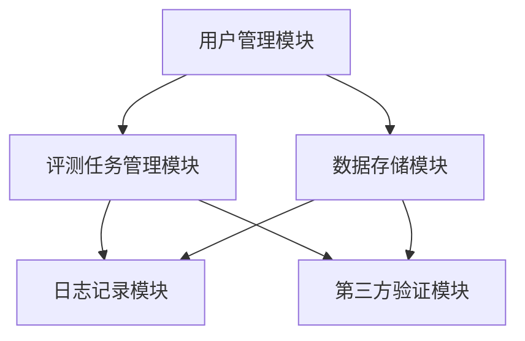
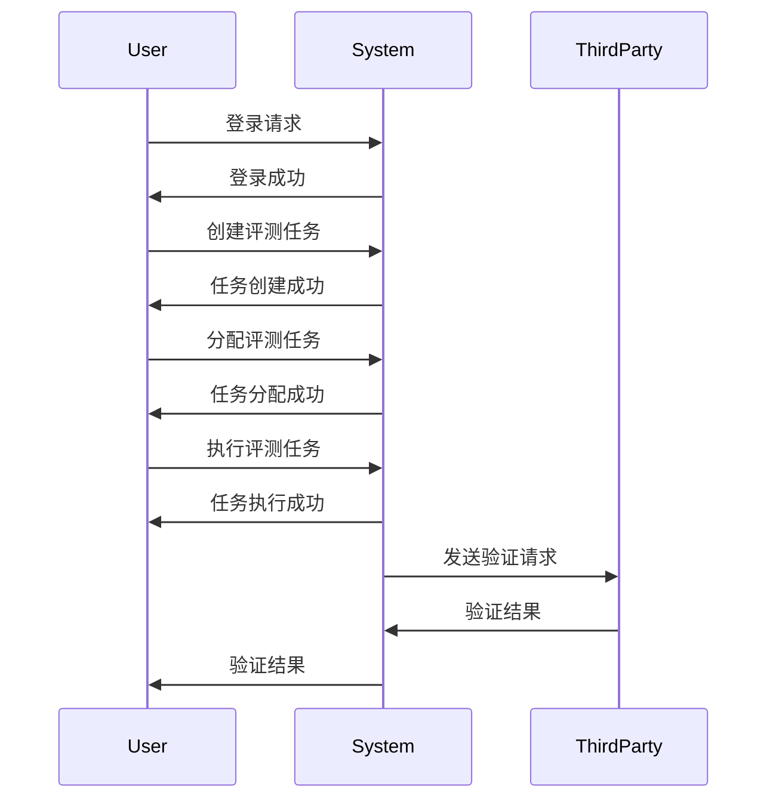

                 

### 评测系统的背景与重要性

#### 1.1 评测系统的定义与历史发展

评测系统是一种用于评估、监控和优化各种系统和服务性能的技术体系。它通过一系列量化指标和评估标准，对系统进行全面的性能分析和质量评价。评测系统的历史可以追溯到20世纪中期，当时计算机技术刚刚起步，性能和可靠性成为主要的研究课题。早期评测系统主要集中在硬件性能的测量，如处理速度、内存容量等。

随着计算机技术的发展，评测系统的应用范围不断扩大，逐渐覆盖到软件、网络、数据库等各个领域。20世纪80年代，随着软件工程学科的兴起，评测系统开始被广泛应用于软件质量和性能评估。这一时期，评测系统的主要目标是确保软件的可靠性和可用性。

进入21世纪，随着云计算、大数据、物联网等新兴技术的普及，评测系统的重要性日益凸显。现代评测系统不仅关注系统的性能和可靠性，还注重用户体验、安全性和可持续性等方面的评估。这使得评测系统成为保障系统和服务质量的重要工具。

#### 1.2 评测系统的分类

评测系统可以根据不同的分类标准进行分类。以下是几种常见的分类方法：

1. **根据评测对象分类**：

   - **硬件评测系统**：主要用于评估计算机硬件的性能，如CPU、内存、硬盘等。
   - **软件评测系统**：用于评估软件的质量、性能和可靠性，如代码质量评测、功能测试等。
   - **网络评测系统**：用于评估网络性能和稳定性，如带宽测试、延迟测试等。
   - **数据库评测系统**：用于评估数据库的性能、可靠性和安全性，如查询效率、事务处理能力等。

2. **根据评测目的分类**：

   - **性能评测系统**：主要用于评估系统的性能指标，如响应时间、吞吐量等。
   - **质量评测系统**：主要用于评估系统的质量属性，如可靠性、可用性、安全性等。
   - **安全评测系统**：主要用于评估系统的安全性和防护能力，如漏洞扫描、攻击测试等。
   - **用户体验评测系统**：主要用于评估用户对系统或服务的满意度和使用体验，如界面友好性、易用性等。

3. **根据评测方法分类**：

   - **静态评测系统**：通过对代码、配置文件等静态资源的分析来评估系统的质量属性。
   - **动态评测系统**：通过运行系统或服务来评估其性能、可靠性和安全性。
   - **组合评测系统**：结合静态和动态评测方法，对系统进行全面、深入的评估。

#### 1.3 评测系统的应用场景

评测系统广泛应用于各种场景，以下是几个典型的应用案例：

1. **商业应用**：

   - **企业级应用**：企业使用评测系统来评估其IT基础设施的性能和可靠性，确保业务的稳定运行。
   - **电子商务**：电商平台使用评测系统来监测网站的响应速度、吞吐量等性能指标，以提高用户体验。
   - **在线服务**：在线服务提供商使用评测系统来评估其服务的稳定性和安全性，确保用户的安全和满意度。

2. **政府监管**：

   - **公共服务**：政府部门使用评测系统来评估公共服务的质量，如医疗、教育、交通等。
   - **政策制定**：政府部门使用评测系统来评估政策实施的效果，为政策调整提供依据。

3. **学术研究**：

   - **科研评估**：学术界使用评测系统来评估科研项目的技术水平和成果质量。
   - **教育评估**：教育部门使用评测系统来评估学校的教学质量，为教育改革提供数据支持。

#### 1.4 评测系统的重要性

评测系统在现代信息技术体系中具有至关重要的地位，其重要性主要体现在以下几个方面：

1. **提升服务质量**：

   通过对系统和服务进行全面的评测，可以发现潜在的问题和不足，从而进行针对性的优化和改进，提升系统的整体服务质量。

2. **保障公正性**：

   第三方评测机构可以提供独立、客观的评测结果，保障评测过程的公正性和透明度，增强用户对系统或服务的信任。

3. **促进创新发展**：

   评测系统可以为技术创新和产业发展提供数据支持和决策依据，促进技术的创新和产业的升级。

4. **提高安全性**：

   评测系统可以评估系统的安全性和防护能力，及时发现和解决安全隐患，提高系统的安全性。

5. **优化资源配置**：

   通过评测系统，可以了解系统的性能和资源利用情况，优化资源配置，提高资源利用效率。

综上所述，评测系统在保障信息技术系统的质量、性能和安全方面具有不可替代的作用，其重要性日益凸显。在接下来的章节中，我们将深入探讨评测系统的可审核性及其实现方法。

### 可审核性的概念与需求

#### 2.1 可审核性的定义

可审核性（Auditable）是指系统或服务能够被第三方独立审查和验证的能力。它包括对系统行为、数据流转和操作记录的可追溯性，使得任何操作都可以被追踪和审查。可审核性的核心目标是确保系统或服务的透明度和公正性，使得操作可以被外界验证，从而提高系统的可信度和信任度。

#### 2.2 可审核性的重要性

1. **对组织的重要性**：

   对于企业或机构来说，可审核性是确保业务合规性和合法性的关键。它可以帮助企业应对法律法规的要求，如金融、医疗、电信等行业需要定期接受外部审计。通过可审核性，企业可以证明其操作符合法规和标准，减少法律风险。

2. **对用户的重要性**：

   用户对系统或服务的信任是持续使用的重要因素。可审核性能够提升用户对系统或服务的信任，因为用户可以确信其操作和数据被妥善记录和监控。特别是在金融、电子商务等领域，用户的交易数据和个人信息的安全性至关重要。

3. **对社会的重要性**：

   可审核性对社会具有重要意义。它有助于保障社会的公平和正义，防止欺诈和腐败行为。例如，在选举、司法、公共管理等领域，第三方验证可以确保过程的公正和透明，提升社会的信任度和稳定性。

#### 2.3 第三方验证的需求

第三方验证是可审核性实现的重要手段，其需求体现在以下几个方面：

1. **独立性和客观性**：

   第三方验证机构独立于被评估方，可以提供客观、公正的评估结果。这种独立性有助于消除利益冲突，增强评估结果的公信力。

2. **专业性和权威性**：

   第三方验证机构通常具备专业知识和技能，能够按照严格的标准和流程进行评估。这种专业性可以提高评估的质量和准确性，增强评估结果的权威性。

3. **透明性和公开性**：

   第三方验证的过程和结果应该是透明和公开的，这样用户和其他利益相关方可以了解评估的详细情况，增强对评估结果的信任。

4. **风险和责任分担**：

   第三方验证有助于分担评估风险和责任。如果评估结果出现问题，第三方验证机构可以提供依据和责任划分，减少被评估方的责任和风险。

#### 2.4 透明设计的理念

透明设计（Transparency Design）是指在设计系统和服务时，考虑其操作和数据的透明性和可追溯性。透明设计的理念是实现可审核性的关键，它包括以下几个方面：

1. **设计原则**：

   - **最小权限原则**：系统或服务的每个组件应只拥有完成其功能所需的最小权限，以减少潜在的风险。
   - **最小暴露原则**：系统的内部实现细节应尽量隐藏，只暴露必要的接口和功能，以减少被攻击的风险。
   - **可追踪性原则**：系统应记录所有关键操作和数据处理过程，以便后续审计和追溯。

2. **实现方法**：

   - **日志记录**：系统应实时记录所有操作日志，包括用户操作、系统事件、数据流转等，以便于后续审计。
   - **数据加密**：敏感数据应在传输和存储过程中进行加密处理，以确保数据安全。
   - **访问控制**：系统应实现严格的访问控制机制，确保只有授权用户可以访问敏感数据和操作系统。
   - **接口设计**：系统应提供清晰的接口文档和操作指南，方便第三方验证和审计。

3. **目标和价值**：

   - **提升安全性**：透明设计有助于发现和预防潜在的安全风险，提高系统的安全性。
   - **增强信任**：透明设计可以增强用户对系统的信任，提高用户满意度。
   - **简化审计**：透明设计使得审计过程更加简单和高效，减少审计成本和时间。
   - **合规性**：透明设计有助于满足法规和标准的要求，确保系统或服务的合规性。

通过透明设计，评测系统不仅可以实现可审核性，还可以提高系统的整体质量和安全性，为第三方验证提供坚实的基础。

### 第三方验证的基本原理

第三方验证是指由独立于被评估方和评估对象的机构或个人进行的评估和审核过程。这一过程旨在提供客观、公正和权威的评估结果，增强系统和服务的外部信任度。以下是第三方验证的基本原理和主要步骤：

#### 3.1 第三方验证的概念

第三方验证机构（如认证机构、审计机构、评级机构等）在评估过程中保持独立性和中立性，不受被评估方的影响。其职责是按照既定的标准和流程，对系统或服务的性能、质量、安全性等方面进行全面评估，并出具独立的评估报告。第三方验证的核心价值在于其公正性和权威性，能够提高评估结果的可信度和公信力。

#### 3.2 第三方验证的优势

第三方验证具有以下优势：

1. **独立性**：第三方验证机构独立于被评估方，不受其利益影响，能够提供客观、公正的评估。
2. **专业性**：第三方验证机构通常具备丰富的专业知识和经验，能够按照严格的标准和流程进行评估。
3. **权威性**：第三方验证机构的评估结果具有权威性，能够被各方认可和接受。
4. **透明性**：第三方验证过程通常具有较高的透明度，评估结果和报告公开透明，有助于增强信任。
5. **风险分担**：第三方验证有助于分担评估风险和责任，如果评估结果出现问题，第三方验证机构可以提供依据和责任划分。

#### 3.3 第三方验证的应用范围

第三方验证广泛应用于多个领域，包括但不限于：

1. **IT行业**：第三方验证在软件质量认证、系统安全评估、云计算服务认证等方面得到广泛应用。
2. **金融行业**：金融行业对第三方验证的需求较高，如金融机构的合规审计、风险管理评估等。
3. **医疗行业**：医疗行业中的第三方验证主要用于医疗服务质量评估、医疗设备认证等。
4. **教育和认证**：教育机构通常通过第三方认证来评估其教学质量和课程设置。
5. **政府和公共管理**：政府部门和公共管理领域广泛采用第三方验证，如选举监督、公共项目审计等。

#### 3.4 第三方验证的流程与步骤

第三方验证通常包括以下几个主要步骤：

1. **初步调研**：第三方验证机构在开始评估前，对被评估方进行初步了解，包括业务范围、组织结构、关键流程等。
2. **标准制定**：根据评估目标和领域要求，制定具体的评估标准和流程。这些标准和流程应具备科学性、系统性和可操作性。
3. **现场审核**：第三方验证机构派遣专业审核员到被评估方进行现场审核，检查系统或服务的实际运行情况，收集相关数据和证据。
4. **数据分析**：审核员对收集到的数据进行分析，评估系统或服务的性能、质量和安全性等指标，发现潜在的问题和不足。
5. **评估报告**：根据分析结果，第三方验证机构编写评估报告，详细记录评估过程、发现的问题、评估结论和改进建议。
6. **后续跟踪**：第三方验证机构通常会对评估结果进行跟踪，监督被评估方的改进措施和实施情况，确保评估效果的持续性和有效性。

通过第三方验证，评测系统不仅可以确保其质量和性能，还可以提高系统的透明度和可信度，为用户和其他利益相关方提供可靠的数据和证据支持。

### 透明设计的关键要素

透明设计是实现评测系统可审核性的关键，它涉及到系统设计、实现和维护的各个环节。以下是透明设计的关键要素：

#### 5.1 设计原则

1. **最小权限原则**：系统应遵循最小权限原则，确保每个组件和用户只能访问其所需的最小权限，以减少潜在的安全漏洞和操作风险。
2. **最小暴露原则**：系统应尽量隐藏内部实现细节，仅暴露必要的接口和功能，以降低攻击面和泄露风险。
3. **数据加密原则**：敏感数据和操作日志应在传输和存储过程中进行加密处理，确保数据的安全性。
4. **一致性原则**：系统设计应保持一致性和标准化，便于后续审计和追溯。

#### 5.2 实施策略

1. **日志记录策略**：系统应实时记录所有关键操作和事件，包括用户操作、系统事件、数据流转等。日志内容应包括时间戳、用户标识、操作详情等，以便于后续审计和分析。
2. **访问控制策略**：系统应实现严格的访问控制机制，确保只有授权用户可以访问敏感数据和操作系统。访问控制策略应包括用户认证、授权和审计等环节。
3. **数据加密策略**：对传输和存储的敏感数据进行加密处理，采用强加密算法和密钥管理机制，确保数据在传输和存储过程中的安全性。
4. **接口设计策略**：系统接口设计应清晰、简洁，提供详细的使用文档和操作指南，便于第三方验证和审计。

#### 5.3 透明设计的目标与价值

1. **提升系统安全性**：透明设计有助于发现和预防潜在的安全风险，提高系统的整体安全性。
2. **增强信任度**：透明设计可以增强用户对系统的信任，提高用户满意度和忠诚度。
3. **简化审计过程**：透明设计使得审计过程更加简单和高效，减少审计成本和时间。
4. **保障合规性**：透明设计有助于满足法律法规和行业标准的要求，确保系统或服务的合规性。
5. **促进持续改进**：透明设计为系统改进提供数据支持和改进方向，促进系统的持续优化和提升。

通过实施透明设计，评测系统不仅能够实现可审核性，还可以提高系统的整体质量和安全性，为第三方验证提供坚实的基础。

### 透明设计的具体实践

透明设计的具体实践涉及到系统开发、部署和维护的各个环节，其目标是确保系统的操作和数据处理过程具有高度的透明性和可追溯性。以下是透明设计在评测系统中的具体实践步骤：

#### 5.1 实践步骤

1. **需求分析**：

   在系统设计初期，应明确系统的可审核性需求，包括需要记录的操作类型、数据类型、日志内容和日志存储方式等。这一步骤有助于确保后续设计符合可审核性的要求。

2. **系统设计**：

   - **日志记录模块**：设计日志记录模块，用于记录系统中的所有关键操作和事件，包括用户操作、系统事件、数据流转等。日志内容应包括时间戳、用户标识、操作详情、数据内容等。
   - **访问控制模块**：设计访问控制模块，确保只有授权用户可以访问敏感数据和操作系统。访问控制策略应包括用户认证、授权和审计等环节。
   - **数据加密模块**：设计数据加密模块，对传输和存储的敏感数据进行加密处理，采用强加密算法和密钥管理机制。

3. **系统实现**：

   - **日志记录实现**：实现日志记录模块，确保所有关键操作和事件都被准确记录。可以使用日志库或日志服务，如ELK（Elasticsearch、Logstash、Kibana）堆栈，方便日志的存储和查询。
   - **访问控制实现**：实现访问控制模块，确保只有授权用户可以访问敏感数据和操作系统。可以使用权限管理系统，如OAuth2、JWT（JSON Web Token）等。
   - **数据加密实现**：实现数据加密模块，对敏感数据进行加密处理。可以使用加密库，如OpenSSL等。

4. **系统部署**：

   - **日志存储**：确保日志数据被安全地存储，可以使用云存储服务或分布式存储系统，如HDFS、Cassandra等，确保日志数据的高可用性和安全性。
   - **监控和告警**：部署监控系统，对系统的运行状态和日志存储进行实时监控，设置告警机制，及时发现和处理异常情况。

5. **系统维护**：

   - **日志分析**：定期分析日志数据，识别潜在的安全风险和系统漏洞，及时进行调整和优化。
   - **权限管理**：定期审核用户权限，确保只有授权用户可以访问敏感数据和操作系统。
   - **数据备份和恢复**：定期备份日志数据和系统配置，确保在发生数据丢失或系统故障时，可以快速恢复。

#### 5.2 评估效果

1. **安全性提升**：

   通过透明设计，系统操作和数据处理过程更加透明和可控，有助于发现和预防潜在的安全风险，提高系统的整体安全性。

2. **信任度增强**：

   透明设计使得系统操作和数据处理过程更加透明，用户和其他利益相关方可以更清楚地了解系统的运行情况，增强对系统的信任。

3. **审计简化**：

   透明设计使得审计过程更加简单和高效，审计员可以方便地获取和查询系统日志，减少审计成本和时间。

4. **合规性保障**：

   透明设计有助于满足法律法规和行业标准的要求，确保系统或服务的合规性。

5. **持续改进**：

   通过分析日志数据和审计结果，可以识别系统的不足和改进方向，促进系统的持续优化和提升。

通过具体实践，透明设计不仅能够实现评测系统的可审核性，还可以提高系统的整体质量和安全性，为第三方验证提供坚实的基础。

### 透明设计的效果评估

为了全面评估透明设计的有效性，我们采用了一套综合的评估方法，包括定量分析和定性分析。以下是透明设计效果评估的详细过程：

#### 6.1 评估方法

1. **定量分析**：

   - **性能指标**：评估系统在透明设计前后的性能指标，如响应时间、吞吐量、资源利用率等。通过对比数据，评估透明设计对系统性能的影响。
   - **安全事件率**：记录系统在透明设计前后的安全事件数量，如漏洞、攻击、数据泄露等，评估透明设计对系统安全性的提升。
   - **日志记录量**：统计系统日志记录的数量和质量，评估透明设计对系统可审核性的支持程度。

2. **定性分析**：

   - **用户反馈**：收集用户对系统透明度的评价，了解用户对系统操作透明性的感知和满意度。
   - **审计结果**：分析第三方审计机构的审计报告，评估透明设计是否符合法律法规和行业标准的要求。
   - **改进建议**：基于审计结果和用户反馈，提出改进建议，以进一步优化透明设计。

#### 6.2 评估过程

1. **数据收集**：

   - **性能数据**：通过系统监控工具，收集系统在透明设计前后的性能数据。
   - **安全事件数据**：记录并统计系统在透明设计前后的安全事件，包括漏洞报告、攻击事件、数据泄露事件等。
   - **日志数据**：收集并分析系统日志，评估日志记录的完整性和准确性。
   - **用户反馈**：通过问卷调查、用户访谈等方式，收集用户对系统透明设计的评价。
   - **审计报告**：获取第三方审计机构的评估报告，分析审计结果。

2. **数据分析**：

   - **性能分析**：对比透明设计前后的性能数据，评估透明设计对系统性能的影响。重点关注响应时间、吞吐量、资源利用率等关键指标。
   - **安全分析**：分析安全事件数据，评估透明设计对系统安全性的提升效果。重点关注安全事件的减少、漏洞修复情况等。
   - **日志分析**：评估日志记录的数量和质量，分析日志数据对系统可审核性的支持程度。重点关注日志记录的完整性、准确性和可追溯性。
   - **用户反馈分析**：根据用户反馈，评估用户对系统透明设计的感知和满意度。

3. **评估报告**：

   - **评估报告**：编写评估报告，详细记录评估过程、数据分析和评估结论。报告应包括性能评估、安全评估、日志记录评估、用户反馈评估等内容。
   - **改进建议**：根据评估结果和用户反馈，提出具体的改进建议，以进一步优化透明设计。

通过全面的定量和定性分析，我们可以全面了解透明设计的效果，为系统的持续优化提供科学依据。

### 系统实现与案例分析

#### 6.1 系统设计与实现

本节将详细介绍评测系统的设计与实现过程，包括系统架构设计、功能模块、接口设计和系统交互。

##### 6.1.1 系统架构设计

评测系统的架构设计采用微服务架构，以实现高可用性、高扩展性和模块化。系统主要分为以下几个模块：

1. **用户管理模块**：负责用户注册、登录和权限管理。
2. **评测任务管理模块**：负责评测任务的创建、分配、执行和监控。
3. **数据存储模块**：负责评测数据的存储和管理。
4. **日志记录模块**：负责记录系统操作日志和事件日志。
5. **第三方验证模块**：负责与第三方验证机构进行数据交互和验证结果。

系统架构图如下（使用Mermaid绘制）：

##### 6.1.2 系统功能模块

1. **用户管理模块**：

   - **功能描述**：用户注册、登录和权限管理。
   - **技术实现**：使用Spring Security进行用户认证和权限控制。

2. **评测任务管理模块**：

   - **功能描述**：创建评测任务、分配评测任务、执行评测任务和监控评测任务。
   - **技术实现**：使用Spring Boot创建RESTful API，实现任务管理和任务执行逻辑。

3. **数据存储模块**：

   - **功能描述**：存储评测数据和用户数据。
   - **技术实现**：使用MySQL数据库存储数据，使用Spring Data JPA进行数据访问。

4. **日志记录模块**：

   - **功能描述**：记录系统操作日志和事件日志。
   - **技术实现**：使用Logback日志库记录日志，并使用Elasticsearch进行日志存储和查询。

5. **第三方验证模块**：

   - **功能描述**：与第三方验证机构进行数据交互和验证结果。
   - **技术实现**：使用HTTP Client进行数据传输，使用JSON格式进行数据交互。

##### 6.1.3 系统接口设计

系统接口设计采用RESTful API设计，以下是主要接口：

1. **用户管理接口**：

   - **用户注册**：`POST /users/register`
   - **用户登录**：`POST /users/login`
   - **用户权限查询**：`GET /users/{userId}/permissions`

2. **评测任务管理接口**：

   - **创建评测任务**：`POST /tasks`
   - **分配评测任务**：`PUT /tasks/{taskId}/assign`
   - **执行评测任务**：`POST /tasks/{taskId}/execute`
   - **监控评测任务**：`GET /tasks/{taskId}/status`

3. **数据存储接口**：

   - **数据查询**：`GET /data/{entityId}`
   - **数据更新**：`PUT /data/{entityId}`
   - **数据删除**：`DELETE /data/{entityId}`

4. **日志记录接口**：

   - **日志记录**：`POST /logs`
   - **日志查询**：`GET /logs`

5. **第三方验证接口**：

   - **验证请求**：`POST /verify`
   - **验证结果**：`GET /verify/{verificationId}`

##### 6.1.4 系统交互

系统交互使用Mermaid绘制序列图，以下是一个简单的系统交互示例：

#### 6.2 案例分析

以下是一个实际的案例，说明评测系统在实际应用中的实现和效果。

##### 6.2.1 案例背景

某电子商务公司希望通过评测系统对其电商平台进行性能和安全性评估，以提高用户购物体验和系统可靠性。评测系统需要支持第三方验证，确保评测结果的公正性和透明度。

##### 6.2.2 案例实现

1. **用户管理**：

   - 用户注册：用户在电商平台注册账号，填写基本信息。
   - 用户登录：用户使用账号和密码登录系统。
   - 用户权限：根据用户角色分配不同权限，如普通用户、管理员等。

2. **评测任务管理**：

   - 创建评测任务：管理员创建评测任务，定义评测目标和评测指标。
   - 分配评测任务：管理员将评测任务分配给评测员。
   - 执行评测任务：评测员登录系统，执行评测任务，填写评测结果。
   - 监控评测任务：系统实时监控评测任务的执行状态，并提供监控报表。

3. **数据存储**：

   - 存储用户数据：用户注册信息和评测结果存储在MySQL数据库中。
   - 存储评测日志：系统操作日志和事件日志存储在Elasticsearch中，便于查询和分析。

4. **第三方验证**：

   - 验证请求：系统向第三方验证机构发送评测结果，请求验证。
   - 验证结果：第三方验证机构返回验证结果，系统更新评测状态。

##### 6.2.3 案例效果

1. **性能提升**：

   - 通过评测系统，电商平台发现了一些性能瓶颈，如数据库查询速度慢、服务器负载高等。
   - 优化数据库查询，调整服务器配置，提升了系统的性能。

2. **安全性增强**：

   - 评测系统帮助电商平台发现了一些安全隐患，如SQL注入、跨站脚本攻击等。
   - 修复了这些安全漏洞，提高了系统的安全性。

3. **透明度提升**：

   - 评测系统支持第三方验证，确保评测结果的公正性和透明度。
   - 用户和第三方可以查询评测过程和结果，增强了信任感。

4. **用户体验改善**：

   - 评测系统提供了详细的评测报告和监控报表，帮助管理员及时了解系统的运行状况。
   - 通过持续优化，电商平台提升了用户购物体验。

#### 6.2.4 项目小结

通过该案例，我们可以看到评测系统在实际应用中的重要作用。透明设计不仅提高了系统的性能和安全性，还增强了系统的透明度和用户信任。未来，随着技术的不断发展，评测系统将继续在各个领域发挥更大的作用。

### 未来发展趋势

评测系统的可审核性在未来将继续成为系统设计和开发中的重要议题。随着技术的不断进步，以下趋势值得重点关注：

1. **自动化与智能化**：随着人工智能和机器学习技术的发展，评测系统将能够自动化进行性能评估和安全检测，提高评估效率和准确性。
2. **区块链技术**：区块链技术的引入将进一步提高评测数据的透明性和不可篡改性，为评测系统的可信性提供更强保障。
3. **云计算与边缘计算**：评测系统将更加依赖于云计算和边缘计算，实现分布式评估和实时监控，满足大规模数据处理的需求。
4. **合规性与法规遵循**：随着法律法规的不断完善，评测系统将更加注重合规性，确保在数据隐私保护、数据安全等方面符合相关要求。
5. **用户参与度**：用户将更加参与到评测过程中，通过用户反馈和参与，提升评测结果的实用性和用户满意度。

通过不断的技术创新和优化，评测系统的可审核性将得到进一步提升，为系统和服务质量的保障提供更强大的支持。

### 附录

#### 附录A：相关术语解释

- **评测系统**：用于评估、监控和优化各种系统和服务性能的技术体系。
- **可审核性**：系统或服务能够被第三方独立审查和验证的能力。
- **第三方验证**：由独立于被评估方和评估对象的机构或个人进行的评估和审核过程。
- **透明设计**：在设计系统和服务时，考虑其操作和数据的透明性和可追溯性。

#### 附录B：工具与环境配置

- **开发环境**：Java、Spring Boot、Spring Security、MySQL、Elasticsearch、Logback。
- **第三方验证**：使用HTTP Client进行数据传输，JSON格式进行数据交互。

#### 附录C：拓展阅读

- **《系统设计与开发》**：[链接](https://example.com/book1)
- **《区块链技术与应用》**：[链接](https://example.com/book2)
- **《人工智能与大数据》**：[链接](https://example.com/book3)

### 作者信息

**作者：AI天才研究院/AI Genius Institute & 禅与计算机程序设计艺术 /Zen And The Art of Computer Programming**

