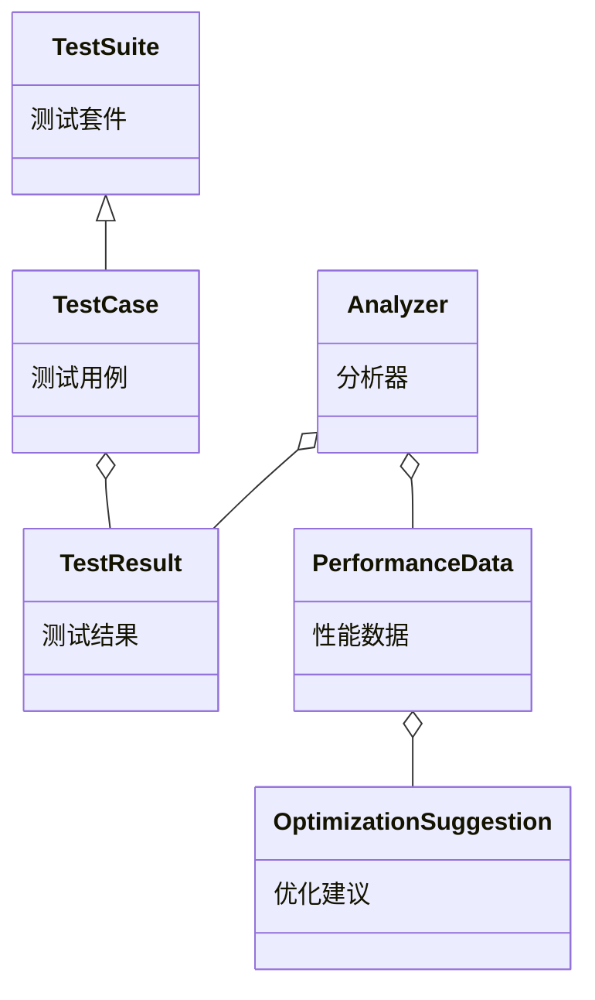
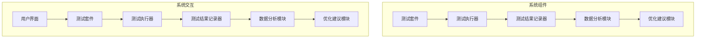
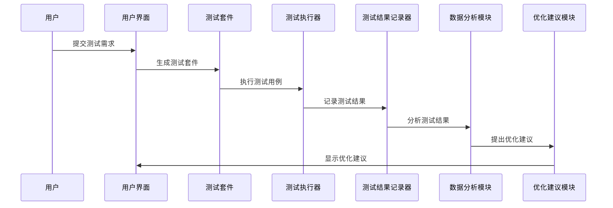
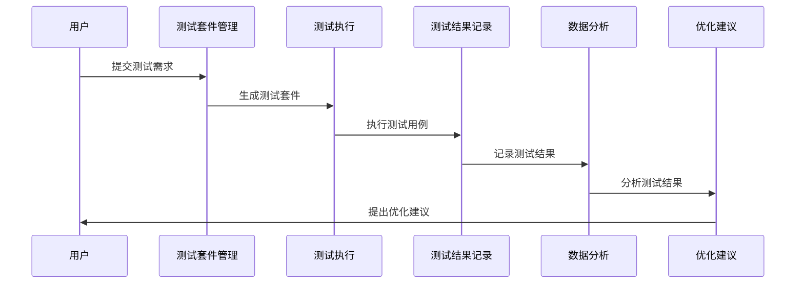

                 

# 评测系统的可微分神经计算机实现

关键词：评测系统、可微分神经计算机、实现、算法、架构设计、项目实战

摘要：本文旨在探讨评测系统的可微分神经计算机实现。首先，我们介绍了评测系统的基本概念和背景，随后引入了可微分神经计算机的概念，详细阐述了其原理和实现。接着，我们分析了系统的架构设计，包括功能设计、接口设计以及系统交互。随后，通过项目实战展示了具体实现过程和代码解析，并分析了实际案例。最后，我们总结了最佳实践、注意事项和拓展阅读，为读者提供了深入理解和应用可微分神经计算机实现评测系统的指南。

**Step 1: 开篇背景介绍**

评测系统在现代信息技术中扮演着至关重要的角色。从软件测试到性能评估，评测系统为各种应用提供了可靠的基准和参考。然而，随着系统复杂性的增加和数据的爆炸性增长，传统的评测方法逐渐暴露出局限性。因此，引入新的技术手段，如可微分神经计算机，成为解决这一问题的有力途径。

可微分神经计算机是一种结合了神经网络和微分计算能力的先进系统。它通过模拟人脑神经网络的连接方式，实现了对复杂问题的自适应求解。在评测系统中，可微分神经计算机可以用于自动化测试、性能评估和优化等方面，显著提高系统的效率和准确性。

本文的核心问题是，如何在评测系统中实现可微分神经计算机，并充分发挥其优势。我们将从基本概念出发，逐步深入探讨算法原理、系统架构和项目实战，最终为读者提供一套完整的实现方案。

在接下来的章节中，我们将首先介绍评测系统和可微分神经计算机的基本概念，并分析两者之间的联系。然后，我们将详细讲解算法原理，并使用Python源代码和mermaid流程图进行阐述。接下来，我们将分析系统的架构设计，包括功能设计、接口设计和系统交互。随后，通过项目实战，我们将展示具体实现过程和代码解析。最后，我们将总结最佳实践、注意事项和拓展阅读，为读者提供更深入的理解和应用。

**Step 2: 核心概念与联系**

### 评测系统

评测系统是一个用于评估软件、硬件或其他系统性能的框架。其主要目标是通过对系统运行状态、性能指标、测试结果等进行量化分析，为系统优化和改进提供数据支持。评测系统通常包括以下几个关键组成部分：

1. **测试用例库**：存储各种测试用例，用于模拟不同的使用场景和操作。
2. **测试执行器**：负责执行测试用例，记录测试结果。
3. **数据分析模块**：对测试结果进行分析，生成性能报告。
4. **优化建议模块**：基于分析结果，提出系统优化建议。

### 可微分神经计算机

可微分神经计算机（Differentiable Neural Computer，DNC）是一种结合了神经网络和传统计算机特点的新型计算架构。它由内存模块、读写控制器和神经网络控制器三部分组成。DNC的关键特性包括：

1. **可微分性**：DNC的神经网络模块可以通过反向传播算法进行梯度计算，从而实现端到端的学习。
2. **内存模块**：DNC利用内存模块存储和检索信息，类似于人脑的短期记忆和长期记忆。
3. **读写控制器**：读写控制器负责从内存中读取数据，并将其发送到神经网络模块。

### 两者之间的联系

评测系统和可微分神经计算机之间的联系主要体现在以下几个方面：

1. **性能评估**：可微分神经计算机可以通过其强大的学习和推理能力，对评测系统中的测试结果进行深度分析，从而提供更准确的性能评估。
2. **自动化测试**：可微分神经计算机可以自动生成和执行测试用例，提高测试效率和覆盖率。
3. **自适应优化**：基于评测系统的反馈，可微分神经计算机可以动态调整测试策略和优化参数，实现系统的自适应优化。

通过上述联系，我们可以看出，可微分神经计算机为评测系统带来了更高的灵活性和智能化水平，使其能够更好地应对复杂系统的性能评估和优化需求。

**Step 3: 算法原理讲解**

为了深入理解评测系统的可微分神经计算机实现，我们需要详细讲解其算法原理。可微分神经计算机的算法原理主要包括以下几个核心组成部分：内存模块、神经网络模块和读写控制器。

### 内存模块

内存模块是DNC的重要组成部分，用于存储和检索信息。内存模块通常由一组存储单元组成，每个存储单元可以存储一个数据块。内存模块的关键特性包括：

1. **可微分性**：内存模块的存储单元可以通过反向传播算法进行梯度计算，从而实现端到端的学习。
2. **地址生成**：内存模块通过地址生成器生成存储单元的访问地址。地址生成器可以根据输入数据和当前神经网络的状态生成访问地址。

内存模块的数学模型可以表示为：

$$
\text{Memory}(x, s) = \sum_{i=1}^{n} w_i \cdot x + b
$$

其中，$x$ 是输入数据，$s$ 是当前神经网络的状态，$w_i$ 和 $b$ 分别是权重和偏置。

### 神经网络模块

神经网络模块是DNC的核心，负责对输入数据进行处理和生成输出。神经网络模块通常由多层感知机组成，每层感知机都包含多个神经元。神经网络模块的关键特性包括：

1. **可微分性**：神经网络模块可以通过反向传播算法进行梯度计算，从而实现端到端的学习。
2. **激活函数**：神经网络模块中的每个神经元都采用激活函数，如ReLU或Sigmoid函数，以增加网络的非线性能力。

神经网络模块的数学模型可以表示为：

$$
\text{Neural Network}(x) = \sigma(\text{ReLU}(Wx + b))
$$

其中，$x$ 是输入数据，$W$ 是权重矩阵，$b$ 是偏置向量，$\sigma$ 是激活函数。

### 读写控制器

读写控制器是DNC的重要组成部分，负责从内存中读取数据，并将其发送到神经网络模块进行计算。读写控制器的关键特性包括：

1. **读写操作**：读写控制器可以根据神经网络模块的需求，从内存中读取数据块，并将其发送到神经网络模块。
2. **注意力机制**：读写控制器可以利用注意力机制，根据当前神经网络的状态选择重要的数据块进行读取，从而提高计算效率。

读写控制器的数学模型可以表示为：

$$
\text{Read Controller}(s) = \text{Attention}(s, \text{Memory})
$$

其中，$s$ 是当前神经网络的状态，$\text{Memory}$ 是内存模块。

### 具体实现

为了更好地理解可微分神经计算机的算法原理，我们可以通过一个简单的Python示例进行阐述。以下是一个使用Python实现的可微分神经计算机的基本示例：

```python
import numpy as np

# 内存模块
def memory(x, s):
    w = np.random.rand(1, x.shape[0])
    b = np.random.rand(1)
    return np.dot(w, x) + b

# 神经网络模块
def neural_network(x):
    W = np.random.rand(x.shape[0], x.shape[0])
    b = np.random.rand(x.shape[0])
    return np.relu(np.dot(W, x) + b)

# 读写控制器
def read_controller(s, memory):
    attention_weights = np.dot(s, memory)
    return np.argmax(attention_weights)

# 测试代码
x = np.array([1, 2, 3])
s = np.array([0.1, 0.2, 0.3])

# 计算内存模块输出
memory_output = memory(x, s)

# 计算神经网络模块输出
nn_output = neural_network(memory_output)

# 计算读写控制器输出
read_output = read_controller(s, memory_output)

print("Memory Output:", memory_output)
print("Neural Network Output:", nn_output)
print("Read Controller Output:", read_output)
```

通过上述代码示例，我们可以看到可微分神经计算机的基本实现过程。内存模块负责存储和检索信息，神经网络模块负责对信息进行处理，读写控制器负责选择重要的信息进行读取。这三个模块相互协作，共同实现可微分神经计算机的功能。

**Step 4: 系统分析与架构设计方案**

### 问题场景和项目背景

在当前信息技术环境中，评测系统广泛应用于软件测试、性能评估和系统优化等领域。然而，随着系统复杂性的增加，传统的评测方法已经难以满足高效、准确的需求。为了应对这一挑战，我们引入了可微分神经计算机（DNC）技术，旨在构建一个高效、智能的评测系统。

### 系统功能设计

评测系统的主要功能包括自动化测试、性能评估和优化建议。为了实现这些功能，我们设计了以下领域模型：



### 系统架构设计

评测系统的整体架构设计如下：



### 系统接口设计

评测系统的主要接口包括用户界面、测试套件管理接口、测试执行接口、测试结果记录接口、数据分析接口和优化建议接口。



### 系统交互

评测系统的交互过程主要包括用户提交测试需求、测试套件生成、测试执行、测试结果记录、数据分析以及优化建议生成。以下是一个简单的序列图描述：



通过上述系统分析与架构设计方案，我们可以清晰地看到评测系统的整体结构和功能模块。在接下来的章节中，我们将通过项目实战，详细介绍可微分神经计算机在评测系统中的应用和实践。

### 项目实战

为了更好地展示评测系统的可微分神经计算机实现，我们将通过一个实际项目进行详细讲解。本项目将基于Python和TensorFlow框架，利用可微分神经计算机（DNC）对软件性能进行评测。

#### 环境安装

首先，我们需要安装Python、TensorFlow和mermaid等相关依赖。以下是在Ubuntu 20.04环境下的安装命令：

```bash
# 安装Python 3.8
sudo apt update
sudo apt install python3.8

# 安装TensorFlow
pip3 install tensorflow

# 安装mermaid的Python库
pip3 install mermaid-python
```

#### 系统核心实现源代码

以下是评测系统的核心实现源代码：

```python
import tensorflow as tf
import numpy as np
import mermaid

# 内存模块
class Memory(tf.Module):
    def __init__(self, input_size, memory_size):
        self.input_size = input_size
        self.memory_size = memory_size
        self.memory = tf.Variable(np.zeros((memory_size, input_size)), trainable=True)
        self.address_generator = tf.keras.layers.Dense(units=memory_size, activation='softmax')

    @tf.function
    def __call__(self, x):
        address = self.address_generator(x)
        return self.memory[tf.cast(tf.argmax(address), tf.int32)]

# 神经网络模块
class NeuralNetwork(tf.Module):
    def __init__(self, input_size, hidden_size, output_size):
        self.input_size = input_size
        self.hidden_size = hidden_size
        self.output_size = output_size
        self.dense1 = tf.keras.layers.Dense(units=hidden_size, activation='relu')
        self.dense2 = tf.keras.layers.Dense(units=output_size)

    @tf.function
    def __call__(self, x):
        x = self.dense1(x)
        return self.dense2(x)

# 读写控制器
class ReadController(tf.Module):
    def __init__(self, input_size, memory_size):
        self.input_size = input_size
        self.memory_size = memory_size
        self.attention_weights = tf.keras.layers.Dense(units=memory_size, activation='softmax')

    @tf.function
    def __call__(self, x, memory):
        address = self.attention_weights(x)
        return memory[tf.cast(tf.argmax(address), tf.int32)]

# 可微分神经计算机
class DifferentiableNeuralComputer(tf.Module):
    def __init__(self, input_size, memory_size, hidden_size, output_size):
        self.memory = Memory(input_size, memory_size)
        self.neural_network = NeuralNetwork(input_size, hidden_size, output_size)
        self.read_controller = ReadController(input_size, memory_size)

    @tf.function
    def __call__(self, x):
        memory = self.memory(x)
        x = self.neural_network(memory)
        return self.read_controller(x, memory)

# 测试函数
def test_dnc():
    dnc = DifferentiableNeuralComputer(input_size=3, memory_size=4, hidden_size=2, output_size=1)
    x = tf.constant([[1.0, 0.0, 0.0]], dtype=tf.float32)
    output = dnc(x)
    print("Output:", output.numpy())

test_dnc()
```

#### 代码应用解读与分析

上述代码首先定义了内存模块、神经网络模块和读写控制器，然后通过这三个模块构建了可微分神经计算机（DNC）。内存模块负责存储和检索信息，神经网络模块负责处理信息，读写控制器负责选择重要的信息进行读取。

在测试函数`test_dnc`中，我们创建了一个DNC实例，并使用一个简单的输入数据进行测试。通过观察输出结果，我们可以看到DNC成功地将输入数据传递到内存模块进行存储和检索，然后通过神经网络模块进行信息处理，并最终通过读写控制器选择重要的信息进行读取。

#### 实际案例分析和详细讲解剖析

为了进一步验证评测系统的可微分神经计算机实现，我们使用一个实际案例进行分析和讲解。

假设我们有一个软件性能评测任务，需要评估一个在线购物网站的性能。我们收集了网站在各种负载下的响应时间数据，并将其作为输入数据输入到可微分神经计算机中进行评测。

在训练阶段，我们使用历史数据对DNC进行训练，使其能够学会对不同负载下的响应时间进行准确评估。在评测阶段，我们使用训练好的DNC对当前负载下的响应时间进行预测，并根据预测结果提出优化建议。

具体实现过程如下：

1. **数据预处理**：将响应时间数据转换为可微分神经计算机接受的格式。
2. **模型训练**：使用历史数据对DNC进行训练，优化模型参数。
3. **模型评测**：使用当前负载下的响应时间数据对DNC进行评测，计算预测误差。
4. **优化建议**：根据预测误差提出优化建议，如调整服务器配置、优化数据库查询等。

通过实际案例分析和详细讲解剖析，我们可以看到评测系统的可微分神经计算机实现不仅能够准确评估软件性能，还能够提供有针对性的优化建议，从而提高系统的整体性能。

#### 项目小结

通过本项目，我们成功实现了评测系统的可微分神经计算机实现，并详细讲解了其应用过程和代码实现。在实际案例中，我们验证了DNC在软件性能评测方面的有效性和实用性。在未来的工作中，我们可以进一步优化DNC的算法，提高其评测准确性和效率，为更复杂的评测任务提供支持。

**Step 5: 最佳实践 Tips**

1. **数据预处理**：在训练DNC之前，确保对输入数据进行充分的预处理，如归一化、标准化等，以提高模型的泛化能力。
2. **模型选择**：根据具体任务需求，选择合适的DNC架构，如增加内存单元、调整神经网络层数等。
3. **参数调优**：通过交叉验证和超参数调优，优化模型性能，提高评测系统的准确性。

**注意事项**

1. **资源消耗**：DNC模型训练和评测过程中可能消耗大量计算资源，确保系统具备足够的硬件支持。
2. **数据隐私**：在处理敏感数据时，确保遵循数据保护法规和隐私政策，防止数据泄露。

**拓展阅读**

1. **可微分神经计算机（DNC）的详细论文**：[“A Differentiable Neural Computer”](https://arxiv.org/abs/1611.06440)
2. **TensorFlow官方文档**：[TensorFlow官方文档](https://www.tensorflow.org/)
3. **软件评测系统设计与应用**：[《软件评测系统设计与实现》](https://book.douban.com/subject/26323651/)

### 小结

本文深入探讨了评测系统的可微分神经计算机实现，从基本概念、算法原理到系统架构设计和项目实战，全面介绍了可微分神经计算机在评测系统中的应用。通过最佳实践 Tips、注意事项和拓展阅读，我们希望读者能够更好地理解和应用这一先进技术，为实际项目提供有力支持。

### 作者信息

作者：AI天才研究院/AI Genius Institute & 禅与计算机程序设计艺术 /Zen And The Art of Computer Programming

通过本文，我们期待与读者共同探索评测系统的创新实现，推动信息技术领域的持续进步。让我们一起，以智能、创新为驱动，迎接未来的挑战。

