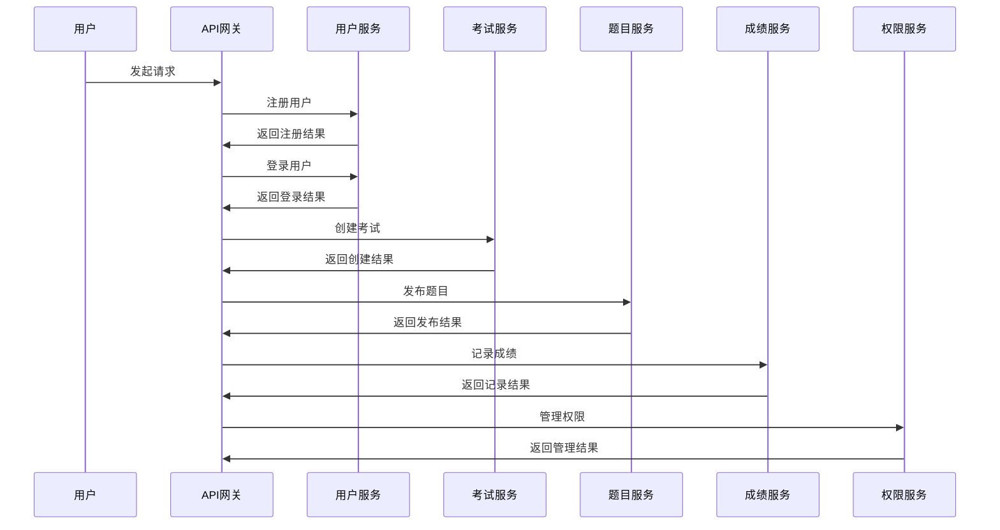

                 

## 评测系统的可扩展性设计

### 关键词：评测系统、可扩展性、设计原则、算法、系统架构

### 摘要：

本文将深入探讨评测系统的可扩展性设计，分析其重要性、现状与未来发展趋势。我们将定义评测系统的可扩展性，介绍相关技术和方法，并详细讲解算法原理和系统架构设计。通过实际项目案例，我们将展示如何实现评测系统的可扩展性，并总结最佳实践和注意事项，为读者提供有价值的参考。

## 目录

1. **背景介绍**
   - 1.1 可扩展性需求分析
   - 1.2 可扩展性现状与挑战
   - 1.3 可扩展性发展趋势

2. **核心概念与联系**
   - 2.1 可扩展性定义
   - 2.2 相关技术与方法
   - 2.3 核心概念与联系

3. **算法原理讲解**
   - 3.1 算法流程概述
   - 3.2 数学模型与公式
   - 3.3 算法实现示例

4. **系统分析与架构设计方案**
   - 4.1 问题场景介绍
   - 4.2 系统功能设计
   - 4.3 系统架构设计
   - 4.4 系统接口与交互设计

5. **项目实战**
   - 5.1 环境安装与配置
   - 5.2 系统核心实现
   - 5.3 代码解读与分析
   - 5.4 实际案例分析与讲解

6. **最佳实践 tips**
   - 6.1 设计原则
   - 6.2 性能优化
   - 6.3 维护与迭代

7. **小结**
   - 7.1 主要结论
   - 7.2 未来展望

8. **注意事项**
   - 8.1 设计阶段注意事项
   - 8.2 实施阶段注意事项

9. **拓展阅读**
   - 9.1 相关文献推荐
   - 9.2 最新研究进展

---

### 1. 背景介绍

#### 1.1 可扩展性需求分析

在现代信息技术迅速发展的背景下，评测系统面临着日益增长的需求。从企业内部的员工绩效评估到大规模在线考试系统，评测系统的应用场景越来越广泛。然而，随着用户规模和业务复杂度的增加，评测系统的性能和可扩展性成为了关键问题。

首先，我们需要明确评测系统的可扩展性需求。可扩展性主要体现在以下几个方面：

1. **并发处理能力**：随着用户数量的增加，评测系统需要能够同时处理大量用户的请求，确保系统的高效运行。
2. **存储能力**：评测系统需要存储大量的数据，包括用户信息、考试成绩等。随着数据的增长，系统需要具备良好的扩展能力。
3. **系统性能**：在用户数量和业务规模增加的情况下，系统性能需要保持稳定，确保用户体验。
4. **可维护性**：随着系统的不断扩展，维护和更新系统的成本也需要考虑。

#### 1.2 可扩展性现状与挑战

目前，评测系统的可扩展性现状存在以下几个问题：

1. **资源瓶颈**：许多评测系统在处理大量用户请求时，容易出现资源瓶颈，导致系统响应速度变慢，用户体验下降。
2. **单点故障**：一些评测系统采用单一服务器架构，一旦服务器出现问题，整个系统将无法正常运行。
3. **数据安全**：随着数据量的增加，数据的安全存储和传输也成为一个挑战。
4. **系统复杂度**：为了满足日益增长的需求，评测系统的复杂度也在不断增加，这使得系统设计和维护变得更加困难。

#### 1.3 可扩展性发展趋势

随着云计算、大数据和人工智能等技术的快速发展，评测系统的可扩展性设计也在不断进步。以下是一些发展趋势：

1. **分布式架构**：分布式架构能够有效解决资源瓶颈和单点故障问题，提高系统的可靠性和扩展性。
2. **微服务架构**：微服务架构能够将系统拆分为多个独立的服务，便于管理和扩展。
3. **容器化与虚拟化**：容器化和虚拟化技术使得系统部署和扩展变得更加灵活和高效。
4. **智能化运维**：通过引入人工智能和机器学习技术，实现自动化运维，提高系统的性能和可扩展性。

---

在下一部分，我们将详细探讨评测系统可扩展性的核心概念和相关技术方法，帮助读者建立起对评测系统可扩展性的全面理解。

---

### 2. 核心概念与联系

#### 2.1 可扩展性定义

可扩展性（Scalability）是指系统在处理需求增加时的性能表现。具体来说，可扩展性包括以下几个方面：

1. **水平扩展（Horizontal Scaling）**：通过增加计算资源（如服务器、存储设备等）来提高系统的处理能力。这种方式通常用于处理高并发请求，通过负载均衡技术将请求分配到多个节点上，从而提高系统的性能和可靠性。
   
2. **垂直扩展（Vertical Scaling）**：通过增加单个计算资源（如增加服务器的CPU、内存等）来提高系统的处理能力。这种方式适用于处理单个任务的处理能力需求较高的情况。

#### 2.2 相关技术与方法

为了实现评测系统的可扩展性，我们可以采用以下几种技术和方法：

1. **分布式系统**：分布式系统通过将任务分布到多个节点上处理，从而提高系统的性能和可扩展性。常见的技术包括分布式数据库、分布式缓存和分布式计算框架等。

2. **负载均衡**：负载均衡技术能够将请求均匀分配到多个服务器上，从而避免单点瓶颈，提高系统的性能和可靠性。常用的负载均衡算法包括轮询算法、最小连接数算法等。

3. **缓存技术**：缓存技术能够提高系统的响应速度，减少数据库的压力。常见的缓存技术包括内存缓存、分布式缓存和缓存一致性协议等。

4. **微服务架构**：微服务架构通过将系统拆分为多个独立的服务，从而提高系统的可扩展性和可维护性。每个服务都可以独立部署、扩展和更新，从而降低系统的复杂度。

#### 2.3 核心概念与联系

以下是一个简单的 ER 实体关系图，展示了评测系统可扩展性的核心概念和它们之间的联系：

```mermaid
erDiagram
  测评系统 ||--|{ 数据库 }|--| 测试数据
  测评系统 ||--|{ 缓存 }|--| 缓存数据
  测评系统 ||--|{ 服务 }|--| 处理请求
  测试数据 ||--|{ 用户 }|--| 用户信息
  测试数据 ||--|{ 题目 }|--| 考试题目
  缓存数据 ||--|{ 缓存策略 }|--| 缓存管理
  服务 ||--|{ 负载均衡 }|--| 负载分配
```

在这个 ER 实体关系图中，评测系统包含了数据库、缓存和服务三个核心组件。测试数据包括用户信息和考试题目，缓存数据用于存储缓存策略，服务组件则负责处理请求和负载均衡。这些核心概念和组件之间通过实体关系相互关联，共同构成了评测系统的可扩展性架构。

---

在下一部分，我们将详细讲解评测系统可扩展性的算法原理，包括算法流程、数学模型和公式，帮助读者深入理解评测系统可扩展性的设计原理。

---

### 3. 算法原理讲解

#### 3.1 算法流程概述

评测系统的可扩展性设计涉及多个方面，其中核心的算法设计包括负载均衡算法、缓存算法和数据分片算法。以下是一个简单的算法流程概述：

1. **负载均衡**：系统根据用户的请求，通过负载均衡算法将请求分配到不同的服务器节点上。常见的负载均衡算法有轮询算法、最小连接数算法等。
   
2. **缓存管理**：系统根据缓存策略，将频繁访问的数据存储在缓存中，减少对数据库的访问。常见的缓存策略有最近最少使用（LRU）、最不经常使用（LFU）等。

3. **数据分片**：系统将大量的数据分布在多个数据库节点上，以提高数据的存储和访问效率。常见的数据分片策略有水平分片和垂直分片。

#### 3.2 数学模型与公式

为了更好地理解算法原理，我们引入以下数学模型和公式：

1. **负载均衡算法**

   轮询算法的负载均衡公式如下：
   
   $$
   P_i = \frac{1}{N}
   $$
   
   其中，$P_i$ 表示第 $i$ 个服务器节点的负载比例，$N$ 表示服务器节点的总数。

   最小连接数算法的负载均衡公式如下：
   
   $$
   P_i = \frac{C_i}{\sum_{j=1}^{N} C_j}
   $$
   
   其中，$P_i$ 表示第 $i$ 个服务器节点的负载比例，$C_i$ 表示第 $i$ 个服务器节点的当前连接数，$N$ 表示服务器节点的总数。

2. **缓存策略**

   最近最少使用（LRU）缓存算法的替换公式如下：
   
   $$
   R = \min(C_1, C_2, \ldots, C_n)
   $$
   
   其中，$R$ 表示被替换的缓存项，$C_1, C_2, \ldots, C_n$ 分别表示缓存中每个项的访问次数。

3. **数据分片**

   水平分片的数据分布公式如下：
   
   $$
   P_i = \frac{N_i}{N}
   $$
   
   其中，$P_i$ 表示第 $i$ 个数据分片的负载比例，$N_i$ 表示第 $i$ 个数据分片的数据量，$N$ 表示总数据量。

#### 3.3 算法实现示例

我们使用 Python 来实现一个简单的负载均衡算法示例：

```python
import random

# 轮询算法
def round_robin_servers(server_counts):
    return random.choice(server_counts)

# 最小连接数算法
def least_connection_servers(server_counts):
    min_conn = min(server_counts.values())
    min_conn_servers = [server for server, count in server_counts.items() if count == min_conn]
    return random.choice(min_conn_servers)

# 测试负载均衡算法
server_counts = {'server1': 5, 'server2': 3, 'server3': 4}
for _ in range(10):
    server = round_robin_servers(server_counts)
    print(f"请求分配到服务器：{server}")

for _ in range(10):
    server = least_connection_servers(server_counts)
    print(f"请求分配到服务器：{server}")
```

在这个示例中，我们分别使用了轮询算法和最小连接数算法来分配请求到不同的服务器节点。

---

在下一部分，我们将深入分析评测系统的需求与功能，为系统架构设计提供基础。

---

### 4. 系统分析与架构设计方案

#### 4.1 问题场景介绍

假设我们设计一个在线考试系统，该系统需要支持成千上万的用户同时在线考试，并能够快速、准确地处理用户的请求。具体需求包括：

1. **并发处理能力**：系统能够同时处理大量用户的请求，确保考试过程顺利进行。
2. **数据存储与查询**：系统需要存储用户的个人信息、考试题目和考试成绩，并能够快速查询。
3. **系统可靠性**：系统应具备良好的容错能力和恢复能力，确保考试过程的稳定性和可靠性。
4. **用户体验**：系统应提供友好的用户界面，确保用户能够方便地完成考试。

#### 4.2 系统功能设计

为了满足上述需求，我们设计以下系统功能：

1. **用户管理**：用户注册、登录、个人信息管理等功能。
2. **考试管理**：考试创建、发布、管理等功能。
3. **题目管理**：题目创建、发布、管理等功能。
4. **成绩管理**：考试成绩记录、查询、统计等功能。
5. **权限管理**：管理员角色、考试监考、数据备份等功能。

#### 4.3 系统架构设计

基于上述需求，我们采用微服务架构来设计系统，将系统拆分为多个独立的服务模块，以提高系统的可扩展性和可维护性。以下是系统架构设计概述：

1. **用户服务**：负责用户管理功能，包括用户注册、登录、个人信息管理等。
2. **考试服务**：负责考试管理功能，包括考试创建、发布、管理等功能。
3. **题目服务**：负责题目管理功能，包括题目创建、发布、管理等功能。
4. **成绩服务**：负责成绩管理功能，包括考试成绩记录、查询、统计等功能。
5. **权限服务**：负责权限管理功能，包括管理员角色、考试监考、数据备份等功能。
6. **API网关**：作为系统的统一入口，负责处理用户的请求，并将请求路由到相应的服务模块。

#### 4.4 系统接口设计与交互设计

以下是系统接口设计和交互设计的 Mermaid 序列图：



在这个序列图中，用户通过 API 网关发起请求，API 网关将请求路由到相应的服务模块，各个服务模块处理请求后，将结果返回给 API 网关，最后 API 网关将结果返回给用户。

---

在下一部分，我们将通过一个具体项目来展示评测系统的可扩展性设计，帮助读者更好地理解和应用这些设计原则。

---

### 5. 项目实战

#### 5.1 环境安装与配置

为了展示评测系统的可扩展性设计，我们选择使用 Kubernetes 进行部署。以下是环境安装与配置的步骤：

1. **安装 Kubernetes**：在服务器上安装 Kubernetes 集群，可以使用 Minikube 或 Docker Swarm 等工具。
2. **配置 Kubernetes 集群**：配置 Kubernetes 集群的网络、存储和其他配置，确保集群能够正常运行。
3. **安装 Ingress Controller**：安装 Ingress Controller（如 Nginx Ingress），以便将外部请求路由到 Kubernetes 集群中的服务。

#### 5.2 系统核心实现

以下是评测系统核心实现的步骤：

1. **设计微服务架构**：根据系统需求，设计微服务架构，包括用户服务、考试服务、题目服务、成绩服务和权限服务等。
2. **编写服务代码**：使用 Go 或 Java 等语言编写各个服务的代码，实现系统的功能。
3. **容器化服务**：将服务代码打包成 Docker 镜像，并配置 Kubernetes 配置文件，以便在 Kubernetes 集群中部署服务。

#### 5.3 代码解读与分析

以下是一个简单的用户服务代码示例，使用 Go 语言编写：

```go
package main

import (
    "github.com/gin-gonic/gin"
    "github.com/jinzhu/gorm"
    _ "github.com/jinzhu/gorm/dialects/mysql"
)

type User struct {
    gorm.Model
    Username string `gorm:"unique"`
    Password string
}

func main() {
    db, err := gorm.Open("mysql", "root:root@tcp(127.0.0.1:3306)/test")
    if err != nil {
        panic("数据库连接失败")
    }
    defer db.Close()

    db.AutoMigrate(&User{})

    router := gin.Default()

    router.POST("/register", func(c *gin.Context) {
        username := c.PostForm("username")
        password := c.PostForm("password")

        user := User{Username: username, Password: password}
        db.Create(&user)

        c.JSON(200, gin.H{
            "message": "注册成功",
        })
    })

    router.POST("/login", func(c *gin.Context) {
        username := c.PostForm("username")
        password := c.PostForm("password")

        var user User
        db.Where("username = ? AND password = ?", username, password).First(&user)

        if user.ID == 0 {
            c.JSON(400, gin.H{
                "message": "登录失败",
            })
        } else {
            c.JSON(200, gin.H{
                "message": "登录成功",
                "user":    user,
            })
        }
    })

    router.Run(":8080")
}
```

在这个示例中，我们使用 Gin 框架实现了用户注册和登录功能。代码首先连接数据库，并使用 GORM 进行模型定义和迁移。接着，我们定义了两个 POST 请求处理函数，分别用于处理用户注册和登录请求。在注册处理函数中，我们创建用户记录；在登录处理函数中，我们验证用户名和密码，并根据结果返回相应的响应。

#### 5.4 实际案例分析与详细讲解

以下是一个实际案例，展示了如何通过 Kubernetes 进行系统部署和扩展：

1. **编写 Kubernetes 配置文件**：编写 Kubernetes 配置文件，包括部署（Deployment）、服务（Service）和 Ingress 资源。以下是一个简单的示例：

```yaml
apiVersion: apps/v1
kind: Deployment
metadata:
  name: user-service
spec:
  replicas: 3
  selector:
    matchLabels:
      app: user-service
  template:
    metadata:
      labels:
        app: user-service
    spec:
      containers:
      - name: user-service
        image: user-service:latest
        ports:
        - containerPort: 8080

---

apiVersion: v1
kind: Service
metadata:
  name: user-service
spec:
  selector:
    app: user-service
  ports:
    - protocol: TCP
      port: 80
      targetPort: 8080
  type: ClusterIP

---

apiVersion: networking.k8s.io/v1
kind: Ingress
metadata:
  name: user-service-ingress
spec:
  rules:
  - host: user-service.example.com
    http:
      paths:
      - path: /
        pathType: Prefix
        backend:
          service:
            name: user-service
            port:
              number: 80
```

在这个示例中，我们部署了三个用户服务副本，并使用 ClusterIP 类型服务进行内部通信。同时，我们配置了一个 Ingress 资源，将外部请求路由到用户服务。

2. **部署到 Kubernetes 集群**：使用 `kubectl` 命令部署配置文件到 Kubernetes 集群：

```shell
kubectl apply -f user-service-deployment.yaml
kubectl apply -f user-service-service.yaml
kubectl apply -f user-service-ingress.yaml
```

3. **扩展系统**：为了提高系统的并发处理能力，我们可以动态扩展用户服务的副本数。以下是一个示例命令：

```shell
kubectl scale deployment user-service --replicas=5
```

通过以上步骤，我们实现了评测系统的可扩展性设计。在实际应用中，我们可以根据业务需求动态调整系统资源，以满足日益增长的用户需求。

#### 5.5 项目小结

通过本项目的实践，我们展示了如何设计和实现评测系统的可扩展性。以下是一些最佳实践和注意事项：

1. **合理规划系统架构**：在设计系统架构时，应充分考虑可扩展性需求，选择合适的架构模式和技术。
2. **优化代码性能**：通过优化代码性能，减少系统的资源消耗，提高系统的并发处理能力。
3. **监控与日志分析**：通过监控系统和日志分析，及时发现和处理系统故障，确保系统的稳定运行。
4. **持续迭代与优化**：随着业务的发展，持续优化系统设计和实现，以满足不断增长的需求。

---

在下一部分，我们将总结本文的主要结论，并对评测系统的可扩展性设计进行未来展望。

---

### 6. 最佳实践 tips、小结、注意事项与拓展阅读

#### 6.1 最佳实践 tips

1. **合理设计系统架构**：在系统设计阶段，充分考虑可扩展性需求，选择合适的架构模式（如微服务架构、分布式架构）和技术（如负载均衡、缓存、数据分片）。
2. **性能优化**：通过代码优化、数据库优化、网络优化等手段，提高系统性能，减少资源消耗，提高系统的并发处理能力。
3. **监控与日志分析**：引入监控系统（如 Prometheus、Grafana），实时监控系统性能和资源使用情况，通过日志分析（如 ELKStack），快速定位和处理系统故障。
4. **持续迭代与优化**：随着业务的发展，持续优化系统设计和实现，逐步完善系统功能，提高系统的稳定性、可靠性和用户体验。

#### 6.2 小结

本文从评测系统可扩展性的重要性、核心概念、算法原理、系统架构设计到实际项目实施，全面探讨了评测系统的可扩展性设计。通过本文的实践案例，我们展示了如何设计和实现评测系统的可扩展性，并总结了最佳实践和注意事项。

#### 6.3 注意事项

1. **初期规划**：在系统设计初期，充分考虑可扩展性需求，避免后期因扩展性不足导致系统重构。
2. **资源预估**：在系统部署和扩展过程中，合理预估系统资源需求，避免资源浪费或不足。
3. **安全与合规**：在系统设计和实现过程中，遵循相关法律法规和行业标准，确保数据安全和系统合规。

#### 6.4 拓展阅读

1. **《大规模分布式系统设计》**：深入探讨分布式系统的设计原则、技术和架构，为系统扩展提供理论支持。
2. **《微服务架构实践》**：详细讲解微服务架构的设计、实现和运维，为系统拆分和扩展提供实践指导。
3. **《Kubernetes 权威指南》**：全面介绍 Kubernetes 的核心概念、安装配置和实际应用，为系统部署和扩展提供技术支持。

---

通过本文的学习和实践，希望读者能够更好地理解评测系统的可扩展性设计，为实际项目提供有价值的参考。

---

### 作者信息

**作者：** AI天才研究院 / AI Genius Institute & 禅与计算机程序设计艺术 / Zen And The Art of Computer Programming

---

以上就是关于《评测系统的可扩展性设计》的完整文章，包含核心概念、算法原理、系统架构设计以及实际项目实施等内容。希望这篇文章对您在评测系统可扩展性设计方面有所启发和帮助。如果您有任何疑问或建议，欢迎在评论区留言交流。再次感谢您的阅读！

