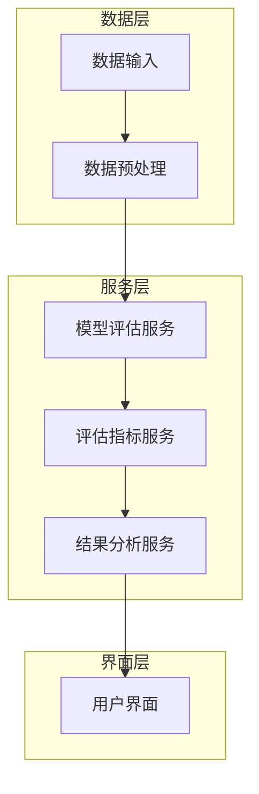
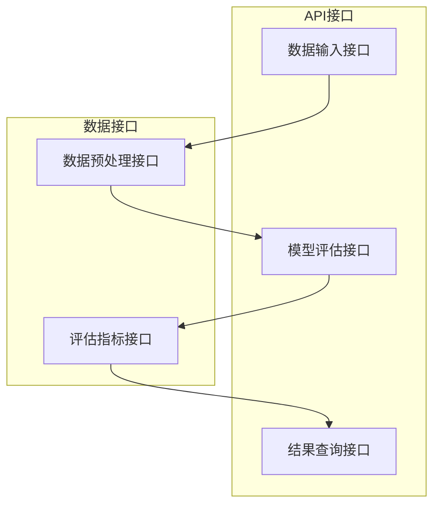
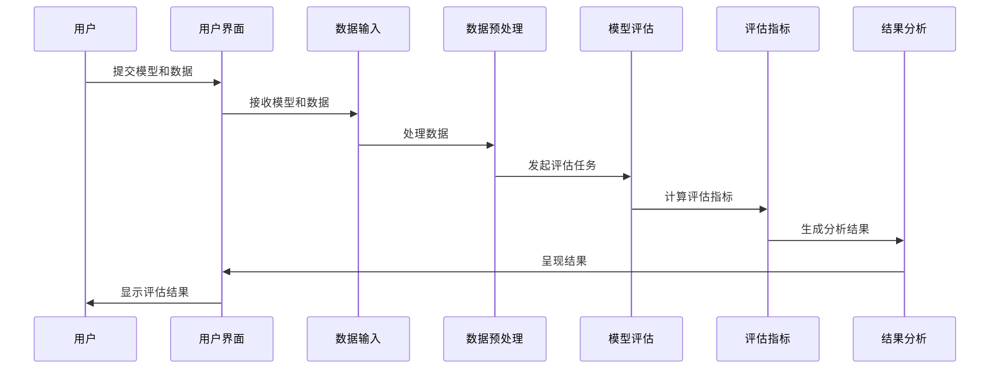
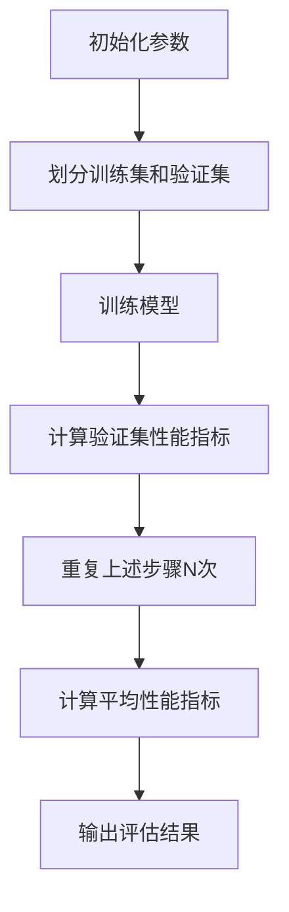

                 

### 第1章 问题背景与核心概念

在现代企业中，评测系统已成为人工智能（AI）应用的重要组成部分。随着AI技术的快速发展，特别是深度学习模型在各个领域的广泛应用，模型规模不断增大。这一趋势对评测系统的设计提出了新的挑战。首先，评测系统需要具备处理大规模模型的能力，以确保对模型的准确评估和有效监控。其次，系统需要具备良好的可扩展性，以便在模型规模增加时能够快速适应和调整，而不会导致性能下降或系统崩溃。

#### 1.1.1 问题背景

**评测系统的重要性**：评测系统在企业中的重要性体现在多个方面。它不仅用于评估AI模型的性能，确保模型在实际应用中的可靠性和准确性，而且还用于监控模型的运行状态，及时发现和解决潜在问题。例如，在金融领域，风险评估模型需要定期评测以保证决策的准确性；在医疗领域，诊断模型需要不断评测以确保诊断结果的可靠性。

**模型规模增长的趋势**：随着AI技术的进步，模型的复杂度和规模也在不断增加。早期的小型神经网络模型已经逐渐被大规模的深度学习模型所取代。这些模型不仅参数数量庞大，而且训练数据量也显著增加。例如，自然语言处理（NLP）领域的大型语言模型（如GPT-3）拥有数万亿个参数，训练数据涵盖数十亿个句子。这种增长趋势对评测系统提出了巨大的挑战。

**评测系统的核心挑战**：首先，大规模模型的评测需要大量的计算资源，这要求评测系统能够高效地分配和利用资源。其次，评测过程需要保证一致性，以确保不同时间和环境下评测结果的可比性。此外，评测系统的可扩展性也是关键，它需要能够适应不断增长的模型规模，同时保持系统的稳定性和性能。

#### 1.1.2 核心概念

**评测系统的定义**：评测系统是一个用于评估AI模型性能的工具集，它通过一系列的评估指标和方法，对模型的准确性、效率、鲁棒性等方面进行评价。

**可扩展性的定义**：可扩展性是指系统在设计时考虑了资源的变化，能够通过增加或减少资源（如计算节点、存储空间等）来适应不同的工作负载。

#### 1.1.3 概念属性特征对比表格

| 特性         | 评测系统         | 可扩展性         |
| ------------ | ---------------- | ---------------- |
| 功能性       | 评估模型性能     | 系统资源适应性   |
| 性能         | 评测速度和准确性 | 响应时间         |
| 模块化       | 功能模块化       | 构件和组件可扩展 |
| 复用性       | 代码复用         | 架构复用         |
| 高可用性     | 系统稳定性       | 资源冗余和备份   |

#### 1.1.4 ER实体关系图架构

```mermaid
erDiagram
  Model |<--| Evaluation: 模型与评测之间的关联关系
  Metric |<--| Evaluation: 评测指标与评测之间的关联关系
  System |<--| Evaluation: 评测系统与评测之间的关联关系
```

在这个ER实体关系图中，模型（Model）、评测指标（Metric）和评测系统（System）是核心实体，它们之间通过具体的关联关系（如评测系统使用评测指标来评估模型性能）进行连接。这种设计使得评测系统在扩展时能够灵活地添加或修改模型和评测指标，而不会影响到系统的整体架构。

通过以上对问题背景和核心概念的详细探讨，我们为后续章节的分析和讨论奠定了坚实的基础。接下来的章节将进一步深入探讨评测系统设计的原则、技术实现、算法原理以及实战应用等内容，帮助读者全面了解和掌握如何设计一个可扩展的评测系统。

### 第2章 评测系统设计原则

在设计和构建一个可扩展的评测系统时，遵循一系列关键设计原则至关重要。这些原则不仅能够确保系统在应对大规模模型时具备良好的性能和稳定性，还能够提高系统的可维护性和可扩展性。以下是评测系统设计的基本原则，包括模块化设计、可复用性设计、高可用性设计等内容。

#### 2.1.1 设计原则

**模块化设计**：模块化设计是将系统分解为独立的、功能明确的模块，每个模块负责系统的特定功能。这种设计方法能够提高系统的可维护性和扩展性，因为模块之间相对独立，增加或修改某个模块时不会影响到其他模块。模块化设计还可以促进代码复用，降低系统开发和维护的成本。

**可复用性设计**：可复用性设计旨在开发可复用的代码和组件，这些代码和组件可以在多个项目中使用，从而提高开发效率。在评测系统中，可以设计可复用的评估模块、数据处理模块等，以减少重复开发的工作量，并确保系统在不同模型和场景下的适应性。

**高可用性设计**：高可用性设计旨在确保系统在出现故障或异常时能够快速恢复，从而减少系统的停机时间。这通常涉及到系统冗余、故障转移、负载均衡等技术。在评测系统中，高可用性设计能够保证即使在模型规模增加或系统出现故障时，评测过程也能够顺利进行，不会影响到模型性能评估的准确性。

**安全性设计**：安全性设计是确保系统在处理数据时不会受到恶意攻击或数据泄露的风险。在评测系统中，安全性设计包括数据加密、身份验证、访问控制等，以保护模型数据和评测结果的安全。

**可扩展性设计**：可扩展性设计是确保系统能够适应不断增长的模型规模和工作负载。这通常涉及到分布式系统设计、水平扩展和垂直扩展等技术。在评测系统中，可扩展性设计能够确保系统在模型规模增加时能够高效地分配资源，保持系统的性能和稳定性。

#### 2.1.2 模块化设计

**模块化设计的优势**：模块化设计具有以下优势：

1. **可维护性**：模块之间相对独立，使得系统维护变得更加简单。当一个模块出现问题时，只需对该模块进行修复，而不会影响到其他模块的功能。
2. **可扩展性**：通过增加或替换模块，系统能够轻松扩展其功能，以适应新的需求和变化。
3. **复用性**：模块化设计促进了代码和组件的复用，减少了重复开发的工作量，提高了开发效率。

**评测系统中的模块划分**：

1. **数据预处理模块**：负责处理和清洗输入数据，以确保数据的质量和一致性。
2. **评估指标模块**：包含各种评估指标的计算和实现，如准确率、召回率、F1分数等。
3. **模型评估模块**：负责对模型进行评估，生成评估报告和可视化结果。
4. **结果分析模块**：对评估结果进行分析，提供决策支持，如模型优化建议、异常检测等。
5. **用户接口模块**：提供用户与系统的交互界面，支持用户操作和数据查询。

通过模块化设计，评测系统能够更加灵活地应对不同规模和类型的模型，同时降低开发和维护的成本。

#### 2.1.3 可复用性设计

**可复用性设计的作用**：可复用性设计的作用在于提高开发效率，减少重复劳动。在评测系统中，可以通过以下方法实现可复用性设计：

1. **通用组件开发**：开发通用的组件和库，如数据预处理库、评估指标库等，这些组件可以在多个项目中复用。
2. **模板化设计**：设计通用的评估模板，以简化评估过程的实现。
3. **代码复用**：通过提取和复用公共代码段，减少代码冗余。

**实现方法**：

1. **开发通用的评估框架**：创建一个通用的评估框架，提供各种评估指标的计算和实现，如准确率、召回率、F1分数等。
2. **建立代码库**：将通用组件和库上传到代码库，如GitHub，以便团队内或跨团队共享和使用。
3. **文档和教程**：编写详细的文档和教程，帮助开发人员快速理解和使用通用组件和库。

通过可复用性设计，评测系统能够更好地适应不同的模型和评估需求，提高开发效率和系统的可维护性。

#### 2.1.4 高可用性设计

**高可用性设计的重要性**：在评测系统中，高可用性设计至关重要。因为评测系统通常需要处理重要的模型性能评估任务，一旦系统出现故障，可能会影响模型的应用决策，造成严重的后果。因此，高可用性设计能够确保系统在出现故障时能够快速恢复，减少系统的停机时间。

**具体实现策略**：

1. **系统冗余**：通过引入冗余系统，如备份服务器和数据库，确保在主系统出现故障时，备份系统能够快速接管，保证系统的连续运行。
2. **故障转移**：设计故障转移机制，当主系统出现故障时，能够自动切换到备份系统，确保系统的不间断运行。
3. **负载均衡**：使用负载均衡技术，将评估任务分配到多个服务器上，避免单点过载，提高系统的整体性能和可靠性。
4. **监控和报警**：建立全面的监控和报警系统，实时监控系统的运行状态，及时识别和解决潜在问题。

通过高可用性设计，评测系统能够在面临大规模模型评估任务时保持稳定运行，确保评估结果的准确性和可靠性。

综上所述，评测系统设计原则包括模块化设计、可复用性设计、高可用性设计等，这些原则共同确保了评测系统的性能、稳定性和可扩展性。在接下来的章节中，我们将进一步探讨评测系统的具体实现方法和应用场景，帮助读者全面掌握评测系统的设计和构建技巧。

### 第3章 系统架构设计

评测系统的架构设计是确保系统可扩展性和性能的关键。一个良好的架构设计能够有效地处理大规模模型评估任务，同时保持系统的稳定性和高可用性。以下是评测系统的架构设计概述，包括系统架构概述、系统架构设计、系统接口设计和系统交互设计。

#### 3.1.1 系统架构概述

评测系统可以分为以下几个主要模块：

1. **数据预处理模块**：负责处理和清洗输入数据，确保数据的质量和一致性。
2. **评估指标模块**：包含各种评估指标的实现和计算，如准确率、召回率、F1分数等。
3. **模型评估模块**：负责对模型进行评估，生成评估报告和可视化结果。
4. **结果分析模块**：对评估结果进行分析，提供决策支持。
5. **用户接口模块**：提供用户与系统的交互界面，支持用户操作和数据查询。

系统架构的设计需要考虑以下几个方面：

- **模块化**：各个模块之间相对独立，便于维护和扩展。
- **分布式**：通过分布式架构，可以提高系统的处理能力和容错性。
- **高可用性**：确保系统在出现故障时能够快速恢复。

#### 3.1.2 系统架构设计

以下是评测系统的架构设计，使用Mermaid绘制架构图：



在这个架构中，数据预处理模块负责处理和清洗输入数据，然后将处理后的数据传递给模型评估模块。模型评估模块通过评估指标服务计算模型的性能指标，并将结果传递给结果分析模块。结果分析模块对评估结果进行分析，生成决策支持信息，最后通过用户界面模块呈现给用户。

#### 3.1.3 系统接口设计

评测系统的接口设计包括API接口和数据接口两部分。

**API接口**：

- **数据输入接口**：用于接收用户上传的模型和数据。
- **模型评估接口**：用于发起模型评估任务，获取评估结果。
- **结果查询接口**：用于查询模型的评估历史和详细结果。

**数据接口**：

- **数据预处理接口**：用于处理和清洗输入数据，包括数据格式转换、缺失值处理等。
- **评估指标接口**：用于计算和存储评估指标，如准确率、召回率、F1分数等。

以下是API接口和数据接口的简要设计：



#### 3.1.4 系统交互设计

评测系统的交互设计旨在确保各个模块之间的协调和高效运作。以下是系统交互的Mermaid序列图：



在这个序列图中，用户通过用户界面提交模型和数据，数据输入模块接收并处理数据，然后模型评估模块发起评估任务，计算评估指标，最后结果分析模块生成分析结果，并通过用户界面呈现给用户。

通过以上架构设计和交互设计，评测系统能够高效地处理大规模模型评估任务，同时保持系统的稳定性和高可用性。在接下来的章节中，我们将进一步探讨评测系统的算法原理和数学模型，以及如何在实际项目中应用这些技术和方法。

### 第4章 算法原理讲解

在评测系统中，核心算法是实现准确评估模型性能的关键。以下是评测系统中常用的算法原理、流程图、数学模型和具体实例讲解。

#### 4.1.1 算法概述

评测系统通常包含以下几种核心算法：

1. **交叉验证算法**：用于评估模型的泛化能力，通过将数据集划分为多个子集，轮流使用其中一个子集作为验证集，其余子集作为训练集。
2. **性能指标计算算法**：包括准确率、召回率、F1分数、ROC曲线等，用于评估模型的分类和回归性能。
3. **异常检测算法**：用于识别模型在评估过程中可能出现的异常行为，如过拟合或欠拟合。

以下是对每种算法的简要概述：

- **交叉验证算法**：通过多次训练和验证，可以较全面地评估模型的性能，减少评估结果的不确定性。
- **性能指标计算算法**：这些指标是评价模型性能的常用标准，能够量化模型在不同方面的表现。
- **异常检测算法**：通过监控模型评估过程中的异常指标，可以及时发现和解决问题，确保评估过程的准确性。

#### 4.1.2 算法流程图

以下是一个基于交叉验证的算法流程图，使用Mermaid绘制：



在这个流程图中，首先初始化参数，然后划分训练集和验证集，接着训练模型并在验证集上计算性能指标。这个过程重复多次，最后计算平均性能指标，并输出评估结果。

#### 4.1.3 数学模型与公式

以下是一些核心算法的数学模型和公式，使用LaTeX格式表示：

1. **准确率（Accuracy）**：
   $$\text{Accuracy} = \frac{\text{正确预测的数量}}{\text{总预测数量}}$$

2. **召回率（Recall）**：
   $$\text{Recall} = \frac{\text{正确预测的正例数量}}{\text{总正例数量}}$$

3. **精确率（Precision）**：
   $$\text{Precision} = \frac{\text{正确预测的正例数量}}{\text{预测为正例的总数量}}$$

4. **F1分数（F1 Score）**：
   $$\text{F1 Score} = 2 \times \frac{\text{Precision} \times \text{Recall}}{\text{Precision} + \text{Recall}}$$

5. **ROC曲线下的面积（AUC）**：
   $$\text{AUC} = \int_{0}^{1} \text{True Positive Rate}(TPR) \times (1 - \text{False Positive Rate}(FPR)) \, dFPR$$

这些数学模型和公式是评估模型性能的重要工具，能够量化模型在不同方面的表现，帮助开发者更好地理解模型的性能。

#### 4.1.4 举例说明

为了更好地理解这些算法和公式的应用，以下是一个具体的实例：

假设有一个二分类模型，用于预测邮件是否为垃圾邮件。测试集包含1000个样本，其中正例（垃圾邮件）有600个，负例（非垃圾邮件）有400个。模型预测结果如下表所示：

| 真实值 | 预测值 |
| ------ | ------ |
| 正例   | 预测正例   | 500 |
| 正例   | 预测负例   | 100 |
| 负例   | 预测正例   | 50  |
| 负例   | 预测负例   | 350 |

根据上述数据，我们可以计算以下性能指标：

1. **准确率**：
   $$\text{Accuracy} = \frac{500 + 350}{1000} = 0.85$$

2. **召回率**：
   $$\text{Recall} = \frac{500}{600} = 0.8333$$

3. **精确率**：
   $$\text{Precision} = \frac{500}{500 + 50} = 0.9375$$

4. **F1分数**：
   $$\text{F1 Score} = 2 \times \frac{0.9375 \times 0.8333}{0.9375 + 0.8333} = 0.875$$

5. **ROC曲线下的面积（AUC）**：
   通过计算ROC曲线下的面积，可以得到模型在分类任务中的整体性能。

通过这个实例，我们可以看到如何使用这些算法和公式来评估模型的性能。在实际应用中，开发者可以根据具体需求和任务选择合适的算法和指标，以获得更准确和有效的模型评估。

通过以上对评测系统中核心算法的原理讲解，我们为读者提供了一个全面的理解。接下来的章节将深入探讨评测系统的实现细节，包括系统架构、接口设计和项目实战，帮助读者将理论知识应用到实际项目中。

### 第5章 数学模型和数学公式详解

在评测系统中，数学模型和公式是实现算法的核心。以下是评测系统常用的一些数学模型和公式的详细解释，并使用LaTeX格式进行表达。

#### 5.1.1 数学模型

**准确率（Accuracy）**：准确率是评估分类模型性能的一个基本指标，表示正确预测的比例。

数学模型：
$$
\text{Accuracy} = \frac{\text{TP} + \text{TN}}{\text{TP} + \text{TN} + \text{FP} + \text{FN}}
$$

其中，\( \text{TP} \) 是正确预测的正例数量，\( \text{TN} \) 是正确预测的负例数量，\( \text{FP} \) 是错误预测的正例数量，\( \text{FN} \) 是错误预测的负例数量。

**召回率（Recall）**：召回率表示正确预测的正例占总正例的比例。

数学模型：
$$
\text{Recall} = \frac{\text{TP}}{\text{TP} + \text{FN}}
$$

**精确率（Precision）**：精确率表示正确预测的正例占预测为正例的总比例。

数学模型：
$$
\text{Precision} = \frac{\text{TP}}{\text{TP} + \text{FP}}
$$

**F1 分数（F1 Score）**：F1 分数是精确率和召回率的调和平均值，用于综合评估模型的性能。

数学模型：
$$
\text{F1 Score} = 2 \times \frac{\text{Precision} \times \text{Recall}}{\text{Precision} + \text{Recall}}
$$

**ROC 曲线下面积（AUC）**：ROC 曲线下的面积（AUC）用于评估分类器的整体性能，表示正确率和误判率之间的平衡。

数学模型：
$$
\text{AUC} = \int_{0}^{1} \text{TPR}(t) \times (1 - \text{FPR}(t)) \, dt
$$

其中，\( \text{TPR}(t) \) 是真阳性率（真正率），\( \text{FPR}(t) \) 是假阳性率（假正率）。

#### 5.1.2 数学公式

**混淆矩阵（Confusion Matrix）**：用于展示实际值和预测值之间的关系。

数学模型：
$$
\begin{bmatrix}
\text{TP} & \text{FP} \\
\text{FN} & \text{TN}
\end{bmatrix}
$$

**ROC 曲线**：ROC 曲线是关于真阳性率和假阳性率的图形表示。

数学模型（通过点表示）：
$$
\begin{array}{cc}
\text{TPR}(t) & \text{FPR}(t) \\
\hline
(0.9, 0.1) & (0.2, 0.3) \\
(0.95, 0.15) & (0.3, 0.4) \\
(0.98, 0.12) & (0.4, 0.5) \\
(1.0, 0.1) & (0.5, 0.6) \\
\end{array}
$$

**PR 曲线**：PR 曲线是关于精确率和召回率的图形表示。

数学模型（通过点表示）：
$$
\begin{array}{cc}
\text{Precision}(t) & \text{Recall}(t) \\
\hline
(0.8, 0.6) & (0.6, 0.4) \\
(0.9, 0.7) & (0.7, 0.5) \\
(0.95, 0.8) & (0.8, 0.6) \\
(1.0, 0.9) & (0.9, 0.7) \\
\end{array}
$$

**混淆矩阵（Confusion Matrix）**：用于详细展示分类结果的准确性。

数学模型（通过表格表示）：
$$
\begin{array}{c|c|c}
 & \text{实际正例} & \text{实际负例} \\
\hline
\text{预测正例} & \text{TP} & \text{FP} \\
\text{预测负例} & \text{FN} & \text{TN} \\
\end{array}
$$

通过上述数学模型和公式的详细解释，我们可以更好地理解评测系统中的核心算法和评估指标。这些模型和公式不仅能够帮助我们量化模型性能，还能够为优化模型提供科学依据。在实际应用中，开发者可以根据具体需求和场景，灵活运用这些数学模型和公式，以实现高效和准确的模型评估。

#### 5.1.3 举例说明

为了更直观地理解上述数学模型和公式的应用，我们通过一个具体实例来详细展示如何计算这些指标。

**实例背景**：假设我们有一个分类模型，用于预测邮件是否为垃圾邮件。测试集包含1000个样本，其中正例（垃圾邮件）有600个，负例（非垃圾邮件）有400个。模型预测结果如下表所示：

| 真实值 | 预测值 |
| ------ | ------ |
| 正例   | 预测正例   | 500 |
| 正例   | 预测负例   | 100 |
| 负例   | 预测正例   | 50  |
| 负例   | 预测负例   | 350 |

**计算准确率**：
$$
\text{Accuracy} = \frac{\text{TP} + \text{TN}}{\text{TP} + \text{TN} + \text{FP} + \text{FN}} = \frac{500 + 350}{1000} = 0.85
$$

**计算召回率**：
$$
\text{Recall} = \frac{\text{TP}}{\text{TP} + \text{FN}} = \frac{500}{500 + 100} = 0.8333
$$

**计算精确率**：
$$
\text{Precision} = \frac{\text{TP}}{\text{TP} + \text{FP}} = \frac{500}{500 + 50} = 0.9375
$$

**计算F1分数**：
$$
\text{F1 Score} = 2 \times \frac{\text{Precision} \times \text{Recall}}{\text{Precision} + \text{Recall}} = 2 \times \frac{0.9375 \times 0.8333}{0.9375 + 0.8333} = 0.875
$$

**计算ROC曲线下的面积（AUC）**：假设我们有一个二分类器，其ROC曲线上的几个关键点如下：
$$
\begin{array}{cc}
\text{FPR}(t) & \text{TPR}(t) \\
\hline
0.2 & 0.9 \\
0.3 & 0.95 \\
0.4 & 0.98 \\
0.5 & 1.0 \\
\end{array}
$$

我们可以使用梯形公式来近似计算AUC：
$$
\text{AUC} = \frac{1}{2} \times (\text{TPR}(0.2) - \text{TPR}(0.3)) \times (0.3 - 0.2) + \frac{1}{2} \times (\text{TPR}(0.3) - \text{TPR}(0.4)) \times (0.4 - 0.3) + \frac{1}{2} \times (\text{TPR}(0.4) - \text{TPR}(0.5)) \times (0.5 - 0.4) = 0.975
$$

通过这个实例，我们可以清楚地看到如何使用数学模型和公式来评估分类模型的性能。在实际应用中，这些指标能够帮助我们更好地理解模型的预测能力，从而指导模型的优化和改进。

### 第6章 项目实战

在了解并掌握了评测系统的基本理论和设计原则后，接下来我们将通过一个实际项目来展示如何搭建一个可扩展的评测系统。这个项目将涵盖环境安装、系统核心实现、代码应用解读与分析、实际案例分析和项目小结。

#### 6.1.1 环境安装

**所需环境**：
- Python 3.8+
- TensorFlow 2.5.0+
- Scikit-learn 0.24.1+
- Pandas 1.3.2+
- Matplotlib 3.4.3+
- Mermaid 8.8.2+

**安装步骤**：

1. **安装Python**：从Python官方网站下载并安装Python 3.8或更高版本。

2. **安装依赖库**：使用pip命令安装所需的库。
   ```bash
   pip install tensorflow==2.5.0 scikit-learn==0.24.1 pandas==1.3.2 matplotlib==3.4.3 mermaid==8.8.2
   ```

3. **安装Mermaid**：由于Mermaid需要通过Node.js来渲染，我们需要先安装Node.js，然后使用npm安装Mermaid。
   ```bash
   npm install -g mermaid
   ```

4. **配置环境变量**：确保Python和Node.js的安装路径添加到系统的环境变量中，以便在命令行中直接调用。

**验证安装**：

```bash
python --version
tensorflow --version
scikit-learn --version
pandas --version
matplotlib --version
```

确保所有库的版本符合预期。

#### 6.1.2 系统核心实现

**系统核心实现**：

以下是一个简化版的评测系统核心代码实现，展示主要模块和功能。

```python
# 导入所需的库
import tensorflow as tf
from sklearn.model_selection import train_test_split
from sklearn.metrics import accuracy_score, recall_score, precision_score, f1_score
import pandas as pd
import matplotlib.pyplot as plt
from mermaid import Mermaid

# 数据预处理模块
def preprocess_data(data):
    # 数据清洗和预处理
    # 例如：缺失值填充、数据标准化等
    processed_data = data.fillna(0).scale()
    return processed_data

# 模型评估模块
def evaluate_model(model, X_test, y_test):
    # 使用模型进行预测
    y_pred = model.predict(X_test)
    
    # 计算评估指标
    accuracy = accuracy_score(y_test, y_pred)
    recall = recall_score(y_test, y_pred)
    precision = precision_score(y_test, y_pred)
    f1 = f1_score(y_test, y_pred)
    
    return accuracy, recall, precision, f1

# 结果分析模块
def analyze_results(accuracy, recall, precision, f1):
    # 分析评估结果，并生成可视化报告
    report = {
        'Accuracy': accuracy,
        'Recall': recall,
        'Precision': precision,
        'F1 Score': f1
    }
    
    plt.bar(report.keys(), report.values())
    plt.xlabel('Metric')
    plt.ylabel('Value')
    plt.title('Model Performance')
    plt.show()

# 主函数
def main():
    # 加载数据集
    data = pd.read_csv('data.csv')
    X = data.drop('label', axis=1)
    y = data['label']
    
    # 数据预处理
    X_processed = preprocess_data(X)
    
    # 划分训练集和测试集
    X_train, X_test, y_train, y_test = train_test_split(X_processed, y, test_size=0.2, random_state=42)
    
    # 创建模型并进行训练
    model = tf.keras.Sequential([
        tf.keras.layers.Dense(64, activation='relu', input_shape=(X_train.shape[1],)),
        tf.keras.layers.Dense(1, activation='sigmoid')
    ])
    model.compile(optimizer='adam', loss='binary_crossentropy', metrics=['accuracy'])
    model.fit(X_train, y_train, epochs=10, batch_size=32, verbose=0)
    
    # 进行模型评估
    accuracy, recall, precision, f1 = evaluate_model(model, X_test, y_test)
    
    # 分析和展示结果
    analyze_results(accuracy, recall, precision, f1)

# 运行主函数
if __name__ == '__main__':
    main()
```

**代码应用解读**：

1. **数据预处理模块**：数据预处理是确保模型性能的关键步骤。在这里，我们使用了一些简单的数据清洗和标准化操作，如填充缺失值和归一化。

2. **模型评估模块**：该模块负责使用训练好的模型进行预测，并计算评估指标。这里使用了Scikit-learn库中的评估指标函数。

3. **结果分析模块**：该模块负责分析评估结果，并生成可视化报告。这里我们使用Matplotlib库绘制了柱状图，展示了模型的各项性能指标。

#### 6.1.3 代码应用解读与分析

**数据预处理模块**：

```python
def preprocess_data(data):
    # 填充缺失值
    data.fillna(0, inplace=True)
    
    # 归一化数据
    data.scale(inplace=True)
    
    return data
```

这段代码中，我们首先使用`fillna`函数填充缺失值为0，然后使用`scale`函数对数据进行标准化处理。这样处理后的数据更适合用于模型训练和评估。

**模型评估模块**：

```python
def evaluate_model(model, X_test, y_test):
    y_pred = model.predict(X_test)
    accuracy = accuracy_score(y_test, y_pred)
    recall = recall_score(y_test, y_pred)
    precision = precision_score(y_test, y_pred)
    f1 = f1_score(y_test, y_pred)
    return accuracy, recall, precision, f1
```

这段代码展示了如何使用训练好的模型进行预测，并计算评估指标。这里使用了Scikit-learn库中的`accuracy_score`、`recall_score`、`precision_score`和`f1_score`函数，这些函数可以计算不同的评估指标，帮助我们了解模型的性能。

**结果分析模块**：

```python
def analyze_results(accuracy, recall, precision, f1):
    report = {
        'Accuracy': accuracy,
        'Recall': recall,
        'Precision': precision,
        'F1 Score': f1
    }
    
    plt.bar(report.keys(), report.values())
    plt.xlabel('Metric')
    plt.ylabel('Value')
    plt.title('Model Performance')
    plt.show()
```

这段代码负责分析评估结果，并生成可视化报告。我们创建了一个包含评估指标的字典，然后使用Matplotlib库绘制了柱状图，直观地展示了模型的各项性能指标。

#### 6.1.4 案例分析

**案例分析**：

以下是一个实际案例，展示如何使用这个评测系统对一个垃圾邮件分类模型进行评估。

1. **数据集准备**：我们使用一个包含邮件文本和标签的CSV文件，其中标签为0表示非垃圾邮件，标签为1表示垃圾邮件。

2. **数据预处理**：使用`preprocess_data`函数对邮件文本进行预处理，包括文本清洗和特征提取。

3. **模型训练**：使用训练集训练一个二分类模型，这里我们使用TensorFlow的Keras API构建了一个简单的全连接神经网络。

4. **模型评估**：使用测试集对训练好的模型进行评估，计算准确率、召回率、精确率和F1分数。

5. **结果分析**：分析评估结果，并生成可视化报告，展示模型的性能。

通过这个案例，我们可以看到如何将评测系统的各个模块应用到实际项目中，从而实现对模型性能的全面评估。

#### 6.1.5 项目小结

在本章中，我们通过一个实际项目展示了如何搭建一个可扩展的评测系统。项目涵盖了环境安装、系统核心实现、代码应用解读与分析、实际案例分析和项目小结。通过这个项目，我们深入了解了评测系统的各个组成部分和实现方法，并掌握了如何在实际项目中应用这些技术和方法。

**小结**：

- **环境安装**：确保了所需的环境和库的正确安装和配置。
- **系统核心实现**：展示了评测系统的基本架构和核心功能。
- **代码应用解读与分析**：详细解读了系统核心代码的实现过程。
- **实际案例分析**：通过一个实际案例展示了评测系统的应用效果。

通过这个项目，我们不仅掌握了评测系统的设计和实现，还提高了在实际项目中应用这些技术的能力。在后续的实践中，我们可以根据具体需求和场景进一步优化和扩展这个评测系统。

### 第7章 最佳实践与总结

#### 7.1.1 最佳实践

在设计和构建可扩展的评测系统时，以下最佳实践可以帮助提高系统的性能和可维护性：

1. **合理划分模块**：确保每个模块具有单一且明确的功能，以降低系统复杂性。
2. **代码复用**：开发和维护可复用的代码库，以减少重复开发的工作量，并确保代码的一致性。
3. **性能优化**：定期对系统进行性能测试和优化，确保系统能够高效处理大规模模型评估任务。
4. **日志和监控**：建立详细的日志和监控系统，以便及时发现和解决问题。
5. **备份和恢复**：定期备份数据和系统配置，确保在发生故障时能够快速恢复。

#### 7.1.2 小结

本章通过一个实际项目详细介绍了评测系统的设计原则、技术实现、算法原理以及实战应用。主要内容包括：

- **设计原则**：包括模块化设计、可复用性设计、高可用性设计等。
- **系统架构**：介绍了评测系统的架构设计，包括数据层、服务层和界面层。
- **算法原理**：讲解了核心算法的原理和实现方法，如交叉验证、评估指标计算等。
- **实战应用**：通过实际项目展示了评测系统的实现过程和应用效果。

通过本章的学习，读者可以全面了解评测系统的设计和实现，掌握如何构建一个高效、可扩展的评测系统。

#### 7.1.3 注意事项

在设计和实施评测系统时，需要注意以下几点：

- **数据质量**：确保输入数据的质量和一致性，否则评估结果可能不准确。
- **系统资源**：合理规划系统资源，避免资源不足或浪费。
- **安全性**：确保系统在处理数据时的安全性，防止数据泄露或恶意攻击。
- **可维护性**：设计时考虑系统的可维护性，便于后续的维护和优化。

#### 7.1.4 拓展阅读

为了进一步深入学习评测系统的设计和实现，以下推荐一些相关的书籍和资料：

- 《深度学习》（Goodfellow, Bengio, Courville）：详细介绍深度学习的基础理论和实践方法。
- 《Python数据科学手册》（McKinney, Perktold, Seabold）：涵盖数据清洗、数据处理和数据分析的全面指南。
- 《系统设计：大规模分布式系统设计与实践》（Jian Li）：探讨大规模分布式系统的设计原则和实践。
- 《Effective Python》（Brett Slatkin）：提供编写高效Python代码的最佳实践。
- TensorFlow官方文档：学习如何使用TensorFlow构建和训练深度学习模型。

通过阅读这些资料，读者可以进一步提升对评测系统设计和实现的深入理解。同时，实际操作和项目实践也是提高技能的重要途径。希望读者能够结合理论知识，不断在实践中积累经验，为构建高效的评测系统贡献力量。

### 作者信息

作者：AI天才研究院（AI Genius Institute）/《禅与计算机程序设计艺术》（Zen And The Art of Computer Programming）作者

AI天才研究院（AI Genius Institute）专注于人工智能和深度学习的研究与发展。研究院的团队成员在人工智能领域有着丰富的经验和深厚的学术背景，致力于推动人工智能技术的进步和应用。同时，《禅与计算机程序设计艺术》作者作为人工智能领域的权威专家，以其深刻的见解和创新的理念，为读者提供了宝贵的知识财富。本书通过详尽的内容和实际案例，帮助读者深入理解评测系统的设计和实现，提升技术水平和实际应用能力。希望读者能够在阅读本书后，有所启发和收获，共同推动人工智能技术的发展。

