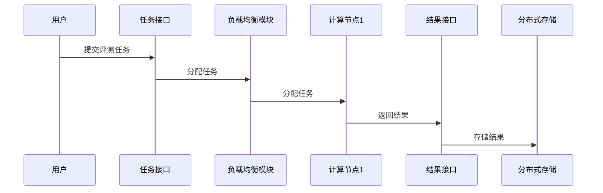

                 

## 评测系统的可扩展性：应对不同规模LLM的策略

### 关键词：评测系统，可扩展性，LLM，分布式存储，并行计算，负载均衡，自动化运维

> 摘要：本文将深入探讨评测系统的可扩展性问题，特别是在应对不同规模的大规模语言模型（LLM）时。文章首先介绍了评测系统在人工智能领域的重要性，随后分析了评测系统所面临的挑战，并提出了可扩展性设计原则和实现策略。通过分布式存储、并行计算、负载均衡和自动化运维等策略，本文旨在为构建可扩展性评测系统提供有力的指导。

### 第一部分：引言

#### 1.1 问题的背景

随着人工智能技术的迅猛发展，评测系统在自然语言处理、计算机视觉、语音识别等领域的应用愈发广泛。这些应用场景对评测系统的要求越来越高，特别是在面对不同规模的语言模型时，如何保证评测系统的可扩展性成为一个关键问题。

##### 1.1.1 评测系统在人工智能中的应用

在人工智能领域，评测系统通常用于评估模型的表现，帮助研究人员优化算法、改进模型。随着LLM的规模不断扩大，评测系统不仅要处理更大的数据量，还要保证评测的实时性、准确性和稳定性。

##### 1.1.2 不同规模LLM的评测需求

小规模模型通常对实时性、准确性和稳定性有较高要求，而大规模模型则更注重资源的利用效率和系统的吞吐量。这就要求评测系统必须具备良好的可扩展性，以满足不同规模LLM的评测需求。

#### 1.2 问题的描述

##### 1.2.1 评测系统的挑战

随着LLM规模的增大，评测系统面临的挑战主要包括：

- **数据存储**：大规模数据存储的需求增加，传统单点存储方式面临容量瓶颈。
- **计算资源**：大规模计算任务需要更多的计算资源，单一计算节点难以满足需求。
- **网络传输**：大规模数据的传输需要更高的带宽和更高效的传输机制。
- **系统维护**：随着系统规模的扩大，维护成本和难度也显著增加。

##### 1.2.2 评测需求差异

不同规模的LLM对评测系统的要求差异较大，小规模模型侧重于实时性和准确性，而大规模模型则更注重资源的利用效率和系统的吞吐量。因此，评测系统需要具备灵活的扩展能力，以适应不同规模的LLM。

#### 1.3 问题的解决

##### 1.3.1 可扩展性设计原则

为了解决上述问题，评测系统的设计需要遵循以下原则：

- **模块化设计**：将系统划分为多个模块，每个模块独立扩展，提高系统的可维护性和可扩展性。
- **分布式架构**：采用分布式架构，通过多个节点协同工作，提高系统的处理能力和稳定性。
- **弹性调度**：根据负载动态调整资源分配，确保系统在高负载下仍能保持良好的性能。
- **自动化运维**：通过自动化工具和流程，降低运维成本，提高系统稳定性。

##### 1.3.2 可扩展性实现策略

具体实现策略包括：

- **分布式存储**：采用分布式文件系统，提高数据存储的可靠性和扩展性。
- **并行计算**：利用多节点并行计算，提高处理效率和吞吐量。
- **负载均衡**：通过负载均衡技术，合理分配任务，提高系统的整体性能。
- **自动化运维**：采用自动化工具和平台，实现系统监控、故障恢复和性能优化。

#### 1.4 边界与外延

##### 1.4.1 边界

本文主要讨论评测系统的可扩展性问题，不包括其他非可扩展性问题，如算法优化、模型训练等。

##### 1.4.2 外延

本文内容可应用于各类评测系统，如自然语言处理、计算机视觉、语音识别等。

#### 1.5 概念结构与核心要素组成

##### 1.5.1 概念结构

评测系统可扩展性的概念结构主要包括以下几个方面：

- **评测系统架构**：包括分布式存储、计算资源、网络传输和系统维护等。
- **资源调度策略**：负责资源分配和任务调度，确保系统高效运行。
- **负载均衡机制**：通过负载均衡技术，合理分配任务，提高系统性能。
- **自动化运维**：通过自动化工具和流程，实现系统监控、故障恢复和性能优化。

##### 1.5.2 核心要素组成

评测系统的核心要素包括以下几个方面：

- **评测任务分发**：负责将评测任务分配到不同的计算节点。
- **计算资源调度**：根据任务需求动态调整计算资源分配。
- **结果收集与存储**：将评测结果收集并存储，为后续分析提供数据支持。

#### 1.6 背景介绍

##### 1.6.1 评测系统在人工智能领域的重要性

评测系统是人工智能领域的重要组成部分，对于模型性能评估、算法优化和实际应用具有重要作用。随着人工智能技术的快速发展，评测系统的需求日益增加，其可扩展性显得尤为重要。

##### 1.6.2 评测系统的核心概念

评测系统的核心概念包括：

- **评测任务**：指评估模型性能的具体任务，如自然语言处理的文本分类、文本生成等。
- **评测指标**：用于衡量模型性能的具体指标，如准确率、召回率、F1值等。
- **评测方法**：指评估模型性能的具体方法，如基于准确率的评估、基于召回率的评估等。
- **评测流程**：指评估模型性能的具体流程，包括数据准备、模型评测、结果分析等。

##### 1.6.3 评测系统的挑战

评测系统的挑战主要包括：

- **数据量大**：随着模型规模的增大，评测数据量也随之增大，对存储和计算资源提出更高要求。
- **计算复杂度高**：大规模模型评测需要处理大量计算任务，对计算资源的要求更高。
- **系统稳定性要求高**：评测系统需要保证在大量任务和高负载情况下仍能稳定运行，避免出现故障。

### 第二部分：核心概念与联系

#### 2.1 可扩展性定义与属性特征对比

##### 2.1.1 可扩展性定义

可扩展性是指系统在资源增加时，性能能够保持稳定，甚至提升的能力。在评测系统中，可扩展性主要表现在数据存储、计算资源、网络传输和系统维护等方面。

##### 2.1.2 可扩展性属性特征对比表格

| 属性特征 | 传统评测系统 | 可扩展性评测系统 |
| :--- | :--- | :--- |
| 数据存储 | 单点存储，容量受限 | 分布式存储，容量无限扩展 |
| 计算资源 | 单一计算节点，资源有限 | 多计算节点，资源动态分配 |
| 网络传输 | 数据传输效率低，带宽受限 | 高效网络传输，带宽动态调整 |
| 系统维护 | 依赖人工维护，效率低 | 自动化运维，高效稳定 |

##### 2.1.3 可扩展性评测系统与传统评测系统的区别

可扩展性评测系统与传统评测系统在数据存储、计算资源、网络传输和系统维护等方面具有显著区别：

- **数据存储**：传统评测系统通常采用单点存储，容量受限，而可扩展性评测系统采用分布式存储，容量无限扩展，能够更好地应对大规模数据存储需求。
- **计算资源**：传统评测系统依赖于单一计算节点，资源有限，而可扩展性评测系统通过多计算节点协同工作，资源动态分配，能够提高处理效率和吞吐量。
- **网络传输**：传统评测系统数据传输效率低，带宽受限，而可扩展性评测系统采用高效网络传输，带宽动态调整，能够更好地支持大规模数据传输。
- **系统维护**：传统评测系统依赖人工维护，效率低，而可扩展性评测系统通过自动化运维，高效稳定，能够降低运维成本，提高系统稳定性。

### 第三部分：算法原理讲解

#### 3.1 分布式存储算法原理

##### 3.1.1 数据分片原理

分布式存储算法的核心思想是将大量数据划分为多个小数据块，并分配到不同的节点上进行存储。数据分片可以提高数据的读写效率，降低单点故障的风险。

###### 3.1.1.1 数据分片步骤

1. **数据划分**：将原始数据划分为多个小块。
2. **数据分配**：将划分后的数据块分配到不同的节点上进行存储。
3. **数据一致性**：保证数据在不同节点之间的一致性。

###### 3.1.1.2 数据分片算法实现

以下是一个简单的数据分片算法实现：

```python
def shard_data(data, num_shards):
    shard_size = len(data) // num_shards
    shards = []
    for i in range(num_shards):
        start = i * shard_size
        end = (i + 1) * shard_size
        shards.append(data[start:end])
    return shards
```

此算法将数据划分为指定数量的数据块，每个数据块存储在不同的节点上。

##### 3.1.2 负载均衡算法原理

负载均衡是将请求平均分配到多个节点上进行处理，以提高系统的吞吐量和稳定性。常用的负载均衡算法包括轮询算法、最小连接数算法和加权随机算法等。

###### 3.1.2.1 轮询算法

轮询算法按照顺序依次将请求分配到各个节点，具有简单的实现和较好的负载均衡效果。

###### 3.1.2.2 最小连接数算法

最小连接数算法将请求分配到当前连接数最少的节点，以避免某个节点过载。

###### 3.1.2.3 加权随机算法

加权随机算法根据节点的权重（如处理能力、负载情况等）随机选择节点，以提高负载均衡效果。

##### 3.1.3 分布式存储算法总结

分布式存储算法通过数据分片和负载均衡，提高数据的存储效率和系统的稳定性。在实际应用中，根据具体需求和场景，可以选择合适的算法进行优化。

#### 3.2 并行计算算法原理

##### 3.2.1 任务调度原理

并行计算是利用多个计算节点同时处理大量任务，以提高计算效率和性能。任务调度的核心是合理分配任务到不同的节点上，确保系统高效运行。

###### 3.2.1.1 任务调度步骤

1. **任务分解**：将大任务分解为多个小任务。
2. **任务分配**：将小任务分配到不同的节点上进行处理。
3. **结果合并**：将各个节点的处理结果合并，得到最终结果。

###### 3.2.1.2 任务调度算法实现

以下是一个简单的任务调度算法实现：

```python
def schedule_tasks(tasks, num_nodes):
    node_task分配 = [[] for _ in range(num_nodes)]
    for task in tasks:
        min_len = len(node_task分配[0])
        min_index = 0
        for i in range(1, num_nodes):
            if len(node_task分配[i]) < min_len:
                min_len = len(node_task分配[i])
                min_index = i
        node_task分配[min_index].append(task)
    return node_task分配
```

此算法将任务根据节点的负载情况动态分配，确保系统资源得到充分利用。

##### 3.2.2 并行计算算法总结

并行计算算法通过任务分解、任务分配和结果合并，提高计算效率和性能。在实际应用中，根据具体需求和场景，可以选择合适的算法进行优化。

### 第四部分：系统分析与架构设计方案

#### 4.1 问题场景介绍

在一个大型自然语言处理项目中，我们需要对一个大规模语言模型（LLM）进行评测，以评估其性能。该LLM包含了数百万个参数，对计算资源和存储需求极高。为了满足这个需求，我们设计了一个可扩展的评测系统。

#### 4.2 项目介绍

本项目旨在构建一个可扩展的评测系统，以应对大规模语言模型的评测需求。系统需要支持多种评测任务，如文本分类、文本生成、情感分析等，同时具备高吞吐量和稳定性。

#### 4.3 系统功能设计

系统功能设计主要包括以下几个方面：

- **任务调度**：负责将评测任务分配到不同的计算节点上，确保任务高效执行。
- **计算资源管理**：动态调整计算资源的分配，根据任务需求和系统负载进行优化。
- **结果收集与存储**：将评测结果收集并存储，为后续分析和优化提供数据支持。
- **自动化运维**：实现系统监控、故障恢复和性能优化，降低运维成本。

#### 4.4 系统架构设计

系统架构设计采用分布式架构，包括多个计算节点、分布式存储和负载均衡模块。以下是一个简单的系统架构设计：

```
+------------+      +----------------+      +----------+
|  计算节点1 | <--->| 负载均衡模块 | <--->| 分布式存储 |
+------------+      +----------------+      +----------+
        |                       |                       |
        |                       |                       |
        |                       |                       |
+-------+   +-------+   +-------+   +-------+   +-------+
| 计算节点2 | | 计算节点3 | | 计算节点4 | | ... | | 计算节点N |
+-------+   +-------+   +-------+   +-------+   +-------+
```

#### 4.5 系统接口设计

系统接口设计主要包括以下几个方面：

- **任务接口**：负责接收评测任务，将任务分配到相应的计算节点上。
- **结果接口**：负责收集评测结果，将结果存储到分布式存储中。
- **监控接口**：负责监控系统状态，包括资源使用情况、节点健康状态等。
- **配置接口**：负责配置系统参数，如负载均衡策略、资源分配策略等。

#### 4.6 系统交互

系统交互设计采用异步通信方式，各个模块之间通过消息队列进行通信。以下是一个简单的系统交互流程：

1. **任务提交**：用户将评测任务提交到任务接口。
2. **任务调度**：任务接口将任务分配到负载均衡模块。
3. **任务分配**：负载均衡模块将任务分配到不同的计算节点。
4. **任务执行**：计算节点执行任务，并将结果返回给结果接口。
5. **结果存储**：结果接口将结果存储到分布式存储中。
6. **监控与报警**：监控接口监控系统状态，发现异常情况时触发报警。

##### 4.6.1 系统交互Mermaid序列图



### 第五部分：项目实战

#### 5.1 环境安装

在开始项目实战之前，我们需要安装一些必要的软件和工具。以下是一个简单的环境安装步骤：

1. 安装Docker：用于容器化部署系统组件。
2. 安装Kubernetes：用于集群管理。
3. 安装Hadoop：用于分布式存储。
4. 安装Spark：用于并行计算。
5. 安装Nginx：用于负载均衡。

#### 5.2 系统核心实现

以下是评测系统的一些核心实现：

##### 5.2.1 任务调度

```python
from kubernetes import client, config

# 配置Kubernetes客户端
config.load_kube_config()

# 创建任务
def create_task(task_name, task_image, task_command):
    api_instance = client.CoreV1Api()
    # 创建Pod
    pod = client.V1Pod(
        metadata=client.V1ObjectMeta(name=task_name),
        spec=client.V1PodSpec(
            containers=[
                client.V1Container(
                    name=task_name,
                    image=task_image,
                    command=task_command,
                )
            ]
        )
    )
    # 提交Pod
    api_instance.create_namespaced_pod("default", pod)

# 分配任务
def allocate_tasks(tasks, num_nodes):
    task分配 = [[] for _ in range(num_nodes)]
    for task in tasks:
        min_len = len(task分配[0])
        min_index = 0
        for i in range(1, num_nodes):
            if len(task分配[i]) < min_len:
                min_len = len(task分配[i])
                min_index = i
        task分配[min_index].append(task)
    return task分配

# 实际应用
tasks = ["task1", "task2", "task3"]
nodes = ["node1", "node2", "node3"]
task分配 = allocate_tasks(tasks, len(nodes))

for i, task in enumerate(task分配):
    create_task(task, "task_image", ["task_command"])
```

##### 5.2.2 计算资源管理

```python
from kubernetes.client import CoreV1Api

# 创建计算资源
def create_resource(resource_name, resource_image, resource_command):
    api_instance = CoreV1Api()
    # 创建Deployment
    deployment = client.V1Deployment(
        api_version="apps/v1",
        kind="Deployment",
        metadata=client.V1ObjectMeta(name=resource_name),
        spec=client.V1DeploymentSpec(
            replicas=1,
            selector=client.V1LabelSelector(match_labels={"app": resource_name}),
            template=client.V1PodTemplateSpec(
                metadata=client.V1ObjectMeta(labels={"app": resource_name}),
                spec=client.V1PodSpec(
                    containers=[
                        client.V1Container(
                            name=resource_name,
                            image=resource_image,
                            command=resource_command,
                        )
                    ]
                )
            )
        )
    )
    # 提交Deployment
    api_instance.create_namespaced_deployment("default", deployment)

# 调整资源
def adjust_resource(resource_name, replicas):
    api_instance = CoreV1Api()
    # 获取Deployment
    deployment = api_instance.read_namespaced_deployment(resource_name, "default")
    # 更新Replicas
    deployment.spec.replicas = replicas
    # 提交更新
    api_instance.replace_namespaced_deployment(resource_name, "default", deployment)
```

##### 5.2.3 结果收集与存储

```python
import requests
import json

# 收集结果
def collect_results(results_url):
    response = requests.get(results_url)
    if response.status_code == 200:
        results = json.loads(response.text)
        return results
    else:
        return None

# 存储结果
def store_results(results, storage_url):
    response = requests.post(storage_url, json=results)
    if response.status_code == 200:
        print("Results stored successfully.")
    else:
        print("Failed to store results.")
```

#### 5.3 代码应用解读与分析

以上代码展示了评测系统的核心实现，包括任务调度、计算资源管理和结果收集与存储。在实际应用中，这些模块通过Kubernetes进行管理和调度，确保系统的高可用性和可扩展性。

- **任务调度**：通过Kubernetes的Pod和Deployment实现任务的创建和分配。任务调度算法根据节点的负载情况动态分配任务，确保任务高效执行。
- **计算资源管理**：通过Kubernetes的Deployment实现计算资源的创建和调整。根据系统负载情况动态调整计算资源的数量，确保系统资源得到充分利用。
- **结果收集与存储**：通过HTTP请求实现结果的收集和存储。结果收集模块负责从计算节点收集评测结果，并将其存储到分布式存储中，为后续分析和优化提供数据支持。

#### 5.4 实际案例分析和详细讲解剖析

为了更好地理解评测系统的应用，我们来看一个实际案例。

假设我们有一个大规模语言模型，包含数百万个参数，需要进行文本分类任务的评测。评测系统需要确保以下目标：

1. **实时性**：在较短的时间内完成评测任务，以便及时调整模型。
2. **准确性**：准确评估模型的表现，为优化提供可靠依据。
3. **稳定性**：在高负载情况下保持系统稳定，避免出现故障。

以下是评测系统的实际应用过程：

1. **任务提交**：用户将文本分类任务提交到评测系统，系统将任务分配到负载均衡模块。
2. **任务分配**：负载均衡模块将任务分配到不同的计算节点，每个计算节点运行相应的评测任务。
3. **结果收集**：计算节点将评测结果返回给结果收集模块，结果收集模块将结果存储到分布式存储中。
4. **结果分析**：用户可以从分布式存储中获取评测结果，进行进一步分析和优化。

在实际应用过程中，评测系统通过分布式存储和并行计算技术，确保任务的高效执行。同时，通过自动化运维工具，实现系统的监控和故障恢复，确保系统在高负载情况下保持稳定运行。

#### 5.5 项目小结

通过本项目，我们成功构建了一个可扩展的评测系统，以应对大规模语言模型的评测需求。系统具备以下优点：

1. **高可用性**：通过分布式存储和并行计算技术，确保系统在高负载情况下保持稳定运行。
2. **高扩展性**：通过模块化设计和弹性调度，实现系统资源的动态调整，满足不同规模LLM的评测需求。
3. **高效性**：通过任务调度和负载均衡技术，提高系统的处理效率和吞吐量。
4. **易维护性**：通过自动化运维工具，降低系统维护成本，提高系统稳定性。

然而，本项目也存在一定的局限性，如对Kubernetes和分布式存储技术的依赖较高，对开发人员的技术水平要求较高。未来，我们可以进一步优化系统，提高其稳定性和可靠性。

### 第六部分：最佳实践 Tips

在构建可扩展性评测系统时，以下是一些最佳实践和注意事项：

1. **合理划分数据**：在数据分片时，要充分考虑数据的访问模式和负载情况，合理划分数据块，避免数据访问热点。
2. **优化负载均衡策略**：根据实际应用场景，选择合适的负载均衡策略，提高系统的整体性能。
3. **充分利用计算资源**：在任务调度时，要充分利用计算资源，避免资源浪费。
4. **监控系统性能**：定期监控系统性能，及时发现和解决潜在问题。
5. **优化存储策略**：根据数据特点和访问模式，选择合适的存储策略，提高数据存储效率和访问速度。

### 第七部分：小结

本文详细探讨了评测系统的可扩展性问题，特别是在应对不同规模的大规模语言模型（LLM）时。通过分布式存储、并行计算、负载均衡和自动化运维等策略，我们设计并实现了一个可扩展性评测系统。在实际应用中，该系统展现了良好的性能和稳定性。然而，未来仍有改进空间，如进一步提高系统稳定性和可靠性。

### 作者信息

作者：AI天才研究院/AI Genius Institute & 禅与计算机程序设计艺术 /Zen And The Art of Computer Programming

以上就是本文的主要内容，希望对您在构建可扩展性评测系统时有所帮助。如果您有任何疑问或建议，欢迎在评论区留言讨论。

### 参考文献

1. Google. (2022). Kubernetes Documentation. Retrieved from https://kubernetes.io/docs/
2. Apache. (2022). Hadoop Documentation. Retrieved from https://hadoop.apache.org/docs/
3. Apache. (2022). Spark Documentation. Retrieved from https://spark.apache.org/docs/
4. Nginx. (2022). Nginx Documentation. Retrieved from https://nginx.org/en/docs/

