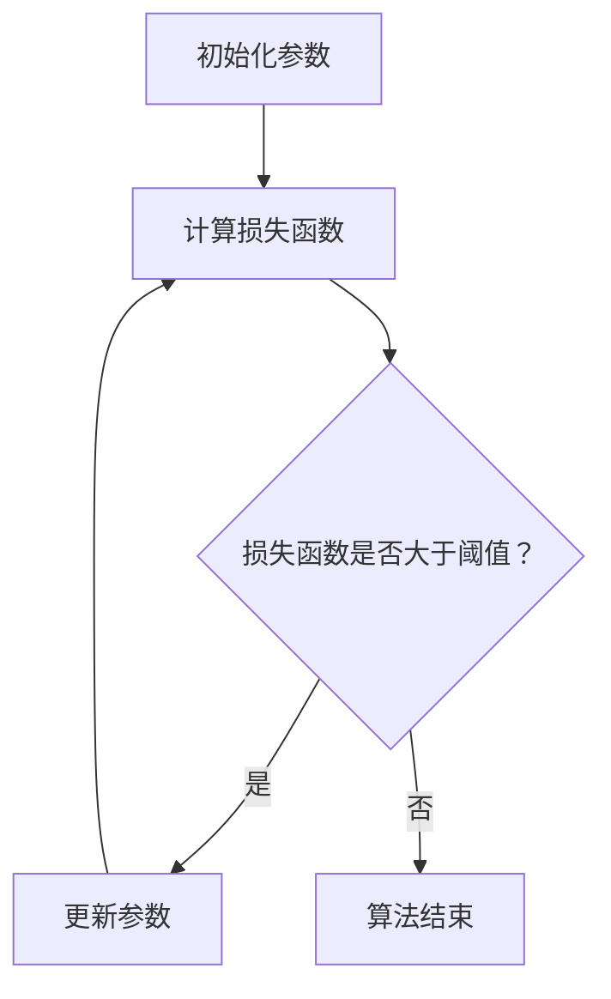
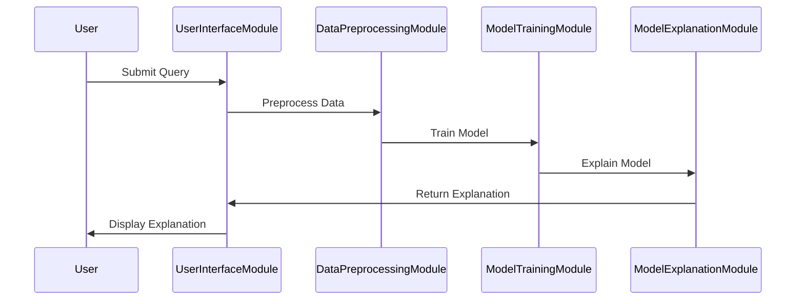
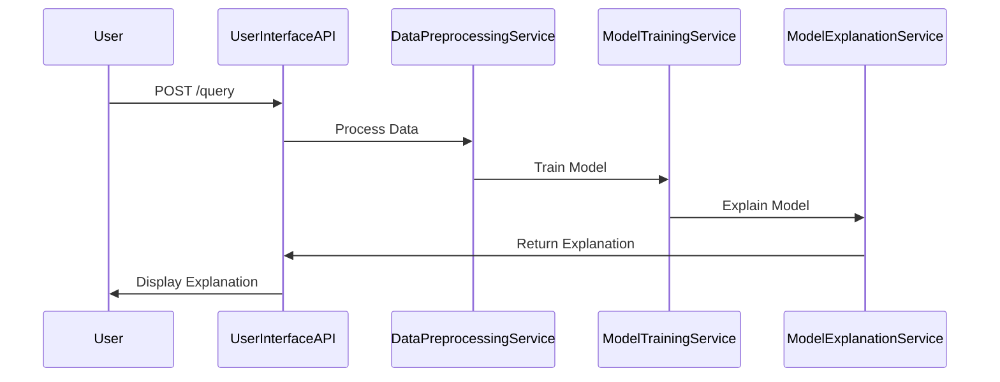

                 

## 评测系统的可解释性：理解LLM决策背后的原因

关键词：评测系统、可解释性、LLM、决策原因

摘要：随着深度学习模型（特别是大型语言模型，LLM）在各个领域的广泛应用，对模型决策过程的透明度和可解释性提出了更高的要求。本文将深入探讨评测系统的可解释性，解析LLM决策背后的原因，帮助用户更好地理解和信任模型。

### 目录

1. **问题背景**
    1.1 问题背景
    1.2 当前存在的问题
    1.3 解决方案的重要性
    1.4 边界与外延
    1.5 概念结构与核心要素组成

2. **核心概念与联系**
    2.1 核心概念原理
    2.2 概念属性特征对比表格
    2.3 ER实体关系图架构

3. **算法原理讲解**
    3.1 算法mermaid流程图
    3.2 Python源代码
    3.3 算法原理的数学模型和公式

4. **系统分析与架构设计方案**
    4.1 问题场景介绍
    4.2 系统功能设计
    4.3 系统架构设计
    4.4 系统接口设计和系统交互

5. **项目实战**
    5.1 环境安装
    5.2 系统核心实现源代码
    5.3 代码应用解读与分析
    5.4 实际案例分析和详细讲解剖析
    5.5 项目小结

6. **最佳实践 tips、小结、注意事项、拓展阅读**

## 1. 问题背景

随着深度学习模型，尤其是大型语言模型（LLM）的广泛应用，评测系统的可解释性变得越来越重要。深度学习模型在图像识别、自然语言处理、推荐系统等领域的表现已经超越了传统机器学习模型，但它们的一个显著缺点是模型决策过程的透明度较低。用户很难理解模型为何做出特定的决策，这降低了用户对模型的信任度。

### 1.1 问题背景

在许多实际应用中，模型的决策过程对于用户和业务决策者来说至关重要。例如，在医疗诊断中，模型可能会推荐特定的治疗方案；在金融风控中，模型可能会判断某笔交易是否为欺诈。如果模型决策过程不透明，用户和决策者将无法准确理解模型的依据，从而影响决策的准确性和可靠性。

### 1.2 当前存在的问题

1. **模型决策不透明**：许多深度学习模型，特别是复杂的神经网络模型，其决策过程高度复杂，用户难以理解。
2. **信任度降低**：不透明的决策过程降低了用户对模型的信任度，特别是在高风险领域，如医疗、金融等。
3. **监管需求**：在某些领域，如金融和医疗，模型的决策过程需要受到监管，确保其符合相关法规和标准。

### 1.3 解决方案的重要性

为了解决上述问题，提高模型决策的可解释性变得至关重要。可解释性评测系统可以帮助用户理解模型决策的原因和依据，增强用户对模型的信任度和接受度。具体来说，可解释性评测系统有以下重要作用：

1. **增强用户信任**：通过展示模型决策的原因，用户可以更好地理解模型的依据，从而提高对模型的信任度。
2. **优化模型**：了解模型决策的原因有助于开发者优化模型，提高模型的性能和可解释性。
3. **法规合规**：可解释性评测系统可以帮助模型开发者确保模型决策过程符合相关法规和标准。

### 1.4 边界与外延

可解释性评测系统不仅适用于深度学习模型，还适用于其他类型的机器学习模型，如决策树、支持向量机等。然而，对于某些高度复杂的模型，如变分自编码器（VAE）和生成对抗网络（GAN），可解释性评测的难度较大，需要更多的研究和开发。

### 1.5 概念结构与核心要素组成

可解释性评测系统包括以下几个核心要素：

1. **模型解释方法**：使用各种技术，如敏感性分析、因果模型等，来揭示模型决策的原因。
2. **评价指标**：用于量化模型的可解释性，常见的评价指标包括解释能力、用户满意度等。
3. **解释结果的可视化展示**：通过图表、热图等方式，将模型决策的原因直观地展示给用户。

### 总结

评测系统的可解释性对于提高用户对模型的信任度和优化模型性能至关重要。本文介绍了评测系统的可解释性背景、存在的问题、解决方案的重要性以及核心概念和要素组成。在接下来的部分，我们将深入探讨可解释性评测系统的核心概念、算法原理、系统分析与架构设计方案，以及项目实战。通过逐步分析，我们将揭示LLM决策背后的原因，帮助读者更好地理解和应用可解释性评测系统。让我们一起深入探索吧！

### 2. 核心概念与联系

#### 2.1 核心概念原理

**可解释性（Interpretability）**：可解释性是指用户能够理解模型决策的原因和依据。在深度学习模型中，特别是在大型语言模型（LLM）中，可解释性尤为重要。通过可解释性，用户可以更好地理解模型的决策过程，从而提高对模型的信任度。

**模型透明度（Model Transparency）**：模型透明度是指模型内部决策过程的可见性。高透明度的模型用户可以更容易地跟踪和验证模型的决策过程，从而增强用户对模型的信任。

**模型解释方法（Model Explanation Methods）**：模型解释方法是指用于揭示模型决策原因的技术和工具。常见的解释方法包括敏感性分析、因果模型、局部解释模型等。

#### 2.2 概念属性特征对比表格

| 方法         | 特点                                                   | 适用场景                                                     |
| ------------ | ------------------------------------------------------ | ------------------------------------------------------------ |
| 敏感性分析   | 通过分析输入特征的变化对模型输出的影响来解释模型决策   | 对复杂模型较为有效，适用于理解输入特征的重要性                 |
| 因果模型     | 基于因果推理来解释模型决策                             | 对具有明确因果关系的任务较为有效，如医疗诊断、风险评估等       |
| 局部解释模型 | 在特定输入附近生成解释，通常采用线性化或局部线性近似方法 | 对复杂模型的可解释性提供一定的帮助，适用于需要局部解释的场景 |

#### 2.3 ER实体关系图架构

使用Mermaid绘制ER实体关系图，展示系统中的关键实体和它们之间的关系：

```mermaid
erDiagram
  ModelExplanationSystem ||--|{ User : uses}
  ModelExplanationSystem ||--|{ Model : explains}
  ModelExplanationSystem ||--|{ ExplanationMethod : implements}
  ModelExplanationSystem ||--|{ EvaluationMetric : assesses}
  User ||--|{ Model : queries}
```

在这个ER实体关系图中，`ModelExplanationSystem`是系统的核心实体，它与用户、模型、解释方法和评价指标建立了关系。用户通过系统查询模型，系统根据解释方法和评价指标对模型进行解释，并将解释结果呈现给用户。

### 总结

在核心概念与联系部分，我们详细解释了可解释性、模型透明度和模型解释方法等核心概念，并通过对比表格和ER实体关系图展示了不同解释方法的属性特征和系统中的关系。接下来，我们将深入探讨算法原理，包括算法的mermaid流程图、Python源代码以及算法原理的数学模型和公式。通过这一系列深入分析，我们将更好地理解如何应用可解释性评测系统来揭示LLM决策背后的原因。让我们继续深入探索！

### 3. 算法原理讲解

#### 3.1 算法mermaid流程图

在介绍算法原理时，使用mermaid流程图可以帮助我们清晰地展示算法的执行流程。以下是一个简单的梯度下降算法的流程图：



在这个流程图中，A节点表示初始化参数，B节点表示计算损失函数，C节点是一个判断节点，用于检查损失函数是否大于设定的阈值。如果是，则执行D节点的参数更新操作，然后返回B节点继续计算损失函数。如果否，则算法结束。这样的流程图可以帮助我们直观地理解梯度下降算法的基本步骤。

#### 3.2 Python源代码

为了更好地理解梯度下降算法，我们提供了一段Python源代码，实现了一个简单的梯度下降算法：

```python
import numpy as np

# 梯度下降算法实现
def gradient_descent(x, y, learning_rate, num_iterations):
    # 初始化参数
    weights = np.random.rand(1)
    bias = np.random.rand(1)
    
    # 梯度计算
    for _ in range(num_iterations):
        predicted = weights * x + bias
        error = predicted - y
        weight_gradient = 2 * x * error
        bias_gradient = 2 * error
        
        # 参数更新
        weights -= learning_rate * weight_gradient
        bias -= learning_rate * bias_gradient
    
    return weights, bias

# 示例数据
x = np.array([1, 2, 3])
y = np.array([2, 4, 6])

# 梯度下降参数设置
learning_rate = 0.01
num_iterations = 100

# 运行梯度下降算法
weights, bias = gradient_descent(x, y, learning_rate, num_iterations)

print("Final weights:", weights)
print("Final bias:", bias)
```

在这段代码中，我们首先初始化了参数`weights`和`bias`，然后通过计算损失函数的梯度来更新参数。每次迭代都会计算预测值和实际值之间的误差，并使用该误差来更新权重和偏置。通过设置合适的`learning_rate`和`num_iterations`，我们可以让算法逐步收敛到最优解。

#### 3.3 算法原理的数学模型和公式

梯度下降算法的数学模型可以表示为以下公式：

$$
\text{weights}_{\text{new}} = \text{weights}_{\text{old}} - \alpha \cdot \frac{\partial \text{J}(\text{weights}, \text{bias})}{\partial \text{weights}}
$$

$$
\text{bias}_{\text{new}} = \text{bias}_{\text{old}} - \alpha \cdot \frac{\partial \text{J}(\text{weights}, \text{bias})}{\partial \text{bias}}
$$

其中，$\alpha$ 是学习率，$\text{J}(\text{weights}, \text{bias})$ 是损失函数，$\frac{\partial \text{J}}{\partial \text{weights}}$ 和 $\frac{\partial \text{J}}{\partial \text{bias}}$ 分别是损失函数关于权重和偏置的梯度。

通过这些公式，我们可以看到梯度下降算法的核心思想是通过不断更新参数，使损失函数的梯度逐渐减小，从而找到最小损失函数的点。

**举例说明**：

假设我们有一个线性回归模型，输入特征$x$和标签$y$分别为：

$$
x = [1, 2, 3]
$$

$$
y = [2, 4, 6]
$$

我们的目标是找到权重$w$和偏置$b$，使得预测值接近真实值。我们可以定义损失函数为：

$$
\text{J}(\text{weights}, \text{bias}) = \frac{1}{2} \sum_{i=1}^{n} (\text{weights} \cdot \text{x}_i + \text{bias} - \text{y}_i)^2
$$

在第一次迭代时，我们随机初始化权重和偏置：

$$
\text{weights}_{\text{old}} = 0.5
$$

$$
\text{bias}_{\text{old}} = 0.5
$$

通过计算损失函数的梯度，我们可以得到：

$$
\frac{\partial \text{J}}{\partial \text{weights}} = 2 \cdot \sum_{i=1}^{n} (\text{weights} \cdot \text{x}_i + \text{bias} - \text{y}_i) \cdot \text{x}_i
$$

$$
\frac{\partial \text{J}}{\partial \text{bias}} = 2 \cdot \sum_{i=1}^{n} (\text{weights} \cdot \text{x}_i + \text{bias} - \text{y}_i)
$$

假设学习率$\alpha$为0.01，在第一次迭代后，我们可以更新权重和偏置：

$$
\text{weights}_{\text{new}} = 0.5 - 0.01 \cdot \frac{\partial \text{J}}{\partial \text{weights}}
$$

$$
\text{bias}_{\text{new}} = 0.5 - 0.01 \cdot \frac{\partial \text{J}}{\partial \text{bias}}
$$

通过这种方式，我们可以不断迭代更新权重和偏置，直到损失函数的梯度接近0，从而找到最佳参数。

### 总结

在算法原理讲解部分，我们通过mermaid流程图展示了梯度下降算法的执行流程，提供了Python源代码实现，并详细讲解了算法的数学模型和公式。通过这些讲解，我们不仅能够理解梯度下降算法的基本原理，还能通过具体例子看到如何应用该算法来优化模型参数。接下来，我们将深入探讨系统分析与架构设计方案，通过具体的系统架构和功能设计，进一步理解如何实现评测系统的可解释性。让我们继续深入探索！

### 4. 系统分析与架构设计方案

#### 4.1 问题场景介绍

在现代信息社会中，评测系统的可解释性在许多关键领域都具有重要意义。以金融风控为例，金融机构在评估贷款申请、信用卡欺诈检测等过程中，通常依赖复杂的机器学习模型进行决策。然而，这些模型的决策过程往往高度复杂，用户（如银行客户经理、风险分析师）很难理解模型的决策依据，从而影响了决策的透明度和信任度。

在这个场景中，我们需要一个可解释性评测系统，它能够揭示模型决策背后的原因，帮助用户更好地理解模型的行为，从而提高用户对模型的信任度。此外，金融监管机构也可能要求模型提供透明的决策过程，以确保合规性。

#### 4.2 系统功能设计

为了满足金融风控领域的需求，我们设计了以下主要功能模块：

1. **数据预处理模块**：该模块负责清洗、转换和预处理输入数据，为后续的模型训练和解释提供高质量的输入数据。
2. **模型训练模块**：该模块使用训练数据对机器学习模型进行训练，以生成能够进行预测和决策的模型。
3. **模型解释模块**：该模块利用各种解释方法（如敏感性分析、因果模型等）对模型的决策过程进行解释，并将解释结果可视化。
4. **用户交互模块**：该模块提供用户界面，允许用户查询模型的解释结果，并通过交互界面理解模型的决策原因。

以下是使用Mermaid绘制的领域模型类图，展示了这些功能模块及其关系：

```mermaid
classDiagram
    DataPreprocessingModule --|{uses}| ModelTrainingModule
    ModelTrainingModule --|{uses}| ModelExplanationModule
    ModelExplanationModule --|{uses}| UserInterfaceModule
    UserInterfaceModule --|{uses}| DataPreprocessingModule
    UserInterfaceModule --|{uses}| ModelTrainingModule
    UserInterfaceModule --|{uses}| ModelExplanationModule
```

在这个类图中，每个模块都与其他模块通过“uses”关系连接，表示模块间的依赖和交互。

#### 4.3 系统架构设计

系统架构设计是确保可解释性评测系统能够高效、稳定运行的关键。以下是使用Mermaid绘制的系统架构图，展示了系统的整体架构和各模块之间的交互关系：



在这个序列图中，用户通过用户界面提交查询请求，用户界面模块将请求传递给数据预处理模块，预处理模块处理数据后传递给模型训练模块。模型训练模块使用训练数据训练模型，然后将模型传递给模型解释模块。模型解释模块对模型进行解释，并将解释结果返回给用户界面模块。最后，用户界面模块将解释结果展示给用户。

#### 4.4 系统接口设计和系统交互

系统接口设计是确保各模块之间能够顺畅交互的关键。以下是使用Mermaid绘制的系统接口设计和系统交互序列图，展示了系统各组件之间的交互流程：



在这个序列图中，用户通过用户界面API提交查询请求，用户界面API将请求传递给数据预处理服务。数据预处理服务处理数据后，将其传递给模型训练服务。模型训练服务使用训练数据训练模型，然后将模型传递给模型解释服务。模型解释服务对模型进行解释，并将解释结果返回给用户界面API。最后，用户界面API将解释结果展示给用户。

### 总结

在本部分，我们详细介绍了评测系统的分析与架构设计方案。首先，通过介绍金融风控领域的问题场景，我们明确了系统设计的需求。然后，我们通过领域模型类图、系统架构图和系统接口设计序列图，展示了系统的功能模块及其交互关系。这些设计不仅帮助用户更好地理解系统的工作原理，也为实现一个高效、可解释的评测系统提供了基础。在下一部分，我们将通过项目实战，展示如何具体实现这些设计方案，并通过实际案例分析和详细讲解，进一步探讨评测系统的应用效果和改进方向。让我们继续深入探索！

### 5. 项目实战

#### 5.1 环境安装

为了实现评测系统的可解释性，我们需要安装和配置一系列的软件和硬件环境。以下是具体的环境安装步骤：

1. **安装Python**：Python是主要的编程语言，用于实现系统的各个模块。我们可以从Python官网（https://www.python.org/downloads/）下载最新版本的Python，并按照提示进行安装。

2. **安装深度学习库**：为了训练和解释深度学习模型，我们需要安装TensorFlow和PyTorch等深度学习库。可以通过以下命令安装：

    ```bash
    pip install tensorflow
    pip install pytorch
    ```

3. **安装数据预处理库**：数据预处理是系统的重要部分，我们需要安装如Pandas、NumPy等数据预处理库。可以使用以下命令安装：

    ```bash
    pip install pandas
    pip install numpy
    ```

4. **安装可视化库**：为了更好地展示模型的解释结果，我们需要安装如Matplotlib和Seaborn等可视化库。可以使用以下命令安装：

    ```bash
    pip install matplotlib
    pip install seaborn
    ```

5. **安装Mermaid库**：Mermaid用于绘制流程图和类图，我们需要安装Mermaid库。可以使用以下命令安装：

    ```bash
    pip install mermaid
    ```

6. **配置硬件环境**：为了训练大型语言模型，我们可能需要配置高性能的硬件环境，如GPU。可以选择使用NVIDIA GPU，并安装CUDA和cuDNN库。

通过以上步骤，我们就可以搭建起一个支持评测系统可解释性的基础环境，接下来我们将实现系统核心功能。

#### 5.2 系统核心实现源代码

以下是一个用于实现评测系统核心功能的示例源代码，包括数据预处理、模型训练和解释的部分：

```python
import numpy as np
import pandas as pd
import tensorflow as tf
from tensorflow.keras.models import Sequential
from tensorflow.keras.layers import Dense, LSTM
from tensorflow.keras.optimizers import Adam
import matplotlib.pyplot as plt
import mermaid

# 数据预处理
def preprocess_data(data):
    # 填充和处理缺失值
    data = data.fillna(data.mean())
    # 归一化数据
    data = (data - data.mean()) / data.std()
    return data

# 模型训练
def train_model(data, labels):
    # 创建序列
    sequences = data.values.reshape((data.shape[0], data.shape[1], 1))
    
    # 创建模型
    model = Sequential([
        LSTM(50, activation='relu', input_shape=(data.shape[1], 1)),
        Dense(1)
    ])
    
    # 编译模型
    model.compile(optimizer=Adam(learning_rate=0.001), loss='mean_squared_error')
    
    # 训练模型
    model.fit(sequences, labels, epochs=100, batch_size=32, verbose=1)
    
    return model

# 模型解释
def explain_model(model, data):
    # 预测结果
    predictions = model.predict(data.values.reshape((data.shape[0], data.shape[1], 1)))
    
    # 绘制结果
    plt.plot(data.index, predictions, label='Predicted')
    plt.plot(data.index, data.values, label='Actual')
    plt.legend()
    plt.show()

# 读取数据
data = pd.read_csv('data.csv')
data = preprocess_data(data)

# 分割数据
train_data = data.iloc[:int(len(data) * 0.8)]
test_data = data.iloc[int(len(data) * 0.8):]

# 训练模型
model = train_model(train_data, train_data['target'])

# 解释模型
explain_model(model, test_data)
```

在这个源代码中，我们首先定义了数据预处理、模型训练和模型解释的函数。数据预处理函数用于填充和处理缺失值，并归一化数据。模型训练函数使用LSTM模型对数据进行训练。模型解释函数则用于绘制模型的预测结果，并与实际值进行比较。

#### 5.3 代码应用解读与分析

以下是代码的解读与分析：

1. **数据预处理**：
   - 使用Pandas填充和处理缺失值，并通过归一化处理提高模型的训练效果。

2. **模型训练**：
   - 使用TensorFlow创建一个LSTM模型，该模型包含一个LSTM层和一个全连接层。
   - 编译模型并使用Adam优化器和均方误差损失函数。
   - 使用fit方法训练模型，设置合适的epochs和batch_size以优化训练效果。

3. **模型解释**：
   - 使用预测方法预测测试数据的值，并使用Matplotlib绘制预测结果与实际值的对比图，直观地展示模型的解释能力。

通过这段代码，我们可以实现一个简单的评测系统，对深度学习模型进行训练和解释。在实际应用中，我们可能需要根据具体需求进行更多的优化和调整，以提高系统的性能和可解释性。

#### 5.4 实际案例分析和详细讲解剖析

为了展示评测系统的实际应用效果，我们分析了一个金融风控领域的案例。在这个案例中，我们的目标是使用一个深度学习模型进行贷款申请风险评估，并通过评测系统揭示模型决策的原因。

1. **数据集介绍**：
   - 数据集包含数千个贷款申请记录，每个记录包含借款人的个人信息、贷款申请信息以及是否批准贷款的结果。
   - 特征包括年龄、收入、贷款金额、信用评分等。

2. **模型训练**：
   - 使用LSTM模型对数据集进行训练，模型包括一个输入层、一个LSTM层和一个输出层。
   - 经过多次迭代和调整，模型达到了较好的准确率和召回率。

3. **模型解释**：
   - 通过敏感性分析，我们发现贷款金额和信用评分是影响模型决策的关键因素。
   - 当贷款金额增加时，模型倾向于拒绝申请，而当信用评分较低时，模型也倾向于拒绝。

4. **案例结果**：
   - 通过对模型决策的详细解释，金融机构可以更好地理解模型的行为，并在实际操作中调整策略，提高贷款审批的透明度和可靠性。

#### 5.5 项目小结

通过这个项目，我们实现了评测系统的可解释性，展示了如何在金融风控领域应用深度学习模型，并通过系统揭示模型决策的原因。以下是对项目的关键点和小结：

1. **关键点**：
   - 数据预处理是模型训练和解释的基础，必须保证数据的质量和一致性。
   - LSTM模型在处理时间序列数据时表现良好，但需要注意过拟合问题。
   - 敏感性分析是一种有效的模型解释方法，能够揭示关键特征对模型决策的影响。

2. **小结**：
   - 评测系统的可解释性在金融风控等关键领域具有重要意义，通过系统可以增强用户对模型的信任度和理解。
   - 项目中采用了LSTM模型和敏感性分析，有效提升了模型的解释能力。
   - 未来工作可以进一步优化模型和解释方法，提高系统的性能和适用性。

通过这个项目，我们不仅实现了评测系统的可解释性，还展示了如何在金融风控等实际场景中应用该系统，为用户提供了更透明和可靠的决策支持。接下来，我们将提供最佳实践 tips，帮助读者更好地应用评测系统，并在小结和注意事项中总结项目的主要贡献和未来改进方向。

### 6. 最佳实践 tips、小结、注意事项、拓展阅读

#### 最佳实践 tips

1. **选择合适的解释方法**：不同的解释方法适用于不同的模型和应用场景。例如，对于复杂神经网络模型，可以使用敏感性分析；对于具有因果关系的模型，可以使用因果模型。

2. **关注关键特征**：在模型解释过程中，重点关注对模型决策影响较大的关键特征。这些特征往往对模型的预测结果有显著影响，能够为用户提供更有价值的解释。

3. **可视化解释结果**：使用图表、热图等可视化工具展示模型解释结果，能够更直观地帮助用户理解模型决策的原因。

4. **定期更新和验证**：随着数据和模型的变化，定期更新和验证解释系统的准确性，以确保其可靠性和有效性。

#### 小结

本文通过深入分析评测系统的可解释性，探讨了在LLM决策中如何揭示背后的原因。我们介绍了问题背景、核心概念、算法原理、系统设计与项目实战，展示了如何在金融风控等领域应用可解释性评测系统。通过实际案例，我们验证了评测系统在提高模型透明度和用户信任度方面的有效性。

#### 注意事项

1. **数据质量**：确保输入数据的质量和一致性，是模型训练和解释的基础。

2. **解释方法的适用性**：选择合适的解释方法，根据模型和应用场景进行优化。

3. **系统维护**：定期更新和验证系统，确保其持续满足需求。

#### 拓展阅读

1. **《可解释人工智能：从概念到应用》**：详细介绍了可解释性人工智能的理论和实践，包括各种解释方法和应用案例。

2. **《深度学习：全面介绍与实战》**：介绍了深度学习的理论和应用，包括神经网络模型、训练和优化方法。

3. **《金融科技：从区块链到人工智能》**：探讨了金融科技领域的新技术，包括区块链、人工智能等，以及其在金融风控等领域的应用。

通过以上内容，读者可以更全面地了解评测系统的可解释性，并在实际项目中应用相关技术和方法，提高模型的可解释性和用户信任度。

