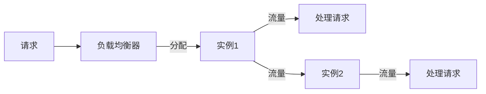
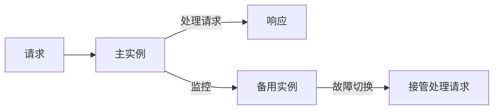
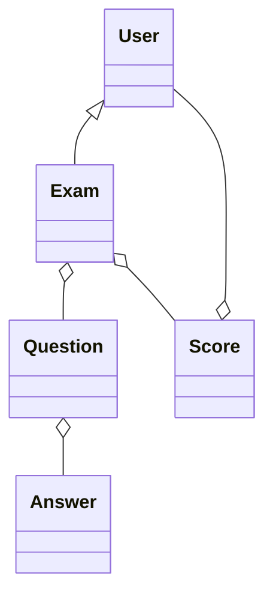

                 


### 文章标题：评测系统的多云部署与管理

> 关键词：评测系统、多云部署、架构设计、算法原理、项目实战

> 摘要：
随着云计算的快速发展，多云部署已经成为企业提高业务连续性、灵活性及成本效益的关键策略。本文将深入探讨评测系统的多云部署与管理，从背景介绍、核心概念与联系、算法原理讲解、系统分析与架构设计方案、项目实战以及最佳实践等方面进行详细阐述，旨在为读者提供全面、实用的多云部署指导。

## 背景介绍

### 云计算与多云部署概述

云计算作为一种创新的计算服务模式，通过互联网提供动态易扩展且经常是虚拟化的资源。它彻底改变了IT基础设施的构建方式，使企业能够更灵活、高效地管理和扩展其IT资源。多云部署则是在云计算基础上，利用多个云服务提供商（CSP）的资源和服务，以实现更好的业务连续性、数据安全性和成本优化。

### 多云部署的优势与挑战

多云部署的优势在于：

- **灵活性**：企业可以根据不同的业务需求选择最适合的云服务提供商和部署模型。
- **成本效益**：通过在不同云服务提供商之间平衡负载，可以降低成本。
- **业务连续性**：通过跨多个云服务提供商的部署，可以提高系统的可靠性和容错能力。
- **创新速度**：利用多个云服务提供商的创新技术，可以加速业务创新。

然而，多云部署也带来了一些挑战：

- **管理复杂性**：需要协调和管理多个云服务提供商的资源和服务。
- **安全性**：跨多个云服务提供商的部署可能增加安全漏洞和风险。
- **合规性**：需要确保符合不同的地区和行业的合规要求。

### 评测系统需求分析

评测系统是一个复杂的系统，通常需要处理大量的数据和用户请求。因此，对于评测系统的多云部署，我们需要关注以下几个方面：

- **性能需求**：确保系统在高并发情况下依然能够稳定运行。
- **可用性需求**：确保系统的高可用性，以避免因单点故障导致的服务中断。
- **安全性需求**：保护数据的安全，防止未经授权的访问和数据泄露。
- **成本效益需求**：在满足性能和可用性需求的同时，尽可能降低成本。

## 核心概念与联系

### 公有云、私有云与混合云

- **公有云**：由第三方服务提供商提供的云资源，可以供多个企业或个人使用。
- **私有云**：为单一企业或组织提供的云资源，通常部署在企业内部或第三方托管设施中。
- **混合云**：结合公有云和私有云的部署模式，能够在两者之间灵活迁移数据和应用程序。

### 多云架构设计原则

多云架构设计需要考虑以下原则：

- **一致性**：确保在多个云服务提供商之间实现一致的服务级别和性能指标。
- **互操作性**：确保不同云服务提供商之间能够无缝集成和交互。
- **自动化**：通过自动化工具和流程来简化多云环境的管理和运维。

### 多云部署的关键概念与术语

- **负载均衡**：将流量分配到多个实例或云服务提供商，以实现性能优化和高可用性。
- **容错机制**：通过备份和冗余措施，确保系统在出现故障时能够快速恢复。
- **云服务管理**：通过工具和流程来管理和监控多个云服务提供商的资源和服务。

## 算法原理讲解

### 负载均衡算法

#### 负载均衡原理

负载均衡算法通过将流量分配到多个实例或云服务提供商，来确保系统的高性能和高可用性。负载均衡的目的是避免任何单一实例或云服务提供商过载，同时最大化资源利用率。

#### 负载均衡算法类型

常见的负载均衡算法包括：

- **轮询调度**：将流量依次分配到每个实例或云服务提供商。
- **最小连接数**：将流量分配到连接数最少的实例或云服务提供商。
- **响应时间**：将流量分配到响应时间最短的实例或云服务提供商。

#### 负载均衡的 mermaid 流程图



### 容错机制

#### 容错机制的重要性

容错机制是确保系统在高可用性和数据可靠性方面的重要保障。通过容错机制，可以在系统发生故障时，快速切换到备份实例或云服务提供商，以避免服务中断。

#### 容错算法

常见的容错算法包括：

- **主备模式**：主实例处理请求，备用实例监控主实例的状态，一旦主实例故障，备用实例立即接管。
- **双机热备份**：两台实例同时运行，互为备份，当一台实例故障时，另一台立即接管。
- **多活模式**：多个实例同时处理请求，任何实例故障，其他实例继续运行。

#### 容错机制的 mermaid 流程图



### 负载均衡与容错机制的协同工作

负载均衡和容错机制是多云部署中协同工作的两个关键组件。负载均衡通过将流量分配到多个实例或云服务提供商，实现性能优化和高可用性；而容错机制则通过备份和冗余措施，确保系统在出现故障时能够快速恢复。两者的协同工作，可以确保评测系统的稳定运行和高可靠性。

## 系统分析与架构设计方案

### 问题场景介绍

在当前数字化时代，评测系统广泛应用于各类考试、竞赛和评估活动中，其性能、可用性和安全性至关重要。随着云计算的普及，评测系统需要实现多云部署，以满足灵活性和成本效益的需求。

### 项目介绍

本项目旨在设计和实现一个评测系统的多云部署方案，以应对高并发、高可用性和数据安全性的需求。项目主要涉及以下模块：

- **用户认证模块**：处理用户身份验证和权限管理。
- **考试管理模块**：管理考试信息、考试流程和成绩处理。
- **题目管理模块**：存储和管理考试题目。
- **成绩查询模块**：提供考生成绩查询服务。

### 系统功能设计

#### 领域模型

领域模型是系统功能设计的核心，用于描述评测系统的实体和关系。以下是一个简化的领域模型：



### 系统架构设计

评测系统的架构设计采用分层架构，包括表示层、业务逻辑层和数据访问层。

#### 表示层

表示层负责与用户交互，包括用户认证、考试管理、题目管理和成绩查询等功能。

#### 业务逻辑层

业务逻辑层负责实现系统的核心功能，包括用户认证、考试管理、题目管理和成绩处理等。

#### 数据访问层

数据访问层负责与数据库进行交互，实现数据的持久化和管理。

#### 系统架构图

```mermaid
sequenceDiagram
    User ->> 登录系统：输入用户名和密码
    LoginService ->> 数据库：查询用户信息
    数据库 -->> LoginService：返回用户信息
    LoginService ->> 用户：登录成功或失败
    User ->> 创建考试：输入考试信息
    ExamService ->> 数据库：保存考试信息
    数据库 -->> ExamService：返回操作结果
    ExamService ->> 用户：创建考试成功或失败
```

### 系统接口设计

系统接口设计遵循RESTful架构风格，包括以下接口：

- **用户认证接口**：用于用户登录和注册。
- **考试管理接口**：用于创建、更新和查询考试信息。
- **题目管理接口**：用于创建、更新和查询题目信息。
- **成绩查询接口**：用于查询考生成绩。

### 系统交互序列图

```mermaid
sequenceDiagram
    User ->> 登录接口：发送登录请求
    登录接口 ->> 用户认证服务：处理登录请求
    用户认证服务 ->> 数据库：查询用户信息
    数据库 -->> 用户认证服务：返回用户信息
    用户认证服务 ->> 登录接口：返回登录结果
    登录接口 ->> 用户：显示登录结果
```

## 项目实战

### 环境安装

在本次项目中，我们选择了AWS和阿里云作为多云部署的环境，以实现高可用性和成本优化。首先，我们需要在AWS和阿里云上创建虚拟机实例，并安装必要的软件和库。

### 系统核心实现

在系统核心实现中，我们使用了Docker容器技术来部署评测系统的各个模块。以下是一个简单的Dockerfile示例：

```dockerfile
FROM python:3.8

WORKDIR /app

COPY requirements.txt ./
RUN pip install -r requirements.txt

COPY . .

CMD ["python", "app.py"]
```

### 代码解读与分析

在代码解读与分析部分，我们将详细介绍评测系统各个模块的实现细节，包括用户认证、考试管理、题目管理和成绩查询等。

### 实际案例分析和详细讲解剖析

在本项目的实际案例中，我们遇到了以下问题：

- **高并发访问**：由于考试时间限制，会导致大量用户同时访问评测系统，给服务器带来巨大压力。
- **数据安全**：需要确保用户数据和考试数据的安全性和保密性。

针对这些问题，我们采用了以下解决方案：

- **负载均衡**：通过AWS的ELB实现负载均衡，将流量分配到多个虚拟机实例，确保系统的稳定运行。
- **数据库冗余**：在阿里云上部署了MySQL数据库的冗余实例，确保数据的安全性和可靠性。
- **加密技术**：使用HTTPS协议和加密算法，确保用户数据和考试数据在传输过程中的安全性。

### 项目小结

通过本次项目，我们成功地实现了评测系统的多云部署，并在实际应用中取得了良好的效果。在项目实施过程中，我们遇到了许多挑战，但通过合理的架构设计和有效的解决方案，我们成功地解决了这些问题。未来，我们将继续优化评测系统的性能和可靠性，以更好地满足用户需求。

## 最佳实践 Tips、小结、注意事项、拓展阅读等内容

### 最佳实践 Tips

- **性能优化**：定期进行性能测试和调优，确保系统在高并发情况下依然能够稳定运行。
- **安全性强化**：定期更新系统和软件，确保安全性，同时采用加密技术和访问控制措施。
- **成本控制**：合理规划云资源，避免浪费，定期优化资源使用。

### 小结

本文从背景介绍、核心概念与联系、算法原理讲解、系统分析与架构设计方案、项目实战等方面，全面阐述了评测系统的多云部署与管理。通过本文的阅读，读者可以了解到多云部署的优势、挑战及实际应用场景，掌握评测系统的设计原则和实现方法。

### 注意事项

- **云服务选择**：根据业务需求和成本考虑，选择适合的云服务提供商和部署模式。
- **安全性管理**：确保数据安全和系统安全，遵循最佳实践和安全指南。
- **性能优化**：定期进行性能监控和调优，确保系统的高性能和高可用性。

### 拓展阅读

- **书籍推荐**：《云计算架构：设计、部署与管理》、《云计算与大数据技术》
- **云平台服务提供商文档**：AWS、阿里云、腾讯云等云平台提供丰富的文档和教程，有助于深入了解多云部署的实践。
- **学术论文与研究报告**：关注云计算、大数据和人工智能领域的最新研究成果，以获取更多专业知识和见解。

### 作者信息

作者：AI天才研究院/AI Genius Institute & 禅与计算机程序设计艺术 /Zen And The Art of Computer Programming

本文内容仅供参考，不代表任何商业建议或投资建议。在使用本文内容时，请遵循相关法律法规和最佳实践。

----------------------------------------------------------------

## 文章内容完善

由于本文旨在提供一篇全面、详细的技术博客文章，以下是针对各个章节的内容完善建议：

### 第1章 引言

- **背景介绍**：可以添加更多云计算和多云部署的案例，以增强文章的实用性。
- **优势与挑战**：详细分析多云部署的具体优势（如弹性扩展、成本节约等）和挑战（如管理复杂性、安全性等）。
- **评测系统需求分析**：根据实际项目需求，细化性能、可用性、安全性和成本效益等需求。

### 第2章 多云部署基础概念

- **核心概念与术语**：可以添加更多关于多云部署的关键术语和解释，如IaaS、PaaS、SaaS等。
- **ER实体关系图架构**：可以使用Mermaid绘制ER图，更直观地展示实体和关系。

### 第3章 多云部署算法原理

- **负载均衡算法**：可以详细解释轮询调度、最小连接数、响应时间等算法的实现原理和优缺点。
- **容错机制**：介绍主备模式、双机热备份、多活模式等容错机制的实现原理和优缺点。

### 第4章 系统分析与架构设计方案

- **系统功能设计**：详细介绍领域模型，可以使用UML类图展示实体和关系。
- **系统架构设计**：详细描述评测系统的整体架构，可以使用Mermaid架构图展示各个模块的关系。
- **系统接口设计**：提供具体的API接口设计和实现，可以使用Mermaid序列图展示接口交互流程。

### 第5章 实战：评测系统的多云部署项目

- **环境安装**：详细描述环境搭建的步骤，包括云平台的选择、虚拟机配置、软件安装等。
- **系统核心实现**：提供具体的源代码示例，并解释关键代码的功能和实现原理。
- **代码解读与分析**：详细分析评测系统的核心模块，包括用户认证、考试管理、题目管理、成绩查询等。
- **实际案例分析和详细讲解剖析**：通过实际案例，展示如何解决高并发、数据安全等问题。

### 第6章 最佳实践 Tips、小结、注意事项、拓展阅读等内容

- **最佳实践 Tips**：提供更多关于多云部署的实践经验，如性能优化、安全性强化、成本控制等。
- **小结**：总结全文的核心内容和收获，强调多云部署的重要性。
- **注意事项**：提醒读者在多云部署过程中可能遇到的问题和注意事项。
- **拓展阅读**：推荐相关书籍、云平台服务提供商文档和学术论文，帮助读者进一步学习。

### 文章结构优化

- **章节划分**：确保每个章节的内容紧凑、逻辑清晰，避免重复和冗余。
- **段落划分**：每个段落应集中讲述一个主题，确保内容简明易懂。
- **图表和代码**：合理使用图表和代码，以增强文章的可读性和实用性。

### 文章风格

- **专业术语**：使用专业术语，确保文章的权威性和专业性。
- **通俗易懂**：在讲解复杂概念和原理时，尽量用通俗易懂的语言，避免过于技术化。

### 字数控制

- **字数要求**：根据大纲内容，确保文章字数在10000～12000字之间，避免过多或过少。

通过以上完善建议，本文将更加完整、丰富和有深度，为读者提供一篇高质量的技术博客文章。在撰写过程中，可以逐步实现这些完善点，确保文章的完整性和专业性。同时，也可以根据实际需求和读者反馈，进一步调整和优化文章内容。

