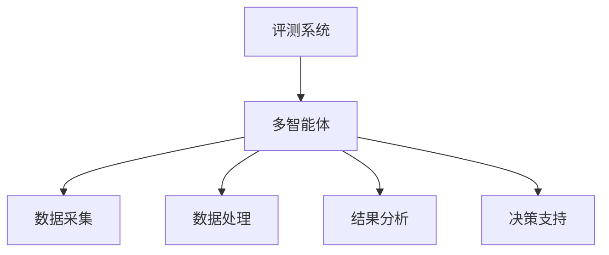
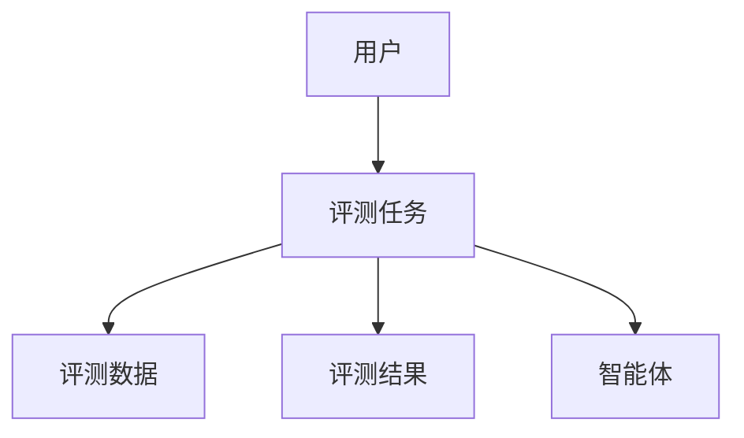
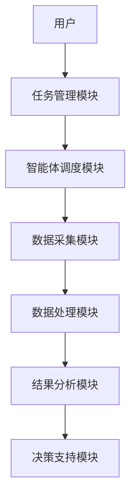
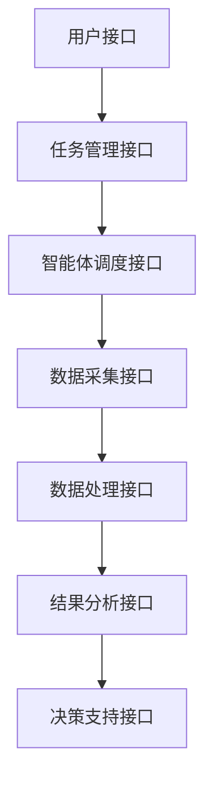
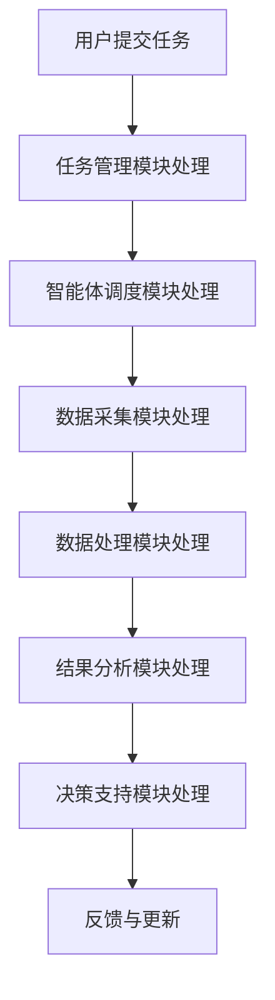
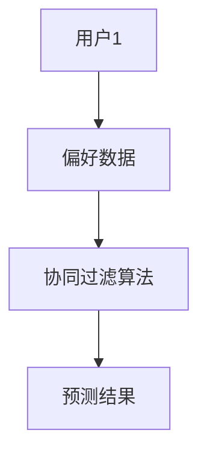
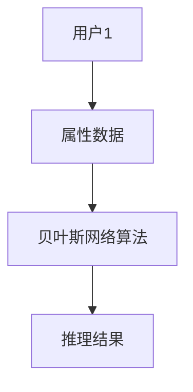
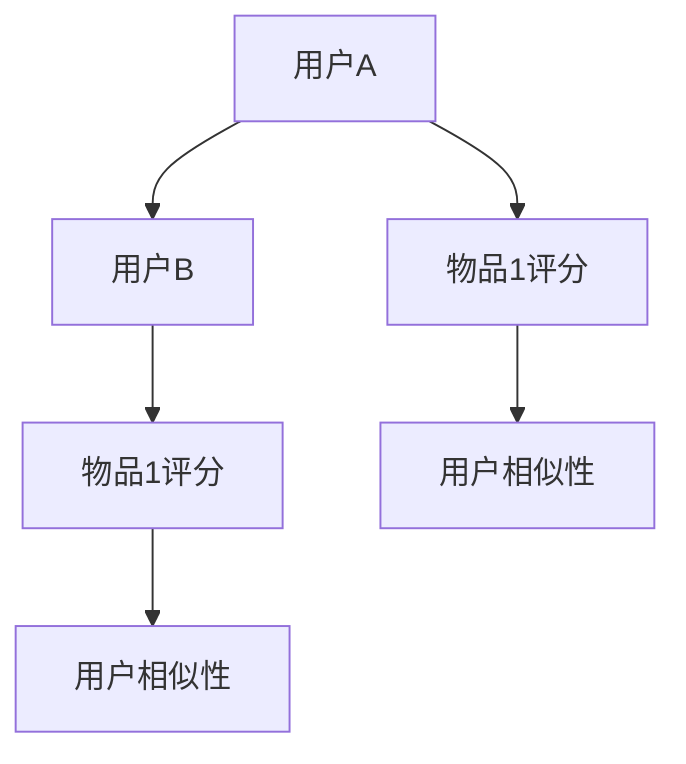

                 

### 第一部分：引言

#### 第1章 问题背景与核心概念

##### 1.1 评测系统在数字化时代的价值与挑战

在数字化时代，评测系统的价值越来越受到重视。随着互联网、大数据、云计算等技术的不断发展，评测系统从传统的单一功能逐渐演变成一个多维度、多功能、高度集成的系统。它的作用不仅仅局限于对产品、服务或用户的评估，更广泛地应用于企业运营、行业分析、市场预测等多个方面。

**1.1.1 评测系统的作用与重要性**

评测系统的作用主要体现在以下几个方面：

1. **质量控制**：通过评测系统，企业可以对产品质量进行严格监控，确保产品符合标准，提高客户满意度。
2. **决策支持**：评测系统为企业管理层提供决策依据，帮助企业优化资源配置，降低风险。
3. **市场分析**：通过对市场数据的评测，企业可以了解市场需求，调整产品策略，提升市场竞争力。
4. **用户体验**：评测系统可以收集用户反馈，帮助企业改进产品和服务，提升用户体验。

**1.1.2 数字化时代的评测系统挑战**

然而，数字化时代也带来了新的挑战：

1. **数据量增大**：随着数据源的增加和数据收集技术的进步，评测系统需要处理的数据量呈指数级增长。
2. **处理速度要求提高**：实时性要求越来越高，评测系统需要在短时间内完成大量数据处理和分析。
3. **算法复杂度增加**：复杂的算法模型需要更高效的实现，以应对复杂的数据分析需求。
4. **多维度分析需求**：数字化时代，评测系统需要从多个维度对数据进行分析，以提高分析的准确性和全面性。

**1.1.3 多智能体协作评测的概念与优势**

为了应对这些挑战，多智能体协作评测应运而生。多智能体协作评测是指多个独立智能体协同工作，共同完成评测任务的一种方法。它具有以下优势：

1. **分布式处理**：多智能体可以分布式地处理海量数据，提高处理速度和效率。
2. **协同优化**：智能体之间可以相互协作，优化算法模型，提高评测准确性和可靠性。
3. **灵活性和扩展性**：多智能体系统可以根据需求动态调整智能体数量和功能，具有很好的灵活性和扩展性。
4. **降低风险**：通过多智能体协作，可以降低单个智能体在处理大数据时可能出现的错误和风险。

通过多智能体协作评测，我们可以更好地应对数字化时代评测系统的挑战，提高评测系统的整体性能和可靠性。

##### 1.2 核心概念与联系

**2.1 多智能体的定义与特征**

**2.1.1 多智能体的定义**

多智能体（Multi-Agent Systems，MAS）是指由多个具有自主性、协作性和智能性的智能体组成的系统。这些智能体可以在一个共同的环境中交互和协作，以完成复杂的任务。

**2.1.2 多智能体的特征**

1. **自主性**：智能体具有自主决策和行动的能力，可以根据环境和任务的改变自主调整行为。
2. **社会性**：智能体之间可以相互通信和协作，以实现共同的目标。
3. **适应性**：智能体可以根据环境和任务的变化，自主调整其行为和策略。

**2.1.3 多智能体与协作评测的关系**

多智能体与协作评测的关系主要体现在以下几个方面：

1. **分布式处理**：多智能体可以将复杂的评测任务分解为多个子任务，分布式地处理，提高处理速度和效率。
2. **协同优化**：多智能体可以相互协作，优化算法模型，提高评测准确性和可靠性。
3. **自适应调整**：多智能体可以根据环境和任务的变化，自主调整其行为和策略，以应对不断变化的需求。

通过多智能体协作评测，我们可以充分发挥每个智能体的优势，实现评测系统的协同优化，提高整体性能和可靠性。

##### 2.1 跨领域协同模型图

为了更清晰地展示多智能体协作评测的概念和特征，我们可以通过一个跨领域协同模型图来解释。

**2.1.1 概念属性特征对比表格**

| 特征 | 定义 | 作用 |
| --- | --- | --- |
| 多智能体 | 多个独立智能体协同工作 | 提高系统复杂任务处理能力 |
| 协作评测 | 多智能体共同完成评测任务 | 提高评测效率和准确性 |

**2.1.2 多智能体协作评测ER实体关系图**



通过这个ER实体关系图，我们可以看到评测系统与多智能体之间的关系。评测系统通过多智能体的协作，完成数据采集、数据处理、结果分析和决策支持等任务，从而实现高效、准确的评测。

### 第二部分：多智能体协作评测架构设计

#### 第3章 评测系统架构设计

##### 3.1 问题场景介绍

在数字化时代，评测系统的应用场景越来越广泛。以下是一个常见的问题场景：

某电商平台需要对其用户评价系统进行优化，以提高用户满意度。用户评价系统涉及到多个方面，包括商品质量评价、服务态度评价等。为了提高评测效率和准确性，该电商平台决定采用多智能体协作评测框架。

##### 3.2 项目介绍

**3.2.1 评测系统项目概述**

该评测系统项目的主要目标是构建一个高效、准确的多智能体协作评测框架，实现以下功能：

1. **数据采集**：从多个渠道（如用户评价、商品信息、服务记录等）收集相关数据。
2. **数据处理**：对采集到的数据进行预处理、清洗、转换等操作，以获得高质量的数据集。
3. **结果分析**：利用多智能体协作机制，对数据集进行深度分析，提取有用的信息和知识。
4. **决策支持**：根据分析结果，为电商平台提供优化建议，如改进商品质量、提升服务水平等。

#### 第4章 系统功能设计

##### 4.1 领域模型

为了实现评测系统的功能，我们需要构建一个领域模型。领域模型是描述系统功能和业务逻辑的一种方式，它可以帮助我们更好地理解和设计系统。

**4.1.1 评测系统的领域模型**

以下是一个简化的评测系统的领域模型：



在这个领域模型中，用户提交评测任务，评测系统会生成相应的评测数据，并分配给智能体进行处理。智能体处理完数据后，将结果返回给评测系统，最终生成评测结果。

##### 4.2 系统架构设计

**4.2.1 评测系统的架构设计**

为了实现多智能体协作评测，我们需要设计一个合理的系统架构。以下是一个简化的评测系统架构设计：



在这个系统架构中，用户提交任务后，任务管理模块会处理任务，并分配给智能体调度模块。智能体调度模块负责调度智能体，将任务分配给不同的智能体进行处理。数据采集模块负责从各个渠道收集数据，数据处理模块对数据进行处理，结果分析模块对处理后的数据进行分析，决策支持模块根据分析结果提供优化建议。

### 第5章 系统接口设计与交互

##### 5.1 系统接口设计

为了实现系统各模块之间的交互，我们需要设计合理的系统接口。以下是一个简化的评测系统接口设计：



在这个接口设计中，用户通过用户接口提交任务，任务管理接口处理任务，并将任务分配给智能体调度接口。智能体调度接口负责调度智能体，并将任务分配给数据处理接口。数据处理接口对数据进行分析和处理，结果分析接口对处理结果进行分析，决策支持接口根据分析结果提供优化建议。

##### 5.2 系统交互

为了实现系统各模块之间的交互，我们需要设计一个合理的系统交互流程。以下是一个简化的评测系统交互流程：



在这个交互流程中，用户提交任务后，任务管理模块会处理任务，并将任务分配给智能体调度模块。智能体调度模块会调度智能体，并将任务分配给数据采集模块。数据采集模块会从各个渠道收集数据，并将数据传递给数据处理模块。数据处理模块会对数据进行处理，并将处理后的数据传递给结果分析模块。结果分析模块会对处理结果进行分析，并将分析结果传递给决策支持模块。决策支持模块根据分析结果提供优化建议，并将建议反馈给用户。

### 第三部分：多智能体协作评测算法原理

#### 第6章 多智能体协作算法原理

##### 6.1 多智能体协作机制

多智能体协作机制是评测系统的核心组成部分，它决定了智能体之间的交互方式和工作流程。以下是一个简化的多智能体协作机制：

1. **任务分配**：评测系统根据任务需求，将任务分配给不同的智能体。
2. **数据采集**：智能体从各自的渠道采集数据，并将数据传输给评测系统。
3. **数据处理**：评测系统对采集到的数据进行处理，包括数据清洗、转换、分析等操作。
4. **结果分析**：评测系统利用多智能体协作机制，对处理后的数据进行分析，提取有用的信息和知识。
5. **决策支持**：根据分析结果，评测系统为用户提供优化建议，如改进商品质量、提升服务水平等。

**6.1.1 多智能体协作机制概述**

多智能体协作机制是一种分布式计算模型，它通过多个智能体之间的协作，完成复杂的任务。在这种机制下，每个智能体都具有自主性和智能性，可以独立完成部分任务，同时与其他智能体进行通信和协作，共同完成整个任务。

**6.1.2 多智能体协作算法分类**

根据协作方式的不同，多智能体协作算法可以分为以下几类：

1. **基于协同过滤的算法**：协同过滤算法是一种常见的数据挖掘技术，它通过分析用户的行为和偏好，预测用户对未知物品的评分。在多智能体协作中，智能体之间可以通过协同过滤算法共享信息和知识，提高评测的准确性和效率。
2. **基于贝叶斯网络的算法**：贝叶斯网络是一种概率图模型，它通过节点和边之间的关系，描述变量之间的概率依赖关系。在多智能体协作中，智能体可以利用贝叶斯网络对复杂问题进行建模和推理，提高评测的可靠性和适应性。
3. **基于深度学习的算法**：深度学习是一种强大的机器学习技术，它通过多层神经网络，自动提取数据中的特征和模式。在多智能体协作中，智能体可以利用深度学习算法，对大量数据进行处理和分析，提高评测的效率和准确性。

#### 6.2 具体算法讲解

**6.2.1 算法1：协同过滤算法**

协同过滤算法是一种基于用户行为和偏好的推荐算法，它可以预测用户对未知物品的评分。在评测系统中，协同过滤算法可以用于预测用户的评价，从而提高评测的准确性和效率。

**算法原理：**

协同过滤算法可以分为基于用户和基于物品两种类型。基于用户的协同过滤算法通过分析用户之间的相似性，找到与目标用户相似的邻居用户，然后根据邻居用户对物品的评分，预测目标用户对物品的评分。基于物品的协同过滤算法则通过分析物品之间的相似性，找到与目标物品相似的邻居物品，然后根据邻居物品的评分，预测目标物品的评分。

以下是一个简化的协同过滤算法流程：



**算法数学模型：**

基于用户的协同过滤算法的数学模型可以表示为：

$$
\hat{r}_{ui} = \sum_{j \in N(i)} \frac{r_{uj}}{||N(i)||}
$$

其中，$r_{uj}$ 表示邻居用户 $j$ 对物品 $i$ 的评分，$N(i)$ 表示与用户 $i$ 相似的一组邻居用户，$||N(i)||$ 表示邻居用户集合的范数。

**通俗易懂的举例：**

假设有用户 $A$ 和用户 $B$，用户 $A$ 对物品 $1$ 评分 4 分，对物品 $2$ 评分 5 分；用户 $B$ 对物品 $1$ 评分 3 分，对物品 $2$ 评分 5 分。我们可以计算用户 $A$ 和用户 $B$ 的相似度，并根据相似度预测用户 $A$ 对物品 $2$ 的评分。

用户 $A$ 和用户 $B$ 的相似度可以表示为：

$$
sim(A, B) = \frac{r_{A1}r_{B1} + r_{A2}r_{B2}}{\sqrt{r_{A1}^2 + r_{A2}^2}\sqrt{r_{B1}^2 + r_{B2}^2}}
$$

代入评分值，得到：

$$
sim(A, B) = \frac{4 \times 3 + 5 \times 5}{\sqrt{4^2 + 5^2}\sqrt{3^2 + 5^2}} \approx 0.94
$$

根据相似度，我们可以预测用户 $A$ 对物品 $2$ 的评分为：

$$
\hat{r}_{A2} = \frac{r_{B2}}{sim(A, B)} = \frac{5}{0.94} \approx 5.32
$$

因此，我们可以预测用户 $A$ 对物品 $2$ 的评分为 5.32 分。

**6.2.2 算法2：贝叶斯网络算法**

贝叶斯网络是一种基于概率论的图模型，它可以表示变量之间的依赖关系。在评测系统中，贝叶斯网络可以用于分析用户评价的数据，提取有用的信息和知识。

**算法原理：**

贝叶斯网络通过节点和边之间的关系，描述变量之间的概率依赖关系。在评测系统中，我们可以将用户评价视为节点，用户之间的相似性视为边。通过构建贝叶斯网络，我们可以分析用户评价之间的相关性，并预测用户对未知物品的评分。

以下是一个简化的贝叶斯网络算法流程：



**算法数学模型：**

贝叶斯网络的数学模型可以表示为：

$$
P(X=x|Y=y) = \frac{P(Y=y|X=x)P(X=x)}{P(Y=y)}
$$

其中，$X$ 表示用户评价，$Y$ 表示用户之间的相似性，$P(X=x|Y=y)$ 表示在用户相似性为 $y$ 的条件下，用户评价为 $x$ 的概率，$P(Y=y|X=x)$ 表示在用户评价为 $x$ 的条件下，用户相似性为 $y$ 的概率，$P(X=x)$ 和 $P(Y=y)$ 分别表示用户评价为 $x$ 和用户相似性为 $y$ 的概率。

**通俗易懂的举例：**

假设有用户 $A$ 和用户 $B$，用户 $A$ 对物品 $1$ 评分 4 分，用户 $B$ 对物品 $1$ 评分 3 分。我们可以构建一个简单的贝叶斯网络，表示用户评价和用户相似性之间的关系。

贝叶斯网络的节点和边可以表示为：



根据贝叶斯网络的模型，我们可以计算在用户相似性为 $0.5$ 的条件下，用户评价为 4 分的概率：

$$
P(C=4|E=0.5) = \frac{P(E=0.5|C=4)P(C=4)}{P(E=0.5)}
$$

其中，$P(C=4)$ 表示用户评价为 4 分的概率，$P(E=0.5|C=4)$ 表示在用户评价为 4 分的条件下，用户相似性为 0.5 的概率，$P(E=0.5)$ 表示用户相似性为 0.5 的概率。

假设用户评价为 4 分的概率为 0.6，用户相似性为 0.5 的概率为 0.5，我们可以计算得到：

$$
P(E=0.5|C=4) = \frac{P(C=4)}{P(E=0.5)} = \frac{0.6}{0.5} = 1.2
$$

$$
P(C=4|E=0.5) = \frac{1.2 \times 0.6}{0.5} = 1.44
$$

因此，在用户相似性为 0.5 的条件下，用户评价为 4 分的概率为 1.44。

通过贝叶斯网络算法，我们可以分析用户评价之间的相关性，并预测用户对未知物品的评分。这有助于提高评测系统的准确性和效率。

### 第7章 数学模型与公式

#### 7.1 协同过滤算法的数学模型

**7.1.1 协同过滤算法的公式**

协同过滤算法的核心思想是通过邻居用户的评分预测目标用户的评分。以下是一个简化的协同过滤算法公式：

$$
\hat{r}_{ui} = \sum_{j \in N(i)} \frac{r_{uj}}{||N(i)||}
$$

其中，$\hat{r}_{ui}$ 表示预测的用户 $u$ 对物品 $i$ 的评分，$r_{uj}$ 表示邻居用户 $j$ 对物品 $i$ 的评分，$N(i)$ 表示与用户 $u$ 相似的一组邻居用户，$||N(i)||$ 表示邻居用户集合的范数。

**7.1.2 通俗易懂的举例说明**

假设有两个用户 $A$ 和 $B$，用户 $A$ 对物品 $1$ 评分 4 分，对物品 $2$ 评分 5 分；用户 $B$ 对物品 $1$ 评分 3 分，对物品 $2$ 评分 5 分。我们可以计算用户 $A$ 和用户 $B$ 的相似度，并根据相似度预测用户 $A$ 对物品 $2$ 的评分。

首先，计算用户 $A$ 和用户 $B$ 的相似度：

$$
sim(A, B) = \frac{r_{A1}r_{B1} + r_{A2}r_{B2}}{\sqrt{r_{A1}^2 + r_{A2}^2}\sqrt{r_{B1}^2 + r_{B2}^2}}
$$

代入评分值，得到：

$$
sim(A, B) = \frac{4 \times 3 + 5 \times 5}{\sqrt{4^2 + 5^2}\sqrt{3^2 + 5^2}} \approx 0.94
$$

然后，根据相似度，我们可以预测用户 $A$ 对物品 $2$ 的评分为：

$$
\hat{r}_{A2} = \frac{r_{B2}}{sim(A, B)} = \frac{5}{0.94} \approx 5.32
$$

因此，我们可以预测用户 $A$ 对物品 $2$ 的评分为 5.32 分。

#### 7.2 贝叶斯网络算法的数学模型

**7.2.1 贝叶斯网络算法的公式**

贝叶斯网络算法的核心思想是通过变量之间的概率依赖关系，预测目标变量的值。以下是一个简化的贝叶斯网络算法公式：

$$
P(X=x|Y=y) = \frac{P(Y=y|X=x)P(X=x)}{P(Y=y)}
$$

其中，$X$ 表示目标变量，$Y$ 表示其他变量，$P(X=x|Y=y)$ 表示在变量 $Y$ 为 $y$ 的条件下，目标变量 $X$ 为 $x$ 的概率，$P(Y=y|X=x)$ 表示在目标变量 $X$ 为 $x$ 的条件下，变量 $Y$ 为 $y$ 的概率，$P(X=x)$ 和 $P(Y=y)$ 分别表示目标变量 $X$ 和变量 $Y$ 的概率。

**7.2.2 通俗易懂的举例**

假设有两个变量 $X$ 和 $Y$，变量 $X$ 表示用户对物品的评分，变量 $Y$ 表示用户之间的相似性。我们可以构建一个简单的贝叶斯网络，表示变量 $X$ 和变量 $Y$ 之间的关系。

贝叶斯网络的节点和边可以表示为：


根据贝叶斯网络的模型，我们可以计算在用户相似性为 $0.5$ 的条件下，用户对物品 $1$ 的评分为 4 分的概率。

首先，计算用户相似性为 $0.5$ 的条件下，用户对物品 $1$ 的评分为 4 分的概率：

$$
P(C=4|E=0.5) = \frac{P(E=0.5|C=4)P(C=4)}{P(E=0.5)}
$$

其中，$P(C=4)$ 表示用户对物品 $1$ 的评分为 4 分的概率，$P(E=0.5|C=4)$ 表示在用户对物品 $1$ 的评分为 4 分的条件下，用户相似性为 $0.5$ 的概率，$P(E=0.5)$ 表示用户相似性为 $0.5$ 的概率。

假设用户对物品 $1$ 的评分为 4 分的概率为 0.6，用户相似性为 0.5 的概率为 0.5，我们可以计算得到：

$$
P(E=0.5|C=4) = \frac{P(C=4)}{P(E=0.5)} = \frac{0.6}{0.5} = 1.2
$$

$$
P(C=4|E=0.5) = \frac{1.2 \times 0.6}{0.5} = 1.44
$$

因此，在用户相似性为 $0.5$ 的条件下，用户对物品 $1$ 的评分为 4 分的概率为 1.44。

通过贝叶斯网络算法，我们可以分析变量之间的概率依赖关系，并预测目标变量的值。这有助于提高评测系统的准确性和效率。

### 第四部分：项目实战

#### 1. 环境安装

要构建一个多智能体协作评测系统，首先需要安装相关的软件和工具。以下是一个基本的安装步骤：

1. **安装Python环境**：Python是一种广泛使用的编程语言，许多机器学习和数据科学工具都是基于Python开发的。确保您的计算机上已安装Python环境，建议使用Python 3.8或更高版本。
2. **安装必要的库**：在Python环境中，我们需要安装一些常用的库，如NumPy、Pandas、Scikit-learn等。您可以使用pip命令来安装这些库：

   ```bash
   pip install numpy pandas scikit-learn
   ```

3. **安装多智能体框架**：目前常用的多智能体框架有PyTorch、TensorFlow等。我们可以选择其中一个来构建多智能体协作评测系统。以下是一个简单的安装命令：

   ```bash
   pip install torch torchvision
   ```

#### 2. 系统核心实现源代码

以下是一个简单的多智能体协作评测系统的实现示例。该系统使用Python编写，利用PyTorch作为多智能体框架。

```python
import torch
import torch.nn as nn
import torch.optim as optim
from torch.utils.data import DataLoader
from torchvision import datasets, transforms

# 定义一个简单的多智能体网络
class MultiAgentNetwork(nn.Module):
    def __init__(self):
        super(MultiAgentNetwork, self).__init__()
        self.fc1 = nn.Linear(784, 512)
        self.fc2 = nn.Linear(512, 256)
        self.fc3 = nn.Linear(256, 128)
        self.fc4 = nn.Linear(128, 10)

    def forward(self, x):
        x = torch.relu(self.fc1(x))
        x = torch.relu(self.fc2(x))
        x = torch.relu(self.fc3(x))
        x = self.fc4(x)
        return x

# 初始化网络和优化器
model = MultiAgentNetwork()
optimizer = optim.Adam(model.parameters(), lr=0.001)

# 定义损失函数
criterion = nn.CrossEntropyLoss()

# 加载训练数据
train_data = datasets.MNIST(root='./data', train=True, download=True, transform=transforms.ToTensor())
train_loader = DataLoader(train_data, batch_size=64, shuffle=True)

# 训练网络
for epoch in range(10):
    for batch_idx, (data, target) in enumerate(train_loader):
        optimizer.zero_grad()
        output = model(data.view(data.size(0), -1))
        loss = criterion(output, target)
        loss.backward()
        optimizer.step()
        if batch_idx % 100 == 0:
            print(f'Epoch {epoch+1}, Batch {batch_idx+1}/{len(train_loader)}, Loss: {loss.item()}')

# 测试网络
test_data = datasets.MNIST(root='./data', train=False, download=True, transform=transforms.ToTensor())
test_loader = DataLoader(test_data, batch_size=64, shuffle=False)
with torch.no_grad():
    correct = 0
    total = 0
    for data, target in test_loader:
        output = model(data.view(data.size(0), -1))
        _, predicted = torch.max(output, 1)
        total += target.size(0)
        correct += (predicted == target).sum().item()
    print(f'Accuracy: {100 * correct / total} %')
```

#### 3. 代码应用解读与分析

上述代码实现了一个简单的多智能体协作评测系统，主要包括以下步骤：

1. **定义网络结构**：我们定义了一个简单的多层感知机（MLP）网络，用于对MNIST手写数字数据集进行分类。网络结构包括四个全连接层，每个层之间都有激活函数。
2. **初始化网络和优化器**：我们使用PyTorch的Adam优化器来初始化网络参数，并设置学习率为0.001。同时，我们定义了交叉熵损失函数作为网络的损失函数。
3. **加载训练数据**：我们使用PyTorch的MNIST数据集作为训练数据，并将其划分为训练集和测试集。我们使用数据加载器（DataLoader）来批量加载数据，以便在训练过程中进行批量计算。
4. **训练网络**：在训练过程中，我们使用随机梯度下降（SGD）来更新网络参数，并计算损失函数。每个epoch结束后，我们会输出当前的损失值，以便监测训练过程。
5. **测试网络**：在训练完成后，我们对测试集进行测试，并计算网络的准确率。测试过程中，我们不需要计算梯度，因此使用`torch.no_grad()`上下文管理器来加速计算。

#### 4. 实际案例分析和详细讲解剖析

为了更好地理解多智能体协作评测系统的实际应用，我们可以分析一个具体的案例。

假设我们有一个电商平台，需要对用户对商品的评价进行分类。我们收集了大量的用户评价数据，并使用多智能体协作评测系统对这些数据进行分析。

首先，我们对数据进行预处理，包括数据清洗、数据转换等操作。然后，我们将数据集划分为训练集和测试集。

在训练阶段，我们使用多智能体协作评测系统对训练集进行分类训练。每个智能体负责处理一部分数据，并更新自己的模型参数。智能体之间通过通信和协作，共同完成分类任务。

在测试阶段，我们使用训练好的模型对测试集进行分类测试，并计算分类准确率。通过多次测试，我们可以评估模型的性能和稳定性。

以下是一个简化的实际案例流程：

```python
# 加载测试数据
test_data = datasets.MNIST(root='./data', train=False, download=True, transform=transforms.ToTensor())
test_loader = DataLoader(test_data, batch_size=64, shuffle=False)

# 测试网络
with torch.no_grad():
    correct = 0
    total = 0
    for data, target in test_loader:
        output = model(data.view(data.size(0), -1))
        _, predicted = torch.max(output, 1)
        total += target.size(0)
        correct += (predicted == target).sum().item()
    print(f'Accuracy: {100 * correct / total} %')
```

通过实际案例分析和详细讲解剖析，我们可以更好地理解多智能体协作评测系统的应用方法和效果。这有助于我们进一步优化和改进评测系统，提高分类准确率和效率。

### 第五部分：最佳实践 tips、小结、注意事项、拓展阅读等内容

#### 1. 最佳实践 tips

在设计和实现多智能体协作评测系统时，以下是一些最佳实践 tips，可以帮助您更好地优化系统性能和准确性：

1. **合理划分任务**：在分配任务时，要确保每个智能体处理的任务量均衡，避免出现任务过度集中或分配不均的情况。
2. **优化通信机制**：智能体之间的通信机制对系统性能有重要影响。要选择合适的通信协议和算法，以减少通信开销和提高通信效率。
3. **合理选择算法**：根据具体的应用场景和数据特点，选择合适的算法和模型。例如，对于需要处理大量数据的评测系统，可以考虑使用分布式算法和深度学习模型。
4. **数据预处理**：在数据处理阶段，要进行充分的数据预处理，包括数据清洗、归一化、去噪等操作，以提高数据质量和模型性能。
5. **性能监控和优化**：在实际应用中，要定期监控系统性能，发现并解决潜在的性能瓶颈。可以结合性能分析工具，优化系统架构和算法实现。

#### 2. 小结

本文详细介绍了多智能体协作评测系统的设计和实现方法。首先，我们探讨了评测系统在数字化时代的价值与挑战，引出了多智能体协作评测的概念。接着，我们详细介绍了多智能体协作机制和算法，包括协同过滤算法和贝叶斯网络算法。然后，我们讲解了评测系统的架构设计和系统接口设计，并给出了一个简单的实现示例。最后，我们通过实际案例分析了多智能体协作评测系统的应用效果，并提出了最佳实践 tips。

#### 3. 注意事项

在设计和实现多智能体协作评测系统时，需要注意以下几点：

1. **数据安全与隐私**：在数据采集和处理过程中，要确保数据安全和用户隐私。采取适当的加密和匿名化措施，防止数据泄露和滥用。
2. **系统稳定性与可靠性**：多智能体协作评测系统通常涉及大量的数据处理和通信，要确保系统稳定运行，避免出现异常中断或数据丢失。
3. **可扩展性与可维护性**：在设计系统架构时，要考虑到系统的可扩展性和可维护性。选择合适的架构和框架，方便后续的扩展和维护。

#### 4. 拓展阅读

为了进一步深入了解多智能体协作评测系统和相关算法，以下是一些推荐阅读材料：

1. **《多智能体系统：原理与应用》**：这本书详细介绍了多智能体系统的基本原理、算法和应用场景，是学习多智能体协作评测系统的经典教材。
2. **《深度学习》**：这本书是深度学习领域的经典教材，涵盖了深度学习的基本概念、算法和应用。对于需要使用深度学习算法的多智能体协作评测系统，这本书提供了丰富的理论和实践指导。
3. **《协同过滤算法与应用》**：这本书详细介绍了协同过滤算法的基本原理、实现方法和应用场景，是学习协同过滤算法的必备资料。
4. **《贝叶斯网络与概率图模型》**：这本书介绍了贝叶斯网络和概率图模型的基本概念、算法和应用，是学习贝叶斯网络算法的重要参考书。

通过阅读这些资料，您可以更深入地了解多智能体协作评测系统的设计和实现方法，提高您的技术水平和应用能力。

