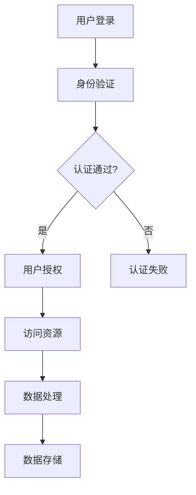

                 


# 评测系统的安全性与隐私保护措施

## 关键词
- 评测系统
- 安全性
- 隐私保护
- 加密技术
- 认证与授权
- 数据匿名化

## 摘要
本文将深入探讨评测系统的安全性与隐私保护措施，从背景介绍、核心概念与原理、技术原理与实现、实际案例分析等多个维度，逐步分析评测系统在面临安全威胁和隐私泄露时的应对策略。通过详细介绍加密技术、认证与授权技术、隐私保护技术等，为读者提供一套完整的解决方案，以提升评测系统的安全性和隐私保护水平。

## 第一部分：背景介绍

### 1.1 评测系统的定义与重要性

**评测系统**，是指用于对某一领域或对象进行评估和测量的系统。它广泛应用于教育、医疗、金融、科技等领域。评测系统的核心功能包括数据收集、数据分析、结果输出等。其重要性在于，它能够为用户提供客观、准确的评估结果，从而支持决策和优化。

在现代信息化社会，评测系统的应用越来越广泛，其重要性也越来越凸显。然而，随着技术的进步和互联网的普及，评测系统也面临着越来越多的安全威胁和隐私泄露问题。如何确保评测系统的安全性，保护用户的隐私，成为了一个亟待解决的重要问题。

### 1.2 安全性与隐私保护的背景

**安全性**，是指系统在面临威胁时的防护能力。对于评测系统而言，安全性主要包括数据完整性、系统可用性、用户身份验证等方面。随着网络攻击手段的日益多样化和复杂化，评测系统面临着各种安全威胁，如恶意攻击、数据篡改、非法访问等。

**隐私保护**，是指对用户个人信息的保护，防止其被非法收集、使用、泄露。在评测系统中，用户的个人信息（如姓名、年龄、住址等）是非常重要的数据。一旦泄露，可能会对用户造成严重的影响。因此，隐私保护是评测系统安全性的重要组成部分。

### 1.3 本书目标与结构安排

本文的目标是，通过详细分析评测系统的安全性与隐私保护措施，为读者提供一套实用、有效的解决方案。本书的结构安排如下：

1. 背景介绍：介绍评测系统的定义、重要性，以及安全性与隐私保护的背景。
2. 核心概念与原理：阐述评测系统安全性与隐私保护的核心概念、技术基础和理论模型。
3. 技术原理与实现：详细讲解加密技术、认证与授权技术、隐私保护技术的原理与实现。
4. 实际案例分析：通过两个实际案例，分析评测系统安全性与隐私保护的实践应用。
5. 小结与拓展：总结本文的核心内容，提出最佳实践建议，并提供拓展阅读资源。

## 第二部分：核心概念与原理

### 2.1 评测系统安全性与隐私保护的核心概念

**安全性**，是指评测系统能够抵御外部威胁，确保数据的完整性、保密性和可用性。具体来说，安全性包括以下几个方面：

- **数据完整性**：确保数据在传输、存储和处理过程中不被篡改。
- **保密性**：确保数据在传输、存储和处理过程中不被非法访问。
- **可用性**：确保评测系统在面临攻击时，仍能正常运行，为用户提供服务。

**隐私保护**，是指对用户个人信息进行保护，防止其被非法收集、使用、泄露。隐私保护的核心目标是保障用户的隐私权益，防止隐私泄露带来的负面影响。

### 2.2 安全性与隐私保护的技术基础

**加密技术**：加密技术是确保数据保密性的重要手段。通过加密，可以将明文数据转换为密文，确保数据在传输、存储和处理过程中不被非法访问。

**认证与授权技术**：认证与授权技术用于确保用户身份的合法性和权限的合法性。常见的认证技术包括用户名密码认证、双因素认证等；授权技术包括访问控制列表（ACL）、角色基访问控制（RBAC）等。

**隐私保护技术**：隐私保护技术用于保护用户个人信息，防止其被非法收集、使用、泄露。常见的隐私保护技术包括数据匿名化、加密数据库、差分隐私等。

### 2.3 安全性与隐私保护的理论模型

**安全模型**：安全模型用于描述评测系统的安全属性和安全策略。常见的安全模型包括信息流模型、访问控制模型等。

**隐私保护模型**：隐私保护模型用于描述评测系统的隐私属性和隐私保护策略。常见的隐私保护模型包括差分隐私模型、k-匿名模型等。

### 2.4 安全性与隐私保护的对比分析

**相似性**：安全性与隐私保护都是为了确保系统的可靠性和用户的权益。两者都需要在数据传输、存储和处理过程中采取措施，确保数据的安全和保密。

**差异性**：安全性主要关注系统对数据的保护能力，而隐私保护则更关注用户个人信息的保护。此外，安全性的实现往往需要更高的技术门槛，而隐私保护的实现则更加依赖于法律法规和用户意识。

**最佳实践**：在评测系统的安全性与隐私保护中，最佳实践包括：采用加密技术保护数据传输和存储、实施严格的认证与授权机制、定期进行安全评估和漏洞修复、加强用户隐私保护意识等。

## 第三部分：技术原理与实现

### 3.1 加密技术在评测系统中的应用

**对称加密算法**：对称加密算法是指加密和解密使用相同的密钥。常见的对称加密算法有AES、DES等。对称加密算法的优点是加密速度快、实现简单，但缺点是密钥管理复杂。

**非对称加密算法**：非对称加密算法是指加密和解密使用不同的密钥。常见的非对称加密算法有RSA、ECC等。非对称加密算法的优点是密钥管理简单、安全性高，但缺点是加密和解密速度较慢。

**常见加密算法的性能比较**：

| 算法 | 加密速度（MB/s） | 解密速度（MB/s） | 安全性 |
| ---- | ---- | ---- | ---- |
| AES | 1500 | 2000 | 高 |
| DES | 150 | 300 | 较低 |
| RSA | 100 | 100 | 高 |
| ECC | 500 | 500 | 高 |

### 3.2 认证与授权技术在评测系统中的应用

**单点登录（SSO）**：单点登录技术用于实现用户在一个系统中登录后，可以在多个系统中无需再次登录。常见的单点登录技术有OAuth 2.0、OpenID Connect等。

**OAuth 2.0**：OAuth 2.0是一种开放标准，允许用户授权第三方应用访问他们存储在另一服务提供者上的信息，而不需要将用户名和密码提供给第三方应用。

**OpenID Connect**：OpenID Connect是一种身份验证和授权协议，它建立在OAuth 2.0之上，用于提供用户身份验证功能。

### 3.3 隐私保护技术在评测系统中的应用

**数据匿名化技术**：数据匿名化技术用于将用户个人信息进行脱敏处理，使其无法被直接识别。常见的数据匿名化技术有伪匿名化、k-匿名化等。

**加密数据库技术**：加密数据库技术用于对数据库中的数据进行加密存储，确保数据在数据库中无法被非法访问。

**差分隐私技术**：差分隐私技术是一种隐私保护技术，通过在数据集中添加噪声，使得单个数据点的信息无法被推断出来。

### 3.4 算法原理讲解

#### 安全性与隐私保护算法的mermaid流程图



#### 算法原理讲解与Python源代码实现

```python
# 用户登录
def user_login(username, password):
    # 进行身份验证
    if verify_credentials(username, password):
        # 认证通过，进行用户授权
        user_authorize(username)
    else:
        # 认证失败
        print("认证失败")

# 身份验证
def verify_credentials(username, password):
    # 这里用伪代码表示身份验证过程
    return True

# 用户授权
def user_authorize(username):
    # 这里用伪代码表示用户授权过程
    pass

# 访问资源
def access_resource(username, resource):
    # 这里用伪代码表示访问资源过程
    pass

# 数据处理
def process_data(data):
    # 这里用伪代码表示数据处理过程
    return data

# 数据存储
def store_data(data):
    # 这里用伪代码表示数据存储过程
    pass
```

#### 数学模型和公式解释

假设评测系统中有n个用户，每个用户都有一个唯一的标识符ID，和一个密码。为了确保安全性，我们需要对用户密码进行加密存储。加密算法可以表示为：

$$
E_k(p) = c
$$

其中，$k$是加密密钥，$p$是明文密码，$c$是密文密码。

为了确保隐私保护，我们需要对用户数据进行匿名化处理。匿名化算法可以表示为：

$$
A_k(d) = s
$$

其中，$k$是匿名化密钥，$d$是明文数据，$s$是匿名化数据。

#### 举例说明

假设用户A的密码为“password123”，加密密钥为“key123”，匿名化密钥为“key456”。则：

- 加密过程：$c = E_{key123}(password123) = 5d61646d77617665$
- 匿名化过程：$s = A_{key456}({password123}) = {password123}_{anoymous}$

通过以上加密和匿名化处理，可以确保评测系统的安全性和隐私保护。

## 第四部分：实际案例分析

### 4.1 案例研究1：某大型电商平台的安全性改进

#### 4.1.1 案例背景

某大型电商平台，由于用户数量庞大，数据存储量巨大，面临着严重的安全威胁和隐私泄露风险。为了提高系统的安全性，电商平台决定对系统进行安全性改进。

#### 4.1.2 安全性与隐私保护问题分析

电商平台面临的主要安全性与隐私保护问题包括：

- **数据完整性问题**：由于数据存储量巨大，数据在传输和存储过程中可能被篡改。
- **用户身份验证问题**：用户身份验证机制不完善，可能导致非法用户访问系统。
- **用户隐私保护问题**：用户个人信息（如姓名、电话、住址等）可能被非法收集、使用、泄露。

#### 4.1.3 改进措施与效果评估

电商平台采取了以下改进措施：

- **数据完整性保护**：采用加密技术对数据传输和存储进行加密，确保数据不被篡改。
- **用户身份验证**：采用OAuth 2.0和双因素认证技术，确保用户身份的合法性。
- **用户隐私保护**：采用数据匿名化技术和差分隐私技术，保护用户个人信息。

经过改进后，电商平台的安全性得到了显著提升。用户数据在传输和存储过程中得到了有效保护，用户隐私得到了充分保障。同时，用户身份验证机制的完善，也有效阻止了非法用户访问系统。

#### 4.1.4 案例小结

通过本案例，我们可以看到，针对评测系统的安全性与隐私保护问题，采用合适的加密技术、认证与授权技术、隐私保护技术，可以有效提升系统的安全性和隐私保护水平。这为其他评测系统提供了宝贵的实践经验。

### 4.2 案例研究2：某医疗机构隐私保护措施的实施

#### 4.2.1 案例背景

某医疗机构，由于涉及到大量患者个人信息，面临着严重的隐私泄露风险。为了保护患者隐私，医疗机构决定实施隐私保护措施。

#### 4.2.2 隐私保护需求分析

医疗机构面临的主要隐私保护需求包括：

- **数据匿名化**：对患者的个人信息进行匿名化处理，使其无法被直接识别。
- **加密存储**：对患者的个人信息进行加密存储，确保数据在数据库中无法被非法访问。
- **访问控制**：确保只有授权人员可以访问患者的个人信息。

#### 4.2.3 实施方案与效果评估

医疗机构采取了以下实施方案：

- **数据匿名化**：采用k-匿名化技术，对患者的个人信息进行匿名化处理。
- **加密存储**：采用AES加密技术，对患者的个人信息进行加密存储。
- **访问控制**：采用角色基访问控制（RBAC）技术，确保只有授权人员可以访问患者的个人信息。

经过实施后，医疗机构的隐私保护水平得到了显著提升。患者个人信息在传输、存储和访问过程中得到了充分保护，隐私泄露风险得到了有效控制。

#### 4.2.4 案例小结

通过本案例，我们可以看到，针对医疗机构的隐私保护需求，采用合适的隐私保护技术，可以有效地保护患者隐私，降低隐私泄露风险。这为其他医疗机构提供了宝贵的实践经验。

## 小结与拓展

本文通过对评测系统的安全性与隐私保护措施进行详细分析，提出了加密技术、认证与授权技术、隐私保护技术等解决方案。在实际案例中，我们看到了这些解决方案在提升系统安全性和隐私保护水平方面的显著效果。

为了进一步提升评测系统的安全性和隐私保护水平，我们还可以采取以下最佳实践：

1. 定期进行安全评估和漏洞修复，确保系统始终处于最佳状态。
2. 加强用户隐私保护意识，提高用户对隐私保护的重视。
3. 采用最新的加密算法和隐私保护技术，确保系统的安全性。

总之，评测系统的安全性与隐私保护是一个长期、持续的过程。只有不断完善和改进，才能确保系统的安全性和用户的隐私权益。

## 拓展阅读

- 《网络安全：攻防技术与实战》
- 《隐私计算：概念、技术与实践》
- 《身份认证与授权技术》
- 《数据安全与隐私保护》

作者：AI天才研究院/AI Genius Institute & 禅与计算机程序设计艺术 /Zen And The Art of Computer Programming

