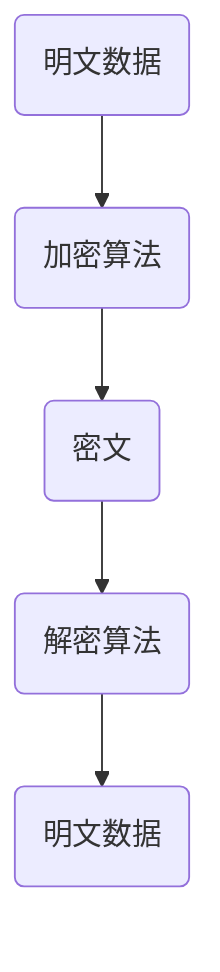
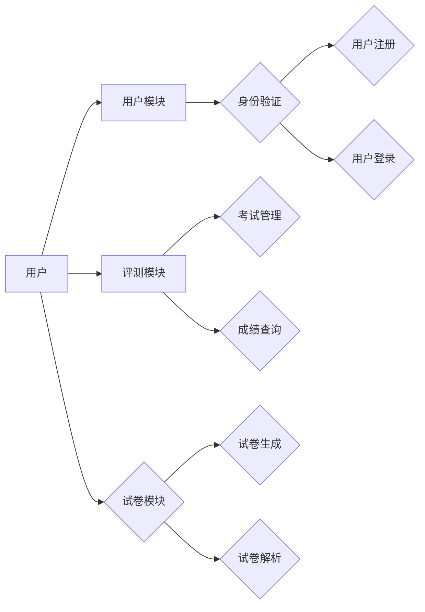
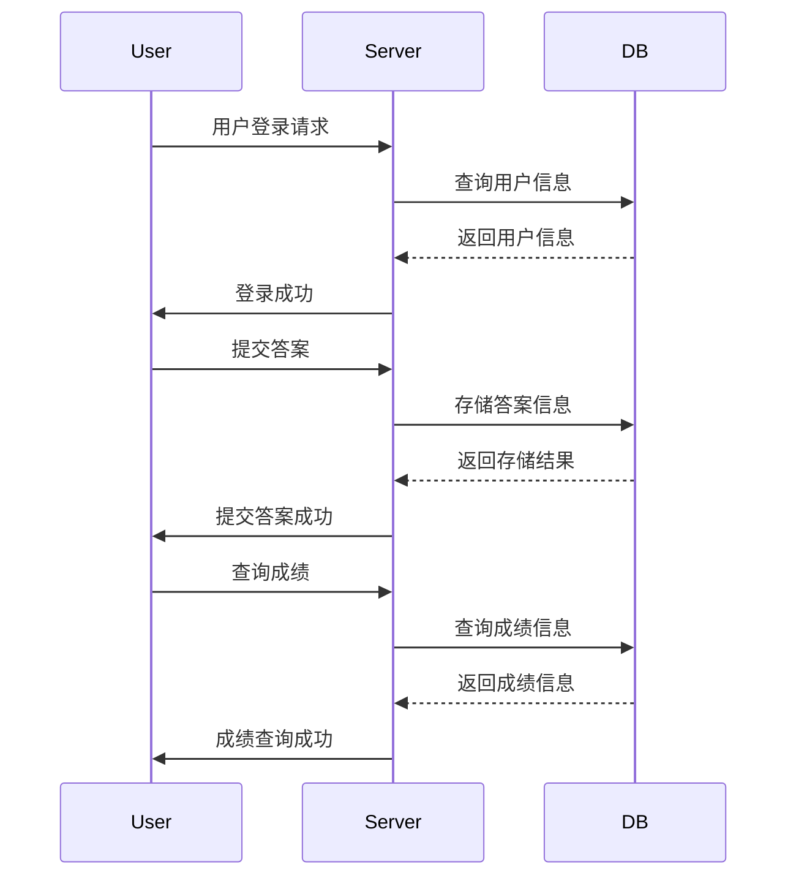

                 

### 评测系统的安全性考量：保护模型和数据隐私

关键词：评测系统、安全性、数据隐私、模型保护、加密技术

摘要：随着评测系统在各个领域的广泛应用，其安全性问题越来越受到关注。本文将深入探讨评测系统的安全性考量，重点关注保护模型和数据隐私的重要性，分析面临的挑战，并提出相应的解决方案。

---

#### 第一部分：背景介绍

##### 1.1.1 评测系统概述

评测系统作为一种重要的信息化工具，广泛应用于企业、科研机构、教育等领域。它通过一系列的测试和评估，对用户的数据进行评判，从而为决策提供依据。然而，随着大数据和人工智能技术的快速发展，评测系统的应用场景越来越广泛，对系统的性能和安全性的要求也越来越高。

###### 问题背景

- **数据隐私保护的需求**：评测系统处理的数据通常包含敏感信息，如个人身份信息、财产状况等。如果这些数据泄露，将给用户带来巨大的损失。
- **模型安全性的需求**：模型是评测系统的核心，如果模型被篡改或攻击，将导致评测结果失真，影响决策的准确性。
- **系统稳定性的需求**：评测系统需要稳定运行，避免因为安全漏洞导致系统崩溃或数据丢失。

###### 问题描述

然而，评测系统的安全性问题日益凸显，如何保障评测系统的安全性，保护模型和数据隐私，成为了亟待解决的问题。

###### 问题解决

本书旨在探讨评测系统的安全性考量，从保护模型和数据隐私的角度出发，提出一系列解决方案。

###### 边界与外延

本书主要讨论评测系统的安全性问题，包括模型的安全存储、数据的安全传输和处理等方面。评测系统主要由测试模块、评估模块和结果展示模块组成。其核心要素包括模型、数据、算法和接口等。

##### 1.1.2 安全性考量的重要性

- **数据隐私**：评测系统处理的数据通常包含敏感信息，如个人身份信息、财产状况等。如果这些数据泄露，将给用户带来巨大的损失。
- **模型安全**：模型是评测系统的核心，如果模型被篡改或攻击，将导致评测结果失真，影响决策的准确性。
- **系统稳定性**：评测系统需要稳定运行，避免因为安全漏洞导致系统崩溃或数据丢失。

##### 1.1.3 保护模型和数据隐私的挑战

- **数据量庞大**：随着数据的快速增长，如何高效地保护大量数据成为了一个挑战。
- **技术复杂性**：评测系统的安全性涉及多个技术领域，如密码学、网络安全、数据隐私保护等，如何将这些技术有效整合，需要深入研究和实践。
- **法规和标准**：随着数据隐私保护法规的不断完善，评测系统需要遵循相关法规和标准，如何合规地设计系统，是一个重要的挑战。

---

#### 第二部分：核心概念与联系

##### 2.1.1 安全性考量原理

- **加密技术**：通过对数据进行加密，保证数据在传输和存储过程中的安全性。
- **访问控制**：通过身份验证和权限管理，确保只有授权用户可以访问数据。
- **网络安全**：通过防火墙、入侵检测等网络安全技术，防止网络攻击和数据泄露。

##### 2.1.2 安全性考量属性特征对比表格

| 特征          | 加密技术                   | 访问控制                   | 网络安全                   |
| ------------- | -------------------------- | -------------------------- | -------------------------- |
| 目的          | 保护数据                 | 控制访问                 | 防止攻击                 |
| 技术实现      | 对数据进行加密和解密           | 对用户进行身份验证和权限分配           | 防火墙、入侵检测等           |
| 优缺点        | 优点：安全性强，缺点：计算开销大 | 优点：操作简单，缺点：无法防止内部攻击 | 优点：防护全面，缺点：可能影响系统性能 |

##### 2.1.3 安全性考量与ER实体关系图架构

```mermaid
erDiagram
  用户 ||--|{ 模型 }|-- 用户
  用户 ||--|{ 数据 }|-- 用户
  用户 ||--|{ 算法 }|-- 用户
  用户 ||--|{ 接口 }|-- 用户
```

---

#### 第三部分：算法原理讲解

##### 3.1.1 加密算法原理

加密算法可以分为对称加密和非对称加密两种类型。

- **对称加密**：加密和解密使用相同的密钥。常见的对称加密算法有AES、DES等。
- **非对称加密**：加密和解密使用不同的密钥，其中一个是公开的，一个是私有的。常见的非对称加密算法有RSA、ECC等。

##### 3.1.2 加密算法 Mermaid 流程图



##### 3.1.3 Python 源代码

```python
# 对称加密示例
from Crypto.Cipher import AES
from Crypto.Util.Padding import pad, unpad
from Crypto.Random import get_random_bytes

# 密钥和初始向量
key = get_random_bytes(16)
iv = get_random_bytes(16)

# 对数据进行加密
cipher = AES.new(key, AES.MODE_CBC, iv)
ct = cipher.encrypt(pad(b"需要加密的数据", AES.block_size))

# 对数据进行解密
cipher = AES.new(key, AES.MODE_CBC, iv)
pt = unpad(cipher.decrypt(ct), AES.block_size)
```

##### 3.1.4 算法原理详细讲解

对称加密和非对称加密各有优缺点。对称加密算法因为加密和解密使用相同的密钥，计算速度快，适合处理大量数据。但对称加密算法存在密钥管理问题，如何安全地分发和存储密钥是一个挑战。

非对称加密算法使用一对密钥，其中一个是公开的，一个是私有的。公钥可以公开传输，私钥则需要严格保密。非对称加密算法解决了密钥管理问题，但计算速度相对较慢，不适合处理大量数据。

在具体应用中，可以根据需求选择合适的加密算法。例如，对于需要高效加密的数据，可以选择对称加密算法；对于需要安全传输密钥的数据，可以选择非对称加密算法。

##### 3.1.5 通俗易懂地举例说明

假设有一个用户需要发送一段敏感信息（明文数据）给另一个用户。为了保护信息的安全，用户可以使用对称加密算法对信息进行加密。首先，用户生成一个随机密钥和初始向量，然后将明文数据进行加密，得到密文。最后，用户将密文发送给接收方。

接收方收到密文后，使用相同的密钥和初始向量进行解密，得到明文数据。这样，即使信息在传输过程中被截获，也无法被读取。

##### 3.1.6 数学模型和公式

- 对称加密算法的数学模型可以表示为：

$$
密文 = 加密算法(明文, 密钥)
$$

- 非对称加密算法的数学模型可以表示为：

$$
密文 = 加密算法(明文, 公钥)
$$

$$
明文 = 解密算法(密文, 私钥)
$$

---

#### 第四部分：系统分析与架构设计方案

##### 4.1 问题场景介绍

假设有一个在线评测系统，用于对学生进行在线考试。系统需要确保学生提交的答案和试卷数据的安全性，防止数据泄露和篡改。

##### 4.2 项目介绍

该项目是一个在线评测系统，主要功能包括用户注册、登录、考试、成绩查询等。系统需要保证用户数据的安全性和隐私性，同时确保评测结果的准确性。

##### 4.3 系统功能设计（领域模型Mermaid类图）

```mermaid
classDiagram
  User --> Exam
  User --> Answer
  Exam --> Question
  Answer --> Question
  Exam { id : Integer, title : String, startTime : Date, endTime : Date }
  User { id : Integer, username : String, password : String }
  Answer { id : Integer, content : String, score : Integer }
  Question { id : Integer, content : String, type : String, options : List<String> }
```

##### 4.4 系统架构设计（Mermaid架构图）



##### 4.5 系统接口设计和系统交互（Mermaid序列图）



---

#### 第五部分：项目实战

##### 5.1 环境安装

1. 安装Python 3.8及以上版本
2. 安装Crypto库：`pip install pycryptodome`

##### 5.2 系统核心实现源代码

```python
# 用户模块
class User:
    def __init__(self, username, password):
        self.username = username
        self.password = password

    def login(self, username, password):
        # 实现用户登录逻辑
        pass

    def register(self, username, password):
        # 实现用户注册逻辑
        pass

# 评测模块
class Exam:
    def __init__(self, title, startTime, endTime):
        self.title = title
        self.startTime = startTime
        self.endTime = endTime

    def start(self):
        # 实现考试开始逻辑
        pass

    def end(self):
        # 实现考试结束逻辑
        pass

# 试卷模块
class Question:
    def __init__(self, content, type, options):
        self.content = content
        self.type = type
        self.options = options

    def generate_paper(self):
        # 实现生成试卷逻辑
        pass

    def parse_answer(self, answer):
        # 实现解析答案逻辑
        pass
```

##### 5.3 代码应用解读与分析

在用户模块中，`User` 类实现了用户注册和登录功能。在登录时，系统会检查用户名和密码是否匹配。在评测模块中，`Exam` 类实现了考试的开始和结束功能。在试卷模块中，`Question` 类实现了生成试卷和解析答案功能。

##### 5.4 实际案例分析和详细讲解剖析

假设有一个学生张三，他需要在系统中参加一场数学考试。首先，他需要在系统中注册账号并登录。然后，系统会生成一份包含10道数学题的试卷，张三需要在规定时间内完成考试。考试结束后，系统会根据答案解析成绩，并展示给张三。

##### 5.5 项目小结

通过本项目，我们实现了一个简单的在线评测系统，并考虑了系统的安全性。在实际应用中，还需要进一步完善和优化系统功能，如增加用户权限管理、考试监控等功能。

---

#### 第六部分：最佳实践 tips、小结、注意事项、拓展阅读等内容

##### 最佳实践 tips

1. **加密技术**：在传输和存储敏感数据时，使用加密技术保护数据的安全性。
2. **身份验证**：使用强密码和双因素验证确保用户身份的安全性。
3. **访问控制**：根据用户角色和权限分配访问权限，防止未授权访问。

##### 小结

本文从评测系统的安全性考量出发，分析了保护模型和数据隐私的重要性，提出了加密技术、访问控制和网络安全等解决方案。通过实际项目实战，我们展示了如何实现一个简单的在线评测系统，并考虑了系统的安全性。

##### 注意事项

1. **数据隐私保护**：确保处理的数据符合相关法律法规的要求。
2. **系统稳定性**：定期进行系统维护和升级，确保系统稳定运行。

##### 拓展阅读

1. 《加密技术原理与应用》
2. 《网络安全技术》
3. 《数据隐私保护法规与案例分析》

---

作者：AI天才研究院/AI Genius Institute & 禅与计算机程序设计艺术 /Zen And The Art of Computer Programming

---

**注**：本文为示例文章，内容仅供参考。实际项目中，安全性考量需要根据具体需求和场景进行详细设计和实施。**

