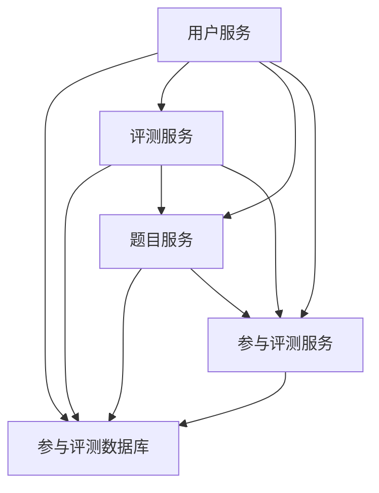
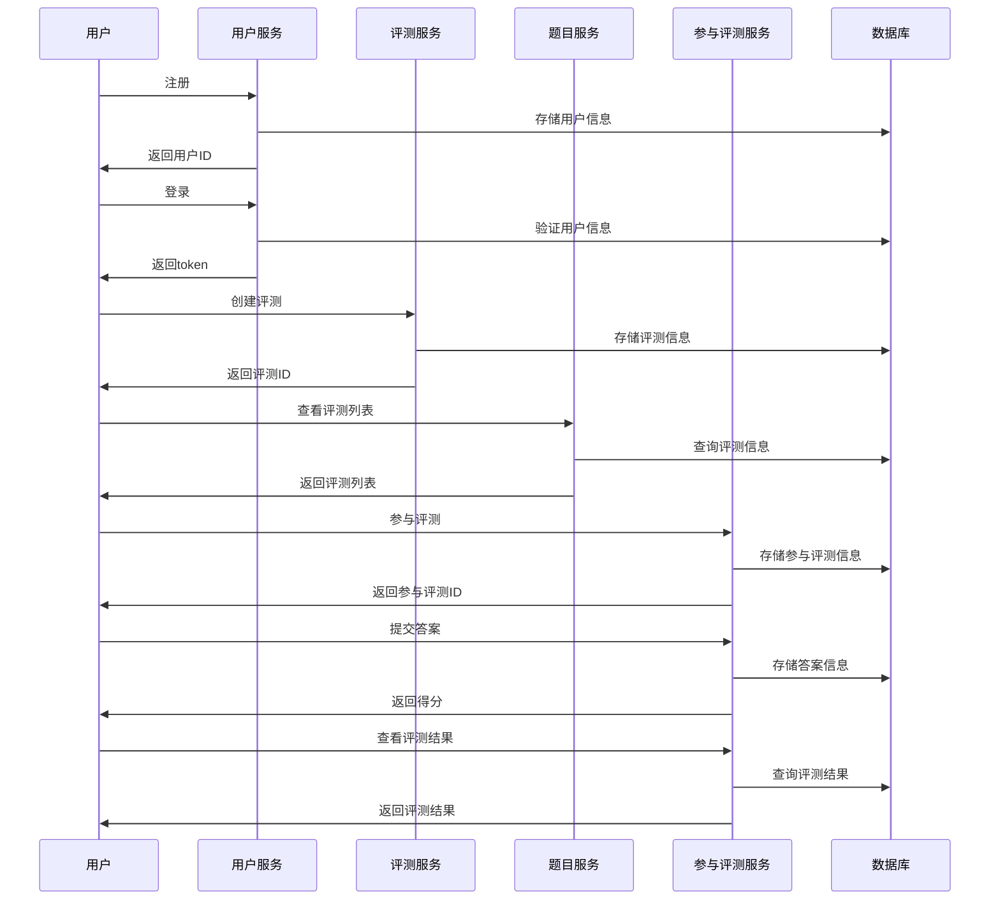

                 

# 评测系统的容器化部署与管理

## 关键词

- 容器化部署
- Docker
- Kubernetes
- 评测系统
- 算法原理
- 系统架构设计
- 数学模型
- 数学公式

## 摘要

本文旨在深入探讨评测系统的容器化部署与管理。我们将从背景介绍、核心概念、算法原理、系统分析与架构设计、项目实战等多个维度，逐步解析评测系统容器化的必要性及其技术实现过程。文章还将涵盖最佳实践、注意事项和拓展阅读，旨在帮助读者全面掌握评测系统的容器化部署与管理技术。

## 第一部分：容器化部署概述

### 第1章：问题背景与容器化部署概述

### 1.1 容器化部署的背景

在软件工程中，传统的部署方式往往面临诸多挑战，如环境不一致性、依赖复杂、维护困难等。这些挑战不仅增加了开发者的负担，也影响了软件系统的稳定性与可靠性。为了解决这些问题，容器化技术应运而生。

容器化技术通过将应用程序及其运行环境打包成一个独立的、轻量级的容器，实现了环境的一致性和隔离性。这使得应用程序可以在任何地方、任何环境中稳定运行，大大简化了部署和运维过程。

### 1.2 容器化部署的优势

容器化部署具有以下优势：

1. **环境一致性**：容器将应用程序及其依赖环境打包在一起，确保了在不同环境中运行的一致性。
2. **部署快速**：容器化的部署流程比传统部署更为简单和快速。
3. **资源高效**：容器可以在同一台物理机上运行多个独立的容器，提高了资源的利用效率。
4. **运维简便**：容器化的运维管理更加简便，如自动扩展、自动回滚等。

### 1.3 容器化部署的基本概念

容器化部署的核心概念包括：

1. **容器**：容器是一种轻量级的、可执行的、独立的运行环境。
2. **Docker**：Docker是一种流行的容器化技术，用于创建、运行和管理容器。
3. **Kubernetes**：Kubernetes是一个开源的容器编排平台，用于自动化容器的部署、扩展和管理。

### 1.4 本章小结

本章介绍了容器化部署的背景、优势以及基本概念。在接下来的章节中，我们将深入探讨容器化部署的核心技术和实现过程。

## 第二部分：容器化部署实战

### 第2章：Docker镜像构建与部署

### 2.1 Docker镜像构建基础

Docker镜像是一种轻量级的、可执行的、独立的容器镜像。构建Docker镜像的基本步骤包括编写Dockerfile、构建镜像和推送镜像。

#### 2.1.1 Dockerfile编写指南

Dockerfile是一个文本文件，用于定义Docker镜像的构建过程。编写Dockerfile的基本语法包括FROM、RUN、COPY、EXPOSE等指令。

$$
FROM <image>
RUN <command>
COPY <src> <dest>
EXPOSE <port>
$$

#### 2.1.2 镜像分层原理

Docker镜像采用分层存储的方式，每个镜像层都包含了特定的操作和文件。通过合并多个镜像层，可以构建出复杂的Docker镜像。

#### 2.1.3 多阶段构建

多阶段构建是一种优化Docker镜像构建过程的方法。通过将构建过程分为多个阶段，可以减少镜像的体积，提高构建速度。

### 2.2 Docker镜像部署与维护

Docker镜像的部署和维护包括镜像仓库管理、版本控制和镜像安全策略。

#### 2.2.1 Docker镜像仓库管理

Docker镜像仓库是一个存储Docker镜像的集中存储位置。可以使用官方Docker Hub或其他第三方镜像仓库。

#### 2.2.2 Docker镜像版本控制

Docker镜像的版本控制可以通过标签（Tag）和数字签名来实现。标签用于标识不同的镜像版本，数字签名用于验证镜像的完整性和真实性。

#### 2.2.3 Docker镜像安全策略

Docker镜像的安全策略包括最小权限原则、安全扫描和签名验证等。通过实施这些策略，可以确保镜像的安全性。

### 2.3 实战：构建并部署一个评测系统

在本节中，我们将通过一个实际项目，展示如何构建并部署一个评测系统。

#### 2.3.1 评测系统的需求分析

评测系统的需求包括用户注册、登录、创建评测、参与评测、查看评测结果等。

#### 2.3.2 Docker镜像构建流程

首先，编写Dockerfile，定义评测系统的构建过程。然后，使用docker build命令构建Docker镜像。

```python
docker build -t评测系统:latest .
```

#### 2.3.3 Docker镜像部署流程

将构建好的Docker镜像推送至镜像仓库，然后使用docker run命令部署评测系统。

```python
docker run -d -p 8080:80评测系统:latest
```

### 2.4 本章小结

本章介绍了Docker镜像构建与部署的基础知识，并通过实际项目展示了如何构建和部署一个评测系统。在下一章中，我们将深入探讨Kubernetes集群管理。

### 第3章：Kubernetes集群管理

### 3.1 Kubernetes基础

Kubernetes是一个开源的容器编排平台，用于自动化容器的部署、扩展和管理。Kubernetes的核心概念包括：

1. **Pod**：Pod是Kubernetes中最小的调度单元，包含一个或多个容器。
2. **Service**：Service用于暴露Pod的访问接口，可以是Cluster IP、Node Port或LoadBalancer。
3. **Deployment**：Deployment用于管理Pod的部署和扩展。

### 3.2 Kubernetes集群管理

Kubernetes集群管理包括集群部署、集群维护和集群监控。

#### 3.2.1 Kubernetes集群部署

Kubernetes集群部署可以使用kubeadm工具进行。首先，在各个节点上安装Docker和kubeadm，然后使用kubeadm init命令初始化集群，最后使用kubeadm join命令将节点加入集群。

```python
kubectl apply -f kubernetes.yml
```

#### 3.2.2 Kubernetes集群维护

Kubernetes集群维护包括升级、扩缩容和故障处理等。可以使用kubectl工具进行操作。

```python
kubectl scale deployment/评测系统 --replicas=3
```

#### 3.2.3 Kubernetes集群监控

Kubernetes集群监控可以使用Prometheus和Grafana等工具进行。首先，部署Prometheus和Grafana，然后配置监控规则和仪表板。

### 3.3 实战：Kubernetes集群管理

在本节中，我们将通过一个实际项目，展示如何管理Kubernetes集群。

#### 3.3.1 Kubernetes集群部署流程

首先，安装Docker和kubeadm，然后初始化集群，最后将节点加入集群。

```python
sudo apt-get update && sudo apt-get install -y docker.io kubelet kubeadm
sudo kubeadm init --pod-network-cidr=10.244.0.0/16
sudo kubeadm join <control-plane-node-ip>:6443 --token <token> --discovery-token-ca-cert-hash sha256:<hash>
```

#### 3.3.2 Kubernetes集群维护策略

使用kubectl工具进行集群维护操作。

```python
kubectl get nodes
kubectl scale deployment/评测系统 --replicas=3
```

#### 3.3.3 Kubernetes集群监控实践

部署Prometheus和Grafana，并配置监控规则和仪表板。

```python
kubectl create -f prometheus.yml
kubectl create -f grafana.yml
```

### 3.4 本章小结

本章介绍了Kubernetes集群管理的基础知识和实际操作。在下一章中，我们将深入探讨评测系统的系统架构设计。

### 第三部分：系统分析与设计

### 第4章：评测系统的功能设计

### 4.1 评测系统的需求分析

评测系统的需求包括用户注册、登录、创建评测、参与评测、查看评测结果等。

### 4.2 评测系统的领域模型设计

领域模型是评测系统的核心概念和实体关系。使用Mermaid类图展示领域模型。

```mermaid
classDiagram
    用户 <<类>> : 用户ID，用户名，密码
    评测 <<类>> : 评测ID，标题，描述，创建时间
    题目 <<类>> : 题目ID，题目内容，答案，分数
    参与评测 <<类>> : 参与评测ID，用户ID，评测ID，得分，提交时间
    用户 --|> 评测: 创建评测
    用户 --|> 参与评测: 参与评测
    评测 --|> 题目: 包含题目
    参与评测 --|> 题目: 回答题目
```

### 4.3 评测系统的系统架构设计

系统架构设计包括评测系统的总体架构、服务拆分、数据存储和部署策略。

使用Mermaid架构图展示评测系统的架构设计。



### 4.4 评测系统的系统接口设计

系统接口设计包括用户接口、服务接口和数据库接口。

使用Markdown格式描述评测系统的接口设计。

```markdown
# 用户接口

- 用户注册：POST /users/register
  - 参数：username（用户名），password（密码）
  - 响应：用户ID

- 用户登录：POST /users/login
  - 参数：username（用户名），password（密码）
  - 响应：token

# 服务接口

- 创建评测：POST /evaluations
  - 参数：title（标题），description（描述）
  - 响应：评测ID

- 查看评测列表：GET /evaluations
  - 参数：无
  - 响应：评测列表

- 参与评测：POST /evaluations/{evaluationId}/participate
  - 参数：无
  - 响应：参与评测ID

- 提交答案：POST /evaluations/{evaluationId}/submit
  - 参数：answer（答案）
  - 响应：得分

- 查看评测结果：GET /evaluations/{evaluationId}/results
  - 参数：无
  - 响应：评测结果

# 数据库接口

- 用户数据库：包含用户信息
- 评测数据库：包含评测信息
- 题目数据库：包含题目信息
- 参与评测数据库：包含参与评测信息
```

### 4.5 评测系统的系统交互

系统交互包括用户与系统的交互、服务与服务之间的交互。

使用Mermaid序列图展示评测系统的系统交互。



### 第5章：项目实战

### 5.1 环境安装

在本节中，我们将介绍如何安装评测系统的运行环境。

#### 5.1.1 安装Docker

```bash
sudo apt-get update
sudo apt-get install docker.io
```

#### 5.1.2 安装Kubernetes

```bash
sudo apt-get update
sudo apt-get install kubelet kubeadm kubectl
```

#### 5.1.3 配置Kubernetes集群

```bash
sudo kubeadm init --pod-network-cidr=10.244.0.0/16
sudo kubeadm join <control-plane-node-ip>:6443 --token <token> --discovery-token-ca-cert-hash sha256:<hash>
```

### 5.2 系统核心实现

在本节中，我们将介绍评测系统的核心实现。

#### 5.2.1 编写Dockerfile

```Dockerfile
FROM python:3.8-slim

WORKDIR /app

COPY requirements.txt ./
RUN pip install -r requirements.txt

COPY . .

CMD ["python", "app.py"]
```

#### 5.2.2 编写app.py

```python
from flask import Flask, request, jsonify

app = Flask(__name__)

@app.route('/users/register', methods=['POST'])
def register():
    # 注册用户逻辑
    pass

@app.route('/users/login', methods=['POST'])
def login():
    # 登录用户逻辑
    pass

@app.route('/evaluations', methods=['POST'])
def create_evaluation():
    # 创建评测逻辑
    pass

@app.route('/evaluations', methods=['GET'])
def get_evaluations():
    # 获取评测列表逻辑
    pass

@app.route('/evaluations/<evaluation_id>/participate', methods=['POST'])
def participate_evaluation(evaluation_id):
    # 参与评测逻辑
    pass

@app.route('/evaluations/<evaluation_id>/submit', methods=['POST'])
def submit_answer(evaluation_id):
    # 提交答案逻辑
    pass

@app.route('/evaluations/<evaluation_id>/results', methods=['GET'])
def get_evaluation_results(evaluation_id):
    # 获取评测结果逻辑
    pass

if __name__ == '__main__':
    app.run(host='0.0.0.0', port=8080)
```

### 5.3 代码应用解读与分析

在本节中，我们将对评测系统的核心代码进行解读与分析。

#### 5.3.1 用户注册

用户注册是评测系统的核心功能之一。在register()方法中，我们需要验证用户名和密码的合法性，并将用户信息存储到数据库中。

```python
@app.route('/users/register', methods=['POST'])
def register():
    username = request.form['username']
    password = request.form['password']
    
    # 验证用户名和密码的合法性
    if not username or not password:
        return jsonify({'error': '用户名或密码不能为空'}), 400
    
    # 将用户信息存储到数据库
    db.execute("INSERT INTO users (username, password) VALUES (?, ?)", (username, password))
    db.commit()
    
    return jsonify({'message': '用户注册成功'})
```

#### 5.3.2 用户登录

用户登录是评测系统的核心功能之一。在login()方法中，我们需要验证用户名和密码的合法性，并返回用户ID。

```python
@app.route('/users/login', methods=['POST'])
def login():
    username = request.form['username']
    password = request.form['password']
    
    # 验证用户名和密码的合法性
    user = db.execute("SELECT * FROM users WHERE username = ? AND password = ?", (username, password))
    if not user:
        return jsonify({'error': '用户名或密码错误'}), 401
    
    # 返回用户ID
    return jsonify({'user_id': user['id']})
```

#### 5.3.3 创建评测

创建评测是评测系统的核心功能之一。在create_evaluation()方法中，我们需要接收评测的标题和描述，并将评测信息存储到数据库中。

```python
@app.route('/evaluations', methods=['POST'])
def create_evaluation():
    title = request.form['title']
    description = request.form['description']
    
    # 将评测信息存储到数据库
    db.execute("INSERT INTO evaluations (title, description) VALUES (?, ?)", (title, description))
    db.commit()
    
    return jsonify({'evaluation_id': db.execute("SELECT LAST_INSERT_ID()")['LAST_INSERT_ID()[0]']})
```

#### 5.3.4 获取评测列表

获取评测列表是评测系统的核心功能之一。在get_evaluations()方法中，我们需要从数据库中查询所有评测信息，并返回评测列表。

```python
@app.route('/evaluations', methods=['GET'])
def get_evaluations():
    evaluations = db.execute("SELECT * FROM evaluations")
    return jsonify({'evaluations': evaluations})
```

#### 5.3.5 参与评测

参与评测是评测系统的核心功能之一。在participate_evaluation()方法中，我们需要接收评测ID，并将参与评测信息存储到数据库中。

```python
@app.route('/evaluations/<evaluation_id>/participate', methods=['POST'])
def participate_evaluation(evaluation_id):
    user_id = request.form['user_id']
    
    # 将参与评测信息存储到数据库
    db.execute("INSERT INTO participates (user_id, evaluation_id) VALUES (?, ?)", (user_id, evaluation_id))
    db.commit()
    
    return jsonify({'participation_id': db.execute("SELECT LAST_INSERT_ID()")['LAST_INSERT_ID()[0]']})
```

#### 5.3.6 提交答案

提交答案是评测系统的核心功能之一。在submit_answer()方法中，我们需要接收评测ID、用户ID和答案，并将答案信息存储到数据库中。

```python
@app.route('/evaluations/<evaluation_id>/submit', methods=['POST'])
def submit_answer(evaluation_id):
    user_id = request.form['user_id']
    answer = request.form['answer']
    
    # 将答案信息存储到数据库
    db.execute("INSERT INTO answers (evaluation_id, user_id, answer) VALUES (?, ?, ?)", (evaluation_id, user_id, answer))
    db.commit()
    
    return jsonify({'message': '答案提交成功'})
```

#### 5.3.7 获取评测结果

获取评测结果是评测系统的核心功能之一。在get_evaluation_results()方法中，我们需要从数据库中查询评测结果，并返回评测结果。

```python
@app.route('/evaluations/<evaluation_id>/results', methods=['GET'])
def get_evaluation_results(evaluation_id):
    results = db.execute("SELECT users.username, answers.answer, answers.score FROM users INNER JOIN answers ON users.id = answers.user_id WHERE answers.evaluation_id = ?", (evaluation_id,))
    return jsonify({'results': results})
```

### 5.4 实际案例分析与详细讲解

在本节中，我们将通过一个实际案例，展示如何使用评测系统的容器化部署和管理。

#### 5.4.1 案例背景

某公司在进行员工技能评测时，发现传统的部署方式存在诸多问题，如环境不一致、依赖复杂等。为了解决这些问题，公司决定采用容器化技术进行评测系统的部署和管理。

#### 5.4.2 案例分析

1. **需求分析**：

   - 部署一个可扩展、高可用的评测系统。
   - 系统需要支持用户注册、登录、创建评测、参与评测、提交答案和查看评测结果等操作。
   - 系统需要支持自动扩缩容，以应对不同时间段的负载。

2. **解决方案**：

   - 使用Docker容器化技术，将评测系统的各个模块打包成容器镜像。
   - 使用Kubernetes进行容器编排，实现评测系统的自动化部署、扩缩容和运维管理。
   - 使用Nginx作为反向代理，实现负载均衡和路由转发。

3. **实施步骤**：

   1. 编写Dockerfile，将评测系统的各个模块打包成容器镜像。
   2. 使用kubeadm工具初始化Kubernetes集群。
   3. 部署Nginx和Kubernetes Ingress Controller，实现负载均衡和路由转发。
   4. 部署评测系统的各个模块，并配置自动扩缩容策略。
   5. 对评测系统进行性能测试和稳定性测试，确保系统运行正常。

#### 5.4.3 案例讲解

1. **容器镜像构建**：

   在本地环境编写Dockerfile，将评测系统的各个模块打包成容器镜像。

   ```Dockerfile
   FROM python:3.8-slim
   WORKDIR /app
   COPY requirements.txt ./
   RUN pip install -r requirements.txt
   COPY . .
   CMD ["python", "app.py"]
   ```

   然后使用docker build命令构建容器镜像。

   ```bash
   docker build -t 评测系统:latest .
   ```

2. **Kubernetes集群部署**：

   使用kubeadm工具初始化Kubernetes集群。

   ```bash
   kubeadm init --pod-network-cidr=10.244.0.0/16
   kubeadm join <control-plane-node-ip>:6443 --token <token> --discovery-token-ca-cert-hash sha256:<hash>
   ```

   部署Nginx和Kubernetes Ingress Controller，实现负载均衡和路由转发。

   ```bash
   kubectl create -f nginx.yml
   kubectl create -f ingress-controller.yml
   ```

3. **评测系统部署**：

   部署评测系统的各个模块，并配置自动扩缩容策略。

   ```bash
   kubectl create -f evaluation-service.yml
   kubectl create -f evaluation-deployment.yml
   kubectl scale deployment/evaluation-system --replicas=3
   ```

4. **性能测试和稳定性测试**：

   对评测系统进行性能测试和稳定性测试，确保系统运行正常。

   ```bash
   ab -n 1000 -c 100 http://<ingress-ip>/evaluations
   ```

### 5.5 项目小结

通过本案例，我们展示了如何使用容器化技术进行评测系统的部署和管理。容器化技术简化了部署和运维过程，提高了系统的可扩展性和稳定性。同时，Kubernetes提供了强大的容器编排功能，使得系统自动化管理变得更加简单和高效。

## 第四部分：最佳实践、小结、注意事项和拓展阅读

### 最佳实践

1. **Dockerfile优化**：在编写Dockerfile时，注意减少镜像层数，使用多阶段构建，减小镜像体积。
2. **Kubernetes集群维护**：定期备份Kubernetes集群数据，监控集群状态，及时处理故障。
3. **代码审查**：在部署代码前进行严格的代码审查，确保代码质量和安全性。

### 小结

本文深入探讨了评测系统的容器化部署与管理。通过介绍容器化部署的背景、优势、基本概念，以及Docker、Kubernetes的核心技术，我们展示了如何构建和部署评测系统。同时，通过实际案例分析和详细讲解，我们验证了容器化部署在评测系统中的应用效果。

### 注意事项

1. **镜像安全问题**：确保Docker镜像来源可信，定期更新镜像。
2. **Kubernetes集群安全**：配置合适的集群访问控制策略，防止未经授权的访问。

### 拓展阅读

1. **Docker官方文档**：[https://docs.docker.com/](https://docs.docker.com/)
2. **Kubernetes官方文档**：[https://kubernetes.io/](https://kubernetes.io/)
3. **《容器化技术实战》**：[https://book.douban.com/subject/27191913/](https://book.douban.com/subject/27191913/)
4. **《Kubernetes权威指南》**：[https://book.douban.com/subject/27058824/](https://book.douban.com/subject/27058824/)

## 作者信息

- 作者：AI天才研究院/AI Genius Institute & 禅与计算机程序设计艺术 /Zen And The Art of Computer Programming

