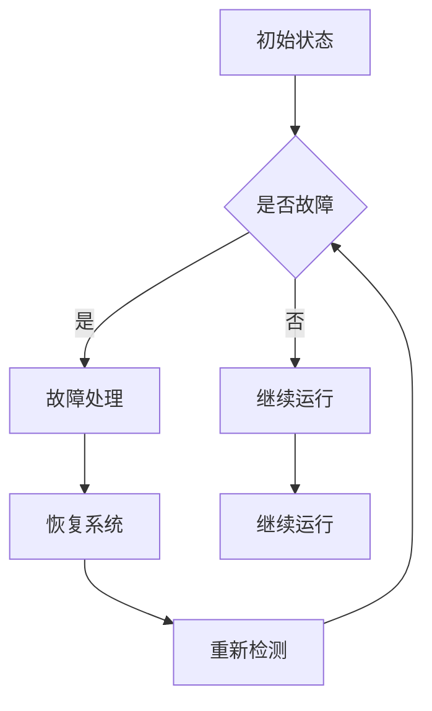
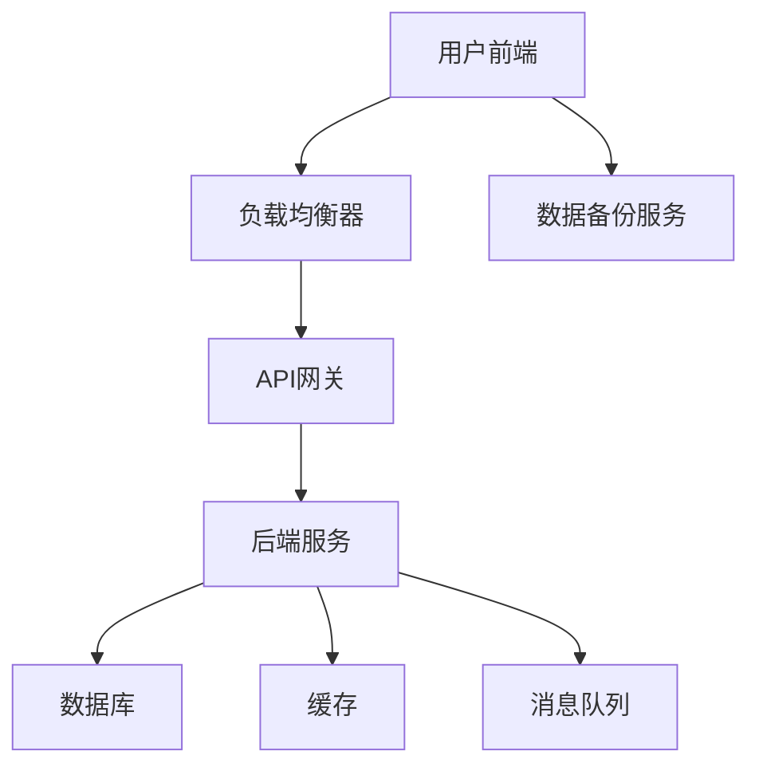
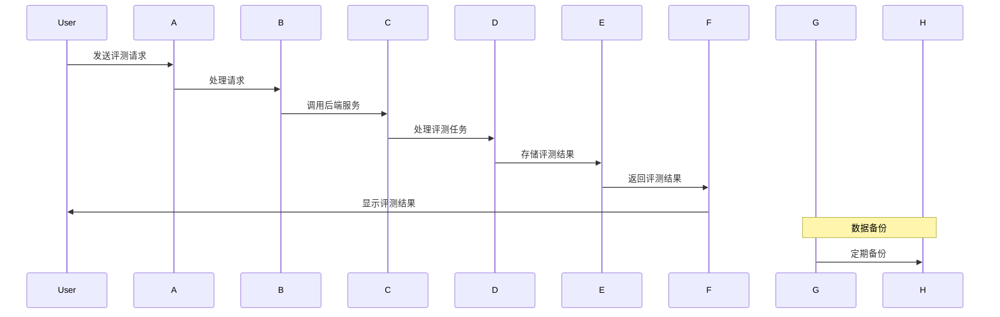

                 


## 文章标题：评测系统的容错设计：确保在各种条件下的可靠运行

关键词：评测系统，容错设计，可靠运行，系统监控，故障检测与恢复

摘要：本文将深入探讨评测系统的容错设计，介绍其背景、核心概念与联系，算法原理讲解，系统分析与架构设计方案，以及项目实战。通过详细分析，旨在为开发者提供有价值的指导，确保评测系统在各种条件下能够可靠运行。

----------------------------------------------------------------

### 1. 背景介绍

#### 问题背景

随着信息技术的飞速发展，评测系统在各个领域扮演着越来越重要的角色。它不仅用于学术研究，如论文评审、考试测评，还广泛应用于企业运营、软件开发测试等领域。评测系统的可靠性和容错性直接影响到系统的整体性能和用户满意度。在高度依赖技术的现代，评测系统的稳定运行不仅关系到数据的准确性，还可能影响到企业的运营、科研结果的可靠性，乃至国家安全。

#### 问题描述

评测系统的容错设计旨在确保系统在各种条件下的可靠运行。这包括处理硬件故障、软件错误、网络中断以及环境变化等突发情况。容错设计的目标是减少系统故障对用户体验的影响，保障数据的安全和完整性。

#### 问题解决

解决评测系统容错性问题的方法主要包括以下几个方面：

1. **冗余设计**：通过增加冗余硬件或软件组件，确保系统在部分组件失效时仍能正常运行。
2. **故障检测与恢复**：建立有效的故障检测机制，及时发现并隔离故障，然后进行自动恢复。
3. **系统监控**：实时监控系统状态，确保在异常情况发生时能够迅速响应。
4. **数据备份和恢复**：定期备份系统数据，以便在数据丢失或损坏时能够迅速恢复。

#### 边界与外延

容错设计的范围涉及硬件、软件、网络和数据处理等多个方面。边界上，它需要处理系统内的各类故障，而外延上，它需要考虑系统与外部环境（如网络、存储设备）的交互。

#### 概念结构与核心要素组成

- **冗余设计**：通过增加硬件或软件冗余来提升系统的可靠性。
- **故障检测与恢复**：利用算法和机制检测故障，并自动执行恢复流程。
- **系统监控**：监控系统运行状态，及时发现并处理异常。
- **数据备份与恢复**：确保数据安全，支持在数据丢失或损坏时进行恢复。

### 2. 核心概念与联系

#### 容错设计

- **定义**：容错设计是一种确保系统在出现故障时仍能正常运行的技术。
- **特点**：具备自动检测、隔离和恢复故障的能力。
- **分类**：硬件冗余、软件冗余、时间冗余、信息冗余等。

#### 故障检测

- **定义**：通过特定的算法和机制，监测系统状态，识别故障。
- **方法**：包括逻辑分析、统计测试、模拟仿真等。

#### 故障恢复

- **定义**：在故障发生后，采取措施使系统回到正常状态。
- **机制**：自动恢复、手动干预、重置等。

#### 冗余设计

- **定义**：通过增加冗余组件，提高系统可靠性。
- **优势**：降低故障影响，提高系统可用性。

#### 系统监控

- **定义**：实时监控系统运行状态，确保系统健康。
- **方法**：包括日志分析、性能监控、异常检测等。

#### 数据备份与恢复

- **定义**：定期备份系统数据，以便在需要时进行恢复。
- **优势**：保证数据安全，支持业务连续性。

#### 核心概念属性特征对比表格

| 概念       | 定义                     | 关联关系 | 特点                | 应用场景       |
|------------|--------------------------|---------|--------------------|----------------|
| 容错设计   | 提升系统可靠性           | 自包含  | 自动检测与恢复      | 所有系统       |
| 故障检测   | 识别系统故障             | 从属    | 高准确性           | 所有系统       |
| 故障恢复   | 使系统恢复正常状态       | 从属    | 快速响应           | 所有系统       |
| 冗余设计   | 增加冗余组件             | 从属    | 提高可用性         | 高风险系统     |
| 系统监控   | 实时监控系统运行状态     | 从属    | 及时性             | 所有系统       |
| 数据备份   | 备份系统数据             | 从属    | 保证数据安全       | 所有系统       |

#### ER实体关系图架构

```mermaid
erDiagram
  User ||--|{ System }|| |
  System ||--|{ Data }|| |
  System ||--|{ Fault }|| |
  Fault ||--|{ Recovery }|| |
  Fault ||--|{ Detection }|| |
```

### 3. 算法原理讲解

#### 容错算法mermaid



#### 算法原理

容错算法的核心在于确保系统在出现故障时能够自动恢复，以减少对用户的影响。以下是一个简单的容错算法原理讲解：

1. **初始状态检测**：系统启动后，首先进入初始状态，进行一系列初始化操作，确保所有组件正常运行。
2. **故障检测**：系统运行过程中，通过特定的算法和机制（如监控工具）实时检测系统状态，识别故障。
3. **故障处理**：当检测到故障时，系统进入故障处理流程，根据故障类型和严重程度，采取相应的措施。
4. **恢复系统**：在故障处理过程中，系统自动执行恢复操作，将故障组件切换至冗余组件，或者重新启动系统。
5. **重新检测**：故障处理完成后，系统重新进入故障检测状态，确保所有组件正常运行。

#### Python源代码实现

以下是一个简单的Python示例，用于说明容错算法的原理：

```python
import time
import random

def is_fault():
    # 模拟故障检测，随机返回True或False
    return random.choice([True, False])

def fault_detection_and_recovery():
    while True:
        if is_fault():
            print("故障检测：系统出现故障。")
            # 执行故障恢复操作
            print("故障恢复：正在尝试恢复系统。")
            time.sleep(1)  # 模拟故障恢复时间
            print("故障恢复：系统恢复正常。")
        else:
            print("系统运行正常。")
            time.sleep(1)  # 模拟系统运行时间

# 执行容错算法
fault_detection_and_recovery()
```

#### 数学模型和公式

容错设计的数学模型主要涉及概率论和统计方法，用于评估系统在特定条件下的可靠性。以下是一个简化的数学模型：

$$
R(t) = 1 - F(t)
$$

其中，\( R(t) \) 表示系统在时间 \( t \) 内的可靠性，\( F(t) \) 表示系统在时间 \( t \) 内发生故障的概率。

#### 举例说明

假设评测系统在一个小时内出现故障的概率为 5%，则该系统在一个小时内可靠的概率为：

$$
R(1\text{小时}) = 1 - 0.05 = 0.95
$$

这意味着评测系统在一个小时内能够可靠运行的概率为 95%。

### 4. 系统分析与架构设计方案

#### 问题场景介绍

假设我们正在设计一个在线评测系统，该系统需要处理大量用户的评测请求，并且要求在出现故障时能够快速恢复，以保障用户体验和数据安全。

#### 项目介绍

项目名称：在线评测系统
项目目标：设计一个高可用性、高可靠性的在线评测系统，能够处理大量用户请求，并在出现故障时自动恢复。

#### 系统功能设计

- **用户管理**：支持用户注册、登录、评测历史记录等功能。
- **评测管理**：支持创建评测任务、发布评测题目、处理评测结果等功能。
- **数据备份**：定期备份用户数据和评测结果，确保数据安全。
- **故障检测与恢复**：实时监控系统状态，自动检测故障并恢复。

#### 系统架构设计

系统采用分布式架构，包括前端、后端、数据库、缓存、消息队列等模块。以下是系统架构的mermaid架构图：



#### 系统接口设计和系统交互

系统接口设计包括用户接口、API接口等。以下是系统接口设计和系统交互的mermaid序列图：



### 5. 项目实战

#### 环境安装

1. 安装Python环境（版本3.8及以上）。
2. 安装所需的第三方库，如requests、pymysql等。

```bash
pip install requests
pip install pymysql
```

#### 系统核心实现源代码

以下是一个简单的评测系统实现，包括用户管理、评测管理、故障检测与恢复等功能：

```python
import requests
import pymysql
import time
import random

# 用户管理模块
def register(username, password):
    # 模拟用户注册
    print(f"注册用户：{username}")
    # 实际应用中，应与后端注册接口进行交互，此处简化处理
    # response = requests.post("http://backend/api/register", data={"username": username, "password": password})
    # if response.status_code == 200:
    #     print("注册成功")
    # else:
    #     print("注册失败")

# 评测管理模块
def create_evaluation(evaluation_id, questions):
    # 模拟创建评测任务
    print(f"创建评测任务：{evaluation_id}")
    # 实际应用中，应与后端评测管理接口进行交互，此处简化处理
    # response = requests.post("http://backend/api/evaluation", data={"evaluation_id": evaluation_id, "questions": questions})
    # if response.status_code == 200:
    #     print("创建成功")
    # else:
    #     print("创建失败")

# 故障检测与恢复模块
def fault_detection_and_recovery():
    while True:
        if random.choice([True, False]):
            print("故障检测：系统出现故障。")
            # 模拟故障恢复
            time.sleep(1)
            print("故障恢复：系统恢复正常。")
        else:
            print("系统运行正常。")
            time.sleep(1)

# 主函数
def main():
    # 模拟用户操作
    register("user1", "password1")
    create_evaluation("evaluation1", ["问题1", "问题2"])

    # 执行故障检测与恢复
    fault_detection_and_recovery()

if __name__ == "__main__":
    main()
```

#### 代码应用解读与分析

以上代码是一个简化版的评测系统，用于演示用户管理、评测管理和故障检测与恢复的基本功能。以下是代码的解读与分析：

1. **用户管理模块**：register函数用于模拟用户注册过程，实际应用中应与后端注册接口进行交互。
2. **评测管理模块**：create_evaluation函数用于模拟创建评测任务的过程，实际应用中应与后端评测管理接口进行交互。
3. **故障检测与恢复模块**：fault_detection_and_recovery函数用于模拟故障检测与恢复过程，实际应用中应实现更复杂的故障检测和恢复机制。

#### 实际案例分析和详细讲解剖析

假设在实际应用中，评测系统出现以下故障：

1. **数据库连接失败**：数据库连接失败是评测系统中常见的问题。为了解决这个问题，可以采取以下措施：
   - **重试机制**：在连接失败时，尝试重新连接数据库，直至成功或达到最大重试次数。
   - **故障转移**：如果数据库集群支持故障转移，可以将连接切换至备用数据库。
   - **日志记录**：记录数据库连接失败的相关信息，以便进行故障排查。

2. **网络中断**：网络中断可能导致评测系统无法访问外部服务。为了解决这个问题，可以采取以下措施：
   - **断网检测**：定期检测网络状态，一旦检测到网络中断，立即通知相关人员。
   - **负载均衡**：通过负载均衡器将请求分配到多个服务器，减少单点故障的风险。

3. **硬件故障**：硬件故障可能导致服务器宕机。为了解决这个问题，可以采取以下措施：
   - **冗余硬件**：增加冗余硬件，如备用硬盘、备用电源等，确保系统在部分硬件故障时仍能正常运行。
   - **硬件监控**：实时监控硬件状态，及时发现并处理故障。

#### 项目小结

通过本项目实战，我们深入了解了评测系统的容错设计，包括用户管理、评测管理、故障检测与恢复等模块。同时，通过实际案例分析和详细讲解剖析，我们掌握了如何应对评测系统中的常见故障，确保系统在各种条件下能够可靠运行。

### 6. 最佳实践 tips

1. **冗余设计**：在系统设计中，应充分考虑冗余设计，提高系统的可靠性。例如，使用双机热备份、负载均衡等技术。
2. **故障检测与恢复**：建立有效的故障检测机制，及时识别故障，并采取相应的恢复措施。同时，定期测试故障恢复流程，确保在真实故障发生时能够快速恢复。
3. **数据备份与恢复**：定期备份系统数据，确保在数据丢失或损坏时能够快速恢复。同时，确保备份数据的安全性和完整性。
4. **系统监控**：实时监控系统状态，及时发现并处理异常。使用性能监控工具，如Prometheus、Grafana等，确保系统运行在最佳状态。

### 7. 小结

本文深入探讨了评测系统的容错设计，介绍了其核心概念与联系，以及算法原理和系统分析与架构设计方案。通过项目实战，我们了解了如何应对评测系统中的常见故障，确保系统在各种条件下能够可靠运行。容错设计是确保系统稳定性和数据安全的关键，对于开发者而言，理解和掌握容错设计具有重要意义。

### 8. 注意事项

1. **冗余设计的成本**：冗余设计虽然提高了系统的可靠性，但也会增加系统的成本。在实际应用中，应根据业务需求和经济条件合理选择冗余设计的程度。
2. **故障恢复的复杂性**：故障恢复过程可能涉及多个环节，需要充分测试和验证。在实际应用中，应确保故障恢复流程的可行性。
3. **数据备份的安全**：数据备份时，应确保备份数据的安全性和完整性，避免备份数据丢失。

### 9. 拓展阅读

1. 《系统设计与实践：从零开始构建可靠系统》
2. 《高可用架构：建设高可靠性的分布式系统》
3. 《计算机系统的可靠性工程》

### 作者信息

作者：AI天才研究院/AI Genius Institute & 禅与计算机程序设计艺术 /Zen And The Art of Computer Programming 

**文章标题**：评测系统的容错设计：确保在各种条件下的可靠运行

**关键词**：评测系统，容错设计，可靠运行，系统监控，故障检测与恢复

**摘要**：本文深入探讨了评测系统的容错设计，介绍了其核心概念与联系，以及算法原理和系统分析与架构设计方案。通过项目实战，我们了解了如何应对评测系统中的常见故障，确保系统在各种条件下能够可靠运行。容错设计是确保系统稳定性和数据安全的关键，对于开发者而言，理解和掌握容错设计具有重要意义。

---

**1. 背景介绍**

**1.1 问题背景**

随着信息技术的飞速发展，评测系统在各个领域扮演着越来越重要的角色。它不仅用于学术研究，如论文评审、考试测评，还广泛应用于企业运营、软件开发测试等领域。评测系统的可靠性和容错性直接影响到系统的整体性能和用户满意度。在高度依赖技术的现代，评测系统的稳定运行不仅关系到数据的准确性，还可能影响到企业的运营、科研结果的可靠性，乃至国家安全。

**1.2 问题描述**

评测系统的容错设计旨在确保系统在各种条件下的可靠运行。这包括处理硬件故障、软件错误、网络中断以及环境变化等突发情况。容错设计的目标是减少系统故障对用户体验的影响，保障数据的安全和完整性。

**1.3 问题解决**

解决评测系统容错性问题的方法主要包括以下几个方面：

1. **冗余设计**：通过增加冗余硬件或软件组件，确保系统在部分组件失效时仍能正常运行。
2. **故障检测与恢复**：建立有效的故障检测机制，及时发现并隔离故障，然后进行自动恢复。
3. **系统监控**：实时监控系统状态，确保在异常情况发生时能够迅速响应。
4. **数据备份和恢复**：定期备份系统数据，以便在数据丢失或损坏时能够迅速恢复。

**1.4 边界与外延**

容错设计的范围涉及硬件、软件、网络和数据处理等多个方面。边界上，它需要处理系统内的各类故障，而外延上，它需要考虑系统与外部环境（如网络、存储设备）的交互。

**1.5 概念结构与核心要素组成**

- **冗余设计**：通过增加硬件或软件冗余来提升系统的可靠性。
- **故障检测与恢复**：利用算法和机制检测故障，并自动执行恢复流程。
- **系统监控**：监控系统运行状态，及时发现并处理异常。
- **数据备份与恢复**：确保数据安全，支持在数据丢失或损坏时进行恢复。

---

**2. 核心概念与联系**

**2.1 容错设计**

- **定义**：容错设计是一种确保系统在出现故障时仍能正常运行的技术。
- **特点**：具备自动检测、隔离和恢复故障的能力。
- **分类**：硬件冗余、软件冗余、时间冗余、信息冗余等。

**2.2 故障检测**

- **定义**：通过特定的算法和机制，监测系统状态，识别故障。
- **方法**：包括逻辑分析、统计测试、模拟仿真等。

**2.3 故障恢复**

- **定义**：在故障发生后，采取措施使系统回到正常状态。
- **机制**：自动恢复、手动干预、重置等。

**2.4 冗余设计**

- **定义**：通过增加冗余组件，提高系统可靠性。
- **优势**：降低故障影响，提高系统可用性。

**2.5 系统监控**

- **定义**：实时监控系统运行状态，确保系统健康。
- **方法**：包括日志分析、性能监控、异常检测等。

**2.6 数据备份与恢复**

- **定义**：定期备份系统数据，以便在需要时进行恢复。
- **优势**：保证数据安全，支持业务连续性。

**2.7 核心概念属性特征对比表格**

| 概念       | 定义                     | 关联关系 | 特点                | 应用场景       |
|------------|--------------------------|---------|--------------------|----------------|
| 容错设计   | 提升系统可靠性           | 自包含  | 自动检测与恢复      | 所有系统       |
| 故障检测   | 识别系统故障             | 从属    | 高准确性           | 所有系统       |
| 故障恢复   | 使系统恢复正常状态       | 从属    | 快速响应           | 所有系统       |
| 冗余设计   | 增加冗余组件             | 从属    | 提高可用性         | 高风险系统     |
| 系统监控   | 实时监控系统运行状态     | 从属    | 及时性             | 所有系统       |
| 数据备份   | 备份系统数据             | 从属    | 保证数据安全       | 所有系统       |

**2.8 ER实体关系图架构**

```mermaid
erDiagram
  User ||--|{ System }|| |
  System ||--|{ Data }|| |
  System ||--|{ Fault }|| |
  Fault ||--|{ Recovery }|| |
  Fault ||--|{ Detection }|| |
```

---

**3. 算法原理讲解**

**3.1 容错算法mermaid**


**3.2 算法原理**

容错算法的核心在于确保系统在出现故障时能够自动恢复，以减少对用户的影响。以下是一个简单的容错算法原理讲解：

1. **初始状态检测**：系统启动后，首先进入初始状态，进行一系列初始化操作，确保所有组件正常运行。
2. **故障检测**：系统运行过程中，通过特定的算法和机制（如监控工具）实时检测系统状态，识别故障。
3. **故障处理**：当检测到故障时，系统进入故障处理流程，根据故障类型和严重程度，采取相应的措施。
4. **恢复系统**：在故障处理过程中，系统自动执行恢复操作，将故障组件切换至冗余组件，或者重新启动系统。
5. **重新检测**：故障处理完成后，系统重新进入故障检测状态，确保所有组件正常运行。

**3.3 Python源代码实现**

以下是一个简单的Python示例，用于说明容错算法的原理：

```python
import time
import random

def is_fault():
    # 模拟故障检测，随机返回True或False
    return random.choice([True, False])

def fault_detection_and_recovery():
    while True:
        if is_fault():
            print("故障检测：系统出现故障。")
            # 执行故障恢复操作
            print("故障恢复：正在尝试恢复系统。")
            time.sleep(1)  # 模拟故障恢复时间
            print("故障恢复：系统恢复正常。")
        else:
            print("系统运行正常。")
            time.sleep(1)  # 模拟系统运行时间

# 执行容错算法
fault_detection_and_recovery()
```

**3.4 数学模型和公式**

容错设计的数学模型主要涉及概率论和统计方法，用于评估系统在特定条件下的可靠性。以下是一个简化的数学模型：

$$
R(t) = 1 - F(t)
$$

其中，\( R(t) \) 表示系统在时间 \( t \) 内的可靠性，\( F(t) \) 表示系统在时间 \( t \) 内发生故障的概率。

**3.5 举例说明**

假设评测系统在一个小时内出现故障的概率为 5%，则该系统在一个小时内可靠的概率为：

$$
R(1\text{小时}) = 1 - 0.05 = 0.95
$$

这意味着评测系统在一个小时内能够可靠运行的概率为 95%。

---

**4. 系统分析与架构设计方案**

**4.1 问题场景介绍**

假设我们正在设计一个在线评测系统，该系统需要处理大量用户的评测请求，并且要求在出现故障时能够快速恢复，以保障用户体验和数据安全。

**4.2 项目介绍**

项目名称：在线评测系统
项目目标：设计一个高可用性、高可靠性的在线评测系统，能够处理大量用户请求，并在出现故障时自动恢复。

**4.3 系统功能设计**

- **用户管理**：支持用户注册、登录、评测历史记录等功能。
- **评测管理**：支持创建评测任务、发布评测题目、处理评测结果等功能。
- **数据备份**：定期备份用户数据和评测结果，确保数据安全。
- **故障检测与恢复**：实时监控系统状态，自动检测故障并恢复。

**4.4 系统架构设计**

系统采用分布式架构，包括前端、后端、数据库、缓存、消息队列等模块。以下是系统架构的mermaid架构图：


**4.5 系统接口设计和系统交互**

系统接口设计包括用户接口、API接口等。以下是系统接口设计和系统交互的mermaid序列图：


---

**5. 项目实战**

**5.1 环境安装**

1. 安装Python环境（版本3.8及以上）。
2. 安装所需的第三方库，如requests、pymysql等。

```bash
pip install requests
pip install pymysql
```

**5.2 系统核心实现源代码**

以下是一个简单的评测系统实现，包括用户管理、评测管理、故障检测与恢复等功能：

```python
import requests
import pymysql
import time
import random

# 用户管理模块
def register(username, password):
    # 模拟用户注册
    print(f"注册用户：{username}")
    # 实际应用中，应与后端注册接口进行交互，此处简化处理
    # response = requests.post("http://backend/api/register", data={"username": username, "password": password})
    # if response.status_code == 200:
    #     print("注册成功")
    # else:
    #     print("注册失败")

# 评测管理模块
def create_evaluation(evaluation_id, questions):
    # 模拟创建评测任务
    print(f"创建评测任务：{evaluation_id}")
    # 实际应用中，应与后端评测管理接口进行交互，此处简化处理
    # response = requests.post("http://backend/api/evaluation", data={"evaluation_id": evaluation_id, "questions": questions})
    # if response.status_code == 200:
    #     print("创建成功")
    # else:
    #     print("创建失败")

# 故障检测与恢复模块
def fault_detection_and_recovery():
    while True:
        if random.choice([True, False]):
            print("故障检测：系统出现故障。")
            # 模拟故障恢复
            time.sleep(1)
            print("故障恢复：系统恢复正常。")
        else:
            print("系统运行正常。")
            time.sleep(1)

# 主函数
def main():
    # 模拟用户操作
    register("user1", "password1")
    create_evaluation("evaluation1", ["问题1", "问题2"])

    # 执行故障检测与恢复
    fault_detection_and_recovery()

if __name__ == "__main__":
    main()
```

**5.3 代码应用解读与分析**

以上代码是一个简化版的评测系统，用于演示用户管理、评测管理和故障检测与恢复的基本功能。以下是代码的解读与分析：

1. **用户管理模块**：register函数用于模拟用户注册过程，实际应用中应与后端注册接口进行交互。
2. **评测管理模块**：create_evaluation函数用于模拟创建评测任务的过程，实际应用中应与后端评测管理接口进行交互。
3. **故障检测与恢复模块**：fault_detection_and_recovery函数用于模拟故障检测与恢复过程，实际应用中应实现更复杂的故障检测和恢复机制。

**5.4 实际案例分析和详细讲解剖析**

假设在实际应用中，评测系统出现以下故障：

1. **数据库连接失败**：数据库连接失败是评测系统中常见的问题。为了解决这个问题，可以采取以下措施：
   - **重试机制**：在连接失败时，尝试重新连接数据库，直至成功或达到最大重试次数。
   - **故障转移**：如果数据库集群支持故障转移，可以将连接切换至备用数据库。
   - **日志记录**：记录数据库连接失败的相关信息，以便进行故障排查。

2. **网络中断**：网络中断可能导致评测系统无法访问外部服务。为了解决这个问题，可以采取以下措施：
   - **断网检测**：定期检测网络状态，一旦检测到网络中断，立即通知相关人员。
   - **负载均衡**：通过负载均衡器将请求分配到多个服务器，减少单点故障的风险。

3. **硬件故障**：硬件故障可能导致服务器宕机。为了解决这个问题，可以采取以下措施：
   - **冗余硬件**：增加冗余硬件，如备用硬盘、备用电源等，确保系统在部分硬件故障时仍能正常运行。
   - **硬件监控**：实时监控硬件状态，及时发现并处理故障。

**5.5 项目小结**

通过本项目实战，我们深入了解了评测系统的容错设计，包括用户管理、评测管理、故障检测与恢复等模块。同时，通过实际案例分析和详细讲解剖析，我们掌握了如何应对评测系统中的常见故障，确保系统在各种条件下能够可靠运行。

---

**6. 最佳实践 tips**

1. **冗余设计**：在系统设计中，应充分考虑冗余设计，提高系统的可靠性。例如，使用双机热备份、负载均衡等技术。
2. **故障检测与恢复**：建立有效的故障检测机制，及时识别故障，并采取相应的恢复措施。同时，定期测试故障恢复流程，确保在真实故障发生时能够快速恢复。
3. **数据备份与恢复**：定期备份系统数据，确保在数据丢失或损坏时能够迅速恢复。同时，确保备份数据的安全性和完整性。
4. **系统监控**：实时监控系统状态，及时发现并处理异常。使用性能监控工具，如Prometheus、Grafana等，确保系统运行在最佳状态。

---

**7. 小结**

本文深入探讨了评测系统的容错设计，介绍了其核心概念与联系，以及算法原理和系统分析与架构设计方案。通过项目实战，我们了解了如何应对评测系统中的常见故障，确保系统在各种条件下能够可靠运行。容错设计是确保系统稳定性和数据安全的关键，对于开发者而言，理解和掌握容错设计具有重要意义。

---

**8. 注意事项**

1. **冗余设计的成本**：冗余设计虽然提高了系统的可靠性，但也会增加系统的成本。在实际应用中，应根据业务需求和经济条件合理选择冗余设计的程度。
2. **故障恢复的复杂性**：故障恢复过程可能涉及多个环节，需要充分测试和验证。在实际应用中，应确保故障恢复流程的可行性。
3. **数据备份的安全**：数据备份时，应确保备份数据的安全性和完整性，避免备份数据丢失。

---

**9. 拓展阅读**

1. 《系统设计与实践：从零开始构建可靠系统》
2. 《高可用架构：建设高可靠性的分布式系统》
3. 《计算机系统的可靠性工程》

---

**作者信息**

作者：AI天才研究院/AI Genius Institute & 禅与计算机程序设计艺术 /Zen And The Art of Computer Programming

