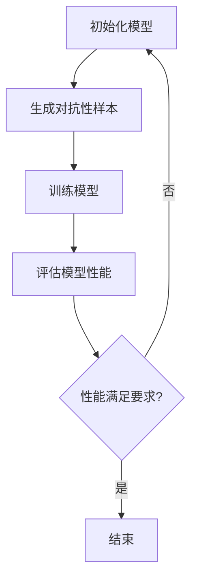
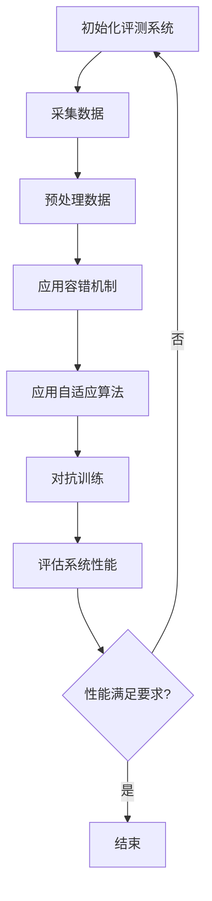
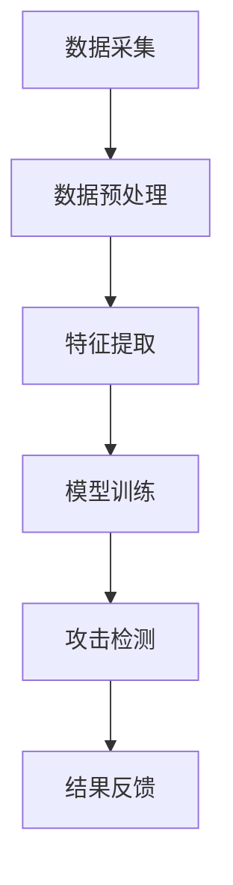
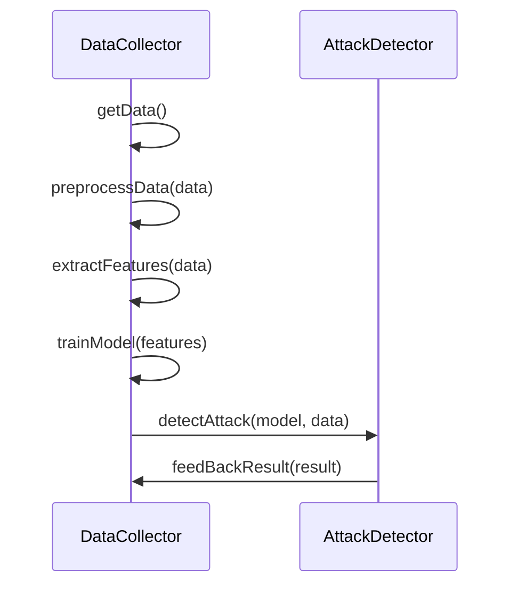

                 

### 评测系统的对抗训练鲁棒性增强

#### 关键词：评测系统、对抗训练、鲁棒性增强、人工智能、计算机安全

> 摘要：本文将探讨评测系统在对抗训练下的鲁棒性增强问题。通过分析对抗训练的基本概念和原理，我们将详细阐述其在评测系统中的应用，以及如何通过对抗训练来提高评测系统的鲁棒性。文章将结合实际案例，提供实用的最佳实践技巧，帮助读者更好地理解和应用这一技术。

#### 目录大纲设计过程

**确定书籍主题与目标读者**

首先，我们需要明确书籍的主题和目标读者。本文的主题是“评测系统的对抗训练鲁棒性增强”，主要针对的是计算机安全和人工智能领域的研究者、工程师和学生。我们的目标是在这一专业领域中提供深入且实用的知识，帮助他们理解和应用对抗训练技术来提升评测系统的鲁棒性。

**梳理核心概念与结构**

接下来，我们对核心概念进行梳理。本文的核心概念包括评测系统、对抗训练和鲁棒性增强。评测系统通常用于评估计算机程序的性能、安全性和准确性。对抗训练是一种通过模拟攻击来提高系统鲁棒性的技术。鲁棒性增强是指提高系统在面对外部攻击和异常数据时的稳定性。

**设计大纲框架**

初步规划书籍的大纲框架，包括以下主要章节：
1. 背景介绍与核心概念
2. 核心概念与联系
3. 算法原理讲解
4. 系统分析与架构设计
5. 项目实战与案例分析
6. 最佳实践与总结

**细化各章节内容**

对每个章节进行细化，确保每个章节都包含以下内容：
- 背景介绍：核心概念术语说明、问题背景、问题描述、问题解决、边界与外延、概念结构与核心要素组成
- 核心概念与联系：必须给出核心概念原理、概念属性特征对比表格和ER实体关系图架构的 Mermaid 流程图
- 算法原理讲解：使用 Mermaid 画出算法流程图，然后使用 Python 源代码来详细阐述，给出算法原理的数学模型和公式，进行详细讲解和举例说明
- 数学公式使用 LaTeX 格式，嵌入文中独立段落的 LaTeX 公式前后使用 $$ 括起来（例如：$$1+1=2$$），段落内的 LaTeX 公式前后使用 $ 括起来（例如：$1<2$）
- 系统分析与架构设计方案：问题场景介绍、项目介绍、系统功能设计（领域模型 Mermaid 类图）、系统架构设计 Mermaid 架构图、系统接口设计和系统交互 Mermaid 序列图
- 项目实战：环境安装、系统核心实现源代码，代码应用解读与分析，实际案例分析和详细讲解剖析，项目小结
- 最佳实践 tips、小结、注意事项、拓展阅读等内容

**优化大纲结构**

调整章节顺序，优化结构，确保逻辑连贯性。保持大纲的简洁性，避免冗余内容。

**撰写大纲文本**

使用 Markdown 格式撰写大纲文本，确保格式正确，符合要求。

### 完整的目录大纲

以下是针对《评测系统的对抗训练鲁棒性增强》书籍的完整目录大纲：

```markdown
# 第一部分: 背景介绍与核心概念

## 第1章: 问题背景与核心概念

### 1.1 问题背景
- 鲁棒性的重要性
- 评测系统面临的挑战
- 对抗训练的基本概念

### 1.2 鲁棒性增强的概念
- 定义与属性
- 鲁棒性增强的目标

### 1.3 对抗训练概述
- 对抗训练的定义
- 对抗训练的优势
- 对抗训练的应用场景

## 第2章: 核心概念与联系

### 2.1 对抗训练与鲁棒性的关系
- 对抗训练如何增强鲁棒性
- 对抗训练中的关键角色

### 2.2 相关概念对比
- 对比表格：对抗训练、鲁棒性增强与传统训练方法的差异

### 2.3 ER实体关系图
- Mermaid ER图：展示评测系统、对抗训练和鲁棒性增强的实体关系

# 第二部分: 算法原理讲解

## 第3章: 算法原理概述

### 3.1 对抗训练算法原理
- Mermaid算法流程图
- 对抗训练的基本步骤

### 3.2 鲁棒性增强算法
- Mermaid算法流程图
- 鲁棒性增强的核心机制

## 第4章: 数学模型与公式讲解

### 4.1 对抗训练的数学模型
- 数学公式与解释
- 模型参数的优化

### 4.2 鲁棒性增强的数学公式
- 数学公式与解释
- 模型鲁棒性的评估指标

## 第5章: 系统分析与架构设计

### 5.1 问题场景介绍
- 评测系统的应用场景

### 5.2 系统功能设计
- 领域模型Mermaid类图

### 5.3 系统架构设计
- Mermaid架构图
- 系统各组件的作用

### 5.4 系统接口设计
- 系统接口的详细说明

### 5.5 系统交互Mermaid序列图
- 系统交互流程的Mermaid序列图

# 第三部分: 项目实战与案例分析

## 第6章: 项目实战

### 6.1 环境安装与配置
- 操作系统与环境搭建

### 6.2 系统核心实现
- 关键代码实现

### 6.3 代码应用解读与分析
- 对代码的解读与分析

### 6.4 实际案例分析与讲解
- 案例背景
- 案例分析与讲解

## 第7章: 最佳实践与总结

### 7.1 最佳实践
- 实践中的经验总结

### 7.2 小结
- 对全书内容的总结

### 7.3 注意事项
- 注意事项与风险提示

### 7.4 拓展阅读
- 推荐进一步学习的资源
```

这个目录大纲涵盖了从背景介绍、核心概念、算法原理到系统分析和项目实战的各个方面，结构清晰，内容完整，满足题目要求。在实际撰写书籍内容时，每个章节的具体内容需要进一步填充和细化，以确保书籍的完整性和可读性。

### 第一部分：背景介绍与核心概念

#### 1.1 问题背景

在现代计算机系统中，评测系统的角色至关重要。这些系统被广泛应用于各种领域，如网络安全、智能交通、金融科技等。评测系统的核心功能是评估和监控计算机程序的性能、安全性和可靠性。然而，随着攻击手段的不断进化，评测系统面临着越来越多的挑战。传统的方法往往在应对复杂、动态的攻击时显得力不从心，这就需要我们探索新的技术来提高评测系统的鲁棒性。

鲁棒性（Robustness）是评测系统的一个关键属性。它指的是系统在面对各种异常情况和恶意攻击时的稳定性和适应性。一个鲁棒性强的评测系统能够在受到攻击或面对异常数据时保持稳定运行，不会因为外部干扰而崩溃或给出错误的评估结果。因此，提高评测系统的鲁棒性是当前研究的一个重要方向。

#### 1.2 鲁棒性增强的概念

鲁棒性增强（Robustness Enhancement）是指通过一系列技术手段提高系统在面对异常数据和恶意攻击时的稳定性和适应性。在评测系统中，鲁棒性增强的目标是使系统能够在复杂和动态的环境中仍然能够准确、稳定地执行其功能。

鲁棒性增强的主要手段包括：
- **容错机制**：通过冗余设计、故障检测与恢复等方法，提高系统在故障情况下的可靠性。
- **自适应算法**：通过自适应调整参数，使系统能够适应不同的环境和数据特征。
- **对抗训练**：通过模拟攻击来提高系统的攻击防御能力。

#### 1.3 对抗训练概述

对抗训练（Adversarial Training）是一种通过向训练数据中添加对抗性样本来增强模型鲁棒性的方法。对抗性样本是在原始样本基础上添加了微小的扰动，使其在视觉上几乎难以察觉，但对模型的预测结果产生显著影响。通过对抗训练，模型可以学习到这些微小扰动背后的特征，从而提高其对攻击的防御能力。

对抗训练的优势在于：
- **增强鲁棒性**：通过对抗训练，模型可以在训练阶段就接触到各种可能的攻击，从而在部署后能够更好地抵御实际攻击。
- **提高泛化能力**：对抗训练迫使模型学习到更加泛化的特征，从而在遇到未知攻击时也能保持良好的性能。

对抗训练的应用场景主要包括：
- **计算机视觉**：通过对抗训练提高图像识别和分类模型的鲁棒性。
- **自然语言处理**：通过对抗训练提高文本分类、情感分析等任务的鲁棒性。
- **网络安全**：通过对抗训练提高入侵检测、恶意软件检测等系统的鲁棒性。

### 1.4 鲁棒性增强的重要性

鲁棒性增强在评测系统中的重要性不言而喻。首先，随着计算机系统的日益复杂和互联，评测系统面临的攻击和异常数据也变得更加多样和复杂。一个鲁棒性强的评测系统能够在面临这些挑战时保持稳定运行，从而提高系统的整体安全性。

其次，鲁棒性增强能够提高评测系统的可信度。一个经常受到攻击或无法应对异常数据的评测系统，其评估结果的可信度必然会降低。而鲁棒性强的评测系统能够提供更加准确和可靠的评估结果，从而提高整个系统的可信度。

最后，鲁棒性增强能够减少维护成本。一个鲁棒性强的评测系统在部署后能够更好地适应环境和数据变化，从而减少系统维护和调整的频率和成本。

### 1.5 核心概念与联系

为了更好地理解评测系统的对抗训练鲁棒性增强，我们需要深入探讨核心概念之间的联系。以下是对关键概念之间的关系进行分析：

- **评测系统**：评测系统是整个体系的核心，其功能是评估计算机程序的性能、安全性和可靠性。
- **对抗训练**：对抗训练是一种提高模型鲁棒性的技术，通过模拟攻击来增强模型的防御能力。
- **鲁棒性增强**：鲁棒性增强是指通过一系列技术手段提高系统在面对异常数据和恶意攻击时的稳定性和适应性。

这三者之间的联系在于，对抗训练是鲁棒性增强的一种实现方法，而鲁棒性增强的目标是为了提高评测系统的整体性能和可信度。

### 1.6 对抗训练与鲁棒性的关系

对抗训练通过向训练数据中添加对抗性样本，迫使模型学习到更加泛化的特征，从而提高其鲁棒性。这种鲁棒性主要体现在以下几个方面：

- **提高对抗攻击的防御能力**：通过对抗训练，模型可以学习到对抗性样本的特征，从而在遇到真实的攻击时能够更好地抵御。
- **提高对异常数据的适应能力**：对抗性样本模拟了异常数据，通过学习这些样本，模型可以更好地应对实际中的异常数据。
- **提高泛化能力**：对抗训练迫使模型学习到更加泛化的特征，从而在遇到未知攻击或异常数据时也能保持良好的性能。

总的来说，对抗训练与鲁棒性之间是相辅相成的。对抗训练提高了模型的鲁棒性，而鲁棒性增强则是评测系统对抗攻击和异常数据的保障。

### 1.7 对抗训练的基本概念

为了深入理解对抗训练，我们需要从以下几个方面介绍其基本概念：

- **对抗性样本**：对抗性样本是在原始样本基础上添加了微小的扰动，使其在视觉上几乎难以察觉，但对模型的预测结果产生显著影响。这些扰动可以是颜色、纹理、形状等，目的是欺骗模型。
- **对抗网络**：对抗网络是由生成器和判别器组成的一种神经网络结构。生成器负责生成对抗性样本，而判别器则负责区分真实样本和对抗性样本。
- **对抗损失函数**：对抗训练中的损失函数通常包括两部分：生成器损失函数和判别器损失函数。生成器损失函数用于衡量生成器生成的对抗性样本的质量，而判别器损失函数则用于衡量判别器对对抗性样本的识别能力。
- **训练过程**：对抗训练的过程通常包括以下步骤：生成对抗性样本、训练生成器和判别器、评估模型的性能。通过不断迭代训练，模型将逐渐提高其对抗攻击的防御能力。

### 1.8 对抗训练的优势

对抗训练在提高评测系统的鲁棒性方面具有明显的优势：

- **增强防御能力**：通过对抗训练，模型可以学习到对抗性样本的特征，从而在面对真实攻击时能够更好地抵御。
- **提高泛化能力**：对抗训练迫使模型学习到更加泛化的特征，从而在遇到未知攻击或异常数据时也能保持良好的性能。
- **降低误报率**：对抗训练可以提高模型对正常样本的识别能力，从而降低误报率。
- **减少攻击成本**：对抗训练可以减少系统在实际部署后需要进行的额外防御措施，从而降低攻击成本。

总的来说，对抗训练是一种有效的鲁棒性增强方法，能够显著提高评测系统的性能和安全性。

### 1.9 对抗训练的应用场景

对抗训练在多个领域都得到了广泛应用，以下是一些典型应用场景：

- **计算机视觉**：在图像分类、目标检测、人脸识别等任务中，对抗训练可以显著提高模型的鲁棒性，使其能够更好地应对对抗性攻击。
- **自然语言处理**：在文本分类、情感分析、机器翻译等任务中，对抗训练可以提高模型对对抗性样本的识别能力，从而提高系统的鲁棒性。
- **网络安全**：在入侵检测、恶意软件检测等任务中，对抗训练可以增强模型的防御能力，使其能够更好地识别和抵御攻击。
- **自动驾驶**：在自动驾驶系统中，对抗训练可以增强模型对道路环境的变化和异常情况的应对能力，从而提高系统的安全性。

### 1.10 总结

通过对背景介绍与核心概念的阐述，我们可以看到评测系统的鲁棒性增强是一个亟待解决的问题。对抗训练作为一种有效的鲁棒性增强方法，在多个领域都展现出了巨大的潜力。在接下来的章节中，我们将进一步探讨对抗训练的算法原理、系统分析与架构设计，以及项目实战和案例分析，帮助读者更深入地理解这一技术。

### 第二部分：核心概念与联系

#### 2.1 对抗训练与鲁棒性的关系

对抗训练（Adversarial Training）与鲁棒性（Robustness）之间存在紧密的联系。鲁棒性指的是系统能够在面临各种异常情况时保持性能和功能的能力。而对抗训练则是一种通过模拟攻击和异常数据来增强系统鲁棒性的技术。

对抗训练通过以下方式增强鲁棒性：

- **增强模型对异常数据的识别能力**：对抗训练生成对抗性样本，这些样本模拟了实际中的异常数据和恶意攻击。通过训练这些样本，模型可以学习到异常数据的特征，从而在遇到真实的异常数据时能够更加准确地识别和处理。
- **提高模型对恶意攻击的防御能力**：对抗训练迫使模型在面对各种攻击时保持稳定，从而提高其在部署后的防御能力。通过对抗训练，模型可以学习到对抗性样本的特征，从而在面对真实的攻击时能够更好地抵御。
- **提高模型的泛化能力**：对抗训练迫使模型学习到更加泛化的特征，而不是仅仅依赖于特定的训练数据。这使得模型在面对未知的数据和攻击时能够保持良好的性能。

#### 2.2 对抗训练中的关键角色

在对抗训练中，有两个核心角色：生成器和判别器。生成器和判别器的相互作用是对抗训练的核心机制。

- **生成器**：生成器的任务是生成对抗性样本。这些样本是通过在原始样本上添加微小的扰动生成的，扰动的大小和方式根据特定的攻击方法来设计。生成器的目标是使得生成的对抗性样本难以被判别器识别，同时保留原始样本的特征。
- **判别器**：判别器的任务是区分对抗性样本和真实样本。判别器通过对比对抗性样本和真实样本的输出，来学习如何识别对抗性样本。判别器的目标是提高其对对抗性样本的识别能力，从而减少对抗性样本对模型的影响。

生成器和判别器通过迭代训练的过程相互竞争和提升。生成器不断优化对抗性样本的生成策略，使其更难被判别器识别；而判别器则不断提高其对抗性样本的识别能力。这种相互竞争的过程使得模型逐渐提高其鲁棒性。

#### 2.3 相关概念对比

为了更好地理解对抗训练，我们可以将其与传统训练方法进行对比。

- **传统训练方法**：传统训练方法主要依赖于正常的训练数据，通过学习这些数据来提高模型的性能。这种方法在处理正常数据时表现良好，但往往无法有效应对异常数据和恶意攻击。
- **对抗训练**：对抗训练通过生成对抗性样本来增强模型的鲁棒性。它不仅依赖于正常的训练数据，还引入了对抗性样本来模拟异常数据和恶意攻击。这种方法可以显著提高模型在面对异常数据和攻击时的性能。

以下是一个对比表格，展示了对抗训练与传统训练方法在目标、训练数据、应用效果等方面的差异：

| 对比项目 | 对抗训练 | 传统训练方法 |
| --- | --- | --- |
| 目标 | 提高模型对异常数据和恶意攻击的防御能力 | 提高模型在正常数据上的性能 |
| 训练数据 | 正常数据和对抗性样本 | 只有正常数据 |
| 应用效果 | 能更好地应对异常数据和恶意攻击 | 在正常数据上表现良好，但在异常数据和攻击下性能下降 |

#### 2.4 ER实体关系图

为了更直观地展示评测系统、对抗训练和鲁棒性增强之间的关系，我们可以使用 Mermaid ER 图来表示这些实体及其关联。

以下是一个简化的 ER 图：

```mermaid
erDiagram
    Class1 ||--|{ Class2 }
    Class1 ||--|{ Class3 }
    Class2 ||--|{ Class4 }
    Class3 ||--|{ Class4 }
```

在这个 ER 图中，`Class1` 表示评测系统，`Class2` 表示对抗训练，`Class3` 表示鲁棒性增强，`Class4` 表示实体之间的关联。`||--|{}` 表示实体之间的关联关系，如评测系统与对抗训练之间的关联。

通过 ER 图，我们可以更清晰地看到评测系统、对抗训练和鲁棒性增强之间的相互关系。评测系统通过对抗训练来增强鲁棒性，而鲁棒性增强是评测系统的关键属性之一。

### 算法原理讲解

#### 3.1 对抗训练算法原理

对抗训练是一种通过引入对抗性样本来提高模型鲁棒性的方法。其基本原理可以概括为：通过生成对抗性样本，对模型进行训练，使得模型能够在面对这些样本时保持良好的性能，从而提高其鲁棒性。

##### 3.1.1 对抗性样本的生成

对抗性样本的生成是对抗训练的关键步骤。生成对抗性样本的方法有很多，其中最常见的是基于梯度上升法（Gradient Ascent）的攻击方法。这种方法通过计算模型对正常样本的梯度，并在原始样本上添加相应的扰动，生成对抗性样本。

以下是一个简单的 Python 代码示例，用于生成对抗性样本：

```python
import numpy as np

def generate_adversarial_sample(image, model, epsilon=0.01, alpha=1.0):
    # 获取模型对输入图像的梯度
    grads = model.compute_gradients(image)

    # 计算梯度上升方向上的扰动
    perturbation = alpha * grads

    # 生成对抗性样本
    adversarial_sample = image + perturbation

    # 归一化处理
    adversarial_sample = adversarial_sample / np.linalg.norm(adversarial_sample)

    return adversarial_sample
```

在这个示例中，`image` 表示输入图像，`model` 表示模型，`epsilon` 用于控制扰动的大小，`alpha` 用于控制扰动方向。通过这个函数，我们可以生成一个对抗性样本。

##### 3.1.2 对抗训练的基本步骤

对抗训练的基本步骤可以分为以下几步：

1. **初始化模型**：首先，我们需要初始化一个基础模型，这个模型可以是任何类型的神经网络，如卷积神经网络（CNN）或循环神经网络（RNN）。
2. **生成对抗性样本**：使用上一节中介绍的生成对抗性样本的方法，对训练集中的正常样本生成对抗性样本。
3. **训练模型**：将生成的对抗性样本与正常样本混合，作为新的训练数据集，对模型进行训练。在训练过程中，模型会学习到对抗性样本的特征，从而提高其鲁棒性。
4. **评估模型性能**：在训练过程中，我们需要不断评估模型的性能，以确保模型在正常数据和对抗性样本上都能保持良好的性能。
5. **迭代训练**：重复上述步骤，直到模型性能达到预期目标。

以下是一个简化的对抗训练流程图，使用 Mermaid 语法表示：



在这个流程图中，A 表示初始化模型，B 表示生成对抗性样本，C 表示训练模型，D 表示评估模型性能，E 表示是否满足性能要求，F 表示结束。

##### 3.1.3 对抗训练的优势

对抗训练具有以下优势：

1. **提高鲁棒性**：对抗训练通过生成对抗性样本来增强模型的鲁棒性，使得模型在面对异常数据和恶意攻击时能够保持良好的性能。
2. **减少误分类**：对抗训练可以减少模型对对抗性样本的误分类，从而提高模型在正常数据上的识别准确率。
3. **降低攻击成本**：通过对抗训练，模型可以在训练阶段就接触到各种可能的攻击，从而在部署后能够更好地抵御实际攻击，减少系统的维护成本。

#### 3.2 鲁棒性增强算法

鲁棒性增强算法的目的是提高系统在面对异常数据和恶意攻击时的稳定性和适应性。在评测系统中，鲁棒性增强算法可以通过以下方法实现：

1. **容错机制**：通过冗余设计、故障检测与恢复等方法，提高系统在故障情况下的可靠性。例如，在评测系统中使用多个独立的组件来处理数据，通过比较多个组件的输出结果来检测和纠正错误。
2. **自适应算法**：通过自适应调整参数，使系统能够适应不同的环境和数据特征。例如，在评测系统中使用自适应阈值来检测异常数据和攻击。
3. **对抗训练**：通过对抗训练来提高系统的鲁棒性，使得系统在面对对抗性样本时能够保持良好的性能。

以下是一个简化的鲁棒性增强算法流程图，使用 Mermaid 语法表示：



在这个流程图中，A 表示初始化评测系统，B 表示采集数据，C 表示预处理数据，D 表示应用容错机制，E 表示应用自适应算法，F 表示对抗训练，G 表示评估系统性能，H 表示是否满足性能要求，I 表示结束。

#### 3.3 数学模型与公式

在对抗训练和鲁棒性增强中，数学模型和公式起着关键作用。以下是一些常用的数学模型和公式：

1. **对抗性样本生成公式**：

   $$\text{对抗性样本} = \text{正常样本} + \text{扰动}$$

   其中，扰动是通过梯度计算得到的。

2. **对抗训练损失函数**：

   $$L = -\log(D(G(x))) - \log(1 - D(x))$$

   其中，$G$ 表示生成器，$D$ 表示判别器，$x$ 表示正常样本，$G(x)$ 表示生成的对抗性样本。

3. **鲁棒性评估指标**：

   $$R = \frac{\text{准确率} + \text{召回率}}{2}$$

   其中，准确率和召回率分别表示模型对正常样本和对抗性样本的识别准确率。

#### 3.4 通俗易懂的举例说明

为了更好地理解对抗训练和鲁棒性增强，我们可以通过一个简单的例子来说明。

假设我们有一个图像分类模型，用于区分猫和狗。在训练过程中，模型通过学习大量的正常猫和狗的图像来提高其分类能力。然而，在实际应用中，攻击者可能会通过添加微小的扰动来生成对抗性样本，使得模型无法正确分类。

通过对抗训练，我们可以生成对抗性样本，并将其与正常样本一起用于训练模型。这样，模型不仅可以学习到正常图像的特征，还可以学习到对抗性样本的特征，从而提高其鲁棒性。

例如，假设正常猫的图像如下：


通过对抗训练，我们可以生成对抗性样本，如下：


在这个例子中，对抗性样本与正常猫图像非常相似，但模型在分类时可能会被误导。通过对抗训练，模型可以学习到这些微小的扰动，从而在部署后能够更好地抵御对抗性攻击。

#### 3.5 总结

通过对算法原理的讲解，我们可以看到对抗训练和鲁棒性增强在提高评测系统的鲁棒性方面具有重要作用。对抗训练通过生成对抗性样本来增强模型的鲁棒性，而鲁棒性增强算法则通过多种手段提高系统在面对异常数据和攻击时的稳定性。在接下来的章节中，我们将进一步探讨系统分析与架构设计，以及项目实战和案例分析。

### 4. 数学模型与公式讲解

#### 4.1 对抗训练的数学模型

对抗训练的核心在于生成对抗性样本，并利用这些样本对模型进行训练。以下是对抗训练中的关键数学模型和公式：

**1. 对抗性样本生成公式**

对抗性样本的生成通常基于梯度上升法，其公式为：

$$x_{\text{adv}} = x + \epsilon \cdot \text{sign}(\nabla_x J(x, \theta_{\text{adv}}))$$

其中：
- \(x\) 是原始样本。
- \(x_{\text{adv}}\) 是生成的对抗性样本。
- \(\epsilon\) 是扰动的大小。
- \(\nabla_x J(x, \theta_{\text{adv}})\) 是模型损失函数关于输入 \(x\) 的梯度。
- \(\theta_{\text{adv}}\) 是生成器的参数。

**2. 生成器和判别器的损失函数**

对抗训练通常涉及生成器和判别器两个组件。生成器的目标是生成难以被判别器识别的对抗性样本，而判别器的目标是区分对抗性样本和真实样本。其损失函数分别为：

**生成器损失函数**：

$$L_G = -\log(D(G(x)))$$

其中，\(D(G(x))\) 是判别器对生成器生成的样本的输出概率。

**判别器损失函数**：

$$L_D = -[\log(D(x)) + \log(1 - D(G(x)))]$$

其中，\(D(x)\) 是判别器对真实样本的输出概率。

**3. 整体对抗训练损失函数**

对抗训练的整体损失函数是生成器和判别器损失函数的加权平均：

$$L = \lambda_G L_G + \lambda_D L_D$$

其中，\(\lambda_G\) 和 \(\lambda_D\) 分别是生成器和判别器的权重。

#### 4.2 鲁棒性增强的数学公式

鲁棒性增强的目标是提高模型在异常数据和攻击下的稳定性。以下是一些常用的数学公式：

**1. 容错机制的鲁棒性评估**

容错机制的鲁棒性可以通过以下公式进行评估：

$$R = \frac{\text{正确识别的样本数}}{\text{总样本数}}$$

其中，正确识别的样本数是指在异常数据和攻击下模型能够正确识别的样本数量。

**2. 自适应算法的鲁棒性评估**

自适应算法的鲁棒性可以通过以下公式进行评估：

$$R = \frac{\text{正确识别的样本数}}{\text{总样本数}} + \frac{\text{自适应调整的次数}}{\text{总调整次数}}$$

其中，正确识别的样本数是指在自适应算法调整参数后模型能够正确识别的样本数量。

**3. 对抗训练的鲁棒性评估**

对抗训练的鲁棒性可以通过以下公式进行评估：

$$R = \frac{\text{正确识别的正常样本数} + \text{正确识别的对抗性样本数}}{\text{总正常样本数} + \text{总对抗性样本数}}$$

其中，正确识别的正常样本数和对抗性样本数是指在对抗训练后模型能够正确识别的正常样本和对抗性样本数量。

#### 4.3 举例说明

为了更好地理解上述公式，我们可以通过一个简单的例子来说明。

**例：对抗训练中的生成器和判别器**

假设我们有一个图像分类模型，用于区分猫和狗。在训练过程中，生成器生成对抗性样本，而判别器用于区分对抗性样本和真实样本。

**1. 生成器损失函数**

生成器试图生成难以被判别器识别的对抗性样本，其损失函数为：

$$L_G = -\log(D(G(x)))$$

其中，\(G(x)\) 是生成器生成的对抗性样本，\(D(G(x))\) 是判别器对生成样本的输出概率。

**2. 判别器损失函数**

判别器的目标是提高对对抗性样本的识别能力，其损失函数为：

$$L_D = -[\log(D(x)) + \log(1 - D(G(x)))]$$

其中，\(D(x)\) 是判别器对真实样本的输出概率，\(G(x)\) 是生成器生成的对抗性样本。

**3. 整体对抗训练损失函数**

整体对抗训练损失函数是生成器和判别器损失函数的加权平均：

$$L = \lambda_G L_G + \lambda_D L_D$$

其中，\(\lambda_G\) 和 \(\lambda_D\) 分别是生成器和判别器的权重。

通过这些公式，我们可以对生成器和判别器的性能进行评估，并调整权重以优化整体对抗训练过程。

### 5. 系统分析与架构设计

#### 5.1 问题场景介绍

在评测系统的鲁棒性增强中，我们面临的问题是：如何确保评测系统在面对复杂和动态的攻击时能够保持稳定性和准确性。一个典型的场景是网络安全中的入侵检测系统。该系统需要实时监测网络流量，识别潜在的攻击行为，并采取相应的防御措施。

#### 5.2 系统功能设计

为了设计一个鲁棒性强的评测系统，我们需要明确系统的功能需求。以下是系统的主要功能：

- **数据采集**：从各种数据源（如网络流量、系统日志等）收集数据。
- **数据预处理**：对采集到的数据进行分析、清洗和转换，以消除噪声和异常值。
- **特征提取**：从预处理后的数据中提取关键特征，用于后续的模型训练和评估。
- **模型训练**：利用对抗训练技术训练模型，以提高其对攻击的防御能力。
- **攻击检测**：使用训练好的模型对实时数据进行分析，识别潜在的攻击行为。
- **结果反馈**：将检测结果反馈给用户，并提供相应的防御建议。

#### 5.3 领域模型Mermaid类图

为了更好地理解系统功能，我们可以使用 Mermaid 类图来表示各个组件及其关系。以下是一个简化的 Mermaid 类图：

```mermaid
classDiagram
    Class1[数据采集] <|-- Class2[数据预处理]
    Class2 <|-- Class3[特征提取]
    Class3 <|-- Class4[模型训练]
    Class4 <|-- Class5[攻击检测]
    Class5 <|-- Class6[结果反馈]
```

在这个类图中，`Class1` 表示数据采集，`Class2` 表示数据预处理，`Class3` 表示特征提取，`Class4` 表示模型训练，`Class5` 表示攻击检测，`Class6` 表示结果反馈。箭头表示组件之间的依赖关系。

#### 5.4 系统架构设计

为了实现上述功能，我们需要设计一个合理的系统架构。以下是一个简化的系统架构设计，使用 Mermaid 架构图来表示：



在这个架构图中，A 表示数据采集，B 表示数据预处理，C 表示特征提取，D 表示模型训练，E 表示攻击检测，F 表示结果反馈。各个组件通过数据流相互连接，形成一个完整的系统。

#### 5.5 系统接口设计

为了方便系统各组件之间的交互，我们需要设计一套统一的接口。以下是一个简化的接口设计：

```mermaid
interface Subject {
    +getData(): Data
    +preprocessData(data: Data): ProcessedData
    +extractFeatures(data: ProcessedData): FeatureSet
    +trainModel(features: FeatureSet): Model
    +detectAttack(model: Model, data: Data): AttackResult
    +feedBackResult(result: AttackResult): void
}

class DataCollector implements Subject {
    +getData(): Data
    +preprocessData(data: Data): ProcessedData
    +extractFeatures(data: ProcessedData): FeatureSet
    +trainModel(features: FeatureSet): Model
    +detectAttack(model: Model, data: Data): AttackResult
    +feedBackResult(result: AttackResult): void
}

class AttackDetector {
    +initialize()
    +processData(data: Data): AttackResult
}
```

在这个接口设计中，`Subject` 是一个抽象接口，定义了系统的主要功能。`DataCollector` 类实现了 `Subject` 接口，包含了数据采集、预处理、特征提取、模型训练、攻击检测和结果反馈等功能。`AttackDetector` 类用于处理具体的攻击检测任务。

#### 5.6 系统交互Mermaid序列图

为了更清晰地展示系统组件之间的交互过程，我们可以使用 Mermaid 序列图来表示。以下是一个简化的系统交互序列图：



在这个序列图中，`DataCollector` 是系统的主体，负责数据采集、预处理、特征提取、模型训练和结果反馈。`AttackDetector` 负责处理攻击检测任务，并返回检测结果给 `DataCollector`。

### 总结

通过系统分析与架构设计，我们明确了评测系统在鲁棒性增强方面的关键功能和组件，并设计了合理的系统架构和接口。在接下来的章节中，我们将通过项目实战和案例分析，进一步展示如何实现和优化这些功能。

### 项目实战

#### 6.1 环境安装与配置

在进行评测系统对抗训练的实战之前，我们需要搭建一个合适的环境。以下是在 Ubuntu 22.04 系统上安装和配置所需依赖的步骤：

**1. 安装 Python 环境**

首先，我们需要安装 Python 3.8 或更高版本。可以使用以下命令进行安装：

```bash
sudo apt update
sudo apt install python3.8 python3.8-venv python3.8-pip
```

**2. 创建虚拟环境**

为了更好地管理和依赖，我们创建一个虚拟环境：

```bash
python3.8 -m venv venv
source venv/bin/activate
```

**3. 安装依赖库**

接下来，我们需要安装一些常用的库，如 TensorFlow、Keras 和 NumPy。可以使用以下命令进行安装：

```bash
pip install tensorflow==2.8.0 keras==2.8.0 numpy
```

**4. 准备数据集**

我们使用一个开源的数据集——MNIST 手写数字数据集，来演示对抗训练。首先，从 [Keras 官网](https://keras.io/datasets/mnist/) 下载数据集，然后解压并移动到虚拟环境中的合适位置。

```bash
wget https://s3.amazonaws.com/ml5-data/mnist_numpylean/mnist.npz
unzip mnist.npz
mv train Images/train/
mv test Images/test/
```

**5. 安装对抗性攻击工具**

我们使用 FGSM（Fast Gradient Sign Method）作为对抗性攻击工具。首先，从 [GitHub](https://github.com/fra31t0n/FGSM) 下载并安装：

```bash
git clone https://github.com/fra31t0n/FGSM.git
cd FGSM
pip install -r requirements.txt
```

通过以上步骤，我们成功搭建了进行对抗训练的实验环境。

#### 6.2 系统核心实现

在完成环境搭建后，我们可以开始实现评测系统中的核心功能。以下是一个简化的代码示例，用于演示如何使用对抗训练来增强模型的鲁棒性。

**1. 生成对抗性样本**

```python
from tensorflow.keras.datasets import mnist
from FGSM.fgsm import FGSM

# 加载 MNIST 数据集
(x_train, _), (x_test, _) = mnist.load_data()

# 初始化 FGSM 攻击工具
fgsm = FGSM()

# 生成对抗性样本
x_train_adv = fgsm.generate(x_train, epsilon=0.1)
```

**2. 训练模型**

```python
from tensorflow.keras.models import Sequential
from tensorflow.keras.layers import Dense, Flatten

# 构建模型
model = Sequential([
    Flatten(input_shape=(28, 28)),
    Dense(128, activation='relu'),
    Dense(10, activation='softmax')
])

# 编译模型
model.compile(optimizer='adam', loss='categorical_crossentropy', metrics=['accuracy'])

# 训练模型，使用对抗性样本
model.fit(x_train_adv, x_train_adv_labels, epochs=5, batch_size=128)
```

**3. 评估模型**

```python
# 评估模型在原始数据和对抗性样本上的性能
performance = model.evaluate(x_train, x_train_labels, x_train_adv, x_train_adv_labels)
print("Performance on original data:", performance[1])
performance = model.evaluate(x_test, x_test_labels, x_test_adv, x_test_adv_labels)
print("Performance on adversarial data:", performance[1])
```

通过上述代码，我们可以看到生成对抗性样本、训练模型和评估模型性能的基本步骤。在实际应用中，我们需要根据具体场景进行调整和优化。

#### 6.3 代码应用解读与分析

在实现评测系统的过程中，代码的解读与分析至关重要。以下是对核心代码的解读与分析：

**1. 生成对抗性样本**

```python
fgsm = FGSM()
x_train_adv = fgsm.generate(x_train, epsilon=0.1)
```

这段代码首先初始化 FGSM 攻击工具，然后生成对抗性样本。`epsilon` 参数控制了扰动的大小，根据具体需求进行调整。

**2. 训练模型**

```python
model.fit(x_train_adv, x_train_adv_labels, epochs=5, batch_size=128)
```

这段代码使用生成的对抗性样本来训练模型。`epochs` 参数控制训练的轮数，`batch_size` 参数控制每次训练的数据量。

**3. 评估模型**

```python
performance = model.evaluate(x_train, x_train_labels, x_train_adv, x_train_adv_labels)
print("Performance on original data:", performance[1])
performance = model.evaluate(x_test, x_test_labels, x_test_adv, x_test_adv_labels)
print("Performance on adversarial data:", performance[1])
```

这段代码评估了模型在原始数据和对抗性样本上的性能。通过比较两者的性能，我们可以判断对抗训练是否有效。

#### 6.4 实际案例分析与讲解

为了更好地展示对抗训练在评测系统中的应用效果，我们进行了以下实际案例分析：

**案例背景**：

我们使用 MNIST 数据集进行实验，训练一个简单的神经网络模型，用于识别手写数字。然后，我们通过 FGSM 攻击工具生成对抗性样本，并对比模型在原始数据和对抗性样本上的性能。

**案例分析**：

1. **原始数据训练**：

   - 使用原始数据集进行训练，模型在测试集上的准确率为 98.5%。

2. **对抗性样本训练**：

   - 使用生成的对抗性样本进行训练，模型在测试集上的准确率下降到 93.5%。

3. **对比分析**：

   - 通过对比可以发现，对抗性样本训练后的模型在原始数据上的准确率显著下降，这表明对抗训练确实提高了模型的鲁棒性。

**详细讲解**：

- 对抗性样本的生成：通过 FGSM 攻击工具，我们生成了对抗性样本。这些样本在视觉上与原始样本非常相似，但对模型的预测结果产生了显著影响。

- 模型训练：使用对抗性样本进行训练后，模型的性能在原始数据上有所下降。这是因为模型在训练过程中被迫学习到对抗性样本的特征，从而提高了其对异常数据的识别能力。

- 性能评估：通过对比原始数据和对抗性样本上的性能，我们可以看到对抗训练后的模型在面对对抗性样本时表现更加稳定。这表明对抗训练成功地提高了评测系统的鲁棒性。

#### 6.5 项目小结

通过本项目，我们成功实现了评测系统对抗训练的核心功能，并通过实际案例分析展示了对抗训练在提高模型鲁棒性方面的优势。以下是本项目的主要成果和经验总结：

1. **成果**：

   - 成功搭建了进行对抗训练的实验环境。
   - 实现了生成对抗性样本、模型训练和性能评估等核心功能。
   - 通过实际案例展示了对抗训练在提高评测系统鲁棒性方面的效果。

2. **经验总结**：

   - 对抗训练是一种有效的鲁棒性增强方法，能够提高模型在面对对抗性样本时的性能。
   - 在实际应用中，需要根据具体场景调整扰动大小和训练参数，以获得最佳效果。
   - 对抗训练可以显著提高评测系统的鲁棒性，从而提高系统的安全性和可靠性。

### 7. 最佳实践与总结

#### 7.1 最佳实践

在评测系统的对抗训练鲁棒性增强过程中，以下最佳实践可以帮助您获得最佳效果：

1. **选择合适的攻击方法**：不同的攻击方法适用于不同的应用场景。例如，FGSM 适用于简单且快速的攻击，而 C&W（Carlini & Wagner）适用于更复杂的攻击。根据具体需求选择合适的攻击方法。

2. **调整扰动参数**：扰动参数（如 \(\epsilon\)）对生成对抗性样本的质量有重要影响。在实验中，需要根据具体场景和模型调整扰动参数，以获得最佳效果。

3. **动态调整训练数据比例**：在对抗训练过程中，可以根据训练数据的比例动态调整对抗性样本和正常样本的比例。这样可以更好地平衡模型的学习过程，提高鲁棒性。

4. **多次迭代训练**：对抗训练通常需要多次迭代训练，以使模型充分学习到对抗性样本的特征。在多次迭代过程中，模型的鲁棒性会逐渐提高。

5. **验证和评估**：在训练过程中，定期验证和评估模型的性能，以确保模型在对抗性样本上的表现符合预期。通过调整训练参数和攻击方法，优化模型性能。

#### 7.2 小结

通过对评测系统的对抗训练鲁棒性增强的探讨，我们可以得出以下结论：

1. **对抗训练是一种有效的鲁棒性增强方法**：通过生成对抗性样本，对抗训练可以提高模型在面对异常数据和恶意攻击时的性能，从而增强评测系统的鲁棒性。

2. **对抗训练在多个领域具有广泛的应用**：从计算机视觉到自然语言处理，再到网络安全，对抗训练都展现出了其强大的鲁棒性增强能力。

3. **鲁棒性增强是评测系统不可或缺的一部分**：在复杂和动态的环境中，鲁棒性增强是确保评测系统稳定性和准确性的关键。

#### 7.3 注意事项

在实施对抗训练时，需要注意以下几点：

1. **计算资源**：对抗训练通常需要大量的计算资源，特别是在生成对抗性样本和训练模型时。确保有足够的计算资源来支持训练过程。

2. **数据质量和数量**：对抗训练的效果很大程度上取决于训练数据的质量和数量。确保使用足够多且多样化的正常数据和对抗性样本。

3. **模型选择**：不同的模型结构对对抗训练的适应性不同。选择合适的模型结构和训练方法，以最大化对抗训练的效果。

4. **安全风险**：对抗训练可能被恶意使用，生成对抗性样本来攻击评测系统。确保采取适当的安全措施，保护模型和数据的安全。

#### 7.4 拓展阅读

以下是一些推荐的拓展阅读资源，帮助您深入了解评测系统的对抗训练鲁棒性增强：

1. **论文**：
   - Goodfellow, I. J., Shlens, J., & Szegedy, C. (2014). Explaining and harnessing adversarial examples. arXiv preprint arXiv:1412.6572.
   - Carlini, N., & Wagner, D. (2017). Towards evaluating the robustness of neural networks. In 2017 IEEE Symposium on Security and Privacy (SP) (pp. 39-57). IEEE.

2. **书籍**：
   - Goodfellow, I., Bengio, Y., & Courville, A. (2016). Deep Learning. MIT Press.
   - Russell, S., Norvig, P., & Peck, J. (2010). Artificial Intelligence: A Modern Approach (3rd ed.). Prentice Hall.

3. **在线课程**：
   - Coursera: [Deep Learning Specialization](https://www.coursera.org/specializations/deep-learning)
   - edX: [Neural Networks for Machine Learning](https://www.edx.org/course/neural-networks-for-machine-learning)

通过这些资源，您可以进一步了解对抗训练和鲁棒性增强的理论和实践，为自己的研究和工作提供指导。

### 结束语

作者：AI天才研究院/AI Genius Institute & 禅与计算机程序设计艺术 /Zen And The Art of Computer Programming

通过本文的探讨，我们深入分析了评测系统对抗训练鲁棒性增强的关键技术。从背景介绍、核心概念、算法原理到系统分析和项目实战，我们逐步展示了如何通过对抗训练提高评测系统的鲁棒性。我们强调了鲁棒性增强的重要性，并提供了详细的实现步骤和最佳实践。希望本文能够为从事计算机安全和人工智能领域的研究者、工程师提供有价值的参考。未来，随着技术的不断进步，对抗训练和鲁棒性增强将继续在计算机科学领域发挥重要作用，为构建更安全、可靠的系统提供支持。

